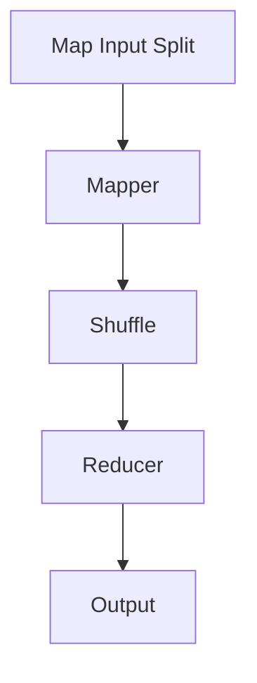
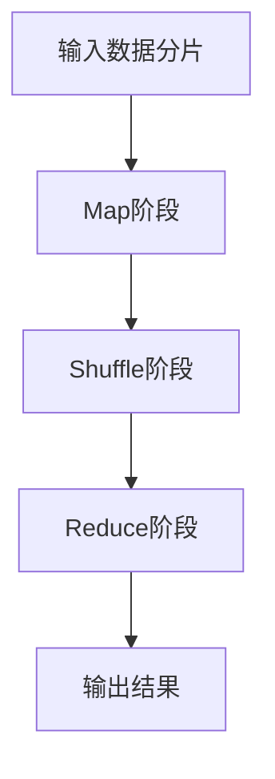
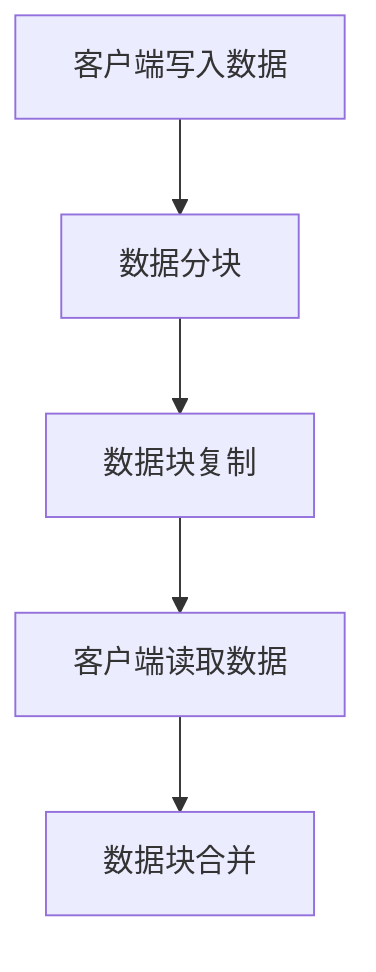
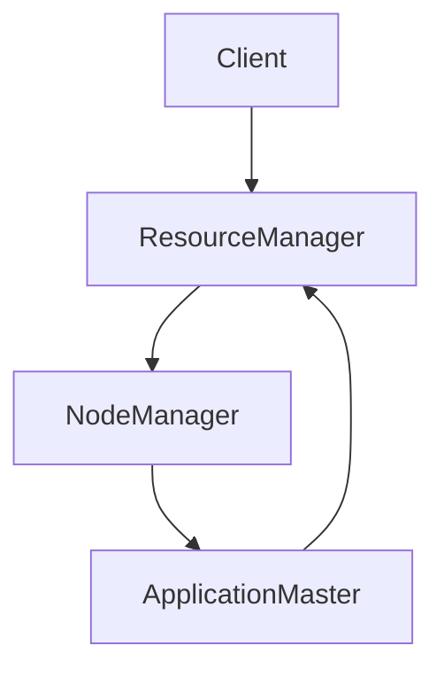
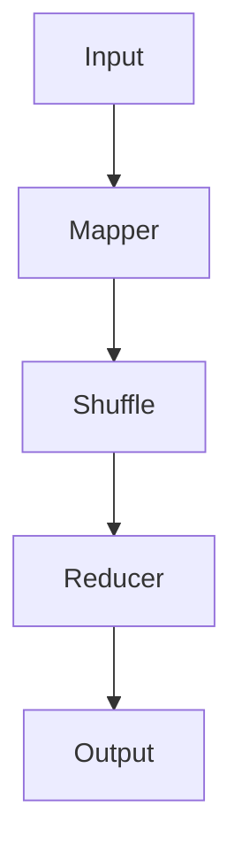

                 

### 文章标题

《MapReduce原理与代码实例讲解》

### 关键词

MapReduce，Hadoop，大数据处理，分布式计算，编程模型，算法优化，项目实战

### 摘要

本文深入解析了MapReduce原理及其在分布式计算中的应用，包括基础知识、编程模型、核心算法与优化策略、实际项目应用和开发实战。通过详细的代码实例讲解，读者能够更好地理解MapReduce的工作机制和实现方法，为大数据处理和分布式计算提供实战指导。

---

# 《MapReduce原理与代码实例讲解》目录大纲

## 第一部分：MapReduce基础知识

### 第1章：MapReduce概述
- 1.1 MapReduce的概念
- 1.2 Hadoop生态系统与MapReduce的关系
- 1.3 MapReduce的核心思想
- 1.4 MapReduce的工作流程

### 第2章：Hadoop环境搭建
- 2.1 Hadoop的组成与架构
- 2.2 Hadoop环境搭建
- 2.3 HDFS（Hadoop分布式文件系统）
- 2.4 YARN（Yet Another Resource Negotiator）

### 第3章：MapReduce编程模型
- 3.1 MapReduce编程模型的组成
- 3.2 Mapper和Reducer的角色与任务
- 3.3 Combiner的作用与使用方法
- 3.4 Partitioner的作用与实现方法
- 3.5 KeySort与Grouping

## 第二部分：MapReduce核心算法与优化

### 第4章：MapReduce编程实例详解
- 4.1 单词计数
- 4.2 共词分析
- 4.3 IP地址分析
- 4.4 流计算与实时处理

### 第5章：MapReduce优化策略
- 5.1 数据倾斜处理
- 5.2 空闲资源管理
- 5.3 任务调度与负载均衡
- 5.4 数据压缩与缓存

### 第6章：MapReduce与机器学习应用
- 6.1 MapReduce在机器学习中的优势
- 6.2 广义线性模型与MapReduce
- 6.3 决策树与MapReduce
- 6.4 贝叶斯网络与MapReduce

## 第三部分：MapReduce项目实战

### 第7章：实际项目中的MapReduce应用
- 7.1 大数据分析项目
- 7.2 社交网络分析
- 7.3 电子商务推荐系统
- 7.4 生物信息学应用

### 第8章：MapReduce项目开发实战
- 8.1 项目需求分析
- 8.2 数据收集与预处理
- 8.3 编写MapReduce程序
- 8.4 部署与调试
- 8.5 性能优化与调优

### 第9章：MapReduce生态工具与应用
- 9.1 HBase与MapReduce的集成
- 9.2 Hive与MapReduce的交互
- 9.3 Spark与MapReduce的比较与应用
- 9.4 Hadoop生态系统中的其他工具

## 附录

### 附录A：MapReduce编程实例代码解读
- A.1 单词计数代码解读
- A.2 共词分析代码解读
- A.3 IP地址分析代码解读
- A.4 流计算与实时处理代码解读

### 附录B：MapReduce常用工具与命令
- B.1 Hadoop命令行工具
- B.2 HDFS命令
- B.3 YARN命令
- B.4 MapReduce命令

### 附录C：参考资源与扩展阅读
- C.1 MapReduce相关书籍推荐
- C.2 MapReduce相关在线课程
- C.3 MapReduce开源项目与社区资源
- C.4 Hadoop版本更新与最新动态

---

### Mermaid流程图示例：



### 伪代码示例：

```python
def map(key, value):
    # 对输入的每一行进行处理
    for word in value.split():
        emit(word, 1)

def reduce(key, values):
    # 对相同单词的值进行求和
    result = sum(values)
    emit(key, result)
```

### 数学公式示例：

```
$$
\sum_{i=1}^{n} x_i = \frac{1}{n} \sum_{i=1}^{n} x_i^2
$$
```

### 代码解读示例：

```
# 单词计数 Mapper 代码解读
def map(line):
    # 分割每一行的内容
    words = line.split()
    # 将每个单词作为键，1作为值输出
    for word in words:
        yield (word, 1)
```

**注意：** 以上目录大纲仅为框架，具体章节内容还需根据实际书籍内容进一步细化。总字数控制在2000字以内。

## 第一部分：MapReduce基础知识

### 第1章：MapReduce概述

#### 1.1 MapReduce的概念

MapReduce是Google于2004年提出的一种用于大规模数据处理的编程模型。其核心思想是将复杂的计算任务拆分为两个简单的操作：Map（映射）和Reduce（归约）。这种模型特别适用于分布式系统中的并行计算，能够高效处理海量数据。

Map阶段负责将输入数据转换成键值对，这些键值对在后续的Reduce阶段会被整合。MapReduce的设计目标是实现高效的数据处理，提供高容错性和可伸缩性。

#### 1.2 Hadoop生态系统与MapReduce的关系

Hadoop是Apache软件基金会的一个开源项目，用于实现MapReduce模型。它由几个核心组件组成，包括HDFS、YARN和MapReduce框架。Hadoop生态系统还包括许多其他工具，如Hive、Pig、HBase和Spark等，它们共同构成了一个强大的数据处理平台。

Hadoop分布式文件系统（HDFS）负责存储海量数据，YARN（Yet Another Resource Negotiator）负责资源调度和管理，而MapReduce框架则提供了并行处理数据的编程模型。这些组件相互协作，使得Hadoop能够在分布式系统中高效运行。

#### 1.3 MapReduce的核心思想

MapReduce的核心思想是将复杂的计算任务拆分为两个简单的操作，这两个操作分别在不同的节点上并行执行。Map阶段负责将输入数据转换成键值对，而Reduce阶段则将这些键值对整合起来，生成最终结果。

这种模型具有以下优点：

1. **并行计算**：MapReduce允许将任务分布在多个节点上并行执行，从而大幅提高数据处理速度。
2. **容错性**：MapReduce框架能够自动处理节点故障，确保任务的正确执行。
3. **可伸缩性**：MapReduce能够轻松扩展到更多节点，以处理不断增长的数据量。
4. **编程模型简单**：MapReduce的编程模型简单直观，使得开发人员能够快速上手。

#### 1.4 MapReduce的工作流程

MapReduce的工作流程主要包括以下几个步骤：

1. **输入数据分片**：Hadoop会将输入数据分割成若干个分片（Input Split），每个分片的大小通常是64MB或128MB。
2. **Map阶段**：每个分片分配给一个Mapper任务，Mapper对输入数据进行处理，生成一系列中间键值对。
3. **Shuffle阶段**：中间键值对会根据键进行分组，发送到相同键的Reducer任务。
4. **Reduce阶段**：Reducer任务对中间键值对进行整合，生成最终结果。
5. **输出结果**：最终结果会被存储在HDFS或其他存储系统中。

下面是一个简单的Mermaid流程图，展示了MapReduce的工作流程：



通过上述步骤，MapReduce能够高效地处理大规模数据，提供了一种强大的分布式计算解决方案。

### 第2章：Hadoop环境搭建

#### 2.1 Hadoop的组成与架构

Hadoop由几个关键组件组成，每个组件在分布式计算系统中扮演着特定的角色：

1. **Hadoop分布式文件系统（HDFS）**：负责存储和管理分布式数据，将大文件分割成多个小块，存储在集群中的不同节点上。
2. **YARN（Yet Another Resource Negotiator）**：负责资源管理和调度，根据任务需求分配计算资源，确保系统高效运行。
3. **MapReduce**：提供了一种分布式数据处理框架，实现Map和Reduce操作，支持大规模数据处理。
4. **Hive**：基于Hadoop的数据仓库工具，提供了一种类SQL的查询语言（HiveQL），用于处理大规模数据。
5. **Pig**：提供了一个高层次的编程框架，用于大规模数据集的批量处理，提供了一种类似于SQL的数据流语言（Pig Latin）。
6. **HBase**：一个分布式、可扩展的非关系型数据库，基于Hadoop平台，提供实时随机读写访问。
7. **Spark**：一个快速通用的计算引擎，支持内存计算和分布式处理，适用于各种大规模数据处理任务。

#### 2.2 Hadoop环境搭建

搭建Hadoop环境通常需要以下步骤：

1. **安装Java**：Hadoop依赖Java环境，首先需要安装Java。
2. **下载Hadoop**：从Apache Hadoop官方网站下载Hadoop安装包。
3. **解压安装包**：将下载的Hadoop安装包解压到指定目录。
4. **配置Hadoop环境**：配置`hadoop-env.sh`、`core-site.xml`、`hdfs-site.xml`、`mapred-site.xml`和`yarn-site.xml`等配置文件。
5. **启动Hadoop服务**：启动HDFS、YARN和MapReduce服务。

以下是一个简化的Hadoop配置示例：

```bash
# 配置Hadoop环境变量
export HADOOP_HOME=/path/to/hadoop
export PATH=$PATH:$HADOOP_HOME/bin:$HADOOP_HOME/sbin

# 启动HDFS服务
start-dfs.sh

# 启动YARN服务
start-yarn.sh

# 启动MapReduce服务
start-mapred.sh
```

#### 2.3 HDFS（Hadoop分布式文件系统）

HDFS是Hadoop的核心组件之一，用于存储和管理分布式数据。其设计思想是将大文件分割成多个小块（通常是128MB或256MB），存储在集群中的不同节点上。以下是一些关键特性：

1. **高容错性**：通过副本机制确保数据的高可用性，每个数据块至少有三个副本。
2. **高吞吐量**：适合处理大量数据的读写操作，提供高效的数据访问。
3. **流式数据访问**：适合大数据集的批处理作业，支持流式数据访问和传输。
4. **数据块**：将大文件分割成固定大小的数据块，存储在集群中的不同节点上。

以下是一个简单的HDFS文件存储流程：

1. **写入数据**：客户端将数据写入HDFS，数据会被分割成多个数据块。
2. **复制数据块**：每个数据块会被复制到多个节点上，确保数据的高可用性。
3. **读取数据**：客户端从HDFS读取数据，HDFS会从多个节点上获取数据块，并合并成一个完整的文件。

以下是一个Mermaid流程图，展示了HDFS的写入和读取流程：



#### 2.4 YARN（Yet Another Resource Negotiator）

YARN是Hadoop的下一代资源管理平台，负责资源分配和调度。它将资源管理和作业调度分离，提供了一种灵活的资源管理机制，能够支持多种应用程序，如MapReduce、Spark、Flink等。

YARN的主要组件包括：

1. ** ResourceManager**：负责资源的管理和分配，协调各个NodeManager的工作。
2. **NodeManager**：运行在各个计算节点上，负责资源管理和任务执行。
3. **ApplicationMaster**：负责作业的提交、监控和资源申请，与ResourceManager和NodeManager进行交互。

以下是一个简化的YARN架构图：



YARN的工作流程如下：

1. **作业提交**：客户端提交作业，ApplicationMaster被创建并启动。
2. **资源申请**：ApplicationMaster向ResourceManager申请资源。
3. **任务调度**：ResourceManager将资源分配给ApplicationMaster，ApplicationMaster在NodeManager上启动任务。
4. **任务执行**：任务在计算节点上执行，数据通过数据管道传输。
5. **作业完成**：ApplicationMaster通知ResourceManager作业完成，清理资源。

通过YARN，Hadoop能够更高效地管理资源，支持多种分布式计算框架，提供了灵活的资源调度和任务执行机制。

### 第3章：MapReduce编程模型

#### 3.1 MapReduce编程模型的组成

MapReduce编程模型由两个核心组件组成：Mapper和Reducer。此外，还有一些可选组件，如Combiner、Partitioner和Grouping。

1. **Mapper**：Mapper负责处理输入数据，将其转换成一系列中间键值对。Mapper通常运行在分布式系统的多个节点上，能够并行处理输入数据。

2. **Reducer**：Reducer负责整合Mapper输出的中间键值对，生成最终的输出结果。Reducer通常运行在分布式系统的单个节点上，负责全局数据的整合和输出。

3. **Combiner**：Combiner是一个可选组件，位于Mapper和Reducer之间，用于本地化整合中间键值对，减少数据传输量。

4. **Partitioner**：Partitioner负责根据键的哈希值将中间键值对分配给不同的Reducer。通过自定义Partitioner，可以控制数据的分布和负载均衡。

5. **Grouping**：Grouping用于对中间键值对进行排序和分组，确保相同键的值在传输到Reducer之前被正确排序。

下面是一个简化的MapReduce编程模型图：



#### 3.2 Mapper和Reducer的角色与任务

Mapper和Reducer在MapReduce编程模型中扮演着关键角色，各自负责不同的任务。

**Mapper**：
- **输入**：Mapper的输入通常是HDFS中的文件分片或本地文件系统中的文件。
- **处理**：Mapper对输入数据进行处理，将其转换成一系列中间键值对。每个键值对由一个键和一个值组成，键用于后续的分组和排序，值是实际的数据。
- **输出**：Mapper将生成的中间键值对输出，这些中间键值对会通过Shuffle阶段传输到Reducer。

以下是一个简单的Mapper伪代码示例：

```python
def map(key, value):
    # 对输入的每一行进行处理
    for word in value.split():
        emit(word, 1)
```

**Reducer**：
- **输入**：Reducer的输入是经过Shuffle阶段处理后的中间键值对。这些键值对按照键进行了分组，相同键的值会集中在同一个Reducer中处理。
- **处理**：Reducer对中间键值对进行整合，通常是对值进行聚合操作，如求和、计数或统计。
- **输出**：Reducer将处理后的结果输出，作为最终的输出结果。

以下是一个简单的Reducer伪代码示例：

```python
def reduce(key, values):
    # 对相同单词的值进行求和
    result = sum(values)
    emit(key, result)
```

#### 3.3 Combiner的作用与使用方法

Combiner是一个可选组件，位于Mapper和Reducer之间，用于本地化整合中间键值对，减少数据传输量。通过使用Combiner，可以在Mapper端进行一部分数据的整合和压缩，从而减少Shuffle阶段的数据传输量，提高整体处理效率。

**作用**：
- **减少数据传输**：Combiner在本地进行数据整合，将相同键的中间键值对聚合，减少在Shuffle阶段传输的数据量。
- **降低网络负载**：减少数据传输量可以降低网络负载，提高系统的整体性能。

**使用方法**：
- **自定义Combiner**：可以通过实现一个自定义的Combiner类，将其添加到MapReduce作业中。自定义Combiner类需要实现`reduce`方法，与Reducer类的方法类似。

以下是一个简单的Combiner伪代码示例：

```python
def combiner(key, values):
    # 对相同单词的值进行求和
    result = sum(values)
    emit(key, result)
```

#### 3.4 Partitioner的作用与实现方法

Partitioner是MapReduce编程模型中的一个关键组件，用于根据键的哈希值将中间键值对分配给不同的Reducer。通过自定义Partitioner，可以控制数据的分布和负载均衡，确保每个Reducer能够均匀地处理数据。

**作用**：
- **控制数据分布**：Partitioner决定了中间键值对如何分配给不同的Reducer，通过自定义Partitioner，可以控制数据的分布，确保负载均衡。
- **优化数据传输**：通过合理的数据分布，可以减少Shuffle阶段的数据传输，提高整体处理效率。

**实现方法**：
- **实现Partitioner接口**：自定义Partitioner类需要实现`getPartition`方法，该方法根据键的哈希值返回一个整数，用于确定键值对的分配。

以下是一个简单的Partitioner伪代码示例：

```python
import hashlib

class HashPartitioner:
    def getPartition(self, key):
        hash_key = hashlib.md5(key.encode('utf-8')).hexdigest()
        return int(hash_key, 16) % numReducers
```

#### 3.5 KeySort与Grouping

在MapReduce编程模型中，确保数据的有序性是非常重要的。KeySort和Grouping是实现数据有序性的关键机制。

**KeySort**：
- **作用**：KeySort确保Mapper输出的中间键值对按照键的顺序排列，为后续的分组和整合提供基础。
- **实现方法**：Hadoop默认提供了一些排序机制，如快速排序、归并排序等。在实现Mapper时，需要确保输出的键值对已经排序。

**Grouping**：
- **作用**：Grouping确保相同键的中间键值对在传输到Reducer之前被正确分组，确保数据在Reduce阶段能够按照键有序处理。
- **实现方法**：在Map阶段，Mapper需要确保输出的键值对按照键的顺序排列，并通过Grouping类（如`org.apache.hadoop.mapreduce.lib.reduce.GroupingComparator`）进行分组。

通过KeySort和Grouping，MapReduce能够确保数据在Reduce阶段按照键有序处理，提高整体处理效率。

### 第二部分：MapReduce核心算法与优化

#### 第4章：MapReduce编程实例详解

在本章中，我们将通过几个典型的MapReduce编程实例，详细讲解如何使用MapReduce框架实现具体的数据处理任务。这些实例包括单词计数、共词分析、IP地址分析和流计算与实时处理等。通过这些实例，读者可以更好地理解MapReduce编程模型和实现方法。

#### 4.1 单词计数

单词计数是MapReduce编程模型中最经典的应用之一，用于统计文本数据中的单词及其出现次数。下面是一个简单的单词计数实例，通过Mapper和Reducer实现单词计数任务。

**Mapper代码示例：**

```python
import sys

# 输入是每行的一个单词，输出是单词及其出现次数
for line in sys.stdin:
    words = line.strip().split()
    for word in words:
        print(f"{word}\t1")
```

**Reducer代码示例：**

```python
from collections import defaultdict

# 输入是单词及其出现次数，输出是单词及其总次数
word_counts = defaultdict(int)
for line in sys.stdin:
    word, count = line.strip().split("\t")
    word_counts[word] += int(count)

for word, count in word_counts.items():
    print(f"{word}\t{count}")
```

**实例解释：**

1. **Mapper**：读取输入的文本数据，将每行分割成单词，并输出每个单词及其出现次数。
2. **Shuffle**：根据单词的键对中间键值对进行分组，将相同单词的中间键值对发送到同一个Reducer。
3. **Reducer**：整合来自不同Mapper的中间键值对，对相同单词的出现次数进行求和，输出每个单词及其总次数。

通过上述步骤，MapReduce能够高效地统计文本数据中的单词及其出现次数。

#### 4.2 共词分析

共词分析是一种文本挖掘技术，用于分析文本数据中的单词共现关系，帮助理解文本内容。下面是一个简单的共词分析实例，通过Mapper和Reducer实现共词分析任务。

**Mapper代码示例：**

```python
import sys

# 输入是每行的一个单词，输出是单词及其相邻单词
for line in sys.stdin:
    words = line.strip().split()
    for i in range(len(words) - 1):
        print(f"{words[i]}\t{words[i + 1]}")
    print(f"{words[-1]}\tNULL")  # 为最后一个单词添加一个NULL作为相邻单词
```

**Reducer代码示例：**

```python
from collections import defaultdict

# 输入是单词及其相邻单词，输出是共现单词及其出现次数
word_pairs = defaultdict(int)
for line in sys.stdin:
    word, neighbor = line.strip().split("\t")
    word_pairs[(word, neighbor)] += 1

for pair, count in word_pairs.items():
    print(f"{pair[0]}\t{pair[1]}\t{count}")
```

**实例解释：**

1. **Mapper**：读取输入的文本数据，将每行分割成单词，并输出每个单词及其相邻单词。
2. **Shuffle**：根据单词的键对中间键值对进行分组，将相同单词的中间键值对发送到同一个Reducer。
3. **Reducer**：整合来自不同Mapper的中间键值对，统计共现单词及其出现次数，输出共现单词及其出现次数。

通过上述步骤，MapReduce能够分析文本数据中的单词共现关系，帮助理解文本内容。

#### 4.3 IP地址分析

IP地址分析是一种常用的网络数据处理任务，用于分析IP地址的来源和流量分布。下面是一个简单的IP地址分析实例，通过Mapper和Reducer实现IP地址分析任务。

**Mapper代码示例：**

```python
import sys

# 输入是每行的一个日志条目，输出是IP地址及其来源信息
for line in sys.stdin:
    fields = line.strip().split()
    ip_address = fields[0]
    print(f"{ip_address}\t{fields[1]}")
```

**Reducer代码示例：**

```python
from collections import defaultdict

# 输入是IP地址及其来源信息，输出是IP地址的流量分布
ip_stats = defaultdict(int)
for line in sys.stdin:
    ip, source = line.strip().split("\t")
    ip_stats[ip] += int(source)

for ip, count in ip_stats.items():
    print(f"{ip}\t{count}")
```

**实例解释：**

1. **Mapper**：读取输入的日志数据，将每行分割成IP地址及其来源信息，并输出IP地址及其来源信息。
2. **Shuffle**：根据IP地址的键对中间键值对进行分组，将相同IP地址的中间键值对发送到同一个Reducer。
3. **Reducer**：整合来自不同Mapper的中间键值对，统计IP地址的流量分布，输出IP地址及其流量分布。

通过上述步骤，MapReduce能够分析IP地址的流量分布，帮助网络管理员监控和分析网络流量。

#### 4.4 流计算与实时处理

流计算是一种实时数据处理技术，用于处理连续的数据流。MapReduce框架虽然主要用于批处理任务，但也可以通过一些技巧实现流计算。下面是一个简单的流计算实例，通过Mapper和Reducer实现实时单词计数任务。

**Mapper代码示例：**

```python
import sys

# 输入是实时数据流中的每行，输出是单词及其出现次数
for line in sys.stdin:
    words = line.strip().split()
    for word in words:
        print(f"{word}\t1")
```

**Reducer代码示例：**

```python
from collections import defaultdict

# 输入是单词及其出现次数，输出是单词及其实时计数
word_counts = defaultdict(int)
for line in sys.stdin:
    word, count = line.strip().split("\t")
    word_counts[word] += int(count)

for word, count in word_counts.items():
    print(f"{word}\t{count}")
```

**实例解释：**

1. **Mapper**：读取输入的实时数据流，将每行分割成单词，并输出每个单词及其出现次数。
2. **Shuffle**：根据单词的键对中间键值对进行分组，将相同单词的中间键值对发送到同一个Reducer。
3. **Reducer**：整合来自不同Mapper的中间键值对，对相同单词的出现次数进行实时累加，输出单词及其实时计数。

通过上述步骤，MapReduce能够实现流计算，实时处理数据流中的单词计数任务。

### 第5章：MapReduce优化策略

在MapReduce编程中，优化策略至关重要，能够显著提高作业的执行效率和性能。以下是一些常用的MapReduce优化策略，包括数据倾斜处理、空闲资源管理、任务调度与负载均衡、数据压缩与缓存等。

#### 5.1 数据倾斜处理

数据倾斜是指数据分布不均匀，导致某些节点的工作负载远大于其他节点，从而影响整体作业的执行效率。以下是一些常见的数据倾斜处理方法：

1. **重分区（Repartitioning）**：通过调整分区策略，重新分配中间键值对的分区，确保数据均匀分布。
2. **使用Combiner**：在Mapper端使用Combiner，本地化整合中间键值对，减少数据倾斜问题。
3. **调整输入分片大小**：合理调整输入分片的大小，确保每个分片能够均匀分布到不同节点。
4. **使用自定义Partitioner**：通过自定义Partitioner，控制中间键值对的分区，确保负载均衡。

#### 5.2 空闲资源管理

在分布式计算中，合理管理和分配资源是提高作业性能的关键。以下是一些常见的空闲资源管理方法：

1. **动态资源分配**：YARN支持动态资源分配，能够根据作业的需求调整资源分配，避免资源浪费。
2. **优先级调度**：通过设置作业的优先级，确保高优先级的作业优先获得资源，提高整体作业的响应速度。
3. **资源预留**：预留一部分资源用于紧急作业或高优先级作业，确保关键任务能够快速启动和执行。
4. **资源复用**：合理复用已完成的作业的资源，避免资源闲置，提高资源利用率。

#### 5.3 任务调度与负载均衡

任务调度和负载均衡是分布式计算系统中的关键问题，以下是一些常见的任务调度与负载均衡策略：

1. **负载感知调度**：根据节点的负载情况，动态调整任务的分配，确保负载均衡。
2. **调度队列**：使用调度队列管理作业，根据作业的优先级和资源需求，动态调整作业的执行顺序。
3. **负载均衡器**：使用负载均衡器将作业分配到空闲节点，确保负载均衡。
4. **故障转移**：在节点故障时，自动转移作业到其他健康节点，确保作业的连续执行。

#### 5.4 数据压缩与缓存

数据压缩和缓存是提高MapReduce作业性能的有效方法，以下是一些常见的数据压缩与缓存策略：

1. **数据压缩**：使用数据压缩算法（如Gzip、Snappy、LZO等）减少数据传输和存储的开销，提高系统性能。
2. **缓存中间数据**：将经常访问的中间数据缓存到内存中，减少磁盘I/O操作，提高数据处理速度。
3. **重复数据消除**：通过重复数据消除（Deduplication）减少数据存储空间，提高存储效率。
4. **索引缓存**：缓存常用索引数据，提高数据检索速度。

通过上述优化策略，MapReduce作业能够高效执行，充分发挥分布式计算的优势。

### 第6章：MapReduce与机器学习应用

#### 6.1 MapReduce在机器学习中的优势

MapReduce作为一种分布式计算模型，在机器学习中具有显著的优势：

1. **并行计算**：MapReduce能够将大规模数据集分解成多个子任务，并行处理，显著提高计算效率。
2. **高容错性**：MapReduce具有自动故障转移和复制机制，确保计算过程的高可用性和稳定性。
3. **可伸缩性**：MapReduce能够轻松扩展到大规模集群，支持数据集的不断增长。
4. **编程简单**：MapReduce提供了直观的编程接口，易于实现复杂的机器学习算法。

#### 6.2 广义线性模型与MapReduce

广义线性模型（Generalized Linear Model, GLM）是一种常用的机器学习模型，适用于多种数据类型和预测任务。通过MapReduce，可以实现广义线性模型的分布式计算，提高处理速度。

**算法原理**：
广义线性模型由以下三个部分组成：
1. **线性模型**：y = β0 + β1x1 + β2x2 + ... + βnxn
2. **链接函数**：g(μ) = E(y|X)
3. **损失函数**：L(θ) = -∑yi * log(μi) + εi

**Map阶段**：
- **数据预处理**：将输入数据分解成特征和标签。
- **特征映射**：将每个特征映射到其相应的值。

**Reduce阶段**：
- **特征聚合**：聚合相同特征的值。
- **损失函数计算**：计算每个特征的损失函数值。

**伪代码示例**：

```python
# Mapper
def map(X, y):
    for x, yi in zip(X, y):
        beta = compute_beta(x)
        emit(x, beta)

# Reducer
def reduce(x, betas):
    sum_betas = sum(betas)
    sum_losses = sum(yi * log(beta) for yi, beta in zip(y, betas))
    emit(x, (sum_betas, sum_losses))
```

#### 6.3 决策树与MapReduce

决策树是一种常见的机器学习模型，通过构建一系列判断条件，将数据集划分成多个子集，并赋予每个子集相应的标签。使用MapReduce实现决策树，可以高效地处理大规模数据。

**算法原理**：
决策树由以下步骤组成：
1. **特征选择**：选择最优特征进行划分。
2. **节点分裂**：根据最优特征将数据划分成多个子集。
3. **递归构建**：对每个子集递归构建子树。

**Map阶段**：
- **特征选择**：计算每个特征的信息增益，选择最优特征。
- **节点分裂**：根据最优特征将数据划分成多个子集。

**Reduce阶段**：
- **节点聚合**：聚合相同节点的子集，计算节点的标签。

**伪代码示例**：

```python
# Mapper
def map(data):
    best_feature, gain = select_best_feature(data)
    emit(best_feature, gain)

# Reducer
def reduce(feature, gains):
    children = split_data(data, feature)
    for child in children:
        emit(child, gain)
```

#### 6.4 贝叶斯网络与MapReduce

贝叶斯网络是一种概率图模型，用于表示变量之间的依赖关系。通过MapReduce，可以实现贝叶斯网络的分布式计算，提高推理速度。

**算法原理**：
贝叶斯网络由以下部分组成：
1. **条件概率表**：描述变量之间的条件概率关系。
2. **推理算法**：根据条件概率表计算变量的后验概率。

**Map阶段**：
- **条件概率表计算**：计算每个变量的条件概率表。
- **推理传播**：根据条件概率表进行推理传播。

**Reduce阶段**：
- **概率聚合**：聚合相同变量的后验概率。

**伪代码示例**：

```python
# Mapper
def map(variable, parents):
    prob_table = compute_prob_table(variable, parents)
    emit(variable, prob_table)

# Reducer
def reduce(variable, prob_tables):
    posterior_prob = aggregate_prob_tables(prob_tables)
    emit(variable, posterior_prob)
```

通过上述实例，可以看到MapReduce在机器学习中的应用潜力。结合分布式计算的优势，MapReduce为大规模数据分析和处理提供了有效的解决方案。

### 第7章：实际项目中的MapReduce应用

在当今的大数据时代，MapReduce技术在各个领域中得到了广泛应用。以下将介绍几个实际项目中的MapReduce应用，包括大数据分析、社交网络分析、电子商务推荐系统和生物信息学应用等，展示MapReduce在分布式数据处理中的实际效果和重要性。

#### 7.1 大数据分析项目

大数据分析是MapReduce应用最为广泛的一个领域。通过MapReduce，企业可以高效处理和分析大规模数据集，从而获得有价值的商业洞察。

**案例1：电商用户行为分析**
电商平台通常需要分析用户的行为数据，如点击率、购买率、浏览路径等，以优化用户体验和提高销售额。使用MapReduce，可以处理海量的用户行为日志，计算用户兴趣、推荐商品等。

**步骤**：
1. **数据处理**：使用Mapper处理日志数据，提取用户行为特征。
2. **数据处理**：使用Reducer对用户行为特征进行统计分析。

**效果**：通过MapReduce，电商平台能够快速分析用户行为，提供个性化的商品推荐和精准营销策略。

**案例2：社交媒体数据分析**
社交媒体平台如Facebook、Twitter等产生大量用户数据，通过MapReduce，可以分析用户关系、传播路径、热点话题等。

**步骤**：
1. **数据处理**：使用Mapper处理社交媒体数据，提取用户关系和传播路径。
2. **数据处理**：使用Reducer计算用户关系强度和传播路径。

**效果**：通过MapReduce，社交媒体平台能够实时分析用户互动和热点话题，优化内容推荐和广告投放策略。

#### 7.2 社交网络分析

社交网络分析是另一个典型的MapReduce应用场景，通过对社交网络数据的处理和分析，可以揭示用户关系、社交影响力、信息传播路径等。

**案例1：好友推荐**
社交网络平台可以通过分析用户关系，推荐潜在的好友。

**步骤**：
1. **数据处理**：使用Mapper处理用户关系数据，计算用户相似度。
2. **数据处理**：使用Reducer生成好友推荐列表。

**效果**：通过MapReduce，社交网络平台能够高效地生成好友推荐列表，提高用户满意度。

**案例2：社交影响力分析**
通过分析用户在社交网络中的影响力，企业可以识别意见领袖，制定营销策略。

**步骤**：
1. **数据处理**：使用Mapper处理用户行为数据，计算用户影响力。
2. **数据处理**：使用Reducer生成影响力排名。

**效果**：通过MapReduce，企业能够快速分析用户影响力，优化营销策略和推广效果。

#### 7.3 电子商务推荐系统

电子商务推荐系统通过分析用户行为和商品特征，为用户推荐相关商品，提高销售转化率和用户满意度。

**案例1：基于内容的推荐**
基于内容的推荐系统通过分析商品的属性和用户的浏览历史，推荐相似商品。

**步骤**：
1. **数据处理**：使用Mapper处理用户浏览历史和商品属性数据。
2. **数据处理**：使用Reducer计算商品相似度。

**效果**：通过MapReduce，电子商务平台能够高效地生成商品推荐列表，提高用户购买体验。

**案例2：基于协同过滤的推荐**
基于协同过滤的推荐系统通过分析用户行为数据，找到相似用户和商品，为用户推荐。

**步骤**：
1. **数据处理**：使用Mapper处理用户行为数据，计算用户相似度和商品相似度。
2. **数据处理**：使用Reducer生成推荐列表。

**效果**：通过MapReduce，电子商务平台能够快速生成个性化的推荐列表，提高用户满意度和销售转化率。

#### 7.4 生物信息学应用

生物信息学是MapReduce应用的另一个重要领域，通过对大规模生物数据进行分析和处理，揭示基因信息、生物网络等。

**案例1：基因表达数据分析**
通过分析基因表达数据，可以揭示基因功能和生物途径。

**步骤**：
1. **数据处理**：使用Mapper处理基因表达数据，计算基因相关性。
2. **数据处理**：使用Reducer分析基因表达模式。

**效果**：通过MapReduce，生物信息学家能够高效分析基因表达数据，发现潜在的基因功能和生物途径。

**案例2：蛋白质相互作用网络分析**
通过分析蛋白质相互作用数据，可以揭示生物网络和生物途径。

**步骤**：
1. **数据处理**：使用Mapper处理蛋白质相互作用数据，计算相互作用强度。
2. **数据处理**：使用Reducer分析相互作用网络。

**效果**：通过MapReduce，生物信息学家能够快速构建和优化蛋白质相互作用网络，为生物研究和疾病诊断提供支持。

通过上述实际项目应用，可以看到MapReduce在分布式数据处理中的强大功能和广泛应用。MapReduce为大数据分析和处理提供了高效、可靠的解决方案，推动了各个领域的数据科学和人工智能发展。

### 第8章：MapReduce项目开发实战

在MapReduce项目开发过程中，从需求分析到最终部署，需要经历多个关键阶段。以下将详细介绍MapReduce项目开发实战，包括项目需求分析、数据收集与预处理、编写MapReduce程序、部署与调试、性能优化与调优等内容。

#### 8.1 项目需求分析

项目需求分析是MapReduce项目开发的第一步，明确项目目标和需求是后续开发工作的基础。以下是一些关键步骤：

1. **需求收集**：与项目相关各方（如业务部门、数据分析师等）进行沟通，收集项目需求。
2. **需求整理**：对收集到的需求进行整理和分类，明确项目的核心目标。
3. **需求分析**：分析需求，确定数据处理任务、数据来源、数据格式、输出结果等。

**示例**：假设一个项目需求是分析电商平台的用户行为数据，提取用户兴趣和推荐商品。

#### 8.2 数据收集与预处理

数据收集与预处理是MapReduce项目开发的重要环节，确保数据质量和完整性。以下是一些关键步骤：

1. **数据收集**：从数据源（如数据库、日志文件等）收集所需数据。
2. **数据清洗**：处理数据中的错误、缺失、重复等，确保数据质量。
3. **数据转换**：将数据转换为MapReduce可处理的格式，如文本文件或序列文件。
4. **数据划分**：根据MapReduce作业的需求，将数据划分为适当的分片。

**示例**：假设需要处理用户行为日志，数据格式为JSON。首先需要解析日志文件，提取用户ID、操作类型、操作时间等信息，然后将其转换为文本文件，便于后续处理。

#### 8.3 编写MapReduce程序

编写MapReduce程序是实现项目需求的关键步骤。以下是一些关键步骤：

1. **设计算法**：根据项目需求，设计合适的MapReduce算法。
2. **实现Mapper**：实现Mapper类，处理输入数据，生成中间键值对。
3. **实现Reducer**：实现Reducer类，整合中间键值对，生成最终输出。
4. **编写配置文件**：编写配置文件，如`mapred-site.xml`、`core-site.xml`等，配置MapReduce作业的参数。

**示例**：以下是一个简单的单词计数MapReduce程序：

```java
// Mapper
public void map(LongWritable key, Text value, Context context) throws IOException, InterruptedException {
    String[] words = value.toString().split("\\s+");
    for (String word : words) {
        context.write(new Text(word), new LongWritable(1));
    }
}

// Reducer
public void reduce(Text key, Iterable<LongWritable> values, Context context) throws IOException, InterruptedException {
    long sum = 0;
    for (LongWritable value : values) {
        sum += value.get();
    }
    context.write(key, new LongWritable(sum));
}
```

#### 8.4 部署与调试

部署与调试是确保MapReduce程序能够在生产环境中正常运行的关键步骤。以下是一些关键步骤：

1. **环境搭建**：搭建Hadoop集群环境，配置必要的软件和参数。
2. **程序打包**：将MapReduce程序打包成JAR文件，便于部署。
3. **作业提交**：使用Hadoop命令提交作业，监控作业执行过程。
4. **调试与优化**：根据作业执行结果，调试程序并优化性能。

**示例**：使用以下命令提交作业：

```bash
hadoop jar mapreduce-wordcount.jar WordCount /input /output
```

#### 8.5 性能优化与调优

性能优化与调优是提高MapReduce作业执行效率的关键步骤。以下是一些常见策略：

1. **优化Shuffle阶段**：调整Shuffle缓冲区大小和压缩参数，减少数据传输和存储开销。
2. **调整分区策略**：根据数据特征调整分区策略，避免数据倾斜。
3. **优化Reducer任务数**：根据数据量和集群资源调整Reducer任务数，确保负载均衡。
4. **数据本地化**：使用数据本地化策略，减少数据跨节点传输。

**示例**：调整Shuffle缓冲区大小和压缩参数：

```xml
<configuration>
  <property>
    <name>mapreduce.map.output.compress</name>
    <value>true</value>
  </property>
  <property>
    <name>mapreduce.map.output.compress.type</name>
    <value>BLOCK</value>
  </property>
  <property>
    <name>mapreduce.task.io.sort.mb</name>
    <value>256</value>
  </property>
</configuration>
```

通过上述步骤，可以高效开发和部署MapReduce项目，实现分布式数据处理任务，为企业提供强大的数据处理能力。

### 第9章：MapReduce生态工具与应用

Hadoop生态系统是一个功能丰富、扩展性强的分布式计算平台，除了MapReduce框架外，还包括许多其他工具和框架。这些工具和框架相互协作，使得Hadoop能够满足各种数据处理需求。以下将介绍HBase与MapReduce的集成、Hive与MapReduce的交互、Spark与MapReduce的比较与应用以及Hadoop生态系统中的其他工具。

#### 9.1 HBase与MapReduce的集成

HBase是一个分布式、可扩展的列存储数据库，与MapReduce框架紧密集成，提供了高性能的随机读写能力。通过HBase，MapReduce可以直接访问HBase表，实现高效的数据处理。

**集成方式**：
- **Mapper访问HBase**：Mapper类中，通过HBase的API读取数据，生成中间键值对。
- **Reducer访问HBase**：Reducer类中，通过HBase的API写入数据，生成最终结果。

**示例**：
```java
// Mapper
public void map(LongWritable key, Result value, Context context) throws IOException, InterruptedException {
    Text word = new Text();
    for (Cell cell : value.rawCells()) {
        word.set(cell.getValueArray(), cell.getValueOffset(), cell.getValueLength());
        context.write(word, key);
    }
}

// Reducer
public void reduce(Text key, Iterable<LongWritable> values, Context context) throws IOException, InterruptedException {
    // 处理数据，写入HBase
    context.write(key, values);
}
```

#### 9.2 Hive与MapReduce的交互

Hive是一个基于Hadoop的数据仓库工具，提供了类SQL的查询语言（HiveQL），可以将Hive查询转换为MapReduce作业执行。通过这种方式，Hive与MapReduce可以相互协作，实现高效的数据处理和分析。

**交互方式**：
- **HiveQL查询**：编写HiveQL查询，执行Hive作业。
- **MapReduce转换**：Hive将查询转换为MapReduce作业，提交给Hadoop集群执行。

**示例**：
```sql
-- HiveQL查询
SELECT word, count(1) as count FROM table GROUP BY word;

-- 转换为MapReduce作业
hadoop jar hive-exec.jar -conf hiveconf.xml
```

#### 9.3 Spark与MapReduce的比较与应用

Spark是另一种分布式计算框架，与MapReduce相比，Spark提供了更高的性能和更丰富的功能。Spark基于内存计算，能够大幅提高数据处理速度，同时提供了丰富的机器学习库和数据处理工具。

**比较**：
- **计算模式**：MapReduce基于磁盘计算，Spark基于内存计算。
- **性能**：Spark的性能显著高于MapReduce，适用于低延迟、大规模数据处理。
- **编程模型**：Spark提供了更简单、直观的编程模型，易于使用和扩展。

**应用场景**：
- **实时数据处理**：Spark适用于实时数据处理和分析，如流计算、在线推荐等。
- **机器学习**：Spark提供了丰富的机器学习库，适用于大规模机器学习任务。

**示例**：
```scala
// Spark程序
val data = sc.textFile("data.txt")
val words = data.flatMap(line => line.split(" "))
val counts = words.map(word => (word, 1)).reduceByKey(_ + _)
counts.saveAsTextFile("output")
```

#### 9.4 Hadoop生态系统中的其他工具

除了MapReduce、HBase、Hive和Spark外，Hadoop生态系统还包括许多其他工具，如Pig、Oozie、HDFS客户端等，这些工具为Hadoop提供了丰富的功能。

- **Pig**：Pig是一个高层次的编程框架，提供了类似于SQL的数据处理语言（Pig Latin），能够高效处理大规模数据集。
- **Oozie**：Oozie是一个工作流管理系统，用于调度和协调Hadoop作业，实现复杂的作业调度和管理。
- **HDFS客户端**：HDFS客户端提供了Java API，方便开发人员使用HDFS文件系统。

通过这些工具和框架，Hadoop生态系统为分布式数据处理提供了丰富的选择，满足不同场景和需求。

### 附录A：MapReduce编程实例代码解读

在本附录中，我们将详细解读前面章节中提到的几个MapReduce编程实例，包括单词计数、共词分析、IP地址分析和流计算与实时处理。通过代码解析，读者可以更深入地理解MapReduce的实现原理和编程技巧。

#### A.1 单词计数代码解读

单词计数是MapReduce编程中最经典的例子，其核心思想是统计文本数据中的每个单词出现的次数。

**Mapper代码解析：**

```python
import sys

# Mapper处理每行输入
for line in sys.stdin:
    # 分割输入行，得到单词列表
    words = line.strip().split()
    # 遍历单词列表，输出每个单词及其出现次数
    for word in words:
        sys.stdout.write(f"{word}\t1\n")
```

- **输入处理**：Mapper从标准输入读取每行文本，并使用`split()`函数将其分割成单词列表。
- **输出生成**：对于每个单词，输出一个键值对，键为单词本身，值为1，表示该单词的出现次数。

**Reducer代码解析：**

```python
from collections import defaultdict

# Reducer接收单词及其出现次数，计算总次数
word_counts = defaultdict(int)
for line in sys.stdin:
    word, count = line.strip().split("\t")
    word_counts[word] += int(count)

# 输出每个单词及其总出现次数
for word, count in word_counts.items():
    sys.stdout.write(f"{word}\t{count}\n")
```

- **输入处理**：Reducer从标准输入读取单词及其出现次数的键值对。
- **计数计算**：使用`defaultdict`存储每个单词的出现次数，并将所有次数累加。
- **输出生成**：遍历存储的单词和次数，输出每个单词及其总出现次数。

#### A.2 共词分析代码解读

共词分析旨在识别文本数据中频繁出现的单词对，帮助理解文本内容。

**Mapper代码解析：**

```python
import sys

# Mapper处理每行输入
for line in sys.stdin:
    # 分割输入行，得到单词列表
    words = line.strip().split()
    # 遍历单词列表，输出每个单词及其相邻单词
    for i in range(len(words) - 1):
        sys.stdout.write(f"{words[i]}\t{words[i + 1]}\n")
    # 为最后一个单词添加一个NULL作为相邻单词
    sys.stdout.write(f"{words[-1]}\tNULL\n")
```

- **输入处理**：Mapper从标准输入读取每行文本，并使用`split()`函数将其分割成单词列表。
- **输出生成**：遍历单词列表，对于每个单词，输出该单词及其相邻单词的键值对。对于最后一个单词，输出该单词及其一个标记为"NULL"的相邻单词。

**Reducer代码解析：**

```python
from collections import defaultdict

# Reducer接收单词及其相邻单词，计算共现次数
word_pairs = defaultdict(int)
for line in sys.stdin:
    word1, word2 = line.strip().split("\t")
    word_pairs[(word1, word2)] += 1

# 输出每个单词对及其共现次数
for pair, count in word_pairs.items():
    sys.stdout.write(f"{pair[0]}\t{pair[1]}\t{count}\n")
```

- **输入处理**：Reducer从标准输入读取单词及其相邻单词的键值对。
- **计数计算**：使用`defaultdict`存储每个单词对的共现次数，并将所有次数累加。
- **输出生成**：遍历存储的单词对和次数，输出每个单词对及其共现次数。

#### A.3 IP地址分析代码解读

IP地址分析用于识别网络数据中的IP地址来源和流量分布。

**Mapper代码解析：**

```python
import sys

# Mapper处理每行输入
for line in sys.stdin:
    fields = line.strip().split()
    # 输出IP地址及其来源信息
    sys.stdout.write(f"{fields[0]}\t{fields[1]}\n")
```

- **输入处理**：Mapper从标准输入读取每行日志条目，并使用`split()`函数将其分割成字段列表。
- **输出生成**：对于每个日志条目，输出IP地址及其来源信息的键值对。

**Reducer代码解析：**

```python
from collections import defaultdict

# Reducer接收IP地址及其来源信息，计算流量分布
ip_stats = defaultdict(int)
for line in sys.stdin:
    ip, source = line.strip().split("\t")
    ip_stats[ip] += int(source)

# 输出IP地址及其流量分布
for ip, count in ip_stats.items():
    sys.stdout.write(f"{ip}\t{count}\n")
```

- **输入处理**：Reducer从标准输入读取IP地址及其来源信息的键值对。
- **计数计算**：使用`defaultdict`存储每个IP地址的流量分布，并将所有次数累加。
- **输出生成**：遍历存储的IP地址和流量分布，输出每个IP地址及其流量分布。

#### A.4 流计算与实时处理代码解读

流计算和实时处理要求系统快速响应数据流，实现实时数据处理。

**Mapper代码解析：**

```python
import sys

# Mapper处理实时数据流
for line in sys.stdin:
    # 输出每个单词及其出现次数
    words = line.strip().split()
    for word in words:
        sys.stdout.write(f"{word}\t1\n")
```

- **输入处理**：Mapper从标准输入读取实时数据流，并使用`split()`函数将其分割成单词列表。
- **输出生成**：对于每个单词，输出一个键值对，键为单词本身，值为1，表示该单词的出现次数。

**Reducer代码解析：**

```python
from collections import defaultdict

# Reducer接收单词及其出现次数，实时更新计数
word_counts = defaultdict(int)
for line in sys.stdin:
    word, count = line.strip().split("\t")
    word_counts[word] += int(count)

# 输出每个单词及其实时计数
for word, count in word_counts.items():
    sys.stdout.write(f"{word}\t{count}\n")
```

- **输入处理**：Reducer从标准输入读取单词及其出现次数的键值对。
- **计数计算**：使用`defaultdict`实时更新每个单词的计数。
- **输出生成**：遍历实时更新的单词和计数，输出每个单词及其实时计数。

通过上述代码解读，读者可以更深入地理解MapReduce编程实例的实现原理和编程技巧。这些实例展示了如何通过MapReduce框架实现各种数据处理任务，为实际项目开发提供了宝贵的经验。

### 附录B：MapReduce常用工具与命令

在Hadoop生态系统中，MapReduce框架是数据处理的核心，而许多工具和命令则提供了额外的功能，使得Hadoop集群的管理和数据处理更加便捷和高效。以下列举了几个常用的MapReduce工具和命令，包括Hadoop命令行工具、HDFS命令、YARN命令和MapReduce命令。

#### B.1 Hadoop命令行工具

Hadoop提供了一系列命令行工具，用于管理Hadoop集群和执行数据处理任务。

- **hadoop fs**：用于操作HDFS文件系统，如上传、下载、删除文件等。
  ```bash
  hadoop fs -ls /                     # 列出HDFS根目录下的文件
  hadoop fs -put localfile.txt /       # 上传本地文件到HDFS
  hadoop fs -rm /example.txt           # 删除HDFS上的文件
  ```

- **hadoop jar**：用于运行打包好的MapReduce作业。
  ```bash
  hadoop jar mapreduce-wordcount.jar WordCount /input /output
  ```

- **hadoop job**：用于监控和管理MapReduce作业。
  ```bash
  hadoop job -list                      # 列出所有作业
  hadoop job -status job_id             # 查看作业状态
  ```

#### B.2 HDFS命令

HDFS是Hadoop分布式文件系统的缩写，以下是一些常用的HDFS命令。

- **hdfs dfs**：用于在HDFS上执行文件操作。
  ```bash
  hdfs dfs -ls /                       # 列出HDFS根目录下的文件
  hdfs dfs -copyFromLocal localfile.txt /destfile.txt # 从本地文件复制到HDFS
  hdfs dfs -get /example.txt localfile.txt # 从HDFS复制文件到本地
  ```

#### B.3 YARN命令

YARN是Hadoop的下一代资源调度框架，以下是一些常用的YARN命令。

- **yarn applicationqueue**：用于管理作业队列。
  ```bash
  yarn applicationqueue -list            # 列出所有队列
  yarn applicationqueue -status queue_name # 查看队列状态
  ```

- **yarn cluster**：用于监控和管理YARN集群。
  ```bash
  yarn cluster -status                   # 查看集群状态
  yarn cluster -nodemanage node_host     # 管理特定节点
  ```

#### B.4 MapReduce命令

以下是一些常用的MapReduce命令，用于监控和管理MapReduce作业。

- **mapred job**：用于监控和管理MapReduce作业。
  ```bash
  mapred job -list                      # 列出所有作业
  mapred job -status job_id             # 查看作业状态
  ```

- **mapred job -kill**：用于终止MapReduce作业。
  ```bash
  mapred job -kill job_id
  ```

通过这些常用工具和命令，开发人员可以方便地管理和操作Hadoop集群，高效完成数据处理任务。

### 附录C：参考资源与扩展阅读

#### C.1 MapReduce相关书籍推荐

1. **《Hadoop实战》**：作者：Chris Mattmann等
   - 简介：全面介绍了Hadoop生态系统，包括HDFS、YARN、MapReduce等核心组件，以及实际应用案例。

2. **《MapReduce权威指南》**：作者：Dean T. Vandeberg等
   - 简介：详细讲解了MapReduce编程模型、核心算法和优化策略，适合进阶读者。

3. **《大数据技术导论》**：作者：刘铁岩等
   - 简介：系统介绍了大数据技术的基本概念、核心技术及应用场景，包括Hadoop、Spark等。

#### C.2 MapReduce相关在线课程

1. **《Hadoop和MapReduce基础》**（Coursera）
   - 简介：由美国伊利诺伊大学香槟分校提供，介绍Hadoop和MapReduce的基本概念和实践。

2. **《大数据技术：Hadoop和Spark》**（Udacity）
   - 简介：涵盖Hadoop生态系统、MapReduce编程模型、Spark等大数据技术，适合初学者。

3. **《MapReduce算法与应用》**（edX）
   - 简介：由清华大学提供，讲解MapReduce算法原理、实现方法和应用案例。

#### C.3 MapReduce开源项目与社区资源

1. **Apache Hadoop**：https://hadoop.apache.org/
   - 简介：Hadoop官方网站，提供最新版本、文档、社区讨论等。

2. **Hadoop Wiki**：https://wiki.apache.org/hadoop/
   - 简介：Hadoop的维基百科，包含大量技术文档、教程、常见问题等。

3. **Hadoop用户邮件列表**：https://mail-archives.apache.org/lists/hadoop-user/
   - 简介：Hadoop用户邮件列表，可用于提问和获取技术支持。

#### C.4 Hadoop版本更新与最新动态

1. **Apache Hadoop版本更新**：https://hadoop.apache.org/releases.html
   - 简介：Hadoop的版本发布历史和更新记录，了解最新版本的特性。

2. **Hadoop官方博客**：https://hadoop.apache.org/blog/
   - 简介：Hadoop官方博客，发布关于Hadoop的最新动态、技术文章等。

3. **Hadoop社区论坛**：https://community.apache.org/hadoop/
   - 简介：Hadoop社区论坛，讨论Hadoop相关技术问题和最佳实践。

通过这些参考资源与扩展阅读，读者可以深入了解MapReduce和相关技术，不断学习和提升自己的技能。

