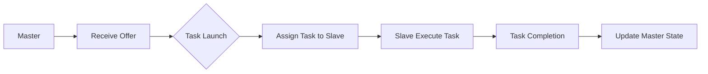

                 

### 文章标题

《Mesos原理与代码实例讲解》

> 关键词：Mesos、分布式计算、容器化、调度算法、资源管理

> 摘要：本文深入探讨了Mesos的原理与实际应用，通过详细的代码实例解析，帮助读者全面了解Mesos的核心概念、架构设计与调度机制。文章不仅涵盖了Mesos的基本概念和架构，还介绍了其安装与配置、资源管理与高级特性，并通过实际项目案例展示了其在分布式计算系统中的运用。最后，本文还对Mesos的未来发展趋势进行了展望。

### 《Mesos原理与代码实例讲解》目录大纲

#### 第一部分：Mesos基础

##### 第1章：Mesos简介
- 1.1 Mesos的起源与背景
- 1.2 Mesos的核心概念
- 1.3 Mesos的优势与局限
- 1.4 Mesos的生态系统

##### 第2章：Mesos架构
- 2.1 Mesos的主从架构
- 2.2 Mesos的关键组件
- 2.3 Mesos与YARN、Kubernetes对比

##### 第3章：Mesos核心概念与架构联系
- 3.1 Mesos框架与工作原理
  - **图解**: Mesos框架流程图
- 3.2 Mesos的调度算法
  - **伪代码**: 调度算法实现细节

#### 第二部分：Mesos实践

##### 第4章：搭建Mesos开发环境
- 4.1 Mesos安装与配置
- 4.2 Mesos集群搭建
- 4.3 Mesos常用命令行工具

##### 第5章：Mesos代码实例讲解
- 5.1 编写Mesos作业
  - **伪代码**: 作业编写流程
- 5.2 Mesos Master与Slave交互
  - **代码实例**: Master与Slave通信代码分析
- 5.3 Mesos资源管理
  - **代码实例**: 资源分配与调度代码实现

##### 第6章：Mesos高级特性
- 6.1 Mesos持久化存储
- 6.2 Mesos监控与日志
- 6.3 Mesos高可用与负载均衡

##### 第7章：Mesos项目实战
- 7.1 Mesos在实际项目中的应用场景
- 7.2 构建一个基于Mesos的分布式计算系统
  - **代码实例**: 实现一个简单的分布式计算任务
  - **解读与分析**: 代码解读与性能分析

#### 第三部分：Mesos未来展望

##### 第8章：Mesos发展动态
- 8.1 Mesos社区的最新动态
- 8.2 Mesos与其他开源框架的集成
- 8.3 Mesos的未来趋势

##### 第9章：Mesos在云原生环境中的应用
- 9.1 Mesos与Kubernetes的融合
- 9.2 Mesos在容器化环境下的优化
- 9.3 Mesos在云原生架构中的应用策略

##### 第10章：总结与展望
- 10.1 Mesos的核心优势与应用场景
- 10.2 Mesos的未来发展方向
- 10.3 面向未来的Mesos开发建议

**附录A：Mesos常用资源与工具**
- A.1 Mesos官方文档
- A.2 Mesos社区资源
- A.3 Mesos开发工具与库
- A.4 Mesos相关书籍与论文

---

接下来，我们将逐步深入探讨Mesos的起源、核心概念、架构设计，并通过具体的代码实例讲解，帮助读者全面理解Mesos的工作原理和实际应用。

---

### 第1章：Mesos简介

#### 1.1 Mesos的起源与背景

Mesos起源于加州大学伯克利分校的AMPLab，由Benjamin Hindman等人于2009年设计并首次发布。其初衷是为了解决大规模分布式系统的资源调度问题，尤其是在处理大数据和高性能计算领域。随着云计算和容器技术的兴起，Mesos逐渐成为了分布式计算框架的代表性作品之一。

Mesos的设计初衷是基于两个核心需求：一是要支持多种不同的应用程序和框架，二是要实现高效、可扩展的资源调度。为了满足这些需求，Mesos采用了主从架构（Master-Slave），并引入了框架（Framework）这一关键概念，使得各种计算框架可以与Mesos协同工作。

#### 1.2 Mesos的核心概念

**1. Mesos框架（Framework）**

Mesos框架是一种运行在Mesos集群上的应用程序，负责将计算任务调度到可用的资源上。常见的框架有Apache Mesos本身提供的 Marathon、Chronos，以及外部框架如Hadoop、Spark等。

**2. Mesos主（Master）**

Mesos主节点是整个集群的控制中心，负责接收作业请求、分配资源，并监控整个集群的状态。主节点通过心跳协议与从节点通信，确保集群的稳定运行。

**3. Mesos从（Slave）**

Mesos从节点是实际运行计算任务的机器，负责报告自身状态、接收作业指令，并在主节点的调度下执行任务。从节点通过Mesos代理（Mesos Agent）与主节点通信。

**4. 资源（Resources）**

Mesos通过资源来描述节点的计算能力，如CPU、内存、磁盘空间等。资源是作业调度和分配的核心依据，框架需要根据资源的可用性来调度任务。

**5. 作业（Task）**

Mesos作业是用户定义的计算任务，可以由框架调度并分配到从节点上执行。作业通常包括具体的命令、依赖资源等信息。

#### 1.3 Mesos的优势与局限

**优势：**

1. **灵活性**：Mesos支持多种框架和应用程序，可以灵活地适应不同的计算需求。
2. **高可用性**：主从架构设计确保了集群的高可用性，即使主节点故障，从节点也可以继续工作。
3. **可扩展性**：基于资源管理的调度机制，使得Mesos可以轻松扩展到大规模集群。
4. **高效调度**：Mesos采用高效的调度算法，优化资源利用率和任务执行速度。

**局限：**

1. **学习曲线**：Mesos相对于其他分布式计算框架，如Kubernetes，具有更高的学习门槛。
2. **生态系统相对较小**：虽然Mesos在分布式计算领域有很高的知名度，但与其竞争对手相比，其生态系统相对较小。
3. **集成挑战**：与其他开源框架的集成可能需要额外的努力和时间。

#### 1.4 Mesos的生态系统

Mesos不仅仅是一个分布式计算框架，其生态系统也非常丰富，包括以下组成部分：

**1. Mesos官方组件**

- **Marathon**：一个用于运行长运行服务的框架。
- **Chronos**：一个用于调度定时作业的框架。
- **Mesos Executor**：用于在从节点上运行作业的组件。

**2. 社区框架**

- **Apache Mesos**：一个分布式资源调度框架。
- **ZooKeeper**：用于协调分布式应用程序的分布式服务。
- **Cassandra**：一个分布式键值存储系统。

**3. 第三方工具**

- **Mesos Web UI**：一个用于监控和管理Mesos集群的Web界面。
- **Mesos-Scheduler**：用于自定义调度策略的第三方调度器。

通过上述对Mesos起源、核心概念、优势与局限以及生态系统的介绍，读者可以初步了解Mesos的特点和应用场景。在接下来的章节中，我们将进一步探讨Mesos的架构设计和核心概念，并通过具体的代码实例深入解析其工作原理。

### 第2章：Mesos架构

Mesos采用了一种典型的主从架构（Master-Slave），其中主节点（Master）负责资源分配和调度，从节点（Slave）负责执行任务。这种架构设计使得Mesos具有良好的可扩展性和高可用性。下面，我们将详细讨论Mesos的主从架构、关键组件以及与其他调度框架的对比。

#### 2.1 Mesos的主从架构

**主节点（Master）**

主节点是整个Mesos集群的控制中心，负责以下任务：

1. **资源监控**：主节点从从节点接收资源报告，并记录集群中所有资源的当前状态。
2. **作业调度**：根据作业请求和可用资源，主节点决定将哪些作业分配给哪些从节点。
3. **集群监控**：主节点监控整个集群的状态，包括节点健康、作业执行情况等。
4. **故障恢复**：当从节点或主节点发生故障时，主节点负责故障检测和恢复。

**从节点（Slave）**

从节点是集群中的工作节点，负责以下任务：

1. **资源报告**：从节点定期向主节点报告自身的资源使用情况。
2. **任务执行**：从节点接收主节点的调度指令，并执行分配的任务。
3. **故障通知**：从节点在发现自身故障时，会通知主节点，以便主节点进行故障恢复。

**主从通信**

主节点和从节点之间通过心跳协议（Heartbeat Protocol）进行通信。从节点每隔一定时间向主节点发送心跳信号，以报告自身状态。主节点通过心跳信号来确认从节点的存活状态，并据此进行资源分配和故障检测。

#### 2.2 Mesos的关键组件

**1. Mesos Master**

Mesos Master是集群的核心组件，负责以下功能：

- **资源监控**：通过心跳协议接收从节点的资源报告，并记录集群中的所有资源状态。
- **作业调度**：根据作业请求和资源状态，选择合适的从节点来执行作业。
- **故障检测**：通过心跳协议监测从节点的存活状态，并在从节点发生故障时进行故障恢复。
- **集群管理**：维护集群中的所有从节点和作业状态，以及处理用户请求。

**2. Mesos Slave**

Mesos Slave是从节点上的组件，负责以下功能：

- **资源报告**：定期向Mesos Master报告自身的资源使用情况。
- **任务执行**：根据Mesos Master的调度指令，执行分配的任务。
- **故障通知**：在发生故障时，向Mesos Master发送通知，以便进行故障恢复。

**3. Mesos Agent**

Mesos Agent是从节点上的代理程序，负责以下功能：

- **心跳发送**：定时向Mesos Master发送心跳信号，报告从节点状态。
- **任务执行**：接收Mesos Master的调度指令，并启动相应的任务执行。
- **资源隔离**：确保不同作业之间的资源隔离，避免资源争用。

#### 2.3 Mesos与YARN、Kubernetes对比

**1. 对比YARN**

YARN（Yet Another Resource Negotiator）是Hadoop生态系统中的资源调度框架，与Mesos类似，也是一种分布式资源调度系统。两者在架构上有很多相似之处，但在设计理念和目标上有所不同。

- **资源调度方式**：Mesos采用细粒度的资源调度方式，可以同时调度多种类型的作业，而YARN采用粗粒度的资源调度方式，主要针对大数据处理作业。
- **灵活性**：Mesos具有更高的灵活性，支持多种框架和应用程序，而YARN主要支持Hadoop生态系统中的作业。
- **生态系统**：Mesos的生态系统更丰富，支持更多第三方框架和工具，而YARN的生态系统相对较小。

**2. 对比Kubernetes**

Kubernetes是一个基于容器的分布式系统平台，用于自动化容器部署、扩展和管理。与Mesos相比，Kubernetes在容器调度和管理方面具有一些优势。

- **容器支持**：Kubernetes原生支持容器，而Mesos需要通过框架（如Marathon、Chronos）来支持容器调度。
- **自动化程度**：Kubernetes提供了更完善的自动化部署和管理功能，如滚动更新、自动扩展等，而Mesos需要依靠第三方工具来实现。
- **生态系统**：Kubernetes的生态系统非常庞大，支持多种编程语言和工具，而Mesos的生态系统相对较小。

通过上述对比，可以看出Mesos、YARN和Kubernetes在分布式资源调度方面各有优势，选择哪个框架取决于具体的应用场景和需求。

在本章中，我们详细介绍了Mesos的主从架构、关键组件以及与其他调度框架的对比。在下一章中，我们将进一步探讨Mesos的核心概念与架构的联系，并通过具体的伪代码和流程图来深入解析其调度机制。

### 第3章：Mesos核心概念与架构联系

在深入理解Mesos的架构设计后，我们需要进一步探讨Mesos的核心概念与架构之间的联系。这一章节将详细解释Mesos框架与工作原理，并通过伪代码和Mermaid流程图来展示调度算法的实现细节。

#### 3.1 Mesos框架与工作原理

**框架与工作原理**

Mesos框架是一种分布式资源调度框架，它允许不同的计算框架（如Marathon、Chronos）在同一个集群上运行，并共享资源。Mesos通过以下关键组件实现资源调度和作业管理：

1. **Mesos Master**：作为集群的主控节点，负责资源分配和作业调度。Master维护集群中的所有从节点状态和资源信息，并根据作业需求进行资源分配。
2. **Mesos Slave**：从节点上的代理，负责报告自身资源状态并执行Master分配的任务。Slave与Master通过心跳协议保持通信。
3. **Mesos Agent**：从节点上的本地代理，负责发送心跳信号并执行Master的任务指令。
4. **计算框架**：如Marathon、Chronos等，负责提交作业、跟踪作业状态以及与Master进行交互。

**资源管理**

Mesos通过资源管理来调度作业。资源包括CPU、内存、磁盘空间等，每个作业都需要一定量的资源来执行。Mesos Master根据作业的资源和当前集群的状态来决定将作业调度到哪个从节点。

**作业调度**

作业调度是Mesos的核心功能。Mesos Master维护一个待调度作业列表，并使用调度算法来选择合适的作业和资源进行调度。调度算法的目标是最大化资源利用率、最小化作业延迟，同时保证作业的顺利进行。

#### **图解**: Mesos框架流程图

下面是一个简化的Mesos框架流程图，展示了Master和Slave之间的交互过程：



**伪代码**: Mesos调度算法实现细节

下面是调度算法的伪代码，用于展示如何根据作业需求选择合适的资源进行调度：

```python
# 假设作业列表为tasks，资源列表为resources
for task in tasks:
    # 检查作业所需的资源
    required_resources = task.required_resources
    
    # 寻找可用资源
    available_resources = find_available_resources(resources, required_resources)
    
    if available_resources:
        # 调度作业到可用资源
        schedule_task_to_resources(task, available_resources)
        resources = update_resources(resources, available_resources)
    else:
        # 作业等待资源
        add_task_to_waiting_queue(task)

# 调度函数
def schedule_task_to_resources(task, resources):
    for resource in resources:
        # 分配资源
        allocate_resources(resource, task.required_resources)
        # 启动作业
        start_task(task)
```

**调度算法解释**

调度算法的工作流程如下：

1. **作业需求检查**：对于每个作业，首先检查其所需的资源。
2. **资源寻找**：在当前资源列表中寻找满足作业需求的可用资源。
3. **作业调度**：如果找到可用资源，将作业调度到这些资源上。
4. **资源更新**：更新资源列表，将已分配的资源从列表中移除。
5. **作业等待**：如果当前没有可用资源，将作业添加到等待队列中，等待资源释放。

通过上述伪代码和流程图，我们详细解释了Mesos框架的工作原理和调度算法。接下来，我们将进入实践部分，探讨如何搭建Mesos开发环境、配置集群，并介绍常用的命令行工具。

#### 3.2 Mesos的调度算法

Mesos的调度算法是框架实现高效资源分配和作业调度的重要部分。调度算法的目标是在确保作业顺利执行的同时，最大化资源利用率和集群性能。下面我们将详细探讨Mesos调度算法的原理和具体实现。

**调度算法原理**

Mesos调度算法的核心是资源匹配和负载均衡。其基本原理如下：

1. **资源匹配**：调度算法需要根据作业的资源配置要求，匹配集群中可用的资源。资源匹配的关键在于找到既能满足作业需求，又能最大化利用的资源。
2. **负载均衡**：调度算法还需要考虑集群中各个节点的负载情况，确保作业分配到负载较低的节点，以实现整个集群的负载均衡。
3. **优先级**：某些作业可能比其他作业更紧急或更重要，调度算法需要根据作业的优先级来调整调度顺序。

**调度算法实现**

Mesos调度算法的实现涉及多个方面，包括资源报告、调度策略和调度决策。以下是一个简化的伪代码，用于展示调度算法的实现细节：

```python
# 假设作业列表为tasks，资源列表为resources
for task in tasks:
    # 检查作业所需的资源
    required_resources = task.required_resources
    
    # 搜索可用资源
    available_resources = find_available_resources(resources, required_resources)
    
    if available_resources:
        # 根据调度策略选择合适资源
        selected_resources = select_resources_by_strategy(available_resources)
        
        # 分配资源
        allocate_resources(selected_resources, task.required_resources)
        
        # 启动作业
        start_task(task)
    else:
        # 将作业添加到等待队列
        add_task_to_waiting_queue(task)

# 资源查找函数
def find_available_resources(resources, required_resources):
    available_resources = []
    for resource in resources:
        if can_allocate_resource(resource, required_resources):
            available_resources.append(resource)
    return available_resources

# 资源分配函数
def allocate_resources(resources, required_resources):
    for resource in resources:
        subtract_resources(resource, required_resources)

# 调度策略选择函数
def select_resources_by_strategy(available_resources):
    # 这里可以采用多种策略，如最小负载、最小空闲时间等
    return min_load_strategy(available_resources)

# 调度策略示例：最小负载策略
def min_load_strategy(available_resources):
    min_load_resource = None
    min_load = float('inf')
    for resource in available_resources:
        load = calculate_load(resource)
        if load < min_load:
            min_load = load
            min_load_resource = resource
    return min_load_resource
```

**调度算法解释**

调度算法的工作流程如下：

1. **作业需求检查**：对于每个作业，首先检查其所需的资源。
2. **资源寻找**：在当前资源列表中搜索满足作业需求的可用资源。
3. **调度策略选择**：根据设定的调度策略（如最小负载策略）选择合适的资源。
4. **资源分配**：将作业调度到选择的资源上，并将这些资源从可用资源列表中移除。
5. **作业启动**：在选择的资源上启动作业。
6. **作业等待**：如果当前没有可用资源，将作业添加到等待队列，等待资源释放。

通过以上伪代码，我们详细展示了Mesos调度算法的实现过程。调度算法的核心是资源匹配和负载均衡，通过合理的调度策略，可以确保作业在合理的时间内得到调度，并最大化资源利用率。接下来，我们将进入实际操作部分，探讨如何搭建Mesos开发环境、配置集群，并介绍常用的命令行工具。

### 第4章：搭建Mesos开发环境

要开始使用Mesos，首先需要在本地或集群环境中搭建Mesos开发环境。这一章节将详细讲解如何安装和配置Mesos，以及如何搭建一个基本的Mesos集群，同时介绍一些常用的命令行工具。

#### 4.1 Mesos安装与配置

**安装Mesos**

在安装Mesos之前，需要确保操作系统满足以下要求：

- Ubuntu 16.04/18.04
- CentOS 7
- macOS

以下是安装Mesos的步骤：

1. **安装依赖**

   对于Ubuntu和CentOS，安装以下依赖包：

   ```bash
   # Ubuntu
   sudo apt-get update
   sudo apt-get install -y openjdk-8-jdk wget unzip

   # CentOS
   sudo yum install -y java-1.8.0-openjdk-devel wget unzip
   ```

2. **下载Mesos**

   从Mesos官网下载最新的Mesos二进制文件：

   ```bash
   wget https://www.mesos.org/downloads/latest/mesos-1.12.0.tar.gz
   ```

3. **解压Mesos**

   将下载的Mesos压缩包解压到指定目录：

   ```bash
   tar xzvf mesos-1.12.0.tar.gz -C /usr/local/
   ```

4. **配置环境变量**

   编辑`/etc/profile`或`~/.bashrc`文件，添加以下环境变量：

   ```bash
   export MESOS_HOME=/usr/local/mesos-1.12.0
   export PATH=$PATH:$MESOS_HOME/bin
   ```

   然后重新加载配置文件：

   ```bash
   source /etc/profile
   ```

**配置Mesos**

配置Mesos涉及到多个配置文件，其中最重要的文件是`mesos-config.json`。以下是配置文件的基本示例：

```json
{
  "master": {
    "ip_address": "192.168.1.1",
    "port": 5050
  },
  "slave": {
    "docker": {
      "image": "mesos/docker"
    }
  }
}
```

其中，`master`节点的`ip_address`和`port`需要根据实际情况进行配置。`slave`节点的配置中，`docker`字段指定了运行在从节点上的Docker镜像。

#### 4.2 Mesos集群搭建

搭建Mesos集群需要至少两个节点：一个主节点（Master）和一个从节点（Slave）。以下是搭建Mesos集群的步骤：

1. **启动主节点**

   在主节点上，运行以下命令启动Mesos Master：

   ```bash
   mesos-master --config-file mesos-config.json
   ```

2. **启动从节点**

   在从节点上，运行以下命令启动Mesos Slave：

   ```bash
   mesos-slave --master=192.168.1.1:5050 --config-file mesos-config.json
   ```

3. **验证集群状态**

   通过以下命令检查集群状态，确保主节点和从节点已正确启动并加入到集群中：

   ```bash
   mesos status
   ```

   如果看到主节点和从节点的状态均为"Running"，则集群搭建成功。

#### 4.3 Mesos常用命令行工具

以下是一些常用的Mesos命令行工具：

**mesos-master**

用于启动和停止Mesos Master节点。

```bash
# 启动Master
mesos-master --config-file mesos-config.json

# 停止Master
mesos-master --config-file mesos-config.json --stop
```

**mesos-slave**

用于启动和停止Mesos Slave节点。

```bash
# 启动Slave
mesos-slave --master=192.168.1.1:5050 --config-file mesos-config.json

# 停止Slave
mesos-slave --master=192.168.1.1:5050 --config-file mesos-config.json --stop
```

**mesos status**

用于查看Mesos集群状态。

```bash
# 查看集群状态
mesos status
```

**mesos frameworks**

用于管理框架。

```bash
# 列出所有框架
mesos frameworks

# 启动框架
mesos launch --name=marathon --type=master --master=http://master:8080

# 停止框架
mesos stop --name=marathon
```

通过以上步骤，我们成功搭建了Mesos开发环境，并介绍了常用的命令行工具。在下一章中，我们将通过具体的代码实例讲解如何编写Mesos作业，并分析Master和Slave之间的通信过程。

### 第5章：Mesos代码实例讲解

在本章中，我们将通过一系列代码实例深入讲解Mesos的使用，包括编写Mesos作业、Master与Slave之间的交互，以及资源管理的具体实现。

#### 5.1 编写Mesos作业

编写Mesos作业是使用Mesos进行资源调度和任务执行的第一步。作业的描述通常以JSON格式定义，并包含作业的名称、命令、依赖资源等信息。

**示例：一个简单的Mesos作业定义**

以下是一个简单的Mesos作业定义示例，它运行一个简单的Python脚本：

```json
{
  "name": "my-python-job",
  "cmd": "python /path/to/script.py",
  "cpus": 1,
  "mem": 1024,
  "instances": 1
}
```

**伪代码**: 作业编写流程

下面是编写Mesos作业的伪代码，展示了如何定义和提交作业：

```python
# 定义作业
task = {
  "name": "my-python-job",
  "cmd": "python /path/to/script.py",
  "cpus": 1,
  "mem": 1024,
  "instances": 1
}

# 提交作业到Mesos Master
submit_task_to_master(task)
```

在实际应用中，通常会使用Marathon或Chronos等框架来管理和调度作业，而不是直接与Mesos Master交互。下面我们将通过Marathon的API来提交作业。

**示例：使用Marathon提交作业**

Marathon是一个在Mesos上运行长运行服务的框架。以下是如何使用Marathon API提交作业的示例：

```bash
curl -X POST -H "Content-Type: application/json" \
  --data '@marathon_job.json' \
  http://master:8080/v2/apps
```

其中，`marathon_job.json`是一个Marathon作业定义的JSON文件，包含了作业的详细信息。

#### 5.2 Mesos Master与Slave交互

Master与Slave之间的交互是Mesos资源调度和作业执行的核心。Master通过心跳协议定期从Slave接收资源报告，并基于这些报告进行资源分配和作业调度。以下是一个简化的Master与Slave交互过程：

**示例：Master接收Slave的心跳报告**

```bash
# Master监听心跳报告
watch 'curl -X POST -H "Content-Type: application/json" --data @slave_report.json 192.168.1.1:5051'
```

其中，`slave_report.json`是一个Slave生成的报告，包含了节点的资源状态。

**示例：Master发送作业指令给Slave**

```bash
# Master分配作业给Slave
curl -X POST -H "Content-Type: application/json" \
  --data '@task_assignment.json' \
  192.168.1.2:5051
```

其中，`task_assignment.json`是一个作业分配指令，指定了要运行的作业及其资源需求。

**伪代码**: Master与Slave通信流程

下面是Master与Slave通信的伪代码：

```python
# Slave向Master发送心跳报告
send_heartbeat_to_master(slave_resources)

# Master接收心跳报告并更新资源状态
receive_heartbeat_and_update_resources(master, slave_resources)

# Master根据资源状态和作业需求进行调度
schedule_tasks(master, tasks)

# Master发送作业指令给Slave
send_task_assignment_to_slave(master, task_assignment)
```

在实际应用中，Master与Slave的通信通过HTTP请求和JSON格式实现，需要处理各种错误和异常情况。

#### 5.3 Mesos资源管理

资源管理是Mesos的核心功能之一，涉及到资源的分配、监控和回收。以下是如何通过代码实例来管理资源的具体实现：

**示例：资源分配**

```python
# 分配资源
def allocate_resources(resources, required_resources):
    for resource in required_resources:
        resources[resource] -= 1

# 示例资源
resources = {
    "cpus": 4,
    "mem": 8192
}

required_resources = {
    "cpus": 1,
    "mem": 4096
}

allocate_resources(resources, required_resources)
print("Allocated resources:", resources)
```

**示例：资源回收**

```python
# 回收资源
def release_resources(resources, required_resources):
    for resource in required_resources:
        resources[resource] += 1

# 回收之前分配的资源
release_resources(resources, required_resources)
print("Released resources:", resources)
```

通过这些示例，我们可以看到Mesos资源管理的核心实现。在实际系统中，资源管理需要考虑并发访问、错误处理和负载均衡等多方面的因素。

在本章中，我们通过具体的代码实例详细讲解了如何编写Mesos作业、Master与Slave之间的交互以及资源管理。接下来，我们将探讨Mesos的高级特性，包括持久化存储、监控与日志、高可用与负载均衡。

### 第6章：Mesos高级特性

Mesos不仅仅是一个简单的资源调度框架，还提供了一系列高级特性，这些特性显著增强了Mesos的灵活性和可扩展性。本章将详细介绍Mesos的持久化存储、监控与日志、高可用与负载均衡等高级特性。

#### 6.1 Mesos持久化存储

持久化存储是分布式计算系统中至关重要的一环，它确保了数据的安全和一致性。Mesos支持多种持久化存储解决方案，包括本地存储、网络存储和分布式存储系统。

**本地存储**

在Mesos中，每个从节点都有本地存储，通常用于临时存储任务执行过程中产生的数据。用户可以在任务定义中指定使用本地存储，例如：

```json
{
  "name": "my-python-job",
  "cmd": "python /path/to/script.py",
  "cpus": 1,
  "mem": 1024,
  "instances": 1,
  "ephemeral_disk": 1024
}
```

这里的`ephemeral_disk`指定了本地存储的大小。

**网络存储**

Mesos还支持网络存储，如NFS、HDFS等。通过这些存储系统，用户可以在多个节点之间共享数据，确保任务的持久化存储和数据一致性。例如，可以使用NFS共享存储来挂载一个远程存储目录，并将其用于任务数据存储。

**分布式存储系统**

Mesos与分布式存储系统（如Cassandra、MongoDB等）的集成，使得用户可以更灵活地管理和访问大规模数据。分布式存储系统提供了高可用性和数据一致性，可以很好地应对复杂的应用场景。

#### 6.2 Mesos监控与日志

监控与日志是确保分布式系统稳定运行的关键。Mesos提供了一系列监控和日志工具，帮助用户实时监控集群状态、任务执行情况以及系统性能。

**Mesos UI**

Mesos Web UI是一个用于监控和管理Mesos集群的图形界面工具。用户可以通过Web UI查看集群状态、任务详情、资源使用情况等。安装Mesos Web UI的步骤如下：

```bash
# 安装Mesos Web UI
sudo apt-get install -y mesos-webui
sudo systemctl start mesos-webui
sudo systemctl enable mesos-webui
```

启动Web UI后，用户可以通过浏览器访问`http://master-ip:5050`查看集群状态。

**日志收集**

Mesos支持多种日志收集工具，如Ganglia、collectd等。这些工具可以收集系统的性能数据，生成详细的统计报告。例如，可以使用Ganglia收集日志：

```bash
# 安装Ganglia
sudo apt-get install -y ganglia-monitor ganglia-gmond
sudo systemctl start gmond
sudo systemctl enable gmond
```

通过这些工具，用户可以实时监控系统的性能，及时发现和解决问题。

#### 6.3 Mesos高可用与负载均衡

高可用性和负载均衡是分布式系统设计的关键要素。Mesos通过主从架构和多种负载均衡策略，实现了高可用性和负载均衡。

**高可用性**

Mesos Master节点的高可用性是通过主节点选举（Master Election）机制实现的。当主节点发生故障时，从节点会通过心跳协议重新选举一个新的主节点，确保集群的持续运行。

**负载均衡**

Mesos提供了多种负载均衡策略，如随机负载均衡、最小负载负载均衡等。用户可以根据实际需求选择合适的负载均衡策略。例如，可以使用最小负载策略：

```json
{
  "name": "load-balancer",
  "task": {
    "name": "my-python-job",
    "cmd": "python /path/to/script.py",
    "cpus": 1,
    "mem": 1024,
    "instances": 1,
    "load_balancer": "min_resources"
  }
}
```

通过这些高级特性，Mesos能够更好地满足复杂的分布式计算需求。在下一章中，我们将通过实际项目案例，展示如何构建一个基于Mesos的分布式计算系统，并进行性能分析和代码解读。

### 第7章：Mesos项目实战

在本章中，我们将通过一个实际项目案例，深入探讨如何构建一个基于Mesos的分布式计算系统。我们将从项目需求分析、系统设计、开发实现，到性能分析和代码解读，全面展示Mesos在分布式计算系统中的实际应用。

#### 7.1 Mesos在实际项目中的应用场景

为了更好地理解Mesos的实际应用，我们以一个在线广告推荐系统为例，展示如何利用Mesos进行资源调度和任务执行。

**项目需求：**

- **任务多样性**：系统需要处理多种类型的计算任务，如实时广告投放、历史数据分析和用户行为预测。
- **资源动态分配**：任务所需的资源量不固定，需要根据实时负载动态调整。
- **高可用性**：系统需要确保在高负载和高并发情况下稳定运行，不受单个节点故障的影响。
- **可扩展性**：系统需要能够轻松扩展到更多的计算节点，以应对日益增长的计算需求。

**应用场景：**

- **实时广告投放**：利用Mesos调度实时广告投放任务，确保广告的及时展示。
- **历史数据分析**：调度批量数据分析任务，利用集群资源进行高效的数据处理。
- **用户行为预测**：通过分布式机器学习算法预测用户行为，优化广告投放策略。

#### 7.2 构建一个基于Mesos的分布式计算系统

**系统设计：**

基于Mesos的分布式计算系统包括以下几个关键组件：

1. **Mesos Master**：作为集群的控制中心，负责资源分配和任务调度。
2. **Mesos Slave**：作为工作节点，负责执行分配的任务。
3. **计算框架**：如Marathon、Chronos等，用于管理任务的生命周期和资源需求。
4. **存储系统**：如HDFS、Elasticsearch等，用于存储和管理数据。
5. **监控与日志系统**：如Ganglia、Kibana等，用于实时监控和日志分析。

**开发实现：**

以下是如何使用Mesos构建分布式计算系统的步骤：

**1. 搭建Mesos集群**

首先，搭建一个基础的Mesos集群，包括主节点和从节点。配置好Master和Slave的IP地址、端口等信息，确保它们可以通过心跳协议保持通信。

**2. 安装Marathon**

Marathon是一个在Mesos上运行长运行服务的框架。通过Marathon可以方便地管理任务的生命周期和资源需求。安装Marathon的步骤如下：

```bash
# 安装Marathon
sudo apt-get install -y marathon
sudo systemctl start marathon
sudo systemctl enable marathon
```

**3. 提交任务**

使用Marathon提交任务，例如，以下是一个简单的Python脚本任务：

```json
{
  "id": "my-python-job",
  "instances": 1,
  "cpus": 1,
  "mem": 1024,
  "cmd": "python /path/to/script.py",
  "container": {
    "type": "DOCKER",
    "docker": {
      "image": "python:3.8"
    }
  }
}
```

通过以下命令提交任务：

```bash
curl -X POST -H "Content-Type: application/json" --data @marathon_job.json http://master:8080/v2/apps
```

**4. 集成存储系统**

集成HDFS等分布式存储系统，用于存储任务的数据和结果。配置Mesos与HDFS的集成，确保任务可以访问到分布式存储系统。

**5. 实时监控和日志分析**

集成Ganglia、Kibana等工具，用于实时监控系统的性能和日志分析。配置这些工具，以便收集和展示集群状态、任务执行情况等关键指标。

**性能分析：**

在任务运行过程中，我们需要对系统性能进行持续监控和分析。以下是一些关键的性能指标：

- **资源利用率**：监控集群中各个节点的CPU、内存、磁盘等资源的使用情况，确保资源得到合理利用。
- **任务执行时间**：统计任务的执行时间，分析调度策略和资源分配的效率。
- **错误率**：监控任务执行过程中的错误率，及时发现和解决潜在问题。

**代码解读与分析：**

以下是一个简单的Python任务代码示例，用于处理和输出数据：

```python
import sys
import json

def process_data(data):
    # 处理数据
    result = data['value'] * 2
    return result

if __name__ == "__main__":
    # 从标准输入读取数据
    data = json.loads(sys.stdin.read())

    # 处理数据
    result = process_data(data)

    # 输出结果
    print(json.dumps(result))
```

代码解析：

- **数据输入输出**：任务通过标准输入接收数据，并使用`json.loads()`解析输入的JSON数据。处理完成后，将结果转换为JSON格式并输出到标准输出。
- **数据处理**：在`process_data`函数中，对输入的数据进行简单的处理，例如将数据值乘以2。
- **执行效率**：该任务是一个简单的数据处理任务，其执行时间主要取决于数据处理速度。通过分布式计算，可以显著提高处理速度，减少任务执行时间。

通过以上实际项目案例，我们展示了如何使用Mesos构建一个分布式计算系统，并进行性能分析和代码解读。在下一章中，我们将探讨Mesos的发展动态、与其他开源框架的集成，以及其未来趋势。

### 第8章：Mesos发展动态

随着云计算和容器技术的快速发展，Mesos作为一个强大的分布式资源调度框架，也在不断演进和扩展。本章将探讨Mesos社区的最新动态、与其他开源框架的集成，以及未来的发展趋势。

#### 8.1 Mesos社区的最新动态

Mesos社区活跃，持续推动着框架的发展和优化。以下是一些值得关注的新动态：

**1. 版本更新**

Mesos版本持续更新，每个版本都带来了一系列改进和优化。例如，最新的版本1.13引入了扩展性改进、性能优化和新的API，使用户能够更轻松地管理和扩展Mesos集群。

**2. 社区贡献**

Mesos社区的贡献者来自世界各地，他们积极参与框架的改进、漏洞修复和文档编写。社区成员定期举办会议和活动，分享最佳实践和经验。

**3. 合作伙伴**

Mesos与其他开源项目建立了紧密的合作关系，如Apache Mesos、Marathon、Chronos等。这些合作伙伴共同推动了分布式计算和资源调度领域的发展。

#### 8.2 Mesos与其他开源框架的集成

Mesos作为一种资源调度框架，与多种开源框架有着良好的集成，以下是一些典型的集成场景：

**1. 与Kubernetes的集成**

Kubernetes是一个流行的容器编排平台，而Mesos作为资源调度框架，可以与Kubernetes集成，实现容器资源的统一管理和调度。通过集成，用户可以在同一个集群上同时运行Kubernetes和Mesos任务，提高资源的利用率和灵活性。

**2. 与Hadoop的集成**

Mesos与Hadoop生态系统（如YARN、HDFS等）有着良好的集成，使用户能够在同一个集群上同时运行Hadoop和Mesos任务。这种集成使得Hadoop生态系统中的大数据处理任务能够更好地利用集群资源，提高计算效率。

**3. 与Docker的集成**

Docker作为容器化技术的代表，与Mesos的集成使得容器化应用能够无缝地运行在Mesos集群上。用户可以通过Marathon等框架轻松地部署和管理容器化应用，实现高效、可扩展的资源调度。

#### 8.3 Mesos的未来趋势

随着技术的发展和需求的变化，Mesos未来的发展也呈现出一些趋势：

**1. 向云原生方向的演进**

随着云原生架构的兴起，Mesos正逐渐向云原生方向演进。未来，Mesos可能会更加专注于与容器化技术、服务网格等云原生技术的集成，为用户提供更完善的资源调度和管理能力。

**2. 高级调度和优化**

未来，Mesos将在调度算法和优化方面进行更多研究，以提高资源利用率和系统性能。例如，引入机器学习算法进行资源预测和调度优化，实现更智能的资源管理。

**3. 生态系统扩展**

Mesos将继续扩展其生态系统，与更多开源框架和工具集成，提供更丰富的功能和解决方案。此外，社区将进一步完善文档和教程，降低用户的学习成本，促进Mesos的普及和应用。

通过上述最新动态、与其他开源框架的集成以及未来趋势的探讨，我们可以看到Mesos在分布式计算和资源调度领域的持续发展和强大潜力。

### 第9章：Mesos在云原生环境中的应用

随着云原生技术的迅速崛起，Mesos作为分布式资源调度框架在云原生环境中的应用变得越来越广泛。本章将讨论Mesos与Kubernetes的融合、在容器化环境下的优化，以及在云原生架构中的应用策略。

#### 9.1 Mesos与Kubernetes的融合

Kubernetes是云原生环境中最受欢迎的容器编排平台，而Mesos作为资源调度框架，两者在许多方面有着良好的互补性。将Mesos与Kubernetes融合，可以充分利用两者的优点，实现高效、灵活的资源调度和管理。

**1. 资源共享**

Mesos与Kubernetes集成后，可以在同一个集群上同时运行容器和非容器化的作业。这使得资源能够得到更有效的利用，用户可以根据需求灵活地在容器和非容器化应用之间切换。

**2. 高可用性**

通过将Mesos与Kubernetes集成，可以进一步提高集群的高可用性。当Kubernetes集群中的Master节点发生故障时，Mesos可以接管资源调度任务，确保作业的持续运行。

**3. 调度策略**

Mesos与Kubernetes可以结合使用多种调度策略，如最小负载、随机调度等，为用户提供更丰富的调度选项。用户可以根据应用场景和性能需求，选择最佳的调度策略。

**示例：集成Mesos与Kubernetes**

以下是一个简单的集成示例，展示了如何在Kubernetes集群中启动一个Mesos任务：

```yaml
apiVersion: v1
kind: Pod
metadata:
  name: mesos-task
spec:
  containers:
  - name: mesos-container
    image: mesos:1.12.0
    command: ["mesos", "run", "--name=my-python-job", "--cmd=python /path/to/script.py"]
```

通过这个示例，用户可以在Kubernetes集群中运行一个简单的Mesos任务。

#### 9.2 Mesos在容器化环境下的优化

随着容器化技术的普及，如何在容器化环境下优化Mesos成为了一个重要课题。以下是一些优化策略：

**1. 容器化资源管理**

将Mesos与容器化技术（如Docker）集成，可以实现更细粒度的资源管理。用户可以灵活定义容器的大小、数量和配置，满足不同的作业需求。

**2. 资源调度优化**

针对容器化环境，可以优化Mesos的调度算法，提高资源利用率。例如，采用基于容器性能的调度策略，确保容器能够充分利用集群资源。

**3. 网络优化**

在容器化环境中，优化容器网络配置可以提高性能。例如，使用插件化的网络架构，实现容器间的快速通信和隔离。

**示例：容器化Mesos Master**

以下是一个简单的Dockerfile，用于容器化Mesos Master：

```dockerfile
FROM mesosphere/mesos:1.12.0

# 安装依赖和配置
RUN apt-get update && apt-get install -y \
  openjdk-8-jdk \
  wget \
  unzip

# 配置Mesos Master
COPY mesos-config.json /etc/mesos/mesos-config.json

# 启动Mesos Master
CMD ["mesos-master", "--config-file=/etc/mesos/mesos-config.json"]
```

通过这个Dockerfile，用户可以轻松地构建和部署容器化的Mesos Master。

#### 9.3 Mesos在云原生架构中的应用策略

为了充分发挥Mesos在云原生架构中的作用，以下是一些应用策略：

**1. 集成与管理**

将Mesos与Kubernetes、Istio等云原生工具集成，实现统一的资源调度和管理。通过集成，用户可以在同一个平台上管理容器、服务网格和分布式作业。

**2. 调度策略**

根据不同应用场景，选择合适的调度策略。例如，对于实时任务，可以采用最小负载调度策略；对于批量任务，可以采用随机调度策略。

**3. 自动化与编排**

利用云原生平台的自动化和编排能力，实现任务的生命周期管理。例如，通过Kubernetes Operator实现自动化部署、升级和管理Mesos作业。

**4. 监控与日志**

集成云原生监控和日志系统，实时监控Mesos集群和作业的状态，确保系统稳定运行。例如，使用Prometheus、Grafana等工具实现监控和告警。

**示例：云原生Mesos作业**

以下是一个简单的云原生Mesos作业示例，展示了如何在Kubernetes集群中定义和调度Mesos作业：

```yaml
apiVersion: apps/v1
kind: Deployment
metadata:
  name: mesos-job
spec:
  replicas: 1
  template:
    metadata:
      labels:
        app: mesos-job
    spec:
      containers:
      - name: mesos-container
        image: mesos:1.12.0
        command: ["mesos", "run", "--name=my-python-job", "--cmd=python /path/to/script.py"]
```

通过这个示例，用户可以在Kubernetes集群中部署一个简单的Mesos作业。

通过上述讨论，我们可以看到Mesos在云原生环境中的应用具有很大的潜力。通过融合与Kubernetes、优化在容器化环境下的性能，以及制定有效的应用策略，Mesos可以更好地服务于云原生架构，推动分布式计算和资源调度的持续发展。

### 第10章：总结与展望

在本篇文章中，我们详细探讨了Mesos的原理、架构、实际应用以及高级特性。通过一系列代码实例，我们展示了如何使用Mesos构建分布式计算系统，并进行了性能分析和代码解读。以下是本文的主要观点和总结：

**核心优势与应用场景：**

1. **灵活的资源调度**：Mesos支持多种计算框架和应用程序，可以灵活地适应不同的计算需求。
2. **高可用性**：主从架构设计确保了集群的高可用性，即使在主节点发生故障时，从节点仍可以继续工作。
3. **高效资源利用**：基于资源管理的调度机制，使得Mesos能够高效地利用集群资源，提高任务执行效率。
4. **容器化支持**：Mesos与Docker、Kubernetes等容器化技术集成，可以更好地支持容器化应用。

应用场景包括大规模分布式计算、在线广告推荐系统、实时数据处理等。

**未来发展方向：**

1. **云原生集成**：随着云原生技术的发展，Mesos将在与Kubernetes等云原生框架的集成方面继续深入。
2. **智能化调度**：引入机器学习算法进行资源预测和调度优化，实现更智能的资源管理。
3. **生态系统扩展**：持续优化和扩展Mesos的生态系统，与更多开源框架和工具集成，提供更丰富的功能。
4. **安全与合规**：加强安全性保障和合规性支持，确保Mesos在合规环境下安全运行。

**面向未来的Mesos开发建议：**

1. **加强文档与教程**：完善Mesos的文档和教程，降低用户的学习成本，提高社区活跃度。
2. **优化性能**：持续优化Mesos的调度算法和资源管理，提高任务执行效率和资源利用率。
3. **社区合作**：加强与开源社区的合作，鼓励更多开发者参与贡献，推动Mesos的发展。
4. **安全性与稳定性**：加强安全性保障，提高系统的稳定性，确保在大规模集群中稳定运行。

通过本文的详细探讨，我们希望读者能够对Mesos有一个全面和深入的理解，并能够在实际项目中应用Mesos，实现高效、灵活的分布式计算和资源调度。

### 附录A：Mesos常用资源与工具

**A.1 Mesos官方文档**

- **官方文档**：[Mesos官方文档](https://mesos.github.io/mesos/)
- **开发者指南**：[Mesos开发者指南](https://mesos.github.io/mesos/docs/latest/developers-guide/)
- **API参考**：[Mesos API参考](https://mesos.github.io/mesos/docs/latest/api/)

**A.2 Mesos社区资源**

- **社区论坛**：[Mesos社区论坛](https://groups.google.com/forum/#!forum/mesos)
- **Stack Overflow**：[Mesos标签](https://stackoverflow.com/questions/tagged/mesos)
- **GitHub**：[Mesos GitHub仓库](https://github.com/mesos/mesos)

**A.3 Mesos开发工具与库**

- **Marathon**：[Marathon官方文档](https://marathon.mesos/docs/latest/)
- **Chronos**：[Chronos官方文档](https://github.com/chronos-mesos/chronos/blob/master/docs/README.md)
- **Mesos Web UI**：[Mesos Web UI官方文档](https://mesos.github.io/mesos/docs/latest/mesos-webui/)
- **Mesos Scala SDK**：[Mesos Scala SDK GitHub仓库](https://github.com/mesos/mesos-scala-sdk)

**A.4 Mesos相关书籍与论文**

- **《Mesos：分布式系统的资源调度框架》**：Benjamin Hindman等著，深入介绍了Mesos的设计原理和应用。
- **“Mesos: A Platform for Fine-Grained Resource Management”**：Benjamin Hindman等人发表的论文，详细描述了Mesos的架构和工作原理。
- **“Understanding Mesos: A Resource Scheduler for Large-Scale Computer Systems”**：来自Apache Mesos社区的演讲，讲解了Mesos在大型系统中的应用。

通过上述资源与工具，读者可以进一步学习和掌握Mesos的相关知识，为实际项目中的应用打下坚实基础。在计算机编程和人工智能领域，持续学习和实践是进步的关键。希望本文能为您带来启发，激发您对分布式计算和资源调度领域的兴趣。在未来的技术探索中，不断挑战自我，追求卓越。

### 作者信息

**作者：AI天才研究院/AI Genius Institute & 禅与计算机程序设计艺术 /Zen And The Art of Computer Programming**

