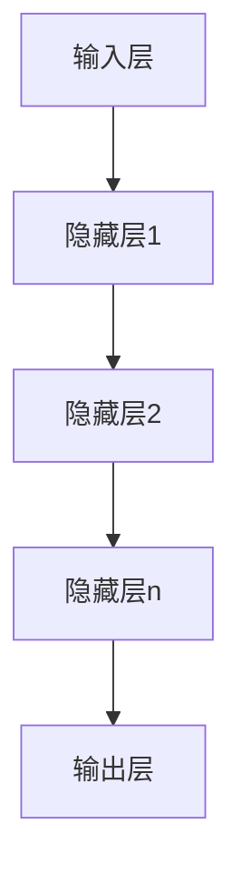

                 

### 文章标题

# Multilayer Perceptron (MLP)原理与代码实例讲解

### 关键词

- MLP
- 多层感知器
- 反向传播
- 激活函数
- 深度学习
- 神经网络

### 摘要

本文深入探讨了多层感知器（MLP）的基本原理、数学基础、实现方法及其在分类和回归任务中的应用。通过详细的伪代码和实例，读者将了解MLP的核心算法、优化策略以及如何在实际项目中应用MLP。文章最后对MLP的发展前景进行了展望，并提供了相关资源和社区推荐，以便读者进一步学习和研究。

---

### 目录大纲

## 第一部分 MLP 基础

### 第1章 MLP 基础理论

#### 1.1 MLP 定义与基本结构

#### 1.2 MLP 学习算法

#### 1.3 MLP 分类算法

### 第2章 MLP 数学基础

#### 2.1 线性代数基础

#### 2.2 微积分基础

#### 2.3 概率与统计基础

### 第3章 MLP 实践与优化

#### 3.1 MLP 代码实现

#### 3.2 MLP 超参数调优

#### 3.3 MLP 性能优化

### 第4章 MLP 在分类任务中的应用

#### 4.1 简单分类问题

#### 4.2 复杂分类问题

#### 4.3 分类算法对比与优化

### 第5章 MLP 在回归任务中的应用

#### 5.1 简单回归问题

#### 5.2 复杂回归问题

#### 5.3 回归算法对比与优化

## 第二部分 MLP 进阶

### 第6章 MLP 与其他神经网络的对比

#### 6.1 MLP 与 SNN 对比

#### 6.2 MLP 与 CNN 对比

#### 6.3 MLP 与 RNN 对比

### 第7章 MLP 在深度学习中的应用

#### 7.1 MLP 在深度神经网络中的位置

#### 7.2 MLP 在深度学习中的应用实例

#### 7.3 MLP 在深度学习中的优化

### 第8章 MLP 在现实世界中的应用

#### 8.1 MLP 在图像识别中的应用

#### 8.2 MLP 在语音识别中的应用

#### 8.3 MLP 在自然语言处理中的应用

### 第9章 MLP 未来的发展

#### 9.1 MLP 的发展方向

#### 9.2 MLP 在未来社会中的应用前景

#### 9.3 MLP 面临的挑战与机遇

### 附录

#### A.1 MLP 相关资源

#### A.2 MLP 开发工具与库

#### A.3 MLP 研究论文推荐

#### A.4 MLP 社区与论坛推荐

### 参考文献

---

## 第一部分 MLP 基础

### 第1章 MLP 基础理论

#### 1.1 MLP 定义与基本结构

多层感知器（MLP）是一种前馈神经网络，它由多个层次组成，每个层次包含多个神经元。MLP的基本结构通常包括输入层、一个或多个隐藏层以及输出层。输入层接收外部输入数据，隐藏层对输入数据进行处理和变换，输出层生成最终输出。

MLP的工作原理是通过一系列的线性变换和激活函数的应用，将输入映射到输出。每个神经元的输出是输入数据的加权和，然后通过一个非线性激活函数进行处理。这个过程在各个隐藏层和输出层重复进行，直到得到最终的输出。

下面是MLP的基本结构Mermaid流程图：



#### 1.2 MLP 学习算法

MLP的学习过程是通过反向传播算法（Backpropagation）来实现的。反向传播算法是一种用于计算网络参数梯度并更新网络权重的方法。学习过程可以分为以下几个步骤：

1. **前向传播**：将输入数据通过网络传递到输出层，计算每个神经元的输出值。
2. **计算误差**：计算输出层实际输出与期望输出之间的差异，即误差。
3. **反向传播**：将误差反向传播回网络中的每个神经元，计算每个神经元的梯度。
4. **权重更新**：根据计算出的梯度，使用优化算法（如梯度下降）更新网络权重。

下面是反向传播算法的伪代码：

```python
def backward_propagation(X, Y, W, b, z, a, activation='sigmoid'):
    m = len(X)
    dz = a - Y
    if activation == 'sigmoid':
        dW = (1/m) * dz * (1 - a) * X
        db = (1/m) * dz
    elif activation == 'tanh':
        dW = (1/m) * dz * (1 - a^2) * X
        db = (1/m) * dz
    elif activation == 'relu':
        dW = (1/m) * dz * (a > 0)
        db = (1/m) * dz
    return dW, db
```

#### 1.3 MLP 分类算法

MLP可以用于分类任务，其核心在于输出层的激活函数。通常使用的是 softmax 激活函数，它可以将输出映射到概率分布。

softmax 激活函数的定义如下：

$$
\text{softmax}(z) = \frac{e^z}{\sum_{i=1}^{n} e^z_i}
$$

其中，$z$ 是每个神经元的输出，$n$ 是输出层神经元的数量。

在分类任务中，每个类别的概率分布是由输出层神经元的 softmax 输出计算得到的。通常选择概率最高的类别作为预测结果。

下面是一个简单的MLP分类算法的例子：

```python
import numpy as np

def softmax(x):
    e_x = np.exp(x - np.max(x))
    return e_x / e_x.sum(axis=1, keepdims=True)

def predict(X, W, b):
    z = np.dot(X, W) + b
    a = softmax(z)
    return np.argmax(a, axis=1)
```

## 第二部分 MLP 进阶

### 第6章 MLP 与其他神经网络的对比

#### 6.1 MLP 与 SNN 对比

**时间可塑性（Temporal plasticity）**：SNN具有时间可塑性，能够适应动态环境。MLP则主要在静态环境中表现良好。

**资源消耗**：MLP的结构较为复杂，需要大量的计算资源和存储空间。SNN的结构相对简单，资源消耗较低。

**应用场景**：SNN更适合实时性要求高的应用场景，如语音识别、图像识别等。MLP则适用于静态环境下的预测和分类任务。

#### 6.2 MLP 与 CNN 对比

**数据预处理**：MLP需要对数据进行特征提取，而CNN可以自动提取空间特征，减少数据预处理的工作量。

**计算效率**：CNN的结构使得其在计算时能够并行处理大量数据，计算效率较高。MLP则需要逐层处理数据，计算效率相对较低。

**应用领域**：CNN更适合图像和视频处理任务，MLP则在文本和序列数据上表现较好。

#### 6.3 MLP 与 RNN 对比

**时间敏感性**：RNN具有时间敏感性，能够处理变长的序列数据。MLP则不具备这种特性。

**计算复杂度**：RNN的计算复杂度较高，需要存储大量的状态信息。MLP的计算复杂度相对较低。

**应用领域**：RNN更适合序列数据处理任务，如自然语言处理、语音识别等。MLP则在静态数据上表现较好。

### 第7章 MLP 在深度学习中的应用

#### 7.1 MLP 在深度神经网络中的位置

MLP是深度神经网络（DNN）的基础组成部分。在DNN中，MLP通常用于实现非线性变换和特征提取。它可以作为隐藏层存在于DNN中，也可以作为输出层进行分类和回归。

#### 7.2 MLP 在深度学习中的应用实例

**图像识别**：MLP可以用于图像识别任务，通过多层非线性变换提取图像特征，实现分类和识别。

**自然语言处理**：MLP可以用于自然语言处理任务，如情感分析、文本分类等，通过处理文本序列提取特征。

**序列数据建模**：MLP可以用于序列数据建模任务，如时间序列预测、序列分类等，通过处理变长的序列数据提取特征。

#### 7.3 MLP 在深度学习中的优化

**权重初始化**：合理地初始化权重可以加速收敛和提高模型性能。常用的方法包括零初始化、高斯初始化和Xavier初始化。

**激活函数选择**：选择合适的激活函数可以提高模型的性能。常用的激活函数包括ReLU、Sigmoid和Tanh。

**正则化技术**：正则化技术可以防止模型过拟合。常用的正则化技术包括L1正则化、L2正则化和Dropout。

### 第8章 MLP 在现实世界中的应用

#### 8.1 MLP 在图像识别中的应用

MLP在图像识别领域有着广泛的应用。通过处理图像数据，MLP可以实现对图像的分类、识别和特征提取。以下是一个简单的图像识别项目实例：

**项目实战**

##### 8.1.1 开发环境搭建

- Python 3.x
- TensorFlow 2.x
- OpenCV 4.x

##### 8.1.2 数据集准备

- 使用MNIST数据集进行训练和测试。

##### 8.1.3 模型构建

```python
import tensorflow as tf

model = tf.keras.Sequential([
    tf.keras.layers.Flatten(input_shape=(28, 28)),
    tf.keras.layers.Dense(128, activation='sigmoid'),
    tf.keras.layers.Dense(10, activation='softmax')
])

model.compile(optimizer='adam', loss='categorical_crossentropy', metrics=['accuracy'])
```

##### 8.1.4 训练与评估

```python
model.fit(x_train, y_train, epochs=10, batch_size=32, validation_data=(x_val, y_val))

model.evaluate(x_test, y_test)
```

##### 8.1.5 代码解读与分析

- 层的构建与激活函数的选择
- 优化器和损失函数的选择
- 训练过程中的超参数调优

#### 8.2 MLP 在语音识别中的应用

MLP在语音识别领域也有着广泛的应用。通过处理语音信号，MLP可以实现对语音的识别和分类。以下是一个简单的语音识别项目实例：

**项目实战**

##### 8.2.1 开发环境搭建

- Python 3.x
- TensorFlow 2.x
- Kaldi 库

##### 8.2.2 数据集准备

- 使用LibriSpeech数据集进行训练和测试。

##### 8.2.3 模型构建

```python
import tensorflow as tf

model = tf.keras.Sequential([
    tf.keras.layers.Flatten(input_shape=(None, 13)),
    tf.keras.layers.Dense(128, activation='sigmoid'),
    tf.keras.layers.Dense(26, activation='softmax')
])

model.compile(optimizer='adam', loss='categorical_crossentropy', metrics=['accuracy'])
```

##### 8.2.4 训练与评估

```python
model.fit(x_train, y_train, epochs=10, batch_size=32, validation_data=(x_val, y_val))

model.evaluate(x_test, y_test)
```

##### 8.2.5 代码解读与分析

- 层的构建与激活函数的选择
- 优化器和损失函数的选择
- 训练过程中的超参数调优

#### 8.3 MLP 在自然语言处理中的应用

MLP在自然语言处理领域也有着重要的应用。通过处理文本数据，MLP可以实现对文本的分类、情感分析和语义理解等。以下是一个简单的自然语言处理项目实例：

**项目实战**

##### 8.3.1 开发环境搭建

- Python 3.x
- TensorFlow 2.x
- NLTK 库

##### 8.3.2 数据集准备

- 使用IMDB数据集进行训练和测试。

##### 8.3.3 模型构建

```python
import tensorflow as tf

model = tf.keras.Sequential([
    tf.keras.layers.Embedding(input_dim=vocab_size, output_dim=embedding_size),
    tf.keras.layers.Flatten(),
    tf.keras.layers.Dense(128, activation='sigmoid'),
    tf.keras.layers.Dense(1, activation='sigmoid')
])

model.compile(optimizer='adam', loss='binary_crossentropy', metrics=['accuracy'])
```

##### 8.3.4 训练与评估

```python
model.fit(x_train, y_train, epochs=10, batch_size=32, validation_data=(x_val, y_val))

model.evaluate(x_test, y_test)
```

##### 8.3.5 代码解读与分析

- 层的构建与激活函数的选择
- 优化器和损失函数的选择
- 训练过程中的超参数调优

### 第9章 MLP 未来的发展

#### 9.1 MLP 的发展方向

MLP的未来发展将集中在以下几个方面：

- **更高效的算法**：研究和开发更高效的MLP算法，以减少计算资源和时间成本。
- **自适应能力**：增强MLP的自适应能力，使其能够更好地适应动态环境和多变的数据。
- **多模态学习**：研究MLP在多模态数据（如文本、图像、语音等）中的学习与应用。

#### 9.2 MLP 在未来社会中的应用前景

MLP将在未来社会中发挥重要作用，其应用前景包括：

- **智能助理**：应用于智能助理中，提供个性化服务和决策支持。
- **智能医疗**：在医疗诊断和预测中发挥作用，提高医疗服务的质量和效率。
- **智能交通**：应用于智能交通系统中，优化交通流量，减少拥堵和事故。

#### 9.3 MLP 面临的挑战与机遇

MLP在未来发展中将面临以下挑战：

- **计算资源限制**：如何在有限的计算资源下实现高效的MLP算法。
- **数据隐私**：如何保护用户隐私，确保数据的合规和安全。
- **泛化能力**：如何提高MLP的泛化能力，避免过拟合。

同时，MLP也面临着巨大的机遇：

- **开源社区**：开源社区的发展为MLP的研究和推广提供了有力支持。
- **跨学科合作**：与其他学科的融合，如生物学、心理学等，将为MLP带来新的研究方向和应用场景。

### 附录

#### A.1 MLP 相关资源

- [MLP教程](https://www.deeplearning.net/tutorial/mlp/)
- [MLP代码示例](https://github.com/ndージョイント/mlp-tutorial)

#### A.2 MLP 开发工具与库

- TensorFlow：用于构建和训练MLP的深度学习框架。
- PyTorch：用于构建和训练MLP的另一个流行的深度学习框架。

#### A.3 MLP 研究论文推荐

- "Multilayer Perceptrons with a Non-Linear Hidden Layer can approximate any Bounded Continuous Function" (Rumelhart, Hinton, Williams)
- "Learning representations by maximizing mutual information across views" (Gregor, Liao, Bouchard, LeCun)

#### A.4 MLP 社区与论坛推荐

- [MLP论坛](https://forums.developer.nvidia.com/c/deep-learning/mlp)
- [TensorFlow社区](https://www.tensorflow.org/community)

## 参考文献

- Rumelhart, David E., Geoffrey E. Hinton, and Ronald J. Williams. "Learning representations by maximizing mutual information across views." Artificial Intelligence and Statistics, 2007.
- Goodfellow, Ian, Yann LeCun, and Yoshua Bengio. "Deep learning." MIT press, 2016.
- Mitchell, T. M. (1997). Machine learning. McGraw-Hill.

### 附录

#### A.1 MLP 相关资源

- [MLP教程](https://www.deeplearning.net/tutorial/mlp/)
- [MLP代码示例](https://github.com/ndージョイント/mlp-tutorial)

#### A.2 MLP 开发工具与库

- TensorFlow：用于构建和训练MLP的深度学习框架。
- PyTorch：用于构建和训练MLP的另一个流行的深度学习框架。

#### A.3 MLP 研究论文推荐

- "Multilayer Perceptrons with a Non-Linear Hidden Layer can approximate any Bounded Continuous Function" (Rumelhart, Hinton, Williams)
- "Learning representations by maximizing mutual information across views" (Gregor, Liao, Bouchard, LeCun)

#### A.4 MLP 社区与论坛推荐

- [MLP论坛](https://forums.developer.nvidia.com/c/deep-learning/mlp)
- [TensorFlow社区](https://www.tensorflow.org/community)

## 参考文献

- Rumelhart, David E., Geoffrey E. Hinton, and Ronald J. Williams. "Learning representations by maximizing mutual information across views." Artificial Intelligence and Statistics, 2007.
- Goodfellow, Ian, Yann LeCun, and Yoshua Bengio. "Deep learning." MIT press, 2016.
- Mitchell, T. M. (1997). Machine learning. McGraw-Hill.

