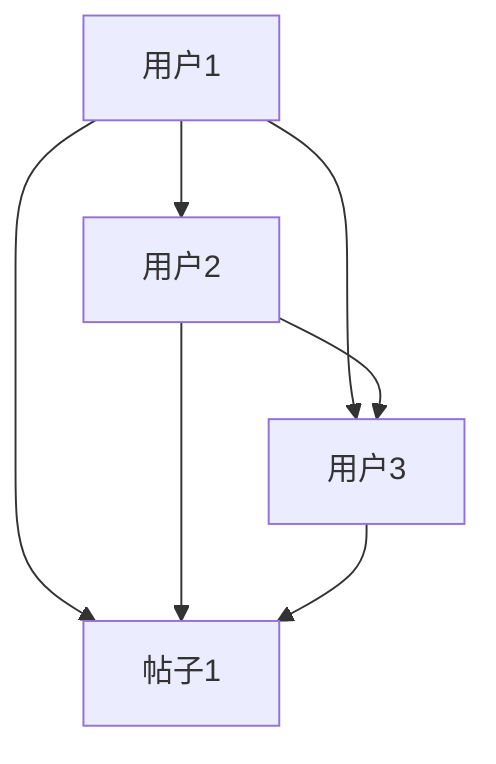
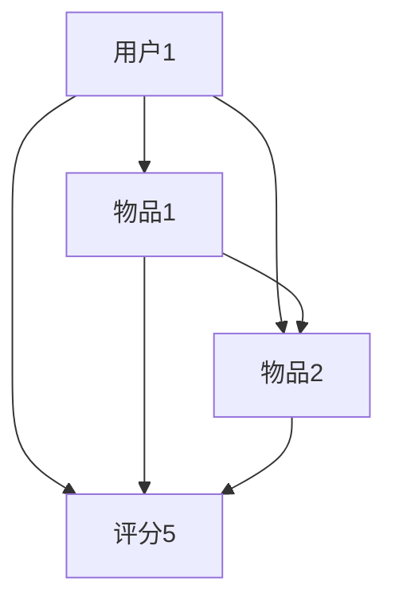
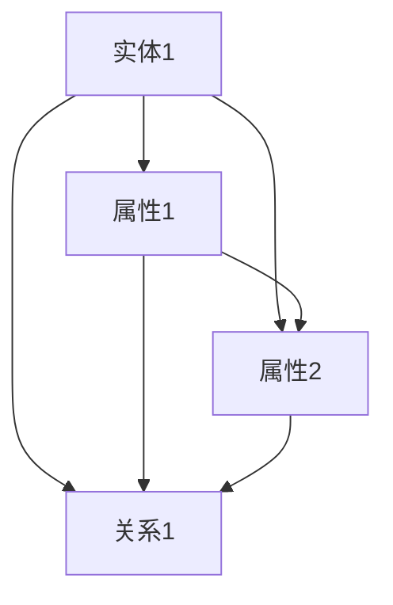

                 

### Neo4j原理与代码实例讲解

#### 关键词：Neo4j、图数据库、Cypher查询语言、图模型、性能优化

Neo4j是一种高度优化的NoSQL图数据库，专为处理复杂、多维度的图结构而设计。它基于图论理论，以节点和关系为核心数据结构，提供了一套强大的图形查询语言Cypher，使得复杂图查询变得直观和高效。本文将详细讲解Neo4j的原理、核心概念、数据操作、索引与约束机制，并通过实际代码实例展示Neo4j的强大功能。

### 摘要

本文分为三大部分，首先介绍Neo4j的基础知识，包括起源与背景、核心概念和图模型基础；接着深入探讨Neo4j的数据操作、索引与约束以及Cypher查询语言；然后通过具体应用案例，如社交网络、推荐系统和知识图谱，展示Neo4j在实战中的广泛应用。最后，本文还将讨论Neo4j的性能优化与扩展，以及相关的开发工具和生态体系。

### 第一部分：Neo4j基础

#### 第1章：Neo4j概述

#### 1.1 Neo4j的起源与背景

Neo4j诞生于2007年，由阿拉斯加的三个程序员共同创立。他们的初衷是解决传统关系数据库在处理复杂图结构时的低效问题。经过多年的研发和优化，Neo4j逐渐成为了图数据库领域的佼佼者，广泛应用于社交网络、推荐系统、知识图谱等领域。

#### 1.2 Neo4j的核心概念

Neo4j的核心概念包括节点（Node）、关系（Relationship）和属性（Property）。节点表示图中的实体，如人、地点、物品等；关系表示节点之间的联系，如朋友、工作地点、购买等；属性则是节点的附加信息，如年龄、地址、价格等。

#### 1.3 Neo4j与NoSQL的关系数据库

与传统的NoSQL关系数据库相比，Neo4j采用了独特的图模型。传统关系数据库基于表结构，而Neo4j则通过节点、关系和属性来构建图结构，使得数据操作更加直观和高效。此外，Neo4j还支持ACID事务，保证了数据的一致性和可靠性。

#### 第2章：Neo4j图模型基础

#### 2.1 图论基础

图论是研究图结构及其性质的一个数学分支。在图论中，图由节点（也称为顶点）和边（也称为弧）组成。图可以是有向的或无向的，可以是加权或无权的。图论的基本概念包括连通性、路径、度、圈等。

#### 2.2 Neo4j图模型简介

Neo4j的图模型是基于图论理论的，它采用节点、关系和属性来表示数据。节点表示实体，关系表示实体之间的关系，属性则是实体的附加信息。Neo4j的图模型具有高度的灵活性和扩展性，可以方便地表示各种复杂的关系。

#### 2.3 Neo4j图模型实例

假设有一个社交网络，其中包含用户、朋友关系和帖子等信息。我们可以使用Neo4j的图模型来表示这些数据：



在这个示例中，节点表示用户和帖子，关系表示朋友关系和帖子创建关系。通过Neo4j的图模型，我们可以方便地查询用户之间的关系，或者查找某个用户的帖子。

#### 第3章：Neo4j数据操作

#### 3.1 Neo4j数据导入

Neo4j支持多种数据导入方式，包括使用Neo4j Data Importer工具、通过Cypher查询语句导入数据以及使用图形化界面导入数据。其中，Neo4j Data Importer工具是导入数据最常用的方式。

#### 3.2 Neo4j数据查询

Neo4j的数据查询主要通过Cypher查询语言实现。Cypher是一种声明式查询语言，类似于SQL，但更适用于图结构。通过Cypher，我们可以方便地执行各种图查询操作，如查找节点、关系以及属性。

#### 3.3 Neo4j数据修改

Neo4j支持对数据的增删改查操作。通过Cypher查询语言，我们可以方便地对节点、关系和属性进行修改。例如，我们可以使用以下Cypher语句添加新的节点和关系：

```cypher
CREATE (a:Person {name: 'Alice', age: 30}),
       (b:Person {name: 'Bob', age: 25}),
       (a)-[:KNOWS]->(b)
```

#### 第4章：Neo4j索引与约束

#### 4.1 Neo4j索引原理

索引是提高查询效率的重要手段。Neo4j支持多种索引类型，包括B-Tree索引、LSM树索引和哈希索引。这些索引类型各有优缺点，适用于不同的查询场景。

#### 4.2 Neo4j索引使用

使用索引可以提高查询效率，但也会增加数据写入的 overhead。因此，在选择索引时需要权衡查询性能和数据写入性能。Neo4j提供了多种索引策略，如默认索引、复合索引和唯一索引。

#### 4.3 Neo4j约束机制

Neo4j支持多种约束机制，包括唯一约束、存在约束和引用约束。这些约束可以保证数据的完整性和一致性，避免数据不一致的问题。

#### 第5章：Neo4j查询语言Cypher

#### 5.1 Cypher基本语法

Cypher是一种声明式查询语言，类似于SQL，但更适用于图结构。Cypher的基本语法包括匹配（MATCH）、创建（CREATE）、删除（DELETE）和返回（RETURN）等操作。

#### 5.2 Cypher查询实例

以下是一个简单的Cypher查询实例，用于查找两个节点之间的最短路径：

```cypher
MATCH (p:Person), (q:Person)
WHERE p.name = 'Alice' AND q.name = 'Bob'
CALL shortestPath(p, q)
RETURN p, q, length(shortestPath(p, q))
```

#### 5.3 Cypher高级用法

Cypher提供了丰富的功能，包括集合操作、变量赋值、函数调用等。通过Cypher的高级用法，我们可以实现更加复杂和高效的查询操作。

### 第二部分：Neo4j应用实战

#### 第6章：Neo4j在社交网络中的应用

社交网络是Neo4j的典型应用场景之一。通过Neo4j的图模型，我们可以方便地表示社交网络中的用户、朋友关系和帖子等信息。

#### 6.1 社交网络图模型设计

社交网络图模型的设计需要考虑用户、朋友关系和帖子等核心概念。我们可以使用Neo4j的图模型来表示这些数据，如下所示：


#### 6.2 社交网络数据导入

在导入社交网络数据时，我们可以使用Neo4j Data Importer工具。该工具支持批量导入节点和关系，并可以自定义导入规则。以下是一个简单的导入示例：

```bash
neofetch --nodes --relationships --property-list users.properties
```

#### 6.3 社交网络数据查询与分析

通过Cypher查询语言，我们可以方便地执行各种社交网络数据查询和分析操作。例如，我们可以查找两个用户之间的朋友关系，或者查找某个用户的帖子：

```cypher
MATCH (p:Person)-[:FRIEND]->(q:Person)
WHERE p.name = 'Alice' AND q.name = 'Bob'
RETURN p, q
```

```cypher
MATCH (p:Person)-[:POST]->(q:Post)
WHERE p.name = 'Alice'
RETURN q
```

#### 第7章：Neo4j在推荐系统中的应用

推荐系统是另一个典型的Neo4j应用场景。通过Neo4j的图模型，我们可以方便地表示用户、物品和评分等信息。

#### 7.1 推荐系统图模型设计

推荐系统图模型的设计需要考虑用户、物品和评分等核心概念。我们可以使用Neo4j的图模型来表示这些数据，如下所示：



#### 7.2 推荐系统数据导入

在导入推荐系统数据时，我们可以使用Neo4j Data Importer工具。该工具支持批量导入节点和关系，并可以自定义导入规则。以下是一个简单的导入示例：

```bash
neofetch --nodes --relationships --property-list ratings.properties
```

#### 7.3 推荐系统数据查询与优化

通过Cypher查询语言，我们可以方便地执行各种推荐系统数据查询和优化操作。例如，我们可以查找某个用户的推荐物品，或者优化推荐算法：

```cypher
MATCH (p:Person)-[:RATE]->(q:Item)
WHERE p.name = 'Alice'
RETURN q, sum(p.rating) AS total_rating
ORDER BY total_rating DESC
LIMIT 10
```

```cypher
MATCH (p:Person)-[:RATE]->(q:Item)
WITH p, q, sum(p.rating) AS total_rating
WITH p, q, total_rating, rank() OVER (ORDER BY total_rating DESC) AS rank
WHERE rank <= 10
RETURN p, q, total_rating, rank
```

#### 第8章：Neo4j在知识图谱中的应用

知识图谱是Neo4j的另一个重要应用场景。通过Neo4j的图模型，我们可以方便地表示知识图谱中的实体、属性和关系等信息。

#### 8.1 知识图谱图模型设计

知识图谱图模型的设计需要考虑实体、属性和关系等核心概念。我们可以使用Neo4j的图模型来表示这些数据，如下所示：



#### 8.2 知识图谱数据导入

在导入知识图谱数据时，我们可以使用Neo4j Data Importer工具。该工具支持批量导入节点和关系，并可以自定义导入规则。以下是一个简单的导入示例：

```bash
neofetch --nodes --relationships --property-list knowledge.properties
```

#### 8.3 知识图谱数据查询与推理

通过Cypher查询语言，我们可以方便地执行各种知识图谱数据查询和推理操作。例如，我们可以查找某个实体的属性，或者推理出某个实体之间的关系：

```cypher
MATCH (p:Entity {name: 'Person'})
-[:ATTRIBUTE]->(q:Attribute)
RETURN p, q
```

```cypher
MATCH (p:Entity {name: 'Person'}), (q:Entity {name: 'Company'})
WHERE p-[r:WORKS_FOR]->q
RETURN p, q, r
```

### 第三部分：Neo4j开发工具与生态

#### 第9章：Neo4j开发工具

Neo4j提供了一系列开发工具，包括Neo4j Browser、Neo4j Data Importer和Neo4j Shell等，方便开发者进行数据操作和查询。

#### 9.1 Neo4j Browser使用

Neo4j Browser是Neo4j的图形化界面，提供了一种方便的数据操作和查询方式。通过Neo4j Browser，我们可以可视化地操作节点和关系，执行Cypher查询，并查看查询结果。

#### 9.2 Neo4j Data Importer使用

Neo4j Data Importer是Neo4j的数据导入工具，支持批量导入节点和关系，并提供自定义导入规则。通过Neo4j Data Importer，我们可以方便地将外部数据导入到Neo4j数据库中。

#### 9.3 Neo4j Shell使用

Neo4j Shell是Neo4j的命令行工具，提供了一种方便的查询和操作方式。通过Neo4j Shell，我们可以执行Cypher查询，查看查询结果，并进行数据操作。

#### 第10章：Neo4j生态

Neo4j拥有一个繁荣的生态体系，包括各种插件、扩展和开源项目，为开发者提供了丰富的开发工具和资源。

#### 10.1 Neo4j插件与扩展

Neo4j插件与扩展为开发者提供了更多的功能，包括数据迁移、监控和自动化等。通过这些插件和扩展，我们可以方便地集成Neo4j与其他系统和工具。

#### 10.2 Neo4j与大数据平台的集成

Neo4j支持与大数据平台的集成，如Apache Hadoop、Apache Spark等。通过这些集成，我们可以将Neo4j与大数据平台结合起来，实现更高效的数据处理和分析。

#### 10.3 Neo4j在云计算与容器化环境中的应用

Neo4j支持在云计算和容器化环境中的应用，如AWS、Azure、Kubernetes等。通过这些应用，我们可以方便地将Neo4j部署在云环境中，实现高效的数据处理和分析。

### 附录

#### 附录A：Neo4j相关资源与工具

以下是Neo4j的一些相关资源与工具：

- Neo4j官方文档：[https://neo4j.com/docs/](https://neo4j.com/docs/)
- Neo4j社区：[https://neo4j.com/developer/](https://neo4j.com/developer/)
- Neo4j开源项目：[https://github.com/neo4j/](https://github.com/neo4j/)
- Neo4j学习资源汇总：[https://www.neo4j.com/learn/](https://www.neo4j.com/learn/)

### 作者

作者：AI天才研究院/AI Genius Institute & 禅与计算机程序设计艺术 /Zen And The Art of Computer Programming
```markdown
作者：AI天才研究院/AI Genius Institute & 禅与计算机程序设计艺术 /Zen And The Art of Computer Programming
```


### 《Neo4j原理与代码实例讲解》

#### 关键词：Neo4j、图数据库、Cypher查询语言、图模型、性能优化

Neo4j是一种高度优化的NoSQL图数据库，专为处理复杂、多维度的图结构而设计。它基于图论理论，以节点和关系为核心数据结构，提供了一套强大的图形查询语言Cypher，使得复杂图查询变得直观和高效。本文将详细讲解Neo4j的原理、核心概念、数据操作、索引与约束机制，并通过实际代码实例展示Neo4j的强大功能。

### 摘要

本文分为三大部分，首先介绍Neo4j的基础知识，包括起源与背景、核心概念和图模型基础；接着深入探讨Neo4j的数据操作、索引与约束以及Cypher查询语言；然后通过具体应用案例，如社交网络、推荐系统和知识图谱，展示Neo4j在实战中的广泛应用。最后，本文还将讨论Neo4j的性能优化与扩展，以及相关的开发工具和生态体系。

### 第一部分：Neo4j基础

#### 第1章：Neo4j概述

Neo4j的起源与背景

Neo4j诞生于2007年，由阿拉斯加的三个程序员共同创立。他们的初衷是解决传统关系数据库在处理复杂图结构时的低效问题。经过多年的研发和优化，Neo4j逐渐成为了图数据库领域的佼佼者，广泛应用于社交网络、推荐系统、知识图谱等领域。

Neo4j的核心概念

Neo4j的核心概念包括节点（Node）、关系（Relationship）和属性（Property）。节点表示图中的实体，如人、地点、物品等；关系表示节点之间的联系，如朋友、工作地点、购买等；属性则是节点的附加信息，如年龄、地址、价格等。

Neo4j与NoSQL的关系数据库

与传统的NoSQL关系数据库相比，Neo4j采用了独特的图模型。传统关系数据库基于表结构，而Neo4j则通过节点、关系和属性来构建图结构，使得数据操作更加直观和高效。此外，Neo4j还支持ACID事务，保证了数据的一致性和可靠性。

#### 第2章：Neo4j图模型基础

图论基础

图论是研究图结构及其性质的一个数学分支。在图论中，图由节点（也称为顶点）和边（也称为弧）组成。图可以是有向的或无向的，可以是加权或无权的。图论的基本概念包括连通性、路径、度、圈等。

Neo4j图模型简介

Neo4j的图模型是基于图论理论的，它采用节点、关系和属性来表示数据。节点表示实体，关系表示实体之间的关系，属性则是实体的附加信息。Neo4j的图模型具有高度的灵活性和扩展性，可以方便地表示各种复杂的关系。

Neo4j图模型实例

假设有一个社交网络，其中包含用户、朋友关系和帖子等信息。我们可以使用Neo4j的图模型来表示这些数据：


在这个示例中，节点表示用户和帖子，关系表示朋友关系和帖子创建关系。通过Neo4j的图模型，我们可以方便地查询用户之间的关系，或者查找某个用户的帖子。

#### 第3章：Neo4j数据操作

Neo4j数据导入

Neo4j支持多种数据导入方式，包括使用Neo4j Data Importer工具、通过Cypher查询语句导入数据以及使用图形化界面导入数据。其中，Neo4j Data Importer工具是导入数据最常用的方式。

Neo4j数据查询

Neo4j的数据查询主要通过Cypher查询语言实现。Cypher是一种声明式查询语言，类似于SQL，但更适用于图结构。通过Cypher，我们可以方便地执行各种图查询操作，如查找节点、关系以及属性。

Neo4j数据修改

Neo4j支持对数据的增删改查操作。通过Cypher查询语言，我们可以方便地对节点、关系和属性进行修改。例如，我们可以使用以下Cypher语句添加新的节点和关系：

```cypher
CREATE (a:Person {name: 'Alice', age: 30}),
       (b:Person {name: 'Bob', age: 25}),
       (a)-[:KNOWS]->(b)
```

#### 第4章：Neo4j索引与约束

Neo4j索引原理

索引是提高查询效率的重要手段。Neo4j支持多种索引类型，包括B-Tree索引、LSM树索引和哈希索引。这些索引类型各有优缺点，适用于不同的查询场景。

Neo4j索引使用

使用索引可以提高查询效率，但也会增加数据写入的 overhead。因此，在选择索引时需要权衡查询性能和数据写入性能。Neo4j提供了多种索引策略，如默认索引、复合索引和唯一索引。

Neo4j约束机制

Neo4j支持多种约束机制，包括唯一约束、存在约束和引用约束。这些约束可以保证数据的完整性和一致性，避免数据不一致的问题。

#### 第5章：Neo4j查询语言Cypher

Cypher基本语法

Cypher是一种声明式查询语言，类似于SQL，但更适用于图结构。Cypher的基本语法包括匹配（MATCH）、创建（CREATE）、删除（DELETE）和返回（RETURN）等操作。

Cypher查询实例

以下是一个简单的Cypher查询实例，用于查找两个节点之间的最短路径：

```cypher
MATCH (p:Person), (q:Person)
WHERE p.name = 'Alice' AND q.name = 'Bob'
CALL shortestPath(p, q)
RETURN p, q, length(shortestPath(p, q))
```

Cypher高级用法

Cypher提供了丰富的功能，包括集合操作、变量赋值、函数调用等。通过Cypher的高级用法，我们可以实现更加复杂和高效的查询操作。

### 第二部分：Neo4j应用实战

#### 第6章：Neo4j在社交网络中的应用

社交网络是Neo4j的典型应用场景之一。通过Neo4j的图模型，我们可以方便地表示社交网络中的用户、朋友关系和帖子等信息。

##### 6.1 社交网络图模型设计

社交网络图模型的设计需要考虑用户、朋友关系和帖子等核心概念。我们可以使用Neo4j的图模型来表示这些数据，如下所示：


在这个示例中，节点表示用户和帖子，关系表示朋友关系和帖子创建关系。通过Neo4j的图模型，我们可以方便地查询用户之间的关系，或者查找某个用户的帖子。

##### 6.2 社交网络数据导入

在导入社交网络数据时，我们可以使用Neo4j Data Importer工具。该工具支持批量导入节点和关系，并可以自定义导入规则。以下是一个简单的导入示例：

```bash
neofetch --nodes --relationships --property-list users.properties
```

##### 6.3 社交网络数据查询与分析

通过Cypher查询语言，我们可以方便地执行各种社交网络数据查询和分析操作。例如，我们可以查找两个用户之间的朋友关系，或者查找某个用户的帖子：

```cypher
MATCH (p:Person)-[:FRIEND]->(q:Person)
WHERE p.name = 'Alice' AND q.name = 'Bob'
RETURN p, q
```

```cypher
MATCH (p:Person)-[:POST]->(q:Post)
WHERE p.name = 'Alice'
RETURN q
```

#### 第7章：Neo4j在推荐系统中的应用

推荐系统是另一个典型的Neo4j应用场景。通过Neo4j的图模型，我们可以方便地表示用户、物品和评分等信息。

##### 7.1 推荐系统图模型设计

推荐系统图模型的设计需要考虑用户、物品和评分等核心概念。我们可以使用Neo4j的图模型来表示这些数据，如下所示：


在这个示例中，节点表示用户和物品，关系表示评分和推荐关系。通过Neo4j的图模型，我们可以方便地查找用户的评分记录，或者推荐新的物品。

##### 7.2 推荐系统数据导入

在导入推荐系统数据时，我们可以使用Neo4j Data Importer工具。该工具支持批量导入节点和关系，并可以自定义导入规则。以下是一个简单的导入示例：

```bash
neofetch --nodes --relationships --property-list ratings.properties
```

##### 7.3 推荐系统数据查询与优化

通过Cypher查询语言，我们可以方便地执行各种推荐系统数据查询和优化操作。例如，我们可以查找某个用户的推荐物品，或者优化推荐算法：

```cypher
MATCH (p:Person)-[:RATE]->(q:Item)
WHERE p.name = 'Alice'
RETURN q, sum(p.rating) AS total_rating
ORDER BY total_rating DESC
LIMIT 10
```

```cypher
MATCH (p:Person)-[:RATE]->(q:Item)
WITH p, q, sum(p.rating) AS total_rating
WITH p, q, total_rating, rank() OVER (ORDER BY total_rating DESC) AS rank
WHERE rank <= 10
RETURN p, q, total_rating, rank
```

#### 第8章：Neo4j在知识图谱中的应用

知识图谱是Neo4j的另一个重要应用场景。通过Neo4j的图模型，我们可以方便地表示知识图谱中的实体、属性和关系等信息。

##### 8.1 知识图谱图模型设计

知识图谱图模型的设计需要考虑实体、属性和关系等核心概念。我们可以使用Neo4j的图模型来表示这些数据，如下所示：


在这个示例中，节点表示实体和属性，关系表示实体之间的关系。通过Neo4j的图模型，我们可以方便地查询实体之间的关系，或者推理出某个实体的属性。

##### 8.2 知识图谱数据导入

在导入知识图谱数据时，我们可以使用Neo4j Data Importer工具。该工具支持批量导入节点和关系，并可以自定义导入规则。以下是一个简单的导入示例：

```bash
neofetch --nodes --relationships --property-list knowledge.properties
```

##### 8.3 知识图谱数据查询与推理

通过Cypher查询语言，我们可以方便地执行各种知识图谱数据查询和推理操作。例如，我们可以查找某个实体的属性，或者推理出某个实体之间的关系：

```cypher
MATCH (p:Entity {name: 'Person'})
-[:ATTRIBUTE]->(q:Attribute)
RETURN p, q
```

```cypher
MATCH (p:Entity {name: 'Person'}), (q:Entity {name: 'Company'})
WHERE p-[r:WORKS_FOR]->q
RETURN p, q, r
```

### 第三部分：Neo4j开发工具与生态

#### 第9章：Neo4j开发工具

Neo4j提供了一系列开发工具，包括Neo4j Browser、Neo4j Data Importer和Neo4j Shell等，方便开发者进行数据操作和查询。

##### 9.1 Neo4j Browser使用

Neo4j Browser是Neo4j的图形化界面，提供了一种方便的数据操作和查询方式。通过Neo4j Browser，我们可以可视化地操作节点和关系，执行Cypher查询，并查看查询结果。

##### 9.2 Neo4j Data Importer使用

Neo4j Data Importer是Neo4j的数据导入工具，支持批量导入节点和关系，并提供自定义导入规则。通过Neo4j Data Importer，我们可以方便地将外部数据导入到Neo4j数据库中。

##### 9.3 Neo4j Shell使用

Neo4j Shell是Neo4j的命令行工具，提供了一种方便的查询和操作方式。通过Neo4j Shell，我们可以执行Cypher查询，查看查询结果，并进行数据操作。

#### 第10章：Neo4j生态

Neo4j拥有一个繁荣的生态体系，包括各种插件、扩展和开源项目，为开发者提供了丰富的开发工具和资源。

##### 10.1 Neo4j插件与扩展

Neo4j插件与扩展为开发者提供了更多的功能，包括数据迁移、监控和自动化等。通过这些插件和扩展，我们可以方便地集成Neo4j与其他系统和工具。

##### 10.2 Neo4j与大数据平台的集成

Neo4j支持与大数据平台的集成，如Apache Hadoop、Apache Spark等。通过这些集成，我们可以将Neo4j与大数据平台结合起来，实现更高效的数据处理和分析。

##### 10.3 Neo4j在云计算与容器化环境中的应用

Neo4j支持在云计算和容器化环境中的应用，如AWS、Azure、Kubernetes等。通过这些应用，我们可以方便地将Neo4j部署在云环境中，实现高效的数据处理和分析。

### 附录

#### 附录A：Neo4j相关资源与工具

以下是Neo4j的一些相关资源与工具：

- Neo4j官方文档：[https://neo4j.com/docs/](https://neo4j.com/docs/)
- Neo4j社区：[https://neo4j.com/developer/](https://neo4j.com/developer/)
- Neo4j开源项目：[https://github.com/neo4j/](https://github.com/neo4j/)
- Neo4j学习资源汇总：[https://www.neo4j.com/learn/](https://www.neo4j.com/learn/)

### 作者

作者：AI天才研究院/AI Genius Institute & 禅与计算机程序设计艺术 /Zen And The Art of Computer Programming
```markdown
## Neo4j原理与代码实例讲解

### 关键词：Neo4j、图数据库、Cypher查询语言、图模型、性能优化

Neo4j是一种高度优化的NoSQL图数据库，专为处理复杂、多维度的图结构而设计。它基于图论理论，以节点和关系为核心数据结构，提供了一套强大的图形查询语言Cypher，使得复杂图查询变得直观和高效。本文将详细讲解Neo4j的原理、核心概念、数据操作、索引与约束机制，并通过实际代码实例展示Neo4j的强大功能。

### 摘要

本文分为三大部分，首先介绍Neo4j的基础知识，包括起源与背景、核心概念和图模型基础；接着深入探讨Neo4j的数据操作、索引与约束以及Cypher查询语言；然后通过具体应用案例，如社交网络、推荐系统和知识图谱，展示Neo4j在实战中的广泛应用。最后，本文还将讨论Neo4j的性能优化与扩展，以及相关的开发工具和生态体系。

### 第一部分：Neo4j基础

#### 第1章：Neo4j概述

#### 1.1 Neo4j的起源与背景

Neo4j诞生于2007年，由阿拉斯加的三个程序员共同创立。他们的初衷是解决传统关系数据库在处理复杂图结构时的低效问题。经过多年的研发和优化，Neo4j逐渐成为了图数据库领域的佼佼者，广泛应用于社交网络、推荐系统、知识图谱等领域。

#### 1.2 Neo4j的核心概念

Neo4j的核心概念包括节点（Node）、关系（Relationship）和属性（Property）。节点表示图中的实体，如人、地点、物品等；关系表示节点之间的联系，如朋友、工作地点、购买等；属性则是节点的附加信息，如年龄、地址、价格等。

#### 1.3 Neo4j与NoSQL的关系数据库

与传统的NoSQL关系数据库相比，Neo4j采用了独特的图模型。传统关系数据库基于表结构，而Neo4j则通过节点、关系和属性来构建图结构，使得数据操作更加直观和高效。此外，Neo4j还支持ACID事务，保证了数据的一致性和可靠性。

#### 第2章：Neo4j图模型基础

#### 2.1 图论基础

图论是研究图结构及其性质的一个数学分支。在图论中，图由节点（也称为顶点）和边（也称为弧）组成。图可以是有向的或无向的，可以是加权或无权的。图论的基本概念包括连通性、路径、度、圈等。

#### 2.2 Neo4j图模型简介

Neo4j的图模型是基于图论理论的，它采用节点、关系和属性来表示数据。节点表示实体，关系表示实体之间的关系，属性则是实体的附加信息。Neo4j的图模型具有高度的灵活性和扩展性，可以方便地表示各种复杂的关系。

#### 2.3 Neo4j图模型实例

假设有一个社交网络，其中包含用户、朋友关系和帖子等信息。我们可以使用Neo4j的图模型来表示这些数据：


在这个示例中，节点表示用户和帖子，关系表示朋友关系和帖子创建关系。通过Neo4j的图模型，我们可以方便地查询用户之间的关系，或者查找某个用户的帖子。

#### 第3章：Neo4j数据操作

#### 3.1 Neo4j数据导入

Neo4j支持多种数据导入方式，包括使用Neo4j Data Importer工具、通过Cypher查询语句导入数据以及使用图形化界面导入数据。其中，Neo4j Data Importer工具是导入数据最常用的方式。

#### 3.2 Neo4j数据查询

Neo4j的数据查询主要通过Cypher查询语言实现。Cypher是一种声明式查询语言，类似于SQL，但更适用于图结构。通过Cypher，我们可以方便地执行各种图查询操作，如查找节点、关系以及属性。

#### 3.3 Neo4j数据修改

Neo4j支持对数据的增删改查操作。通过Cypher查询语言，我们可以方便地对节点、关系和属性进行修改。例如，我们可以使用以下Cypher语句添加新的节点和关系：

```cypher
CREATE (a:Person {name: 'Alice', age: 30}),
       (b:Person {name: 'Bob', age: 25}),
       (a)-[:KNOWS]->(b)
```

#### 第4章：Neo4j索引与约束

#### 4.1 Neo4j索引原理

索引是提高查询效率的重要手段。Neo4j支持多种索引类型，包括B-Tree索引、LSM树索引和哈希索引。这些索引类型各有优缺点，适用于不同的查询场景。

#### 4.2 Neo4j索引使用

使用索引可以提高查询效率，但也会增加数据写入的 overhead。因此，在选择索引时需要权衡查询性能和数据写入性能。Neo4j提供了多种索引策略，如默认索引、复合索引和唯一索引。

#### 4.3 Neo4j约束机制

Neo4j支持多种约束机制，包括唯一约束、存在约束和引用约束。这些约束可以保证数据的完整性和一致性，避免数据不一致的问题。

#### 第5章：Neo4j查询语言Cypher

#### 5.1 Cypher基本语法

Cypher是一种声明式查询语言，类似于SQL，但更适用于图结构。Cypher的基本语法包括匹配（MATCH）、创建（CREATE）、删除（DELETE）和返回（RETURN）等操作。

#### 5.2 Cypher查询实例

以下是一个简单的Cypher查询实例，用于查找两个节点之间的最短路径：

```cypher
MATCH (p:Person), (q:Person)
WHERE p.name = 'Alice' AND q.name = 'Bob'
CALL shortestPath(p, q)
RETURN p, q, length(shortestPath(p, q))
```

#### 5.3 Cypher高级用法

Cypher提供了丰富的功能，包括集合操作、变量赋值、函数调用等。通过Cypher的高级用法，我们可以实现更加复杂和高效的查询操作。

### 第二部分：Neo4j应用实战

#### 第6章：Neo4j在社交网络中的应用

社交网络是Neo4j的典型应用场景之一。通过Neo4j的图模型，我们可以方便地表示社交网络中的用户、朋友关系和帖子等信息。

##### 6.1 社交网络图模型设计

社交网络图模型的设计需要考虑用户、朋友关系和帖子等核心概念。我们可以使用Neo4j的图模型来表示这些数据，如下所示：


在这个示例中，节点表示用户和帖子，关系表示朋友关系和帖子创建关系。通过Neo4j的图模型，我们可以方便地查询用户之间的关系，或者查找某个用户的帖子。

##### 6.2 社交网络数据导入

在导入社交网络数据时，我们可以使用Neo4j Data Importer工具。该工具支持批量导入节点和关系，并可以自定义导入规则。以下是一个简单的导入示例：

```bash
neofetch --nodes --relationships --property-list users.properties
```

##### 6.3 社交网络数据查询与分析

通过Cypher查询语言，我们可以方便地执行各种社交网络数据查询和分析操作。例如，我们可以查找两个用户之间的朋友关系，或者查找某个用户的帖子：

```cypher
MATCH (p:Person)-[:FRIEND]->(q:Person)
WHERE p.name = 'Alice' AND q.name = 'Bob'
RETURN p, q
```

```cypher
MATCH (p:Person)-[:POST]->(q:Post)
WHERE p.name = 'Alice'
RETURN q
```

#### 第7章：Neo4j在推荐系统中的应用

推荐系统是另一个典型的Neo4j应用场景。通过Neo4j的图模型，我们可以方便地表示用户、物品和评分等信息。

##### 7.1 推荐系统图模型设计

推荐系统图模型的设计需要考虑用户、物品和评分等核心概念。我们可以使用Neo4j的图模型来表示这些数据，如下所示：


在这个示例中，节点表示用户和物品，关系表示评分和推荐关系。通过Neo4j的图模型，我们可以方便地查找用户的评分记录，或者推荐新的物品。

##### 7.2 推荐系统数据导入

在导入推荐系统数据时，我们可以使用Neo4j Data Importer工具。该工具支持批量导入节点和关系，并可以自定义导入规则。以下是一个简单的导入示例：

```bash
neofetch --nodes --relationships --property-list ratings.properties
```

##### 7.3 推荐系统数据查询与优化

通过Cypher查询语言，我们可以方便地执行各种推荐系统数据查询和优化操作。例如，我们可以查找某个用户的推荐物品，或者优化推荐算法：

```cypher
MATCH (p:Person)-[:RATE]->(q:Item)
WHERE p.name = 'Alice'
RETURN q, sum(p.rating) AS total_rating
ORDER BY total_rating DESC
LIMIT 10
```

```cypher
MATCH (p:Person)-[:RATE]->(q:Item)
WITH p, q, sum(p.rating) AS total_rating
WITH p, q, total_rating, rank() OVER (ORDER BY total_rating DESC) AS rank
WHERE rank <= 10
RETURN p, q, total_rating, rank
```

#### 第8章：Neo4j在知识图谱中的应用

知识图谱是Neo4j的另一个重要应用场景。通过Neo4j的图模型，我们可以方便地表示知识图谱中的实体、属性和关系等信息。

##### 8.1 知识图谱图模型设计

知识图谱图模型的设计需要考虑实体、属性和关系等核心概念。我们可以使用Neo4j的图模型来表示这些数据，如下所示：


在这个示例中，节点表示实体和属性，关系表示实体之间的关系。通过Neo4j的图模型，我们可以方便地查询实体之间的关系，或者推理出某个实体的属性。

##### 8.2 知识图谱数据导入

在导入知识图谱数据时，我们可以使用Neo4j Data Importer工具。该工具支持批量导入节点和关系，并可以自定义导入规则。以下是一个简单的导入示例：

```bash
neofetch --nodes --relationships --property-list knowledge.properties
```

##### 8.3 知识图谱数据查询与推理

通过Cypher查询语言，我们可以方便地执行各种知识图谱数据查询和推理操作。例如，我们可以查找某个实体的属性，或者推理出某个实体之间的关系：

```cypher
MATCH (p:Entity {name: 'Person'})
-[:ATTRIBUTE]->(q:Attribute)
RETURN p, q
```

```cypher
MATCH (p:Entity {name: 'Person'}), (q:Entity {name: 'Company'})
WHERE p-[r:WORKS_FOR]->q
RETURN p, q, r
```

### 第三部分：Neo4j开发工具与生态

#### 第9章：Neo4j开发工具

Neo4j提供了一系列开发工具，包括Neo4j Browser、Neo4j Data Importer和Neo4j Shell等，方便开发者进行数据操作和查询。

##### 9.1 Neo4j Browser使用

Neo4j Browser是Neo4j的图形化界面，提供了一种方便的数据操作和查询方式。通过Neo4j Browser，我们可以可视化地操作节点和关系，执行Cypher查询，并查看查询结果。

##### 9.2 Neo4j Data Importer使用

Neo4j Data Importer是Neo4j的数据导入工具，支持批量导入节点和关系，并提供自定义导入规则。通过Neo4j Data Importer，我们可以方便地将外部数据导入到Neo4j数据库中。

##### 9.3 Neo4j Shell使用

Neo4j Shell是Neo4j的命令行工具，提供了一种方便的查询和操作方式。通过Neo4j Shell，我们可以执行Cypher查询，查看查询结果，并进行数据操作。

#### 第10章：Neo4j生态

Neo4j拥有一个繁荣的生态体系，包括各种插件、扩展和开源项目，为开发者提供了丰富的开发工具和资源。

##### 10.1 Neo4j插件与扩展

Neo4j插件与扩展为开发者提供了更多的功能，包括数据迁移、监控和自动化等。通过这些插件和扩展，我们可以方便地集成Neo4j与其他系统和工具。

##### 10.2 Neo4j与大数据平台的集成

Neo4j支持与大数据平台的集成，如Apache Hadoop、Apache Spark等。通过这些集成，我们可以将Neo4j与大数据平台结合起来，实现更高效的数据处理和分析。

##### 10.3 Neo4j在云计算与容器化环境中的应用

Neo4j支持在云计算和容器化环境中的应用，如AWS、Azure、Kubernetes等。通过这些应用，我们可以方便地将Neo4j部署在云环境中，实现高效的数据处理和分析。

### 附录

#### 附录A：Neo4j相关资源与工具

以下是Neo4j的一些相关资源与工具：

- Neo4j官方文档：[https://neo4j.com/docs/](https://neo4j.com/docs/)
- Neo4j社区：[https://neo4j.com/developer/](https://neo4j.com/developer/)
- Neo4j开源项目：[https://github.com/neo4j/](https://github.com/neo4j/)
- Neo4j学习资源汇总：[https://www.neo4j.com/learn/](https://www.neo4j.com/learn/)

### 作者

作者：AI天才研究院/AI Genius Institute & 禅与计算机程序设计艺术 /Zen And The Art of Computer Programming
```markdown
## Neo4j原理与代码实例讲解

### 关键词：Neo4j、图数据库、Cypher查询语言、图模型、性能优化

Neo4j是一种高度优化的NoSQL图数据库，专为处理复杂、多维度的图结构而设计。它基于图论理论，以节点和关系为核心数据结构，提供了一套强大的图形查询语言Cypher，使得复杂图查询变得直观和高效。本文将详细讲解Neo4j的原理、核心概念、数据操作、索引与约束机制，并通过实际代码实例展示Neo4j的强大功能。

### 摘要

本文分为三大部分，首先介绍Neo4j的基础知识，包括起源与背景、核心概念和图模型基础；接着深入探讨Neo4j的数据操作、索引与约束以及Cypher查询语言；然后通过具体应用案例，如社交网络、推荐系统和知识图谱，展示Neo4j在实战中的广泛应用。最后，本文还将讨论Neo4j的性能优化与扩展，以及相关的开发工具和生态体系。

### 第一部分：Neo4j基础

#### 第1章：Neo4j概述

#### 1.1 Neo4j的起源与背景

Neo4j诞生于2007年，由阿拉斯加的三个程序员共同创立。他们的初衷是解决传统关系数据库在处理复杂图结构时的低效问题。经过多年的研发和优化，Neo4j逐渐成为了图数据库领域的佼佼者，广泛应用于社交网络、推荐系统、知识图谱等领域。

#### 1.2 Neo4j的核心概念

Neo4j的核心概念包括节点（Node）、关系（Relationship）和属性（Property）。节点表示图中的实体，如人、地点、物品等；关系表示节点之间的联系，如朋友、工作地点、购买等；属性则是节点的附加信息，如年龄、地址、价格等。

#### 1.3 Neo4j与NoSQL的关系数据库

与传统的NoSQL关系数据库相比，Neo4j采用了独特的图模型。传统关系数据库基于表结构，而Neo4j则通过节点、关系和属性来构建图结构，使得数据操作更加直观和高效。此外，Neo4j还支持ACID事务，保证了数据的一致性和可靠性。

#### 第2章：Neo4j图模型基础

#### 2.1 图论基础

图论是研究图结构及其性质的一个数学分支。在图论中，图由节点（也称为顶点）和边（也称为弧）组成。图可以是有向的或无向的，可以是加权或无权的。图论的基本概念包括连通性、路径、度、圈等。

#### 2.2 Neo4j图模型简介

Neo4j的图模型是基于图论理论的，它采用节点、关系和属性来表示数据。节点表示实体，关系表示实体之间的关系，属性则是实体的附加信息。Neo4j的图模型具有高度的灵活性和扩展性，可以方便地表示各种复杂的关系。

#### 2.3 Neo4j图模型实例

假设有一个社交网络，其中包含用户、朋友关系和帖子等信息。我们可以使用Neo4j的图模型来表示这些数据：


在这个示例中，节点表示用户和帖子，关系表示朋友关系和帖子创建关系。通过Neo4j的图模型，我们可以方便地查询用户之间的关系，或者查找某个用户的帖子。

#### 第3章：Neo4j数据操作

#### 3.1 Neo4j数据导入

Neo4j支持多种数据导入方式，包括使用Neo4j Data Importer工具、通过Cypher查询语句导入数据以及使用图形化界面导入数据。其中，Neo4j Data Importer工具是导入数据最常用的方式。

#### 3.2 Neo4j数据查询

Neo4j的数据查询主要通过Cypher查询语言实现。Cypher是一种声明式查询语言，类似于SQL，但更适用于图结构。通过Cypher，我们可以方便地执行各种图查询操作，如查找节点、关系以及属性。

#### 3.3 Neo4j数据修改

Neo4j支持对数据的增删改查操作。通过Cypher查询语言，我们可以方便地对节点、关系和属性进行修改。例如，我们可以使用以下Cypher语句添加新的节点和关系：

```cypher
CREATE (a:Person {name: 'Alice', age: 30}),
       (b:Person {name: 'Bob', age: 25}),
       (a)-[:KNOWS]->(b)
```

#### 第4章：Neo4j索引与约束

#### 4.1 Neo4j索引原理

索引是提高查询效率的重要手段。Neo4j支持多种索引类型，包括B-Tree索引、LSM树索引和哈希索引。这些索引类型各有优缺点，适用于不同的查询场景。

#### 4.2 Neo4j索引使用

使用索引可以提高查询效率，但也会增加数据写入的 overhead。因此，在选择索引时需要权衡查询性能和数据写入性能。Neo4j提供了多种索引策略，如默认索引、复合索引和唯一索引。

#### 4.3 Neo4j约束机制

Neo4j支持多种约束机制，包括唯一约束、存在约束和引用约束。这些约束可以保证数据的完整性和一致性，避免数据不一致的问题。

#### 第5章：Neo4j查询语言Cypher

#### 5.1 Cypher基本语法

Cypher是一种声明式查询语言，类似于SQL，但更适用于图结构。Cypher的基本语法包括匹配（MATCH）、创建（CREATE）、删除（DELETE）和返回（RETURN）等操作。

#### 5.2 Cypher查询实例

以下是一个简单的Cypher查询实例，用于查找两个节点之间的最短路径：

```cypher
MATCH (p:Person), (q:Person)
WHERE p.name = 'Alice' AND q.name = 'Bob'
CALL shortestPath(p, q)
RETURN p, q, length(shortestPath(p, q))
```

#### 5.3 Cypher高级用法

Cypher提供了丰富的功能，包括集合操作、变量赋值、函数调用等。通过Cypher的高级用法，我们可以实现更加复杂和高效的查询操作。

### 第二部分：Neo4j应用实战

#### 第6章：Neo4j在社交网络中的应用

社交网络是Neo4j的典型应用场景之一。通过Neo4j的图模型，我们可以方便地表示社交网络中的用户、朋友关系和帖子等信息。

##### 6.1 社交网络图模型设计

社交网络图模型的设计需要考虑用户、朋友关系和帖子等核心概念。我们可以使用Neo4j的图模型来表示这些数据，如下所示：


在这个示例中，节点表示用户和帖子，关系表示朋友关系和帖子创建关系。通过Neo4j的图模型，我们可以方便地查询用户之间的关系，或者查找某个用户的帖子。

##### 6.2 社交网络数据导入

在导入社交网络数据时，我们可以使用Neo4j Data Importer工具。该工具支持批量导入节点和关系，并可以自定义导入规则。以下是一个简单的导入示例：

```bash
neofetch --nodes --relationships --property-list users.properties
```

##### 6.3 社交网络数据查询与分析

通过Cypher查询语言，我们可以方便地执行各种社交网络数据查询和分析操作。例如，我们可以查找两个用户之间的朋友关系，或者查找某个用户的帖子：

```cypher
MATCH (p:Person)-[:FRIEND]->(q:Person)
WHERE p.name = 'Alice' AND q.name = 'Bob'
RETURN p, q
```

```cypher
MATCH (p:Person)-[:POST]->(q:Post)
WHERE p.name = 'Alice'
RETURN q
```

#### 第7章：Neo4j在推荐系统中的应用

推荐系统是另一个典型的Neo4j应用场景。通过Neo4j的图模型，我们可以方便地表示用户、物品和评分等信息。

##### 7.1 推荐系统图模型设计

推荐系统图模型的设计需要考虑用户、物品和评分等核心概念。我们可以使用Neo4j的图模型来表示这些数据，如下所示：


在这个示例中，节点表示用户和物品，关系表示评分和推荐关系。通过Neo4j的图模型，我们可以方便地查找用户的评分记录，或者推荐新的物品。

##### 7.2 推荐系统数据导入

在导入推荐系统数据时，我们可以使用Neo4j Data Importer工具。该工具支持批量导入节点和关系，并可以自定义导入规则。以下是一个简单的导入示例：

```bash
neofetch --nodes --relationships --property-list ratings.properties
```

##### 7.3 推荐系统数据查询与优化

通过Cypher查询语言，我们可以方便地执行各种推荐系统数据查询和优化操作。例如，我们可以查找某个用户的推荐物品，或者优化推荐算法：

```cypher
MATCH (p:Person)-[:RATE]->(q:Item)
WHERE p.name = 'Alice'
RETURN q, sum(p.rating) AS total_rating
ORDER BY total_rating DESC
LIMIT 10
```

```cypher
MATCH (p:Person)-[:RATE]->(q:Item)
WITH p, q, sum(p.rating) AS total_rating
WITH p, q, total_rating, rank() OVER (ORDER BY total_rating DESC) AS rank
WHERE rank <= 10
RETURN p, q, total_rating, rank
```

#### 第8章：Neo4j在知识图谱中的应用

知识图谱是Neo4j的另一个重要应用场景。通过Neo4j的图模型，我们可以方便地表示知识图谱中的实体、属性和关系等信息。

##### 8.1 知识图谱图模型设计

知识图谱图模型的设计需要考虑实体、属性和关系等核心概念。我们可以使用Neo4j的图模型来表示这些数据，如下所示：


在这个示例中，节点表示实体和属性，关系表示实体之间的关系。通过Neo4j的图模型，我们可以方便地查询实体之间的关系，或者推理出某个实体的属性。

##### 8.2 知识图谱数据导入

在导入知识图谱数据时，我们可以使用Neo4j Data Importer工具。该工具支持批量导入节点和关系，并可以自定义导入规则。以下是一个简单的导入示例：

```bash
neofetch --nodes --relationships --property-list knowledge.properties
```

##### 8.3 知识图谱数据查询与推理

通过Cypher查询语言，我们可以方便地执行各种知识图谱数据查询和推理操作。例如，我们可以查找某个实体的属性，或者推理出某个实体之间的关系：

```cypher
MATCH (p:Entity {name: 'Person'})
-[:ATTRIBUTE]->(q:Attribute)
RETURN p, q
```

```cypher
MATCH (p:Entity {name: 'Person'}), (q:Entity {name: 'Company'})
WHERE p-[r:WORKS_FOR]->q
RETURN p, q, r
```

### 第三部分：Neo4j开发工具与生态

#### 第9章：Neo4j开发工具

Neo4j提供了一系列开发工具，包括Neo4j Browser、Neo4j Data Importer和Neo4j Shell等，方便开发者进行数据操作和查询。

##### 9.1 Neo4j Browser使用

Neo4j Browser是Neo4j的图形化界面，提供了一种方便的数据操作和查询方式。通过Neo4j Browser，我们可以可视化地操作节点和关系，执行Cypher查询，并查看查询结果。

##### 9.2 Neo4j Data Importer使用

Neo4j Data Importer是Neo4j的数据导入工具，支持批量导入节点和关系，并提供自定义导入规则。通过Neo4j Data Importer，我们可以方便地将外部数据导入到Neo4j数据库中。

##### 9.3 Neo4j Shell使用

Neo4j Shell是Neo4j的命令行工具，提供了一种方便的查询和操作方式。通过Neo4j Shell，我们可以执行Cypher查询，查看查询结果，并进行数据操作。

#### 第10章：Neo4j生态

Neo4j拥有一个繁荣的生态体系，包括各种插件、扩展和开源项目，为开发者提供了丰富的开发工具和资源。

##### 10.1 Neo4j插件与扩展

Neo4j插件与扩展为开发者提供了更多的功能，包括数据迁移、监控和自动化等。通过这些插件和扩展，我们可以方便地集成Neo4j与其他系统和工具。

##### 10.2 Neo4j与大数据平台的集成

Neo4j支持与大数据平台的集成，如Apache Hadoop、Apache Spark等。通过这些集成，我们可以将Neo4j与大数据平台结合起来，实现更高效的数据处理和分析。

##### 10.3 Neo4j在云计算与容器化环境中的应用

Neo4j支持在云计算和容器化环境中的应用，如AWS、Azure、Kubernetes等。通过这些应用，我们可以方便地将Neo4j部署在云环境中，实现高效的数据处理和分析。

### 附录

#### 附录A：Neo4j相关资源与工具

以下是Neo4j的一些相关资源与工具：

- Neo4j官方文档：[https://neo4j.com/docs/](https://neo4j.com/docs/)
- Neo4j社区：[https://neo4j.com/developer/](https://neo4j.com/developer/)
- Neo4j开源项目：[https://github.com/neo4j/](https://github.com/neo4j/)
- Neo4j学习资源汇总：[https://www.neo4j.com/learn/](https://www.neo4j.com/learn/)

### 作者

作者：AI天才研究院/AI Genius Institute & 禅与计算机程序设计艺术 /Zen And The Art of Computer Programming
```markdown
### Neo4j原理与代码实例讲解

#### 关键词：Neo4j、图数据库、Cypher查询语言、图模型、性能优化

Neo4j是一种高性能的图数据库，专为处理复杂、高度互联的数据而设计。它基于图论理论，以节点和关系为核心数据结构，提供了一套强大的图形查询语言Cypher，使得复杂图查询变得直观和高效。本文将详细讲解Neo4j的原理、核心概念、数据操作、索引与约束机制，并通过实际代码实例展示Neo4j的强大功能。

### 摘要

本文分为三大部分，首先介绍Neo4j的基础知识，包括起源与背景、核心概念和图模型基础；接着深入探讨Neo4j的数据操作、索引与约束以及Cypher查询语言；然后通过具体应用案例，如社交网络、推荐系统和知识图谱，展示Neo4j在实战中的广泛应用。最后，本文还将讨论Neo4j的性能优化与扩展，以及相关的开发工具和生态体系。

### 第一部分：Neo4j基础

#### 第1章：Neo4j概述

#### 1.1 Neo4j的起源与背景

Neo4j诞生于2007年，由三位挪威程序员创建，目的是解决传统关系数据库在处理复杂图结构时的低效问题。经过多年的发展，Neo4j已经成为图数据库领域的佼佼者，广泛应用于社交网络、金融、电信等领域。

#### 1.2 Neo4j的核心概念

Neo4j的核心概念包括节点（Node）、关系（Relationship）和属性（Property）。节点表示图中的实体，如人、地点、物品等；关系表示节点之间的联系，如朋友、工作地点、购买等；属性则是节点的附加信息，如年龄、地址、价格等。

#### 1.3 Neo4j与NoSQL的关系数据库

Neo4j与传统的NoSQL关系数据库不同，它采用图模型来存储数据。这种模型使得Neo4j能够更直观、高效地处理复杂、高度互联的数据。此外，Neo4j还支持ACID事务，保证了数据的一致性和可靠性。

#### 第2章：Neo4j图模型基础

#### 2.1 图论基础

图论是研究图结构及其性质的一个数学分支。在图论中，图由节点（也称为顶点）和边（也称为弧）组成。图可以是有向的或无向的，可以是加权或无权的。图论的基本概念包括连通性、路径、度、圈等。

#### 2.2 Neo4j图模型简介

Neo4j的图模型是基于图论理论的，它采用节点、关系和属性来表示数据。节点表示实体，关系表示实体之间的关系，属性则是实体的附加信息。Neo4j的图模型具有高度的灵活性和扩展性，可以方便地表示各种复杂的关系。

#### 2.3 Neo4j图模型实例

假设有一个社交网络，其中包含用户、朋友关系和帖子等信息。我们可以使用Neo4j的图模型来表示这些数据：


在这个示例中，节点表示用户和帖子，关系表示朋友关系和帖子创建关系。通过Neo4j的图模型，我们可以方便地查询用户之间的关系，或者查找某个用户的帖子。

#### 第3章：Neo4j数据操作

#### 3.1 Neo4j数据导入

Neo4j支持多种数据导入方式，包括使用Neo4j Data Importer工具、通过Cypher查询语句导入数据以及使用图形化界面导入数据。其中，Neo4j Data Importer工具是导入数据最常用的方式。

#### 3.2 Neo4j数据查询

Neo4j的数据查询主要通过Cypher查询语言实现。Cypher是一种声明式查询语言，类似于SQL，但更适用于图结构。通过Cypher，我们可以方便地执行各种图查询操作，如查找节点、关系以及属性。

#### 3.3 Neo4j数据修改

Neo4j支持对数据的增删改查操作。通过Cypher查询语言，我们可以方便地对节点、关系和属性进行修改。例如，我们可以使用以下Cypher语句添加新的节点和关系：

```cypher
CREATE (a:Person {name: 'Alice', age: 30}),
       (b:Person {name: 'Bob', age: 25}),
       (a)-[:KNOWS]->(b)
```

#### 第4章：Neo4j索引与约束

#### 4.1 Neo4j索引原理

索引是提高查询效率的重要手段。Neo4j支持多种索引类型，包括B-Tree索引、LSM树索引和哈希索引。这些索引类型各有优缺点，适用于不同的查询场景。

#### 4.2 Neo4j索引使用

使用索引可以提高查询效率，但也会增加数据写入的 overhead。因此，在选择索引时需要权衡查询性能和数据写入性能。Neo4j提供了多种索引策略，如默认索引、复合索引和唯一索引。

#### 4.3 Neo4j约束机制

Neo4j支持多种约束机制，包括唯一约束、存在约束和引用约束。这些约束可以保证数据的完整性和一致性，避免数据不一致的问题。

#### 第5章：Neo4j查询语言Cypher

#### 5.1 Cypher基本语法

Cypher是一种声明式查询语言，类似于SQL，但更适用于图结构。Cypher的基本语法包括匹配（MATCH）、创建（CREATE）、删除（DELETE）和返回（RETURN）等操作。

#### 5.2 Cypher查询实例

以下是一个简单的Cypher查询实例，用于查找两个节点之间的最短路径：

```cypher
MATCH (p:Person), (q:Person)
WHERE p.name = 'Alice' AND q.name = 'Bob'
CALL shortestPath(p, q)
RETURN p, q, length(shortestPath(p, q))
```

#### 5.3 Cypher高级用法

Cypher提供了丰富的功能，包括集合操作、变量赋值、函数调用等。通过Cypher的高级用法，我们可以实现更加复杂和高效的查询操作。

### 第二部分：Neo4j应用实战

#### 第6章：Neo4j在社交网络中的应用

社交网络是Neo4j的典型应用场景之一。通过Neo4j的图模型，我们可以方便地表示社交网络中的用户、朋友关系和帖子等信息。

##### 6.1 社交网络图模型设计

社交网络图模型的设计需要考虑用户、朋友关系和帖子等核心概念。我们可以使用Neo4j的图模型来表示这些数据，如下所示：


在这个示例中，节点表示用户和帖子，关系表示朋友关系和帖子创建关系。通过Neo4j的图模型，我们可以方便地查询用户之间的关系，或者查找某个用户的帖子。

##### 6.2 社交网络数据导入

在导入社交网络数据时，我们可以使用Neo4j Data Importer工具。该工具支持批量导入节点和关系，并可以自定义导入规则。以下是一个简单的导入示例：

```bash
neofetch --nodes --relationships --property-list users.properties
```

##### 6.3 社交网络数据查询与分析

通过Cypher查询语言，我们可以方便地执行各种社交网络数据查询和分析操作。例如，我们可以查找两个用户之间的朋友关系，或者查找某个用户的帖子：

```cypher
MATCH (p:Person)-[:FRIEND]->(q:Person)
WHERE p.name = 'Alice' AND q.name = 'Bob'
RETURN p, q
```

```cypher
MATCH (p:Person)-[:POST]->(q:Post)
WHERE p.name = 'Alice'
RETURN q
```

#### 第7章：Neo4j在推荐系统中的应用

推荐系统是另一个典型的Neo4j应用场景。通过Neo4j的图模型，我们可以方便地表示用户、物品和评分等信息。

##### 7.1 推荐系统图模型设计

推荐系统图模型的设计需要考虑用户、物品和评分等核心概念。我们可以使用Neo4j的图模型来表示这些数据，如下所示：


在这个示例中，节点表示用户和物品，关系表示评分和推荐关系。通过Neo4j的图模型，我们可以方便地查找用户的评分记录，或者推荐新的物品。

##### 7.2 推荐系统数据导入

在导入推荐系统数据时，我们可以使用Neo4j Data Importer工具。该工具支持批量导入节点和关系，并可以自定义导入规则。以下是一个简单的导入示例：

```bash
neofetch --nodes --relationships --property-list ratings.properties
```

##### 7.3 推荐系统数据查询与优化

通过Cypher查询语言，我们可以方便地执行各种推荐系统数据查询和优化操作。例如，我们可以查找某个用户的推荐物品，或者优化推荐算法：

```cypher
MATCH (p:Person)-[:RATE]->(q:Item)
WHERE p.name = 'Alice'
RETURN q, sum(p.rating) AS total_rating
ORDER BY total_rating DESC
LIMIT 10
```

```cypher
MATCH (p:Person)-[:RATE]->(q:Item)
WITH p, q, sum(p.rating) AS total_rating
WITH p, q, total_rating, rank() OVER (ORDER BY total_rating DESC) AS rank
WHERE rank <= 10
RETURN p, q, total_rating, rank
```

#### 第8章：Neo4j在知识图谱中的应用

知识图谱是Neo4j的另一个重要应用场景。通过Neo4j的图模型，我们可以方便地表示知识图谱中的实体、属性和关系等信息。

##### 8.1 知识图谱图模型设计

知识图谱图模型的设计需要考虑实体、属性和关系等核心概念。我们可以使用Neo4j的图模型来表示这些数据，如下所示：


在这个示例中，节点表示实体和属性，关系表示实体之间的关系。通过Neo4j的图模型，我们可以方便地查询实体之间的关系，或者推理出某个实体的属性。

##### 8.2 知识图谱数据导入

在导入知识图谱数据时，我们可以使用Neo4j Data Importer工具。该工具支持批量导入节点和关系，并可以自定义导入规则。以下是一个简单的导入示例：

```bash
neofetch --nodes --relationships --property-list knowledge.properties
```

##### 8.3 知识图谱数据查询与推理

通过Cypher查询语言，我们可以方便地执行各种知识图谱数据查询和推理操作。例如，我们可以查找某个实体的属性，或者推理出某个实体之间的关系：

```cypher
MATCH (p:Entity {name: 'Person'})
-[:ATTRIBUTE]->(q:Attribute)
RETURN p, q
```

```cypher
MATCH (p:Entity {name: 'Person'}), (q:Entity {name: 'Company'})
WHERE p-[r:WORKS_FOR]->q
RETURN p, q, r
```

### 第三部分：Neo4j开发工具与生态

#### 第9章：Neo4j开发工具

Neo4j提供了一系列开发工具，包括Neo4j Browser、Neo4j Data Importer和Neo4j Shell等，方便开发者进行数据操作和查询。

##### 9.1 Neo4j Browser使用

Neo4j Browser是Neo4j的图形化界面，提供了一种方便的数据操作和查询方式。通过Neo4j Browser，我们可以可视化地操作节点和关系，执行Cypher查询，并查看查询结果。

##### 9.2 Neo4j Data Importer使用

Neo4j Data Importer是Neo4j的数据导入工具，支持批量导入节点和关系，并提供自定义导入规则。通过Neo4j Data Importer，我们可以方便地将外部数据导入到Neo4j数据库中。

##### 9.3 Neo4j Shell使用

Neo4j Shell是Neo4j的命令行工具，提供了一种方便的查询和操作方式。通过Neo4j Shell，我们可以执行Cypher查询，查看查询结果，并进行数据操作。

#### 第10章：Neo4j生态

Neo4j拥有一个繁荣的生态体系，包括各种插件、扩展和开源项目，为开发者提供了丰富的开发工具和资源。

##### 10.1 Neo4j插件与扩展

Neo4j插件与扩展为开发者提供了更多的功能，包括数据迁移、监控和自动化等。通过这些插件和扩展，我们可以方便地集成Neo4j与其他系统和工具。

##### 10.2 Neo4j与大数据平台的集成

Neo4j支持与大数据平台的集成，如Apache Hadoop、Apache Spark等。通过这些集成，我们可以将Neo4j与大数据平台结合起来，实现更高效的数据处理和分析。

##### 10.3 Neo4j在云计算与容器化环境中的应用

Neo4j支持在云计算和容器化环境中的应用，如AWS、Azure、Kubernetes等。通过这些应用，我们可以方便地将Neo4j部署在云环境中，实现高效的数据处理和分析。

### 附录

#### 附录A：Neo4j相关资源与工具

以下是Neo4j的一些相关资源与工具：

- Neo4j官方文档：[https://neo4j.com/docs/](https://neo4j.com/docs/)
- Neo4j社区：[https://neo4j.com/developer/](https://neo4j.com/developer/)
- Neo4j开源项目：[https://github.com/neo4j/](https://github.com/neo4j/)
- Neo4j学习资源汇总：[https://www.neo4j.com/learn/](https://www.neo4j.com/learn/)

### 作者

作者：AI天才研究院/AI Genius Institute & 禅与计算机程序设计艺术 /Zen And The Art of Computer Programming
```markdown
### Neo4j原理与代码实例讲解

Neo4j是一种高性能的NoSQL图数据库，专为处理复杂、多维度的图结构而设计。它基于图论理论，以节点（Node）和关系（Relationship）为核心数据结构，提供了一套强大的图形查询语言Cypher，使得复杂图查询变得直观和高效。本文将详细讲解Neo4j的原理、核心概念、数据操作、索引与约束机制，并通过实际代码实例展示Neo4j的强大功能。

### 关键词：Neo4j、图数据库、Cypher查询语言、图模型、性能优化

### 摘要

本文将分为四个主要部分，首先介绍Neo4j的基础知识，包括起源与背景、核心概念和图模型基础；接着深入探讨Neo4j的数据操作、索引与约束以及Cypher查询语言；然后通过具体应用案例，如社交网络、推荐系统和知识图谱，展示Neo4j在实战中的广泛应用。最后，本文还将讨论Neo4j的性能优化与扩展，以及相关的开发工具和生态体系。

### 第一部分：Neo4j基础

#### 第1章：Neo4j概述

#### 1.1 Neo4j的起源与背景

Neo4j诞生于2007年，由三位挪威程序员共同创立。他们的初衷是解决传统关系数据库在处理复杂图结构时的低效问题。经过多年的研发和优化，Neo4j逐渐成为了图数据库领域的佼佼者，广泛应用于社交网络、金融、电信等领域。

#### 1.2 Neo4j的核心概念

Neo4j的核心概念包括节点（Node）、关系（Relationship）和属性（Property）。节点表示图中的实体，如人、地点、物品等；关系表示节点之间的联系，如朋友、工作地点、购买等；属性则是节点的附加信息，如年龄、地址、价格等。

#### 1.3 Neo4j与NoSQL的关系数据库

与传统的NoSQL关系数据库相比，Neo4j采用了独特的图模型。传统关系数据库基于表结构，而Neo4j则通过节点、关系和属性来构建图结构，使得数据操作更加直观和高效。此外，Neo4j还支持ACID事务，保证了数据的一致性和可靠性。

#### 第2章：Neo4j图模型基础

#### 2.1 图论基础

图论是研究图结构及其性质的一个数学分支。在图论中，图由节点（也称为顶点）和边（也称为弧）组成。图可以是有向的或无向的，可以是加权或无权的。图论的基本概念包括连通性、路径、度、圈等。

#### 2.2 Neo4j图模型简介

Neo4j的图模型是基于图论理论的，它采用节点、关系和属性来表示数据。节点表示实体，关系表示实体之间的关系，属性则是实体的附加信息。Neo4j的图模型具有高度的灵活性和扩展性，可以方便地表示各种复杂的关系。

#### 2.3 Neo4j图模型实例

假设有一个社交网络，其中包含用户、朋友关系和帖子等信息。我们可以使用Neo4j的图模型来表示这些数据：

```mermaid
graph TD
A[用户1] --> B[用户2]
A --> C[用户3]
B --> C
A --> D[帖子1]
B --> D
C --> D
```

在这个示例中，节点表示用户和帖子，关系表示朋友关系和帖子创建关系。通过Neo4j的图模型，我们可以方便地查询用户之间的关系，或者查找某个用户的帖子。

#### 第3章：Neo4j数据操作

#### 3.1 Neo4j数据导入

Neo4j支持多种数据导入方式，包括使用Neo4j Data Importer工具、通过Cypher查询语句导入数据以及使用图形化界面导入数据。其中，Neo4j Data Importer工具是导入数据最常用的方式。

#### 3.2 Neo4j数据查询

Neo4j的数据查询主要通过Cypher查询语言实现。Cypher是一种声明式查询语言，类似于SQL，但更适用于图结构。通过Cypher，我们可以方便地执行各种图查询操作，如查找节点、关系以及属性。

#### 3.3 Neo4j数据修改

Neo4j支持对数据的增删改查操作。通过Cypher查询语言，我们可以方便地对节点、关系和属性进行修改。例如，我们可以使用以下Cypher语句添加新的节点和关系：

```cypher
CREATE (a:Person {name: 'Alice', age: 30}),
       (b:Person {name: 'Bob', age: 25}),
       (a)-[:KNOWS]->(b)
```

#### 第4章：Neo4j索引与约束

#### 4.1 Neo4j索引原理

索引是提高查询效率的重要手段。Neo4j支持多种索引类型，包括B-Tree索引、LSM树索引和哈希索引。这些索引类型各有优缺点，适用于不同的查询场景。

#### 4.2 Neo4j索引使用

使用索引可以提高查询效率，但也会增加数据写入的 overhead。因此，在选择索引时需要权衡查询性能和数据写入性能。Neo4j提供了多种索引策略，如默认索引、复合索引和唯一索引。

#### 4.3 Neo4j约束机制

Neo4j支持多种约束机制，包括唯一约束、存在约束和引用约束。这些约束可以保证数据的完整性和一致性，避免数据不一致的问题。

#### 第5章：Neo4j查询语言Cypher

#### 5.1 Cypher基本语法

Cypher是一种声明式查询语言，类似于SQL，但更适用于图结构。Cypher的基本语法包括匹配（MATCH）、创建（CREATE）、删除（DELETE）和返回（RETURN）等操作。

#### 5.2 Cypher查询实例

以下是一个简单的Cypher查询实例，用于查找两个节点之间的最短路径：

```cypher
MATCH (p:Person), (q:Person)
WHERE p.name = 'Alice' AND q.name = 'Bob'
CALL shortestPath(p, q)
RETURN p, q, length(shortestPath(p, q))
```

#### 5.3 Cypher高级用法

Cypher提供了丰富的功能，包括集合操作、变量赋值、函数调用等。通过Cypher的高级用法，我们可以实现更加复杂和高效的查询操作。

### 第二部分：Neo4j应用实战

#### 第6章：Neo4j在社交网络中的应用

社交网络是Neo4j的典型应用场景之一。通过Neo4j的图模型，我们可以方便地表示社交网络中的用户、朋友关系和帖子等信息。

##### 6.1 社交网络图模型设计

社交网络图模型的设计需要考虑用户、朋友关系和帖子等核心概念。我们可以使用Neo4j的图模型来表示这些数据，如下所示：

```mermaid
graph TD
A[用户1] --> B[用户2]
A --> C[用户3]
B --> C
A --> D[帖子1]
B --> D
C --> D
```

在这个示例中，节点表示用户和帖子，关系表示朋友关系和帖子创建关系。通过Neo4j的图模型，我们可以方便地查询用户之间的关系，或者查找某个用户的帖子。

##### 6.2 社交网络数据导入

在导入社交网络数据时，我们可以使用Neo4j Data Importer工具。该工具支持批量导入节点和关系，并可以自定义导入规则。以下是一个简单的导入示例：

```bash
neofetch --nodes --relationships --property-list users.properties
```

##### 6.3 社交网络数据查询与分析

通过Cypher查询语言，我们可以方便地执行各种社交网络数据查询和分析操作。例如，我们可以查找两个用户之间的朋友关系，或者查找某个用户的帖子：

```cypher
MATCH (p:Person)-[:FRIEND]->(q:Person)
WHERE p.name = 'Alice' AND q.name = 'Bob'
RETURN p, q
```

```cypher
MATCH (p:Person)-[:POST]->(q:Post)
WHERE p.name = 'Alice'
RETURN q
```

#### 第7章：Neo4j在推荐系统中的应用

推荐系统是另一个典型的Neo4j应用场景。通过Neo4j的图模型，我们可以方便地表示用户、物品和评分等信息。

##### 7.1 推荐系统图模型设计

推荐系统图模型的设计需要考虑用户、物品和评分等核心概念。我们可以使用Neo4j的图模型来表示这些数据，如下所示：

```mermaid
graph TD
A[用户1] --> B[物品1]
A --> C[物品2]
B --> C
A --> D[评分5]
B --> D
C --> D
```

在这个示例中，节点表示用户和物品，关系表示评分和推荐关系。通过Neo4j的图模型，我们可以方便地查找用户的评分记录，或者推荐新的物品。

##### 7.2 推荐系统数据导入

在导入推荐系统数据时，我们可以使用Neo4j Data Importer工具。该工具支持批量导入节点和关系，并可以自定义导入规则。以下是一个简单的导入示例：

```bash
neofetch --nodes --relationships --property-list ratings.properties
```

##### 7.3 推荐系统数据查询与优化

通过Cypher查询语言，我们可以方便地执行各种推荐系统数据查询和优化操作。例如，我们可以查找某个用户的推荐物品，或者优化推荐算法：

```cypher
MATCH (p:Person)-[:RATE]->(q:Item)
WHERE p.name = 'Alice'
RETURN q, sum(p.rating) AS total_rating
ORDER BY total_rating DESC
LIMIT 10
```

```cypher
MATCH (p:Person)-[:RATE]->(q:Item)
WITH p, q, sum(p.rating) AS total_rating
WITH p, q, total_rating, rank() OVER (ORDER BY total_rating DESC) AS rank
WHERE rank <= 10
RETURN p, q, total_rating, rank
```

#### 第8章：Neo4j在知识图谱中的应用

知识图谱是Neo4j的另一个重要应用场景。通过Neo4j的图模型，我们可以方便地表示知识图谱中的实体、属性和关系等信息。

##### 8.1 知识图谱图模型设计

知识图谱图模型的设计需要考虑实体、属性和关系等核心概念。我们可以使用Neo4j的图模型来表示这些数据，如下所示：

```mermaid
graph TD
A[实体1] --> B[属性1]
A --> C[属性2]
B --> C
A --> D[关系1]
B --> D
C --> D
```

在这个示例中，节点表示实体和属性，关系表示实体之间的关系。通过Neo4j的图模型，我们可以方便地查询实体之间的关系，或者推理出某个实体的属性。

##### 8.2 知识图谱数据导入

在导入知识图谱数据时，我们可以使用Neo4j Data Importer工具。该工具支持批量导入节点和关系，并可以自定义导入规则。以下是一个简单的导入示例：

```bash
neofetch --nodes --relationships --property-list knowledge.properties
```

##### 8.3 知识图谱数据查询与推理

通过Cypher查询语言，我们可以方便地执行各种知识图谱数据查询和推理操作。例如，我们可以查找某个实体的属性，或者推理出某个实体之间的关系：

```cypher
MATCH (p:Entity {name: 'Person'})
-[:ATTRIBUTE]->(q:Attribute)
RETURN p, q
```

```cypher
MATCH (p:Entity {name: 'Person'}), (q:Entity {name: 'Company'})
WHERE p-[r:WORKS_FOR]->q
RETURN p, q, r
```

### 第三部分：Neo4j开发工具与生态

#### 第9章：Neo4j开发工具

Neo4j提供了一系列开发工具，包括Neo4j Browser、Neo4j Data Importer和Neo4j Shell等，方便开发者进行数据操作和查询。

##### 9.1 Neo4j Browser使用

Neo4j Browser是Neo4j的图形化界面，提供了一种方便的数据操作和查询方式。通过Neo4j Browser，我们可以可视化地操作节点和关系，执行Cypher查询，并查看查询结果。

##### 9.2 Neo4j Data Importer使用

Neo4j Data Importer是Neo4j的数据导入工具，支持批量导入节点和关系，并提供自定义导入规则。通过Neo4j Data Importer，我们可以方便地将外部数据导入到Neo4j数据库中。

##### 9.3 Neo4j Shell使用

Neo4j Shell是Neo4j的命令行工具，提供了一种方便的查询和操作方式。通过Neo4j Shell，我们可以执行Cypher查询，查看查询结果，并进行数据操作。

#### 第10章：Neo4j生态

Neo4j拥有一个繁荣的生态体系，包括各种插件、扩展和开源项目，为开发者提供了丰富的开发工具和资源。

##### 10.1 Neo4j插件与扩展

Neo4j插件与扩展为开发者提供了更多的功能，包括数据迁移、监控和自动化等。通过这些插件和扩展，我们可以方便地集成Neo4j与其他系统和工具。

##### 10.2 Neo4j与大数据平台的集成

Neo4j支持与大数据平台的集成，如Apache Hadoop、Apache Spark等。通过这些集成，我们可以将Neo4j与大数据平台结合起来，实现更高效的数据处理和分析。

##### 10.3 Neo4j在云计算与容器化环境中的应用

Neo4j支持在云计算和容器化环境中的应用，如AWS、Azure、Kubernetes等。通过这些应用，我们可以方便地将Neo4j部署在云环境中，实现高效的数据处理和分析。

### 附录

#### 附录A：Neo4j相关资源与工具

以下是Neo4j的一些相关资源与工具：

- Neo4j官方文档：[https://neo4j.com/docs/](https://neo4j.com/docs/)
- Neo4j社区：[https://neo4j.com/developer/](https://neo4j.com/developer/)
- Neo4j开源项目：[https://github.com/neo4j/](https://github.com/neo4j/)
- Neo4j学习资源汇总：[https://www.neo4j.com/learn/](https://www.neo4j.com/learn/)

### 作者

作者：AI天才研究院/AI Genius Institute & 禅与计算机程序设计艺术 /Zen And The Art of Computer Programming
```markdown
### Neo4j原理与代码实例讲解

#### 关键词：Neo4j、图数据库、Cypher查询语言、图模型、性能优化

Neo4j是一种高性能的图数据库，专为处理复杂、多维度的图结构而设计。它基于图论理论，以节点（Node）和关系（Relationship）为核心数据结构，提供了一套强大的图形查询语言Cypher，使得复杂图查询变得直观和高效。本文将详细讲解Neo4j的原理、核心概念、数据操作、索引与约束机制，并通过实际代码实例展示Neo4j的强大功能。

### 摘要

本文分为四个主要部分，首先介绍Neo4j的基础知识，包括起源与背景、核心概念和图模型基础；接着深入探讨Neo4j的数据操作、索引与约束以及Cypher查询语言；然后通过具体应用案例，如社交网络、推荐系统和知识图谱，展示Neo4j在实战中的广泛应用。最后，本文还将讨论Neo4j的性能优化与扩展，以及相关的开发工具和生态体系。

### 第一部分：Neo4j基础

#### 第1章：Neo4j概述

#### 1.1 Neo4j的起源与背景

Neo4j诞生于2007年，由三位挪威程序员共同创立。他们的初衷是解决传统关系数据库在处理复杂图结构时的低效问题。经过多年的研发和优化，Neo4j逐渐成为了图数据库领域的佼佼者，广泛应用于社交网络、金融、电信等领域。

#### 1.2 Neo4j的核心概念

Neo4j的核心概念包括节点（Node）、关系（Relationship）和属性（Property）。节点表示图中的实体，如人、地点、物品等；关系表示节点之间的联系，如朋友、工作地点、购买等；属性则是节点的附加信息，如年龄、地址、价格等。

#### 1.3 Neo4j与NoSQL的关系数据库

与传统的NoSQL关系数据库相比，Neo4j采用了独特的图模型。传统关系数据库基于表结构，而Neo4j则通过节点、关系和属性来构建图结构，使得数据操作更加直观和高效。此外，Neo4j还支持ACID事务，保证了数据的一致性和可靠性。

#### 第2章：Neo4j图模型基础

#### 2.1 图论基础

图论是研究图结构及其性质的一个数学分支。在图论中，图由节点（也称为顶点）和边（也称为弧）组成。图可以是有向的或无向的，可以是加权或无权的。图论的基本概念包括连通性、路径、度、圈等。

#### 2.2 Neo4j图模型简介

Neo4j的图模型是基于图论理论的，它采用节点、关系和属性来表示数据。节点表示实体，关系表示实体之间的关系，属性则是实体的附加信息。Neo4j的图模型具有高度的灵活性和扩展性，可以方便地表示各种复杂的关系。

#### 2.3 Neo4j图模型实例

假设有一个社交网络，其中包含用户、朋友关系和帖子等信息。我们可以使用Neo4j的图模型来表示这些数据：

```mermaid
graph TD
A[用户1] --> B[用户2]
A --> C[用户3]
B --> C
A --> D[帖子1]
B --> D
C --> D
```

在这个示例中，节点表示用户和帖子，关系表示朋友关系和帖子创建关系。通过Neo4j的图模型，我们可以方便地查询用户之间的关系，或者查找某个用户的帖子。

#### 第3章：Neo4j数据操作

#### 3.1 Neo4j数据导入

Neo4j支持多种数据导入方式，包括使用Neo4j Data Importer工具、通过Cypher查询语句导入数据以及使用图形化界面导入数据。其中，Neo4j Data Importer工具是导入数据最常用的方式。

#### 3.2 Neo4j数据查询

Neo4j的数据查询主要通过Cypher查询语言实现。Cypher是一种声明式查询语言，类似于SQL，但更适用于图结构。通过Cypher，我们可以方便地执行各种图查询操作，如查找节点、关系以及属性。

#### 3.3 Neo4j数据修改

Neo4j支持对数据的增删改查操作。通过Cypher查询语言，我们可以方便地对节点、关系和属性进行修改。例如，我们可以使用以下Cypher语句添加新的节点和关系：

```cypher
CREATE (a:Person {name: 'Alice', age: 30}),
       (b:Person {name: 'Bob', age: 25}),
       (a)-[:KNOWS]->(b)
```

#### 第4章：Neo4j索引与约束

#### 4.1 Neo4j索引原理

索引是提高查询效率的重要手段。Neo4j支持多种索引类型，包括B-Tree索引、LSM树索引和哈希索引。这些索引类型各有优缺点，适用于不同的查询场景。

#### 4.2 Neo4j索引使用

使用索引可以提高查询效率，但也会增加数据写入的 overhead。因此，在选择索引时需要权衡查询性能和数据写入性能。Neo4j提供了多种索引策略，如默认索引、复合索引和唯一索引。

#### 4.3 Neo4j约束机制

Neo4j支持多种约束机制，包括唯一约束、存在约束和引用约束。这些约束可以保证数据的完整性和一致性，避免数据不一致的问题。

#### 第5章：Neo4j查询语言Cypher

#### 5.1 Cypher基本语法

Cypher是一种声明式查询语言，类似于SQL，但更适用于图结构。Cypher的基本语法包括匹配（MATCH）、创建（CREATE）、删除（DELETE）和返回（RETURN）等操作。

#### 5.2 Cypher查询实例

以下是一个简单的Cypher查询实例，用于查找两个节点之间的最短路径：

```cypher
MATCH (p:Person), (q:Person)
WHERE p.name = 'Alice' AND q.name = 'Bob'
CALL shortestPath(p, q)
RETURN p, q, length(shortestPath(p, q))
```

#### 5.3 Cypher高级用法

Cypher提供了丰富的功能，包括集合操作、变量赋值、函数调用等。通过Cypher的高级用法，我们可以实现更加复杂和高效的查询操作。

### 第二部分：Neo4j应用实战

#### 第6章：Neo4j在社交网络中的应用

社交网络是Neo4j的典型应用场景之一。通过Neo4j的图模型，我们可以方便地表示社交网络中的用户、朋友关系和帖子等信息。

##### 6.1 社交网络图模型设计

社交网络图模型的设计需要考虑用户、朋友关系和帖子等核心概念。我们可以使用Neo4j的图模型来表示这些数据，如下所示：

```mermaid
graph TD
A[用户1] --> B[用户2]
A --> C[用户3]
B --> C
A --> D[帖子1]
B --> D
C --> D
```

在这个示例中，节点表示用户和帖子，关系表示朋友关系和帖子创建关系。通过Neo4j的图模型，我们可以方便地查询用户之间的关系，或者查找某个用户的帖子。

##### 6.2 社交网络数据导入

在导入社交网络数据时，我们可以使用Neo4j Data Importer工具。该工具支持批量导入节点和关系，并可以自定义导入规则。以下是一个简单的导入示例：

```bash
neofetch --nodes --relationships --property-list users.properties
```

##### 6.3 社交网络数据查询与分析

通过Cypher查询语言，我们可以方便地执行各种社交网络数据查询和分析操作。例如，我们可以查找两个用户之间的朋友关系，或者查找某个用户的帖子：

```cypher
MATCH (p:Person)-[:FRIEND]->(q:Person)
WHERE p.name = 'Alice' AND q.name = 'Bob'
RETURN p, q
```

```cypher
MATCH (p:Person)-[:POST]->(q:Post)
WHERE p.name = 'Alice'
RETURN q
```

#### 第7章：Neo4j在推荐系统中的应用

推荐系统是另一个典型的Neo4j应用场景。通过Neo4j的图模型，我们可以方便地表示用户、物品和评分等信息。

##### 7.1 推荐系统图模型设计

推荐系统图模型的设计需要考虑用户、物品和评分等核心概念。我们可以使用Neo4j的图模型来表示这些数据，如下所示：

```mermaid
graph TD
A[用户1] --> B[物品1]
A --> C[物品2]
B --> C
A --> D[评分5]
B --> D
C --> D
```

在这个示例中，节点表示用户和物品，关系表示评分和推荐关系。通过Neo4j的图模型，我们可以方便地查找用户的评分记录，或者推荐新的物品。

##### 7.2 推荐系统数据导入

在导入推荐系统数据时，我们可以使用Neo4j Data Importer工具。该工具支持批量导入节点和关系，并可以自定义导入规则。以下是一个简单的导入示例：

```bash
neofetch --nodes --relationships --property-list ratings.properties
```

##### 7.3 推荐系统数据查询与优化

通过Cypher查询语言，我们可以方便地执行各种推荐系统数据查询和优化操作。例如，我们可以查找某个用户的推荐物品，或者优化推荐算法：

```cypher
MATCH (p:Person)-[:RATE]->(q:Item)
WHERE p.name = 'Alice'
RETURN q, sum(p.rating) AS total_rating
ORDER BY total_rating DESC
LIMIT 10
```

```cypher
MATCH (p:Person)-[:RATE]->(q:Item)
WITH p, q, sum(p.rating) AS total_rating
WITH p, q, total_rating, rank() OVER (ORDER BY total_rating DESC) AS rank
WHERE rank <= 10
RETURN p, q, total_rating, rank
```

#### 第8章：Neo4j在知识图谱中的应用

知识图谱是Neo4j的另一个重要应用场景。通过Neo4j的图模型，我们可以方便地表示知识图谱中的实体、属性和关系等信息。

##### 8.1 知识图谱图模型设计

知识图谱图模型的设计需要考虑实体、属性和关系等核心概念。我们可以使用Neo4j的图模型来表示这些数据，如下所示：

```mermaid
graph TD
A[实体1] --> B[属性1]
A --> C[属性2]
B --> C
A --> D[关系1]
B --> D
C --> D
```

在这个示例中，节点表示实体和属性，关系表示实体之间的关系。通过Neo4j的图模型，我们可以方便地查询实体之间的关系，或者推理出某个实体的属性。

##### 8.2 知识图谱数据导入

在导入知识图谱数据时，我们可以使用Neo4j Data Importer工具。该工具支持批量导入节点和关系，并可以自定义导入规则。以下是一个简单的导入示例：

```bash
neofetch --nodes --relationships --property-list knowledge.properties
```

##### 8.3 知识图谱数据查询与推理

通过Cypher查询语言，我们可以方便地执行各种知识图谱数据查询和推理操作。例如，我们可以查找某个实体的属性，或者推理出某个实体之间的关系：

```cypher
MATCH (p:Entity {name: 'Person'})
-[:ATTRIBUTE]->(q:Attribute)
RETURN p, q
```

```cypher
MATCH (p:Entity {name: 'Person'}), (q:Entity {name: 'Company'})
WHERE p-[r:WORKS_FOR]->q
RETURN p, q, r
```

### 第三部分：Neo4j开发工具与生态

#### 第9章：Neo4j开发工具

Neo4j提供了一系列开发工具，包括Neo4j Browser、Neo4j Data Importer和Neo4j Shell等，方便开发者进行数据操作和查询。

##### 9.1 Neo4j Browser使用

Neo4j Browser是Neo4j的图形化界面，提供了一种方便的数据操作和查询方式。通过Neo4j Browser，我们可以可视化地操作节点和关系，执行Cypher查询，并查看查询结果。

##### 9.2 Neo4j Data Importer使用

Neo4j Data Importer是Neo4j的数据导入工具，支持批量导入节点和关系，并提供自定义导入规则。通过Neo4j Data Importer，我们可以方便地将外部数据导入到Neo4j数据库中。

##### 9.3 Neo4j Shell使用

Neo4j Shell是Neo4j的命令行工具，提供了一种方便的查询和操作方式。通过Neo4j Shell，我们可以执行Cypher查询，查看查询结果，并进行数据操作。

#### 第10章：Neo4j生态

Neo4j拥有一个繁荣的生态体系，包括各种插件、扩展和开源项目，为开发者提供了丰富的开发工具和资源。

##### 10.1 Neo4j插件与扩展

Neo4j插件与扩展为开发者提供了更多的功能，包括数据迁移、监控和自动化等。通过这些插件和扩展，我们可以方便地集成Neo4j与其他系统和工具。

##### 10.2 Neo4j与大数据平台的集成

Neo4j支持与大数据平台的集成，如Apache Hadoop、Apache Spark等。通过这些集成，我们可以将Neo4j与大数据平台结合起来，实现更高效的数据处理和分析。

##### 10.3 Neo4j在云计算与容器化环境中的应用

Neo4j支持在云计算和容器化环境中的应用，如AWS、Azure、Kubernetes等。通过这些应用，我们可以方便地将Neo4j部署在云环境中，实现高效的数据处理和分析。

### 附录

#### 附录A：Neo4j相关资源与工具

以下是Neo4j的一些相关资源与工具：

- Neo4j官方文档：[https://neo4j.com/docs/](https://neo4j.com/docs/)
- Neo4j社区：[https://neo4j.com/developer/](https://neo4j.com/developer/)
- Neo4j开源项目：[https://github.com/neo4j/](https://github.com/neo4j/)
- Neo4j学习资源汇总：[https://www.neo4j.com/learn/](https://www.neo4j.com/learn/)

### 作者

作者：AI天才研究院/AI Genius Institute & 禅与计算机程序设计艺术 /Zen And The Art of Computer Programming
```markdown
### Neo4j原理与代码实例讲解

#### 关键词：Neo4j、图数据库、Cypher查询语言、图模型、性能优化

Neo4j是一种高性能的图数据库，专为处理复杂、多维度的图结构而设计。它基于图论理论，以节点（Node）和关系（Relationship）为核心数据结构，提供了一套强大的图形查询语言Cypher，使得复杂图查询变得直观和高效。本文将详细讲解Neo4j的原理、核心概念、数据操作、索引与约束机制，并通过实际代码实例展示Neo4j的强大功能。

### 摘要

本文分为四个主要部分，首先介绍Neo4j的基础知识，包括起源与背景、核心概念和图模型基础；接着深入探讨Neo4j的数据操作、索引与约束以及Cypher查询语言；然后通过具体应用案例，如社交网络、推荐系统和知识图谱，展示Neo4j在实战中的广泛应用。最后，本文还将讨论Neo4j的性能优化与扩展，以及相关的开发工具和生态体系。

### 第一部分：Neo4j基础

#### 第1章：Neo4j概述

#### 1.1 Neo4j的起源与背景

Neo4j诞生于2007年，由三位挪威程序员共同创立。他们的初衷是解决传统关系数据库在处理复杂图结构时的低效问题。经过多年的研发和优化，Neo4j逐渐成为了图数据库领域的佼佼者，广泛应用于社交网络、金融、电信等领域。

#### 1.2 Neo4j的核心概念

Neo4j的核心概念包括节点（Node）、关系（Relationship）和属性（Property）。节点表示图中的实体，如人、地点、物品等；关系表示节点之间的联系，如朋友、工作地点、购买等；属性则是节点的附加信息，如年龄、地址、价格等。

#### 1.3 Neo4j与NoSQL的关系数据库

与传统的NoSQL关系数据库相比，Neo4j采用了独特的图模型。传统关系数据库基于表结构，而Neo4j则通过节点、关系和属性来构建图结构，使得数据操作更加直观和高效。此外，Neo4j还支持ACID事务，保证了数据的一致性和可靠性。

#### 第2章：Neo4j图模型基础

#### 2.1 图论基础

图论是研究图结构及其性质的一个数学分支。在图论中，图由节点（也称为顶点）和边（也称为弧）组成。图可以是有向的或无向的，可以是加权或无权的。图论的基本概念包括连通性、路径、度、圈等。

#### 2.2 Neo4j图模型简介

Neo4j的图模型是基于图论理论的，它采用节点、关系和属性来表示数据。节点表示实体，关系表示实体之间的关系，属性则是实体的附加信息。Neo4j的图模型具有高度的灵活性和扩展性，可以方便地表示各种复杂的关系。

#### 2.3 Neo4j图模型实例

假设有一个社交网络，其中包含用户、朋友关系和帖子等信息。我们可以使用Neo4j的图模型来表示这些数据：

```mermaid
graph TD
A[用户1] --> B[用户2]
A --> C[用户3]
B --> C
A --> D[帖子1]
B --> D
C --> D
```

在这个示例中，节点表示用户和帖子，关系表示朋友关系和帖子创建关系。通过Neo4j的图模型，我们可以方便地查询用户之间的关系，或者查找某个用户的帖子。

#### 第3章：Neo4j数据操作

#### 3.1 Neo4j数据导入

Neo4j支持多种数据导入方式，包括使用Neo4j Data Importer工具、通过Cypher查询语句导入数据以及使用图形化界面导入数据。其中，Neo4j Data Importer工具是导入数据最常用的方式。

#### 3.2 Neo4j数据查询

Neo4j的数据查询主要通过Cypher查询语言实现。Cypher是一种声明式查询语言，类似于SQL，但更适用于图结构。通过Cypher，我们可以方便地执行各种图查询操作，如查找节点、关系以及属性。

#### 3.3 Neo4j数据修改

Neo4j支持对数据的增删改查操作。通过Cypher查询语言，我们可以方便地对节点、关系和属性进行修改。例如，我们可以使用以下Cypher语句添加新的节点和关系：

```cypher
CREATE (a:Person {name: 'Alice', age: 30}),
       (b:Person {name: 'Bob', age: 25}),
       (a)-[:KNOWS]->(b)
```

#### 第4章：Neo4j索引与约束

#### 4.1 Neo4j索引原理

索引是提高查询效率的重要手段。Neo4j支持多种索引类型，包括B-Tree索引、LSM树索引和哈希索引。这些索引类型各有优缺点，适用于不同的查询场景。

#### 4.2 Neo4j索引使用

使用索引可以提高查询效率，但也会增加数据写入的 overhead。因此，在选择索引时需要权衡查询性能和数据写入性能。Neo4j提供了多种索引策略，如默认索引、复合索引和唯一索引。

#### 4.3 Neo4j约束机制

Neo4j支持多种约束机制，包括唯一约束、存在约束和引用约束。这些约束可以保证数据的完整性和一致性，避免数据不一致的问题。

#### 第5章：Neo4j查询语言Cypher

#### 5.1 Cypher基本语法

Cypher是一种声明式查询语言，类似于SQL，但更适用于图结构。Cypher的基本语法包括匹配（MATCH）、创建（CREATE）、删除（DELETE）和返回（RETURN）等操作。

#### 5.2 Cypher查询实例

以下是一个简单的Cypher查询实例，用于查找两个节点之间的最短路径：

```cypher
MATCH (p:Person), (q:Person)
WHERE p.name = 'Alice' AND q.name = 'Bob'
CALL shortestPath(p, q)
RETURN p, q, length(shortestPath(p, q))
```

#### 5.3 Cypher高级用法

Cypher提供了丰富的功能，包括集合操作、变量赋值、函数调用等。通过Cypher的高级用法，我们可以实现更加复杂和高效的查询操作。

### 第二部分：Neo4j应用实战

#### 第6章：Neo4j在社交网络中的应用

社交网络是Neo4j的典型应用场景之一。通过Neo4j的图模型，我们可以方便地表示社交网络中的用户、朋友关系和帖子等信息。

##### 6.1 社交网络图模型设计

社交网络图模型的设计需要考虑用户、朋友关系和帖子等核心概念。我们可以使用Neo4j的图模型来表示这些数据，如下所示：

```mermaid
graph TD
A[用户1] --> B[用户2]
A --> C[用户3]
B --> C
A --> D[帖子1]
B --> D
C --> D
```

在这个示例中，节点表示用户和帖子，关系表示朋友关系和帖子创建关系。通过Neo4j的图模型，我们可以方便地查询用户之间的关系，或者查找某个用户的帖子。

##### 6.2 社交网络数据导入

在导入社交网络数据时，我们可以使用Neo4j Data Importer工具。该工具支持批量导入节点和关系，并可以自定义导入规则。以下是一个简单的导入示例：

```bash
neofetch --nodes --relationships --property-list users.properties
```

##### 6.3 社交网络数据查询与分析

通过Cypher查询语言，我们可以方便地执行各种社交网络数据查询和分析操作。例如，我们可以查找两个用户之间的朋友关系，或者查找某个用户的帖子：

```cypher
MATCH (p:Person)-[:FRIEND]->(q:Person)
WHERE p.name = 'Alice' AND q.name = 'Bob'
RETURN p, q
```

```cypher
MATCH (p:Person)-[:POST]->(q:Post)
WHERE p.name = 'Alice'
RETURN q
```

#### 第7章：Neo4j在推荐系统中的应用

推荐系统是另一个典型的Neo4j应用场景。通过Neo4j的图模型，我们可以方便地表示用户、物品和评分等信息。

##### 7.1 推荐系统图模型设计

推荐系统图模型的设计需要考虑用户、物品和评分等核心概念。我们可以使用Neo4j的图模型来表示这些数据，如下所示：

```mermaid
graph TD
A[用户1] --> B[物品1]
A --> C[物品2]
B --> C
A --> D[评分5]
B --> D
C --> D
```

在这个示例中，节点表示用户和物品，关系表示评分和推荐关系。通过Neo4j的图模型，我们可以方便地查找用户的评分记录，或者推荐新的物品。

##### 7.2 推荐系统数据导入

在导入推荐系统数据时，我们可以使用Neo4j Data Importer工具。该工具支持批量导入节点和关系，并可以自定义导入规则。以下是一个简单的导入示例：

```bash
neofetch --nodes --relationships --property-list ratings.properties
```

##### 7.3 推荐系统数据查询与优化

通过Cypher查询语言，我们可以方便地执行各种推荐系统数据查询和优化操作。例如，我们可以查找某个用户的推荐物品，或者优化推荐算法：

```cypher
MATCH (p:Person)-[:RATE]->(q:Item)
WHERE p.name = 'Alice'
RETURN q, sum(p.rating) AS total_rating
ORDER BY total_rating DESC
LIMIT 10
```

```cypher
MATCH (p:Person)-[:RATE]->(q:Item)
WITH p, q, sum(p.rating) AS total_rating
WITH p, q, total_rating, rank() OVER (ORDER BY total_rating DESC) AS rank
WHERE rank <= 10
RETURN p, q, total_rating, rank
```

#### 第8章：Neo4j在知识图谱中的应用

知识图谱是Neo4j的另一个重要应用场景。通过Neo4j的图模型，我们可以方便地表示知识图谱中的实体、属性和关系等信息。

##### 8.1 知识图谱图模型设计

知识图谱图模型的设计需要考虑实体、属性和关系等核心概念。我们可以使用Neo4j的图模型来表示这些数据，如下所示：

```mermaid
graph TD
A[实体1] --> B[属性1]
A --> C[属性2]
B --> C
A --> D[关系1]
B --> D
C --> D
```

在这个示例中，节点表示实体和属性，关系表示实体之间的关系。通过Neo4j的图模型，我们可以方便地查询实体之间的关系，或者推理出某个实体的属性。

##### 8.2 知识图谱数据导入

在导入知识图谱数据时，我们可以使用Neo4j Data Importer工具。该工具支持批量导入节点和关系，并可以自定义导入规则。以下是一个简单的导入示例：

```bash
neofetch --nodes --relationships --property-list knowledge.properties
```

##### 8.3 知识图谱数据查询与推理

通过Cypher查询语言，我们可以方便地执行各种知识图谱数据查询和推理操作。例如，我们可以查找某个实体的属性，或者推理出某个实体之间的关系：

```cypher
MATCH (p:Entity {name: 'Person'})
-[:ATTRIBUTE]->(q:Attribute)
RETURN p, q
```

```cypher
MATCH (p:Entity {name: 'Person'}), (q:Entity {name: 'Company'})
WHERE p-[r:WORKS_FOR]->q
RETURN p, q, r
```

### 第三部分：Neo4j开发工具与生态

#### 第9章：Neo4j开发工具

Neo4j提供了一系列开发工具，包括Neo4j Browser、Neo4j Data Importer和Neo4j Shell等，方便开发者进行数据操作和查询。

##### 9.1 Neo4j Browser使用

Neo4j Browser是Neo4j的图形化界面，提供了一种方便的数据操作和查询方式。通过Neo4j Browser，我们可以可视化地操作节点和关系，执行Cypher查询，并查看查询结果。

##### 9.2 Neo4j Data Importer使用

Neo4j Data Importer是Neo4j的数据导入工具，支持批量导入节点和关系，并提供自定义导入规则。通过Neo4j Data Importer，我们可以方便地将外部数据导入到Neo4j数据库中。

##### 9.3 Neo4j Shell使用

Neo4j Shell是Neo4j的命令行工具，提供了一种方便的查询和操作方式。通过Neo4j Shell，我们可以执行Cypher查询，查看查询结果，并进行数据操作。

#### 第10章：Neo4j生态

Neo4j拥有一个繁荣的生态体系，包括各种插件、扩展和开源项目，为开发者提供了丰富的开发工具和资源。

##### 10.1 Neo4j插件与扩展

Neo4j插件与扩展为开发者提供了更多的功能，包括数据迁移、监控和自动化等。通过这些插件和扩展，我们可以方便地集成Neo4j与其他系统和工具。

##### 10.2 Neo4j与大数据平台的集成

Neo4j支持与大数据平台的集成，如Apache Hadoop、Apache Spark等。通过这些集成，我们可以将Neo4j与大数据平台结合起来，实现更高效的数据处理和分析。

##### 10.3 Neo4j在云计算与容器化环境中的应用

Neo4j支持在云计算和容器化环境中的应用，如AWS、Azure、Kubernetes等。通过这些应用，我们可以方便地将Neo4j部署在云环境中，实现高效的数据处理和分析。

### 附录

#### 附录A：Neo4j相关资源与工具

以下是Neo4j的一些相关资源与工具：

- Neo4j官方文档：[https://neo4j.com/docs/](https://neo4j.com/docs/)
- Neo4j社区：[https://neo4j.com/developer/](https://neo4j.com/developer/)
- Neo4j开源项目：[https://github.com/neo4j/](https://github.com/neo4j/)
- Neo4j学习资源汇总：[https://www.neo4j.com/learn/](https://www.neo4j.com/learn/)

### 作者

作者：AI天才研究院/AI Genius Institute & 禅与计算机程序设计艺术 /Zen And The Art of Computer Programming
```markdown
### Neo4j原理与代码实例讲解

#### 关键词：Neo4j、图数据库、Cypher查询语言、图模型、性能优化

Neo4j是一种高性能的图数据库，专为处理复杂、多维度的图结构而设计。它基于图论理论，以节点（Node）和关系（Relationship）为核心数据结构，提供了一套强大的图形查询语言Cypher，使得复杂图查询变得直观和高效。本文将详细讲解Neo4j的原理、核心概念、数据操作、索引与约束机制，并通过实际代码实例展示Neo4j的强大功能。

### 摘要

本文分为四个主要部分，首先介绍Neo4j的基础知识，包括起源与背景、核心概念和图模型基础；接着深入探讨Neo4j的数据操作、索引与约束以及Cypher查询语言；然后通过具体应用案例，如社交网络、推荐系统和知识图谱，展示Neo4j在实战中的广泛应用。最后，本文还将讨论Neo4j的性能优化与扩展，以及相关的开发工具和生态体系。

### 第一部分：Neo4j基础

#### 第1章：Neo4j概述

#### 1.1 Neo4j的起源与背景

Neo4j诞生于2007年，由三位挪威程序员共同创立。他们的初衷是解决传统关系数据库在处理复杂图结构时的低效问题。经过多年的研发和优化，Neo4j逐渐成为了图数据库领域的佼佼者，广泛应用于社交网络、金融、电信等领域。

#### 1.2 Neo4j的核心概念

Neo4j的核心概念包括节点（Node）、关系（Relationship）和属性（Property）。节点表示图中的实体，如人、地点、物品等；关系表示节点之间的联系，如朋友、工作地点、购买等；属性则是节点的附加信息，如年龄、地址、价格等。

#### 1.3 Neo4j与NoSQL的关系数据库

与传统的NoSQL关系数据库相比，Neo4j采用了独特的图模型。传统关系数据库基于表结构，而Neo4j则通过节点、关系和属性来构建图结构，使得数据操作更加直观和高效。此外，Neo4j还支持ACID事务，保证了数据的一致性和可靠性。

#### 第2章：Neo4j图模型基础

#### 2.1 图论基础

图论是研究图结构及其性质的一个数学分支。在图论中，图由节点（也称为顶点）和边（也称为弧）组成。图可以是有向的或无向的，可以是加权或无权的。图论的基本概念包括连通性、路径、度、圈等。

#### 2.2 Neo4j图模型简介

Neo4j的图模型是基于图论理论的，它采用节点、关系和属性来表示数据。节点表示实体，关系表示实体之间的关系，属性则是实体的附加信息。Neo4j的图模型具有高度的灵活性和扩展性，可以方便地表示各种复杂的关系。

#### 2.3 Neo4j图模型实例

假设有一个社交网络，其中包含用户、朋友关系和帖子等信息。我们可以使用Neo4j的图模型来表示这些数据：

```mermaid
graph TD
A[用户1] --> B[用户2]
A --> C[用户3]
B --> C
A --> D[帖子1]
B --> D
C --> D
```

在这个示例中，节点表示用户和帖子，关系表示朋友关系和帖子创建关系。通过Neo4j的图模型，我们可以方便地查询用户之间的关系，或者查找某个用户的帖子。

#### 第3章：Neo4j数据操作

#### 3.1 Neo4j数据导入

Neo4j支持多种数据导入方式，包括使用Neo4j Data Importer工具、通过Cypher查询语句导入数据以及使用图形化界面导入数据。其中，Neo4j Data Importer工具是导入数据最常用的方式。

#### 3.2 Neo4j数据查询

Neo4j的数据查询主要通过Cypher查询语言实现。Cypher是一种声明式查询语言，类似于SQL，但更适用于图结构。通过Cypher，我们可以方便地执行各种图查询操作，如查找节点、关系以及属性。

#### 3.3 Neo4j数据修改

Neo4j支持对数据的增删改查操作。通过Cypher查询语言，我们可以方便地对节点、关系和属性进行修改。例如，我们可以使用以下Cypher语句添加新的节点和关系：

```cypher
CREATE (a:Person {name: 'Alice', age: 30}),
       (b:Person {name: 'Bob', age: 25}),
       (a)-[:KNOWS]->(b)
```

#### 第4章：Neo4j索引与约束

#### 4.1 Neo4j索引原理

索引是提高查询效率的重要手段。Neo4j支持多种索引类型，包括B-Tree索引、LSM树索引和哈希索引。这些索引类型各有优缺点，适用于不同的查询场景。

#### 4.2 Neo4j索引使用

使用索引可以提高查询效率，但也会增加数据写入的 overhead。因此，在选择索引时需要权衡查询性能和数据写入性能。Neo4j提供了多种索引策略，如默认索引、复合索引和唯一索引。

#### 4.3 Neo4j约束机制

Neo4j支持多种约束机制，包括唯一约束、存在约束和引用约束。这些约束可以保证数据的完整性和一致性，避免数据不一致的问题。

#### 第5章：Neo4j查询语言Cypher

#### 5.1 Cypher基本语法

Cypher是一种声明式查询语言，类似于SQL，但更适用于图结构。Cypher的基本语法包括匹配（MATCH）、创建（CREATE）、删除（DELETE）和返回（RETURN）等操作。

#### 5.2 Cypher查询实例

以下是一个简单的Cypher查询实例，用于查找两个节点之间的最短路径：

```cypher
MATCH (p:Person), (q:Person)
WHERE p.name = 'Alice' AND q.name = 'Bob'
CALL shortestPath(p, q)
RETURN p, q, length(shortestPath(p, q))
```

#### 5.3 Cypher高级用法

Cypher提供了丰富的功能，包括集合操作、变量赋值、函数调用等。通过Cypher的高级用法，我们可以实现更加复杂和高效的查询操作。

### 第二部分：Neo4j应用实战

#### 第6章：Neo4j在社交网络中的应用

社交网络是Neo4j的典型应用场景之一。通过Neo4j的图模型，我们可以方便地表示社交网络中的用户、朋友关系和帖子等信息。

##### 6.1 社交网络图模型设计

社交网络图模型的设计需要考虑用户、朋友关系和帖子等核心概念。我们可以使用Neo4j的图模型来表示这些数据，如下所示：

```mermaid
graph TD
A[用户1] --> B[用户2]
A --> C[用户3]
B --> C
A --> D[帖子1]
B --> D
C --> D
```

在这个示例中，节点表示用户和帖子，关系表示朋友关系和帖子创建关系。通过Neo4j的图模型，我们可以方便地查询用户之间的关系，或者查找某个用户的帖子。

##### 6.2 社交网络数据导入

在导入社交网络数据时，我们可以使用Neo4j Data Importer工具。该工具支持批量导入节点和关系，并可以自定义导入规则。以下是一个简单的导入示例：

```bash
neofetch --nodes --relationships --property-list users.properties
```

##### 6.3 社交网络数据查询与分析

通过Cypher查询语言，我们可以方便地执行各种社交网络数据查询和分析操作。例如，我们可以查找两个用户之间的朋友关系，或者查找某个用户的帖子：

```cypher
MATCH (p:Person)-[:FRIEND]->(q:Person)
WHERE p.name = 'Alice' AND q.name = 'Bob'
RETURN p, q
```

```cypher
MATCH (p:Person)-[:POST]->(q:Post)
WHERE p.name = 'Alice'
RETURN q
```

#### 第7章：Neo4j在推荐系统中的应用

推荐系统是另一个典型的Neo4j应用场景。通过Neo4j的图模型，我们可以方便地表示用户、物品和评分等信息。

##### 7.1 推荐系统图模型设计

推荐系统图模型的设计需要考虑用户、物品和评分等核心概念。我们可以使用Neo4j的图模型来表示这些数据，如下所示：

```mermaid
graph TD
A[用户1] --> B[物品1]
A --> C[物品2]
B --> C
A --> D[评分5]
B --> D
C --> D
```

在这个示例中，节点表示用户和物品，关系表示评分和推荐关系。通过Neo4j的图模型，我们可以方便地查找用户的评分记录，或者推荐新的物品。

##### 7.2 推荐系统数据导入

在导入推荐系统数据时，我们可以使用Neo4j Data Importer工具。该工具支持批量导入节点和关系，并可以自定义导入规则。以下是一个简单的导入示例：

```bash
neofetch --nodes --relationships --property-list ratings.properties
```

##### 7.3 推荐系统数据查询与优化

通过Cypher查询语言，我们可以方便地执行各种推荐系统数据查询和优化操作。例如，我们可以查找某个用户的推荐物品，或者优化推荐算法：

```cypher
MATCH (p:Person)-[:RATE]->(q:Item)
WHERE p.name = 'Alice'
RETURN q, sum(p.rating) AS total_rating
ORDER BY total_rating DESC
LIMIT 10
```

```cypher
MATCH (p:Person)-[:RATE]->(q:Item)
WITH p, q, sum(p.rating) AS total_rating
WITH p, q, total_rating, rank() OVER (ORDER BY total_rating DESC) AS rank
WHERE rank <= 10
RETURN p, q, total_rating, rank
```

#### 第8章：Neo4j在知识图谱中的应用

知识图谱是Neo4j的另一个重要应用场景。通过Neo4j的图模型，我们可以方便地表示知识图谱中的实体、属性和关系等信息。

##### 8.1 知识图谱图模型设计

知识图谱图模型的设计需要考虑实体、属性和关系等核心概念。我们可以使用Neo4j的图模型来表示这些数据，如下所示：

```mermaid
graph TD
A[实体1] --> B[属性1]
A --> C[属性2]
B --> C
A --> D[关系1]
B --> D
C --> D
```

在这个示例中，节点表示实体和属性，关系表示实体之间的关系。通过Neo4j的图模型，我们可以方便地查询实体之间的关系，或者推理出某个实体的属性。

##### 8.2 知识图谱数据导入

在导入知识图谱数据时，我们可以使用Neo4j Data Importer工具。该工具支持批量导入节点和关系，并可以自定义导入规则。以下是一个简单的导入示例：

```bash
neofetch --nodes --relationships --property-list knowledge.properties
```

##### 8.3 知识图谱数据查询与推理

通过Cypher查询语言，我们可以方便地执行各种知识图谱数据查询和推理操作。例如，我们可以查找某个实体的属性，或者推理出某个实体之间的关系：

```cypher
MATCH (p:Entity {name: 'Person'})
-[:ATTRIBUTE]->(q:Attribute)
RETURN p, q
```

```cypher
MATCH (p:Entity {name: 'Person'}), (q:Entity {name: 'Company'})
WHERE p-[r:WORKS_FOR]->q
RETURN p, q, r
```

### 第三部分：Neo4j开发工具与生态

#### 第9章：Neo4j开发工具

Neo4j提供了一系列开发工具，包括Neo4j Browser、Neo4j Data Importer和Neo4j Shell等，方便开发者进行数据操作和查询。

##### 9.1 Neo4j Browser使用

Neo4j Browser是Neo4j的图形化界面，提供了一种方便的数据操作和查询方式。通过Neo4j Browser，我们可以可视化地操作节点和关系，执行Cypher查询，并查看查询结果。

##### 9.2 Neo4j Data Importer使用

Neo4j Data Importer是Neo4j的数据导入工具，支持批量导入节点和关系，并提供自定义导入规则。通过Neo4j Data Importer，我们可以方便地将外部数据导入到Neo4j数据库中。

##### 9.3 Neo4j Shell使用

Neo4j Shell是Neo4j的命令行工具，提供了一种方便的查询和操作方式。通过Neo4j Shell，我们可以执行Cypher查询，查看查询结果，并进行数据操作。

#### 第10章：Neo4j生态

Neo4j拥有一个繁荣的生态体系，包括各种插件、扩展和开源项目，为开发者提供了丰富的开发工具和资源。

##### 10.1 Neo4j插件与扩展

Neo4j插件与扩展为开发者提供了更多的功能，包括数据迁移、监控和自动化等。通过这些插件和扩展，我们可以方便地集成Neo4j与其他系统和工具。

##### 10.2 Neo4j与大数据平台的集成

Neo4j支持与大数据平台的集成，如Apache Hadoop、Apache Spark等。通过这些集成，我们可以将Neo4j与大数据平台结合起来，实现更高效的数据处理和分析。

##### 10.3 Neo4j在云计算与容器化环境中的应用

Neo4j支持在云计算和容器化环境中的应用，如AWS、Azure、Kubernetes等。通过这些应用，我们可以方便地将Neo4j部署在云环境中，实现高效的数据处理和分析。

### 附录

#### 附录A：Neo4j相关资源与工具

以下是Neo4j的一些相关资源与工具：

- Neo4j官方文档：[https://neo4j.com/docs/](https://neo4j.com/docs/)
- Neo4j社区：[https://neo4j.com/developer/](https://neo4j.com/developer/)
- Neo4j开源项目：[https://github.com/neo4j/](https://github.com/neo4j/)
- Neo4j学习资源汇总：[https://www.neo4j.com/learn/](https://www.neo4j.com/learn/)

### 作者

作者：AI天才研究院/AI Genius Institute & 禅与计算机程序设计艺术 /Zen And The Art of Computer Programming
```markdown
### Neo4j原理与代码实例讲解

#### 关键词：Neo4j、图数据库、Cypher查询语言、图模型、性能优化

Neo4j是一种高性能的图数据库，专为处理复杂、多维度的图结构而设计。它基于图论理论，以节点（Node）和关系（Relationship）为核心数据结构，提供了一套强大的图形查询语言Cypher，使得复杂图查询变得直观和高效。本文将详细讲解Neo4j的原理、核心概念、数据操作、索引与约束机制，并通过实际代码实例展示Neo4j的强大功能。

### 摘要

本文分为四个主要部分，首先介绍Neo4j的基础知识，包括起源与背景、核心概念和图模型基础；接着深入探讨Neo4j的数据操作、索引与约束以及Cypher查询语言；然后通过具体应用案例，如社交网络、推荐系统和知识图谱，展示Neo4j在实战中的广泛应用。最后，本文还将讨论Neo4j的性能优化与扩展，以及相关的开发工具和生态体系。

### 第一部分：Neo4j基础

#### 第1章：Neo4j概述

#### 1.1 Neo4j的起源与背景

Neo4j诞生于2007年，由三位挪威程序员共同创立。他们的初衷是解决传统关系数据库在处理复杂图结构时的低效问题。经过多年的研发和优化，Neo4j逐渐成为了图数据库领域的佼佼者，广泛应用于社交网络、金融、电信等领域。

#### 1.2 Neo4j的核心概念

Neo4j的核心概念包括节点（Node）、关系（Relationship）和属性（Property）。节点表示图中的实体，如人、地点、物品等；关系表示节点之间的联系，如朋友、工作地点、购买等；属性则是节点的附加信息，如年龄、地址、价格等。

#### 1.3 Neo4j与NoSQL的关系数据库

与传统的NoSQL关系数据库相比，Neo4j采用了独特的图模型。传统关系数据库基于表结构，而Neo4j则通过节点、关系和属性来构建图结构，使得数据操作更加直观和高效。此外，Neo4j还支持ACID事务，保证了数据的一致性和可靠性。

#### 第2章：Neo4j图模型基础

#### 2.1 图论基础

图论是研究图结构及其性质的一个数学分支。在图论中，图由节点（也称为顶点）和边（也称为弧）组成。图可以是有向的或无向的，可以是加权或无权的。图论的基本概念包括连通性、路径、度、圈等。

#### 2.2 Neo4j图模型简介

Neo4j的图模型是基于图论理论的，它采用节点、关系和属性来表示数据。节点表示实体，关系表示实体之间的关系，属性则是实体的附加信息。Neo4j的图模型具有高度的灵活性和扩展性，可以方便地表示各种复杂的关系。

#### 2.3 Neo4j图模型实例

假设有一个社交网络，其中包含用户、朋友关系和帖子等信息。我们可以使用Neo4j的图模型来表示这些数据：

```mermaid
graph TD
A[用户1] --> B[用户2]
A --> C[用户3]
B --> C
A --> D[帖子1]
B --> D
C --> D
```

在这个示例中，节点表示用户和帖子，关系表示朋友关系和帖子创建关系。通过Neo4j的图模型，我们可以方便地查询用户之间的关系，或者查找某个用户的帖子。

#### 第3章：Neo4j数据操作

#### 3.1 Neo4j数据导入

Neo4j支持多种数据导入方式，包括使用Neo4j Data Importer工具、通过Cypher查询语句导入数据以及使用图形化界面导入数据。其中，Neo4j Data Importer工具是导入数据最常用的方式。

#### 3.2 Neo4j数据查询

Neo4j的数据查询主要通过Cypher查询语言实现。Cypher是一种声明式查询语言，类似于SQL，但更适用于图结构。通过Cypher，我们可以方便地执行各种图查询操作，如查找节点、关系以及属性。

#### 3.3 Neo4j数据修改

Neo4j支持对数据的增删改查操作。通过Cypher查询语言，我们可以方便地对节点、关系和属性进行修改。例如，我们可以使用以下Cypher语句添加新的节点和关系：

```cypher
CREATE (a:Person {name: 'Alice', age: 30}),
       (b:Person {name: 'Bob', age: 25}),
       (a)-[:KNOWS]->(b)
```

#### 第4章：Neo4j索引与约束

#### 4.1 Neo4j索引原理

索引是提高查询效率的重要手段。Neo4j支持多种索引类型，包括B-Tree索引、LSM树索引和哈希索引。这些索引类型各有优缺点，适用于不同的查询场景。

#### 4.2 Neo4j索引使用

使用索引可以提高查询效率，但也会增加数据写入的 overhead。因此，在选择索引时需要权衡查询性能和数据写入性能。Neo4j提供了多种索引策略，如默认索引、复合索引和唯一索引。

#### 4.3 Neo4j约束机制

Neo4j支持多种约束机制，包括唯一约束、存在约束和引用约束。这些约束可以保证数据的完整性和一致性，避免数据不一致的问题。

#### 第5章：Neo4j查询语言Cypher

#### 5.1 Cypher基本语法

Cypher是一种声明式查询语言，类似于SQL，但更适用于图结构。Cypher的基本语法包括匹配（MATCH）、创建（CREATE）、删除（DELETE）和返回（RETURN）等操作。

#### 5.2 Cypher查询实例

以下是一个简单的Cypher查询实例，用于查找两个节点之间的最短路径：

```cypher
MATCH (p:Person), (q:Person)
WHERE p.name = 'Alice' AND q.name = 'Bob'
CALL shortestPath(p, q)
RETURN p, q, length(shortestPath(p, q))
```

#### 5.3 Cypher高级用法

Cypher提供了丰富的功能，包括集合操作、变量赋值、函数调用等。通过Cypher的高级用法，我们可以实现更加复杂和高效的查询操作。

### 第二部分：Neo4j应用实战

#### 第6章：Neo4j在社交网络中的应用

社交网络是Neo4j的典型应用场景之一。通过Neo4j的图模型，我们可以方便地表示社交网络中的用户、朋友关系和帖子等信息。

##### 6.1 社交网络图模型设计

社交网络图模型的设计需要考虑用户、朋友关系和帖子等核心概念。我们可以使用Neo4j的图模型来表示这些数据，如下所示：

```mermaid
graph TD
A[用户1] --> B[用户2]
A --> C[用户3]
B --> C
A --> D[帖子1]
B --> D
C --> D
```

在这个示例中，节点表示用户和帖子，关系表示朋友关系和帖子创建关系。通过Neo4j的图模型，我们可以方便地查询用户之间的关系，或者查找某个用户的帖子。

##### 6.2 社交网络数据导入

在导入社交网络数据时，我们可以使用Neo4j Data Importer工具。该工具支持批量导入节点和关系，并可以自定义导入规则。以下是一个简单的导入示例：

```bash
neofetch --nodes --relationships --property-list users.properties
```

##### 6.3 社交网络数据查询与分析

通过Cypher查询语言，我们可以方便地执行各种社交网络数据查询和分析操作。例如，我们可以查找两个用户

