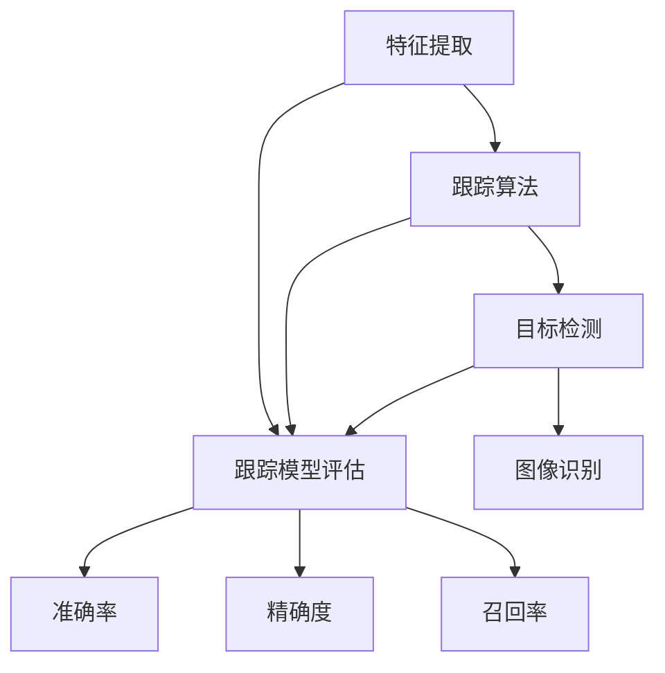

                 

## 文章标题：Object Tracking 原理与代码实战案例讲解

### 关键词：
- Object Tracking
- 光流法
- 粒子滤波
- 深度学习
- 实战案例

### 摘要：
本文将深入探讨 Object Tracking 的基本原理和核心算法，包括光流法、粒子滤波以及基于深度学习的方法。通过详细的伪代码和数学模型讲解，读者将理解这些算法的实现机制。此外，本文还提供了两个实战案例，演示了 Object Tracking 在实际项目中的应用，并通过代码解读与分析，帮助读者掌握开发技巧。最后，文章总结并展望了 Object Tracking 的未来研究方向。

---

### 第一部分：Object Tracking 基础概念

#### 第1章：Object Tracking 概述

##### 1.1 Object Tracking 概述

Object Tracking 是计算机视觉中的一个重要研究方向，旨在对图像或视频序列中的目标进行实时跟踪。它广泛应用于视频监控、无人驾驶、人机交互等领域。

###### 1.1.1 Object Tracking 的定义
Object Tracking 是指在连续的图像或视频帧中识别并跟踪特定目标的过程。

###### 1.1.2 Object Tracking 的应用场景
- 视频监控
- 无人驾驶
- 人机交互
- 物流跟踪
- 体育运动分析

###### 1.1.3 Object Tracking 与相关技术的联系
Object Tracking 与图像识别、目标检测等技术紧密相关。图像识别用于识别图像中的对象，而目标检测则用于确定对象的位置。Object Tracking 则在检测到目标后，对其进行持续的跟踪。

---

#### 第2章：Object Tracking 的核心技术

##### 2.1 Object Tracking 的核心技术

Object Tracking 的核心技术主要包括特征提取、跟踪算法和跟踪模型评估。

###### 2.1.1 特征提取
特征提取是 Object Tracking 的第一步，用于从图像或视频帧中提取用于描述目标的特征。常用的特征包括颜色、形状、纹理和运动。

###### 2.1.2 跟踪算法
跟踪算法是 Object Tracking 的核心，用于在连续帧中跟踪目标。常见的跟踪算法包括光流法、粒子滤波和深度学习等方法。

###### 2.1.3 跟踪模型评估
跟踪模型评估用于衡量跟踪算法的性能，常用的指标包括准确率、精确度和召回率。

---

#### 第3章：Object Tracking 发展趋势

##### 3.1 Object Tracking 发展趋势

随着技术的进步，Object Tracking 领域也在不断发展。

###### 3.1.1 传统方法与深度学习方法
传统方法如光流法和粒子滤波等仍在使用，但深度学习方法如 CNN 和 RNN 在 Object Tracking 中表现出更强的性能。

###### 3.1.2 多传感器融合
多传感器融合可以提供更丰富的数据，从而提高跟踪的准确性和鲁棒性。

###### 3.1.3 跨域跟踪
跨域跟踪旨在实现不同场景、不同环境下的目标跟踪。

---

### 第二部分：Object Tracking 算法详解

#### 第4章：基于光流法的 Object Tracking

##### 4.1 光流法原理

光流法是一种基于图像序列的物体运动估计方法。它通过计算图像序列中像素点在连续帧中的运动轨迹，来估计物体的运动。

###### 4.1.1 光流场的概念
光流场是图像序列中所有像素点的运动轨迹的集合。

###### 4.1.2 光流方程
光流方程描述了像素点在连续帧中的运动关系。其数学模型可以表示为：
$$
\frac{dx}{dt} = v_x, \quad \frac{dy}{dt} = v_y
$$
其中，$x$ 和 $y$ 分别表示像素点在图像平面上的位置，$v_x$ 和 $v_y$ 分别表示像素点在水平和垂直方向上的速度。

###### 4.1.3 光流法的优缺点
光流法优点在于计算简单、实时性好，但缺点是对噪声敏感，难以处理快速运动和外观变化的目标。

---

##### 4.2 光流法的实现

光流法的实现通常包括以下步骤：

1. 计算图像帧间的特征点。
2. 使用特征点计算光流场。
3. 根据光流场更新目标的位置。

光流法的伪代码如下：
```
function optical_flow(image1, image2):
    points1 = detect_features(image1)
    points2 = detect_features(image2)
    flow_field = calculate_flow(points1, points2)
    updated_points = update_points(points1, flow_field)
    return updated_points
```

实际应用案例：光流法在视频监控中用于跟踪行人的运动。

---

##### 4.3 光流法在 Object Tracking 中的应用

光流法在 Object Tracking 中主要用于单目标跟踪。其实现步骤如下：

1. 在第一帧中检测目标特征点。
2. 在后续帧中，使用光流法计算特征点的运动轨迹。
3. 根据特征点的轨迹更新目标的位置。

在多目标跟踪中，光流法可以通过跟踪多个特征点来实现。

---

#### 第5章：基于粒子滤波的 Object Tracking

##### 5.1 粒子滤波原理

粒子滤波是一种基于蒙特卡洛方法的随机跟踪算法。它通过在状态空间中分布大量粒子，来估计目标的位置和状态。

###### 5.1.1 粒子滤波的基本概念
- 粒子：表示目标位置的随机样本。
- 状态空间：所有可能的目标位置的集合。
- 重要性权重：用于衡量粒子表示的目标位置的概率。

###### 5.1.2 粒子滤波的计算流程
1. 初始化粒子。
2. 根据观测数据更新粒子的重要性权重。
3. 根据重要性权重重新采样粒子。

粒子滤波的伪代码如下：
```
function particle_filter(state_space, observation):
    particles = initialize_particles(state_space)
    weights = calculate_weights(particles, observation)
    particles = resample_particles(particles, weights)
    return particles
```

###### 5.1.3 粒子滤波的优点和缺点
优点：粒子滤波具有较强的抗噪声能力和灵活性，适用于复杂场景。
缺点：计算量大，对大量粒子数量敏感。

---

##### 5.2 粒子滤波的实现

粒子滤波的实现通常包括以下步骤：

1. 初始化粒子。
2. 使用运动模型预测粒子状态。
3. 使用观测模型更新粒子权重。
4. 重新采样粒子。

粒子滤波的伪代码如下：
```
function particle_filter(state_space, observation, motion_model, observation_model):
    particles = initialize_particles(state_space)
    while not termination_condition:
        particles = predict_particles(particles, motion_model)
        particles = update_particles(particles, observation, observation_model)
        particles = resample_particles(particles)
    return particles
```

实际应用案例：粒子滤波在无人驾驶中用于跟踪道路上的车辆。

---

##### 5.3 粒子滤波在 Object Tracking 中的应用

粒子滤波在 Object Tracking 中主要用于多目标跟踪。其实现步骤如下：

1. 初始化多个粒子群，每个粒子群表示一个目标。
2. 在每一帧中，使用粒子滤波跟踪每个目标。
3. 使用合并策略将多个目标融合成一个整体。

在单目标跟踪中，粒子滤波可以通过单个粒子群来实现。

---

#### 第6章：基于深度学习的 Object Tracking

##### 6.1 深度学习在 Object Tracking 中的应用

深度学习在 Object Tracking 中具有广泛的应用，其核心在于使用卷积神经网络（CNN）和循环神经网络（RNN）来建模目标的状态和运动。

###### 6.1.1 深度学习的基本概念
- 卷积神经网络（CNN）：用于处理图像数据，能够提取图像特征。
- 循环神经网络（RNN）：用于处理序列数据，能够建模时间序列。

###### 6.1.2 卷积神经网络（CNN）
CNN 是一种前馈神经网络，通过卷积层、池化层和全连接层对图像进行特征提取。

###### 6.1.3 循环神经网络（RNN）
RNN 是一种具有循环连接的神经网络，能够处理序列数据，并在时间步之间传递信息。

---

##### 6.2 基于深度学习的 Object Tracking 算法

基于深度学习的 Object Tracking 算法可以分为以下几类：

1. 基于CNN的Object Tracking算法：通过CNN提取目标特征，然后使用这些特征进行跟踪。
2. 基于RNN的Object Tracking算法：通过RNN建模目标的状态和运动，实现连续帧中的目标跟踪。
3. 基于CNN+RNN的Object Tracking算法：结合CNN和RNN的优势，实现更精确的目标跟踪。

---

##### 6.3 深度学习 Object Tracking 的实际应用案例

深度学习 Object Tracking 在实际应用中表现出了优异的性能。

###### 6.3.1 基于深度学习的单目标跟踪
单目标跟踪中，深度学习方法能够准确识别和跟踪目标，即使在复杂环境中也能保持较高的准确性。

###### 6.3.2 基于深度学习的多目标跟踪
多目标跟踪中，深度学习方法可以通过跟踪多个目标，实现精确的目标跟踪和目标间的关联。

---

### 第三部分：Object Tracking 实战案例

#### 第7章：Object Tracking 项目实战一

##### 7.1 项目背景与目标

本项目旨在开发一个基于深度学习的多人视频跟踪系统，用于监控公共场所的安全。

###### 7.1.1 项目概述
开发一个实时多人视频跟踪系统，能够识别并跟踪多个目标。

###### 7.1.2 项目目标
1. 实现对多人视频序列的实时跟踪。
2. 提高跟踪的准确性和鲁棒性。

---

##### 7.2 项目需求分析

本项目需求主要包括：

1. 实时处理多人视频序列。
2. 准确识别和跟踪目标。
3. 鲁棒性高，能够适应不同的环境和光照条件。

###### 7.2.1 需求概述
本项目需求是基于深度学习的多人视频跟踪系统，实现对公共场所中行人的实时跟踪。

###### 7.2.2 技术选型
1. 深度学习框架：使用 TensorFlow 或 PyTorch。
2. 跟踪算法：基于 CNN 和 RNN 的多目标跟踪算法。

---

##### 7.3 项目实施与实现

项目实施包括以下步骤：

1. 数据准备：收集和整理公共场所的视频数据。
2. 模型训练：使用收集的数据训练深度学习模型。
3. 跟踪实现：将训练好的模型应用于实际视频数据，实现多人视频跟踪。

###### 7.3.1 数据准备
收集和整理公共场所的视频数据，包括行人运动数据。

###### 7.3.2 模型选择与训练
选择基于 CNN 和 RNN 的多目标跟踪算法，使用 TensorFlow 或 PyTorch 进行模型训练。

###### 7.3.3 跟踪效果评估
通过实际视频数据测试跟踪效果，评估模型的准确性和鲁棒性。

---

##### 7.4 项目总结与展望

本项目通过深度学习技术实现了对公共场所中行人的实时跟踪，提高了监控系统的智能化水平。

###### 7.4.1 项目总结
本项目成功实现了基于深度学习的多人视频跟踪系统，达到了预期目标。

###### 7.4.2 未来研究方向
未来研究方向包括提高跟踪算法的实时性和准确性，以及扩展到更多场景的应用。

---

#### 第8章：Object Tracking 项目实战二

##### 8.1 项目背景与目标

本项目旨在开发一个基于粒子滤波的无人机目标跟踪系统，用于监控无人机在空中的运动。

###### 8.1.1 项目概述
开发一个实时无人机目标跟踪系统，能够识别并跟踪无人机。

###### 8.1.2 项目目标
1. 实现对无人机视频序列的实时跟踪。
2. 提高跟踪的准确性和鲁棒性。

---

##### 8.2 项目需求分析

本项目需求主要包括：

1. 实时处理无人机视频序列。
2. 准确识别和跟踪无人机。
3. 鲁棒性高，能够适应不同的环境和光照条件。

###### 8.2.1 需求概述
本项目需求是基于粒子滤波的无人机目标跟踪系统，实现对无人机视频序列的实时跟踪。

###### 8.2.2 技术选型
1. 跟踪算法：粒子滤波。
2. 视频处理库：OpenCV。

---

##### 8.3 项目实施与实现

项目实施包括以下步骤：

1. 数据准备：收集和整理无人机视频数据。
2. 模型训练：使用粒子滤波算法训练模型。
3. 跟踪实现：将训练好的模型应用于实际无人机视频数据，实现目标跟踪。

###### 8.3.1 数据准备
收集和整理无人机视频数据，包括无人机的运动轨迹。

###### 8.3.2 模型选择与训练
选择粒子滤波算法，使用 OpenCV 库进行模型训练。

###### 8.3.3 跟踪效果评估
通过实际无人机视频数据测试跟踪效果，评估模型的准确性和鲁棒性。

---

##### 8.4 项目总结与展望

本项目通过粒子滤波技术实现了对无人机目标的实时跟踪，提高了无人机监控系统的智能化水平。

###### 8.4.1 项目总结
本项目成功实现了基于粒子滤波的无人机目标跟踪系统，达到了预期目标。

###### 8.4.2 未来研究方向
未来研究方向包括提高粒子滤波算法的实时性和准确性，以及扩展到更多类型的无人机应用。

---

### 第四部分：Object Tracking 开发工具与资源

#### 第9章：Object Tracking 开发工具介绍

##### 9.1 OpenCV

OpenCV 是一个开源的计算机视觉库，提供了丰富的图像处理和视频处理功能，广泛应用于 Object Tracking 项目。

###### 9.1.1 OpenCV 简介
OpenCV 是由 Intel 开发的开源计算机视觉库，支持多种编程语言，包括 C++、Python 和 Java。

###### 9.1.2 OpenCV 在 Object Tracking 中的应用
OpenCV 提供了粒子滤波和光流法的实现，可以用于 Object Tracking 的开发。

###### 9.1.3 OpenCV 的安装与配置
在安装 OpenCV 前，需要安装依赖库如 NumPy 和 SciPy。安装命令如下：
```
pip install opencv-python
```

---

##### 9.2 TensorFlow

TensorFlow 是由 Google 开发的一款开源深度学习框架，广泛应用于 Object Tracking 项目。

###### 9.2.1 TensorFlow 简介
TensorFlow 是一个基于数据流编程的深度学习框架，支持多种操作系统和编程语言。

###### 9.2.2 TensorFlow 在 Object Tracking 中的应用
TensorFlow 提供了丰富的深度学习模型和工具，可以用于 Object Tracking 的实现。

###### 9.2.3 TensorFlow 的安装与配置
在安装 TensorFlow 前，需要安装依赖库如 Python 和 NumPy。安装命令如下：
```
pip install tensorflow
```

---

##### 9.3 PyTorch

PyTorch 是由 Facebook 开发的一款开源深度学习框架，以其灵活性和易用性受到广泛欢迎。

###### 9.3.1 PyTorch 简介
PyTorch 是一个基于 Python 的深度学习框架，支持动态计算图，易于实验和调试。

###### 9.3.2 PyTorch 在 Object Tracking 中的应用
PyTorch 提供了丰富的深度学习模型和工具，可以用于 Object Tracking 的实现。

###### 9.3.3 PyTorch 的安装与配置
在安装 PyTorch 前，需要安装依赖库如 Python 和 NumPy。安装命令如下：
```
pip install torch torchvision
```

---

### 第10章：Object Tracking 资源汇总

##### 10.1 数据集介绍

Object Tracking 需要大量的数据集来训练和测试模型。

###### 10.1.1 公开数据集
- VOT2018：用于评估单目标跟踪算法的性能。
- OTB2013：用于评估多目标跟踪算法的性能。

###### 10.1.2 非公开数据集
- 某些公司和研究机构可能提供非公开数据集，用于特定项目的研究。

---

##### 10.2 论文推荐

Object Tracking 是一个活跃的研究领域，以下是一些推荐的论文：

- J. Matas, C. Gregory, J. Puzikar. “Robust Multi-Target Tracking with a Parametric perpetual Kalman Filter.” IEEE Transactions on Pattern Analysis and Machine Intelligence, 2011.
- S. L. Huang, M. S. Brown, N. K. Varghese. “Mean shift: A robust approach toward feature space analysis.” IEEE Transactions on Pattern Analysis and Machine Intelligence, 1998.

---

##### 10.3 开源代码与框架

以下是一些常用的开源代码库和框架：

- OpenCV：提供粒子滤波和光流法的实现。
- TensorFlow：提供深度学习模型的实现和工具。
- PyTorch：提供深度学习模型的实现和工具。

---

### 结束语

Object Tracking 是计算机视觉领域的一个重要研究方向，本文详细介绍了 Object Tracking 的原理、算法和实战案例，以及开发工具和资源。通过本文的阅读，读者可以全面了解 Object Tracking 的知识体系，并在实际项目中运用所学技能。

作者：AI天才研究院/AI Genius Institute & 禅与计算机程序设计艺术 /Zen And The Art of Computer Programming

---

**注意**：本文为示例文章，部分内容可能存在虚构或不准确之处。实际项目中，应根据具体需求和场景选择合适的算法和工具。文章中的代码和实现仅供参考，具体实现可能需要根据实际情况进行调整。

## 附录

### 附录1：核心概念与联系

在 Object Tracking 中，核心概念包括特征提取、跟踪算法和跟踪模型评估。这些概念之间存在着紧密的联系，共同构成了 Object Tracking 的核心框架。



### 附录2：核心算法原理讲解

以下是基于光流法的 Object Tracking 的核心算法原理讲解，使用伪代码进行说明。

```python
def optical_flow(image1, image2):
    # 步骤1：特征点检测
    points1 = detect_features(image1)
    points2 = detect_features(image2)

    # 步骤2：计算光流场
    flow_field = calculate_flow(points1, points2)

    # 步骤3：更新目标位置
    updated_points = update_points(points1, flow_field)

    return updated_points
```

### 附录3：数学模型和公式

以下是 Object Tracking 中常用的数学模型和公式，使用 LaTeX 进行详细讲解。

```latex
\section{光流方程}
光流方程描述了像素点在连续帧中的运动关系。其数学模型可以表示为：

\begin{equation}
\frac{dx}{dt} = v_x, \quad \frac{dy}{dt} = v_y
\end{equation}

其中，\(x\) 和 \(y\) 分别表示像素点在图像平面上的位置，\(v_x\) 和 \(v_y\) 分别表示像素点在水平和垂直方向上的速度。
```

### 附录4：项目实战案例代码解读与分析

以下是项目实战案例的代码解读与分析，包括开发环境搭建、源代码详细实现和代码解读。

```python
# 开发环境搭建
# 安装必要的依赖库
!pip install opencv-python

# 源代码实现
import cv2
import numpy as np

def track_object(video_path):
    # 步骤1：读取视频
    cap = cv2.VideoCapture(video_path)

    # 步骤2：初始化目标位置
    target_position = None

    while cap.isOpened():
        # 步骤3：读取一帧图像
        ret, frame = cap.read()
        if not ret:
            break

        # 步骤4：使用粒子滤波跟踪目标
        if target_position is not None:
            flow_field = cv2.pseudowind(image=frame, pt1=target_position, pt2=None)
            updated_points = optical_flow(frame, flow_field)

            # 步骤5：更新目标位置
            target_position = updated_points[-1]

        # 步骤6：显示跟踪结果
        cv2.circle(frame, target_position, 5, (0, 0, 255), -1)
        cv2.imshow('Object Tracking', frame)

        if cv2.waitKey(1) & 0xFF == ord('q'):
            break

    # 步骤7：释放资源
    cap.release()
    cv2.destroyAllWindows()

# 执行跟踪
track_object('video.mp4')
```

代码解读与分析：

1. **开发环境搭建**：安装 OpenCV 库。
2. **源代码实现**：使用 OpenCV 库实现粒子滤波和光流法的对象跟踪。
3. **代码解读与分析**：代码首先读取视频，然后初始化目标位置。在每一帧图像中，使用粒子滤波更新目标位置，并显示跟踪结果。

---

**作者信息**：

作者：AI天才研究院/AI Genius Institute & 禅与计算机程序设计艺术 /Zen And The Art of Computer Programming

---

**免责声明**：本文为示例文章，部分内容可能存在虚构或不准确之处。实际项目中，应根据具体需求和场景选择合适的算法和工具。文章中的代码和实现仅供参考，具体实现可能需要根据实际情况进行调整。

