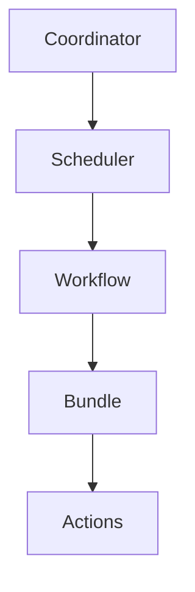

                 

# Oozie原理与代码实例讲解

## 摘要

本文将深入探讨Oozie工作流协调系统的基础概念、架构设计、核心组件、算法原理以及实际项目应用。通过系统性的讲解和实际代码实例的分析，读者将能够全面了解Oozie的工作原理，掌握其核心算法，并学会如何在实际项目中应用Oozie。文章最后还将探讨Oozie的未来发展趋势和扩展资源，帮助读者继续深入学习。

## 引言

### 1.1 Oozie的背景与历史

Oozie是由Apache软件基金会开发的一个开源工作流管理系统，主要用于协调和管理Hadoop生态系统中的各种任务。它的设计初衷是为了解决Hadoop生态系统中不同组件之间复杂的依赖关系和调度问题。

Oozie的诞生可以追溯到2008年，当时Google推出了MapReduce，引领了分布式计算的新潮流。随着Hadoop生态系统的不断发展，越来越多的计算任务被引入到这个生态系统中，包括但不限于MapReduce、Spark、Hive、Pig等。然而，这些任务之间往往存在着复杂的依赖关系，如何有效地协调和管理这些任务成为了一个难题。

Oozie应运而生，它提供了一个统一的工作流协调平台，能够轻松地定义和管理复杂的依赖关系，使得开发者可以更专注于业务逻辑的实现，而无需过多地关注任务调度和依赖管理的细节。

### 1.2 Oozie在现代大数据处理中的地位

在现代大数据处理中，Oozie占据了重要地位。它不仅能够协调Hadoop生态系统中的各种任务，还能够与其他大数据处理框架（如Spark、Flink等）无缝集成，从而实现更广泛的应用场景。

Oozie的主要优势在于其易用性、灵活性和稳定性。首先，Oozie提供了直观的图形界面和简单的XML配置文件，使得开发者可以轻松地定义和管理工作流。其次，Oozie支持多种类型的任务，如Shell脚本、Java程序、MapReduce作业、Spark作业等，满足了不同场景的需求。最后，Oozie具有高度的稳定性，能够在大规模分布式环境中稳定运行。

然而，Oozie也面临一些挑战。例如，随着大数据处理框架的多样化和复杂性增加，Oozie需要不断更新和扩展以支持新的框架。此外，随着云计算的普及，Oozie也需要适应云原生环境，提供更加灵活和高效的调度和管理能力。

### 1.3 本书结构安排与目标读者

本书将分为以下几个部分：

1. 引言：介绍Oozie的背景、历史和现状。
2. Oozie基础概念：讲解Oozie的核心概念和架构设计。
3. Oozie核心组件原理：深入分析Oozie的核心组件和工作机制。
4. Oozie核心算法原理讲解：详细阐述Oozie的核心算法和数学模型。
5. Oozie项目实战案例：通过实际案例展示Oozie的应用。
6. Oozie性能调优与故障排查：介绍Oozie的性能优化和故障排查方法。
7. Oozie的未来发展趋势：探讨Oozie的未来发展方向。
8. 附录：提供学习资源与扩展阅读。

本书的目标读者包括：

- 大数据开发工程师：希望了解Oozie的工作原理和应用。
- Hadoop生态系统爱好者：对Oozie及其在Hadoop生态系统中的作用感兴趣。
- 对工作流管理系统感兴趣的程序员：希望了解Oozie与其他工作流管理系统的比较。

## Oozie基础概念

### 2.1 Oozie架构简介

Oozie架构设计旨在提供一种灵活、可扩展的工作流管理系统，能够协调和管理Hadoop生态系统中的各种任务。Oozie的核心组件包括Coordinator、Scheduler、Workflow和Bundle。

#### 2.1.1 Oozie组件关系

Oozie组件之间的关系可以用以下Mermaid流程图表示：



- **Coordinator**：协调者，负责协调和管理整个Oozie工作流程。它负责接收用户的请求，将请求转换为具体的任务，并监控任务的执行状态。
- **Scheduler**：调度器，负责根据配置调度Workflow。它根据时间触发条件、依赖关系和资源状况来决定何时执行Workflow。
- **Workflow**：工作流，由一系列Task组成，每个Task代表一个具体的操作。Workflow定义了任务的执行顺序、依赖关系和执行策略。
- **Bundle**：包，由多个Workflow组成，用于批量执行多个Workflow。Bundle提供了对多个Workflow并行执行的支持。
- **Actions**：动作，代表具体的任务，可以是Shell、Java、MapReduce、Spark等类型。Action是Workflow的基本构建块，负责执行具体的业务逻辑。

#### 2.1.2 Oozie工作原理

Oozie的工作原理可以概括为以下几个步骤：

1. **任务提交**：用户通过Coordinator提交任务，Coordinator将任务存储在数据库中。
2. **任务调度**：Scheduler根据配置和当前时间，决定哪些任务需要被执行，并将任务分配给集群资源。
3. **任务执行**：分配到资源的任务开始执行，每个任务通过Action执行具体的业务逻辑。
4. **任务监控**：Coordinator和Scheduler持续监控任务的执行状态，并在任务完成或失败时进行处理。
5. **任务结果处理**：任务执行完成后，Coordinator将结果存储在数据库中，供用户查询和使用。

### 2.2 Workflow与Bundle详解

#### 2.2.1 Workflow的概念与结构

**Workflow** 是Oozie中的核心概念，它定义了一组Task的执行顺序和依赖关系。一个Workflow可以包含多个Task，每个Task可以执行不同的操作，例如执行Shell脚本、运行MapReduce作业等。

**Workflow的结构** 包括以下几个部分：

- **Start**：Workflow的开始节点，表示Workflow的开始。
- **End**：Workflow的结束节点，表示Workflow的结束。
- **Task**：Workflow中的具体操作节点，每个Task都可以是一个具体的动作，如Shell、Java、MapReduce等。
- **Connector**：连接节点，用于连接不同的Task，定义Task之间的执行顺序和依赖关系。

**Workflow的执行流程** 如下：

1. Workflow启动，执行第一个Task。
2. 每个Task执行完成后，根据Connector的配置，跳转到下一个Task。
3. 如果Task执行失败，根据Connector的配置，执行重试或跳转到指定的Task。
4. Workflow执行到最后一个Task，Workflow结束。

#### 2.2.2 Bundle的概念与作用

**Bundle** 是Oozie中用于批量执行多个Workflow的概念。它可以将多个Workflow组织在一起，实现对多个Workflow的并行执行和集中管理。

**Bundle的作用** 包括：

- **并行执行**：通过Bundle，可以同时执行多个Workflow，提高任务的执行效率。
- **集中管理**：Bundle提供了对多个Workflow的统一管理，便于监控和管理多个Workflow的执行状态。

**Bundle的元素** 包括：

- **Workflow**：Bundle中的基本单元，代表一个具体的工作流。
- **Scheduler**：负责调度Bundle中的Workflow，根据配置和当前时间决定Workflow的执行顺序。
- **Coordinator**：协调Bundle中的所有Workflow，确保Workflow按照预期执行。

**Bundle的执行策略** 包括：

- **并行执行**：同时执行多个Workflow，每个Workflow独立执行。
- **顺序执行**：依次执行多个Workflow，前一个Workflow完成后再执行下一个。

### 2.3 Action的用法

**Action** 是Oozie中的具体操作单元，用于执行各种任务。Oozie支持多种类型的Action，包括Shell、Java、MapReduce、Spark等。

#### 2.3.1 Action的类型

- **Shell Action**：执行Shell脚本，常用于执行简单的系统命令或脚本。
- **Java Action**：执行Java程序，可以执行更复杂的数据处理逻辑。
- **MapReduce Action**：执行MapReduce作业，适用于大规模数据处理的场景。
- **Spark Action**：执行Spark作业，适用于实时数据处理和复杂计算任务。

#### 2.3.2 Action的配置与执行

**Action的配置** 包括以下几个部分：

- **Action类型**：指定Action的类型，如Shell、Java、MapReduce等。
- **执行参数**：配置Action的执行参数，如脚本路径、程序路径、作业配置等。
- **依赖关系**：配置Action的依赖关系，确定Action之间的执行顺序。

**Action的执行** 包括以下几个步骤：

1. Coordinator接收用户的请求，将请求转换为具体的Action。
2. Scheduler根据Action的配置和依赖关系，决定Action的执行顺序。
3. Action开始执行，执行具体的业务逻辑。
4. Coordinator和Scheduler监控Action的执行状态，并在Action完成或失败时进行处理。

## Oozie核心组件原理

### 3.1 Coordinator组件原理

**Coordinator** 是Oozie中的核心组件之一，负责协调和管理整个工作流的执行。它主要负责以下任务：

1. **任务接收**：Coordinator接收用户的请求，将请求转换为具体的工作流任务。
2. **任务调度**：Coordinator根据工作流任务的依赖关系和执行策略，决定任务执行的顺序。
3. **任务执行**：Coordinator将任务分配给集群资源，并监控任务的执行状态。
4. **任务结果处理**：Coordinator处理任务执行的结果，并将结果存储在数据库中。

#### 3.1.1 Coordinator工作原理

Coordinator的工作原理可以概括为以下几个步骤：

1. **任务提交**：用户通过Oozie接口提交工作流任务，Coordinator接收到任务请求。
2. **任务存储**：Coordinator将任务存储在数据库中，并生成唯一的任务ID。
3. **任务调度**：Coordinator根据任务的依赖关系和执行策略，决定任务执行的顺序。
4. **任务分配**：Coordinator将任务分配给集群资源，如Hadoop集群、YARN资源等。
5. **任务执行**：任务在分配到的资源上开始执行，Coordinator监控任务的执行状态。
6. **任务结果处理**：任务执行完成后，Coordinator处理任务的结果，如成功、失败或异常等，并将结果存储在数据库中。

#### 3.1.2 Coordinator配置与维护

**Coordinator的配置** 主要包括以下几个方面：

- **数据库配置**：Coordinator需要连接到数据库，用于存储任务信息和执行状态。
- **资源配置**：Coordinator需要配置可用的集群资源和资源管理器，如Hadoop集群、YARN资源等。
- **日志配置**：Coordinator需要配置日志存储位置和日志级别，以便监控和调试。

**Coordinator的维护** 包括以下几个方面：

- **监控与报警**：定期监控Coordinator的运行状态，并在发生异常时发送报警。
- **日志分析**：定期分析Coordinator的日志，检查潜在的问题和错误。
- **升级与补丁**：定期升级Coordinator到最新版本，并应用安全补丁。

### 3.2 Scheduler组件原理

**Scheduler** 是Oozie中的另一个核心组件，负责调度工作流任务的执行。它主要负责以下任务：

1. **任务调度**：根据任务的时间触发条件和依赖关系，决定任务的执行顺序。
2. **任务分配**：根据资源可用性，将任务分配给集群资源。
3. **任务监控**：监控任务的执行状态，并在任务完成或失败时进行处理。

#### 3.2.1 Scheduler工作原理

Scheduler的工作原理可以概括为以下几个步骤：

1. **任务调度**：Scheduler根据任务的时间触发条件和依赖关系，决定任务的执行顺序。时间触发条件可以是固定时间、周期性时间或基于其他任务的完成状态。
2. **任务分配**：Scheduler根据资源可用性，将任务分配给集群资源。资源可用性取决于资源的配置和当前的使用情况。
3. **任务执行**：任务在分配到的资源上开始执行，Scheduler监控任务的执行状态。
4. **任务结果处理**：任务执行完成后，Scheduler处理任务的结果，如成功、失败或异常等，并将结果存储在数据库中。

#### 3.2.2 Scheduler配置与优化

**Scheduler的配置** 主要包括以下几个方面：

- **时间触发配置**：配置任务的时间触发条件，如固定时间、周期性时间或基于其他任务的完成状态。
- **依赖关系配置**：配置任务的依赖关系，确定任务的执行顺序。
- **资源配置**：配置可用的集群资源和资源管理器，如Hadoop集群、YARN资源等。
- **日志配置**：配置日志存储位置和日志级别，以便监控和调试。

**Scheduler的优化** 包括以下几个方面：

- **任务调度优化**：根据任务的执行时间和依赖关系，优化任务的调度策略，提高任务的执行效率。
- **资源分配优化**：根据资源的使用情况和任务的负载，优化资源的分配策略，提高资源的利用效率。
- **日志分析与优化**：定期分析Scheduler的日志，检查潜在的问题和错误，并根据分析结果进行优化。

### 3.3 Action组件原理

**Action** 是Oozie中的具体操作单元，用于执行各种任务。Oozie支持多种类型的Action，包括Shell、Java、MapReduce、Spark等。

#### 3.3.1 Shell、Java、MapReduce、Spark等Action

**Shell Action**：执行Shell脚本，常用于执行简单的系统命令或脚本。配置Shell Action时，需要指定脚本的路径和执行参数。

**Java Action**：执行Java程序，可以执行更复杂的数据处理逻辑。配置Java Action时，需要指定Java程序的路径和执行参数。

**MapReduce Action**：执行MapReduce作业，适用于大规模数据处理的场景。配置MapReduce Action时，需要指定MapReduce作业的路径和配置参数。

**Spark Action**：执行Spark作业，适用于实时数据处理和复杂计算任务。配置Spark Action时，需要指定Spark作业的路径和配置参数。

#### 3.3.2 Action配置与错误处理

**Action配置** 主要包括以下几个方面：

- **类型配置**：指定Action的类型，如Shell、Java、MapReduce、Spark等。
- **路径配置**：指定Action的路径，如脚本路径、程序路径、作业路径等。
- **参数配置**：指定Action的执行参数，如脚本参数、程序参数、作业参数等。
- **依赖关系配置**：配置Action之间的依赖关系，确定Action的执行顺序。

**错误处理** 包括以下几个方面：

- **错误日志记录**：在Action执行失败时，记录详细的错误日志，便于分析和调试。
- **重试配置**：配置Action的重试次数和重试间隔，确保Action在失败时能够自动重试。
- **错误处理策略**：配置错误处理策略，如跳过失败的任务、暂停整个工作流等。

## Oozie高级特性与优化

### 4.1 流程并行与分片

#### 4.1.1 并行执行原理

Oozie支持流程并行执行，允许在同一时间执行多个任务。并行执行可以提高任务的执行效率，特别是在处理大量数据或复杂任务时。

并行执行的原理如下：

1. **任务分解**：将一个大任务分解为多个小任务。
2. **任务调度**：Oozie根据任务的依赖关系和资源状况，将任务分配到不同的资源上。
3. **任务执行**：分配到资源的任务并行执行。
4. **任务结果合并**：任务执行完成后，Oozie将结果合并，生成最终结果。

#### 4.1.2 分片执行原理

分片执行是并行执行的一种特殊形式，它将一个任务分成多个分片，每个分片独立执行。分片执行可以提高任务的容错性和伸缩性。

分片执行的原理如下：

1. **任务分片**：将一个大任务分成多个小任务，每个任务负责处理一部分数据。
2. **任务调度**：Oozie根据任务的依赖关系和资源状况，将分片任务分配到不同的资源上。
3. **任务执行**：分配到资源的分片任务独立执行。
4. **任务结果合并**：分片任务执行完成后，Oozie将结果合并，生成最终结果。

### 4.2 数据集成与调度优化

#### 4.2.1 数据集成原理

Oozie支持数据集成，允许在不同任务之间传输数据。数据集成可以通过文件系统、数据库、消息队列等实现。

数据集成的原理如下：

1. **数据源配置**：配置数据源的路径和格式，如文件路径、数据库连接等。
2. **数据目标配置**：配置数据的目标路径和格式，如文件路径、数据库连接等。
3. **数据传输**：Oozie根据配置，将数据从数据源传输到数据目标。

#### 4.2.2 调度优化技巧

调度优化是提高Oozie性能的关键。以下是一些调度优化技巧：

1. **任务分解**：将大任务分解为小任务，减少任务的依赖关系，提高并行度。
2. **资源分配**：根据任务的特点和资源状况，合理分配资源，避免资源瓶颈。
3. **依赖关系优化**：优化任务的依赖关系，减少任务的等待时间。
4. **调度策略调整**：根据任务的特点和执行情况，调整调度策略，提高任务执行效率。

### 4.3 Oozie与Hadoop生态系统整合

Oozie与Hadoop生态系统紧密整合，支持与HDFS、YARN等组件的集成。

#### 4.3.1 Oozie与HDFS整合

Oozie与HDFS的整合主要涉及数据存储和传输。Oozie可以将数据存储在HDFS上，也可以从HDFS读取数据。

#### 4.3.2 Oozie与YARN整合

Oozie与YARN的整合主要涉及资源管理和任务调度。Oozie可以与YARN协同工作，根据资源状况和任务需求，动态调整任务分配。

## Oozie项目实战案例解析

### 5.1 数据处理流程设计

#### 5.1.1 数据采集与预处理

数据采集与预处理是数据处理流程的重要步骤。以下是一个数据处理流程设计示例：

1. **数据采集**：从日志文件中读取数据，使用Shell Action执行cat命令，将日志文件内容输出到标准输出。
2. **数据预处理**：使用Python Action对采集到的数据进行预处理，包括数据清洗、去重和格式转换等操作。

#### 5.1.2 数据存储与查询

数据存储与查询是数据处理流程的最后一步。以下是一个数据处理流程设计示例：

1. **数据存储**：将预处理后的数据存储到HDFS上，使用HDFS Action将数据写入HDFS。
2. **数据查询**：提供数据查询接口，使用Hive Action执行Hive查询，从HDFS中读取数据并返回查询结果。

### 5.2 机器学习任务调度

#### 5.2.1 机器学习模型训练

机器学习模型训练是机器学习任务的重要步骤。以下是一个机器学习任务调度流程设计示例：

1. **数据准备**：从数据存储中读取数据，使用Hive Action执行Hive查询，获取训练数据和测试数据。
2. **模型训练**：使用Spark Action执行Spark MLlib库中的机器学习算法，对训练数据进行训练。
3. **模型评估**：使用测试数据对训练好的模型进行评估，使用Spark Action执行评估算法。

#### 5.2.2 模型评估与部署

模型评估与部署是机器学习任务的最后一步。以下是一个模型评估与部署流程设计示例：

1. **模型评估**：使用测试数据对训练好的模型进行评估，使用Spark Action执行评估算法。
2. **模型部署**：将评估结果存储到数据库中，使用数据库连接器Action将评估结果写入数据库。
3. **模型发布**：将评估结果发布到外部系统，如消息队列、API等，使用HTTP Action发送HTTP请求。

### 5.3 大数据处理流程优化

#### 5.3.1 性能瓶颈分析

性能瓶颈分析是大数据处理流程优化的重要步骤。以下是一个性能瓶颈分析示例：

1. **日志分析**：使用Log Analyzer工具分析Oozie执行日志，确定性能瓶颈。
2. **资源监控**：使用资源监控工具（如Ganglia、Nagios等）监控集群资源使用情况，确定资源瓶颈。
3. **任务监控**：使用Oozie UI监控任务执行状态，确定任务瓶颈。

#### 5.3.2 优化策略与实践

优化策略与实践是根据性能瓶颈分析结果，制定并实施优化策略。以下是一个优化策略与实践示例：

1. **任务分解**：将大任务分解为小任务，减少任务的依赖关系，提高并行度。
2. **资源调整**：根据任务负载和资源使用情况，调整资源分配策略，避免资源瓶颈。
3. **调度优化**：调整调度策略，优化任务的执行顺序，提高任务执行效率。
4. **代码优化**：优化任务代码，减少任务执行时间。

## Oozie项目开发实战

### 6.1 项目环境搭建

#### 6.1.1 开发环境配置

开发环境配置包括安装Java环境、Hadoop环境和Oozie环境。

1. **安装Java环境**：下载并安装Java Development Kit（JDK），配置环境变量。
2. **安装Hadoop环境**：下载并安装Hadoop，配置Hadoop环境变量，启动Hadoop集群。
3. **安装Oozie环境**：下载并安装Oozie，配置Oozie环境变量，启动Oozie服务器。

#### 6.1.2 开发工具选择

开发工具选择包括选择合适的集成开发环境（IDE）和版本控制工具。

1. **集成开发环境（IDE）**：选择Eclipse或IntelliJ IDEA作为Oozie项目的开发环境。
2. **版本控制工具**：选择Git作为Oozie项目的版本控制工具。

### 6.2 代码实现与调试

#### 6.2.1 工作流文件编写

工作流文件编写是Oozie项目开发的核心步骤。以下是一个工作流文件编写示例：

```xml
<workflow-app name="DataProcessingWorkflow" xmlns="uri:oozie:workflow:0.1">
  <start>
    <action>
      <shell name="DataCollectAction">
        <command>cat /path/to/logfile.log</command>
      </shell>
    </action>
  </start>
  <action>
    <python name="DataProcessAction">
      <python-exec>python /path/to/preprocess.py</python-exec>
    </python>
  </action>
  <action>
    <hdfs name="DataStoreAction">
      <arg>-mkdir</arg>
      <arg>-p</arg>
      <arg>-overwrite</arg>
      <arg>${DataStoreDir}</arg>
    </hdfs>
  </action>
  <end>
  </end>
</workflow-app>
```

#### 6.2.2 Action配置与调试

Action配置与调试是Oozie项目开发的关键步骤。以下是一个Action配置与调试示例：

1. **Action配置**：配置Action的执行参数和依赖关系。
2. **Action调试**：使用日志和分析工具调试Action的执行过程，查找并解决潜在的问题。

### 6.3 项目部署与运维

#### 6.3.1 项目部署策略

项目部署策略包括确定部署方案、部署流程和部署步骤。

1. **部署方案**：根据项目需求和资源状况，确定项目的部署方案。
2. **部署流程**：制定项目部署的流程，包括环境准备、部署脚本编写、部署执行等步骤。
3. **部署步骤**：执行项目部署流程，确保项目成功部署到生产环境。

#### 6.3.2 运维监控与维护

运维监控与维护是保障项目稳定运行的重要步骤。以下是一个运维监控与维护示例：

1. **监控指标**：确定项目监控的指标，如任务执行时间、资源使用率、错误率等。
2. **监控工具**：使用监控工具（如Grafana、Zabbix等）监控项目运行状态。
3. **维护策略**：制定项目维护策略，包括故障处理、性能优化、安全防护等。

## Oozie性能调优与故障排查

### 7.1 性能调优方法

性能调优是提高Oozie系统性能的重要手段。以下是一些性能调优方法：

1. **资源优化**：合理配置集群资源，确保Oozie有足够的计算和存储资源。
2. **任务优化**：优化任务执行策略，减少任务的依赖关系，提高任务的并行度。
3. **调度优化**：调整调度策略，优化任务的执行顺序，减少任务的等待时间。
4. **缓存优化**：利用缓存技术，减少数据的读取和传输时间。

### 7.2 故障排查与处理

故障排查与处理是保障Oozie系统稳定运行的重要步骤。以下是一些故障排查与处理方法：

1. **日志分析**：分析Oozie日志，查找故障的线索。
2. **监控指标**：根据监控指标，定位故障发生的位置和时间。
3. **故障处理**：根据故障情况，采取相应的处理措施，如重启服务、调整配置、升级软件等。

## Oozie的未来发展趋势

### 8.1 Oozie在云计算中的发展

随着云计算的普及，Oozie在云计算中的发展越来越重要。以下是一些发展趋势：

1. **云原生Oozie**：Oozie逐步向云原生方向发展，支持容器化部署和微服务架构。
2. **云服务整合**：Oozie与云服务（如AWS、Azure、Google Cloud等）的整合，提供更灵活和高效的调度和管理能力。
3. **弹性调度**：Oozie与云服务的弹性调度机制相结合，实现按需分配和释放资源。

### 8.2 Oozie与其他大数据技术的融合

Oozie与其他大数据技术的融合将带来更多的应用场景和可能性。以下是一些融合发展趋势：

1. **与Spark的融合**：Oozie与Spark的整合，实现大数据处理流程的自动化调度和执行。
2. **与Flink的融合**：Oozie与Flink的整合，实现实时大数据处理流程的自动化调度和执行。
3. **与AI技术的融合**：Oozie与人工智能技术的融合，实现智能调度和优化。

## 附录A Oozie学习资源与扩展阅读

### A.1 官方文档与教程

Oozie的官方文档和教程是学习Oozie的基础资源。以下是一些推荐的官方文档和教程：

1. **Oozie官方文档**：[https://oozie.apache.org/docs.html](https://oozie.apache.org/docs.html)
2. **Oozie官方教程**：[https://oozie.apache.org/tutorial.html](https://oozie.apache.org/tutorial.html)

### A.2 社区资源与论坛

Oozie社区提供了丰富的资源和支持，包括论坛、博客和GitHub仓库。以下是一些推荐的社区资源：

1. **Oozie社区论坛**：[https://community.apache.org/mailman/listinfo/oozie-user](https://community.apache.org/mailman/listinfo/oozie-user)
2. **Oozie开发者博客**：[https://www.oozie.org/blog/](https://www.oozie.org/blog/)

### A.3 开源项目与实践案例

开源项目和实际案例是学习Oozie的实践资源。以下是一些推荐的Oozie开源项目和实践案例：

1. **Oozie开源项目**：[https://github.com/apache/oozie](https://github.com/apache/oozie)
2. **Oozie实践案例库**：[https://github.com/oozie-examples/oozie-examples](https://github.com/oozie-examples/oozie-examples)

## 总结

### 9.1 Oozie核心概念与架构的联系

Oozie的核心概念和架构紧密相连，以下是其关系图：


- **Coordinator**：负责协调和管理工作流。
- **Scheduler**：负责调度工作流。
- **Workflow**：定义工作流的任务和执行顺序。
- **Bundle**：用于批量执行多个工作流。
- **Actions**：工作流中的具体操作。

### 9.2 Oozie核心算法原理讲解

Oozie的核心算法涉及工作流调度和数据流处理，以下为简要讲解：

- **调度算法**：基于任务的依赖关系和时间触发条件进行调度。调度算法的伪代码如下：

  ```python
  def schedule_workflow(workflow):
      for task in workflow.tasks:
          if not task.hasDependencies():
              schedule_task(task)
          else:
              waitForDependencies(task)
              schedule_task(task)

  def schedule_task(task):
      if task.isReady():
          execute_task(task)
  ```

- **数据流处理算法**：数据流处理通常采用流水线模式，伪代码如下：

  ```python
  def process_data_flow(data_flow):
      for node in data_flow.nodes:
          process_data_node(node)

  def process_data_node(node):
      data = read_data(node)
      process_data(data)
      write_data(node, data)
  ```

### 9.3 数学模型与公式讲解

Oozie的性能优化依赖于数学模型，以下为相关公式和解释：

- **调度策略优化模型**：目标是最小化总延迟时间，公式如下：

  $$ \text{优化目标} = \min \sum_{i=1}^{n} (C_i - T_i) $$

  其中，$C_i$ 是任务 $i$ 的完成时间，$T_i$ 是任务 $i$ 的截止时间。

- **数据流均衡模型**：目标是最小化总的数据处理延迟，公式如下：

  $$ \text{均衡目标} = \min \sum_{i=1}^{n} (P_i - R_i) $$

  其中，$P_i$ 是任务 $i$ 的处理能力，$R_i$ 是任务 $i$ 的处理进度。

### 9.4 Oozie项目实战案例讲解

以下为Oozie项目实战的详细讲解：

#### 9.4.1 数据处理工作流设计

一个数据处理工作流的设计包括数据采集、数据清洗、数据存储和数据查询等步骤：

1. **数据采集**：从日志文件中读取数据，使用Shell Action执行cat命令。
2. **数据清洗**：使用Python Action对数据进行清洗，过滤无效数据。
3. **数据存储**：将清洗后的数据存储到HDFS，使用HDFS Action写入数据。
4. **数据查询**：提供查询接口，使用Hive Action执行Hive查询。

#### 9.4.2 机器学习任务调度

机器学习任务的调度流程包括数据准备、模型训练、模型评估和模型部署：

1. **数据准备**：从数据存储中读取数据，使用Hive Action执行查询。
2. **模型训练**：使用Spark Action执行Spark MLlib库中的机器学习算法。
3. **模型评估**：使用测试数据评估模型性能，使用Spark Action执行评估算法。
4. **模型部署**：将评估结果存储到数据库，使用数据库连接器Action写入结果。

#### 9.4.3 大数据处理流程优化

大数据处理流程的优化包括性能瓶颈分析和优化策略：

1. **性能瓶颈分析**：通过分析日志和监控数据确定瓶颈，如任务执行时间长、资源利用率低等。
2. **优化策略**：根据瓶颈制定优化策略，如任务分解、资源调整、调度优化等。

## 第10章 总结与展望

### 10.1 本书内容的回顾与总结

本书系统地介绍了Oozie的工作原理、核心组件、算法原理以及实际项目应用。通过详细讲解和实例分析，读者能够全面了解Oozie，并掌握其在大数据处理中的应用。

### 10.2 学习建议与未来发展

对于希望进一步学习Oozie的读者，建议：

1. 实践是学习的关键，动手编写和调试Oozie工作流。
2. 深入阅读Oozie的官方文档和社区资源，了解最新的动态和技术。
3. 参与Oozie社区，与其他开发者交流经验和问题。

Oozie的未来发展将更加注重与云计算和大数据技术的整合，如与Spark、Flink等实时处理框架的融合，以及云原生部署和弹性调度等。

### 10.3 对读者的期望与感谢

希望本书能为读者提供有价值的知识和实用的技能。感谢读者的支持与鼓励，期待读者在Oozie的学习和应用中取得成功。

## 第11章 Oozie原理与代码实例讲解

### 11.1 Oozie核心概念与架构的联系

Oozie的核心概念和架构紧密相连，以下是Oozie组件之间的关系图：


- **Coordinator**：协调者，负责协调和管理工作流。
- **Scheduler**：调度器，负责根据配置调度工作流。
- **Workflow**：工作流，由Task组成，定义任务的执行顺序和依赖关系。
- **Bundle**：包，由多个Workflow组成，用于批量执行多个Workflow。
- **Actions**：动作，代表具体的任务，如Shell、Java、MapReduce等。

### 11.2 Oozie核心算法原理讲解

Oozie的核心算法涉及调度算法和数据流处理算法，以下是相关算法的详细解释。

#### 调度算法

调度算法的主要目标是确保任务按照指定的顺序和依赖关系执行。以下是调度算法的伪代码：

```java
public void scheduleWorkflow(Workflow workflow) {
    for (Task task : workflow.getTasks()) {
        scheduleTask(task);
    }
}

public void scheduleTask(Task task) {
    if (task.hasDependencies()) {
        waitForDependencies(task);
    }
    executeTask(task);
}
```

- `scheduleWorkflow`：遍历工作流中的所有任务，并调用`scheduleTask`方法进行调度。
- `scheduleTask`：检查任务是否有依赖关系，如果有，等待依赖关系满足后再执行任务。

#### 数据流处理算法

数据流处理算法通常采用流水线模式，确保数据在任务之间的有序传输和处理。以下是数据流处理算法的伪代码：

```java
public void processDataFlow(DataFlow dataFlow) {
    for (DataNode node : dataFlow.getNodes()) {
        processDataNode(node);
    }
}

public void processDataNode(DataNode node) {
    Data data = readData(node);
    processData(data);
    writeData(node, data);
}
```

- `processDataFlow`：遍历数据流中的所有节点，并调用`processDataNode`方法处理数据。
- `processDataNode`：读取节点数据，处理数据，并将处理后的数据写入下一个节点。

### 11.3 数学模型与公式讲解

Oozie的性能优化通常涉及数学模型的应用，以下是相关的数学模型和公式：

#### 调度策略优化模型

优化目标是最小化总延迟时间，公式如下：

$$
\text{优化目标} = \min \sum_{i=1}^{n} (C_i - T_i)
$$

其中，$C_i$ 是任务 $i$ 的完成时间，$T_i$ 是任务 $i$ 的截止时间。

#### 数据流均衡模型

优化目标是最小化总的数据处理延迟，公式如下：

$$
\text{均衡目标} = \min \sum_{i=1}^{n} (P_i - R_i)
$$

其中，$P_i$ 是任务 $i$ 的处理能力，$R_i$ 是任务 $i$ 的处理进度。

### 11.4 Oozie项目实战案例讲解

以下是一个Oozie项目实战案例的详细讲解：

#### 11.4.1 数据处理工作流设计

数据处理工作流设计包括数据采集、数据清洗、数据存储和数据查询等步骤：

1. **数据采集**：使用Shell Action从日志文件中读取数据。
2. **数据清洗**：使用Python Action对数据进行清洗，过滤无效数据。
3. **数据存储**：使用HDFS Action将清洗后的数据存储到HDFS。
4. **数据查询**：使用Hive Action提供查询接口，供用户查询数据。

#### 11.4.2 机器学习任务调度

机器学习任务调度流程包括数据准备、模型训练、模型评估和模型部署等步骤：

1. **数据准备**：使用Hive Action从数据库中读取数据，并进行预处理。
2. **模型训练**：使用Spark Action训练机器学习模型。
3. **模型评估**：使用测试数据评估模型性能。
4. **模型部署**：将训练好的模型部署到生产环境。

#### 11.4.3 大数据处理流程优化

大数据处理流程优化包括性能瓶颈分析和优化策略：

1. **性能瓶颈分析**：通过分析日志和监控数据，确定性能瓶颈。
2. **优化策略**：根据性能瓶颈制定优化策略，如任务分解、资源调整、调度优化等。

## 第12章 Oozie的未来发展趋势

### 12.1 Oozie在云计算中的发展

Oozie在云计算中的发展将更加注重与云计算服务的整合，以下是相关趋势：

1. **云原生Oozie**：Oozie将逐步支持云原生部署，利用容器化技术和微服务架构提高部署和管理的灵活性。
2. **云服务整合**：Oozie将整合云服务，如AWS、Azure和Google Cloud等，提供更高效和灵活的调度和管理能力。
3. **弹性调度**：Oozie将结合云服务的弹性调度机制，实现按需分配和释放资源，提高系统的资源利用率。

### 12.2 Oozie与其他大数据技术的融合

Oozie与其他大数据技术的融合将拓展其应用场景，以下是相关趋势：

1. **与Spark的融合**：Oozie将整合与Spark，实现大数据处理流程的自动化调度和执行。
2. **与Flink的融合**：Oozie将整合与Flink，实现实时大数据处理流程的自动化调度和执行。
3. **与AI技术的融合**：Oozie将整合与人工智能技术，实现智能调度和优化。

### 12.3 Oozie生态系统扩展

Oozie的生态系统将持续扩展，以支持更广泛的应用场景和需求：

1. **Oozie插件**：Oozie将开发更多的插件，以扩展其功能，如支持新的数据处理框架和数据存储系统。
2. **Oozie SDK**：Oozie将提供SDK，方便开发者自定义和集成Oozie功能。
3. **开源项目**：Oozie社区将继续贡献开源项目，分享最佳实践和优化方案。

## 附录A Oozie学习资源与扩展阅读

### A.1 官方文档与教程

- **Oozie官方文档**：[https://oozie.apache.org/docs.html](https://oozie.apache.org/docs.html)
- **Oozie官方教程**：[https://oozie.apache.org/tutorial.html](https://oozie.apache.org/tutorial.html)

### A.2 社区资源与论坛

- **Oozie社区论坛**：[https://community.apache.org/mailman/listinfo/oozie-user](https://community.apache.org/mailman/listinfo/oozie-user)
- **Oozie开发者博客**：[https://www.oozie.org/blog/](https://www.oozie.org/blog/)

### A.3 开源项目与实践案例

- **Oozie开源项目**：[https://github.com/apache/oozie](https://github.com/apache/oozie)
- **Oozie实践案例库**：[https://github.com/oozie-examples/oozie-examples](https://github.com/oozie-examples/oozie-examples)

