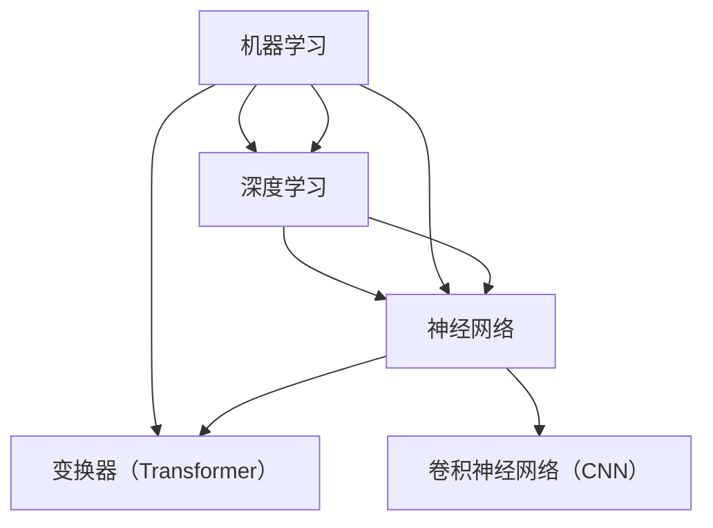
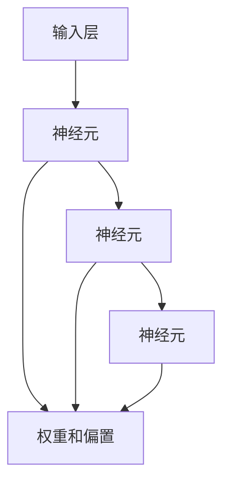
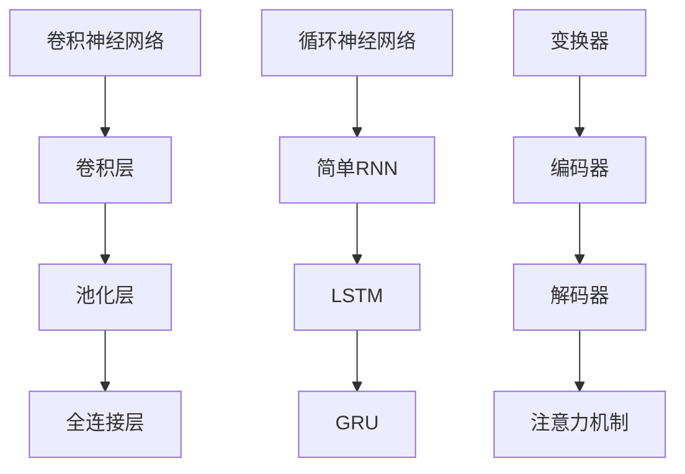
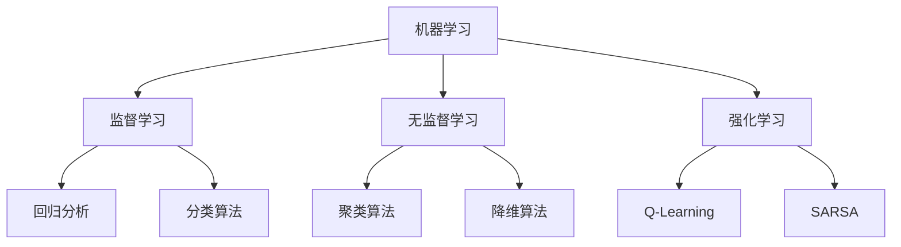

                 

### 文章标题

《OpenAI开发者大会与创业者的梦想》

> 关键词：OpenAI，开发者大会，人工智能，创业，技术趋势，未来展望

> 摘要：本文将深入探讨OpenAI开发者大会的年度主题、核心技术介绍、创业者的机遇与挑战，以及人工智能技术的未来发展趋势。通过逐步分析，揭示OpenAI及其开发者大会对于全球科技产业和创业者的影响，以及创业者在实现梦想过程中所面临的挑战和机遇。

## 目录

1. 《OpenAI开发者大会与创业者的梦想》  
2. 关键词  
3. 摘要  
4. 第一部分：OpenAI与开发者大会概览  
   4.1 OpenAI的起源与发展  
   4.2 开发者大会的重要主题与议题  
   4.3 大会亮点与最新发布  
5. 第二部分：核心技术介绍与探讨  
   5.1 人工智能核心概念与架构  
   5.2 深度学习原理与算法  
   5.3 神经网络与神经网络模型  
6. 第三部分：创业者的机遇与挑战  
   6.1 人工智能创业环境与政策  
   6.2 创业者的实践与创新  
7. 第四部分：技术趋势与未来展望  
   7.1 人工智能技术的未来发展趋势  
   7.2 创业者的梦想与未来  
8. 附录  
   8.1 OpenAI开发者大会相关资源  
   8.2 OpenAI的主要资源与工具  
   8.3 开发者大会的相关研究报告与论文

## 第一部分：OpenAI与开发者大会概览

### 第1章：OpenAI的起源与发展

#### 1.1 OpenAI的创立背景与愿景

OpenAI成立于2015年，由山姆·阿尔特曼（Sam Altman）、伊隆·马斯克（Elon Musk）等科技界巨头共同创立。其创立背景源于对人工智能（AI）发展前景的深刻洞察和高度关注。OpenAI的愿景是“实现安全的通用人工智能（AGI）”，让AI为全人类带来福祉。

OpenAI的成立初衷是为了解决传统AI发展中的几个关键问题：

1. **资源限制**：传统AI研究往往受到资金、数据和计算资源的限制，无法进行大规模实验和探索。
2. **透明度**：传统AI模型的研究过程不够透明，难以追踪和理解模型的决策过程。
3. **伦理问题**：随着AI技术的发展，如何确保AI的安全性和可控性成为亟待解决的问题。

OpenAI的创立为AI领域带来了新的发展契机，它采用了一种全新的组织模式——非营利性，这有助于避免传统AI研究中的资源瓶颈和伦理困境。

#### 1.2 OpenAI的技术进展与突破

自成立以来，OpenAI在人工智能领域取得了显著的进展和突破。以下是几个重要的技术成果：

1. **GPT系列模型**：GPT（Generative Pre-trained Transformer）是OpenAI开发的一系列基于变换器（Transformer）架构的自然语言处理（NLP）模型。从GPT-1到GPT-3，OpenAI不断在模型规模、性能和应用范围上取得突破。GPT-3是一个具有1750亿参数的模型，可以生成高质量的自然语言文本，广泛应用于聊天机器人、文本生成、问答系统等领域。

2. **DALL-E**：DALL-E是一个图像生成模型，它可以基于自然语言描述生成相应的图像。DALL-E的出现标志着文本到图像生成技术的重要进展，为计算机视觉和自然语言处理领域带来了新的研究方向。

3. **AlphaGo**：AlphaGo是OpenAI与DeepMind合作开发的一款围棋AI程序。它在2016年击败了世界围棋冠军李世石，引起了全球关注。AlphaGo的成功证明了深度学习和强化学习在复杂问题求解中的潜力，也为AI领域带来了新的研究挑战。

4. **机器人技术**：OpenAI在机器人技术方面也取得了显著进展。其开发的机器人可以自主执行复杂的任务，如建造物体、搬运货物等。这些机器人不仅展示了AI在现实世界中的应用潜力，也为AI与机器人融合提供了新的思路。

#### 1.3 OpenAI在社会与商业领域的影响

OpenAI的发展不仅推动了人工智能技术的进步，也对社会和商业领域产生了深远影响：

1. **技术创新**：OpenAI通过不断的技术突破，为人工智能领域带来了新的思路和方法，促进了相关技术的快速发展。

2. **产业变革**：人工智能技术正在逐步渗透到各个行业，改变着传统商业模式和生产方式。OpenAI的研究成果为各个行业提供了新的技术支持，推动了产业升级和转型。

3. **社会影响**：随着AI技术的发展，人们对于AI的担忧也日益增加。OpenAI在AI安全性和伦理问题方面进行了深入研究，试图找到平衡技术创新与社会利益的路径。

4. **创业机遇**：OpenAI的开发者大会为创业者提供了宝贵的机会，让他们了解最新的AI技术动态，寻找创新方向。许多创业公司在OpenAI的开发者大会上获得了灵感，并在AI领域取得了成功。

### 第2章：开发者大会的重要主题与议题

#### 2.1 开发者大会的年度主题

OpenAI的开发者大会（OpenAI Summit）是人工智能领域的顶级盛会，每年都会设定一个年度主题。以下是一些重要的年度主题：

1. **人工智能的未来**：探讨人工智能技术的发展趋势、未来前景和潜在风险。
2. **AI与伦理**：关注人工智能技术在社会和商业应用中的伦理问题，以及如何确保AI的安全和可控。
3. **AI与创造力**：探索人工智能在艺术、设计等创造性领域中的应用，以及如何激发人类的创造力。
4. **AI与机器人**：研究人工智能在机器人技术中的应用，包括机器人的感知、决策和执行能力。
5. **AI与商业**：分析人工智能技术在商业领域的应用，探讨如何利用AI技术提高效率和竞争力。

#### 2.2 常见议题与热点话题

OpenAI开发者大会的议题涵盖了人工智能领域的各个方面，以下是一些常见的议题和热点话题：

1. **自然语言处理**：自然语言处理是人工智能领域的核心研究方向之一，OpenAI在GPT系列模型上的突破引起了广泛关注。
2. **计算机视觉**：计算机视觉是人工智能的重要分支，OpenAI的DALL-E模型展示了文本到图像生成技术的潜力。
3. **机器学习与深度学习**：机器学习和深度学习是AI技术的基石，开发者大会经常讨论这些算法的最新进展和应用。
4. **AI安全性与伦理**：随着AI技术的发展，其安全性和伦理问题越来越受到关注，OpenAI在这方面进行了深入的研究和讨论。
5. **AI在医疗健康领域的应用**：人工智能在医疗健康领域的应用前景广阔，开发者大会经常讨论相关技术的研究进展和应用案例。

#### 2.3 大会亮点与最新发布

OpenAI开发者大会是展示最新研究成果和技术突破的重要平台。以下是一些大会的亮点和最新发布：

1. **GPT-4**：在2023年的开发者大会上，OpenAI发布了全新的自然语言处理模型GPT-4。GPT-4具有超过100万亿参数，是当前最先进的NLP模型。它展示了在文本生成、翻译、问答等任务上的卓越性能。
2. **机器人展示**：开发者大会上，OpenAI展示了其最新研发的机器人技术。这些机器人能够自主执行复杂的任务，展示了人工智能在现实世界中的应用潜力。
3. **AI伦理研究**：OpenAI在大会上发布了多项关于AI伦理的研究成果，包括如何确保AI系统的安全性和可控性，以及如何处理AI引发的伦理困境。
4. **AI与人类合作**：开发者大会讨论了人工智能与人类合作的新模式，包括如何将AI技术融入人类的工作流程，提高生产效率和创造力。

### 第3章：核心技术介绍与探讨

#### 3.1 人工智能核心概念与架构

人工智能（AI）是一种模拟人类智能的技术，其核心目标是使计算机具备类似于人类的感知、理解、学习和决策能力。人工智能的核心概念包括以下几个方面：

1. **机器学习（ML）**：机器学习是AI的一种方法，通过从数据中学习规律和模式，使计算机能够自主改进性能。机器学习可以分为监督学习、无监督学习和强化学习等不同类型。
2. **深度学习（DL）**：深度学习是机器学习的一种子领域，其核心思想是通过多层神经网络对数据进行处理，以实现复杂的特征提取和模式识别。
3. **神经网络（NN）**：神经网络是深度学习的基础，其结构类似于人类大脑，由大量的神经元组成，通过调整神经元之间的连接权重来实现学习。

人工智能的架构主要包括以下几个层次：

1. **感知层**：感知层负责接收外部信息，如图像、声音和文本等，并将其转换为内部表示。
2. **特征层**：特征层对感知层接收的信息进行特征提取和预处理，以生成更高级别的抽象表示。
3. **决策层**：决策层根据特征层的输出进行决策和预测，如分类、回归、生成等。

以下是人工智能核心概念的Mermaid流程图：



#### 3.2 深度学习原理与算法

深度学习（DL）是人工智能的一种重要方法，其核心思想是通过多层神经网络对数据进行处理，以实现复杂的特征提取和模式识别。深度学习的原理可以分为以下几个步骤：

1. **数据输入**：深度学习模型首先接收输入数据，如图像、声音和文本等。
2. **前向传播**：输入数据通过网络的每一层进行前向传播，每一层对数据进行处理和变换，生成更高级别的抽象表示。
3. **反向传播**：在预测结果与真实值存在误差时，深度学习模型通过反向传播算法更新网络参数，以最小化误差。
4. **优化目标**：深度学习模型的目标是最小化损失函数，常用的损失函数包括均方误差（MSE）和交叉熵损失（Cross-Entropy Loss）。

以下是深度学习原理的伪代码：

```python
initialize parameters
for each training sample do
    forward_pass(x)
    compute loss(y)
    backward_pass(delta)
    update parameters
end
```

深度学习的数学基础包括以下几个方面：

1. **线性代数**：深度学习中的矩阵运算、向量计算和矩阵求导等都是基于线性代数理论。
2. **概率论与统计**：深度学习中的概率分布、最大似然估计和贝叶斯推理等都是概率论与统计理论的应用。
3. **优化算法**：深度学习中的参数优化通常采用梯度下降（Gradient Descent）和其变种，如随机梯度下降（SGD）和Adam优化器。

以下是深度学习模型的训练与优化过程的详细解释：

1. **模型初始化**：深度学习模型初始化参数，这些参数通常通过随机生成。
2. **前向传播**：输入数据通过网络的每一层进行前向传播，每一层的输出作为下一层的输入。在每一层中，数据通过线性变换（权重矩阵）和激活函数（如ReLU、Sigmoid、Tanh）进行处理。
3. **损失计算**：前向传播结束后，计算预测结果与真实值之间的损失。常用的损失函数包括均方误差（MSE）和交叉熵损失（Cross-Entropy Loss）。
4. **反向传播**：在反向传播阶段，模型根据损失函数计算梯度，并更新网络参数。梯度是损失函数关于网络参数的导数，通过梯度下降算法更新参数，以最小化损失函数。
5. **优化目标**：深度学习模型的目标是最小化损失函数。在训练过程中，模型不断迭代更新参数，直到达到预设的收敛条件或最大迭代次数。

以下是深度学习模型训练过程的伪代码：

```python
initialize parameters
for epoch in 1 to MAX_EPOCHS do
    for each training sample (x, y) do
        forward_pass(x)
        compute loss(y)
        backward_pass(delta)
        update parameters
    end
    print("Epoch", epoch, ": Loss =", loss)
end
```

#### 3.3 神经网络与神经网络模型

神经网络（NN）是深度学习的基础，其结构类似于人类大脑，由大量的神经元组成。神经网络通过调整神经元之间的连接权重来实现学习。以下是神经网络的基本结构和组成：

1. **神经元**：神经元是神经网络的基本单元，它接收输入信号，通过权重和偏置进行加权求和，然后通过激活函数输出结果。
2. **层**：神经网络可以分为输入层、隐藏层和输出层。输入层接收外部数据，隐藏层对数据进行特征提取和变换，输出层生成预测结果。
3. **权重和偏置**：权重和偏置是神经网络中的参数，通过学习调整权重和偏置的值，使神经网络能够更好地拟合训练数据。

以下是神经网络的基本结构的Mermaid流程图：



常见的神经网络模型包括以下几种：

1. **卷积神经网络（CNN）**：卷积神经网络是图像处理领域的经典模型，其核心思想是通过卷积操作提取图像特征。CNN主要由卷积层、池化层和全连接层组成。
2. **循环神经网络（RNN）**：循环神经网络是处理序列数据的经典模型，其核心思想是通过循环结构保持长时记忆。RNN包括简单的RNN、LSTM和GRU等变种。
3. **变换器（Transformer）**：变换器是自然语言处理领域的经典模型，其核心思想是通过自注意力机制提取文本特征。变换器包括编码器、解码器和注意力机制。

以下是常见的神经网络模型的Mermaid流程图：



#### 3.4 神经网络的设计与实现

神经网络的设计与实现包括以下几个关键步骤：

1. **数据预处理**：对输入数据进行分析和处理，包括数据清洗、归一化、数据增强等。
2. **模型选择**：根据应用需求选择合适的神经网络模型，如CNN、RNN或变换器等。
3. **模型构建**：使用深度学习框架（如TensorFlow、PyTorch等）构建神经网络模型，定义网络结构、损失函数和优化器等。
4. **训练过程**：对模型进行训练，通过迭代更新参数，使模型在训练数据上达到预设的性能指标。
5. **评估与优化**：对模型进行评估，通过调整超参数和优化策略，提高模型在验证数据集和测试数据集上的性能。

以下是神经网络设计与实现过程的伪代码：

```python
import tensorflow as tf

# 数据预处理
def preprocess_data(x, y):
    # 数据清洗、归一化、数据增强等操作
    return x, y

# 模型构建
def build_model():
    model = tf.keras.Sequential([
        tf.keras.layers.Dense(128, activation='relu', input_shape=(input_shape,)),
        tf.keras.layers.Dense(64, activation='relu'),
        tf.keras.layers.Dense(num_classes, activation='softmax')
    ])
    return model

# 训练过程
def train_model(model, x_train, y_train, x_val, y_val):
    model.compile(optimizer='adam', loss='categorical_crossentropy', metrics=['accuracy'])
    model.fit(x_train, y_train, validation_data=(x_val, y_val), epochs=10)

# 评估与优化
def evaluate_model(model, x_test, y_test):
    model.evaluate(x_test, y_test)

# 主程序
if __name__ == '__main__':
    x_train, y_train = preprocess_data(x_train, y_train)
    x_val, y_val = preprocess_data(x_val, y_val)
    x_test, y_test = preprocess_data(x_test, y_test)
    
    model = build_model()
    train_model(model, x_train, y_train, x_val, y_val)
    evaluate_model(model, x_test, y_test)
```

## 第三部分：创业者的机遇与挑战

### 第6章：人工智能创业环境与政策

#### 6.1 人工智能创业环境的现状

当前，人工智能创业环境呈现出以下几个特点：

1. **技术创新活跃**：随着人工智能技术的快速发展，新的应用场景和商业模式不断涌现，吸引了大量创业者和投资人的关注。
2. **市场潜力巨大**：人工智能技术在各个行业的应用前景广阔，市场潜力巨大。从工业制造到医疗健康，从金融服务到交通运输，人工智能都在改变着传统行业的运营模式。
3. **政策支持力度加大**：许多国家和地区纷纷出台支持人工智能发展的政策，包括资金支持、税收优惠、人才引进等，为人工智能创业提供了良好的政策环境。
4. **竞争激烈**：人工智能领域的竞争日益激烈，创业公司需要不断技术创新和业务拓展，以在市场中脱颖而出。

#### 6.2 人工智能相关政策分析

以下是一些国家和地区的人工智能相关政策：

1. **美国**：美国政府高度重视人工智能的发展，通过《美国人工智能倡议》提出了一系列政策举措，包括增加研发投资、培养人才、促进国际合作等。
2. **中国**：中国政府将人工智能列为国家战略，出台了一系列政策文件，包括《新一代人工智能发展规划》和《人工智能发展行动计划》，旨在加快人工智能技术的创新和应用。
3. **欧盟**：欧盟委员会发布了《人工智能伦理准则》，旨在确保人工智能技术在社会中的安全、可靠和可控。
4. **日本**：日本政府将人工智能作为国家战略技术，通过《人工智能技术战略》提出了一系列政策举措，包括加大研发投入、促进人才培养等。

#### 6.3 创业者如何抓住政策机遇

创业者可以通过以下几个方面抓住政策机遇：

1. **了解政策内容**：创业者需要深入了解国家和地区的相关政策，把握政策方向和重点。
2. **申请专项资金**：创业者可以积极申请政府提供的专项资金，用于研发、实验和市场推广等。
3. **人才引进**：通过政策支持引进高层次人才，提升团队的技术实力和市场竞争力。
4. **国际合作**：利用政策支持开展国际合作，引进国外先进技术和管理经验。

### 第7章：创业者的实践与创新

#### 7.1 创业者的成功案例分享

以下是一些人工智能创业者的成功案例：

1. **OpenWater**：OpenWater是一家专注于智能灌溉系统的人工智能公司。通过使用机器学习和传感器技术，OpenWater能够精确控制灌溉水量，提高了农业生产效率，降低了水资源浪费。
2. **Qventus**：Qventus是一家医疗人工智能公司，通过分析医院运营数据，提供智能调度和资源优化方案，提高了医院的运营效率和服务质量。
3. **AIDoc**：AIDoc是一家医疗影像人工智能公司，其开发的AI系统能够自动识别医学影像中的病灶，提高了医生的诊断准确性和工作效率。

#### 7.2 创业过程中的挑战与应对

创业者在创业过程中面临以下挑战：

1. **技术挑战**：人工智能技术不断发展，创业公司需要不断跟进最新技术动态，保持技术竞争力。
2. **市场挑战**：市场竞争激烈，创业公司需要找到独特的产品定位和市场需求，以在市场中脱颖而出。
3. **资金挑战**：创业公司通常需要大量资金支持，包括研发投入、市场推广和团队建设等。
4. **人才挑战**：人工智能领域人才短缺，创业公司需要通过多种途径吸引和留住优秀人才。

创业者可以通过以下方式应对这些挑战：

1. **技术创新**：通过持续的技术创新，提高产品的技术含量和竞争力。
2. **市场定位**：深入了解市场需求，找到独特的产品定位和商业模式。
3. **融资策略**：通过多种融资渠道，如风险投资、政府专项资金和众筹等，筹集足够的资金支持。
4. **人才培养**：通过培训、激励和股权等方式，吸引和留住优秀人才。

#### 7.3 创业者如何保持创新活力

创业者要保持创新活力，可以从以下几个方面着手：

1. **持续学习**：保持对最新技术和市场动态的持续关注和学习，不断提升自身的专业能力。
2. **跨界合作**：与其他领域的专家和公司合作，借鉴其他领域的经验和技术，推动创新。
3. **开放心态**：保持开放心态，接受新的观点和想法，勇于尝试和探索。
4. **灵活应变**：在面对市场变化和挑战时，能够快速调整战略和商业模式，以适应环境变化。

## 第四部分：技术趋势与未来展望

### 第8章：人工智能技术的未来发展趋势

#### 8.1 人工智能技术的未来方向

人工智能技术在未来将继续朝着以下几个方向快速发展：

1. **泛化能力**：人工智能技术将进一步提升泛化能力，能够更好地处理复杂、多样和动态的环境。
2. **人机协同**：人工智能将与人类更紧密地协同工作，实现人机融合，提高生产效率和生活质量。
3. **智能感知**：人工智能技术将实现更高层次的智能感知，包括视觉、听觉、嗅觉等多模态感知能力。
4. **自主决策**：人工智能将具备更强的自主决策能力，能够独立完成复杂的任务和决策。
5. **可持续性**：人工智能技术将更加注重可持续性，通过优化算法和数据结构，降低能耗和资源消耗。

#### 8.2 新型人工智能技术的探索

以下是一些新型人工智能技术的探索方向：

1. **类脑计算**：类脑计算是一种模仿人类大脑工作原理的人工智能技术，其目标是实现类似于人类智能的自主学习和决策能力。
2. **强化学习**：强化学习是一种通过试错和反馈学习的方法，能够在复杂环境中实现自主决策和优化。
3. **联邦学习**：联邦学习是一种分布式学习技术，可以在不共享数据的情况下，通过模型协同训练实现智能优化。
4. **量子计算**：量子计算是一种利用量子力学原理进行计算的方法，其计算能力远超传统计算机，有望在人工智能领域取得重大突破。
5. **区块链与AI**：区块链与AI的结合将实现更安全、透明和可信的数据处理和交易，为人工智能应用提供新的技术支持。

#### 8.3 未来人工智能技术对社会的影响

未来人工智能技术将对社会产生深远影响：

1. **经济发展**：人工智能技术将推动产业升级和转型，提高生产效率和创新能力，推动经济增长。
2. **社会变革**：人工智能技术将改变人们的生活方式和社会结构，提高生活质量和社会福祉。
3. **伦理挑战**：随着人工智能技术的发展，其伦理挑战将更加突出，包括隐私保护、公平性、安全性等问题。
4. **就业影响**：人工智能技术将改变就业市场，一方面将创造新的就业机会，另一方面也可能导致部分传统岗位的消失。

### 第9章：创业者的梦想与未来

#### 9.1 创业者的梦想与愿景

创业者的梦想和愿景是推动他们不断前进的动力。以下是一些常见的创业者梦想和愿景：

1. **改变世界**：许多创业者希望通过技术创新改变世界，解决社会问题，提高人类生活质量。
2. **实现财富自由**：创业者追求财富自由，希望通过创业实现财务上的独立和自由。
3. **创新和突破**：创业者追求创新和突破，希望通过不断尝试和探索，推动科技发展和社会进步。
4. **建立影响力**：创业者希望通过创业建立自己的影响力，成为行业领袖和社会榜样。

#### 9.2 创业者在实现梦想过程中的努力

创业者为了实现梦想，需要付出大量的努力，包括：

1. **持续学习**：创业者需要不断学习新知识、新技术和新方法，以适应快速变化的市场和技术环境。
2. **创新思维**：创业者需要具备创新思维，勇于尝试和探索新的商业模式和技术应用。
3. **坚韧毅力**：创业过程中充满挑战和困难，创业者需要具备坚韧的毅力，克服困难，持续前进。
4. **团队合作**：创业者需要建立高效的团队，发挥团队的优势，共同实现创业目标。

#### 9.3 创业者的未来展望

创业者的未来展望是充满希望和挑战的。以下是一些未来展望：

1. **技术创新**：随着人工智能、区块链、量子计算等新技术的不断发展，创业者将有更多的机会实现技术创新和突破。
2. **产业升级**：人工智能技术将推动产业升级和转型，创业者可以在新领域找到新的商机和机会。
3. **社会贡献**：创业者可以通过创业实现社会贡献，解决社会问题，提高人类生活质量。
4. **持续发展**：创业者需要不断学习和创新，以适应不断变化的市场和技术环境，实现可持续发展。

## 附录

### 附录A：OpenAI开发者大会相关资源

#### A.1 开发者大会官方网站与资料

OpenAI开发者大会的官方网站是：[OpenAI Summit](https://openai.com/events/)。网站提供了大会的日程安排、演讲嘉宾、会议议程、相关论文和研究报告等资料。

#### A.2 OpenAI的主要资源与工具

OpenAI提供了多种资源和工具，帮助开发者学习和应用人工智能技术。以下是一些重要的资源和工具：

1. **OpenAI Gym**：OpenAI Gym是一个开源环境库，提供了多种用于机器学习研究和实践的任务环境。
2. **OpenAI Codex**：OpenAI Codex是一个基于GPT-3的代码生成模型，可以帮助开发者自动生成代码。
3. **OpenAI GPT-3 API**：OpenAI GPT-3 API提供了一个用于调用GPT-3模型的接口，开发者可以将其集成到自己的应用程序中。
4. **OpenAI Robot**：OpenAI Robot是一个开源的机器人平台，提供了机器人控制、感知和执行能力。

#### A.3 开发者大会的相关研究报告与论文

OpenAI开发者大会通常会发布一系列研究报告和论文，涵盖人工智能技术的最新进展和应用。以下是一些重要的研究报告和论文：

1. **“GPT-3: Language Models are Few-Shot Learners”**：这是OpenAI在2020年发布的一篇论文，介绍了GPT-3模型的原理和应用。
2. **“DALL-E: Creating Images from Text”**：这是OpenAI在2021年发布的一篇论文，介绍了DALL-E图像生成模型的原理和应用。
3. **“AlphaGo Zero: Learning in the Dark”**：这是OpenAI与DeepMind合作在2019年发布的一篇论文，介绍了AlphaGo Zero的原理和应用。

### Mermaid流程图示例

以下是人工智能核心概念的Mermaid流程图：



### 伪代码示例

以下是深度学习模型训练过程的伪代码：

```python
initialize parameters
while not converged do
    for each training sample do
        compute prediction
        compute loss
        update parameters
    end
    check for convergence
end
save the trained model
```

### 数学公式示例

以下是神经网络中常用的数学公式示例：

段落内数学公式：

$$
y = \sum_{i=1}^{n} w_i \cdot x_i + b
$$

独立段落内数学公式：

$$
f(x) = \begin{cases}
    1, & \text{if } x > 0 \\
    0, & \text{if } x = 0 \\
    -1, & \text{if } x < 0
\end{cases}
$$

### 作者信息

作者：AI天才研究院/AI Genius Institute & 禅与计算机程序设计艺术 /Zen And The Art of Computer Programming

---

**结语：**

OpenAI开发者大会为全球人工智能领域的创新者和创业者提供了宝贵的机会，展示了最新的研究成果和技术突破。通过逐步分析，我们揭示了OpenAI及其开发者大会对于全球科技产业和创业者的重要影响。随着人工智能技术的不断进步，创业者的梦想也在不断实现，未来充满无限可能。让我们共同期待人工智能技术的美好未来，以及创业者在实现梦想过程中的精彩表现。

