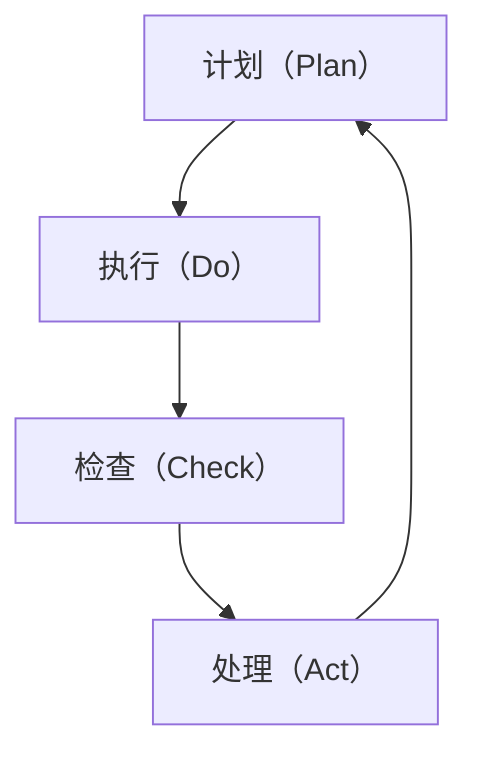

                 

## 文章标题：PDCA:高效管理者的行动方法论

### 关键词：PDCA循环、高效管理、行动方法论、管理实践、问题解决

#### 摘要：
本文将深入探讨PDCA（计划-执行-检查-处理）循环这一高效管理者的行动方法论。通过逐步分析PDCA循环的原理与基础，详细阐述其在不同管理实践中的应用，并提供实践指导与应用拓展。文章旨在帮助读者理解并掌握PDCA循环的核心概念和操作步骤，提升管理效率与决策能力。

----------------------------------------------------------------

### 第一部分：PDCA循环的原理与基础

#### 第1章：PDCA循环的起源与理念

### 1.1 PDCA循环的起源
PDCA循环，又称戴明循环，起源于20世纪30年代的美国，由统计学家休哈特提出。后来，由著名质量管理专家戴明将其应用于企业质量管理中，并推广到各个管理领域。PDCA循环作为一套系统化、循环往复的管理方法，通过不断的计划、执行、检查和处理，实现质量的持续改进。

### 1.2 PDCA循环的核心理念
PDCA循环的核心理念在于“持续改进”。它将管理活动划分为四个阶段，形成一个闭环，通过不断的循环和优化，实现管理效能的提升。PDCA循环强调以下原则：
- **系统化**：将管理活动分解为可操作的步骤，系统化地进行。
- **循环性**：管理活动不是一次性的，而是一个持续不断的过程。
- **数据驱动**：通过数据分析和反馈，指导管理决策。
- **全员参与**：鼓励全体员工参与管理活动，提升组织的整体管理效能。

### 1.3 PDCA循环的应用范围
PDCA循环广泛应用于企业管理的各个领域，包括质量管理、项目管理、人力资源管理、营销管理等。其基本框架适用于各类组织，无论规模大小，都能从中受益。以下为PDCA循环在不同领域应用的基本框架：

#### 图1.1 PDCA循环应用框架

通过PDCA循环的持续应用，组织可以实现以下目标：
- **提升质量**：通过不断检查和处理，发现并解决质量问题。
- **优化流程**：通过计划与执行，不断优化工作流程。
- **提高效率**：通过数据驱动，提高管理决策的准确性和效率。

#### 第2章：PDCA循环的四个阶段详解

### 2.1 计划（Plan）

#### 2.1.1 问题分析与目标设定
计划阶段是PDCA循环的起点，主要任务是识别问题、分析原因，并设定明确的目标。具体步骤如下：
- **问题识别**：通过调查、收集数据，识别当前存在的问题。
- **原因分析**：使用因果图、鱼骨图等工具，分析问题产生的原因。
- **目标设定**：根据问题分析和原因分析的结果，设定具体的改进目标。

#### 2.1.1.1 问题识别与诊断
问题识别是计划阶段的关键步骤。管理者需要关注以下方面：
- **数据收集**：通过问卷调查、访谈、现场观察等方式，收集与问题相关的数据。
- **数据整理**：对收集到的数据进行分析，找出问题的规律和特征。

#### 2.1.1.2 设定目标与规划
在问题识别与诊断的基础上，设定具体的改进目标。目标应具备以下特点：
- **具体**：明确具体的目标，便于衡量和评估。
- **可量化**：使用数据或指标，衡量目标的完成情况。
- **可实现**：目标应具备可行性，避免过于理想化。
- **时限性**：设定具体的时间节点，确保目标的按时完成。

#### 2.1.2 资源配置与行动方案
在计划阶段，还需要对资源进行合理配置，制定具体的行动方案。
- **资源评估**：评估当前资源的状况，包括人力、物力、财力等。
- **资源配置**：根据目标和工作计划，合理配置资源，确保目标的实现。
- **行动方案**：制定详细的行动方案，明确每个步骤的操作方法和责任人。

### 2.2 实施（Do）

#### 2.2.1 行动执行
实施阶段是将计划付诸实践的过程。具体步骤如下：
- **任务分解**：将大任务分解为小任务，明确每个任务的执行步骤。
- **任务分配**：根据任务的特点和员工的特长，合理分配任务。
- **执行监控**：对任务的执行情况进行监控，确保按照计划进行。

#### 2.2.1.1 按计划执行任务
在执行过程中，要严格按照计划进行操作，确保每个任务按时完成。同时，要关注任务的执行情况，及时调整和优化。

#### 2.2.1.2 监控与记录过程
在执行过程中，要建立监控机制，对任务执行情况进行实时监控。同时，要记录过程数据，为后续的检查和处理提供依据。

### 2.3 检查（Check）

#### 2.3.1 结果评估与对比
检查阶段是对实施结果进行评估和对比的过程。具体步骤如下：
- **数据收集**：收集实施过程中的数据，包括完成任务的情况、资源消耗等。
- **结果分析**：对收集到的数据进行分析，评估实施效果。
- **与目标对比**：将实施结果与设定的目标进行对比，找出差距和不足。

#### 2.3.1.1 数据收集与分析
数据收集与分析是检查阶段的核心任务。通过数据收集，可以全面了解实施过程中的情况。数据分析则可以帮助识别问题和不足，为后续的处理提供依据。

#### 2.3.1.2 实施结果与目标对比
将实施结果与目标进行对比，可以直观地了解实施效果。通过对比，可以找出差距和不足，明确下一步的改进方向。

### 2.4 处理（Act）

#### 2.4.1 问题分析与改进
处理阶段的主要任务是分析问题，并制定改进措施。具体步骤如下：
- **问题识别**：通过检查阶段的数据分析，识别存在的问题。
- **原因分析**：使用因果图、鱼骨图等工具，分析问题产生的原因。
- **改进措施**：制定具体的改进措施，解决存在的问题。

#### 2.4.1.1 识别问题原因
识别问题原因是处理阶段的关键步骤。通过因果图、鱼骨图等工具，可以深入分析问题产生的原因，为改进措施提供依据。

#### 2.4.1.2 制定改进措施
在识别问题原因的基础上，制定具体的改进措施。改进措施应具备以下特点：
- **针对性**：针对具体问题，制定针对性的改进措施。
- **可操作性**：改进措施应具有可操作性，便于实施。
- **有效性**：改进措施应能有效解决问题，提高工作质量。

#### 2.4.2 标准化与优化
在处理阶段，还需要对改进措施进行标准化和优化。
- **标准化操作流程**：制定标准化的操作流程，确保改进措施的持续实施。
- **持续优化**：通过不断优化，提升管理效能，实现持续改进。

### 总结
PDCA循环是一个系统化、循环往复的管理方法，通过四个阶段的不断循环和优化，实现管理效能的提升。计划阶段是PDCA循环的起点，主要任务是识别问题、分析原因，并设定明确的目标。执行阶段是将计划付诸实践的过程，要严格按照计划进行操作，确保任务按时完成。检查阶段是对实施结果进行评估和对比的过程，通过数据分析，找出差距和不足。处理阶段是分析问题，并制定改进措施的过程，通过标准化和优化，实现持续改进。

----------------------------------------------------------------

### 第二部分：PDCA循环在管理实践中的应用

#### 第3章：PDCA循环在企业运营管理中的应用

#### 3.1 营销管理中的PDCA应用

#### 3.1.1 营销计划制定
在营销管理中，PDCA循环的应用主要体现在营销计划的制定和执行过程中。首先，在计划阶段，营销团队需要进行市场调研，分析市场趋势、竞争对手和消费者需求，确定营销目标和策略。具体步骤如下：
- **市场调研**：通过问卷调查、访谈、数据分析等方式，收集市场信息。
- **目标设定**：根据市场调研结果，设定具体的营销目标，如提高品牌知名度、增加销售额等。
- **策略制定**：制定实现目标的策略，包括广告宣传、促销活动、渠道拓展等。

#### 3.1.2 营销活动执行与监控
在执行阶段，营销团队需要根据制定的计划，具体实施各项营销活动。同时，要建立监控机制，实时跟踪活动的进展和效果。具体步骤如下：
- **任务分解**：将大任务分解为小任务，明确每个任务的执行步骤。
- **任务分配**：根据任务的特点和员工的特长，合理分配任务。
- **执行监控**：对任务的执行情况进行监控，确保按照计划进行。

#### 3.1.3 营销效果评估与优化
在检查阶段，营销团队需要对营销活动的效果进行评估和对比。通过数据分析，找出差距和不足，为下一阶段的优化提供依据。具体步骤如下：
- **数据收集**：收集营销活动过程中的数据，包括广告投放效果、促销活动参与人数等。
- **结果分析**：对收集到的数据进行分析，评估营销活动的效果。
- **与目标对比**：将实施结果与设定的目标进行对比，找出差距和不足。

#### 3.2 项目管理中的PDCA应用

#### 3.2.1 项目计划与资源分配
在项目管理中，PDCA循环的应用主要体现在项目计划的制定和资源分配过程中。首先，在计划阶段，项目团队需要进行项目调研，确定项目目标和范围，制定项目计划。具体步骤如下：
- **项目调研**：通过问卷调查、访谈、数据分析等方式，收集项目相关信息。
- **目标设定**：根据项目调研结果，设定具体的项目目标，如完成产品开发、实现特定功能等。
- **计划制定**：制定详细的项目计划，包括项目范围、时间、成本、质量等。

#### 3.2.2 项目执行与监控
在执行阶段，项目团队需要根据项目计划，具体实施项目任务。同时，要建立监控机制，实时跟踪项目的进展和效果。具体步骤如下：
- **任务分解**：将大任务分解为小任务，明确每个任务的执行步骤。
- **任务分配**：根据任务的特点和团队成员的特长，合理分配任务。
- **执行监控**：对任务的执行情况进行监控，确保按照计划进行。

#### 3.2.3 项目评估与改进
在检查阶段，项目团队需要对项目的效果进行评估和对比。通过数据分析，找出差距和不足，为下一阶段的优化提供依据。具体步骤如下：
- **数据收集**：收集项目过程中的数据，包括项目进度、成本、质量等。
- **结果分析**：对收集到的数据进行分析，评估项目的效果。
- **与目标对比**：将实施结果与设定的目标进行对比，找出差距和不足。

#### 3.3 人力资源管理中的PDCA应用

#### 4.1 员工绩效管理中的PDCA应用
在人力资源管理中，PDCA循环的应用主要体现在员工绩效管理过程中。首先，在计划阶段，管理层需要设定绩效目标，制定绩效计划。具体步骤如下：
- **目标设定**：根据公司战略和员工岗位职责，设定具体的绩效目标。
- **绩效计划**：制定详细的绩效计划，明确考核指标、考核周期等。

#### 4.1.2 绩效执行与监控
在执行阶段，员工需要按照绩效计划的要求，完成各项任务。同时，管理层需要建立监控机制，对员工的绩效表现进行跟踪。具体步骤如下：
- **任务执行**：员工按照绩效计划的要求，完成各项任务。
- **绩效监控**：管理层对员工的绩效表现进行监控，及时发现问题和不足。

#### 4.1.3 绩效评估与改进
在检查阶段，管理层需要对员工的绩效进行评估和对比。通过数据分析，找出差距和不足，为下一阶段的改进提供依据。具体步骤如下：
- **数据收集**：收集员工绩效数据，包括工作成果、工作质量、工作态度等。
- **结果分析**：对收集到的数据进行分析，评估员工的绩效表现。
- **与目标对比**：将员工的绩效表现与设定的目标进行对比，找出差距和不足。

#### 4.2 员工培训与发展中的PDCA应用
在员工培训与发展中，PDCA循环的应用主要体现在培训需求的识别、培训计划的制定、培训实施和效果评估等方面。具体步骤如下：
- **需求分析**：通过问卷调查、访谈等方式，收集员工的培训需求。
- **计划制定**：根据培训需求，制定详细的培训计划，明确培训目标、培训内容、培训方式等。
- **培训实施**：按照培训计划，组织培训活动，确保培训效果。
- **效果评估**：对培训效果进行评估，收集员工反馈，为下一阶段的培训提供依据。

#### 第4章：PDCA循环在人力资源管理中的应用

在人力资源管理中，PDCA循环是一个重要的管理工具，它通过计划（Plan）、执行（Do）、检查（Check）和处理（Act）四个阶段，帮助组织持续改进员工绩效和培训与发展。以下是PDCA循环在人力资源管理中的具体应用。

#### 4.1 员工绩效管理中的PDCA应用

**4.1.1 绩效计划与目标设定**
在绩效管理中，计划阶段至关重要。首先，组织需要明确员工的工作目标和期望绩效。具体步骤包括：
- **目标设定**：管理层与员工共同制定可量化的绩效目标，确保目标与组织的战略和业务需求相一致。
- **关键绩效指标（KPIs）**：确定用于衡量绩效的关键指标，如销售额、客户满意度、项目完成率等。

**4.1.2 绩效执行与监控**
执行阶段涉及员工在日常工作中的表现。为了确保目标的实现，管理层需要采取以下措施：
- **任务分配**：将工作分配给员工，确保每个员工都清楚自己的职责和任务。
- **进度跟踪**：定期检查任务进度，确保员工按照计划开展工作。
- **反馈机制**：建立反馈机制，鼓励员工及时沟通进展和遇到的问题，提供必要的支持和资源。

**4.1.3 绩效评估与改进**
检查阶段是对员工绩效的评估。管理层需要收集数据，评估员工的绩效表现，并对比设定的目标。具体步骤如下：
- **数据收集**：通过定期评估、员工反馈、客户满意度调查等手段收集数据。
- **结果分析**：对收集到的数据进行分析，识别绩效优秀的员工和需要改进的领域。
- **反馈与沟通**：与员工进行一对一的绩效反馈会议，讨论评估结果，共同制定改进计划。

**4.2 员工培训与发展中的PDCA应用**

**4.2.1 培训需求分析与计划**
在员工培训与发展中，计划阶段是确保培训有效性的关键。具体步骤包括：
- **需求分析**：通过问卷调查、访谈等方式，了解员工的技能需求和培训意愿。
- **培训计划**：根据需求分析结果，制定培训计划，明确培训目标、内容、形式和时间安排。

**4.2.2 培训实施与监控**
执行阶段涉及培训的实际情况。为了确保培训的质量，管理层需要采取以下措施：
- **培训准备**：准备培训材料、场地和设备，确保培训环境舒适。
- **培训实施**：按照培训计划，开展培训活动，确保培训内容的实施。
- **参与度监控**：监控员工的参与度，确保培训效果。

**4.2.3 培训效果评估与改进**
检查阶段是对培训效果的评估。管理层需要收集数据，评估培训的有效性，并对比设定的目标。具体步骤如下：
- **效果评估**：通过考试、技能测试、员工反馈等方式，评估培训效果。
- **结果分析**：对评估结果进行分析，识别培训的优点和不足。
- **改进计划**：根据评估结果，制定改进计划，优化培训内容和方法。

通过PDCA循环在员工绩效管理和培训与发展中的应用，组织可以不断改进人力资源管理，提高员工的工作效率和满意度，从而实现组织的战略目标。

#### 第5章：PDCA循环在供应链管理中的应用

#### 5.1 供应链计划与采购管理

在供应链管理中，PDCA循环的应用可以帮助企业有效地进行供应链计划与采购管理，确保供应链的稳定和高效。以下是PDCA循环在供应链计划与采购管理中的具体应用。

**5.1.1 供应链计划制定**
在计划阶段，企业需要制定详细的供应链计划，以确保供应链的顺畅运行。具体步骤包括：
- **需求预测**：根据市场需求和销售预测，确定供应链的需求量。
- **资源评估**：评估现有的资源状况，包括库存、生产能力等。
- **供应链规划**：制定供应链的总体规划，包括原材料采购、生产计划、库存管理、物流配送等。

**5.1.2 采购执行与监控**
执行阶段是供应链计划的具体实施过程。为了确保采购活动的顺利进行，企业需要采取以下措施：
- **供应商选择**：根据供应链计划，选择合适的供应商，确保供应商的供货能力和质量。
- **采购订单**：根据供应链计划，向供应商发出采购订单，明确采购物品、数量、交货日期等。
- **采购监控**：监控采购订单的执行情况，确保供应商按时交付物品，并符合质量要求。

**5.1.3 采购效果评估与改进**
在检查阶段，企业需要对采购效果进行评估和对比。通过以下步骤，企业可以不断优化采购管理：
- **数据收集**：收集采购过程中的数据，包括采购成本、供应商绩效、交货时间等。
- **结果分析**：对收集到的数据进行分析，评估采购活动的效果。
- **与目标对比**：将采购效果与设定的目标进行对比，找出差距和不足。

**5.2 库存管理与物流优化**

库存管理和物流优化是供应链管理中至关重要的环节，PDCA循环的应用可以帮助企业有效地进行库存管理和物流优化。

**5.2.1 库存管理策略**
在计划阶段，企业需要制定库存管理策略，以确保库存水平的合理性和成本的最优化。具体步骤包括：
- **库存需求分析**：根据市场需求和销售预测，分析库存需求。
- **库存优化策略**：制定库存优化策略，包括安全库存、经济订货量、库存周转率等。

**5.2.2 物流流程优化**
在执行阶段，企业需要对物流流程进行优化，以确保物流的高效和低成本。具体步骤包括：
- **物流流程设计**：设计优化的物流流程，包括运输方式、配送路线、仓储管理等。
- **物流执行**：按照优化的物流流程，进行物流操作。

**5.2.3 物流执行与监控**
在检查阶段，企业需要对物流执行情况进行监控和评估。具体步骤如下：
- **物流绩效评估**：评估物流执行的效果，包括运输时间、运输成本、客户满意度等。
- **与目标对比**：将物流绩效与设定的目标进行对比，找出差距和不足。

通过PDCA循环在供应链计划与采购管理、库存管理与物流优化中的应用，企业可以不断提高供应链的效率和质量，降低成本，提升客户满意度。

#### 第6章：PDCA循环实践指导

#### 6.1 PDCA循环实施步骤详解

PDCA循环的实施步骤可以分为计划（Plan）、执行（Do）、检查（Check）和处理（Act）四个阶段，每个阶段都有其具体的实施要点。

**6.1.1 计划阶段实施要点**

在计划阶段，管理者需要制定详细的计划和目标。以下是具体的实施要点：

1. **问题识别**：通过数据分析、市场调研、员工反馈等方式，识别组织存在的问题。

2. **目标设定**：根据问题识别的结果，设定具体的改进目标，确保目标具有可衡量性和可实现性。

3. **资源评估**：评估现有资源，包括人力、财力、物力等，确保资源能够支持计划的实施。

4. **行动方案**：制定详细的行动方案，包括具体的操作步骤、责任分配、时间安排等。

**6.1.2 实施阶段实施要点**

在执行阶段，管理者需要确保计划得到有效执行。以下是具体的实施要点：

1. **任务分解**：将大任务分解为小任务，明确每个任务的执行步骤和责任人。

2. **执行监控**：建立监控机制，实时跟踪任务的执行情况，确保任务按时完成。

3. **资源协调**：确保所需资源得到及时分配和协调，避免资源浪费和冲突。

4. **沟通协调**：建立良好的沟通机制，确保团队成员之间的信息畅通，提高协作效率。

**6.1.3 检查阶段实施要点**

在检查阶段，管理者需要对实施结果进行评估和对比。以下是具体的实施要点：

1. **数据收集**：收集实施过程中的数据，包括任务完成情况、资源消耗、问题反馈等。

2. **结果分析**：对收集到的数据进行分析，识别实施效果，找出差距和不足。

3. **与目标对比**：将实施结果与设定的目标进行对比，评估目标的完成情况。

4. **反馈机制**：建立反馈机制，及时向团队成员提供反馈，鼓励积极改进。

**6.1.4 处理阶段实施要点**

在处理阶段，管理者需要根据检查结果制定改进措施，并进行实施。以下是具体的实施要点：

1. **问题分析**：对检查阶段发现的问题进行深入分析，找出问题的根本原因。

2. **改进措施**：制定具体的改进措施，确保措施具有可操作性和有效性。

3. **标准化**：将改进措施标准化，形成规范的操作流程，确保改进措施的持续实施。

4. **持续改进**：建立持续改进机制，鼓励全员参与，不断提高管理效能。

通过以上步骤，PDCA循环可以帮助组织实现持续改进，提高管理效能和运营效率。

#### 6.2 PDCA循环中的问题解决方法

在PDCA循环的实施过程中，难免会遇到各种问题和挑战。如何有效地解决这些问题，是保证PDCA循环有效运行的关键。以下是几种常见的问题解决方法。

**6.2.1 计划不周导致的问题**

- **问题识别**：在计划阶段，由于对问题的识别不准确，导致计划不周。
- **解决方法**：加强问题识别和分析，使用因果图、鱼骨图等工具，深入分析问题的根本原因。
- **改进措施**：在制定计划时，充分考虑各种可能的情况，制定备用计划，确保计划的灵活性。

**6.2.2 实施不到位导致的问题**

- **问题识别**：在实施阶段，由于任务执行不到位，导致计划无法顺利实施。
- **解决方法**：建立严格的执行监控机制，对任务执行情况进行实时跟踪和评估。
- **改进措施**：加强员工的培训和指导，确保员工了解任务的要求和操作方法，提高执行能力。

**6.2.3 检查与处理不当导致的问题**

- **问题识别**：在检查和处理阶段，由于对结果的评估和分析不准确，导致问题无法得到有效解决。
- **解决方法**：加强数据分析和结果评估，确保评估结果的准确性和客观性。
- **改进措施**：建立问题反馈和改进机制，鼓励员工提出问题和建议，及时进行改进。

通过以上方法，可以有效地解决PDCA循环中遇到的问题，确保循环的顺利进行，提高管理效能。

#### 6.3 PDCA循环实践案例分享

为了更好地理解PDCA循环的实施过程，下面我们通过一个实际案例来详细说明PDCA循环的四个阶段。

**案例背景：** 
某制造企业发现其生产线上的产品缺陷率较高，影响了产品的质量和客户满意度。企业决定使用PDCA循环来解决这个问题。

**6.3.1 计划阶段**

1. **问题识别与诊断**：
   - 通过数据分析，发现产品缺陷主要集中在某个生产环节。
   - 通过现场观察和员工访谈，识别出导致缺陷的主要原因。

2. **目标设定**：
   - 设定具体的目标：将产品缺陷率降低50%。

3. **资源配置与行动方案**：
   - 调查现有资源，确保有足够的设备和人力支持改进计划。
   - 制定详细的行动方案，包括改进措施、责任分配和时间安排。

**6.3.2 执行阶段**

1. **任务分解**：
   - 将改进计划分解为具体的小任务，明确每个任务的执行步骤和责任人。

2. **执行监控**：
   - 建立监控机制，对任务的执行情况进行实时跟踪，确保按计划进行。

3. **资源协调**：
   - 确保所需资源得到及时分配和协调，避免资源浪费和冲突。

**6.3.3 检查阶段**

1. **数据收集**：
   - 收集实施过程中的数据，包括产品缺陷率、生产效率等。

2. **结果分析**：
   - 对收集到的数据进行分析，评估改进措施的效果。

3. **与目标对比**：
   - 将实施结果与设定的目标进行对比，评估目标的完成情况。

**6.3.4 处理阶段**

1. **问题分析**：
   - 对检查阶段发现的问题进行深入分析，找出问题的根本原因。

2. **改进措施**：
   - 制定具体的改进措施，如优化生产流程、提高员工技能等。

3. **标准化**：
   - 将改进措施标准化，形成规范的操作流程，确保改进措施的持续实施。

4. **持续改进**：
   - 建立持续改进机制，鼓励全员参与，不断提高生产质量和效率。

通过这个案例，我们可以清晰地看到PDCA循环在解决实际问题时的作用。通过计划、执行、检查和处理，企业可以逐步改进生产过程，提高产品质量，提升客户满意度。

#### 第7章：PDCA循环的应用拓展

#### 7.1 PDCA与其他管理工具的结合应用

在企业管理中，PDCA循环可以与其他管理工具结合使用，以实现更高效的管理效果。以下是几种常见的结合方式：

**7.1.1 PDCA与5S管理的结合**

5S管理是一种用于现场管理的方法，通过整理、整顿、清扫、清洁和素养，提高现场工作效率和产品质量。PDCA循环与5S管理的结合，可以更系统地推动现场管理改进。

- **计划阶段**：制定5S管理计划，包括5S的具体目标和实施步骤。
- **执行阶段**：按照5S管理计划，逐步实施5S措施，如整理工作场所、清除废弃物等。
- **检查阶段**：对5S实施效果进行评估，如工作场所的清洁度、员工素养等。
- **处理阶段**：针对检查中发现的问题，制定改进措施，持续优化5S管理。

**7.1.2 PDCA与KPI管理的结合**

KPI（关键绩效指标）管理是一种用于衡量和评估组织绩效的方法。PDCA循环与KPI管理的结合，可以帮助组织更有效地实现绩效目标。

- **计划阶段**：设定KPI目标，确保KPI与组织的战略目标一致。
- **执行阶段**：按照PDCA循环的步骤，执行各项任务，确保KPI目标的实现。
- **检查阶段**：对KPI执行情况进行评估，如KPI完成率、KPI指标变动等。
- **处理阶段**：针对评估中发现的问题，制定改进措施，优化KPI管理。

**7.1.3 PDCA与六西格玛的结合**

六西格玛是一种基于统计学和流程优化的管理方法，旨在通过持续改进，降低过程变异，提高产品质量和客户满意度。PDCA循环与六西格玛的结合，可以更系统地推动质量改进。

- **计划阶段**：制定六西格玛改进项目计划，明确项目目标和实施步骤。
- **执行阶段**：按照PDCA循环的步骤，执行六西格玛改进措施，如数据收集、流程优化等。
- **检查阶段**：对六西格玛改进效果进行评估，如过程变异减少、产品质量提高等。
- **处理阶段**：针对评估中发现的问题，制定改进措施，持续优化六西格玛管理。

通过与其他管理工具的结合应用，PDCA循环可以更好地发挥其作用，帮助企业实现高效管理和持续改进。

#### 7.2 PDCA在跨部门协作中的应用

在企业管理中，跨部门协作是提高工作效率和实现共同目标的关键。PDCA循环在跨部门协作中的应用，可以有效地协调各部门的工作，实现协同效应。

**7.2.1 跨部门协作的挑战**

跨部门协作面临以下挑战：

- **信息不对称**：各部门之间存在信息孤岛，导致信息传递不畅。
- **目标不一致**：各部门的目标可能不一致，导致协作动力不足。
- **沟通困难**：各部门之间的沟通成本较高，容易产生误解和冲突。
- **资源冲突**：各部门之间的资源分配和协调难度较大。

**7.2.2 PDCA在跨部门协作中的实施策略**

为了克服跨部门协作的挑战，PDCA循环可以提供以下实施策略：

- **计划阶段**：在计划阶段，各部门需要明确协作目标，制定详细的协作计划。具体步骤如下：
  - **目标共识**：召开跨部门会议，达成对协作目标的共识。
  - **资源评估**：评估各部门的资源状况，确保资源的合理配置。
  - **责任分配**：明确各部门在协作中的责任和任务，确保任务的明确性和可执行性。

- **执行阶段**：在执行阶段，各部门需要按照协作计划，具体实施协作任务。具体步骤如下：
  - **任务执行**：各部门按照协作计划，执行各自的任务。
  - **信息共享**：建立信息共享机制，确保各部门之间的信息传递畅通。
  - **沟通协调**：建立沟通协调机制，及时解决协作过程中出现的问题和冲突。

- **检查阶段**：在检查阶段，需要对跨部门协作的效果进行评估和对比。具体步骤如下：
  - **效果评估**：对跨部门协作的结果进行评估，如协作效率、任务完成情况等。
  - **与目标对比**：将协作效果与设定的目标进行对比，找出差距和不足。

- **处理阶段**：在处理阶段，需要根据检查结果，制定改进措施，持续优化跨部门协作。具体步骤如下：
  - **问题分析**：对检查中发现的问题进行深入分析，找出问题的根本原因。
  - **改进措施**：制定具体的改进措施，如优化协作流程、提高沟通效率等。
  - **标准化**：将改进措施标准化，形成规范的操作流程，确保改进措施的持续实施。

通过PDCA循环在跨部门协作中的应用，可以有效协调各部门的工作，提高协作效率，实现共同目标。

#### 7.3 PDCA循环实践案例分享

为了更好地展示PDCA循环在跨部门协作中的应用效果，我们以下通过一个实际案例进行说明。

**案例背景：** 
某公司是一家制造业企业，由于各部门之间的协作不畅，导致生产效率低下，产品质量不稳定。为了改善这种情况，公司决定采用PDCA循环来推动跨部门协作。

**7.3.1 计划阶段**

1. **目标共识**：
   - 召开跨部门会议，明确协作目标：提高生产效率，稳定产品质量。

2. **资源评估**：
   - 评估各部门的资源状况，包括人力、物力、财力等，确保资源的合理配置。

3. **责任分配**：
   - 明确各部门在协作中的责任和任务，如生产部门负责生产计划的执行，质量管理部门负责质量检测等。

**7.3.2 执行阶段**

1. **任务执行**：
   - 各部门按照协作计划，执行各自的任务，确保任务的明确性和可执行性。

2. **信息共享**：
   - 建立信息共享平台，确保各部门之间的信息传递畅通，如生产计划、质量检测数据等。

3. **沟通协调**：
   - 建立沟通协调机制，如定期召开跨部门协调会议，及时解决协作过程中出现的问题和冲突。

**7.3.3 检查阶段**

1. **效果评估**：
   - 对跨部门协作的效果进行评估，如生产效率提高率、产品质量合格率等。

2. **与目标对比**：
   - 将协作效果与设定的目标进行对比，找出差距和不足。

**7.3.4 处理阶段**

1. **问题分析**：
   - 对检查中发现的问题进行深入分析，找出问题的根本原因。

2. **改进措施**：
   - 制定具体的改进措施，如优化生产流程、提高员工培训等。

3. **标准化**：
   - 将改进措施标准化，形成规范的操作流程，如制定《跨部门协作管理手册》等，确保改进措施的持续实施。

通过PDCA循环在跨部门协作中的应用，该公司成功地提高了生产效率，稳定了产品质量，实现了跨部门协作的高效运作。

#### 第8章：PDCA循环在数字化管理中的创新应用

随着数字化技术的迅猛发展，企业管理逐渐向数字化管理转型。PDCA循环作为一种系统化的管理方法，在数字化管理中具有独特的优势。通过数据驱动的PDCA循环，企业可以实现更高效的管理决策和运营优化。

#### 8.1 数字化管理背景下的PDCA

**8.1.1 数字化管理的概念与特点**

数字化管理是指利用信息技术，对企业的信息、流程、业务进行数字化改造和优化，以实现高效、智能的管理。数字化管理的特点包括：

- **数据驱动**：通过数据收集、分析和应用，指导管理决策。
- **实时监控**：实时跟踪业务运行状况，快速响应变化。
- **自动化**：通过自动化工具，减少人工干预，提高工作效率。
- **协同**：实现跨部门、跨区域的协同工作，提高整体效能。

**8.1.2 数字化管理中的PDCA创新**

在数字化管理背景下，PDCA循环得到了创新应用。数据驱动的PDCA循环，通过数据收集、分析和反馈，实现了管理决策的智能化和精细化。

- **计划阶段**：通过数据分析，识别管理问题，设定具体的目标和行动计划。
- **执行阶段**：利用自动化工具，按照计划执行任务，实时监控执行情况。
- **检查阶段**：通过数据收集和分析，评估执行效果，找出差距和不足。
- **处理阶段**：根据数据反馈，制定改进措施，实现持续优化。

#### 8.2 数据驱动的PDCA循环

数据驱动的PDCA循环，是将数据作为核心驱动力，贯穿于整个PDCA循环的各个阶段。以下是一个数据驱动的PDCA循环的具体实施步骤：

**8.2.1 计划阶段的数据驱动**

- **数据收集**：利用传感器、ERP系统等工具，收集与企业运营相关的数据，如销售数据、生产数据、客户反馈等。
- **数据分析**：对收集到的数据进行分析，识别存在的问题和改进机会。
- **目标设定**：根据数据分析结果，设定具体的改进目标，如降低生产成本、提高客户满意度等。

**8.2.2 实施阶段的数据驱动**

- **数据监控**：利用自动化工具，实时监控执行过程中的数据，如生产进度、资源消耗等。
- **执行调整**：根据实时数据，调整执行计划，确保任务按计划进行。

**8.2.3 检查阶段的数据驱动**

- **数据收集**：收集执行过程中的数据，如任务完成情况、资源消耗等。
- **效果评估**：通过数据分析和对比，评估执行效果，找出差距和不足。

**8.2.4 处理阶段的数据驱动**

- **问题分析**：根据检查阶段的数据分析结果，找出问题的根本原因。
- **改进措施**：制定具体的改进措施，利用数据驱动，实现持续优化。

通过数据驱动的PDCA循环，企业可以更精确地识别问题、制定目标、执行任务、评估效果，实现管理决策的智能化和精细化。

#### 8.3 数字化管理工具的选择与应用

在数字化管理中，选择和应用合适的工具是关键。以下是一些常用的数字化管理工具及其应用：

- **ERP系统**：用于企业资源计划，实现企业内部资源的有效配置和管理。
- **CRM系统**：用于客户关系管理，实现客户数据的收集、分析和应用，提高客户满意度。
- **BI工具**：用于商业智能，通过数据分析和可视化，提供决策支持。
- **自动化工具**：如机器人流程自动化（RPA），用于减少人工干预，提高工作效率。

选择和应用数字化管理工具时，应考虑以下因素：

- **适用性**：工具是否满足企业的业务需求和管理目标。
- **集成性**：工具是否易于与其他系统集成，实现数据共享和协同。
- **可扩展性**：工具是否具备可扩展性，能够适应企业的发展需求。

通过合理选择和应用数字化管理工具，企业可以实现更高效的管理决策和运营优化。

#### 总结

PDCA循环在数字化管理中的创新应用，为企业管理提供了新的思路和方法。通过数据驱动的PDCA循环，企业可以更精确地识别问题、制定目标、执行任务、评估效果，实现管理决策的智能化和精细化。选择和应用合适的数字化管理工具，是企业实现高效管理的关键。未来，随着数字化技术的不断发展，PDCA循环在企业管理中的应用将更加广泛和深入。

#### 附录A：PDCA循环实践工具与资源

**A.1 PDCA循环模板**

- **计划阶段模板**：包含目标设定、资源评估、行动方案等要素。
- **执行阶段模板**：包含任务分解、执行监控、资源协调等要素。
- **检查阶段模板**：包含数据收集、结果分析、效果评估等要素。
- **处理阶段模板**：包含问题分析、改进措施、标准化等要素。

**A.2 PDCA循环分析工具**

- **数据分析工具**：如Excel、Python等，用于数据收集、处理和分析。
- **流程图工具**：如Mermaid、Visio等，用于流程设计和可视化。
- **项目管理工具**：如Trello、JIRA等，用于任务管理、进度跟踪和协作。

**A.3 PDCA循环案例库**

- **经典案例**：收集并分享各类企业的PDCA循环应用案例，提供实践经验。
- **行业案例**：针对不同行业，提供针对性的PDCA循环应用案例，便于参考和学习。

#### 附录B：PDCA循环学习资源推荐

**B.1 经典书籍推荐**

- 《戴明管理方法》：介绍PDCA循环的起源、原理和应用，是学习PDCA循环的经典书籍。
- 《精益思想》：详细阐述精益管理理念，包括PDCA循环的应用，适合对精益管理感兴趣的读者。

**B.2 网络课程推荐**

- **PDCA循环与精益管理**：一门关于PDCA循环及其在精益管理中应用的在线课程，适合初学者。
- **数据驱动决策**：介绍数据驱动的管理理念，包括PDCA循环的应用，适合希望提升数据分析能力的读者。

**B.3 实践案例分享平台推荐**

- **管理实践社区**：一个专注于分享企业管理实践经验和案例的在线社区，提供丰富的PDCA循环实践案例。
- **管理知识库**：一个提供各类管理知识和工具的在线平台，包括PDCA循环的相关资源和实践案例。

通过以上资源和推荐，读者可以更深入地学习和实践PDCA循环，提升管理效能和决策能力。

