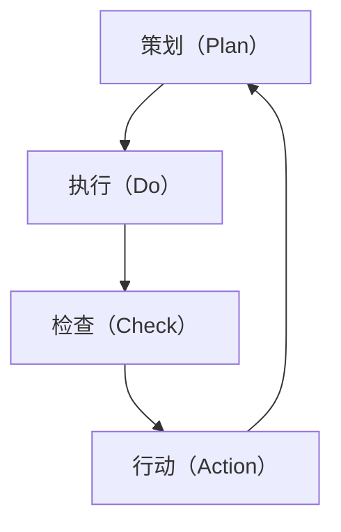
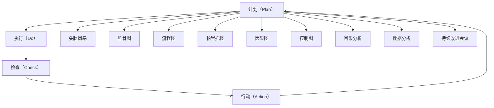

                 

## 文章标题：PDCA循环与持续改进文化

在当今快速发展的科技时代，企业面临着前所未有的竞争压力和变化速度。为了保持竞争力，持续改进已成为许多企业成功的关键。PDCA循环，即策划（Plan）、执行（Do）、检查（Check）和行动（Action）的循环，提供了一个系统化的方法来推动持续改进。本文将深入探讨PDCA循环的基本概念、应用，以及如何在组织中建立持续改进文化，并分享一些优秀企业的实践案例。

## 关键词

- **PDCA循环**
- **持续改进**
- **质量管理**
- **项目管理**
- **企业文化**
- **创新思维**
- **组织竞争力**

## 摘要

本文旨在介绍PDCA循环的基本概念及其在实际应用中的重要性。随后，我们将探讨如何建立和维持持续改进文化，包括领导者、员工的角色以及实际操作中的策略和方法。通过分析优秀企业的实践案例，本文希望为企业提供一套系统的持续改进框架，以应对不断变化的商业环境。

## 目录

1. **PDCA循环基础**
   - **1.1 PDCA循环的基本概念**
   - **1.2 PDCA循环的四个阶段**
   - **1.3 PDCA循环在实际中的应用**

2. **持续改进文化**
   - **2.1 持续改进文化的重要性**
   - **2.2 建立持续改进文化的策略**
   - **2.3 如何实施持续改进**

3. **案例分析**
   - **3.1 谷歌的持续改进实践**
   - **3.2 福特的持续改进实践**

4. **PDCA循环与持续改进文化的综合应用**
   - **4.1 PDCA循环与持续改进文化的整合**
   - **4.2 案例分析**

5. **附录**
   - **5.1 PDCA循环与持续改进文化应用工具集**

### 第一部分：PDCA循环基础

#### 第1章：PDCA循环的基本概念

PDCA循环，也称为戴明循环，是一种用于系统化解决问题的方法。它由美国质量管理专家爱德华·戴明在20世纪中叶提出，并广泛应用于各类组织和企业。PDCA循环的核心理念是持续改进，通过不断循环四个阶段——策划、执行、检查和行动，逐步实现目标，提高质量和效率。

**1.1 PDCA循环的历史与重要性**

PDCA循环起源于日本，在20世纪50年代由日本质量管理专家石川馨（Kaoru Ishikawa）引入并推广。在日本，PDCA循环被广泛应用于制造业和服务业，成为质量管理的重要组成部分。随着全球化的发展，PDCA循环逐渐在全球范围内得到认可和应用。

在中国，PDCA循环自改革开放以来开始被引入，并在国有企业、民营企业以及外资企业中得到广泛应用。特别是在制造业和工程领域，PDCA循环被视为一种有效的管理工具，帮助企业提高产品质量和管理效率。

PDCA循环的重要性体现在以下几个方面：

- **系统化**：PDCA循环提供了一个系统化的框架，使组织能够结构化地管理和解决问题。
- **持续改进**：通过循环四个阶段，组织可以不断反思和优化流程，提高整体绩效。
- **全员参与**：PDCA循环鼓励全员参与，通过团队合作和持续反馈，提高员工的工作积极性和创造力。
- **应用广泛**：PDCA循环不仅适用于质量管理，还可以应用于项目管理、流程优化等多个领域。

**1.2 PDCA循环的四个阶段**

PDCA循环包括策划（Plan）、执行（Do）、检查（Check）和行动（Action）四个阶段，每个阶段都有其独特的任务和目标。

**策划（Plan）**：在这个阶段，组织需要设定目标、制定计划、分配资源。具体步骤包括：

- **目标设定**：明确组织或项目的目标，确保目标的可达性和具体性。
- **资源准备**：分析所需的资源，包括人力、物资、资金等，并确保资源的有效分配。
- **风险分析**：评估潜在的风险，制定应对策略，以减少不确定性。

**执行（Do）**：在这个阶段，组织需要执行计划，实施具体行动。关键步骤包括：

- **任务分配**：将计划分解为具体的任务，分配给相关的团队成员。
- **行动实施**：按照计划执行任务，确保每个步骤的顺利进行。
- **问题发现**：在执行过程中，及时发现并记录问题，以便在后续阶段解决。

**检查（Check）**：在这个阶段，组织需要检查执行结果，评估目标和计划达成情况。具体步骤包括：

- **结果评估**：对执行结果进行量化评估，判断目标是否达成。
- **反馈收集**：收集团队成员和利益相关者的反馈，了解计划的实施效果。
- **问题记录**：记录执行过程中出现的问题，分析其根本原因。

**行动（Action）**：在这个阶段，组织需要根据检查结果采取行动，进行改进。具体步骤包括：

- **改进措施**：针对发现的问题，制定改进措施，优化流程和策略。
- **持续优化**：将改进措施实施到下一个循环中，确保持续改进的效果。

**1.3 PDCA循环在实际中的应用**

PDCA循环在实际中的应用非常广泛，以下是一些典型的应用场景：

- **质量管理**：通过PDCA循环，企业可以持续改进产品质量，提高客户满意度。
- **项目管理**：在项目实施过程中，PDCA循环可以帮助团队监控进度、调整计划，确保项目成功交付。
- **流程优化**：通过PDCA循环，企业可以不断优化业务流程，提高效率，降低成本。
- **创新管理**：PDCA循环鼓励企业不断创新，通过策划、执行、检查和行动，实现持续创新。

总之，PDCA循环是一种简单而有效的管理工具，通过系统化的策划、执行、检查和行动，可以帮助企业实现持续改进，提高竞争力和市场地位。

### 第一部分：PDCA循环基础

#### 第2章：PDCA循环在实际中的应用

在上一章中，我们介绍了PDCA循环的基本概念和四个阶段。本章节将进一步探讨PDCA循环在实际中的应用，具体包括其在项目管理和质量管理中的实践。

**2.1 PDCA循环在项目管理中的应用**

项目管理是一个复杂且涉及多个方面的过程，而PDCA循环提供了一个系统化的方法，帮助项目经理更好地管理项目。以下是如何在项目管理中应用PDCA循环的具体步骤：

**策划（Plan）阶段**：

- **目标设定**：明确项目目标，确保目标具体、可达且符合利益相关者的期望。
- **范围定义**：确定项目的范围，明确项目需要完成的任务和活动。
- **资源计划**：评估项目所需的资源，包括人力、物资、资金等，并制定资源分配计划。
- **时间计划**：制定项目进度计划，明确项目的关键路径和里程碑。

**执行（Do）阶段**：

- **任务分配**：将项目任务分解为具体的子任务，并分配给项目团队成员。
- **执行监控**：在执行过程中，实时监控项目进度和资源使用情况，确保项目按计划进行。
- **问题解决**：在执行过程中，及时识别和解决出现的问题，避免影响项目进度和质量。

**检查（Check）阶段**：

- **进度评估**：对项目进度进行评估，判断项目是否按计划进行，是否符合预期目标。
- **质量检查**：对项目交付物进行质量检查，确保项目符合质量标准。
- **成本控制**：评估项目成本，确保项目在预算范围内完成。

**行动（Action）阶段**：

- **调整计划**：根据检查结果，对项目计划进行调整，确保项目能够按时、按质量完成。
- **经验总结**：总结项目执行过程中的经验和教训，为未来的项目管理提供参考。

通过PDCA循环，项目经理可以持续监控和优化项目过程，确保项目目标的达成。以下是一个简单的PDCA循环流程图，用于说明项目管理的PDCA循环过程：

**2.2 PDCA循环在质量管理中的应用**

质量管理是确保产品或服务质量的关键。PDCA循环在质量管理中的应用可以帮助企业不断优化流程，提高产品质量。以下是在质量管理中应用PDCA循环的具体步骤：

**策划（Plan）阶段**：

- **质量目标设定**：明确质量目标，确保质量目标具有可衡量性和可达成性。
- **过程设计**：设计实现质量目标的过程，包括流程、方法和工具。
- **资源分配**：确定实现质量目标所需的资源，并确保资源的有效利用。

**执行（Do）阶段**：

- **过程实施**：按照设计的过程，实施质量管理的具体活动。
- **员工培训**：对相关员工进行培训，确保他们了解并能够正确执行质量管理的流程。

**检查（Check）阶段**：

- **质量评估**：对实施过程的质量进行评估，判断是否达到质量目标。
- **客户反馈**：收集客户的反馈，了解他们对产品质量的看法。

**行动（Action）阶段**：

- **改进措施**：根据质量评估和客户反馈，制定改进措施，优化质量管理流程。
- **经验总结**：总结质量管理过程中的经验和教训，为未来的质量管理提供参考。

以下是一个简单的PDCA循环流程图，用于说明质量管理的PDCA循环过程：

通过在项目管理和质量管理中应用PDCA循环，企业可以建立一套系统化的管理方法，确保项目和质量目标的实现。PDCA循环不仅提供了一个清晰的管理框架，还鼓励企业持续改进，提高整体绩效。

### 第二部分：持续改进文化

#### 第3章：持续改进文化的重要性

在现代企业竞争中，持续改进文化已成为企业成功的关键因素之一。持续改进文化不仅是一种管理理念，更是一种组织内部的共同价值观和行为模式。它通过不断迭代和优化，帮助企业适应市场变化，提高竞争力和创新能力。在这一章节中，我们将深入探讨持续改进文化的概念及其在组织中的意义。

**3.1 持续改进文化的概念**

持续改进文化是一种以持续优化和改进为核心的管理理念。它强调通过不断的尝试、学习和改进，来提升组织的整体绩效。这种文化不仅关注短期目标，更注重长期发展和持续创新。

持续改进文化包括以下几个方面：

- **全员参与**：持续改进文化鼓励每个员工都参与到改进过程中，共同为组织的优化贡献力量。
- **数据驱动**：持续改进文化强调基于数据的事实驱动，通过数据分析和评估来指导改进措施。
- **持续反馈**：持续改进文化鼓励持续的反馈和沟通，通过反馈机制来识别问题和机会，进行及时调整。
- **学习与成长**：持续改进文化强调学习和成长，通过培训和学习机会来提升员工的能力和知识水平。

**3.2 持续改进文化在组织中的意义**

持续改进文化在组织中的意义不容忽视，主要体现在以下几个方面：

- **提高员工参与度**：持续改进文化鼓励员工积极参与到改进过程中，增强了员工对组织的归属感和责任感。员工在改进过程中能够感受到自己的价值和贡献，从而提高工作积极性和满意度。

- **促进创新思维**：持续改进文化鼓励员工不断思考和创新，通过不断挑战现状，寻找改进的机会。这种文化氛围有助于激发员工的创造力，推动组织的创新发展。

- **增强组织竞争力**：持续改进文化通过不断优化流程和提升效率，使组织能够在市场上保持竞争力。通过持续改进，企业可以更快地响应市场变化，提供更高质量的产品和服务，从而赢得客户的信任和忠诚。

- **提升组织绩效**：持续改进文化使组织能够持续地提升绩效，通过数据驱动和持续反馈机制，及时发现和解决问题。这种文化氛围有助于组织实现长期目标，提高整体绩效。

总之，持续改进文化是一种强大的管理工具，它能够帮助组织在快速变化的市场环境中保持竞争力。通过建立和维持持续改进文化，组织可以不断提升自身的能力和绩效，实现持续发展。

#### 第4章：建立持续改进文化的策略

要建立一种持续改进文化，组织需要从多个方面入手，包括领导者的支持与鼓励、提供必要的资源和培训、建立反馈机制等。以下是一些具体的策略和步骤，帮助组织成功构建和维持持续改进文化。

**4.1 领导者的角色**

领导者在建立持续改进文化中起着至关重要的作用。他们不仅需要提供战略方向，还需要通过自身的行动和态度来激励和引导员工。以下是领导者应采取的一些具体措施：

- **树立榜样**：领导者应以身作则，积极参与到持续改进的过程中，通过实际行动展示持续改进的价值。
- **明确目标**：领导者应明确组织的持续改进目标，并将其传达给全体员工，确保每个员工都了解自己的职责和贡献。
- **提供支持**：领导者应为员工提供必要的资源和支持，鼓励他们提出改进建议，并创造一个无障碍的沟通环境。
- **激励员工**：领导者应通过奖励和认可来激励员工，对于在持续改进中表现突出的员工给予表彰和奖励，以激发员工的积极性和创造力。

**4.2 提供必要的资源和培训**

建立持续改进文化需要组织提供必要的资源和培训，以支持员工的改进活动。以下是具体的资源和支持措施：

- **培训与发展**：组织应定期提供培训和学习机会，帮助员工提升技能和知识水平。这些培训可以包括质量管理、项目管理、流程优化等领域的专业知识。
- **工具与技术**：为员工提供必要的工具和技术，如项目管理软件、数据分析工具等，以支持他们的改进活动。
- **资源投入**：确保有足够的资源用于改进项目，包括人力、资金和技术支持。资源投入是持续改进文化得以顺利实施的重要保障。

**4.3 建立反馈机制**

有效的反馈机制是持续改进文化的重要组成部分。通过建立反馈机制，组织可以及时发现问题和改进机会，确保持续改进的顺利进行。以下是建立反馈机制的一些具体措施：

- **定期反馈会议**：组织应定期举行反馈会议，让员工有机会分享他们的想法和建议。这些会议可以是定期的团队会议，也可以是项目进展汇报会。
- **匿名反馈系统**：建立匿名反馈系统，让员工能够自由地表达意见和建议，而不用担心反馈的后果。这样可以鼓励员工更真实地反映问题和提出建议。
- **数据分析和报告**：通过数据分析和报告，组织可以系统地评估改进措施的效果，并识别潜在的问题和改进机会。数据分析报告应定期发布，以便全体员工了解改进进展。
- **奖励机制**：对于提出有效改进建议的员工，组织应给予奖励和认可，以鼓励更多员工积极参与到持续改进过程中。

**4.4 强化个人责任与团队精神**

在持续改进文化中，个人责任和团队精神至关重要。组织应采取措施强化这两个方面：

- **个人责任**：明确每个员工在持续改进中的职责，确保每个人都清楚自己的角色和责任。通过定期考核和评估，确保员工履行自己的职责。
- **团队协作**：鼓励团队合作，通过跨部门、跨职能的协作项目，促进员工之间的沟通和合作。团队合作可以激发创新思维，提高改进效率。

**4.5 持续优化和调整**

持续改进是一个不断循环和优化的过程。组织应不断评估和调整持续改进文化的实施效果，确保其能够适应组织的变化和发展。以下是具体的优化措施：

- **定期评估**：组织应定期对持续改进文化的实施效果进行评估，通过员工反馈、数据分析和绩效评估等手段，识别存在的问题和改进空间。
- **调整策略**：根据评估结果，调整持续改进文化的策略和措施，确保其能够更好地适应组织的需求。
- **持续学习和创新**：鼓励员工持续学习和创新，通过培训、研讨会和内部创新竞赛等方式，激发员工的创造力和创新能力。

总之，建立持续改进文化是一个系统化的过程，需要组织从多个方面入手，包括领导者的支持与鼓励、提供必要的资源和培训、建立反馈机制等。通过这些策略和措施，组织可以成功构建和维持一种持续改进文化，推动组织的持续发展和成长。

### 第二部分：持续改进文化

#### 第5章：如何实施持续改进

持续改进是一个系统化的过程，涉及多个阶段和策略。在上一章节中，我们讨论了如何建立持续改进文化的策略。本章节将详细探讨如何在实际操作中实施持续改进，包括持续改进的过程模型、工具和方法。

**5.1 持续改进的过程模型**

持续改进的过程模型通常包括四个主要阶段：计划（Plan）、执行（Do）、检查（Check）和行动（Action）。这四个阶段相互衔接，形成一个闭环，确保持续改进的顺利进行。

**计划（Plan）阶段**：

在计划阶段，组织需要设定改进目标、制定改进方案和分配资源。具体步骤包括：

- **目标设定**：明确需要改进的问题或目标，确保目标具体、可行且具有可衡量性。
- **原因分析**：通过鱼骨图、头脑风暴等方法，分析问题产生的原因，确定改进的关键点。
- **方案制定**：根据原因分析的结果，制定具体的改进方案，包括改进措施、时间表和责任人。

**执行（Do）阶段**：

在执行阶段，组织需要按照计划方案实施改进措施。具体步骤包括：

- **任务分配**：将改进任务分解为具体的子任务，并分配给相关的人员或团队。
- **执行监控**：在执行过程中，实时监控改进措施的实施情况，确保按照计划进行。
- **问题处理**：及时发现和解决执行过程中出现的问题，确保改进措施的顺利实施。

**检查（Check）阶段**：

在检查阶段，组织需要评估改进措施的效果，确保目标达成。具体步骤包括：

- **效果评估**：通过数据分析和实际观察，评估改进措施的效果，判断目标是否达成。
- **反馈收集**：收集相关利益相关者的反馈意见，了解改进措施的实施情况和效果。

**行动（Action）阶段**：

在行动阶段，组织需要根据检查结果采取行动，进行持续改进。具体步骤包括：

- **总结经验**：总结改进过程中的经验和教训，识别成功的改进措施和需要改进的地方。
- **优化措施**：根据总结的经验，制定和实施优化措施，确保持续改进的效果。

**5.2 实施持续改进的工具和方法**

在实施持续改进过程中，组织可以使用多种工具和方法来支持改进活动。以下是一些常用的工具和方法：

**头脑风暴**：

头脑风暴是一种集体创意思考方法，通过集思广益，激发创新思维。在持续改进过程中，头脑风暴可以帮助团队快速产生改进建议，并筛选出可行的方案。

**鱼骨图**：

鱼骨图（Ishikawa图）是一种用于问题分析和原因识别的工具。它通过将问题分解为不同的因素，帮助团队深入分析问题的根本原因，并制定相应的改进措施。

**流程图**：

流程图是一种用于描述业务流程和活动顺序的工具。通过绘制流程图，团队可以清晰地了解业务流程中的每个步骤和环节，发现潜在的瓶颈和改进机会。

**帕累托图**：

帕累托图（Pareto Chart）是一种用于问题优先级排序的工具。它根据问题的发生频率和严重程度，将问题从高到低进行排序，帮助团队集中精力解决最重要的改进问题。

**因果图**：

因果图（Cause and Effect Diagram）是一种用于分析问题原因和结果关系的工具。通过绘制因果图，团队可以直观地了解问题产生的原因，并制定相应的改进措施。

**控制图**：

控制图是一种用于监控过程稳定性和识别过程变异的工具。通过绘制控制图，团队可以实时监控过程变化，及时发现和解决问题。

**因果分析**：

因果分析是一种通过数学模型和逻辑推理来分析问题原因和结果关系的方法。通过因果分析，团队可以深入理解问题的本质，并制定更有效的改进措施。

**数据分析**：

数据分析是一种通过数据收集、处理和分析来支持决策的方法。在持续改进过程中，数据分析可以帮助团队识别问题、评估改进效果，并为改进提供科学依据。

**持续改进会议**：

持续改进会议是一种定期举行的会议，用于讨论改进方案、评估改进效果和规划下一步行动。通过持续改进会议，团队可以保持改进活动的连续性和一致性。

通过使用这些工具和方法，组织可以有效地实施持续改进，提高产品质量和运营效率。以下是一个简单的持续改进流程图，用于说明持续改进的过程模型和工具方法：

总之，持续改进是一个系统化的过程，需要组织从多个方面入手，包括过程模型、工具和方法。通过实施持续改进，组织可以不断提升自身的竞争力和创新能力，实现持续发展和成长。

#### 第三部分：案例分析

#### 第6章：优秀企业的持续改进实践

在持续改进文化的推动下，许多优秀企业取得了显著的成绩。以下我们将分析两家知名企业的持续改进实践，分别是谷歌和福特。

**6.1 谷歌的持续改进实践**

谷歌作为全球领先的技术公司，其持续改进实践在业界具有很高的知名度。谷歌的持续改进主要体现在以下几个方面：

**员工满意度调查**

谷歌通过定期的员工满意度调查，了解员工的工作体验和建议。这些调查不仅关注员工的工作满意度，还包括对工作环境、团队协作和职业发展的评价。通过收集和分析员工反馈，谷歌能够及时发现和解决员工面临的问题，提高员工的工作满意度和忠诚度。

**快速迭代开发**

谷歌在产品开发过程中广泛应用快速迭代开发方法。通过快速迭代，谷歌能够快速响应市场需求，不断优化产品功能，提高用户满意度。谷歌的产品团队通常会划分多个迭代周期，在每个迭代周期内，团队会制定具体的目标和任务，进行开发、测试和发布。这种方法不仅提高了开发效率，还增强了产品的竞争力和用户口碑。

**内部创新实验室**

谷歌设有多个内部创新实验室，旨在鼓励员工进行创新研究和探索。这些实验室提供资金、资源和技术支持，为员工提供了一个自由探索和创新的环境。通过内部创新实验室，谷歌能够不断推出新的技术和产品，保持其在技术创新领域的领先地位。

**6.2 福特的持续改进实践**

福特作为全球知名的汽车制造商，其在持续改进方面的实践也非常值得借鉴。福特的主要持续改进实践包括：

**JIT生产系统**

福特广泛应用了JIT（Just-In-Time）生产系统，通过实时生产和配送，减少库存和浪费。JIT生产系统要求生产过程的高度协调和自动化，从而实现生产线的无缝衔接。通过JIT生产系统，福特能够提高生产效率，降低库存成本，同时确保产品质量。

**全面质量管理**

福特非常注重全面质量管理，通过一系列质量管理和控制措施，确保产品和服务的高质量。福特的质量管理包括供应商质量管理、生产过程质量控制、产品测试和客户反馈机制等多个方面。通过全面质量管理，福特能够不断提升产品质量，提高客户满意度。

**员工培训计划**

福特设有全面的员工培训计划，为员工提供多样化的培训和学习机会。这些培训包括质量管理、项目管理、生产技能和信息技术等方面的课程。通过员工培训计划，福特不仅提高了员工的技能水平，还增强了员工的职业发展机会，促进了员工的成长和忠诚度。

通过以上分析，我们可以看出，谷歌和福特在持续改进方面的实践各有特点，但都取得了显著的成效。谷歌通过员工满意度调查、快速迭代开发和内部创新实验室，不断优化产品和服务，保持技术创新的领先地位。福特则通过JIT生产系统、全面质量管理以及员工培训计划，提高生产效率和质量，确保在竞争激烈的市场中保持优势。

总之，优秀企业的持续改进实践为我们提供了宝贵的经验和启示。通过借鉴这些实践，其他企业也可以在持续改进方面取得成功，实现持续发展和成长。

#### 第7章：PDCA循环与持续改进文化的综合应用

在本章节中，我们将探讨如何将PDCA循环与持续改进文化结合起来，以实现组织的持续优化和成长。通过具体的案例分析和实际应用，我们将展示如何将PDCA循环的四个阶段与持续改进文化的策略相结合，从而推动组织的整体改进。

**7.1 PDCA循环与持续改进文化的整合**

PDCA循环和持续改进文化之间存在着紧密的联系。PDCA循环提供了一个系统化的框架，使组织能够有序地进行持续改进。而持续改进文化则是一种价值观和行为模式，鼓励组织不断追求卓越，通过持续优化来实现长期目标。以下是如何将两者结合的具体方法：

- **策划（Plan）**：在策划阶段，组织需要设定明确的改进目标和计划。这一过程应考虑到持续改进文化的价值观，确保目标的制定是基于数据驱动和员工参与的结果。
- **执行（Do）**：在执行阶段，组织应严格按照计划实施改进措施。持续改进文化强调全员参与，因此在执行过程中，应鼓励员工积极参与，提出改进建议，确保改进措施的落实。
- **检查（Check）**：在检查阶段，组织需要对执行结果进行评估，确保改进措施的有效性。持续改进文化要求组织建立反馈机制，通过定期的检查和评估，及时了解改进措施的效果，并根据反馈进行调整。
- **行动（Action）**：在行动阶段，组织需要根据检查结果采取行动，进行持续改进。持续改进文化强调经验总结和优化，因此在行动阶段，组织应总结改进过程中的经验，识别成功的改进措施，并将其应用到未来的改进活动中。

**7.2 案例分析：如何将PDCA循环与持续改进文化结合起来**

以下是一个具体的案例分析，展示了如何将PDCA循环与持续改进文化结合起来，以实现组织的持续改进：

**案例：某电子产品制造企业的生产效率提升**

1. **策划（Plan）**：该企业首先通过数据分析和市场调研，确定了生产效率提升的目标。在策划阶段，企业明确了需要改进的关键环节，如生产流程、设备维护和人员培训。同时，企业还根据持续改进文化的价值观，制定了详细的改进计划，包括改进目标、具体措施和时间表。

2. **执行（Do）**：在执行阶段，企业按照改进计划，对生产流程进行了优化。首先，企业通过员工培训，提高了员工的操作技能和效率。其次，企业对生产设备进行了维护和升级，确保设备的正常运行和高效生产。此外，企业还通过引入先进的生产管理软件，实现了生产过程的实时监控和优化。

3. **检查（Check）**：在检查阶段，企业对改进措施的实施效果进行了评估。通过数据分析和实际观察，企业发现生产效率有了显著提升，产品不良率也有所降低。同时，企业还通过员工满意度调查，了解了员工对改进措施的看法和建议。这些反馈有助于企业进一步优化改进措施。

4. **行动（Action）**：在行动阶段，企业根据检查结果，对改进措施进行了调整和优化。企业总结改进过程中的经验，识别了成功的关键因素，并将其应用到未来的生产效率提升项目中。同时，企业还制定了长期的持续改进计划，确保生产效率的持续提升。

通过这个案例，我们可以看到，将PDCA循环与持续改进文化结合起来，可以帮助企业实现持续改进和优化。企业在策划阶段明确了改进目标，执行阶段严格按照计划实施，检查阶段及时评估和反馈，行动阶段总结经验并进行优化。这种系统化的改进方法，不仅提高了企业的生产效率，还增强了员工的参与度和满意度。

**7.3 实际应用：如何将PDCA循环与持续改进文化应用于不同领域**

PDCA循环和持续改进文化可以应用于组织的各个领域，如项目管理、质量管理、流程优化等。以下是一些实际应用场景：

- **项目管理**：在项目策划阶段，项目团队可以运用PDCA循环，设定项目目标、制定计划、分配资源。在项目执行阶段，团队可以严格按照计划实施，及时调整和优化。在项目检查阶段，团队可以评估项目进度和效果，收集反馈并进行总结。在项目行动阶段，团队可以根据检查结果，制定改进措施，确保项目的成功交付。

- **质量管理**：在质量管理过程中，企业可以运用PDCA循环，设定质量目标、制定质量计划、实施质量控制措施。在检查阶段，企业可以通过质量评估和客户反馈，识别质量问题并进行改进。在行动阶段，企业可以总结质量改进的经验，制定长期的持续改进计划，提高产品质量。

- **流程优化**：在流程优化过程中，企业可以运用PDCA循环，分析现有流程的瓶颈和问题，制定优化方案。在执行阶段，企业可以按照优化方案实施改进措施，确保流程的顺畅运行。在检查阶段，企业可以通过数据分析和实际观察，评估优化效果，并进行调整。在行动阶段，企业可以总结优化经验，制定持续的流程优化计划。

通过这些实际应用场景，我们可以看到，PDCA循环和持续改进文化可以帮助企业在各个领域实现持续改进和优化。这种系统化的方法不仅提高了组织的绩效，还增强了员工的参与度和创造力。

总之，将PDCA循环与持续改进文化结合起来，可以帮助企业实现系统化的改进和优化。通过具体的案例分析和实际应用，我们可以看到，这种方法在提升生产效率、改进质量和优化流程方面具有显著效果。随着市场的不断变化，企业需要不断追求卓越，通过持续改进来保持竞争力。因此，建立和维持持续改进文化，是企业实现长期成功的关键。

### 附录

#### 附录A：PDCA循环与持续改进文化应用工具集

为了更好地实施PDCA循环和持续改进文化，组织可以借助一系列的工具和方法。以下是一些常用的工具集，包括PDCA循环模板、持续改进行动计划表、质量管理工具集和流程优化工具集。

**1. PDCA循环模板**

PDCA循环模板是一种简明的工具，用于指导组织在策划、执行、检查和行动阶段进行工作。以下是一个简单的PDCA循环模板：

- **策划（Plan）**：
  - **目标设定**：明确改进目标和计划
  - **资源准备**：确定所需资源和分配方案
  - **风险分析**：评估潜在风险并制定应对措施

- **执行（Do）**：
  - **任务分配**：将任务分解并分配给相关人员
  - **行动实施**：按照计划执行任务
  - **问题发现**：记录执行过程中出现的问题

- **检查（Check）**：
  - **结果评估**：评估执行结果是否符合预期
  - **反馈收集**：收集利益相关者的反馈意见

- **行动（Action）**：
  - **改进措施**：根据评估结果制定改进措施
  - **持续优化**：将改进措施应用到下一个循环中

**2. 持续改进行动计划表**

持续改进行动计划表是一种用于跟踪改进计划进度和效果的表格。以下是一个简单的持续改进行动计划表模板：

- **改进项目**：列出需要改进的项目或问题
- **目标**：明确每个项目的改进目标
- **措施**：制定具体的改进措施
- **责任人**：分配责任给相关人员
- **进度**：记录项目进度和完成时间
- **效果**：评估改进措施的效果

**3. 质量管理工具集**

质量管理工具集包括用于评估、监控和改进质量的多种工具。以下是一些常用的质量管理工具：

- **质量控制图**：用于监控过程稳定性和识别过程变异
- **质量功能展开（QFD）**：用于确定客户需求并确保设计满足这些需求
- **故障模式及影响分析（FMEA）**：用于识别潜在的质量问题和风险
- **统计过程控制（SPC）**：用于监控过程输出并确保过程在控制范围内

**4. 流程优化工具集**

流程优化工具集包括用于分析和改进业务流程的工具。以下是一些常用的流程优化工具：

- **流程图**：用于描述业务流程和活动顺序
- **价值流图**：用于分析整个业务流程的价值和浪费
- **鱼骨图**：用于识别问题的根本原因
- **流程仿真**：用于模拟和优化业务流程

通过使用这些工具集，组织可以更有效地实施PDCA循环和持续改进文化。这些工具不仅提供了系统化的方法，还帮助组织识别问题、评估改进效果，并实现持续优化。附录中的工具集为组织提供了一个全面的指南，有助于在实际操作中应用PDCA循环和持续改进文化。

### 作者信息

- 作者：AI天才研究院/AI Genius Institute & 禅与计算机程序设计艺术 /Zen And The Art of Computer Programming

本文由AI天才研究院和禅与计算机程序设计艺术共同撰写，旨在深入探讨PDCA循环与持续改进文化的应用和实践。作者具有丰富的计算机科学和人工智能领域经验，致力于推动科技创新和产业进步。希望通过本文，为读者提供有价值的见解和实用的管理工具，助力企业在不断变化的市场环境中实现持续改进和卓越发展。

