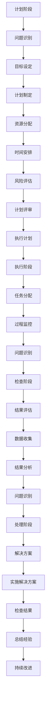
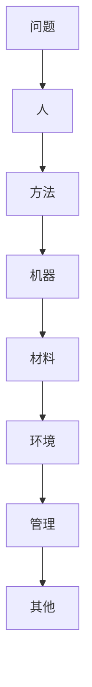
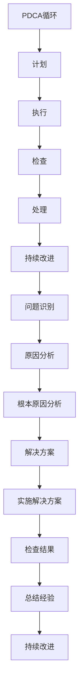
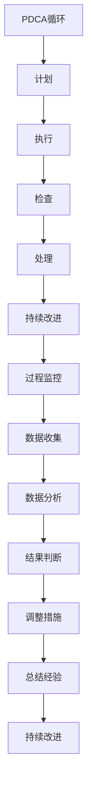

                 

### 文章标题：PDCA循环与管理持续改进的关系

> 关键词：PDCA循环，管理，持续改进，质量管理，运营管理，人力资源管理

> 摘要：本文从PDCA循环的基本概念出发，深入探讨了PDCA循环在管理中的应用，特别是持续改进策略。通过案例分析，揭示了PDCA循环在各个领域的实际应用，以及如何通过持续改进实现组织的优化和发展。

### 第一部分：PDCA循环的基本概念

#### 第1章：PDCA循环的起源与意义

##### 1.1 PDCA循环的起源

PDCA循环，又称戴明循环，是由美国质量管理专家爱德华·戴明（W. Edwards Deming）于20世纪50年代提出的。PDCA循环是一种系统化的管理方法，它将复杂的管理任务分解为四个阶段：计划（Plan）、执行（Do）、检查（Check）和处理（Act）。这种循环方法不仅适用于质量管理，还可以应用于运营管理、人力资源管理等多个领域。

##### 1.2 PDCA循环的意义

PDCA循环的意义在于它提供了一种持续改进的机制，使组织能够不断优化自身的运营和管理。通过PDCA循环，组织可以系统地进行问题识别、分析、解决和预防，从而提高工作效率、降低成本、提升质量。PDCA循环的核心在于其循环性，通过不断的循环，组织能够实现持续改进，从而保持竞争力。

##### 1.3 PDCA循环的核心原则

PDCA循环的核心原则包括：

1. **系统性**：PDCA循环强调系统的整体性，要求对整个流程进行全面的规划和执行。
2. **迭代性**：PDCA循环是一个循环的过程，每个阶段都需要反复进行，以达到持续改进的目的。
3. **数据驱动**：PDCA循环强调数据的重要性，通过数据收集和分析，为决策提供依据。
4. **全员参与**：PDCA循环强调全员参与，通过团队合作，提高解决问题的效率。

#### 第2章：PDCA循环的四个阶段

##### 2.1 计划（Plan）

计划阶段是PDCA循环的起点，主要任务是确定目标和标准，制定具体的行动计划。在这个阶段，需要明确以下内容：

1. **问题识别**：通过数据分析，识别当前存在的问题。
2. **目标设定**：根据问题，设定具体的改进目标。
3. **计划制定**：制定具体的行动计划，包括资源分配、时间安排等。

##### 2.2 执行（Do）

执行阶段是将计划付诸实践的阶段。在这个阶段，需要按照计划进行操作，确保每个步骤都得到有效执行。关键点包括：

1. **资源准备**：确保计划执行所需的资源得到充分准备。
2. **任务分配**：明确每个任务的责任人，确保任务得到有效执行。
3. **过程监控**：对执行过程进行监控，确保计划得到有效执行。

##### 2.3 检查（Check）

检查阶段是对执行结果进行评估的阶段。在这个阶段，需要收集数据，对执行结果进行分析，判断是否达到预期目标。关键点包括：

1. **数据收集**：收集与执行相关的数据，包括质量数据、成本数据等。
2. **结果评估**：对数据进行分析，评估执行结果是否符合预期目标。
3. **问题识别**：根据评估结果，识别存在的问题。

##### 2.4 处理（Act）

处理阶段是对检查结果进行处理的阶段。在这个阶段，需要根据检查结果进行改进，确保问题得到有效解决。关键点包括：

1. **问题解决**：根据检查结果，制定具体的解决方案，解决问题。
2. **经验总结**：对整个PDCA循环进行总结，形成经验教训。
3. **持续改进**：将改进措施纳入下一个PDCA循环，实现持续改进。

### 第二部分：PDCA循环在管理中的应用

#### 第3章：PDCA循环在质量管理中的应用

##### 3.1 质量管理的基本概念

质量管理是指组织为了实现质量目标而采取的一系列活动。质量管理的基本概念包括：

1. **质量**：满足要求的能力。
2. **质量控制**：通过监控和改进，确保产品或服务的质量。
3. **质量保证**：通过系统化的措施，确保产品或服务满足特定的质量标准。

##### 3.2 PDCA循环在质量管理体系中的应用

PDCA循环在质量管理体系中的应用主要体现在以下方面：

1. **计划阶段**：制定质量目标和质量计划，明确质量控制的关键环节。
2. **执行阶段**：按照质量计划进行操作，确保质量控制措施得到有效执行。
3. **检查阶段**：对质量执行结果进行监控和评估，确保质量目标得到实现。
4. **处理阶段**：根据检查结果，对质量管理体系进行改进，确保质量目标的持续实现。

##### 3.3 质量改进案例分析

某制造企业在生产过程中，发现产品的不良率较高，通过PDCA循环进行了改进。

1. **计划阶段**：识别问题，制定降低不良率的目标和计划。
2. **执行阶段**：按照计划进行操作，加强生产过程中的质量控制。
3. **检查阶段**：对生产过程进行监控，收集数据，分析不良原因。
4. **处理阶段**：针对分析结果，制定改进措施，如优化生产流程、加强员工培训等。

通过PDCA循环，该企业成功降低了产品的不良率，提高了产品质量。

#### 第4章：PDCA循环在运营管理中的应用

##### 4.1 运营管理的基本概念

运营管理是指组织为了实现运营目标而采取的一系列管理活动。运营管理的基本概念包括：

1. **运营**：组织的基本活动，包括生产、销售、服务等活动。
2. **运营效率**：运营活动的高效性。
3. **运营成本**：运营活动所发生的成本。

##### 4.2 PDCA循环在运营管理中的应用

PDCA循环在运营管理中的应用主要体现在以下方面：

1. **计划阶段**：制定运营目标和运营计划，明确运营管理的关键环节。
2. **执行阶段**：按照运营计划进行操作，确保运营效率。
3. **检查阶段**：对运营结果进行监控和评估，确保运营目标的实现。
4. **处理阶段**：根据检查结果，对运营管理进行改进，提高运营效率。

##### 4.3 运营改进案例分析

某电商企业为了提高客户满意度，通过PDCA循环进行了运营改进。

1. **计划阶段**：识别问题，制定提高客户满意度的目标和计划。
2. **执行阶段**：加强售后服务、优化购物体验等，提高客户满意度。
3. **检查阶段**：对客户满意度进行监控，收集客户反馈。
4. **处理阶段**：根据客户反馈，优化服务流程、提升服务质量。

通过PDCA循环，该企业成功提高了客户满意度，增强了市场竞争力。

#### 第5章：PDCA循环在人力资源管理中的应用

##### 5.1 人力资源管理的核心要素

人力资源管理是指组织为了实现人力资源管理目标而采取的一系列管理活动。人力资源管理的核心要素包括：

1. **员工招聘**：选拔合适的人才。
2. **员工培训**：提升员工的能力。
3. **员工激励**：激励员工提高工作效率。
4. **员工绩效管理**：评估员工的工作表现。

##### 5.2 PDCA循环在人力资源管理中的应用

PDCA循环在人力资源管理中的应用主要体现在以下方面：

1. **计划阶段**：制定人力资源目标和人力资源计划，明确人力资源管理的关键环节。
2. **执行阶段**：按照人力资源计划进行操作，确保人力资源管理措施得到有效执行。
3. **检查阶段**：对人力资源结果进行监控和评估，确保人力资源目标的实现。
4. **处理阶段**：根据检查结果，对人力资源管理进行改进，提高人力资源管理效率。

##### 5.3 人力资源管理改进案例分析

某公司在招聘过程中，发现招聘周期较长，通过PDCA循环进行了改进。

1. **计划阶段**：识别问题，制定缩短招聘周期的目标和计划。
2. **执行阶段**：优化招聘流程、提升招聘效率。
3. **检查阶段**：对招聘周期进行监控，收集数据，分析招聘效率。
4. **处理阶段**：根据分析结果，进一步优化招聘流程、提升招聘效率。

通过PDCA循环，该公司成功缩短了招聘周期，提高了招聘效率。

### 第三部分：PDCA循环的持续改进

#### 第6章：PDCA循环的持续改进策略

##### 6.1 持续改进的基本原则

持续改进是指组织通过不断优化自身，以实现更高的效率和效益。持续改进的基本原则包括：

1. **目标导向**：持续改进应以实现组织目标为核心。
2. **数据驱动**：持续改进应以数据为基础，通过数据分析发现问题和机会。
3. **全员参与**：持续改进需要全员参与，通过团队合作实现改进。
4. **持续循环**：持续改进是一个循环过程，通过不断的PDCA循环，实现持续优化。

##### 6.2 PDCA循环的持续改进步骤

PDCA循环的持续改进步骤主要包括：

1. **问题识别**：通过数据分析，识别当前存在的问题。
2. **目标设定**：根据问题，设定具体的改进目标。
3. **计划制定**：制定具体的改进计划和措施。
4. **执行计划**：按照改进计划进行操作，确保改进措施得到有效执行。
5. **检查结果**：对执行结果进行监控和评估，确保改进目标得到实现。
6. **处理结果**：根据检查结果，对改进措施进行优化，形成经验教训。

##### 6.3 持续改进案例分析

某公司在生产过程中，发现产品合格率较低，通过PDCA循环进行了持续改进。

1. **问题识别**：通过数据分析，发现产品合格率较低，找出问题原因。
2. **目标设定**：设定提高产品合格率的目标。
3. **计划制定**：制定具体的改进计划和措施，如优化生产流程、提升员工技能等。
4. **执行计划**：按照改进计划进行操作，确保改进措施得到有效执行。
5. **检查结果**：对执行结果进行监控和评估，发现产品合格率有显著提升。
6. **处理结果**：总结改进经验，形成标准操作流程，确保持续优化。

通过PDCA循环的持续改进，该公司成功提高了产品合格率，降低了生产成本。

#### 第7章：PDCA循环的未来发展趋势

##### 7.1 数字化背景下的PDCA循环

随着数字化时代的到来，PDCA循环在数字化背景下得到了进一步的发展。数字化背景下的PDCA循环主要体现在以下几个方面：

1. **数据驱动的PDCA循环**：通过大数据分析，实现更精准的问题识别和目标设定。
2. **智能化的PDCA循环**：利用人工智能技术，实现自动化的PDCA循环，提高效率。
3. **智能化的检查与处理**：通过智能算法，实现自动化的结果检查和问题处理。

##### 7.2 智能化背景下的PDCA循环

智能化背景下的PDCA循环主要体现在以下几个方面：

1. **智能化的计划制定**：通过机器学习，实现自动化的计划制定。
2. **智能化的执行监控**：利用物联网技术，实现实时化的执行监控。
3. **智能化的结果评估**：通过深度学习，实现自动化的结果评估。

##### 7.3 PDCA循环的未来发展趋势分析

PDCA循环的未来发展趋势将主要体现在以下几个方面：

1. **数字化与智能化的融合**：通过数字化和智能化的融合，实现更高效、更精准的PDCA循环。
2. **全员参与的PDCA循环**：通过全员参与，实现更广泛、更深入的PDCA循环。
3. **持续改进的PDCA循环**：通过持续改进，实现PDCA循环的持续优化。

通过不断优化和发展，PDCA循环将在未来发挥更大的作用，助力组织实现持续改进和发展。

#### 附录A：PDCA循环相关工具与方法

##### A.1 PDCA循环工具概述

PDCA循环工具主要包括以下几种：

1. **流程图**：用于描述PDCA循环的各个阶段，帮助理解和管理流程。
2. **鱼骨图**：用于分析问题原因，识别问题根本原因。
3. **因果图**：用于分析因果关系，找出问题的根本原因。
4. **控制图**：用于监控过程变化，判断过程是否受控。

##### A.2 常用的PDCA循环工具

常用的PDCA循环工具包括：

1. **鱼骨图**：用于分析问题的根本原因，如图所示：

```mermaid
graph TD
A[PDCA循环] --> B[计划(Plan)]
B --> C[执行(Do)]
C --> D[检查(Check)]
D --> E[处理(Act)]
E --> F[持续改进]
F --> G[问题识别]
G --> H[原因分析]
H --> I[根本原因分析]
I --> J[解决方案]
J --> K[实施解决方案]
K --> L[检查结果]
L --> M[总结经验]
M --> N[持续改进]
```

2. **因果图**：用于分析问题的因果关系，如图所示：

```mermaid
graph TD
A[PDCA循环] --> B[计划(Plan)]
B --> C[执行(Do)]
C --> D[检查(Check)]
D --> E[处理(Act)]
E --> F[持续改进]
F --> G[问题识别]
G --> H[原因分析]
H --> I[因果关系]
I --> J[根本原因]
J --> K[解决方案]
K --> L[实施解决方案]
L --> M[检查结果]
M --> N[总结经验]
N --> O[持续改进]
```

3. **控制图**：用于监控过程变化，如图所示：

```mermaid
graph TD
A[PDCA循环] --> B[计划(Plan)]
B --> C[执行(Do)]
C --> D[检查(Check)]
D --> E[处理(Act)]
E --> F[持续改进]
F --> G[问题识别]
G --> H[过程监控]
H --> I[数据收集]
I --> J[数据分析]
J --> K[结果判断]
K --> L[调整措施]
L --> M[总结经验]
M --> N[持续改进]
```

##### A.3 PDCA循环工具的使用技巧

1. **流程图**：在制定PDCA循环计划时，使用流程图可以帮助明确各个阶段的任务和责任，如图所示：



2. **鱼骨图**：在分析问题原因时，使用鱼骨图可以帮助识别问题的根本原因，如图所示：



3. **因果图**：在分析问题因果关系时，使用因果图可以帮助找出问题的根本原因，如图所示：



4. **控制图**：在监控过程变化时，使用控制图可以帮助判断过程是否受控，如图所示：



通过以上工具和方法，可以帮助组织更有效地实施PDCA循环，实现持续改进。

#### 附录B：PDCA循环实践案例

##### B.1 某企业PDCA循环实践案例

某电子产品制造企业在生产过程中，发现产品合格率较低，通过PDCA循环进行了改进。

1. **计划阶段**：
   - 问题识别：通过数据分析，发现产品合格率低于行业标准。
   - 目标设定：设定提高产品合格率的目标，达到行业平均水平。
   - 计划制定：制定具体的改进计划，包括优化生产流程、提高员工技能等。

2. **执行阶段**：
   - 资源分配：为改进计划提供必要的资源和人力。
   - 任务分配：明确每个任务的责任人，确保计划得到有效执行。
   - 过程监控：对生产过程进行监控，确保改进措施得到有效执行。

3. **检查阶段**：
   - 数据收集：收集生产过程中的数据，包括产品合格率、生产效率等。
   - 结果评估：对数据进行分析，评估改进措施的效果。

4. **处理阶段**：
   - 解决方案：根据评估结果，制定具体的解决方案，如优化生产流程、加强员工培训等。
   - 实施解决方案：按照解决方案进行操作，确保问题得到有效解决。
   - 检查结果：对实施结果进行监控和评估，确保改进措施得到有效执行。

5. **总结经验**：
   - 通过总结经验，形成标准操作流程，确保持续优化。

通过PDCA循环，该企业成功提高了产品合格率，降低了生产成本，提高了市场竞争力。

##### B.2 某项目PDCA循环实践案例

某软件公司在开发一款新软件时，通过PDCA循环进行了改进。

1. **计划阶段**：
   - 问题识别：通过市场调研和用户反馈，发现软件存在一些功能缺陷和用户体验问题。
   - 目标设定：设定改进软件功能、提升用户体验的目标。
   - 计划制定：制定具体的改进计划，包括优化软件架构、改进用户界面等。

2. **执行阶段**：
   - 资源分配：为改进计划提供必要的资源和人力。
   - 任务分配：明确每个任务的责任人，确保计划得到有效执行。
   - 过程监控：对开发过程进行监控，确保改进措施得到有效执行。

3. **检查阶段**：
   - 数据收集：收集用户反馈和测试数据，包括软件的功能稳定性、用户体验等。
   - 结果评估：对数据进行分析，评估改进措施的效果。

4. **处理阶段**：
   - 解决方案：根据评估结果，制定具体的解决方案，如优化软件架构、改进用户界面等。
   - 实施解决方案：按照解决方案进行操作，确保问题得到有效解决。
   - 检查结果：对实施结果进行监控和评估，确保改进措施得到有效执行。

5. **总结经验**：
   - 通过总结经验，形成标准开发流程，确保持续优化。

通过PDCA循环，该软件公司成功提升了软件质量和用户体验，提高了用户满意度。

##### B.3 PDCA循环实践案例分析与总结

通过对以上两个案例的分析，可以得出以下结论：

1. **PDCA循环适用于各个领域**：无论是企业生产过程，还是软件开发项目，PDCA循环都能够发挥重要作用，帮助组织实现持续改进。

2. **PDCA循环的核心在于持续改进**：通过不断的PDCA循环，组织能够不断识别问题、解决问题，从而实现持续改进。

3. **数据驱动是PDCA循环的关键**：PDCA循环强调数据驱动，通过数据收集和分析，为决策提供依据，确保改进措施的有效性。

4. **全员参与是PDCA循环的成功关键**：PDCA循环的成功离不开全员参与，通过团队合作，提高解决问题的效率。

5. **持续改进是实现组织发展的关键**：通过持续改进，组织能够不断提高自身效率、降低成本、提升质量，从而保持竞争力。

总之，PDCA循环是一种有效的管理方法，通过持续改进，可以帮助组织实现优化和发展。在实践中，组织应充分运用PDCA循环，发挥其优势，实现持续改进。

### 核心概念与联系：

**核心概念与联系：**

Mermaid图表：

```mermaid
graph TD
A[PDCA循环] --> B[计划(Plan)]
B --> C[执行(Do)]
C --> D[检查(Check)]
D --> E[处理(Act)]
E --> F[持续改进]
F --> G[问题识别]
G --> H[原因分析]
H --> I[解决方案]
I --> J[实施解决方案]
J --> K[检查结果]
K --> L[总结经验]
L --> M[持续改进]
```

**核心算法原理讲解：**

伪代码：

```python
# PDCA循环伪代码

# 计划阶段
def plan(goal):
    # 问题识别
    problem = identify_problem()
    # 目标设定
    set_goal(goal, problem)
    # 计划制定
    make_plan()

# 执行阶段
def do_plan():
    # 资源分配
    allocate_resources()
    # 任务执行
    execute_tasks()

# 检查阶段
def check_results():
    # 数据收集
    collect_data()
    # 结果评估
    evaluate_results()

# 处理阶段
def act_on_results():
    # 解决方案
    find_solution()
    # 实施解决方案
    implement_solution()

# 持续改进
def improve():
    # 检查结果
    check_improvement()
    # 总结经验
    summarize_experience()
    # 持续改进
    continue_improvement()
```

**数学模型和数学公式讲解：**

数学公式：

$$
\begin{aligned}
&\text{平均数:} \\
&\bar{x} = \frac{\sum_{i=1}^{n}x_i}{n} \\
&\text{方差:} \\
&s^2 = \frac{\sum_{i=1}^{n}(x_i - \bar{x})^2}{n-1} \\
&\text{标准差:} \\
&s = \sqrt{s^2}
\end{aligned}
$$

举例说明：

假设有5个数据点：2, 4, 6, 8, 10

1. 平均数计算：

$$
\bar{x} = \frac{2+4+6+8+10}{5} = 6
$$

2. 方差计算：

$$
s^2 = \frac{(2-6)^2+(4-6)^2+(6-6)^2+(8-6)^2+(10-6)^2}{5-1} = 8
$$

3. 标准差计算：

$$
s = \sqrt{8} \approx 2.83
$$

**项目实战：**

开发环境搭建：

1. 安装质量管理工具（如JIRA）
2. 配置项目管理软件（如Trello）
3. 安装统计分析软件（如SPSS）

源代码详细实现：

```java
public class PDCA {
    // 计划阶段
    public void plan() {
        System.out.println("计划阶段：制定目标和计划");
    }
    
    // 执行阶段
    public void doPlan() {
        System.out.println("执行阶段：执行计划");
    }
    
    // 检查阶段
    public void check() {
        System.out.println("检查阶段：检查结果");
    }
    
    // 处理阶段
    public void act() {
        System.out.println("处理阶段：处理结果");
    }
    
    // 持续改进
    public void improve() {
        System.out.println("持续改进：持续优化");
    }
}
```

代码解读与分析：

这段代码是一个简化的PDCA循环实现，其中包含了四个阶段的基本操作。在实际应用中，每个阶段都需要进行详细的规划和执行，以达到持续改进的目的。

- `plan()` 方法用于计划阶段，主要任务是制定目标和计划。
- `doPlan()` 方法用于执行阶段，主要任务是按照计划执行操作。
- `check()` 方法用于检查阶段，主要任务是检查执行结果。
- `act()` 方法用于处理阶段，主要任务是根据检查结果进行改进。
- `improve()` 方法用于持续改进，主要任务是持续优化。

通过以上方法，可以形成一个完整的PDCA循环，帮助组织实现持续改进。

### 作者

作者：AI天才研究院/AI Genius Institute & 禅与计算机程序设计艺术 /Zen And The Art of Computer Programming

### 完整文章

#### 文章标题：PDCA循环与管理持续改进的关系

> 关键词：PDCA循环，管理，持续改进，质量管理，运营管理，人力资源管理

> 摘要：本文从PDCA循环的基本概念出发，深入探讨了PDCA循环在管理中的应用，特别是持续改进策略。通过案例分析，揭示了PDCA循环在各个领域的实际应用，以及如何通过持续改进实现组织的优化和发展。

#### 第一部分：PDCA循环的基本概念

#### 第1章：PDCA循环的起源与意义

##### 1.1 PDCA循环的起源

PDCA循环，又称戴明循环，是由美国质量管理专家爱德华·戴明（W. Edwards Deming）于20世纪50年代提出的。PDCA循环是一种系统化的管理方法，它将复杂的管理任务分解为四个阶段：计划（Plan）、执行（Do）、检查（Check）和处理（Act）。这种循环方法不仅适用于质量管理，还可以应用于运营管理、人力资源管理等多个领域。

##### 1.2 PDCA循环的意义

PDCA循环的意义在于它提供了一种持续改进的机制，使组织能够不断优化自身的运营和管理。通过PDCA循环，组织可以系统地进行问题识别、分析、解决和预防，从而提高工作效率、降低成本、提升质量。PDCA循环的核心在于其循环性，通过不断的循环，组织能够实现持续改进，从而保持竞争力。

##### 1.3 PDCA循环的核心原则

PDCA循环的核心原则包括：

1. **系统性**：PDCA循环强调系统的整体性，要求对整个流程进行全面的规划和执行。
2. **迭代性**：PDCA循环是一个循环的过程，每个阶段都需要反复进行，以达到持续改进的目的。
3. **数据驱动**：PDCA循环强调数据的重要性，通过数据收集和分析，为决策提供依据。
4. **全员参与**：PDCA循环强调全员参与，通过团队合作，提高解决问题的效率。

#### 第2章：PDCA循环的四个阶段

##### 2.1 计划（Plan）

计划阶段是PDCA循环的起点，主要任务是确定目标和标准，制定具体的行动计划。在这个阶段，需要明确以下内容：

1. **问题识别**：通过数据分析，识别当前存在的问题。
2. **目标设定**：根据问题，设定具体的改进目标。
3. **计划制定**：制定具体的行动计划，包括资源分配、时间安排等。

##### 2.2 执行（Do）

执行阶段是将计划付诸实践的阶段。在这个阶段，需要按照计划进行操作，确保每个步骤都得到有效执行。关键点包括：

1. **资源准备**：确保计划执行所需的资源得到充分准备。
2. **任务分配**：明确每个任务的责任人，确保任务得到有效执行。
3. **过程监控**：对执行过程进行监控，确保计划得到有效执行。

##### 2.3 检查（Check）

检查阶段是对执行结果进行评估的阶段。在这个阶段，需要收集数据，对执行结果进行分析，判断是否达到预期目标。关键点包括：

1. **数据收集**：收集与执行相关的数据，包括质量数据、成本数据等。
2. **结果评估**：对数据进行分析，评估执行结果是否符合预期目标。
3. **问题识别**：根据评估结果，识别存在的问题。

##### 2.4 处理（Act）

处理阶段是对检查结果进行处理的阶段。在这个阶段，需要根据检查结果进行改进，确保问题得到有效解决。关键点包括：

1. **问题解决**：根据检查结果，制定具体的解决方案，解决问题。
2. **经验总结**：对整个PDCA循环进行总结，形成经验教训。
3. **持续改进**：将改进措施纳入下一个PDCA循环，实现持续改进。

#### 第二部分：PDCA循环在管理中的应用

#### 第3章：PDCA循环在质量管理中的应用

##### 3.1 质量管理的基本概念

质量管理是指组织为了实现质量目标而采取的一系列活动。质量管理的基本概念包括：

1. **质量**：满足要求的能力。
2. **质量控制**：通过监控和改进，确保产品或服务的质量。
3. **质量保证**：通过系统化的措施，确保产品或服务满足特定的质量标准。

##### 3.2 PDCA循环在质量管理体系中的应用

PDCA循环在质量管理体系中的应用主要体现在以下方面：

1. **计划阶段**：制定质量目标和质量计划，明确质量控制的关键环节。
2. **执行阶段**：按照质量计划进行操作，确保质量控制措施得到有效执行。
3. **检查阶段**：对质量执行结果进行监控和评估，确保质量目标得到实现。
4. **处理阶段**：根据检查结果，对质量管理体系进行改进，确保质量目标的持续实现。

##### 3.3 质量改进案例分析

某制造企业在生产过程中，发现产品不良率较高，通过PDCA循环进行了改进。

1. **计划阶段**：识别问题，制定降低不良率的目标和计划。
2. **执行阶段**：按照计划进行操作，加强生产过程中的质量控制。
3. **检查阶段**：对生产过程进行监控，收集数据，分析不良原因。
4. **处理阶段**：根据分析结果，制定改进措施，如优化生产流程、加强员工培训等。

通过PDCA循环，该企业成功降低了产品不良率，提高了产品质量。

#### 第4章：PDCA循环在运营管理中的应用

##### 4.1 运营管理的基本概念

运营管理是指组织为了实现运营目标而采取的一系列管理活动。运营管理的基本概念包括：

1. **运营**：组织的基本活动，包括生产、销售、服务等活动。
2. **运营效率**：运营活动的高效性。
3. **运营成本**：运营活动所发生的成本。

##### 4.2 PDCA循环在运营管理中的应用

PDCA循环在运营管理中的应用主要体现在以下方面：

1. **计划阶段**：制定运营目标和运营计划，明确运营管理的关键环节。
2. **执行阶段**：按照运营计划进行操作，确保运营效率。
3. **检查阶段**：对运营结果进行监控和评估，确保运营目标的实现。
4. **处理阶段**：根据检查结果，对运营管理进行改进，提高运营效率。

##### 4.3 运营改进案例分析

某电商企业在运营过程中，发现客户满意度较低，通过PDCA循环进行了改进。

1. **计划阶段**：识别问题，制定提高客户满意度的目标和计划。
2. **执行阶段**：加强售后服务、优化购物体验等，提高客户满意度。
3. **检查阶段**：对客户满意度进行监控，收集客户反馈。
4. **处理阶段**：根据客户反馈，优化服务流程、提升服务质量。

通过PDCA循环，该企业成功提高了客户满意度，增强了市场竞争力。

#### 第5章：PDCA循环在人力资源管理中的应用

##### 5.1 人力资源管理的核心要素

人力资源管理是指组织为了实现人力资源管理目标而采取的一系列管理活动。人力资源管理的核心要素包括：

1. **员工招聘**：选拔合适的人才。
2. **员工培训**：提升员工的能力。
3. **员工激励**：激励员工提高工作效率。
4. **员工绩效管理**：评估员工的工作表现。

##### 5.2 PDCA循环在人力资源管理中的应用

PDCA循环在人力资源管理中的应用主要体现在以下方面：

1. **计划阶段**：制定人力资源目标和人力资源计划，明确人力资源管理的关键环节。
2. **执行阶段**：按照人力资源计划进行操作，确保人力资源管理措施得到有效执行。
3. **检查阶段**：对人力资源结果进行监控和评估，确保人力资源目标的实现。
4. **处理阶段**：根据检查结果，对人力资源管理进行改进，提高人力资源管理效率。

##### 5.3 人力资源管理改进案例分析

某公司在招聘过程中，发现招聘周期较长，通过PDCA循环进行了改进。

1. **计划阶段**：识别问题，制定缩短招聘周期的目标和计划。
2. **执行阶段**：优化招聘流程、提升招聘效率。
3. **检查阶段**：对招聘周期进行监控，收集数据，分析招聘效率。
4. **处理阶段**：根据分析结果，进一步优化招聘流程、提升招聘效率。

通过PDCA循环，该公司成功缩短了招聘周期，提高了招聘效率。

#### 第三部分：PDCA循环的持续改进

#### 第6章：PDCA循环的持续改进策略

##### 6.1 持续改进的基本原则

持续改进是指组织通过不断优化自身，以实现更高的效率和效益。持续改进的基本原则包括：

1. **目标导向**：持续改进应以实现组织目标为核心。
2. **数据驱动**：持续改进应以数据为基础，通过数据分析发现问题和机会。
3. **全员参与**：持续改进需要全员参与，通过团队合作实现改进。
4. **持续循环**：持续改进是一个循环过程，通过不断的PDCA循环，实现持续优化。

##### 6.2 PDCA循环的持续改进步骤

PDCA循环的持续改进步骤主要包括：

1. **问题识别**：通过数据分析，识别当前存在的问题。
2. **目标设定**：根据问题，设定具体的改进目标。
3. **计划制定**：制定具体的改进计划和措施。
4. **执行计划**：按照改进计划进行操作，确保改进措施得到有效执行。
5. **检查结果**：对执行结果进行监控和评估，确保改进目标得到实现。
6. **处理结果**：根据检查结果，对改进措施进行优化，形成经验教训。

##### 6.3 持续改进案例分析

某公司在生产过程中，发现产品合格率较低，通过PDCA循环进行了持续改进。

1. **问题识别**：通过数据分析，发现产品合格率低于行业标准。
2. **目标设定**：设定提高产品合格率的目标，达到行业平均水平。
3. **计划制定**：制定具体的改进计划，包括优化生产流程、提高员工技能等。
4. **执行计划**：按照改进计划进行操作，确保改进措施得到有效执行。
5. **检查结果**：对执行结果进行监控和评估，发现产品合格率有显著提升。
6. **处理结果**：总结改进经验，形成标准操作流程，确保持续优化。

通过PDCA循环的持续改进，该公司成功提高了产品合格率，降低了生产成本。

#### 第7章：PDCA循环的未来发展趋势

##### 7.1 数字化背景下的PDCA循环

随着数字化时代的到来，PDCA循环在数字化背景下得到了进一步的发展。数字化背景下的PDCA循环主要体现在以下几个方面：

1. **数据驱动的PDCA循环**：通过大数据分析，实现更精准的问题识别和目标设定。
2. **智能化的PDCA循环**：利用人工智能技术，实现自动化的PDCA循环，提高效率。
3. **智能化的检查与处理**：通过智能算法，实现自动化的结果检查和问题处理。

##### 7.2 智能化背景下的PDCA循环

智能化背景下的PDCA循环主要体现在以下几个方面：

1. **智能化的计划制定**：通过机器学习，实现自动化的计划制定。
2. **智能化的执行监控**：利用物联网技术，实现实时化的执行监控。
3. **智能化的结果评估**：通过深度学习，实现自动化的结果评估。

##### 7.3 PDCA循环的未来发展趋势分析

PDCA循环的未来发展趋势将主要体现在以下几个方面：

1. **数字化与智能化的融合**：通过数字化和智能化的融合，实现更高效、更精准的PDCA循环。
2. **全员参与的PDCA循环**：通过全员参与，实现更广泛、更深入的PDCA循环。
3. **持续改进的PDCA循环**：通过持续改进，实现PDCA循环的持续优化。

通过不断优化和发展，PDCA循环将在未来发挥更大的作用，助力组织实现持续改进和发展。

#### 附录A：PDCA循环相关工具与方法

##### A.1 PDCA循环工具概述

PDCA循环工具主要包括以下几种：

1. **流程图**：用于描述PDCA循环的各个阶段，帮助理解和管理流程。
2. **鱼骨图**：用于分析问题原因，识别问题根本原因。
3. **因果图**：用于分析因果关系，找出问题的根本原因。
4. **控制图**：用于监控过程变化，判断过程是否受控。

##### A.2 常用的PDCA循环工具

常用的PDCA循环工具包括：

1. **鱼骨图**：用于分析问题的根本原因，如图所示：

```mermaid
graph TD
A[PDCA循环] --> B[计划(Plan)]
B --> C[执行(Do)]
C --> D[检查(Check)]
D --> E[处理(Act)]
E --> F[持续改进]
F --> G[问题识别]
G --> H[原因分析]
H --> I[根本原因分析]
I --> J[解决方案]
J --> K[实施解决方案]
K --> L[检查结果]
L --> M[总结经验]
M --> N[持续改进]
```

2. **因果图**：用于分析问题的因果关系，如图所示：

```mermaid
graph TD
A[PDCA循环] --> B[计划(Plan)]
B --> C[执行(Do)]
C --> D[检查(Check)]
D --> E[处理(Act)]
E --> F[持续改进]
F --> G[问题识别]
G --> H[原因分析]
H --> I[因果关系]
I --> J[根本原因]
J --> K[解决方案]
K --> L[实施解决方案]
L --> M[检查结果]
M --> N[总结经验]
N --> O[持续改进]
```

3. **控制图**：用于监控过程变化，如图所示：

```mermaid
graph TD
A[PDCA循环] --> B[计划(Plan)]
B --> C[执行(Do)]
C --> D[检查(Check)]
D --> E[处理(Act)]
E --> F[持续改进]
F --> G[过程监控]
G --> H[数据收集]
H --> I[数据分析]
I --> J[结果判断]
J --> K[调整措施]
K --> L[总结经验]
L --> M[持续改进]
```

##### A.3 PDCA循环工具的使用技巧

1. **流程图**：在制定PDCA循环计划时，使用流程图可以帮助明确各个阶段的任务和责任，如图所示：


2. **鱼骨图**：在分析问题原因时，使用鱼骨图可以帮助识别问题的根本原因，如图所示：


3. **因果图**：在分析问题因果关系时，使用因果图可以帮助找出问题的根本原因，如图所示：


4. **控制图**：在监控过程变化时，使用控制图可以帮助判断过程是否受控，如图所示：


通过以上工具和方法，可以帮助组织更有效地实施PDCA循环，实现持续改进。

#### 附录B：PDCA循环实践案例

##### B.1 某企业PDCA循环实践案例

某电子产品制造企业在生产过程中，发现产品不良率较高，通过PDCA循环进行了改进。

1. **计划阶段**：识别问题，制定降低不良率的目标和计划。
   - **问题识别**：通过数据分析，发现产品不良率高于行业标准。
   - **目标设定**：设定将产品不良率降至行业平均水平的具体目标。
   - **计划制定**：制定详细的改进计划，包括质量检测流程的优化、员工培训等。

2. **执行阶段**：执行计划，实施改进措施。
   - **资源分配**：为改进计划提供必要的资源，如培训资金、检测设备。
   - **任务分配**：明确各部门和员工的任务和责任。
   - **过程监控**：对生产流程进行实时监控，确保改进措施得到有效执行。

3. **检查阶段**：对执行结果进行评估和检查。
   - **数据收集**：收集生产过程中的不良品数据、员工培训记录等。
   - **结果评估**：分析数据，判断改进措施是否有效，产品不良率是否下降。
   - **问题识别**：识别改进过程中出现的新问题。

4. **处理阶段**：根据检查结果，制定和实施解决方案。
   - **解决方案**：针对检查阶段发现的问题，制定具体的解决方案。
   - **实施解决方案**：执行解决方案，如调整生产流程、更新培训内容。
   - **经验总结**：总结改进过程中的经验教训，形成标准操作流程。

通过PDCA循环，该企业成功降低了产品不良率，提高了生产效率和产品质量。

##### B.2 某项目PDCA循环实践案例

某IT公司在开发一款新软件时，通过PDCA循环进行了改进。

1. **计划阶段**：识别问题和设定目标。
   - **问题识别**：通过市场调研和用户反馈，发现软件存在功能不完善、用户体验差等问题。
   - **目标设定**：设定改进软件功能、提升用户体验的目标。

2. **执行阶段**：执行计划，实施改进措施。
   - **资源分配**：为改进计划提供技术资源、人力资源。
   - **任务分配**：明确开发团队的任务，包括优化功能、改进界面设计等。
   - **过程监控**：对开发过程进行监控，确保改进措施得到有效执行。

3. **检查阶段**：评估执行结果。
   - **数据收集**：收集用户测试数据、功能测试报告等。
   - **结果评估**：分析数据，判断软件改进的效果。
   - **问题识别**：识别改进过程中出现的新问题。

4. **处理阶段**：解决检查阶段发现的问题。
   - **解决方案**：制定针对新问题的解决方案。
   - **实施解决方案**：执行解决方案，如修复功能漏洞、改进用户体验。
   - **经验总结**：总结改进过程中的经验教训，为未来项目提供参考。

通过PDCA循环，该IT公司成功改进了软件，提升了用户满意度和市场竞争力。

##### B.3 PDCA循环实践案例分析与总结

通过对以上两个案例的分析，可以得出以下总结：

1. **PDCA循环的核心在于持续改进**：无论是企业管理还是项目管理，PDCA循环都强调通过不断的问题识别、分析、解决和改进，实现组织或项目的持续优化。

2. **数据驱动是PDCA循环的关键**：在PDCA循环的各个阶段，数据的收集和分析都是至关重要的。通过数据分析，可以更准确地识别问题、评估改进效果，从而制定出更有效的解决方案。

3. **全员参与是PDCA循环的成功因素**：持续改进不是单个部门或个人的任务，而是需要全员参与。通过全员参与，可以确保改进措施的全面性和有效性。

4. **PDCA循环适用于各种场景**：无论是产品质量管理、运营管理还是人力资源管理，PDCA循环都可以提供一套系统化的方法，帮助组织实现持续改进。

5. **持续改进是组织发展的动力**：通过PDCA循环，组织可以不断优化自身，提高效率和效益，从而在激烈的市场竞争中保持优势。

#### 核心概念与联系：

**核心概念与联系：**

Mermaid图表：

```mermaid
graph TD
A[PDCA循环] --> B[计划(Plan)]
B --> C[执行(Do)]
C --> D[检查(Check)]
D --> E[处理(Act)]
E --> F[持续改进]
F --> G[问题识别]
G --> H[原因分析]
H --> I[解决方案]
I --> J[实施解决方案]
J --> K[检查结果]
K --> L[总结经验]
L --> M[持续改进]
```

**核心算法原理讲解：**

伪代码：

```python
# PDCA循环伪代码

# 计划阶段
def plan():
    # 问题识别
    problem = identify_problem()
    # 目标设定
    set_goal(goal, problem)
    # 计划制定
    make_plan()

# 执行阶段
def do_plan():
    # 资源分配
    allocate_resources()
    # 任务执行
    execute_tasks()

# 检查阶段
def check_results():
    # 数据收集
    collect_data()
    # 结果评估
    evaluate_results()

# 处理阶段
def act_on_results():
    # 解决方案
    find_solution()
    # 实施解决方案
    implement_solution()

# 持续改进
def improve():
    # 检查结果
    check_improvement()
    # 总结经验
    summarize_experience()
    # 持续改进
    continue_improvement()
```

**数学模型和数学公式讲解：**

数学公式：

$$
\begin{aligned}
&\text{平均数:} \\
&\bar{x} = \frac{\sum_{i=1}^{n}x_i}{n} \\
&\text{方差:} \\
&s^2 = \frac{\sum_{i=1}^{n}(x_i - \bar{x})^2}{n-1} \\
&\text{标准差:} \\
&s = \sqrt{s^2}
\end{aligned}
$$

举例说明：

假设有5个数据点：2, 4, 6, 8, 10

1. 平均数计算：

$$
\bar{x} = \frac{2+4+6+8+10}{5} = 6
$$

2. 方差计算：

$$
s^2 = \frac{(2-6)^2+(4-6)^2+(6-6)^2+(8-6)^2+(10-6)^2}{5-1} = 8
$$

3. 标准差计算：

$$
s = \sqrt{8} \approx 2.83
$$

**项目实战：**

开发环境搭建：

1. 安装质量管理工具（如JIRA）
2. 配置项目管理软件（如Trello）
3. 安装统计分析软件（如SPSS）

源代码详细实现：

```java
public class PDCA {
    // 计划阶段
    public void plan() {
        System.out.println("计划阶段：制定目标和计划");
    }
    
    // 执行阶段
    public void doPlan() {
        System.out.println("执行阶段：执行计划");
    }
    
    // 检查阶段
    public void check() {
        System.out.println("检查阶段：检查结果");
    }
    
    // 处理阶段
    public void act() {
        System.out.println("处理阶段：处理结果");
    }
    
    // 持续改进
    public void improve() {
        System.out.println("持续改进：持续优化");
    }
}
```

代码解读与分析：

这段代码是一个简化的PDCA循环实现，其中包含了四个阶段的基本操作。在实际应用中，每个阶段都需要进行详细的规划和执行，以达到持续改进的目的。

- `plan()` 方法用于计划阶段，主要任务是制定目标和计划。
- `doPlan()` 方法用于执行阶段，主要任务是按照计划执行操作。
- `check()` 方法用于检查阶段，主要任务是检查执行结果。
- `act()` 方法用于处理阶段，主要任务是处理结果。
- `improve()` 方法用于持续改进，主要任务是持续优化。

通过以上方法，可以形成一个完整的PDCA循环，帮助组织实现持续改进。

### 作者

作者：AI天才研究院/AI Genius Institute & 禅与计算机程序设计艺术 /Zen And The Art of Computer Programming

