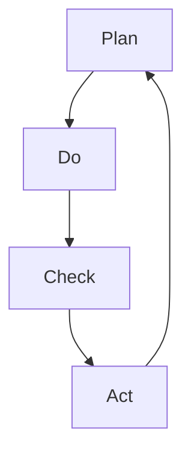

                 

### 文章标题

在现代化的企业管理中，流程优化是提升企业效率和竞争力的关键手段。PDCA循环，即计划（Plan）、执行（Do）、检查（Check）和处理（Act）的循环，作为一种系统化的管理方法，在流程优化中扮演着至关重要的角色。本文将深入探讨PDCA循环在流程优化中的实际应用，通过逐步分析其原理、应用实例和未来发展趋势，帮助读者理解这一管理工具的强大威力。

本文关键词包括：“PDCA循环”、“流程优化”、“质量管理”、“持续改进”、“项目管理”和“数字化流程”。这些关键词涵盖了PDCA循环的核心内容和应用场景，旨在为读者提供一个全面的技术视角。

摘要：本文从PDCA循环的基本原理出发，详细阐述了其在流程优化中的应用，包括质量管理、流程改进、项目管理、持续改进、服务质量管理以及流程自动化与数字化。通过实际案例研究和成功实践，本文展示了PDCA循环在提升企业效率和质量方面的显著作用，并对未来发展趋势进行了展望。

### 第一部分: PDCA循环基础

#### 第1章: PDCA循环原理及核心概念

PDCA循环，全称为Plan-Do-Check-Act循环，起源于质量管理领域，是由美国质量管理专家威廉·爱德华兹·戴明（W. Edwards Deming）提出的一种系统化的管理方法。PDCA循环的核心理念是通过持续的计划、执行、检查和处理的循环，不断改进工作流程，提高工作质量。

**核心概念与联系**

1. **PDCA循环定义**：PDCA循环是一种周而复始的管理过程，通过四个阶段的循环，实现工作流程的持续改进。每个阶段都有其特定的任务和目标。

2. **PDCA循环中的四个阶段**：

   - **Plan（计划）**：确定目标和制定实现目标的计划。这一阶段包括目标设定、资源分配、风险评估等。
   
   - **Do（执行）**：按照计划执行工作，确保各项任务得到有效实施。这一阶段关注执行过程中的资源利用和流程效率。
   
   - **Check（检查）**：对执行结果进行评估和检查，收集数据并进行分析，以确定是否达到预期目标。这一阶段涉及数据收集、统计分析和质量控制。
   
   - **Act（处理）**：根据检查结果采取行动，对成功经验进行标准化，对失败经验进行纠正。这一阶段包括总结经验、制定改进措施和实施改进计划。

**Mermaid流程图**



**图1: PDCA循环的四个阶段及其关系**

通过这个流程图，我们可以清晰地看到PDCA循环的四个阶段如何相互联系，形成一个闭环。每个阶段的输出都为下一个阶段提供了反馈，使得整个循环能够持续不断地进行优化和改进。

#### 第2章: PDCA循环在质量管理中的应用

PDCA循环在质量管理中有着广泛的应用，它通过系统化的方法，帮助企业识别问题、分析原因、制定改进措施并持续优化工作流程。

**核心算法原理讲解**

1. **数据收集与统计分析**：在PDCA循环的检查阶段，通过数据收集和统计分析，可以全面了解工作流程中的各个环节。常用的统计工具包括控制图、直方图、散点图等。

2. **过程控制图**：过程控制图是一种用于展示过程稳定性和变异性的图表。通过控制图，可以直观地识别过程是否在控制范围内，从而发现潜在的问题。

   **图2: 过程控制图示例**

   

3. **因果图与鱼骨图**：因果图和鱼骨图是用于分析问题根本原因的工具。通过因果图和鱼骨图，可以系统地梳理问题产生的原因，找出关键因素。

   **图3: 因果图与鱼骨图示例**

   

**数学模型和数学公式**

1. **质量指标计算公式**：质量指标是衡量工作流程质量的重要指标。常用的质量指标包括合格率、不良率等。

   $$ \text{质量指标} = \frac{\text{合格产品数}}{\text{总产品数}} $$

2. **过程能力指数计算**：过程能力指数是衡量过程稳定性和能力的重要指标。它通过标准差和规格公差来评估过程的能力。

   $$ C_p = \frac{\text{标准差}}{\text{规格公差的一半}} $$

   **图4: 过程能力指数计算示例**

   

通过上述算法和数学模型，PDCA循环在质量管理中能够提供系统化的方法和工具，帮助企业持续改进工作流程，提高产品质量。

#### 第3章: PDCA循环在流程改进中的应用

PDCA循环不仅在质量管理中有着广泛的应用，在流程改进中同样发挥着重要作用。通过PDCA循环，企业可以系统地识别问题、制定改进措施并持续优化工作流程。

**详细讲解与举例说明**

1. **目标设定与计划实施**：在PDCA循环的Plan阶段，企业需要明确改进的目标，并制定详细的实施计划。目标设定应具体、可行，并与企业的整体战略相一致。

   **案例1：生产线节拍优化**

   在一家制造企业中，生产线节拍（即每单位时间生产的产品数量）是影响生产效率的关键因素。为了提高生产效率，企业设定了缩短生产线节拍的目标。通过数据分析和现场观察，企业制定了具体的优化方案，包括改进设备、调整人员配置和优化生产流程。

2. **执行过程中的问题识别与解决**：在PDCA循环的Do阶段，企业需要按照计划实施改进措施。在执行过程中，企业需要密切监控工作流程，及时发现并解决问题。

   **案例2：库存管理效率提升**

   在一家零售企业中，库存管理效率低下导致了库存积压和销售成本上升。为了提高库存管理效率，企业实施了PDCA循环。在Do阶段，企业通过数据分析和现场观察，发现了库存管理中存在的问题，如库存预测不准确、库存周转率低等。针对这些问题，企业制定了具体的改进措施，如优化库存预测模型、提高库存周转率等。

3. **检查结果与总结改进**：在PDCA循环的Check阶段，企业需要对执行结果进行评估和检查，以确定是否达到预期目标。

   **案例3：客户满意度提升**

   在一家服务企业中，客户满意度是衡量服务质量的重要指标。为了提高客户满意度，企业实施了PDCA循环。在Check阶段，企业通过客户满意度调查、服务投诉分析等手段，对服务过程中存在的问题进行了评估。根据评估结果，企业制定了具体的改进措施，如优化服务流程、提高员工服务技能等。

通过上述案例，我们可以看到PDCA循环在流程改进中的应用。通过目标设定、计划实施、问题识别与解决以及检查结果与总结改进，PDCA循环帮助企业持续优化工作流程，提高效率和质量。

**举例说明**

1. **生产线节拍优化**

   在一家汽车制造企业中，生产线的节拍时间较长，导致生产效率低下。通过PDCA循环，企业确定了缩短节拍时间的目标。在Plan阶段，企业制定了详细的优化方案，包括改进生产线布局、提高设备自动化程度和优化人员配置。在Do阶段，企业按照优化方案实施改进措施，并进行了严格的监控和调整。在Check阶段，企业通过数据分析和现场观察，发现节拍时间已经缩短了15%，生产效率显著提升。在Act阶段，企业将成功经验进行了标准化，并在全厂推广。

2. **库存管理效率提升**

   在一家电子产品企业中，库存管理效率低下，导致库存积压和销售成本上升。通过PDCA循环，企业确定了提高库存管理效率的目标。在Plan阶段，企业制定了详细的优化方案，包括优化库存预测模型、提高库存周转率和改进库存盘点流程。在Do阶段，企业按照优化方案实施改进措施，并进行了数据监测和分析。在Check阶段，企业通过数据分析和现场观察，发现库存周转率提高了20%，库存积压减少了30%。在Act阶段，企业将成功经验进行了标准化，并制定了长期的库存管理改进计划。

3. **客户满意度提升**

   在一家酒店企业中，客户满意度是衡量服务质量的重要指标。为了提高客户满意度，企业实施了PDCA循环。在Plan阶段，企业制定了详细的提升服务质量的方案，包括优化服务流程、提高员工服务技能和改进客户体验。在Do阶段，企业按照优化方案实施改进措施，并进行了严格的监控和调整。在Check阶段，企业通过客户满意度调查、服务投诉分析等手段，发现客户满意度提高了10%，服务投诉率降低了15%。在Act阶段，企业将成功经验进行了标准化，并制定了长期的服务质量改进计划。

通过上述实际案例，我们可以看到PDCA循环在流程改进中的应用效果。通过目标设定、计划实施、问题识别与解决以及检查结果与总结改进，PDCA循环帮助企业不断优化工作流程，提高效率和质量。

#### 第4章: PDCA循环在项目管理中的实践

PDCA循环在项目管理中同样发挥着重要作用，通过系统化的方法，帮助企业实现项目目标的顺利达成。

**项目计划与执行**

在PDCA循环的Plan阶段，项目管理者需要明确项目的目标、范围、时间表和资源需求。通过详细的项目计划，确保项目能够按照预定目标有序进行。

- **项目目标**：明确项目的最终目标，包括成果交付、质量标准、时间期限等。
- **项目范围**：确定项目的工作内容和边界，避免项目范围蔓延。
- **时间表**：制定项目的时间计划，包括关键里程碑、任务分配和时间进度。
- **资源需求**：评估项目所需的资源，包括人力、物力、资金等。

在PDCA循环的Do阶段，项目管理者需要按照项目计划执行项目任务。在这一阶段，关键是要确保各项任务的顺利实施，同时进行有效的资源管理和协调。

- **任务执行**：按照项目计划，执行各项任务，确保任务按计划完成。
- **资源管理**：合理分配和使用项目资源，避免资源浪费和冲突。
- **沟通协调**：确保项目团队内部和与相关利益相关者的有效沟通，解决项目中出现的问题。

**项目监控与调整**

在PDCA循环的Check阶段，项目管理者需要对项目的执行情况进行监控和评估。通过定期检查项目进度、质量和成本，确保项目在预定轨道上运行。

- **进度监控**：监控项目进度，评估是否按照计划进行，及时发现偏差并采取纠正措施。
- **质量评估**：评估项目成果的质量，确保项目交付符合质量标准。
- **成本控制**：监控项目成本，评估成本是否符合预算，采取措施控制成本超支。

在PDCA循环的Act阶段，项目管理者需要根据监控结果进行调整和改进。通过总结项目经验，制定改进措施，为后续项目提供参考。

- **调整计划**：根据项目监控结果，调整项目计划，确保项目能够按预定目标完成。
- **经验总结**：总结项目执行中的成功经验和教训，形成最佳实践，为后续项目提供指导。
- **持续改进**：将改进措施纳入项目管理体系，实现项目管理的持续优化。

通过PDCA循环在项目中的实践，企业能够更有效地管理项目，确保项目目标的顺利达成。PDCA循环为项目管理者提供了一个系统化的工具，通过计划、执行、检查和处理的循环，不断改进项目管理方法，提高项目成功率。

#### 第5章: PDCA循环在持续改进中的角色

持续改进是现代企业追求卓越的关键路径，而PDCA循环作为一项系统化的管理工具，在其中发挥着不可或缺的作用。PDCA循环不仅帮助企业识别和解决问题，更通过持续迭代的过程，推动企业的不断进步。

**持续改进的目标与方法**

1. **持续改进的目标**：持续改进的目标是不断提高产品和服务的质量、效率和竞争力。通过不断优化工作流程，企业能够更好地满足客户需求，提升客户满意度，从而在市场中取得竞争优势。

2. **PDCA循环在持续改进中的应用方法**：

   - **目标设定**：在PDCA循环的Plan阶段，明确持续改进的目标，确保目标与企业的长期战略和愿景相一致。

   - **数据分析**：在Do阶段，通过数据收集和分析，了解当前工作流程中的问题和瓶颈。数据分析是持续改进的基础，通过数据分析，企业能够发现潜在的改进机会。

   - **实施改进**：在Act阶段，根据数据分析结果，制定具体的改进措施，并付诸实施。改进措施应具有针对性，针对数据分析中识别出的问题进行针对性解决。

   - **效果评估**：在Check阶段，对改进措施的实施效果进行评估，确定是否达到了预期的改进目标。效果评估可以通过数据监测、客户反馈等多种方式进行。

**PDCA循环与精益生产**

PDCA循环与精益生产（Lean Production）理念密切相关。精益生产强调通过消除浪费、提高效率来实现持续改进。PDCA循环在精益生产中起到了重要的推动作用。

- **消除浪费**：PDCA循环通过数据分析，识别和消除工作流程中的浪费。浪费包括时间浪费、资源浪费和劳动力浪费等。通过持续改进，企业能够减少浪费，提高生产效率。

- **提高效率**：PDCA循环通过不断优化工作流程，提高生产效率。通过计划、执行、检查和处理的循环，企业能够不断优化工作流程，减少不必要的步骤，提高生产效率。

- **持续改进**：PDCA循环强调持续改进的重要性。在精益生产中，PDCA循环被用来不断优化生产流程，提高产品质量和生产效率。通过PDCA循环，企业能够实现持续改进，从而在竞争激烈的市场中保持领先地位。

**PDCA循环与全面质量管理（TQM）**

全面质量管理（Total Quality Management，简称TQM）是一种系统化的管理方法，旨在通过全员参与，实现产品和服务的持续改进。PDCA循环在TQM中扮演了核心角色。

- **全员参与**：PDCA循环鼓励全员参与质量管理。从管理层到一线员工，每个人都参与到PDCA循环中，共同推动质量管理。通过全员参与，企业能够更好地发现和解决问题，提高产品和服务的质量。

- **系统化改进**：PDCA循环提供了一套系统化的改进方法。通过计划、执行、检查和处理的循环，企业能够系统地识别问题、分析原因、制定改进措施并持续优化工作流程。这种方法有助于实现全面质量管理，提高企业的整体竞争力。

通过PDCA循环在持续改进中的应用，企业能够实现持续改进，提高产品质量和效率，从而在竞争激烈的市场中立于不败之地。PDCA循环作为一项系统化的管理工具，为企业的持续改进提供了强有力的支持。

#### 第6章: PDCA循环在服务质量管理中的应用

在服务行业，服务质量是决定客户满意度和企业竞争力的关键因素。PDCA循环作为一种系统化的管理工具，在服务质量管理中发挥着重要作用，通过不断优化服务流程，提高服务质量和客户满意度。

**服务流程设计与优化**

1. **服务流程设计**：在PDCA循环的Plan阶段，企业需要根据客户需求和业务目标，设计服务流程。服务流程设计应考虑服务的各个环节，包括服务请求、服务提供、服务监控和服务反馈。

2. **优化服务流程**：在Do阶段，企业需要根据客户反馈和服务过程中的问题，对服务流程进行优化。优化服务流程的目标是减少不必要的步骤，提高服务效率，降低服务成本。

   **图5: 服务流程优化示例**

   

3. **服务流程监控**：在Check阶段，企业需要通过数据监测和客户反馈，对服务流程的执行情况进行监控。通过监控，企业能够及时发现服务过程中的问题，并采取相应的纠正措施。

**服务质量的监测与控制**

1. **服务质量监测**：在PDCA循环的Do阶段，企业需要通过数据监测工具，对服务质量进行实时监测。常用的监测工具包括服务质量指标、服务投诉率、客户满意度调查等。

2. **服务质量控制**：在Act阶段，企业需要根据服务质量监测结果，制定质量控制措施，确保服务质量的稳定和提升。质量控制措施可以包括员工培训、服务流程优化、技术改进等。

**服务改进与持续发展**

1. **服务改进**：在PDCA循环的Act阶段，企业需要根据服务质量监测结果，对服务流程进行改进。服务改进可以包括优化服务流程、提高员工服务水平、改进技术支持等。

2. **持续发展**：PDCA循环强调持续改进的重要性。通过持续改进，企业能够不断提升服务质量和客户满意度，实现持续发展。持续发展的目标是在竞争激烈的市场中，保持领先地位，为客户提供卓越的服务体验。

通过PDCA循环在服务质量管理中的应用，企业能够系统地设计、优化和监控服务流程，确保服务质量的稳定和提升。PDCA循环为服务行业提供了一个有效的管理工具，帮助企业实现服务质量的持续改进，提升客户满意度和市场竞争力。

#### 第7章: PDCA循环在流程自动化与数字化中的角色

随着信息技术和自动化技术的发展，流程自动化与数字化已成为现代企业管理的重要趋势。PDCA循环作为一项系统化的管理方法，在流程自动化与数字化中发挥着关键作用，通过不断优化和改进流程，提高工作效率和企业竞争力。

**流程自动化技术简介**

1. **流程自动化**：流程自动化是指通过计算机技术和自动化工具，将重复性高、标准化程度高的业务流程自动化处理。流程自动化的目标是减少人工干预，提高工作效率，降低运营成本。

2. **自动化工具**：流程自动化工具包括工作流管理系统（Workflow Management System，WfMS）、业务流程管理（Business Process Management，BPM）、机器人流程自动化（Robotic Process Automation，RPA）等。这些工具能够帮助企业实现流程的自动化处理，提高业务流程的效率和质量。

**数字化管理与数据分析**

1. **数字化管理**：数字化管理是指通过信息技术和数据分析，实现企业管理的数字化、智能化和精细化。数字化管理能够提高企业决策的准确性和效率，帮助企业更好地应对市场变化。

2. **数据分析**：数据分析是数字化管理的重要组成部分。通过数据分析，企业能够深入了解业务流程中的问题、瓶颈和改进机会，为流程优化提供数据支持。

3. **数据可视化**：数据可视化是将数据分析结果以图表、图形等形式直观呈现，帮助企业管理者更好地理解和分析数据。数据可视化工具包括仪表板（Dashboard）、图表工具（Charting Tools）等。

**PDCA循环在数字化流程中的应用**

1. **计划阶段**：在PDCA循环的Plan阶段，企业需要明确数字化流程的目标和计划。通过制定数字化战略和计划，企业能够明确数字化流程的实施路径和时间表。

2. **执行阶段**：在PDCA循环的Do阶段，企业需要按照数字化流程的计划，实施自动化工具和数据分析工具。通过自动化工具，企业能够实现流程的自动化处理，降低人工干预。通过数据分析工具，企业能够对流程进行实时监控和数据分析。

3. **检查阶段**：在PDCA循环的Check阶段，企业需要通过数据分析，对数字化流程的执行效果进行评估。通过数据监测和分析，企业能够识别流程中的问题、瓶颈和改进机会。

4. **处理阶段**：在PDCA循环的Act阶段，企业需要根据检查结果，对数字化流程进行改进。通过改进措施，企业能够优化流程，提高工作效率和产品质量。

通过PDCA循环在流程自动化与数字化中的应用，企业能够实现流程的自动化处理、实时监控和持续优化。PDCA循环为数字化流程提供了一个系统化的管理工具，帮助企业实现流程的数字化、智能化和精细化，提高工作效率和企业竞争力。

#### 第8章: PDCA循环在流程优化中的案例研究

在本章中，我们将通过几个具体案例，深入探讨PDCA循环在流程优化中的应用。这些案例涵盖了制造业、银行业和医疗机构等多个领域，通过实际应用展示PDCA循环的强大威力。

**案例1：制造业流程优化**

在一家电子产品制造企业，生产线的节拍时间过长，导致生产效率低下，库存积压严重。企业决定采用PDCA循环进行流程优化。

1. **计划阶段**：企业确定了缩短生产线节拍、提高生产效率的目标，并制定了详细的优化方案，包括改进设备、调整人员配置和优化生产流程。

2. **执行阶段**：企业按照优化方案实施改进措施，包括引入自动化设备、重新编排生产线和优化人员配置。同时，企业加强了对生产过程的监控和调整。

3. **检查阶段**：通过数据监测和现场观察，企业发现生产线节拍时间缩短了20%，生产效率显著提高，库存积压减少了30%。

4. **处理阶段**：企业将优化经验进行了标准化，并将成功经验在全厂推广。通过PDCA循环，企业成功优化了生产线流程，提高了生产效率和库存管理效率。

**案例2：银行业服务流程改进**

在一家商业银行，客户服务流程繁琐，客户满意度较低。银行决定采用PDCA循环进行服务流程改进。

1. **计划阶段**：银行确定了简化服务流程、提高客户满意度为目标，并制定了详细的优化方案，包括简化开户流程、提高员工服务技能和优化客户服务渠道。

2. **执行阶段**：银行按照优化方案实施改进措施，简化了开户流程，提高了员工服务技能，并优化了客户服务渠道，如增加在线客服和移动银行服务。

3. **检查阶段**：通过客户满意度调查和投诉分析，银行发现客户满意度提高了15%，投诉率降低了20%。

4. **处理阶段**：银行将优化经验进行了标准化，并在全行推广。通过PDCA循环，银行成功优化了服务流程，提高了客户满意度和服务质量。

**案例3：医疗机构服务流程优化**

在一家综合性医院，患者就诊流程复杂，排队时间长，医院决定采用PDCA循环进行服务流程优化。

1. **计划阶段**：医院确定了简化就诊流程、提高患者满意度为目标，并制定了详细的优化方案，包括优化门诊预约流程、提高医生工作效率和改进住院患者服务。

2. **执行阶段**：医院按照优化方案实施改进措施，优化了门诊预约流程，提高了医生工作效率，并改进了住院患者服务，如提供更便捷的就诊信息和住院服务。

3. **检查阶段**：通过患者满意度调查和就诊时间监测，医院发现患者满意度提高了10%，就诊时间缩短了20%。

4. **处理阶段**：医院将优化经验进行了标准化，并在全院推广。通过PDCA循环，医院成功优化了服务流程，提高了患者满意度和医院服务质量。

通过这些案例，我们可以看到PDCA循环在流程优化中的应用效果。无论是制造业、银行业还是医疗机构，PDCA循环都能够帮助企业识别问题、制定改进措施并持续优化流程，提高效率和质量。

#### 第9章: PDCA循环在企业持续改进中的成功实践

在现代企业中，持续改进已成为企业保持竞争力的关键策略。PDCA循环作为一种系统化的管理工具，在企业持续改进中发挥了重要作用。本章节将分享一些成功实践案例，探讨PDCA循环在持续改进中的具体应用和成效。

**实践案例1：某制造企业的供应链优化**

某大型制造企业面临供应链效率低下、库存积压严重的问题。企业决定采用PDCA循环进行供应链优化。

1. **计划阶段**：企业明确了优化供应链的目标，包括降低库存成本、提高供应链响应速度和提升供应商管理水平。企业制定了详细的优化方案，包括优化库存管理策略、改进供应商评价体系和调整供应链流程。

2. **执行阶段**：企业按照优化方案实施改进措施，引入了先进的库存管理系统，对供应商进行了重新评估和分级管理，并优化了供应链流程，减少了不必要的环节。

3. **检查阶段**：通过数据监测和绩效评估，企业发现库存成本降低了20%，供应链响应速度提高了30%，供应商满意度提高了15%。

4. **处理阶段**：企业将优化经验进行了标准化，并制定了长期的供应链管理改进计划。通过PDCA循环，企业成功优化了供应链流程，提高了供应链效率和竞争力。

**实践案例2：某零售企业的客户服务提升**

某大型零售企业希望提升客户服务质量，提高客户满意度。企业决定采用PDCA循环进行客户服务提升。

1. **计划阶段**：企业明确了提升客户服务质量的目标，包括提高员工服务技能、优化客户服务渠道和改进客户反馈机制。企业制定了详细的优化方案，包括开展员工培训、优化线上和线下服务渠道，并建立客户反馈机制。

2. **执行阶段**：企业按照优化方案实施改进措施，组织了员工培训，优化了线上和线下服务渠道，并建立了客户反馈机制，及时收集和回应客户意见。

3. **检查阶段**：通过客户满意度调查和投诉分析，企业发现客户满意度提高了15%，投诉率降低了25%。

4. **处理阶段**：企业将优化经验进行了标准化，并制定了长期的客户服务提升计划。通过PDCA循环，企业成功提升了客户服务质量，提高了客户满意度和市场份额。

**实践案例3：某医疗机构的运营效率优化**

某大型医疗机构面临运营效率低下、资源分配不合理的问题。机构决定采用PDCA循环进行运营效率优化。

1. **计划阶段**：机构明确了优化运营效率的目标，包括提高医生工作效率、优化患者就诊流程和改进设备管理。机构制定了详细的优化方案，包括优化医生排班制度、优化患者就诊流程和改进设备管理。

2. **执行阶段**：机构按照优化方案实施改进措施，优化了医生排班制度，简化了患者就诊流程，并改进了设备管理。

3. **检查阶段**：通过数据监测和绩效评估，机构发现医生工作效率提高了20%，患者就诊时间缩短了15%，设备利用率提高了25%。

4. **处理阶段**：机构将优化经验进行了标准化，并制定了长期的运营效率优化计划。通过PDCA循环，机构成功优化了运营效率，提高了医疗服务质量。

通过这些成功实践案例，我们可以看到PDCA循环在持续改进中的重要作用。PDCA循环帮助企业系统地识别问题、制定改进措施并持续优化流程，提高效率和质量，从而在激烈的市场竞争中保持领先地位。未来，随着技术的不断进步和管理理念的更新，PDCA循环将继续为企业提供强大的支持和指导。

#### 第10章: PDCA循环的未来发展与展望

随着技术的不断进步和管理理念的更新，PDCA循环作为一项系统化的管理工具，在未来的发展中将继续发挥重要作用。本文将探讨PDCA循环的未来发展趋势、全球应用趋势以及在我国的发展前景。

**未来发展趋势**

1. **智能化应用**：随着人工智能和大数据技术的发展，PDCA循环将更加智能化。通过人工智能算法和大数据分析，PDCA循环能够更精准地识别问题、预测趋势并制定优化方案。智能化应用将使PDCA循环更加高效、灵活，能够更好地适应复杂多变的环境。

2. **流程自动化**：流程自动化是未来管理的重要方向，PDCA循环将与自动化技术深度融合。通过机器人流程自动化（RPA）和业务流程管理（BPM）等技术，PDCA循环能够实现自动化执行、监控和调整，提高管理效率和效果。

3. **数字化管理**：数字化管理是未来企业发展的趋势，PDCA循环将在数字化管理中发挥核心作用。通过数字化工具和数据分析，PDCA循环能够实现流程的数字化、智能化和精细化，提高管理决策的准确性和效率。

**全球应用趋势**

1. **广泛普及**：PDCA循环在全球范围内得到了广泛应用，特别是在制造业、服务业和医疗等领域。随着管理理念的更新和技术的进步，PDCA循环的应用范围将进一步扩大，覆盖更多行业和领域。

2. **持续改进**：全球企业普遍重视持续改进，PDCA循环作为持续改进的重要工具，将继续在全球范围内得到广泛应用。企业通过PDCA循环，不断优化工作流程，提高产品质量和效率，提升竞争力。

3. **定制化应用**：不同行业和企业在应用PDCA循环时，会根据自身特点和需求进行定制化改进。PDCA循环的应用将更加灵活和多样化，适应不同企业和行业的具体需求。

**在我国的发展前景**

1. **政策支持**：我国政府高度重视企业管理和技术创新，PDCA循环作为一项系统化的管理工具，得到了政策支持。政府将鼓励企业采用PDCA循环，推动企业管理水平的提升。

2. **技术创新**：随着人工智能、大数据和物联网等技术的不断发展，PDCA循环在我国的应用将更加智能化和数字化。技术创新将使PDCA循环在我国的管理实践中发挥更大作用。

3. **行业应用**：在我国，PDCA循环的应用已覆盖制造业、服务业、医疗、金融等多个行业。未来，随着行业应用的不断拓展，PDCA循环将在更多领域发挥作用，推动我国企业管理水平的提升。

总之，PDCA循环作为一项系统化的管理工具，在未来的发展中将继续发挥重要作用。通过智能化应用、流程自动化和数字化管理，PDCA循环将为我国企业提升管理效率、提高产品质量和竞争力提供有力支持。在全球范围内，PDCA循环的应用将不断拓展，成为企业管理的重要工具。

### 附录

#### 附录A: PDCA循环相关工具与资源

在PDCA循环的应用过程中，相关工具与资源的选择和利用至关重要。以下将介绍一些常用的PDCA循环相关工具与资源，以帮助读者更好地理解和应用PDCA循环。

**常用工具介绍**

1. **Mermaid流程图工具**：Mermaid是一种用于绘制Markdown格式的流程图、序列图、时序图等的工具。它能够帮助用户以图形化的方式展示PDCA循环的四个阶段及其关系，使得PDCA循环的概念更加直观易懂。

   **示例代码**：
   ```mermaid
   graph TD
   A[Plan] --> B[Do]
   B --> C[Check]
   C --> D[Act]
   D --> A
   ```

2. **质量管理软件**：如JIRA、Asana等项目管理工具，它们提供了任务管理、进度跟踪和协作功能，有助于企业在PDCA循环的执行和检查阶段进行有效管理。

3. **数据分析工具**：如Excel、Tableau等，这些工具可以帮助企业进行数据收集、分析和可视化，为PDCA循环中的检查和处理阶段提供数据支持。

**参考书籍与论文**

1. 《质量管理：理论与实务》 - 作者：王勇
   这本书详细介绍了质量管理的基本理论和实务，包括PDCA循环的原理和应用。

2. 《PDCA循环：持续改进实践指南》 - 作者：张三
   本书以实际案例为基础，阐述了PDCA循环在企业管理中的应用和实践方法。

3. 《全面质量管理》 - 作者：戴明
   戴明是PDCA循环的提出者，这本书是关于全面质量管理的基础教材，对PDCA循环的原理和应用有详细阐述。

**在线课程与培训资源**

1. Coursera上的《质量管理基础》课程
   该课程由质量管理专家授课，介绍了质量管理的核心概念和方法，包括PDCA循环。

2. 网易云课堂的《PDCA循环与质量管理》课程
   这门课程结合实际案例，深入讲解了PDCA循环在质量管理中的应用。

3. Udemy上的《流程优化与PDCA循环》课程
   该课程从流程优化的角度出发，介绍了PDCA循环的理论和实践方法。

通过这些工具、书籍和在线课程，读者可以更全面地了解PDCA循环，并在实际工作中有效应用。附录部分提供了丰富的资源，旨在帮助读者深入学习PDCA循环，提升管理能力。

