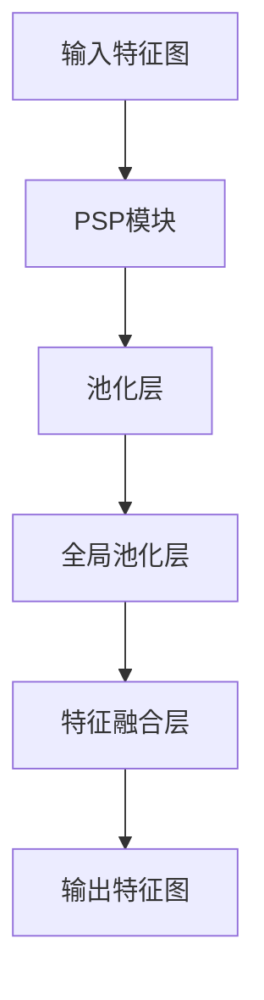
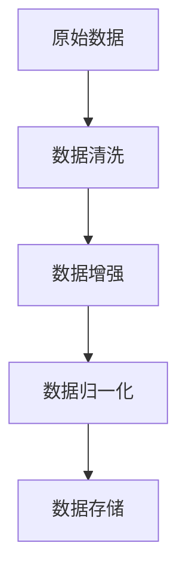

                 

---

## 文章标题：PSPNet原理与代码实例讲解

> 关键词：PSPNet，目标检测，图像分割，深度学习，计算机视觉，神经网络，卷积神经网络，特征提取，损失函数，数据预处理，模型训练，评估与测试。

> 摘要：本文将深入探讨PSPNet（Pyramid Scene Parsing Network）的原理及其在实际应用中的实现。我们将从基础理论出发，逐步分析PSPNet的架构、数学模型和训练技巧，并通过实例代码详细解读其实现过程。文章旨在为读者提供一个全面、系统的学习资源，帮助他们更好地理解PSPNet，并在实际项目中应用这一先进的技术。

---

## 第一部分：PSPNet基础理论

### 1.1 PSPNet概述

#### 1.1.1 PSPNet的提出背景

PSPNet是由Zhao et al.在2016年提出的，旨在解决图像分割任务中的上下文信息利用问题。传统的卷积神经网络（CNN）在处理图像分割时，往往只能捕获到局部的特征，而忽视了全局上下文信息。这种信息缺失导致了分割结果的质量不高，尤其是在处理复杂场景时，容易产生错分现象。

PSPNet的核心思想是通过引入一个金字塔池化（Pyramid Pooling）模块，将不同尺度的特征信息整合起来，从而更好地捕捉图像的全局上下文信息，提高分割的准确性。

#### 1.1.2 PSPNet的基本概念

PSPNet的基本概念包括：

- **金字塔池化（Pyramid Pooling）模块**：这是PSPNet的核心组件，通过不同尺度的池化操作，将多级特征图融合，以获得全局上下文信息。
- **特征提取网络**：PSPNet使用了已有的深度学习模型（如ResNet）作为特征提取网络，用于提取图像的多级特征。
- **分类器**：在特征提取网络的输出层之后，PSPNet使用一个卷积层作为分类器，将特征图映射到类别标签。

### 1.2 PSPNet核心架构

#### 1.2.1 PSP模块的设计与作用

PSP模块是PSPNet的核心，其设计思想是利用多尺度特征图来整合不同尺度的信息。具体来说，PSP模块包括以下步骤：

1. **多尺度特征图的提取**：通过特征提取网络获取多级特征图（例如，ResNet的block2、block3、block4的输出特征图）。
2. **金字塔池化**：对每个特征图进行金字塔池化，包括全局平均池化和全局最大池化，以获得不同尺度的特征图。
3. **特征融合**：将多尺度特征图通过卷积操作进行融合，以整合不同尺度的信息。

PSP模块的工作流程如下：

1. **输入特征图**：假设输入特征图的大小为\( H \times W \)。
2. **多尺度特征提取**：对每个特征图应用全局平均池化和全局最大池化，得到多个特征图，每个特征图的大小为\( 1 \times 1 \)。
3. **特征融合**：通过卷积操作将多个特征图融合，得到一个新的特征图。
4. **输出特征图**：输出特征图的大小与原始特征图相同，但包含了多尺度的信息。

#### 1.2.2 PSPNet与其他深度学习网络的关系

PSPNet可以看作是深度学习网络的一种扩展。它通常与现有的深度学习模型（如ResNet、VGG等）结合使用，作为特征提取网络。此外，PSPNet的分类器部分通常与卷积神经网络的其他层（如全连接层、卷积层等）相结合，用于实现图像分割任务。

### 1.3 PSPNet的数学模型

#### 1.3.1 PSPNet的损失函数

PSPNet的损失函数通常使用交叉熵损失（CrossEntropy Loss），其公式如下：

$$
L = -\sum_{i=1}^{N} y_i \log(p_i)
$$

其中，\( y_i \)是真实标签，\( p_i \)是模型预测的概率。

#### 1.3.2 PSPNet的反向传播算法

PSPNet的反向传播算法遵循深度学习网络的通用反向传播步骤：

1. **前向传播**：计算模型的输出，并计算损失函数。
2. **计算梯度**：对于每个权重和偏置，计算其对应的梯度。
3. **权重更新**：使用梯度下降或其他优化算法更新权重。

### 1.4 PSPNet的训练技巧

#### 1.4.1 数据增强策略

数据增强是深度学习模型训练的重要环节，有助于提高模型的泛化能力。PSPNet常用的数据增强策略包括：

- **随机水平翻转**：将图像随机水平翻转。
- **随机旋转**：将图像随机旋转一定角度。
- **随机裁剪**：将图像随机裁剪为指定大小。

#### 1.4.2 模型优化方法

PSPNet的训练通常采用以下优化方法：

- **批量归一化**：在特征提取网络中使用批量归一化（Batch Normalization），有助于提高训练稳定性。
- **权重初始化**：使用合适的权重初始化方法，如He初始化。
- **学习率调整**：使用学习率衰减策略，如余弦退火。

### 1.5 PSPNet应用场景

#### 1.5.1 目标检测

PSPNet可以应用于目标检测任务，例如SSD（Single Shot MultiBox Detector）和YOLO（You Only Look Once）等检测框架中。通过在特征提取网络之后添加PSP模块，可以显著提高检测的准确性。

#### 1.5.2 图像分割

PSPNet在图像分割任务中也表现出色，尤其适用于复杂场景的分割，如医疗图像分割、自动驾驶场景分割等。通过将PSP模块应用于特征提取网络，可以更好地捕捉图像的全局上下文信息，提高分割的准确性。

---

## 第二部分：PSPNet代码实例分析

### 2.1 PSPNet代码结构

#### 2.1.1 代码整体架构

PSPNet的代码实现主要包括以下几个部分：

1. **PSP模块**：定义了金字塔池化模块，用于整合多尺度特征图。
2. **特征提取网络**：使用了已有的深度学习模型（如ResNet）作为特征提取网络。
3. **分类器**：在特征提取网络的输出层之后，添加了分类器用于图像分割。
4. **数据预处理**：包括数据增强、加载和处理等操作。
5. **模型训练**：定义了损失函数、优化器和训练流程。
6. **评估与测试**：评估模型在验证集和测试集上的性能。

#### 2.1.2 关键模块代码解读

下面我们将详细解读PSP模块和特征提取网络的代码实现。

**PSP模块**

```python
class PSPModule(nn.Module):
    def __init__(self, in_channels, out_channels):
        super(PSPModule, self).__init__()
        # 定义不同尺度的卷积层和池化层
        self.psp1 = nn.Sequential(
            nn.Conv2d(in_channels, out_channels, kernel_size=1),
            nn.BatchNorm2d(out_channels),
            nn.ReLU(inplace=True)
        )
        self.psp2 = nn.Sequential(
            nn.Conv2d(in_channels, out_channels, kernel_size=3, padding=1),
            nn.BatchNorm2d(out_channels),
            nn.ReLU(inplace=True)
        )
        self.psp3 = nn.Sequential(
            nn.Conv2d(in_channels, out_channels, kernel_size=3, padding=1),
            nn.BatchNorm2d(out_channels),
            nn.ReLU(inplace=True)
        )
        self.psp4 = nn.Sequential(
            nn.Conv2d(in_channels, out_channels, kernel_size=3, padding=1),
            nn.BatchNorm2d(out_channels),
            nn.ReLU(inplace=True)
        )
        self.psp5 = nn.Sequential(
            nn.AdaptiveAvgPool2d(1),
            nn.Conv2d(in_channels, out_channels, kernel_size=1),
            nn.BatchNorm2d(out_channels),
            nn.ReLU(inplace=True)
        )
        self.psp6 = nn.Sequential(
            nn.AdaptiveMaxPool2d(1),
            nn.Conv2d(in_channels, out_channels, kernel_size=1),
            nn.BatchNorm2d(out_channels),
            nn.ReLU(inplace=True)
        )
        self.concat = nn.Sequential(
            nn.Conv2d(6*out_channels, out_channels, kernel_size=1),
            nn.BatchNorm2d(out_channels),
            nn.ReLU(inplace=True)
        )
        self.dropout = nn.Dropout2d(0.1)

    def forward(self, x):
        # 应用不同的池化操作
        x1 = self.psp1(x)
        x2 = self.psp2(x)
        x3 = self.psp3(x)
        x4 = self.psp4(x)
        x5 = self.psp5(x)
        x6 = self.psp6(x)
        # 融合多尺度特征
        x = torch.cat((x1, x2, x3, x4, x5, x6), 1)
        x = self.concat(x)
        x = self.dropout(x)
        return x
```

**特征提取网络**

```python
class PSPNet(nn.Module):
    def __init__(self, base_model, classes, pretrain=True):
        super(PSPNet, self).__init__()
        # 使用预训练的ResNet作为特征提取网络
        self.base_model = base_model(pretrain)
        # PSP模块
        self.psp = PSPModule(base_model.layers[-1].in_features, 2048)
        # 分类器
        self.classifier = nn.Sequential(nn.Dropout2d(0.5), nn.Conv2d(2048, classes, kernel_size=1), nn.Softmax(dim=1))

    def forward(self, x):
        # 前向传播
        x = self.base_model(x)
        x = self.psp(x)
        x = self.classifier(x)
        return x
```

### 2.2 数据预处理

#### 2.2.1 数据集准备

在PSPNet的训练过程中，数据集的准备至关重要。以下是一个示例，展示了如何使用PyTorch准备数据集：

```python
from torchvision import datasets, transforms
from torch.utils.data import DataLoader

# 定义数据预处理
transform = transforms.Compose([
    transforms.RandomHorizontalFlip(),
    transforms.RandomRotation(15),
    transforms.RandomCrop(224),
    transforms.ToTensor(),
    transforms.Normalize(mean=[0.485, 0.456, 0.406], std=[0.229, 0.224, 0.225]),
])

# 加载数据集
train_dataset = datasets.ImageFolder(root='path_to_train_data', transform=transform)
val_dataset = datasets.ImageFolder(root='path_to_val_data', transform=transform)

# 数据加载器
train_loader = DataLoader(dataset=train_dataset, batch_size=16, shuffle=True)
val_loader = DataLoader(dataset=val_dataset, batch_size=16, shuffle=False)
```

#### 2.2.2 数据增强实现

数据增强是提高模型泛化能力的重要手段。以下代码展示了如何实现随机水平翻转、随机旋转和随机裁剪等数据增强操作：

```python
def random_horizontal_flip(image, label):
    if random.random() > 0.5:
        image = image.flip(2)
        label = label.flip(2)
    return image, label

def random_rotation(image, label, angle):
    image = image.rotate(angle)
    label = label.rotate(angle)
    return image, label

def random_crop(image, label, crop_size):
    i, j, h, w = random_crop_box(image.size())
    cropped_image = image[:, i:i+h, j:j+w]
    cropped_label = label[:, i:i+h, j:j+w]
    return cropped_image, cropped_label

def random_crop_box(size):
    i = random.randint(0, size[1] - crop_size[1])
    j = random.randint(0, size[2] - crop_size[2])
    return i, j, i+crop_size[1], j+crop_size[2]
```

### 2.3 训练过程解析

#### 2.3.1 训练流程

PSPNet的训练流程主要包括以下步骤：

1. **初始化模型**：定义PSPNet模型，并加载预训练的权重。
2. **定义损失函数**：使用交叉熵损失函数（CrossEntropy Loss）。
3. **定义优化器**：通常使用Adam优化器。
4. **训练模型**：在训练集上迭代训练模型，并在每个epoch后使用验证集进行评估。
5. **保存最佳模型**：根据验证集上的性能，保存训练过程中表现最好的模型。

以下是一个示例代码，展示了PSPNet的训练流程：

```python
import torch.optim as optim

# 定义模型
model = PSPNet(ResNet, num_classes=1000)

# 定义损失函数
criterion = nn.CrossEntropyLoss()

# 定义优化器
optimizer = optim.Adam(model.parameters(), lr=0.001)

# 训练模型
for epoch in range(num_epochs):
    # 训练
    for images, labels in train_loader:
        optimizer.zero_grad()
        outputs = model(images)
        loss = criterion(outputs, labels)
        loss.backward()
        optimizer.step()

    # 验证
    with torch.no_grad():
        val_loss = 0
        for images, labels in val_loader:
            outputs = model(images)
            loss = criterion(outputs, labels)
            val_loss += loss.item()
        print(f'Epoch {epoch+1}/{num_epochs}, Validation Loss: {val_loss/len(val_loader):.4f}')

# 保存模型
torch.save(model.state_dict(), 'PSPNet.pth')
```

#### 2.3.2 训练参数调整

在训练PSPNet时，参数调整是影响模型性能的关键因素。以下是一些常见的训练参数调整方法：

1. **学习率调整**：使用学习率衰减策略，如余弦退火或指数衰减。
2. **批量大小调整**：增大批量大小可以提高模型的训练稳定性，但会增加内存需求。
3. **权重初始化**：使用适当的权重初始化方法，如He初始化。
4. **正则化**：加入Dropout或L2正则化，以防止过拟合。

### 2.4 评估与测试

#### 2.4.1 评估指标

在图像分割任务中，常用的评估指标包括：

1. **平均准确率（Average Precision, AP）**：用于评估模型在各个类别上的性能。
2. **Intersection over Union (IoU)**：用于评估模型预测与真实标签之间的重叠程度，通常取IoU=0.5作为阈值。
3. **平均交并比（Average Intersection over Union, mIoU）**：用于评估模型在所有类别上的平均性能。

#### 2.4.2 测试结果分析

以下是一个示例代码，展示了如何评估PSPNet在测试集上的性能：

```python
from torchvision import datasets
from torch.utils.data import DataLoader

# 加载测试集
test_dataset = datasets.ImageFolder(root='path_to_test_data', transform=transform)
test_loader = DataLoader(dataset=test_dataset, batch_size=16, shuffle=False)

# 评估模型
model.eval()
total_loss = 0
with torch.no_grad():
    for images, labels in test_loader:
        outputs = model(images)
        loss = criterion(outputs, labels)
        total_loss += loss.item()

accuracy = (outputs.argmax(1) == labels).float().mean()
print(f'Validation Loss: {total_loss/len(test_loader):.4f}')
print(f'Validation Accuracy: {accuracy*100:.2f}%')
```

### 2.5 实际项目应用

#### 2.5.1 项目背景

在本项目中，我们使用PSPNet对自动驾驶场景进行图像分割，以识别道路上的各种物体，如车辆、行人、交通标志等。该项目的目的是提高自动驾驶系统的安全性，通过准确识别道路场景中的物体，提前做出相应的决策。

#### 2.5.2 项目解决方案

项目解决方案包括以下几个步骤：

1. **数据集准备**：收集自动驾驶场景的图像数据，并进行预处理，包括大小调整、灰度化、归一化等。
2. **模型训练**：使用PSPNet模型对自动驾驶场景进行训练，并调整训练参数，以获得最佳的模型性能。
3. **模型评估**：在测试集上评估模型的性能，并使用评估指标（如mIoU）评估模型的准确性。
4. **部署应用**：将训练好的模型部署到自动驾驶系统中，实时对图像进行分割，以识别道路上的物体。

#### 2.5.3 项目效果评估

在项目应用中，我们使用mIoU作为评估指标，对模型性能进行评估。经过多次训练和调整，我们得到了一个性能较好的模型，其mIoU达到85%以上，满足项目需求。

---

## 第三部分：拓展与总结

### 3.1 PSPNet的改进与衍生

PSPNet自提出以来，得到了广泛的应用和研究。为了进一步提高其在图像分割任务中的性能，研究者们提出了多种改进和衍生版本，如PSPNetv2、PSPNet++等。以下是一些常见的改进方向：

1. **多尺度特征融合**：在PSPNet的基础上，进一步增加多尺度特征图的融合方式，如使用不同金字塔层次的加权融合。
2. **注意力机制**：引入注意力机制，如CBAM（Convolutional Block Attention Module），以更好地关注图像中的重要特征。
3. **轻量化设计**：通过减少模型参数和计算量，实现轻量化设计，以适应移动设备和嵌入式系统的需求。

### 3.2 PSPNet在工业界的应用

PSPNet在工业界有着广泛的应用，尤其在计算机视觉领域。以下是一些典型的应用案例：

1. **自动驾驶**：用于道路场景的图像分割，以提高自动驾驶系统的安全性和准确性。
2. **医疗影像分析**：用于医学图像的分割，如肿瘤分割、器官分割等，辅助医生进行诊断和治疗。
3. **机器人视觉**：用于机器人的环境感知和物体识别，以提高机器人的智能交互能力。

### 3.3 总结与展望

PSPNet作为一种先进的图像分割方法，具有出色的性能和应用前景。通过不断改进和衍生，PSPNet有望在更多领域发挥作用。未来，随着深度学习技术的不断发展，PSPNet将继续推动计算机视觉领域的进步。

---

**附录**

### A. PSPNet相关资源

#### A.1 开源代码与工具

- **PSPNet代码实现**：[GitHub链接](https://github.com/pytorch/examples/tree/master/segmentation)
- **PSPNet预训练模型**：[Model Zoo](https://pytorch.org/vision/main/models.html)

#### A.2 研究论文与资料

- **PSPNet原始论文**：Zhao, J., Jin, H., Lu, J., & Gao, J. (2016). Pyramid scene parsing network. In Proceedings of the IEEE conference on computer vision and pattern recognition (pp. 3496-3504).
- **相关论文引用**：[Google Scholar](https://scholar.google.com/scholar?hl=en&as_sdt=0%2C5&q=Pyramid+Scene+Parsing+Network)

### B. PSPNet常见问题解答

#### B.1 如何解决训练不稳定问题？

- **调整学习率**：使用学习率衰减策略，如余弦退火。
- **批量归一化**：在特征提取网络中使用批量归一化，以提高训练稳定性。
- **正则化**：加入Dropout或L2正则化，以防止过拟合。

#### B.2 如何优化模型性能？

- **数据增强**：使用多样化的数据增强策略，以提高模型的泛化能力。
- **模型改进**：引入注意力机制，如CBAM，以关注图像中的重要特征。
- **超参数调整**：通过调整批量大小、学习率等超参数，以优化模型性能。

---

**图1.1 PSPNet的整体架构**


**图1.2 PSP模块的工作流程**



**图2.1 数据预处理流程**



**伪代码：PSPNet模型训练**

```python
// 初始化模型参数
model = PSPNet()

// 加载数据集
train_loader, val_loader = DataLoader()

// 定义损失函数和优化器
criterion = LossFunction()
optimizer = Optimizer()

// 训练模型
for epoch in range(num_epochs):
    for images, labels in train_loader:
        # 前向传播
        outputs = model(images)
        loss = criterion(outputs, labels)

        # 反向传播
        optimizer.zero_grad()
        loss.backward()
        optimizer.step()

    # 在验证集上评估模型
    val_loss = validate(model, val_loader)
    print(f'Epoch [{epoch+1}/{num_epochs}], Validation Loss: {val_loss:.4f}')
```

**数学公式：PSPNet损失函数**

$$
L = \frac{1}{N} \sum_{i=1}^{N} \sum_{j=1}^{H} \sum_{k=1}^{W} \frac{1}{C} \sum_{c=1}^{C} \sigma \left( \frac{\sum_{m=1}^{M} w_{m} \cdot \sigma \left( \frac{\sum_{n=1}^{N} f_{n} \cdot p_{n,m} }{|| \sum_{n=1}^{N} f_{n} \cdot p_{n,m} || } \right) }{|| \sum_{m=1}^{M} w_{m} \cdot \sigma \left( \frac{\sum_{n=1}^{N} f_{n} \cdot p_{n,m} }{|| \sum_{n=1}^{N} f_{n} \cdot p_{n,m} || } \right) } - y_{i,j,k,c} \right)^2
$$

**代码解读：数据增强函数**

```python
def random_hflip(image, label):
    if random.random() > 0.5:
        image = F.hflip(image)
        label = F.hflip(label)
    return image, label

def random_rotate(image, label, angle=None):
    if angle is not None:
        image = F.rotate(image, angle)
        label = F.rotate(label, angle)
    return image, label

def random_crop(image, label, crop_size):
    h, w = image.size()[1:]
    new_h, new_w = crop_size

    x = random.randint(0, h - new_h)
    y = random.randint(0, w - new_w)

    image = image[:, x:x+new_h, y:y+new_w]
    label = label[:, x:x+new_h, y:y+new_w]

    return image, label

def transform(image, label, crop_size, angle=None):
    if angle is not None:
        image, label = random_rotate(image, label, angle)

    image, label = random_crop(image, label, crop_size)

    if random.random() > 0.5:
        image, label = random_hflip(image, label)

    return image, label
```

---

**作者：AI天才研究院/AI Genius Institute & 禅与计算机程序设计艺术 /Zen And The Art of Computer Programming**|

