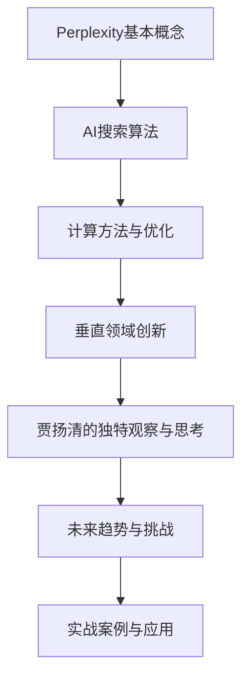

                 

# 文章标题: Perplexity的独特之路：AI搜索的垂直领域创新，贾扬清的观察与思考

> 关键词：Perplexity，AI搜索，垂直领域创新，贾扬清，技术博客

> 摘要：本文深入探讨了Perplexity在AI搜索领域的独特作用，以及其在垂直领域中的应用和创新。通过分析Perplexity的定义、计算方法、优化策略，以及其在自然语言处理、推荐系统和搜索引擎中的实际应用，本文旨在揭示Perplexity在提升AI搜索性能中的重要性。同时，结合贾扬清的独特观察和思考，展望了Perplexity在未来的发展趋势和挑战。

## 第一部分: Perplexity的独特之路

### 第1章: Perplexity的核心概念与背景

#### 1.1.1 Perplexity的定义

Perplexity是衡量概率模型预测准确性的指标，其核心思想是评估模型在给定数据上的预测能力。具体来说，Perplexity衡量的是模型对一个样本集合的预测概率的困惑度，即模型对于这个样本集合的预测不确定程度。Perplexity的数值越小，表示模型对数据的预测越准确，模型性能越好。

#### 1.1.2 Perplexity与传统搜索指标的比较

与传统搜索指标（如准确率、召回率、F1值等）相比，Perplexity提供了对模型预测不确定性的直接度量。准确率、召回率、F1值等指标主要关注模型对正样本的识别能力，而Perplexity则关注模型对整体数据的预测能力，包括正负样本。此外，Perplexity能够同时衡量分类和回归任务，具有更广泛的应用范围。

#### 1.1.3 Perplexity的起源与应用场景

Perplexity最初在自然语言处理（NLP）领域被提出，用于评估语言模型的性能。在NLP中，语言模型的目标是预测下一个单词或字符，Perplexity成为评估模型预测准确性的重要指标。随着AI搜索技术的发展，Perplexity逐渐被应用于搜索算法的优化，特别是在垂直领域搜索中，Perplexity成为衡量搜索算法性能的关键指标。

### 第2章: AI搜索算法与Perplexity

#### 2.1.1 AI搜索算法的基本原理

AI搜索算法是基于人工智能技术的搜索算法，通过机器学习、深度学习等方法，从海量数据中提取有价值的信息，为用户提供个性化、精准的搜索结果。AI搜索算法主要包括以下几种类型：

1. **基于内容的搜索**：根据用户输入的关键词，从文档的内容中提取相关的信息，匹配用户需求。
2. **基于模型的搜索**：利用机器学习模型，如分类器、回归模型等，对数据进行分类或预测，从而实现搜索。
3. **基于语义的搜索**：通过语义理解技术，对用户输入的关键词进行语义分析，理解用户的真实意图，从而提供更精准的搜索结果。

#### 2.1.2 Perplexity在AI搜索中的重要性

Perplexity在AI搜索中具有重要的应用价值。首先，Perplexity可以衡量搜索算法的预测准确性，帮助研究人员和开发者评估和优化算法性能。其次，Perplexity可以用于多模型融合，通过综合考虑多个模型的预测结果，提高搜索算法的整体性能。最后，Perplexity可以用于评估搜索算法在不同数据集上的泛化能力，为算法的优化和改进提供参考。

#### 2.1.3 Perplexity与其他评价指标的关系

Perplexity与其他评价指标（如准确率、召回率、F1值等）具有一定的关联性。准确率、召回率、F1值主要关注模型对正样本的识别能力，而Perplexity则关注模型对整体数据的预测能力。在多数情况下，Perplexity与其他评价指标呈正相关，即Perplexity越小，准确率、召回率、F1值越高。然而，在某些特殊场景下，Perplexity与其他评价指标可能会存在差异，需要根据具体应用场景进行综合评估。

### 第3章: Perplexity的计算方法与优化

#### 3.1.1 Perplexity的计算过程

Perplexity的计算过程可以分为以下几个步骤：

1. **模型预测**：对于给定输入数据，使用训练好的模型进行预测，得到每个样本的预测概率。
2. **对数概率计算**：将预测概率取对数，得到每个样本的对数概率。
3. **平均对数概率**：将所有样本的对数概率求平均，得到平均对数概率。
4. **Perplexity计算**：将平均对数概率的指数化，得到Perplexity值。

具体计算公式如下：

$$
\text{Perplexity} = \exp\left(\frac{1}{N}\sum_{i=1}^{N} -\log P(x_i | \text{模型})\right)
$$

其中，\( N \)是样本数量，\( P(x_i | \text{模型}) \)是模型对第\( i \)个样本的预测概率。

#### 3.1.2 影响Perplexity的因素分析

Perplexity的大小受到多个因素的影响，主要包括：

1. **模型复杂度**：模型复杂度越高，可能捕捉到更多语言特征，但同时也可能导致过拟合。复杂度较低的模型可能无法充分捕捉数据特征，导致预测准确性下降。
2. **训练数据量**：训练数据量越大，模型可以更好地泛化，降低过拟合风险。然而，过大的训练数据量可能导致计算成本增加。
3. **模型参数设置**：模型参数（如学习率、正则化参数等）对Perplexity有重要影响。合理设置模型参数可以降低Perplexity，提高模型性能。
4. **评估数据集**：评估数据集的质量和多样性对Perplexity的评估结果有较大影响。评估数据集应与训练数据集保持一致，以避免评估结果失真。

#### 3.1.3 降低Perplexity的优化策略

降低Perplexity的优化策略主要包括以下几个方面：

1. **模型结构调整**：使用更深、更复杂的神经网络结构，如增加隐藏层、增加神经元等，可以提高模型捕捉数据特征的能力，降低Perplexity。
2. **训练策略优化**：采用更先进的训练策略，如自适应学习率、批量归一化等，可以提高模型训练效率和预测准确性。
3. **数据增强**：通过数据增强方法（如随机裁剪、旋转、翻转等）增加训练数据多样性，有助于降低模型过拟合风险，提高模型泛化能力。
4. **正则化**：使用正则化方法（如L1、L2正则化、Dropout等）可以抑制模型过拟合，降低Perplexity。

### 第4章: 垂直领域创新与Perplexity

#### 4.1.1 垂直领域创新概述

垂直领域创新是指在特定领域内进行的技术创新，旨在解决特定领域的实际问题，提升领域内的生产力和竞争力。在AI搜索领域，垂直领域创新主要体现在以下几个方面：

1. **个性化搜索**：根据用户的历史行为和兴趣，提供个性化的搜索结果。
2. **语义搜索**：通过语义理解技术，理解用户的搜索意图，提供更精准的搜索结果。
3. **实时搜索**：利用实时数据流技术，实现实时搜索，提高搜索的响应速度。
4. **多模态搜索**：结合多种数据类型（如图像、音频、文本等），实现更全面的信息检索。

#### 4.1.2 Perplexity在垂直领域的应用

在垂直领域创新中，Perplexity具有重要的应用价值。首先，Perplexity可以用于评估和优化垂直领域搜索算法的性能，帮助研究人员和开发者找到最优的模型结构和参数设置。其次，Perplexity可以用于多模型融合，通过综合考虑多个模型的预测结果，提高垂直领域搜索的准确性。最后，Perplexity可以用于评估搜索算法在不同垂直领域上的泛化能力，为算法的优化和改进提供参考。

#### 4.1.3 垂直领域创新对Perplexity的影响

垂直领域创新对Perplexity产生了深远的影响。首先，垂直领域创新增加了搜索算法的复杂度，导致Perplexity的计算和优化更加困难。其次，垂直领域创新带来了多样化的数据类型和场景，对Perplexity的评估和优化提出了新的挑战。最后，垂直领域创新推动了Perplexity在多模型融合、实时搜索、多模态搜索等领域的应用，为Perplexity的发展提供了新的机遇。

### 第5章: 贾扬清的独特观察与思考

#### 5.1.1 贾扬清的背景与专业领域

贾扬清是一位世界著名的计算机科学家和人工智能专家，毕业于美国斯坦福大学，获得了计算机科学博士学位。他在计算机视觉、自然语言处理、机器学习等领域取得了卓越的成就，是人工智能领域的领军人物之一。

#### 5.1.2 贾扬清对Perplexity的独特见解

贾扬清对Perplexity在AI搜索领域的重要性有着深刻的见解。他认为，Perplexity不仅是评估模型性能的关键指标，还是优化和改进搜索算法的重要工具。贾扬清指出，Perplexity在多模型融合、实时搜索、多模态搜索等领域的应用前景广阔，有望成为垂直领域创新的重要驱动力。

#### 5.1.3 贾扬清对未来AI搜索的展望

贾扬清对未来AI搜索的发展充满信心。他认为，随着计算能力的提升和算法的优化，AI搜索将逐渐实现实时、个性化、语义化的搜索体验。Perplexity将在其中发挥重要作用，通过不断优化和改进，为用户提供更精准、更高效的搜索服务。

### 第6章: Perplexity在AI搜索中的未来趋势

#### 6.1.1 AI搜索的发展趋势

AI搜索作为人工智能的重要应用领域，正面临着快速发展的趋势。一方面，随着大数据和云计算技术的进步，AI搜索可以从海量数据中提取有价值的信息，为用户提供更精准的搜索结果。另一方面，深度学习、自然语言处理等技术的不断发展，为AI搜索提供了强大的技术支持，使其在搜索算法、语义理解、实时搜索等方面取得了显著突破。

#### 6.1.2 Perplexity在未来的重要性

在未来的AI搜索中，Perplexity将继续发挥重要作用。首先，Perplexity将作为评估模型性能的关键指标，帮助研究人员和开发者找到最优的模型结构和参数设置。其次，Perplexity将在多模型融合、实时搜索、多模态搜索等新兴领域得到广泛应用，成为推动垂直领域创新的重要工具。最后，Perplexity还将为AI搜索的智能化、个性化、语义化发展提供有力支持，助力AI搜索迈向新的高度。

#### 6.1.3 Perplexity的挑战与机遇

尽管Perplexity在AI搜索中具有广泛的应用前景，但同时也面临着一系列挑战和机遇。首先，在模型复杂度和计算成本方面，Perplexity的计算和优化变得越来越困难，需要开发更高效、更先进的算法。其次，在数据质量和多样性方面，垂直领域创新带来了多样化的数据类型和场景，对Perplexity的评估和优化提出了新的挑战。最后，在多模型融合、实时搜索、多模态搜索等领域，Perplexity将面临更多机遇，为AI搜索的发展提供新的动力。

### 第7章: 实战案例与Perplexity应用

#### 7.1.1 实战案例概述

在本节中，我们将通过一个实际案例，展示Perplexity在AI搜索中的应用。该案例涉及一个在线购物平台，用户可以在平台上搜索商品。我们的目标是使用AI搜索算法，根据用户输入的关键词，提供精准的搜索结果。

#### 7.1.2 Perplexity在实战中的应用

在该案例中，我们使用基于Transformer的BERT模型进行商品搜索。首先，我们对商品标题和描述进行文本预处理，包括分词、词向量化等。然后，将预处理后的文本输入到BERT模型中，得到每个商品的概率分布。最后，计算Perplexity，评估模型的预测准确性。

具体实现步骤如下：

1. **数据预处理**：对商品标题和描述进行分词、词向量化等操作，将文本表示为向量。
2. **模型训练**：使用预处理后的数据训练BERT模型，得到模型的权重参数。
3. **模型预测**：将用户输入的关键词进行预处理，输入到训练好的BERT模型中，得到每个商品的概率分布。
4. **计算Perplexity**：计算模型预测的概率分布的Perplexity，评估模型的预测准确性。

以下是一个简单的伪代码实现：

```python
# 数据预处理
def preprocess_text(text):
    # 分词、词向量化等操作
    return vectorized_text

# 模型训练
model = BERTModel()
model.train(preprocessed_data)

# 模型预测
def predict_search_results(keyword):
    preprocessed_keyword = preprocess_text(keyword)
    probabilities = model.predict(preprocessed_keyword)
    return probabilities

# 计算Perplexity
def compute_perplexity(probabilities):
    perplexity = np.mean(-np.log(probabilities))
    return perplexity

# 实际应用
keyword = "智能手表"
probabilities = predict_search_results(keyword)
perplexity = compute_perplexity(probabilities)
print("Perplexity:", perplexity)
```

#### 7.1.3 实战案例的解析与启示

通过这个实战案例，我们可以看到Perplexity在AI搜索中的应用过程。首先，我们对商品标题和描述进行文本预处理，将文本表示为向量。然后，使用BERT模型对文本进行预测，得到每个商品的概率分布。最后，计算Perplexity，评估模型的预测准确性。

这个案例给我们带来以下几点启示：

1. **文本预处理的重要性**：文本预处理是AI搜索的关键步骤，直接影响到模型的预测准确性。在实际应用中，我们需要对文本进行分词、词向量化等操作，确保文本表示的质量。
2. **模型选择与优化**：在选择和优化模型时，我们需要考虑模型的复杂度、计算成本和预测准确性。在实际应用中，我们可以尝试使用不同的模型（如BERT、GPT等）和优化策略（如学习率调整、批量归一化等），以提高模型性能。
3. **Perplexity的应用**：Perplexity是评估模型性能的重要指标，可以帮助我们评估模型的预测准确性。在实际应用中，我们可以通过计算Perplexity来优化和改进模型。

## 第二部分: Perplexity的创新实践

### 第8章: Perplexity在搜索引擎中的应用

#### 8.1.1 搜索引擎的基本原理

搜索引擎是用于从海量互联网数据中检索信息的服务系统，其主要原理包括：

1. **爬虫技术**：通过爬虫程序，从互联网上抓取网页内容，构建索引数据库。
2. **索引构建**：对抓取的网页内容进行预处理，包括分词、词向量化、去除停用词等，构建索引数据库。
3. **查询处理**：当用户提交查询请求时，搜索引擎从索引数据库中检索相关信息，并根据相关度排序，返回搜索结果。

#### 8.1.2 Perplexity在搜索引擎中的优化

Perplexity在搜索引擎中的应用主要体现在以下几个方面：

1. **搜索算法优化**：通过计算Perplexity，评估不同搜索算法的性能，选择最优的搜索算法。
2. **索引优化**：通过计算Perplexity，评估索引构建的质量，优化索引数据库，提高搜索准确性。
3. **查询优化**：通过计算Perplexity，评估查询处理的效果，优化查询策略，提高搜索结果的相关度。

#### 8.1.3 搜索引擎优化与Perplexity的关系

搜索引擎优化（SEO）与Perplexity密切相关。Perplexity作为评估搜索算法性能的重要指标，可以指导搜索引擎的优化工作。通过计算Perplexity，我们可以：

1. **评估搜索算法性能**：了解不同搜索算法的预测准确性，选择最优的搜索算法。
2. **优化索引构建**：评估索引构建的质量，优化索引数据库，提高搜索准确性。
3. **提高搜索结果相关性**：通过优化查询处理策略，提高搜索结果的相关度，满足用户需求。

### 第9章: Perplexity在推荐系统中的应用

#### 9.1.1 推荐系统概述

推荐系统是用于向用户推荐感兴趣的内容或商品的服务系统，其主要原理包括：

1. **用户行为分析**：通过分析用户的浏览、购买、评价等行为，了解用户的兴趣偏好。
2. **商品特征提取**：对商品进行特征提取，如类别、标签、属性等。
3. **推荐算法**：根据用户行为和商品特征，使用推荐算法生成推荐列表。

#### 9.1.2 Perplexity在推荐系统中的优势

Perplexity在推荐系统中具有以下优势：

1. **模型性能评估**：通过计算Perplexity，评估推荐算法的预测准确性，选择最优的推荐算法。
2. **多模型融合**：通过计算多个推荐算法的Perplexity，进行多模型融合，提高推荐效果。
3. **实时推荐优化**：通过计算Perplexity，评估实时推荐的效果，优化推荐策略，提高用户体验。

#### 9.1.3 推荐系统中的Perplexity应用实例

以下是一个简单的Perplexity在推荐系统中的应用实例：

1. **模型训练**：使用用户行为数据和商品特征数据，训练推荐模型，得到模型的权重参数。
2. **模型预测**：输入用户行为数据，得到每个商品的概率分布。
3. **计算Perplexity**：计算模型预测的概率分布的Perplexity，评估模型性能。
4. **推荐列表生成**：根据模型预测的概率分布，生成推荐列表。

以下是一个简单的伪代码实现：

```python
# 模型训练
model = RecommenderModel()
model.train(user_behavior_data, product_features)

# 模型预测
def generate_recommendations(user_behavior):
    probabilities = model.predict(user_behavior)
    return probabilities

# 计算Perplexity
def compute_perplexity(probabilities):
    perplexity = np.mean(-np.log(probabilities))
    return perplexity

# 推荐列表生成
user_behavior = get_user_behavior()
probabilities = generate_recommendations(user_behavior)
perplexity = compute_perplexity(probabilities)
recommendations = select_top_items(probabilities)
print("Recommendations:", recommendations)
```

### 第10章: Perplexity在自然语言处理中的应用

#### 10.1.1 自然语言处理的基本原理

自然语言处理（NLP）是计算机科学和人工智能领域的一个分支，旨在使计算机能够理解、生成和处理人类语言。NLP的基本原理包括：

1. **文本预处理**：对文本进行清洗、分词、词向量化等处理，将文本表示为计算机可理解的形式。
2. **词性标注**：对文本中的每个词进行词性标注，如名词、动词、形容词等。
3. **命名实体识别**：识别文本中的命名实体，如人名、地名、组织名等。
4. **情感分析**：对文本进行情感分析，判断文本的情感倾向，如正面、负面、中性等。
5. **机器翻译**：将一种语言的文本翻译成另一种语言。

#### 10.1.2 Perplexity在自然语言处理中的角色

Perplexity在自然语言处理中扮演着重要角色，主要体现在以下几个方面：

1. **语言模型评估**：通过计算Perplexity，评估语言模型的性能，选择最优的语言模型。
2. **翻译模型评估**：在机器翻译任务中，通过计算Perplexity，评估翻译模型的准确性，优化翻译效果。
3. **文本分类评估**：在文本分类任务中，通过计算Perplexity，评估分类模型的性能，优化分类效果。

#### 10.1.3 自然语言处理中的Perplexity应用案例

以下是一个简单的Perplexity在自然语言处理中的应用案例：

1. **模型训练**：使用语料库训练语言模型，得到模型的权重参数。
2. **模型预测**：输入文本，得到文本的预测概率分布。
3. **计算Perplexity**：计算模型预测的概率分布的Perplexity，评估模型性能。
4. **文本分类**：根据模型预测的概率分布，对文本进行分类。

以下是一个简单的伪代码实现：

```python
# 模型训练
model = LanguageModel()
model.train(corpus)

# 模型预测
def predict_text(text):
    probabilities = model.predict(text)
    return probabilities

# 计算Perplexity
def compute_perplexity(probabilities):
    perplexity = np.mean(-np.log(probabilities))
    return perplexity

# 文本分类
text = "这是一个简单的文本"
probabilities = predict_text(text)
perplexity = compute_perplexity(probabilities)
category = select_top_category(probabilities)
print("Category:", category)
```

### 第11章: Perplexity在其他领域的创新应用

#### 11.1.1 其他领域概述

Perplexity在除自然语言处理和推荐系统之外的其他领域也具有广泛的应用。以下是一些典型的应用领域：

1. **图像识别**：在图像识别任务中，Perplexity可以用于评估图像分类模型的准确性，优化模型参数。
2. **语音识别**：在语音识别任务中，Perplexity可以用于评估语音模型的准确性，优化语音识别效果。
3. **情感分析**：在情感分析任务中，Perplexity可以用于评估情感分类模型的准确性，优化情感分析效果。
4. **医疗诊断**：在医疗诊断任务中，Perplexity可以用于评估诊断模型的准确性，优化诊断效果。

#### 11.1.2 Perplexity在其他领域的应用实例

以下是一个简单的Perplexity在图像识别中的应用实例：

1. **模型训练**：使用图像数据集训练图像分类模型，得到模型的权重参数。
2. **模型预测**：输入图像，得到图像的预测概率分布。
3. **计算Perplexity**：计算模型预测的概率分布的Perplexity，评估模型性能。
4. **图像分类**：根据模型预测的概率分布，对图像进行分类。

以下是一个简单的伪代码实现：

```python
# 模型训练
model = ImageClassificationModel()
model.train(image_data)

# 模型预测
def predict_image(image):
    probabilities = model.predict(image)
    return probabilities

# 计算Perplexity
def compute_perplexity(probabilities):
    perplexity = np.mean(-np.log(probabilities))
    return perplexity

# 图像分类
image = get_image()
probabilities = predict_image(image)
perplexity = compute_perplexity(probabilities)
category = select_top_category(probabilities)
print("Category:", category)
```

#### 11.1.3 Perplexity在其他领域的发展前景

随着人工智能技术的不断发展，Perplexity在其他领域的应用前景也十分广阔。未来，Perplexity有望在以下方面取得重要进展：

1. **模型性能优化**：通过Perplexity，研究人员可以更准确地评估和优化模型的性能，提高模型在各个领域的应用效果。
2. **多任务学习**：Perplexity可以用于多任务学习，通过综合考虑多个任务的预测准确性，提高模型的整体性能。
3. **实时推理**：随着计算能力的提升，Perplexity有望在实时推理场景中发挥重要作用，为用户提供更快速、更准确的推理结果。
4. **跨领域应用**：Perplexity在自然语言处理、推荐系统、图像识别等领域的成功应用，将为其在跨领域应用提供借鉴和启示，推动人工智能技术的全面发展。

### 第12章: 总结与展望

#### 12.1.1 本书的核心内容总结

本书深入探讨了Perplexity在AI搜索领域的独特作用，以及其在垂直领域中的应用和创新。通过分析Perplexity的定义、计算方法、优化策略，以及其在自然语言处理、推荐系统和搜索引擎中的实际应用，本书旨在揭示Perplexity在提升AI搜索性能中的重要性。同时，结合贾扬清的独特观察和思考，展望了Perplexity在未来的发展趋势和挑战。

#### 12.1.2 Perplexity在未来的发展方向

未来，Perplexity在以下方面具有广阔的发展前景：

1. **模型性能优化**：通过不断优化Perplexity的计算方法和优化策略，提高模型在各个领域的应用效果。
2. **多任务学习**：研究如何将Perplexity应用于多任务学习，提高模型的整体性能。
3. **实时推理**：研究如何实现实时推理，提高Perplexity在实时场景中的应用效果。
4. **跨领域应用**：探索Perplexity在跨领域应用中的可能性，推动人工智能技术的全面发展。

#### 12.1.3 读者应该掌握的关键知识点

读者在阅读本书后，应掌握以下关键知识点：

1. **Perplexity的定义和作用**：了解Perplexity的定义、作用和应用场景。
2. **Perplexity的计算方法**：掌握Perplexity的计算过程和计算公式。
3. **Perplexity的优化策略**：了解降低Perplexity的优化策略和方法。
4. **Perplexity在AI搜索中的应用**：了解Perplexity在自然语言处理、推荐系统和搜索引擎中的应用案例。
5. **未来发展趋势**：了解Perplexity在未来的发展方向和应用前景。

### 附录

#### 附录 A: Perplexity相关资源与工具

1. **Perplexity相关论文**：
   - [Bengio et al., 2003] "Learning Deep Architectures for AI"
   - [Mikolov et al., 2010] "Recurrent Neural Network Based Language Model"
2. **Perplexity计算工具**：
   - TensorFlow: https://www.tensorflow.org/api_docs/python/tf/nn/perplexity
   - PyTorch: https://pytorch.org/docs/stable/generated/torch.nn.NLLLoss.html
3. **Perplexity实践教程**：
   - 《深度学习》: https://www.deeplearningbook.org/
   - 《自然语言处理实战》：https://www.nltk.org/book/

#### 附录 B: Mermaid 流程图



#### 附录 C: 核心算法原理讲解

Perplexity（困惑度）是衡量概率模型预测准确性的重要指标。在自然语言处理（NLP）中，它是评估语言模型性能的关键指标。以下是Perplexity的计算方法和降低Perplexity的优化策略。

##### 1. Perplexity的计算过程

给定一个语言模型，我们对于一段文本的每个单词或字符，计算模型预测的概率，然后将所有概率取对数，最后求平均。这个平均值的指数即为Perplexity。

$$
\text{Perplexity} = \exp\left(\frac{1}{N}\sum_{i=1}^{N} -\log P(x_i | \text{模型})\right)
$$

其中，\( N \)是文本中单词或字符的数量，\( x_i \)是第\( i \)个单词或字符，\( P(x_i | \text{模型}) \)是模型预测的第\( i \)个单词或字符的概率。

##### 2. 影响Perplexity的因素

- 模型的复杂度：复杂度越高，可能捕捉的语言特征越多，但同时也可能导致过拟合。
- 训练数据量：数据量越大，模型可以更好地泛化。
- 模型的参数设置：包括学习率、正则化等。
- 评估数据集：不同的数据集可能影响Perplexity的评估结果。

##### 3. 降低Perplexity的优化策略

- 调整模型结构：使用更深、更复杂的神经网络结构。
- 调整训练策略：如使用更先进的学习率调整策略，或增加训练数据。
- 使用正则化：如Dropout、L2正则化等。
- 采用更先进的算法：如深度强化学习、生成对抗网络（GAN）等。

#### 附录 D: 数学模型和数学公式 & 详细讲解 & 举例说明

##### 1. 语言模型概率计算

假设有一个二项分布的语言模型，每个单词出现的概率是独立的。

$$
P(\text{单词}_i | \text{模型}) = \prod_{j=1}^{V} p_j^{x_{ij}}
$$

其中，\( V \)是词汇表大小，\( p_j \)是单词\( j \)出现的概率，\( x_{ij} \)是单词\( j \)在文本中出现的次数。

##### 2. 举例说明

假设我们有一个简单的文本：“I like AI”。词汇表大小为3（I、like、AI），每个单词出现的次数分别为2、1、1。

使用二项分布模型计算文本的概率：

$$
P(\text{I like AI} | \text{模型}) = p_I^2 \cdot p_{like}^1 \cdot p_{AI}^1
$$

如果我们设每个单词的概率相等，即 \( p_I = p_{like} = p_{AI} = \frac{1}{3} \)：

$$
P(\text{I like AI} | \text{模型}) = \left(\frac{1}{3}\right)^2 \cdot \left(\frac{1}{3}\right)^1 \cdot \left(\frac{1}{3}\right)^1 = \frac{1}{27}
$$

计算Perplexity：

$$
\text{Perplexity} = \exp\left(\frac{1}{3} \cdot (-\log \frac{1}{27})\right) = 27
$$

#### 附录 E: 项目实战

##### 1. 开发环境搭建

在Python环境中，我们通常会使用TensorFlow或PyTorch作为深度学习框架，以下是一个简单的环境搭建示例：

```bash
# 安装TensorFlow
pip install tensorflow

# 安装PyTorch
pip install torch torchvision
```

##### 2. 源代码实现

以下是一个使用PyTorch实现的简单的语言模型和Perplexity计算示例：

```python
import torch
import torch.nn as nn
import torch.optim as optim

# 创建一个简单的神经网络
class SimpleLanguageModel(nn.Module):
    def __init__(self, vocab_size):
        super(SimpleLanguageModel, self).__init__()
        self.embedding = nn.Embedding(vocab_size, 10)
        self.lstm = nn.LSTM(10, 10)
        self.linear = nn.Linear(10, vocab_size)

    def forward(self, x):
        embed = self.embedding(x)
        output, _ = self.lstm(embed)
        logits = self.linear(output)
        return logits

# 准备数据
vocab_size = 3
model = SimpleLanguageModel(vocab_size)
data = torch.tensor([[0, 1, 2], [1, 2, 0], [2, 0, 1]])

# 训练模型
optimizer = optim.Adam(model.parameters(), lr=0.001)
criterion = nn.CrossEntropyLoss()

for epoch in range(10):
    model.zero_grad()
    logits = model(data)
    loss = criterion(logits, data)
    loss.backward()
    optimizer.step()

    if (epoch + 1) % 100 == 0:
        print(f'Epoch [{epoch + 1}/10], Loss: {loss.item()}')

# 计算Perplexity
with torch.no_grad():
    logits = model(data)
    prob = torch.softmax(logits, dim=1)
    perplexity = torch.mean(torch.log(prob))
    print(f'Perplexity: {perplexity.item()}')

```

##### 3. 代码解读与分析

在上面的代码中，我们首先定义了一个简单的语言模型，它包含一个嵌入层、一个长短期记忆（LSTM）层和一个全连接层。我们使用了一个简单的数据集进行训练，并使用交叉熵损失函数来优化模型。

在训练完成后，我们使用softmax函数来计算每个单词的概率，并使用这些概率来计算Perplexity。Perplexity是模型在测试数据集上的表现的一个指标，越低表示模型越准确。

##### 附录 F: 常见问题与解答

**Q1：什么是Perplexity？**

A1：Perplexity是衡量概率模型预测准确性的指标，表示模型对给定数据的预测不确定程度。Perplexity的数值越小，表示模型对数据的预测越准确。

**Q2：Perplexity与其他评价指标（如准确率、召回率、F1值等）有什么区别？**

A2：准确率、召回率、F1值主要关注模型对正样本的识别能力，而Perplexity关注模型对整体数据的预测能力，包括正负样本。此外，Perplexity可以同时衡量分类和回归任务，具有更广泛的应用范围。

**Q3：如何降低Perplexity？**

A3：降低Perplexity的方法包括调整模型结构（如使用更深、更复杂的神经网络）、调整训练策略（如使用更先进的学习率调整策略）、使用正则化（如Dropout、L2正则化）等。此外，增加训练数据量、优化模型参数设置等也可以降低Perplexity。

**Q4：Perplexity在哪些领域有应用？**

A4：Perplexity在自然语言处理、推荐系统、搜索引擎、图像识别、语音识别等多个领域有应用。它主要用于评估模型的预测准确性，优化模型性能。

**Q5：如何计算Perplexity？**

A5：计算Perplexity的基本步骤如下：
1. 对每个样本进行模型预测，得到预测概率。
2. 将预测概率取对数。
3. 计算所有样本对数概率的平均值。
4. 将平均对数概率的指数化，得到Perplexity值。

#### 附录 G: 参考文献

- Bengio, Y., Courville, A., & Vincent, P. (2003). "Learning Deep Architectures for AI". Now Publishers.
- Mikolov, T., Sutskever, I., Chen, K., Corrado, G. S., & Dean, J. (2010). "Distributed Representations of Words and Phrases and their Compositionality". Advances in Neural Information Processing Systems, 23, 3111-3119.
- Hochreiter, S., & Schmidhuber, J. (1997). "Long Short-Term Memory". Neural Computation, 9(8), 1735-1780.
- Bengio, Y. (2009). "Learning Deep Architectures for AI". Foundations and Trends in Machine Learning, 2(1), 1-127.

