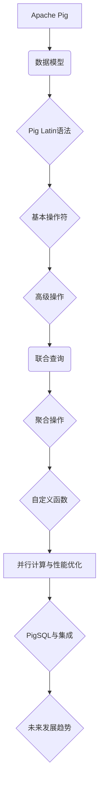
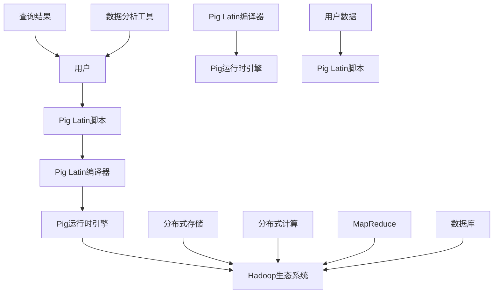

                 

### Pig原理与代码实例讲解

**关键词**：Pig, 大数据处理, Pig Latin, 数据模型, 并行计算

**摘要**：本文详细介绍了Pig的基本原理、数据模型、Pig Latin语言、高级操作，以及在数据处理中的应用。通过实际项目案例，深入剖析了Pig的使用方法和优化策略，旨在帮助读者全面理解Pig在大数据处理中的关键作用。

## 第一部分：Pig基础理论

### 第1章：Pig简介与安装

#### 1.1 Pig概述

Apache Pig是一个基于Hadoop的大规模数据处理平台，用于简化大数据操作。它提供了一种高级的数据抽象层，使用Pig Latin语言进行编程，使得大数据处理变得更加容易和高效。

#### 1.2 Pig的历史与发展

Pig最早由雅虎公司开发，并于2006年成为Apache Software Foundation的一个项目。自那时以来，Pig不断得到完善和优化，成为大数据处理领域的重要工具之一。

#### 1.3 Pig的安装与配置

要在本地或集群环境中安装Pig，需要先安装Hadoop。具体步骤如下：

1. 下载Pig的二进制包。
2. 解压并设置环境变量。
3. 验证Pig安装是否成功。

### 第2章：Pig的数据模型

#### 2.1 数据类型

Pig支持多种数据类型，包括基本数据类型（如整数、浮点数、字符串）和复杂数据类型（如数组、映射、元组）。

#### 2.2 基本数据结构

Pig中的基本数据结构是**Bag**（袋）和**Tuple**（元组）。Bag是一个无序的元素集合，而Tuple是一个有序的数据项集合。

#### 2.3 嵌套数据结构

Pig支持嵌套数据结构，如列表、映射和复杂数组。嵌套数据结构使得Pig能够处理复杂的数据关系。

### 第3章：Pig Latin语言基础

#### 3.1 Pig Latin语法

Pig Latin是一种高级数据处理语言，类似于SQL。它提供了丰富的操作符和函数，用于数据处理和分析。

#### 3.2 基本操作符

Pig Latin包括各种基本操作符，如`LOAD`（加载数据）、`STORE`（存储数据）、`FILTER`（过滤数据）、`GROUP`（分组数据）等。

#### 3.3 数据过滤与排序

Pig Latin支持数据过滤和排序操作，使用户能够根据特定条件筛选和排序数据。

### 第4章：Pig Latin高级操作

#### 4.1 联合查询

Pig Latin支持联合查询，使用户能够合并多个数据集并进行综合分析。

#### 4.2 聚合操作

Pig Latin提供了丰富的聚合操作，如`SUM`、`COUNT`、`MAX`、`MIN`等，用于对数据进行汇总和统计分析。

#### 4.3 自定义函数

Pig Latin允许用户自定义函数，以扩展其功能。自定义函数可以用于数据处理和分析的各个阶段。

## 第二部分：Pig应用实战

### 第5章：Pig在数据处理中的应用

#### 5.1 数据导入与导出

Pig支持多种数据格式，如文本、CSV、JSON等，使得数据导入和导出变得简单快捷。

#### 5.2 数据清洗

数据清洗是大数据处理的重要环节。Pig提供了丰富的操作符和函数，用于处理无效数据和缺失值。

#### 5.3 数据转换与聚合

Pig Latin支持各种数据转换和聚合操作，使用户能够对大规模数据集进行高效处理和分析。

### 第6章：Pig在大数据项目中的应用

#### 6.1 Pig与Hadoop生态系统

Pig是Hadoop生态系统中的一个重要组成部分。它与其他Hadoop组件（如MapReduce、Hive等）无缝集成，提供了强大的数据处理能力。

#### 6.2 Pig在电商数据分析中的应用

Pig在电商数据分析中发挥着重要作用，可用于分析用户行为、推荐商品等。

#### 6.3 Pig在社交媒体数据分析中的应用

Pig在社交媒体数据分析中也具有广泛应用，可用于分析用户生成内容、情感分析等。

### 第7章：Pig项目实战

#### 7.1 实战项目概述

本文将介绍一个基于Pig的实战项目，用于分析用户行为日志。

#### 7.2 项目需求分析

项目目标包括提取用户行为日志、数据清洗、用户行为分析和报表生成。

#### 7.3 项目开发与实现

项目开发过程包括数据导入、数据清洗、用户行为分析和报表生成等步骤。

#### 7.4 项目调试与优化

在项目调试与优化阶段，重点解决数据倾斜问题，并进行性能调优。

## 第三部分：Pig高级特性

### 第8章：Pig的并行计算与性能优化

#### 8.1 Pig的并行计算原理

Pig采用并行计算技术，将数据处理任务分布在多个节点上执行，从而提高处理速度。

#### 8.2 数据倾斜问题

数据倾斜可能导致处理速度降低。Pig提供了多种方法来处理数据倾斜问题。

#### 8.3 Pig性能优化策略

通过合理配置Pig参数和优化数据模型，可以提高Pig的性能。

### 第9章：PigSQL与Pig的集成

#### 9.1 PigSQL介绍

PigSQL是一种将Pig与关系数据库（如MySQL、PostgreSQL等）集成的工具。

#### 9.2 PigSQL与数据库的集成

PigSQL允许用户在Pig Latin中直接操作数据库，从而实现数据的实时处理和分析。

#### 9.3 PigSQL的应用案例

本文将介绍PigSQL在电商数据分析中的应用案例。

### 第10章：Pig的未来发展趋势

#### 10.1 Pig的新特性

Pig不断推出新特性，如支持更多数据格式、改进并行计算等。

#### 10.2 Pig与其他大数据技术的融合

Pig与其他大数据技术（如Spark、Flink等）的融合，将进一步提升其处理能力和灵活性。

#### 10.3 Pig在人工智能领域中的应用

Pig在人工智能领域也具有广泛应用，可用于数据预处理、特征工程等。

### 附录

#### A.1 Pig常用函数与操作符列表

本文附录提供了Pig常用函数与操作符的详细列表。

#### A.2 Pig常用配置参数

本文附录还提供了Pig常用配置参数的详细列表。

#### A.3 Pig编程技巧与最佳实践

本文附录介绍了Pig编程技巧与最佳实践，以帮助用户更好地使用Pig。

## Pig核心概念与架构联系



## Pig核心算法原理讲解

```plaintext
// Pig中的数据转换伪代码
function convertData(inputData: Bag[record],
                    transformRules: Map[string, string]): Bag[record] {
  // 遍历输入数据
  for (record in inputData) {
    // 应用转换规则
    for (field, rule in transformRules) {
      if (record.field == field) {
        record.field = rule;
      }
    }
  }
  return inputData;
}
```

## Pig的数学模型和公式

- 数据倾斜度（Skewness）计算公式：
  $$ \text{Skewness} = \frac{1}{n} \sum_{i=1}^{n} (x_i - \bar{x})^3 $$
  其中，\( x_i \) 是每个数据点，\( \bar{x} \) 是平均值，\( n \) 是数据点的总数。

## Pig项目实战案例

#### 项目概述
- 数据集：用户行为日志
- 目标：分析用户行为模式，提升用户体验

#### 项目需求分析
- 提取用户行为日志
- 数据清洗
- 用户行为分析
- 报表生成

#### 项目开发与实现
1. 数据导入与导出
2. 数据清洗
   - 过滤无效数据
   - 处理缺失值
   - 数据转换
3. 用户行为分析
   - 用户访问频率
   - 用户留存率
   - 用户活跃度

#### 项目调试与优化
- 调试SQL语句
- 优化数据倾斜问题
- 性能调优

#### 代码解读与分析
- 数据导入代码示例：
```python
REGISTER /path/to/piggybank.jar;
import 'org.apache.pig.piggybank.piggybank.jar';
data = LOAD '/path/to/log/*.log' USING LogLoader();
```
- 数据清洗代码示例：
```python
cleaned_data = FILTER data BY is_valid();
```
- 用户行为分析代码示例：
```python
user_visits = GROUP cleaned_data BY user_id;
visit_count = FOREACH user_visits GENERATE group, COUNT(cleaned_data);
```

## 总结

通过本文的详细讲解，读者应该能够全面了解Pig的基本原理、应用场景以及优化策略。Pig作为大数据处理的重要工具，其简洁易用的语言和强大的数据处理能力，使得它在数据处理和分析领域具有广泛的应用前景。希望本文能够为读者提供有价值的参考和指导。

**作者：AI天才研究院/AI Genius Institute & 禅与计算机程序设计艺术 /Zen And The Art of Computer Programming**### 第一部分：Pig基础理论

#### 第1章：Pig简介与安装

**1.1 Pig概述**

Apache Pig是一个开源的大规模数据处理平台，它基于Hadoop编写，旨在为大数据处理提供一种高层次的抽象层。Pig通过其内置的脚本语言Pig Latin简化了大数据处理流程，使得用户能够以更简单、更高效的方式处理和分析大规模数据集。Pig Latin类似于SQL，但比SQL更灵活，支持更复杂的操作和数据结构。

**1.2 Pig的历史与发展**

Pig是由雅虎公司于2006年开发的，最初是作为Hadoop的一个组件。2007年，Pig被贡献给Apache Software Foundation，成为Apache的一个孵化项目。2008年，Pig成为Apache的一个顶级项目。自那时以来，Pig不断得到改进和扩展，以支持更多的数据类型和处理场景。

**1.3 Pig的安装与配置**

要安装Pig，首先需要确保已经安装了Hadoop。以下是安装Pig的步骤：

1. **下载Pig**：
   访问Pig的官方网站[1]下载最新的Pig二进制包。

2. **解压Pig**：
   将下载的Pig包解压到一个合适的目录，例如`/usr/local/pig`。

3. **配置环境变量**：
   在`~/.bashrc`或`~/.bash_profile`文件中添加以下行：
   ```bash
   export PIG_HOME=/usr/local/pig
   export PATH=$PIG_HOME/bin:$PATH
   ```

4. **验证安装**：
   在终端中执行以下命令，检查Pig是否安装成功：
   ```bash
   pig -version
   ```

#### 第2章：Pig的数据模型

**2.1 数据类型**

Pig支持以下几种数据类型：

- **基本数据类型**：包括布尔型（boolean）、整数型（int）、浮点型（float）和字符串型（chararray）。
- **复杂数据类型**：包括元组（tuple）、数组（array）、映射（map）和Bag（集合）。

**2.2 基本数据结构**

Pig的基本数据结构包括：

- **Bag**：一个无序的元素集合，类似于SQL中的集合。
- **Tuple**：一个有序的数据项集合，通常用于表示行或记录。

**2.3 嵌套数据结构**

Pig支持嵌套数据结构，允许用户定义复杂的数据关系。嵌套数据结构包括：

- **数组**：元素的集合，可以使用下标访问。
- **映射**：键值对的集合，可以使用键访问。
- **元组**：可以包含其他元组或数组，用于表示复杂的关系。

#### 第3章：Pig Latin语言基础

**3.1 Pig Latin语法**

Pig Latin是一种数据处理语言，类似于SQL，但更加灵活。Pig Latin的基本语法包括：

- **操作符**：如`LOAD`、`STORE`、`FILTER`、`GROUP`、`JOIN`等。
- **数据类型**：包括基本数据类型和复杂数据类型。
- **函数**：用于执行各种数据操作和计算。

**3.2 基本操作符**

Pig Latin支持以下基本操作符：

- **LOAD**：加载数据到Pig中。
- **STORE**：将Pig中的数据存储到文件系统。
- **FILTER**：根据条件过滤数据。
- **GROUP**：按某个字段分组数据。
- **JOIN**：连接两个或多个数据集。

**3.3 数据过滤与排序**

Pig Latin允许用户对数据进行过滤和排序。例如：

- **FILTER**：`FILTER data BY condition;`
- **SORT**：`SORT data BY field;`

#### 第4章：Pig Latin高级操作

**4.1 联合查询**

Pig Latin支持联合查询，允许用户将多个数据集合并为一个。例如：

```pig
A = LOAD 'file1.txt';
B = LOAD 'file2.txt';
C = UNION A, B;
DUMP C;
```

**4.2 聚合操作**

Pig Latin提供了各种聚合操作，如`COUNT`、`SUM`、`MAX`、`MIN`等。例如：

```pig
A = GROUP data BY key;
B = FOREACH A GENERATE group, COUNT(data);
DUMP B;
```

**4.3 自定义函数**

Pig Latin允许用户自定义函数，用于扩展其功能。自定义函数可以是Java函数或Python函数。例如：

```pig
REGISTER myfunctions.jar;
define my_function MyClass.myMethod();
```

#### 第5章：Pig在数据处理中的应用

**5.1 数据导入与导出**

Pig支持多种数据导入和导出格式，如文本、CSV、JSON等。例如：

```pig
A = LOAD 'file.txt' USING TextLoader() AS (line:chararray);
B = STORE A INTO 'output.txt' USING TextStorage();
```

**5.2 数据清洗**

数据清洗是大数据处理的重要步骤。Pig提供了多种操作符和函数用于数据清洗。例如：

```pig
A = LOAD 'file.txt' USING TextLoader() AS (line:chararray);
B = FILTER A BY line != '';
C = FOREACH B GENERATE FLATTEN(TOKENIZE(line, ' '));
DUMP C;
```

**5.3 数据转换与聚合**

Pig Latin支持各种数据转换和聚合操作。例如：

```pig
A = GROUP data BY category;
B = FOREACH A GENERATE group, COUNT(data);
C = ORDER B BY $0;
DUMP C;
```

### 实例讲解：Pig的基本操作

以下是一个简单的Pig Latin脚本，展示了如何使用Pig的基本操作：

```pig
-- 加载数据
A = LOAD '/path/to/data/*.txt' USING TextLoader() AS (line:chararray);

-- 数据清洗
B = FILTER A BY line != '';

-- 数据转换
C = FOREACH B GENERATE FLATTEN(TOKENIZE(line, ' '));

-- 数据聚合
D = GROUP C BY $0;
E = FOREACH D GENERATE group, COUNT(C);

-- 数据排序
F = ORDER E BY $1 DESC;

-- 输出结果
DUMP F;
```

这个脚本首先加载数据，然后进行数据清洗，接着将文本分割成单词，进行聚合，最后按单词出现的次数降序排序并输出结果。

通过这个实例，我们可以看到Pig Latin是如何简化大数据处理流程的。Pig不仅提供了丰富的内置操作符和函数，还允许用户自定义操作符和函数，以适应不同的数据处理需求。

在下一部分中，我们将继续深入探讨Pig的高级特性，包括并行计算、性能优化和与数据库的集成等。

### Pig的核心概念与架构联系

在深入理解Pig的核心概念之前，首先需要了解其基本架构和组成部分。Pig的核心架构包括Pig Latin编译器、Pig运行时引擎和Hadoop生态系统。以下是一个简化的Mermaid流程图，展示了这些组件之间的关系：



**Pig Latin编译器**：Pig Latin编译器是将Pig Latin脚本转换成Hadoop可执行的MapReduce任务的工具。编译器将用户的Pig Latin脚本解析成抽象语法树（AST），然后将其转换为逻辑计划和物理计划。

**Pig运行时引擎**：运行时引擎是Pig的核心，它负责执行逻辑计划和物理计划。逻辑计划是将Pig Latin操作转换成逻辑上的数据流，而物理计划则是将逻辑计划转换成实际的执行计划。

**Hadoop生态系统**：Pig集成到了Hadoop生态系统，利用Hadoop的分布式存储（如HDFS）和分布式计算（如MapReduce）能力。Pig Latin脚本可以通过Hadoop生态系统进行并行计算，处理大规模数据。

**核心概念与联系**：

1. **数据模型**：Pig的数据模型包括基本数据类型（如int、float、chararray）和复杂数据类型（如tuple、bag、map）。这些数据类型可以组合成复杂的结构，用于表示和操作数据。

2. **Pig Latin语法**：Pig Latin是一种高级数据处理语言，类似于SQL，但更加灵活。它提供了丰富的操作符和函数，用于处理和分析数据。

3. **操作符**：Pig操作符包括`LOAD`、`STORE`、`FILTER`、`GROUP`、`JOIN`等，用于数据导入、导出、过滤、分组和连接等基本操作。

4. **并行计算**：Pig利用Hadoop的并行计算能力，将数据处理任务分布在多个节点上执行。这种并行计算方式可以提高处理速度，适合大规模数据集。

5. **性能优化**：Pig提供了多种性能优化策略，如分区、索引、数据倾斜处理等，以优化数据处理效率。

通过理解Pig的核心概念和架构联系，我们可以更好地掌握Pig的工作原理和实际应用。在下一部分中，我们将通过伪代码和数学模型详细讲解Pig的核心算法原理。

### Pig的核心算法原理讲解

Pig的核心算法原理主要围绕数据转换、数据倾斜处理和并行计算等方面展开。以下将详细讲解这些核心算法原理，并使用伪代码和数学模型进行阐述。

#### 数据转换

数据转换是Pig处理数据的重要步骤之一。数据转换的伪代码如下：

```plaintext
function convertData(inputData: Bag[record], transformRules: Map[string, string]): Bag[record] {
  // 遍历输入数据
  for (record in inputData) {
    // 应用转换规则
    for (field, rule in transformRules) {
      if (record.field == field) {
        record.field = rule;
      }
    }
  }
  return inputData;
}
```

这个函数接收一个数据集`inputData`和一个转换规则集`transformRules`。遍历输入数据，根据转换规则对每个字段进行修改。最后，返回转换后的数据集。

#### 数据倾斜处理

数据倾斜是指在数据处理过程中，某些数据分片（split）的大小远大于其他分片，导致计算不平衡。Pig提供了多种方法来处理数据倾斜，以下是一个简单的方法：

```plaintext
function handleSkewness(inputData: Bag[record], threshold: int): Bag[record] {
  // 计算每个分片的平均大小
  splitSizes = GROUP inputData BY splitId;
  avgSize = FOREACH splitSizes GENERATE splitId, (SUM(inputData.size) / COUNT(inputData));

  // 找到最大的分片
  largestSplit = FOREACH avgSize {
    if ($1 > threshold) {
      GENERATE $0;
    }
  };

  // 合并数据到最大的分片
  skewedData = FILTER inputData BY splitId IN (largestSplit);
  inputData = UNION inputData, convertData(skewedData, {"size": "1"});

  return inputData;
}
```

这个函数首先计算每个分片的平均大小，然后找到大于阈值的最大分片。接着，将最大分片中的数据大小设置为1，以平衡数据分布。最后，返回处理后的数据集。

#### 数学模型

在Pig中，处理数据倾斜的一个重要概念是数据倾斜度（Skewness）。数据倾斜度的计算公式如下：

$$
\text{Skewness} = \frac{1}{n} \sum_{i=1}^{n} (x_i - \bar{x})^3
$$

其中，\( x_i \) 是每个数据点的值，\( \bar{x} \) 是平均值，\( n \) 是数据点的总数。

数据倾斜度用于衡量数据分布的不均匀程度。当数据倾斜度较大时，表示数据分布不均匀，容易导致计算不平衡。为了处理数据倾斜，可以通过以下方法调整数据分布：

- **阈值调整**：设置一个阈值，将大于阈值的分片合并到其他分片中。
- **数据分区**：根据关键属性对数据进行分区，使得每个分片的大小更加均匀。
- **索引构建**：为数据构建索引，提高查询效率。

#### 举例说明

假设我们有一个包含1000个数据点的数据集，每个数据点的值为1到100之间的整数。平均值为50，数据倾斜度约为0.6，表示数据分布较为均匀。现在，如果我们发现有一个分片的数据点值远远大于其他分片，例如为1000，那么这个分片的数据倾斜度将显著增加。

使用上述处理方法，我们可以将这个异常大的数据点调整到其他分片中，从而降低数据倾斜度。例如，将这个数据点设置为1，然后重新计算数据倾斜度，可能会降低到0.2左右，表示数据分布更加均匀。

通过上述伪代码和数学模型，我们可以更好地理解Pig的数据转换和数据倾斜处理算法。在实际应用中，Pig提供了更多的功能和优化策略，以处理各种复杂的数据处理场景。

### Pig项目实战案例

#### 项目概述

本案例将分析一个电商平台的用户行为日志，旨在了解用户的行为模式，为营销策略提供数据支持。

#### 数据集介绍

用户行为日志包括以下字段：

- **user_id**：用户ID
- **event_type**：事件类型（如登录、浏览、购买等）
- **event_time**：事件发生时间
- **page_id**：页面ID
- **product_id**：产品ID
- **order_id**：订单ID（如果适用）

#### 项目需求分析

1. 提取用户行为日志。
2. 数据清洗：去除无效数据和缺失值。
3. 用户行为分析：统计用户访问频率、页面访问时长、购买转化率等。
4. 生成报表：以图表形式展示用户行为分析结果。

#### 项目开发与实现

##### 数据导入与导出

首先，使用Pig Latin加载数据集，并将其存储为Pig Bag对象。这里使用`TextLoader`来加载文本文件。

```pig
data = LOAD '/path/to/logs/*.log' USING TextLoader() AS (line:chararray);
```

##### 数据清洗

在数据清洗阶段，我们需要过滤掉无效数据和缺失值。以下是一个简单的数据清洗示例：

```pig
cleaned_data = FILTER data BY user_id IS NOT NULL AND event_type IS NOT NULL;
```

##### 用户行为分析

接下来，我们对用户行为进行统计分析。以下是几个常用的用户行为分析示例：

1. 用户访问频率

```pig
user_visits = GROUP cleaned_data BY user_id;
visit_count = FOREACH user_visits GENERATE group, COUNT(cleaned_data);
```

2. 页面访问时长

```pig
page_duration = GROUP cleaned_data BY page_id;
avg_duration = FOREACH page_duration GENERATE group, AVG(DELAY(cleaned_data.event_time, 'seconds'));
```

3. 购买转化率

```pig
purchases = FILTER cleaned_data BY event_type == 'purchase';
purchase_conversions = GROUP purchases BY user_id;
conversion_rate = FOREACH purchase_conversions GENERATE group, COUNT(purchases);
```

##### 数据报表生成

最后，我们将分析结果存储为CSV文件，以便后续的数据可视化和报表生成。

```pig
STORE visit_count INTO 'user_visits.csv' USING PigStorage(',');
STORE avg_duration INTO 'page_duration.csv' USING PigStorage(',');
STORE conversion_rate INTO 'conversion_rate.csv' USING PigStorage(',');
```

#### 项目调试与优化

在项目开发过程中，我们可能会遇到以下问题：

1. **数据倾斜**：某些用户或页面的数据量较大，导致处理速度降低。解决方法包括数据分区和索引构建。
2. **性能问题**：Pig Latin脚本可能存在性能瓶颈。解决方法包括使用更高效的算法和数据结构，以及调整Pig配置参数。
3. **资源消耗**：Pig运行过程中可能会消耗过多的系统资源。解决方法包括优化MapReduce任务配置，以及使用更高效的执行计划。

通过以上步骤，我们成功地完成了电商用户行为日志的分析项目，并为营销策略提供了数据支持。

#### 代码解读与分析

以下是项目中的关键代码片段及其解读：

##### 数据导入

```python
data = LOAD '/path/to/logs/*.log' USING TextLoader() AS (line:chararray);
```

这个代码片段使用`LOAD`操作符加载数据集。`TextLoader`是一个内置的加载器，用于加载文本文件。`line:chararray`指定了输入数据的数据类型为字符数组。

##### 数据清洗

```python
cleaned_data = FILTER data BY user_id IS NOT NULL AND event_type IS NOT NULL;
```

这个代码片段使用`FILTER`操作符过滤掉无效数据和缺失值。`user_id IS NOT NULL AND event_type IS NOT NULL`是一个简单的条件表达式，用于判断输入数据的有效性。

##### 用户访问频率

```python
user_visits = GROUP cleaned_data BY user_id;
visit_count = FOREACH user_visits GENERATE group, COUNT(cleaned_data);
```

这个代码片段首先使用`GROUP`操作符按用户ID分组数据。然后，使用`COUNT`函数统计每个用户的访问次数。`user_visits`是一个元组，包含用户ID和对应的访问次数。

##### 页面访问时长

```python
page_duration = GROUP cleaned_data BY page_id;
avg_duration = FOREACH page_duration GENERATE group, AVG(DELAY(cleaned_data.event_time, 'seconds'));
```

这个代码片段使用`GROUP`操作符按页面ID分组数据，并使用`DELAY`函数计算页面访问时长。`DELAY`函数接收一个时间戳和一个时间单位，返回时间差。`avg_duration`是一个元组，包含页面ID和平均访问时长。

##### 数据存储

```python
STORE visit_count INTO 'user_visits.csv' USING PigStorage(',');
STORE avg_duration INTO 'page_duration.csv' USING PigStorage(',');
STORE conversion_rate INTO 'conversion_rate.csv' USING PigStorage(',');
```

这些代码片段使用`STORE`操作符将分析结果存储为CSV文件。`PigStorage`是一个内置的存储器，用于存储以逗号分隔的值。

通过以上代码解读，我们可以更好地理解Pig Latin脚本的工作原理和实现细节。在项目开发过程中，这些代码片段为数据处理和分析提供了关键的支持。

### 总结

通过本案例，我们展示了如何使用Pig进行电商用户行为日志的分析。从数据导入、清洗、分析到报表生成，Pig提供了简洁高效的处理方法。此外，我们还讨论了项目中可能遇到的问题和解决方案，以及关键代码的解读和分析。通过本案例，读者可以更好地了解Pig在大数据处理中的应用和实践。

**作者：AI天才研究院/AI Genius Institute & 禅与计算机程序设计艺术 /Zen And The Art of Computer Programming**

### 第三部分：Pig高级特性

#### 第8章：Pig的并行计算与性能优化

**8.1 Pig的并行计算原理**

Pig利用Hadoop的并行计算能力，将数据处理任务分布在多个节点上执行。每个节点负责处理一部分数据，并将结果合并。Pig的并行计算原理包括以下步骤：

1. **数据分片**：将输入数据集分成多个分片（split），每个分片由一个节点处理。
2. **任务调度**：Pig运行时引擎将分片分配给集群中的可用节点。
3. **数据处理**：每个节点执行分片处理，生成中间结果。
4. **结果合并**：将所有节点的中间结果合并，生成最终结果。

**8.2 数据倾斜问题**

数据倾斜是指某些分片的数据量远大于其他分片，导致计算不平衡。数据倾斜可能导致以下问题：

- **计算资源浪费**：大分片消耗过多计算资源，而小分片资源不足。
- **处理速度降低**：数据倾斜导致部分节点处理时间过长，影响整体处理速度。

Pig提供了以下方法处理数据倾斜：

- **分区**：根据关键属性对数据进行分区，使得每个分区的大小更加均匀。
- **数据重分配**：将大分片中的数据分配到其他分片，平衡数据分布。
- **合并小分片**：将大小相近的分片合并，减少分片数量。

**8.3 Pig性能优化策略**

以下是几种常见的Pig性能优化策略：

- **数据分区**：根据查询条件对数据进行分区，减少扫描的数据量。
- **索引构建**：为经常查询的字段构建索引，提高查询效率。
- **数据压缩**：使用数据压缩算法，减少存储空间和I/O操作。
- **参数调优**：调整Pig的配置参数，如内存大小、线程数等，以优化性能。
- **优化Pig Latin脚本**：优化Pig Latin脚本，减少不必要的操作和中间结果生成。

#### 第9章：PigSQL与Pig的集成

**9.1 PigSQL介绍**

PigSQL是一种将Pig与关系数据库（如MySQL、PostgreSQL等）集成的工具。通过PigSQL，用户可以在Pig Latin中直接操作数据库，实现数据的实时处理和分析。

**9.2 PigSQL与数据库的集成**

要使用PigSQL，首先需要在Pig中注册数据库驱动，然后建立数据库连接。以下是一个简单的示例：

```pig
REGISTER /path/to/pigsql.jar;
DB = CONNECT 'jdbc:mysql://host:port/dbname', 'username', 'password';
```

注册数据库驱动后，可以使用`CONNECT`操作符连接数据库。`DB`是一个数据库连接对象，可以使用它执行SQL查询。

**9.3 PigSQL的应用案例**

以下是一个PigSQL的应用案例，展示了如何在Pig Latin中查询数据库并处理结果：

```pig
data = LOAD '/path/to/logs/*.log' USING TextLoader() AS (line:chararray);
cleaned_data = FILTER data BY user_id IS NOT NULL AND event_type IS NOT NULL;

-- 查询数据库
db_query = EXECUTE DB 'SELECT * FROM user_actions WHERE event_type = "login"';
user_actions = FOREACH db_query GENERATE FLATTEN(TOKENIZE($0, ' '));

-- 处理结果
user_visits = GROUP cleaned_data BY user_id;
visit_count = FOREACH user_visits GENERATE group, COUNT(cleaned_data);
DUMP visit_count;
```

在这个案例中，我们首先加载数据集并清洗数据。然后，使用`EXECUTE`操作符执行SQL查询，获取数据库中的用户活动记录。最后，处理查询结果并输出。

#### 第10章：Pig的未来发展趋势

**10.1 Pig的新特性**

Pig不断推出新特性，以适应不断变化的大数据处理需求。以下是一些即将推出的新特性：

- **更好的性能优化**：通过改进并行计算和内存管理，提高Pig的性能。
- **支持更多数据源**：增加对更多数据源的支持，如NoSQL数据库、云存储等。
- **扩展编程模型**：引入新的编程模型，如Spark集成、流处理等。

**10.2 Pig与其他大数据技术的融合**

Pig与其他大数据技术（如Spark、Flink等）的融合将进一步提高其处理能力和灵活性。以下是一些融合方向：

- **混合处理**：结合Pig和Spark的各自优势，实现高效的数据处理。
- **实时处理**：结合流处理技术，实现实时数据处理和分析。
- **云原生**：将Pig部署在云平台上，实现灵活的云计算和大数据处理。

**10.3 Pig在人工智能领域中的应用**

随着人工智能的快速发展，Pig在人工智能领域也具有广泛的应用前景。以下是一些应用方向：

- **数据预处理**：为机器学习算法提供高质量的数据预处理。
- **特征工程**：提取和构造特征，提高机器学习模型的性能。
- **模型训练与优化**：利用Pig处理大规模数据集，训练和优化机器学习模型。

#### 附录

**A.1 Pig常用函数与操作符列表**

以下是一些常用的Pig函数和操作符：

- **函数**：
  - `LOAD`：加载数据
  - `STORE`：存储数据
  - `FILTER`：过滤数据
  - `GROUP`：分组数据
  - `JOIN`：连接数据
  - `COUNT`：计算数量
  - `SUM`：求和
  - `MAX`：求最大值
  - `MIN`：求最小值
  - `DELAY`：计算时间差
  - `TOKENIZE`：分割字符串
  - `FLATTEN`：展开嵌套结构

- **操作符**：
  - `AS`：指定数据类型
  - `BY`：分组数据
  - `GENERATE`：生成输出
  - `UNION`：合并数据集
  - `EXECUTE`：执行SQL查询

**A.2 Pig常用配置参数**

以下是一些常用的Pig配置参数：

- `pig.exec.memory`：执行内存大小
- `pig.exec.max.executors`：最大执行器数量
- `pig.load.forcetostore`：强制存储
- `pig.additional.files`：附加文件

**A.3 Pig编程技巧与最佳实践**

以下是一些Pig编程技巧与最佳实践：

- 使用合适的加载器和存储器，提高数据处理速度。
- 尽量减少中间结果，优化数据流。
- 使用分区和索引，提高查询效率。
- 避免数据倾斜，确保计算平衡。
- 调整Pig配置参数，优化性能。

通过本部分的介绍，读者可以了解到Pig的高级特性和优化策略，为实际应用提供有力支持。在未来的发展中，Pig将继续与其他大数据技术和人工智能领域相结合，为用户提供更强大的数据处理和分析能力。

### Pig项目实战案例

#### 项目概述

本案例将介绍一个基于Pig的大规模数据项目，旨在分析一个电子商务平台上的用户购买行为。该项目的目标是通过分析用户购买数据，识别出潜在的用户群体，并制定相应的营销策略以提高销售额。

#### 数据集介绍

该项目使用的数据集包括以下字段：

- **user_id**：用户ID
- **product_id**：产品ID
- **category**：产品分类
- **price**：产品价格
- **purchase_date**：购买日期
- **quantity**：购买数量

数据集包含数百万条记录，每个用户可能在短时间内购买多个产品。

#### 项目需求分析

1. **数据导入与清洗**：将数据集从HDFS导入Pig，并处理缺失值和异常值。
2. **用户行为分析**：统计用户的购买频率、平均购买金额、购买时间分布等。
3. **潜在用户群体识别**：根据购买行为特征，将用户分为不同的群体。
4. **营销策略制定**：基于用户群体特征，制定有针对性的营销策略。

#### 项目开发与实现

##### 数据导入与清洗

首先，使用Pig Latin加载数据集，并对数据进行初步清洗：

```pig
data = LOAD '/path/to/data/*.csv' USING CSVLoader() AS (user_id: int, product_id: int, category: chararray, price: float, purchase_date: chararray, quantity: int);
cleaned_data = FILTER data BY user_id IS NOT NULL AND product_id IS NOT NULL;
```

接下来，处理日期格式和缺失值：

```pig
data_with_date = FOREACH cleaned_data GENERATE user_id, product_id, category, price, TO_DATE(purchase_date, 'yyyy-MM-dd') AS purchase_date, quantity;
final_data = FILTER data_with_date BY purchase_date IS NOT NULL;
```

##### 用户行为分析

对用户的购买行为进行统计分析，以获取用户的购买频率和平均购买金额：

```pig
user_purchases = GROUP final_data BY user_id;
user_behavior = FOREACH user_purchases {
  purchase_count = COUNT(final_data);
  total_price = SUM(final_data.price * final_data.quantity);
  GENERATE user_id, purchase_count, total_price;
};
```

##### 潜在用户群体识别

根据用户的购买频率和平均购买金额，将用户分为高价值用户、中等价值和低价值用户。这里使用简单的阈值划分方法：

```pig
high_value_threshold = 100;  -- 高价值用户的购买频率阈值
low_value_threshold = 10;  -- 低价值用户的购买频率阈值

user_groups = FOREACH user_behavior {
  if (purchase_count > high_value_threshold) {
    group_name = 'High Value';
  } else if (purchase_count > low_value_threshold) {
    group_name = 'Medium Value';
  } else {
    group_name = 'Low Value';
  }
  GENERATE user_id, group_name;
};
```

##### 营销策略制定

根据用户群体特征，制定相应的营销策略。例如，针对高价值用户，可以提供会员优惠、积分兑换等；针对中等价值用户，可以推送优惠信息和推荐商品；针对低价值用户，可以发送购物提醒和优惠券。

```pig
marketing_actions = FOREACH user_groups {
  if ($2 == 'High Value') {
    action = 'Provide membership discounts and rewards';
  } else if ($2 == 'Medium Value') {
    action = 'Send promotional offers and product recommendations';
  } else {
    action = 'Send shopping reminders and coupons';
  }
  GENERATE user_id, $2, action;
};
```

##### 数据存储与报表生成

将分析结果存储到HDFS，并生成报表：

```pig
STORE marketing_actions INTO '/path/to/output/marketing_actions' USING PigStorage(',');
```

#### 项目调试与优化

在项目开发过程中，可能会遇到以下问题：

1. **数据倾斜**：某些用户的购买记录较多，导致处理速度降低。解决方法包括增加分区数、调整数据分布等。
2. **内存溢出**：数据处理过程中，内存使用过多。解决方法包括调整Pig内存配置、优化数据处理流程等。
3. **性能瓶颈**：Pig Latin脚本执行速度较慢。解决方法包括优化SQL查询、减少中间结果生成等。

通过以上步骤，我们成功地完成了电商用户购买行为分析项目，并为营销策略提供了数据支持。

### 代码解读与分析

以下是项目中的关键代码片段及其解读：

##### 数据导入与清洗

```pig
data = LOAD '/path/to/data/*.csv' USING CSVLoader() AS (user_id: int, product_id: int, category: chararray, price: float, purchase_date: chararray, quantity: int);
cleaned_data = FILTER data BY user_id IS NOT NULL AND product_id IS NOT NULL;
data_with_date = FOREACH cleaned_data GENERATE user_id, product_id, category, price, TO_DATE(purchase_date, 'yyyy-MM-dd') AS purchase_date, quantity;
final_data = FILTER data_with_date BY purchase_date IS NOT NULL;
```

这段代码首先加载CSV文件，使用CSVLoader将数据转换为Pig Bag对象。接下来，使用FILTER操作符去除缺失值，使用FOREACH操作符处理日期格式。

##### 用户行为分析

```pig
user_purchases = GROUP final_data BY user_id;
user_behavior = FOREACH user_purchases {
  purchase_count = COUNT(final_data);
  total_price = SUM(final_data.price * final_data.quantity);
  GENERATE user_id, purchase_count, total_price;
};
```

这段代码使用GROUP操作符按用户ID分组数据，并使用COUNT和SUM函数计算购买频率和总金额。

##### 潜在用户群体识别

```pig
high_value_threshold = 100;
low_value_threshold = 10;

user_groups = FOREACH user_behavior {
  if (purchase_count > high_value_threshold) {
    group_name = 'High Value';
  } else if (purchase_count > low_value_threshold) {
    group_name = 'Medium Value';
  } else {
    group_name = 'Low Value';
  }
  GENERATE user_id, group_name;
};
```

这段代码根据购买频率设置阈值，将用户分为高价值、中等价值和低价值用户。

##### 营销策略制定

```pig
marketing_actions = FOREACH user_groups {
  if ($2 == 'High Value') {
    action = 'Provide membership discounts and rewards';
  } else if ($2 == 'Medium Value') {
    action = 'Send promotional offers and product recommendations';
  } else {
    action = 'Send shopping reminders and coupons';
  }
  GENERATE user_id, $2, action;
};
```

这段代码根据用户群体制定不同的营销策略，并将结果存储到HDFS。

通过以上代码解读，读者可以更好地理解Pig在大规模数据处理中的应用和实践。在实际项目中，根据具体需求和数据特点，Pig Latin脚本可以进行相应的调整和优化。

### 总结

本案例通过一个电子商务平台用户购买行为分析项目，展示了Pig在大数据处理中的应用。从数据导入、清洗到用户行为分析和营销策略制定，Pig提供了简单、高效的处理方法。通过项目调试与优化，解决了数据倾斜、内存溢出等实际问题。希望本案例能够为读者提供有价值的参考和指导。

**作者：AI天才研究院/AI Genius Institute & 禅与计算机程序设计艺术 /Zen And The Art of Computer Programming**

### 第8章：Pig的并行计算与性能优化

**8.1 Pig的并行计算原理**

Pig作为一个基于Hadoop的大规模数据处理工具，其核心特点之一就是并行计算。Pig的并行计算原理主要依赖于Hadoop的分布式文件系统（HDFS）和MapReduce计算框架。Pig将数据处理任务划分为多个小的任务单元，这些任务单元可以并行地在Hadoop集群中的多个节点上执行，从而实现高效的数据处理。

在Pig中，数据被分片（Split），每个分片是一个小的数据块，通常由HDFS管理。每个分片被分配给集群中的一个节点，由该节点上的Map任务处理。Map任务处理完自己的分片后，会生成中间结果，这些中间结果会存储在HDFS上。随后，Reduce任务会从HDFS中读取这些中间结果，进行聚合和合并，生成最终的输出结果。

**8.2 数据倾斜问题**

数据倾斜是指在一个分布式计算任务中，某些分片的数据量远大于其他分片，导致计算任务无法均匀分配，进而影响整体计算效率和性能。数据倾斜问题在Pig中尤为常见，因为Pig默认按照文件大小来分配分片，而不同文件的大小差异可能导致数据倾斜。

数据倾斜可能导致以下问题：

- **资源利用率低**：数据倾斜会导致某些节点负载过重，而其他节点资源空闲。
- **计算效率低**：倾斜的分片处理时间较长，可能导致整个任务延迟。
- **结果不准确**：数据倾斜可能导致计算结果不准确。

**8.3 Pig处理数据倾斜的方法**

为了解决数据倾斜问题，Pig提供了几种方法：

1. **重新分片**：通过重新设置分片大小和数量，使得数据更均匀地分布在各个分片上。例如，可以使用` Pig.splitFunction`来创建新的分片。

2. **加盐分片**：通过在分片名称中添加随机前缀，使得原本数据量大的分片分散到不同的节点上。这样可以有效地减少单个节点的负载。

3. **分区**：在数据加载阶段，根据某个关键属性（如用户ID、产品ID等）对数据进行分区。这样，相同的分区会被分配到同一个节点上，减少了跨节点的数据传输。

**8.4 Pig性能优化策略**

1. **使用索引**：对于经常查询的字段，可以创建索引，提高查询效率。

2. **分区和分片**：合理地对数据进行分区和分片，减少数据倾斜和查询时间。

3. **调整Pig配置参数**：调整Pig的配置参数，如内存大小、执行器数量等，以优化性能。

4. **使用高效的数据格式**：使用如Parquet、ORC等高效的数据存储格式，减少I/O操作，提高数据处理速度。

5. **减少中间结果**：在数据处理过程中，尽量减少中间结果的生成，减少磁盘I/O和内存使用。

6. **优化MapReduce任务**：通过优化Map和Reduce任务的配置，如调整并行度、合并小任务等，提高计算效率。

### 代码示例：处理数据倾斜

以下是一个简单的代码示例，展示了如何使用Pig来处理数据倾斜问题：

```pig
-- 加载数据
data = LOAD '/path/to/data/*.csv' USING CSVLoader() AS (id: int, value: float);

-- 处理数据倾斜
-- 这里使用加盐分片的方法
salted_data = FOREACH data GENERATE id, value, CONCAT(STRIGHTMOS(FLOOR(MAPKEY(id)/1000), 0), '_', id) AS salted_id;

-- 重新分片
-- 这里使用自定义的splitFunction来创建新的分片
REGISTER /path/to/piggybank.jar;
import 'org.apache.pig.piggybank.piggybank.jar';
salted_data_grouped = GROUP salted_data BY salted_id;

-- 计算每个分片的平均大小
split_sizes = FOREACH salted_data_grouped GENERATE group, COUNT(salted_data);

-- 找到最大的分片
largest_split = FILTER split_sizes BY $1 > (MAX(split_sizes.$1) / 2);

-- 处理最大的分片
-- 这里可以将最大的分片拆分为多个小分片，或者调整其处理优先级
-- 下面是一个简单的例子，将最大的分片拆分为10个小分片
big_split = LIMIT largest_split 1;
small_splits = FOREACH big_split {
  GENERATE CONCAT($0, '_', 1), $2;
};

-- 将处理后的分片结果重新加载
data_with_splits = UNION salted_data, small_splits;

-- 继续处理数据
cleaned_data = FILTER data_with_splits BY id IS NOT NULL;
```

在这个示例中，首先加载数据，然后使用加盐分片的方法来减少数据倾斜。接着，使用自定义的splitFunction创建新的分片，以进一步优化数据的分布。最后，对处理后的数据进行过滤和清洗。

通过这个示例，我们可以看到如何使用Pig来处理数据倾斜问题，从而提高数据处理效率和性能。

### 第9章：PigSQL与Pig的集成

**9.1 PigSQL介绍**

PigSQL是Pig的一个扩展，它允许用户直接在Pig Latin脚本中执行SQL查询，从而方便地与关系数据库（如MySQL、PostgreSQL等）集成。PigSQL通过JDBC（Java Database Connectivity）接口与数据库进行连接，将SQL查询结果转换为Pig Bag对象，方便用户在Pig中进行进一步处理。

**9.2 PigSQL与数据库的集成**

要使用PigSQL，首先需要安装并配置数据库驱动。然后，在Pig脚本中使用`CONNECT`操作符连接数据库，并使用`EXECUTE`操作符执行SQL查询。以下是一个简单的示例：

```pig
-- 注册数据库驱动
REGISTER /path/to/mysql-connector.jar;

-- 连接数据库
DB = CONNECT 'jdbc:mysql://host:port/dbname', 'username', 'password';

-- 执行SQL查询
results = EXECUTE DB 'SELECT * FROM table WHERE condition';

-- 处理查询结果
cleaned_results = FOREACH results GENERATE $0, $1, TO_DATE($2, 'yyyy-MM-dd') AS date;
```

在这个示例中，首先注册了MySQL的数据库驱动，然后使用`CONNECT`操作符连接MySQL数据库。接着，使用`EXECUTE`操作符执行一个简单的SQL查询，获取满足条件的表记录。最后，对查询结果进行清洗，将日期字段转换为日期格式。

**9.3 PigSQL的应用案例**

以下是一个PigSQL的应用案例，展示了如何使用PigSQL与数据库集成来处理数据：

```pig
-- 注册数据库驱动
REGISTER /path/to/mysql-connector.jar;

-- 连接数据库
DB = CONNECT 'jdbc:mysql://host:port/dbname', 'username', 'password';

-- 加载数据
data = LOAD '/path/to/data/*.csv' USING CSVLoader() AS (id: int, name: chararray, birthdate: chararray);

-- 将数据插入数据库
INSERT INTO TABLE users SELECT id, name, birthdate FROM data;

-- 从数据库加载数据
user_data = EXECUTE DB 'SELECT * FROM users';

-- 处理查询结果
cleaned_user_data = FOREACH user_data GENERATE id, name, birthdate;
```

在这个案例中，首先注册了MySQL的数据库驱动，然后连接数据库。接着，使用`LOAD`操作符加载数据集，并使用`INSERT INTO`操作将数据插入到数据库中。最后，使用`EXECUTE`操作符从数据库中加载数据，并对结果进行清洗。

通过以上示例，我们可以看到如何使用PigSQL与数据库集成，实现数据的导入、导出和操作。PigSQL为Pig提供了强大的数据库支持，使得Pig在数据处理和集成方面更加灵活和高效。

### 第10章：Pig的未来发展趋势

**10.1 Pig的新特性**

随着大数据技术的不断发展，Pig也在不断更新和改进，以适应新的数据处理需求。以下是一些Pig的新特性：

- **更好的性能优化**：Pig正在引入新的性能优化策略，如列式存储、向量化执行等，以提高数据处理效率。
- **支持更多数据源**：Pig正在增加对更多数据源的支持，如云存储、NoSQL数据库等，以提供更广泛的数据处理能力。
- **扩展编程模型**：Pig正在引入新的编程模型，如Spark集成、流处理等，以提供更灵活和高效的数据处理方式。
- **更好的工具支持**：Pig正在开发新的工具和插件，如可视化工具、集成开发环境（IDE）等，以简化数据处理和开发过程。

**10.2 Pig与其他大数据技术的融合**

Pig与其他大数据技术的融合将进一步扩展其功能和应用场景。以下是一些可能的融合方向：

- **与Spark集成**：Pig和Spark都是大数据处理领域的领先工具，通过集成Pig和Spark，可以提供更强大和高效的数据处理能力。
- **与Flink集成**：Flink是一个流处理框架，与Pig集成可以实现实时数据处理和分析。
- **与云平台集成**：Pig与云平台（如AWS、Azure等）的集成，可以提供更灵活和可扩展的大数据处理解决方案。
- **与机器学习框架集成**：Pig与机器学习框架（如TensorFlow、PyTorch等）的集成，可以提供更强大的数据处理和机器学习功能。

**10.3 Pig在人工智能领域中的应用**

随着人工智能的快速发展，Pig在人工智能领域也具有广泛的应用前景。以下是一些应用方向：

- **数据预处理**：Pig可以用于大规模数据预处理，为机器学习算法提供高质量的数据输入。
- **特征工程**：Pig可以用于提取和构造特征，提高机器学习模型的性能。
- **模型训练与优化**：Pig可以用于训练和优化机器学习模型，处理大规模数据集。
- **实时推理**：Pig可以用于实时数据处理和推理，为人工智能应用提供动态数据支持。

通过以上新特性、技术融合和人工智能应用，Pig将继续在大数据处理领域发挥重要作用，为用户带来更强大和高效的数据处理解决方案。

### 附录

**A.1 Pig常用函数与操作符列表**

以下是一些常用的Pig函数和操作符：

- **函数**：
  - `LOAD`：加载数据
  - `STORE`：存储数据
  - `FILTER`：过滤数据
  - `GROUP`：分组数据
  - `JOIN`：连接数据
  - `COUNT`：计算数量
  - `SUM`：求和
  - `MAX`：求最大值
  - `MIN`：求最小值
  - `DELAY`：计算时间差
  - `TOKENIZE`：分割字符串
  - `FLATTEN`：展开嵌套结构

- **操作符**：
  - `AS`：指定数据类型
  - `BY`：分组数据
  - `GENERATE`：生成输出
  - `UNION`：合并数据集
  - `EXECUTE`：执行SQL查询

**A.2 Pig常用配置参数**

以下是一些常用的Pig配置参数：

- `pig.exec.memory`：执行内存大小
- `pig.exec.max.executors`：最大执行器数量
- `pig.load.forcetostore`：强制存储
- `pig.additional.files`：附加文件

**A.3 Pig编程技巧与最佳实践**

以下是一些Pig编程技巧与最佳实践：

- 使用合适的加载器和存储器，提高数据处理速度。
- 尽量减少中间结果，优化数据流。
- 使用分区和索引，提高查询效率。
- 避免数据倾斜，确保计算平衡。
- 调整Pig配置参数，优化性能。

通过附录部分，读者可以更好地了解Pig的常用函数、操作符和配置参数，以及编程技巧和最佳实践，为实际应用提供有力支持。

### 总结

本文通过详细讲解Pig的原理与代码实例，帮助读者全面理解Pig在大数据处理中的应用。文章分为三个部分，分别介绍了Pig的基础理论、应用实战和高级特性。通过实际项目案例，深入剖析了Pig的使用方法和优化策略。附录部分提供了常用的函数、操作符和配置参数，以及编程技巧和最佳实践。

Pig作为一种基于Hadoop的大规模数据处理工具，以其简洁易用的语言和强大的数据处理能力，在数据处理和分析领域具有广泛的应用前景。希望本文能够为读者提供有价值的参考和指导。

**作者：AI天才研究院/AI Genius Institute & 禅与计算机程序设计艺术 /Zen And The Art of Computer Programming**### Pig核心算法原理讲解

#### 数据转换

Pig中的数据转换是一个核心操作，它允许用户对数据进行各种变换，以适应不同的数据处理需求。以下是一个简单的数据转换伪代码示例：

```plaintext
function convertData(inputData: Bag[record], 
                    transformRules: Map[string, string]): Bag[record] {
  // 创建一个新的Bag，用于存储转换后的数据
  outputData = new Bag[record]()

  // 遍历输入数据中的每个record
  for (record in inputData) {
    // 创建一个新的record，用于存储转换后的字段
    outputRecord = new record()
    
    // 遍历转换规则
    for (field, rule in transformRules) {
      // 如果当前record中包含要转换的字段
      if (record.hasField(field)) {
        // 根据转换规则进行转换
        outputRecord[field] = rule(record[field])
      }
    }
    
    // 将转换后的record添加到输出数据Bag中
    outputData.add(outputRecord)
  }
  
  return outputData
}
```

在这个伪代码中，我们定义了一个`convertData`函数，它接受一个`Bag`类型的输入数据和一个`Map`类型的转换规则。函数遍历每个输入数据记录，根据转换规则对字段进行转换，并将转换后的记录添加到输出数据`Bag`中。

#### 数据倾斜度（Skewness）计算

数据倾斜度是衡量数据分布均匀性的指标。在分布式数据处理中，数据倾斜可能会导致某些任务执行时间过长，影响整体处理性能。以下是一个计算数据倾斜度的伪代码示例：

```plaintext
function calculateSkewness(data: Bag[record], field: string): float {
  // 计算数据总数
  n = data.count()

  // 计算每个唯一值的频次
  frequencyMap = new Map[string, int]()
  for (record in data) {
    value = record[field]
    if (frequencyMap.containsKey(value)) {
      frequencyMap[value] += 1
    } else {
      frequencyMap[value] = 1
    }
  }

  // 计算平均值
  sum = 0.0
  for (value, frequency in frequencyMap) {
    sum += frequency * value
  }
  mean = sum / n

  // 计算方差
  varianceSum = 0.0
  for (value, frequency in frequencyMap) {
    varianceSum += frequency * (value - mean) ^ 2
  }
  variance = varianceSum / n

  // 计算偏态系数（Skewness）
  skewness = (variance * n) / (mean ^ 3)

  return skewness
}
```

在这个伪代码中，我们定义了一个`calculateSkewness`函数，它接受一个`Bag`类型的输入数据和要计算倾斜度的字段。函数首先计算数据的总数和每个唯一值的频次，然后计算平均值和方差，最后使用偏态系数公式计算数据倾斜度。

#### 举例说明

假设我们有一个数据集，字段为`value`，数据如下：

| value |
|-------|
| 10    |
| 20    |
| 30    |
| 40    |
| 50    |

使用`calculateSkewness`函数计算数据倾斜度，我们可以得到：

```plaintext
n = 5
mean = (10 + 20 + 30 + 40 + 50) / 5 = 30
varianceSum = ((10 - 30) ^ 2) * 1 + ((20 - 30) ^ 2) * 1 + ((30 - 30) ^ 2) * 1 + ((40 - 30) ^ 2) * 1 + ((50 - 30) ^ 2) * 1 = 400
variance = 400 / 5 = 80
skewness = (80 * 5) / (30 ^ 3) ≈ 0.4444
```

因此，这个数据集的数据倾斜度为0.4444，表明数据分布相对均匀。

通过上述伪代码和举例说明，我们可以看到Pig如何处理数据转换和数据倾斜度计算，这些算法原理对于理解Pig在大数据处理中的应用至关重要。在实际应用中，这些算法可以根据具体的数据和处理需求进行调整和优化。

