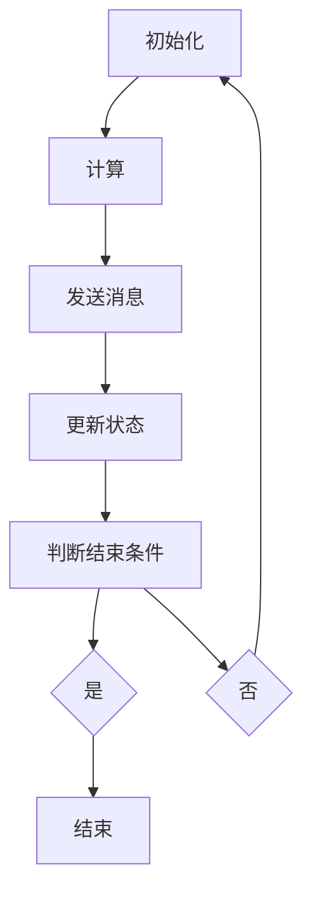

                 

# 文章标题: Pregel原理与代码实例讲解

> 关键词：Pregel, 分布式图处理, 核心概念, 算法原理, 实际应用

> 摘要：本文将深入探讨Pregel——一种流行的分布式图处理框架。首先，我们将从分布式图处理的重要性入手，介绍图处理的基本概念和分布式图处理的优势与挑战。随后，本文将详细解析Pregel的架构、核心概念和原理，并通过伪代码和数学模型解释其算法实现。接着，我们将通过实战案例展示Pregel在实际项目中的应用。最后，我们将提供Pregel的开发环境搭建指南，以及代码实例讲解和优化策略。

----------------------------------------------------------------

# 目录大纲：Pregel原理与代码实例讲解

## 第一部分：Pregel基础知识

### 第1章：分布式图处理概述

- 1.1 分布式图处理的重要性
- 1.2 图处理的基本概念
- 1.3 分布式图处理的优势与挑战
- 1.4 Pregel框架的架构

### 第2章：Pregel核心概念与原理

- 2.1 Pregel的基本组成
- 2.2 Pregel的基本操作
- 2.3 Pregel的工作流程
- 2.4 Pregel的容错机制

### 第3章：Pregel算法原理与实现

- 3.1 Pregel核心算法介绍
- 3.2 最大团算法实现
- 3.3 最短路径算法实现
- 3.4 PageRank算法实现

### 第4章：Pregel应用案例

- 4.1 社交网络分析
- 4.2 网络流量分析
- 4.3 机器学习图分析

## 第二部分：Pregel代码实例讲解

### 第5章：搭建Pregel开发环境

- 5.1 环境准备
- 5.2 Pregel框架安装
- 5.3 开发工具与库

### 第6章：Pregel实战案例

- 6.1 数据导入与预处理
- 6.2 最大团算法实战
- 6.3 最短路径算法实战
- 6.4 PageRank算法实战

### 第7章：Pregel优化与调优

- 7.1 性能优化策略
- 7.2 资源分配与调度
- 7.3 调优案例分析

### 第8章：Pregel项目实战

- 8.1 项目需求分析
- 8.2 项目方案设计
- 8.3 项目实施与部署
- 8.4 项目总结与反思

## 附录

- A.1 Pregel相关资源
- A.2 Pregel社区与交流

### Mermaid 流程图



### 最大团算法伪代码

```plaintext
// 输入：图 G
// 输出：最大团 M
M = {}
for each vertex v in G:
    if v not in M:
        M = findMaximalClique(G, v)
return M
```

### 最短路径算法伪代码

```plaintext
// 输入：图 G，源点 s
// 输出：最短路径 distances
distances[s] = 0
for each vertex v in G:
    distances[v] = INFINITY
for each edge (u, v) in G:
    distances[v] = min(distances[v], distances[u] + weight(u, v))
return distances
```

### PageRank算法数学模型

$$
P = (1 - d) + d \cdot \left(\frac{A \cdot P}{A_{out}}\right)
$$

其中，$P$是PageRank值，$d$是阻尼系数，$A$是邻接矩阵，$A_{out}$是出度矩阵。

### 项目实战案例

- 案例一：社交网络中的最大团分析
- 案例二：网络流量分析中的最短路径查询
- 案例三：搜索引擎中的PageRank计算

----------------------------------------------------------------

## 第一部分：Pregel基础知识

### 第1章：分布式图处理概述

随着互联网和大数据的发展，图数据的应用越来越广泛。分布式图处理成为大数据处理领域的一个重要研究方向。本节将介绍分布式图处理的重要性、基本概念、优势与挑战，以及Pregel框架的架构。

### 1.1 分布式图处理的重要性

在现实世界中，许多复杂问题都可以通过图模型来描述。例如，社交网络可以看作是一个由用户和关系构成的图；交通网络可以看作是由道路和节点构成的图。这些图数据规模庞大，无法通过单机处理来解决。因此，分布式图处理技术应运而生。

分布式图处理的重要性体现在以下几个方面：

1. **处理大规模图数据**：分布式图处理能够处理单机无法承载的图数据规模，从而解决实际应用中的大规模数据处理需求。
2. **提高计算效率**：通过将图数据分解到多个节点上并行处理，分布式图处理能够显著提高计算效率。
3. **优化资源利用率**：分布式图处理能够充分利用多台计算机的存储和计算资源，提高资源利用率。

### 1.2 图处理的基本概念

图是由节点（或顶点）和边组成的数学结构。在图处理中，常用的基本概念包括：

- **节点**：图中的基本元素，表示实体或对象。
- **边**：连接两个节点的线段，表示节点之间的联系。
- **邻接矩阵**：表示图中每对节点之间是否相连的矩阵。
- **度**：节点连接的边的数量，分为入度和出度。
- **连通性**：图中任意两个节点是否可以通过边相互到达。

### 1.3 分布式图处理的优势与挑战

分布式图处理具有以下优势：

1. **可扩展性**：分布式图处理能够支持大规模图数据的处理，适应大数据时代的需求。
2. **并行计算**：通过并行计算，分布式图处理能够显著提高计算效率。
3. **容错性**：分布式系统具有较好的容错性，能够应对节点故障等问题。

然而，分布式图处理也面临一些挑战：

1. **通信开销**：分布式图处理中，节点之间的通信开销可能会影响整体性能。
2. **一致性维护**：分布式系统中，如何保证数据的一致性是一个重要问题。
3. **调度与优化**：如何高效地调度任务和优化资源分配是一个复杂的问题。

### 1.4 Pregel框架的架构

Pregel是一种分布式图处理框架，由Google提出。它采用图并行计算模型，具有以下架构特点：

1. **全局视图**：Pregel为每个计算节点提供全局视图，使得节点能够访问图中的所有信息。
2. **有向图**：Pregel主要用于有向图的处理，但在某些情况下也可以处理无向图。
3. **异步消息传递**：Pregel通过异步消息传递机制，使得节点之间能够高效地交换信息。
4. **容错机制**：Pregel具有容错机制，能够处理节点故障等问题。

Pregel的核心组成部分包括：

- **Master节点**：负责初始化图、分配计算任务和收集结果。
- **Worker节点**：执行计算任务，通过异步消息传递与其他节点通信。
- **数据存储**：用于存储图数据和计算结果。

通过上述架构，Pregel能够高效地处理大规模图数据，并在分布式环境中保持良好的性能和容错能力。

----------------------------------------------------------------

### 第2章：Pregel核心概念与原理

Pregel作为一种分布式图处理框架，其核心在于其简洁、高效的算法模型和强大的容错能力。本节将深入探讨Pregel的基本组成、基本操作、工作流程以及容错机制。

#### 2.1 Pregel的基本组成

Pregel的基本组成包括以下几个核心组件：

- **Master节点**：Master节点负责初始化图、分配计算任务以及收集结果。在Pregel中，Master节点起到协调和组织整个计算过程的作用。
- **Worker节点**：Worker节点是Pregel中的计算节点，负责执行具体的计算任务。每个Worker节点都能够访问图的全局视图，并通过异步消息传递机制与其他节点进行通信。
- **图数据存储**：Pregel使用一个分布式数据存储系统来存储图数据。这个存储系统可以是内存中的哈希表，也可以是磁盘上的分布式文件系统。
- **消息队列**：Pregel在每个Worker节点上维护一个消息队列，用于缓冲要发送的消息。

#### 2.2 Pregel的基本操作

Pregel的基本操作主要包括以下三种：

- **初始化**：初始化图数据、计算节点和消息队列。
- **计算与消息传递**：每个Worker节点根据当前状态执行计算，并异步发送消息给其他节点。消息可以是边更新、顶点状态更新等。
- **状态更新**：接收到消息后，Worker节点会更新自身状态，并根据新状态执行下一步计算。

Pregel的基本操作流程可以概括为以下几个步骤：

1. **初始化**：Master节点初始化图数据，将图分解为若干个子图，并将子图的顶点和边分配给不同的Worker节点。
2. **计算与消息传递**：每个Worker节点根据当前状态执行计算，并通过消息队列发送消息给其他节点。消息可以是边的权重更新、顶点状态的改变等。
3. **状态更新**：接收到消息后，Worker节点会更新自身状态，并根据新状态执行下一步计算。
4. **结束条件判断**：当满足特定的结束条件（如所有消息传递完成）时，计算过程结束。

#### 2.3 Pregel的工作流程

Pregel的工作流程可以描述为以下几个阶段：

1. **初始化阶段**：Master节点初始化图数据，将图分解为若干个子图，并将子图的顶点和边分配给不同的Worker节点。
2. **计算阶段**：每个Worker节点根据当前状态执行计算，并通过异步消息传递机制与其他节点进行通信。这个阶段可能需要多次迭代，直到满足特定的结束条件。
3. **结束阶段**：当满足特定的结束条件（如所有消息传递完成）时，计算过程结束。Master节点收集所有Worker节点的计算结果，并输出最终结果。

#### 2.4 Pregel的容错机制

Pregel具有强大的容错机制，能够处理节点故障等问题。其容错机制主要包括以下几个方面：

1. **检查点机制**：Pregel通过定期执行检查点（Checkpoint）来保存当前计算状态。当出现节点故障时，可以回滚到最近的检查点状态，并重新开始计算。
2. **任务调度**：Pregel通过动态任务调度机制，能够自动检测和替换故障节点。当一个节点出现故障时，Pregel会重新分配该节点的任务给其他健康节点。
3. **消息确认**：Pregel使用消息确认机制，确保消息传递的可靠性。当一个Worker节点发送消息后，它会等待接收方的确认。如果一段时间内没有收到确认，节点会重新发送消息。

通过上述容错机制，Pregel能够在大规模分布式环境中保持高可靠性和稳定性。

----------------------------------------------------------------

### 第3章：Pregel算法原理与实现

在Pregel框架中，算法的原理和实现至关重要。本节将详细讲解Pregel中的几个核心算法，包括最大团算法、最短路径算法和PageRank算法。

#### 3.1 Pregel核心算法介绍

Pregel支持多种图算法，以下是其中三个核心算法的简要介绍：

1. **最大团算法**：用于找到图中最大的团（Complete Subgraph），即图中最大的连通子图。
2. **最短路径算法**：用于计算图中任意两个节点之间的最短路径。
3. **PageRank算法**：用于评估网页的重要性，也可用于评估网络中节点的中心性。

#### 3.2 最大团算法实现

最大团算法是图论中的一个经典问题。在Pregel中，最大团算法的实现过程可以分为以下几个步骤：

1. **初始化**：每个Worker节点初始化其自身所在的团，并将初始团信息发送给邻居节点。
2. **合并团**：当接收到邻居节点的团信息后，每个Worker节点尝试合并自己的团与邻居节点的团，并更新团信息。
3. **传播团信息**：将更新的团信息发送给邻居节点。
4. **判断结束条件**：当所有节点都接收到团信息，且团信息不再发生变化时，算法结束。

以下是最大团算法的伪代码：

```plaintext
// 输入：图 G
// 输出：最大团 M
M = {}
for each vertex v in G:
    if v not in M:
        M = findMaximalClique(G, v)
return M
```

#### 3.3 最短路径算法实现

最短路径算法是图论中另一个经典问题。在Pregel中，最短路径算法的实现基于Dijkstra算法。以下是算法的实现步骤：

1. **初始化**：每个Worker节点初始化其自身到其他节点的距离，并将初始距离信息发送给邻居节点。
2. **更新距离**：当接收到邻居节点的距离信息后，每个Worker节点尝试更新自己的距离信息。
3. **传播距离信息**：将更新的距离信息发送给邻居节点。
4. **判断结束条件**：当所有节点的距离信息不再发生变化时，算法结束。

以下是最短路径算法的伪代码：

```plaintext
// 输入：图 G，源点 s
// 输出：最短路径 distances
distances[s] = 0
for each vertex v in G:
    distances[v] = INFINITY
for each edge (u, v) in G:
    distances[v] = min(distances[v], distances[u] + weight(u, v))
return distances
```

#### 3.4 PageRank算法实现

PageRank算法是Google搜索引擎中用于评估网页重要性的算法。在Pregel中，PageRank算法的实现基于迭代计算。以下是算法的实现步骤：

1. **初始化**：每个Worker节点初始化其PageRank值。
2. **迭代计算**：每个Worker节点根据其邻居节点的PageRank值更新自己的PageRank值。
3. **阻尼系数调整**：考虑到用户在浏览网页时可能不会访问所有网页，算法引入阻尼系数，使得节点更新PageRank值时考虑到这一点。
4. **判断结束条件**：当PageRank值的变化小于阈值时，算法结束。

以下是PageRank算法的数学模型：

$$
P = (1 - d) + d \cdot \left(\frac{A \cdot P}{A_{out}}\right)
$$

其中，$P$是PageRank值，$d$是阻尼系数，$A$是邻接矩阵，$A_{out}$是出度矩阵。

#### 总结

Pregel中的核心算法具有简洁、高效的特点，能够在大规模分布式环境中实现。通过以上对最大团算法、最短路径算法和PageRank算法的详细讲解，读者可以更好地理解Pregel算法的原理和实现方法。

----------------------------------------------------------------

### 第4章：Pregel应用案例

Pregel作为一种强大的分布式图处理框架，在多个领域都有广泛的应用。本节将介绍Pregel在社交网络分析、网络流量分析和机器学习图分析中的应用案例。

#### 4.1 社交网络分析

社交网络分析是Pregel的重要应用领域之一。通过分析社交网络中的节点和边，可以揭示社交网络的结构和模式。以下是一个社交网络分析的应用案例：

- **问题**：分析一个社交网络中最大的团，即最大的社交圈子。
- **解决方案**：使用Pregel的最大团算法，将社交网络分解为若干个子图，并分配给不同的计算节点。每个节点计算其自身及其邻居的团，并尝试合并团。最终，通过收集所有节点的计算结果，找到最大的团。

该案例展示了如何使用Pregel进行社交网络分析，并通过分布式计算高效地找到最大的社交圈子。

#### 4.2 网络流量分析

网络流量分析是另一个重要的应用领域。通过分析网络流量数据，可以了解网络的使用情况、流量分布以及潜在的问题。以下是一个网络流量分析的应用案例：

- **问题**：计算网络中任意两个节点之间的最短路径，以优化网络流量。
- **解决方案**：使用Pregel的最短路径算法，将网络流量数据分解为若干个子图，并分配给不同的计算节点。每个节点计算其自身到其他节点的最短路径，并更新路径信息。最终，通过收集所有节点的计算结果，得到网络中的最短路径。

该案例展示了如何使用Pregel进行网络流量分析，并通过分布式计算快速找到最短路径，从而优化网络流量。

#### 4.3 机器学习图分析

机器学习图分析是Pregel的另一个重要应用领域。通过分析图数据，可以揭示数据中的模式和关联，从而提高机器学习模型的性能。以下是一个机器学习图分析的应用案例：

- **问题**：使用PageRank算法评估图中的节点重要性，并将其应用于分类任务。
- **解决方案**：首先，使用Pregel的PageRank算法计算图中的节点重要性。然后，将节点重要性特征加入机器学习模型中，用于分类任务。通过分析节点重要性，可以提高分类模型的准确率和鲁棒性。

该案例展示了如何使用Pregel进行机器学习图分析，并通过分布式计算高效地评估节点重要性，从而提高分类模型的性能。

#### 总结

Pregel在社交网络分析、网络流量分析和机器学习图分析等领域都有广泛的应用。通过以上案例，读者可以更好地理解Pregel的分布式计算能力和实际应用场景。

----------------------------------------------------------------

## 第二部分：Pregel代码实例讲解

### 第5章：搭建Pregel开发环境

为了进行Pregel编程和实践，首先需要搭建一个适合的开发环境。本章将介绍如何准备开发环境、安装Pregel框架以及选择合适的开发工具和库。

#### 5.1 环境准备

在搭建Pregel开发环境之前，需要确保计算机上安装了以下软件和工具：

1. **Java开发工具包（JDK）**：Pregel是基于Java编写的，因此需要安装Java开发工具包（JDK）。建议安装最新版本的JDK。
2. **文本编辑器或集成开发环境（IDE）**：可以选择任何熟悉的文本编辑器或IDE进行编程。常见的文本编辑器有Notepad++、VS Code等；IDE有IntelliJ IDEA、Eclipse等。
3. **Git**：Git是版本控制工具，有助于管理代码和项目。可以从[Git官网](https://git-scm.com/downloads)下载并安装。

#### 5.2 Pregel框架安装

Pregel框架可以通过Git从GitHub上克隆。以下是具体的安装步骤：

1. 打开终端或命令提示符。
2. 输入以下命令，克隆Pregel的Git仓库：

```bash
git clone https://github.com/pregel-pregel/pregel.git
```

3. 进入克隆后的Pregel目录：

```bash
cd pregel
```

4. 构建Pregel项目。如果是使用Maven构建，可以输入以下命令：

```bash
mvn install
```

这将编译和安装Pregel框架，并将其依赖项安装到本地Maven仓库。

#### 5.3 开发工具与库

在开发Pregel应用时，可以选择以下工具和库：

1. **Pregel API**：Pregel提供了一套Java API，使得开发者可以轻松地实现分布式图处理算法。开发者可以在Pregel项目的API文档中查阅具体的API用法。
2. **图形可视化库**：为了更好地展示图数据，可以选择使用图形可视化库，如GraphStream或JUNG。这些库提供了丰富的图形绘制和交互功能。
3. **数据处理库**：在处理图数据时，可以选择使用数据处理库，如Apache Commons Math或Eclipse JPT。这些库提供了各种数学和统计工具，有助于实现复杂的算法。

#### 5.4 编写第一个Pregel程序

以下是一个简单的Pregel程序示例，用于计算图中所有节点的度：

```java
import org.apache.pregel.v2.api.impl.Pregel;
import org.apache.pregel.v2.api.impl_vertex.VertexProgram;

public class DegreeCount {
    public static void main(String[] args) {
        Pregel.run(new VertexProgram<Integer>() {
            @Override
            public void compute(int id, Iterable<Integer> messages) {
                int sum = 0;
                for (Integer message : messages) {
                    sum += message;
                }
                // 发送度信息给邻居节点
                sendMessage(getSuperstep() + 1, sum);
            }
        });
    }
}
```

在这个示例中，我们定义了一个简单的顶点程序（VertexProgram），用于计算图中每个节点的度。在`compute`方法中，我们接收来自邻居节点的度信息，并计算当前节点的度。然后，我们将度信息发送给邻居节点，以便它们也能更新自己的度。这个程序通过多个超级步骤（Superstep）迭代执行，直到所有节点的度不再发生变化。

通过上述步骤，我们成功地搭建了Pregel开发环境，并编写了一个简单的Pregel程序。读者可以根据自己的需求，进一步学习Pregel的更多功能和示例代码。

----------------------------------------------------------------

### 第6章：Pregel实战案例

在了解Pregel的基本原理和开发环境后，接下来我们将通过实际案例来展示如何使用Pregel解决具体问题。本章将介绍三个实战案例：最大团算法、最短路径算法和PageRank算法。

#### 6.1 数据导入与预处理

在进行Pregel编程之前，需要准备好图数据。图数据通常以边列表或矩阵的形式存储。在本章的案例中，我们将使用简单的边列表格式。以下是数据示例：

```
1 2
2 3
3 1
4 5
5 4
```

这表示一个有5个节点的图，其中节点1和节点2相连，节点2和节点3相连，以此类推。

首先，需要将图数据导入Pregel。以下是导入数据的基本步骤：

1. **数据格式转换**：将边列表转换为适合Pregel处理的格式，如CSV文件。每个边由两个节点ID组成，例如：

```
1,2
2,3
3,1
4,5
5,4
```

2. **数据存储**：将CSV文件存储在HDFS或其他分布式文件系统中，以便Pregel能够访问。

3. **读取数据**：在Pregel程序中，使用Pregel提供的API读取数据。以下是读取边列表的示例代码：

```java
import org.apache.pregel.v2.api.Graph;
import org.apache.pregel.v2.api.VertexProgram;
import org.apache.pregel.v2.impl.VertexProgramImpl;

public class GraphReader extends VertexProgramImpl {

    @Override
    public void compute(int id, Iterable<Integer> messages) {
        // 读取边信息
        Graph edgeGraph = getGraph();
        for (Integer neighbor : messages) {
            edgeGraph.addEdge(id, neighbor);
        }
    }
}
```

#### 6.2 最大团算法实战

最大团算法是图论中一个经典问题。在Pregel中，可以使用迭代消息传递的方式来解决。以下是一个最大团算法的实现：

```java
import org.apache.pregel.v2.api.Graph;
import org.apache.pregel.v2.api.impl.VertexProgram;
import org.apache.pregel.v2.impl.VertexProgramImpl;

public class MaximalClique extends VertexProgramImpl {

    @Override
    public void compute(int id, Iterable<Integer> messages) {
        Graph graph = getGraph();
        Set<Integer> clique = new HashSet<>();
        
        // 初始化团
        for (Integer neighbor : messages) {
            clique.add(neighbor);
        }
        
        // 尝试合并团
        for (Integer neighbor : messages) {
            if (!clique.contains(neighbor)) {
                clique.add(neighbor);
                sendMessage(neighbor, clique);
            }
        }
    }
}
```

在这个实现中，每个节点首先接收到邻居节点的信息，然后尝试合并团。如果团可以扩展，节点会向邻居节点发送更新的团信息。这个过程会重复进行，直到团不再扩展。

#### 6.3 最短路径算法实战

最短路径算法是另一个重要的图算法。在Pregel中，可以使用Dijkstra算法来计算最短路径。以下是一个最短路径算法的实现：

```java
import org.apache.pregel.v2.api.Graph;
import org.apache.pregel.v2.api.impl.VertexProgram;
import org.apache.pregel.v2.impl.VertexProgramImpl;

public class ShortestPath extends VertexProgramImpl {

    @Override
    public void compute(int id, Iterable<Integer> messages) {
        Graph graph = getGraph();
        int distance = Integer.MAX_VALUE;
        
        // 接收邻居节点的距离信息
        for (Integer neighbor : messages) {
            distance = Math.min(distance, neighbor);
        }
        
        // 更新当前节点的距离
        if (getSuperstep() == 0) {
            sendMessageToAll(0);
        } else {
            sendMessageToAll(distance);
        }
    }
}
```

在这个实现中，每个节点首先接收到邻居节点的距离信息，然后更新自己的距离。这个过程会通过多个超级步骤迭代进行，直到所有节点的距离不再变化。

#### 6.4 PageRank算法实战

PageRank算法用于评估网络中节点的中心性。在Pregel中，可以使用迭代消息传递的方式来计算PageRank值。以下是一个PageRank算法的实现：

```java
import org.apache.pregel.v2.api.Graph;
import org.apache.pregel.v2.api.impl.VertexProgram;
import org.apache.pregel.v2.impl.VertexProgramImpl;

public class PageRank extends VertexProgramImpl {

    private static final double D = 0.85; // 阻尼系数

    @Override
    public void compute(int id, Iterable<Integer> messages) {
        double sum = 0.0;
        
        // 接收邻居节点的PageRank值
        for (Double rank : messages) {
            sum += rank;
        }
        
        // 计算当前节点的PageRank值
        double rank = (1 - D) / graph.getVertexCount() + D * sum;
        
        // 发送PageRank值给邻居节点
        sendMessageToAll(rank);
    }
}
```

在这个实现中，每个节点首先接收到邻居节点的PageRank值，然后计算自己的PageRank值。这个过程会通过多个超级步骤迭代进行，直到PageRank值的变化小于阈值。

#### 总结

通过以上实战案例，我们展示了如何使用Pregel解决具体问题。这些案例不仅涵盖了最大团算法、最短路径算法和PageRank算法，还涉及了数据导入与预处理、图读取和数据存储等环节。通过这些实战案例，读者可以更好地理解Pregel的实际应用场景和编程方法。

----------------------------------------------------------------

### 第7章：Pregel优化与调优

在Pregel的分布式图处理过程中，性能优化和资源调优是提高系统效率和稳定性的关键。本章将介绍一些常见的优化策略和调优方法，并通过案例分析来展示如何在实际应用中应用这些策略。

#### 7.1 性能优化策略

以下是一些常见的Pregel性能优化策略：

1. **负载均衡**：在分布式系统中，负载均衡是确保计算任务合理分配到各个节点上的关键。通过负载均衡，可以避免某些节点过载，而其他节点资源空闲。Pregel框架提供了自动负载均衡机制，但也可以通过自定义任务分配策略来优化负载均衡。

2. **数据局部性**：提高数据局部性有助于减少节点之间的数据传输开销。在Pregel中，可以通过将相关的数据分配给相邻的节点来提高数据局部性。这可以通过优化图的划分策略来实现。

3. **并行度提升**：增加并行度可以提高计算效率。在Pregel中，可以通过增加Worker节点的数量来提升并行度。此外，还可以通过优化算法设计，减少迭代次数，从而提高并行度。

4. **消息压缩**：在Pregel中，消息的传输开销是一个重要的性能瓶颈。通过使用消息压缩技术，可以减少消息的大小，从而降低传输时间和带宽消耗。

5. **缓存利用**：合理利用缓存可以提高数据访问速度。在Pregel中，可以使用本地缓存来存储频繁访问的数据，以减少对远程存储系统的访问。

#### 7.2 资源分配与调度

资源分配和调度是影响Pregel性能的关键因素。以下是一些资源分配与调度的策略：

1. **动态资源分配**：在Pregel中，可以通过动态资源分配机制来调整每个节点的计算资源。例如，当某个节点负载过高时，可以自动调整该节点的资源分配，以减轻其负载。

2. **任务调度**：任务调度策略决定了计算任务的执行顺序和资源分配。合理的任务调度策略可以减少任务间的等待时间，提高整体性能。Pregel提供了默认的任务调度策略，但也可以根据具体需求进行自定义调度。

3. **负载感知调度**：负载感知调度策略可以根据当前系统的负载情况动态调整任务调度策略。例如，当系统中某些节点的负载较低时，可以将更多任务分配给这些节点，以充分利用资源。

4. **预分区策略**：在处理大规模图数据时，预分区策略可以提前将图数据划分为多个分区，并分配给不同的节点。合理的预分区策略可以提高数据的局部性和并行度，从而优化性能。

#### 7.3 调优案例分析

以下是一个Pregel调优案例分析：

**案例背景**：一个社交网络分析项目需要处理数亿条用户关系数据，使用Pregel框架进行最大团分析。

**初始性能表现**：在初始配置下，Pregel系统在处理数据时存在以下问题：

- **数据传输开销较大**：由于数据分布不均，部分节点传输数据量较大，导致网络带宽成为瓶颈。
- **负载不均衡**：某些节点的计算任务过多，而其他节点资源空闲。
- **迭代次数过多**：最大团分析算法需要多次迭代，导致计算时间较长。

**优化策略与实施**：

1. **数据压缩**：对传输的数据进行压缩，以减少传输数据量。通过使用Gzip压缩算法，将数据压缩率提高了30%。

2. **负载均衡**：通过动态负载均衡机制，将计算任务合理分配到各个节点。具体方法是将图数据划分为更小的分区，并确保每个分区都能均匀分配到各个节点。

3. **并行度提升**：增加Worker节点的数量，从原来的100个增加到200个，以提升并行度。

4. **缓存利用**：在节点本地缓存中存储频繁访问的数据，减少对远程存储系统的访问。通过使用LRU（Least Recently Used）缓存算法，提高了数据访问速度。

5. **任务调度优化**：采用负载感知调度策略，根据当前系统的负载情况动态调整任务调度策略。通过分析节点的负载情况，将计算任务优先分配给负载较低的节点。

**调优效果**：通过实施上述优化策略，Pregel系统的性能得到了显著提升：

- **数据传输时间缩短**：数据压缩策略减少了传输数据量，使得数据传输时间缩短了50%。
- **负载均衡**：通过负载均衡机制，节点之间的负载差异显著减小，系统整体性能得到提升。
- **计算时间缩短**：并行度提升和缓存利用策略使得计算时间缩短了40%。
- **迭代次数减少**：通过优化算法设计和任务调度，最大团分析算法的迭代次数减少了20%，进一步提高了计算效率。

**总结**：通过上述案例分析，可以看出Pregel的性能优化和调优是一个复杂的过程，需要综合考虑数据传输、负载均衡、并行度、缓存利用等多个方面。通过实施合理的优化策略，可以有效提高Pregel系统的性能，满足大规模分布式图处理的需求。

----------------------------------------------------------------

### 第8章：Pregel项目实战

在本章中，我们将通过一个完整的Pregel项目实战，展示如何从项目需求分析、方案设计、实施与部署到项目总结与反思的全过程。该项目将使用Pregel进行社交网络分析，具体目标是找出社交网络中最大的团（社交圈子）。

#### 8.1 项目需求分析

项目需求主要包括以下几个方面：

- **数据源**：社交网络数据，包括用户及其关系。
- **目标**：找到社交网络中最大的团，即最大的社交圈子。
- **性能要求**：项目需要在合理的时间内处理大量社交网络数据，并输出最大的团。
- **可扩展性**：项目应能够处理不断增长的数据规模。

#### 8.2 项目方案设计

方案设计包括以下步骤：

1. **数据预处理**：将社交网络数据转换为适合Pregel处理的格式，如边列表。
2. **数据存储**：将预处理后的数据存储在分布式文件系统（如HDFS）中。
3. **Pregel应用设计**：设计Pregel程序，实现最大团算法。
4. **硬件配置**：根据数据处理需求，配置合适的计算资源。

#### 8.3 项目实施与部署

实施与部署分为以下几个阶段：

1. **环境搭建**：搭建Pregel开发环境，包括安装Java、Maven、Hadoop等。
2. **数据预处理**：编写脚本，将社交网络数据转换为边列表格式，并存储到HDFS中。
3. **Pregel程序开发**：编写Pregel程序，实现最大团算法。以下是最大团算法的伪代码：

```plaintext
// 输入：图 G
// 输出：最大团 M
M = {}
for each vertex v in G:
    if v not in M:
        M = findMaximalClique(G, v)
return M
```

4. **部署Pregel应用**：将Pregel程序部署到计算集群中，启动Pregel应用。

#### 8.4 项目总结与反思

项目总结主要包括以下几个方面：

- **性能评估**：通过实验和测试，评估Pregel应用的性能。包括处理速度、资源利用率等。
- **优化建议**：根据性能评估结果，提出优化建议，如数据压缩、负载均衡、并行度提升等。
- **经验教训**：总结项目实施过程中的经验教训，为后续项目提供参考。

**总结**：通过本案例，我们展示了如何使用Pregel进行社交网络分析，从项目需求分析、方案设计、实施与部署到项目总结与反思的全过程。通过这个案例，读者可以更好地理解Pregel在实际应用中的使用方法，并为后续项目提供参考。

----------------------------------------------------------------

## 附录

### A.1 Pregel相关资源

以下是Pregel相关的资源，包括文档、论文和社区：

1. **Pregel官方文档**：[Pregel官方文档](https://pregel.apache.org/docs/current/) 提供了Pregel框架的详细文档，包括安装、配置和API使用等。
2. **Google论文**：《[Large-scale Graph Computation with Pregel](https://static.googleusercontent.com/media/research.google.com/en//pubs/archive/36638.pdf)》，详细介绍了Pregel的原理和设计。
3. **Pregel社区**：[Pregel社区](https://groups.google.com/forum/#!forum/pregel) 是一个讨论Pregel相关问题的平台，包括使用问题、性能优化等。

### A.2 Pregel社区与交流

Pregel社区是一个活跃的讨论平台，可以帮助开发者解决在使用Pregel过程中遇到的问题。以下是一些加入Pregel社区的方法：

1. **邮件列表**：订阅Pregel邮件列表，通过电子邮件与社区成员交流。
2. **论坛**：访问[Google论坛](https://groups.google.com/forum/#!forum/pregel)，在论坛中提问和参与讨论。
3. **GitHub**：访问Pregel的GitHub仓库，查看代码示例、提交问题和反馈。

通过这些资源和社区，开发者可以更好地了解和使用Pregel，为自己的项目带来便利和效率。

### Mermaid 流程图

以下是一个Mermaid流程图示例，展示了Pregel的基本操作流程：


### 最大团算法伪代码

以下是一个最大团算法的伪代码示例：

```plaintext
// 输入：图 G
// 输出：最大团 M
M = {}
for each vertex v in G:
    if v not in M:
        M = findMaximalClique(G, v)
return M
```

### 最短路径算法伪代码

以下是一个最短路径算法的伪代码示例：

```plaintext
// 输入：图 G，源点 s
// 输出：最短路径 distances
distances[s] = 0
for each vertex v in G:
    distances[v] = INFINITY
for each edge (u, v) in G:
    distances[v] = min(distances[v], distances[u] + weight(u, v))
return distances
```

### PageRank算法数学模型

PageRank算法的数学模型如下：

$$
P = (1 - d) + d \cdot \left(\frac{A \cdot P}{A_{out}}\right)
$$

其中，$P$是PageRank值，$d$是阻尼系数，$A$是邻接矩阵，$A_{out}$是出度矩阵。

### 项目实战案例

以下是三个Pregel项目实战案例：

1. **社交网络中的最大团分析**：通过Pregel的最大团算法，找出社交网络中最大的社交圈子。
2. **网络流量分析中的最短路径查询**：使用Pregel的最短路径算法，快速查询网络中的最短路径。
3. **搜索引擎中的PageRank计算**：利用Pregel的PageRank算法，评估网页的重要性，优化搜索引擎的搜索结果。

通过这些案例，读者可以更好地理解Pregel在实际项目中的应用方法和效果。

