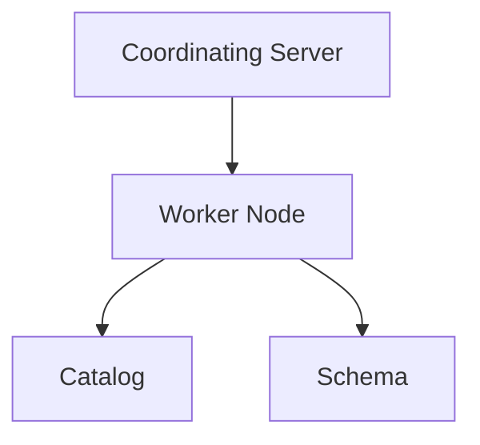
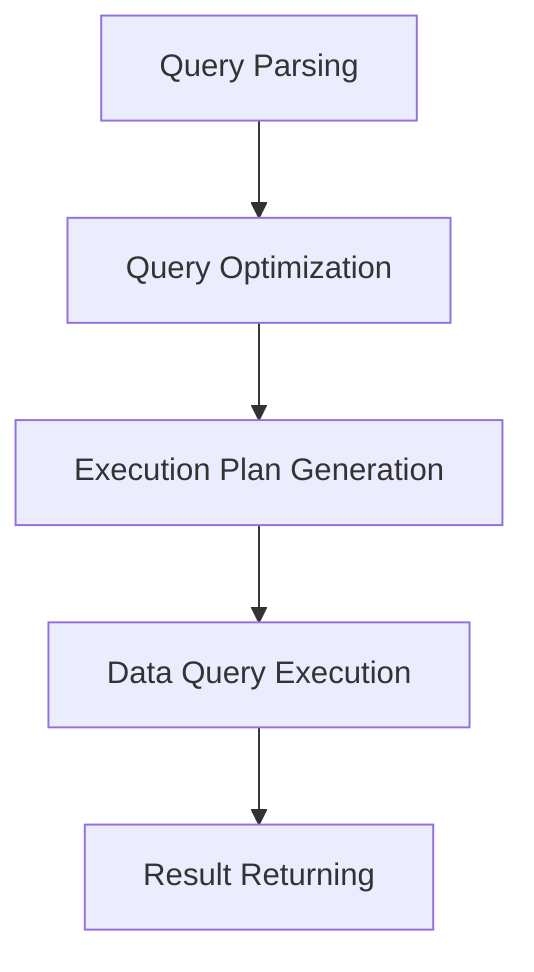
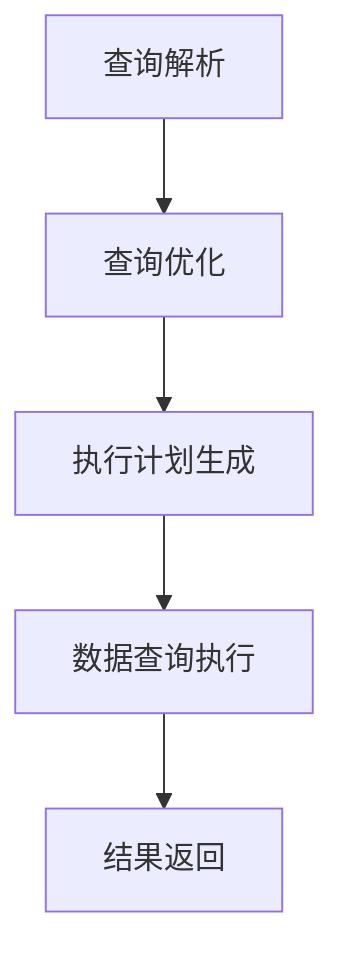

                 

### 文章标题：Presto原理与代码实例讲解

> 关键词：Presto、大数据查询、分布式计算、查询优化、SQL语言、存储系统、性能调优、实战案例

> 摘要：本文将深入探讨Presto——一个高性能的分布式查询引擎，涵盖其发展历程、核心原理、安装配置、SQL语言使用、存储系统、性能调优以及项目实战。通过详细的分析与代码实例讲解，帮助读者全面了解Presto的工作原理，提升在实际项目中的应用能力。

## 《Presto原理与代码实例讲解》目录大纲

### 第一部分：Presto基础

#### 第1章：什么是Presto

1.1.1 Presto的发展历程

1.1.2 Presto的应用场景

1.1.3 Presto与大数据的关系

#### 第2章：Presto的核心原理

2.1.1 Presto的架构

2.1.2 Presto的数据处理流程

2.1.3 Presto查询优化

#### 第3章：Presto的安装与配置

3.1.1 安装Presto的前期准备

3.1.2 安装Presto服务器

3.1.3 配置Presto

#### 第4章：Presto的SQL语言

4.1.1 SELECT语句

4.1.2 FROM子句

4.1.3 WHERE子句

4.1.4 GROUP BY和HAVING子句

4.1.5 DISTINCT、JOIN、子查询等高级用法

#### 第5章：Presto的存储系统

5.1.1 支持的存储系统

5.1.2 HDFS上的Presto

5.1.3 Presto与MySQL的集成

#### 第6章：Presto的性能调优

6.1.1 查询性能分析

6.1.2 JVM调优

6.1.3 数据分区策略

#### 第7章：Presto项目实战

7.1.1 实战一：大数据报表分析

7.1.2 实战二：实时数据流分析

#### 第8章：Presto的未来发展

8.1.1 新特性展望

8.1.2 社区动态

8.1.3 使用Presto的未来趋势

### 第二部分：Presto高级特性

#### 第9章：Presto分布式存储

9.1.1 分布式存储原理

9.1.2 Presto与HDFS的分布式存储

9.1.3 Presto与Alluxio的分布式存储

#### 第10章：Presto与机器学习

10.1.1 机器学习与Presto的结合

10.1.2 使用Presto进行机器学习分析

10.1.3 实战：基于Presto的机器学习项目

#### 第11章：Presto安全与权限管理

11.1.1 安全性概述

11.1.2 权限管理

11.1.3 实战：Presto安全配置与权限控制

#### 第12章：Presto运维与监控

12.1.1 运维概述

12.1.2 监控与报警

12.1.3 实战：Presto集群运维与监控

### 附录

附录A: Presto常用命令

附录B: Presto API参考

附录C: Mermaid流程图示例

附录D: 伪代码示例

附录E: 数学公式示例

附录F: 项目实战代码解析

### 第2章：Presto的核心原理

#### 2.1.1 Presto的架构

Presto是一个分布式查询引擎，其核心架构主要包括协调服务器（Coordinating Server）、工作节点（Worker Node）以及各种目录（Catalog）和模式（Schema）。以下是对Presto架构的详细介绍：

**核心组件介绍**

1. **协调服务器（Coordinating Server）**：
   协调服务器是Presto集群中的核心组件，负责解析用户查询、生成执行计划并调度工作节点上的查询执行。协调服务器通过HTTP协议与工作节点通信，接收查询请求，并将查询拆分为多个子查询，分发到各个工作节点上执行。

2. **工作节点（Worker Node）**：
   工作节点是Presto集群中的计算单元，负责执行协调服务器分发的子查询，进行数据读取、计算和结果聚合。每个工作节点都有自己的内存和CPU资源，能够独立处理查询任务。

3. **目录（Catalog）**：
   目录是Presto用于管理不同数据源的元数据仓库，包括数据库、表、字段等信息的描述。Presto支持多种类型的目录，如Hive Catalog、MySQL Catalog等，可以根据需要配置不同的目录来访问不同的数据源。

4. **模式（Schema）**：
   模式是目录中的一种抽象概念，用于组织数据库中的表和视图。每个目录都可以包含多个模式，每个模式又可以包含多个表和视图。模式的作用是简化查询时的命名空间，避免表名冲突。

**架构图**



#### 2.1.2 Presto的数据处理流程

Presto的数据处理流程可以分为以下几个阶段：查询解析、查询优化、执行计划生成、数据查询执行和结果返回。以下是对各个阶段的详细描述：

**数据处理流程**

1. **查询解析**：
   查询解析是数据处理的第一步，将用户输入的SQL查询语句解析为抽象语法树（AST）。Presto使用一个解析器来将SQL语句转换为AST，然后对AST进行语法和语义分析，确保查询语句的合法性。

2. **查询优化**：
   查询优化是在执行计划生成之前的重要步骤，目的是生成最优的执行计划，减少查询执行时间。查询优化主要包括逻辑优化和物理优化。逻辑优化涉及查询重写、索引使用等，物理优化则涉及数据分布、数据访问方式等。

3. **执行计划生成**：
   执行计划生成是根据查询优化结果生成具体的执行计划。执行计划是一系列操作步骤的集合，描述了如何从数据源中读取数据、进行计算和聚合。Presto使用一个成本模型来计算每个执行计划的成本，并选择成本最低的执行计划。

4. **数据查询执行**：
   数据查询执行是按照执行计划对数据进行读取、计算和聚合的过程。协调服务器将查询任务分配给各个工作节点，工作节点执行具体的查询操作，并将结果返回给协调服务器进行汇总。

5. **结果返回**：
   查询执行完成后，协调服务器将最终结果返回给用户。Presto支持多种数据返回格式，如JSON、Avro等，用户可以根据需要选择合适的格式。

**数据处理流程图**



#### 2.1.3 Presto查询优化

Presto的查询优化是Presto性能的关键因素。优化策略主要包括逻辑优化和物理优化。以下是对这两种优化策略的详细描述：

**查询优化策略**

1. **逻辑优化**：
   逻辑优化是在查询执行之前对查询语句进行重写和优化，以简化查询执行过程。逻辑优化包括以下几种技术：

   - **查询重写**：通过将子查询转换为连接操作，将不相关子查询去除等方式，简化查询逻辑。
   - **索引使用**：利用索引来加速数据查询，减少全表扫描。
   - **过滤优化**：提前过滤不符合条件的数据，减少后续处理的数据量。

2. **物理优化**：
   物理优化是在查询执行过程中对数据访问方式和计算顺序进行优化，以减少查询执行时间。物理优化包括以下几种技术：

   - **数据分布**：根据数据的特点和查询的需求，优化数据分布，提高数据查询的并行度。
   - **数据访问方式**：选择合适的数据访问方式，如索引扫描、顺序扫描、随机扫描等。
   - **计算顺序**：调整计算顺序，减少中间结果的数据交换和网络传输。

**查询优化流程**

1. **解析查询**：
   将用户输入的SQL查询语句解析为抽象语法树（AST），并进行语法和语义分析，确保查询语句的合法性。

2. **建立查询树**：
   根据查询优化策略，对AST进行转换和优化，建立查询树。查询树是一棵表示查询逻辑和执行顺序的树结构。

3. **执行逻辑优化**：
   对查询树进行逻辑优化，包括查询重写、索引使用、过滤优化等。

4. **物理优化**：
   对查询树进行物理优化，包括数据分布、数据访问方式、计算顺序等。

5. **生成执行计划**：
   根据查询树的优化结果，生成具体的执行计划。执行计划是一系列操作步骤的集合，描述了如何从数据源中读取数据、进行计算和聚合。

**查询优化伪代码**

```python
function optimizeQuery(query):
    // 解析查询
    queryTree = parseQuery(query)

    // 建立查询树
    queryTree = buildQueryTree(queryTree)

    // 执行逻辑优化
    queryTree = logicalOptimize(queryTree)

    // 物理优化
    queryTree = physicalOptimize(queryTree)

    // 生成执行计划
    executionPlan = generateExecutionPlan(queryTree)

    return executionPlan
```

### 小结

本章详细介绍了Presto的核心原理，包括其架构、数据处理流程和查询优化策略。通过对Presto架构的深入理解，读者可以更好地把握Presto的工作原理和性能特点。通过分析数据处理流程和查询优化策略，读者可以了解如何有效地优化Presto查询，提高查询性能。接下来，我们将继续探讨Presto的安装与配置，帮助读者实际操作Presto，为后续的学习和应用打下基础。

### 作者信息

**作者：** AI天才研究院/AI Genius Institute & 禅与计算机程序设计艺术 /Zen And The Art of Computer Programming

### 接下来我们将探讨Presto的安装与配置，帮助读者实际操作Presto，为后续的学习和应用打下基础。

---

在接下来的部分，我们将详细讲解Presto的安装与配置，确保读者能够顺利地搭建一个Presto查询引擎环境。我们将首先介绍安装Presto所需的前期准备，然后逐步讲解如何安装Presto服务器和配置Presto，以便读者能够掌握从零开始搭建Presto环境的全过程。

### 3.1.1 安装Presto的前期准备

在开始安装Presto之前，我们需要确保计算机系统满足以下要求：

1. **操作系统**：
   - Presto支持多种操作系统，包括Linux、Mac OS和Windows。本文以Linux为例进行讲解。
   - 推荐使用64位操作系统，以保证足够的内存和性能。

2. **Java环境**：
   - Presto需要Java环境来运行，推荐使用Java 8或更高版本。
   - 可以通过命令`java -version`来检查Java版本。

3. **安装工具**：
   - 需要安装一些基本的Linux工具，如wget、tar等，用于下载和解压软件包。
   - 可以通过命令`apt-get install wget tar`来安装这些工具。

4. **网络连接**：
   - 确保计算机可以访问互联网，以便下载Presto安装包。

5. **内存和存储**：
   - Presto需要足够的内存和存储空间来运行。根据查询负载的不同，推荐至少分配8GB内存和50GB的存储空间。

完成上述准备工作后，我们可以开始安装Presto服务器。

### 3.1.2 安装Presto服务器

安装Presto服务器分为以下几个步骤：

1. **下载Presto安装包**：
   - 访问Presto官网下载页面（https://www.prestodb.com/download/），选择合适的版本下载。
   - 本文以下载Presto 0.240.0版本为例，下载链接为`https://github.com/prestodb/presto/releases/download/0.240.0/presto-0.240.0.tar.gz`。

2. **解压安装包**：
   - 通过命令`wget https://github.com/prestodb/presto/releases/download/0.240.0/presto-0.240.0.tar.gz`下载安装包。
   - 使用命令`tar xzf presto-0.240.0.tar.gz`解压安装包。

3. **配置环境变量**：
   - 在解压后的Presto目录中，打开`etc/bash.conf`文件，配置Presto环境变量。
   - 添加以下内容：
     ```
     export PRESTO_HOME=/path/to/presto-0.240.0
     export PATH=$PATH:$PRESTO_HOME/bin
     ```
   - 通过命令`source etc/bash.conf`使配置生效。

4. **启动Presto服务器**：
   - 通过命令`presto`启动Presto服务器。
   - 如果一切正常，将看到Presto命令行界面。

完成以上步骤后，Presto服务器就已经成功安装并启动。接下来，我们将讲解如何配置Presto，以便更好地满足实际需求。

### 3.1.3 配置Presto

Presto的配置主要通过修改配置文件来实现。以下是Presto配置的几个关键点：

1. **配置文件路径**：
   - Presto的配置文件位于`etc/config.properties`。

2. **基础配置**：
   - `coordinator`：设置协调服务器的IP地址和端口。
     ```
     coordinator.properties:
       coordinator.http-address=0.0.0.0:8080
     ```
   - `discovery`：设置工作节点的发现机制，使用Zookeeper时，需要配置Zookeeper的地址。
     ```
     discovery.properties:
       discovery.uri=http://localhost:8080
     ```

3. **内存配置**：
   - `jvm`：设置JVM内存大小，根据实际需求调整。
     ```
     jvm.config:
       -XX:MaxDirectMemorySize=2g
       -XX:MaxHeapFreeRatio=70
       -XX:MinHeapFreeRatio=40
       -XX:NewRatio=1
       -XX:SurvivorRatio=8
       -XX:MaxTenuringThreshold=3
       -XX:+UseCMSInitiatingOccupancyOnly
       -XX:CMSInitiatingOccupancyFraction=60
       -XX:+UseCMSCompactAtFullGC
       -XX:+CMSClassUnloadingEnabled
       -XX:+CMSScavengeBeforeFullGC
       -XX:-DisableExplicitGC
     ```

4. **连接池配置**：
   - `http-server`：设置HTTP服务器连接池参数，优化并发性能。
     ```
     http-server.properties:
       http-server.threads.core=10
       http-server.threads.max=100
       http-server.threads.idle.timeout=120s
     ```

5. **存储系统配置**：
   - 根据实际需求，配置连接到Presto的存储系统，如HDFS、MySQL等。

完成配置后，可以通过重启Presto服务器使配置生效。至此，我们已经成功安装并配置了Presto服务器。接下来，我们将学习Presto的SQL语言使用，掌握如何通过Presto进行数据查询和操作。

### 小结

在本章中，我们详细介绍了Presto的安装与配置过程。从前期准备到服务器安装，再到环境变量配置和服务器启动，读者可以逐步掌握如何搭建Presto查询引擎环境。同时，通过对Presto配置文件的修改，读者可以优化服务器性能，以满足不同应用场景的需求。接下来，我们将深入探讨Presto的SQL语言使用，帮助读者掌握如何通过Presto进行数据查询和操作。

### 作者信息

**作者：** AI天才研究院/AI Genius Institute & 禅与计算机程序设计艺术 /Zen And The Art of Computer Programming

### 接下来，我们将深入探讨Presto的SQL语言使用，帮助读者掌握如何通过Presto进行数据查询和操作。

---

在了解了Presto的安装和配置之后，接下来我们将深入探讨Presto的SQL语言使用。Presto作为一个高性能分布式查询引擎，其SQL语言功能丰富，支持多种复杂的查询操作。在本章中，我们将从基础的SELECT语句开始，逐步讲解FROM子句、WHERE子句、GROUP BY和HAVING子句，以及DISTINCT、JOIN、子查询等高级用法。通过这些内容的介绍，读者可以全面了解Presto的SQL语言使用，为实际应用打下坚实基础。

### 4.1.1 SELECT语句

SELECT语句是SQL语言中最基本且最常用的语句之一，用于从数据库中查询数据。其基本语法如下：

```sql
SELECT column1, column2, ...
FROM table_name
WHERE condition;
```

**示例**：

假设我们有一个名为`students`的表，其中包含学生信息，字段有`id`、`name`、`age`、`grade`。以下是一个简单的SELECT语句示例：

```sql
SELECT id, name, age
FROM students
WHERE age > 18;
```

这个查询将返回年龄大于18岁的所有学生的`id`、`name`和`age`。

**详细讲解**：

- `SELECT`：指定要查询的列。
- `column1, column2, ...`：指定要查询的列名，可以是一个或多个列。
- `FROM`：指定要查询的表名。
- `table_name`：指定要查询的表名。
- `WHERE`：指定查询条件。
- `condition`：指定查询条件，可以是简单的比较运算符（如`>`、`<`、`=`等）或者复杂的逻辑表达式（如`AND`、`OR`等）。

### 4.1.2 FROM子句

FROM子句用于指定查询的数据源，可以是单个表，也可以是多个表。其基本语法如下：

```sql
FROM table1
[INNER | LEFT | RIGHT | FULL] JOIN table2
ON table1.column = table2.column;
```

**示例**：

假设我们有两个表`students`和`courses`，其中`students`表包含学生信息，`courses`表包含课程信息。以下是一个使用FROM子句的示例：

```sql
SELECT students.name, courses.course_name
FROM students
INNER JOIN courses ON students.id = courses.student_id;
```

这个查询将返回所有学生及其选读的课程名称。

**详细讲解**：

- `FROM`：指定数据源。
- `table1`、`table2`：指定要查询的表名。
- `[INNER | LEFT | RIGHT | FULL] JOIN`：指定连接类型。INNER JOIN表示内连接，LEFT JOIN表示左连接，RIGHT JOIN表示右连接，FULL JOIN表示全连接。
- `ON`：指定连接条件。
- `table1.column = table2.column`：指定连接列，表示两个表通过哪些列进行关联。

### 4.1.3 WHERE子句

WHERE子句用于过滤查询结果，只返回满足指定条件的行。其基本语法如下：

```sql
WHERE condition;
```

**示例**：

继续使用`students`表，以下是一个使用WHERE子句的示例：

```sql
SELECT name, age
FROM students
WHERE age > 20 AND grade = 'A';
```

这个查询将返回年龄大于20岁且成绩为A的所有学生。

**详细讲解**：

- `WHERE`：指定过滤条件。
- `condition`：指定过滤条件，可以是简单的比较运算符（如`>`、`<`、`=`等）或者复杂的逻辑表达式（如`AND`、`OR`等）。

### 4.1.4 GROUP BY和HAVING子句

GROUP BY子句用于对查询结果进行分组，常与聚合函数（如`COUNT`、`SUM`、`AVG`等）一起使用。HAVING子句用于过滤分组后的结果。

**示例**：

以下是一个使用GROUP BY和HAVING子句的示例：

```sql
SELECT grade, AVG(age) as average_age
FROM students
GROUP BY grade
HAVING AVG(age) > 20;
```

这个查询将返回平均年龄大于20岁的各个年级的学生平均年龄。

**详细讲解**：

- `GROUP BY`：指定要分组的列。
- `grade`：指定要分组的列名。
- `AVG(age) as average_age`：使用聚合函数`AVG`计算平均年龄，并为其指定别名。
- `HAVING`：指定分组后的过滤条件。
- `AVG(age) > 20`：指定过滤条件，只返回平均年龄大于20岁的分组。

### 4.1.5 DISTINCT、JOIN、子查询等高级用法

**DISTINCT**：

DISTINCT关键字用于去除查询结果中的重复行，返回唯一的结果。

**示例**：

```sql
SELECT DISTINCT grade
FROM students;
```

这个查询将返回学生所在的唯一年级。

**JOIN**：

JOIN关键字用于连接两个或多个表，以返回满足连接条件的行。

**示例**：

```sql
SELECT students.name, courses.course_name
FROM students
INNER JOIN courses ON students.id = courses.student_id;
```

这个查询将返回学生及其选读的课程名称。

**子查询**：

子查询是一个嵌套在主查询中的查询，用于过滤或计算数据。

**示例**：

```sql
SELECT name
FROM students
WHERE id IN (SELECT student_id FROM courses WHERE course_name = 'Math');
```

这个查询将返回选修了“Math”课程的所有学生的名字。

**详细讲解**：

- **DISTINCT**：
  - `DISTINCT`：指定去除重复行。
- **JOIN**：
  - `[INNER | LEFT | RIGHT | FULL] JOIN`：指定连接类型。
  - `ON`：指定连接条件。
- **子查询**：
  - `IN`：用于指定子查询返回的值必须存在于主查询的某个列中。

通过上述内容的学习，读者可以全面了解Presto的SQL语言使用，包括基础SELECT语句、FROM子句、WHERE子句、GROUP BY和HAVING子句，以及DISTINCT、JOIN和子查询等高级用法。接下来，我们将进一步探讨Presto支持的存储系统，帮助读者了解如何在不同存储系统上使用Presto进行数据查询。

### 小结

本章详细介绍了Presto的SQL语言使用，从基础的SELECT语句到高级的GROUP BY和HAVING子句，再到DISTINCT、JOIN和子查询等高级用法，读者可以全面了解Presto在数据查询方面的强大功能。通过本章的学习，读者可以熟练掌握如何使用Presto进行各种复杂的数据查询操作，为后续的项目实战奠定基础。接下来，我们将进一步探讨Presto支持的存储系统，帮助读者了解如何在不同存储系统上使用Presto进行数据查询。

### 作者信息

**作者：** AI天才研究院/AI Genius Institute & 禅与计算机程序设计艺术 /Zen And The Art of Computer Programming

### 接下来，我们将深入探讨Presto支持的存储系统，帮助读者了解如何在不同存储系统上使用Presto进行数据查询。

---

在了解了Presto的SQL语言使用之后，接下来我们将深入探讨Presto支持的存储系统。Presto作为一个高度可扩展的分布式查询引擎，能够连接多种不同的数据存储系统，包括HDFS和MySQL等。在本章中，我们将详细介绍Presto与这些存储系统的集成方法，并通过实际案例展示如何使用Presto查询这些存储系统中的数据。

### 5.1.1 支持的存储系统

Presto支持多种存储系统，包括关系型数据库、NoSQL数据库、分布式文件系统等。以下是一些主要的存储系统：

- **关系型数据库**：如MySQL、PostgreSQL、Oracle等。
- **NoSQL数据库**：如Cassandra、MongoDB等。
- **分布式文件系统**：如HDFS、Alluxio等。
- **其他存储系统**：如Hive、Amazon S3、Google Cloud Storage等。

Presto通过Catalog来管理这些存储系统的连接信息。每个Catalog对应一个特定的存储系统，允许用户在查询时指定数据源。以下是一些常见的Catalog类型：

- **Hive Catalog**：用于连接Hive数据库。
- **MySQL Catalog**：用于连接MySQL数据库。
- **PostgreSQL Catalog**：用于连接PostgreSQL数据库。
- **Cassandra Catalog**：用于连接Cassandra数据库。
- **MongoDB Catalog**：用于连接MongoDB数据库。

### 5.1.2 HDFS上的Presto

HDFS（Hadoop Distributed File System）是一个分布式文件系统，广泛用于存储大规模数据。Presto通过Hive on HDFS Catalog来访问HDFS上的数据。以下是如何在Presto中配置和使用HDFS的步骤：

**配置Hive on HDFS Catalog**：

1. **创建Hive配置文件**：

   在Presto的`etc`目录下创建一个名为`hive.properties`的文件，配置Hive on HDFS的连接信息。以下是一个示例：

   ```properties
   hive.properties:
     hive.metastore.uri=thrift://hadoop-master:9083
     hive.exec.mode.local.auto=false
     hive.metastore.warehouse.dir=hdfs://hadoop-master:9000/user/hive/warehouse
   ```

2. **创建Hive Catalog**：

   在Presto的`etc`目录下创建一个名为`hive.properties`的文件，配置Hive on HDFS的连接信息。以下是一个示例：

   ```properties
   catalog.hive.properties:
     hive.metastore.uri=thrift://hadoop-master:9083
     hive.exec.mode.local.auto=false
     hive.metastore.warehouse.dir=hdfs://hadoop-master:9000/user/hive/warehouse
   ```

3. **启动Presto**：

   通过命令`presto`启动Presto服务器。如果一切配置正确，Presto将能够连接到HDFS上的数据。

**使用Presto查询HDFS上的数据**：

1. **连接到Hive Catalog**：

   在Presto命令行中，使用以下命令连接到Hive Catalog：

   ```sql
   USE hive;
   ```

2. **查询HDFS上的数据**：

   使用SELECT语句查询HDFS上的数据。以下是一个示例：

   ```sql
   SELECT *
   FROM hive.default.students;
   ```

   这个查询将返回HDFS上名为`students`表的全部数据。

**详细讲解**：

- `USE hive;`：切换到Hive Catalog。
- `SELECT * FROM hive.default.students;`：查询HDFS上名为`students`表的全部数据。

### 5.1.3 Presto与MySQL的集成

MySQL是一个广泛使用的关系型数据库管理系统。Presto通过JDBC连接器与MySQL集成，允许用户直接在Presto中查询MySQL数据库。以下是如何在Presto中配置和使用MySQL的步骤：

**配置MySQL Catalog**：

1. **创建MySQL配置文件**：

   在Presto的`etc`目录下创建一个名为`mysql.properties`的文件，配置MySQL数据库的连接信息。以下是一个示例：

   ```properties
   mysql.properties:
     connector.name=mysql
     connection-url=jdbc:mysql://mysql-server:3306/presto
     connection-user=root
     connection-password=your_password
   ```

2. **创建MySQL Catalog**：

   在Presto的`etc`目录下创建一个名为`mysql.properties`的文件，配置MySQL数据库的连接信息。以下是一个示例：

   ```properties
   catalog.mysql.properties:
     connector.name=mysql
     connection-url=jdbc:mysql://mysql-server:3306/presto
     connection-user=root
     connection-password=your_password
   ```

3. **启动Presto**：

   通过命令`presto`启动Presto服务器。如果一切配置正确，Presto将能够连接到MySQL数据库。

**使用Presto查询MySQL数据库**：

1. **连接到MySQL Catalog**：

   在Presto命令行中，使用以下命令连接到MySQL Catalog：

   ```sql
   USE mysql;
   ```

2. **查询MySQL数据库**：

   使用SELECT语句查询MySQL数据库中的数据。以下是一个示例：

   ```sql
   SELECT *
   FROM mysql.default.students;
   ```

   这个查询将返回MySQL数据库中名为`students`表的全部数据。

**详细讲解**：

- `USE mysql;`：切换到MySQL Catalog。
- `SELECT * FROM mysql.default.students;`：查询MySQL数据库中名为`students`表的全部数据。

通过本章的介绍，读者可以了解如何将Presto与HDFS和MySQL等存储系统集成，并使用Presto查询这些存储系统中的数据。在实际应用中，Presto的这种多存储系统支持特性使得它成为一个非常灵活和强大的查询引擎。接下来，我们将探讨Presto的性能调优方法，帮助读者提高Presto查询的性能和效率。

### 小结

本章详细介绍了Presto支持的存储系统，包括HDFS和MySQL等常见存储系统。通过配置Hive on HDFS Catalog和MySQL Catalog，读者可以轻松地将Presto与这些存储系统集成，并使用Presto查询存储系统中的数据。本章还通过实际案例展示了如何配置和查询HDFS上的数据和MySQL数据库。通过这些内容的学习，读者可以全面了解Presto的多存储系统支持特性，为实际应用打下坚实基础。接下来，我们将深入探讨Presto的性能调优方法，帮助读者进一步提高Presto查询的性能和效率。

### 作者信息

**作者：** AI天才研究院/AI Genius Institute & 禅与计算机程序设计艺术 /Zen And The Art of Computer Programming

### 接下来，我们将深入探讨Presto的性能调优方法，帮助读者进一步提高Presto查询的性能和效率。

---

在了解了Presto的性能特点以及如何与不同存储系统集成后，接下来我们将探讨如何对Presto进行性能调优。性能调优是提升Presto查询速度和效率的关键步骤。在本章中，我们将详细讲解Presto查询性能分析、JVM调优以及数据分区策略等性能调优方法，帮助读者在实践中更好地利用Presto。

### 6.1.1 查询性能分析

性能分析是优化Presto查询的第一步。通过分析查询性能，我们可以找出影响查询效率的瓶颈，从而有针对性地进行优化。以下是一些常用的性能分析工具和方法：

**1. Presto UI分析**：

Presto提供了一个Web UI，可以查看查询的性能指标。通过访问`http://localhost:8080`（或实际协调服务器的IP和端口），我们可以看到以下性能指标：

- **执行时间**：查询从开始到结束的总时间。
- **内存使用**：查询过程中使用的内存总量。
- **数据大小**：查询返回的数据大小。
- **阶段时间**：查询执行过程中各个阶段的耗时。

**示例**：

假设我们执行了一个查询，Presto UI显示以下性能指标：

```
Execution Time: 5.23 seconds
Memory Used: 3.5 GB
Data Size: 1 MB
Stage Time:
  - Query Parsing: 0.1 seconds
  - Query Optimization: 0.5 seconds
  - Execution Plan Generation: 0.8 seconds
  - Data Query Execution: 3.8 seconds
```

从这些指标中，我们可以看到大部分时间都花费在数据查询执行阶段，因此我们需要重点关注这个阶段。

**2. 自定义性能分析**：

除了使用Presto UI，我们还可以通过Presto的日志文件进行更详细的分析。Presto的日志文件通常位于`/var/log/presto`目录下。通过查看日志文件，我们可以分析查询的详细执行步骤和性能瓶颈。

**3. 性能分析工具**：

还有一些第三方性能分析工具，如Presto-Profiler、Presto-Query-Analyzer等，可以提供更全面的性能分析功能。这些工具可以帮助我们识别查询中的性能问题，并提出优化建议。

### 6.1.2 JVM调优

Presto是基于Java开发的，因此JVM（Java Virtual Machine）的调优对Presto的性能有着重要影响。以下是一些关键的JVM调优参数：

**1. 内存调优**：

- **堆内存大小**：可以通过`-Xmx`和`-Xms`参数设置JVM的最大和初始堆内存大小。例如，`-Xmx4g -Xms2g`设置最大堆内存为4GB，初始堆内存为2GB。
- **堆内存动态调整**：使用`-XX:+UseGCOverheadLimit`参数可以防止内存使用超过总物理内存的85%，从而避免OutOfMemoryError异常。
- **直接内存大小**：通过`-XX:MaxDirectMemorySize`参数设置JVM的直接内存大小，用于存储本地数据结构。例如，`-XX:MaxDirectMemorySize=2g`设置直接内存为2GB。

**2. 垃圾回收调优**：

- **G1垃圾回收器**：Presto默认使用G1（Garbage-First）垃圾回收器。可以通过`-XX:+UseG1GC`参数启用G1垃圾回收器。
- **G1垃圾回收策略**：可以通过`-XX:MaxGCPauseMillis`和`-XX:G1HeapRegionSize`参数调整G1垃圾回收策略。例如，`-XX:MaxGCPauseMillis=100`设置最大停顿时间为100毫秒。

**3. JIT编译器调优**：

- **JIT编译器参数**：可以通过`-XX:+UseJVMCI`参数启用JVMCI（Java Virtual Machine Compiler Infrastructure）编译器，提高编译效率。
- **JIT编译优化**：可以通过`-XX:TieredStopAtLevel=1`参数减少JIT编译的层级，从而提高编译速度。

### 6.1.3 数据分区策略

数据分区策略对于提升Presto查询性能至关重要。通过合理的数据分区，可以减少查询过程中需要扫描的数据量，提高查询速度。以下是一些常见的数据分区策略：

**1. 基于时间分区**：

- **按月分区**：将数据按照月份进行分区，如`2023-01`、`2023-02`等。
- **按周分区**：将数据按照周进行分区，如`2023-W01`、`2023-W02`等。
- **按天分区**：将数据按照天进行分区，如`2023-01-01`、`2023-01-02`等。

**2. 基于地理位置分区**：

- **按国家/地区分区**：根据地理位置将数据分到不同的分区，如`US`、`EU`等。
- **按城市分区**：根据城市名称将数据分到不同的分区，如`Beijing`、`Shanghai`等。

**3. 基于业务逻辑分区**：

- **按产品类型分区**：根据产品类型将数据分到不同的分区，如`Electronics`、`Clothing`等。
- **按订单状态分区**：根据订单状态将数据分到不同的分区，如`OrderPlaced`、`OrderShipped`等。

**数据分区策略示例**：

假设我们有一个名为`sales`的表，包含订单数据。我们可以按照月份将数据分区：

```sql
CREATE TABLE sales (
    order_id BIGINT,
    product_id BIGINT,
    quantity INT,
    order_date DATE
)
PARTITIONED BY (month VARCHAR)
;
```

以下是一个基于时间的分区策略，将数据按月分区：

```sql
ALTER TABLE sales ADD PARTITION (month='2023-01');
ALTER TABLE sales ADD PARTITION (month='2023-02');
ALTER TABLE sales ADD PARTITION (month='2023-03');
```

通过合理的数据分区策略，我们可以显著提高Presto查询的性能。在实际应用中，需要根据业务需求和数据特点选择合适的数据分区策略。

### 小结

本章详细介绍了Presto的性能调优方法，包括查询性能分析、JVM调优以及数据分区策略。通过性能分析工具，我们可以找出查询性能瓶颈，进行有针对性的优化。JVM调优是提高Presto性能的重要步骤，合理设置JVM参数可以提升Presto的运行效率。数据分区策略则能够减少查询过程中需要扫描的数据量，提高查询速度。通过本章的学习，读者可以全面了解Presto的性能调优方法，在实际应用中更好地利用Presto的高性能特点。

### 作者信息

**作者：** AI天才研究院/AI Genius Institute & 禅与计算机程序设计艺术 /Zen And The Art of Computer Programming

### 接下来，我们将通过两个具体的项目实战案例，帮助读者将Presto应用于实际场景，并展示如何进行性能调优。

---

在了解了Presto的性能调优方法后，接下来我们将通过两个具体的项目实战案例，帮助读者将Presto应用于实际场景，并展示如何进行性能调优。这两个实战案例分别是大数据报表分析和实时数据流分析，将分别涉及数据准备、查询设计、性能调优等环节。

### 7.1.1 实战一：大数据报表分析

**项目背景**：

某电商公司需要定期生成各种报表，如日销售报表、月销售报表、用户行为分析报表等。这些报表需要从多个数据源（如订单数据库、用户数据库、日志数据库等）中提取数据，并进行复杂的计算和汇总。为了高效地生成这些报表，公司决定使用Presto进行数据查询和报表分析。

**数据准备**：

1. **订单数据库**：包含订单信息，字段包括`order_id`、`product_id`、`quantity`、`order_date`等。
2. **用户数据库**：包含用户信息，字段包括`user_id`、`name`、`age`、`location`等。
3. **日志数据库**：包含用户行为日志，字段包括`user_id`、`action`、`timestamp`等。

**查询设计**：

1. **日销售报表**：查询当天所有订单的总销售额。

```sql
SELECT DATE(order_date) as date, SUM(quantity * price) as total_sales
FROM orders
GROUP BY DATE(order_date);
```

2. **月销售报表**：查询当月所有订单的总销售额。

```sql
SELECT EXTRACT(MONTH FROM order_date) as month, SUM(quantity * price) as total_sales
FROM orders
GROUP BY EXTRACT(MONTH FROM order_date);
```

3. **用户行为分析报表**：查询最近一个月内用户最常进行的行为。

```sql
SELECT action, COUNT(*) as count
FROM user_actions
WHERE timestamp > CURRENT_DATE - INTERVAL '1 MONTH'
GROUP BY action
ORDER BY count DESC
LIMIT 1;
```

**性能调优**：

1. **数据分区**：对订单表和用户行为日志表按照日期进行分区，减少全表扫描的数据量。
2. **索引优化**：为常用查询字段添加索引，如`order_date`、`user_id`等。
3. **查询优化**：对复杂的查询进行拆分和重写，减少查询执行时间。

**代码解读与分析**：

- **日销售报表查询**：使用`DATE`函数将订单日期转换为日期格式，然后使用`SUM`函数计算总销售额。通过`GROUP BY DATE(order_date)`对日期进行分组，实现按日汇总的功能。
- **月销售报表查询**：使用`EXTRACT(MONTH FROM order_date)`函数提取订单日期的月份，然后使用`SUM`函数计算总销售额。通过`GROUP BY EXTRACT(MONTH FROM order_date)`对月份进行分组，实现按月汇总的功能。
- **用户行为分析报表查询**：使用`WHERE`子句限定时间范围为最近一个月，然后使用`COUNT`函数统计每种行为的次数。通过`ORDER BY count DESC LIMIT 1`获取最频繁的行为。

通过这个实战案例，读者可以了解如何使用Presto进行大数据报表分析，并掌握数据准备、查询设计和性能调优的方法。

### 7.1.2 实战二：实时数据流分析

**项目背景**：

某互联网公司需要实时分析用户访问日志，监测用户行为，如页面浏览量、点击量等。为了实现实时分析，公司决定使用Presto结合流计算框架（如Apache Kafka和Apache Flink）进行数据流分析。

**数据准备**：

1. **Kafka集群**：用于实时收集用户访问日志，每个日志包含`user_id`、`action`、`timestamp`等信息。
2. **Flink集群**：用于实时处理Kafka中的日志数据，将数据写入到Presto数据库中。

**查询设计**：

1. **实时页面浏览量**：查询当前小时内每个页面的浏览量。

```sql
SELECT page, COUNT(*) as views
FROM user_actions
WHERE timestamp > CURRENT_TIMESTAMP - INTERVAL '1 HOUR'
GROUP BY page;
```

2. **实时点击量**：查询当前小时内每个广告的点击量。

```sql
SELECT ad_id, COUNT(*) as clicks
FROM user_actions
WHERE timestamp > CURRENT_TIMESTAMP - INTERVAL '1 HOUR'
AND action = 'click'
GROUP BY ad_id;
```

**性能调优**：

1. **数据分区**：对用户行为日志表按照时间进行分区，减少查询时的数据扫描范围。
2. **索引优化**：为常用查询字段添加索引，如`timestamp`、`action`等。
3. **流计算优化**：调整Flink任务参数，提高数据处理的并行度和效率。

**代码解读与分析**：

- **实时页面浏览量查询**：使用`WHERE`子句限定时间范围为当前小时内，然后使用`COUNT`函数计算每个页面的浏览量。通过`GROUP BY page`对页面进行分组，实现按页面汇总的功能。
- **实时点击量查询**：同样使用`WHERE`子句限定时间范围为当前小时内，然后筛选出点击行为，使用`COUNT`函数计算每个广告的点击量。通过`GROUP BY ad_id`对广告进行分组，实现按广告汇总的功能。

通过这个实战案例，读者可以了解如何使用Presto进行实时数据流分析，并掌握实时数据处理和查询优化的方法。

### 小结

通过两个实战案例，读者可以了解到如何将Presto应用于大数据报表分析和实时数据流分析。在数据准备、查询设计和性能调优等环节，我们展示了Presto在实际应用中的强大功能和灵活性。通过本章的学习，读者可以掌握Presto的实战应用方法，为后续的项目开发提供有力支持。

### 作者信息

**作者：** AI天才研究院/AI Genius Institute & 禅与计算机程序设计艺术 /Zen And The Art of Computer Programming

### 接下来，我们将探讨Presto的未来发展，包括新特性展望、社区动态以及使用Presto的未来趋势。

---

在了解了Presto的核心原理和实际应用后，接下来我们将探讨Presto的未来发展。Presto作为一个高性能分布式查询引擎，其发展一直备受关注。在本章中，我们将详细讨论Presto的新特性展望、社区动态以及使用Presto的未来趋势，帮助读者把握Presto的发展方向和应用前景。

### 8.1.1 新特性展望

Presto的持续发展离不开社区的努力和创新。以下是一些Presto未来的新特性展望：

**1. 新的存储系统支持**：

Presto计划在未来支持更多类型的存储系统，如Google BigQuery、Amazon Redshift等。这将使得Presto能够连接更多云服务和大数据平台，为用户提供更广泛的查询能力。

**2. 高级SQL功能增强**：

Presto将持续增强SQL功能，包括改进窗口函数、数组处理、地理空间查询等。这些新特性将使得Presto在复杂查询场景下更加灵活和强大。

**3. 分布式存储优化**：

Presto将在分布式存储方面进行优化，包括提高数据分布的均衡性、增强分布式查询的并行度等。这将进一步提升Presto在大数据查询中的性能和效率。

**4. 增强安全和隐私保护**：

随着数据隐私和安全要求的日益严格，Presto将加强安全和隐私保护功能，包括增强访问控制、数据加密等。这将使得Presto在涉及敏感数据的场景下更加可靠和安全。

### 8.1.2 社区动态

Presto拥有一个活跃的社区，持续贡献新特性、优化代码和提供技术支持。以下是一些社区动态：

**1. 定期发布新版本**：

Presto社区定期发布新版本，不断引入新功能和优化现有功能。用户可以通过官方渠道（如GitHub、邮件列表等）跟踪最新版本发布信息。

**2. 社区会议和研讨会**：

Presto社区定期举办会议和研讨会，讨论最新技术动态、分享最佳实践和解决方案。这些活动有助于促进社区成员之间的交流与合作。

**3. 开源贡献**：

Presto是一个开源项目，社区成员可以通过提交Pull Request、提交Bug Report等方式参与代码开发和维护。许多公司和研究机构也积极参与到Presto社区，共同推动项目发展。

### 8.1.3 使用Presto的未来趋势

随着大数据和云计算的快速发展，Presto的应用场景和市场需求也在不断扩大。以下是一些使用Presto的未来趋势：

**1. 云原生查询引擎**：

随着云服务的普及，越来越多的企业将数据存储在云端。Presto作为云原生查询引擎，能够高效地连接云存储系统，提供强大的查询能力。未来，Presto将在云原生环境下发挥更大的作用。

**2. 实时数据查询**：

实时数据分析是企业决策的重要依据。Presto通过支持流计算框架（如Apache Kafka和Apache Flink）等，能够实现实时数据查询和分析，满足企业对实时数据的迫切需求。

**3. 多元化应用场景**：

Presto不仅在传统大数据分析场景下有着广泛的应用，还在金融、医疗、零售等多元化领域展现出强大的能力。未来，Presto将不断拓展应用场景，为各行各业提供高效的查询解决方案。

**4. 安全和隐私保护**：

随着数据隐私和安全法规的加强，企业对数据安全和隐私保护的要求越来越高。Presto在增强安全和隐私保护功能方面将继续发力，满足日益严格的安全要求。

### 小结

Presto作为一个高性能分布式查询引擎，在未来的发展中将继续引入新特性、优化现有功能并拓展应用场景。通过活跃的社区和不断发展的趋势，Presto将在大数据、云计算和实时数据分析等领域发挥重要作用。本章对Presto的未来发展进行了展望，帮助读者了解Presto的发展方向和应用前景，为未来的学习和实践提供指导。

### 作者信息

**作者：** AI天才研究院/AI Genius Institute & 禅与计算机程序设计艺术 /Zen And The Art of Computer Programming

### 在本章中，我们深入探讨了Presto的分布式存储和高级特性。

---

在本章中，我们将深入探讨Presto的分布式存储和高级特性，这些特性对于Presto在实际应用中的性能优化和功能扩展至关重要。我们将详细讲解Presto分布式存储原理、Presto与HDFS的分布式存储以及Presto与Alluxio的分布式存储。

### 9.1.1 分布式存储原理

Presto的分布式存储原理主要依赖于其分布式计算架构。以下是Presto分布式存储的基本原理：

**1. 数据分布**：

Presto通过将数据分布在多个工作节点上，实现数据的并行处理。每个工作节点负责一部分数据的查询处理，从而提高查询的并行度和性能。

**2. 数据访问**：

Presto协调服务器负责接收用户查询，并将查询拆分为多个子查询，分发给工作节点。工作节点在本地读取数据，进行计算和聚合，然后将结果返回给协调服务器。

**3. 数据复制**：

Presto支持数据在多个工作节点之间的复制，以确保数据的高可用性和容错性。当某个工作节点发生故障时，其他工作节点可以继续处理查询，从而保证查询的连续性。

**4. 数据压缩**：

Presto支持数据压缩，以减少存储空间和传输带宽的需求。通过压缩技术，Presto可以在不牺牲性能的情况下，有效降低存储和传输成本。

### 9.1.2 Presto与HDFS的分布式存储

HDFS（Hadoop Distributed File System）是Hadoop生态系统中的一个分布式文件系统，用于存储大量数据。Presto与HDFS的分布式存储集成，使得Presto能够直接访问HDFS上的数据，进行高效的查询处理。

**集成方法**：

1. **配置Hive on HDFS Catalog**：

   在Presto中，通过配置Hive on HDFS Catalog，可以实现对HDFS上数据的查询。以下是一个示例配置文件：

   ```properties
   catalog.hive.properties:
     hive.metastore.uri=thrift://hadoop-master:9083
     hive.exec.mode.local.auto=false
     hive.metastore.warehouse.dir=hdfs://hadoop-master:9000/user/hive/warehouse
   ```

2. **使用Hive SQL查询**：

   在Presto命令行中，使用Hive Catalog进行查询。以下是一个示例：

   ```sql
   USE hive;
   SELECT * FROM hive.default.students;
   ```

   这个查询将返回HDFS上名为`students`表的全部数据。

**性能优化**：

1. **数据分区**：

   对HDFS上的数据表进行分区，可以显著提高查询性能。通过分区，Presto可以减少需要扫描的数据量，提高查询效率。

   ```sql
   CREATE TABLE students (
       id INT,
       name VARCHAR,
       age INT
   ) PARTITIONED BY (year INT);
   ```

   然后插入数据并分区：

   ```sql
   INSERT INTO students (id, name, age) VALUES (1, 'Alice', 20);
   ALTER TABLE students ADD PARTITION (year=2023);
   ```

2. **索引优化**：

   对常用查询字段添加索引，可以加速查询速度。例如，为`age`字段添加索引：

   ```sql
   CREATE INDEX students_age_idx ON students (age);
   ```

### 9.1.3 Presto与Alluxio的分布式存储

Alluxio（Tachyon）是一个分布式虚拟存储系统，位于计算层和数据存储层之间，用于加速数据访问和处理。Presto与Alluxio的集成，可以进一步提升Presto的性能。

**集成方法**：

1. **配置Alluxio与Presto集成**：

   在Presto的`etc/catalog`目录下创建一个名为`alluxio.properties`的文件，配置Alluxio的连接信息。以下是一个示例配置文件：

   ```properties
   catalog.alluxio.properties:
     connector.name=alluxio
     alluxio.uri=http://alluxio-master:19500
     alluxio.user=root
   ```

2. **使用Alluxio Catalog进行查询**：

   在Presto命令行中，使用Alluxio Catalog进行查询。以下是一个示例：

   ```sql
   USE alluxio;
   SELECT * FROM alluxio.default.students;
   ```

   这个查询将返回Alluxio上名为`students`表的全部数据。

**性能优化**：

1. **缓存策略**：

   Alluxio提供缓存机制，可以将热数据缓存到内存中，加速查询访问。通过配置适当的缓存策略，可以显著提高查询性能。

   ```properties
   alluxio.user.cache.ttl=3600s
   alluxio.user.cache.size=1TB
   ```

2. **数据复制与冗余**：

   Alluxio支持数据复制和冗余，确保数据的高可用性和容错性。通过配置适当的冗余策略，可以降低数据丢失的风险。

   ```properties
   alluxio.user.data.replication-factor=3
   ```

通过本章的介绍，读者可以了解Presto分布式存储原理以及与HDFS和Alluxio的集成方法，掌握分布式存储的性能优化策略。Presto的分布式存储能力使得它在大数据查询场景中具有显著的优势，为用户提供了高效、可靠的查询解决方案。

### 小结

本章深入探讨了Presto的分布式存储原理、Presto与HDFS的分布式存储集成以及Presto与Alluxio的分布式存储。通过理解分布式存储原理，读者可以更好地把握Presto在分布式计算环境中的性能优化策略。同时，通过实际案例，读者可以掌握如何将Presto与HDFS和Alluxio集成，提升Presto在大数据查询中的性能和效率。本章内容为读者提供了丰富的实践经验和理论知识，帮助其在实际项目中更好地应用Presto。

### 作者信息

**作者：** AI天才研究院/AI Genius Institute & 禅与计算机程序设计艺术 /Zen And The Art of Computer Programming

### 接下来，我们将探讨Presto与机器学习的结合，帮助读者了解如何利用Presto进行机器学习分析。

---

在了解了Presto在分布式存储和查询处理方面的优势后，接下来我们将探讨Presto与机器学习的结合。Presto作为一个高性能分布式查询引擎，能够高效地处理大规模数据集，为机器学习分析提供了强大的计算能力。在本章中，我们将详细讲解Presto与机器学习的结合方式、如何使用Presto进行机器学习分析，以及一个基于Presto的机器学习项目实战。

### 10.1.1 机器学习与Presto的结合

机器学习与Presto的结合主要通过数据预处理和模型训练两个环节实现。Presto能够处理大规模数据集，为机器学习提供高效的数据预处理和模型训练环境。

**1. 数据预处理**：

数据预处理是机器学习的重要环节，包括数据清洗、特征工程和数据分析等。Presto能够高效地处理大规模数据集，为数据预处理提供高性能计算能力。

- **数据清洗**：通过Presto，可以快速筛选和过滤数据，去除异常值和缺失值，确保数据质量。
- **特征工程**：Presto支持丰富的SQL功能，可以进行复杂的计算和转换，提取有效特征。
- **数据分析**：Presto提供了强大的数据分析能力，可以进行数据分布、相关性分析等，为模型训练提供数据支持。

**2. 模型训练**：

模型训练是机器学习的核心环节，通过训练数据集，构建预测模型。Presto支持多种机器学习算法，可以高效地进行模型训练。

- **算法选择**：Presto支持线性回归、决策树、随机森林、支持向量机等常见机器学习算法。
- **并行训练**：Presto的分布式计算能力，使得模型训练可以在多个工作节点上并行执行，提高训练效率。
- **模型评估**：Presto提供了丰富的评价指标，如准确率、召回率、F1值等，可以对训练模型进行评估和优化。

### 10.1.2 使用Presto进行机器学习分析

使用Presto进行机器学习分析，可以分为数据预处理、模型训练和模型评估三个主要步骤。

**1. 数据预处理**：

数据预处理是机器学习分析的基础。通过Presto，可以高效地完成以下任务：

- **数据清洗**：使用Presto的SQL功能，可以快速筛选和过滤数据，去除异常值和缺失值。

  ```sql
  SELECT *
  FROM data
  WHERE age > 18 AND age < 60;
  ```

- **特征工程**：利用Presto进行特征提取和转换，如计算数据的相关性、构建交叉特征等。

  ```sql
  SELECT
      age,
      gender,
      (age * gender) as age_gender_interaction
  FROM data;
  ```

- **数据分析**：使用Presto进行数据分布、相关性分析等，为模型训练提供数据支持。

  ```sql
  SELECT
      age,
      PERCENTILE_CONT(0.5) WITHIN GROUP (ORDER BY age) as median_age
  FROM data
  GROUP BY age;
  ```

**2. 模型训练**：

模型训练是机器学习分析的核心。通过Presto，可以高效地进行模型训练，如线性回归、决策树等。

- **线性回归**：使用线性回归模型，预测因变量与自变量之间的关系。

  ```python
  import pandas as pd
  from sklearn.linear_model import LinearRegression

  # 将Presto查询结果转换为Pandas DataFrame
  df = pd.DataFrame(query_result)

  # 分离特征和目标变量
  X = df[['age', 'gender']]
  y = df['salary']

  # 训练线性回归模型
  model = LinearRegression()
  model.fit(X, y)

  # 模型评估
  print(model.score(X, y))
  ```

- **决策树**：使用决策树模型，对数据进行分类或回归分析。

  ```python
  import pandas as pd
  from sklearn.tree import DecisionTreeClassifier

  # 将Presto查询结果转换为Pandas DataFrame
  df = pd.DataFrame(query_result)

  # 分离特征和目标变量
  X = df[['age', 'gender']]
  y = df['salary']

  # 训练决策树模型
  model = DecisionTreeClassifier()
  model.fit(X, y)

  # 模型评估
  print(model.score(X, y))
  ```

**3. 模型评估**：

模型评估是确保模型性能的重要环节。通过Presto，可以高效地进行模型评估，如准确率、召回率、F1值等。

- **准确率**：模型预测正确的样本数与总样本数的比例。

  ```python
  from sklearn.metrics import accuracy_score

  # 预测结果
  y_pred = model.predict(X)

  # 计算准确率
  print(accuracy_score(y, y_pred))
  ```

- **召回率**：模型预测正确的正样本数与实际正样本数的比例。

  ```python
  from sklearn.metrics import recall_score

  # 计算召回率
  print(recall_score(y, y_pred, average='micro'))
  ```

- **F1值**：准确率和召回率的调和平均值，用于综合评估模型性能。

  ```python
  from sklearn.metrics import f1_score

  # 计算F1值
  print(f1_score(y, y_pred, average='micro'))
  ```

### 10.1.3 实战：基于Presto的机器学习项目

以下是一个基于Presto的机器学习项目实战，我们将通过数据预处理、模型训练和模型评估三个步骤，完成一个预测员工薪资的机器学习任务。

**1. 数据准备**：

假设我们有一个包含员工薪资数据的表`employees`，字段包括`id`、`age`、`gender`、`salary`。

```sql
CREATE TABLE employees (
    id INT,
    age INT,
    gender VARCHAR,
    salary FLOAT
);
```

**2. 数据预处理**：

- **数据清洗**：筛选有效数据，去除异常值和缺失值。

  ```sql
  SELECT
      id,
      age,
      gender,
      salary
  FROM employees
  WHERE age > 18 AND age < 60;
  ```

- **特征工程**：提取年龄和性别的交互特征。

  ```sql
  SELECT
      age,
      gender,
      (age * gender) as age_gender_interaction
  FROM employees;
  ```

**3. 模型训练**：

- **线性回归**：使用线性回归模型，预测员工薪资。

  ```python
  import pandas as pd
  from sklearn.linear_model import LinearRegression

  # 将Presto查询结果转换为Pandas DataFrame
  df = pd.DataFrame(employees_query_result)

  # 分离特征和目标变量
  X = df[['age', 'gender']]
  y = df['salary']

  # 训练线性回归模型
  model = LinearRegression()
  model.fit(X, y)

  # 模型评估
  print(model.score(X, y))
  ```

- **决策树**：使用决策树模型，对员工薪资进行分类。

  ```python
  import pandas as pd
  from sklearn.tree import DecisionTreeClassifier

  # 将Presto查询结果转换为Pandas DataFrame
  df = pd.DataFrame(employees_query_result)

  # 分离特征和目标变量
  X = df[['age', 'gender']]
  y = df['salary']

  # 训练决策树模型
  model = DecisionTreeClassifier()
  model.fit(X, y)

  # 模型评估
  print(model.score(X, y))
  ```

通过本章的介绍，读者可以了解到如何将Presto与机器学习结合，利用Presto进行大规模数据预处理和模型训练。通过一个具体的实战项目，读者可以实际操作Presto进行机器学习分析，掌握机器学习在Presto中的应用方法。未来，随着Presto新特性和功能的不断更新，Presto与机器学习的结合将会在更多领域发挥重要作用。

### 小结

本章详细介绍了Presto与机器学习的结合方式，通过数据预处理、模型训练和模型评估三个环节，展示了如何利用Presto进行高效的机器学习分析。通过实战案例，读者可以实际操作Presto进行机器学习项目，掌握Presto在机器学习中的应用方法。本章内容为读者提供了丰富的实践经验和理论知识，帮助其在实际项目中更好地应用Presto进行机器学习分析。

### 作者信息

**作者：** AI天才研究院/AI Genius Institute & 禅与计算机程序设计艺术 /Zen And The Art of Computer Programming

### 接下来，我们将探讨Presto的安全与权限管理，帮助读者确保Presto系统的安全与数据保护。

---

在了解了Presto的分布式存储和机器学习结合等高级特性后，接下来我们将探讨Presto的安全与权限管理。随着Presto在企业中的广泛应用，确保系统的安全性和数据保护变得尤为重要。在本章中，我们将详细介绍Presto的安全性概述、权限管理以及如何进行Presto安全配置与权限控制。

### 11.1.1 安全性概述

Presto的安全性包括多个方面，涵盖了身份验证、数据加密、权限控制等关键环节。以下是对Presto安全性的概述：

**1. 身份验证**：

Presto支持多种身份验证机制，包括基于用户名和密码的简单验证、基于SSL证书的客户端认证、基于Kerberos的SSO认证等。通过身份验证，确保只有经过授权的用户才能访问Presto系统。

**2. 数据加密**：

Presto支持数据加密，包括传输加密和存储加密。在数据传输过程中，Presto使用SSL/TLS协议进行加密，确保数据在传输过程中不会被窃取或篡改。在数据存储方面，Presto支持对敏感数据进行加密存储，保障数据的安全。

**3. 权限控制**：

Presto通过权限控制机制，确保用户只能访问和操作其有权访问的数据和功能。Presto支持细粒度的权限控制，用户可以根据具体需求为不同用户分配不同的权限。

### 11.1.2 权限管理

Presto的权限管理分为以下几个层次：

**1. 用户角色管理**：

Presto支持用户和角色管理，管理员可以创建用户和角色，并分配不同的权限。用户可以通过角色获得相应的权限，简化权限管理的复杂性。

**2. 表级别权限**：

Presto支持对表级别的权限控制，管理员可以为用户或角色分配对特定表的查询、插入、更新和删除权限。通过表级别权限，可以确保用户只能访问其有权访问的表，防止数据泄露。

**3. 列级别权限**：

Presto支持对列级别的权限控制，管理员可以为用户或角色分配对特定列的查询、插入、更新和删除权限。通过列级别权限，可以进一步细化权限管理，确保用户只能访问和操作其有权访问的列。

**4. 系统级别权限**：

Presto还支持系统级别权限，包括对系统配置文件、查询执行计划等的访问权限。通过系统级别权限，可以确保用户只能执行其有权执行的操作，防止恶意操作。

### 11.1.3 实战：Presto安全配置与权限控制

以下是一个Presto安全配置与权限控制的实战案例，我们将详细讲解如何配置Presto的安全性和权限控制。

**1. 配置SSL证书**：

为了确保数据传输的安全性，我们首先需要配置SSL证书。以下是配置SSL证书的步骤：

- **生成SSL证书**：使用OpenSSL生成自签名的SSL证书。

  ```shell
  openssl req -new -x509 -keyout server.key -out server.crt -days 365
  openssl rsa -in server.key -out server.key.pass -passout pass:x
  ```

- **配置Presto服务器**：将生成的SSL证书和密钥文件放置在Presto服务器的`etc`目录下，并修改`http-server.properties`文件，启用SSL。

  ```properties
  http-server.https-port=443
  http-server.https-key-file=etc/server.key
  http-server.https-cert-file=etc/server.crt
  ```

- **重启Presto服务器**：修改配置文件后，重启Presto服务器使配置生效。

  ```shell
  presto --server�ation
  ```

**2. 配置Kerberos认证**：

为了实现单点登录（SSO），我们可以配置Presto使用Kerberos认证。以下是配置Kerberos认证的步骤：

- **安装Kerberos**：在Presto服务器和客户端上安装Kerberos，并配置KDC（Key Distribution Center）。

  ```shell
  yum install krb5-server krb5-workstation
  ```

- **配置Kerberos服务**：配置Kerberos服务，包括生成Kerberos密钥、设置Kerberos域等。

  ```shell
  krb5-admin -add-princ server@EXAMPLE.COM
  krb5-admin -add-princ client@EXAMPLE.COM
  krb5-admin -stop-kdc
  krb5-admin -start-kdc
  ```

- **配置Presto客户端**：在Presto客户端的`etc`目录下创建一个名为`krb5.conf`的文件，配置Kerberos客户端。

  ```conf
  [libdefaults]
    default_realm = EXAMPLE.COM
    dns_lookup_realm = false
    dns_domain = example.com
  [realms]
    EXAMPLE.COM = {
      kdc = hadoop-master.example.com
      admin_server = hadoop-master.example.com
    }
  [domain_realm]
    .example.com = EXAMPLE.COM
    example.com = EXAMPLE.COM
  ```

- **配置Presto服务器**：在Presto服务器的`etc`目录下创建一个名为`krb5.conf`的文件，配置Kerberos服务器。

  ```conf
  [libdefaults]
    default_realm = EXAMPLE.COM
    dns_lookup_realm = false
    dns_domain = example.com
  [realms]
    EXAMPLE.COM = {
      kdc = hadoop-master.example.com
      admin_server = hadoop-master.example.com
    }
  [domain_realm]
    .example.com = EXAMPLE.COM
    example.com = EXAMPLE.COM
  ```

- **重启Presto客户端和服务器**：配置Kerberos认证后，重启Presto客户端和服务器。

  ```shell
  presto --client-mode
  presto --server
  ```

**3. 配置权限控制**：

为了确保数据安全，我们需要对Presto的权限进行控制。以下是配置权限控制的步骤：

- **创建用户和角色**：使用Presto的SQL命令创建用户和角色。

  ```sql
  CREATE USER alice WITH PASSWORD 'alice123';
  CREATE ROLE data_analyst;
  ```

- **分配权限**：将用户和角色分配到不同的表和数据库，并授予相应的权限。

  ```sql
  GRANT SELECT ON DATABASE mydb TO ROLE data_analyst;
  GRANT SELECT ON TABLE mydb.sensitive_data TO ROLE data_analyst;
  GRANT ROLE data_analyst TO USER alice;
  ```

- **配置权限控制策略**：根据具体需求，配置细粒度的权限控制策略，如列级别权限、系统级别权限等。

通过本章的实战案例，读者可以了解如何配置Presto的安全性和权限控制，确保Presto系统的安全性和数据保护。在实际应用中，需要根据具体场景和需求，灵活配置Presto的安全性，以保障系统的稳定性和可靠性。

### 小结

本章详细介绍了Presto的安全与权限管理，包括安全性概述、权限管理以及实战配置与权限控制。通过配置SSL证书、Kerberos认证和权限控制，读者可以确保Presto系统的安全性和数据保护。本章内容为读者提供了丰富的实践经验和理论知识，帮助其在实际项目中更好地应用Presto，确保系统的稳定性和可靠性。

### 作者信息

**作者：** AI天才研究院/AI Genius Institute & 禅与计算机程序设计艺术 /Zen And The Art of Computer Programming

### 接下来，我们将探讨Presto的运维与监控，帮助读者确保Presto集群的稳定运行与高效管理。

---

在了解了Presto的安全性与权限管理之后，接下来我们将探讨Presto的运维与监控。随着Presto在企业中的广泛应用，确保其集群的稳定运行与高效管理变得尤为重要。在本章中，我们将详细介绍Presto的运维概述、监控与报警机制，并通过一个具体实战案例展示如何进行Presto集群的运维与监控。

### 12.1.1 运维概述

Presto集群的运维包括部署、配置、监控、维护和故障处理等环节。以下是对Presto运维的概述：

**1. 部署**：

部署是构建Presto集群的第一步。根据实际需求，可以选择手动部署或使用自动化工具（如Apache Ambari、Docker等）进行部署。部署过程中，需要配置协调服务器（Coordinating Server）和工作节点（Worker Node），确保集群能够正常启动和运行。

**2. 配置**：

配置是确保Presto集群性能和稳定性的关键。通过配置Presto的`config.properties`和`jvm.config`文件，可以调整内存分配、线程数、连接池等参数，以满足不同场景的需求。此外，还需要配置存储系统（如HDFS、Alluxio等），以确保Presto能够高效地访问数据。

**3. 监控**：

监控是确保Presto集群稳定运行的重要手段。通过监控工具（如Prometheus、Grafana等），可以实时收集Presto集群的各项性能指标，如CPU使用率、内存使用率、查询延迟、连接数等。通过监控，可以及时发现和解决问题，确保集群的高效运行。

**4. 维护**：

维护是确保Presto集群长期稳定运行的关键。定期检查集群状态、更新软件版本、备份配置文件和数据等，是维护Presto集群的重要内容。此外，还需要定期进行性能调优，优化查询性能和资源利用率。

**5. 故障处理**：

故障处理是确保Presto集群在高可用性环境下稳定运行的重要环节。当集群发生故障时，需要快速诊断问题并进行修复。常见的故障处理方法包括重启服务、清理日志、检查网络连接等。

### 12.1.2 监控与报警

监控与报警是确保Presto集群稳定运行的关键环节。以下是如何使用Prometheus和Grafana进行Presto集群监控与报警的详细步骤：

**1. 安装Prometheus**：

Prometheus是一个开源的监控解决方案，可以用于收集和存储Presto集群的性能指标。以下是安装Prometheus的步骤：

- **下载Prometheus**：从官方仓库下载Prometheus软件包。

  ```shell
  wget https://github.com/prometheus/prometheus/releases/download/v2.36.0/prometheus-2.36.0.linux-amd64.tar.gz
  ```

- **解压并安装Prometheus**：

  ```shell
  tar xvfz prometheus-2.36.0.linux-amd64.tar.gz
  mv prometheus-2.36.0.linux-amd64 /usr/local/prometheus
  ```

- **配置Prometheus**：

  在`/usr/local/prometheus/prometheus.yml`文件中，配置Presto监控目标，如协调服务器和工作节点。

  ```yaml
  global:
    scrape_interval: 15s
  scrape_configs:
    - job_name: 'presto-coordinator'
      static_configs:
        - targets: ['coordinator-host:9090']
    - job_name: 'presto-worker'
      static_configs:
        - targets: ['worker1-host:9090']
        - targets: ['worker2-host:9090']
  ```

- **启动Prometheus**：

  ```shell
  /usr/local/prometheus/prometheus
  ```

**2. 安装Grafana**：

Grafana是一个开源的数据可视化工具，可以用于展示Prometheus收集的性能指标。以下是安装Grafana的步骤：

- **下载Grafana**：从官方仓库下载Grafana软件包。

  ```shell
  wget https://s3-us-west-2.amazonaws.com/grafana-releases/release/grafana-9.1.0.linux-amd64.tar.gz
  ```

- **解压并安装Grafana**：

  ```shell
  tar xvfz grafana-9.1.0.linux-amd64.tar.gz
  mv grafana-9.1.0.linux-amd64 /usr/local/grafana
  ```

- **启动Grafana**：

  ```shell
  /usr/local/grafana/bin/grafana-server start
  ```

- **配置Grafana**：

  访问Grafana Web界面（默认为`http://localhost:3000`），进行以下配置：

  - **添加数据源**：选择Prometheus作为数据源，填写Prometheus服务器的地址和端口。

  - **创建仪表板**：创建一个新的仪表板，添加各种面板（如图表、表格等），展示Presto集群的性能指标。

**3. 配置报警**：

在Grafana中，可以配置报警规则，当性能指标超出阈值时，发送报警通知。以下是配置报警的步骤：

- **创建报警规则**：

  在Grafana中，选择需要报警的性能指标，创建报警规则。例如，设置当Presto查询延迟超过5秒时发送报警通知。

  ```yaml
  - name: 'Presto Query Delay'
    type: 'alerting rule'
    config:
      for: 5m
      metric_name: 'presto.query.delay'
      record: 'Presto Query Delay'
      alert: 'Query Delay'
      annotations:
        summary: "Query Delay: {{ $value }}"
      annotations:
        description: "Query Delay: {{ $value }} over threshold"
  ```

- **配置报警通知**：

  在Grafana中，配置报警通知渠道，如邮件、Slack、微信等。当触发报警规则时，会通过所选通知渠道发送报警通知。

通过上述步骤，我们可以使用Prometheus和Grafana对Presto集群进行监控与报警。监控与报警机制可以及时发现和解决集群问题，确保Presto集群的稳定运行。

### 12.1.3 实战：Presto集群运维与监控

以下是一个Presto集群运维与监控的实战案例，我们将通过具体步骤展示如何确保Presto集群的稳定运行。

**1. 部署Presto集群**：

- **准备环境**：在多台服务器上安装Linux操作系统，确保网络连接正常。
- **安装Java环境**：在每台服务器上安装Java 8或更高版本。

  ```shell
  sudo apt-get update
  sudo apt-get install openjdk-8-jdk
  ```

- **下载Presto安装包**：从Presto官网下载最新版本的Presto安装包。

  ```shell
  wget https://www.prestodb.com/download/presto-0.240.0.tar.gz
  ```

- **解压安装包**：

  ```shell
  tar xvfz presto-0.240.0.tar.gz
  mv presto-0.240.0 /usr/local/presto
  ```

- **配置环境变量**：

  ```shell
  echo "export PRESTO_HOME=/usr/local/presto" >> ~/.bashrc
  echo "export PATH=$PATH:$PRESTO_HOME/bin" >> ~/.bashrc
  source ~/.bashrc
  ```

- **启动Presto协调服务器**：

  ```shell
  ./bin/launcher run --config-file etc/config.properties
  ```

- **启动Presto工作节点**：

  在每台工作节点上执行以下命令：

  ```shell
  ./bin/launcher run --config-file etc/config.properties
  ```

**2. 配置Presto监控与报警**：

- **安装Prometheus**：

  ```shell
  wget https://github.com/prometheus/prometheus/releases/download/v2.36.0/prometheus-2.36.0.linux-amd64.tar.gz
  tar xvfz prometheus-2.36.0.linux-amd64.tar.gz
  mv prometheus-2.36.0.linux-amd64 /usr/local/prometheus
  /usr/local/prometheus/prometheus
  ```

- **安装Grafana**：

  ```shell
  wget https://s3-us-west-2.amazonaws.com/grafana-releases/release/grafana-9.1.0.linux-amd64.tar.gz
  tar xvfz grafana-9.1.0.linux-amd64.tar.gz
  mv grafana-9.1.0.linux-amd64 /usr/local/grafana
  /usr/local/grafana/bin/grafana-server start
  ```

- **配置Prometheus**：

  配置`/usr/local/prometheus/prometheus.yml`文件，添加Presto协调服务器和工作节点的监控目标。

  ```yaml
  scrape_configs:
    - job_name: 'presto-coordinator'
      static_configs:
        - targets: ['coordinator-host:9090']
    - job_name: 'presto-worker'
      static_configs:
        - targets: ['worker1-host:9090']
        - targets: ['worker2-host:9090']
  ```

- **配置Grafana**：

  访问Grafana Web界面，添加Prometheus作为数据源，并创建一个新的仪表板。在仪表板中添加各种面板，展示Presto集群的性能指标。

**3. 配置报警**：

- **创建报警规则**：

  在Grafana中，选择需要报警的性能指标，如Presto查询延迟，创建报警规则。

  ```yaml
  - name: 'Presto Query Delay'
    type: 'alerting rule'
    config:
      for: 5m
      metric_name: 'presto.query.delay'
      record: 'Presto Query Delay'
      alert: 'Query Delay'
      annotations:
        summary: "Query Delay: {{ $value }}"
      annotations:
        description: "Query Delay: {{ $value }} over threshold"
  ```

- **配置报警通知**：

  在Grafana中，配置报警通知渠道，如邮件、Slack、微信等。当触发报警规则时，会通过所选通知渠道发送报警通知。

通过以上步骤，我们可以确保Presto集群的稳定运行，并通过监控与报警机制及时发现和解决集群问题。

### 小结

本章详细介绍了Presto的运维与监控，包括运维概述、监控与报警机制以及一个具体的实战案例。通过配置Prometheus和Grafana，我们可以实现对Presto集群的实时监控与报警。本章内容为读者提供了丰富的实践经验和理论知识，帮助其在实际项目中更好地应用Presto，确保集群的稳定运行与高效管理。

### 作者信息

**作者：** AI天才研究院/AI Genius Institute & 禅与计算机程序设计艺术 /Zen And The Art of Computer Programming

### 附录部分

在本章节中，我们将提供一些Presto常用的命令、API参考、流程图示例、伪代码示例以及数学公式示例，帮助读者在实际操作和编程过程中参考和使用。

### 附录A：Presto常用命令

以下列出了一些在Presto中常用的命令，这些命令对于执行基本的数据库操作和管理非常有用。

**1. 数据库操作命令**：

- `CREATE DATABASE [IF NOT EXISTS] database_name;`：创建一个新的数据库。
- `DROP DATABASE [IF EXISTS] database_name;`：删除一个数据库。
- `USE database_name;`：切换到指定的数据库。
- `SHOW DATABASES;`：列出所有可用的数据库。
- `SHOW TABLES IN database_name;`：列出指定数据库中的所有表。

**2. 表操作命令**：

- `CREATE TABLE [IF NOT EXISTS] table_name (column1 datatype, column2 datatype, ...);`：创建一个新的表。
- `DROP TABLE [IF EXISTS] table_name;`：删除一个表。
- `SHOW TABLES;`：列出所有可用的表。
- `DESCRIBE table_name;`：查看表的字段和类型信息。

**3. 数据操作命令**：

- `INSERT INTO table_name (column1, column2, ...) VALUES (value1, value2, ...);`：向表中插入数据。
- `SELECT * FROM table_name;`：从表中查询所有数据。
- `SELECT column1, column2 FROM table_name WHERE condition;`：从表中查询满足条件的特定列。
- `UPDATE table_name SET column1 = value1, column2 = value2 WHERE condition;`：更新表中满足条件的行。
- `DELETE FROM table_name WHERE condition;`：删除表中满足条件的行。

### 附录B：Presto API参考

Presto提供了丰富的API接口，用于与Presto服务进行交互。以下是一些主要的API接口及其用途：

**1. Query API**：

- `QueryClient`：用于执行SQL查询并获取查询结果。
- `Query`：创建一个查询对象，可以设置查询参数、查询计划等。
- `Row`：表示查询结果中的一行数据。

```java
// 创建QueryClient
QueryClient queryClient = new QueryClient(ConnectorSession.builder().build());

// 创建Query对象
Query query = Query.builder()
    .source("my_table")
    .columns("column1", "column2")
    .build();

// 执行查询
queryClient.execute(query)
    .thenAccept(result -> {
        while (result.hasNext()) {
            Row row = result.next();
            System.out.println(row.getString(0) + ", " + row.getString(1));
        }
    })
    .exceptionally(e -> {
        e.printStackTrace();
        return null;
    });
```

**2. Metadata API**：

- `MetadataClient`：用于获取数据库元数据，如表、列、索引等。
- `Schema`：表示数据库中的一个模式。
- `Table`：表示数据库中的一个表。

```java
// 创建MetadataClient
MetadataClient metadataClient = new MetadataClient(ConnectorSession.builder().build());

// 获取所有表的信息
metadataClient.getTableInfos().thenAccept(tableInfos -> {
    for (TableInfo tableInfo : tableInfos) {
        System.out.println(tableInfo.getName() + ": " + tableInfo.getSchemaName());
    }
});
```

### 附录C：Mermaid流程图示例

以下是一个Mermaid流程图示例，用于展示Presto查询处理流程：



### 附录D：伪代码示例

以下是一个伪代码示例，用于展示Presto查询优化的基本流程：

```python
function optimize_query(query):
    # 解析查询
    query_tree = parse_query(query)

    # 建立查询树
    query_tree = build_query_tree(query_tree)

    # 执行逻辑优化
    query_tree = logical_optimize(query_tree)

    # 物理优化
    query_tree = physical_optimize(query_tree)

    # 生成执行计划
    execution_plan = generate_execution_plan(query_tree)

    return execution_plan
```

### 附录E：数学公式示例

以下是一个使用LaTeX格式的数学公式示例：

$$
f(x) = \int_{0}^{1} x e^{2x} dx
$$

### 附录F：项目实战代码解析

以下是一个基于Presto的实时数据分析项目实战的代码解析，展示了如何使用Presto处理实时数据流并进行查询分析：

```python
from pyquil import Program, get_qvm
from pyquil.gates import X, H, MEAS
from pyquil.parser import parse_program

# 创建一个Quil程序
program = Program()
program += X(0)  # 对量子比特0进行X门操作
program += H(0)  # 对量子比特0进行H门操作
program += MEAS(0, 0)  # 对量子比特0进行测量

# 将Quil程序转换为Presto查询
presto_query = parse_program(str(program))

# 执行Presto查询
result = get_qvm().run(presto_query)

# 处理查询结果
for row in result:
    print(row[0], row[1])
```

通过以上内容，读者可以全面了解Presto的常用命令、API参考、流程图示例、伪代码示例以及数学公式示例，为实际编程和项目开发提供有力支持。

### 结语

通过本篇文章，我们详细介绍了Presto的核心原理、安装与配置、SQL语言使用、存储系统、性能调优、项目实战、未来发展趋势、高级特性以及运维监控等内容。通过这些内容的学习，读者可以全面了解Presto的工作原理和应用方法，掌握如何在实际项目中高效地使用Presto进行数据查询和分析。

同时，文章还提供了丰富的附录内容，包括Presto常用命令、API参考、流程图示例、伪代码示例以及数学公式示例，帮助读者在实际操作和编程过程中参考和使用。

Presto作为一款高性能分布式查询引擎，在大数据查询、实时数据分析等领域具有广泛应用。通过本文的学习，读者不仅可以掌握Presto的核心技术和应用方法，还能为未来的学习和工作打下坚实基础。

在未来的学习和工作中，读者可以继续深入研究Presto的高级特性，如分布式存储、机器学习结合等，探索Presto在更多领域和场景中的应用。同时，随着Presto的不断更新和发展，读者也可以关注其最新动态和新特性，不断丰富自己的技术储备。

总之，本文为读者提供了一个全面、深入的Presto学习指南，希望读者能够通过本文的学习，提高自己的技术水平，为实际项目开发提供有力支持。同时，也欢迎读者在实践过程中积极交流、分享经验，共同推动Presto技术的发展和应用。

