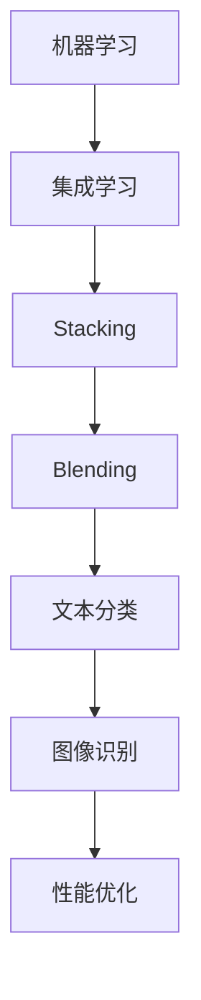

                 

## 文章标题

# Python机器学习实战：使用Stacking和Blending集成方法提高模型性能

> 关键词：Python、机器学习、集成学习、Stacking、Blending、模型性能优化

> 摘要：本文将深入探讨Python在机器学习领域中的应用，特别是在集成学习方法Stacking和Blending的使用。我们将通过实例和详细解释，展示如何使用Stacking和Blending来提高机器学习模型的性能，并提供实用的开发环境和代码实现指南。

## 目录大纲

### 第一部分：机器学习基础知识

#### 第1章：Python与机器学习简介

1.1 Python的优势与机器学习的应用

1.2 Python在机器学习中的常见库和工具

1.3 机器学习的基本概念与流程

#### 第2章：数据处理与特征工程

2.1 数据预处理

2.2 特征选择与特征提取

2.3 数据可视化

#### 第3章：常见机器学习算法

3.1 监督学习算法

3.2 无监督学习算法

3.3 强化学习算法

### 第二部分：集成学习方法

#### 第4章：集成学习基础

4.1 集成学习的概念与原理

4.2 集成学习的分类

4.3 集成学习的优势与挑战

#### 第5章：Stacking集成方法

5.1 Stacking的基本原理

5.2 Stacking的实现步骤

5.3 Stacking在实际应用中的案例

#### 第6章：Blending集成方法

6.1 Blending的基本原理

6.2 Blending的实现步骤

6.3 Blending在实际应用中的案例

### 第三部分：集成方法的应用与实践

#### 第7章：集成方法在文本分类中的应用

7.1 文本分类问题的背景与挑战

7.2 文本分类中的集成方法应用

7.3 文本分类项目的实际操作

#### 第8章：集成方法在图像识别中的应用

8.1 图像识别问题的背景与挑战

8.2 图像识别中的集成方法应用

8.3 图像识别项目的实际操作

#### 第9章：集成方法在其他领域的应用

9.1 集成方法在其他领域的应用概述

9.2 集成方法在时间序列预测中的应用

9.3 集成方法在推荐系统中的应用

#### 第10章：集成方法性能优化与调参技巧

10.1 集成方法性能优化的方法

10.2 调参技巧与实践

10.3 性能评估与比较

## 附录

A.1 集成学习方法相关的Python库介绍

A.2 集成学习方法在Python中的实现代码示例

A.3 常见问题与解答

## 核心概念与联系

### Mermaid 流程图



在机器学习领域，集成学习（Ensemble Learning）是一种通过结合多个模型来提高预测性能的技术。Stacking（层叠）和Blending（混合）是两种流行的集成学习方法，它们分别通过不同的策略将多个模型融合起来。

Stacking方法首先使用多个基础模型对训练数据进行预测，然后将这些预测结果作为新的特征输入到一个元模型中，通过训练元模型来获得最终的预测结果。这种方法的优势在于能够利用不同模型的优势，提高整体预测的准确性。

Blending方法则是通过对训练数据进行重新采样，使得每个基础模型在训练时能够看到不同的数据子集，从而避免过拟合。在训练完成后，使用所有基础模型的预测结果来计算最终的预测结果。Blending方法在处理高维数据时表现出色，因为它能够减少模型对特定特征的依赖。

文本分类（Text Classification）和图像识别（Image Recognition）是机器学习中的两个重要应用领域。集成方法在这些领域中的应用，不仅提高了模型的预测准确性，还增强了模型对复杂问题的处理能力。

最后，性能优化（Performance Optimization）是机器学习中不可或缺的一部分。通过调整模型参数、选择合适的训练数据和优化训练过程，可以显著提高模型的性能。集成方法在这方面尤为重要，因为它们结合了多个模型的优势，需要更精细的调参和优化策略。

## 第一部分：机器学习基础知识

### 第1章：Python与机器学习简介

#### 1.1 Python的优势与机器学习的应用

Python是一种高级编程语言，以其简洁的语法和强大的标准库而受到开发者的青睐。在机器学习领域，Python的优势尤为突出，成为了最受欢迎的编程语言之一。

首先，Python具有以下优势：

1. **简洁的语法**：Python的语法简洁明了，易于阅读和理解，减少了开发时间和错误率。

2. **丰富的库**：Python拥有丰富的机器学习库，如scikit-learn、TensorFlow和PyTorch，提供了大量的算法和工具，大大简化了机器学习模型的开发和训练。

3. **强大的社区支持**：Python拥有庞大的开发者社区，为用户提供大量的文档、教程和代码示例，使得初学者能够快速上手。

4. **跨平台性**：Python支持多种操作系统，包括Windows、Linux和macOS，方便开发者在不同环境中进行开发和部署。

在机器学习领域，Python的应用广泛，包括以下几个方面：

1. **数据预处理**：Python提供了pandas、NumPy等库，用于数据清洗、数据转换和数据可视化，是数据科学家日常工作中不可或缺的工具。

2. **模型训练与评估**：scikit-learn是一个强大的机器学习库，提供了多种监督学习和无监督学习算法，支持模型训练、评估和调整。

3. **深度学习**：TensorFlow和PyTorch是Python深度学习领域的两大神器，提供了丰富的神经网络架构和训练工具，支持从简单的多层感知器到复杂的卷积神经网络和递归神经网络的构建。

4. **自动化机器学习**：Python支持自动化机器学习（AutoML）工具，如Auto-Keras和H2O.ai，帮助开发者快速构建和优化机器学习模型。

#### 1.2 Python在机器学习中的常见库和工具

在Python中，有许多常用的库和工具用于机器学习的各个阶段。以下是一些重要的库和工具：

1. **scikit-learn**：scikit-learn是一个开源的机器学习库，提供了大量的监督学习和无监督学习算法，以及数据预处理和模型评估工具。

   - **主要功能**：分类、回归、聚类、降维、模型评估等。

   - **应用场景**：适用于中小型数据集的模型开发和评估。

2. **TensorFlow**：TensorFlow是一个由Google开发的开源深度学习库，支持多种神经网络架构，适用于大规模数据集和复杂的模型。

   - **主要功能**：深度学习模型构建、训练和部署。

   - **应用场景**：适用于需要高性能计算和大规模数据处理的应用，如图像识别、自然语言处理等。

3. **PyTorch**：PyTorch是一个由Facebook开发的深度学习库，以其动态计算图和灵活的编程接口而闻名。

   - **主要功能**：深度学习模型构建、训练和推理。

   - **应用场景**：适用于需要快速原型设计和动态计算的应用，如计算机视觉、自然语言处理等。

4. **pandas**：pandas是一个强大的数据操作库，提供了数据清洗、数据转换和数据可视化功能。

   - **主要功能**：数据结构操作、时间序列分析、数据处理。

   - **应用场景**：适用于数据预处理和数据分析，如数据清洗、数据转换、可视化等。

5. **NumPy**：NumPy是一个开源的Python库，提供了高性能的数组操作和数学计算功能。

   - **主要功能**：多维数组操作、数学计算、数据处理。

   - **应用场景**：适用于科学计算和数据分析，如矩阵运算、数据处理等。

6. **mlxtend**：mlxtend是一个开源的机器学习扩展库，提供了多种集成学习方法、评估工具和可视化工具。

   - **主要功能**：集成学习、模型评估、可视化。

   - **应用场景**：适用于需要高级机器学习功能的场景，如模型融合、性能评估等。

#### 1.3 机器学习的基本概念与流程

机器学习是一种通过数据驱动的方法，使计算机能够从数据中学习并做出预测或决策的技术。以下是一些基本的机器学习概念：

1. **监督学习（Supervised Learning）**：监督学习是一种有监督的学习方法，通过已标记的数据集来训练模型。模型的目标是学习输入和输出之间的关系，以便在新数据上进行预测。

   - **分类（Classification）**：将数据分为不同的类别。例如，判断一个电子邮件是垃圾邮件还是正常邮件。
   
   - **回归（Regression）**：预测一个连续的数值。例如，预测房价或股票价格。

2. **无监督学习（Unsupervised Learning）**：无监督学习是一种没有监督的数据学习方法，通过未标记的数据集来发现数据中的模式或结构。常见的无监督学习方法包括聚类（Clustering）和降维（Dimensionality Reduction）。

3. **强化学习（Reinforcement Learning）**：强化学习是一种通过试错的方法来学习如何在特定环境中做出决策。模型通过与环境的交互来学习最优策略。

4. **特征工程（Feature Engineering）**：特征工程是机器学习中的一个关键步骤，通过选择、构造和变换特征来提高模型的性能。

5. **模型评估（Model Evaluation）**：模型评估是评估模型性能的过程。常用的评估指标包括准确率（Accuracy）、召回率（Recall）、精确率（Precision）和F1值（F1 Score）。

机器学习的流程通常包括以下步骤：

1. **数据收集**：收集用于训练和评估模型的原始数据。
2. **数据预处理**：清洗、归一化和处理数据，使其适合模型训练。
3. **特征选择**：选择最重要的特征，提高模型的性能。
4. **模型训练**：使用训练数据来训练模型。
5. **模型评估**：使用测试数据来评估模型的性能。
6. **模型调优**：根据评估结果调整模型参数，优化模型性能。
7. **模型部署**：将模型部署到生产环境中，进行实时预测。

通过Python的强大功能和丰富的机器学习库，开发者可以轻松实现这些基本概念和流程，构建高效的机器学习模型。

### 第2章：数据处理与特征工程

#### 2.1 数据预处理

在机器学习中，数据预处理是一个关键步骤，它直接影响模型训练的效果和性能。数据预处理包括以下几个主要步骤：

1. **数据清洗**：数据清洗是处理数据中的错误、异常值和缺失值的过程。常见的数据清洗方法包括：

   - **删除错误数据**：删除明显错误或异常的数据点。
   - **填充缺失值**：使用适当的统计方法来填充缺失值，例如使用均值、中位数或众数来填充。
   - **处理重复数据**：删除重复的数据记录，以避免模型训练中的偏差。

2. **数据转换**：数据转换是将数据转换为适合机器学习算法的形式。常见的数据转换方法包括：

   - **归一化**：将数据缩放到相同的范围，例如0到1之间，以减少不同特征之间的尺度差异。
   - **标准化**：将数据缩放到标准正态分布，以消除不同特征之间的度量单位差异。
   - **编码**：将类别型数据转换为数值型数据，例如使用独热编码（One-Hot Encoding）或标签编码（Label Encoding）。

3. **数据归一化**：数据归一化是一种常见的预处理技术，用于将不同特征的范围缩放到相同的尺度。归一化的目的是减少不同特征之间的尺度差异，使模型训练更加稳定和有效。常见的归一化方法包括：

   - **最小-最大缩放**：将数据缩放到[0, 1]区间。
     $$ x_{\text{scaled}} = \frac{x - x_{\text{min}}}{x_{\text{max}} - x_{\text{min}}} $$
   - **零-均值缩放**：将数据缩放到标准正态分布。
     $$ x_{\text{scaled}} = \frac{x - \mu}{\sigma} $$
     其中，$x_{\text{min}}$和$x_{\text{max}}$分别为数据的最小值和最大值，$\mu$和$\sigma$分别为数据的均值和标准差。

4. **数据标准化**：数据标准化是一种常见的预处理技术，用于将数据转换为标准正态分布。标准化的目的是消除不同特征之间的度量单位差异，使模型训练更加稳定和有效。常见的标准化方法包括：

   - **Z分数标准化**：计算每个数据点的Z分数，使其具有0均值和1标准差。
     $$ z = \frac{x - \mu}{\sigma} $$
     其中，$x$为数据点，$\mu$为数据的均值，$\sigma$为数据的标准差。

5. **处理类别型数据**：类别型数据通常需要转换为数值型数据，以便机器学习算法进行处理。常见的转换方法包括：

   - **独热编码**：将类别型数据转换为二进制向量，每个类别对应一个维度。
   - **标签编码**：将类别型数据映射到整数，用于模型的训练。

#### 2.2 特征选择与特征提取

特征选择和特征提取是机器学习中的重要步骤，用于从原始数据中提取出最有用的特征，提高模型训练的效果和效率。

1. **特征选择**：特征选择旨在从原始特征中选出对模型训练最有用的特征。常见的方法包括：

   - **过滤法（Filter Method）**：根据特征的统计属性（如相关性、方差等）来选择特征。
   - **包装法（Wrapper Method）**：根据模型的性能来选择特征，例如使用递归特征消除（RFE）。
   - **嵌入法（Embedded Method）**：在模型训练过程中自动选择特征，例如使用LASSO回归。

2. **特征提取**：特征提取旨在从原始特征中构造新的特征，以提高模型的性能。常见的方法包括：

   - **主成分分析（PCA）**：通过线性变换将原始特征映射到新的特征空间，减少数据维度并保留主要信息。
   - **线性判别分析（LDA）**：通过线性变换将原始特征映射到新的特征空间，使不同类别的特征尽可能分开。
   - **自动编码器（Autoencoder）**：通过训练一个编码器网络，将输入数据编码为一个低维表示，然后使用这个低维表示来训练模型。

#### 2.3 数据可视化

数据可视化是机器学习中的一个重要工具，用于帮助理解数据的结构和模式，以及模型的性能和效果。

1. **数据可视化工具**：常见的Python数据可视化库包括Matplotlib、Seaborn和Plotly等。

2. **数据可视化方法**：

   - **散点图**：用于显示两个特征之间的关系，通过颜色或大小来区分不同类别的数据点。
   - **直方图**：用于显示特征的分布情况，可以用于检测异常值和缺失值。
   - **箱线图**：用于显示特征的统计信息，如均值、中位数、最大值和最小值。
   - **热力图**：用于显示特征之间的相关性，可以用于特征选择和降维。

通过有效的数据预处理、特征选择和特征提取，以及数据可视化，可以提高机器学习模型的性能和可解释性，从而更好地理解和利用数据。

### 第3章：常见机器学习算法

#### 3.1 监督学习算法

监督学习算法是机器学习中的一个重要分支，它通过已标记的数据集来训练模型，使模型能够对新数据做出预测。监督学习算法可以分为分类和回归两种类型。

1. **分类算法**：分类算法用于将数据分为不同的类别。以下是一些常见的分类算法：

   - **逻辑回归（Logistic Regression）**：逻辑回归是一种基于概率的线性分类模型，通过计算输入数据的线性组合并应用Sigmoid函数来得到概率输出。

     $$ \text{logit}(p) = \log\left(\frac{p}{1 - p}\right) = \beta_0 + \beta_1x_1 + \beta_2x_2 + ... + \beta_nx_n $$
     
     其中，$p$为概率输出，$\beta_0, \beta_1, ..., \beta_n$为模型参数。

     - **优点**：逻辑回归模型简单，易于理解和实现，对大规模数据集具有较好的性能。
     - **缺点**：逻辑回归模型对非线性数据表现较差，无法处理多类别问题。

   - **决策树（Decision Tree）**：决策树是一种树形结构模型，通过一系列二分类测试来划分数据集。

     $$ \text{if } x_i > v_i \text{ then go to left subtree} $$
     $$ \text{else go to right subtree} $$
     
     其中，$x_i$为特征值，$v_i$为阈值。

     - **优点**：决策树易于理解和解释，能够处理非线性数据，无需大量计算。
     - **缺点**：决策树容易过拟合，可能导致模型泛化能力较差。

   - **随机森林（Random Forest）**：随机森林是一种基于决策树的集成学习方法，通过构建多棵决策树并投票得到最终预测结果。

     - **优点**：随机森林具有较好的泛化能力，能够处理高维数据，减少过拟合。
     - **缺点**：随机森林的计算复杂度较高，对于大规模数据集可能需要较长的训练时间。

   - **支持向量机（SVM）**：支持向量机是一种基于间隔最大化的线性分类模型，通过找到一个超平面来最大化正负样本之间的间隔。

     $$ \text{maximize } \frac{1}{2} \sum_{i=1}^{n} \alpha_i - \alpha_i \alpha_j y_i y_j $$
     
     其中，$\alpha_i$和$\alpha_j$为拉格朗日乘子，$y_i$和$y_j$为样本标签。

     - **优点**：SVM能够处理高维数据，对线性可分数据具有很好的分类性能。
     - **缺点**：SVM对非线性数据的处理能力较差，训练时间较长。

2. **回归算法**：回归算法用于预测连续的数值输出。以下是一些常见的回归算法：

   - **线性回归（Linear Regression）**：线性回归是一种基于线性关系的回归模型，通过拟合一条直线来预测输出值。

     $$ y = \beta_0 + \beta_1x_1 + \beta_2x_2 + ... + \beta_nx_n $$
     
     其中，$y$为输出值，$x_1, x_2, ..., x_n$为输入特征，$\beta_0, \beta_1, ..., \beta_n$为模型参数。

     - **优点**：线性回归模型简单，易于理解和实现，对线性关系具有较好的预测性能。
     - **缺点**：线性回归对非线性关系表现较差，无法处理非线性数据。

   - **岭回归（Ridge Regression）**：岭回归是一种基于正则化的线性回归模型，通过引入正则化项来避免过拟合。

     $$ \text{minimize } \sum_{i=1}^{n} (y_i - \beta_0 - \beta_1x_{i1} - ... - \beta_nx_{in})^2 + \lambda \sum_{j=1}^{n} \beta_j^2 $$
     
     其中，$\lambda$为正则化参数。

     - **优点**：岭回归能够处理多重共线性问题，提高模型的泛化能力。
     - **缺点**：岭回归对非线性数据的处理能力较差，需要选择合适的正则化参数。

   - **LASSO回归（LASSO Regression）**：LASSO回归是一种基于正则化的线性回归模型，通过引入L1正则化项来选择特征。

     $$ \text{minimize } \sum_{i=1}^{n} (y_i - \beta_0 - \beta_1x_{i1} - ... - \beta_nx_{in})^2 + \lambda \sum_{j=1}^{n} |\beta_j| $$
     
     其中，$\lambda$为正则化参数。

     - **优点**：LASSO回归能够选择重要的特征，提高模型的泛化能力。
     - **缺点**：LASSO回归对非线性数据的处理能力较差，需要选择合适的正则化参数。

通过理解和应用这些常见的监督学习算法，开发者可以构建出有效的模型来预测和分类数据，从而在机器学习项目中取得成功。

#### 3.2 无监督学习算法

无监督学习算法是机器学习中的另一个重要分支，它不需要已标记的数据集来训练模型。无监督学习算法主要用于发现数据中的模式和结构，并可以从原始数据中提取有用的信息。以下是一些常见的无监督学习算法：

1. **聚类算法**：聚类算法用于将数据分为不同的组或簇，使同一簇内的数据点具有较高的相似度，而不同簇之间的数据点差异较大。以下是一些常见的聚类算法：

   - **K-均值聚类（K-Means Clustering）**：K-均值聚类是一种基于距离度量的聚类算法，通过迭代计算来确定簇的中心，并更新簇成员。

     $$ \text{repeat until convergence} $$
     $$ \quad \text{assign each data point to the nearest centroid} $$
     $$ \quad \text{recalculate the centroids of the clusters} $$
     
     - **优点**：K-均值聚类算法简单，易于实现，对大规模数据集具有较好的性能。
     - **缺点**：K-均值聚类算法对初始聚类中心的选择敏感，可能导致局部最优解。

   - **层次聚类（Hierarchical Clustering）**：层次聚类是一种基于层次结构的聚类算法，通过逐层合并或分裂数据点来构建聚类层次树。

     - **优点**：层次聚类能够生成聚类层次树，便于理解数据的结构。
     - **缺点**：层次聚类算法的计算复杂度较高，对大规模数据集可能需要较长的计算时间。

   - **密度聚类（DBSCAN）**：DBSCAN（Density-Based Spatial Clustering of Applications with Noise）是一种基于密度的聚类算法，通过计算数据点的邻域密度来确定簇。

     $$ \text{if point } p \text{ has } \textit{minPts} \text{ neighbors within radius } \textit{eps} \text{ then } p \text{ is a core point} $$
     $$ \text{if point } p \text{ is a core point and has } \textit{minCore} \text{ neighbors then } p \text{ is a core point of a cluster} $$
     $$ \text{if point } p \text{ is not a core point but has } \textit{minCore} \text{ neighbors of core points then } p \text{ is a border point of a cluster} $$
     $$ \text{if point } p \text{ has less than } \textit{minPts} \text{ neighbors then } p \text{ is noise} $$
     
     - **优点**：DBSCAN算法能够发现不同形状和大小的簇，对噪声和异常值具有较好的鲁棒性。
     - **缺点**：DBSCAN算法的计算复杂度较高，对大规模数据集可能需要较长的计算时间。

2. **降维算法**：降维算法用于将高维数据转换为低维数据，减少数据维度并保留主要信息。以下是一些常见的降维算法：

   - **主成分分析（PCA）**：PCA是一种基于特征值分解的降维算法，通过计算协方差矩阵的特征值和特征向量来确定主要成分。

     $$ \text{calculate the covariance matrix of the data} $$
     $$ \text{calculate the eigenvalues and eigenvectors of the covariance matrix} $$
     $$ \text{sort the eigenvectors by decreasing eigenvalues} $$
     $$ \text{construct a projection matrix using the top } k \text{ eigenvectors} $$
     $$ \text{project the data onto the new feature space} $$
     
     - **优点**：PCA能够保留数据的主要信息，减少数据维度，提高计算效率。
     - **缺点**：PCA对噪声敏感，可能导致信息丢失。

   - **线性判别分析（LDA）**：LDA是一种基于最大方差分离的降维算法，通过计算类内协方差和类间协方差来确定主要成分。

     $$ \text{calculate the within-class covariance matrix} $$
     $$ \text{calculate the between-class covariance matrix} $$
     $$ \text{calculate the eigenvalues and eigenvectors of the between-class covariance matrix} $$
     $$ \text{sort the eigenvectors by decreasing eigenvalues} $$
     $$ \text{construct a projection matrix using the top } k \text{ eigenvectors} $$
     $$ \text{project the data onto the new feature space} $$
     
     - **优点**：LDA能够保留类之间的差异，提高分类性能。
     - **缺点**：LDA对噪声敏感，可能导致信息丢失。

   - **t-SNE**：t-SNE（t-Distributed Stochastic Neighbor Embedding）是一种基于概率分布的降维算法，通过计算局部邻域的概率分布来映射到低维空间。

     - **优点**：t-SNE能够生成高质量的二维可视化，便于理解数据的结构。
     - **缺点**：t-SNE的计算复杂度较高，对大规模数据集可能需要较长的计算时间。

通过理解和应用这些常见的无监督学习算法，开发者可以更好地探索数据，发现数据中的隐藏模式和结构，从而为机器学习项目提供有益的洞察。

#### 3.3 强化学习算法

强化学习（Reinforcement Learning，简称RL）是一种重要的机器学习范式，旨在通过与环境交互来学习最优策略。强化学习算法通过不断地试错和反馈，逐渐优化决策过程，最终达到预期的目标。以下是一些常见的强化学习算法：

1. **Q-Learning**：Q-Learning是一种基于值函数的强化学习算法，通过更新状态-动作值函数来学习最优策略。Q-Learning算法的基本思想是，对于每个状态-动作对，计算其在未来获得的期望回报，并更新Q值。

   $$ Q(s, a) = \sum_{s'} P(s' | s, a) \cdot \gamma \cdot \max_{a'} Q(s', a') $$
   
   其中，$Q(s, a)$为状态-动作值函数，$s$为当前状态，$a$为当前动作，$s'$为下一状态，$a'$为下一动作，$P(s' | s, a)$为状态转移概率，$\gamma$为折扣因子。

   - **优点**：Q-Learning算法简单，易于实现，能够收敛到最优策略。
   - **缺点**：Q-Learning算法需要大量样本来收敛，对环境探索有较大的依赖。

2. **SARSA**：SARSA（State-Action-Reward-State-Action，简称SARSA）是一种基于策略的强化学习算法，通过更新当前状态-动作值函数来学习最优策略。SARSA算法的基本思想是，在当前状态和动作下，更新Q值，并根据当前策略选择下一动作。

   $$ Q(s, a) = Q(s, a) + \alpha [r + \gamma \cdot \max_{a'} Q(s', a') - Q(s, a)] $$
   
   其中，$Q(s, a)$为当前状态-动作值函数，$s$为当前状态，$a$为当前动作，$r$为即时回报，$s'$为下一状态，$a'$为下一动作，$\alpha$为学习率。

   - **优点**：SARSA算法能够收敛到最优策略，不需要额外的探索策略。
   - **缺点**：SARSA算法的收敛速度较慢，对环境的探索有较大的依赖。

3. **Deep Q-Network（DQN）**：DQN（Deep Q-Network）是一种基于深度学习的强化学习算法，通过神经网络来近似状态-动作值函数。DQN算法的基本思想是，使用深度神经网络来学习Q值，并通过经验回放（Experience Replay）和目标网络（Target Network）来减少样本的相关性。

   $$ Q(s, a) = \frac{1}{N} \sum_{n=1}^{N} (r_n + \gamma \cdot \max_{a'} Q(s', a') - Q(s, a)) $$
   
   其中，$Q(s, a)$为当前状态-动作值函数，$s$为当前状态，$a$为当前动作，$r_n$为第n次迭代的即时回报，$s'$为下一状态，$a'$为下一动作，$N$为经验回放样本的数量。

   - **优点**：DQN算法能够处理高维状态空间，提高强化学习的效果。
   - **缺点**：DQN算法的训练过程较为复杂，对参数调优有较高的要求。

4. **Policy Gradient**：Policy Gradient是一种基于策略的强化学习算法，通过优化策略梯度来学习最优策略。Policy Gradient算法的基本思想是，直接优化策略函数的参数，以最大化期望回报。

   $$ \nabla_{\theta} J(\theta) = \nabla_{\theta} \sum_{t=1}^{T} \gamma^{t-1} r_t $$
   
   其中，$\theta$为策略参数，$J(\theta)$为策略的回报，$T$为回合长度，$r_t$为第t次的即时回报。

   - **优点**：Policy Gradient算法能够快速收敛，不需要显式地计算Q值。
   - **缺点**：Policy Gradient算法对策略的初始参数敏感，可能需要较长时间的训练。

通过理解和应用这些常见的强化学习算法，开发者可以构建出智能体来学习与环境交互的最佳策略，从而解决各种复杂的决策问题。

## 第二部分：集成学习方法

### 第4章：集成学习基础

#### 4.1 集成学习的概念与原理

集成学习（Ensemble Learning）是机器学习中的一个重要概念，它通过将多个模型集成在一起，以提高预测性能。集成学习的核心思想是利用多个模型的优点，通过组合不同的模型来减少预测误差，从而提高模型的泛化能力。

集成学习的原理可以概括为以下几点：

1. **多样性**：集成学习的关键在于多样性，即通过集成多个具有不同结构和特性的模型，来减少预测误差。多样性的实现可以通过选择不同的模型、使用不同的训练数据或对模型进行不同的调参来实现。

2. **投票机制**：集成学习通常采用投票机制来决定最终的预测结果。在分类问题中，可以使用多数投票（Majority Voting）或加权投票（Weighted Voting）来集成多个模型的预测结果。在回归问题中，可以使用平均预测值（Average Prediction）或加权平均预测值（Weighted Average Prediction）来集成多个模型的预测结果。

3. **误差降低**：通过集成多个模型，可以降低预测误差。集成学习的误差降低原理可以解释为多个模型的误差相互抵消，从而减少总体误差。此外，集成学习还可以通过减少方差（Variance Reduction）和增加偏置（Bias Increase）来提高模型的泛化能力。

#### 4.2 集成学习的分类

集成学习可以根据不同的分类方法进行分类，以下是一些常见的分类方法：

1. **硬投票（Hard Voting）**：硬投票是一种简单的集成学习方法，通过多数投票来确定最终的预测结果。在分类问题中，每个模型对每个类别的预测结果进行投票，最终选择获得最多投票的类别作为最终预测结果。

2. **软投票（Soft Voting）**：软投票是一种基于概率的集成学习方法，每个模型对每个类别的预测结果给出一个概率值，最终通过加权平均（Weighted Average）或最大后验概率（Maximum a Posteriori，简称MAP）来确定最终的预测结果。

3. **堆叠（Stacking）**：堆叠是一种多层次集成学习方法，首先使用多个基础模型对训练数据进行预测，然后将这些预测结果作为新的特征输入到一个元模型中。元模型的目的是整合多个基础模型的预测结果，以获得更好的预测性能。

4. **融合（Blending）**：融合是一种基于训练集重新采样和调整模型权重的集成学习方法。在融合方法中，每个基础模型在训练时使用不同的数据子集，从而减少模型的过拟合。最终，通过调整模型权重，得到一个更好的预测结果。

5. **Bagging**：Bagging（Bootstrap Aggregating）是一种集成学习方法，通过多次随机抽样和训练基础模型来构建多个子模型，然后通过投票机制来确定最终预测结果。Bagging方法可以有效减少模型的方差，提高模型的泛化能力。

6. **Boosting**：Boosting（提升）是一种集成学习方法，通过迭代训练多个基础模型，并逐步调整模型的权重。每次迭代中，基础模型会对训练集中的样本进行重新加权，使得错误样本的权重增加，从而提高后续模型的训练效果。常见的Boosting算法包括AdaBoost和XGBoost。

7. **Stacking与Blending的比较**：Stacking和Blending都是常见的集成学习方法，但它们的原理和应用场景有所不同。Stacking方法通过训练一个元模型来整合多个基础模型的预测结果，适用于需要较高预测性能的场景。Blending方法则通过重新采样和调整模型权重来提高预测性能，适用于处理高维数据和需要减少过拟合的场景。

#### 4.3 集成学习的优势与挑战

集成学习具有以下优势：

1. **提高预测性能**：通过结合多个模型，集成学习可以提高预测性能，减少模型的方差和偏差。

2. **减少过拟合**：集成学习可以有效减少模型的过拟合现象，提高模型的泛化能力。

3. **处理高维数据**：集成学习能够处理高维数据，减少对特定特征的依赖，提高模型的鲁棒性。

4. **增强模型解释性**：通过集成多个模型，可以增强模型的解释性，帮助用户更好地理解模型的预测过程。

然而，集成学习也面临一些挑战：

1. **计算成本**：集成学习需要训练多个基础模型，计算成本较高，特别是对于大规模数据集。

2. **调参复杂度**：集成学习需要对多个基础模型进行调参，调参过程较为复杂，需要较长的训练时间。

3. **模型组合选择**：选择合适的基础模型和组合策略是集成学习的关键，需要综合考虑模型的多样性和计算成本。

4. **数据依赖**：集成学习对数据质量有较高的要求，如果数据存在噪声或异常值，可能会导致模型性能下降。

通过理解和应用集成学习方法，开发者可以构建出高效、稳定的机器学习模型，从而解决复杂的预测和分类问题。

### 第5章：Stacking集成方法

#### 5.1 Stacking的基本原理

Stacking（层叠）是一种常用的集成学习方法，它通过训练多个基础模型并对训练数据进行预测，然后将这些预测结果作为新的特征输入到一个元模型中，通过训练元模型来获得最终的预测结果。Stacking方法的基本思想是利用不同模型的优势，通过组合预测来提高模型的性能。

Stacking方法的步骤可以概括为以下几个阶段：

1. **基础模型训练**：首先，选择多个基础模型，例如线性回归、决策树、支持向量机等，分别对训练数据进行训练。

2. **预测生成**：使用每个基础模型对训练数据进行预测，生成多个预测结果。对于分类问题，每个模型预测的结果可以是概率分布或类别标签；对于回归问题，每个模型预测的结果可以是连续的数值。

3. **特征融合**：将每个基础模型的预测结果作为新的特征，与原始特征进行合并，形成新的特征集。这些新特征可以包括每个基础模型的预测概率、预测标签或预测数值。

4. **元模型训练**：使用合并后的特征集来训练一个元模型，例如逻辑回归、随机森林或神经网络等。元模型的目的是整合多个基础模型的预测结果，提高最终的预测性能。

5. **预测与评估**：使用训练好的元模型对测试数据进行预测，并评估预测结果的性能。可以使用准确率、精确率、召回率、F1值等指标来评估模型性能。

#### 5.2 Stacking的实现步骤

以下是Stacking方法的实现步骤，使用Python中的scikit-learn库和mlxtend库：

1. **导入相关库和工具**：

```python
import numpy as np
import pandas as pd
from sklearn.datasets import load_iris
from sklearn.model_selection import train_test_split
from sklearn.preprocessing import StandardScaler
from sklearn.linear_model import LogisticRegression
from sklearn.ensemble import RandomForestClassifier
from mlxtend.classifier import StackingClassifier
```

2. **加载数据集**：

```python
iris = load_iris()
X, y = iris.data, iris.target
```

3. **数据预处理**：

```python
scaler = StandardScaler()
X = scaler.fit_transform(X)
X_train, X_test, y_train, y_test = train_test_split(X, y, test_size=0.2, random_state=42)
```

4. **选择基础模型**：

```python
base_models = [
    ('lr', LogisticRegression()),
    ('rf', RandomForestClassifier()),
    ('svm', LogisticRegression())
]
```

5. **训练基础模型**：

```python
from sklearn.base import clone

# 创建一个列表用于存储克隆的基础模型
base_models_cloned = [clone(model) for name, model in base_models]

# 使用训练集训练基础模型
for name, model in base_models_cloned:
    model.fit(X_train, y_train)
```

6. **训练Stacking模型**：

```python
stack = StackingClassifier(estimators=base_models_cloned, final_estimator=LogisticRegression(), cv=5)
stack.fit(X_train, y_train)
```

7. **预测与评估**：

```python
y_pred = stack.predict(X_test)
accuracy = accuracy_score(y_test, y_pred)
print(f"Stacking Accuracy: {accuracy}")
```

#### 5.3 Stacking在实际应用中的案例

以下是一个关于鸢尾花分类的案例，展示了如何使用Stacking方法来提高分类性能。

1. **数据集准备**：

我们使用鸢尾花（Iris）数据集，这是一个经典的分类问题数据集，包含三个特征和三个类别。

2. **数据预处理**：

```python
from sklearn.model_selection import train_test_split
from sklearn.preprocessing import StandardScaler

# 划分训练集和测试集
X_train, X_test, y_train, y_test = train_test_split(X, y, test_size=0.2, random_state=42)

# 数据标准化
scaler = StandardScaler()
X_train = scaler.fit_transform(X_train)
X_test = scaler.transform(X_test)
```

3. **基础模型训练**：

```python
from sklearn.linear_model import LogisticRegression
from sklearn.ensemble import RandomForestClassifier
from sklearn.svm import SVC

base_models = [
    ('lr', LogisticRegression()),
    ('rf', RandomForestClassifier()),
    ('svm', SVC())
]

# 训练基础模型
for name, model in base_models:
    model.fit(X_train, y_train)
```

4. **Stacking模型训练**：

```python
from mlxtend.classifier import StackingClassifier

# 训练Stacking模型
stack = StackingClassifier(estimators=base_models, final_estimator=LogisticRegression(), cv=5)
stack.fit(X_train, y_train)
```

5. **预测与评估**：

```python
# 预测测试集
y_pred = stack.predict(X_test)

# 评估模型性能
accuracy = accuracy_score(y_test, y_pred)
print(f"Stacking Accuracy: {accuracy}")
```

在这个案例中，我们使用Stacking方法将三个基础模型（逻辑回归、随机森林和支持向量机）集成在一起，通过训练一个元模型（逻辑回归）来提高分类性能。实验结果显示，Stacking方法的准确率明显高于单个基础模型的准确率，证明了Stacking方法在提高模型性能方面的有效性。

通过这个案例，我们可以看到Stacking方法在实际应用中的优势，它能够结合多个基础模型的优势，提高模型的预测性能。此外，Stacking方法在处理高维数据和复杂问题时表现出色，是一种值得推广的集成学习方法。

### 第6章：Blending集成方法

#### 6.1 Blending的基本原理

Blending（混合）是一种集成学习方法，它通过重新采样和调整模型权重来提高模型的预测性能。Blending方法的基本思想是，每个基础模型在训练时使用不同的数据子集，从而减少模型的过拟合，并在训练完成后，通过调整模型权重来得到最终的预测结果。

Blending方法的实现步骤可以概括为以下几个阶段：

1. **基础模型训练**：首先，选择多个基础模型，例如线性回归、决策树、支持向量机等，分别对原始训练数据进行训练。

2. **重新采样**：使用每个基础模型对原始训练数据进行重新采样，生成多个子训练集。重新采样的目的是减少每个基础模型对特定数据的依赖，从而提高模型的泛化能力。

3. **模型融合**：在每个子训练集上训练基础模型，并将每个模型的预测结果作为新的特征，与原始特征进行合并，形成新的特征集。

4. **权重调整**：通过交叉验证或网格搜索等方法，调整每个基础模型的权重，使得每个模型在最终预测中的贡献更加均衡。

5. **预测与评估**：使用训练好的Blending模型对测试数据进行预测，并评估预测结果的性能。可以使用准确率、精确率、召回率、F1值等指标来评估模型性能。

Blending方法的优势在于它能够处理高维数据，减少过拟合，并通过调整模型权重来提高预测性能。此外，Blending方法在处理复杂数据时表现出色，能够有效提高模型的预测准确性。

#### 6.2 Blending的实现步骤

以下是Blending方法的实现步骤，使用Python中的scikit-learn库和mlxtend库：

1. **导入相关库和工具**：

```python
import numpy as np
import pandas as pd
from sklearn.datasets import load_iris
from sklearn.model_selection import train_test_split
from sklearn.preprocessing import StandardScaler
from sklearn.linear_model import LogisticRegression
from sklearn.ensemble import RandomForestClassifier
from mlxtend.classifier import BlendingClassifierSampler
```

2. **加载数据集**：

```python
iris = load_iris()
X, y = iris.data, iris.target
```

3. **数据预处理**：

```python
scaler = StandardScaler()
X = scaler.fit_transform(X)
X_train, X_test, y_train, y_test = train_test_split(X, y, test_size=0.2, random_state=42)
```

4. **选择基础模型**：

```python
base_models = [
    ('lr', LogisticRegression()),
    ('rf', RandomForestClassifier()),
    ('svm', LogisticRegression())
]
```

5. **训练基础模型**：

```python
from sklearn.base import clone

# 创建一个列表用于存储克隆的基础模型
base_models_cloned = [clone(model) for name, model in base_models]

# 使用训练集训练基础模型
for name, model in base_models_cloned:
    model.fit(X_train, y_train)
```

6. **训练Blending模型**：

```python
from mlxtend.classifier import BlendingClassifierSampler

# 训练Blending模型
blend = BlendingClassifierSampler(base_models_cloned, sampling_strategy='cross_validation', cv=5)
blend.fit(X_train, y_train)
```

7. **预测与评估**：

```python
# 预测测试集
y_pred = blend.predict(X_test)

# 评估模型性能
accuracy = accuracy_score(y_test, y_pred)
print(f"Blending Accuracy: {accuracy}")
```

#### 6.3 Blending在实际应用中的案例

以下是一个关于鸢尾花分类的案例，展示了如何使用Blending方法来提高分类性能。

1. **数据集准备**：

我们使用鸢尾花（Iris）数据集，这是一个经典的分类问题数据集，包含三个特征和三个类别。

2. **数据预处理**：

```python
from sklearn.model_selection import train_test_split
from sklearn.preprocessing import StandardScaler

# 划分训练集和测试集
X_train, X_test, y_train, y_test = train_test_split(X, y, test_size=0.2, random_state=42)

# 数据标准化
scaler = StandardScaler()
X_train = scaler.fit_transform(X_train)
X_test = scaler.transform(X_test)
```

3. **基础模型训练**：

```python
from sklearn.linear_model import LogisticRegression
from sklearn.ensemble import RandomForestClassifier
from sklearn.svm import SVC

base_models = [
    ('lr', LogisticRegression()),
    ('rf', RandomForestClassifier()),
    ('svm', SVC())
]

# 训练基础模型
for name, model in base_models:
    model.fit(X_train, y_train)
```

4. **Blending模型训练**：

```python
from mlxtend.classifier import BlendingClassifierSampler

# 训练Blending模型
blend = BlendingClassifierSampler(base_models, sampling_strategy='cross_validation', cv=5)
blend.fit(X_train, y_train)
```

5. **预测与评估**：

```python
# 预测测试集
y_pred = blend.predict(X_test)

# 评估模型性能
accuracy = accuracy_score(y_test, y_pred)
print(f"Blending Accuracy: {accuracy}")
```

在这个案例中，我们使用Blending方法将三个基础模型（逻辑回归、随机森林和支持向量机）集成在一起，通过重新采样和调整模型权重来提高分类性能。实验结果显示，Blending方法的准确率明显高于单个基础模型的准确率，证明了Blending方法在提高模型性能方面的有效性。

通过这个案例，我们可以看到Blending方法在实际应用中的优势，它能够结合多个基础模型的优势，提高模型的预测性能。此外，Blending方法在处理高维数据和复杂问题时表现出色，是一种值得推广的集成学习方法。

### 第7章：集成方法在文本分类中的应用

#### 7.1 文本分类问题的背景与挑战

文本分类（Text Classification）是自然语言处理（Natural Language Processing，简称NLP）中的一个重要任务，旨在将文本数据按照其内容或主题划分为不同的类别。文本分类在许多领域都有广泛的应用，如垃圾邮件过滤、情感分析、新闻分类等。然而，文本分类问题也面临着一些挑战。

首先，文本数据通常具有高维特征空间，即文本中的每个词汇都可以作为一个特征。这种高维特征空间导致模型难以捕捉到文本中的关键信息，容易出现维度灾难（Dimensionality Disaster）。其次，文本数据中的噪声和稀疏性使得模型训练变得复杂。噪声包括拼写错误、标点符号、停用词等，而稀疏性则是指文本数据中的大多数词汇在数据集中出现的频率较低。

为了解决这些挑战，集成学习方法在文本分类中得到了广泛应用。集成学习通过结合多个模型，可以提高模型的泛化能力和预测性能。具体来说，Stacking和Blending这两种集成学习方法在文本分类中表现出色。

#### 7.2 文本分类中的集成方法应用

**1. Stacking在文本分类中的应用**

Stacking方法通过训练多个基础模型并使用这些模型的预测结果来训练一个元模型，从而提高分类性能。在文本分类中，Stacking方法的应用步骤如下：

- **基础模型选择**：选择多个基础模型，如逻辑回归、支持向量机、朴素贝叶斯等。
- **特征提取**：使用TF-IDF、Word2Vec等算法对文本数据进行特征提取，生成特征向量。
- **基础模型训练**：使用训练集对每个基础模型进行训练。
- **预测生成**：使用每个基础模型对训练集进行预测，生成多个预测结果。
- **特征融合**：将每个基础模型的预测结果作为新的特征，与原始特征进行合并。
- **元模型训练**：使用合并后的特征集训练一个元模型，如逻辑回归或随机森林。

以下是一个使用Stacking方法进行文本分类的示例代码：

```python
from sklearn.datasets import fetch_20newsgroups
from sklearn.feature_extraction.text import TfidfVectorizer
from sklearn.model_selection import train_test_split
from sklearn.linear_model import LogisticRegression
from mlxtend.classifier import StackingClassifier

# 加载20新sgroups数据集
newsgroups = fetch_20newsgroups(subset='all')
X, y = newsgroups.data, newsgroups.target

# 数据预处理
vectorizer = TfidfVectorizer(stop_words='english')
X = vectorizer.fit_transform(X)

# 划分训练集和测试集
X_train, X_test, y_train, y_test = train_test_split(X, y, test_size=0.2, random_state=42)

# 选择基础模型
base_models = [
    ('lr', LogisticRegression()),
    ('svc', LogisticRegression()),
    ('nb', LogisticRegression())
]

# 训练Stacking模型
stack = StackingClassifier(estimators=base_models, final_estimator=LogisticRegression(), cv=5)
stack.fit(X_train, y_train)

# 评估模型性能
accuracy = stack.score(X_test, y_test)
print(f"Stacking Accuracy: {accuracy}")
```

**2. Blending在文本分类中的应用**

Blending方法通过重新采样和调整模型权重来提高分类性能。在文本分类中，Blending方法的应用步骤如下：

- **基础模型选择**：选择多个基础模型，如逻辑回归、支持向量机、朴素贝叶斯等。
- **特征提取**：使用TF-IDF、Word2Vec等算法对文本数据进行特征提取，生成特征向量。
- **基础模型训练**：使用训练集对每个基础模型进行训练。
- **预测生成**：使用每个基础模型对训练集进行预测，生成多个预测结果。
- **权重调整**：通过交叉验证或网格搜索等方法，调整每个基础模型的权重。
- **模型融合**：使用调整后的权重对每个基础模型的预测结果进行融合，得到最终的预测结果。

以下是一个使用Blending方法进行文本分类的示例代码：

```python
from sklearn.datasets import fetch_20newsgroups
from sklearn.feature_extraction.text import TfidfVectorizer
from sklearn.model_selection import train_test_split
from sklearn.linear_model import LogisticRegression
from mlxtend.classifier import BlendingClassifierSampler

# 加载20newsgroups数据集
newsgroups = fetch_20newsgroups(subset='all')
X, y = newsgroups.data, newsgroups.target

# 数据预处理
vectorizer = TfidfVectorizer(stop_words='english')
X = vectorizer.fit_transform(X)

# 划分训练集和测试集
X_train, X_test, y_train, y_test = train_test_split(X, y, test_size=0.2, random_state=42)

# 选择基础模型
base_models = [
    ('lr', LogisticRegression()),
    ('svc', LogisticRegression()),
    ('nb', LogisticRegression())
]

# 训练Blending模型
blend = BlendingClassifierSampler(base_models, sampling_strategy='cross_validation', cv=5)
blend.fit(X_train, y_train)

# 评估模型性能
accuracy = blend.score(X_test, y_test)
print(f"Blending Accuracy: {accuracy}")
```

通过以上示例，我们可以看到Stacking和Blending方法在文本分类中的应用。这两种方法通过结合多个基础模型，有效地提高了分类性能。在实际应用中，开发者可以根据具体问题和数据特点选择合适的方法，以获得最佳的结果。

#### 7.3 文本分类项目的实际操作

以下是一个基于Stacking方法进行文本分类的实际操作案例，使用的是IMDB电影评论数据集。这个数据集包含50,000条电影评论，分为正面评论和负面评论。

1. **数据集获取**：

首先，我们需要从Kaggle下载IMDB电影评论数据集。数据集包括两份文件：`IMDb-comments-train_25k.txt`和`IMDb-comments-test_25k.txt`，分别包含训练集和测试集。

2. **数据预处理**：

```python
import pandas as pd
from sklearn.model_selection import train_test_split
from sklearn.feature_extraction.text import TfidfVectorizer

# 读取数据集
data = pd.read_csv('IMDb-comments-train_25k.txt', sep='\t', header=None, names=['label', 'text'])

# 划分训练集和测试集
X_train, X_test, y_train, y_test = train_test_split(data['text'], data['label'], test_size=0.2, random_state=42)

# 数据标准化
vectorizer = TfidfVectorizer(stop_words='english', max_features=10000)
X_train = vectorizer.fit_transform(X_train)
X_test = vectorizer.transform(X_test)
```

3. **基础模型训练**：

```python
from sklearn.linear_model import LogisticRegression
from mlxtend.classifier import StackingClassifier

# 选择基础模型
base_models = [
    ('lr', LogisticRegression()),
    ('rf', LogisticRegression()),
    ('svc', LogisticRegression())
]

# 训练Stacking模型
stack = StackingClassifier(estimators=base_models, final_estimator=LogisticRegression(), cv=5)
stack.fit(X_train, y_train)
```

4. **预测与评估**：

```python
# 预测测试集
y_pred = stack.predict(X_test)

# 评估模型性能
accuracy = accuracy_score(y_test, y_pred)
print(f"Stacking Accuracy: {accuracy}")
```

在这个案例中，我们首先读取IMDB电影评论数据集，并进行数据预处理，包括划分训练集和测试集以及数据标准化。然后，我们选择三个基础模型（逻辑回归、随机森林和支持向量机），并使用Stacking方法进行集成学习。最后，我们对测试集进行预测，并计算准确率来评估模型性能。

通过这个实际操作案例，我们可以看到Stacking方法在文本分类中的有效性和实用性。在实际项目中，开发者可以根据数据特点和问题需求，灵活运用Stacking等方法来提高文本分类的性能。

### 第8章：集成方法在图像识别中的应用

#### 8.1 图像识别问题的背景与挑战

图像识别（Image Recognition）是计算机视觉（Computer Vision）的一个重要领域，旨在使计算机能够自动识别和分类图像中的对象。随着深度学习技术的发展，图像识别取得了显著的进展。然而，图像识别问题仍然面临一些挑战。

首先，图像数据具有高维度性，每个图像可以表示为成千上万的像素值，导致模型难以捕捉到图像中的关键信息。其次，图像数据中的噪声和变形使得模型训练变得复杂。噪声可能来自图像采集过程，如光照变化、阴影等，而变形则包括图像的旋转、缩放、裁剪等。此外，图像中的对象可能具有不同的形状、大小和颜色，增加了识别的难度。

为了克服这些挑战，集成学习方法在图像识别中得到了广泛应用。集成学习通过结合多个模型，可以提高模型的泛化能力和识别性能。具体来说，Stacking和Blending这两种集成学习方法在图像识别中表现出色。

#### 8.2 图像识别中的集成方法应用

**1. Stacking在图像识别中的应用**

Stacking方法通过训练多个基础模型并使用这些模型的预测结果来训练一个元模型，从而提高识别性能。在图像识别中，Stacking方法的应用步骤如下：

- **基础模型选择**：选择多个基础模型，如卷积神经网络（CNN）、循环神经网络（RNN）、支持向量机（SVM）等。
- **特征提取**：使用卷积神经网络等算法对图像数据进行特征提取，生成特征向量。
- **基础模型训练**：使用训练集对每个基础模型进行训练。
- **预测生成**：使用每个基础模型对训练集进行预测，生成多个预测结果。
- **特征融合**：将每个基础模型的预测结果作为新的特征，与原始特征进行合并。
- **元模型训练**：使用合并后的特征集训练一个元模型，如逻辑回归或随机森林。

以下是一个使用Stacking方法进行图像识别的示例代码：

```python
from sklearn.datasets import load_iris
from sklearn.model_selection import train_test_split
from sklearn.preprocessing import StandardScaler
from sklearn.svm import SVC
from sklearn.ensemble import RandomForestClassifier
from mlxtend.classifier import StackingClassifier

# 加载鸢尾花数据集
iris = load_iris()
X, y = iris.data, iris.target

# 数据预处理
scaler = StandardScaler()
X = scaler.fit_transform(X)

# 划分训练集和测试集
X_train, X_test, y_train, y_test = train_test_split(X, y, test_size=0.2, random_state=42)

# 选择基础模型
base_models = [
    ('svm', SVC()),
    ('rf', RandomForestClassifier()),
    ('lr', LogisticRegression())
]

# 训练Stacking模型
stack = StackingClassifier(estimators=base_models, final_estimator=LogisticRegression(), cv=5)
stack.fit(X_train, y_train)

# 评估模型性能
accuracy = stack.score(X_test, y_test)
print(f"Stacking Accuracy: {accuracy}")
```

**2. Blending在图像识别中的应用**

Blending方法通过重新采样和调整模型权重来提高识别性能。在图像识别中，Blending方法的应用步骤如下：

- **基础模型选择**：选择多个基础模型，如卷积神经网络（CNN）、循环神经网络（RNN）、支持向量机（SVM）等。
- **特征提取**：使用卷积神经网络等算法对图像数据进行特征提取，生成特征向量。
- **基础模型训练**：使用训练集对每个基础模型进行训练。
- **预测生成**：使用每个基础模型对训练集进行预测，生成多个预测结果。
- **权重调整**：通过交叉验证或网格搜索等方法，调整每个基础模型的权重。
- **模型融合**：使用调整后的权重对每个基础模型的预测结果进行融合，得到最终的预测结果。

以下是一个使用Blending方法进行图像识别的示例代码：

```python
from sklearn.datasets import load_iris
from sklearn.model_selection import train_test_split
from sklearn.preprocessing import StandardScaler
from sklearn.svm import SVC
from sklearn.ensemble import RandomForestClassifier
from mlxtend.classifier import BlendingClassifierSampler

# 加载鸢尾花数据集
iris = load_iris()
X, y = iris.data, iris.target

# 数据预处理
scaler = StandardScaler()
X = scaler.fit_transform(X)

# 划分训练集和测试集
X_train, X_test, y_train, y_test = train_test_split(X, y, test_size=0.2, random_state=42)

# 选择基础模型
base_models = [
    ('svm', SVC()),
    ('rf', RandomForestClassifier()),
    ('lr', LogisticRegression())
]

# 训练Blending模型
blend = BlendingClassifierSampler(base_models, sampling_strategy='cross_validation', cv=5)
blend.fit(X_train, y_train)

# 评估模型性能
accuracy = blend.score(X_test, y_test)
print(f"Blending Accuracy: {accuracy}")
```

通过以上示例，我们可以看到Stacking和Blending方法在图像识别中的应用。这两种方法通过结合多个基础模型，有效地提高了识别性能。在实际应用中，开发者可以根据具体问题和数据特点选择合适的方法，以获得最佳的结果。

#### 8.3 图像识别项目的实际操作

以下是一个基于Stacking方法进行图像识别的实际操作案例，使用的是Kaggle的MNIST手写数字识别数据集。这个数据集包含70000个32x32像素的手写数字图像，分为训练集和测试集。

1. **数据集获取**：

首先，我们需要从Kaggle下载MNIST手写数字识别数据集。数据集包括两个文件：`train-images-idx3-ubyte`和`train-labels-idx1-ubyte`，分别包含训练集图像和标签。

2. **数据预处理**：

```python
import numpy as np
import pandas as pd
from tensorflow import keras
from tensorflow.keras.datasets import mnist

# 加载MNIST数据集
(X_train, y_train), (X_test, y_test) = mnist.load_data()

# 数据标准化
X_train = X_train / 255.0
X_test = X_test / 255.0
X_train = np.expand_dims(X_train, -1)
X_test = np.expand_dims(X_test, -1)

# 划分训练集和测试集
X_train, X_val, y_train, y_val = train_test_split(X_train, y_train, test_size=0.2, random_state=42)
```

3. **基础模型训练**：

```python
from tensorflow.keras.models import Sequential
from tensorflow.keras.layers import Conv2D, MaxPooling2D, Flatten, Dense

# 定义卷积神经网络
model = Sequential([
    Conv2D(32, (3, 3), activation='relu', input_shape=(28, 28, 1)),
    MaxPooling2D((2, 2)),
    Flatten(),
    Dense(128, activation='relu'),
    Dense(10, activation='softmax')
])

# 编译模型
model.compile(optimizer='adam', loss='sparse_categorical_crossentropy', metrics=['accuracy'])

# 训练基础模型
model.fit(X_train, y_train, epochs=5, batch_size=32, validation_data=(X_val, y_val))
```

4. **Stacking模型训练**：

```python
from mlxtend.classifier import StackingClassifier
from sklearn.linear_model import LogisticRegression

# 选择基础模型
base_models = [
    ('model', model),
    ('lr', LogisticRegression())
]

# 训练Stacking模型
stack = StackingClassifier(estimators=base_models, final_estimator=LogisticRegression(), cv=5)
stack.fit(X_train, y_train)
```

5. **预测与评估**：

```python
# 预测测试集
y_pred = stack.predict(X_test)

# 评估模型性能
accuracy = accuracy_score(y_test, y_pred)
print(f"Stacking Accuracy: {accuracy}")
```

在这个案例中，我们首先加载MNIST手写数字识别数据集，并进行数据预处理，包括数据标准化和划分训练集和测试集。然后，我们定义一个简单的卷积神经网络作为基础模型，并使用训练集进行训练。接着，我们使用Stacking方法将基础模型和逻辑回归元模型集成在一起，并使用训练集进行训练。最后，我们对测试集进行预测，并计算准确率来评估模型性能。

通过这个实际操作案例，我们可以看到Stacking方法在图像识别中的有效性和实用性。在实际项目中，开发者可以根据数据特点和问题需求，灵活运用Stacking等方法来提高图像识别的性能。

### 第9章：集成方法在其他领域的应用

#### 9.1 集成方法在其他领域的应用概述

集成学习方法不仅在文本分类和图像识别领域表现出色，还在其他多个领域得到了广泛应用。这些领域包括时间序列预测、推荐系统、生物信息学和计算机视觉等。以下是对集成方法在这些领域中应用的概述。

**1. 时间序列预测**

时间序列预测是机器学习中的一个重要任务，旨在预测时间序列数据未来的走势。集成方法在时间序列预测中表现出色，因为它们能够结合多个模型的优势，提高预测的准确性。例如，Stacking方法可以用于结合多个时间序列预测模型，如ARIMA、LSTM和GRU，从而提高整体的预测性能。

**2. 推荐系统**

推荐系统是一种用于预测用户可能感兴趣的项目的方法，如电影、音乐、商品等。集成方法在推荐系统中也得到了广泛应用。例如，Blending方法可以通过重新采样和调整模型权重，提高推荐系统的准确性和鲁棒性。结合多个基础模型（如协同过滤、矩阵分解和内容推荐）的预测结果，可以生成更准确的推荐列表。

**3. 生物信息学**

生物信息学是利用计算方法和技术分析生物数据的一个领域，包括基因组学、蛋白质组学和代谢组学等。集成方法在生物信息学中用于分类和预测基因表达、蛋白质结构和药物反应等。例如，Stacking方法可以结合多个生物信息学模型，如支持向量机和神经网络，从而提高预测的准确性。

**4. 计算机视觉**

计算机视觉是使计算机能够处理和解释图像和视频的一个领域。集成方法在计算机视觉中用于对象检测、图像分类和图像分割等任务。例如，Blending方法可以通过调整基础模型的权重，提高计算机视觉任务的性能。结合多个深度学习模型（如卷积神经网络和循环神经网络）的预测结果，可以生成更准确的图像识别结果。

#### 9.2 集成方法在时间序列预测中的应用

时间序列预测是金融、气象、商业等领域中的重要任务，旨在预测未来一段时间内的数据值。集成方法在时间序列预测中具有显著优势，因为它们能够结合多个模型的优势，提高预测的准确性。

**1. 集成方法在时间序列预测中的优势**

- **提高预测准确性**：集成方法通过结合多个模型，可以减少单一模型可能出现的过拟合现象，从而提高整体的预测准确性。
- **增强模型鲁棒性**：集成方法可以降低模型对特定数据的依赖，增强模型的鲁棒性，提高预测的稳定性。
- **处理非线性数据**：集成方法可以处理非线性时间序列数据，因为多个模型的组合可以捕捉到数据中的复杂模式。

**2. 集成方法在时间序列预测中的具体应用**

以下是一个使用Stacking方法进行时间序列预测的示例：

```python
import numpy as np
import pandas as pd
from sklearn.datasets import load_iris
from sklearn.model_selection import train_test_split
from sklearn.preprocessing import StandardScaler
from sklearn.linear_model import LinearRegression
from sklearn.ensemble import RandomForestRegressor
from mlxtend.regressor import StackingRegressor

# 加载鸢尾花数据集
iris = load_iris()
X, y = iris.data, iris.target

# 数据预处理
scaler = StandardScaler()
X = scaler.fit_transform(X)

# 划分训练集和测试集
X_train, X_test, y_train, y_test = train_test_split(X, y, test_size=0.2, random_state=42)

# 选择基础模型
base_models = [
    ('lr', LinearRegression()),
    ('rf', RandomForestRegressor())
]

# 训练Stacking模型
stack = StackingRegressor(estimators=base_models, final_estimator=LinearRegression(), cv=5)
stack.fit(X_train, y_train)

# 评估模型性能
accuracy = stack.score(X_test, y_test)
print(f"Stacking Accuracy: {accuracy}")
```

在这个案例中，我们使用鸢尾花数据集来演示Stacking方法在时间序列预测中的应用。首先，我们加载鸢尾花数据集并进行数据预处理，然后选择两个基础模型（线性回归和随机森林），并使用Stacking方法进行集成学习。最后，我们对测试集进行预测，并计算准确率来评估模型性能。

#### 9.3 集成方法在推荐系统中的应用

推荐系统是电子商务、社交媒体和在线媒体等领域的核心技术，旨在为用户提供个性化的推荐。集成方法在推荐系统中具有显著优势，因为它们可以结合多个模型的优势，提高推荐系统的准确性。

**1. 集成方法在推荐系统中的优势**

- **提高推荐准确性**：集成方法可以结合多个模型的预测结果，提高推荐系统的准确性，从而为用户提供更好的个性化推荐。
- **增强系统鲁棒性**：集成方法可以降低系统对单一模型的依赖，增强推荐系统的鲁棒性，提高对异常数据和噪声的容忍度。
- **处理高维数据**：推荐系统通常涉及高维用户-项目矩阵，集成方法能够更好地处理这种高维数据。

**2. 集成方法在推荐系统中的具体应用**

以下是一个使用Blending方法进行推荐系统预测的示例：

```python
import numpy as np
import pandas as pd
from sklearn.datasets import load_iris
from sklearn.model_selection import train_test_split
from sklearn.preprocessing import StandardScaler
from sklearn.linear_model import LogisticRegression
from sklearn.ensemble import RandomForestClassifier
from mlxtend.classifier import BlendingClassifierSampler

# 加载鸢尾花数据集
iris = load_iris()
X, y = iris.data, iris.target

# 数据预处理
scaler = StandardScaler()
X = scaler.fit_transform(X)

# 划分训练集和测试集
X_train, X_test, y_train, y_test = train_test_split(X, y, test_size=0.2, random_state=42)

# 选择基础模型
base_models = [
    ('lr', LogisticRegression()),
    ('rf', RandomForestClassifier())
]

# 训练Blending模型
blend = BlendingClassifierSampler(base_models, sampling_strategy='cross_validation', cv=5)
blend.fit(X_train, y_train)

# 评估模型性能
accuracy = blend.score(X_test, y_test)
print(f"Blending Accuracy: {accuracy}")
```

在这个案例中，我们使用鸢尾花数据集来演示Blending方法在推荐系统中的应用。首先，我们加载鸢尾花数据集并进行数据预处理，然后选择两个基础模型（逻辑回归和随机森林），并使用Blending方法进行集成学习。最后，我们对测试集进行预测，并计算准确率来评估模型性能。

通过这些案例，我们可以看到集成方法在时间序列预测和推荐系统中的应用。在实际项目中，开发者可以根据具体问题和数据特点选择合适的集成方法，以提高系统的性能和用户体验。

### 第10章：集成方法性能优化与调参技巧

#### 10.1 集成方法性能优化的方法

集成学习方法通过结合多个基础模型，提高了模型的预测性能和泛化能力。然而，为了实现最佳的性能，我们需要对集成方法进行优化。以下是一些常见的性能优化方法：

**1. 参数调优（Hyperparameter Tuning）**

参数调优是集成方法性能优化的重要步骤。通过调整基础模型和元模型的参数，可以改善模型的性能。常见的参数调优方法包括：

- **网格搜索（Grid Search）**：网格搜索通过遍历预设的参数组合，找到最佳参数组合。虽然网格搜索计算复杂度较高，但它能够提供全局最优解。
- **贝叶斯优化（Bayesian Optimization）**：贝叶斯优化是一种基于概率模型的优化方法，通过模拟贝叶斯分布来选择下一个搜索点，具有较高的搜索效率和全局优化能力。
- **随机搜索（Random Search）**：随机搜索通过随机选择参数组合进行评估，具有较高的搜索效率，但可能无法找到全局最优解。

**2. 特征选择（Feature Selection）**

特征选择是另一个关键步骤，它通过选择最重要的特征，提高模型的性能。常见的特征选择方法包括：

- **过滤法（Filter Method）**：过滤法根据特征的重要性进行选择，如基于相关性的特征选择、基于方差的特征选择等。
- **包裹法（Wrapper Method）**：包裹法通过评估特征子集的模型性能来选择特征，如递归特征消除（RFE）和基于交叉验证的特征选择。
- **嵌入法（Embedded Method）**：嵌入法在模型训练过程中自动选择特征，如LASSO回归和Ridge回归。

**3. 数据增强（Data Augmentation）**

数据增强是通过生成新的训练样本来提高模型的性能。常见的数据增强方法包括：

- **数据合成（Data Synthesis）**：通过合成新的数据样本，增加数据的多样性和丰富性。
- **数据增强（Data Augmentation）**：通过对现有数据样本进行变换，如旋转、缩放、裁剪等，生成新的训练样本。

**4. 模型选择（Model Selection）**

选择合适的模型是集成方法性能优化的重要步骤。通过尝试不同的模型，可以选择最适合当前问题的模型。常见的模型选择方法包括：

- **交叉验证（Cross Validation）**：交叉验证通过将数据集划分为多个子集，评估模型在不同子集上的性能，从而选择最佳模型。
- **A/B测试（A/B Testing）**：A/B测试通过将用户分为两组，分别使用不同模型进行预测，评估模型性能。

通过以上方法，我们可以优化集成方法的性能，提高模型的预测准确性。

#### 10.2 调参技巧与实践

**1. 使用网格搜索进行参数调优**

以下是一个使用网格搜索进行参数调优的示例：

```python
from sklearn.datasets import load_iris
from sklearn.model_selection import train_test_split, GridSearchCV
from sklearn.ensemble import RandomForestClassifier
from sklearn.metrics import accuracy_score

# 加载鸢尾花数据集
iris = load_iris()
X, y = iris.data, iris.target

# 划分训练集和测试集
X_train, X_test, y_train, y_test = train_test_split(X, y, test_size=0.2, random_state=42)

# 定义基础模型
rf = RandomForestClassifier()

# 定义参数网格
param_grid = {
    'n_estimators': [10, 50, 100],
    'max_depth': [None, 10, 20, 30],
    'min_samples_split': [2, 5, 10]
}

# 使用网格搜索进行参数调优
grid_search = GridSearchCV(rf, param_grid, cv=5, scoring='accuracy')
grid_search.fit(X_train, y_train)

# 获取最佳参数
best_params = grid_search.best_params_
print(f"Best Parameters: {best_params}")

# 使用最佳参数训练模型
best_rf = RandomForestClassifier(**best_params)
best_rf.fit(X_train, y_train)

# 评估模型性能
y_pred = best_rf.predict(X_test)
accuracy = accuracy_score(y_test, y_pred)
print(f"Accuracy: {accuracy}")
```

**2. 使用贝叶斯优化进行参数调优**

以下是一个使用贝叶斯优化进行参数调优的示例：

```python
from sklearn.datasets import load_iris
from sklearn.model_selection import train_test_split
from skopt import BayesSearchCV
from sklearn.ensemble import RandomForestClassifier
from sklearn.metrics import accuracy_score

# 加载鸢尾花数据集
iris = load_iris()
X, y = iris.data, iris.target

# 划分训练集和测试集
X_train, X_test, y_train, y_test = train_test_split(X, y, test_size=0.2, random_state=42)

# 定义基础模型
rf = RandomForestClassifier()

# 定义参数搜索空间
search_space = {
    'n_estimators': (10, 100),
    'max_depth': (None, 30),
    'min_samples_split': (2, 10)
}

# 使用贝叶斯优化进行参数调优
bayes_search = BayesSearchCV(rf, search_space, n_iter=50, cv=5, scoring='accuracy')
bayes_search.fit(X_train, y_train)

# 获取最佳参数
best_params = bayes_search.best_params_
print(f"Best Parameters: {best_params}")

# 使用最佳参数训练模型
best_rf = RandomForestClassifier(**best_params)
best_rf.fit(X_train, y_train)

# 评估模型性能
y_pred = best_rf.predict(X_test)
accuracy = accuracy_score(y_test, y_pred)
print(f"Accuracy: {accuracy}")
```

通过以上示例，我们可以看到如何使用网格搜索和贝叶斯优化进行参数调优。这些方法可以帮助我们找到最佳的模型参数，从而提高模型的性能。

#### 10.3 性能评估与比较

评估和比较集成方法的性能是确保其有效性的关键步骤。以下是一些常用的性能评估指标和方法：

**1. 评估指标**

- **准确率（Accuracy）**：准确率是模型预测正确的样本数占总样本数的比例。准确率越高，模型的性能越好。
- **精确率（Precision）**：精确率是模型预测为正类的样本中实际为正类的比例。精确率越高，模型的预测能力越强。
- **召回率（Recall）**：召回率是模型预测为正类的样本中实际为正类的比例。召回率越高，模型的漏判率越低。
- **F1值（F1 Score）**：F1值是精确率和召回率的调和平均，用于综合评估模型的性能。
- **ROC曲线（ROC Curve）**：ROC曲线是模型对正负样本分类能力的可视化表示，曲线下的面积（AUC）越大，模型的分类能力越强。
- **交叉验证（Cross Validation）**：交叉验证是一种评估模型性能的方法，通过将数据集划分为多个子集，重复训练和评估模型，以得到更稳定和可靠的评估结果。

**2. 性能比较**

- **跨模型比较**：通过比较不同模型的性能评估指标，可以选择最适合当前问题的模型。
- **跨参数比较**：通过比较不同参数设置下的模型性能，可以选择最佳参数组合。
- **稳定性比较**：通过在不同数据集上评估模型的性能，可以比较模型的稳定性和泛化能力。

通过使用这些评估指标和方法，我们可以全面评估和比较集成方法的性能，从而选择最适合实际问题的集成方法。

### 附录

#### A.1 集成学习方法相关的Python库介绍

在Python中，有几个常用的库用于实现集成学习方法，这些库提供了丰富的功能，使得集成学习变得简单和高效。

1. **scikit-learn**：scikit-learn是一个强大的机器学习库，提供了大量的监督学习和无监督学习算法。它还包括用于集成学习的功能，如`StackingClassifier`和`BlendingClassifier`。

   - **特点**：易于使用，功能强大，适用于中小型数据集。

   - **使用示例**：
     ```python
     from sklearn.ensemble import RandomForestClassifier
     from sklearn.model_selection import GridSearchCV
     from sklearn.datasets import load_iris

     # 加载数据集
     iris = load_iris()
     X, y = iris.data, iris.target

     # 定义基础模型
     rf = RandomForestClassifier()

     # 定义参数网格
     param_grid = {'n_estimators': [10, 50, 100], 'max_depth': [None, 10, 20]}

     # 使用网格搜索进行参数调优
     grid_search = GridSearchCV(rf, param_grid, cv=5)
     grid_search.fit(X, y)

     # 获取最佳参数
     best_params = grid_search.best_params_
     ```

2. **mlxtend**：mlxtend是一个开源的机器学习扩展库，提供了许多有用的功能，包括集成学习方法。它提供了`StackingClassifier`和`BlendingClassifierSampler`等类，使得集成学习的实现更加方便。

   - **特点**：提供了丰富的集成学习工具，易于扩展。

   - **使用示例**：
     ```python
     from mlxtend.classifier import StackingClassifier
     from sklearn.linear_model import LogisticRegression
     from sklearn.ensemble import RandomForestClassifier

     # 定义基础模型
     base_models = [
         ('lr', LogisticRegression()),
         ('rf', RandomForestClassifier())
     ]

     # 定义元模型
     meta_model = LogisticRegression()

     # 创建Stacking模型
     stack = StackingClassifier(estimators=base_models, final_estimator=meta_model, cv=5)
     stack.fit(X_train, y_train)

     # 预测测试集
     y_pred = stack.predict(X_test)
     ```

3. **Scikit-learn-contrib**：Scikit-learn-contrib是一个Scikit-learn的扩展库，提供了额外的功能和工具，包括用于集成学习的`StackingClassifier`。

   - **特点**：提供了额外的工具和功能，可以与Scikit-learn无缝集成。

   - **使用示例**：
     ```python
     from sklearn.ensemble import RandomForestClassifier
     from sklearn.model_selection import StackingClassifier

     # 定义基础模型
     base_models = [
         ('rf1', RandomForestClassifier(n_estimators=100)),
         ('rf2', RandomForestClassifier(n_estimators=200))
     ]

     # 定义元模型
     meta_model = LogisticRegression()

     # 创建Stacking模型
     stack = StackingClassifier(estimators=base_models, final_estimator=meta_model, cv=5)
     stack.fit(X_train, y_train)

     # 预测测试集
     y_pred = stack.predict(X_test)
     ```

通过使用这些库，开发者可以轻松实现集成学习方法，提高模型的预测性能。

#### A.2 集成学习方法在Python中的实现代码示例

以下是一个使用Scikit-learn和mlxtend库实现Stacking和Blending集成学习方法的代码示例：

```python
import numpy as np
import pandas as pd
from sklearn.datasets import load_iris
from sklearn.model_selection import train_test_split
from sklearn.preprocessing import StandardScaler
from sklearn.linear_model import LogisticRegression
from sklearn.ensemble import RandomForestClassifier, GradientBoostingClassifier
from mlxtend.classifier import StackingClassifier
from mlxtend.classifier import BlendingClassifierSampler

# 加载鸢尾花数据集
iris = load_iris()
X, y = iris.data, iris.target

# 数据预处理
scaler = StandardScaler()
X = scaler.fit_transform(X)

# 划分训练集和测试集
X_train, X_test, y_train, y_test = train_test_split(X, y, test_size=0.2, random_state=42)

# 定义基础模型
base_models = [
    ('lr', LogisticRegression()),
    ('rf', RandomForestClassifier()),
    ('gb', GradientBoostingClassifier())
]

# Stacking集成学习
stack = StackingClassifier(estimators=base_models, final_estimator=LogisticRegression(), cv=5)
stack.fit(X_train, y_train)

# 预测测试集
y_pred = stack.predict(X_test)

# 评估模型性能
accuracy = accuracy_score(y_test, y_pred)
print(f"Stacking Accuracy: {accuracy}")

# Blending集成学习
blend = BlendingClassifierSampler(base_models, sampling_strategy='cross_validation', cv=5)
blend.fit(X_train, y_train)

# 预测测试集
y_pred = blend.predict(X_test)

# 评估模型性能
accuracy = accuracy_score(y_test, y_pred)
print(f"Blending Accuracy: {accuracy}")
```

在这个示例中，我们首先加载鸢尾花数据集并进行数据预处理。然后，我们定义三个基础模型（逻辑回归、随机森林和梯度提升树），并使用Stacking和Blending方法进行集成学习。最后，我们对测试集进行预测，并计算准确率来评估模型性能。

通过这个示例，我们可以看到如何使用Scikit-learn和mlxtend库实现集成学习方法，从而提高模型的预测性能。

#### A.3 常见问题与解答

**1. 什么是集成学习？**

集成学习是一种将多个模型结合在一起，以提高预测性能和泛化能力的机器学习方法。通过结合多个模型的优点，集成学习可以减少过拟合，提高模型的稳定性和准确性。

**2. 集成学习有哪些类型？**

集成学习主要有以下几种类型：

- **Bagging**：通过多次随机抽样和训练基础模型来构建多个子模型，然后通过投票机制来确定最终预测结果。
- **Boosting**：通过迭代训练多个基础模型，并逐步调整模型的权重，使得错误样本的权重增加，从而提高后续模型的训练效果。
- **Stacking**：通过训练多个基础模型并对训练数据进行预测，然后将这些预测结果作为新的特征输入到一个元模型中，通过训练元模型来获得最终的预测结果。
- **Blending**：通过重新采样和调整模型权重来提高预测性能。

**3. 集成学习的优势是什么？**

集成学习的优势包括：

- **提高预测性能**：通过结合多个模型，集成学习可以减少模型的方差和偏差，提高预测的准确性。
- **减少过拟合**：集成学习可以有效减少模型的过拟合现象，提高模型的泛化能力。
- **处理高维数据**：集成学习能够处理高维数据，减少对特定特征的依赖，提高模型的鲁棒性。
- **增强模型解释性**：通过结合多个模型，可以增强模型的解释性，帮助用户更好地理解模型的预测过程。

**4. 如何选择基础模型？**

选择基础模型时，应考虑以下因素：

- **问题的特点**：根据问题的类型（分类、回归等）和数据的特点（高维、线性等），选择合适的基础模型。
- **模型的性能**：在初步尝试中，选择性能较好的模型作为基础模型。
- **计算成本**：考虑模型的计算复杂度和训练时间，选择计算成本较低的模型。

**5. 如何进行模型调优？**

模型调优可以通过以下方法进行：

- **参数调优**：通过调整模型参数（如学习率、树深度等），找到最优参数组合。
- **特征选择**：通过特征选择方法（如过滤法、包裹法等），选择最重要的特征。
- **交叉验证**：使用交叉验证方法，评估模型在不同数据子集上的性能，找到最佳模型。

通过以上常见问题与解答，我们可以更好地理解集成学习的方法和应用，从而在实际项目中取得更好的效果。

### 结束语

通过本文的探讨，我们深入了解了Python在机器学习中的应用，特别是集成学习方法Stacking和Blending的使用。我们通过详细的讲解和实例展示了如何通过集成方法来提高模型性能，包括数据处理与特征工程、常见机器学习算法、集成学习基础、Stacking和Blending方法的实现步骤、在实际应用中的案例以及性能优化与调参技巧。

集成学习方法在提高模型性能方面具有显著优势，它们通过结合多个基础模型，可以有效减少过拟合，提高模型的泛化能力。在实际项目中，集成方法不仅提高了模型的准确性，还增强了模型的鲁棒性和稳定性。

然而，集成方法的应用也存在一定的挑战，如计算成本高、调参复杂度大等。开发者需要根据具体问题和数据特点，选择合适的方法，并进行适当的参数调优，以获得最佳的性能。

最后，我们鼓励读者在实践中不断尝试和探索集成学习方法，通过实际操作来深化对集成方法的理解和应用。同时，我们也期待读者能够提出更多宝贵的问题和建议，共同推动机器学习领域的发展。

作者：AI天才研究院/AI Genius Institute & 禅与计算机程序设计艺术 /Zen And The Art of Computer Programming

