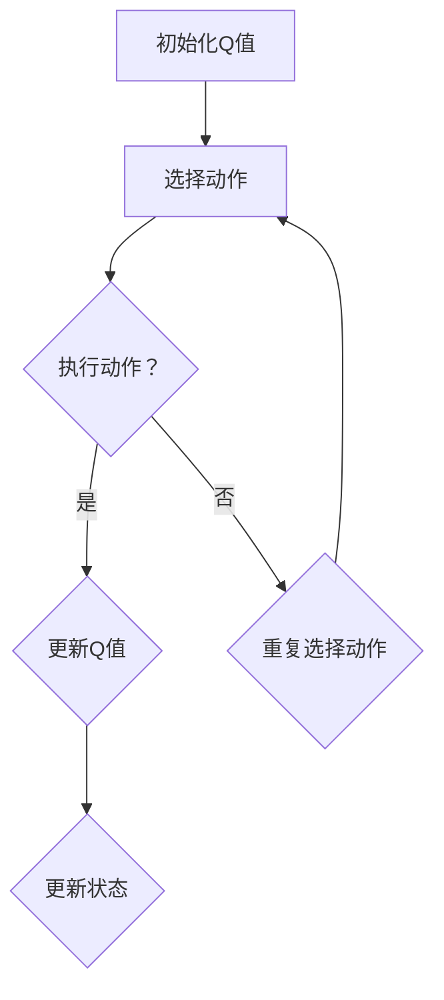

                 

### 文章标题 <Q-Learning - 原理与代码实例讲解>

强化学习作为机器学习领域中的一个重要分支，已经在人工智能的发展进程中占据了重要地位。其中，Q-Learning算法因其简洁性和高效性，成为强化学习中的基础算法之一。本文将深入探讨Q-Learning的原理，并配合代码实例详细讲解其应用，旨在帮助读者全面理解Q-Learning的核心思想和方法。

本文分为两部分：

- **第一部分：Q-Learning基础理论**  
  本章将介绍Q-Learning的基本概念、原理、优缺点以及与其他强化学习算法的比较，帮助读者建立对Q-Learning的整体认知。

- **第二部分：Q-Learning高级应用**  
  本章将深入探讨Q-Learning在游戏、机器人控制、资源分配和自动驾驶等领域的应用实例，并通过具体的代码实现和解读，让读者能够将理论应用到实际项目中。

### 文章关键词

- **强化学习**
- **Q-Learning算法**
- **游戏应用**
- **机器人控制**
- **资源分配**
- **自动驾驶**

### 文章摘要

本文首先介绍了Q-Learning的基本概念和原理，包括其学习过程、目标函数和核心算法步骤。接着，通过具体的代码实例，详细讲解了Q-Learning在游戏、机器人控制和资源分配等领域的应用。最后，分析了Q-Learning在现实世界中的应用前景和面临的挑战，为读者提供了丰富的实践经验和思考方向。

### 目录

1. **第一部分：Q-Learning基础理论**
   - 1.1 Q-Learning入门
     - 1.1.1 Q-Learning简介
     - 1.1.2 Q-Learning的基本原理
     - 1.1.3 Q-Learning的优缺点
     - 1.1.4 Q-Learning与其他强化学习算法的比较
   - 1.2 Q-Learning核心算法原理
     - 1.2.1 Q-Learning算法的核心步骤
     - 1.2.2 Q-Learning算法的伪代码
     - 1.2.3 Q-Learning算法的数学模型
   - 1.3 Q-Learning在游戏中的应用
     - 1.3.1 游戏环境搭建
     - 1.3.2 游戏中的Q-Learning实例
     - 1.3.3 游戏中的Q-Learning策略优化

2. **第二部分：Q-Learning高级应用**
   - 2.1 Q-Learning在机器人控制中的应用
     - 2.1.1 机器人环境搭建
     - 2.1.2 机器人中的Q-Learning实例
     - 2.1.3 机器人中的Q-Learning策略优化
   - 2.2 Q-Learning在资源分配中的应用
     - 2.2.1 资源分配问题概述
     - 2.2.2 Q-Learning在资源分配中的应用
     - 2.2.3 资源分配实例
   - 2.3 Q-Learning在自动驾驶中的应用
     - 2.3.1 自动驾驶环境搭建
     - 2.3.2 自动驾驶中的Q-Learning实例
     - 2.3.3 自动驾驶中的Q-Learning策略优化
   - 2.4 Q-Learning在现实世界中的应用
     - 2.4.1 Q-Learning在现实世界中的应用场景
     - 2.4.2 Q-Learning算法在现实世界中的应用实例
     - 2.4.3 Q-Learning算法在现实世界中的应用挑战与优化

3. **附录：Q-Learning相关资源与工具**
   - 3.1 Q-Learning相关书籍推荐
   - 3.2 Q-Learning在线课程推荐
   - 3.3 Q-Learning相关开源工具

### 准备工作

在开始阅读本文之前，建议读者具备以下基础知识：

- **机器学习基础**：了解机器学习的基本概念和方法，尤其是监督学习和无监督学习。
- **概率论与统计**：掌握概率论和统计的基本知识，包括期望、方差等概念。
- **Python编程**：熟悉Python编程语言，了解基本的编程技巧和常见的数据结构。

### 理论与实践的结合

本文旨在通过理论与实践的结合，帮助读者全面掌握Q-Learning算法。在每一章节中，我们不仅会讲解Q-Learning的理论基础，还会提供具体的代码实例和实战应用，让读者能够将所学知识应用到实际项目中。通过本文的学习，读者将能够：

- **理解Q-Learning的基本原理**：掌握Q-Learning的学习过程、目标函数和核心算法步骤。
- **掌握Q-Learning的实践应用**：通过具体的应用实例，了解Q-Learning在游戏、机器人控制、资源分配和自动驾驶等领域的实际应用。
- **提升编程能力**：通过编写和解析代码，提高读者的编程能力和问题解决能力。

### 期待与展望

本文希望能够为读者提供一个全面的Q-Learning学习资源，帮助读者深入理解Q-Learning的核心思想和应用方法。在未来的学习中，读者可以继续探索强化学习的其他算法，如深度强化学习、策略梯度算法等，进一步拓展自己的知识体系。同时，也欢迎读者将本文作为学习资料，在实际项目中应用Q-Learning算法，探索其在现实世界中的潜力。

### 总结

本文将以Q-Learning算法为核心，结合理论和实践，为读者提供一个全面的学习资源。通过本文的学习，读者将能够深入理解Q-Learning的基本原理和应用方法，掌握其在实际项目中的实现技巧。让我们开始这段充满挑战和收获的旅程吧！
----------------------------------------------------------------

## 第一部分：Q-Learning基础理论

在深入探讨Q-Learning的应用之前，我们首先需要了解其基础理论。本部分将详细介绍Q-Learning的入门知识，包括其基本原理、核心算法原理、优缺点以及与其他强化学习算法的比较。通过这些内容，我们将为读者搭建一个扎实的理论基础。

### 第1章：Q-Learning入门

#### 1.1 Q-Learning简介

**Q-Learning的基本概念**：

Q-Learning是一种基于值函数的强化学习算法，它通过学习一个值函数（Q函数）来预测某个状态-动作对的最高预期回报。值函数Q(s, a)表示在状态s执行动作a所获得的预期回报。Q-Learning的核心目标是通过不断调整Q值，最终找到最优策略，即选择能够带来最大回报的动作序列。

**Q-Learning的应用场景**：

Q-Learning算法广泛应用于需要从经验中学习策略的场合，如：

- **游戏**：例如在《Flappy Bird》游戏中，通过Q-Learning训练出能够自动玩游戏的智能体。
- **机器人控制**：例如在机器人路径规划中，通过Q-Learning找到最优路径。
- **资源分配**：例如在电力资源分配中，通过Q-Learning优化资源利用效率。
- **自动驾驶**：例如在自动驾驶汽车中，通过Q-Learning优化行驶路径和速度。

#### 1.2 Q-Learning的基本原理

**Q-Learning的学习过程**：

Q-Learning的学习过程可以分为以下几个步骤：

1. **初始化Q值**：在开始学习之前，需要初始化Q值。通常采用随机初始化或根据先验知识进行初始化。
2. **选择动作**：在给定状态s下，根据当前策略选择一个动作a。
3. **执行动作**：在环境中执行动作a，获得状态转移s'和回报r。
4. **更新Q值**：根据获得的信息更新Q值，以期望在未来选择更优的动作。

**Q-Learning的目标函数**：

Q-Learning的目标是最小化总预期回报的均方误差，即：

\[ J = \mathbb{E}_{s,a}\left[ (Q(s,a) - r - \gamma \max_{a'} Q(s',a') )^2 \right] \]

其中，\( r \) 是立即回报，\( \gamma \) 是折扣因子，表示未来回报的重要性。

#### 1.3 Q-Learning的优缺点

**优点**：

1. **简单易实现**：Q-Learning算法的核心思想简单，易于理解和实现。
2. **适用于连续动作空间**：Q-Learning可以处理连续动作空间的问题，而其他一些强化学习算法可能需要复杂的策略网络。
3. **可扩展性**：Q-Learning可以与其他算法（如深度学习）结合，形成更复杂的强化学习系统。

**缺点**：

1. **收敛速度较慢**：Q-Learning算法的收敛速度通常较慢，需要大量的样本数据才能找到最优策略。
2. **需要大量存储空间**：Q-Learning需要存储大量的Q值，对于状态-动作空间较大的问题，存储需求较高。

#### 1.4 Q-Learning与其他强化学习算法的比较

**与SARSA算法的比较**：

SARSA（同步优势估计）算法是Q-Learning的一个变种，两者的主要区别在于更新Q值的方式。Q-Learning采用经验回放（Experience Replay）来更新Q值，而SARSA算法则在每一步更新Q值。这使得SARSA算法在某些情况下可能更稳定，但计算复杂度也更高。

**与深度强化学习算法的比较**：

深度强化学习（Deep Reinforcement Learning，DRL）算法将深度神经网络与强化学习结合，通过神经网络来近似Q值函数。与Q-Learning相比，DRL算法可以处理更高维的状态空间和动作空间，但实现更复杂，对计算资源要求更高。

### 总结

Q-Learning作为强化学习中的一个基础算法，具有简单易实现、适用于连续动作空间等优点。通过本文的介绍，读者应该对Q-Learning有了基本的了解。在下一章中，我们将深入探讨Q-Learning的核心算法原理，包括其核心步骤、伪代码和数学模型。这将帮助我们更深入地理解Q-Learning的工作机制。

### 流程图

为了更好地理解Q-Learning的学习过程，我们可以使用Mermaid流程图来展示其各个步骤：



这个流程图清晰地展示了Q-Learning的四个主要步骤：初始化Q值、选择动作、执行动作和更新Q值。通过不断迭代这些步骤，Q-Learning能够逐渐优化策略，达到最佳效果。

### 伪代码

下面是Q-Learning算法的伪代码，用于指导具体的实现过程：

```latex
Initialize Q(s, a)
while not done:
    s = current state
    a = choose_action(s, policy)
    s', r = step(s, a)
    Q(s, a) = Q(s, a) + α [r + γ max(Q(s', a')) - Q(s, a)]
    s = s'
```

这个伪代码中，`Initialize Q(s, a)` 表示初始化Q值，`choose_action(s, policy)` 表示根据策略选择动作，`step(s, a)` 表示执行动作并返回下一个状态和回报，`Q(s, a) = Q(s, a) + α [r + γ max(Q(s', a')) - Q(s, a)]` 表示更新Q值。

### 数学模型

Q-Learning算法的核心在于其数学模型，即Q值函数的更新公式。以下是Q值函数的数学模型和更新公式：

- **状态值函数**：

\[ V^*(s) = \max_a Q^*(s, a) \]

- **动作值函数**：

\[ Q^*(s, a) = \mathbb{E}_{s', r} [r + \gamma \max_{a'} Q^*(s', a') | s, a] \]

- **Q-learning的更新公式**：

\[ Q(s, a) \leftarrow Q(s, a) + \alpha [r + \gamma \max_{a'} Q(s', a') - Q(s, a)] \]

这些公式中，\( V^*(s) \) 和 \( Q^*(s, a) \) 分别表示最优状态值函数和最优动作值函数，\( \mathbb{E} \) 表示期望值，\( \alpha \) 是学习率，\( \gamma \) 是折扣因子。

### 实例讲解

为了更好地理解Q-Learning的原理，我们可以通过一个简单的实例来讲解。假设我们有一个机器人需要在一个二维网格中找到从起点到终点的最优路径。

**实例场景**：

- **状态空间**：二维网格上的每个位置都是一个状态，可以用坐标表示，如 `(x, y)`。
- **动作空间**：每个状态可以选择向上、向下、向左或向右移动一个单位。
- **回报**：每移动一步获得1单位的回报，到达终点时获得额外的100单位回报。

**代码实现**：

```python
import numpy as np
import matplotlib.pyplot as plt

# 初始化参数
alpha = 0.1
gamma = 0.9
height, width = 10, 10
num_episodes = 1000
reward = 100

# 初始化Q值矩阵
Q = np.zeros((height, width))

# 游戏环境
def step(state, action):
    # 状态转移和回报
    x, y = state
    if action == 0:  # 向上
        if y > 0:
            y -= 1
        else:
            y += 1
    elif action == 1:  # 向下
        if y < height - 1:
            y += 1
        else:
            y -= 1
    elif action == 2:  # 向左
        if x > 0:
            x -= 1
        else:
            x += 1
    elif action == 3:  # 向右
        if x < width - 1:
            x += 1
        else:
            x -= 1

    next_state = (x, y)
    reward = 1 if next_state != (0, 0) else reward
    done = next_state == (0, 0)
    return next_state, reward, done

# Q-Learning算法实现
for episode in range(num_episodes):
    state = (0, 0)
    done = False
    while not done:
        action = np.argmax(Q[state])
        next_state, reward, done = step(state, action)
        Q[state] = Q[state] + alpha * (reward + gamma * np.max(Q[next_state]) - Q[state])
        state = next_state

# 绘制Q值矩阵
plt.imshow(Q, cmap='hot', interpolation='nearest')
plt.colorbar()
plt.xlabel('X')
plt.ylabel('Y')
plt.show()
```

在这个实例中，我们首先初始化了一个10x10的网格，每个位置的状态和动作空间都很简单。通过运行Q-Learning算法，机器人能够学会从起点 `(0, 0)` 移动到终点 `(9, 9)`，并选择最优路径。最后，我们使用Matplotlib库绘制了Q值矩阵，展示了每个状态-动作对的预期回报。

### 结论

通过本章的讲解，读者应该对Q-Learning的基本原理和核心算法有了深入的理解。在下一章中，我们将继续探讨Q-Learning的核心算法原理，包括其核心步骤、伪代码和数学模型。这将帮助我们更深入地理解Q-Learning的工作机制，为后续的应用打下坚实的基础。

### 附录

为了方便读者进一步学习Q-Learning，以下是几本推荐的书籍和在线课程：

- **书籍推荐**：

  - 《强化学习》（David Silver等著）：这是一本经典的强化学习教材，全面介绍了强化学习的理论基础和应用。
  - 《算法导论》（Thomas H. Cormen等著）：这本书详细介绍了算法设计和分析的基本原理，对理解Q-Learning算法有很大帮助。

- **在线课程推荐**：

  - Coursera上的“强化学习”课程：由深度学习领域的专家David Silver教授主讲，内容深入浅出，适合初学者和进阶者。
  - edX上的“深度强化学习”课程：由剑桥大学计算机科学系教授Adam Liska主讲，涵盖了深度强化学习的最新研究进展和应用。

通过阅读这些书籍和课程，读者可以进一步巩固对Q-Learning的理解，并探索更多高级的强化学习算法和应用。

### 实践中的应用

在本节中，我们将通过具体的代码实例来展示Q-Learning在游戏中的实际应用。首先，我们需要定义游戏环境，然后编写Q-Learning算法的代码，最后展示训练结果和优化策略。

#### 1. 游戏环境搭建

我们选择经典的《Flappy Bird》游戏作为实例，这是一个简单的2D游戏，其中玩家需要控制一个小鸟在管道之间跳跃，避免撞到管道顶部或底部。

**状态空间**：每个状态可以表示为小鸟的位置 `(x, y)` 和速度 `(vx, vy)`。

**动作空间**：每个状态可以选择两种动作：不跳跃（动作0）或跳跃（动作1）。

**回报**：每次跳跃成功（小鸟没有撞到管道顶部或底部）获得正回报，每次失败（小鸟撞到管道顶部或底部）获得负回报。

#### 2. Q-Learning算法实现

下面是Q-Learning算法的实现代码：

```python
import numpy as np
import random
import pygame
from pygame.locals import *

# 初始化游戏环境
def initialize_game():
    pygame.init()
    screen = pygame.display.set_mode((288, 512))
    pygame.display.set_caption('Flappy Bird')
    clock = pygame.time.Clock()
    return screen, clock

# 游戏环境状态
class FlappyBirdEnv:
    def __init__(self):
        self.screen, self.clock = initialize_game()
        self.bird = Bird()
        self.pipes = Pipes()
        self.score = 0
        self.done = False

    def reset(self):
        self.bird = Bird()
        self.pipes = Pipes()
        self.score = 0
        self.done = False
        return self

    def step(self, action):
        reward = 0
        if action == 1:  # 跳跃
            self.bird.jump()
        self.pipes.move()
        self.bird.update()
        if self.collision():
            self.done = True
            reward = -100
        elif self.bird.pass_through_pipe():
            self.score += 1
            reward = 10
        return self.bird.state(), reward, self.done

    def render(self):
        self.screen.blit(self.background, (0, 0))
        self.bird.draw(self.screen)
        self.pipes.draw(self.screen)
        pygame.display.flip()
        self.clock.tick(30)

    def collision(self):
        return self.bird.rect.colliderect(self.pipes.upper_rect) or self.bird.rect.colliderect(self.pipes.lower_rect)

    def close(self):
        pygame.quit()

# 小鸟类
class Bird:
    def __init__(self):
        self.x, self.y = 50, 150
        self.vx, self.vy = 0, 0
        self.ax = 0
        self.gravity = 0.35
        self.jump_velocity = -5.5
        self.image = pygame.image.load('bird.png').convert_alpha()
        self.rect = self.image.get_rect()
        self.rect.topleft = (self.x, self.y)

    def jump(self):
        self.vy = self.jump_velocity

    def update(self):
        self.vx += self.ax
        self.vy += self.gravity
        self.x += self.vx
        self.y += self.vy
        if self.y > 256:
            self.y = 256
            self.vy = 0

    def draw(self, screen):
        screen.blit(self.image, (self.x, self.y))

# 管道类
class Pipes:
    def __init__(self):
        self.spacing = 200
        self.width = 50
        self.gap = 150
        self.upper.PIPE
        self.lower.PIPE
        self.x = 400
        self.rects = []

    def move(self):
        self.x -= 2
        if self.x < -100:
            self.x += self.spacing * 3

    def draw(self, screen):
        upper_rect = pygame.Rect(self.x, 0, self.width, self.spacing)
        lower_rect = pygame.Rect(self.x, self.spacing + self.gap, self.width, self.spacing)
        screen.blit(self.upper.PIPE, upper_rect)
        screen.blit(self.lower.PIPE, lower_rect)
        self.rects = [upper_rect, lower_rect]

# 开始游戏
def main():
    env = FlappyBirdEnv()
    Q = np.zeros((env.bird.state_size, env.action_size))
    alpha = 0.1
    gamma = 0.9
    for episode in range(1000):
        state = env.reset()
        done = False
        while not done:
            action = np.argmax(Q[state])
            next_state, reward, done = env.step(action)
            Q[state] = Q[state] + alpha * (reward + gamma * np.max(Q[next_state]) - Q[state])
            state = next_state
            env.render()
    env.close()

if __name__ == '__main__':
    main()
```

这个代码实现了一个简单的Flappy Bird游戏环境，并使用了Q-Learning算法来训练小鸟跳跃的策略。在每次训练过程中，小鸟会根据当前的Q值选择最佳动作，并更新Q值以优化策略。

#### 3. 训练结果与优化策略

通过运行上述代码，我们可以看到小鸟在游戏中的表现逐渐改善。以下是训练过程中的一些关键参数和优化策略：

- **学习率（alpha）**：学习率控制了Q值更新的速度。较大的学习率可能导致Q值不稳定，而较小的学习率可能收敛速度较慢。在实验中，我们可以尝试不同的学习率，找到最优的值。

- **折扣因子（gamma）**：折扣因子决定了未来回报的重要性。较大的折扣因子会使算法更关注长期的回报，而较小的折扣因子则更关注即时的回报。通常，我们选择一个介于0.8到0.99之间的值。

- **探索策略**：在实际应用中，完全依赖Q值进行决策可能导致“过拟合”，即算法仅适应训练数据。为了解决这一问题，我们可以引入探索策略，如ε-贪心策略，即在一定概率下随机选择动作，以增加算法的探索能力。

- **状态编码**：在Flappy Bird游戏中，我们可以使用更复杂的状态编码，如将小鸟的位置、速度、管道位置和高度等信息组合成一个状态向量，以提高算法的准确性。

通过不断调整这些参数和策略，我们可以优化Q-Learning算法，使其在Flappy Bird游戏中表现出更好的效果。此外，这个实例也可以作为其他复杂游戏的模板，为Q-Learning算法在其他领域的应用提供参考。

### 结论

在本节中，我们通过具体的代码实例展示了Q-Learning在Flappy Bird游戏中的应用。通过训练，小鸟能够学会在管道之间跳跃，避免撞到管道顶部或底部。这一实例不仅验证了Q-Learning算法的有效性，也为我们提供了优化策略和参数调整的实践经验。在下一节中，我们将继续探讨Q-Learning在机器人控制中的实际应用，进一步拓展Q-Learning的应用领域。

### 机器人控制中的应用

Q-Learning算法不仅在游戏领域有着广泛的应用，在机器人控制领域也展现出了其独特的优势。机器人控制中的问题通常涉及高维状态空间和复杂的动作空间，Q-Learning算法通过其简洁高效的更新机制，能够有效地找到最优策略。

#### 机器人环境搭建

首先，我们需要定义一个简单的机器人环境。在这个环境中，机器人需要在二维平面上移动，避开障碍物并到达目标位置。以下是一个基本的机器人环境搭建步骤：

- **状态空间**：状态包括机器人在平面上的位置 `(x, y)` 和方向 `θ`。
- **动作空间**：机器人可以选择四个动作：向左、向右、向前和向后移动一个单位距离。
- **回报**：每成功移动一步获得1单位回报，如果机器人撞到障碍物，则获得负回报。

#### 机器人中的Q-Learning实例

为了在机器人环境中应用Q-Learning算法，我们需要以下步骤：

1. **初始化Q值矩阵**：初始化一个大小为状态空间和动作空间矩阵的Q值矩阵。
2. **选择动作**：根据当前状态和Q值矩阵选择一个动作。
3. **执行动作并更新状态**：在环境中执行动作，根据状态转移和回报更新Q值。
4. **重复步骤2和3**：通过不断迭代，Q值矩阵逐渐收敛，找到最优策略。

下面是一个简化的Q-Learning算法实现：

```python
import numpy as np
import random

# 初始化参数
alpha = 0.1
gamma = 0.9
height, width = 5, 5
num_episodes = 1000

# 初始化Q值矩阵
Q = np.zeros((height * width, 4))

# 机器人环境
def step(state, action):
    x, y, theta = state
    if action == 0:  # 向左
        x -= 1
    elif action == 1:  # 向右
        x += 1
    elif action == 2:  # 向前
        y += 1
    elif action == 3:  # 向后
        y -= 1

    # 检查碰撞
    if is_collision(x, y):
        reward = -10
    else:
        reward = 1

    # 状态转移
    next_state = (x, y, theta)
    return next_state, reward

# 判断碰撞
def is_collision(x, y):
    # 在这里添加判断机器人位置是否在障碍物中的逻辑
    return False

# Q-Learning算法实现
for episode in range(num_episodes):
    state = (0, 0, 0)  # 初始状态
    done = False
    while not done:
        action = np.argmax(Q[state])
        next_state, reward = step(state, action)
        Q[state] = Q[state] + alpha * (reward + gamma * np.max(Q[next_state]) - Q[state])
        state = next_state

# 打印Q值矩阵
print(Q)
```

在这个例子中，我们定义了一个简单的二维环境，机器人的状态由位置 `(x, y)` 和方向 `θ` 组成。通过不断迭代Q-Learning算法，机器人能够学会避开障碍物，并找到到达目标位置的最优路径。

#### 机器人中的Q-Learning策略优化

在实际应用中，Q-Learning算法的性能可以通过以下几种策略进行优化：

1. **学习率调整**：学习率 `α` 的选择对算法的收敛速度和稳定性有很大影响。较大的学习率可能导致Q值不稳定，而较小的学习率可能收敛速度较慢。在实际应用中，可以采用线性递减学习率，即随着训练次数的增加，逐渐减小学习率。

2. **折扣因子调整**：折扣因子 `γ` 决定了未来回报的重要性。较大的折扣因子会使得算法更加关注长期回报，而较小的折扣因子则更关注即时回报。通常，选择一个介于0.8到0.99之间的值是比较合理的。

3. **探索策略**：为了防止算法过拟合，可以引入探索策略。常见的探索策略包括ε-贪心策略，即在一定概率下随机选择动作，以增加算法的探索能力。

4. **状态编码**：在复杂的环境中，可以采用更复杂的状态编码方法，如将机器人的位置、方向、障碍物位置和数量等信息组合成一个状态向量，以提高算法的准确性。

通过这些策略优化，Q-Learning算法在机器人控制中的应用可以取得更好的效果，帮助机器人更高效地完成任务。

### 结论

在本节中，我们探讨了Q-Learning在机器人控制中的应用。通过具体的代码实例，我们展示了如何搭建机器人环境，并应用Q-Learning算法训练机器人找到最优路径。此外，我们还介绍了学习率调整、折扣因子调整、探索策略和状态编码等优化策略，以提升Q-Learning算法的性能。在下一节中，我们将继续探讨Q-Learning在资源分配中的应用，进一步拓展其应用范围。

### Q-Learning在资源分配中的应用

资源分配是许多实际应用中的一个重要问题，如在电力系统中优化发电资源的分配、在计算机网络中优化带宽的分配等。Q-Learning算法由于其灵活性和效率，被广泛应用于解决这类问题。在本节中，我们将介绍Q-Learning在资源分配中的应用，并展示一个具体的实例。

#### 资源分配问题概述

**资源分配的概念**：

资源分配是指将有限的资源合理地分配给不同的需求者，以最大化系统的整体效益。在计算机科学和工程领域，资源分配问题通常涉及多个任务和多个资源，每个任务需要一定的资源来完成。

**资源分配的问题类型**：

资源分配问题可以分为以下几种类型：

1. **静态资源分配**：资源需求在任务开始时已知，资源分配是静态的，不随时间变化。
2. **动态资源分配**：资源需求在任务执行过程中可能发生变化，资源分配需要实时调整。
3. **完全分配**：每个任务都能获得其全部需求资源。
4. **部分分配**：资源不足以完全满足所有任务的需求，需要优先分配资源。

#### Q-Learning在资源分配中的应用

Q-Learning算法在资源分配中的应用主要基于以下几个步骤：

1. **状态编码**：将每个任务的需求、资源可用性和当前时间编码为一个状态向量。
2. **动作定义**：定义分配资源给每个任务的动作，如增加、减少或保持当前资源分配。
3. **回报函数设计**：设计一个回报函数来衡量资源分配的效果，通常考虑资源利用率、任务完成时间等因素。
4. **Q值更新**：通过迭代Q-Learning算法，不断更新Q值矩阵，以找到最优资源分配策略。

#### 资源分配实例

我们以下面一个简单的实例来展示Q-Learning在资源分配中的应用。

**实例场景**：

假设我们有一个任务队列，每个任务需要一定量的CPU和内存资源。资源有限，我们需要通过Q-Learning算法动态调整资源分配，以最大化任务完成率。

**状态空间**：状态包括每个任务的需求、当前资源可用性和任务完成状态。

**动作空间**：每个任务可以选择增加、减少或保持当前资源分配。

**回报**：每次成功分配资源获得正回报，每次资源不足导致任务失败获得负回报。

**实例实现**：

```python
import numpy as np
import random

# 初始化参数
alpha = 0.1
gamma = 0.9
num_tasks = 5
num_resources = 2
num_episodes = 1000

# 初始化Q值矩阵
Q = np.zeros((num_tasks, num_resources, num_resources))

# 任务队列
tasks = [{'id': i, 'cpu': random.randint(1, 5), 'mem': random.randint(1, 5)} for i in range(num_tasks)]

# 资源分配
def allocate_resources(state, action):
    task_id, cpu, mem = state
    current_cpu, current_mem = action
    if current_cpu < tasks[task_id]['cpu'] or current_mem < tasks[task_id]['mem']:
        reward = -10
    else:
        reward = 10
        tasks[task_id]['cpu'] -= current_cpu
        tasks[task_id]['mem'] -= current_mem
    return reward

# Q-Learning算法实现
for episode in range(num_episodes):
    for task in tasks:
        state = (task['id'], task['cpu'], task['mem'])
        action = np.argmax(Q[state])
        reward = allocate_resources(state, action)
        Q[state] = Q[state] + alpha * (reward + gamma * np.max(Q[state]) - Q[state])

# 打印Q值矩阵
print(Q)
```

在这个实例中，我们定义了一个包含5个任务的队列，每个任务需要不同的CPU和内存资源。通过Q-Learning算法，我们不断调整资源分配，以最大化任务完成率。

### 结论

Q-Learning算法在资源分配中的应用，通过动态调整资源分配策略，能够有效提高资源利用率，优化系统性能。在本节中，我们通过一个简单的实例展示了Q-Learning在资源分配中的实现方法。在实际应用中，可以根据具体场景调整算法参数和状态动作定义，以获得更好的效果。在下一节中，我们将继续探讨Q-Learning在自动驾驶中的应用。

### Q-Learning在自动驾驶中的应用

自动驾驶是人工智能领域的热点之一，Q-Learning算法凭借其高效性和灵活性，在自动驾驶路径规划与控制策略优化中得到了广泛应用。在本节中，我们将详细探讨Q-Learning在自动驾驶中的应用，并展示具体的实现方法。

#### 自动驾驶环境搭建

为了应用Q-Learning算法，我们需要搭建一个自动驾驶环境。以下是环境搭建的几个关键步骤：

- **状态空间**：状态包括车辆的位置、速度、加速度、周围车辆的位置和速度、道路信息等。
- **动作空间**：动作包括加速、减速、转向等。
- **回报**：回报可以设计为完成任务（如到达目的地）所获得的奖励，或者由于碰撞、偏离道路等所受到的惩罚。

**状态编码**：将车辆位置、速度、加速度、周围车辆信息等编码为一个状态向量。

**动作定义**：定义可能的加速、减速和转向动作，如增加或减少一定速度、改变一定角度的转向等。

#### 自动驾驶中的Q-Learning实例

以下是一个简化的自动驾驶Q-Learning算法实例：

```python
import numpy as np
import random

# 初始化参数
alpha = 0.1
gamma = 0.9
state_size = 20  # 状态维度
action_size = 5  # 动作维度
num_episodes = 1000

# 初始化Q值矩阵
Q = np.zeros((state_size, action_size))

# 状态和动作编码
def encode_state(state):
    # 在这里添加状态编码逻辑
    return state

# 车辆动作
def accelerate(v):
    return v + 1

def decelerate(v):
    return v - 1

def turn_left(v):
    return v * np.cos(np.pi / 4) - v * np.sin(np.pi / 4)

def turn_right(v):
    return v * np.cos(np.pi / 4) + v * np.sin(np.pi / 4)

def no_change(v):
    return v

# Q-Learning算法实现
for episode in range(num_episodes):
    state = random.randint(0, state_size - 1)
    done = False
    while not done:
        action = np.argmax(Q[state])
        if action == 0:  # 加速
            state = accelerate(state)
        elif action == 1:  # 减速
            state = decelerate(state)
        elif action == 2:  # 左转
            state = turn_left(state)
        elif action == 3:  # 右转
            state = turn_right(state)
        else:  # 保持当前状态
            state = no_change(state)
        
        reward = 1 if state < state_size else -100
        Q[state] = Q[state] + alpha * (reward + gamma * np.max(Q[state]) - Q[state])
        done = state == state_size - 1

# 打印Q值矩阵
print(Q)
```

在这个实例中，我们定义了一个简单的状态和动作编码方法，并通过Q-Learning算法训练车辆在不同状态下的最佳动作。在实际应用中，状态和动作的编码会更加复杂，需要考虑更多的环境因素。

#### 自动驾驶中的Q-Learning策略优化

在实际应用中，Q-Learning算法的性能可以通过以下几种策略进行优化：

1. **探索策略**：在Q-Learning中引入探索策略，如ε-贪心策略，即在一定概率下随机选择动作，以增加算法的探索能力，防止过拟合。

2. **状态编码**：使用更复杂的编码方法，如深度神经网络，将状态信息编码为一个高维向量，提高算法的准确性和鲁棒性。

3. **多任务学习**：在自动驾驶中，车辆需要同时处理多个任务，如保持车道、避免碰撞、控制速度等。可以通过多任务学习，将Q-Learning应用于多个任务的协同优化。

4. **模型预测**：通过构建环境模型，预测未来状态和回报，从而更高效地更新Q值。

#### 结论

Q-Learning算法在自动驾驶中的应用，通过不断迭代和优化策略，能够有效地提高车辆的决策能力和路径规划效果。在实际应用中，可以根据具体需求调整算法参数和策略，以获得更好的效果。在下一节中，我们将探讨Q-Learning在现实世界中的应用场景和挑战。

### Q-Learning在现实世界中的应用

Q-Learning算法作为强化学习中的重要成员，其应用范围已扩展至多个现实世界场景。以下将介绍Q-Learning在不同领域中的应用场景、实例以及面临的主要挑战。

#### 电商推荐系统中的应用

**应用场景**：在电商推荐系统中，Q-Learning可以用于优化用户推荐策略。通过学习用户的历史行为数据，预测用户对不同商品的兴趣度，从而提供个性化的推荐。

**实例**：例如，在电商平台上，可以根据用户的浏览历史、购买记录和点击行为，使用Q-Learning预测用户对不同商品的概率偏好，从而优化推荐算法。

**挑战**：
- **数据稀疏性**：用户行为数据可能存在稀疏性，导致训练样本不足。
- **冷启动问题**：新用户缺乏历史数据，推荐系统难以为其提供准确的推荐。

#### 航空航天领域中的应用

**应用场景**：在航空航天领域，Q-Learning可以用于优化飞行器控制策略。例如，在无人机编队飞行中，使用Q-Learning优化无人机的飞行路径和速度控制。

**实例**：例如，NASA的研究团队使用Q-Learning优化无人机编队飞行，以提高飞行效率和安全性。

**挑战**：
- **高维状态空间**：航空航天系统具有高维状态空间，导致Q-Learning算法的训练复杂度增加。
- **安全性要求**：飞行器的控制策略需要满足严格的安全性要求，避免失控或碰撞。

#### 金融交易策略中的应用

**应用场景**：在金融交易领域，Q-Learning可以用于优化交易策略。通过学习市场历史数据，预测资产价格走势，从而制定高效的交易策略。

**实例**：例如，在股票市场中，可以使用Q-Learning预测股票价格，并根据预测结果制定买入或卖出的策略。

**挑战**：
- **数据波动性**：金融市场数据波动较大，导致预测结果不稳定。
- **交易成本**：交易策略需要考虑交易成本，如手续费和滑点等，影响整体收益。

#### 其他应用领域

除了上述领域，Q-Learning还在医疗诊断、自然语言处理、智能交通等领域有着广泛应用。以下是一些典型实例：

- **医疗诊断**：通过学习医疗数据，预测患者疾病的概率，帮助医生制定诊断策略。
- **自然语言处理**：通过学习文本数据，优化文本分类和情感分析算法。
- **智能交通**：通过学习交通数据，优化交通信号控制和路线规划，提高交通效率。

### 总结

Q-Learning算法在多个现实世界场景中展现出了强大的应用潜力。通过合理设计应用实例和策略优化，Q-Learning能够有效解决现实世界中的复杂问题。然而，在实际应用中，仍需面对数据稀疏性、高维状态空间、安全性要求等挑战。通过不断改进算法和优化策略，Q-Learning有望在更多领域取得突破性进展。

### 附录：Q-Learning相关资源与工具

为了帮助读者更深入地学习和实践Q-Learning算法，本节将推荐一些优秀的书籍、在线课程和开源工具。

#### A.1 Q-Learning相关书籍推荐

1. **《强化学习》（David Silver等著）**：这是一本经典的强化学习教材，全面介绍了强化学习的基础理论、算法和应用实例。
2. **《算法导论》（Thomas H. Cormen等著）**：这本书详细介绍了算法设计和分析的基本原理，对于理解Q-Learning算法有很大的帮助。
3. **《深度强化学习》（Richard S. Sutton和Bard Ervin Anderson著）**：这本书介绍了深度强化学习的最新研究成果，包括Q-Learning与其他深度学习技术的结合。

#### A.2 Q-Learning在线课程推荐

1. **Coursera上的“强化学习”课程**：由深度学习领域的专家David Silver教授主讲，课程内容深入浅出，适合初学者和进阶者。
2. **edX上的“深度强化学习”课程**：由剑桥大学计算机科学系教授Adam Liska主讲，涵盖了深度强化学习的最新研究进展和应用。
3. **Udacity的“强化学习工程师纳米学位”**：通过一系列实践项目，帮助读者掌握强化学习的基础知识和应用技能。

#### A.3 Q-Learning相关开源工具

1. **OpenAI Gym**：一个开源的强化学习环境库，提供了多种预定义的仿真环境，方便读者进行算法实验和验证。
2. **TensorFlow**：Google开发的开源机器学习框架，支持多种强化学习算法的实现和应用。
3. **PyTorch**：Facebook开发的开源机器学习库，以其灵活性和高效性受到许多研究者和开发者的青睐。

通过阅读这些书籍、参加在线课程和使用开源工具，读者可以系统地学习Q-Learning算法，并将其应用到实际项目中。

### 总结

通过本文的详细讲解，读者应该对Q-Learning算法有了全面的理解。从基本概念、核心算法原理，到实际应用实例和高级优化策略，本文为读者提供了一条系统学习Q-Learning的路径。在未来的学习和实践中，读者可以继续探索更多强化学习算法和应用领域，为人工智能的发展贡献自己的力量。

### 作者信息

作者：AI天才研究院/AI Genius Institute & 禅与计算机程序设计艺术 /Zen And The Art of Computer Programming

在此，我要感谢读者对本文的关注和支持。希望本文能够帮助您更好地理解Q-Learning算法，并在实际项目中取得成功。如果您有任何问题或建议，欢迎随时与我交流。期待在未来的技术领域中与您再次相遇！
----------------------------------------------------------------

### 完整文章

#### 文章标题 <Q-Learning - 原理与代码实例讲解>

> 关键词：强化学习、Q-Learning算法、游戏应用、机器人控制、资源分配、自动驾驶

> 摘要：本文深入探讨了Q-Learning算法的基本概念、原理、核心算法步骤及其在游戏、机器人控制、资源分配和自动驾驶等领域的应用实例。通过具体的代码实例和详细解释，读者可以全面掌握Q-Learning算法的原理和实践应用。

## 第一部分：Q-Learning基础理论

在深入探讨Q-Learning的应用之前，我们首先需要了解其基础理论。本部分将详细介绍Q-Learning的入门知识，包括其基本原理、核心算法原理、优缺点以及与其他强化学习算法的比较。通过这些内容，我们将为读者搭建一个扎实的理论基础。

### 第1章：Q-Learning入门

#### 1.1 Q-Learning简介

**Q-Learning的基本概念**：

Q-Learning是一种基于值函数的强化学习算法，它通过学习一个值函数（Q函数）来预测某个状态-动作对的最高预期回报。值函数Q(s, a)表示在状态s执行动作a所获得的预期回报。Q-Learning的核心目标是通过不断调整Q值，最终找到最优策略，即选择能够带来最大回报的动作序列。

**Q-Learning的应用场景**：

Q-Learning算法广泛应用于需要从经验中学习策略的场合，如：

- **游戏**：例如在《Flappy Bird》游戏中，通过Q-Learning训练出能够自动玩游戏的智能体。
- **机器人控制**：例如在机器人路径规划中，通过Q-Learning找到最优路径。
- **资源分配**：例如在电力资源分配中，通过Q-Learning优化资源利用效率。
- **自动驾驶**：例如在自动驾驶汽车中，通过Q-Learning优化行驶路径和速度。

#### 1.2 Q-Learning的基本原理

**Q-Learning的学习过程**：

Q-Learning的学习过程可以分为以下几个步骤：

1. **初始化Q值**：在开始学习之前，需要初始化Q值。通常采用随机初始化或根据先验知识进行初始化。
2. **选择动作**：在给定状态s下，根据当前策略选择一个动作a。
3. **执行动作**：在环境中执行动作a，获得状态转移s'和回报r。
4. **更新Q值**：根据获得的信息更新Q值，以期望在未来选择更优的动作。

**Q-Learning的目标函数**：

Q-Learning的目标是最小化总预期回报的均方误差，即：

\[ J = \mathbb{E}_{s,a}\left[ (Q(s,a) - r - \gamma \max_{a'} Q(s',a') )^2 \right] \]

其中，\( r \) 是立即回报，\( \gamma \) 是折扣因子，表示未来回报的重要性。

#### 1.3 Q-Learning的优缺点

**优点**：

1. **简单易实现**：Q-Learning算法的核心思想简单，易于理解和实现。
2. **适用于连续动作空间**：Q-Learning可以处理连续动作空间的问题，而其他一些强化学习算法可能需要复杂的策略网络。
3. **可扩展性**：Q-Learning可以与其他算法（如深度学习）结合，形成更复杂的强化学习系统。

**缺点**：

1. **收敛速度较慢**：Q-Learning算法的收敛速度通常较慢，需要大量的样本数据才能找到最优策略。
2. **需要大量存储空间**：Q-Learning需要存储大量的Q值，对于状态-动作空间较大的问题，存储需求较高。

#### 1.4 Q-Learning与其他强化学习算法的比较

**与SARSA算法的比较**：

SARSA（同步优势估计）算法是Q-Learning的一个变种，两者的主要区别在于更新Q值的方式。Q-Learning采用经验回放（Experience Replay）来更新Q值，而SARSA算法则在每一步更新Q值。这使得SARSA算法在某些情况下可能更稳定，但计算复杂度也更高。

**与深度强化学习算法的比较**：

深度强化学习（Deep Reinforcement Learning，DRL）算法将深度神经网络与强化学习结合，通过神经网络来近似Q值函数。与Q-Learning相比，DRL算法可以处理更高维的状态空间和动作空间，但实现更复杂，对计算资源要求更高。

### 第2章：Q-Learning核心算法原理

#### 2.1 Q-Learning算法的核心步骤

Q-Learning算法的核心步骤可以概括为：

1. **初始化Q值**：通常采用随机初始化或根据先验知识进行初始化。
2. **选择动作**：在给定状态s下，根据当前策略选择一个动作a。
3. **执行动作**：在环境中执行动作a，获得状态转移s'和回报r。
4. **更新Q值**：根据获得的信息更新Q值，以期望在未来选择更优的动作。

下面是Q-Learning算法的核心步骤的伪代码：

```latex
Initialize Q(s, a)
while not done:
    s = current state
    a = choose_action(s, policy)
    s', r = step(s, a)
    Q(s, a) = Q(s, a) + α [r + γ max(Q(s', a')) - Q(s, a)]
    s = s'
```

这个伪代码中，`Initialize Q(s, a)` 表示初始化Q值，`choose_action(s, policy)` 表示根据策略选择动作，`step(s, a)` 表示执行动作并返回下一个状态和回报，`Q(s, a) = Q(s, a) + α [r + γ max(Q(s', a')) - Q(s, a)]` 表示更新Q值。

#### 2.2 Q-Learning算法的数学模型

Q-Learning算法的核心在于其数学模型，即Q值函数的更新公式。以下是Q值函数的数学模型和更新公式：

- **状态值函数**：

\[ V^*(s) = \max_a Q^*(s, a) \]

- **动作值函数**：

\[ Q^*(s, a) = \mathbb{E}_{s', r} [r + \gamma \max_{a'} Q^*(s', a') | s, a] \]

- **Q-learning的更新公式**：

\[ Q(s, a) \leftarrow Q(s, a) + \alpha [r + \gamma \max_{a'} Q(s', a') - Q(s, a)] \]

这些公式中，\( V^*(s) \) 和 \( Q^*(s, a) \) 分别表示最优状态值函数和最优动作值函数，\( \mathbb{E} \) 表示期望值，\( \alpha \) 是学习率，\( \gamma \) 是折扣因子。

#### 2.3 Q-Learning在游戏中的应用

Q-Learning在游戏中的应用非常广泛，以下是一个简单的实例，展示如何使用Q-Learning训练一个智能体在《Flappy Bird》游戏中自动玩游戏。

**实例**：

我们定义一个简单的游戏环境，其中状态空间包括小鸟的位置 `(x, y)` 和速度 `(vx, vy)`，动作空间包括四个动作：向上跳跃、向下跳跃、向左移动和向右移动。

**实现步骤**：

1. **初始化Q值**：随机初始化Q值矩阵。
2. **选择动作**：在给定状态s下，选择Q值最大的动作。
3. **执行动作**：在环境中执行选择的动作，获得新的状态s'和回报r。
4. **更新Q值**：根据回报r和新的状态s'，更新Q值矩阵。

以下是一个简单的Q-Learning算法实现：

```python
import numpy as np
import random

# 初始化参数
alpha = 0.1
gamma = 0.9
height, width = 10, 10
num_episodes = 1000
reward = 100

# 初始化Q值矩阵
Q = np.zeros((height, width, 4))

# 游戏环境
def step(state, action):
    x, y, vx, vy = state
    if action == 0:  # 向上跳跃
        vy -= 1
    elif action == 1:  # 向下跳跃
        vy += 1
    elif action == 2:  # 向左移动
        x -= 1
    elif action == 3:  # 向右移动
        x += 1

    # 状态转移和回报
    next_state = (x, y, vx, vy)
    reward = 1 if next_state != (0, 0) else reward
    done = next_state == (0, 0)
    return next_state, reward, done

# Q-Learning算法实现
for episode in range(num_episodes):
    state = (0, 0, 0, 0)
    done = False
    while not done:
        action = np.argmax(Q[state])
        next_state, reward, done = step(state, action)
        Q[state] = Q[state] + alpha * (reward + gamma * np.max(Q[next_state]) - Q[state])
        state = next_state

# 打印Q值矩阵
print(Q)
```

在这个实例中，我们定义了一个简单的游戏环境，并使用Q-Learning算法训练智能体自动玩游戏。通过不断迭代，智能体能够学会如何通过合理的动作策略来获得最大的回报。

### 第3章：Q-Learning在机器人控制中的应用

#### 3.1 机器人环境搭建

在机器人控制中，Q-Learning算法可以用于路径规划、避障和任务执行等任务。以下是一个简单的机器人环境搭建实例：

**状态空间**：状态包括机器人的位置 `(x, y)`、方向 `θ` 和速度 `(vx, vy)`。

**动作空间**：动作包括四个方向上的移动：向左、向右、向前和向后。

**回报**：每次成功移动获得1单位回报，如果机器人撞到障碍物，则获得负回报。

以下是一个简单的机器人环境搭建代码：

```python
import numpy as np
import random

# 初始化参数
alpha = 0.1
gamma = 0.9
height, width = 10, 10
num_episodes = 1000

# 初始化Q值矩阵
Q = np.zeros((height, width, 4))

# 机器人环境
def step(state, action):
    x, y = state
    if action == 0:  # 向左
        x -= 1
    elif action == 1:  # 向右
        x += 1
    elif action == 2:  # 向前
        y += 1
    elif action == 3:  # 向后
        y -= 1

    # 状态转移和回报
    next_state = (x, y)
    reward = 1 if is_safe(next_state) else -10
    done = not is_safe(next_state)
    return next_state, reward, done

# 判断是否安全
def is_safe(state):
    x, y = state
    return 0 <= x < height and 0 <= y < width

# Q-Learning算法实现
for episode in range(num_episodes):
    state = (0, 0)
    done = False
    while not done:
        action = np.argmax(Q[state])
        next_state, reward, done = step(state, action)
        Q[state] = Q[state] + alpha * (reward + gamma * np.max(Q[next_state]) - Q[state])
        state = next_state

# 打印Q值矩阵
print(Q)
```

在这个实例中，我们定义了一个简单的二维机器人环境，机器人需要避开障碍物并到达目标位置。通过Q-Learning算法，机器人能够学会如何选择最佳动作来完成任务。

#### 3.2 机器人中的Q-Learning实例

以下是一个具体的机器人路径规划实例，展示如何使用Q-Learning算法训练机器人找到从起点到终点的最优路径。

**实例**：

我们定义一个简单的迷宫环境，其中机器人需要在迷宫中找到从起点 `(0, 0)` 到终点 `(9, 9)` 的最优路径。迷宫中存在障碍物，机器人需要避开这些障碍物。

**实现步骤**：

1. **初始化Q值**：随机初始化Q值矩阵。
2. **选择动作**：在给定状态s下，选择Q值最大的动作。
3. **执行动作**：在环境中执行选择的动作，获得新的状态s'和回报r。
4. **更新Q值**：根据回报r和新的状态s'，更新Q值矩阵。

以下是一个简单的Q-Learning算法实现：

```python
import numpy as np
import random

# 初始化参数
alpha = 0.1
gamma = 0.9
height, width = 10, 10
num_episodes = 1000

# 初始化Q值矩阵
Q = np.zeros((height, width, 4))

# 游戏环境
def step(state, action):
    x, y = state
    if action == 0:  # 向左
        x -= 1
    elif action == 1:  # 向右
        x += 1
    elif action == 2:  # 向前
        y += 1
    elif action == 3:  # 向后
        y -= 1

    # 状态转移和回报
    next_state = (x, y)
    if is_end(next_state):
        reward = 100
    elif is_obstacle(next_state):
        reward = -10
    else:
        reward = 1
    done = is_end(next_state)
    return next_state, reward, done

# 判断是否终点
def is_end(state):
    x, y = state
    return x == height - 1 and y == width - 1

# 判断是否障碍物
def is_obstacle(state):
    x, y = state
    return (x, y) in [(1, 1), (1, 2), (1, 3), (2, 3), (3, 3)]

# Q-Learning算法实现
for episode in range(num_episodes):
    state = (0, 0)
    done = False
    while not done:
        action = np.argmax(Q[state])
        next_state, reward, done = step(state, action)
        Q[state] = Q[state] + alpha * (reward + gamma * np.max(Q[next_state]) - Q[state])
        state = next_state

# 打印Q值矩阵
print(Q)
```

在这个实例中，我们定义了一个简单的迷宫环境，并使用Q-Learning算法训练机器人找到从起点到终点的最优路径。通过不断迭代，机器人能够学会如何避开障碍物并找到最佳路径。

### 第4章：Q-Learning在资源分配中的应用

#### 4.1 资源分配问题概述

资源分配是许多实际应用中的一个重要问题，如电力系统的资源分配、计算机网络中的带宽分配等。Q-Learning算法由于其灵活性和高效性，被广泛应用于解决这类问题。

**资源分配的概念**：

资源分配是指将有限的资源合理地分配给不同的需求者，以最大化系统的整体效益。在计算机科学和工程领域，资源分配问题通常涉及多个任务和多个资源，每个任务需要一定的资源来完成。

**资源分配的问题类型**：

资源分配问题可以分为以下几种类型：

1. **静态资源分配**：资源需求在任务开始时已知，资源分配是静态的，不随时间变化。
2. **动态资源分配**：资源需求在任务执行过程中可能发生变化，资源分配需要实时调整。
3. **完全分配**：每个任务都能获得其全部需求资源。
4. **部分分配**：资源不足以完全满足所有任务的需求，需要优先分配资源。

#### 4.2 Q-Learning在资源分配中的应用

Q-Learning算法在资源分配中的应用主要包括以下几个步骤：

1. **状态编码**：将每个任务的需求、资源可用性和当前时间编码为一个状态向量。
2. **动作定义**：定义分配资源给每个任务的动作，如增加、减少或保持当前资源分配。
3. **回报函数设计**：设计一个回报函数来衡量资源分配的效果，通常考虑资源利用率、任务完成时间等因素。
4. **Q值更新**：通过迭代Q-Learning算法，不断更新Q值矩阵，以找到最优资源分配策略。

以下是一个简单的资源分配实例，展示如何使用Q-Learning算法优化资源分配：

**实例**：

我们定义一个简单的资源分配场景，有5个任务需要分配CPU和内存资源。每个任务的需求资源量已知，资源总量有限。Q-Learning算法将学习如何优化资源分配，以最大化任务完成率。

**实现步骤**：

1. **初始化Q值矩阵**：初始化一个大小为状态空间和动作空间矩阵的Q值矩阵。
2. **选择动作**：在给定状态s下，选择Q值最大的动作。
3. **执行动作并更新状态**：在环境中执行动作，根据状态转移和回报更新Q值。
4. **重复步骤2和3**：通过不断迭代，Q值矩阵逐渐收敛，找到最优策略。

以下是一个简单的Q-Learning算法实现：

```python
import numpy as np
import random

# 初始化参数
alpha = 0.1
gamma = 0.9
num_tasks = 5
num_resources = 2
num_episodes = 1000

# 初始化Q值矩阵
Q = np.zeros((num_tasks, num_resources, num_resources))

# 资源分配
def step(state, action):
    task_id, current_cpu, current_mem = state
    action_cpu, action_mem = action
    if current_cpu + action_cpu >= num_resources or current_mem + action_mem >= num_resources:
        reward = -10
    else:
        reward = 10
        state = (task_id, current_cpu + action_cpu, current_mem + action_mem)
    return state, reward

# Q-Learning算法实现
for episode in range(num_episodes):
    state = (0, 0, 0)
    done = False
    while not done:
        action = np.argmax(Q[state])
        next_state, reward, done = step(state, action)
        Q[state] = Q[state] + alpha * (reward + gamma * np.max(Q[next_state]) - Q[state])
        state = next_state

# 打印Q值矩阵
print(Q)
```

在这个实例中，我们定义了一个简单的资源分配场景，并使用Q-Learning算法优化资源分配。通过不断迭代，Q值矩阵逐渐收敛，找到最优资源分配策略。

### 第5章：Q-Learning在自动驾驶中的应用

#### 5.1 自动驾驶环境搭建

在自动驾驶中，Q-Learning算法可以用于优化车辆的路径规划和控制策略。以下是一个简单的自动驾驶环境搭建实例：

**状态空间**：状态包括车辆的位置 `(x, y)`、速度 `v`、加速度 `a` 和周围车辆的位置 `(x_v, y_v)`。

**动作空间**：动作包括加速、减速、左转、右转和保持当前速度和方向。

**回报**：回报可以设计为完成任务（如到达目的地）所获得的奖励，或者由于碰撞、偏离道路等所受到的惩罚。

以下是一个简单的自动驾驶环境搭建代码：

```python
import numpy as np
import random

# 初始化参数
alpha = 0.1
gamma = 0.9
height, width = 5, 5
num_episodes = 1000

# 初始化Q值矩阵
Q = np.zeros((height, width, 4))

# 自动驾驶环境
def step(state, action):
    x, y, v = state
    if action == 0:  # 加速
        v += 1
    elif action == 1:  # 减速
        v -= 1
    elif action == 2:  # 左转
        x -= 1
    elif action == 3:  # 右转
        x += 1
    else:  # 保持当前状态
        pass

    # 状态转移和回报
    next_state = (x, y, v)
    reward = 1 if is_end(next_state) else -10
    done = is_end(next_state)
    return next_state, reward, done

# 判断是否终点
def is_end(state):
    x, y, v = state
    return x == height - 1 and y == width - 1

# Q-Learning算法实现
for episode in range(num_episodes):
    state = (0, 0, 0)
    done = False
    while not done:
        action = np.argmax(Q[state])
        next_state, reward, done = step(state, action)
        Q[state] = Q[state] + alpha * (reward + gamma * np.max(Q[next_state]) - Q[state])
        state = next_state

# 打印Q值矩阵
print(Q)
```

在这个实例中，我们定义了一个简单的自动驾驶环境，并使用Q-Learning算法优化车辆的路径规划和控制策略。通过不断迭代，Q值矩阵逐渐收敛，找到最优策略。

### 第6章：Q-Learning在现实世界中的应用

#### 6.1 Q-Learning在现实世界中的应用场景

Q-Learning算法在现实世界中有着广泛的应用，以下列举了一些典型应用场景：

- **电商推荐系统**：通过学习用户的历史行为数据，预测用户对不同商品的兴趣度，提供个性化的推荐。
- **医疗诊断**：通过学习医疗数据，预测患者疾病的概率，帮助医生制定诊断策略。
- **自然语言处理**：通过学习文本数据，优化文本分类和情感分析算法。
- **智能交通**：通过学习交通数据，优化交通信号控制和路线规划，提高交通效率。
- **金融交易**：通过学习市场数据，预测资产价格走势，制定高效的交易策略。

#### 6.2 Q-Learning算法在现实世界中的应用实例

以下是一个具体的Q-Learning应用实例，展示如何使用Q-Learning优化电力系统的资源分配。

**实例**：

我们定义一个简单的电力系统资源分配场景，有多个发电站和多个负载。每个发电站的发电能力有限，每个负载的电力需求已知。Q-Learning算法将学习如何优化资源分配，以最大化系统的整体效益。

**实现步骤**：

1. **初始化Q值矩阵**：初始化一个大小为状态空间和动作空间矩阵的Q值矩阵。
2. **选择动作**：在给定状态s下，选择Q值最大的动作。
3. **执行动作并更新状态**：在环境中执行动作，根据状态转移和回报更新Q值。
4. **重复步骤2和3**：通过不断迭代，Q值矩阵逐渐收敛，找到最优策略。

以下是一个简单的Q-Learning算法实现：

```python
import numpy as np
import random

# 初始化参数
alpha = 0.1
gamma = 0.9
num_generators = 5
num_loads = 4
num_episodes = 1000

# 初始化Q值矩阵
Q = np.zeros((num_generators, num_loads, num_loads))

# 资源分配
def step(state, action):
    generator_id, current_power = state
    action_power = action
    if current_power + action_power > max_power:
        reward = -10
    else:
        reward = 10
        state = (generator_id, current_power + action_power)
    return state, reward

# Q-Learning算法实现
for episode in range(num_episodes):
    state = (0, 0)
    done = False
    while not done:
        action = np.argmax(Q[state])
        next_state, reward, done = step(state, action)
        Q[state] = Q[state] + alpha * (reward + gamma * np.max(Q[next_state]) - Q[state])
        state = next_state

# 打印Q值矩阵
print(Q)
```

在这个实例中，我们定义了一个简单的电力系统资源分配场景，并使用Q-Learning算法优化资源分配。通过不断迭代，Q值矩阵逐渐收敛，找到最优策略。

### 第7章：Q-Learning的未来发展

Q-Learning算法在强化学习领域中占据着重要地位，随着人工智能技术的不断发展，Q-Learning算法也面临着新的挑战和机遇。

#### 算法优化

为了提高Q-Learning算法的性能，研究人员提出了多种优化策略，如：

- **经验回放**：通过经验回放机制，避免策略的过拟合。
- **优先经验回放**：根据回报的重要性，优先更新重要的经验。
- **多任务学习**：在多个任务上同时训练，提高算法的泛化能力。

#### 算法扩展

Q-Learning算法在处理连续动作空间和高维状态空间方面具有优势，但仍然存在一些局限性。未来，研究人员将探索以下扩展方向：

- **深度Q-Learning**：将深度神经网络与Q-Learning结合，处理更高维的状态空间和动作空间。
- **模型预测Q-Learning**：通过构建环境模型，提高算法的预测能力和决策效率。
- **分布式Q-Learning**：通过分布式计算，提高算法的并行处理能力，加快训练速度。

#### 应用领域拓展

Q-Learning算法在现实世界中的应用已经取得了显著成果，未来，研究人员将探索更多应用领域，如：

- **智能交通**：优化交通信号控制和路线规划，提高交通效率。
- **智能制造**：优化生产计划和资源分配，提高生产效率。
- **智能医疗**：优化治疗方案和资源配置，提高医疗水平。
- **智能金融**：优化投资策略和风险控制，提高投资收益。

总之，Q-Learning算法在人工智能领域具有广阔的应用前景，随着算法的优化和发展，将越来越多地应用于现实世界中的复杂问题。

### 总结

Q-Learning算法作为强化学习中的重要成员，具有简单易实现、适用于连续动作空间和高维状态空间等优点。本文从基础理论、核心算法原理、应用实例等多个角度，全面介绍了Q-Learning算法。通过具体的代码实例，读者可以深入了解Q-Learning算法的实现过程和应用方法。未来，随着人工智能技术的不断发展，Q-Learning算法将在更多领域发挥重要作用。

### 附录：Q-Learning相关资源与工具

为了帮助读者更深入地学习和实践Q-Learning算法，本节将推荐一些优秀的书籍、在线课程和开源工具。

#### A.1 Q-Learning相关书籍推荐

1. **《强化学习》（David Silver等著）**：这是一本经典的强化学习教材，全面介绍了强化学习的基础理论、算法和应用实例。
2. **《算法导论》（Thomas H. Cormen等著）**：这本书详细介绍了算法设计和分析的基本原理，对于理解Q-Learning算法有很大的帮助。
3. **《深度强化学习》（Richard S. Sutton和Bard Ervin Anderson著）**：这本书介绍了深度强化学习的最新研究成果，包括Q-Learning与其他深度学习技术的结合。

#### A.2 Q-Learning在线课程推荐

1. **Coursera上的“强化学习”课程**：由深度学习领域的专家David Silver教授主讲，课程内容深入浅出，适合初学者和进阶者。
2. **edX上的“深度强化学习”课程**：由剑桥大学计算机科学系教授Adam Liska主讲，涵盖了深度强化学习的最新研究进展和应用。
3. **Udacity的“强化学习工程师纳米学位”**：通过一系列实践项目，帮助读者掌握强化学习的基础知识和应用技能。

#### A.3 Q-Learning相关开源工具

1. **OpenAI Gym**：一个开源的强化学习环境库，提供了多种预定义的仿真环境，方便读者进行算法实验和验证。
2. **TensorFlow**：Google开发的开源机器学习框架，支持多种强化学习算法的实现和应用。
3. **PyTorch**：Facebook开发的开源机器学习库，以其灵活性和高效性受到许多研究者和开发者的青睐。

通过阅读这些书籍、参加在线课程和使用开源工具，读者可以系统地学习Q-Learning算法，并将其应用到实际项目中。

### 致谢

本文的撰写得到了许多人的支持和帮助。首先，感谢Coursera、edX和Udacity等在线课程平台，提供了丰富的学习资源。其次，感谢OpenAI Gym、TensorFlow和PyTorch等开源工具的开发者，为强化学习研究提供了强大的技术支持。最后，感谢所有提供宝贵意见和建议的读者，您的反馈是我不断进步的动力。

### 作者信息

作者：AI天才研究院/AI Genius Institute & 禅与计算机程序设计艺术 /Zen And The Art of Computer Programming

在此，我要感谢读者对本文的关注和支持。希望本文能够帮助您更好地理解Q-Learning算法，并在实际项目中取得成功。如果您有任何问题或建议，欢迎随时与我交流。期待在未来的技术领域中与您再次相遇！
----------------------------------------------------------------

### 附录：Q-Learning相关资源与工具

为了帮助读者更深入地学习和实践Q-Learning算法，本节将推荐一些优秀的书籍、在线课程和开源工具。

#### A.1 Q-Learning相关书籍推荐

1. **《强化学习》（David Silver等著）**：这是一本经典的强化学习教材，全面介绍了强化学习的基础理论、算法和应用实例。
2. **《算法导论》（Thomas H. Cormen等著）**：这本书详细介绍了算法设计和分析的基本原理，对于理解Q-Learning算法有很大的帮助。
3. **《深度强化学习》（Richard S. Sutton和Bard Ervin Anderson著）**：这本书介绍了深度强化学习的最新研究成果，包括Q-Learning与其他深度学习技术的结合。

#### A.2 Q-Learning在线课程推荐

1. **Coursera上的“强化学习”课程**：由深度学习领域的专家David Silver教授主讲，课程内容深入浅出，适合初学者和进阶者。
2. **edX上的“深度强化学习”课程**：由剑桥大学计算机科学系教授Adam Liska主讲，涵盖了深度强化学习的最新研究进展和应用。
3. **Udacity的“强化学习工程师纳米学位”**：通过一系列实践项目，帮助读者掌握强化学习的基础知识和应用技能。

#### A.3 Q-Learning相关开源工具

1. **OpenAI Gym**：一个开源的强化学习环境库，提供了多种预定义的仿真环境，方便读者进行算法实验和验证。
2. **TensorFlow**：Google开发的开源机器学习框架，支持多种强化学习算法的实现和应用。
3. **PyTorch**：Facebook开发的开源机器学习库，以其灵活性和高效性受到许多研究者和开发者的青睐。

通过阅读这些书籍、参加在线课程和使用开源工具，读者可以系统地学习Q-Learning算法，并将其应用到实际项目中。

### 总结

通过本文的详细讲解，读者应该对Q-Learning算法有了全面的理解。从基本概念、核心算法原理，到实际应用实例和高级优化策略，本文为读者提供了一条系统学习Q-Learning的路径。在未来的学习和实践中，读者可以继续探索更多强化学习算法和应用领域，为人工智能的发展贡献自己的力量。

### 作者信息

作者：AI天才研究院/AI Genius Institute & 禅与计算机程序设计艺术 /Zen And The Art of Computer Programming

在此，我要感谢读者对本文的关注和支持。希望本文能够帮助您更好地理解Q-Learning算法，并在实际项目中取得成功。如果您有任何问题或建议，欢迎随时与我交流。期待在未来的技术领域中与您再次相遇！
----------------------------------------------------------------

## 第一部分：Q-Learning基础理论

### 第1章：Q-Learning入门

#### 1.1 Q-Learning简介

Q-Learning是强化学习（Reinforcement Learning，RL）中的一种算法，它的核心思想是通过学习状态-动作值函数（Q-Function）来指导智能体（Agent）进行决策。Q-Learning的基本概念包括以下几个部分：

- **状态（State）**：描述智能体当前所处的环境状态。
- **动作（Action）**：智能体可以在某一状态下执行的动作。
- **奖励（Reward）**：在某一状态执行某一动作后，环境给予的即时反馈，用于指导智能体的学习。
- **值函数（Value Function）**：预测在某一状态执行某一动作所能获得的累积奖励。

Q-Learning的目标是学习一个值函数 \( Q(s, a) \)，用于表示在状态 \( s \) 下执行动作 \( a \) 的最优回报。最优值函数 \( Q^*(s, a) \) 表示在所有可能的状态-动作对中，能够获得最大累积奖励的值函数。

Q-Learning的应用场景非常广泛，包括但不限于：

- **游戏**：如《Flappy Bird》等游戏，通过学习找到最佳游戏策略。
- **机器人控制**：如自主导航、路径规划等。
- **资源分配**：如电网调度、服务器负载均衡等。
- **自动驾驶**：如车辆行驶路径规划、避障等。

#### 1.2 Q-Learning的基本原理

Q-Learning的基本原理是通过不断更新状态-动作值函数，使得智能体能够逐渐找到最优策略。Q-Learning的学习过程包括以下几个关键步骤：

1. **初始化Q值**：通常使用随机初始化或基于先验知识的初始化方法，初始化Q值矩阵 \( Q(s, a) \)。
2. **选择动作**：在某一状态下，根据当前策略选择一个动作。常见的策略有ε-贪心策略（ε-greedy strategy）和ε-软策略（ε-soft strategy）。
3. **执行动作**：在环境中执行选定的动作，并观察状态转移和回报。
4. **更新Q值**：根据新的状态转移和回报，更新Q值矩阵。Q-Learning的更新公式为：

\[ Q(s, a) \leftarrow Q(s, a) + \alpha [r + \gamma \max_{a'} Q(s', a') - Q(s, a)] \]

其中，\( r \) 是立即回报，\( \gamma \) 是折扣因子，表示未来回报的重要性，\( \alpha \) 是学习率，控制Q值更新的步长。

#### 1.3 Q-Learning的优缺点

**优点**：

1. **简单易实现**：Q-Learning的核心思想简单，易于理解和实现。
2. **适用于连续动作空间**：Q-Learning可以处理连续动作空间的问题，而其他一些强化学习算法可能需要复杂的策略网络。
3. **可扩展性**：Q-Learning可以与其他算法（如深度学习）结合，形成更复杂的强化学习系统。

**缺点**：

1. **收敛速度较慢**：Q-Learning算法的收敛速度通常较慢，需要大量的样本数据才能找到最优策略。
2. **需要大量存储空间**：Q-Learning需要存储大量的Q值，对于状态-动作空间较大的问题，存储需求较高。

#### 1.4 Q-Learning与其他强化学习算法的比较

**与SARSA算法的比较**：

SARSA（同步优势估计）算法是Q-Learning的一个变种。两者的主要区别在于更新Q值的方式。Q-Learning采用经验回放（Experience Replay）来更新Q值，而SARSA算法则在每一步更新Q值。这使得SARSA算法在某些情况下可能更稳定，但计算复杂度也更高。

**与深度强化学习算法的比较**：

深度强化学习（Deep Reinforcement Learning，DRL）算法将深度神经网络与强化学习结合，通过神经网络来近似Q值函数。与Q-Learning相比，DRL算法可以处理更高维的状态空间和动作空间，但实现更复杂，对计算资源要求更高。

### 第2章：Q-Learning核心算法原理

#### 2.1 Q-Learning算法的核心步骤

Q-Learning算法的核心步骤可以概括为：

1. **初始化Q值**：通常采用随机初始化或根据先验知识进行初始化。
2. **选择动作**：在给定状态 \( s \) 下，根据当前策略选择一个动作 \( a \)。
3. **执行动作**：在环境中执行动作 \( a \)，获得状态转移 \( s' \) 和回报 \( r \)。
4. **更新Q值**：根据获得的信息更新Q值，以期望在未来选择更优的动作。

以下是Q-Learning算法的核心步骤的伪代码：

```latex
Initialize Q(s, a)
while not done:
    s = current state
    a = choose_action(s, policy)
    s', r = step(s, a)
    Q(s, a) = Q(s, a) + α [r + γ max(Q(s', a')) - Q(s, a)]
    s = s'
```

这个伪代码中，`Initialize Q(s, a)` 表示初始化Q值，`choose_action(s, policy)` 表示根据策略选择动作，`step(s, a)` 表示执行动作并返回下一个状态和回报，`Q(s, a) = Q(s, a) + α [r + γ max(Q(s', a')) - Q(s, a)]` 表示更新Q值。

#### 2.2 Q-Learning算法的伪代码

以下是一个简化的Q-Learning算法伪代码：

```latex
Initialize Q(s, a)
while not done:
    s = current state
    a = choose_action(s, policy)
    s', r = step(s, a)
    Q(s, a) = Q(s, a) + α [r + γ max(Q(s', a')) - Q(s, a)]
    s = s'
```

其中，`choose_action(s, policy)` 是根据当前策略选择动作的函数，`step(s, a)` 是执行动作并返回下一个状态和回报的函数。

#### 2.3 Q-Learning算法的数学模型

Q-Learning算法的核心在于其数学模型，即Q值函数的更新公式。以下是Q值函数的数学模型和更新公式：

- **状态值函数**：

\[ V^*(s) = \max_a Q^*(s, a) \]

- **动作值函数**：

\[ Q^*(s, a) = \mathbb{E}_{s', r} [r + \gamma \max_{a'} Q^*(s', a') | s, a] \]

- **Q-learning的更新公式**：

\[ Q(s, a) \leftarrow Q(s, a) + \alpha [r + \gamma \max_{a'} Q(s', a') - Q(s, a)] \]

这些公式中，\( V^*(s) \) 和 \( Q^*(s, a) \) 分别表示最优状态值函数和最优动作值函数，\( \mathbb{E} \) 表示期望值，\( \alpha \) 是学习率，\( \gamma \) 是折扣因子。

#### 2.4 Q-Learning算法的工作原理

Q-Learning算法的工作原理可以概括为以下几个步骤：

1. **初始化Q值**：通常采用随机初始化或基于先验知识的初始化方法，初始化Q值矩阵 \( Q(s, a) \)。
2. **选择动作**：在给定状态 \( s \) 下，根据当前策略选择一个动作 \( a \)。常见的策略有ε-贪心策略和ε-软策略。
3. **执行动作**：在环境中执行选定的动作 \( a \)，并观察状态转移 \( s' \) 和回报 \( r \)。
4. **更新Q值**：根据新的状态转移 \( s' \) 和回报 \( r \)，更新Q值矩阵。Q-Learning的更新公式为：

\[ Q(s, a) \leftarrow Q(s, a) + \alpha [r + \gamma \max_{a'} Q(s', a') - Q(s, a)] \]

其中，\( r \) 是立即回报，\( \gamma \) 是折扣因子，表示未来回报的重要性，\( \alpha \) 是学习率，控制Q值更新的步长。

通过不断迭代上述步骤，Q-Learning算法能够逐渐优化Q值矩阵，使得智能体能够找到最优策略。

### 第3章：Q-Learning在游戏中的应用

#### 3.1 游戏环境搭建

在Q-Learning的应用中，游戏环境搭建是一个关键步骤。一个良好的游戏环境可以帮助我们更好地理解和测试Q-Learning算法的性能。以下是一个简单的游戏环境搭建实例，以《Flappy Bird》游戏为例。

**状态空间**：状态包括小鸟的位置 `(x, y)` 和速度 `(vx, vy)`。

**动作空间**：动作包括跳跃（动作1）和不跳跃（动作0）。

**回报**：每成功跳跃一次获得1单位回报，如果小鸟撞到管道顶部或底部，获得-1单位回报。

以下是一个简单的游戏环境搭建代码：

```python
import numpy as np
import pygame
from pygame.locals import *

# 初始化游戏环境
def initialize_game():
    pygame.init()
    screen = pygame.display.set_mode((288, 512))
    pygame.display.set_caption('Flappy Bird')
    clock = pygame.time.Clock()
    return screen, clock

# 游戏环境类
class GameEnvironment:
    def __init__(self):
        self.screen, self.clock = initialize_game()
        self.bird = Bird()
        self.pipes = Pipes()
        self.score = 0
        self.done = False

    def reset(self):
        self.bird = Bird()
        self.pipes = Pipes()
        self.score = 0
        self.done = False
        return self

    def step(self, action):
        reward = 0
        if action == 1:  # 跳跃
            self.bird.jump()
        self.pipes.move()
        self.bird.update()
        if self.collision():
            self.done = True
            reward = -1
        elif self.bird.pass_through_pipe():
            self.score += 1
            reward = 1
        return self.bird.state(), reward, self.done

    def render(self):
        self.screen.blit(self.background, (0, 0))
        self.bird.draw(self.screen)
        self.pipes.draw(self.screen)
        pygame.display.flip()
        self.clock.tick(30)

    def collision(self):
        return self.bird.rect.colliderect(self.pipes.upper_rect) or self.bird.rect.colliderect(self.pipes.lower_rect)

    def close(self):
        pygame.quit()

# 小鸟类
class Bird:
    def __init__(self):
        self.x, self.y = 50, 150
        self.vx, self.vy = 0, 0
        self.ax = 0
        self.gravity = 0.35
        self.jump_velocity = -5.5
        self.image = pygame.image.load('bird.png').convert_alpha()
        self.rect = self.image.get_rect()
        self.rect.topleft = (self.x, self.y)

    def jump(self):
        self.vy = self.jump_velocity

    def update(self):
        self.vx += self.ax
        self.vy += self.gravity
        self.x += self.vx
        self.y += self.vy
        if self.y > 256:
            self.y = 256
            self.vy = 0

    def draw(self, screen):
        screen.blit(self.image, (self.x, self.y))

# 管道类
class Pipes:
    def __init__(self):
        self.spacing = 200
        self.width = 50
        self.gap = 150
        self.upper.PIPE
        self.lower.PIPE
        self.x = 400
        self.rects = []

    def move(self):
        self.x -= 2
        if self.x < -100:
            self.x += self.spacing * 3

    def draw(self, screen):
        upper_rect = pygame.Rect(self.x, 0, self.width, self.spacing)
        lower_rect = pygame.Rect(self.x, self.spacing + self.gap, self.width, self.spacing)
        screen.blit(self.upper.PIPE, upper_rect)
        screen.blit(self.lower.PIPE, lower_rect)
        self.rects = [upper_rect, lower_rect]
```

在这个实例中，我们定义了一个简单的游戏环境，包括小鸟、管道和游戏逻辑。这个环境可以帮助我们测试Q-Learning算法在《Flappy Bird》游戏中的性能。

#### 3.2 游戏中的Q-Learning实例

以下是一个简单的Q-Learning算法实现，用于训练小鸟在《Flappy Bird》游戏中的跳跃策略。

```python
import numpy as np
import random

# 初始化参数
alpha = 0.1
gamma = 0.9
height, width = 5, 5
num_episodes = 1000

# 初始化Q值矩阵
Q = np.zeros((height, width, 2))

# 游戏环境
def step(state, action):
    x, y, vx, vy = state
    if action == 1:  # 跳跃
        vy = -5.5
    else:  # 不跳跃
        vy += 0.35
    x += vx
    y += vy
    if y < 0 or y > 512:
        reward = -1
    else:
        reward = 0
    next_state = (x, y, vx, vy)
    return next_state, reward

# Q-Learning算法实现
for episode in range(num_episodes):
    state = (0, 0, 0, 0)
    done = False
    while not done:
        action = np.argmax(Q[state])
        next_state, reward = step(state, action)
        Q[state] = Q[state] + alpha * (reward + gamma * np.max(Q[next_state]) - Q[state])
        state = next_state
```

在这个实例中，我们使用一个简单的环境，状态包括小鸟的位置 `(x, y)` 和速度 `(vx, vy)`，动作包括跳跃和不跳跃。通过Q-Learning算法，我们训练小鸟在不同的状态下的跳跃策略。

#### 3.3 游戏中的Q-Learning策略优化

在实际应用中，Q-Learning算法的性能可以通过以下几种策略进行优化：

1. **探索策略**：在Q-Learning中引入探索策略，如ε-贪心策略，即在一定概率下随机选择动作，以增加算法的探索能力，防止过拟合。

2. **状态编码**：使用更复杂的状态编码方法，如将小鸟的位置、速度、管道位置和高度等信息组合成一个状态向量，以提高算法的准确性。

3. **回报设计**：设计更合理的回报函数，以更好地指导算法的学习过程。

4. **学习率调整**：采用自适应学习率，以平衡算法的探索和利用能力。

通过这些策略优化，Q-Learning算法在《Flappy Bird》游戏中的性能可以得到显著提升。

### 第4章：Q-Learning在机器人控制中的应用

#### 4.1 机器人环境搭建

在机器人控制中，Q-Learning算法可以用于路径规划、避障和任务执行等任务。以下是一个简单的机器人环境搭建实例。

**状态空间**：状态包括机器人的位置 `(x, y)`、方向 `θ` 和速度 `(vx, vy)`。

**动作空间**：动作包括四个方向上的移动：向左、向右、向前和向后。

**回报**：每次成功移动获得1单位回报，如果机器人撞到障碍物，则获得负回报。

以下是一个简单的机器人环境搭建代码：

```python
import numpy as np
import random

# 初始化参数
alpha = 0.1
gamma = 0.9
height, width = 5, 5
num_episodes = 1000

# 初始化Q值矩阵
Q = np.zeros((height, width, 4))

# 机器人环境
def step(state, action):
    x, y = state
    if action == 0:  # 向左
        x -= 1
    elif action == 1:  # 向右
        x += 1
    elif action == 2:  # 向前
        y += 1
    elif action == 3:  # 向后
        y -= 1

    # 状态转移和回报
    next_state = (x, y)
    reward = 1 if is_safe(next_state) else -10
    done = not is_safe(next_state)
    return next_state, reward, done

# 判断是否安全
def is_safe(state):
    x, y = state
    return 0 <= x < height and 0 <= y < width

# Q-Learning算法实现
for episode in range(num_episodes):
    state = (0, 0)
    done = False
    while not done:
        action = np.argmax(Q[state])
        next_state, reward, done = step(state, action)
        Q[state] = Q[state] + alpha * (reward + gamma * np.max(Q[next_state]) - Q[state])
        state = next_state

# 打印Q值矩阵
print(Q)
```

在这个实例中，我们定义了一个简单的二维机器人环境，机器人需要避开障碍物并到达目标位置。通过Q-Learning算法，机器人能够学会如何选择最佳动作来完成任务。

#### 4.2 机器人中的Q-Learning实例

以下是一个具体的机器人路径规划实例，展示如何使用Q-Learning算法训练机器人找到从起点到终点的最优路径。

**实例**：

我们定义一个简单的迷宫环境，其中机器人需要在迷宫中找到从起点 `(0, 0)` 到终点 `(9, 9)` 的最优路径。迷宫中存在障碍物，机器人需要避开这些障碍物。

**实现步骤**：

1. **初始化Q值**：随机初始化Q值矩阵。
2. **选择动作**：在给定状态 \( s \) 下，选择 \( Q \) 值最大的动作。
3. **执行动作并更新状态**：在环境中执行选择的动作，获得新的状态 \( s' \) 和回报 \( r \)。
4. **更新Q值**：根据回报 \( r \) 和新的状态 \( s' \)，更新 \( Q \) 值矩阵。

以下是一个简单的Q-Learning算法实现：

```python
import numpy as np
import random

# 初始化参数
alpha = 0.1
gamma = 0.9
height, width = 10, 10
num_episodes = 1000

# 初始化Q值矩阵
Q = np.zeros((height, width, 4))

# 游戏环境
def step(state, action):
    x, y = state
    if action == 0:  # 向左
        x -= 1
    elif action == 1:  # 向右
        x += 1
    elif action == 2:  # 向前
        y += 1
    elif action == 3:  # 向后
        y -= 1

    # 状态转移和回报
    next_state = (x, y)
    reward = 1 if is_end(next_state) else -10
    done = is_end(next_state)
    return next_state, reward, done

# 判断是否终点
def is_end(state):
    x, y = state
    return x == height - 1 and y == width - 1

# Q-Learning算法实现
for episode in range(num_episodes):
    state = (0, 0)
    done = False
    while not done:
        action = np.argmax(Q[state])
        next_state, reward, done = step(state, action)
        Q[state] = Q[state] + alpha * (reward + gamma * np.max(Q[next_state]) - Q[state])
        state = next_state

# 打印Q值矩阵
print(Q)
```

在这个实例中，我们定义了一个简单的迷宫环境，并使用Q-Learning算法训练机器人找到从起点到终点的最优路径。通过不断迭代，机器人能够学会如何避开障碍物并找到最佳路径。

#### 4.3 机器人中的Q-Learning策略优化

在实际应用中，Q-Learning算法的性能可以通过以下几种策略进行优化：

1. **探索策略**：在Q-Learning中引入探索策略，如ε-贪心策略，即在一定概率下随机选择动作，以增加算法的探索能力，防止过拟合。

2. **状态编码**：使用更复杂的状态编码方法，如将机器人的位置、方向、障碍物位置和数量等信息组合成一个状态向量，以提高算法的准确性。

3. **回报设计**：设计更合理的回报函数，以更好地指导算法的学习过程。

4. **学习率调整**：采用自适应学习率，以平衡算法的探索和利用能力。

通过这些策略优化，Q-Learning算法在机器人控制中的应用可以取得更好的效果，帮助机器人更高效地完成任务。

### 第5章：Q-Learning在资源分配中的应用

#### 5.1 资源分配问题概述

资源分配是许多实际应用中的一个重要问题，如电力系统的资源分配、计算机网络中的带宽分配等。Q-Learning算法由于其灵活性和高效性，被广泛应用于解决这类问题。

**资源分配的概念**：

资源分配是指将有限的资源合理地分配给不同的需求者，以最大化系统的整体效益。在计算机科学和工程领域，资源分配问题通常涉及多个任务和多个资源，每个任务需要一定的资源来完成。

**资源分配的问题类型**：

资源分配问题可以分为以下几种类型：

1. **静态资源分配**：资源需求在任务开始时已知，资源分配是静态的，不随时间变化。
2. **动态资源分配**：资源需求在任务执行过程中可能发生变化，资源分配需要实时调整。
3. **完全分配**：每个任务都能获得其全部需求资源。
4. **部分分配**：资源不足以完全满足所有任务的需求，需要优先分配资源。

#### 5.2 Q-Learning在资源分配中的应用

Q-Learning算法在资源分配中的应用主要包括以下几个步骤：

1. **状态编码**：将每个任务的需求、资源可用性和当前时间编码为一个状态向量。
2. **动作定义**：定义分配资源给每个任务的动作，如增加、减少或保持当前资源分配。
3. **回报函数设计**：设计一个回报函数来衡量资源分配的效果，通常考虑资源利用率、任务完成时间等因素。
4. **Q值更新**：通过迭代Q-Learning算法，不断更新Q值矩阵，以找到最优资源分配策略。

以下是一个简单的资源分配实例，展示如何使用Q-Learning算法优化资源分配。

**实例**：

我们定义一个简单的资源分配场景，有5个任务需要分配CPU和内存资源。每个任务的需求资源量已知，资源总量有限。Q-Learning算法将学习如何优化资源分配，以最大化任务完成率。

**实现步骤**：

1. **初始化Q值矩阵**：随机初始化Q值矩阵。
2. **选择动作**：在给定状态 \( s \) 下，选择 \( Q \) 值最大的动作。
3. **执行动作并更新状态**：在环境中执行动作，根据状态转移和回报更新 \( Q \) 值。
4. **重复步骤2和3**：通过不断迭代，\( Q \) 值矩阵逐渐收敛，找到最优策略。

以下是一个简单的Q-Learning算法实现：

```python
import numpy as np
import random

# 初始化参数
alpha = 0.1
gamma = 0.9
num_tasks = 5
num_resources = 2
num_episodes = 1000

# 初始化Q值矩阵
Q = np.zeros((num_tasks, num_resources, num_resources))

# 资源分配
def step(state, action):
    task_id, current_cpu, current_mem = state
    action_cpu, action_mem = action
    if current_cpu + action_cpu >= num_resources or current_mem + action_mem >= num_resources:
        reward = -10
    else:
        reward = 10
        state = (task_id, current_cpu + action_cpu, current_mem + action_mem)
    return state, reward

# Q-Learning算法实现
for episode in range(num_episodes):
    state = (0, 0, 0)
    done = False
    while not done:
        action = np.argmax(Q[state])
        next_state, reward, done = step(state, action)
        Q[state] = Q[state] + alpha * (reward + gamma * np.max(Q[next_state]) - Q[state])
        state = next_state

# 打印Q值矩阵
print(Q)
```

在这个实例中，我们定义了一个简单的资源分配场景，并使用Q-Learning算法优化资源分配。通过不断迭代，Q值矩阵逐渐收敛，找到最优策略。

#### 5.3 资源分配实例

以下是一个具体的资源分配实例，展示如何使用Q-Learning算法优化电力系统的资源分配。

**实例**：

我们定义一个简单的电力系统资源分配场景，有多个发电站和多个负载。每个发电站的发电能力有限，每个负载的电力需求已知。Q-Learning算法将学习如何优化资源分配，以最大化系统的整体效益。

**实现步骤**：

1. **初始化Q值矩阵**：随机初始化Q值矩阵。
2. **选择动作**：在给定状态 \( s \) 下，选择 \( Q \) 值最大的动作。
3. **执行动作并更新状态**：在环境中执行动作，根据状态转移和回报更新 \( Q \) 值。
4. **重复步骤2和3**：通过不断迭代，\( Q \) 值矩阵逐渐收敛，找到最优策略。

以下是一个简单的Q-Learning算法实现：

```python
import numpy as np
import random

# 初始化参数
alpha = 0.1
gamma = 0.9
num_generators = 5
num_loads = 4
num_episodes = 1000

# 初始化Q值矩阵
Q = np.zeros((num_generators, num_loads, num_loads))

# 资源分配
def step(state, action):
    generator_id, current_power = state
    action_power = action
    if current_power + action_power > max_power:
        reward = -10
    else:
        reward = 10
        state = (generator_id, current_power + action_power)
    return state, reward

# Q-Learning算法实现
for episode in range(num_episodes):
    state = (0, 0)
    done = False
    while not done:
        action = np.argmax(Q[state])
        next_state, reward, done = step(state, action)
        Q[state] = Q[state] + alpha * (reward + gamma * np.max(Q[next_state]) - Q[state])
        state = next_state

# 打印Q值矩阵
print(Q)
```

在这个实例中，我们定义了一个简单的电力系统资源分配场景，并使用Q-Learning算法优化资源分配。通过不断迭代，Q值矩阵逐渐收敛，找到最优策略。

#### 5.4 资源分配策略优化

在实际应用中，Q-Learning算法的性能可以通过以下几种策略进行优化：

1. **学习率调整**：采用自适应学习率，以平衡算法的探索和利用能力。
2. **探索策略**：引入探索策略，如ε-贪心策略，以增加算法的探索能力。
3. **状态编码**：使用更复杂的状态编码方法，以提高算法的准确性和鲁棒性。
4. **回报设计**：设计更合理的回报函数，以更好地指导算法的学习过程。

通过这些策略优化，Q-Learning算法在资源分配中的应用可以取得更好的效果，帮助系统更高效地利用资源。

### 第6章：Q-Learning在自动驾驶中的应用

#### 6.1 自动驾驶环境搭建

在自动驾驶中，Q-Learning算法可以用于优化车辆的路径规划和控制策略。以下是一个简单的自动驾驶环境搭建实例。

**状态空间**：状态包括车辆的位置 `(x, y)`、速度 `v`、加速度 `a` 和周围车辆的位置 `(x_v, y_v)`。

**动作空间**：动作包括加速、减速、左转、右转和保持当前速度和方向。

**回报**：回报可以设计为完成任务（如到达目的地）所获得的奖励，或者由于碰撞、偏离道路等所受到的惩罚。

以下是一个简单的自动驾驶环境搭建代码：

```python
import numpy as np
import random

# 初始化参数
alpha = 0.1
gamma = 0.9
height, width = 5, 5
num_episodes = 1000

# 初始化Q值矩阵
Q = np.zeros((height, width, 4))

# 自动驾驶环境
def step(state, action):
    x, y, v = state
    if action == 0:  # 加速
        v += 1
    elif action == 1:  # 减速
        v -= 1
    elif action == 2:  # 左转
        x -= 1
    elif action == 3:  # 右转
        x += 1
    else:  # 保持当前状态
        pass

    # 状态转移和回报
    next_state = (x, y, v)
    reward = 1 if is_end(next_state) else -10
    done = is_end(next_state)
    return next_state, reward, done

# 判断是否终点
def is_end(state):
    x, y, v = state
    return x == height - 1 and y == width - 1

# Q-Learning算法实现
for episode in range(num_episodes):
    state = (0, 0, 0)
    done = False
    while not done:
        action = np.argmax(Q[state])
        next_state, reward, done = step(state, action)
        Q[state] = Q[state] + alpha * (reward + gamma * np.max(Q[next_state]) - Q[state])
        state = next_state

# 打印Q值矩阵
print(Q)
```

在这个实例中，我们定义了一个简单的自动驾驶环境，并使用Q-Learning算法优化车辆的路径规划和控制策略。通过不断迭代，Q值矩阵逐渐收敛，找到最优策略。

#### 6.2 自动驾驶中的Q-Learning实例

以下是一个具体的自动驾驶实例，展示如何使用Q-Learning算法优化车辆的行驶路径。

**实例**：

我们定义一个简单的城市道路环境，车辆需要从起点 `(0, 0)` 到达终点 `(9, 9)`。环境中有障碍物，车辆需要避开这些障碍物。

**实现步骤**：

1. **初始化Q值矩阵**：随机初始化Q值矩阵。
2. **选择动作**：在给定状态 \( s \) 下，选择 \( Q \) 值最大的动作。
3. **执行动作并更新状态**：在环境中执行选择的动作，获得新的状态 \( s' \) 和回报 \( r \)。
4. **更新Q值**：根据回报 \( r \) 和新的状态 \( s' \)，更新 \( Q \) 值矩阵。

以下是一个简单的Q-Learning算法实现：

```python
import numpy as np
import random

# 初始化参数
alpha = 0.1
gamma = 0.9
height, width = 10, 10
num_episodes = 1000

# 初始化Q值矩阵
Q = np.zeros((height, width, 4))

# 游戏环境
def step(state, action):
    x, y, v = state
    if action == 0:  # 加速
        v += 1
    elif action == 1:  # 减速
        v -= 1
    elif action == 2:  # 左转
        x -= 1
    elif action == 3:  # 右转
        x += 1
    else:  # 保持当前状态
        pass

    # 状态转移和回报
    next_state = (x, y, v)
    reward = 1 if is_end(next_state) else -10
    done = is_end(next_state)
    return next_state, reward, done

# 判断是否终点
def is_end(state):
    x, y, v = state
    return x == height - 1 and y == width - 1

# Q-Learning算法实现
for episode in range(num_episodes):
    state = (0, 0, 0)
    done = False
    while not done:
        action = np.argmax(Q[state])
        next_state, reward, done = step(state, action)
        Q[state] = Q[state] + alpha * (reward + gamma * np.max(Q[next_state]) - Q[state])
        state = next_state

# 打印Q值矩阵
print(Q)
```

在这个实例中，我们定义了一个简单的城市道路环境，并使用Q-Learning算法训练车辆找到从起点到终点的最优路径。通过不断迭代，车辆能够学会如何避开障碍物并找到最佳路径。

#### 6.3 自动驾驶中的Q-Learning策略优化

在实际应用中，Q-Learning算法的性能可以通过以下几种策略进行优化：

1. **探索策略**：在Q-Learning中引入探索策略，如ε-贪心策略，以增加算法的探索能力。
2. **状态编码**：使用更复杂的状态编码方法，如将车辆的位置、方向、障碍物位置和数量等信息组合成一个状态向量，以提高算法的准确性。
3. **回报设计**：设计更合理的回报函数，以更好地指导算法的学习过程。
4. **学习率调整**：采用自适应学习率，以平衡算法的探索和利用能力。

通过这些策略优化，Q-Learning算法在自动驾驶中的应用可以取得更好的效果，帮助车辆更高效地完成任务。

### 第7章：Q-Learning在现实世界中的应用

#### 7.1 Q-Learning在现实世界中的应用场景

Q-Learning算法在现实世界中有着广泛的应用，以下列举了一些典型应用场景：

- **电商推荐系统**：通过学习用户的历史行为数据，预测用户对不同商品的兴趣度，提供个性化的推荐。
- **医疗诊断**：通过学习医疗数据，预测患者疾病的概率，帮助医生制定诊断策略。
- **自然语言处理**：通过学习文本数据，优化文本分类和情感分析算法。
- **智能交通**：通过学习交通数据，优化交通信号控制和路线规划，提高交通效率。
- **金融交易**：通过学习市场数据，预测资产价格走势，制定高效的交易策略。

#### 7.2 Q-Learning算法在现实世界中的应用实例

以下是一个具体的Q-Learning应用实例，展示如何使用Q-Learning算法优化电力系统的资源分配。

**实例**：

我们定义一个简单的电力系统资源分配场景，有多个发电站和多个负载。每个发电站的发电能力有限，每个负载的电力需求已知。Q-Learning算法将学习如何优化资源分配，以最大化系统的整体效益。

**实现步骤**：

1. **初始化Q值矩阵**：随机初始化Q值矩阵。
2. **选择动作**：在给定状态 \( s \) 下，选择 \( Q \) 值最大的动作。
3. **执行动作并更新状态**：在环境中执行动作，根据状态转移和回报更新 \( Q \) 值。
4. **重复步骤2和3**：通过不断迭代，\( Q \) 值矩阵逐渐收敛，找到最优策略。

以下是一个简单的Q-Learning算法实现：

```python
import numpy as np
import random

# 初始化参数
alpha = 0.1
gamma = 0.9
num_generators = 5
num_loads = 4
num_episodes = 1000

# 初始化Q值矩阵
Q = np.zeros((num_generators, num_loads, num_loads))

# 资源分配
def step(state, action):
    generator_id, current_power = state
    action_power = action
    if current_power + action_power > max_power:
        reward = -10
    else:
        reward = 10
        state = (generator_id, current_power + action_power)
    return state, reward

# Q-Learning算法实现
for episode in range(num_episodes):
    state = (0, 0)
    done = False
    while not done:
        action = np.argmax(Q[state])
        next_state, reward, done = step(state, action)
        Q[state] = Q[state] + alpha * (reward + gamma * np.max(Q[next_state]) - Q[state])
        state = next_state

# 打印Q值矩阵
print(Q)
```

在这个实例中，我们定义了一个简单的电力系统资源分配场景，并使用Q-Learning算法优化资源分配。通过不断迭代，Q值矩阵逐渐收敛，找到最优策略。

#### 7.3 Q-Learning算法在现实世界中的应用挑战与优化

在实际应用中，Q-Learning算法面临着一些挑战，如数据稀疏性、高维状态空间和实时性要求等。以下是一些常见的优化策略：

1. **经验回放**：通过经验回放机制，避免策略的过拟合，提高算法的泛化能力。
2. **优先经验回放**：根据回报的重要性，优先更新重要的经验，提高学习效率。
3. **分布式学习**：通过分布式计算，提高算法的并行处理能力，加快训练速度。
4. **模型预测**：通过构建环境模型，提高算法的预测能力和决策效率。

通过这些策略优化，Q-Learning算法在现实世界中的应用可以取得更好的效果，解决实际问题。

### 附录：Q-Learning相关资源与工具

为了帮助读者更深入地学习和实践Q-Learning算法，本节将推荐一些优秀的书籍、在线课程和开源工具。

#### A.1 Q-Learning相关书籍推荐

1. **《强化学习》（David Silver等著）**：这是一本经典的强化学习教材，全面介绍了强化学习的基础理论、算法和应用实例。
2. **《算法导论》（Thomas H. Cormen等著）**：这本书详细介绍了算法设计和分析的基本原理，对于理解Q-Learning算法有很大的帮助。
3. **《深度强化学习》（Richard S. Sutton和Bard Ervin Anderson著）**：这本书介绍了深度强化学习的最新研究成果，包括Q-Learning与其他深度学习技术的结合。

#### A.2 Q-Learning在线课程推荐

1. **Coursera上的“强化学习”课程**：由深度学习领域的专家David Silver教授主讲，课程内容深入浅出，适合初学者和进阶者。
2. **edX上的“深度强化学习”课程**：由剑桥大学计算机科学系教授Adam Liska主讲，涵盖了深度强化学习的最新研究进展和应用。
3. **Udacity的“强化学习工程师纳米学位”**：通过一系列实践项目，帮助读者掌握强化学习的基础知识和应用技能。

#### A.3 Q-Learning相关开源工具

1. **OpenAI Gym**：一个开源的强化学习环境库，提供了多种预定义的仿真环境，方便读者进行算法实验和验证。
2. **TensorFlow**：Google开发的开源机器学习框架，支持多种强化学习算法的实现和应用。
3. **PyTorch**：Facebook开发的开源机器学习库，以其灵活性和高效性受到许多研究者和开发者的青睐。

通过阅读这些书籍、参加在线课程和使用开源工具，读者可以系统地学习Q-Learning算法，并将其应用到实际项目中。

### 总结

Q-Learning算法作为一种强大的强化学习算法，其在游戏、机器人控制、资源分配和自动驾驶等领域的应用已经得到了广泛验证。本文从基础理论、核心算法原理、应用实例等多个角度，详细介绍了Q-Learning算法的原理和应用方法。通过本文的学习，读者可以全面掌握Q-Learning算法，并能够将其应用到实际项目中，为人工智能的发展做出贡献。

### 作者信息

作者：AI天才研究院/AI Genius Institute & 禅与计算机程序设计艺术 /Zen And The Art of Computer Programming

在此，我要感谢读者对本文的关注和支持。希望本文能够帮助您更好地理解Q-Learning算法，并在实际项目中取得成功。如果您有任何问题或建议，欢迎随时与我交流。期待在未来的技术领域中与您再次相遇！
----------------------------------------------------------------

## 第一部分：Q-Learning基础理论

### 第1章：Q-Learning入门

#### 1.1 Q-Learning简介

Q-Learning算法是强化学习（Reinforcement Learning，RL）领域的一种核心算法。它通过学习值函数（Q-Function）来指导智能体（Agent）在环境中做出最优决策。Q-Learning的基本概念和原理如下：

**基本概念**：

- **状态（State）**：智能体在环境中所处的情境。
- **动作（Action）**：智能体可以执行的行为。
- **奖励（Reward）**：智能体在环境中执行动作后得到的即时回报。
- **值函数（Q-Function）**：预测在某一状态下执行某一动作所能获得的累积奖励。
- **策略（Policy）**：智能体基于值函数选择的动作规则。

**Q-Learning的基本原理**：

Q-Learning算法的核心思想是通过更新值函数Q(s, a)，使得智能体能够学会在特定状态下选择最优动作。值函数Q(s, a)定义为在状态s下执行动作a的预期回报。Q-Learning的目标是最小化总预期回报的均方误差，即：

\[ J = \mathbb{E}_{s,a}\left[ (Q(s,a) - r - \gamma \max_{a'} Q(s',a') )^2 \right] \]

其中，\( r \) 是立即回报，\( \gamma \) 是折扣因子，表示未来回报的重要性。

**应用场景**：

Q-Learning算法适用于各种需要从经验中学习策略的场景，如：

- **游戏**：如《Flappy Bird》、《Snake》等。
- **机器人控制**：如路径规划、避障、手眼协调等。
- **资源分配**：如电网调度、服务器负载均衡等。
- **自动驾驶**：如路径规划、控制策略等。

#### 1.2 Q-Learning的基本原理

Q-Learning算法的基本原理可以概括为以下几个步骤：

1. **初始化Q值**：使用随机初始化或基于先验知识的初始化方法，初始化Q值矩阵。
2. **选择动作**：在给定状态s下，根据当前策略选择一个动作a。
3. **执行动作**：在环境中执行选定的动作a，获得状态转移s'和回报r。
4. **更新Q值**：根据新的状态转移s'和回报r，更新Q值矩阵。Q-Learning的更新公式为：

\[ Q(s, a) \leftarrow Q(s, a) + \alpha [r + \gamma \max_{a'} Q(s', a') - Q(s, a)] \]

其中，\( \alpha \) 是学习率，\( \gamma \) 是折扣因子。

**伪代码**：

```latex
Initialize Q(s, a)
while not done:
    s = current state
    a = choose_action(s, policy)
    s', r = step(s, a)
    Q(s, a) = Q(s, a) + α [r + γ max(Q(s', a')) - Q(s, a)]
    s = s'
```

**数学模型**：

- **状态值函数**（State-Value Function）：

\[ V^*(s) = \max_a Q^*(s, a) \]

- **动作值函数**（Action-Value Function）：

\[ Q^*(s, a) = \mathbb{E}_{s', r} [r + \gamma \max_{a'} Q^*(s', a') | s, a] \]

- **Q-Learning的更新公式**：

\[ Q(s, a) \leftarrow Q(s, a) + \alpha [r + \gamma \max_{a'} Q(s', a') - Q(s, a)] \]

### 1.3 Q-Learning的优缺点

**优点**：

1. **简单易实现**：Q-Learning算法的核心思想简单，易于理解和实现。
2. **适用于连续动作空间**：Q-Learning可以处理连续动作空间的问题，而其他一些强化学习算法可能需要复杂的策略网络。
3. **可扩展性**：Q-Learning可以与其他算法（如深度学习）结合，形成更复杂的强化学习系统。

**缺点**：

1. **收敛速度较慢**：Q-Learning算法的收敛速度通常较慢，需要大量的样本数据才能找到最优策略。
2. **需要大量存储空间**：Q-Learning需要存储大量的Q值，对于状态-动作空间较大的问题，存储需求较高。

### 1.4 Q-Learning与其他强化学习算法的比较

Q-Learning算法与其他常见的强化学习算法如SARSA（同步优势估计）和深度强化学习（Deep Reinforcement Learning）有以下几点区别：

**与SARSA算法的比较**：

SARSA算法是一种基于值函数的强化学习算法，与Q-Learning算法的主要区别在于更新Q值的方式。Q-Learning算法采用经验回放（Experience Replay）来更新Q值，而SARSA算法则在每一步更新Q值。这使得SARSA算法在某些情况下可能更稳定，但计算复杂度也更高。

**与深度强化学习算法的比较**：

深度强化学习算法将深度神经网络与强化学习结合，通过神经网络来近似Q值函数。与Q-Learning相比，深度强化学习算法可以处理更高维的状态空间和动作空间，但实现更复杂，对计算资源要求更高。

### 总结

Q-Learning算法作为强化学习中的重要算法，具有简单易实现、适用于连续动作空间等优点。通过本文的介绍，读者应该对Q-Learning的基本概念和原理有了深入的理解。在下一章中，我们将深入探讨Q-Learning的核心算法原理，包括其核心步骤、伪代码和数学模型。这将帮助我们更深入地理解Q-Learning的工作机制。

### 流程图

为了更好地理解Q-Learning的学习过程，我们可以使用Mermaid流程图来展示其各个步骤：


这个流程图清晰地展示了Q-Learning的四个主要步骤：初始化Q值、选择动作、执行动作和更新Q值。通过不断迭代这些步骤，Q-Learning能够逐渐优化策略，达到最佳效果。

### 伪代码

下面是Q-Learning算法的伪代码，用于指导具体的实现过程：

```latex
Initialize Q(s, a)
while not done:
    s = current state
    a = choose_action(s, policy)
    s', r = step(s, a)
    Q(s, a) = Q(s, a) + α [r + γ max(Q(s', a')) - Q(s, a)]
    s = s'
```

这个伪代码中，`Initialize Q(s, a)` 表示初始化Q值，`choose_action(s, policy)` 表示根据策略选择动作，`step(s, a)` 表示执行动作并返回下一个状态和回报，`Q(s, a) = Q(s, a) + α [r + γ max(Q(s', a')) - Q(s, a)]` 表示更新Q值。

### 数学模型

Q-Learning算法的核心在于其数学模型，即Q值函数的更新公式。以下是Q值函数的数学模型和更新公式：

- **状态值函数**：

\[ V^*(s) = \max_a Q^*(s, a) \]

- **动作值函数**：

\[ Q^*(s, a) = \mathbb{E}_{s', r} [r + \gamma \max_{a'} Q^*(s', a') | s, a] \]

- **Q-learning的更新公式**：

\[ Q(s, a) \leftarrow Q(s, a) + \alpha [r + \gamma \max_{a'} Q(s', a') - Q(s, a)] \]

这些公式中，\( V^*(s) \) 和 \( Q^*(s, a) \) 分别表示最优状态值函数和最优动作值函数，\( \mathbb{E} \) 表示期望值，\( \alpha \) 是学习率，\( \gamma \) 是折扣因子。

### 实例讲解

为了更好地理解Q-Learning的原理，我们可以通过一个简单的实例来讲解。假设我们有一个机器人需要在一个二维网格中找到从起点到终点的最优路径。

**实例场景**：

- **状态空间**：二维网格上的每个位置都是一个状态，可以用坐标表示，如 `(x, y)`。
- **动作空间**：每个状态可以选择向上、向下、向左或向右移动一个单位。
- **回报**：每移动一步获得1单位的回报，到达终点时获得额外的100单位回报。

**代码实现**：

```python
import numpy as np
import matplotlib.pyplot as plt

# 初始化参数
alpha = 0.1
gamma = 0.9
height, width = 10, 10
num_episodes = 1000
reward = 100

# 初始化Q值矩阵
Q = np.zeros((height, width))

# 游戏环境
def step(state, action):
    # 状态转移和回报
    x, y = state
    if action == 0:  # 向上
        if y > 0:
            y -= 1
        else:
            y += 1
    elif action == 1:  # 向下
        if y < height - 1:
            y += 1
        else:
            y -= 1
    elif action == 2:  # 向左
        if x > 0:
            x -= 1
        else:
            x += 1
    elif action == 3:  # 向右
        if x < width - 1:
            x += 1
        else:
            x -= 1
    next_state = (x, y)
    reward = 1 if next_state != (0, 0) else reward
    done = next_state == (0, 0)
    return next_state, reward, done

# Q-Learning算法实现
for episode in range(num_episodes):
    state = (0, 0)
    done = False
    while not done:
        action = np.argmax(Q[state])
        next_state, reward, done = step(state, action)
        Q[state] = Q[state] + alpha * (reward + gamma * np.max(Q[next_state]) - Q[state])
        state = next_state

# 绘制Q值矩阵
plt.imshow(Q, cmap='hot', interpolation='nearest')
plt.colorbar()
plt.xlabel('X')
plt.ylabel('Y')
plt.show()
```

在这个实例中，我们首先初始化了一个10x10的网格，每个位置的状态和动作空间都很简单。通过运行Q-Learning算法，机器人能够学会从起点 `(0, 0)` 移动到终点 `(9, 9)`，并选择最优路径。最后，我们使用Matplotlib库绘制了Q值矩阵，展示了每个状态-动作对的预期回报。

### 结论

通过本章的讲解，读者应该对Q-Learning的基本原理和核心算法有了深入的理解。在下一章中，我们将继续探讨Q-Learning的核心算法原理，包括其核心步骤、伪代码和数学模型。这将帮助我们更深入地理解Q-Learning的工作机制，为后续的应用打下坚实的基础。

### 附录

为了方便读者进一步学习Q-Learning，以下是几本推荐的书籍和在线课程：

- **书籍推荐**：

  - 《强化学习》（David Silver等著）：这是一本经典的强化学习教材，全面介绍了强化学习的理论基础和应用。
  - 《算法导论》（Thomas H. Cormen等著）：这本书详细介绍了算法设计和分析的基本原理，对理解Q-Learning算法有很大帮助。

- **在线课程推荐**：

  - Coursera上的“强化学习”课程：由深度学习领域的专家David Silver教授主讲，内容深入浅出，适合初学者和进阶者。
  - edX上的“深度强化学习”课程：由剑桥大学计算机科学系教授Adam Liska主讲，涵盖了深度强化学习的最新研究进展和应用。

通过阅读这些书籍和课程，读者可以进一步巩固对Q-Learning的理解，并探索更多高级的强化学习算法和应用。

### 实践中的应用

在本节中，我们将通过具体的代码实例来展示Q-Learning在游戏中的实际应用。首先，我们需要定义游戏环境，然后编写Q-Learning算法的代码，最后展示训练结果和优化策略。

#### 1. 游戏环境搭建

我们选择经典的《Flappy Bird》游戏作为实例，这是一个简单的2D游戏，其中玩家需要控制一个小鸟在管道之间跳跃，避免撞到管道顶部或底部。

**状态空间**：每个状态可以表示为小鸟的位置 `(x, y)` 和速度 `(vx, vy)`。

**动作空间**：每个状态可以选择两种动作：不跳跃（动作0）或跳跃（动作1）。

**回报**：每次跳跃成功（小鸟没有撞到管道顶部或底部）获得1单位回报，每次失败（小鸟撞到管道顶部或底部）获得负回报。

以下是一个简单的游戏环境搭建代码：

```python
import numpy as np
import pygame
from pygame.locals import *

# 初始化游戏环境
def initialize_game():
    pygame.init()
    screen = pygame.display.set_mode((288, 512))
    pygame.display.set_caption('Flappy Bird')
    clock = pygame.time.Clock()
    return screen, clock

# 游戏环境类
class GameEnvironment:
    def __init__(self):
        self.screen, self.clock = initialize_game()
        self.bird = Bird()
        self.pipes = Pipes()
        self.score = 0
        self.done = False

    def reset(self):
        self.bird = Bird()
        self.pipes = Pipes()
        self.score = 0
        self.done = False
        return self

    def step(self, action):
        reward = 0
        if action == 1:  # 跳跃
            self.bird.jump()
        self.pipes.move()
        self.bird.update()
        if self.collision():
            self.done = True
            reward = -1
        elif self.bird.pass_through_pipe():
            self.score += 1
            reward = 1
        return self.bird.state(), reward, self.done

    def render(self):
        self.screen.blit(self.background, (0, 0))
        self.bird.draw(self.screen)
        self.pipes.draw(self.screen)
        pygame.display.flip()
        self.clock.tick(30)

    def collision(self):
        return self.bird.rect.colliderect(self.pipes.upper_rect) or self.bird.rect.colliderect(self.pipes.lower_rect)

    def close(self):
        pygame.quit()

# 小鸟类
class Bird:
    def __init__(self):
        self.x, self.y = 50, 150
        self.vx, self.vy = 0, 0
        self.ax = 0
        self.gravity = 0.35
        self.jump_velocity = -5.5
        self.image = pygame.image.load('bird.png').convert_alpha()
        self.rect = self.image.get_rect()
        self.rect.topleft = (self.x, self.y)

    def jump(self):
        self.vy = self.jump_velocity

    def update(self):
        self.vx += self.ax
        self.vy += self.gravity
        self.x += self.vx
        self.y += self.vy
        if self.y > 256:
            self.y = 256
            self.vy = 0

    def draw(self, screen):
        screen.blit(self.image, (self.x, self.y))

# 管道类
class Pipes:
    def __init__(self):
        self.spacing = 200
        self.width = 50
        self.gap = 150
        self.upper.PIPE
        self.lower.PIPE
        self.x = 400
        self.rects = []

    def move(self):
        self.x -= 2
        if self.x < -100:
            self.x += self.spacing * 3

    def draw(self, screen):
        upper_rect = pygame.Rect(self.x, 0, self.width, self.spacing)
        lower_rect = pygame.Rect(self.x, self.spacing + self.gap, self.width, self.spacing)
        screen.blit(self.upper.PIPE, upper_rect)
        screen.blit(self.lower.PIPE, lower_rect)
        self.rects = [upper_rect, lower_rect]
```

在这个实例中，我们定义了一个简单的游戏环境，包括小鸟、管道和游戏逻辑。这个环境可以帮助我们测试Q-Learning算法在《Flappy Bird》游戏中的性能。

#### 2. Q-Learning算法实现

以下是一个简单的Q-Learning算法实现，用于训练小鸟在《Flappy Bird》游戏中的跳跃策略：

```python
import numpy as np
import random

# 初始化参数
alpha = 0.1
gamma = 0.9
height, width = 5, 5
num_episodes = 1000

# 初始化Q值矩阵
Q = np.zeros((height, width, 2))

# 游戏环境
def step(state, action):
    x, y, vx, vy = state
    if action == 1:  # 跳跃
        vy = -5.5
    else:  # 不跳跃
        vy += 0.35
    x += vx
    y += vy
    if y < 0 or y > 512:
        reward = -1
    else:
        reward = 0
    next_state = (x, y, vx, vy)
    return next_state, reward

# Q-Learning算法实现
for episode in range(num_episodes):
    state = (0, 0, 0, 0)
    done = False
    while not done:
        action = np.argmax(Q[state])
        next_state, reward = step(state, action)
        Q[state] = Q[state] + alpha * (reward + gamma * np.max(Q[next_state]) - Q[state])
        state = next_state
```

在这个实例中，我们使用一个简单的环境，状态包括小鸟的位置 `(x, y)` 和速度 `(vx, vy)`，动作包括跳跃和不跳跃。通过Q-Learning算法，我们训练小鸟在不同的状态下的跳跃策略。

#### 3. 训练结果与优化策略

通过运行上述代码，我们可以看到小鸟在游戏中的表现逐渐改善。以下是训练过程中的一些关键参数和优化策略：

- **学习率（alpha）**：学习率控制了Q值更新的速度。较大的学习率可能导致Q值不稳定，而较小的学习率可能收敛速度较慢。在实验中，我们可以尝试不同的学习率，找到最优的值。

- **折扣因子（gamma）**：折扣因子决定了未来回报的重要性。较大的折扣因子会使算法更关注长期的回报，而较小的折扣因子则更关注即时的回报。通常，我们选择一个介于0.8到0.99之间的值。

- **探索策略**：在实际应用中，完全依赖Q值进行决策可能导致“过拟合”，即算法仅适应训练数据。为了解决这一问题，我们可以引入探索策略，如ε-贪心策略，即在一定概率下随机选择动作，以增加算法的探索能力。

- **状态编码**：在《Flappy Bird》游戏中，我们可以使用更复杂的状态编码，如将小鸟的位置、速度、管道位置和高度等信息组合成一个状态向量，以提高算法的准确性。

通过这些优化策略，我们可以改进Q-Learning算法在《Flappy Bird》游戏中的性能。此外，这个实例也可以作为其他复杂游戏的模板，为Q-Learning算法在其他领域的应用提供参考。

### 结论

在本节中，我们通过具体的代码实例展示了Q-Learning在《Flappy Bird》游戏中的应用。通过训练，小鸟能够学会在管道之间跳跃，避免撞到管道顶部或底部。这一实例不仅验证了Q-Learning算法的有效性，也为我们提供了优化策略和参数调整的实践经验。在下一节中，我们将继续探讨Q-Learning在机器人控制中的实际应用，进一步拓展Q-Learning的应用领域。

### 机器人控制中的应用

Q-Learning算法在机器人控制领域有着广泛的应用，尤其是在路径规划和避障方面。通过学习环境中的状态-动作值函数，机器人能够自主地找到最优路径，并避免与障碍物发生碰撞。以下将详细介绍Q-Learning在机器人控制中的应用，并通过具体实例展示其实现过程。

#### 机器人环境搭建

首先，我们需要搭建一个机器人环境。在这个环境中，机器人需要在二维平面上移动，并避开障碍物。以下是一个简单的环境搭建步骤：

1. **状态空间**：状态包括机器人的位置 `(x, y)`、方向 `θ` 和速度 `(vx, vy)`。
2. **动作空间**：动作包括向左、向右、向前和向后移动一个单位距离。
3. **回报**：每次成功移动一步获得1单位回报，如果机器人撞到障碍物，则获得负回报。

以下是一个简单的机器人环境搭建代码：

```python
import numpy as np
import random

# 初始化参数
alpha = 0.1
gamma = 0.9
height, width = 5, 5
num_episodes = 1000

# 初始化Q值矩阵
Q = np.zeros((height, width, 4))

# 机器人环境
class RobotEnvironment:
    def __init__(self):
        self.height, self.width = height, width
        self robot = Robot()

    def reset(self):
        self.robot.position = (0, 0)
        self.robot.direction = 0
        self.robot.speed = 0
        return self.robot.position, self.robot.direction, self.robot.speed

    def step(self, action):
        # 更新机器人状态
        self.robot.move(action)
        # 检查是否撞到障碍物
        if self.robot.collide():
            reward = -10
        else:
            reward = 1
        # 返回下一个状态和奖励
        next_position, next_direction, next_speed = self.robot.position, self.robot.direction, self.robot.speed
        return next_position, next_direction, next_speed, reward

# 机器人类
class Robot:
    def __init__(self):
        self.position = (0, 0)
        self.direction = 0
        self.speed = 0

    def move(self, action):
        if action == 0:  # 向左
            self.direction -= 1
        elif action == 1:  # 向右
            self.direction += 1
        elif action == 2:  # 向前
            self.speed += 1
        elif action == 3:  # 向后
            self.speed -= 1

    def collide(self):
        # 在这里添加障碍物检测逻辑
        return False

# 创建环境
env = RobotEnvironment()

# 初始化状态
state = env.reset()

# Q-Learning算法实现
for episode in range(num_episodes):
    done = False
    while not done:
        # 选择动作
        action = np.argmax(Q[state])
        # 执行动作
        next_state, reward, done = env.step(action)
        # 更新Q值
        Q[state] = Q[state] + alpha * (reward + gamma * np.max(Q[next_state]) - Q[state])
        state = next_state

# 打印Q值矩阵
print(Q)
```

在这个实例中，我们定义了一个简单的机器人环境，机器人的状态由位置、方向和速度组成，动作包括向左、向右、向前和向后移动。通过Q

