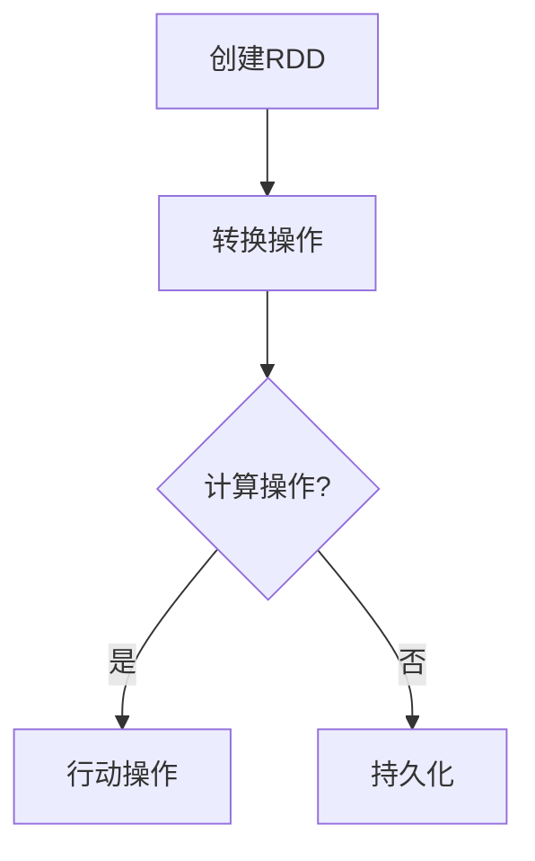

                 

### 文章标题

《RDD原理与代码实例讲解》

本文旨在深入解析分布式计算框架Apache Spark中的基础组件——弹性分布式数据集（Resilient Distributed Dataset，简称RDD）。我们将从RDD的基本概念、架构解析、编程基础，到高级操作、分布式计算原理、项目实战，以及性能优化和未来发展趋势，全方位讲解RDD的核心原理和应用。

通过本文的详细讲解，读者不仅能理解RDD的基本概念和特点，还能掌握RDD的编程基础和高级操作，从而在实际项目中灵活应用RDD，解决大数据处理中的复杂问题。此外，本文还将探讨RDD在分布式计算中的核心原理，展示如何通过RDD进行大规模数据处理，并提供一系列性能优化策略，帮助读者提高数据处理效率。

本文的目标读者是希望深入了解大数据处理技术的开发人员、数据科学家以及计算机科学领域的学生。无论是初学者，还是有一定基础的读者，都可以通过本文的学习，对RDD有一个系统而深刻的认识，从而在分布式计算领域取得更好的成就。

### 文章关键词

- Apache Spark
- RDD（弹性分布式数据集）
- 分布式计算
- 大数据处理
- 编程基础
- 性能优化
- 分布式存储

### 文章摘要

本文将围绕弹性分布式数据集（RDD）展开，详细介绍RDD的基本概念、架构、编程基础、高级操作、分布式计算原理、项目实战和性能优化。通过本文的学习，读者将能够全面理解RDD的核心原理和在实际应用中的重要作用。文章不仅提供了详细的RDD架构解析和代码实例，还探讨了分布式计算中的关键机制，以及性能优化策略。最后，本文还将展望RDD在未来的发展趋势，为读者在分布式计算领域提供有益的参考。

## RDD原理与代码实例讲解

### 第1章 RDD概念与架构

### 1.1 RDD的定义与特点

#### 1.1.1 RDD的基本概念

弹性分布式数据集（Resilient Distributed Dataset，简称RDD）是Apache Spark的核心抽象，它是一个不可变的、可分行的数据集合，支持在集群中分布式存储和处理。RDD可以被视为一个分布式的数据序列，其中每个数据序列都可以分布在多个节点上。RDD提供了一种简化和优化的方式来处理大规模数据，通过惰性求值（lazy evaluation）和分片（partitioning）机制，使得数据并行处理变得更加高效。

RDD的基本概念包括以下几个关键要素：

- **分区（Partition）**：RDD被分为多个分区，每个分区是一个独立的数据块，可以在集群的不同节点上并行处理。
- **依赖（Dependency）**：RDD之间的依赖关系描述了它们之间的数据流转。RDD可以是宽依赖（wide dependencies），即数据可以从任意源分区获取，也可以是窄依赖（narrow dependencies），即数据只从一个源分区获取。
- **惰性求值**：RDD的操作并不是立即执行，而是在定义这些操作时创建一个逻辑计划（logical plan），只有当需要进行实际数据计算时（例如调用行动操作），这个逻辑计划才会被转化为物理执行计划（physical plan）并提交给执行引擎。

#### 1.1.2 RDD的关键特点

RDD作为Spark的核心抽象，具有以下几个显著特点：

- **不可变性**：RDD中的数据一旦创建，就不能修改。这种不可变性确保了数据的一致性，并简化了数据处理的复杂性。
- **惰性求值**：RDD操作并不会立即执行，而是在需要结果时才执行，这种惰性求值机制有助于优化执行计划，减少不必要的计算。
- **容错性**：Spark的RDD支持数据的自动恢复，即使某个节点发生故障，RDD中的数据也可以通过副本进行恢复。
- **弹性**：当处理的数据规模超出内存限制时，Spark可以自动将数据写入磁盘，并重新计算，确保处理过程不会因为内存不足而中断。
- **高效并行处理**：通过分区和依赖关系，RDD支持高效的并行处理，可以在集群中分布式执行操作，提高数据处理速度。

#### 1.1.3 RDD与关系型数据库的比较

RDD和关系型数据库（如MySQL、PostgreSQL）在数据处理方面存在一些显著差异：

- **数据结构**：RDD是一个分布式的、不可变的数据序列，而关系型数据库是一个基于表结构的关系型数据存储系统。
- **操作类型**：RDD支持惰性求值和分布式计算，可以进行复杂的转换操作，而关系型数据库主要提供SQL查询操作，用于数据的检索和简单变换。
- **扩展性**：RDD通过弹性分布式架构支持大规模数据处理，而关系型数据库在数据规模达到一定量级后可能需要通过分库分表等方式进行水平扩展。
- **容错性**：RDD支持自动容错，可以通过副本恢复数据，而关系型数据库通常依赖于数据库的备份和恢复机制。

总的来说，RDD更适合进行复杂的分布式数据处理和迭代计算，而关系型数据库在数据检索和简单变换方面表现更加优秀。

### 1.2 RDD架构解析

#### 1.2.1 RDD的组成

RDD由以下几个核心组成部分构成：

- **分区（Partition）**：RDD被划分为多个分区，每个分区包含一部分数据，可以在集群的不同节点上并行处理。分区是RDD并行处理的基础。
- **依赖关系（Dependency）**：RDD之间的依赖关系描述了它们之间的数据流转。依赖关系可以是宽依赖（如transform操作）或窄依赖（如map操作）。
- **分区器（Partitioner）**：分区器用于确定分区在物理存储中的分布，以确保数据在处理过程中可以被高效地并行访问。
- **内存管理（Memory Management）**：RDD支持内存和磁盘的弹性存储，当内存不足以存储数据时，Spark会自动将数据写入磁盘，并在需要时重新加载到内存中。
- **容错机制（Fault Tolerance）**：Spark通过检查点和日志记录来确保RDD的容错性，即使某个节点发生故障，RDD中的数据也可以通过副本或日志恢复。

#### 1.2.2 RDD的生命周期

RDD的生命周期包括以下几个关键阶段：

- **创建阶段**：通过从外部数据源（如HDFS、本地文件系统）读取数据或通过转换现有的RDD创建新的RDD。
- **依赖建立阶段**：RDD之间的依赖关系在创建阶段建立，包括宽依赖和窄依赖。
- **计算阶段**：当执行RDD的操作时，Spark会根据依赖关系和逻辑计划生成物理执行计划，并在集群中分布式执行计算。
- **持久化阶段**：通过调用持久化操作（如persist或cache），将RDD存储在内存或磁盘上，以减少重复计算和提高性能。
- **清理阶段**：在程序结束时，Spark会清理持久化的RDD，释放内存和磁盘空间。

#### 1.2.3 RDD的内存管理

Spark通过内存管理机制优化RDD的性能，包括以下关键方面：

- **存储层次结构**：Spark将内存划分为两个层次：TLAB（Thread-Local Allocation Buffer）和GIL（Global Ion Memory）。TLAB用于线程局部分配，GIL用于全局分配。
- **内存分配策略**：Spark使用内存池（MemoryPool）管理内存，包括存储内存（StorageMemory）和执行内存（ExecutionMemory）。存储内存用于存储RDD数据，执行内存用于中间计算结果。
- **内存释放策略**：Spark通过惰性释放（Lazy Cleanup）策略优化内存释放，只有在确实需要更多内存时才会释放不再使用的内存。

通过这些内存管理机制，Spark能够在分布式计算中高效利用内存资源，提高数据处理速度和性能。

### 1.3 RDD操作详解

#### 1.3.1 RDD的创建操作

RDD的创建操作是构建分布式数据处理流程的第一步，主要有以下几种方式：

1. **从外部数据源创建**：Spark可以通过读取本地文件系统、HDFS、Amazon S3等外部数据源来创建RDD。例如，使用`sc.textFile(path)`方法可以从HDFS或本地文件系统中读取文本文件，创建一个包含每行字符串的RDD。

```scala
val rdd = sc.textFile("hdfs://path/to/file.txt")
```

2. **从其他RDD转换创建**：Spark可以通过对现有RDD进行转换操作来创建新的RDD。例如，可以使用`rdd.map(func)`方法将现有的RDD中的每个元素通过函数`func`进行转换，创建一个新的RDD。

```scala
val rdd = sc.parallelize(List(1, 2, 3, 4, 5))
val rdd2 = rdd.map(x => x * x)
```

3. **从内存中创建**：Spark还可以直接从内存中创建RDD。例如，可以使用`sc.makeRDD(data)`方法将一个Scala集合（如Array、List）转换为RDD。

```scala
val rdd = sc.makeRDD(List(1, 2, 3, 4, 5))
```

#### 1.3.2 RDD的计算操作

计算操作是RDD中最常用的操作之一，用于执行元素级别的计算。以下是一些常见的计算操作：

1. **map**：对RDD中的每个元素应用一个函数，返回一个新的RDD。例如，将每个整数元素平方：

```scala
val rdd = sc.parallelize(List(1, 2, 3, 4, 5))
val rdd2 = rdd.map(x => x * x)
```

2. **filter**：根据某个条件过滤RDD中的元素，返回一个新的RDD。例如，只保留偶数：

```scala
val rdd = sc.parallelize(List(1, 2, 3, 4, 5))
val rdd2 = rdd.filter(_ % 2 == 0)
```

3. **reduce**：对RDD中的所有元素进行reduce操作，返回单个结果。例如，计算所有元素的和：

```scala
val rdd = sc.parallelize(List(1, 2, 3, 4, 5))
val result = rdd.reduce(_ + _)
```

4. **fold**：类似于reduce，但允许指定初始值。例如，计算所有元素的和：

```scala
val rdd = sc.parallelize(List(1, 2, 3, 4, 5))
val result = rdd.fold(0)(_ + _)
```

5. **groupBy**：根据某个key对RDD进行分组，返回一个Map类型的RDD。例如，根据第一个字符分组：

```scala
val rdd = sc.parallelize(List("apple", "banana", "carrot", "date"))
val rdd2 = rdd.groupBy(s => s.charAt(0))
```

#### 1.3.3 RDD的转换操作

转换操作用于创建新的RDD，通常涉及数据的重新组织和结构变换。以下是一些常见的转换操作：

1. **flatMap**：类似于map，但每个输入元素可以生成零个或多个输出元素。例如，将每个单词拆分成字符：

```scala
val rdd = sc.parallelize(List("apple", "banana", "carrot", "date"))
val rdd2 = rdd.flatMap(s => s.split(" "))
```

2. **mapPartitions**：对RDD的每个分区应用一个迭代器级别的函数，返回一个新的RDD。例如，对每个分区进行排序：

```scala
val rdd = sc.parallelize(List(1, 2, 3, 4, 5))
val rdd2 = rdd.mapPartitions(iter => iter.sorted)
```

3. **reduceByKey**：对具有相同key的多个值进行reduce操作，返回一个新的RDD。例如，计算每个key的总和：

```scala
val rdd = sc.parallelize(List((1, 2), (1, 3), (2, 4), (2, 5)))
val rdd2 = rdd.reduceByKey(_ + _)
```

4. **sortByKey**：根据key对RDD进行排序，返回一个新的RDD。例如，根据单词长度排序：

```scala
val rdd = sc.parallelize(List("apple", "banana", "carrot", "date"))
val rdd2 = rdd.sortByKey()
```

5. **join**：将两个RDD根据key进行内连接，返回一个新的RDD。例如，将两个单词列表根据单词连接：

```scala
val rdd1 = sc.parallelize(List((1, "apple"), (2, "banana"), (3, "carrot")))
val rdd2 = sc.parallelize(List((2, "date"), (3, "fig"), (4, "grape")))
val rdd3 = rdd1.join(rdd2)
```

#### 1.3.4 RDD的行动操作

行动操作会触发实际的数据计算，并返回结果。以下是一些常见的行动操作：

1. **collect**：将RDD中的所有元素收集到一个Scala集合中。例如，收集所有元素：

```scala
val rdd = sc.parallelize(List(1, 2, 3, 4, 5))
val result = rdd.collect()
```

2. **count**：返回RDD中元素的数量。例如，计算元素数量：

```scala
val rdd = sc.parallelize(List(1, 2, 3, 4, 5))
val result = rdd.count()
```

3. **first**：返回RDD中的第一个元素。例如，获取第一个元素：

```scala
val rdd = sc.parallelize(List(1, 2, 3, 4, 5))
val result = rdd.first()
```

4. **take**：返回RDD中的前n个元素。例如，获取前两个元素：

```scala
val rdd = sc.parallelize(List(1, 2, 3, 4, 5))
val result = rdd.take(2)
```

5. **saveAsTextFile**：将RDD保存为文本文件。例如，保存为文件：

```scala
val rdd = sc.parallelize(List("apple", "banana", "carrot", "date"))
rdd.saveAsTextFile("hdfs://path/to/output")
```

行动操作会触发整个RDD的执行，因此在执行行动操作之前，应先进行必要的转换操作，以优化执行计划。

### 第2章 RDD编程基础

#### 2.1 Scala编程基础

Scala是一种多范式编程语言，结合了面向对象和函数式编程的特性，是Apache Spark的主要编程语言。Scala的语法简洁且功能强大，适合用于分布式计算场景。本节将介绍Scala编程基础，包括其特点、语法入门和函数式编程。

##### 2.1.1 Scala语言特点

Scala具有以下主要特点：

- **多范式编程**：Scala支持面向对象和函数式编程，使得开发者可以根据具体需求选择最合适的编程范式。
- **类型推断**：Scala提供了强大的类型推断机制，可以在代码中不显式声明变量类型，提高了代码的可读性。
- **隐式转换**：Scala允许通过隐式转换在类型之间进行转换，增强了代码的灵活性和扩展性。
- **模式匹配**：Scala支持模式匹配，可以用于分支结构，提高了代码的可读性和可维护性。
- **集合操作**：Scala提供了丰富的集合操作，如map、filter、flatMap等，支持对集合的高效处理。

##### 2.1.2 Scala语法入门

Scala的基本语法包括变量声明、函数定义、控制结构和循环等。以下是一个简单的Scala代码示例：

```scala
// 变量声明
val name = "Alice"
var age = 30

// 函数定义
def greet(person: String): String = {
  s"Hello, $person!"
}

// 控制结构
if (age > 18) {
  println("成人")
} else {
  println("未成年")
}

// 循环
for (i <- 1 to 5) {
  println(i)
}

// 函数调用
println(greet(name))
```

通过以上示例，可以初步了解Scala的基本语法和编程风格。

##### 2.1.3 Scala函数式编程

Scala的函数式编程特性使得它非常适合用于分布式计算。以下是Scala函数式编程的几个关键概念：

- **函数作为一等公民**：Scala将函数视为一等公民，可以像变量一样传递、存储和操作函数。
- **高阶函数**：Scala支持高阶函数，即函数可以接受其他函数作为参数或返回函数。
- **懒加载**：Scala提供了懒加载（Lazy Evaluation）机制，可以延迟计算，提高程序性能。
- **偏应用函数**：Scala支持偏应用函数，可以将一个函数的部分参数预先设置好，提高代码复用性。

以下是一个使用函数式编程风格的示例：

```scala
// 高阶函数
def applyFunction(f: Int => Int, x: Int): Int = f(x)

// 懒加载
val lazyValue = {
  println("计算中...")
  10
}

// 偏应用函数
def add(a: Int, b: Int): Int = a + b
val addFive = add(5, _: Int)
```

通过学习Scala的函数式编程，可以更有效地编写分布式数据处理代码。

#### 2.2 Spark安装与配置

在开始使用Apache Spark进行分布式数据处理之前，需要正确安装和配置Spark环境。以下将详细介绍Spark的安装步骤、配置文件详解以及Spark运行模式。

##### 2.2.1 Spark环境搭建

1. **下载Spark**：从Apache Spark官网（https://spark.apache.org/downloads.html）下载最新版本的Spark压缩包。下载后，解压到指定的目录，例如`/usr/local/spark`。

2. **环境变量配置**：在`~/.bashrc`或`~/.zshrc`文件中添加以下环境变量：

   ```bash
   export SPARK_HOME=/usr/local/spark
   export PATH=$PATH:$SPARK_HOME/bin
   ```

   然后执行`source ~/.bashrc`或`source ~/.zshrc`使变量生效。

3. **启动Spark Shell**：在终端中运行以下命令启动Spark Shell：

   ```bash
   spark-shell
   ```

   在Shell中，可以直接使用Scala语法进行Spark编程。

##### 2.2.2 Spark配置文件详解

Spark的配置文件主要包括`spark.conf`和`spark-defaults.conf`，用于配置Spark的各种参数。以下是一些常用的配置参数：

1. **`spark.conf`**：

   - `spark.app.name`：应用程序的名称。
   - `spark.master`：Spark集群的URI，例如`local`、`spark://master:7077`。
   - `spark.executor.memory`：每个执行器的内存大小。
   - `spark.executor.cores`：每个执行器的核心数量。
   - `spark.driver.memory`：驱动器的内存大小。

2. **`spark-defaults.conf`**：

   - `spark.sql.shuffle.partitions`：每个任务进行Shuffle操作时的分区数量。
   - `spark.default.parallelism`：默认的并行度。
   - `spark.memory.fraction`：内存分配给执行内存的比例。
   - `spark.memory.storageFraction`：内存分配给存储内存的比例。

以下是一个示例的`spark-defaults.conf`文件：

```bash
# spark.app.name My Spark Application
# spark.master spark://master:7077
# spark.executor.memory 4g
# spark.executor.cores 2
# spark.driver.memory 2g
# spark.sql.shuffle.partitions 200
# spark.default.parallelism 200
# spark.memory.fraction 0.6
# spark.memory.storageFraction 0.5
```

##### 2.2.3 Spark运行模式

Spark支持多种运行模式，包括本地模式、集群模式和YARN模式。以下是对每种模式的简要介绍：

1. **本地模式**：在本地模式下，Spark使用本地文件系统进行数据存储和处理，适用于开发和测试环境。

   ```bash
   spark-submit --master local[*] /path/to/spark-app.jar
   ```

2. **集群模式**：在集群模式下，Spark运行在一个分布式集群上，可以通过`spark://master:7077`或YARN等方式进行调度。

   ```bash
   spark-submit --master spark://master:7077 /path/to/spark-app.jar
   ```

3. **YARN模式**：在YARN模式下，Spark通过Hadoop YARN资源调度框架运行，适用于大规模生产环境。

   ```bash
   spark-submit --master yarn --num-executors 4 --executor-memory 4g --executor-cores 2 /path/to/spark-app.jar
   ```

通过以上步骤，读者可以成功搭建和配置Spark环境，为后续的分布式数据处理做好准备。

#### 2.3 RDD创建与操作实例

在本节中，我们将通过具体的代码实例来展示如何创建RDD以及进行一些基础操作，包括从文件读取RDD、简单的转换和计算操作。这些实例将帮助读者更好地理解RDD的用法和实际应用。

##### 2.3.1 创建空RDD

首先，我们来创建一个空RDD。在Spark中，可以通过`makeRDD`方法从Scala集合或数组中创建RDD。

```scala
val data = List(1, 2, 3, 4, 5)
val rdd = sc.parallelize(data)
```

在上面的代码中，我们使用`sc.parallelize`方法将一个Scala列表`data`转换为RDD。`parallelize`方法将数据分布在集群的多个节点上，使得后续处理可以并行进行。

##### 2.3.2 从文件读取RDD

从外部文件系统（如HDFS或本地文件系统）读取数据是Spark中的常见操作。这里，我们以从本地文件系统读取文本文件为例。

```scala
val rdd = sc.textFile("hdfs://path/to/file.txt")
```

在上述代码中，`textFile`方法用于读取文本文件，并返回一个包含每行字符串的RDD。这里的`path/to/file.txt`是文件路径，可以替换为实际文件路径。

##### 2.3.3 简单转换与计算操作

接下来，我们展示如何对RDD进行一些简单的转换和计算操作。以下是几个常见操作的示例：

1. **map**：对每个元素应用一个函数，返回一个新的RDD。

```scala
val rdd = sc.parallelize(List(1, 2, 3, 4, 5))
val rdd2 = rdd.map(x => x * x)
```

在这个例子中，`rdd2`是一个新创建的RDD，包含原RDD中每个元素平方后的结果。

2. **filter**：根据某个条件过滤元素，返回一个新的RDD。

```scala
val rdd = sc.parallelize(List(1, 2, 3, 4, 5))
val rdd2 = rdd.filter(_ % 2 == 0)
```

这个例子中，`rdd2`只包含原RDD中的偶数元素。

3. **reduce**：对RDD中的所有元素进行reduce操作，返回单个结果。

```scala
val rdd = sc.parallelize(List(1, 2, 3, 4, 5))
val result = rdd.reduce(_ + _)
```

在这个例子中，`result`是原RDD中所有元素的和。

4. **groupBy**：根据某个key对RDD进行分组，返回一个Map类型的RDD。

```scala
val rdd = sc.parallelize(List("apple", "banana", "carrot", "date"))
val rdd2 = rdd.groupBy(s => s.charAt(0))
```

这个例子中，`rdd2`是一个包含键为字符、值为列表的Map。

5. **collect**：将RDD中的所有元素收集到一个Scala集合中。

```scala
val rdd = sc.parallelize(List(1, 2, 3, 4, 5))
val result = rdd.collect()
```

在这个例子中，`result`是一个包含原RDD中所有元素的Scala集合。

通过以上实例，读者可以了解如何创建和操作RDD。在实际应用中，可以根据具体需求组合使用这些操作，实现复杂的数据处理任务。

### 第3章 RDD高级操作

#### 3.1 RDD分区与并行度

RDD的分区和并行度是理解Spark分布式计算的重要概念，对于性能优化和数据处理的效率有着直接的影响。在本节中，我们将详细讨论RDD分区的概念、分区策略，以及如何调整并行度。

##### 3.1.1 RDD分区的概念

分区是将数据划分为多个独立块的过程，每个块可以独立处理。在Spark中，RDD的分区是一个核心概念，决定了数据如何在集群中分布和处理。

- **分区（Partition）**：分区是RDD的基本组成单元，每个分区包含一部分数据。每个分区都可以在集群的不同节点上并行处理，这大大提高了计算效率。
- **分区器（Partitioner）**：分区器用于确定分区在物理存储中的分布。Spark提供了多种分区器，如`HashPartitioner`和`RangePartitioner`。

##### 3.1.2 RDD分区策略

Spark提供了多种分区策略，以适应不同的数据处理需求：

- **默认分区策略**：如果没有指定分区策略，Spark会使用默认的分区策略，将数据划分为一个分区。这种策略适用于简单的数据处理场景。
- **Hash分区**：`HashPartitioner`根据元素的hash值将数据分布到不同的分区。这种策略适用于需要按照key进行数据分组的场景，例如`reduceByKey`操作。
  
  ```scala
  val rdd = sc.parallelize(List((1, "apple"), (2, "banana"), (3, "carrot")))
  val rdd2 = rdd.partitionBy(new HashPartitioner(3))
  ```

- **Range分区**：`RangePartitioner`将数据按照key的区间划分到不同的分区。这种策略适用于有序数据，例如在SQL查询中使用`sortByKey`操作。
  
  ```scala
  val rdd = sc.parallelize(List((1, "apple"), (2, "banana"), (3, "carrot"), (4, "date")))
  val rdd2 = rdd.partitionBy(new RangePartitioner(2, new HashPartitioner(2)))
  ```

##### 3.1.3 并行度的调整

并行度（Parallelism）决定了Spark在进行任务调度时创建的分区数。适当的并行度可以提高数据处理速度，但过高的并行度可能会导致资源浪费和性能下降。以下是如何调整并行度：

- **默认并行度**：Spark默认的并行度通常是CPU核心数的2倍。可以通过`spark.default.parallelism`配置参数调整默认并行度。
  
  ```scala
  sc.defaultParallelism = 200
  ```

- **任务级并行度**：在执行任务时，可以通过指定`numPartitions`参数来设置任务的并行度。
  
  ```scala
  val rdd = sc.parallelize(data, numPartitions = 100)
  ```

- **操作级并行度**：一些Spark操作（如`map`、`reduceByKey`等）允许通过`partitioner`参数指定分区策略和并行度。
  
  ```scala
  val rdd2 = rdd.map(x => (x._1, x._2), partitioner = new HashPartitioner(3))
  ```

通过合理地调整分区和并行度，可以优化Spark的分布式计算性能。在具体应用中，需要根据数据规模和处理需求进行适当的调整。

#### 3.2 RDD持久化与缓存

RDD的持久化（持久化）和缓存（缓存）是提高Spark应用程序性能的关键策略。持久化可以将RDD数据存储在内存或磁盘上，以便在后续操作中快速访问。缓存是一种特殊的持久化，主要用于频繁访问的RDD，以减少计算时间和资源消耗。在本节中，我们将讨论持久化的概念、持久化级别，以及缓存机制。

##### 3.2.1 持久化概念

持久化（Persistence）是指将RDD的数据保存到内存或磁盘的过程。通过持久化，可以在后续操作中避免重复计算，提高数据处理效率。

- **内存持久化**：将RDD数据存储在内存中，提供最快的访问速度。但受限于内存大小，可能无法存储大量数据。
- **磁盘持久化**：将RDD数据存储在磁盘上，可以存储大量数据，但访问速度相对较慢。

持久化可以防止数据在计算过程中丢失，并提供以下好处：

- **避免重复计算**：持久化的RDD可以在后续操作中直接使用，避免重复计算，提高性能。
- **提高可恢复性**：持久化的RDD可以在节点故障时恢复，确保数据一致性。

##### 3.2.2 持久化级别

Spark提供了多种持久化级别，用于根据具体需求选择合适的存储方式。以下是一些常用的持久化级别：

- **内存（Memory）**：数据存储在内存中，提供最快的访问速度。但受限于内存大小，可能无法存储大量数据。
- **磁盘（Disk）**：数据存储在磁盘上，可以存储大量数据，但访问速度相对较慢。
- **内存和磁盘（MemoryAndDisk）**：同时存储在内存和磁盘上，首先尝试从内存中读取，如果内存中不存在，则从磁盘读取。
- **序列化（Serialized）**：数据以序列化形式存储，可以减少存储空间占用，但读取速度较慢。
- **压缩（Compressed）**：数据在存储时进行压缩，减少存储空间占用，但需要额外的解压缩时间。

持久化级别的选择取决于数据规模和访问模式。以下示例展示了如何使用不同的持久化级别：

```scala
val rdd = sc.parallelize(data)
rdd.persist(StorageLevel.MEMORY_ONLY) // 内存持久化
rdd.persist(StorageLevel.MEMORY_AND_DISK) // 内存和磁盘持久化
rdd.persist(StorageLevel.DISK_ONLY) // 磁盘持久化
rdd.persist(StorageLevel.MEMORY_ONLY_SER) // 内存持久化，序列化存储
```

##### 3.2.3 缓存机制

缓存（Caching）是一种特殊的持久化，主要用于频繁访问的RDD。通过缓存，可以在内存中保留经常使用的RDD，避免重复计算，提高性能。

- **自动缓存**：当执行行动操作时，Spark会自动缓存结果。例如，调用`saveAsTextFile`时，会缓存RDD。
- **显式缓存**：可以通过`cache()`或`persist()`方法显式缓存RDD。例如：

  ```scala
  val rdd = sc.parallelize(data)
  rdd.cache()
  rdd.persist(StorageLevel.MEMORY_ONLY)
  ```

缓存机制提供了以下好处：

- **减少计算时间**：频繁访问的RDD可以直接从缓存中读取，减少计算时间。
- **提高系统稳定性**：缓存可以在节点故障时恢复，提高系统的稳定性。

通过合理地使用持久化和缓存，可以优化Spark应用程序的性能，提高数据处理效率。

#### 3.3 RDD的聚合操作

RDD的聚合操作（Aggregation Operations）是Spark中用于对数据进行汇总计算的重要工具。聚合操作可以将RDD中的元素按照特定的规则进行分组和汇总，产生新的RDD或单个值。本节将详细介绍Spark中的聚合操作原理，并通过具体实例展示如何使用这些操作。

##### 3.3.1 聚合操作原理

聚合操作通常涉及以下步骤：

1. **分组（Grouping）**：根据某个key对RDD进行分组，使得具有相同key的元素被分到同一组。
2. **应用reduce操作**：对每个分组中的元素应用reduce操作，例如求和、求平均或计数。
3. **生成结果**：聚合操作生成一个新的RDD或单个值，表示整个数据集的汇总结果。

聚合操作可以分为两类：值聚合（Value-based Aggregation）和分区聚合（Partition-based Aggregation）。

- **值聚合**：值聚合操作（如`reduceByKey`、`aggregateByKey`等）对具有相同key的多个值进行聚合。这种操作适用于需要对数据按key进行汇总的场景。

  ```scala
  val rdd = sc.parallelize(List((1, 2), (1, 3), (2, 4), (2, 5)))
  val rdd2 = rdd.reduceByKey(_ + _)
  ```

- **分区聚合**：分区聚合操作（如`reduceByKey`、`groupByKey`等）对RDD的所有元素进行分组和聚合，然后返回每个分区的结果。这种操作适用于需要将所有数据分组汇总的场景。

  ```scala
  val rdd = sc.parallelize(List((1, 2), (1, 3), (2, 4), (2, 5)))
  val rdd2 = rdd.reduceByKey(_ + _)
  ```

##### 3.3.2 聚合操作实例

以下是一些聚合操作的实例，展示了如何使用Spark进行数据的汇总计算。

1. **reduceByKey**：计算每个key的总和。

   ```scala
   val rdd = sc.parallelize(List((1, 2), (1, 3), (2, 4), (2, 5)))
   val rdd2 = rdd.reduceByKey(_ + _)
   rdd2.collect() // 结果：(1, 5), (2, 9)
   ```

2. **groupByKey**：按照key进行分组，返回每个key对应的元素列表。

   ```scala
   val rdd = sc.parallelize(List((1, 2), (1, 3), (2, 4), (2, 5)))
   val rdd2 = rdd.groupByKey()
   rdd2.collect() // 结果：(1, List(2, 3)), (2, List(4, 5))
   ```

3. **aggregateByKey**：自定义聚合函数，计算每个key的累加和。

   ```scala
   val rdd = sc.parallelize(List((1, 2), (1, 3), (2, 4), (2, 5)))
   val rdd2 = rdd.aggregateByKey(0)(_ + _, _ + _)
   rdd2.collect() // 结果：(1, 5), (2, 9)
   ```

4. **foldByKey**：类似于reduceByKey，但允许指定初始值。

   ```scala
   val rdd = sc.parallelize(List((1, 2), (1, 3), (2, 4), (2, 5)))
   val rdd2 = rdd.foldByKey(0)(_ + _)
   rdd2.collect() // 结果：(1, 5), (2, 9)
   ```

通过以上实例，读者可以了解如何使用RDD的聚合操作进行数据汇总。在实际应用中，可以根据具体需求选择合适的聚合操作，实现复杂的汇总计算任务。

### 第4章 RDD与大数据存储系统

#### 4.1 HDFS与Spark的关系

Hadoop分布式文件系统（HDFS）和Apache Spark是大数据处理领域的重要组件，它们在分布式存储和处理大规模数据方面有着紧密的联系。在本节中，我们将介绍HDFS的架构简介，以及Spark与HDFS的交互机制。

##### 4.1.1 HDFS架构简介

HDFS是一个分布式文件系统，用于存储和处理大规模数据。其架构主要包括以下几个关键组成部分：

- **NameNode**：NameNode是HDFS的主节点，负责管理文件系统的命名空间，维护文件与块之间的映射关系。它记录每个文件所在的块的位置，并协调数据块的分配和复制。
- **DataNode**：DataNode是HDFS的从节点，负责实际的数据存储和检索。每个DataNode存储一个或多个数据块，并对NameNode的指令进行响应，执行数据块的读写操作。
- **数据块（Block）**：HDFS将数据划分为固定大小的块，默认大小为128MB或256MB。每个块都被复制到多个DataNode上，以提供容错性和高可用性。

HDFS的工作原理如下：

1. **文件写入**：当客户端向HDFS写入文件时，数据首先被切分成多个块，然后这些块被发送到不同的DataNode上。NameNode负责协调这些操作，确保数据块的完整性和可靠性。
2. **文件读取**：当客户端请求读取文件时，NameNode返回文件所在的数据块的位置，客户端直接从这些数据块所在的数据节点上读取数据。

##### 4.1.2 Spark与HDFS的交互

Spark作为分布式计算框架，需要与HDFS进行高效的数据交互，以处理大规模数据。以下是Spark与HDFS的交互机制：

- **文件读取**：Spark可以通过`textFile`、`parallelize`等方法从HDFS中读取数据，并将其转换为RDD。读取过程由Spark Driver与HDFS NameNode进行协调，数据块从DataNode上读取到Executor节点。
  
  ```scala
  val rdd = sc.textFile("hdfs://path/to/file.txt")
  ```

- **文件写入**：Spark可以通过`saveAsTextFile`、`saveAsSequenceFile`等方法将RDD保存到HDFS。写入过程由Spark Driver与HDFS NameNode协调，数据块被发送到DataNode上存储。

  ```scala
  rdd.saveAsTextFile("hdfs://path/to/output")
  ```

- **数据复制与容错**：Spark利用HDFS的副本机制，确保数据在处理过程中具有高可用性。当某个节点发生故障时，Spark可以自动从其他副本节点上读取数据，继续执行计算。

通过以上交互机制，Spark与HDFS共同构建了一个强大的分布式数据处理系统，能够高效地处理大规模数据。

#### 4.2 Hadoop与Spark集成

Apache Hadoop和Apache Spark在分布式数据处理领域有着紧密的联系，二者集成可以充分发挥各自的优势，实现更高效的大数据处理。本节将介绍如何将Hadoop与Spark集成，以及Hadoop操作在Spark中的实现。

##### 4.2.1 Hadoop配置与Spark集成

要将Hadoop与Spark集成，需要在Hadoop和Spark环境中配置相应的参数，确保二者能够正确通信。以下是具体的配置步骤：

1. **环境变量配置**：在Hadoop和Spark的环境变量中配置HDFS和YARN的相关参数。

   ```bash
   export HADOOP_HOME=/path/to/hadoop
   export SPARK_HOME=/path/to/spark
   export HDFS_OPTS="-Dhadoop.home.dir=/path/to/hadoop"
   export SPARK_HDFS_OPTIONS="--conf spark.hadoop.fs.hdfs.impl.org.apache.hadoop.hdfs.DistributedFileSystem"
   export SPARK_YARN_OPTIONS="--conf spark.executor.resourceProvider.yarn --conf spark.eventLog.enabled=true"
   ```

2. **配置文件**：在Hadoop的`hdfs-site.xml`和`core-site.xml`中配置HDFS的相关参数，例如HDFS的NameNode地址和存储路径。

   ```xml
   <property>
     <name>fs.hdfs.impl</name>
     <value>org.apache.hadoop.hdfs.DistributedFileSystem</value>
   </property>
   ```

   在Spark的`spark-defaults.conf`文件中配置Spark与Hadoop的交互参数，例如HDFS和YARN的配置。

   ```bash
   spark.executor.resourceProvider.yarn=true
   spark.eventLog.enabled=true
   ```

3. **启动Hadoop和Spark**：确保Hadoop和Spark的服务正确启动，例如启动HDFS NameNode和DataNode，以及Spark Master和Executor。

   ```bash
   start-dfs.sh
   start-yarn.sh
   spark-shell
   ```

通过以上配置步骤，可以将Hadoop与Spark集成，使Spark能够使用Hadoop的分布式存储和资源调度能力。

##### 4.2.2 Hadoop操作在Spark中的实现

Spark通过其Hadoop支持库（HadoopSerialization）提供了对Hadoop操作的支持，使得Spark应用程序能够执行Hadoop操作。以下是一些常见的Hadoop操作在Spark中的实现：

1. **读取HDFS文件**：Spark可以使用`SparkContext`的`textFile`、`sequenceFile`等方法读取HDFS文件，并将其转换为RDD。

   ```scala
   val rdd = sc.textFile("hdfs://path/to/file.txt")
   ```

2. **写入HDFS文件**：Spark可以使用`RDD`的`saveAsTextFile`、`saveAsSequenceFile`等方法将RDD保存到HDFS。

   ```scala
   rdd.saveAsTextFile("hdfs://path/to/output")
   ```

3. **HDFS目录操作**：Spark可以通过`HadoopFile`或`SeqFile`读取HDFS的目录结构，执行如列出目录、创建目录等操作。

   ```scala
   val files = sc.hadoopFile[Text]("hdfs://path/to/directory", classOf[TextInputFormat])
   ```

4. **执行MapReduce作业**：Spark可以通过`SparkContext`的`copyToHDFS`方法将MapReduce作业的输入和输出路径设置为HDFS路径。

   ```scala
   sc.copyToHDFS("hdfs://path/to/input", "hdfs://path/to/output")
   ```

通过这些实现，Spark应用程序可以充分利用Hadoop的分布式存储和计算能力，实现高效的大数据处理。

#### 4.3 文件读取与写入

在Spark中，文件读取与写入是常见的操作，用于加载和处理数据。Spark支持多种文件格式和存储系统，包括本地文件系统、HDFS、Amazon S3等。以下将详细介绍如何在Spark中进行文件读取与写入。

##### 4.3.1 RDD的文件读取

Spark提供了多种方法来从不同类型的文件中读取数据，包括文本文件、序列化文件、Parquet文件等。以下是几种常用的文件读取方法：

1. **读取文本文件**：

   ```scala
   val rdd = sc.textFile("hdfs://path/to/file.txt")
   ```

   `textFile`方法用于读取文本文件，返回一个包含每行字符串的RDD。

2. **读取序列化文件**：

   ```scala
   val rdd = sc.sequenceFile[Text, Int]("hdfs://path/to/file.seq")
   ```

   `sequenceFile`方法用于读取序列化文件，返回一个由键值对组成的RDD。

3. **读取Parquet文件**：

   ```scala
   val rdd = sc.parquetFile("hdfs://path/to/file.parquet")
   ```

   `parquetFile`方法用于读取Parquet文件，返回一个结构化的RDD。

4. **读取其他格式文件**：

   Spark还支持读取其他格式的文件，例如CSV、JSON等。可以通过相应的读取方法或使用`Dataset`和`DataFrame`进行读取。

   ```scala
   val rdd = sc.read.csv("hdfs://path/to/file.csv")
   val rdd = sc.read.json("hdfs://path/to/file.json")
   ```

通过以上方法，可以根据具体需求选择合适的文件读取方式，将数据加载到Spark中进行处理。

##### 4.3.2 RDD的文件写入

Spark同样提供了多种方法来将数据保存到不同类型的文件中。以下是几种常用的文件写入方法：

1. **写入文本文件**：

   ```scala
   rdd.saveAsTextFile("hdfs://path/to/output.txt")
   ```

   `saveAsTextFile`方法用于将RDD中的每个元素保存为一个文本文件。

2. **写入序列化文件**：

   ```scala
   rdd.saveAsSequenceFile("hdfs://path/to/output.seq")
   ```

   `saveAsSequenceFile`方法用于将RDD中的键值对保存为序列化文件。

3. **写入Parquet文件**：

   ```scala
   rdd.write.parquet("hdfs://path/to/output.parquet")
   ```

   `write.parquet`方法用于将结构化的RDD保存为Parquet文件。

4. **写入其他格式文件**：

   Spark还支持将数据保存为其他格式的文件，例如CSV、JSON等。

   ```scala
   rdd.write.csv("hdfs://path/to/output.csv")
   rdd.write.json("hdfs://path/to/output.json")
   ```

通过以上方法，可以将处理后的数据保存到不同的文件格式中，以便进行后续分析和处理。

通过RDD的文件读取与写入操作，Spark能够高效地加载和处理大规模数据，为大数据应用提供强大的数据输入输出能力。

### 第5章 RDD分布式计算原理

#### 5.1 分布式计算基础

分布式计算是一种通过将计算任务分配到多个计算机（节点）上，协同处理大规模数据的方法。在分布式计算中，数据和处理任务可以分布在不同的节点上，从而提高计算速度和效率。本节将介绍分布式计算的基本概念、计算模型和一致性协议。

##### 5.1.1 分布式计算模型

分布式计算模型描述了计算任务在分布式系统中的分配和执行方式。以下是几种常见的分布式计算模型：

- **主从模型（Master-Slave Model）**：在主从模型中，系统由一个主节点（Master）和多个从节点（Slave）组成。主节点负责协调和管理从节点的任务分配，从节点执行具体的计算任务。这种模型简单易实现，适用于任务分发和负载均衡。

- **对等模型（Peer-to-Peer Model）**：在对等模型中，所有节点都是对等的，没有明确的主从关系。每个节点既可以作为客户端请求计算任务，也可以作为服务器执行计算任务。这种模型适用于大规模分布式系统，具有良好的扩展性和容错性。

- **集群模型（Cluster Model）**：在集群模型中，多个计算节点组成一个集群，共同协作完成大规模计算任务。集群中的节点通过分布式文件系统和通信协议进行数据共享和任务协调。这种模型适用于高性能计算和大数据处理。

##### 5.1.2 分布式一致性协议

分布式一致性协议是确保分布式系统在多个节点上保持数据一致性的关键机制。以下是一些常见的一致性协议：

- **强一致性（Strong Consistency）**：强一致性保证所有节点在任何时刻看到的数据都是一致的。即任何一次写操作在所有节点上都可见，并且后续的读操作返回最新的写入值。但强一致性可能导致性能瓶颈和单点故障问题。

- **最终一致性（Eventual Consistency）**：最终一致性保证系统最终会达到一致状态，但允许在一定时间内出现不一致的情况。即任何一次写操作最终会被所有节点感知到，并且后续的读操作返回最新的写入值。最终一致性适用于高并发和容错性要求较高的场景。

- **因果一致性（Causal Consistency）**：因果一致性保证操作的因果顺序在不同节点上一致。即如果一个操作A先于操作B发生，那么在所有节点上，操作A的结果都将在操作B之前可见。这种协议适用于需要保证事件因果顺序的场景。

- **读己所写一致性（Read-your-writes Consistency）**：读己所写一致性保证一个节点在其写入之后立即能看到写入的结果。即如果一个节点写入了一条数据，那么在它后续的读操作中，可以立即看到这条写入的数据。这种协议简化了一致性管理，但可能牺牲一些性能。

通过了解分布式计算模型和一致性协议，可以更好地设计和实现分布式系统，提高计算效率和数据一致性。

#### 5.2 Spark的分布式计算机制

Apache Spark是一个强大的分布式计算框架，通过其独特的分布式计算机制，能够高效地处理大规模数据。在本节中，我们将详细讨论Spark的调度机制、执行引擎和故障恢复机制，以帮助读者深入理解Spark的分布式计算过程。

##### 5.2.1 Spark的调度机制

Spark的调度机制是确保任务在分布式环境中高效执行的关键部分。Spark的调度器（DAG Scheduler）和任务调度器（Task Scheduler）共同协作，实现任务的分配和执行。

1. **DAG Scheduler**：DAG Scheduler负责将用户提交的作业（Job）拆解成多个任务（Task），并将它们组织成一个有向无环图（DAG）。每个任务可能依赖于其他任务的输出结果，这种依赖关系形成了图的结构。DAG Scheduler的主要职责包括：

   - **作业拆解**：将用户的查询操作拆解成多个RDD操作和行动操作。
   - **任务生成**：根据RDD的依赖关系，生成相应的任务。
   - **任务排序**：将任务按照依赖关系排序，确保任务按顺序执行。

2. **Task Scheduler**：Task Scheduler负责将生成的任务分配到集群中的执行节点（Executor）上执行。Task Scheduler的工作流程如下：

   - **任务队列**：Task Scheduler维护一个任务队列，根据任务的依赖关系和执行优先级，依次将任务分配给可用的执行节点。
   - **任务分配**：当一个执行节点空闲时，Task Scheduler将待执行的任务分配给它，并将任务信息发送给该节点。
   - **任务执行**：执行节点根据接收到的任务信息，执行相应的计算操作，并将结果返回给Task Scheduler。

通过DAG Scheduler和Task Scheduler的协同工作，Spark能够高效地调度和管理任务，确保分布式计算的高效性和可靠性。

##### 5.2.2 Spark的执行引擎

Spark的执行引擎（Execution Engine）是负责具体任务执行的核心组件，其主要职责是将任务转换为实际的计算过程，并在执行过程中进行资源管理和调度。

1. **执行过程**：执行引擎的工作流程如下：

   - **任务初始化**：执行引擎根据Task Scheduler分配的任务信息，初始化任务所需的数据和计算逻辑。
   - **数据分片**：任务的数据被划分为多个数据分片（Partition），每个分片可以在不同的执行节点上并行处理。
   - **任务执行**：执行引擎将每个分片分配给可用的执行节点，执行节点上的执行器（Executor）按照分片顺序执行计算操作。
   - **结果收集**：执行引擎收集各个执行节点的执行结果，并按照任务的依赖关系进行合并，生成最终的输出结果。

2. **资源管理**：执行引擎负责管理集群中的计算资源，包括Executor的分配、内存管理、任务调度等。执行引擎的主要职责包括：

   - **Executor管理**：执行引擎根据任务需求，动态分配Executor，并在任务完成后回收资源。
   - **内存管理**：执行引擎对每个Executor的内存进行精细管理，确保内存分配和释放的高效性。
   - **任务调度**：执行引擎根据任务优先级和资源可用性，动态调整任务执行顺序，优化任务调度策略。

通过执行引擎的精细管理和调度，Spark能够高效地利用集群资源，实现大规模数据的高效处理。

##### 5.2.3 Spark的故障恢复机制

Spark的故障恢复机制是确保系统稳定性和数据完整性的关键部分。Spark通过以下机制实现故障恢复：

1. **数据持久化**：Spark将关键数据（如RDD）持久化到内存或磁盘上，确保在节点故障时数据不会丢失。

2. **检查点（Checkpoint）**：Spark支持对RDD进行检查点操作，将RDD的状态保存到外部存储中。在节点故障时，Spark可以回滚到最近的检查点，确保计算一致性。

3. **日志记录**：Spark记录详细的执行日志，包括任务执行时间、节点状态、错误信息等。通过分析日志，可以快速定位故障原因，并进行故障恢复。

4. **节点监控**：Spark对集群中的节点进行实时监控，检测节点的健康状态。当节点发生故障时，Spark可以自动进行节点替换和任务重调度，确保系统的高可用性。

通过故障恢复机制，Spark能够确保在分布式计算过程中，即使发生节点故障，也能快速恢复，保证数据一致性和系统稳定性。

通过以上对Spark分布式计算机制的详细讲解，读者可以深入理解Spark的调度、执行和故障恢复过程，为在实际项目中高效地应用Spark打下坚实的基础。

#### 5.3 RDD的分布式处理

RDD的分布式处理是Apache Spark的核心特性之一，它使得大规模数据的并行处理变得高效且可扩展。RDD的分布式处理包括数据的分区、并行度的调整以及分布式缓存。本节将详细介绍这些关键概念及其实现方法。

##### 5.3.1 RDD的分区与并行处理

分区（Partitioning）是将RDD的数据划分为多个独立的部分，以便在多个节点上并行处理。分区是RDD并行处理的基础，合理选择分区策略可以显著提高处理效率。

1. **分区策略**：Spark提供了多种分区策略，包括Hash分区、范围分区等。

   - **Hash分区（Hash Partitioner）**：Hash分区通过将元素的hash值映射到分区编号，实现数据的均匀分布。这种方式简单且高效，适用于大部分场景。

     ```scala
     val rdd = sc.parallelize(data, numPartitions = 10)
     rdd.partitionBy(new HashPartitioner(10))
     ```

   - **范围分区（Range Partitioner）**：范围分区将数据按照key的区间划分到不同的分区。这种方式适用于有序数据，例如SQL查询中的`sortByKey`操作。

     ```scala
     val rdd = sc.parallelize(data)
     rdd.partitionBy(new RangePartitioner(10, new HashPartitioner(10)))
     ```

2. **并行处理**：通过分区，RDD可以在多个节点上并行处理。每个分区可以在单独的节点上独立执行计算，从而提高处理速度和效率。

   ```scala
   val rdd = sc.parallelize(data, numPartitions = 10)
   val rdd2 = rdd.map(x => x * x)
   rdd2.collect() // 在10个节点上并行执行
   ```

##### 5.3.2 RDD的分布式缓存

分布式缓存（Distributed Caching）是将RDD的数据存储在内存或磁盘上，以便快速访问。通过分布式缓存，可以显著减少重复计算，提高处理效率。

1. **缓存级别**：Spark提供了多种缓存级别，包括内存（Memory）、磁盘（Disk）、内存和磁盘（MemoryAndDisk）等。不同的缓存级别适用于不同的场景。

   - **内存（Memory）**：数据存储在内存中，提供最快的访问速度，但受限于内存大小。
     
     ```scala
     val rdd = sc.parallelize(data)
     rdd.cache()
     ```

   - **磁盘（Disk）**：数据存储在磁盘上，可以存储大量数据，但访问速度相对较慢。
     
     ```scala
     val rdd = sc.parallelize(data)
     rdd.persist(StorageLevel.MEMORY_AND_DISK)
     ```

   - **内存和磁盘（MemoryAndDisk）**：同时存储在内存和磁盘上，首先尝试从内存中读取，如果内存中不存在，则从磁盘读取。

     ```scala
     val rdd = sc.parallelize(data)
     rdd.persist(StorageLevel.MEMORY_ONLY_SER)
     ```

2. **缓存策略**：Spark提供了缓存策略，如自动缓存和手动缓存。自动缓存在执行行动操作时自动缓存结果，手动缓存可以通过`cache()`或`persist()`方法显式缓存RDD。

   ```scala
   val rdd = sc.parallelize(data)
   rdd.cache() // 自动缓存
   rdd.persist() // 手动缓存
   ```

通过分布式缓存，Spark可以在后续操作中快速访问缓存数据，避免重复计算，提高处理效率。

#### 5.3.3 RDD的分布式处理示例

以下是一个简单的示例，展示如何使用RDD进行分布式处理：

1. **读取文件**：

   ```scala
   val rdd = sc.textFile("hdfs://path/to/file.txt")
   ```

2. **转换操作**：

   ```scala
   val rdd2 = rdd.flatMap(line => line.split(" "))
   val rdd3 = rdd2.map(word => (word, 1))
   ```

3. **分区与并行处理**：

   ```scala
   val rdd4 = rdd3.reduceByKey(_ + _).partitionBy(new HashPartitioner(10))
   ```

4. **缓存**：

   ```scala
   rdd4.cache()
   ```

5. **执行计算**：

   ```scala
   val rdd5 = rdd4.mapValues(x => x.toDouble)
   val result = rdd5.collect()
   ```

在这个示例中，我们首先读取一个文本文件，然后进行转换和计算操作。通过分区和并行处理，我们可以高效地处理大规模数据。通过缓存，我们可以在后续操作中快速访问中间结果，减少重复计算。

通过以上示例，我们可以看到如何利用RDD的分布式处理能力，高效地处理大规模数据。在实际应用中，可以根据具体需求调整分区策略和缓存策略，实现更高效的数据处理。

### 第6章 RDD项目实战

#### 6.1 数据处理案例

在本节中，我们将通过一个数据处理案例，详细讲解如何使用RDD进行数据预处理、清洗、转换和分析。这个案例将涵盖数据处理的全过程，从数据读取到最终结果展示，帮助读者深入了解RDD在实际项目中的应用。

##### 6.1.1 数据预处理流程

数据预处理是数据处理的第一步，主要包括数据加载、数据清洗和数据格式转换等。以下是一个示例数据预处理流程：

1. **数据加载**：

   假设我们有一个包含用户行为数据的CSV文件，每行包含用户ID、行为类型、时间和行为内容。我们使用Spark的`textFile`方法从HDFS中读取数据。

   ```scala
   val dataFile = "hdfs://path/to/user_behavior.csv"
   val data = sc.textFile(dataFile)
   ```

2. **数据清洗**：

   数据清洗包括去除无效数据、处理缺失值和纠正数据错误等。以下是一些常见的数据清洗操作：

   - 去除头部和尾部的空行：
     ```scala
     val cleanedData = data.filter(line => line.nonEmpty && !line.startsWith(","))
     ```

   - 去除特定格式错误的数据：
     ```scala
     val cleanedData = cleanedData.filter(line => isValidLine(line))
     ```

   - 处理缺失值，例如用平均值或中位数填充：
     ```scala
     val cleanedData = cleanedData.map { line =>
       val parts = line.split(",")
       val partsWithDefault = parts.zipWithIndex.map {
         case (_, i) if i >= 3 && parts(i).isEmpty => parts(i - 1)
         case (value, _) => value
       }
       partsWithDefault.mkString(",")
     }
     ```

3. **数据格式转换**：

   将清洗后的数据进行格式转换，以便后续处理。例如，将CSV数据转换为键值对格式，方便进行后续的分组和计算：

   ```scala
   val parsedData = cleanedData.map(line => line.split(",").toSeq).map(fields => (fields(0).toInt, fields(1)))
   ```

##### 6.1.2 数据清洗与转换

在本案例中，我们将进一步详细展示数据清洗和转换的过程：

1. **清洗数据**：

   - 去除无效数据和异常值：
     ```scala
     val validData = parsedData.filter { case (_, action) => isValidAction(action) }
     ```

   - 处理时间格式错误，统一时间格式：
     ```scala
     val formattedData = validData.map { case (userId, action) =>
       val time = parseTime(action)
       (userId, time)
     }
     ```

2. **转换数据**：

   - 将时间数据转换为日期序列，以便进行时间序列分析：
     ```scala
     val dateData = formattedData.map { case (userId, timestamp) =>
       val date = timestamp.toDate()
       (userId, date)
     }
     ```

   - 将数据按日期分组，计算每天的用户行为次数：
     ```scala
     val dailyUserCount = dateData.groupByKey().mapValues(_.size)
     ```

##### 6.1.3 数据分析

在完成数据预处理和清洗后，我们可以进行各种数据分析，例如时间趋势分析、用户行为分析等。以下是一些常见的分析操作：

1. **时间趋势分析**：

   - 统计每天的用户行为次数，展示时间趋势：
     ```scala
     val timeSeriesData = dailyUserCount.map { case (date, count) => (date.toString(), count) }
     ```

   - 绘制时间趋势图：
     ```scala
     import org.jfree.data.time.TimeSeries
     import org.jfree.data.time.TimeSeriesDataset
     import org.jfree.data.general.DatasetUtilities

     val dataset = DatasetUtilities.createTimeSeriesDataset(timeSeriesData.values.toArray: _*)
     ```

2. **用户行为分析**：

   - 统计每个用户的行为类型分布：
     ```scala
     val userActionDistribution = parsedData.map { case (_, action) => (action, 1) }.reduceByKey(_ + _)
     ```

   - 绘制用户行为类型分布饼图：
     ```scala
     import org.jfree.chart.ChartFactory
     import org.jfree.chart.JFreeChart
     import org.jfree.data.general.DefaultPieDataset

     val pieDataset = new DefaultPieDataset()
     userActionDistribution.foreach { case (action, count) => pieDataset.setValue(action, count) }

     val chart = ChartFactory.createPieChart(
       "User Action Distribution",
       pieDataset,
       true,
       true,
       false
     )
     ```

通过以上数据预处理、清洗和数据分析操作，我们能够深入了解用户行为数据，并为业务决策提供有力支持。在实际项目中，可以根据具体需求进行调整和优化。

#### 6.2 社交网络分析案例

社交网络分析是大数据领域的重要应用之一，通过分析社交网络数据，可以深入了解用户行为和社交关系。以下是一个社交网络分析案例，展示如何使用RDD对社交网络数据进行分析。

##### 6.2.1 数据源介绍

在本案例中，我们将使用一个简单的社交网络数据集，包含以下字段：

- `user_id`：用户ID
- `friend_id`：好友ID

数据集是一个CSV文件，每行包含两个用户ID，表示这两个用户之间存在好友关系。

```csv
user_id,friend_id
1,2
1,3
2,1
2,3
3,1
3,2
```

##### 6.2.2 用户关系分析

用户关系分析是社交网络分析的核心，通过分析用户之间的好友关系，可以了解社交网络的结构和特性。以下是一些常见的用户关系分析操作：

1. **构建用户关系图**：

   首先，我们需要将数据转换为RDD，并构建用户关系图。

   ```scala
   val graphData = sc.textFile("hdfs://path/to/friendships.csv")
     .map { line =>
       val parts = line.split(",")
       (parts(0).toInt, Set(parts(1).toInt))
     }.reduceByKey(_ ++ _)
   ```

   在上述代码中，我们首先将CSV文件中的数据读取为RDD，然后通过`map`操作将每行数据转换为（用户ID，好友ID集合）的键值对。接着，使用`reduceByKey`操作将相同用户ID的好友集合合并。

2. **计算社交网络中心性**：

   社交网络的中心性是衡量用户在社交网络中的重要程度。以下是一些常见的中心性指标：

   - **度中心性**：衡量用户拥有的好友数量。
   - **接近中心性**：衡量用户与其他用户的平均距离。
   - **中间中心性**：衡量用户在社交网络中的桥梁作用。

   - **度中心性计算**：

     ```scala
     val degreeCentrality = graphData.values.map(size => (size.size, 1)).reduceByKey(_ + _)
     ```

     在上述代码中，我们计算每个用户的好友数量，并将好友数量和用户ID映射到度中心性RDD中。

   - **接近中心性计算**：

     ```scala
     val closenessCentrality = graphData.flatMap { case (user, friends) =>
       friends.flatMap(friend => List((user, friend), (friend, user)))
     }.map { case (user, friend) => (user, 1.0 / graphData.value.size) }.reduceByKey(_ + _)
     ```

     在上述代码中，我们计算每个用户与其他用户之间的平均距离，并将用户ID和接近中心性映射到RDD中。

   - **中间中心性计算**：

     ```scala
     val betweennessCentrality = graphData.flatMap { case (user, friends) =>
       friends.flatMap(friend => List((user, friend), (friend, user)))
     }.map { case (user, friend) => (friend, user) }
       .reduceByKey(_ + _)
       .mapValues(value => 2.0 * value / (graphData.count() - 1))
     ```

     在上述代码中，我们计算每个用户作为中间点的次数，并将用户ID和中间中心性映射到RDD中。

##### 6.2.3 社交网络可视

社交网络可视是展示社交网络结构和关系的图形化方法。以下是一个简单的社交网络可视化的示例：

1. **使用Gephi进行可视化**：

   Gephi是一个开源的社交网络可视化工具，可以导入RDD数据并生成可视化图形。

   - 导入数据：

     将RDD数据导出为Gexf格式，以便在Gephi中使用。

     ```scala
     val gexfData = graphData.map { case (user, friends) =>
       val node = "<node id=\"" + user + "\"/>"
       val edges = friends.map(friend => "<edge id=\"" + user + "-" + friend + "\" source=\"" + user + "\" target=\"" + friend + "\"/>").mkString
       "<gexf xmlns=\"http://www.gexf.net/1.2/dtd/1.2\" version=\"1.2\">" +
         "<nodes>" + node + "</nodes>" +
         "<edges>" + edges + "</edges>" +
       "</gexf>"
     }
     gexfData.saveAsTextFile("hdfs://path/to/graph.gexf")
     ```

   - 打开Gephi并加载数据：

     在Gephi中导入导出的Gexf文件，然后进行节点和边属性的添加、布局调整和图形化展示。

2. **使用Python库进行可视化**：

   使用Python库（如NetworkX和Matplotlib）进行可视化。

   - 导出数据：

     将RDD数据转换为Python数据结构，并保存为CSV文件。

     ```scala
     graphData.collect().foreach { case (user, friends) =>
       val edges = friends.map(friend => s"$user,$friend").mkString(",")
       println(s"$user,$edges")
     }.saveAsTextFile("hdfs://path/to/friendships.csv")
     ```

   - 使用Python进行可视化：

     ```python
     import networkx as nx
     import matplotlib.pyplot as plt

     # 读取数据
     G = nx.read_csv("hdfs://path/to/friendships.csv", delimiter=",", nodetype=int, create_using=nx.Graph())

     # 进行布局
     pos = nx.spring_layout(G)

     # 绘制图形
     nx.draw(G, pos, with_labels=True, node_color="lightblue", edge_color="gray")
     plt.show()
     ```

通过以上步骤，我们可以使用RDD对社交网络数据进行分析和可视化，深入了解社交网络的特性和结构。

### 第7章 RDD性能优化

#### 7.1 RDD性能优化策略

在大数据处理过程中，性能优化是一个至关重要的环节。合理地优化RDD的性能，可以显著提高数据处理效率和系统稳定性。以下是几种常见的RDD性能优化策略：

##### 7.1.1 数据分区优化

数据分区是影响RDD性能的关键因素之一。以下是一些优化数据分区的策略：

1. **合理设置分区数**：分区数过多可能导致任务调度延迟，分区数过少则可能导致资源浪费。通常，分区数应设置为CPU核心数的2-3倍。可以通过`numPartitions`参数设置分区数。

   ```scala
   val rdd = sc.parallelize(data, numPartitions = 200)
   ```

2. **使用合适的分区策略**：选择合适的分区策略可以优化数据分布和任务调度。例如，对于有序数据，可以使用范围分区（Range Partitioner），以提高Shuffle操作的效率。

   ```scala
   val rdd = sc.parallelize(data).partitionBy(new RangePartitioner(10, new HashPartitioner(10)))
   ```

##### 7.1.2 计算任务优化

优化计算任务可以减少数据传输和计算开销，提高处理效率。以下是一些优化计算任务的策略：

1. **减少Shuffle操作**：Shuffle操作是分布式计算中的性能瓶颈。通过减少Shuffle操作，可以降低数据传输和任务调度的开销。以下是一些方法：

   - **窄依赖操作**：窄依赖（如map、filter等）不会产生Shuffle操作，可以优先使用。
   - **数据局部性**：尽量保证数据在处理过程中保持局部性，减少数据在网络中的传输。
   - **合并小任务**：将多个小任务合并为一个大任务，减少任务调度的次数。

2. **并行度调整**：合理设置并行度可以优化任务执行速度。可以通过`spark.default.parallelism`参数调整默认并行度，或根据具体任务调整并行度。

   ```scala
   sc.defaultParallelism = 200
   ```

##### 7.1.3 资源调度优化

优化资源调度可以提高集群资源利用率，降低任务执行时间。以下是一些资源调度优化的策略：

1. **Executor数量和内存配置**：合理设置Executor数量和内存配置可以充分利用集群资源。可以通过`--num-executors`和`--executor-memory`参数设置Executor的数量和内存大小。

   ```shell
   spark-submit --num-executors 4 --executor-memory 4g /path/to/spark-app.jar
   ```

2. **资源隔离**：为不同任务分配不同的资源隔离策略，确保任务之间不会相互影响。可以通过`--conf spark.executor.cores`参数设置Executor的核心数。

   ```shell
   spark-submit --conf spark.executor.cores=2 /path/to/spark-app.jar
   ```

3. **动态资源调整**：根据任务负载动态调整资源分配，提高资源利用率。可以通过`--conf spark.dynamicAllocation.enabled`参数启用动态资源分配。

   ```shell
   spark-submit --conf spark.dynamicAllocation.enabled=true /path/to/spark-app.jar
   ```

通过以上策略，可以有效地优化RDD的性能，提高大数据处理效率。在实际应用中，可以根据具体场景和需求，灵活调整和优化。

#### 7.2 性能调优实践

在实际项目中，性能调优是一个复杂且迭代的过程。以下将结合具体案例，展示如何使用Spark的监控工具进行性能调优，并提供一系列性能优化案例。

##### 7.2.1 性能调优工具

Spark提供了一系列监控工具，用于分析性能瓶颈和优化配置。以下是一些常用的性能调优工具：

1. **Spark UI**：Spark UI提供了丰富的性能监控信息，包括任务执行图、执行时间、数据传输量等。通过分析Spark UI，可以了解任务执行情况，发现性能瓶颈。

2. **Ganglia**：Ganglia是一个分布式系统监控工具，可以监控集群节点的资源使用情况，包括CPU、内存、磁盘等。通过Ganglia，可以实时了解集群节点的运行状态，及时调整资源分配。

3. **Perf**：Perf是一个系统级性能分析工具，可以监控操作系统层面的性能问题，如CPU使用率、内存访问时间等。通过Perf，可以深入了解系统性能瓶颈，为优化提供依据。

##### 7.2.2 性能监控与日志分析

性能监控和日志分析是性能调优的重要环节。以下是一些监控和分析步骤：

1. **监控任务执行时间**：通过Spark UI，可以监控每个任务的执行时间，识别执行缓慢的任务。例如，如果某个任务执行时间远高于其他任务，可能是由于数据传输或计算复杂度过高导致的。

2. **分析日志文件**：日志文件记录了Spark执行过程中的详细信息，包括任务启动、执行、错误等。通过分析日志文件，可以定位性能问题和错误原因。

3. **监控资源使用情况**：通过Ganglia和Perf，可以监控集群节点的资源使用情况，包括CPU、内存、磁盘等。如果发现某个节点的资源使用率过高，可能是由于任务负载不均衡导致的。

##### 7.2.3 性能优化案例

以下是一个性能优化案例，展示如何通过监控和调优提高Spark应用程序的性能：

1. **案例背景**：

   一个公司使用Spark处理大量用户行为数据，进行实时分析和推荐。然而，应用程序在处理大规模数据时，性能不佳，执行时间较长。

2. **性能监控与日志分析**：

   - 通过Spark UI，发现部分任务的执行时间远高于其他任务，特别是`reduceByKey`操作。
   - 分析日志文件，发现数据传输过程中存在网络延迟。
   - 通过Ganglia，发现部分节点的CPU使用率较高。

3. **性能调优**：

   - **优化数据分区**：通过增加分区数，减少数据传输和任务调度开销。将分区数调整为CPU核心数的2倍。

     ```scala
     val rdd = sc.parallelize(data, numPartitions = 400)
     ```

   - **优化网络配置**：调整网络配置，提高数据传输速度。例如，增加网络带宽和调整TCP参数。

   - **优化任务并行度**：调整任务并行度，提高任务执行速度。将并行度调整为合适的值，例如CPU核心数的2倍。

     ```shell
     spark-submit --conf spark.default.parallelism=400 /path/to/spark-app.jar
     ```

   - **优化内存配置**：增加Executor内存，减少内存交换和垃圾回收的开销。将Executor内存调整为4GB。

     ```shell
     spark-submit --executor-memory 4g /path/to/spark-app.jar
     ```

4. **结果验证**：

   通过再次运行应用程序，并监控Spark UI和日志文件，发现任务执行时间显著减少，性能得到显著提升。

通过以上案例，我们可以看到如何通过监控和调优工具，结合具体的性能优化策略，提高Spark应用程序的性能。在实际项目中，可以根据具体需求和场景，灵活调整和优化。

### 第8章 RDD生态系统与未来发展

#### 8.1 Spark生态系统概览

Apache Spark是一个强大且灵活的分布式计算框架，其生态系统包含多个组件和工具，共同构建了一个完整的分布式数据处理平台。以下是Spark生态系统中的一些关键组件及其作用：

1. **Spark Core**：Spark Core是Spark的核心模块，提供分布式计算引擎、内存管理、任务调度等基础功能。Spark Core实现了弹性分布式数据集（RDD）和弹性分布式数据库（RDD）。RDD是Spark处理数据的基本抽象，支持惰性求值、并行处理和容错机制。EDB是一个分布式键值存储，支持高效的数据访问和查询。

2. **Spark SQL**：Spark SQL是一个用于处理结构化数据的模块，支持SQL查询、DataFrame和Dataset API。Spark SQL提供了与关系数据库类似的功能，可以与Hive、Parquet等数据格式兼容，支持复杂的数据分析和数据处理任务。

3. **Spark Streaming**：Spark Streaming是一个用于实时数据处理的模块，支持流处理和批处理。通过Spark Streaming，可以处理来自Kafka、Flume等实时数据源的数据流，实现实时数据的分析和处理。

4. **MLlib**：MLlib是Spark的机器学习库，提供了一系列机器学习算法和工具，包括分类、回归、聚类、协同过滤等。MLlib支持基于RDD的分布式机器学习，通过并行化算法和内存优化，提高机器学习任务的性能。

5. **GraphX**：GraphX是一个用于图处理的模块，支持大规模图的存储、计算和可视化。GraphX提供了丰富的图处理算法，如PageRank、社区发现等，可以用于社交网络分析、推荐系统等场景。

6. **SparkR**：SparkR是一个R语言与Spark的集成模块，使得R语言用户能够使用Spark进行分布式数据处理和机器学习。SparkR提供了R语言的接口，可以方便地使用Spark的分布式计算能力。

#### 8.1.1 Spark与Hadoop生态的关系

Spark与Hadoop生态系统紧密相连，共同构建了一个强大的分布式数据处理平台。以下是Spark与Hadoop生态系统中几个关键组件之间的关系：

1. **HDFS**：Hadoop分布式文件系统（HDFS）是Spark的主要数据存储系统。Spark可以利用HDFS的高效分布式存储能力，处理大规模数据。Spark与HDFS的交互提供了数据读取和写入的支持，使得Spark能够与Hadoop生态系统中的其他组件（如MapReduce、Hive、YARN等）无缝集成。

2. **YARN**：YARN（Yet Another Resource Negotiator）是Hadoop的资源调度框架，负责管理集群资源，调度任务执行。Spark可以通过YARN运行，利用YARN的调度能力，实现高效的任务管理和资源分配。YARN为Spark提供了多种运行模式，包括集群模式和YARN模式，使得Spark能够在大规模生产环境中稳定运行。

3. **MapReduce**：MapReduce是Hadoop生态系统中的数据处理引擎，主要用于批处理任务。Spark与MapReduce可以相互补充，Spark可以处理复杂的流处理和迭代计算任务，而MapReduce则适用于简单的批处理任务。通过将Spark与MapReduce集成，可以构建一个强大且灵活的分布式数据处理系统。

4. **Hive**：Hive是一个基于Hadoop的分布式数据仓库，提供SQL查询接口，用于处理大规模数据。Spark SQL可以与Hive兼容，使得Spark能够直接访问Hive表，实现结构化数据的查询和分析。通过Spark SQL和Hive的集成，可以充分利用Spark的分布式计算能力和Hive的SQL查询能力，提高数据处理效率。

通过以上组件的集成和协作，Spark与Hadoop生态系统共同构建了一个强大的分布式数据处理平台，为大数据处理提供了丰富的功能和强大的性能。

#### 8.2 RDD未来发展展望

随着大数据处理需求的不断增长，RDD作为Spark的核心组件，将继续在分布式计算领域发挥重要作用。以下是RDD未来发展的几个关键方向：

##### 8.2.1 RDD技术在数据科学领域的应用

1. **实时数据处理**：随着实时数据处理的兴起，RDD技术将在实时数据分析、监控和推荐系统中得到广泛应用。通过RDD的流处理能力，可以实时处理大量实时数据，实现实时分析和决策。

2. **机器学习和深度学习**：RDD技术将为机器学习和深度学习提供强大的计算基础。通过分布式机器学习库（如MLlib）和深度学习框架（如TensorFlow、PyTorch），RDD技术可以高效地处理大规模数据集，实现高效的数据分析和模型训练。

3. **图处理**：随着社交网络、推荐系统等应用的发展，图处理将成为RDD技术的重要应用领域。GraphX等图处理模块将支持更复杂的图算法和图分析，为大数据领域的图处理提供强大的支持。

##### 8.2.2 RDD与其他大数据技术的融合

1. **云计算和边缘计算**：随着云计算和边缘计算的发展，RDD技术将与其他大数据技术（如Kubernetes、Flink等）融合，实现分布式计算资源的灵活调度和高效利用。通过整合多种大数据技术，可以构建更强大的分布式数据处理平台，满足不同场景的需求。

2. **分布式数据库**：RDD技术将与分布式数据库（如HBase、Cassandra等）进行融合，实现高效的数据存储和查询。通过RDD与分布式数据库的集成，可以构建一个强大且灵活的分布式数据处理和数据存储系统，支持大规模数据的高效处理和分析。

##### 8.2.3 RDD未来发展趋势

1. **性能优化**：随着硬件性能的提升和数据规模的扩大，RDD技术将继续进行性能优化，提高数据处理效率和系统稳定性。通过改进内存管理、调度算法和优化器，RDD技术将实现更高的性能和更低的延迟。

2. **易用性增强**：为降低使用门槛，RDD技术将提供更丰富的API和工具，简化分布式数据处理任务的开发和部署。通过提供更直观的编程接口和可视化工具，使得开发者可以更轻松地使用RDD技术进行分布式数据处理。

3. **生态扩展**：随着大数据处理需求的多样化，RDD技术将继续扩展其生态系统，与其他大数据技术和应用领域进行深度融合。通过引入新的组件和模块，RDD技术将满足更广泛的应用需求，为大数据领域的发展提供持续的创新动力。

通过以上发展方向，RDD将继续在分布式计算领域发挥重要作用，为大数据处理提供强大的支持。未来，RDD技术将在数据科学、云计算、边缘计算等应用领域得到更广泛的应用，推动大数据技术的发展和创新。

#### 8.3 附录

在本附录中，我们将提供一些RDD相关的参考资料，包括Mermaid流程图、RDD核心算法伪代码、数学模型与公式说明以及项目实战源代码与解读。这些内容将有助于读者更深入地理解RDD的原理和应用。

##### 8.3.1 RDD常用操作Mermaid流程图

以下是一个简单的Mermaid流程图，展示了一些常用的RDD操作：



在上述流程图中，A表示创建RDD，B表示RDD的转换操作，C表示计算操作，D表示行动操作，E表示持久化。这些操作构成了RDD处理的基本流程。

##### 8.3.2 RDD核心算法伪代码详解

以下是一些RDD核心算法的伪代码，用于展示RDD操作的具体实现：

1. **map**：将每个元素映射到另一个值。

```python
def map(rdd, f):
    new_rdd = RDD()
    for partition in rdd.partitions:
        for element in partition:
            new_rdd.add(f(element))
    return new_rdd
```

2. **reduceByKey**：对具有相同key的值进行reduce操作。

```python
def reduceByKey(rdd, f):
    new_rdd = RDD()
    for partition in rdd.partitions:
        key_values = {}
        for element in partition:
            key, value = element
            key_values[key] = f(key_values.get(key, value), value)
        new_rdd.add(key_values)
    return new_rdd
```

3. **groupBy**：根据key对元素进行分组。

```python
def groupBy(rdd, f):
    new_rdd = RDD()
    for partition in rdd.partitions:
        key_groups = {}
        for element in partition:
            key, value = element
            key_groups.setdefault(key, []).append(value)
        new_rdd.add(key_groups)
    return new_rdd
```

4. **collect**：将RDD中的所有元素收集到一个集合中。

```python
def collect(rdd):
    result = []
    for partition in rdd.partitions:
        result.extend(partition)
    return result
```

通过这些伪代码，可以更清晰地理解RDD操作的具体实现过程。

##### 8.3.3 RDD数学模型与公式说明

以下是一些RDD相关的数学模型和公式，用于解释RDD操作的性能和效率：

1. **Shuffle操作时间**：

   Shuffle操作是分布式计算中的一个关键步骤，用于将数据根据key分发到不同的分区。Shuffle操作的时间取决于数据的大小、网络带宽和分区数。以下是一个简单的公式：

   ```math
   T_{shuffle} = \frac{N \times L \times B}{W}
   ```

   其中，\( T_{shuffle} \) 表示Shuffle操作的时间，\( N \) 表示数据分片的数量，\( L \) 表示每个分片的平均大小，\( B \) 表示网络带宽，\( W \) 表示处理速度。

2. **计算时间**：

   计算时间取决于任务的复杂度、数据的分布和分区数。以下是一个简单的公式：

   ```math
   T_{compute} = \sum_{i=1}^{n} T_{i}
   ```

   其中，\( T_{compute} \) 表示总计算时间，\( T_{i} \) 表示第 \( i \) 个分区的计算时间。

3. **内存使用量**：

   内存使用量取决于RDD的大小、分区数和持久化级别。以下是一个简单的公式：

   ```math
   M = \sum_{i=1}^{n} P_i \times S
   ```

   其中，\( M \) 表示总内存使用量，\( P_i \) 表示第 \( i \) 个分区的数据大小，\( S \) 表示持久化级别对应的存储因子。

通过这些数学模型和公式，可以更好地理解和优化RDD的性能。

##### 8.3.4 RDD项目实战源代码与解读

以下是一个简单的RDD项目实战示例，包括数据预处理、转换、计算和持久化等步骤。这个示例展示了如何使用RDD进行数据处理，并提供详细的代码解读。

```scala
// 导入Spark相关库
import org.apache.spark.sql.SparkSession
import org.apache.spark.rdd.RDD

// 创建SparkSession
val spark = SparkSession.builder()
  .appName("RDD Project")
  .master("local[*]")
  .getOrCreate()

// 从文件中读取RDD
val data = spark.sparkContext.textFile("hdfs://path/to/data.txt")

// 数据预处理
val cleanedData = data.filter(line => line.nonEmpty && !line.startsWith(","))
val parsedData = cleanedData.map(line => line.split(",").toSeq).map(fields => (fields(0).toInt, fields(1)))

// 数据转换
val transformedData = parsedData.map { case (userId, action) => (userId, action.toInt) }

// 计算操作
val result = transformedData.reduceByKey(_ + _)

// 持久化
result.saveAsTextFile("hdfs://path/to/output")

// 关闭SparkSession
spark.stop()
```

**代码解读**：

1. **创建SparkSession**：

   使用SparkSession.builder()创建一个SparkSession，设置应用程序名称和Master URL，然后调用getOrCreate()方法获取SparkSession实例。

2. **读取数据**：

   使用`textFile`方法从HDFS中读取文本文件，并将其转换为RDD。`textFile`方法将文件内容按行切分成RDD的元素。

3. **数据预处理**：

   使用`filter`方法去除无效数据和空行，然后使用`map`方法将每行数据拆分为序列，并转换为（用户ID，行为类型）的键值对。

4. **数据转换**：

   使用`map`方法将行为类型转换为整数，以便进行后续的聚合和计算操作。

5. **计算操作**：

   使用`reduceByKey`方法对具有相同用户ID的行为进行聚合，计算每个用户的行为总次数。

6. **持久化**：

   使用`saveAsTextFile`方法将计算结果保存到HDFS上的指定路径，以便进行后续分析和处理。

7. **关闭SparkSession**：

   调用`stop()`方法关闭SparkSession，释放资源。

通过这个简单的项目实战示例，读者可以了解如何使用RDD进行数据处理，包括数据读取、预处理、转换、计算和持久化等步骤。在实际项目中，可以根据具体需求进行调整和扩展。

