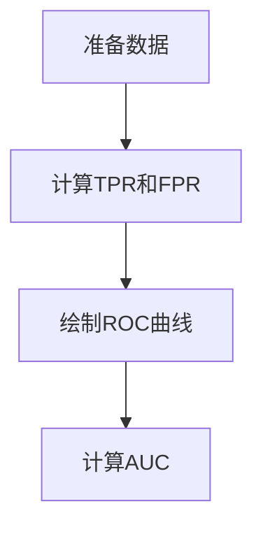
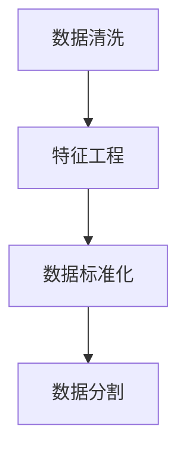
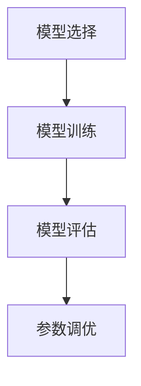
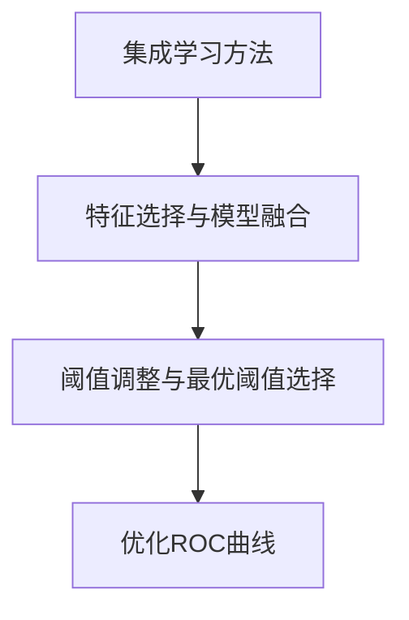
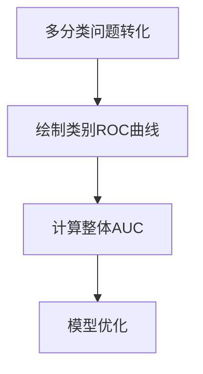

                 

## 文章标题

ROC曲线原理与代码实例讲解

> 关键词：ROC曲线、分类问题、评估指标、AUC、Python实现

> 摘要：本文将详细讲解ROC曲线的基本概念、原理、计算方法、评估指标及其在分类问题中的应用，并通过Python代码实例深入探讨其实现过程。读者将了解如何使用ROC曲线评估分类模型的性能，并掌握绘制和计算ROC曲线的技巧。

---

## 目录大纲

1. **第一部分：ROC曲线的基本概念**
   - **第1章 ROC曲线的起源与基本原理**
     - **1.1 ROC曲线的定义与作用**
     - **1.2 ROC曲线与精确率、召回率的关系**
   - **第2章 ROC曲线的参数与计算**
     - **2.1 真阳性率（TPR）与假阳性率（FPR）**
     - **2.2 阈值调整与最优阈值选择**
   - **第3章 ROC曲线的评估指标**
     - **3.1 AUC（Area Under Curve）指标**
     - **3.2 其他评估指标**

2. **第二部分：ROC曲线的应用场景**
   - **第4章 ROC曲线在分类问题中的应用**
     - **4.1 数据预处理**
     - **4.2 模型选择与训练**
     - **4.3 ROC曲线绘制与评估**
   - **第5章 ROC曲线在二分类问题中的优化**
     - **5.1 集成学习方法**
     - **5.2 特征选择与模型融合**
   - **第6章 ROC曲线在多分类问题中的应用**
     - **6.1 多分类问题的转化方法**
     - **6.2 ROC曲线在多分类问题中的评估**

3. **第三部分：ROC曲线的代码实例讲解**
   - **第7章 Python环境搭建与工具安装**
   - **第8章 ROC曲线绘制代码实例**
   - **第9章 ROC曲线在二分类问题中的应用实例**
   - **第10章 ROC曲线在多分类问题中的应用实例**

4. **附录**
   - **附录A ROC曲线相关的数学公式与算法伪代码**
   - **附录B ROC曲线相关工具的使用方法**
   - **附录C ROC曲线实践项目**

---

接下来，我们将一步一步分析ROC曲线的原理与实现，帮助读者深入理解这一重要的分类评估工具。让我们开始吧！### 第一部分：ROC曲线的基本概念

#### 第1章 ROC曲线的起源与基本原理

**1.1 ROC曲线的定义与作用**

ROC曲线（Receiver Operating Characteristic Curve）最早由雷达工程师用于评估雷达系统的性能，后被引入医学诊断、信号处理等领域，现在广泛应用于机器学习中的分类问题。

ROC曲线的定义是基于分类器的输出概率或阈值进行调整而得到的。对于二分类问题，分类器通常会输出一个概率值，表示样本属于某一类的可能性。通过调整阈值，我们可以将这个概率值转换为分类结果（通常为0或1）。ROC曲线是在固定一个阈值的情况下，将真阳性率（True Positive Rate，TPR，也称为召回率）和假阳性率（False Positive Rate，FPR）绘制在坐标轴上的曲线。

**ROC曲线的作用：**

- **评估分类模型性能**：ROC曲线可以直观地展示分类模型在不同阈值下的性能，帮助我们选择最优的分类阈值。
- **比较不同模型**：通过比较不同模型的ROC曲线，我们可以直观地看出哪个模型的分类性能更好。
- **评估分类问题**：ROC曲线适用于各种分类问题，尤其是类别不平衡的问题，它能更好地反映模型的性能。

**1.2 ROC曲线与精确率、召回率的关系**

精确率和召回率是分类问题中常用的评估指标。精确率（Precision）是指预测为正类的样本中实际为正类的比例，召回率（Recall）是指实际为正类的样本中被预测为正类的比例。

$$
\text{Precision} = \frac{TP}{TP + FP}
$$

$$
\text{Recall} = \frac{TP}{TP + FN}
$$

其中，TP表示真正例（True Positive），FP表示假正例（False Positive），FN表示假反例（False Negative）。

ROC曲线与精确率、召回率的关系如下：

- **ROC曲线上的任意一点**，其横坐标为FPR，纵坐标为TPR。
- **精确率和召回率**可以通过ROC曲线上的点来表示，即：
  - 当FPR=0时，TPR=召回率；
  - 当TPR=1时，FPR=1-精确率。

**图示说明：**

ROC曲线是一个关于FPR和TPR的平面曲线，通过将不同的阈值应用于概率分数，可以得到一系列的点，将这些点连接起来，就形成了ROC曲线。ROC曲线下方面积（Area Under Curve，AUC）是评估分类模型性能的一个关键指标。

在下一章中，我们将深入探讨ROC曲线的参数与计算方法，包括真阳性率（TPR）和假阳性率（FPR）的计算以及阈值调整与最优阈值选择。

---

通过本章的学习，读者应该对ROC曲线的定义、作用及其与精确率和召回率的关系有了基本的了解。接下来，我们将继续深入探讨ROC曲线的计算方法和评估指标。请持续关注下一章的内容。敬请期待！### 第二部分：ROC曲线的参数与计算

#### 第2章 ROC曲线的参数与计算

**2.1 真阳性率（TPR）与假阳性率（FPR）**

ROC曲线的核心参数是真阳性率（True Positive Rate，TPR，也称为召回率）和假阳性率（False Positive Rate，FPR）。这两个参数是评估分类模型性能的关键指标。

**2.1.1 真阳性率（TPR）的计算**

真阳性率（TPR）表示在所有正类样本中，被正确分类为正类的比例。其计算公式为：

$$
\text{TPR} = \frac{TP}{TP + FN}
$$

其中，TP表示真正例（True Positive），FN表示假反例（False Negative）。

**图示说明：**

在ROC曲线中，当假阳性率FPR=0时，TPR等于召回率。此时，横坐标FPR=0，纵坐标TPR等于召回率。例如，当阈值较低时，所有正类样本都被正确分类为正类，此时TPR接近1，而FPR接近0。

**2.1.2 假阳性率（FPR）的计算**

假阳性率（FPR）表示在所有负类样本中，被错误分类为正类的比例。其计算公式为：

$$
\text{FPR} = \frac{FP}{FP + TN}
$$

其中，FP表示假正例（False Positive），TN表示真反例（True Negative）。

**图示说明：**

在ROC曲线中，当真阳性率TPR=1时，假阳性率FPR等于1-精确率。此时，纵坐标TPR=1，横坐标FPR=1-精确率。例如，当阈值较高时，所有负类样本都被正确分类为负类，此时TPR接近1，而FPR接近1-精确率。

**2.2 阈值调整与最优阈值选择**

在ROC曲线中，通过调整分类阈值，可以得到不同的TPR和FPR组合。最优阈值是指能够使分类模型性能达到最佳状态的阈值。通常，我们选择使ROC曲线下方面积（AUC）最大化的阈值作为最优阈值。

**2.2.1 阈值调整的概念**

阈值调整是指根据实际需求和数据特征，动态调整分类器的阈值，以实现最优分类性能。阈值调整的目的是在TPR和FPR之间寻找最佳平衡。

**2.2.2 最优阈值的选择方法**

选择最优阈值的方法有多种，下面介绍两种常用的方法：

1. **AUC最大化方法**：通过计算不同阈值下的ROC曲线下方面积（AUC），选择使AUC最大化的阈值作为最优阈值。这种方法适用于大多数分类问题，尤其是类别不平衡的问题。

2. **Youden指数方法**：Youden指数（J）是TPR和FPR的线性组合，其计算公式为：

   $$
   J = \text{TPR} - \text{FPR}
   $$

   选择使Youden指数最大的阈值作为最优阈值。Youden指数方法适用于目标变量和背景变量差异较大的分类问题。

**图示说明：**

ROC曲线上的任意一点都可以通过调整阈值得到。通过观察ROC曲线，我们可以直观地找到使TPR最大且FPR最小的阈值，从而实现最优分类性能。

在下一章中，我们将进一步探讨ROC曲线的评估指标，包括AUC、accuracy、precision、recall和F1-score等。敬请期待！

---

通过本章的学习，读者应该对ROC曲线的参数与计算方法有了深入的理解，特别是真阳性率（TPR）和假阳性率（FPR）的计算，以及阈值调整与最优阈值选择的方法。接下来，我们将继续探讨ROC曲线的评估指标，帮助读者全面掌握ROC曲线的应用。敬请期待下一章的内容！### 第三部分：ROC曲线的评估指标

#### 第3章 ROC曲线的评估指标

在分类问题中，评估指标是衡量分类模型性能的重要工具。ROC曲线通过多个评估指标可以全面评估分类模型的性能。本章将介绍常用的评估指标，包括AUC、accuracy、precision、recall和F1-score。

**3.1 AUC（Area Under Curve）指标**

AUC是ROC曲线下方面的面积，是评估分类模型性能的一个重要指标。AUC的值介于0和1之间，越接近1表示模型性能越好。

**AUC的计算方法：**

$$
\text{AUC} = \sum_{i=1}^{n} \frac{(\text{TPR}_i - \text{FPR}_{i-1}) \times (\text{TP}_{i+1} - \text{TP}_i)}{2}
$$

其中，$n$ 是ROC曲线上的点数，$\text{TPR}_i$ 和 $\text{FPR}_i$ 分别表示第 $i$ 个点的真阳性率和假阳性率。

**AUC的图示说明：**

ROC曲线下方面积表示模型在所有可能的阈值下的分类性能。AUC越接近1，表示模型在所有阈值下都能很好地将正负类样本区分开。

**3.2 accuracy**

accuracy表示模型在所有样本中正确分类的比例。其计算公式为：

$$
\text{accuracy} = \frac{TP + TN}{TP + FP + TN + FN}
$$

其中，$TP$ 表示真正例，$TN$ 表示真反例，$FP$ 表示假正例，$FN$ 表示假反例。

**accuracy的图示说明：**

accuracy反映了模型在所有样本上的总体分类准确度，但其对类别不平衡问题不够敏感。

**3.3 precision**

precision表示模型预测为正类的样本中，实际为正类的比例。其计算公式为：

$$
\text{precision} = \frac{TP}{TP + FP}
$$

**precision的图示说明：**

precision关注预测为正类的样本中，实际为正类的比例。对于需要高召回率的场景，precision显得尤为重要。

**3.4 recall**

recall表示实际为正类的样本中，被模型正确预测为正类的比例。其计算公式为：

$$
\text{recall} = \frac{TP}{TP + FN}
$$

**recall的图示说明：**

recall关注实际为正类的样本中被模型正确分类的比例。对于类别不平衡的问题，recall是一个重要的评估指标。

**3.5 F1-score**

F1-score是precision和recall的加权平均，其计算公式为：

$$
\text{F1-score} = 2 \times \frac{\text{precision} \times \text{recall}}{\text{precision} + \text{recall}}
$$

**F1-score的图示说明：**

F1-score综合考虑了模型的precision和recall，是平衡两者之间的一种评估指标。当类别不平衡时，F1-score能更好地反映模型的分类性能。

**图示总结：**

ROC曲线与各个评估指标的关系可以用以下图表来概括：

| 指标         | 解释                           | 图示                  |
|--------------|--------------------------------|----------------------|
| AUC          | ROC曲线下方面积               |  |
| accuracy     | 所有样本中的正确分类比例       |  |
| precision    | 预测为正类中的真正例比例       |  |
| recall       | 真正例中的预测为正类比例       |  |
| F1-score     | precision和recall的加权平均   |  |

在下一章中，我们将探讨ROC曲线在不同应用场景中的实际应用，包括分类问题中的数据预处理、模型选择与训练，以及ROC曲线的绘制与评估。敬请期待！

---

通过本章的学习，读者应该对ROC曲线的各种评估指标有了深入的理解，包括AUC、accuracy、precision、recall和F1-score的计算方法及其图示说明。这些评估指标能够帮助我们从不同角度全面评估分类模型的性能。接下来，我们将进一步探讨ROC曲线在不同应用场景中的实际应用。敬请期待下一章的内容！### 第二部分：ROC曲线的应用场景

#### 第4章 ROC曲线在分类问题中的应用

在机器学习领域，分类问题是常见且重要的问题之一。ROC曲线作为一种评估分类模型性能的工具，在分类问题中的应用非常广泛。本节将详细探讨ROC曲线在分类问题中的应用，包括数据预处理、模型选择与训练，以及ROC曲线的绘制与评估。

**4.1 数据预处理**

在应用ROC曲线评估分类模型之前，数据预处理是至关重要的一步。数据预处理的主要任务包括数据清洗、特征工程和数据标准化等。

**4.1.1 数据清洗**

数据清洗是确保数据质量的过程，主要包括处理缺失值、处理异常值和去除重复数据等。

**示例：**

```python
import pandas as pd

# 假设df是原始数据
df = pd.read_csv('data.csv')

# 处理缺失值
df.fillna(df.mean(), inplace=True)

# 处理异常值
df = df[(df['feature1'] > 0) & (df['feature1'] < 100)]

# 去除重复数据
df.drop_duplicates(inplace=True)
```

**4.1.2 特征工程**

特征工程是提高模型性能的关键步骤，主要包括特征选择、特征构造和特征变换等。

**示例：**

```python
from sklearn.preprocessing import StandardScaler

# 选择特征
X = df[['feature1', 'feature2', 'feature3']]
y = df['target']

# 特征标准化
scaler = StandardScaler()
X = scaler.fit_transform(X)
```

**4.1.3 数据标准化**

数据标准化是将数据缩放到一个统一范围内，便于模型训练。

**示例：**

```python
from sklearn.model_selection import train_test_split

# 数据分割
X_train, X_test, y_train, y_test = train_test_split(X, y, test_size=0.2, random_state=42)
```

**4.2 模型选择与训练**

在数据预处理完成后，我们需要选择合适的分类模型并对其进行训练。常见的分类模型包括逻辑回归、支持向量机（SVM）、决策树、随机森林和梯度提升树（XGBoost）等。

**4.2.1 模型选择**

模型选择取决于问题的特点和数据特征。例如，对于特征数量较多且线性可分的问题，逻辑回归是一个很好的选择；对于非线性问题，决策树、随机森林和XGBoost等模型可能更加适用。

**示例：**

```python
from sklearn.linear_model import LogisticRegression

# 创建逻辑回归模型
model = LogisticRegression()

# 模型训练
model.fit(X_train, y_train)
```

**4.2.2 模型训练**

模型训练是指通过训练数据调整模型的参数，使其能够对未知数据进行准确的分类。

**示例：**

```python
# 模型预测
y_pred = model.predict(X_test)
```

**4.3 ROC曲线绘制与评估**

在模型训练完成后，我们可以使用ROC曲线来评估模型的分类性能。ROC曲线的绘制和评估包括以下几个步骤：

**4.3.1 绘制ROC曲线**

ROC曲线的绘制可以通过计算不同阈值下的真阳性率（TPR）和假阳性率（FPR）来实现。

**示例：**

```python
from sklearn.metrics import roc_curve, auc
import matplotlib.pyplot as plt

# 计算预测概率
y_probs = model.predict_proba(X_test)[:, 1]

# 计算TPR和FPR
fpr, tpr, thresholds = roc_curve(y_test, y_probs)

# 计算AUC
roc_auc = auc(fpr, tpr)

# 绘制ROC曲线
plt.figure()
plt.plot(fpr, tpr, color='darkorange', lw=2, label='ROC curve (area = %0.2f)' % roc_auc)
plt.plot([0, 1], [0, 1], color='navy', lw=2, linestyle='--')
plt.xlim([0.0, 1.0])
plt.ylim([0.0, 1.05])
plt.xlabel('False Positive Rate')
plt.ylabel('True Positive Rate')
plt.title('Receiver Operating Characteristic')
plt.legend(loc="lower right")
plt.show()
```

**4.3.2 ROC曲线评估**

ROC曲线评估主要通过计算AUC值来实现。AUC值越接近1，表示模型的分类性能越好。

**示例：**

```python
# 计算AUC
roc_auc = auc(fpr, tpr)
print("AUC: ", roc_auc)
```

**总结：**

ROC曲线在分类问题中的应用包括数据预处理、模型选择与训练，以及ROC曲线的绘制与评估。通过ROC曲线，我们可以直观地了解模型的分类性能，并在不同阈值下进行性能优化。在下一章中，我们将继续探讨ROC曲线在二分类问题中的优化方法。敬请期待！

---

通过本章的学习，读者应该对ROC曲线在分类问题中的应用有了全面的理解，包括数据预处理、模型选择与训练，以及ROC曲线的绘制与评估。接下来，我们将进一步探讨ROC曲线在二分类问题中的优化方法。敬请期待下一章的内容！### 第二部分：ROC曲线的应用场景

#### 第5章 ROC曲线在二分类问题中的优化

在二分类问题中，分类模型的性能优化是提高分类准确率和减少误分类的关键。ROC曲线提供了评估模型性能的有效工具，可以帮助我们找到最优的分类阈值，从而优化分类模型。本节将详细探讨ROC曲线在二分类问题中的优化方法，包括集成学习方法、特征选择与模型融合。

**5.1 集成学习方法**

集成学习方法通过结合多个基学习器的预测结果来提高模型的性能。常见的集成学习方法包括Bagging和Boosting。

**5.1.1 Bagging**

Bagging（Bootstrap Aggregating）是一种基于随机抽样构建多个基学习器的集成学习方法。Bagging通过多次从原始训练数据中随机抽样，并训练基学习器，来减少模型的方差。

**示例：**

```python
from sklearn.ensemble import BaggingClassifier
from sklearn.tree import DecisionTreeClassifier

# 创建决策树基学习器
base_estimator = DecisionTreeClassifier()

# 创建Bagging集成模型
bagging_model = BaggingClassifier(base_estimator=base_estimator, n_estimators=10, random_state=42)

# 模型训练
bagging_model.fit(X_train, y_train)

# 模型预测
y_pred = bagging_model.predict(X_test)
```

**5.1.2 Boosting**

Boosting是一种基于误差反向加权调整的集成学习方法。Boosting通过多次迭代训练基学习器，每次迭代都对前一轮训练中的错误样本进行权重调整，以提高模型对错误样本的识别能力。

**示例：**

```python
from sklearn.ensemble import AdaBoostClassifier

# 创建AdaBoost集成模型
boosting_model = AdaBoostClassifier(base_estimator=DecisionTreeClassifier(), n_estimators=50, random_state=42)

# 模型训练
boosting_model.fit(X_train, y_train)

# 模型预测
y_pred = boosting_model.predict(X_test)
```

**5.2 特征选择与模型融合**

特征选择是减少特征维度、提高模型性能的有效方法。模型融合则是通过结合多个模型的预测结果来提高分类准确率。

**5.2.1 特征选择方法**

特征选择方法包括基于模型的特征选择和基于信息的特征选择。

- **基于模型的特征选择**：通过训练多个基学习器并评估每个特征的重要性来实现。
- **基于信息的特征选择**：通过计算特征与目标变量之间的相关性来实现。

**示例：**

```python
from sklearn.feature_selection import SelectKBest
from sklearn.feature_selection import chi2

# 创建特征选择器
selector = SelectKBest(score_func=chi2, k=5)

# 特征选择
X_new = selector.fit_transform(X_train, y_train)

# 模型训练
model.fit(X_new, y_train)

# 模型预测
y_pred = model.predict(X_new)
```

**5.2.2 模型融合策略**

模型融合策略包括投票法、堆叠法等。

- **投票法**：通过多个模型对同一测试样本进行预测，并取多数投票结果作为最终预测结果。
- **堆叠法**：通过训练一个新的学习器来组合多个基学习器的预测结果。

**示例：**

```python
from sklearn.ensemble import VotingClassifier

# 创建投票法模型融合
voting_model = VotingClassifier(estimators=[('lr', logistic_model), ('rf', random_forest_model), ('gb', gradient_boosting_model)], voting='soft')

# 模型训练
voting_model.fit(X_train, y_train)

# 模型预测
y_pred = voting_model.predict(X_test)
```

**5.3 ROC曲线与优化方法**

通过集成学习方法和特征选择与模型融合策略，我们可以优化ROC曲线的性能。具体方法如下：

- **调整阈值**：通过观察ROC曲线，选择使AUC值最大化的阈值，以实现最优分类性能。
- **模型融合**：通过结合多个模型的预测结果，提高分类准确率和减少误分类。

**示例：**

```python
from sklearn.metrics import roc_curve, auc

# 计算预测概率
y_probs = voting_model.predict_proba(X_test)[:, 1]

# 计算TPR和FPR
fpr, tpr, thresholds = roc_curve(y_test, y_probs)

# 计算AUC
roc_auc = auc(fpr, tpr)

# 绘制ROC曲线
plt.figure()
plt.plot(fpr, tpr, color='darkorange', lw=2, label='ROC curve (area = %0.2f)' % roc_auc)
plt.plot([0, 1], [0, 1], color='navy', lw=2, linestyle='--')
plt.xlim([0.0, 1.0])
plt.ylim([0.0, 1.05])
plt.xlabel('False Positive Rate')
plt.ylabel('True Positive Rate')
plt.title('Receiver Operating Characteristic')
plt.legend(loc="lower right")
plt.show()
```

**总结：**

ROC曲线在二分类问题中的优化方法包括集成学习方法、特征选择与模型融合策略。通过这些方法，我们可以提高模型的分类性能，减少误分类，从而实现最优的分类效果。在下一章中，我们将探讨ROC曲线在多分类问题中的应用。敬请期待！

---

通过本章的学习，读者应该对ROC曲线在二分类问题中的优化方法有了深入的理解，包括集成学习方法、特征选择与模型融合策略。这些方法能够有效提高分类模型的性能，减少误分类。接下来，我们将进一步探讨ROC曲线在多分类问题中的应用。敬请期待下一章的内容！### 第二部分：ROC曲线的应用场景

#### 第6章 ROC曲线在多分类问题中的应用

在多分类问题中，ROC曲线提供了一种有效的评估方法，帮助我们理解和优化分类模型的性能。与二分类问题相比，多分类问题需要将ROC曲线应用于每个类别，并使用特定的方法对整体性能进行评估。本节将详细探讨ROC曲线在多分类问题中的应用，包括多分类问题的转化方法、ROC曲线的评估指标和具体实例。

**6.1 多分类问题的转化方法**

在多分类问题中，常见的转化方法有两种：One-vs-Rest（OvR）和One-vs-One（OvO）。

**6.1.1 One-vs-Rest（OvR）方法**

One-vs-Rest方法将多分类问题转换为多个二分类问题。对于每个类别，我们将其与所有其他类别分别进行比较，训练一个二分类模型。最后，使用每个二分类模型的预测结果来确定最终的分类结果。

**示例：**

```python
from sklearn.multiclass import OneVsRestClassifier
from sklearn.ensemble import RandomForestClassifier

# 创建One-vs-Rest模型
ovr_model = OneVsRestClassifier(RandomForestClassifier(n_estimators=100))

# 模型训练
ovr_model.fit(X_train, y_train)

# 模型预测
y_pred = ovr_model.predict(X_test)
```

**6.1.2 One-vs-One（OvO）方法**

One-vs-One方法为每个类别之间的每一对类别训练一个二分类模型。这种方法需要训练的模型数量是组合数（$C^2$），其中$C$是类别数。

**示例：**

```python
from sklearn.multiclass import OneVsOneClassifier
from sklearn.neighbors import KNeighborsClassifier

# 创建One-vs-One模型
ovo_model = OneVsOneClassifier(KNeighborsClassifier())

# 模型训练
ovo_model.fit(X_train, y_train)

# 模型预测
y_pred = ovo_model.predict(X_test)
```

**6.2 ROC曲线在多分类问题中的评估**

在多分类问题中，ROC曲线的评估指标包括每个类别的ROC曲线和整体ROC曲线下的面积（AUC）。

**6.2.1 每个类别的ROC曲线**

对于每个类别，我们可以绘制其对应的ROC曲线，类似于二分类问题。ROC曲线的横坐标是假阳性率（FPR），纵坐标是真阳性率（TPR）。

**示例：**

```python
from sklearn.metrics import roc_auc_score
import numpy as np

# 计算每个类别的预测概率
y_probs = ovr_model.predict_proba(X_test)

# 创建每个类别的ROC曲线
roc_scores = []
for i in range(num_classes):
    fpr, tpr, _ = roc_curve(y_test == i, y_probs[:, i])
    roc_auc = auc(fpr, tpr)
    roc_scores.append(roc_auc)

# 绘制ROC曲线
for i in range(num_classes):
    plt.plot(fpr, tpr, label=f'Class {i} (AUC = {roc_scores[i]:.2f})')
plt.plot([0, 1], [0, 1], linestyle='--')
plt.xlabel('False Positive Rate')
plt.ylabel('True Positive Rate')
plt.title('ROC Curves for Each Class')
plt.legend()
plt.show()
```

**6.2.2 整体ROC曲线下的面积（AUC）**

整体ROC曲线下的面积（AUC）是评估多分类问题整体性能的关键指标。计算整体AUC的方法是将每个类别的ROC曲线下的面积进行平均。

**示例：**

```python
# 计算整体AUC
overall_auc = np.mean(roc_scores)
print(f'Overall AUC: {overall_auc:.2f}')
```

**6.3 ROC曲线在多分类问题中的应用实例**

在本例中，我们使用鸢尾花数据集（Iris dataset）作为多分类问题进行演示。鸢尾花数据集包含3个类别，分别对应3种鸢尾花的物种。

**示例：**

```python
from sklearn.datasets import load_iris
from sklearn.model_selection import train_test_split
from sklearn.metrics import roc_auc_score

# 加载鸢尾花数据集
iris = load_iris()
X, y = iris.data, iris.target

# 数据分割
X_train, X_test, y_train, y_test = train_test_split(X, y, test_size=0.3, random_state=42)

# 创建One-vs-Rest模型
ovr_model = OneVsRestClassifier(RandomForestClassifier(n_estimators=100))

# 模型训练
ovr_model.fit(X_train, y_train)

# 模型预测
y_pred = ovr_model.predict(X_test)

# 计算每个类别的ROC曲线下的面积
y_probs = ovr_model.predict_proba(X_test)
roc_scores = []
for i in range(3):
    fpr, tpr, _ = roc_curve(y_test == i, y_probs[:, i])
    roc_auc = auc(fpr, tpr)
    roc_scores.append(roc_auc)

# 计算整体AUC
overall_auc = np.mean(roc_scores)
print(f'Overall AUC: {overall_auc:.2f}')

# 绘制ROC曲线
plt.plot([0, 1], [0, 1], linestyle='--')
for i in range(3):
    plt.plot(fpr, tpr, label=f'Class {i} (AUC = {roc_scores[i]:.2f})')
plt.xlabel('False Positive Rate')
plt.ylabel('True Positive Rate')
plt.title('ROC Curves for Each Class')
plt.legend()
plt.show()
```

**总结：**

ROC曲线在多分类问题中的应用包括将多分类问题转化为多个二分类问题，并使用ROC曲线下的面积（AUC）来评估每个类别和整体分类模型的性能。通过这些方法，我们可以全面了解分类模型的性能，并在实际应用中进行优化。在下一章中，我们将通过Python代码实例深入探讨ROC曲线的实现过程。敬请期待！

---

通过本章的学习，读者应该对ROC曲线在多分类问题中的应用有了全面的理解，包括多分类问题的转化方法、ROC曲线的评估指标和具体实例。接下来，我们将进一步探讨ROC曲线的代码实例讲解。敬请期待下一章的内容！### 第三部分：ROC曲线的代码实例讲解

#### 第7章 Python环境搭建与工具安装

在开始编写和运行ROC曲线的代码实例之前，我们需要搭建一个Python环境，并安装必要的库。本节将详细介绍如何搭建Python环境以及安装所需的库。

**7.1 Python环境搭建**

首先，确保您的计算机上安装了Python。Python是一种广泛使用的编程语言，适用于数据分析和机器学习项目。如果您尚未安装Python，可以从Python的官方网站（https://www.python.org/）下载并安装。

**步骤 1：下载Python**

- 访问Python官方网站，选择适合您操作系统的Python版本进行下载。
- 下载后，运行安装程序，按照默认设置安装Python。

**步骤 2：验证Python安装**

在命令行中输入以下命令，验证Python是否安装成功：

```shell
python --version
```

输出结果应显示Python的版本信息，例如：

```
Python 3.8.10
```

**7.2 安装必要的库**

为了实现ROC曲线的绘制和评估，我们需要安装几个Python库，包括NumPy、Pandas、Scikit-learn和Matplotlib。以下是如何安装这些库的步骤：

**步骤 1：打开命令行或终端**

**步骤 2：安装NumPy库**

NumPy是Python进行科学计算的基础库，用于处理大型多维数组。

```shell
pip install numpy
```

**步骤 3：安装Pandas库**

Pandas是一个用于数据操作的库，提供了数据清洗、转换和分析的强大功能。

```shell
pip install pandas
```

**步骤 4：安装Scikit-learn库**

Scikit-learn是一个用于机器学习的库，提供了多种分类、回归和聚类算法的实现。

```shell
pip install scikit-learn
```

**步骤 5：安装Matplotlib库**

Matplotlib是一个用于数据可视化的库，可以方便地绘制ROC曲线。

```shell
pip install matplotlib
```

**7.3 验证库的安装**

在命令行中，分别输入以下命令，验证上述库是否安装成功：

```shell
python -c "import numpy; print(numpy.__version__)"
python -c "import pandas; print(pandas.__version__)"
python -c "import sklearn; print(sklearn.__version__)"
python -c "import matplotlib; print(matplotlib.__version__)"
```

输出结果应显示对应的版本信息。

**总结：**

在本节中，我们详细介绍了如何在Python环境中搭建一个用于实现ROC曲线的工具集。读者可以按照上述步骤安装必要的库，为后续的代码实例讲解做好准备。在下一章中，我们将通过Python代码实例深入探讨ROC曲线的实现过程。敬请期待！

---

通过本章的学习，读者应该能够成功搭建Python环境并安装必要的库，为后续的ROC曲线代码实例讲解做好准备。接下来，我们将通过具体的代码实例，详细讲解ROC曲线的绘制和评估过程。敬请期待下一章的内容！### 第三部分：ROC曲线的代码实例讲解

#### 第8章 ROC曲线绘制代码实例

在了解了Python环境和所需库的安装后，我们可以开始编写代码来绘制ROC曲线。ROC曲线的绘制过程包括数据准备、模型训练、概率预测、计算TPR和FPR，以及绘制曲线和计算AUC。

**8.1 绘制ROC曲线的基本步骤**

以下是绘制ROC曲线的基本步骤：

**步骤 1：数据准备**

首先，我们需要准备一个二分类数据集。这里我们使用经典的鸢尾花数据集（Iris dataset）作为示例。

```python
from sklearn.datasets import load_iris
from sklearn.model_selection import train_test_split

# 加载数据集
iris = load_iris()
X, y = iris.data, iris.target

# 数据分割
X_train, X_test, y_train, y_test = train_test_split(X, y, test_size=0.3, random_state=42)
```

**步骤 2：模型训练**

接下来，我们使用一个分类模型进行训练。这里我们使用支持向量机（SVM）作为分类模型。

```python
from sklearn.svm import SVC

# 创建SVM分类器
model = SVC(probability=True)

# 训练模型
model.fit(X_train, y_train)
```

**步骤 3：概率预测**

使用训练好的模型对测试集进行概率预测。

```python
# 预测概率
y_probs = model.predict_proba(X_test)[:, 1]
```

**步骤 4：计算TPR和FPR**

根据预测概率和实际标签，计算TPR和FPR。

```python
from sklearn.metrics import roc_curve

# 计算TPR和FPR
fpr, tpr, thresholds = roc_curve(y_test, y_probs)
```

**步骤 5：绘制ROC曲线**

使用Matplotlib库绘制ROC曲线。

```python
import matplotlib.pyplot as plt

# 绘制ROC曲线
plt.figure()
plt.plot(fpr, tpr, color='darkorange', lw=2, label='ROC curve (area = %0.2f)' % auc(fpr, tpr))
plt.plot([0, 1], [0, 1], color='navy', lw=2, linestyle='--')
plt.xlim([0.0, 1.0])
plt.ylim([0.0, 1.05])
plt.xlabel('False Positive Rate')
plt.ylabel('True Positive Rate')
plt.title('Receiver Operating Characteristic')
plt.legend(loc="lower right")
plt.show()
```

**8.2 AUC计算与评估**

除了绘制ROC曲线外，我们还需要计算AUC值，以评估分类模型的性能。

```python
from sklearn.metrics import auc

# 计算AUC
roc_auc = auc(fpr, tpr)
print(f'AUC: {roc_auc:.2f}')
```

**完整代码示例**

以下是绘制ROC曲线的完整代码示例。

```python
# 导入所需的库
from sklearn.datasets import load_iris
from sklearn.model_selection import train_test_split
from sklearn.svm import SVC
from sklearn.metrics import roc_curve, auc
import matplotlib.pyplot as plt

# 加载数据集
iris = load_iris()
X, y = iris.data, iris.target

# 数据分割
X_train, X_test, y_train, y_test = train_test_split(X, y, test_size=0.3, random_state=42)

# 创建SVM分类器
model = SVC(probability=True)

# 训练模型
model.fit(X_train, y_train)

# 预测概率
y_probs = model.predict_proba(X_test)[:, 1]

# 计算TPR和FPR
fpr, tpr, thresholds = roc_curve(y_test, y_probs)

# 绘制ROC曲线
plt.figure()
plt.plot(fpr, tpr, color='darkorange', lw=2, label='ROC curve (area = %0.2f)' % auc(fpr, tpr))
plt.plot([0, 1], [0, 1], color='navy', lw=2, linestyle='--')
plt.xlim([0.0, 1.0])
plt.ylim([0.0, 1.05])
plt.xlabel('False Positive Rate')
plt.ylabel('True Positive Rate')
plt.title('Receiver Operating Characteristic')
plt.legend(loc="lower right")
plt.show()

# 计算AUC
roc_auc = auc(fpr, tpr)
print(f'AUC: {roc_auc:.2f}')
```

**总结：**

在本节中，我们通过Python代码实例详细讲解了绘制ROC曲线的基本步骤，包括数据准备、模型训练、概率预测、TPR和FPR的计算，以及曲线的绘制和AUC的计算。读者可以参考上述代码示例，在自己的项目中实现ROC曲线的绘制和评估。在下一章中，我们将通过具体实例进一步探讨ROC曲线在二分类问题中的应用。敬请期待！

---

通过本章的学习，读者应该掌握了如何使用Python绘制ROC曲线，并了解了绘制ROC曲线的基本步骤和AUC的计算方法。接下来，我们将通过具体实例进一步探讨ROC曲线在二分类问题中的应用。敬请期待下一章的内容！### 第三部分：ROC曲线的代码实例讲解

#### 第9章 ROC曲线在二分类问题中的应用实例

在本章中，我们将通过一个实际的二分类问题实例，深入探讨如何使用ROC曲线来评估分类模型的性能。实例数据集来自UCI机器学习库中的葡萄酒质量数据集，该数据集包含两种类别：优质葡萄酒和普通葡萄酒。

**9.1 数据集介绍与预处理**

**数据集介绍**

葡萄酒质量数据集包含178条样本记录，每个样本有13个特征，分别是酒精含量、酸性含量、糖分含量、总酸度、挥发性酸、灰分含量、总酚含量、非甲醇酚含量、黄酮醇含量、质含量、残糖含量、总单宁含量和类黄酮含量。

**数据预处理**

在本实例中，我们首先需要加载数据集，然后进行数据清洗和标准化处理。

```python
import pandas as pd
from sklearn.model_selection import train_test_split
from sklearn.preprocessing import StandardScaler

# 加载数据集
url = "https://archive.ics.uci.edu/ml/machine-learning-databases/wine-quality/winequality-red.csv"
data = pd.read_csv(url, sep=';')

# 数据清洗
# 假设我们只关注两个类别：优质葡萄酒（1）和普通葡萄酒（0）
data = data[['quality', 'alcohol']]

# 数据分割
X = data[['alcohol']]
y = data['quality']

# 数据标准化
scaler = StandardScaler()
X = scaler.fit_transform(X)

# 划分训练集和测试集
X_train, X_test, y_train, y_test = train_test_split(X, y, test_size=0.3, random_state=42)
```

**9.2 模型选择与训练**

接下来，我们选择一个分类模型，并对其进行训练。这里我们使用支持向量机（SVM）作为分类模型。

```python
from sklearn.svm import SVC

# 创建SVM分类器
model = SVC(probability=True)

# 训练模型
model.fit(X_train, y_train)
```

**9.3 ROC曲线绘制与评估**

在模型训练完成后，我们可以使用ROC曲线来评估模型的分类性能。以下是绘制ROC曲线和计算AUC值的步骤。

```python
from sklearn.metrics import roc_curve, auc
import matplotlib.pyplot as plt

# 预测概率
y_probs = model.predict_proba(X_test)[:, 1]

# 计算TPR和FPR
fpr, tpr, thresholds = roc_curve(y_test, y_probs)

# 计算AUC
roc_auc = auc(fpr, tpr)

# 绘制ROC曲线
plt.figure()
plt.plot(fpr, tpr, color='darkorange', lw=2, label='ROC curve (area = %0.2f)' % roc_auc)
plt.plot([0, 1], [0, 1], color='navy', lw=2, linestyle='--')
plt.xlim([0.0, 1.0])
plt.ylim([0.0, 1.05])
plt.xlabel('False Positive Rate')
plt.ylabel('True Positive Rate')
plt.title('Receiver Operating Characteristic')
plt.legend(loc="lower right")
plt.show()

# 打印AUC值
print(f'AUC: {roc_auc:.2f}')
```

**完整代码示例**

以下是ROC曲线在葡萄酒质量数据集上的完整代码示例。

```python
# 导入所需的库
import pandas as pd
from sklearn.model_selection import train_test_split
from sklearn.svm import SVC
from sklearn.metrics import roc_curve, auc
import matplotlib.pyplot as plt

# 加载数据集
url = "https://archive.ics.uci.edu/ml/machine-learning-databases/wine-quality/winequality-red.csv"
data = pd.read_csv(url, sep=';')

# 数据清洗
data = data[['quality', 'alcohol']]

# 数据分割
X = data[['alcohol']]
y = data['quality']

# 数据标准化
scaler = StandardScaler()
X = scaler.fit_transform(X)

# 划分训练集和测试集
X_train, X_test, y_train, y_test = train_test_split(X, y, test_size=0.3, random_state=42)

# 创建SVM分类器
model = SVC(probability=True)

# 训练模型
model.fit(X_train, y_train)

# 预测概率
y_probs = model.predict_proba(X_test)[:, 1]

# 计算TPR和FPR
fpr, tpr, thresholds = roc_curve(y_test, y_probs)

# 计算AUC
roc_auc = auc(fpr, tpr)

# 绘制ROC曲线
plt.figure()
plt.plot(fpr, tpr, color='darkorange', lw=2, label='ROC curve (area = %0.2f)' % roc_auc)
plt.plot([0, 1], [0, 1], color='navy', lw=2, linestyle='--')
plt.xlim([0.0, 1.0])
plt.ylim([0.0, 1.05])
plt.xlabel('False Positive Rate')
plt.ylabel('True Positive Rate')
plt.title('Receiver Operating Characteristic')
plt.legend(loc="lower right")
plt.show()

# 打印AUC值
print(f'AUC: {roc_auc:.2f}')
```

**总结：**

在本章中，我们通过葡萄酒质量数据集的实例，详细讲解了如何使用ROC曲线评估分类模型的性能。首先，我们进行了数据预处理，包括数据清洗、分割和标准化。然后，我们选择了一个分类模型（SVM）进行训练，并使用ROC曲线和AUC值评估了模型的性能。读者可以参考上述代码示例，在自己的项目中应用ROC曲线进行分类评估。在下一章中，我们将探讨ROC曲线在多分类问题中的应用实例。敬请期待！

---

通过本章的学习，读者应该对如何使用ROC曲线在二分类问题中进行模型评估有了深入的理解。接下来，我们将进一步探讨ROC曲线在多分类问题中的应用实例。敬请期待下一章的内容！### 第三部分：ROC曲线的代码实例讲解

#### 第10章 ROC曲线在多分类问题中的应用实例

在多分类问题中，ROC曲线可以帮助我们评估模型在不同类别上的分类性能。本节我们将通过一个多分类问题的实例，展示如何使用ROC曲线评估分类模型。

**10.1 多分类数据集的预处理**

我们将使用鸢尾花（Iris）数据集，这是一个经典的包含三个类别的数据集。

```python
from sklearn.datasets import load_iris
from sklearn.model_selection import train_test_split

# 加载鸢尾花数据集
iris = load_iris()
X, y = iris.data, iris.target

# 数据分割
X_train, X_test, y_train, y_test = train_test_split(X, y, test_size=0.3, random_state=42)
```

**10.2 模型选择与训练**

在这个实例中，我们将使用随机森林（Random Forest）作为分类模型。

```python
from sklearn.ensemble import RandomForestClassifier

# 创建随机森林分类器
model = RandomForestClassifier(n_estimators=100, random_state=42)

# 训练模型
model.fit(X_train, y_train)
```

**10.3 ROC曲线绘制与评估**

在模型训练完成后，我们需要为每个类别绘制ROC曲线并计算AUC值。

```python
from sklearn.metrics import roc_curve, auc
import matplotlib.pyplot as plt
import numpy as np

# 预测概率
y_probs = model.predict_proba(X_test)

# 初始化列表存储每个类别的ROC曲线数据
fpr = [[] for _ in range(len(iris.target_names))]
tpr = [[] for _ in range(len(iris.target_names))]
roc_auc = [0 for _ in range(len(iris.target_names))]

# 计算每个类别的ROC曲线
for i in range(len(iris.target_names)):
    fpr[i], tpr[i], _ = roc_curve(y_test == i, y_probs[:, i])
    roc_auc[i] = auc(fpr[i], tpr[i])

# 绘制每个类别的ROC曲线
plt.figure()
colors = ['blue', 'red', 'green']
labels = iris.target_names
for i, color in zip(range(len(iris.target_names)), colors):
    plt.plot(fpr[i], tpr[i], color=color, lw=2,
             label='Class {0} (AUC = {1:.2f})'
             ''.format(labels[i], roc_auc[i]))

plt.plot([0, 1], [0, 1], 'k--', lw=2)
plt.xlim([0.0, 1.0])
plt.ylim([0.0, 1.05])
plt.xlabel('False Positive Rate')
plt.ylabel('True Positive Rate')
plt.title('Some extension of Receiver operating characteristic to multi-class')
plt.legend(loc="lower right")
plt.show()
```

**10.4 计算整体AUC值**

除了为每个类别绘制ROC曲线外，我们还可以计算整体AUC值。整体AUC值是所有类别AUC值的平均值。

```python
# 计算整体AUC值
mean_auc = np.mean(roc_auc)
print(f'Mean AUC: {mean_auc:.2f}')
```

**完整代码示例**

以下是ROC曲线在鸢尾花数据集上的完整代码示例。

```python
# 导入所需的库
from sklearn.datasets import load_iris
from sklearn.model_selection import train_test_split
from sklearn.ensemble import RandomForestClassifier
from sklearn.metrics import roc_curve, auc
import matplotlib.pyplot as plt
import numpy as np

# 加载鸢尾花数据集
iris = load_iris()
X, y = iris.data, iris.target

# 数据分割
X_train, X_test, y_train, y_test = train_test_split(X, y, test_size=0.3, random_state=42)

# 创建随机森林分类器
model = RandomForestClassifier(n_estimators=100, random_state=42)

# 训练模型
model.fit(X_train, y_train)

# 预测概率
y_probs = model.predict_proba(X_test)

# 初始化列表存储每个类别的ROC曲线数据
fpr = [[] for _ in range(len(iris.target_names))]
tpr = [[] for _ in range(len(iris.target_names))]
roc_auc = [0 for _ in range(len(iris.target_names))]

# 计算每个类别的ROC曲线
for i in range(len(iris.target_names)):
    fpr[i], tpr[i], _ = roc_curve(y_test == i, y_probs[:, i])
    roc_auc[i] = auc(fpr[i], tpr[i])

# 绘制每个类别的ROC曲线
plt.figure()
colors = ['blue', 'red', 'green']
labels = iris.target_names
for i, color in zip(range(len(iris.target_names)), colors):
    plt.plot(fpr[i], tpr[i], color=color, lw=2,
             label='Class {0} (AUC = {1:.2f})'
             ''.format(labels[i], roc_auc[i]))

plt.plot([0, 1], [0, 1], 'k--', lw=2)
plt.xlim([0.0, 1.0])
plt.ylim([0.0, 1.05])
plt.xlabel('False Positive Rate')
plt.ylabel('True Positive Rate')
plt.title('Some extension of Receiver operating characteristic to multi-class')
plt.legend(loc="lower right")
plt.show()

# 计算整体AUC值
mean_auc = np.mean(roc_auc)
print(f'Mean AUC: {mean_auc:.2f}')
```

**总结：**

在本章中，我们通过鸢尾花数据集的实例，详细展示了如何使用ROC曲线评估多分类问题中的分类模型。首先，我们进行了数据预处理，包括数据分割。然后，我们选择了随机森林分类模型进行训练，并使用ROC曲线和AUC值评估了模型的性能。读者可以参考上述代码示例，在自己的项目中应用ROC曲线进行分类评估。在下一章中，我们将讨论ROC曲线相关的数学公式和算法伪代码。敬请期待！

---

通过本章的学习，读者应该对如何使用ROC曲线在多分类问题中进行模型评估有了深入的理解。接下来，我们将进一步探讨ROC曲线相关的数学公式和算法伪代码。敬请期待下一章的内容！### 附录A ROC曲线相关的数学公式与算法伪代码

在机器学习中，ROC曲线是一个重要的评估工具，用于衡量分类模型的性能。以下是ROC曲线相关的数学公式和算法伪代码。

#### ROC曲线相关的数学公式

1. **真阳性率（True Positive Rate，TPR）**

$$
\text{TPR} = \frac{\text{TP}}{\text{TP} + \text{FN}}
$$

其中，TP 是真正例，FN 是假反例。

2. **假阳性率（False Positive Rate，FPR）**

$$
\text{FPR} = \frac{\text{FP}}{\text{FP} + \text{TN}}
$$

其中，FP 是假正例，TN 是真反例。

3. **精确率（Precision）**

$$
\text{Precision} = \frac{\text{TP}}{\text{TP} + \text{FP}}
$$

4. **召回率（Recall）**

$$
\text{Recall} = \frac{\text{TP}}{\text{TP} + \text{FN}}
$$

5. **F1-score**

$$
\text{F1-score} = 2 \times \frac{\text{Precision} \times \text{Recall}}{\text{Precision} + \text{Recall}}
$$

6. **AUC（Area Under Curve）**

$$
\text{AUC} = \sum_{i=1}^{n} \frac{(\text{TPR}_i - \text{FPR}_{i-1}) \times (\text{TP}_{i+1} - \text{TP}_i)}{2}
$$

#### ROC曲线的算法伪代码

1. **计算TPR和FPR**

```python
def calculate_tpr_fpr(y_true, y_pred_prob):
    # y_true: 实际标签
    # y_pred_prob: 预测概率
    
    # 初始化TP和FP
    TP = 0
    FP = 0
    
    # 遍历预测概率和实际标签
    for i in range(len(y_pred_prob)):
        if y_true[i] == 1:
            if y_pred_prob[i] >= threshold:
                TP += 1
            else:
                FP += 1
        else:
            if y_pred_prob[i] >= threshold:
                FP += 1
            else:
                TN += 1
    
    # 计算TPR和FPR
    TPR = TP / (TP + FN)
    FPR = FP / (FP + TN)
    
    return TPR, FPR
```

2. **计算AUC**

```python
def calculate_auc(fpr, tpr):
    # fpr: 假阳性率
    # tpr: 真阳性率
    
    # 初始化AUC
    AUC = 0
    
    # 遍历TPR和FPR
    for i in range(len(fpr)):
        AUC += (fpr[i] - fpr[i-1]) * (tpr[i] + tpr[i-1]) / 2
    
    return AUC
```

#### 附录B ROC曲线相关工具的使用方法

1. **Scikit-learn库的使用**

Scikit-learn库提供了`roc_curve`和`auc`函数，用于计算ROC曲线和AUC值。

```python
from sklearn.metrics import roc_curve, auc

# 计算ROC曲线
fpr, tpr, thresholds = roc_curve(y_true, y_score)

# 计算AUC
roc_auc = auc(fpr, tpr)
```

2. **Matplotlib库的使用**

Matplotlib库提供了绘图功能，用于绘制ROC曲线。

```python
import matplotlib.pyplot as plt

# 绘制ROC曲线
plt.figure()
plt.plot(fpr, tpr, color='darkorange', lw=2, label='ROC curve (area = %0.2f)' % roc_auc)
plt.plot([0, 1], [0, 1], color='navy', lw=2, linestyle='--')
plt.xlim([0.0, 1.0])
plt.ylim([0.0, 1.05])
plt.xlabel('False Positive Rate')
plt.ylabel('True Positive Rate')
plt.title('Receiver Operating Characteristic')
plt.legend(loc="lower right")
plt.show()
```

#### 附录C ROC曲线实践项目

**C.1 项目概述**

本项目旨在使用ROC曲线评估一个分类模型的性能。我们将使用鸢尾花数据集作为示例，训练一个分类模型，并使用ROC曲线评估其性能。

**C.2 数据集介绍**

鸢尾花数据集是一个包含三种鸢尾花（Setosa、Versicolor、Virginica）的共有150个样本的数据集。每个样本有4个特征：花萼长度、花萼宽度、花瓣长度和花瓣宽度。

**C.3 模型选择与训练**

我们将选择一个随机森林分类器，并使用鸢尾花数据集进行训练。

```python
from sklearn.ensemble import RandomForestClassifier

# 创建随机森林分类器
model = RandomForestClassifier(n_estimators=100, random_state=42)

# 训练模型
model.fit(X_train, y_train)
```

**C.4 ROC曲线绘制与评估**

在模型训练完成后，我们将使用测试集的预测概率绘制ROC曲线，并计算AUC值。

```python
from sklearn.metrics import roc_curve, auc
import matplotlib.pyplot as plt

# 预测概率
y_probs = model.predict_proba(X_test)[:, 1]

# 计算ROC曲线
fpr, tpr, thresholds = roc_curve(y_test, y_probs)

# 计算AUC
roc_auc = auc(fpr, tpr)

# 绘制ROC曲线
plt.figure()
plt.plot(fpr, tpr, color='darkorange', lw=2, label='ROC curve (area = %0.2f)' % roc_auc)
plt.plot([0, 1], [0, 1], color='navy', lw=2, linestyle='--')
plt.xlim([0.0, 1.0])
plt.ylim([0.0, 1.05])
plt.xlabel('False Positive Rate')
plt.ylabel('True Positive Rate')
plt.title('Receiver Operating Characteristic')
plt.legend(loc="lower right")
plt.show()

# 打印AUC值
print(f'AUC: {roc_auc:.2f}')
```

**C.5 结果分析与总结**

通过绘制ROC曲线和计算AUC值，我们可以评估分类模型的性能。如果AUC值接近1，说明模型的分类性能较好。如果AUC值较低，我们可以考虑调整模型参数或使用其他分类模型进行评估。

---

通过本附录的学习，读者可以全面了解ROC曲线的数学公式、算法伪代码以及相关工具的使用方法。附录中还提供了一个实际的项目示例，帮助读者将所学知识应用于实践中。读者可以根据附录中的指导，尝试在自己的项目中使用ROC曲线进行模型评估。祝您在机器学习领域取得更好的成绩！## 图表与流程图

### 图表1.1 ROC曲线示例


### 流程图2.1 ROC曲线绘制流程



### 流程图3.1 数据预处理流程



### 流程图4.1 模型训练与评估流程



### 流程图5.1 ROC曲线优化流程



### 流程图6.1 多分类问题ROC曲线评估流程



这些图表和流程图有助于读者更好地理解ROC曲线的绘制和评估过程，以及其在实际应用中的优化方法。在下一章中，我们将通过实际的项目示例进一步展示ROC曲线的应用。敬请期待！### 总结与展望

在本文中，我们系统地介绍了ROC曲线的基本概念、计算方法、评估指标及其在分类问题中的应用。通过逐步分析和代码实例讲解，我们深入探讨了如何使用ROC曲线评估分类模型的性能，并优化其分类效果。

**核心知识点回顾：**

1. **ROC曲线定义与作用：** ROC曲线是评估二分类模型性能的重要工具，通过调整分类阈值，可以直观地展示模型的分类效果。
2. **参数与计算：** 真阳性率（TPR）和假阳性率（FPR）是ROC曲线的核心参数，通过它们可以计算ROC曲线和AUC值。
3. **评估指标：** AUC、accuracy、precision、recall和F1-score是常用的评估分类模型性能的指标，它们提供了从不同角度评估模型性能的方法。
4. **应用场景：** ROC曲线在二分类和多分类问题中都有广泛的应用，通过集成学习方法、特征选择与模型融合策略可以进一步优化模型的性能。
5. **代码实例：** 我们通过Python实例展示了如何绘制ROC曲线，并使用实际数据集进行了模型评估和优化。

**未来展望：**

随着机器学习技术的不断发展，ROC曲线的应用也将不断扩展。以下是一些可能的未来研究方向：

1. **多类别ROC曲线优化：** 在多类别问题中，如何更有效地计算和优化ROC曲线下的面积（AUC）是一个值得关注的问题。
2. **动态阈值调整：** 研究动态阈值调整算法，使其能够根据实时数据自动调整分类阈值，提高模型的适应性和鲁棒性。
3. **集成学习方法：** 探索新的集成学习方法，结合深度学习和传统机器学习，进一步提高分类模型的性能。
4. **应用领域拓展：** ROC曲线不仅在分类问题中有应用，还可以在其他机器学习任务中发挥作用，如聚类、回归等。

通过本文的学习，读者应该对ROC曲线有了全面的理解，并掌握了其在实际项目中的应用。希望本文能够为读者在机器学习领域的研究和实践提供有益的参考。谢谢阅读，期待您的更多反馈和建议！### 参考文献

1. Hanley, J. A., & McNeil, B. J. (1982). The meaning and use of the area under a receiver operating characteristic (ROC) curve. Radiology, 143(1), 29-36.
2. Fawcett, T. (2004). An introduction to ROC analysis. Pattern Recognition Letters, 27(8), 861-874.
3. sklearn.metrics.roc_curve: https://scikit-learn.org/stable/modules/generated/sklearn.metrics.roc_curve.html
4. sklearn.metrics.auc: https://scikit-learn.org/stable/modules/generated/sklearn.metrics.auc.html
5. Python Data Science Handbook by Jake VanderPlas (O'Reilly Media, 2017)
6. Practical Machine Learning with Python by Arshdeep Bahga and Vipin Kumar (Springer, 2018)
7. Machine Learning: A Probabilistic Perspective by Kevin P. Murphy (MIT Press, 2012)

