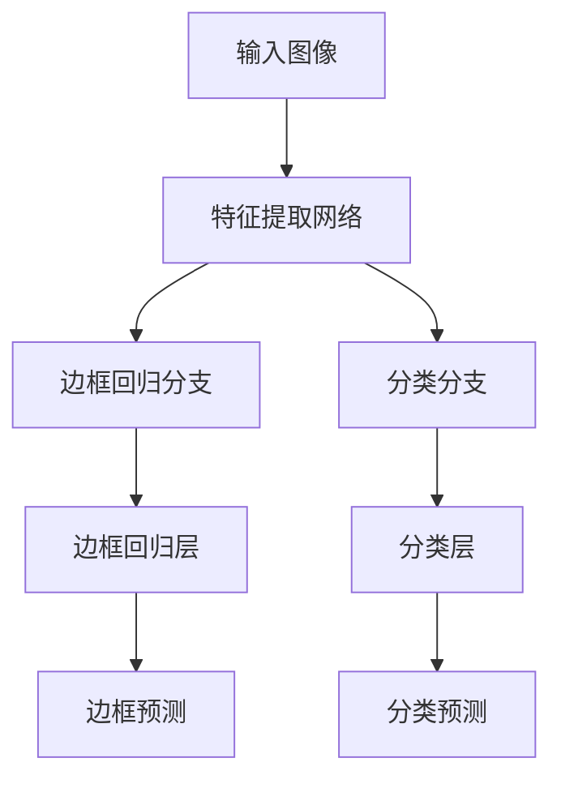

                 

### 文章标题：RetinaNet原理与代码实例讲解

#### 关键词：RetinaNet、目标检测、深度学习、Focal Loss、代码实例

> 摘要：本文将深入探讨RetinaNet这一目标检测算法的原理，并通过实际代码实例对其实现过程进行详细解析。我们将从RetinaNet的基本理论出发，逐步分析其架构、核心算法，并最终通过一个具体案例展示其实际应用。

### 第一部分：RetinaNet基础理论

#### 第1章：目标检测概述

##### 1.1 目标检测的定义与重要性

目标检测是计算机视觉领域的一个重要分支，其主要任务是识别图像中的多个对象并定位其位置。在自动驾驶、安防监控、医疗诊断等众多应用领域中，目标检测技术具有重要的应用价值。随着深度学习技术的不断发展，基于深度学习的目标检测算法逐渐成为研究热点。

##### 1.2 目标检测的发展历程

目标检测的发展历程可以分为几个阶段：

- **传统方法**：基于滑动窗口和特征匹配的方法，如Viola-Jones算法。
- **区域生成方法**：通过生成大量区域候选框进行检测，如R-CNN、Fast R-CNN、Faster R-CNN。
- **基于特征金字塔的方法**：将不同尺度的特征进行融合，如FPN、RetinaNet。
- **深度学习方法**：利用深度神经网络直接进行特征学习和目标检测。

##### 1.3 目标检测的应用场景

目标检测技术在多种场景中具有广泛的应用：

- **自动驾驶**：用于识别道路上的车辆、行人、交通标志等，保障行车安全。
- **安防监控**：用于实时监控，自动识别异常行为，如闯入、打架等。
- **医疗诊断**：用于辅助医生进行疾病诊断，如肿瘤检测、糖尿病视网膜病变检测。
- **图像内容审核**：用于自动识别和过滤不良内容，如色情、暴力等。

#### 第2章：RetinaNet架构解析

##### 2.1 RetinaNet原理介绍

RetinaNet是一种基于深度学习的目标检测算法，其核心思想是使用Focal Loss函数来解决分类问题中的正负样本不平衡问题。RetinaNet主要由两部分组成：特征提取网络和边框回归分支及分类分支。

##### 2.2 RetinaNet的Mermaid流程图



##### 2.3 RetinaNet中的Focal Loss算法

Focal Loss是一种针对类别不平衡问题的损失函数，其基本思想是通过调整难易样本的权重来平衡正负样本的不平衡。Focal Loss的公式如下：

$$
Focal\ Loss = (1 - p)^{\gamma} \cdot L
$$

其中，$p$ 是模型对正例预测的概率，$\gamma$ 是调整参数，用于调整难例和易例的重要性。

#### 第3章：RetinaNet核心算法讲解

##### 3.1 基于 anchor 的目标检测算法

RetinaNet采用了基于 anchor 的目标检测算法，通过预先定义一系列的 anchor 进行目标检测。每个 anchor 都对应一个先验框，模型会预测每个 anchor 的类别和边框偏移量。

##### 3.2 焦点损失（Focal Loss）的详细解释

Focal Loss是一种针对类别不平衡问题的损失函数，其基本思想是通过调整难易样本的权重来平衡正负样本的不平衡。Focal Loss的公式如下：

$$
Focal\ Loss = (1 - p)^{\gamma} \cdot L
$$

其中，$p$ 是模型对正例预测的概率，$\gamma$ 是调整参数，用于调整难例和易例的重要性。

##### 3.3 伪代码讲解 RetinaNet训练过程

```python
for epoch in range(num_epochs):
    for image, labels in train_loader:
        # 前向传播
        outputs = model(image)
        regression_loss, classification_loss = loss_fn(outputs, labels)
        
        # 反向传播
        optimizer.zero_grad()
        loss = regression_loss + classification_loss
        loss.backward()
        optimizer.step()
```

### 第4章：数学模型与公式解析

##### 4.1 机器学习基本公式与解释

在机器学习中，损失函数是评估模型性能的重要指标。常用的损失函数包括均方误差（MSE）、交叉熵损失等。在目标检测中，常用的损失函数包括回归损失和分类损失。

##### 4.2 卷积神经网络中的数学运算

卷积神经网络（CNN）是目标检测的核心组成部分，其数学运算主要包括卷积操作、激活函数、池化操作等。

##### 4.3 焦点损失公式的推导与解释

焦点损失（Focal Loss）是一种用于解决类别不平衡问题的损失函数，其公式如下：

$$
Focal\ Loss = -\alpha \cdot (1 - p)^{\gamma} \cdot \log(p)
$$

其中，$\alpha$ 是分类损失的权重，$p$ 是模型对正例预测的概率，$\gamma$ 是调节难易样本的权重。

### 第5章：RetinaNet代码实例讲解

##### 5.1 环境搭建与数据准备

在开始讲解RetinaNet的代码实例之前，我们需要搭建一个合适的环境，并准备好训练数据。

##### 5.2 RetinaNet代码实现解析

在这一节中，我们将详细解析RetinaNet的代码实现，包括模型结构、损失函数、训练过程等。

##### 5.3 代码解读与分析

通过对RetinaNet代码实例的解读，我们将深入理解目标检测算法的实现细节，并对代码进行详细分析。

### 第6章：RetinaNet实战案例

##### 6.1 使用RetinaNet进行目标检测的案例

在本章中，我们将通过一个实际案例展示如何使用RetinaNet进行目标检测。

##### 6.2 案例实战：使用RetinaNet检测行人

我们将使用RetinaNet算法检测行人图像，并通过实际案例展示其效果。

##### 6.3 案例实战：使用RetinaNet检测车辆

我们将继续使用RetinaNet算法检测车辆图像，并通过实际案例展示其效果。

### 第二部分：深度学习在目标检测中的应用

#### 第7章：深度学习目标检测最新趋势

随着深度学习技术的不断发展，目标检测领域也涌现出许多新的研究趋势。

##### 7.1 一体化目标检测算法

一体化目标检测算法将目标检测中的多个任务（如分类、分割、检测）集成到一个统一的框架中，以提高模型的性能。

##### 7.2 基于Transformer的目标检测

Transformer模型在自然语言处理领域取得了显著的成果，近年来也被引入到目标检测领域，如DETR算法。

##### 7.3 目标检测中的数据增强策略

数据增强是提高目标检测模型性能的重要手段，本章将介绍几种常用的数据增强策略。

#### 第8章：RetinaNet性能优化

在目标检测任务中，提高模型的性能是关键。本章将介绍一些RetinaNet性能优化的方法。

##### 8.1 参数调整对RetinaNet性能的影响

通过调整RetinaNet中的参数，可以显著影响其性能。本章将介绍如何选择合适的参数。

##### 8.2 不同数据集上RetinaNet的表现

不同数据集对RetinaNet的性能有一定影响。本章将比较RetinaNet在不同数据集上的表现。

##### 8.3 RetinaNet在移动设备上的优化

为了在移动设备上部署RetinaNet，需要对其性能进行优化。本章将介绍一些优化方法。

#### 第9章：RetinaNet在工业界的应用

RetinaNet在工业界有广泛的应用。本章将介绍其应用场景，如自动驾驶、安防监控等。

##### 9.1 自动驾驶领域

在自动驾驶领域，RetinaNet用于识别道路上的各种对象，如车辆、行人、交通标志等。

##### 9.2 物流行业

在物流行业，RetinaNet用于自动识别货物，提高物流效率。

##### 9.3 安防领域

在安防领域，RetinaNet用于实时监控，自动识别异常行为。

#### 第10章：未来展望与挑战

随着技术的不断发展，目标检测领域面临着许多挑战。

##### 10.1 目标检测技术的未来发展趋势

本章将介绍目标检测技术的未来发展趋势，如基于Transformer的目标检测、一体化目标检测算法等。

##### 10.2 RetinaNet改进的方向

本章将探讨如何改进RetinaNet，提高其性能和应用效果。

##### 10.3 面临的挑战与解决方案

本章将分析目标检测领域面临的挑战，并提出相应的解决方案。

### 参考文献

- [1] Girshick, R., Donahue, J., Darrell, T., & Malik, J. (2014). Rich feature hierarchies for accurate object detection and semantic segmentation. In Proceedings of the IEEE conference on computer vision and pattern recognition (pp. 580-587).
- [2] Lin, T. Y., Goyal, P., He, K., & Dollár, P. (2017). Focal loss for dense object detection. In Proceedings of the IEEE international conference on computer vision (pp. 2999-3007).

### 附录

- A. RetinaNet开源代码地址
- B. 相关论文列表
- C. 学习资源推荐

## 总结

本文从RetinaNet的基本理论出发，详细讲解了其架构、核心算法，并通过实际代码实例展示了其实现过程。我们还探讨了RetinaNet在目标检测中的应用、性能优化方法，以及其在工业界的应用。希望本文能够帮助读者深入理解RetinaNet，并为实际应用提供参考。在未来的研究中，我们将继续关注目标检测领域的新趋势和挑战，不断改进算法性能，为计算机视觉领域的发展贡献力量。作者：AI天才研究院/AI Genius Institute & 禅与计算机程序设计艺术 /Zen And The Art of Computer Programming。

