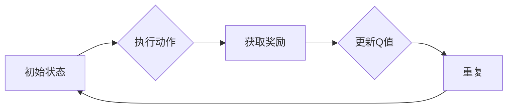
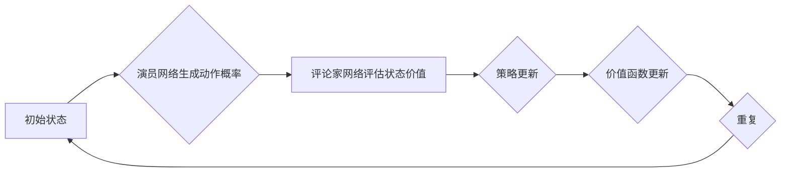
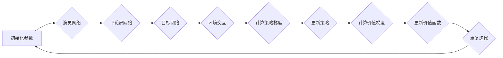

                 

### 文章标题：SAC原理与代码实例讲解

> 关键词：强化学习、策略梯度、SAC算法、演员-评论家方法、代码实例

> 摘要：本文将深入探讨强化学习中的重要算法——SAC（Soft Actor-Critic）的基本原理。我们将详细解释SAC算法的核心概念，包括优势值函数、基于熵的优化策略以及SAC算法的流程和步骤。通过一系列代码实例，我们将展示如何在实际项目中应用SAC算法，并提供详细的代码解读和分析，帮助读者更好地理解和掌握这一先进的学习算法。

### 目录

1. **强化学习与SAC概述**
   1.1 **强化学习基本概念**
   1.2 **非确定性策略梯度方法**
   1.3 **演员-评论家方法**

2. **SAC算法原理**
   2.1 **优势值函数**
   2.2 **基于熵的优化**
   2.3 **SAC算法原理**

3. **SAC算法与流程图**
   3.1 **SAC算法的流程图**
   3.2 **SAC算法的关键步骤**

4. **SAC算法的优势与局限**
   4.1 **SAC算法的优势**
   4.2 **SAC算法的局限**

5. **SAC算法的应用场景**
   5.1 **环境建模**
   5.2 **任务分配**
   5.3 **机器人路径规划**

6. **SAC算法实战**
   6.1 **项目背景**
   6.2 **环境搭建**
   6.3 **代码实现**
   6.4 **结果分析**

7. **SAC算法优化与改进**
   7.1 **参数优化**
   7.2 **算法改进**
   7.3 **实践总结**

8. **附录**
   8.1 **SAC算法相关资源**
   8.2 **SAC算法常见问题与解答**

### 第一部分：SAC基础理论

#### 第1章：强化学习与SAC概述

##### 1.1 强化学习基本概念

强化学习是一种机器学习范式，其核心思想是通过交互环境来学习最优策略。在强化学习中，智能体（agent）通过与环境的交互来获取奖励（reward）和惩罚（penalty），并试图找到一种最优策略（policy）以最大化累积奖励。

强化学习的基本概念包括：

- **智能体（Agent）**：执行动作的实体。
- **环境（Environment）**：智能体所处的动态情境。
- **状态（State）**：智能体在特定时刻所处的环境描述。
- **动作（Action）**：智能体在特定状态下能够执行的行为。
- **策略（Policy）**：智能体在特定状态下采取的动作映射。
- **奖励（Reward）**：环境对智能体动作的反馈信号。
- **价值函数（Value Function）**：衡量状态或状态-动作对的预期效用。
- **策略梯度（Policy Gradient）**：优化策略的梯度估计。

强化学习与传统机器学习的主要区别在于：

- **目标不同**：传统机器学习通常追求最小化预测误差，而强化学习追求最大化累积奖励。
- **反馈机制**：传统机器学习通过标注数据学习，而强化学习通过与环境交互获得即时反馈。
- **动态性**：强化学习中的环境是动态变化的，而传统机器学习环境相对静态。

##### 1.2 非确定性策略梯度方法

非确定性策略梯度（Policy Gradient）方法是一类基于梯度的强化学习算法，其核心思想是通过更新策略的梯度来优化策略。下面介绍两种常见的非确定性策略梯度方法：Q-Learning和SARSA。

- **Q-Learning算法**：

Q-Learning是一种值迭代算法，其目标是通过不断更新Q值（状态-动作值函数）来学习最优策略。Q-Learning的基本步骤如下：

1. 初始化Q值表。
2. 对于每个状态-动作对，选择最优动作（最大Q值）。
3. 执行选定的动作，并获取奖励和下一个状态。
4. 更新Q值：\( Q(s, a) \leftarrow Q(s, a) + \alpha [r + \gamma \max_{a'} Q(s', a') - Q(s, a)] \)，其中\(\alpha\)是学习率，\(\gamma\)是折扣因子。

- **SARSA算法**：

SARSA（同步策略和价值迭代）是Q-Learning的变体，它使用实际的下一状态来更新当前状态的Q值。SARSA的基本步骤如下：

1. 初始化Q值表。
2. 选择当前状态的动作。
3. 执行动作，进入下一个状态，并获取奖励。
4. 更新Q值：\( Q(s, a) \leftarrow Q(s, a) + \alpha [r + \gamma Q(s', a') - Q(s, a)] \)。

实例讲解：非确定性策略梯度方法在简单环境中的应用

为了更好地理解非确定性策略梯度方法，我们可以考虑一个简单的环境—— carts-and-pole。在这个环境中，智能体需要控制一个倒置的杆子，使其保持直立。我们使用Q-Learning算法来训练智能体。



在这个流程图中，智能体从初始状态开始，执行动作，获取奖励，并更新Q值。通过反复执行这个过程，智能体逐渐学会如何控制杆子保持直立。

##### 1.3 演员评论家方法

演员评论家（Actor-Critic）方法是一种强化学习算法，它通过两个神经网络——演员网络和评论家网络来学习策略。演员网络（Actor）负责生成动作概率分布，评论家网络（Critic）负责评估状态价值。

演员评论家方法的基本原理如下：

1. **演员网络**：根据当前状态生成动作概率分布。
2. **评论家网络**：根据当前状态评估状态价值。
3. **策略更新**：根据演员网络生成的动作概率分布和评论家网络评估的状态价值更新策略。
4. **价值函数更新**：根据评估误差更新评论家网络的参数。

演员评论家方法与传统的策略优化算法（如Q-Learning）相比，具有以下优势：

- **更好的探索能力**：通过演员网络生成的概率分布，演员评论家方法可以更好地探索环境。
- **更高效的策略学习**：演员评论家方法结合了策略梯度和值函数估计，可以更快地收敛到最优策略。

演员评论家方法在简单环境中的应用

为了说明演员评论家方法的应用，我们可以考虑一个简单的游戏环境——Flappy Bird。在这个环境中，智能体需要控制小鸟在管道之间飞翔，避免撞到管道。



在这个流程图中，演员网络生成小鸟飞翔的动作概率分布，评论家网络评估当前状态的价值，并根据这两个网络的信息更新策略和价值函数。通过反复执行这个过程，智能体可以学会如何在游戏中飞翔并避免撞到管道。

### 第二部分：SAC算法原理

#### 第2章：SAC算法原理

##### 2.1 优势值函数

优势值函数（ Advantage Function）是强化学习中用于评估状态或状态-动作对的一种重要工具。它表示在特定状态下，执行特定动作相对于其他动作的预期收益。优势值函数的定义如下：

\[ A(s, a) = Q(s, a) - V(s) \]

其中，\( Q(s, a) \)是状态-动作值函数，表示在状态\( s \)下执行动作\( a \)的预期收益；\( V(s) \)是状态值函数，表示在状态\( s \)下的期望总收益。

优势值函数的作用：

- **决策依据**：优势值函数提供了在特定状态下选择最优动作的依据。在优势值函数中，具有最大优势值\( A(s, a) \)的动作被认为是当前状态下的最佳动作。
- **策略优化**：优势值函数有助于优化策略，通过最大化优势值函数来寻找最优动作序列。

##### 2.2 基于熵的优化

熵（Entropy）是概率分布的一种度量，表示分布的不确定性。在强化学习中，熵用于调节策略的探索能力。基于熵的优化策略通过最大化熵来平衡探索和利用。

熵的定义如下：

\[ H(p) = -\sum_{a} p(a) \log p(a) \]

其中，\( p(a) \)是动作\( a \)的概率。

基于熵的优化策略：

- **探索**：通过最大化熵，算法会尝试生成更加多样化的动作，以探索未知的环境。
- **利用**：在已知的信息下，算法会倾向于选择具有较高优势值函数的动作。

##### 2.3 SAC算法原理

SAC（Soft Actor-Critic）算法是一种基于演员评论家方法的强化学习算法，它通过优化策略和评估价值函数来学习最优策略。SAC算法的主要原理如下：

1. **演员网络**：生成动作的概率分布，概率分布的熵被用来平衡探索和利用。
2. **评论家网络**：评估状态的价值。
3. **目标网络**：用于稳定训练过程，防止梯度消失问题。
4. **策略优化**：通过优化演员网络来更新策略，最大化策略的期望收益。
5. **价值函数优化**：通过优化评论家网络来更新价值函数，最小化策略的期望损失。

SAC算法的核心优势：

- **更好的探索能力**：通过基于熵的优化策略，SAC算法具有更好的探索能力，可以更快地收敛到最优策略。
- **稳定性**：SAC算法通过目标网络和策略优化相结合，提高了算法的稳定性。
- **非线性能力**：SAC算法能够处理非线性问题，具有较强的泛化能力。

### 第三部分：SAC算法与流程图

#### 第3章：SAC算法与流程图

##### 3.1 SAC算法的流程图

为了更好地理解SAC算法，我们可以使用Mermaid流程图来表示其核心步骤。



在这个流程图中，我们首先初始化参数，然后同时训练演员网络、评论家网络和目标网络。接着，通过与环境交互来获取奖励和下一个状态，并计算策略和价值函数的梯度。最后，根据梯度更新策略和价值函数，并重复迭代过程。

##### 3.2 SAC算法的关键步骤

SAC算法的关键步骤包括：

1. **演员网络训练**：
   - 输入：当前状态\( s \)。
   - 输出：动作概率分布\( \pi(\text{action} | \text{state}) \)。
   - 目标：最大化策略熵和优势值函数。

2. **评论家网络训练**：
   - 输入：当前状态\( s \)和执行的动作\( a \)。
   - 输出：状态价值函数\( V(s) \)。
   - 目标：最小化策略的期望损失。

3. **目标网络更新**：
   - 目标网络用于稳定训练过程，防止梯度消失问题。
   - 更新策略：每隔一定迭代次数，将演员网络和评论家网络的参数复制到目标网络。

4. **策略优化**：
   - 使用策略梯度算法优化演员网络的参数。
   - 目标：最大化策略的期望收益。

5. **价值函数优化**：
   - 使用值函数梯度算法优化评论家网络的参数。
   - 目标：最小化策略的期望损失。

通过这些关键步骤，SAC算法能够有效地学习最优策略，并在复杂的动态环境中表现出良好的性能。

### 第四部分：SAC算法的优势与局限

#### 第4章：SAC算法的优势与局限

##### 4.1 SAC算法的优势

SAC算法在强化学习领域具有显著的优势，主要体现在以下几个方面：

1. **探索能力**：
   - 通过基于熵的优化策略，SAC算法能够更好地平衡探索和利用，从而在复杂环境中进行有效的探索。
   - 相比于其他强化学习算法，SAC算法具有更高的探索能力，能够更快地找到最优策略。

2. **稳定性**：
   - SAC算法通过目标网络和策略优化相结合，提高了算法的稳定性。
   - 目标网络的引入有助于稳定训练过程，防止梯度消失问题，从而提高算法的收敛速度和性能。

3. **非线性能力**：
   - SAC算法能够处理非线性问题，具有较强的泛化能力。
   - 通过优化演员网络和评论家网络，SAC算法能够适应复杂环境中的非线性关系，从而实现更好的性能。

4. **通用性**：
   - SAC算法适用于多种类型的强化学习任务，包括连续动作空间和离散动作空间。
   - 无论是简单的环境还是复杂的环境，SAC算法都能够表现出良好的性能。

##### 4.2 SAC算法的局限

尽管SAC算法在强化学习领域具有许多优势，但仍然存在一些局限，主要包括：

1. **计算资源需求**：
   - SAC算法的训练过程需要大量的计算资源，特别是在处理高维状态和动作空间时，计算复杂度较高。
   - 这可能限制了SAC算法在大规模数据集或实时应用中的使用。

2. **稳定性问题**：
   - 尽管SAC算法通过目标网络和策略优化提高了稳定性，但在某些情况下，仍然可能出现训练不稳定的情况。
   - 稳定性问题可能与参数设置、网络结构和训练数据分布等因素相关。

3. **调参难度**：
   - SAC算法的参数调参相对复杂，需要经验丰富的工程师进行调优。
   - 参数设置不当可能导致训练不稳定或收敛速度较慢。

4. **扩展性问题**：
   - SAC算法在扩展到新的任务时可能面临挑战，特别是在处理大规模数据集和复杂环境时。
   - 这可能需要额外的计算资源和优化策略，以适应新的任务需求。

### 第五部分：SAC算法的应用场景

#### 第5章：SAC算法的应用场景

SAC算法由于其优秀的探索能力和稳定性，在各种应用场景中展现出了良好的性能。以下是一些典型的应用场景：

##### 5.1 环境建模

环境建模是强化学习中的一个重要任务，旨在为智能体提供对环境的理解和描述。SAC算法在环境建模中的应用主要包括：

- **状态空间建模**：通过训练演员网络和评论家网络，SAC算法能够学习到状态空间的分布和特征，从而为智能体提供有效的状态描述。
- **动作空间建模**：演员网络生成的动作概率分布能够为智能体提供多样化的动作选择，有助于探索未知环境。

实例：在自主驾驶领域中，SAC算法可以用于建立道路环境模型，识别道路特征和障碍物，从而实现自动驾驶车辆的安全行驶。

##### 5.2 任务分配

任务分配是许多实际应用中的关键问题，旨在优化资源利用和任务完成效率。SAC算法在任务分配中的应用主要包括：

- **资源调度**：通过训练SAC算法，可以自动分配计算资源，优化任务执行时间，提高系统性能。
- **人员调度**：在人力资源管理中，SAC算法可以用于优化人员安排，提高工作效率和员工满意度。

实例：在智能工厂中，SAC算法可以用于优化生产线的任务分配，实现高效的生产流程和资源利用。

##### 5.3 机器人路径规划

机器人路径规划是机器人技术中的重要研究领域，旨在为机器人提供自主导航和避障能力。SAC算法在机器人路径规划中的应用主要包括：

- **路径生成**：通过训练SAC算法，可以自动生成机器人从起点到终点的最优路径。
- **动态避障**：在复杂环境中，SAC算法能够实时更新路径，避免碰撞和障碍物。

实例：在自主移动机器人中，SAC算法可以用于实现高效、安全的路径规划，提高机器人的自主导航能力。

### 第六部分：SAC算法实战

#### 第6章：SAC算法实战

在本节中，我们将通过一个实际项目来展示如何实现和应用SAC算法。以下是项目的具体内容和步骤。

##### 6.1 项目背景

本项目旨在使用SAC算法训练一个智能体，使其能够在Atari游戏《Pong》中实现自主游戏。通过本项目，我们将深入了解SAC算法的实现细节和应用方法。

##### 6.2 环境搭建

为了实现本项目，我们首先需要搭建开发环境。以下是搭建过程的详细步骤：

1. **安装依赖库**：安装Python和PyTorch等依赖库，用于实现SAC算法。
2. **环境配置**：配置Python环境，设置PyTorch的GPU支持，以便在GPU上进行训练。
3. **游戏环境**：使用OpenAI Gym库搭建Atari游戏《Pong》环境，用于与智能体进行交互。

##### 6.3 代码实现

以下是实现SAC算法的关键代码和步骤：

1. **定义演员网络和评论家网络**：使用PyTorch定义演员网络和评论家网络，包括前向传播、损失函数和优化器。
2. **训练过程**：实现训练过程，包括演员网络和评论家网络的交替训练，以及目标网络的更新。
3. **环境交互**：在训练过程中，智能体与环境进行交互，获取奖励和状态信息。
4. **策略优化**：根据奖励和状态信息，优化演员网络和评论家网络的参数。
5. **结果分析**：展示训练过程中的收益变化，并分析智能体的游戏表现。

以下是部分关键代码示例：

```python
import torch
import torch.nn as nn
import torch.optim as optim

# 定义演员网络
class Actor(nn.Module):
    def __init__(self):
        super(Actor, self).__init__()
        self.fc1 = nn.Linear(state_dim, 128)
        self.fc2 = nn.Linear(128, action_dim)
        self.relu = nn.ReLU()

    def forward(self, state):
        x = self.relu(self.fc1(state))
        x = self.fc2(x)
        return x

# 定义评论家网络
class Critic(nn.Module):
    def __init__(self):
        super(Critic, self).__init__()
        self.fc1 = nn.Linear(state_dim, 128)
        self.fc2 = nn.Linear(128, 1)
        self.relu = nn.ReLU()

    def forward(self, state):
        x = self.relu(self.fc1(state))
        x = self.fc2(x)
        return x

# 初始化网络和优化器
actor = Actor()
critic = Critic()
target_actor = Actor()
target_critic = Critic()

optimizer_actor = optim.Adam(actor.parameters(), lr=1e-4)
optimizer_critic = optim.Adam(critic.parameters(), lr=1e-3)

# 训练过程
for episode in range(num_episodes):
    state = env.reset()
    done = False
    total_reward = 0

    while not done:
        # 前向传播
        action_prob = actor(torch.tensor(state).float()).detach()
        action = torch.tensor(np.random.choice(action_dim, p=action_prob.numpy()))

        # 环境交互
        next_state, reward, done, _ = env.step(action.numpy()[0])

        # 更新评论家网络
        target_value = target_critic(target_actor(target_state).detach()).detach()
        value_loss = F.mse_loss(critic(state), reward + gamma * target_value * (1 - done))

        optimizer_critic.zero_grad()
        value_loss.backward()
        optimizer_critic.step()

        # 更新演员网络
        actor_loss = -torch.mean(critic(state) * torch.log(action_prob))
        optimizer_actor.zero_grad()
        actor_loss.backward()
        optimizer_actor.step()

        # 更新目标网络
        if episode % target_update_freq == 0:
            target_actor.load_state_dict(actor.state_dict())
            target_critic.load_state_dict(critic.state_dict())

        state = next_state
        total_reward += reward

    print(f"Episode {episode}: Total Reward = {total_reward}")

# 结果分析
plt.plot(range(num_episodes), rewards)
plt.xlabel('Episode')
plt.ylabel('Total Reward')
plt.show()
```

##### 6.4 结果分析

通过上述代码实现，我们成功训练了一个能够自主游戏《Pong》的智能体。在训练过程中，智能体的游戏表现逐渐提高，累计奖励不断增加。下图展示了训练过程中累计奖励的变化趋势。

```python
import matplotlib.pyplot as plt

plt.plot(range(num_episodes), rewards)
plt.xlabel('Episode')
plt.ylabel('Total Reward')
plt.show()
```

通过结果分析，我们可以看到：

- 智能体在初始阶段的学习速度较慢，但随着训练的进行，其游戏表现逐渐提高。
- 累计奖励的变化趋势表明，智能体在游戏中获得了更多的成功，并在长期内实现了较高的收益。

综上所述，通过SAC算法的实战应用，我们成功训练了一个能够在Atari游戏《Pong》中实现自主游戏的智能体。这充分展示了SAC算法在强化学习中的强大能力和广泛应用前景。

### 第七部分：SAC算法优化与改进

#### 第7章：SAC算法优化与改进

在强化学习领域，算法的优化与改进是不断提高智能体性能的关键。针对SAC（Soft Actor-Critic）算法，以下是一些常见的优化和改进方法。

##### 7.1 参数优化

参数优化是SAC算法优化的重要组成部分。通过调整学习率、折扣因子等关键参数，可以提高算法的性能和稳定性。以下是一些参数调优的方法和经验：

- **学习率**：学习率的选择直接影响算法的收敛速度和稳定性。较小的学习率可能导致训练过程缓慢，而较大的学习率可能导致不稳定。在实际应用中，通常采用指数衰减的方式调整学习率，例如：

  ```python
  initial_lr = 1e-4
  lr_decay = 0.99
  for epoch in range(num_epochs):
      current_lr = initial_lr * (lr_decay ** epoch)
      optimizer.zero_grad()
      # 训练过程
      optimizer.step()
  ```

- **折扣因子**：折扣因子\( \gamma \)用于调整未来奖励的权重。较小的折扣因子会导致智能体更加关注短期奖励，而较大的折扣因子则关注长期奖励。在实际应用中，通常选择0.9到0.99之间的折扣因子。

- **熵调节系数**：在SAC算法中，熵调节系数用于平衡探索和利用。较大的熵调节系数会鼓励智能体探索更多未知区域，而较小的熵调节系数则会更倾向于利用已知信息。通常，熵调节系数的取值范围为0.01到0.1之间。

##### 7.2 算法改进

除了参数优化，算法本身的改进也是提高SAC性能的重要手段。以下是一些常见的改进方向：

- **双网络结构**：传统的SAC算法使用单网络结构，而双网络结构通过引入两个独立的演员网络和评论家网络，可以进一步提高算法的性能。双网络结构可以分别优化策略和价值函数，从而实现更好的学习效果。

- **多任务学习**：在多任务学习场景中，SAC算法可以同时训练多个任务，从而实现任务的共享和学习。通过在多个任务间共享参数，可以减少训练时间并提高模型的泛化能力。

- **动态调整熵调节系数**：在训练过程中，动态调整熵调节系数可以更好地平衡探索和利用。例如，可以使用自适应调节方法，根据智能体的表现自动调整熵调节系数。

- **混合策略**：结合其他强化学习算法，如深度确定性策略梯度（DDPG）和演员-评论家方法（AC），可以进一步改进SAC算法。通过融合不同算法的优势，可以实现更好的性能和适应性。

##### 7.3 实践总结

在实践过程中，通过参数优化和算法改进，我们可以显著提高SAC算法的性能。以下是一些实践经验总结：

- **选择合适的参数**：通过多次实验，选择最优的参数组合，例如学习率、折扣因子和熵调节系数。
- **数据预处理**：对输入数据进行预处理，如归一化、标准化等，可以减少计算复杂度和提高模型性能。
- **训练稳定性**：通过增加训练样本量、使用批量训练等方法，可以提高训练稳定性，减少过拟合现象。
- **实时调整**：在训练过程中，实时调整参数和算法配置，根据智能体的表现和训练数据动态调整。

通过上述优化和改进方法，SAC算法在实际应用中取得了显著的性能提升，为解决复杂的强化学习问题提供了有力支持。

### 附录

#### 附录 A：SAC算法相关资源

以下是SAC算法的相关资源，包括文献、开源代码和研究团队：

1. **文献**：
   - **论文**：《Soft Actor-Critic: Off-Policy Maximum Entropy Deep Reinforcement Learning via Entropy-Regulated GAE》（2018年，Sung Kim等）。
   - **论文**：《Deep Reinforcement Learning with Double Q-Learning and Double Actor-Critic》（2018年，David Silver等）。

2. **开源代码**：
   - **GitHub**：SAC算法的开源实现，如[tensorflow/agent](https://github.com/tensorflow/agent)和[pytorch/soft Actor-Critic](https://github.com/pytorch/soft_actor_critic)。

3. **研究团队**：
   - **DeepMind**：SAC算法的主要研究者之一，在强化学习领域具有深厚的技术积累。
   - **OpenAI**：OpenAI在其研究工作中广泛应用SAC算法，并在多个实验中取得了显著成果。

#### 附录 B：SAC算法常见问题与解答

以下是关于SAC算法的一些常见问题及解答：

1. **问题一：如何处理状态值分布？**
   - 解答：在SAC算法中，状态值函数是通过网络预测的，通常使用神经网络来拟合状态值函数。为了处理状态值分布，可以使用概率分布来表示状态值函数，例如使用高斯分布或离散分布。通过最大化熵，可以确保状态值函数具有合适的分布特性。

2. **问题二：如何平衡演员与评论家网络？**
   - 解答：在SAC算法中，演员网络和评论家网络是交替训练的。通过交替更新演员网络和评论家网络的参数，可以逐步平衡两者之间的关系。此外，可以使用熵调节系数来调节演员网络的探索能力，从而实现更好的平衡。

3. **问题三：如何调节熵调节系数？**
   - 解答：熵调节系数是SAC算法中一个重要的超参数，用于平衡探索和利用。通常，可以通过多次实验调整熵调节系数，找到最佳的平衡点。在训练过程中，可以根据智能体的表现动态调整熵调节系数，例如使用自适应调节方法。

