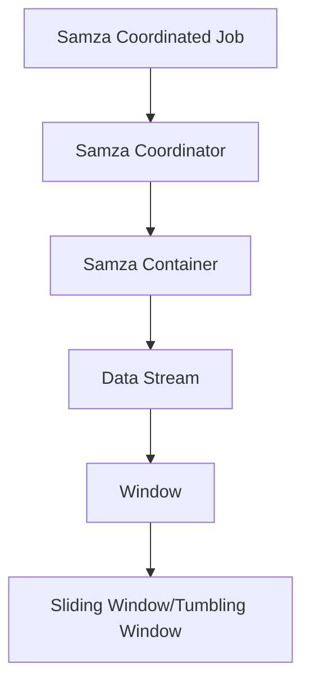
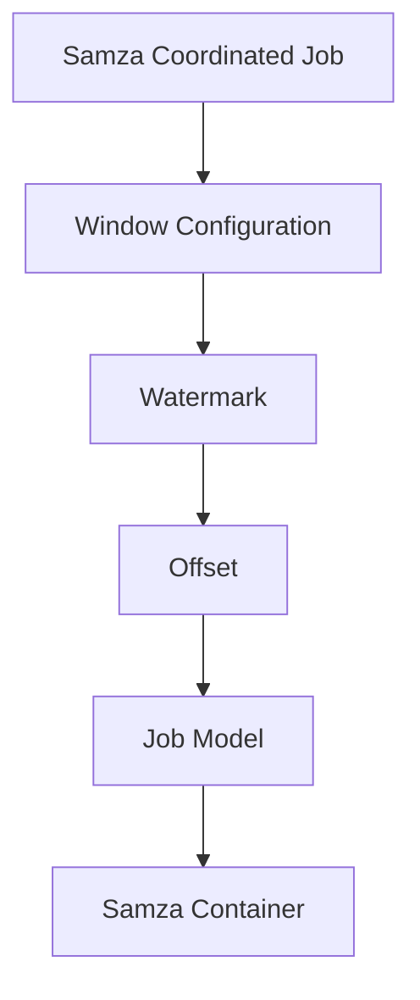
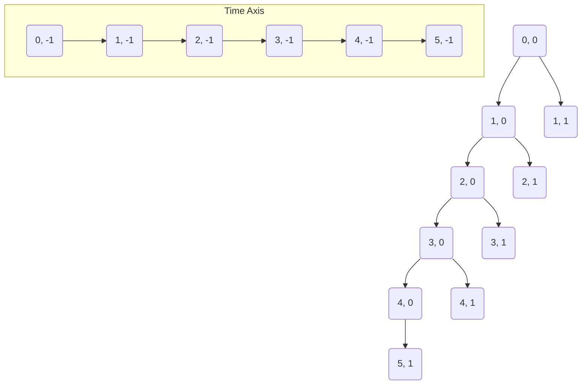
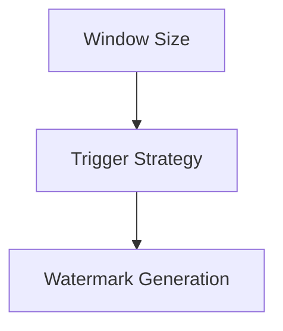
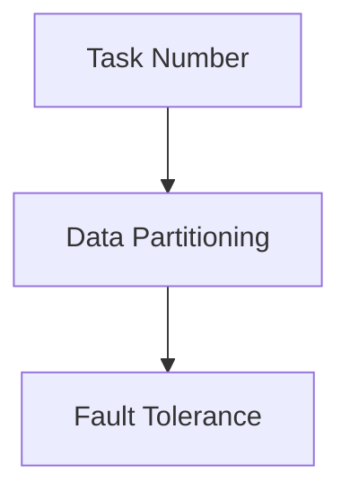
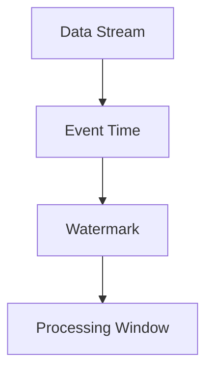
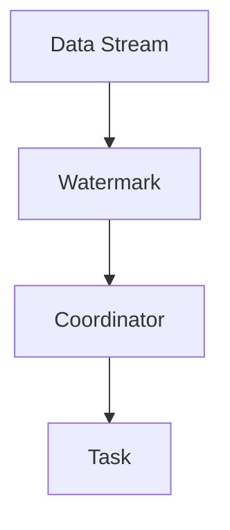

                 

# 《Samza Window原理与代码实例讲解》

> 关键词：Samza, Window, 流处理, 模式识别, 分布式系统

> 摘要：本文深入探讨了Samza Window的原理和核心算法，通过详细的代码实例，对Samza Window的应用场景、配置优化和性能调优进行了讲解，帮助读者全面掌握Samza Window的使用方法，并探讨其在分布式系统和大数据技术中的未来发展。

## 第1章：Samza Window基础

### 1.1 Samza简介

#### 1.1.1 Samza的概念与作用

Samza是一个开源的分布式流处理框架，它主要用于处理实时数据流。Samza的设计目标是实现高效的分布式数据处理，通过提供一套完整的流处理解决方案，使得开发人员能够更加专注于业务逻辑，而无需过多关注底层分布式系统的复杂性。

Samza的作用主要体现在以下几个方面：

1. **处理实时数据流**：Samza能够实时地处理大规模的数据流，支持多种数据源，如Kafka、Kinesis等。
2. **分布式处理**：Samza能够将数据处理任务分布到多个节点上执行，提高系统的处理能力和容错性。
3. **可扩展性**：Samza支持动态扩展和缩放，能够根据数据流量的变化自动调整处理能力。
4. **容错性**：Samza具有高容错性，能够在节点故障时自动恢复，确保数据处理任务的连续性。

#### 1.1.2 Samza的核心架构

Samza的核心架构包括以下几个关键组件：

1. **Samza Coordinated Job**：Samza Coordinated Job是Samza中的核心概念，它代表了用户定义的一个数据处理任务。Job由一组Task组成，每个Task负责处理特定的一部分数据。
2. **Samza Coordinator**：Samza Coordinator负责协调和管理Job的执行。它负责在适当的时间调度Task，并将数据分发到不同的Task上。
3. **Samza Container**：Samza Container是运行在每个节点上的一个进程，它负责执行具体的Task任务，并与Coordinator进行通信。
4. **Samza Monitor**：Samza Monitor负责监控整个Job的执行情况，包括Task的运行状态、性能指标等。

### 1.2 Samza Window原理

#### 1.2.1 Samza Window的基本概念

Samza Window是Samza中的一个关键概念，用于定义数据流的处理时间窗口。Window将数据流划分为多个时间段，每个时间段内的数据会被连续处理。

Window可以分为以下几种类型：

1. **滑动窗口（Sliding Window）**：滑动窗口在每个时间段结束时，将新数据与旧数据合并处理，窗口大小固定，但时间不断后移。
2. **滚动窗口（Tumbling Window）**：滚动窗口在每个时间段结束时，将新数据替换旧数据，窗口大小固定，但时间不重叠。

图解：Samza Window架构图



#### 1.2.2 Samza Window的关键组件

Samza Window的关键组件包括：

1. **Watermark**：Watermark是一种时间戳机制，用于确定数据的有效性。Watermark机制能够确保数据处理任务在适当的时间窗口内执行。
2. **Offset**：Offset是数据流中的位置标识符，用于标记数据在流中的位置。Samza使用Offset来跟踪数据流的处理进度。
3. **Job Model**：Job Model是Samza中的配置文件，用于定义数据处理任务的各种参数，如窗口大小、触发策略等。

图解：Samza Window组件关系图



#### 1.2.3 Samza Window的工作流程

Samza Window的工作流程可以分为以下几个步骤：

1. **数据采集**：数据从数据源（如Kafka）传输到Samza Container。
2. **Watermark生成**：Samza Container生成Watermark，用于确定数据的处理时间。
3. **Offset记录**：Samza Container将数据的位置（Offset）记录到数据流中。
4. **数据处理**：Samza Container根据Watermark和Offset，将数据分配到相应的窗口中，并在窗口内执行数据处理任务。
5. **结果输出**：处理完成的数据被输出到指定的结果存储（如外部数据库）。

伪代码：Samza Window处理流程

```java
function processDataStream(dataStream) {
    watermark = generateWatermark(dataStream)
    while (!isEndOfDataStream(dataStream)) {
        offset = dataStream.nextOffset()
        window = getWindowByWatermark(watermark)
        processWindow(window)
        watermark = updateWatermark(watermark)
    }
}
```

### 1.3 Samza Window的核心算法

#### 1.3.1 Sliding Window算法

滑动窗口算法是一种将数据流划分为固定大小的时间窗口的算法。每个时间段内的数据会被连续处理，窗口大小固定，但时间不断后移。

图解：Sliding Window示意图



伪代码：Sliding Window算法

```java
function slidingWindow(dataStream, windowSize) {
    currentWindow = new Window()
    while (!isEndOfDataStream(dataStream)) {
        data = dataStream.next()
        currentWindow.addData(data)
        if (currentWindow.size() >= windowSize) {
            processWindow(currentWindow)
            currentWindow = new Window()
        }
    }
}
```

#### 1.3.2 Tumbling Window算法

滚动窗口算法是一种将数据流划分为固定大小的时间窗口，但时间重叠的算法。每个时间段内的数据会被连续处理，窗口大小固定，但时间不断后移。

图解：Tumbling Window示意图


伪代码：Tumbling Window算法

```java
function tumblingWindow(dataStream, windowSize) {
    currentWindow = new Window()
    while (!isEndOfDataStream(dataStream)) {
        data = dataStream.next()
        currentWindow.addData(data)
        if (currentWindow.size() == windowSize) {
            processWindow(currentWindow)
            currentWindow = new Window()
        }
    }
}
```

## 第2章：Samza Window应用实例

### 2.1 实例1：实时数据分析

#### 2.1.1 实例背景

某电商平台需要实时分析用户的行为数据，以了解用户的需求和偏好，进而优化用户体验和推荐系统。行为数据包括用户的浏览、购买、评价等操作，这些数据需要以实时的方式进行处理和分析。

#### 2.1.2 实例需求

1. 实时采集用户行为数据。
2. 将用户行为数据按照时间窗口进行划分，并分析每个窗口内的用户行为模式。
3. 根据用户行为模式，为用户提供个性化的推荐。

### 2.2 实例2：日志聚合分析

#### 2.2.1 实例背景

某互联网公司需要对其服务器日志进行实时聚合分析，以监控服务器的运行状态和性能。日志数据包括访问日志、错误日志等。

#### 2.2.2 实例需求

1. 实时采集服务器日志。
2. 将日志数据按照时间窗口进行划分，并统计每个窗口内的日志数量。
3. 根据日志数量，生成服务器的运行状态报告。

### 2.3 实例3：电商推荐系统

#### 2.3.1 实例背景

某电商平台需要为其用户提供个性化的商品推荐。为了实现这一目标，平台需要实时分析用户的行为数据，并结合用户的历史行为和偏好，生成个性化的推荐列表。

#### 2.3.2 实例需求

1. 实时采集用户行为数据。
2. 将用户行为数据按照时间窗口进行划分，并分析每个窗口内的用户行为模式。
3. 根据用户行为模式，结合用户的历史行为和偏好，生成个性化的推荐列表。
4. 将推荐结果实时反馈给用户。

## 第3章：Samza Window配置与优化

### 3.1 Samza Window配置详解

#### 3.1.1 Window配置参数

Window配置参数主要包括以下几个方面：

1. **窗口大小**：窗口大小决定了数据在窗口内处理的时间范围。窗口大小可以是一个固定的值，也可以是一个动态的值，例如基于时间的窗口。
2. **触发策略**：触发策略决定了何时触发数据处理任务。常见的触发策略包括基于时间的触发和基于数据量的触发。
3. **Watermark生成**：Watermark生成策略决定了如何生成Watermark。常见的Watermark生成策略包括基于事件时间的生成和基于处理时间的生成。

图解：Window配置参数关系图



#### 3.1.2 作业配置参数

作业配置参数主要包括以下几个方面：

1. **任务数量**：任务数量决定了Job在分布式系统中的Task数量，从而影响系统的处理能力。
2. **数据分区**：数据分区策略决定了如何将数据分配到不同的Task上。常见的分区策略包括基于哈希的分区和基于范围的分区。
3. **容错策略**：容错策略决定了如何处理节点故障。常见的容错策略包括任务重试和数据恢复。

图解：作业配置参数关系图



### 3.2 Samza Window性能优化

#### 3.2.1 性能优化策略

1. **提高数据处理速度**：通过优化数据处理算法和代码，提高数据处理速度。
2. **减少数据传输延迟**：通过优化网络传输和系统调用，减少数据传输延迟。
3. **均衡负载**：通过负载均衡策略，确保数据能够均匀地分配到不同的节点上，避免单点瓶颈。
4. **优化资源分配**：通过合理配置节点资源和任务数量，提高系统的处理能力。

伪代码：性能优化策略

```java
function optimizePerformance(dataStream, windowSize, taskNumber) {
    // 优化数据处理算法
    optimizeProcessingAlgorithm(dataStream, windowSize)
    
    // 减少数据传输延迟
    reduceDataTransferDelay(dataStream)
    
    // 均衡负载
    balanceLoad(dataStream, windowSize, taskNumber)
    
    // 优化资源分配
    optimizeResourceAllocation(windowSize, taskNumber)
}
```

#### 3.2.2 调优技巧与实践

1. **监控性能指标**：通过监控系统的性能指标，如处理速度、延迟、负载等，及时发现性能瓶颈。
2. **调整配置参数**：根据监控结果，调整Window配置参数和作业配置参数，优化系统性能。
3. **使用性能分析工具**：使用性能分析工具，如VisualVM、JProfiler等，对系统进行深入分析，找出性能瓶颈并进行优化。

## 第4章：Samza Window实战技巧

### 4.1 错误处理与数据完整性保障

#### 4.1.1 数据处理错误类型

在数据处理过程中，可能会出现以下几种错误：

1. **数据丢失**：部分数据在传输或处理过程中丢失，导致结果不准确。
2. **数据重复**：部分数据在传输或处理过程中被重复处理，导致结果重复。
3. **数据错误**：数据本身存在错误，如格式错误、字段缺失等。

#### 4.1.2 错误处理策略

为了保障数据处理的完整性，可以采取以下错误处理策略：

1. **数据校验**：在数据传输和处理前，对数据进行校验，确保数据格式和内容符合预期。
2. **数据备份**：对数据进行备份，确保在数据丢失时能够快速恢复。
3. **重复检测**：在数据处理过程中，检测重复数据，避免重复处理。
4. **错误日志**：记录数据处理过程中的错误日志，便于后续分析和处理。

### 4.2 高级特性应用

#### 4.2.1 Event Time处理

Event Time是数据发生的时间，它与处理时间（Processing Time）不同。在处理实时数据流时，Event Time对于正确处理数据非常重要。

图解：Event Time处理流程



伪代码：Event Time处理流程

```java
function processDataStream(dataStream, eventTime) {
    watermark = generateWatermark(eventTime)
    while (!isEndOfDataStream(dataStream)) {
        data = dataStream.next()
        eventTime = data.getEventTime()
        if (eventTime <= watermark) {
            processWindow(data)
        }
        watermark = updateWatermark(eventTime)
    }
}
```

#### 4.2.2 水印机制

水印机制是Samza中的一个重要特性，用于确保数据处理任务的连续性和一致性。

水印机制的基本原理是：

1. **生成水印**：在数据处理过程中，生成一个水印时间戳，表示当前数据流中的最新数据。
2. **跟踪水印**：将水印时间戳发送到Coordinator，Coordinator根据水印时间戳来调度Task。
3. **处理数据**：当Task接收到水印时间戳后，开始处理当前窗口内的数据。

图解：水印机制示意图



### 4.3 跨作业与跨集群的数据处理

#### 4.3.1 跨作业数据流转

跨作业数据流转是指将一个作业的处理结果作为另一个作业的数据源。

为了实现跨作业数据流转，需要遵循以下步骤：

1. **定义数据源和目标作业**：在作业配置文件中定义数据源和目标作业。
2. **配置数据通道**：配置数据通道，确保数据能够从源作业传输到目标作业。
3. **处理数据**：在目标作业中处理从源作业传输过来的数据。

#### 4.3.2 跨集群数据处理

跨集群数据处理是指将数据流处理任务分布到不同的集群上执行。

为了实现跨集群数据处理，需要遵循以下步骤：

1. **配置跨集群连接**：在Samza配置文件中配置跨集群连接。
2. **分配任务到集群**：根据集群的资源和负载情况，将Task分配到不同的集群上。
3. **处理数据**：在集群上执行数据处理任务，并将结果返回给Coordinator。

## 第5章：Samza Window与外部系统的集成

### 5.1 Samza与Kafka的集成

#### 5.1.1 Kafka基本概念

Kafka是一个分布式流处理平台，主要用于处理大规模的数据流。Kafka的核心概念包括：

1. **主题（Topic）**：主题是Kafka中的一个概念，用于表示一组相关的数据。
2. **分区（Partition）**：分区是Kafka中的一个概念，用于将数据分配到多个节点上执行，提高系统的处理能力和容错性。
3. **副本（Replica）**：副本是Kafka中的一个概念，用于确保数据的高可用性和容错性。

#### 5.1.2 Kafka与Samza集成方案

为了实现Kafka与Samza的集成，需要遵循以下步骤：

1. **配置Kafka连接**：在Samza配置文件中配置Kafka连接，包括Kafka地址、主题等。
2. **定义数据流处理任务**：在Samza中定义数据流处理任务，包括数据处理逻辑、窗口配置等。
3. **将Kafka作为数据源**：将Kafka作为数据源，从Kafka主题中读取数据，并将其传输到Samza容器中处理。
4. **将处理结果输出到Kafka**：将处理结果输出到Kafka主题，以便其他系统或作业使用。

### 5.2 Samza与外部数据库的集成

#### 5.2.1 数据库基本概念

数据库是用于存储和管理数据的系统，它包括以下几个核心概念：

1. **表（Table）**：表是数据库中的一个概念，用于存储数据。
2. **字段（Column）**：字段是表中的一个概念，用于存储数据的一个属性。
3. **记录（Row）**：记录是表中的一个概念，表示一行数据。

#### 5.2.2 Samza与外部数据库集成方案

为了实现Samza与外部数据库的集成，需要遵循以下步骤：

1. **配置数据库连接**：在Samza配置文件中配置数据库连接，包括数据库地址、用户名、密码等。
2. **定义数据处理任务**：在Samza中定义数据处理任务，包括数据处理逻辑、数据源和目标数据库。
3. **将数据库作为数据源**：将数据库作为数据源，从数据库中读取数据，并将其传输到Samza容器中处理。
4. **将处理结果输出到数据库**：将处理结果输出到数据库，以便其他系统或作业使用。

### 5.3 Samza与外部系统的集成实践

#### 5.3.1 实例：Samza与HDFS集成

HDFS（Hadoop Distributed File System）是Hadoop的一个分布式文件系统，用于存储大规模数据。Samza与HDFS的集成可以通过以下步骤实现：

1. **配置HDFS连接**：在Samza配置文件中配置HDFS连接，包括HDFS地址、用户名、密码等。
2. **定义数据处理任务**：在Samza中定义数据处理任务，包括数据处理逻辑、数据源和目标HDFS。
3. **将HDFS作为数据源**：将HDFS作为数据源，从HDFS中读取数据，并将其传输到Samza容器中处理。
4. **将处理结果输出到HDFS**：将处理结果输出到HDFS，以便其他系统或作业使用。

## 第6章：Samza Window在分布式系统中的应用

### 6.1 分布式系统的基本概念

分布式系统是指由多个节点组成的系统，这些节点通过网络连接，共同完成一个任务。分布式系统的核心概念包括：

1. **节点**：节点是分布式系统中的一个组成部分，它负责处理数据和执行任务。
2. **网络**：网络是分布式系统中节点之间的通信通道，用于传输数据和消息。
3. **任务调度**：任务调度是分布式系统中的一项重要功能，它负责将任务分配到不同的节点上执行，提高系统的处理能力和负载均衡性。

### 6.2 Samza Window在分布式系统中的优化

#### 6.2.1 数据分区策略

数据分区策略是分布式系统中的一项关键技术，用于将数据均匀地分配到不同的节点上。常见的分区策略包括：

1. **哈希分区**：根据数据的哈希值，将数据分配到不同的节点上。哈希分区能够确保数据均匀分布，但可能会引入热点问题。
2. **范围分区**：根据数据的范围，将数据分配到不同的节点上。范围分区能够避免热点问题，但可能会引入数据倾斜。

#### 6.2.2 负载均衡

负载均衡是分布式系统中的一项关键技术，用于均衡节点之间的负载。常见的负载均衡策略包括：

1. **轮询负载均衡**：根据轮询顺序，将请求分配到不同的节点上。轮询负载均衡能够确保负载均衡，但可能会引入延迟。
2. **最小连接负载均衡**：根据节点当前的连接数，将请求分配到连接数最少的节点上。最小连接负载均衡能够确保负载均衡，但可能会引入延迟。

### 6.3 Samza Window在分布式系统中的案例

#### 6.3.1 分布式日志处理

分布式日志处理是分布式系统中的一项重要应用，用于处理大规模的日志数据。Samza Window在分布式日志处理中的应用主要包括以下几个方面：

1. **实时日志分析**：使用Samza Window对实时日志数据进行处理和分析，生成实时日志报告。
2. **日志聚合分析**：使用Samza Window对分布式日志数据进行聚合分析，生成日志聚合报告。
3. **日志归档**：使用Samza Window对分布式日志数据进行归档，便于后续查询和分析。

#### 6.3.2 分布式实时流计算

分布式实时流计算是分布式系统中的一项重要应用，用于处理大规模的实时数据流。Samza Window在分布式实时流计算中的应用主要包括以下几个方面：

1. **实时数据处理**：使用Samza Window对实时数据流进行处理，生成实时数据报告。
2. **实时模式识别**：使用Samza Window对实时数据流进行模式识别，发现数据流中的异常和趋势。
3. **实时推荐系统**：使用Samza Window对实时数据流进行处理，生成实时推荐结果，为用户推荐感兴趣的内容。

## 第7章：Samza Window未来发展趋势

### 7.1 Samza Window的发展方向

随着大数据和实时流处理技术的不断发展，Samza Window在未来会有以下几个发展方向：

1. **更高性能**：随着硬件技术的不断升级，Samza Window的性能会进一步提升，能够处理更大量的数据流。
2. **更易用性**：随着技术的发展，Samza Window的使用门槛会降低，使其更加易于部署和使用。
3. **更广泛的场景应用**：Samza Window将在更多领域得到应用，如物联网、人工智能等。

### 7.2 Samza Window与大数据技术的融合

随着大数据技术的不断发展，Samza Window将与其他大数据技术进行深度融合，形成更加完整的大数据生态系统。Samza Window与大数据技术的融合主要包括以下几个方面：

1. **实时分析与批处理**：结合实时流处理和批处理技术，实现实时数据分析和历史数据分析的整合。
2. **多源数据融合**：结合多种数据源，如日志、物联网数据等，实现多源数据的实时融合和处理。
3. **人工智能集成**：结合人工智能技术，实现实时数据分析和模式识别，为用户提供智能化的决策支持。

### 7.3 Samza Window在新兴领域的应用

随着新兴领域的发展，Samza Window将在这些领域得到广泛应用。以下是一些新兴领域的应用：

1. **物联网**：在物联网领域，Samza Window可以实时处理大规模的物联网数据，实现对设备状态的实时监控和故障预警。
2. **人工智能**：在人工智能领域，Samza Window可以实时处理大量的人工智能数据，实现对模型训练过程的实时优化和调整。

## 作者信息

作者：AI天才研究院/AI Genius Institute & 禅与计算机程序设计艺术 /Zen And The Art of Computer Programming

---

以上是《Samza Window原理与代码实例讲解》的全文内容，通过对Samza Window的原理、核心算法、应用实例、配置与优化、实战技巧、与外部系统的集成以及未来发展趋势的详细讲解，旨在帮助读者全面掌握Samza Window的使用方法和原理，为实际项目中的应用提供指导。希望本文能够为读者在Samza Window领域的学习和研究提供帮助。如果您有任何疑问或建议，欢迎在评论区留言交流。感谢您的阅读！

