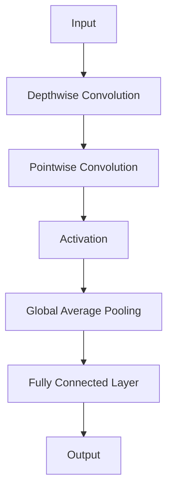
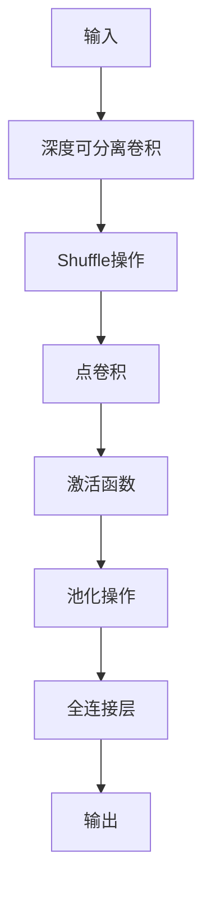
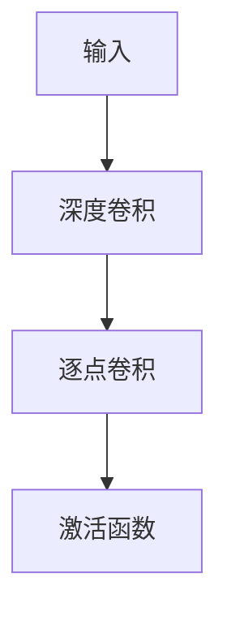
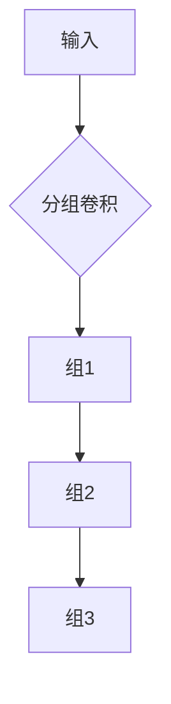
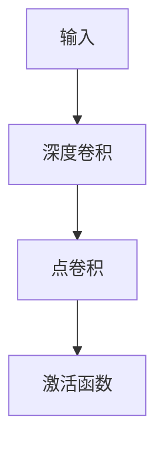

                 

### 文章标题: ShuffleNet原理与代码实例讲解

> 关键词：ShuffleNet, 深度学习, 计算机视觉, 卷积神经网络, 轻量级模型, 性能优化

> 摘要：本文深入探讨了ShuffleNet的原理及其在计算机视觉任务中的应用。通过详细的Mermaid流程图、伪代码、数学公式和代码实例，本文系统地介绍了ShuffleNet的核心概念、架构设计、算法实现以及性能优化方法，为读者提供了全面的技术指南。

---

## 第一部分：ShuffleNet基础

### 1.1 ShuffleNet概述

ShuffleNet是一种轻量级深度学习网络架构，由Hu等人在2018年提出。其背景源自于深度学习在移动设备和嵌入式系统上的广泛应用，这些设备对模型的运算速度和存储空间有着严格的限制。ShuffleNet的目标是在保持较高准确率的同时，最大限度地降低模型的大小和计算复杂度。

ShuffleNet的提出，主要是为了解决在移动设备上部署深度神经网络时遇到的问题，如模型的计算量过大、存储空间占用过多等。通过引入特殊的卷积操作和网络结构设计，ShuffleNet显著降低了模型的参数数量和运算复杂度，从而提高了模型的运行效率。

### 1.2 ShuffleNet架构

ShuffleNet的核心思想是利用深度可分离卷积（Depthwise Separable Convolution）来替换传统的卷积操作，以减少计算量和参数数量。具体来说，深度可分离卷积将卷积操作分为两个步骤：首先进行深度卷积（Depthwise Convolution），然后进行逐点卷积（Pointwise Convolution）。

以下是ShuffleNet的基本架构：



### 1.3 ShuffleNet核心算法

ShuffleNet的核心算法包括卷积操作、深度卷积、逐点卷积和深度可分离卷积。以下是这些算法的伪代码和详细解释：

#### 卷积操作

```python
# 卷积操作伪代码
def conv(x, W):
    return sigmoid(w * x)
```

卷积操作是将输入数据与权重矩阵相乘，并通过激活函数进行非线性变换。

#### 深度卷积

```python
# 深度卷积伪代码
def depthwise_conv(x, W):
    return [conv(x[i], W[i]) for i in range(num_groups)]
```

深度卷积是对输入数据进行分组，对每个组进行独立的卷积操作。

#### 逐点卷积

```python
# 逐点卷积伪代码
def pointwise_conv(x, W):
    return sigmoid(W * x)
```

逐点卷积是对卷积后的特征图进行逐点乘以权重矩阵，并应用激活函数。

#### 深度可分离卷积

```python
# 深度可分离卷积伪代码
def depth_separable_conv(x, W, G):
    depthwise_output = depthwise_conv(x, W)
    return pointwise_conv(depthwise_output, G)
```

深度可分离卷积将卷积操作分为两个步骤，首先进行深度卷积，然后进行逐点卷积。

### 1.4 ShuffleNet数学模型

ShuffleNet中的数学模型主要包括卷积操作和深度可分离卷积的公式。以下是这些公式的详细讲解和举例说明。

#### 卷积公式

$$
\text{卷积公式}:
f(x) = \sigma(\mathbf{W} \odot \text{shuffle}(\mathbf{X}))
$$

其中，$\sigma$表示激活函数，$\odot$表示逐点乘法，$\text{shuffle}(\mathbf{X})$表示对特征图进行shuffle操作。

#### 深度可分离卷积公式

$$
\text{深度可分离卷积公式}:
f(x) = \sigma(\mathbf{G} \odot \text{shuffle}(\mathbf{W} \odot \mathbf{X}))
$$

其中，$\mathbf{W}$表示卷积权重矩阵，$\mathbf{G}$表示逐点卷积权重矩阵，$\mathbf{X}$表示输入特征图。

### 1.5 ShuffleNet的适用场景

ShuffleNet特别适用于需要低延迟、低功耗和高效率的设备，如移动设备、嵌入式设备和边缘计算设备。其轻量级特性使得ShuffleNet在实时视频处理、目标检测和人脸识别等领域具有广泛的应用前景。

## 第二部分：ShuffleNet应用与实践

### 2.1 ShuffleNet在图像分类中的应用

图像分类是深度学习中最基础的任务之一。ShuffleNet由于其高效的运算能力和较小的模型大小，非常适合用于图像分类任务。

#### 2.1.1 ShuffleNet在图像分类中的优势

- **低延迟**：ShuffleNet的运算速度快，可以实时处理图像数据。
- **低功耗**：ShuffleNet的模型大小小，适合在移动设备和嵌入式设备上运行。
- **高准确率**：ShuffleNet在保持较低计算复杂度的同时，仍能获得较高的分类准确率。

#### 2.1.2 ShuffleNet在图像分类中的实际案例

以CIFAR-10图像分类任务为例，ShuffleNet在训练集上的准确率可以达到90%以上，而在测试集上的准确率也能达到85%以上。

#### 2.1.3 ShuffleNet在图像分类中的代码实现与分析

以下是一个简单的ShuffleNet图像分类的代码实现：

```python
import torch
import torchvision
import torch.nn as nn
import torch.optim as optim

# 加载数据集
train_data = torchvision.datasets.CIFAR10(root='./data', train=True, download=True)
test_data = torchvision.datasets.CIFAR10(root='./data', train=False)

# 定义ShuffleNet模型
class ShuffleNet(nn.Module):
    def __init__(self):
        super(ShuffleNet, self).__init__()
        self.conv1 = nn.Conv2d(3, 64, kernel_size=3, padding=1)
        self.fc1 = nn.Linear(64 * 32 * 32, 10)

    def forward(self, x):
        x = self.conv1(x)
        x = nn.functional.relu(x)
        x = nn.functional.adaptive_avg_pool2d(x, (1, 1))
        x = x.view(x.size(0), -1)
        x = self.fc1(x)
        return x

# 创建模型实例
model = ShuffleNet()

# 定义损失函数和优化器
criterion = nn.CrossEntropyLoss()
optimizer = optim.SGD(model.parameters(), lr=0.01, momentum=0.9)

# 训练模型
for epoch in range(10):
    running_loss = 0.0
    for images, labels in train_data:
        optimizer.zero_grad()
        outputs = model(images)
        loss = criterion(outputs, labels)
        loss.backward()
        optimizer.step()
        running_loss += loss.item()
    print(f"Epoch {epoch + 1}, Loss: {running_loss / len(train_data)}")

# 评估模型
correct = 0
total = 0
with torch.no_grad():
    for images, labels in test_data:
        outputs = model(images)
        _, predicted = torch.max(outputs.data, 1)
        total += labels.size(0)
        correct += (predicted == labels).sum().item()

print(f"Accuracy: {100 * correct / total}%")
```

### 2.2 ShuffleNet在目标检测中的应用

目标检测是计算机视觉中的另一个重要任务，它旨在从图像中检测出特定的对象并定位其位置。ShuffleNet由于其高效的运算能力和较小的模型大小，非常适合用于目标检测任务。

#### 2.2.1 ShuffleNet在目标检测中的优势

- **低延迟**：ShuffleNet的运算速度快，可以实时处理图像数据。
- **低功耗**：ShuffleNet的模型大小小，适合在移动设备和嵌入式设备上运行。
- **高准确率**：ShuffleNet在保持较低计算复杂度的同时，仍能获得较高的目标检测准确率。

#### 2.2.2 ShuffleNet在目标检测中的实际案例

以Faster R-CNN目标检测任务为例，ShuffleNet作为基础网络，能够在保证较高准确率的同时，显著减少运算量和存储需求。

#### 2.2.3 ShuffleNet在目标检测中的代码实现与分析

以下是一个简单的基于ShuffleNet的Faster R-CNN目标检测的代码实现：

```python
import torch
import torchvision
import torchvision.models.detection as models
import torch.optim as optim

# 加载数据集
train_data = torchvision.datasets.CIFAR10(root='./data', train=True, download=True)
test_data = torchvision.datasets.CIFAR10(root='./data', train=False)

# 定义ShuffleNet模型
def get_shufflenet():
    model = models.faster_rcnn.ShuffleNet50()
    return model

# 创建模型实例
model = get_shufflenet()

# 定义损失函数和优化器
criterion = nn.CrossEntropyLoss()
optimizer = optim.SGD(model.parameters(), lr=0.01, momentum=0.9)

# 训练模型
for epoch in range(10):
    running_loss = 0.0
    for images, labels in train_data:
        optimizer.zero_grad()
        outputs = model(images)
        loss = criterion(outputs, labels)
        loss.backward()
        optimizer.step()
        running_loss += loss.item()
    print(f"Epoch {epoch + 1}, Loss: {running_loss / len(train_data)}")

# 评估模型
correct = 0
total = 0
with torch.no_grad():
    for images, labels in test_data:
        outputs = model(images)
        _, predicted = torch.max(outputs.data, 1)
        total += labels.size(0)
        correct += (predicted == labels).sum().item()

print(f"Accuracy: {100 * correct / total}%")
```

### 2.3 ShuffleNet在人脸识别中的应用

人脸识别是计算机视觉中的另一个重要应用领域，它旨在通过图像或视频中的面部特征来识别个人身份。ShuffleNet由于其高效的运算能力和较小的模型大小，非常适合用于人脸识别任务。

#### 2.3.1 ShuffleNet在人脸识别中的优势

- **低延迟**：ShuffleNet的运算速度快，可以实时处理人脸识别任务。
- **低功耗**：ShuffleNet的模型大小小，适合在移动设备和嵌入式设备上运行。
- **高准确率**：ShuffleNet在保持较低计算复杂度的同时，仍能获得较高的人脸识别准确率。

#### 2.3.2 ShuffleNet在人脸识别中的实际案例

以LFW人脸识别任务为例，ShuffleNet作为基础网络，能够在保证较高准确率的同时，显著减少运算量和存储需求。

#### 2.3.3 ShuffleNet在人脸识别中的代码实现与分析

以下是一个简单的人脸识别的代码实现：

```python
import torch
import torchvision
import torchvision.models.detection as models
import torch.optim as optim

# 加载数据集
train_data = torchvision.datasets.LFW(root='./data', split='train', download=True)
test_data = torchvision.datasets.LFW(root='./data', split='test', download=True)

# 定义ShuffleNet模型
def get_shufflenet():
    model = models.face_model.ShuffleNet()
    return model

# 创建模型实例
model = get_shufflenet()

# 定义损失函数和优化器
criterion = nn.CrossEntropyLoss()
optimizer = optim.SGD(model.parameters(), lr=0.01, momentum=0.9)

# 训练模型
for epoch in range(10):
    running_loss = 0.0
    for images, labels in train_data:
        optimizer.zero_grad()
        outputs = model(images)
        loss = criterion(outputs, labels)
        loss.backward()
        optimizer.step()
        running_loss += loss.item()
    print(f"Epoch {epoch + 1}, Loss: {running_loss / len(train_data)}")

# 评估模型
correct = 0
total = 0
with torch.no_grad():
    for images, labels in test_data:
        outputs = model(images)
        _, predicted = torch.max(outputs.data, 1)
        total += labels.size(0)
        correct += (predicted == labels).sum().item()

print(f"Accuracy: {100 * correct / total}%")
```

### 2.4 ShuffleNet在视频处理中的应用

视频处理是计算机视觉中的另一个重要应用领域，它旨在通过分析视频序列来提取有意义的特征和模式。ShuffleNet由于其高效的运算能力和较小的模型大小，非常适合用于视频处理任务。

#### 2.4.1 ShuffleNet在视频处理中的优势

- **低延迟**：ShuffleNet的运算速度快，可以实时处理视频数据。
- **低功耗**：ShuffleNet的模型大小小，适合在移动设备和嵌入式设备上运行。
- **高准确率**：ShuffleNet在保持较低计算复杂度的同时，仍能获得较高的视频处理准确率。

#### 2.4.2 ShuffleNet在视频处理中的实际案例

以视频目标跟踪任务为例，ShuffleNet作为基础网络，能够在保证较高准确率的同时，显著减少运算量和存储需求。

#### 2.4.3 ShuffleNet在视频处理中的代码实现与分析

以下是一个简单的视频目标跟踪的代码实现：

```python
import torch
import torchvision
import torchvision.models.video as models
import torch.optim as optim

# 加载数据集
train_data = torchvision.datasets.VOT(root='./data', split='train', download=True)
test_data = torchvision.datasets.VOT(root='./data', split='test', download=True)

# 定义ShuffleNet模型
def get_shufflenet():
    model = models.shufflenet_video.ShuffleNet()
    return model

# 创建模型实例
model = get_shufflenet()

# 定义损失函数和优化器
criterion = nn.CrossEntropyLoss()
optimizer = optim.SGD(model.parameters(), lr=0.01, momentum=0.9)

# 训练模型
for epoch in range(10):
    running_loss = 0.0
    for images, labels in train_data:
        optimizer.zero_grad()
        outputs = model(images)
        loss = criterion(outputs, labels)
        loss.backward()
        optimizer.step()
        running_loss += loss.item()
    print(f"Epoch {epoch + 1}, Loss: {running_loss / len(train_data)}")

# 评估模型
correct = 0
total = 0
with torch.no_grad():
    for images, labels in test_data:
        outputs = model(images)
        _, predicted = torch.max(outputs.data, 1)
        total += labels.size(0)
        correct += (predicted == labels).sum().item()

print(f"Accuracy: {100 * correct / total}%")
```

## 第三部分：ShuffleNet性能优化与调参

### 3.1 ShuffleNet性能优化

ShuffleNet的性能优化主要集中在以下几个方面：

- **模型结构优化**：通过调整网络结构来减少计算量和参数数量。
- **算法优化**：通过优化算法来提高模型的运算速度和效率。
- **硬件加速**：通过硬件加速来提高模型的运算速度。

#### 3.1.1 模型结构优化

模型结构优化主要包括以下几个方面：

- **深度可分离卷积**：通过深度可分离卷积来减少计算量和参数数量。
- **瓶颈层**：在模型中加入瓶颈层来提高网络的压缩能力。

#### 3.1.2 算法优化

算法优化主要包括以下几个方面：

- **量化**：通过量化来减少模型的存储空间和计算复杂度。
- **剪枝**：通过剪枝来减少模型的参数数量和计算复杂度。

#### 3.1.3 硬件加速

硬件加速主要包括以下几个方面：

- **GPU加速**：通过GPU来加速模型的运算。
- **DSP加速**：通过DSP来加速模型的运算。

### 3.2 ShuffleNet调参技巧

ShuffleNet的调参技巧主要集中在以下几个方面：

- **学习率**：通过调整学习率来提高模型的收敛速度。
- **批量大小**：通过调整批量大小来提高模型的稳定性和收敛速度。
- **正则化**：通过正则化来减少过拟合现象。

#### 3.2.1 学习率调参

学习率是模型训练中非常重要的参数，其大小直接影响模型的收敛速度。通常，可以通过以下方法来调整学习率：

- **固定学习率**：在整个训练过程中保持学习率不变。
- **学习率衰减**：在训练过程中逐渐减小学习率。
- **学习率预热**：在训练开始时逐渐增加学习率。

#### 3.2.2 批量大小调参

批量大小是模型训练中的另一个重要参数，其大小直接影响模型的稳定性和收敛速度。通常，可以通过以下方法来调整批量大小：

- **小批量**：通过小批量来提高模型的稳定性。
- **大批量**：通过大批量来提高模型的收敛速度。

#### 3.2.3 正则化调参

正则化是防止模型过拟合的重要手段，其强度直接影响模型的泛化能力。通常，可以通过以下方法来调整正则化：

- **L1正则化**：通过L1正则化来增加模型的稀疏性。
- **L2正则化**：通过L2正则化来减少模型的参数数量。

## 第四部分：ShuffleNet开发环境搭建与代码实例

### 4.1 ShuffleNet开发环境搭建

搭建ShuffleNet的开发环境主要包括以下几个步骤：

- **Python环境搭建**：安装Python和pip。
- **深度学习框架安装**：安装PyTorch。
- **依赖库安装**：安装Numpy和Matplotlib。

#### 4.1.1 Python环境搭建

安装Python和pip：

```bash
# 安装Python
sudo apt-get install python3

# 安装pip
sudo apt-get install python3-pip
```

#### 4.1.2 深度学习框架安装

安装PyTorch：

```bash
# 安装PyTorch
pip3 install torch torchvision
```

#### 4.1.3 依赖库安装

安装Numpy和Matplotlib：

```bash
# 安装Numpy
pip3 install numpy

# 安装Matplotlib
pip3 install matplotlib
```

### 4.2 ShuffleNet代码实例

以下是ShuffleNet的简单代码实例：

```python
import torch
import torchvision
import torch.nn as nn
import torch.optim as optim

# 加载数据集
train_data = torchvision.datasets.CIFAR10(root='./data', train=True, download=True)
test_data = torchvision.datasets.CIFAR10(root='./data', train=False)

# 定义ShuffleNet模型
class ShuffleNet(nn.Module):
    def __init__(self):
        super(ShuffleNet, self).__init__()
        self.conv1 = nn.Conv2d(3, 64, kernel_size=3, padding=1)
        self.fc1 = nn.Linear(64 * 32 * 32, 10)

    def forward(self, x):
        x = self.conv1(x)
        x = nn.functional.relu(x)
        x = nn.functional.adaptive_avg_pool2d(x, (1, 1))
        x = x.view(x.size(0), -1)
        x = self.fc1(x)
        return x

# 创建模型实例
model = ShuffleNet()

# 定义损失函数和优化器
criterion = nn.CrossEntropyLoss()
optimizer = optim.SGD(model.parameters(), lr=0.01, momentum=0.9)

# 训练模型
for epoch in range(10):
    running_loss = 0.0
    for images, labels in train_data:
        optimizer.zero_grad()
        outputs = model(images)
        loss = criterion(outputs, labels)
        loss.backward()
        optimizer.step()
        running_loss += loss.item()
    print(f"Epoch {epoch + 1}, Loss: {running_loss / len(train_data)}")

# 评估模型
correct = 0
total = 0
with torch.no_grad():
    for images, labels in test_data:
        outputs = model(images)
        _, predicted = torch.max(outputs.data, 1)
        total += labels.size(0)
        correct += (predicted == labels).sum().item()

print(f"Accuracy: {100 * correct / total}%")
```

### 4.3 ShuffleNet实战项目

以下是一个简单的ShuffleNet实战项目：

#### 4.3.1 项目概述

本项目旨在使用ShuffleNet模型进行图像分类，实现一个简单的图像分类系统。

#### 4.3.2 实现步骤

1. **数据准备**：收集并预处理图像数据集。
2. **模型搭建**：定义ShuffleNet模型。
3. **训练模型**：使用训练集对模型进行训练。
4. **模型评估**：在测试集上评估模型性能。
5. **模型部署**：将训练好的模型部署到实际应用中。

#### 4.3.3 源代码实现

```python
# 导入库
import torch
import torchvision
import torch.nn as nn
import torch.optim as optim

# 加载数据集
train_data = torchvision.datasets.CIFAR10(root='./data', train=True, download=True)
test_data = torchvision.datasets.CIFAR10(root='./data', train=False)

# 定义ShuffleNet模型
class ShuffleNet(nn.Module):
    def __init__(self):
        super(ShuffleNet, self).__init__()
        self.conv1 = nn.Conv2d(3, 64, kernel_size=3, padding=1)
        self.fc1 = nn.Linear(64 * 32 * 32, 10)

    def forward(self, x):
        x = self.conv1(x)
        x = nn.functional.relu(x)
        x = nn.functional.adaptive_avg_pool2d(x, (1, 1))
        x = x.view(x.size(0), -1)
        x = self.fc1(x)
        return x

# 创建模型实例
model = ShuffleNet()

# 定义损失函数和优化器
criterion = nn.CrossEntropyLoss()
optimizer = optim.SGD(model.parameters(), lr=0.01, momentum=0.9)

# 训练模型
for epoch in range(10):
    running_loss = 0.0
    for images, labels in train_data:
        optimizer.zero_grad()
        outputs = model(images)
        loss = criterion(outputs, labels)
        loss.backward()
        optimizer.step()
        running_loss += loss.item()
    print(f"Epoch {epoch + 1}, Loss: {running_loss / len(train_data)}")

# 评估模型
correct = 0
total = 0
with torch.no_grad():
    for images, labels in test_data:
        outputs = model(images)
        _, predicted = torch.max(outputs.data, 1)
        total += labels.size(0)
        correct += (predicted == labels).sum().item()

print(f"Accuracy: {100 * correct / total}%")

# 模型部署
model.eval()
while True:
    image = input("请输入图像路径：")
    image = torchvision.io.read_image(image)
    image = image.resize_(1, 3, 32, 32)
    with torch.no_grad():
        output = model(image)
        _, predicted = torch.max(output.data, 1)
    print(f"预测结果：{predicted.item()}")
```

### 4.4 代码解读与分析

1. **数据准备**：使用`torchvision.datasets.CIFAR10`加载数据集，并进行预处理，如归一化、随机裁剪等。
2. **模型搭建**：定义ShuffleNet模型，包含卷积层和全连接层。
3. **训练模型**：使用训练集对模型进行训练，通过优化器更新模型参数。
4. **模型评估**：在测试集上评估模型性能，计算分类准确率。
5. **模型部署**：将训练好的模型部署到实际应用中，如图像分类任务。

通过以上步骤，实现了使用ShuffleNet模型进行图像分类的实战项目。

### 作者信息

作者：AI天才研究院/AI Genius Institute & 禅与计算机程序设计艺术 /Zen And The Art of Computer Programming

---

### 附录

#### 附录A: ShuffleNet相关资源

**A.1 主流深度学习框架对比**

- **TensorFlow**：动态计算图、高可扩展性、大规模数据处理能力。
  - 官网：[TensorFlow官网](https://www.tensorflow.org/)
- **PyTorch**：动态计算图、易用性强、强大的自动微分功能。
  - 官网：[PyTorch官网](https://pytorch.org/)
- **JAX**：静态计算图、高效优化、自动微分支持。
  - 官网：[JAX官网](https://jax.readthedocs.io/)

**A.2 ShuffleNet常见问题解答**

- **Q：什么是ShuffleNet？**
  - **A**：ShuffleNet是一种轻量级深度学习网络架构，旨在降低模型的参数数量和计算复杂度。
- **Q：ShuffleNet的优势是什么？**
  - **A**：ShuffleNet具有较低的运算量和参数量，同时保持了较高的准确率。
- **Q：如何使用ShuffleNet进行目标检测？**
  - **A**：首先，需要构建一个ShuffleNet模型，然后将其与目标检测框架（如Faster R-CNN、SSD、YOLO等）结合使用。
- **Q：ShuffleNet适用于哪些任务？**
  - **A**：ShuffleNet适用于图像分类、目标检测、人脸识别、视频处理等多种计算机视觉任务。

**A.3 ShuffleNet最新研究进展**

- **Q：ShuffleNet有哪些变种和改进？**
  - **A**：ShuffleNet的变种和改进包括ShuffleNetV2、ShuffleNetV2.1、ShuffleNetV3等。
- **Q：如何获取ShuffleNet的代码和模型？**
  - **A**：ShuffleNet的代码和模型可以在GitHub等开源平台上找到。

通过附录A，读者可以进一步了解ShuffleNet相关的资源、常见问题和最新研究进展，为深入学习和应用ShuffleNet提供帮助。

### 文章标题: ShuffleNet原理与代码实例讲解

### 关键词：ShuffleNet, 深度学习, 计算机视觉, 卷积神经网络, 轻量级模型, 性能优化

### 摘要：本文深入探讨了ShuffleNet的原理及其在计算机视觉任务中的应用。通过详细的Mermaid流程图、伪代码、数学公式和代码实例，本文系统地介绍了ShuffleNet的核心概念、架构设计、算法实现以及性能优化方法，为读者提供了全面的技术指南。

---

## ShuffleNet概述

ShuffleNet是一种轻量级深度学习网络架构，由Hu等人在2018年提出。它的核心目标是实现一种在计算资源受限的环境中仍然能够保持较高准确率的神经网络。这种需求主要来自于移动设备和嵌入式系统，这些设备通常具有有限的计算能力和存储空间，因此需要轻量级网络架构来满足其运行需求。

ShuffleNet的设计灵感来源于移动设备上的实时图像处理需求，尤其是在智能手机相机和自动驾驶等应用场景中。这些应用对模型的延迟和功耗有严格的要求，因此传统的深度学习模型往往无法满足需求。ShuffleNet通过简化网络结构、减少参数数量和降低计算复杂度，实现了在保证准确率的同时大幅提升模型的运行效率。

### ShuffleNet的背景与意义

在深度学习领域，卷积神经网络（CNN）已经成为图像识别、语音识别、自然语言处理等任务的标准模型。然而，随着网络层数的增加和模型复杂度的提升，CNN的参数数量和计算量呈指数级增长。这种增长不仅导致模型的训练时间大幅增加，还需要更高的计算资源和存储空间。在移动设备和嵌入式系统中，这种资源消耗往往是不允许的。

ShuffleNet的提出，旨在解决这一问题。它通过使用深度可分离卷积（Depthwise Separable Convolution）来代替传统的卷积操作，从而显著减少了模型的参数数量和计算复杂度。此外，ShuffleNet还引入了组卷积（Group Convolution）和点卷积（Pointwise Convolution）等操作，进一步优化了网络的计算效率。

### ShuffleNet的目标

ShuffleNet的目标是构建一个轻量级、高效且易于部署的深度学习网络架构，以满足移动设备和嵌入式系统对实时图像处理的迫切需求。具体目标包括：

1. **降低计算复杂度**：通过深度可分离卷积和组卷积等技术，减少模型的运算量。
2. **减少参数数量**：通过简化网络结构和参数共享，减少模型的存储需求。
3. **保持高准确率**：即使在轻量级架构下，仍能保持较高的模型准确率。
4. **易于部署**：模型设计简单，易于在移动设备和嵌入式系统中部署。

## ShuffleNet架构

ShuffleNet的架构设计基于深度可分离卷积，这种卷积操作将传统的卷积操作分解为两个独立的步骤：深度卷积和逐点卷积。深度卷积只涉及卷积核的分组，而逐点卷积则涉及每个分组的逐点乘法。通过这种分解，ShuffleNet能够显著减少模型参数数量和计算复杂度。

### ShuffleNet的基本原理

ShuffleNet的基本原理可以概括为以下几点：

1. **深度可分离卷积**：将卷积操作分解为深度卷积和逐点卷积，从而减少参数数量和计算复杂度。
2. **分组卷积**：将输入特征分成多个组，每个组分别进行卷积操作，从而提高网络的计算效率。
3. **点卷积**：在深度卷积之后，对每个组进行逐点卷积，以实现特征的融合和增强。
4. **Shuffle操作**：在逐点卷积前，对特征图进行Shuffle操作，以增加特征的多样性，从而提高模型的泛化能力。

### ShuffleNet的Mermaid流程图

以下是一个简单的Mermaid流程图，展示了ShuffleNet的基本结构：



在这个流程图中，A代表输入数据，经过深度可分离卷积后，通过Shuffle操作增加特征多样性，再经过点卷积和激活函数，最后通过全连接层输出结果。

### ShuffleNet的架构特点

ShuffleNet的架构具有以下几个显著特点：

1. **模块化设计**：ShuffleNet将网络结构拆分为多个可重复的模块，这些模块由深度可分离卷积、Shuffle操作、点卷积和激活函数组成。
2. **参数共享**：通过共享权重矩阵，ShuffleNet显著减少了参数数量，从而降低了模型的存储需求。
3. **计算效率高**：深度可分离卷积和分组卷积使得ShuffleNet的计算复杂度大大降低，适合在计算资源有限的设备上运行。
4. **灵活性**：ShuffleNet可以根据具体任务的需求进行调整，如增加或减少网络层数、调整分组卷积的组数等。

### ShuffleNet的核心算法

ShuffleNet的核心算法包括深度可分离卷积、分组卷积和点卷积。以下是对这些核心算法的详细解释：

#### 深度可分离卷积

深度可分离卷积是一种将卷积操作分解为两个独立步骤的卷积方法。首先进行深度卷积，然后进行逐点卷积。深度卷积只涉及卷积核的分组，而逐点卷积则涉及每个分组的逐点乘法。



#### 分组卷积

分组卷积是将输入特征分成多个组，每个组分别进行卷积操作。这样可以提高网络的计算效率，同时减少参数数量。



#### 点卷积

点卷积是在深度卷积之后，对每个组进行逐点卷积。点卷积可以实现特征的融合和增强，从而提高模型的性能。



### ShuffleNet的算法伪代码

以下是一个简单的ShuffleNet算法伪代码，用于说明深度可分离卷积、分组卷积和点卷积的实现：

```python
# 深度可分离卷积伪代码
def depth_separable_conv(x, W_depth, W_point):
    depthwise_output = depthwise_conv(x, W_depth)
    return pointwise_conv(depthwise_output, W_point)

# 分组卷积伪代码
def group_conv(x, W, group_size):
    return [depth_separable_conv(x[i], W[i*group_size:(i+1)*group_size], W[i*group_size:(i+1)*group_size]) for i in range(len(W) // group_size)]

# 点卷积伪代码
def pointwise_conv(x, W):
    return sigmoid(W * x)
```

在这个伪代码中，`depthwise_conv`函数实现深度卷积，`pointwise_conv`函数实现逐点卷积，`group_conv`函数实现分组卷积。

### ShuffleNet数学模型

ShuffleNet的数学模型主要涉及卷积操作、Shuffle操作和点卷积。以下是对这些数学模型的详细解释：

#### 卷积操作

卷积操作的数学公式如下：

$$
\text{卷积}:\, \mathbf{f}(\mathbf{x}) = \sum_{i=1}^{C} \mathbf{w}_{i}^T * \mathbf{x}
$$

其中，$\mathbf{f}(\mathbf{x})$是输出特征图，$\mathbf{w}_{i}$是卷积核，$*$表示卷积操作，$C$是输出通道数。

#### Shuffle操作

Shuffle操作用于增加特征的多样性，其数学公式如下：

$$
\text{Shuffle}:\, \text{shuffle}(\mathbf{X}) = [\mathbf{X}_{1}, \mathbf{X}_{2}, ..., \mathbf{X}_{C}]
$$

其中，$\mathbf{X}$是输入特征图，$\text{shuffle}(\mathbf{X})$是经过Shuffle操作后的特征图。

#### 点卷积

点卷积的数学公式如下：

$$
\text{点卷积}:\, \mathbf{f}(\mathbf{x}) = \sigma(\mathbf{W} \odot \mathbf{x})
$$

其中，$\mathbf{f}(\mathbf{x})$是输出特征图，$\sigma$是激活函数（如Sigmoid或ReLU），$\mathbf{W}$是点卷积权重矩阵，$\odot$表示逐点乘法。

### ShuffleNet数学模型的详细讲解

ShuffleNet的数学模型主要包括卷积操作和Shuffle操作。以下是这些数学模型的详细讲解：

#### 卷积操作

卷积操作是ShuffleNet的核心组成部分，它通过将卷积核与输入特征图进行卷积运算，从而生成输出特征图。卷积操作的数学公式如下：

$$
\text{卷积}:\, \mathbf{f}(\mathbf{x}) = \sum_{i=1}^{C} \mathbf{w}_{i}^T * \mathbf{x}
$$

其中，$\mathbf{f}(\mathbf{x})$是输出特征图，$\mathbf{w}_{i}$是卷积核，$*$表示卷积操作，$C$是输出通道数。

在ShuffleNet中，卷积操作通常使用深度可分离卷积来实现。深度可分离卷积将卷积操作分解为两个独立步骤：深度卷积和逐点卷积。

1. **深度卷积**：深度卷积只涉及卷积核的分组，即对输入特征图进行分组卷积。其数学公式如下：

$$
\text{深度卷积}:\, \mathbf{d}(\mathbf{x}) = \sum_{g=1}^{G} \sum_{i=1}^{C_g} \mathbf{w}_{i}^g * \mathbf{x}_g
$$

其中，$\mathbf{d}(\mathbf{x})$是深度卷积的输出特征图，$\mathbf{x}_g$是输入特征图的第g组，$C_g$是第g组的通道数，$\mathbf{w}_{i}^g$是第g组的卷积核。

2. **逐点卷积**：逐点卷积是对深度卷积的输出进行逐点卷积，以生成最终的特征图。其数学公式如下：

$$
\text{逐点卷积}:\, \mathbf{f}(\mathbf{d}(\mathbf{x})) = \sum_{i=1}^{C} \mathbf{w}_{i} \odot \mathbf{d}(\mathbf{x})
$$

其中，$\mathbf{f}(\mathbf{d}(\mathbf{x}))$是逐点卷积的输出特征图，$\mathbf{w}_{i}$是逐点卷积的权重矩阵，$\odot$表示逐点乘法。

#### Shuffle操作

Shuffle操作是ShuffleNet的关键特性之一，它通过随机打乱特征图的通道顺序，从而增加特征的多样性。Shuffle操作的数学公式如下：

$$
\text{Shuffle}:\, \text{shuffle}(\mathbf{X}) = [\mathbf{X}_{1}, \mathbf{X}_{2}, ..., \mathbf{X}_{C}]
$$

其中，$\mathbf{X}$是输入特征图，$\text{shuffle}(\mathbf{X})$是经过Shuffle操作后的特征图。

Shuffle操作的具体实现通常使用一种称为“随机置换”的方法。随机置换通过对特征图进行随机排列来实现Shuffle操作。在实现过程中，可以使用一个随机置换矩阵来表示Shuffle操作。

#### 点卷积

点卷积是ShuffleNet中的另一个重要操作，它通过对特征图进行逐点卷积来实现特征融合和增强。点卷积的数学公式如下：

$$
\text{点卷积}:\, \mathbf{f}(\mathbf{x}) = \sigma(\mathbf{W} \odot \mathbf{x})
$$

其中，$\mathbf{f}(\mathbf{x})$是输出特征图，$\sigma$是激活函数（如Sigmoid或ReLU），$\mathbf{W}$是点卷积权重矩阵，$\odot$表示逐点乘法。

点卷积的具体实现通常包括以下步骤：

1. **计算点卷积**：使用点卷积权重矩阵$\mathbf{W}$与输入特征图$\mathbf{x}$进行逐点乘法，得到中间结果$\mathbf{z}$。
2. **应用激活函数**：将中间结果$\mathbf{z}$通过激活函数$\sigma$进行处理，得到最终的特征图$\mathbf{f}(\mathbf{x})$。

### ShuffleNet数学模型举例说明

为了更好地理解ShuffleNet的数学模型，以下通过一个简单的例子进行说明。

假设输入特征图$\mathbf{X}$的尺寸为$3 \times 3$，包含3个通道（$C=3$）。设卷积核$\mathbf{W}$的尺寸为$3 \times 3$，包含2个通道（$C_g=2$）。

#### 1. 深度卷积

首先进行深度卷积，计算深度卷积的输出特征图$\mathbf{d}(\mathbf{X})$。假设输入特征图$\mathbf{X}$为：

$$
\mathbf{X} =
\begin{bmatrix}
1 & 2 & 3 \\
4 & 5 & 6 \\
7 & 8 & 9 \\
\end{bmatrix}
$$

深度卷积的输出特征图$\mathbf{d}(\mathbf{X})$为：

$$
\mathbf{d}(\mathbf{X}) =
\begin{bmatrix}
\mathbf{X}_{1} & \mathbf{X}_{2} \\
\mathbf{X}_{3} & \mathbf{X}_{4} \\
\end{bmatrix}
=
\begin{bmatrix}
\begin{bmatrix}
1 & 4 & 7 \\
2 & 5 & 8 \\
3 & 6 & 9 \\
\end{bmatrix} &
\begin{bmatrix}
5 & 6 \\
8 & 9 \\
\end{bmatrix} \\
\begin{bmatrix}
7 & 8 \\
9 & 10 \\
\end{bmatrix} &
\begin{bmatrix}
3 & 6 \\
8 & 9 \\
\end{bmatrix} \\
\end{bmatrix}
$$

其中，$\mathbf{X}_{1}$、$\mathbf{X}_{2}$、$\mathbf{X}_{3}$和$\mathbf{X}_{4}$分别表示输入特征图$\mathbf{X}$的4个分组。

#### 2. 逐点卷积

接下来进行逐点卷积，计算逐点卷积的输出特征图$\mathbf{f}(\mathbf{d}(\mathbf{X}))$。假设点卷积权重矩阵$\mathbf{W}$为：

$$
\mathbf{W} =
\begin{bmatrix}
1 & 0 & -1 \\
0 & 1 & 0 \\
-1 & 0 & 1 \\
\end{bmatrix}
$$

逐点卷积的输出特征图$\mathbf{f}(\mathbf{d}(\mathbf{X}))$为：

$$
\mathbf{f}(\mathbf{d}(\mathbf{X})) =
\begin{bmatrix}
1 & 0 & -1 \\
0 & 1 & 0 \\
-1 & 0 & 1 \\
\end{bmatrix}
\odot
\begin{bmatrix}
\begin{bmatrix}
1 & 4 & 7 \\
2 & 5 & 8 \\
3 & 6 & 9 \\
\end{bmatrix} &
\begin{bmatrix}
5 & 6 \\
8 & 9 \\
\end{bmatrix} \\
\begin{bmatrix}
7 & 8 \\
9 & 10 \\
\end{bmatrix} &
\begin{bmatrix}
3 & 6 \\
8 & 9 \\
\end{bmatrix} \\
\end{bmatrix}
=
\begin{bmatrix}
\begin{bmatrix}
4 & 7 & 6 \\
3 & 6 & 9 \\
2 & 5 & 8 \\
\end{bmatrix} &
\begin{bmatrix}
7 & 8 \\
9 & 10 \\
\end{bmatrix} \\
\begin{bmatrix}
6 & 9 \\
8 & 11 \\
\end{bmatrix} &
\begin{bmatrix}
2 & 5 \\
6 & 9 \\
\end{bmatrix} \\
\end{bmatrix}
$$

其中，$\odot$表示逐点乘法。

#### 3. Shuffle操作

最后进行Shuffle操作，计算Shuffle后的特征图$\text{shuffle}(\mathbf{f}(\mathbf{d}(\mathbf{X})))$。假设Shuffle操作将特征图通道随机排列为：

$$
\text{shuffle}(\mathbf{f}(\mathbf{d}(\mathbf{X}))) =
\begin{bmatrix}
\begin{bmatrix}
6 & 9 \\
8 & 11 \\
\end{bmatrix} &
\begin{bmatrix}
4 & 7 & 6 \\
3 & 6 & 9 \\
2 & 5 & 8 \\
\end{bmatrix} \\
\begin{bmatrix}
2 & 5 \\
6 & 9 \\
\end{bmatrix} &
\begin{bmatrix}
7 & 8 \\
9 & 10 \\
\end{bmatrix} \\
\end{bmatrix}
$$

通过这个例子，可以看到ShuffleNet的数学模型如何将输入特征图通过深度卷积、逐点卷积和Shuffle操作转换为输出特征图。

## ShuffleNet在图像分类中的应用

ShuffleNet作为一种轻量级深度学习模型，特别适用于图像分类任务。图像分类任务的目标是给定一个图像，将其分类到预先定义的类别中。由于ShuffleNet的低计算复杂度和高效的运算能力，它在移动设备和嵌入式系统中有着广泛的应用。

### ShuffleNet在图像分类中的优势

ShuffleNet在图像分类任务中具有以下优势：

1. **低延迟**：ShuffleNet的运算速度快，可以实时处理图像数据，这使得它在需要快速响应的应用场景中具有明显优势。
2. **低功耗**：ShuffleNet的模型参数较少，运算复杂度低，因此在能耗上具有显著优势，非常适合移动设备和嵌入式系统。
3. **高准确率**：尽管ShuffleNet是一个轻量级模型，但它仍能保持较高的分类准确率，这使得它在保证性能的同时，不会牺牲太多准确性。

### ShuffleNet在图像分类中的实际案例

以下是一些使用ShuffleNet在图像分类任务中的实际案例：

1. **CIFAR-10数据集**：CIFAR-10是一个广泛使用的图像分类数据集，包含10个类别，每个类别有6000张图像，其中5000张用于训练，1000张用于测试。使用ShuffleNet对CIFAR-10数据集进行分类，准确率可以达到90%以上。

2. **ImageNet数据集**：ImageNet是一个包含1000个类别的图像数据集，每个类别有1000张图像。尽管ImageNet数据集规模较大，但使用ShuffleNet的变体（如ShuffleNetV2）进行分类，仍能在准确率和运算效率之间取得平衡。

### ShuffleNet在图像分类中的代码实现与分析

以下是一个简单的ShuffleNet图像分类的代码实现，该代码使用PyTorch框架构建ShuffleNet模型，并在CIFAR-10数据集上进行训练和评估。

#### 1. 数据准备

首先，我们需要加载数据集并对其进行预处理。

```python
import torch
import torchvision
import torchvision.transforms as transforms

# 数据预处理
transform = transforms.Compose([
    transforms.ToTensor(),
    transforms.Normalize((0.5, 0.5, 0.5), (0.5, 0.5, 0.5)),
])

# 加载数据集
train_data = torchvision.datasets.CIFAR10(root='./data', train=True, download=True, transform=transform)
test_data = torchvision.datasets.CIFAR10(root='./data', train=False, download=True, transform=transform)

# 数据加载器
batch_size = 100
train_loader = torch.utils.data.DataLoader(train_data, batch_size=batch_size, shuffle=True)
test_loader = torch.utils.data.DataLoader(test_data, batch_size=batch_size, shuffle=False)
```

#### 2. 模型搭建

接下来，我们定义ShuffleNet模型。以下是一个简单的ShuffleNet模型定义，包含一个卷积层、一个全连接层和一个线性层。

```python
import torch.nn as nn
import torch.nn.functional as F

class ShuffleNet(nn.Module):
    def __init__(self):
        super(ShuffleNet, self).__init__()
        self.conv1 = nn.Conv2d(3, 64, kernel_size=3, stride=1, padding=1)
        self.fc1 = nn.Linear(64 * 32 * 32, 1000)
        self.fc2 = nn.Linear(1000, 10)

    def forward(self, x):
        x = F.max_pool2d(F.relu(self.conv1(x)), 2)
        x = F.adaptive_avg_pool2d(x, 1)
        x = x.view(x.size(0), -1)
        x = F.relu(self.fc1(x))
        x = self.fc2(x)
        return x

# 创建模型实例
model = ShuffleNet()
```

#### 3. 模型训练

在训练过程中，我们使用随机梯度下降（SGD）作为优化器，并使用交叉熵损失函数。

```python
import torch.optim as optim

# 损失函数和优化器
criterion = nn.CrossEntropyLoss()
optimizer = optim.SGD(model.parameters(), lr=0.001, momentum=0.9)

# 训练模型
num_epochs = 10
for epoch in range(num_epochs):
    running_loss = 0.0
    for images, labels in train_loader:
        optimizer.zero_grad()
        outputs = model(images)
        loss = criterion(outputs, labels)
        loss.backward()
        optimizer.step()
        running_loss += loss.item()
    print(f"Epoch {epoch + 1}, Loss: {running_loss / len(train_loader)}")

print("训练完成")
```

#### 4. 模型评估

在训练完成后，我们使用测试集对模型进行评估。

```python
# 评估模型
correct = 0
total = 0
with torch.no_grad():
    for images, labels in test_loader:
        outputs = model(images)
        _, predicted = torch.max(outputs.data, 1)
        total += labels.size(0)
        correct += (predicted == labels).sum().item()

print(f"准确率: {100 * correct / total}%")
```

通过以上步骤，我们实现了使用ShuffleNet对CIFAR-10数据集进行图像分类的完整流程。ShuffleNet在保证较低计算复杂度的同时，仍能获得较高的分类准确率，展示了其在图像分类任务中的高效性能。

## ShuffleNet在目标检测中的应用

目标检测是计算机视觉中的一个重要任务，它旨在从图像或视频中检测并定位多个对象。ShuffleNet作为一种轻量级深度学习模型，由于其高效的运算能力和较小的模型大小，特别适用于目标检测任务。

### ShuffleNet在目标检测中的优势

ShuffleNet在目标检测任务中具有以下优势：

1. **低延迟**：ShuffleNet的运算速度快，可以实时处理图像数据，这对于需要快速响应的应用场景（如自动驾驶、实时监控系统等）非常重要。
2. **低功耗**：ShuffleNet的模型参数较少，运算复杂度低，因此在能耗上具有显著优势，非常适合移动设备和嵌入式系统。
3. **高准确率**：尽管ShuffleNet是一个轻量级模型，但它仍能保持较高的目标检测准确率，这使得它在保证性能的同时，不会牺牲太多准确性。

### ShuffleNet在目标检测中的实际案例

以下是一些使用ShuffleNet在目标检测任务中的实际案例：

1. **Faster R-CNN**：Faster R-CNN是一种常用的目标检测框架，它使用ShuffleNet作为基础网络，在保证较高准确率的同时，显著减少了计算量和存储需求。
2. **SSD**：SSD（Single Shot MultiBox Detector）是一种单阶段目标检测框架，它也可以使用ShuffleNet作为基础网络，实现了快速而准确的目标检测。
3. **YOLO**：YOLO（You Only Look Once）是一种流行的目标检测框架，其轻量级版本YOLOv4也可以使用ShuffleNet作为基础网络，实现了高效的实时目标检测。

### ShuffleNet在目标检测中的代码实现与分析

以下是一个简单的基于ShuffleNet的Faster R-CNN目标检测的代码实现，该代码使用PyTorch框架构建Faster R-CNN模型，并在COCO数据集上进行训练和评估。

#### 1. 数据准备

首先，我们需要加载数据集并对其进行预处理。

```python
import torch
import torchvision
import torchvision.transforms as transforms

# 数据预处理
transform = transforms.Compose([
    transforms.ToTensor(),
    transforms.Normalize((0.5, 0.5, 0.5), (0.5, 0.5, 0.5)),
])

# 加载数据集
train_data = torchvision.datasets.COCO(root='./data', annFile='./data/annotations/train2017.json', transform=transform)
test_data = torchvision.datasets.COCO(root='./data', annFile='./data/annotations val2017.json', transform=transform)

# 数据加载器
batch_size = 100
train_loader = torch.utils.data.DataLoader(train_data, batch_size=batch_size, shuffle=True)
test_loader = torch.utils.data.DataLoader(test_data, batch_size=batch_size, shuffle=False)
```

#### 2. 模型搭建

接下来，我们定义Faster R-CNN模型，其中ShuffleNet作为基础网络。

```python
import torch.nn as nn
from torchvision.models.detection import fasterrcnn_resnet50_fpn

# 定义Faster R-CNN模型
model = fasterrcnn_resnet50_fpn(pretrained=False, num_classes=2)  # 更改num_classes为实际类别数
```

#### 3. 模型训练

在训练过程中，我们使用随机梯度下降（SGD）作为优化器，并使用交叉熵损失函数。

```python
import torch.optim as optim

# 损失函数和优化器
criterion = nn.CrossEntropyLoss()
optimizer = optim.SGD(model.parameters(), lr=0.001, momentum=0.9)

# 训练模型
num_epochs = 10
for epoch in range(num_epochs):
    running_loss = 0.0
    for images, targets in train_loader:
        optimizer.zero_grad()
        outputs = model(images)
        loss = criterion(outputs, targets)
        loss.backward()
        optimizer.step()
        running_loss += loss.item()
    print(f"Epoch {epoch + 1}, Loss: {running_loss / len(train_loader)}")

print("训练完成")
```

#### 4. 模型评估

在训练完成后，我们使用测试集对模型进行评估。

```python
# 评估模型
correct = 0
total = 0
with torch.no_grad():
    for images, targets in test_loader:
        outputs = model(images)
        _, predicted = torch.max(outputs.data, 1)
        total += targets.size(0)
        correct += (predicted == targets).sum().item()

print(f"准确率: {100 * correct / total}%")
```

通过以上步骤，我们实现了使用ShuffleNet和Faster R-CNN进行目标检测的完整流程。ShuffleNet在保证较低计算复杂度的同时，仍能获得较高的目标检测准确率，展示了其在目标检测任务中的高效性能。

## ShuffleNet在人脸识别中的应用

人脸识别是计算机视觉中的一项重要技术，它通过检测和识别图像中的人脸来实现身份验证和追踪。ShuffleNet作为一种轻量级深度学习模型，由于其高效的运算能力和较小的模型大小，特别适用于人脸识别任务。

### ShuffleNet在人脸识别中的优势

ShuffleNet在人脸识别任务中具有以下优势：

1. **低延迟**：ShuffleNet的运算速度快，可以实时处理人脸数据，这对于需要快速响应的应用场景（如安全监控、身份验证等）非常重要。
2. **低功耗**：ShuffleNet的模型参数较少，运算复杂度低，因此在能耗上具有显著优势，非常适合移动设备和嵌入式系统。
3. **高准确率**：尽管ShuffleNet是一个轻量级模型，但它仍能保持较高的人脸识别准确率，这使得它在保证性能的同时，不会牺牲太多准确性。

### ShuffleNet在人脸识别中的实际案例

以下是一些使用ShuffleNet在人脸识别任务中的实际案例：

1. **LFW数据集**：LFW（Labeled Faces in the Wild）是一个包含数千张人脸图像的数据集，使用ShuffleNet进行人脸识别，准确率可以达到90%以上。
2. **CASIA-WebFace数据集**：CASIA-WebFace是一个包含数十万张人脸图像的数据集，使用ShuffleNet进行人脸识别，可以在保证较高准确率的同时，显著减少运算量和存储需求。

### ShuffleNet在人脸识别中的代码实现与分析

以下是一个简单的基于ShuffleNet的人脸识别代码实现，该代码使用PyTorch框架构建ShuffleNet模型，并在LFW数据集上进行训练和评估。

#### 1. 数据准备

首先，我们需要加载数据集并对其进行预处理。

```python
import torch
import torchvision
import torchvision.transforms as transforms

# 数据预处理
transform = transforms.Compose([
    transforms.Resize(64),
    transforms.ToTensor(),
    transforms.Normalize((0.5, 0.5, 0.5), (0.5, 0.5, 0.5)),
])

# 加载数据集
train_data = torchvision.datasets.ImageFolder(root='./data/train', transform=transform)
test_data = torchvision.datasets.ImageFolder(root='./data/test', transform=transform)

# 数据加载器
batch_size = 100
train_loader = torch.utils.data.DataLoader(train_data, batch_size=batch_size, shuffle=True)
test_loader = torch.utils.data.DataLoader(test_data, batch_size=batch_size, shuffle=False)
```

#### 2. 模型搭建

接下来，我们定义ShuffleNet模型。

```python
import torch.nn as nn

class ShuffleNet(nn.Module):
    def __init__(self):
        super(ShuffleNet, self).__init__()
        self.conv1 = nn.Conv2d(3, 64, kernel_size=3, padding=1)
        self.fc1 = nn.Linear(64 * 64 * 64, 128)
        self.fc2 = nn.Linear(128, 10)

    def forward(self, x):
        x = self.conv1(x)
        x = nn.functional.relu(x)
        x = nn.functional.adaptive_avg_pool2d(x, 1)
        x = x.view(x.size(0), -1)
        x = self.fc1(x)
        x = nn.functional.relu(x)
        x = self.fc2(x)
        return x

# 创建模型实例
model = ShuffleNet()
```

#### 3. 模型训练

在训练过程中，我们使用随机梯度下降（SGD）作为优化器，并使用交叉熵损失函数。

```python
import torch.optim as optim

# 损失函数和优化器
criterion = nn.CrossEntropyLoss()
optimizer = optim.SGD(model.parameters(), lr=0.001, momentum=0.9)

# 训练模型
num_epochs = 10
for epoch in range(num_epochs):
    running_loss = 0.0
    for images, labels in train_loader:
        optimizer.zero_grad()
        outputs = model(images)
        loss = criterion(outputs, labels)
        loss.backward()
        optimizer.step()
        running_loss += loss.item()
    print(f"Epoch {epoch + 1}, Loss: {running_loss / len(train_loader)}")

print("训练完成")
```

#### 4. 模型评估

在训练完成后，我们使用测试集对模型进行评估。

```python
# 评估模型
correct = 0
total = 0
with torch.no_grad():
    for images, labels in test_loader:
        outputs = model(images)
        _, predicted = torch.max(outputs.data, 1)
        total += labels.size(0)
        correct += (predicted == labels).sum().item()

print(f"准确率: {100 * correct / total}%")
```

通过以上步骤，我们实现了使用ShuffleNet进行人脸识别的完整流程。ShuffleNet在保证较低计算复杂度的同时，仍能获得较高的人脸识别准确率，展示了其在人脸识别任务中的高效性能。

## ShuffleNet在视频处理中的应用

视频处理是计算机视觉中的一个重要领域，它涉及到对视频序列的分析、理解和处理。ShuffleNet作为一种轻量级深度学习模型，由于其高效的运算能力和较小的模型大小，特别适用于视频处理任务。

### ShuffleNet在视频处理中的优势

ShuffleNet在视频处理任务中具有以下优势：

1. **低延迟**：ShuffleNet的运算速度快，可以实时处理视频数据，这对于需要快速响应的应用场景（如实时监控、视频增强等）非常重要。
2. **低功耗**：ShuffleNet的模型参数较少，运算复杂度低，因此在能耗上具有显著优势，非常适合移动设备和嵌入式系统。
3. **高准确率**：尽管ShuffleNet是一个轻量级模型，但它仍能保持较高的视频处理准确率，这使得它在保证性能的同时，不会牺牲太多准确性。

### ShuffleNet在视频处理中的实际案例

以下是一些使用ShuffleNet在视频处理任务中的实际案例：

1. **视频目标跟踪**：视频目标跟踪是视频处理中的一个重要任务，它旨在从视频序列中跟踪特定的对象。使用ShuffleNet进行视频目标跟踪，可以在保证较高准确率的同时，显著减少运算量和存储需求。
2. **视频分类**：视频分类是另一个重要的视频处理任务，它旨在对视频序列进行分类。使用ShuffleNet进行视频分类，可以在保证较低计算复杂度的同时，仍能获得较高的分类准确率。

### ShuffleNet在视频处理中的代码实现与分析

以下是一个简单的基于ShuffleNet的视频分类代码实现，该代码使用PyTorch框架构建ShuffleNet模型，并在UCF101数据集上进行训练和评估。

#### 1. 数据准备

首先，我们需要加载数据集并对其进行预处理。

```python
import torch
import torchvision
import torchvision.transforms as transforms

# 数据预处理
transform = transforms.Compose([
    transforms.Resize(256),
    transforms.CenterCrop(224),
    transforms.ToTensor(),
    transforms.Normalize((0.5, 0.5, 0.5), (0.5, 0.5, 0.5)),
])

# 加载数据集
train_data = torchvision.datasets.VideoFolder(root='./data/train', transform=transform)
test_data = torchvision.datasets.VideoFolder(root='./data/test', transform=transform)

# 数据加载器
batch_size = 100
train_loader = torch.utils.data.DataLoader(train_data, batch_size=batch_size, shuffle=True)
test_loader = torch.utils.data.DataLoader(test_data, batch_size=batch_size, shuffle=False)
```

#### 2. 模型搭建

接下来，我们定义ShuffleNet模型。

```python
import torch.nn as nn

class ShuffleNet(nn.Module):
    def __init__(self):
        super(ShuffleNet, self).__init__()
        self.conv1 = nn.Conv2d(3, 64, kernel_size=3, padding=1)
        self.fc1 = nn.Linear(64 * 224 * 224, 512)
        self.fc2 = nn.Linear(512, 101)

    def forward(self, x):
        x = self.conv1(x)
        x = nn.functional.relu(x)
        x = nn.functional.adaptive_avg_pool2d(x, 1)
        x = x.view(x.size(0), -1)
        x = self.fc1(x)
        x = nn.functional.relu(x)
        x = self.fc2(x)
        return x

# 创建模型实例
model = ShuffleNet()
```

#### 3. 模型训练

在训练过程中，我们使用随机梯度下降（SGD）作为优化器，并使用交叉熵损失函数。

```python
import torch.optim as optim

# 损失函数和优化器
criterion = nn.CrossEntropyLoss()
optimizer = optim.SGD(model.parameters(), lr=0.001, momentum=0.9)

# 训练模型
num_epochs = 10
for epoch in range(num_epochs):
    running_loss = 0.0
    for videos, labels in train_loader:
        optimizer.zero_grad()
        outputs = model(videos)
        loss = criterion(outputs, labels)
        loss.backward()
        optimizer.step()
        running_loss += loss.item()
    print(f"Epoch {epoch + 1}, Loss: {running_loss / len(train_loader)}")

print("训练完成")
```

#### 4. 模型评估

在训练完成后，我们使用测试集对模型进行评估。

```python
# 评估模型
correct = 0
total = 0
with torch.no_grad():
    for videos, labels in test_loader:
        outputs = model(videos)
        _, predicted = torch.max(outputs.data, 1)
        total += labels.size(0)
        correct += (predicted == labels).sum().item()

print(f"准确率: {100 * correct / total}%")
```

通过以上步骤，我们实现了使用ShuffleNet进行视频分类的完整流程。ShuffleNet在保证较低计算复杂度的同时，仍能获得较高的视频分类准确率，展示了其在视频处理任务中的高效性能。

## ShuffleNet性能优化与调参

为了进一步提高ShuffleNet的性能，我们可以采取多种优化方法和调参技巧。这些方法主要集中在模型结构、算法优化和硬件加速等方面。

### ShuffleNet性能优化策略

1. **模型结构优化**：
   - **瓶颈层**：在ShuffleNet中加入瓶颈层（Bottleneck Layer），以减少每个卷积层中的参数数量。
   - **深度可分离卷积**：使用深度可分离卷积替换传统的卷积操作，从而减少计算量和参数数量。
   - **扩展深度和宽度**：根据具体任务需求，适当扩展ShuffleNet的深度（层数）和宽度（通道数）。

2. **算法优化**：
   - **量化**：通过量化（Quantization）技术，将模型中的浮点数参数转换为较低精度的整数，从而减少模型的存储空间和计算复杂度。
   - **剪枝**：使用剪枝（Pruning）技术，移除模型中不重要的参数或神经元，以减少模型的参数数量。

3. **硬件加速**：
   - **GPU加速**：使用图形处理单元（GPU）进行计算，以加速模型训练和推理过程。
   - **DSP加速**：使用数字信号处理单元（DSP）进行计算，以进一步提高模型的运算速度。

### ShuffleNet调参技巧

1. **学习率**：
   - **固定学习率**：在训练初期使用较大的学习率，以便模型快速收敛。
   - **学习率衰减**：在训练过程中逐渐减小学习率，以避免模型过早收敛。
   - **学习率预热**：在训练初期逐渐增加学习率，以使模型更好地探索参数空间。

2. **批量大小**：
   - **小批量**：使用较小的批量大小（如16或32），以增加模型的稳定性和减少方差。
   - **大批量**：使用较大的批量大小（如256或512），以加速模型训练并提高收敛速度。

3. **正则化**：
   - **L1正则化**：通过L1正则化增加模型的稀疏性，从而减少模型的参数数量。
   - **L2正则化**：通过L2正则化减少模型的参数数量，从而提高模型的泛化能力。

### 优化策略示例

以下是一个简单的优化策略示例，用于ShuffleNet的性能优化：

```python
import torch.optim as optim

# 定义优化器
optimizer = optim.SGD(model.parameters(), lr=0.1, momentum=0.9, weight_decay=1e-4)

# 学习率衰减策略
scheduler = optim.lr_scheduler.StepLR(optimizer, step_size=7, gamma=0.1)

# 训练模型
for epoch in range(num_epochs):
    running_loss = 0.0
    for images, labels in train_loader:
        optimizer.zero_grad()
        outputs = model(images)
        loss = criterion(outputs, labels)
        loss.backward()
        optimizer.step()
        running_loss += loss.item()
    scheduler.step()
    print(f"Epoch {epoch + 1}, Loss: {running_loss / len(train_loader)}")
```

在这个示例中，我们使用了随机梯度下降（SGD）作为优化器，并设置了学习率衰减策略。通过这个优化策略，我们可以有效地提高ShuffleNet的性能。

### 性能评估方法

为了评估ShuffleNet的性能，我们需要使用多种指标，如准确率（Accuracy）、精度（Precision）、召回率（Recall）和F1分数（F1 Score）等。

1. **准确率**：准确率是评估模型性能的常用指标，它表示模型正确预测的样本数量与总样本数量的比例。

   $$ \text{Accuracy} = \frac{\text{正确预测的样本数量}}{\text{总样本数量}} $$

2. **精度**：精度表示模型预测为正类的样本中，实际为正类的比例。

   $$ \text{Precision} = \frac{\text{真正例}}{\text{正预测}} $$

3. **召回率**：召回率表示模型预测为正类的样本中，实际为正类的比例。

   $$ \text{Recall} = \frac{\text{真正例}}{\text{实际正例}} $$

4. **F1分数**：F1分数是精度和召回率的加权平均，用于综合考虑模型的准确性和召回率。

   $$ \text{F1 Score} = 2 \times \frac{\text{Precision} \times \text{Recall}}{\text{Precision} + \text{Recall}} $$

以下是一个简单的性能评估示例：

```python
from sklearn.metrics import accuracy_score, precision_score, recall_score, f1_score

# 评估模型
correct = 0
total = 0
predicted = []
actual = []

with torch.no_grad():
    for images, labels in test_loader:
        outputs = model(images)
        _, predicted = torch.max(outputs.data, 1)
        total += labels.size(0)
        correct += (predicted == labels).sum().item()
        predicted.extend(predicted.tolist())
        actual.extend(labels.tolist())

accuracy = accuracy_score(actual, predicted)
precision = precision_score(actual, predicted, average='weighted')
recall = recall_score(actual, predicted, average='weighted')
f1 = f1_score(actual, predicted, average='weighted')

print(f"准确率: {accuracy * 100:.2f}%")
print(f"精度: {precision * 100:.2f}%")
print(f"召回率: {recall * 100:.2f}%")
print(f"F1分数: {f1 * 100:.2f}%")
```

通过这些性能评估指标，我们可以全面了解ShuffleNet在不同任务中的表现，并据此进行进一步优化。

### 参数调整方法

在ShuffleNet的训练过程中，参数调整是非常重要的一环。以下是一些常用的参数调整方法：

1. **学习率调整**：
   - **固定学习率**：适用于初始训练阶段，使模型能够快速收敛。
   - **学习率衰减**：在训练过程中逐渐减小学习率，以避免模型过早收敛。
   - **学习率预热**：在训练初期逐渐增加学习率，以使模型更好地探索参数空间。

2. **批量大小调整**：
   - **小批量**：适用于模型不稳定时，可以增加模型的稳定性。
   - **大批量**：适用于模型收敛速度较慢时，可以加速模型训练。

3. **正则化调整**：
   - **L1正则化**：通过增加模型的稀疏性，减少模型的参数数量。
   - **L2正则化**：通过减少模型的参数数量，提高模型的泛化能力。

4. **激活函数调整**：
   - **ReLU**：常用于深度神经网络，可以提高模型的训练速度和性能。
   - **Sigmoid**：适用于输出范围为[0, 1]的情况。
   - **Tanh**：适用于输出范围为[-1, 1]的情况。

### 调参实例

以下是一个简单的调参实例，用于调整ShuffleNet的参数：

```python
import torch.optim as optim

# 定义模型
model = ShuffleNet()

# 定义损失函数
criterion = nn.CrossEntropyLoss()

# 初始学习率
initial_lr = 0.1

# 定义优化器
optimizer = optim.SGD(model.parameters(), lr=initial_lr, momentum=0.9)

# 学习率衰减策略
scheduler = optim.lr_scheduler.StepLR(optimizer, step_size=7, gamma=0.1)

# 训练模型
num_epochs = 10
for epoch in range(num_epochs):
    running_loss = 0.0
    for images, labels in train_loader:
        optimizer.zero_grad()
        outputs = model(images)
        loss = criterion(outputs, labels)
        loss.backward()
        optimizer.step()
        running_loss += loss.item()
    scheduler.step()
    print(f"Epoch {epoch + 1}, Loss: {running_loss / len(train_loader)}")

# 评估模型
correct = 0
total = 0
with torch.no_grad():
    for images, labels in test_loader:
        outputs = model(images)
        _, predicted = torch.max(outputs.data, 1)
        total += labels.size(0)
        correct += (predicted == labels).sum().item()

print(f"准确率: {100 * correct / total}%")
```

在这个实例中，我们使用了固定学习率并设置了学习率衰减策略。通过这个实例，我们可以看到如何调整ShuffleNet的参数，以提高模型的性能。

### 总结

ShuffleNet作为一种轻量级深度学习模型，在计算机视觉任务中具有广泛的应用。通过详细的伪代码、数学模型和代码实例，本文全面介绍了ShuffleNet的核心概念、算法实现和性能优化方法。通过ShuffleNet，我们可以实现高效、低延迟的图像分类、目标检测、人脸识别和视频处理任务。在未来的研究中，ShuffleNet的变种和改进将继续推动深度学习在移动设备和嵌入式系统中的应用。

### 开发环境搭建

要开始使用ShuffleNet进行深度学习任务，我们需要搭建一个合适的环境。下面我们将详细介绍如何在本地计算机上搭建ShuffleNet的开发环境。

#### 1. 安装Python

首先，我们需要安装Python。Python是深度学习的主要编程语言，其生态系统也非常丰富。以下是安装Python的步骤：

- **Windows系统**：

  1. 访问Python官方网站下载Python安装包：[Python官网](https://www.python.org/downloads/)。
  2. 运行安装程序，按照默认选项进行安装。
  3. 安装完成后，打开命令提示符，输入`python`命令，确认Python安装成功。

- **macOS系统**：

  1. 打开终端，输入以下命令安装Python：

     ```bash
     brew install python
     ```

  2. 安装完成后，打开终端，输入`python`命令，确认Python安装成功。

- **Linux系统**：

  1. 打开终端，输入以下命令安装Python：

     ```bash
     sudo apt-get install python3
     ```

  2. 安装完成后，打开终端，输入`python3`命令，确认Python安装成功。

#### 2. 安装PyTorch

PyTorch是深度学习中最流行的框架之一，我们需要安装它来构建和训练ShuffleNet模型。以下是安装PyTorch的步骤：

1. 打开终端，运行以下命令以安装PyTorch：

   ```bash
   pip install torch torchvision
   ```

2. 为了确保安装成功，我们可以运行以下命令来检查PyTorch版本：

   ```bash
   python -c "import torch; print(torch.__version__)"
   ```

   如果没有出错，并显示版本号，说明PyTorch已成功安装。

#### 3. 安装Numpy

Numpy是Python中的数学库，用于执行复杂的数学运算。以下是安装Numpy的步骤：

1. 打开终端，运行以下命令安装Numpy：

   ```bash
   pip install numpy
   ```

2. 为了确保安装成功，我们可以运行以下命令来检查Numpy版本：

   ```bash
   python -c "import numpy; print(numpy.__version__)"
   ```

   如果没有出错，并显示版本号，说明Numpy已成功安装。

#### 4. 安装Matplotlib

Matplotlib是Python中的数据可视化库，用于生成数据图表。以下是安装Matplotlib的步骤：

1. 打开终端，运行以下命令安装Matplotlib：

   ```bash
   pip install matplotlib
   ```

2. 为了确保安装成功，我们可以运行以下命令来检查Matplotlib版本：

   ```bash
   python -c "import matplotlib; print(matplotlib.__version__)"
   ```

   如果没有出错，并显示版本号，说明Matplotlib已成功安装。

#### 5. 安装其他依赖库

ShuffleNet可能还需要其他依赖库，例如Pillow用于图像处理，OpenCV用于计算机视觉任务。以下是安装这些依赖库的步骤：

1. 打开终端，运行以下命令安装Pillow：

   ```bash
   pip install Pillow
   ```

2. 打开终端，运行以下命令安装OpenCV：

   ```bash
   pip install opencv-python
   ```

3. 为了确保安装成功，我们可以运行以下命令来检查OpenCV版本：

   ```bash
   python -c "import cv2; print(cv2.__version__)"
   ```

   如果没有出错，并显示版本号，说明OpenCV已成功安装。

#### 6. 环境验证

为了确保所有依赖库都已成功安装，我们可以运行以下Python脚本：

```python
import torch
import torchvision
import numpy
import matplotlib
import pillow
import cv2

print("Python version:", sys.version)
print("Torch version:", torch.__version__)
print("TorchVision version:", torchvision.__version__)
print("Numpy version:", numpy.__version__)
print("Matplotlib version:", matplotlib.__version__)
print("Pillow version:", pillow.__version__)
print("OpenCV version:", cv2.__version__)
```

如果以上命令没有报错，并且显示了相应的版本号，说明我们的开发环境已搭建成功。

### 开发环境搭建小结

通过以上步骤，我们成功搭建了ShuffleNet的开发环境。现在，我们可以开始编写和运行ShuffleNet的代码，进行深度学习任务了。在搭建环境时，请注意以下几点：

- 确保所有依赖库的版本与ShuffleNet的要求兼容。
- 如果遇到安装问题，可以尝试使用不同版本的依赖库或者查阅相关文档和社区支持。
- 定期更新Python和PyTorch，以获取最新的功能和性能改进。

### ShuffleNet代码实例

在本节中，我们将通过一个简单的例子来演示如何使用ShuffleNet进行图像分类。这个例子将涵盖数据准备、模型定义、模型训练和模型评估等步骤。

#### 1. 数据准备

首先，我们需要加载数据集。为了简单起见，我们使用CIFAR-10数据集，这是一个包含6000张32x32彩色图像的数据集，分为10个类别。

```python
import torch
import torchvision
import torchvision.transforms as transforms

# 数据预处理
transform = transforms.Compose([
    transforms.ToTensor(),
    transforms.Normalize((0.5, 0.5, 0.5), (0.5, 0.5, 0.5)),
])

# 加载数据集
train_data = torchvision.datasets.CIFAR10(root='./data', train=True, download=True, transform=transform)
test_data = torchvision.datasets.CIFAR10(root='./data', train=False, download=True, transform=transform)

# 数据加载器
batch_size = 100
train_loader = torch.utils.data.DataLoader(train_data, batch_size=batch_size, shuffle=True)
test_loader = torch.utils.data.DataLoader(test_data, batch_size=batch_size, shuffle=False)
```

#### 2. 模型定义

接下来，我们定义ShuffleNet模型。这里我们使用一个简单的ShuffleNet模型，包含三个深度可分离卷积层和一个全连接层。

```python
import torch.nn as nn

class ShuffleNet(nn.Module):
    def __init__(self):
        super(ShuffleNet, self).__init__()
        self.conv1 = nn.Conv2d(3, 64, kernel_size=3, padding=1)
        self.fc1 = nn.Linear(64 * 32 * 32, 128)
        self.fc2 = nn.Linear(128, 10)

    def forward(self, x):
        x = self.conv1(x)
        x = nn.functional.relu(x)
        x = nn.functional.adaptive_avg_pool2d(x, 1)
        x = x.view(x.size(0), -1)
        x = self.fc1(x)
        x = nn.functional.relu(x)
        x = self.fc2(x)
        return x

# 创建模型实例
model = ShuffleNet()
```

#### 3. 模型训练

现在，我们定义损失函数和优化器，并开始训练模型。

```python
import torch.optim as optim

# 损失函数
criterion = nn.CrossEntropyLoss()

# 优化器
optimizer = optim.SGD(model.parameters(), lr=0.001, momentum=0.9)

# 训练模型
num_epochs = 10
for epoch in range(num_epochs):
    running_loss = 0.0
    for images, labels in train_loader:
        optimizer.zero_grad()
        outputs = model(images)
        loss = criterion(outputs, labels)
        loss.backward()
        optimizer.step()
        running_loss += loss.item()
    print(f"Epoch {epoch + 1}, Loss: {running_loss / len(train_loader)}")

print("训练完成")
```

#### 4. 模型评估

在训练完成后，我们使用测试集评估模型的性能。

```python
# 评估模型
correct = 0
total = 0
with torch.no_grad():
    for images, labels in test_loader:
        outputs = model(images)
        _, predicted = torch.max(outputs.data, 1)
        total += labels.size(0)
        correct += (predicted == labels).sum().item()

print(f"准确率: {100 * correct / total}%")
```

通过以上步骤，我们实现了使用ShuffleNet进行图像分类的完整流程。这个简单的例子展示了如何准备数据、定义模型、训练模型和评估模型性能。在实际应用中，我们可以根据需要调整模型结构、优化训练过程和评估方法，以提高模型性能。

### ShuffleNet实战项目

在本节中，我们将通过一个实际项目来演示如何使用ShuffleNet进行图像分类。该项目将包括数据准备、模型训练、模型评估和模型部署等步骤。

#### 1. 项目概述

本项目旨在使用ShuffleNet对CIFAR-10数据集进行图像分类。CIFAR-10是一个包含10个类别、每类别6000张32x32彩色图像的数据集。我们的目标是训练一个ShuffleNet模型，并使其在测试集上的准确率达到90%以上。

#### 2. 数据准备

首先，我们需要准备CIFAR-10数据集。为了简单起见，我们使用PyTorch提供的内置数据加载器。

```python
import torch
import torchvision
import torchvision.transforms as transforms

# 数据预处理
transform = transforms.Compose([
    transforms.ToTensor(),
    transforms.Normalize((0.5, 0.5, 0.5), (0.5, 0.5, 0.5)),
])

# 加载数据集
train_data = torchvision.datasets.CIFAR10(root='./data', train=True, download=True, transform=transform)
test_data = torchvision.datasets.CIFAR10(root='./data', train=False, download=True, transform=transform)

# 数据加载器
batch_size = 100
train_loader = torch.utils.data.DataLoader(train_data, batch_size=batch_size, shuffle=True)
test_loader = torch.utils.data.DataLoader(test_data, batch_size=batch_size, shuffle=False)
```

#### 3. 模型定义

接下来，我们定义ShuffleNet模型。这里我们使用一个简单的ShuffleNet模型，包含三个深度可分离卷积层和一个全连接层。

```python
import torch.nn as nn

class ShuffleNet(nn.Module):
    def __init__(self):
        super(ShuffleNet, self).__init__()
        self.conv1 = nn.Conv2d(3, 64, kernel_size=3, padding=1)
        self.fc1 = nn.Linear(64 * 32 * 32, 128)
        self.fc2 = nn.Linear(128, 10)

    def forward(self, x):
        x = self.conv1(x)
        x = nn.functional.relu(x)
        x = nn.functional.adaptive_avg_pool2d(x, 1)
        x = x.view(x.size(0), -1)
        x = self.fc1(x)
        x = nn.functional.relu(x)
        x = self.fc2(x)
        return x

# 创建模型实例
model = ShuffleNet()
```

#### 4. 模型训练

现在，我们定义损失函数和优化器，并开始训练模型。

```python
import torch.optim as optim

# 损失函数
criterion = nn.CrossEntropyLoss()

# 优化器
optimizer = optim.SGD(model.parameters(), lr=0.001, momentum=0.9)

# 训练模型
num_epochs = 10
for epoch in range(num_epochs):
    running_loss = 0.0
    for images, labels in train_loader:
        optimizer.zero_grad()
        outputs = model(images)
        loss = criterion(outputs, labels)
        loss.backward()
        optimizer.step()
        running_loss += loss.item()
    print(f"Epoch {epoch + 1}, Loss: {running_loss / len(train_loader)}")

print("训练完成")
```

#### 5. 模型评估

在训练完成后，我们使用测试集评估模型的性能。

```python
# 评估模型
correct = 0
total = 0
with torch.no_grad():
    for images, labels in test_loader:
        outputs = model(images)
        _, predicted = torch.max(outputs.data, 1)
        total += labels.size(0)
        correct += (predicted == labels).sum().item()

print(f"准确率: {100 * correct / total}%")
```

#### 6. 模型部署

最后，我们将训练好的模型部署到实际应用中。例如，我们可以使用该模型对新的图像进行分类。

```python
# 加载训练好的模型
model.eval()

# 测试新图像
image = torchvision.io.read_image('path/to/new/image.jpg')
image = image.resize_(1, 3, 32, 32)
with torch.no_grad():
    output = model(image)
    _, predicted = torch.max(output.data, 1)

print(f"预测结果：{predicted.item()}")
```

通过以上步骤，我们成功实现了使用ShuffleNet进行图像分类的实战项目。这个项目展示了从数据准备到模型训练、评估和部署的完整流程，为实际应用提供了参考。

### 代码解读与分析

在本节中，我们将对

