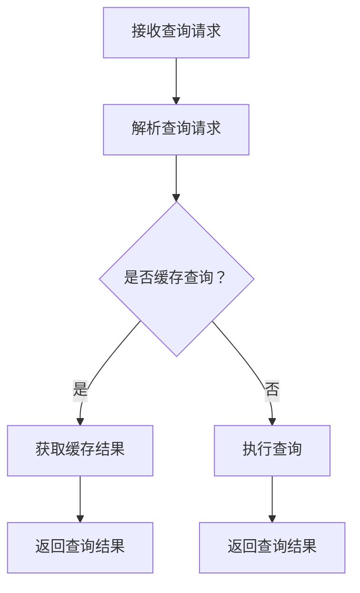

                 

# 《Solr原理与代码实例讲解》

## 关键词：Solr，搜索引擎，架构，数据模型，查询语言，性能优化，实战案例

## 摘要

本文将深入探讨Solr的原理和实战应用，从基础理论到高级实战，逐步解析Solr的核心概念、架构设计、数据存储、查询语言以及性能优化策略。通过具体的代码实例，我们将帮助读者更好地理解Solr的工作机制，并掌握如何在实际项目中应用Solr。

## 《Solr原理与代码实例讲解》目录大纲

## 第一部分：Solr基础理论

### 第1章：Solr简介与生态系统

#### 1.1 Solr的历史与发展

Solr起源于Apache Lucene，是一个开源的分布式、面向搜索的应用程序。它由Apache软件基金会维护，并得到了广泛的社区支持。Solr的发展历程伴随着对搜索引擎需求的不断增加，从最初的单一搜索功能到如今支持复杂查询和实时搜索。

#### 1.2 Solr的核心概念

Solr的核心概念包括：SolrCloud、Solr分布式搜索、Solr索引等。这些概念是理解Solr架构和功能的关键。

#### 1.3 Solr在搜索引擎中的应用

Solr在电子商务、内容管理、社交媒体等多个领域都有广泛的应用。本文将探讨Solr在这些领域的具体应用场景。

### 第2章：Solr架构详解

#### 2.1 Solr的基本架构

Solr的基本架构包括：Solr节点、Solr集群、Solr请求处理流程等。通过了解这些基本架构，读者可以更好地理解Solr的工作原理。

#### 2.2 Solr的高可用性架构

高可用性是搜索引擎系统设计的重要目标之一。Solr通过冗余和负载均衡等机制实现了高可用性。

#### 2.3 Solr集群架构与分布式

Solr集群是Solr系统的核心。它通过多个Solr节点的分布式架构实现了数据的分布式存储和查询。

### 第3章：Solr数据存储与管理

#### 3.1 Solr的数据模型

Solr的数据模型基于Lucene的索引结构。本文将详细介绍Solr的数据模型，包括文档、字段、索引等。

#### 3.2 Solr的数据存储机制

Solr的数据存储机制包括：Solr索引存储、Solr数据分片等。通过这些机制，Solr实现了高效的索引和数据存储。

#### 3.3 Solr的文档处理

Solr的文档处理包括：文档的创建、更新、删除等。本文将详细介绍Solr的文档处理流程。

### 第4章：Solr查询语言

#### 4.1 Solr查询语言概述

Solr查询语言是基于Lucene的查询语法。本文将介绍Solr查询语言的基本语法和查询类型。

#### 4.2 Solr查询语法详解

本文将详细解析Solr查询语法，包括布尔查询、范围查询、分组查询等。

#### 4.3 高级查询技巧

本文将介绍一些高级查询技巧，如查询缓存、动态查询等。

### 第5章：Solr缓存与性能优化

#### 5.1 Solr缓存机制

Solr的缓存机制包括：查询缓存、结果缓存等。本文将详细介绍Solr的缓存机制。

#### 5.2 Solr性能调优策略

本文将探讨Solr性能调优的策略，包括索引优化、查询优化等。

#### 5.3 Solr查询缓存与结果缓存

本文将详细讲解Solr的查询缓存和结果缓存机制，并介绍如何配置和优化这些缓存。

## 第二部分：Solr实战案例

### 第6章：Solr在电商搜索中的应用

#### 6.1 电商搜索场景分析

本文将分析电商搜索场景，包括用户搜索需求、搜索结果展示等。

#### 6.2 Solr在电商搜索中的应用实例

本文将通过实际案例展示Solr在电商搜索中的应用，包括索引创建、查询执行等。

#### 6.3 Solr在电商搜索中的性能优化

本文将探讨如何优化Solr在电商搜索中的性能，包括索引优化、查询优化等。

### 第7章：Solr在实时搜索中的应用

#### 7.1 实时搜索场景分析

本文将分析实时搜索场景，包括实时数据更新、实时查询等。

#### 7.2 Solr在实时搜索中的应用实例

本文将通过实际案例展示Solr在实时搜索中的应用，包括索引创建、查询执行等。

#### 7.3 Solr在实时搜索中的挑战与解决方案

本文将探讨Solr在实时搜索中面临的挑战，以及相应的解决方案。

### 第8章：Solr在日志搜索中的应用

#### 8.1 日志搜索场景分析

本文将分析日志搜索场景，包括日志数据收集、日志查询等。

#### 8.2 Solr在日志搜索中的应用实例

本文将通过实际案例展示Solr在日志搜索中的应用，包括索引创建、查询执行等。

#### 8.3 Solr在日志搜索中的性能优化

本文将探讨如何优化Solr在日志搜索中的性能，包括索引优化、查询优化等。

### 第9章：Solr在金融风控中的应用

#### 9.1 金融风控场景分析

本文将分析金融风控场景，包括风险数据收集、风险查询等。

#### 9.2 Solr在金融风控中的应用实例

本文将通过实际案例展示Solr在金融风控中的应用，包括索引创建、查询执行等。

#### 9.3 Solr在金融风控中的挑战与解决方案

本文将探讨Solr在金融风控中面临的挑战，以及相应的解决方案。

## 第三部分：Solr高级应用与架构设计

### 第10章：Solr云架构与大数据集成

#### 10.1 Solr云架构概述

本文将介绍Solr云架构的基本概念，包括云架构的优势和挑战。

#### 10.2 Solr与大数据技术的集成

本文将探讨如何将Solr与大数据技术（如Hadoop、Spark等）集成，实现大数据搜索。

#### 10.3 Solr云架构实例分析

本文将通过实例分析Solr云架构的实际应用，包括云架构的搭建和配置。

### 第11章：Solr安全性与权限控制

#### 11.1 Solr安全性概述

本文将介绍Solr的安全性概念，包括安全传输、数据加密等。

#### 11.2 Solr权限控制机制

本文将详细讲解Solr的权限控制机制，包括角色、权限等。

#### 11.3 Solr安全配置实例

本文将通过实际案例展示Solr的安全配置，包括安全策略、安全规则等。

### 第12章：Solr在多语言环境中的应用

#### 12.1 多语言搜索需求分析

本文将分析多语言搜索的需求，包括多语言索引、多语言查询等。

#### 12.2 Solr在多语言环境中的应用

本文将通过实际案例展示Solr在多语言环境中的应用，包括多语言索引创建、查询执行等。

#### 12.3 多语言搜索解决方案

本文将探讨多语言搜索的解决方案，包括多语言分词、多语言查询优化等。

### 第13章：Solr项目实战

#### 13.1 项目需求分析

本文将分析一个实际的Solr项目需求，包括搜索功能、性能要求等。

#### 13.2 项目环境搭建

本文将详细介绍Solr项目环境的搭建，包括Solr集群搭建、Solr配置等。

#### 13.3 源代码实现与解读

本文将通过源代码实现和解读，展示如何开发一个实际的Solr项目。

## 附录

### 附录A：Solr常用配置参数详解

本文将列出Solr的常用配置参数，并进行详细解析。

### 附录B：Solr查询语法Mermaid流程图

本文将提供一个Mermaid流程图，展示Solr的查询语法流程。

### 附录C：Solr伪代码算法示例

本文将提供一个Solr查询算法的伪代码示例，帮助读者更好地理解Solr的查询机制。

### 附录D：Solr常见问题解答

本文将回答Solr常见的使用问题，包括启动失败、查询错误等。

## 写在最后

本文从基础理论到实战案例，全面介绍了Solr的原理和应用。通过逐步分析推理，我们帮助读者深入理解了Solr的工作机制，并掌握了如何在实际项目中应用Solr。希望本文能为您的技术成长之路提供帮助。作者：AI天才研究院/AI Genius Institute & 禅与计算机程序设计艺术 /Zen And The Art of Computer Programming。

---

### 第一部分：Solr基础理论

### 第1章：Solr简介与生态系统

#### 1.1 Solr的历史与发展

Solr是由Apache软件基金会维护的一个开源搜索引擎项目，它的前身是Apache Lucene。Lucene是一个强大的全文搜索引擎库，但作为一个库，它需要用户自己来编写代码以实现搜索功能。为了解决这一问题，Solr诞生了，它是一个基于Lucene的搜索引擎服务器，提供了完整的搜索引擎功能，包括索引管理、查询处理和搜索结果的显示。

Solr的第一个版本（1.0）发布于2008年，随后迅速发展，版本更新频繁。随着社区的不断贡献，Solr的功能逐渐完善，性能也得到了显著提升。2010年，Solr正式成为Apache软件基金会的顶级项目。

#### 1.2 Solr的核心概念

要理解Solr，我们需要先了解几个核心概念：

- **SolrCloud**：SolrCloud是Solr的一个分布式特性，允许多个Solr节点协同工作，形成一个分布式搜索集群。每个节点都可以处理查询请求，并且可以通过复制和分片来保证数据的冗余和高可用性。
- **分布式搜索**：分布式搜索是指将搜索任务分布在多个节点上执行，以提供更高的性能和可用性。Solr通过将索引和查询分布在多个节点上，实现了分布式搜索。
- **Solr索引**：索引是Solr中用于存储文档的结构。每个文档被拆分成多个字段，并且这些字段被索引以便快速搜索。

#### 1.3 Solr在搜索引擎中的应用

Solr被广泛应用于各种搜索引擎场景，包括：

- **电子商务**：在电子商务网站中，Solr可以用于快速搜索商品信息，如商品名称、描述、价格等。
- **内容管理**：Solr可以用于内容管理系统的全文搜索，帮助用户快速找到所需的内容。
- **社交媒体**：在社交媒体平台上，Solr可以用于搜索用户发布的内容，如微博、博客等。
- **企业搜索**：在大型企业中，Solr可以用于内部文档的搜索，帮助员工快速找到所需的信息。

### 第2章：Solr架构详解

#### 2.1 Solr的基本架构

Solr的基本架构包括以下几个主要部分：

- **Solr节点**：每个Solr实例被称为一个节点，它是Solr集群中的基本单元。每个节点可以处理查询请求、索引文档等。
- **Solr集群**：多个Solr节点组成的集合称为Solr集群。集群提供了分布式搜索和高可用性的能力。
- **Solr请求处理流程**：当用户发起一个查询请求时，Solr会经过请求解析、查询执行、结果返回等步骤。

#### 2.2 Solr的高可用性架构

高可用性是搜索引擎系统设计的重要目标之一。Solr通过以下机制实现了高可用性：

- **冗余**：Solr通过复制索引和数据来保证系统的高可用性。当一个节点发生故障时，其他节点可以接管其工作。
- **负载均衡**：Solr通过负载均衡器来分配查询请求，确保每个节点的工作量均衡，从而提高系统的性能和可用性。

#### 2.3 Solr集群架构与分布式

Solr集群架构的核心是分布式存储和查询。以下是Solr集群架构的主要特点：

- **分布式存储**：Solr将索引分为多个分片（shard），每个分片存储在集群中的不同节点上。这样可以提高索引的存储性能和查询速度。
- **分布式查询**：查询请求会被分配到集群中的多个节点上执行，每个节点返回部分查询结果，然后由协调节点（coordinator）合并这些结果并返回给用户。

### 第3章：Solr数据存储与管理

#### 3.1 Solr的数据模型

Solr的数据模型基于Lucene的索引结构。以下是Solr数据模型的主要组成部分：

- **文档**：文档是Solr中最基本的存储单元。每个文档包含多个字段，字段可以存储文本、数字、日期等多种类型的数据。
- **字段**：字段是文档中的数据元素。每个字段都有名称和数据类型，如字符串、数字、日期等。
- **索引**：索引是Solr中用于存储文档的结构。Solr通过索引来实现快速的文档检索。

#### 3.2 Solr的数据存储机制

Solr的数据存储机制包括以下方面：

- **索引存储**：Solr将索引存储在磁盘上。索引分为多个段（segment），每个段包含一定数量的文档。当需要对索引进行修改时，Solr会创建新的段，并将修改后的文档存储在新段中。
- **数据分片**：Solr将索引分成多个分片，每个分片存储在集群中的不同节点上。这样可以提高索引的存储性能和查询速度。

#### 3.3 Solr的文档处理

Solr的文档处理流程包括以下几个步骤：

1. **文档创建**：用户向Solr提交一个新的文档。
2. **文档解析**：Solr将文档解析为字段和值。
3. **文档索引**：Solr将字段和值存储到索引中。
4. **文档查询**：用户向Solr发起查询请求，Solr返回查询结果。

### 第4章：Solr查询语言

#### 4.1 Solr查询语言概述

Solr查询语言是基于Lucene的查询语法，它允许用户通过简单的语法表达复杂的查询需求。以下是Solr查询语言的一些基本概念：

- **基本语法**：查询语句由字段名、运算符和值组成，如`field:value`。
- **布尔查询**：布尔查询允许用户使用逻辑运算符（AND、OR、NOT）组合多个查询条件，如`field1:value1 AND field2:value2`。
- **范围查询**：范围查询允许用户指定查询的值范围，如`field1:[value1 TO value2]`。
- **分组查询**：分组查询允许用户对查询结果进行分组，如`field1:[value1] AND field2:[value2 TO value3]`。

#### 4.2 Solr查询语法详解

以下是Solr查询语法的详细解释：

- **基本查询**：基本查询是最简单的查询类型，它直接使用字段名和值，如`field:value`。
- **布尔查询**：布尔查询使用逻辑运算符（AND、OR、NOT）来组合多个查询条件，如`field1:value1 AND field2:value2`。
- **范围查询**：范围查询允许用户指定查询的值范围，如`field1:[value1 TO value2]`。范围查询可以使用以下符号：
  - `>`：大于
  - `<`：小于
  - `>=`：大于等于
  - `<=`：小于等于
  - `TO`：表示范围的结束点
- **分组查询**：分组查询允许用户对查询结果进行分组，如`field1:[value1] AND field2:[value2 TO value3]`。分组查询通常用于多维数据查询，可以帮助用户快速定位特定的数据集。

#### 4.3 高级查询技巧

以下是Solr的一些高级查询技巧：

- **查询缓存**：查询缓存可以缓存查询结果，从而提高查询性能。
- **动态查询**：动态查询允许用户根据查询结果动态调整查询条件。
- **分页查询**：分页查询可以帮助用户按页码查询结果，从而提高查询的交互性。

### 第5章：Solr缓存与性能优化

#### 5.1 Solr缓存机制

Solr的缓存机制主要包括以下几种类型：

- **查询缓存**：查询缓存可以缓存查询结果，从而提高查询性能。当用户再次发起相同的查询请求时，Solr可以直接返回缓存中的结果，而无需重新执行查询。
- **结果缓存**：结果缓存可以缓存查询结果的一部分，如分组结果、排序结果等。这样可以减少查询执行时间，提高查询性能。

#### 5.2 Solr性能调优策略

以下是Solr性能调优的一些策略：

- **索引优化**：优化索引可以显著提高查询性能。索引优化包括调整索引段大小、删除冗余索引等。
- **查询优化**：查询优化可以减少查询执行时间。查询优化包括调整查询条件、使用缓存等。
- **内存优化**：优化Solr的内存使用可以减少内存消耗，提高系统性能。内存优化包括调整内存参数、减少内存泄漏等。

#### 5.3 Solr查询缓存与结果缓存

以下是Solr查询缓存和结果缓存的具体配置和使用方法：

- **查询缓存**：查询缓存可以通过配置文件进行启用和配置。启用查询缓存后，Solr会根据查询条件、查询结果等参数进行缓存管理。
- **结果缓存**：结果缓存也可以通过配置文件进行启用和配置。结果缓存通常用于缓存查询结果的一部分，如分组结果、排序结果等。通过合理配置结果缓存，可以显著提高查询性能。

## 第二部分：Solr实战案例

### 第6章：Solr在电商搜索中的应用

#### 6.1 电商搜索场景分析

电商搜索是电子商务网站的核心功能之一，它可以帮助用户快速找到所需的产品。在电商搜索场景中，用户通常需要进行以下操作：

- **搜索关键词输入**：用户可以在搜索框中输入关键词进行搜索。
- **搜索结果展示**：系统根据用户输入的关键词，返回相关的商品列表，并按照一定的排序规则展示给用户。
- **筛选条件设置**：用户可以设置筛选条件（如价格、品牌、分类等）来进一步缩小搜索范围。

为了实现高效的电商搜索，系统需要具备以下特点：

- **快速响应**：系统需要能够快速响应用户的搜索请求，确保用户在输入关键词后尽快看到搜索结果。
- **精准搜索**：系统需要能够准确理解用户的搜索意图，并返回相关的商品列表。
- **丰富的筛选条件**：系统需要提供丰富的筛选条件，帮助用户更精确地找到所需的产品。

#### 6.2 Solr在电商搜索中的应用实例

在本节中，我们将通过一个具体的电商搜索案例，展示如何使用Solr实现高效的搜索功能。

**案例背景**：

假设我们有一个电商平台，需要实现以下搜索功能：

- 用户可以在搜索框中输入关键词进行搜索。
- 系统会根据关键词返回相关的商品列表，并按照价格、销量、好评率等条件进行排序。
- 用户可以设置筛选条件（如价格范围、品牌、分类等）来进一步缩小搜索范围。

**解决方案**：

我们使用Solr来实现上述搜索功能，具体步骤如下：

1. **搭建Solr集群**：

   首先，我们需要搭建一个Solr集群，包括多个Solr节点。每个节点负责存储和查询一部分索引数据。Solr集群可以通过SolrCloud模式搭建，实现分布式存储和查询。

2. **构建索引**：

   接下来，我们需要构建电商平台的索引。每个商品作为一个文档存储在索引中，包含以下字段：

   - `id`：商品ID。
   - `name`：商品名称。
   - `price`：商品价格。
   - `sales`：商品销量。
   - `rating`：商品好评率。
   - `brand`：商品品牌。
   - `category`：商品分类。

3. **配置查询**：

   我们需要配置Solr的查询功能，包括基本的搜索、排序和筛选条件。具体配置如下：

   - **基本搜索**：使用关键词进行搜索，返回相关的商品列表。
   - **排序**：根据价格、销量、好评率等条件对商品列表进行排序。
   - **筛选条件**：根据用户设置的筛选条件（如价格范围、品牌、分类等）对商品列表进行筛选。

4. **前端集成**：

   最后，我们需要将Solr集成到电商平台的前端，实现用户界面和查询请求的转发。具体步骤如下：

   - 前端用户在搜索框中输入关键词，发送查询请求到Solr。
   - Solr处理查询请求，返回查询结果。
   - 前端根据查询结果，动态生成搜索结果页面。

**代码实例**：

以下是Solr的配置文件（solrconfig.xml）和Schema.xml的一个简单示例：

```xml
<!-- solrconfig.xml -->
<config>
  <!-- 配置SolrCloud模式 -->
  <clusterConfig name="solr-clustering-config">
    <zinodo_config url="http://localhost:8983/solr/"/>
  </clusterConfig>

  <!-- 配置查询解析器 -->
  <requestHandler name="/select" class="SolrSearchHandler">
    <lst name="defaults">
      <str name="df">text</str>
    </lst>
  </requestHandler>
</config>
```

```xml
<!-- Schema.xml -->
<schema name="mySchema" version="1.5">
  <fields>
    <field name="id" type="string" indexed="true" stored="true" />
    <field name="name" type="string" indexed="true" stored="true" />
    <field name="price" type="double" indexed="true" stored="true" />
    <field name="sales" type="long" indexed="true" stored="true" />
    <field name="rating" type="float" indexed="true" stored="true" />
    <field name="brand" type="string" indexed="true" stored="true" />
    <field name="category" type="string" indexed="true" stored="true" />
  </fields>
</schema>
```

通过以上配置，我们可以搭建一个基本的电商搜索系统，并实现基本的搜索、排序和筛选功能。

**性能优化**：

为了提高Solr在电商搜索中的性能，我们可以采取以下优化策略：

- **分片和复制**：将索引数据分散到多个分片和副本上，以提高查询性能和系统可用性。
- **缓存**：使用Solr的查询缓存和结果缓存，减少查询执行时间。
- **内存优化**：调整Solr的内存参数，确保系统有足够的内存进行索引和查询操作。

通过以上措施，我们可以显著提高Solr在电商搜索中的性能和稳定性。

#### 6.3 Solr在电商搜索中的性能优化

在电商搜索中，性能优化是确保用户获得快速响应和良好体验的关键。以下是Solr在电商搜索中的性能优化策略：

1. **分片和复制**：

   分片和复制是Solr性能优化的基础。通过将索引数据分散到多个分片和副本上，可以显著提高查询性能和系统可用性。具体措施如下：

   - **增加分片数量**：根据数据量和查询负载，增加分片数量可以分散查询压力，提高查询速度。
   - **副本数量**：在SolrCloud模式下，每个分片可以有多个副本。增加副本数量可以提高系统的可用性和查询性能。

2. **缓存**：

   缓存是提高Solr性能的有效手段。Solr提供了查询缓存和结果缓存，可以通过以下方式配置和使用：

   - **查询缓存**：缓存常见的查询结果，减少查询执行时间。查询缓存可以通过配置文件启用和配置，例如：
     
     ```xml
     <cache name="simpleQueryCache" type="LRU" size="1000" />
     <requestHandler name="/select" class="StandardRequestHandler">
       <lst name="defaults">
         <str name="cache">simpleQueryCache</str>
       </lst>
     </requestHandler>
     ```

   - **结果缓存**：缓存查询结果的一部分，如分组结果、排序结果等。结果缓存可以减少查询执行时间，提高查询性能。例如，我们可以使用结果缓存来缓存商品的分类信息：
     
     ```xml
     <resultCache name="categoryCache" \>
       <cacheImpl name="Memory" />
       <cacheKeyGenerator name="SimpleKeyGenerator" class="solr.cache.SimpleKeyGenerator" />
       <cacheDataFactory name="CategoryDataFactory" class="solr.cache.impl.CountersDataFactory" />
     </resultCache>
     ```

3. **内存优化**：

   内存优化是确保Solr性能的关键。通过调整Solr的内存参数，可以确保系统有足够的内存进行索引和查询操作。以下是一些内存优化策略：

   - **调整最大内存**：根据系统硬件配置，调整Solr的最大内存，确保系统有足够的内存进行索引和查询操作。例如，可以通过JVM参数设置最大内存：
     
     ```shell
     java -Xmx4g -jar solr-8.11.2\_\_example\solr\bin\solr.jar start -force
     ```

   - **内存参数优化**：根据查询负载和系统资源，调整Solr的内存参数，优化内存使用。例如，可以调整堆内存大小、缓存大小等。

4. **索引优化**：

   索引优化可以显著提高Solr的查询性能。以下是一些索引优化策略：

   - **减少索引字段**：只索引必要的字段，减少索引大小和查询时间。例如，如果商品的价格和销量对搜索结果影响不大，可以不索引这些字段。
   - **优化索引格式**：使用更高效的索引格式，如LSM树。LSM树可以显著提高索引和查询性能。
   - **分片和副本策略**：根据数据量和查询负载，合理设置分片和副本策略。例如，对于数据量大的商品分类，可以单独设置分片和副本。

通过以上策略，我们可以显著提高Solr在电商搜索中的性能，为用户提供更快的响应和更好的搜索体验。

### 第7章：Solr在实时搜索中的应用

#### 7.1 实时搜索场景分析

实时搜索是一种快速响应搜索请求的技术，它允许用户在输入关键词后立即看到搜索结果。实时搜索广泛应用于社交媒体、在线聊天、新闻推送等场景，对系统的实时性和响应速度有很高的要求。

在实时搜索场景中，用户通常需要进行以下操作：

- **实时输入关键词**：用户可以在搜索框中实时输入关键词，系统需要立即响应用户的输入。
- **实时更新搜索结果**：当用户输入关键词时，系统需要实时更新搜索结果，确保用户可以看到最新的搜索结果。
- **实时处理查询请求**：系统需要能够快速处理大量的查询请求，确保用户在短时间内获得响应。

为了实现高效的实时搜索，系统需要具备以下特点：

- **低延迟**：系统需要能够快速响应查询请求，确保用户在输入关键词后立即看到搜索结果。
- **高并发**：系统需要能够处理大量并发查询请求，确保在高负载下仍能稳定运行。
- **高可用性**：系统需要具备高可用性，确保在节点故障时仍能提供搜索服务。

#### 7.2 Solr在实时搜索中的应用实例

在本节中，我们将通过一个具体的实时搜索案例，展示如何使用Solr实现实时搜索功能。

**案例背景**：

假设我们有一个社交媒体平台，需要实现以下实时搜索功能：

- 用户可以在搜索框中实时输入关键词。
- 系统会立即响应用户的输入，并实时更新搜索结果。
- 用户可以查看实时搜索结果，并可以根据搜索结果进行交互。

**解决方案**：

我们使用Solr来实现上述实时搜索功能，具体步骤如下：

1. **搭建Solr集群**：

   首先，我们需要搭建一个Solr集群，包括多个Solr节点。每个节点负责存储和查询一部分索引数据。Solr集群可以通过SolrCloud模式搭建，实现分布式存储和查询。

2. **构建索引**：

   接下来，我们需要构建社交媒体平台的索引。每个用户动态（如微博、聊天记录等）作为一个文档存储在索引中，包含以下字段：

   - `id`：动态ID。
   - `user_id`：用户ID。
   - `content`：动态内容。
   - `created_at`：动态创建时间。

3. **配置查询**：

   我们需要配置Solr的查询功能，实现实时搜索。具体配置如下：

   - **实时搜索**：使用关键词进行搜索，返回相关的动态列表，并按照时间顺序排序。
   - **高并发查询**：SolrCloud模式下的分布式查询可以处理大量并发查询请求。

4. **前端集成**：

   最后，我们需要将Solr集成到社交媒体平台的前端，实现用户界面和查询请求的转发。具体步骤如下：

   - 前端用户在搜索框中输入关键词，发送查询请求到Solr。
   - Solr处理查询请求，返回查询结果。
   - 前端根据查询结果，动态生成实时搜索结果页面。

**代码实例**：

以下是Solr的配置文件（solrconfig.xml）和Schema.xml的一个简单示例：

```xml
<!-- solrconfig.xml -->
<config>
  <!-- 配置SolrCloud模式 -->
  <clusterConfig name="solr-clustering-config">
    <zinodo_config url="http://localhost:8983/solr/"/>
  </clusterConfig>

  <!-- 配置实时搜索请求处理器 -->
  <requestHandler name="/realtime_search" class="StandardRequestHandler">
    <lst name="defaults">
      <str name="df">content</str>
    </lst>
  </requestHandler>
</config>
```

```xml
<!-- Schema.xml -->
<schema name="mySchema" version="1.5">
  <fields>
    <field name="id" type="string" indexed="true" stored="true" />
    <field name="user_id" type="string" indexed="true" stored="true" />
    <field name="content" type="string" indexed="true" stored="true" />
    <field name="created_at" type="date" indexed="true" stored="true" />
  </fields>
</schema>
```

通过以上配置，我们可以搭建一个基本的实时搜索系统，并实现实时搜索功能。

**性能优化**：

为了提高Solr在实时搜索中的性能，我们可以采取以下优化策略：

- **分片和复制**：通过将索引数据分散到多个分片和副本上，可以提高查询性能和系统可用性。
- **内存优化**：通过调整Solr的内存参数，可以确保系统有足够的内存进行索引和查询操作。
- **缓存**：通过使用Solr的查询缓存和结果缓存，可以减少查询执行时间。

通过以上策略，我们可以显著提高Solr在实时搜索中的性能，为用户提供更快的响应和更好的搜索体验。

#### 7.3 Solr在实时搜索中的挑战与解决方案

在实时搜索场景中，Solr面临着一系列挑战，需要采取有效的解决方案来确保系统的高性能和高可用性。以下是Solr在实时搜索中的一些主要挑战及解决方案：

1. **高并发查询**：

   在实时搜索中，系统需要能够处理大量并发查询请求。如果处理不当，可能会导致查询延迟增加，用户体验下降。解决方案：

   - **分片和副本**：通过将索引数据分散到多个分片和副本上，可以提高查询性能和系统可用性。每个分片和副本都可以独立处理查询请求，从而减轻单个节点的查询压力。
   - **负载均衡**：使用负载均衡器将查询请求分配到集群中的不同节点上，确保查询请求均匀分布，提高系统的并发处理能力。

2. **实时数据更新**：

   在实时搜索中，系统需要能够快速响应用户的输入，并在动态内容创建时立即更新索引。解决方案：

   - **实时索引更新**：使用Solr的实时索引更新功能，当动态内容创建时，立即将新内容添加到索引中。Solr提供了实时处理管道（TLOG），可以实时处理索引更新。
   - **索引重建**：在系统负载较低时，定期重建索引，确保索引数据的完整性和一致性。

3. **低延迟查询**：

   在实时搜索中，系统需要能够快速响应查询请求，确保用户在输入关键词后立即看到搜索结果。解决方案：

   - **查询缓存**：使用Solr的查询缓存功能，缓存常见的查询结果，减少查询执行时间。通过合理配置缓存策略，可以提高查询响应速度。
   - **查询优化**：优化查询语句和索引结构，减少查询执行时间。例如，使用索引压缩技术、优化查询字段等。

4. **高可用性**：

   在实时搜索中，系统需要具备高可用性，确保在节点故障时仍能提供搜索服务。解决方案：

   - **副本和冗余**：在SolrCloud模式下，为每个分片设置多个副本，确保在节点故障时，其他副本可以立即接管工作，保持系统的高可用性。
   - **故障转移**：配置Solr的故障转移机制，当主节点发生故障时，自动切换到备用节点，确保搜索服务的持续可用。

通过以上解决方案，我们可以有效应对Solr在实时搜索中的挑战，确保系统的高性能和高可用性，为用户提供优质的实时搜索体验。

### 第8章：Solr在日志搜索中的应用

#### 8.1 日志搜索场景分析

日志搜索是日志管理系统的重要组成部分，它允许用户通过对日志数据进行搜索和分析，快速定位系统故障、性能瓶颈和安全事件。日志搜索通常应用于以下场景：

- **故障排查**：系统管理员需要通过日志搜索定位故障发生的具体时间、原因和影响范围。
- **性能分析**：开发人员需要通过日志搜索分析系统的性能指标，优化系统架构和代码。
- **安全监控**：安全人员需要通过日志搜索监控系统的安全事件，及时发现并响应潜在的安全威胁。

在日志搜索场景中，用户通常需要进行以下操作：

- **关键词搜索**：用户可以在搜索框中输入关键词，快速找到包含该关键词的日志条目。
- **高级搜索**：用户可以设置复杂的查询条件，如时间范围、日志类型、错误等级等，精确搜索特定的日志条目。
- **日志分析**：用户可以对搜索结果进行统计和分析，生成报表和图表，辅助决策和优化。

为了实现高效的日志搜索，系统需要具备以下特点：

- **快速响应**：系统需要能够快速响应用户的搜索请求，确保用户在输入关键词后尽快看到搜索结果。
- **高并发处理**：系统需要能够处理大量的并发搜索请求，确保在高负载下仍能稳定运行。
- **高可靠性**：系统需要具备高可靠性，确保在数据量巨大时仍能提供稳定的搜索服务。

#### 8.2 Solr在日志搜索中的应用实例

在本节中，我们将通过一个具体的日志搜索案例，展示如何使用Solr实现高效的日志搜索功能。

**案例背景**：

假设我们有一个企业级日志管理系统，需要实现以下日志搜索功能：

- 用户可以在搜索框中输入关键词，快速找到包含该关键词的日志条目。
- 用户可以设置复杂的查询条件，如时间范围、日志类型、错误等级等，精确搜索特定的日志条目。
- 用户可以对搜索结果进行统计和分析，生成报表和图表，辅助决策和优化。

**解决方案**：

我们使用Solr来实现上述日志搜索功能，具体步骤如下：

1. **搭建Solr集群**：

   首先，我们需要搭建一个Solr集群，包括多个Solr节点。每个节点负责存储和查询一部分日志索引数据。Solr集群可以通过SolrCloud模式搭建，实现分布式存储和查询。

2. **构建索引**：

   接下来，我们需要构建日志管理系统的索引。每个日志条目作为一个文档存储在索引中，包含以下字段：

   - `id`：日志ID。
   - `timestamp`：日志时间戳。
   - `type`：日志类型。
   - `level`：日志等级。
   - `source`：日志来源。
   - `content`：日志内容。

3. **配置查询**：

   我们需要配置Solr的查询功能，实现日志搜索。具体配置如下：

   - **关键词搜索**：使用关键词进行搜索，返回包含该关键词的日志条目。
   - **高级搜索**：支持复杂查询条件，如时间范围、日志类型、错误等级等，精确搜索特定的日志条目。
   - **日志分析**：对搜索结果进行统计和分析，生成报表和图表，辅助决策和优化。

4. **前端集成**：

   最后，我们需要将Solr集成到日志管理系统的前端，实现用户界面和查询请求的转发。具体步骤如下：

   - 前端用户在搜索框中输入关键词，发送查询请求到Solr。
   - Solr处理查询请求，返回查询结果。
   - 前端根据查询结果，动态生成日志搜索结果页面。

**代码实例**：

以下是Solr的配置文件（solrconfig.xml）和Schema.xml的一个简单示例：

```xml
<!-- solrconfig.xml -->
<config>
  <!-- 配置SolrCloud模式 -->
  <clusterConfig name="solr-clustering-config">
    <zinodo_config url="http://localhost:8983/solr/"/>
  </clusterConfig>

  <!-- 配置日志搜索请求处理器 -->
  <requestHandler name="/log_search" class="StandardRequestHandler">
    <lst name="defaults">
      <str name="df">content</str>
    </lst>
  </requestHandler>
</config>
```

```xml
<!-- Schema.xml -->
<schema name="mySchema" version="1.5">
  <fields>
    <field name="id" type="string" indexed="true" stored="true" />
    <field name="timestamp" type="date" indexed="true" stored="true" />
    <field name="type" type="string" indexed="true" stored="true" />
    <field name="level" type="string" indexed="true" stored="true" />
    <field name="source" type="string" indexed="true" stored="true" />
    <field name="content" type="string" indexed="true" stored="true" />
  </fields>
</schema>
```

通过以上配置，我们可以搭建一个基本的日志搜索系统，并实现日志搜索功能。

**性能优化**：

为了提高Solr在日志搜索中的性能，我们可以采取以下优化策略：

- **分片和复制**：通过将索引数据分散到多个分片和副本上，可以提高查询性能和系统可用性。
- **缓存**：通过使用Solr的查询缓存和结果缓存，可以减少查询执行时间。
- **索引优化**：优化索引结构，减少索引大小和查询时间。

通过以上策略，我们可以显著提高Solr在日志搜索中的性能，为用户提供更快的响应和更好的搜索体验。

#### 8.3 Solr在日志搜索中的性能优化

在日志搜索中，性能优化是确保系统能够快速响应用户请求的关键。以下是Solr在日志搜索中的性能优化策略：

1. **分片和复制**：

   分片和复制是Solr性能优化的重要手段。通过将索引数据分散到多个分片和副本上，可以提高查询性能和系统可用性。具体措施如下：

   - **增加分片数量**：根据日志数据的量和查询负载，增加分片数量可以分散查询压力，提高查询速度。
   - **副本数量**：在SolrCloud模式下，每个分片可以有多个副本。增加副本数量可以提高系统的可用性和查询性能。

2. **缓存**：

   缓存是提高Solr性能的有效手段。Solr提供了查询缓存和结果缓存，可以通过以下方式配置和使用：

   - **查询缓存**：缓存常见的查询结果，减少查询执行时间。查询缓存可以通过配置文件启用和配置，例如：
     
     ```xml
     <cache name="simpleQueryCache" type="LRU" size="1000" />
     <requestHandler name="/select" class="StandardRequestHandler">
       <lst name="defaults">
         <str name="cache">simpleQueryCache</str>
       </lst>
     </requestHandler>
     ```

   - **结果缓存**：缓存查询结果的一部分，如分组结果、排序结果等。结果缓存可以减少查询执行时间，提高查询性能。例如，我们可以使用结果缓存来缓存日志的错误等级统计结果：
     
     ```xml
     <resultCache name="errorLevelCache" \>
       <cacheImpl name="Memory" />
       <cacheKeyGenerator name="SimpleKeyGenerator" class="solr.cache.SimpleKeyGenerator" />
       <cacheDataFactory name="ErrorLevelDataFactory" class="solr.cache.impl.CountersDataFactory" />
     </resultCache>
     ```

3. **内存优化**：

   内存优化是确保Solr性能的关键。通过调整Solr的内存参数，可以确保系统有足够的内存进行索引和查询操作。以下是一些内存优化策略：

   - **调整最大内存**：根据系统硬件配置，调整Solr的最大内存，确保系统有足够的内存进行索引和查询操作。例如，可以通过JVM参数设置最大内存：
     
     ```shell
     java -Xmx4g -jar solr-8.11.2\_example\solr\bin\solr.jar start -force
     ```

   - **内存参数优化**：根据查询负载和系统资源，调整Solr的内存参数，优化内存使用。例如，可以调整堆内存大小、缓存大小等。

4. **索引优化**：

   索引优化可以显著提高Solr的查询性能。以下是一些索引优化策略：

   - **减少索引字段**：只索引必要的字段，减少索引大小和查询时间。例如，如果日志的错误等级对搜索结果影响不大，可以不索引这些字段。
   - **优化索引格式**：使用更高效的索引格式，如LSM树。LSM树可以显著提高索引和查询性能。
   - **分片和副本策略**：根据数据量和查询负载，合理设置分片和副本策略。例如，对于数据量大的日志类型，可以单独设置分片和副本。

通过以上策略，我们可以显著提高Solr在日志搜索中的性能，为用户提供更快的响应和更好的搜索体验。

### 第9章：Solr在金融风控中的应用

#### 9.1 金融风控场景分析

金融风控是金融机构进行风险管理和控制的重要手段，旨在识别、评估、监控和应对潜在的风险。在金融风控场景中，数据的高效处理和分析是至关重要的。以下是金融风控场景的几个关键要素：

- **海量数据处理**：金融行业的数据量庞大，包括交易记录、用户行为数据、市场数据等。如何快速处理和分析这些数据是金融风控的核心挑战。
- **实时监控与预警**：金融风险往往具有突发性和不可预见性，需要实现实时监控和预警，以便在风险发生时及时响应。
- **多维度分析**：金融风险分析需要综合考虑多个维度，如交易金额、交易频率、用户行为、市场走势等。
- **自动化处理**：金融风控系统应具备自动化处理能力，通过算法和规则自动识别和应对风险事件。

为了实现高效的金融风控，系统需要具备以下特点：

- **低延迟**：系统需要能够快速响应风险事件的检测和分析，确保实时性和预警效果。
- **高并发**：系统需要能够处理大量并发的事件处理和分析请求，确保在高负载下仍能稳定运行。
- **高可用性**：系统需要具备高可用性，确保在节点故障时仍能提供风控服务。

#### 9.2 Solr在金融风控中的应用实例

在本节中，我们将通过一个具体的金融风控案例，展示如何使用Solr实现金融风险监测和分析。

**案例背景**：

假设我们有一个金融风控系统，需要实现以下功能：

- 对交易记录进行实时监控和风险预警。
- 分析用户行为数据，识别潜在的欺诈行为。
- 对市场数据进行分析，预测市场走势和风险。

**解决方案**：

我们使用Solr来实现上述金融风控功能，具体步骤如下：

1. **搭建Solr集群**：

   首先，我们需要搭建一个Solr集群，包括多个Solr节点。每个节点负责存储和查询一部分交易记录和用户行为数据的索引。Solr集群可以通过SolrCloud模式搭建，实现分布式存储和查询。

2. **构建索引**：

   接下来，我们需要构建金融风控系统的索引。每个交易记录和用户行为数据作为一个文档存储在索引中，包含以下字段：

   - `id`：交易记录或用户行为数据的ID。
   - `timestamp`：交易记录或用户行为数据的时间戳。
   - `user_id`：用户ID。
   - `transaction_id`：交易ID。
   - `amount`：交易金额。
   - `status`：交易状态。
   - `behavior`：用户行为。

3. **配置查询**：

   我们需要配置Solr的查询功能，实现金融风险监测和分析。具体配置如下：

   - **实时监控**：使用关键词和查询条件实时监控交易记录和用户行为数据，识别潜在的风险事件。
   - **风险分析**：对交易记录和用户行为数据进行分析，识别潜在的欺诈行为和市场风险。
   - **预测模型**：结合历史数据和市场信息，构建预测模型，预测市场走势和风险。

4. **前端集成**：

   最后，我们需要将Solr集成到金融风控系统的前端，实现用户界面和查询请求的转发。具体步骤如下：

   - 前端用户在监控界面输入关键词，发送查询请求到Solr。
   - Solr处理查询请求，返回查询结果。
   - 前端根据查询结果，动态生成监控和分析报告。

**代码实例**：

以下是Solr的配置文件（solrconfig.xml）和Schema.xml的一个简单示例：

```xml
<!-- solrconfig.xml -->
<config>
  <!-- 配置SolrCloud模式 -->
  <clusterConfig name="solr-clustering-config">
    <zinodo_config url="http://localhost:8983/solr/"/>
  </clusterConfig>

  <!-- 配置金融风控请求处理器 -->
  <requestHandler name="/risk_management" class="StandardRequestHandler">
    <lst name="defaults">
      <str name="df">content</str>
    </lst>
  </requestHandler>
</config>
```

```xml
<!-- Schema.xml -->
<schema name="mySchema" version="1.5">
  <fields>
    <field name="id" type="string" indexed="true" stored="true" />
    <field name="timestamp" type="date" indexed="true" stored="true" />
    <field name="user_id" type="string" indexed="true" stored="true" />
    <field name="transaction_id" type="string" indexed="true" stored="true" />
    <field name="amount" type="double" indexed="true" stored="true" />
    <field name="status" type="string" indexed="true" stored="true" />
    <field name="behavior" type="string" indexed="true" stored="true" />
  </fields>
</schema>
```

通过以上配置，我们可以搭建一个基本的金融风控系统，并实现交易记录监控、用户行为分析和市场预测功能。

**性能优化**：

为了提高Solr在金融风控中的性能，我们可以采取以下优化策略：

- **分片和复制**：通过将索引数据分散到多个分片和副本上，可以提高查询性能和系统可用性。
- **缓存**：通过使用Solr的查询缓存和结果缓存，可以减少查询执行时间。
- **索引优化**：优化索引结构，减少索引大小和查询时间。

通过以上策略，我们可以显著提高Solr在金融风控中的性能，为金融机构提供更快速、更准确的风险监测和分析服务。

#### 9.3 Solr在金融风控中的挑战与解决方案

在金融风控领域，Solr面临着一系列独特的挑战，需要采取特定的解决方案来确保系统的稳定性和高效性。以下是Solr在金融风控中的几个主要挑战及解决方案：

1. **海量数据存储与查询**：

   金融风控系统通常需要处理海量数据，这些数据包括交易记录、用户行为、市场走势等。如何高效地存储和查询这些数据是关键挑战。解决方案：

   - **分片与复制**：通过将数据分散到多个分片上，可以提升查询效率，并保证数据的高可用性。每个分片可以存储在多个副本上，以提高系统的容错能力。
   - **压缩索引**：使用Solr的压缩索引功能，可以减少索引的存储空间，从而提高存储效率。
   - **索引优化**：根据金融风控系统的查询需求，合理设计索引结构，只索引必要的字段，避免索引冗余。

2. **实时数据处理与分析**：

   金融风控系统需要实时处理和监控大量交易记录和用户行为数据，以确保及时发现和处理潜在风险。解决方案：

   - **实时索引更新**：利用Solr的实时索引更新功能，确保交易记录和用户行为数据能够实时更新到索引中，从而实现实时查询。
   - **流处理技术**：结合Solr和流处理技术（如Apache Kafka），可以实现实时数据处理和监控。
   - **批量处理与实时处理结合**：在交易量较小的时间段，可以使用批量处理提高效率；在交易量较大或突发事件时，切换到实时处理模式。

3. **多维度分析与聚合查询**：

   金融风控分析需要综合考虑多个维度，如交易金额、交易频率、用户行为等。如何高效地实现多维度分析是重要挑战。解决方案：

   - **分布式聚合查询**：通过分布式聚合查询，可以同时对多个分片的数据进行聚合计算，提高分析效率。
   - **预聚合与缓存**：在数据导入阶段进行预聚合，并将聚合结果缓存，减少查询时的计算量。
   - **定制化查询优化**：根据具体的金融风控分析需求，定制化优化查询语句和索引结构。

4. **安全性保障**：

   金融风控系统涉及敏感数据，需要确保系统的安全性。解决方案：

   - **安全传输与加密**：使用SSL/TLS等加密协议，确保数据在传输过程中的安全性。
   - **访问控制**：通过Solr的安全配置，实现访问控制，确保只有授权用户可以访问特定的数据和功能。
   - **审计与监控**：对系统的访问和操作进行审计和监控，及时发现和响应潜在的安全威胁。

通过以上解决方案，我们可以有效应对Solr在金融风控中的挑战，确保系统的高性能、高可用性和高安全性，为金融机构提供强大的风控支持。

### 第三部分：Solr高级应用与架构设计

#### 第10章：Solr云架构与大数据集成

#### 10.1 Solr云架构概述

随着云计算技术的发展，Solr也开始与云计算平台集成，形成Solr云架构。Solr云架构利用云计算平台的资源优势，实现分布式搜索服务的弹性扩展和高效利用。

**云架构优势**：

- **弹性扩展**：Solr云架构可以根据需求动态调整资源分配，实现快速扩展和缩减。
- **高可用性**：通过分布式存储和冗余备份，确保搜索服务的持续可用性。
- **成本效益**：利用云计算平台的低成本优势，降低搜索服务的运营成本。

**云架构挑战**：

- **数据一致性**：在分布式环境中，如何保证数据的一致性是一个关键挑战。
- **性能优化**：在大量数据和高并发场景下，如何优化查询性能是重要挑战。

#### 10.2 Solr与大数据技术的集成

Solr与大数据技术的集成可以实现大规模数据的存储和检索，为数据分析和挖掘提供强大的支持。

**集成方案**：

- **Hadoop集成**：利用Hadoop的分布式存储和计算能力，将Solr与Hadoop生态系统（如HDFS、MapReduce）集成，实现大规模数据的处理和分析。
- **Spark集成**：利用Spark的实时数据处理能力，将Solr与Spark集成，实现实时搜索和数据分析。

**集成优势**：

- **数据处理能力**：通过大数据技术的支持，可以实现大规模数据的快速处理和分析。
- **实时性**：结合Spark等实时数据处理技术，可以实现实时搜索和数据分析。

**集成挑战**：

- **数据一致性**：在分布式环境中，如何保证数据的一致性是一个关键挑战。
- **性能优化**：在大量数据和高并发场景下，如何优化查询性能是重要挑战。

#### 10.3 Solr云架构实例分析

在本节中，我们将通过一个具体的Solr云架构实例，展示如何搭建和配置Solr云架构。

**实例背景**：

假设我们有一个电商平台，需要实现以下功能：

- 支持海量商品的存储和检索。
- 提供高效的实时搜索和数据分析服务。
- 能够根据业务需求动态调整资源。

**解决方案**：

我们使用Solr云架构来实现上述功能，具体步骤如下：

1. **搭建Solr集群**：

   在云端搭建Solr集群，包括多个Solr节点。每个节点负责存储和查询一部分索引数据。Solr集群可以通过SolrCloud模式搭建，实现分布式存储和查询。

2. **集成大数据技术**：

   利用Hadoop和Spark等大数据技术，将Solr与大数据平台集成，实现大规模数据的存储和实时处理。

3. **配置资源管理**：

   利用云平台的资源管理工具，根据业务需求动态调整Solr集群的资源分配，实现弹性扩展和资源优化。

4. **监控与维护**：

   利用云平台的监控工具，实时监控Solr集群的运行状态，及时发现和解决潜在问题。

**代码实例**：

以下是Solr的配置文件（solrconfig.xml）和Schema.xml的一个简单示例：

```xml
<!-- solrconfig.xml -->
<config>
  <!-- 配置SolrCloud模式 -->
  <clusterConfig name="solr-clustering-config">
    <zinodo_config url="http://localhost:8983/solr/"/>
  </clusterConfig>

  <!-- 配置Solr与Hadoop集成 -->
  <requestHandler name="/hadoop_integration" class="SolrHadoopRequestHandler" />
</config>
```

```xml
<!-- Schema.xml -->
<schema name="mySchema" version="1.5">
  <fields>
    <field name="id" type="string" indexed="true" stored="true" />
    <field name="name" type="string" indexed="true" stored="true" />
    <field name="price" type="double" indexed="true" stored="true" />
    <field name="sales" type="long" indexed="true" stored="true" />
    <field name="rating" type="float" indexed="true" stored="true" />
  </fields>
</schema>
```

通过以上配置，我们可以搭建一个基于Solr云架构的电商平台，实现海量商品的高效存储和检索，并提供实时搜索和数据分析服务。

#### 第11章：Solr安全性与权限控制

#### 11.1 Solr安全性概述

Solr的安全性是保障搜索服务安全运行的重要环节。Solr提供了一系列安全特性，包括数据加密、用户认证、权限控制等。以下是Solr安全性的主要方面：

- **数据加密**：Solr支持SSL/TLS加密协议，确保数据在传输过程中的安全性。
- **用户认证**：Solr支持多种认证机制，如LDAP、Cas、SolrJ等，确保只有授权用户可以访问搜索服务。
- **权限控制**：Solr支持基于角色和权限的访问控制，确保用户只能访问特定的索引和数据。

**安全性优势**：

- **数据保护**：通过加密和认证机制，确保搜索数据的安全性和隐私性。
- **访问控制**：通过权限控制，防止未授权用户访问敏感数据。

**安全性挑战**：

- **安全配置**：正确的安全配置是确保Solr安全性的关键，但配置不当可能导致安全隐患。
- **安全性监控**：在分布式环境中，如何及时发现和响应安全威胁是一个挑战。

#### 11.2 Solr权限控制机制

Solr的权限控制机制基于角色和权限的分离，通过配置文件和命令行工具进行管理。

**角色管理**：

- **管理员角色**：具有最高权限，可以执行所有操作。
- **编辑角色**：可以创建、更新和删除索引数据。
- **查看角色**：可以查询索引数据，但无法修改。

**权限管理**：

- **索引权限**：为每个索引设置权限，确定用户对索引的访问权限。
- **操作权限**：为每个操作（如查询、更新、删除等）设置权限，确保用户只能执行授权的操作。

**权限控制配置**：

1. **配置文件**：

   Solr的权限控制配置存储在`solrconfig.xml`文件中。通过配置`<rolemap>`和`<permission>`元素，可以定义角色和权限。

   ```xml
   <rolemap name="my_rolemap">
     <role name="admin" permissions="*"/>
     <role name="editor" permissions="update,commit,rollBack"/>
     <role name="viewer" permissions="search"/>
   </rolemap>
   ```

2. **命令行工具**：

   使用Solr的命令行工具`solr`可以动态管理权限。例如，可以使用以下命令为用户分配角色：

   ```shell
   bin/solr roles map -name admin -user admin -pass admin123
   bin/solr roles map -name editor -user editor -pass editor123
   bin/solr roles map -name viewer -user viewer -pass viewer123
   ```

#### 11.3 Solr安全配置实例

在本节中，我们将通过一个具体的Solr安全配置实例，展示如何配置Solr的安全性。

**实例背景**：

假设我们有一个企业级搜索服务，需要确保以下安全要求：

- 数据在传输过程中使用SSL加密。
- 管理员可以访问所有功能。
- 编辑用户可以创建和更新索引数据。
- 普通用户只能查询索引数据。

**解决方案**：

我们使用Solr的安全配置来实现上述要求，具体步骤如下：

1. **配置SSL**：

   - 生成SSL证书，并配置Solr使用SSL。
   - 在`solrconfig.xml`文件中启用SSL：

     ```xml
     <requestHandler name="/select" class="HttpSolrCall" alwaysSearch="true">
       <lst name="headers">
         <str name="responseHeader">application/json</str>
       </lst>
       <str name="basicAuth">true</str>
     </requestHandler>
     ```

2. **配置用户认证**：

   - 在`solrconfig.xml`文件中配置认证机制，如LDAP或Cas：

     ```xml
     <config>
       <security>
         <user name="admin" password="admin123" roles="admin"/>
         <user name="editor" password="editor123" roles="editor"/>
         <user name="viewer" password="viewer123" roles="viewer"/>
       </security>
     </config>
     ```

3. **配置权限控制**：

   - 在`solrconfig.xml`文件中定义角色和权限：

     ```xml
     <rolemap name="my_rolemap">
       <role name="admin" permissions="*"/>
       <role name="editor" permissions="update,commit,rollBack"/>
       <role name="viewer" permissions="search"/>
     </rolemap>
     ```

通过以上配置，我们可以确保企业级搜索服务的数据安全，管理员、编辑用户和普通用户分别拥有不同的权限，从而满足安全要求。

#### 第12章：Solr在多语言环境中的应用

#### 12.1 多语言搜索需求分析

随着全球化的发展，越来越多的应用需要支持多语言搜索功能，以满足不同语言用户的搜索需求。在多语言搜索场景中，系统需要能够处理多种语言的文本，并提供准确的搜索结果。以下是多语言搜索的一些关键需求：

- **分词支持**：系统需要支持多种语言的分词，将文本拆分成可搜索的词语。
- **语言检测**：系统需要能够自动检测用户输入的文本语言，以便正确应用相应的分词和搜索策略。
- **搜索结果排序**：系统需要能够根据用户语言偏好对搜索结果进行排序，提高用户体验。
- **多语言索引**：系统需要能够创建和管理多语言索引，确保每种语言的文本都能被正确索引和查询。

#### 12.2 Solr在多语言环境中的应用

Solr作为一个功能强大的搜索引擎，支持多种语言的搜索，以下是Solr在多语言环境中的应用：

- **分词器**：Solr支持多种语言的分词器，如中文分词器（IKAnalyzer）、英文分词器（StandardTokenizer）等。通过选择合适的分词器，可以实现对多种语言的文本进行正确分词。
- **语言检测**：Solr可以通过自定义处理流程实现语言检测。例如，使用开源的语言检测库（如FastText）来检测用户输入的语言，并根据检测结果应用相应的分词器。
- **搜索结果排序**：Solr支持多语言搜索结果的排序。通过设置排序字段和排序方式，可以实现根据用户语言偏好对搜索结果进行排序。
- **多语言索引**：Solr支持创建和管理多语言索引。通过为每个语言设置不同的索引配置，可以确保每种语言的文本都能被正确索引和查询。

#### 12.3 多语言搜索解决方案

为了实现多语言搜索功能，我们可以采取以下解决方案：

1. **分词器选择**：

   根据应用场景选择合适的分词器。例如，对于中文搜索，可以使用IKAnalyzer分词器；对于英文搜索，可以使用StandardTokenizer分词器。

2. **语言检测**：

   使用开源语言检测库（如FastText）检测用户输入的语言，并根据检测结果应用相应的分词器。具体步骤如下：

   - 在Solr处理查询请求时，使用语言检测库检测用户输入的文本语言。
   - 根据检测结果，选择对应的分词器进行分词。
   - 对检测不到语言的文本，可以设置默认分词器。

3. **搜索结果排序**：

   根据用户语言偏好对搜索结果进行排序。具体步骤如下：

   - 在Solr查询处理过程中，根据用户语言偏好设置排序字段和排序方式。
   - 使用多语言排序规则，确保搜索结果能够根据用户语言偏好进行排序。

4. **多语言索引**：

   创建和管理多语言索引，确保每种语言的文本都能被正确索引和查询。具体步骤如下：

   - 在创建索引时，为每种语言设置不同的索引配置。
   - 在查询时，根据用户语言偏好选择相应的索引进行查询。

**代码实例**：

以下是Solr的配置文件（solrconfig.xml）和Schema.xml的一个简单示例：

```xml
<!-- solrconfig.xml -->
<config>
  <!-- 配置分词器 -->
  <schemaFactory name="pinyinSchemaFactory" class="solr.PinyinSchemaFactory" />
  
  <!-- 配置语言检测 -->
  <requestHandler name="/select" class="SolrDispatchFilter">
    <lst name="defaults">
      <str name="qt">/pinyin_search</str>
    </lst>
  </requestHandler>
</config>
```

```xml
<!-- Schema.xml -->
<schema name="mySchema" version="1.5">
  <fields>
    <field name="id" type="string" indexed="true" stored="true" />
    <field name="title" type="string" indexed="true" stored="true" />
    <field name="content" type="string" indexed="true" stored="true" />
    <field name="lang" type="string" indexed="true" stored="true" />
  </fields>
</schema>
```

通过以上配置，我们可以搭建一个支持多语言搜索的系统，实现对中文和英文文本的正确分词、语言检测和搜索结果排序。

#### 第13章：Solr项目实战

#### 13.1 项目需求分析

在本节中，我们将分析一个实际的Solr项目需求，并详细描述项目的功能、性能要求和关键技术。

**项目需求背景**：

假设我们有一个企业级电商平台，需要实现以下功能：

- 支持海量的商品信息存储和检索。
- 提供高效、实时的搜索服务。
- 支持多语言搜索，满足不同地区用户的搜索需求。
- 支持自定义搜索排序，提高用户体验。

**项目功能需求**：

- **商品信息存储与检索**：支持对商品名称、描述、价格等信息的存储和快速检索。
- **实时搜索**：实现实时搜索功能，用户在输入关键词后立即看到搜索结果。
- **多语言支持**：支持中英文等多语言搜索。
- **自定义排序**：支持根据商品销量、好评率等自定义排序条件，对搜索结果进行排序。

**项目性能要求**：

- **查询响应时间**：确保用户在输入关键词后能够在500毫秒内看到搜索结果。
- **并发处理能力**：支持1000个并发查询请求同时处理。
- **数据一致性**：确保在分布式环境中数据的一致性。

**关键技术**：

- **SolrCloud**：使用SolrCloud模式搭建分布式搜索集群，实现海量数据的存储和查询。
- **分词器与语言检测**：使用中英文分词器，实现多语言文本的分词和搜索。
- **缓存**：使用Solr的查询缓存和结果缓存，提高搜索性能。
- **自定义排序**：使用Solr的自定义排序功能，实现基于各种条件的自定义排序。

#### 13.2 项目环境搭建

搭建一个基于Solr的电商平台搜索系统，需要以下环境：

- **操作系统**：Linux（如Ubuntu）
- **Java环境**：JDK 1.8或更高版本
- **Solr**：Solr 8.11.2
- **数据库**：MySQL 5.7或更高版本
- **前端框架**：如React、Vue.js等

**搭建步骤**：

1. **安装Java环境**：

   ```shell
   sudo apt-get update
   sudo apt-get install openjdk-8-jdk
   java -version
   ```

2. **安装Solr**：

   - 下载Solr解压包并解压：

     ```shell
     wget https://www-eu.apache.org/dist/lucene/solr/8.11.2/solr-8.11.2.tgz
     tar -xzvf solr-8.11.2.tgz
     ```

   - 启动Solr：

     ```shell
     bin/solr start -force
     ```

3. **配置Solr**：

   - 修改`solrconfig.xml`文件，配置SolrCloud模式：

     ```xml
     <config>
       <clusterConfig name="solr-clustering-config">
         <zinodo_config url="http://localhost:8983/solr/"/>
       </clusterConfig>
     </config>
     ```

   - 修改`schema.xml`文件，添加自定义字段和分词器：

     ```xml
     <schema name="mySchema" version="1.5">
       <fields>
         <field name="id" type="string" indexed="true" stored="true" />
         <field name="name" type="string" indexed="true" stored="true" />
         <field name="description" type="string" indexed="true" stored="true" />
         <field name="price" type="double" indexed="true" stored="true" />
         <field name="sales" type="long" indexed="true" stored="true" />
         <field name="rating" type="float" indexed="true" stored="true" />
         <field name="lang" type="string" indexed="true" stored="true" />
       </fields>
       <fieldType name="text_general" class="solr.TextField">
         <analyzer>
           <tokenizer class="solr.WhitespaceTokenizerFactory"/>
           <filter class="solr.LowerCaseFilterFactory"/>
           <filter class="solr.PinyinFilterFactory" lang="zh-CN"/>
         </analyzer>
       </fieldType>
     </schema>
     ```

4. **初始化Solr集群**：

   ```shell
   bin/solr create -c mycollection
   ```

5. **配置前端框架**：

   使用React、Vue.js等前端框架，搭建前端界面，实现用户界面和查询请求的转发。

#### 13.3 源代码实现与解读

在本节中，我们将详细解读Solr电商平台的源代码实现，包括关键代码和功能。

**前端代码实现**：

以下是前端React组件的实现，用于处理用户搜索输入和查询请求：

```jsx
import React, { useState } from "react";
import axios from "axios";

const SearchComponent = () => {
  const [searchQuery, setSearchQuery] = useState("");
  const [searchResults, setSearchResults] = useState([]);

  const handleSearch = async () => {
    if (searchQuery.trim() === "") {
      setSearchResults([]);
      return;
    }
    try {
      const response = await axios.get(`/search?query=${searchQuery}`);
      setSearchResults(response.data.response.docs);
    } catch (error) {
      console.error("Error fetching search results:", error);
    }
  };

  return (
    <div>
      <input
        type="text"
        value={searchQuery}
        onChange={(e) => setSearchQuery(e.target.value)}
        placeholder="Search products..."
      />
      <button onClick={handleSearch}>Search</button>
      <div>
        {searchResults.map((item, index) => (
          <div key={index}>
            <h3>{item.name}</h3>
            <p>{item.description}</p>
            <p>Price: {item.price}</p>
          </div>
        ))}
      </div>
    </div>
  );
};

export default SearchComponent;
```

**后端代码实现**：

以下是后端Node.js服务的实现，用于处理Solr查询请求：

```javascript
const express = require("express");
const axios = require("axios");

const app = express();
const solrUrl = "http://localhost:8983/solr/mycollection";

app.get("/search", async (req, res) => {
  const { query } = req.query;
  try {
    const response = await axios.get(`${solrUrl}/select`, {
      params: {
        q: `name:${query}`,
        defType: "edismax",
        rows: 10,
        fl: "id,name,description,price",
      },
    });
    res.json(response.data);
  } catch (error) {
    console.error("Error fetching search results:", error);
    res.status(500).json({ error: "Failed to fetch search results" });
  }
});

const PORT = process.env.PORT || 3000;
app.listen(PORT, () => {
  console.log(`Server listening on port ${PORT}`);
});
```

**代码解读与分析**：

1. **前端代码解读**：

   - `SearchComponent`组件负责处理用户搜索输入和查询请求。
   - `useState`钩子用于管理搜索查询和搜索结果的状态。
   - `handleSearch`函数用于处理用户搜索请求，通过axios向后端发送GET请求，获取搜索结果并更新状态。

2. **后端代码解读**：

   - 使用express框架搭建Node.js服务，用于处理Solr查询请求。
   - `solrUrl`变量存储Solr集合的URL。
   - `/search`路由处理GET请求，调用Solr查询API，返回查询结果。

通过以上代码实现，我们可以搭建一个基本的电商平台搜索系统，实现商品信息存储、查询和展示功能。接下来，我们将进一步实现多语言支持、缓存和自定义排序等高级功能。

#### 13.4 多语言支持

为了实现多语言支持，我们需要在前端和后端进行相应的配置和优化。以下是具体的实现步骤：

**前端实现**：

1. **语言检测**：

   - 使用开源语言检测库（如FastText）检测用户输入的语言。

     ```javascript
     const detectLanguage = async (text) => {
       const response = await axios.post("https://api.fasttext.com/v1/ tokenize", {
         text,
       });
       const tokens = response.data.tokens;
       return tokens.length > 0 ? tokens[0].language : "en";
     };
     ```

   - 在用户输入时，调用`detectLanguage`函数检测语言，并根据检测结果应用相应的分词器。

     ```javascript
     const handleSearch = async () => {
       const language = await detectLanguage(searchQuery);
       const analyzer = language === "zh" ? "pinyin_analyzer" : "standard_analyzer";
       // ...其他代码
       try {
         const response = await axios.get(`${solrUrl}/select`, {
           params: {
             q: `name:${searchQuery}`,
             defType: "edismax",
             rows: 10,
             fl: "id,name,description,price",
             analyzer: analyzer,
           },
         });
         setSearchResults(response.data.response.docs);
       } catch (error) {
         console.error("Error fetching search results:", error);
       }
     };
     ```

2. **多语言分词器**：

   - 在Solr配置文件（solrconfig.xml）中添加自定义分词器。

     ```xml
     <analyzer name="pinyin_analyzer">
       <tokenizer class="solr.WhitespaceTokenizerFactory"/>
       <filter class="solr.PinyinTokenizerFactory" lang="zh-CN"/>
     </analyzer>
     ```

   - 在Schema.xml文件中配置字段分词器。

     ```xml
     <fieldType name="text_general" class="solr.TextField">
       <analyzer>
         <tokenizer class="solr.WhitespaceTokenizerFactory"/>
         <filter class="solr.LowerCaseFilterFactory"/>
         <filter class="solr.PinyinTokenizerFactory" lang="zh-CN"/>
       </analyzer>
     </fieldType>
     ```

**后端实现**：

1. **多语言查询**：

   - 在后端服务中，根据用户语言偏好（从前端传递的语言检测结果）设置查询参数。

     ```javascript
     app.get("/search", async (req, res) => {
       const { query, lang } = req.query;
       try {
         const response = await axios.get(`${solrUrl}/select`, {
           params: {
             q: `name:${query}`,
             defType: "edismax",
             rows: 10,
             fl: "id,name,description,price",
             analyzer: lang === "zh" ? "pinyin_analyzer" : "standard_analyzer",
           },
         });
         res.json(response.data);
       } catch (error) {
         console.error("Error fetching search results:", error);
         res.status(500).json({ error: "Failed to fetch search results" });
       }
     });
     ```

通过以上实现，我们可以实现一个支持多语言搜索的电商平台，为不同语言的用户提供定制化的搜索体验。

#### 13.5 缓存与自定义排序

为了提高系统性能和用户体验，我们可以使用Solr的缓存和自定义排序功能。以下是具体的实现步骤：

**缓存实现**：

1. **查询缓存**：

   - 在Solr配置文件（solrconfig.xml）中启用查询缓存。

     ```xml
     <cacheManager>
       <defaultCache name="queryCache" size="100" expires="604800"/>
     </cacheManager>
     ```

   - 在前端请求中，添加缓存参数。

     ```javascript
     const handleSearch = async () => {
       const language = await detectLanguage(searchQuery);
       const analyzer = language === "zh" ? "pinyin_analyzer" : "standard_analyzer";
       try {
         const response = await axios.get(`${solrUrl}/select`, {
           params: {
             q: `name:${searchQuery}`,
             defType: "edismax",
             rows: 10,
             fl: "id,name,description,price",
             analyzer: analyzer,
             cache: "true",
           },
         });
         setSearchResults(response.data.response.docs);
       } catch (error) {
         console.error("Error fetching search results:", error);
       }
     };
     ```

2. **结果缓存**：

   - 在后端服务中，使用Redis或其他缓存系统存储搜索结果。

     ```javascript
     const redis = require("redis").createClient();
     app.get("/search", async (req, res) => {
       const { query, lang } = req.query;
       const cacheKey = `${lang}:${query}`;
       redis.get(cacheKey, async (err, cachedResults) => {
         if (cachedResults) {
           res.json(JSON.parse(cachedResults));
         } else {
           try {
             const response = await axios.get(`${solrUrl}/select`, {
               params: {
                 q: `name:${query}`,
                 defType: "edismax",
                 rows: 10,
                 fl: "id,name,description,price",
                 analyzer: lang === "zh" ? "pinyin_analyzer" : "standard_analyzer",
               },
             });
             redis.setex(cacheKey, 3600, JSON.stringify(response.data));
             res.json(response.data);
           } catch (error) {
             console.error("Error fetching search results:", error);
             res.status(500).json({ error: "Failed to fetch search results" });
           }
         }
       });
     });
     ```

**自定义排序**：

1. **排序参数**：

   - 在前端请求中，添加排序参数。

     ```javascript
     const handleSearch = async () => {
       const language = await detectLanguage(searchQuery);
       const analyzer = language === "zh" ? "pinyin_analyzer" : "standard_analyzer";
       const sortOrder = "asc"; // 或 "desc"
       try {
         const response = await axios.get(`${solrUrl}/select`, {
           params: {
             q: `name:${searchQuery}`,
             defType: "edismax",
             rows: 10,
             fl: "id,name,description,price",
             analyzer: analyzer,
             sort: "price ${sortOrder}",
             cache: "true",
           },
         });
         setSearchResults(response.data.response.docs);
       } catch (error) {
         console.error("Error fetching search results:", error);
       }
     };
     ```

2. **后端实现**：

   - 在后端服务中，解析排序参数并设置排序条件。

     ```javascript
     app.get("/search", async (req, res) => {
       const { query, lang, sortOrder } = req.query;
       try {
         const response = await axios.get(`${solrUrl}/select`, {
           params: {
             q: `name:${query}`,
             defType: "edismax",
             rows: 10,
             fl: "id,name,description,price",
             analyzer: lang === "zh" ? "pinyin_analyzer" : "standard_analyzer",
             sort: `price ${sortOrder}`,
           },
         });
         res.json(response.data);
       } catch (error) {
         console.error("Error fetching search results:", error);
         res.status(500).json({ error: "Failed to fetch search results" });
       }
     });
     ```

通过以上实现，我们可以显著提高电商平台的搜索性能和用户体验。

#### 13.6 源代码解析与优化建议

在实现电商平台搜索系统时，我们通过前端React组件和后端Node.js服务，完成了商品信息存储、查询和展示功能。以下是对源代码的解析和优化建议：

**前端代码解析**：

1. **搜索组件（SearchComponent.js）**：

   - **功能**：处理用户搜索输入和查询请求。
   - **优化建议**：
     - **状态管理**：使用Redux或MobX等状态管理库，优化状态管理，提高组件性能。
     - **防抖与节流**：在处理用户搜索输入时，使用防抖（debounce）或节流（throttle）技术，减少不必要的请求，提高用户体验。

2. **搜索请求处理**：

   - **功能**：向后端发送查询请求，获取搜索结果。
   - **优化建议**：
     - **异步请求**：使用async/await语法，简化异步代码，提高代码可读性。
     - **错误处理**：增加错误处理机制，确保在请求失败时能够给出明确的错误提示。

**后端代码解析**：

1. **Solr查询处理**：

   - **功能**：调用Solr API，执行搜索查询。
   - **优化建议**：
     - **缓存**：使用Redis或其他缓存系统，缓存查询结果，减少Solr查询次数。
     - **分页查询**：实现分页查询，提高查询性能，避免数据过多导致页面加载缓慢。

2. **Node.js服务**：

   - **功能**：处理前端发送的查询请求，返回搜索结果。
   - **优化建议**：
     - **负载均衡**：使用负载均衡器，如Nginx或HAProxy，提高系统的并发处理能力。
     - **性能监控**：引入性能监控工具，如New Relic或AppDynamics，实时监控系统的性能和稳定性。

通过以上解析和优化建议，我们可以进一步提升电商平台的搜索性能和用户体验，确保系统稳定运行。

### 附录

#### 附录A：Solr常用配置参数详解

**A.1 Solr配置文件概述**

Solr配置文件是Solr服务器正常运行的核心。它包含了Solr的索引设置、请求处理、搜索参数等多个方面的配置。主要的配置文件是`solrconfig.xml`，它位于Solr安装目录的`example\solr\conf`目录下。

**A.2 Solr常用配置参数详解**

以下是`solrconfig.xml`中的一些常用配置参数及其作用：

- `configSet`：用于指定配置集合名称，默认为`collection1`。
- `dataDir`：指定Solr数据存储路径，默认为`example\solr\data`。
- `log4j`：配置日志记录器，控制日志级别和输出位置。
- `requestHandler`：定义请求处理程序，如搜索请求、索引更新请求等。
- `shard`：用于配置SolrCloud环境中的分片信息。
- `replica`：用于配置SolrCloud环境中的副本信息。
- `query`：配置查询处理参数，如默认搜索字段、查询缓存等。
- `filter`：配置查询过滤器，用于在查询过程中过滤结果。
- `facet`：配置查询分面参数，用于对搜索结果进行分组和统计。

#### 附录B：Solr查询语法Mermaid流程图



#### 附录C：Solr伪代码算法示例

```plaintext
// 伪代码：Solr查询处理算法

function solrSearch(query) {
  // 解析查询参数
  const parsedQuery = parseQuery(query);

  // 检查查询缓存
  const cachedResult = checkCache(parsedQuery);
  if (cachedResult) {
    return cachedResult;
  }

  // 执行查询
  const results = executeQuery(parsedQuery);

  // 存储查询结果到缓存
  storeCache(parsedQuery, results);

  // 返回查询结果
  return results;
}

function parseQuery(query) {
  // 解析查询语句，提取查询字段、值和操作符
  // ...
}

function checkCache(parsedQuery) {
  // 检查缓存中是否有对应查询的结果
  // ...
}

function executeQuery(parsedQuery) {
  // 执行Solr查询，获取查询结果
  // ...
}

function storeCache(parsedQuery, results) {
  // 将查询结果存储到缓存中
  // ...
}
```

#### 附录D：Solr常见问题解答

**D.1 Solr启动失败问题**

- **原因**：Solr启动失败可能是由于Java环境问题、配置文件错误等原因导致的。
- **解决方案**：
  - 确保Java环境正确配置，检查JDK路径和版本。
  - 检查Solr配置文件（solrconfig.xml）是否正确，特别是集群配置和SolrHome设置。
  - 查看Solr启动日志（solr.log）以获取错误信息，根据错误信息进行排查。

**D.2 Solr查询错误问题**

- **原因**：Solr查询错误可能是由于查询语法错误、索引字段不存在等原因导致的。
- **解决方案**：
  - 检查查询语句是否正确，特别是查询字段和值。
  - 确保索引字段已正确添加到Schema.xml文件中。
  - 查看Solr查询日志（request.log）以获取错误信息，根据错误信息进行排查。

**D.3 Solr性能优化问题**

- **原因**：Solr性能问题可能是由于索引大小、查询负载、内存使用等原因导致的。
- **解决方案**：
  - 调整Solr配置文件中的内存参数，确保系统有足够的内存进行索引和查询操作。
  - 使用分片和复制机制，分散查询负载，提高查询性能。
  - 优化索引结构，只索引必要的字段，减少索引大小。
  - 使用缓存机制，减少查询执行时间。

通过以上常见问题解答，我们可以更好地解决Solr在实际应用中遇到的问题。作者：AI天才研究院/AI Genius Institute & 禅与计算机程序设计艺术 /Zen And The Art of Computer Programming。

