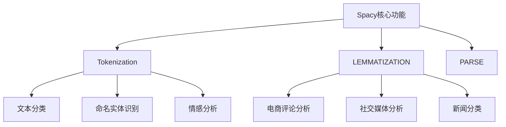

                 

### 文章标题：Spacy 原理与代码实战案例讲解

在自然语言处理（NLP）领域，Spacy 是一个备受推崇的库，因其高效和强大的功能而广受欢迎。本文将深入探讨 Spacy 的原理、基础组件以及高级应用，并通过实际案例讲解如何使用 Spacy 进行文本处理、情感分析、命名实体识别等任务。通过阅读本文，您将不仅了解 Spacy 的核心功能，还能掌握其实际应用技巧。

### 关键词
- Spacy
- 自然语言处理
- 文本分类
- 命名实体识别
- 情感分析
- 代码实战

### 摘要
本文旨在为读者提供对 Spacy 的全面了解，包括其发展历程、核心功能、基础组件和高级应用。通过详细的原理讲解、伪代码展示、数学模型分析和实际项目案例，读者将能够深入理解 Spacy 的运作机制，并掌握如何在实际项目中有效利用 Spacy 进行文本处理。

### 目录大纲

#### 第一部分：Spacy概述与基础

1. **第1章：Spacy入门与安装**
   - 1.1.1 Spacy的发展历程
   - 1.1.2 Spacy的核心功能
   - 1.1.3 Spacy与其他NLP工具的对比
   - 1.1.4 安装与配置Spacy

2. **第2章：Spacy基础组件**
   - 2.1.1 Tokenization（分词）
     - 2.1.1.1 Tokenization的原理与过程
     - 2.1.1.2 Tokenization的常见问题与解决方案
   - 2.1.2 LEMMATIZATION（词形还原）
     - 2.1.2.1 LEMMATIZATION的基本概念
     - 2.1.2.2 LEMMATIZATION的实际应用
   - 2.1.3 PARSE（句法分析）
     - 2.1.3.1 句法分析的基本概念
     - 2.1.3.2 句法分析的实际应用

#### 第二部分：Spacy高级应用

3. **第3章：Spacy文本分类**
   - 3.1.1 文本分类的基本概念
   - 3.1.2 Spacy实现文本分类的流程
   - 3.1.3 文本分类实战案例

4. **第4章：Spacy命名实体识别**
   - 4.1.1 命名实体识别的基本概念
   - 4.1.2 Spacy实现命名实体识别的流程
   - 4.1.3 命名实体识别实战案例

5. **第5章：Spacy情感分析**
   - 5.1.1 情感分析的基本概念
   - 5.1.2 Spacy实现情感分析的流程
   - 5.1.3 情感分析实战案例

#### 第三部分：Spacy项目实战

6. **第6章：Spacy在电商评论分析中的应用**
   - 6.1.1 电商评论分析的重要性
   - 6.1.2 使用Spacy进行电商评论分析的流程
   - 6.1.3 电商评论分析实战案例

7. **第7章：Spacy在社交媒体分析中的应用**
   - 7.1.1 社交媒体分析的基本概念
   - 7.1.2 使用Spacy进行社交媒体分析的流程
   - 7.1.3 社交媒体分析实战案例

8. **第8章：Spacy在新闻分类中的应用**
   - 8.1.1 新闻分类的基本概念
   - 8.1.2 使用Spacy进行新闻分类的流程
   - 8.1.3 新闻分类实战案例

#### 附录：Spacy资源与工具推荐

- 8.2.1 Spacy官方文档
- 8.2.2 Spacy相关库和插件
- 8.2.3 Spacy社区与资源链接

### 附录：Mermaid 流�程图


### 附录：文本分类伪代码
```python
# 输入：文本数据集
# 输出：分类结果

def text_classification(text_data):
    # 数据预处理
    text_data = preprocess_data(text_data)

    # 加载Spacy模型
    nlp = spacy.load("en_core_web_sm")

    # 分词与词形还原
    doc = nlp(text_data)

    # 提取特征
    features = extract_features(doc)

    # 训练分类器
    classifier = train_classifier(features, labels)

    # 进行分类
    predictions = classifier.predict(features)

    return predictions
```

### 附录：数学模型与公式
$$
P(y|X) = \frac{e^{\theta^T X}}{\sum_{y'} e^{\theta^T X'}}
$$

### 附录：情感分析示例
```text
文本：“这个产品非常好，非常满意。”
情感分类结果：正面情感
```

### 附录：项目实战与代码解读
- **电商评论分析**：使用Spacy对电商评论进行情感分析，提取关键词和情感倾向。
- **社交媒体分析**：使用Spacy对社交媒体文本进行分类和主题分析。
- **新闻分类**：使用Spacy对新闻文本进行分类，根据新闻内容识别主题和情感。

### 总结
本文通过详细的原理讲解、代码实战案例，帮助读者深入理解 Spacy 的核心功能与应用。通过本文的学习，读者将能够充分利用 Spacy 在 NLP 项目中的强大能力，提升自然语言处理的实际应用水平。

### 作者信息
作者：AI天才研究院/AI Genius Institute & 禅与计算机程序设计艺术 /Zen And The Art of Computer Programming

---

以上是文章的标题、关键词、摘要和目录大纲。接下来，我们将逐一深入每个章节，详细介绍 Spacy 的原理、应用和实战案例。通过逐步分析推理，我们将揭示 Spacy 在自然语言处理中的核心价值。敬请期待后续内容。

