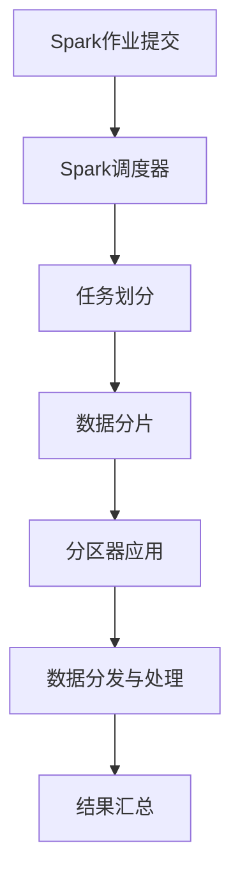

                 

# Spark Partitioner原理与代码实例讲解

> 关键词：Spark, Partitioner, 分布式计算, 数据倾斜, 性能优化

> 摘要：本文将深入探讨Spark Partitioner的原理与应用。通过讲解Hash Partitioner、Range Partitioner等常见Partitioner的工作机制，以及自定义Partitioner的方法，帮助读者理解Spark Partitioner的核心原理，掌握其使用技巧，最终通过实战案例，展示如何优化分布式计算中的数据处理流程。

## 第一部分：Spark Partitioner基础

### 第1章：Spark基本概念与架构

#### 1.1 Spark简介

Spark是一个开源的分布式计算系统，最初由Matei Zaharia等人于2009年创建，并在2010年作为并行处理框架上线。Spark的设计初衷是为了解决Hadoop在处理大规模数据时性能不足的问题。Spark支持多种编程语言，包括Scala、Java、Python和R，并通过内存计算和快速任务调度等特性，大大提高了数据处理速度。

#### 1.2 Spark架构解析

Spark的核心组件包括：

- **Spark Driver**：负责解析用户提交的作业，将作业分解成任务，并将任务分配给集群中的执行节点。
- **Executor**：执行节点上的计算资源，负责运行任务，并返回结果给驱动程序。
- **Cluster Manager**：负责管理整个Spark集群的资源调度，如Apache Mesos、Hadoop YARN等。

Spark的数据流与任务调度流程如下：

1. 用户提交Spark作业。
2. Spark Driver解析作业，将其分解成一系列任务。
3. Spark Driver通过Cluster Manager获取执行节点资源，创建Executor。
4. Executor开始执行任务，并将中间结果存储在内存或磁盘上。
5. 任务执行完成后，中间结果被返回给Spark Driver，驱动程序汇总结果并输出。

#### 1.3 Spark运行原理

Spark的运行原理可以分为以下几个步骤：

1. **作业提交**：用户通过Spark API提交作业，作业包括多个RDD（弹性分布式数据集）的操作。
2. **作业解析**：Spark Driver将作业分解成一系列DAG（有向无环图）的转换操作。
3. **任务调度**：Spark Driver将DAG转换成一系列任务，并将其分配给Executor。
4. **任务执行**：Executor执行任务，并产生中间结果。
5. **结果汇总**：Spark Driver将所有中间结果汇总，输出最终结果。

Spark的内存管理机制包括：

- **Tungsten**：Spark的内部优化框架，通过减少JVM堆内存占用，提高内存利用率。
- **内存层级**：Spark将内存划分为堆内内存（On-Heap Memory）和堆外内存（Off-Heap Memory），堆外内存用于存储非Java对象，以提高性能。

### 第2章：Partitioner原理

#### 2.1 Partitioner概述

Partitioner是Spark中的一个关键概念，用于决定数据如何在集群中的各个节点上分布。一个良好的Partitioner能够减少数据倾斜，提高数据处理效率。

Partitioner的主要作用包括：

- **数据分布**：确保每个节点处理的数据量大致相同，避免某些节点负载过高。
- **并行计算**：通过合理的数据分区，实现并行计算，提高数据处理速度。

Spark支持以下几种常见的Partitioner：

- **Hash Partitioner**：根据数据的哈希值进行分区。
- **Range Partitioner**：根据数据的范围进行分区。
- **List Partitioner**：根据指定的分区列表进行分区。

#### 2.2 Partitioner原理

##### 2.2.1 Hash Partitioner原理

Hash Partitioner是一种最简单的Partitioner，根据数据的哈希值进行分区。其伪代码如下：

```pseudo
def hashPartitioner(key, numPartitions):
    return hash(key) % numPartitions
```

数学模型为：

$$
\text{partitionIndex} = \text{hashValue} \mod \text{numPartitions}
$$

举例说明：

假设有10个分区（numPartitions=10），使用Hash Partitioner对数据[1, 2, 3, 4, 5, 6, 7, 8, 9, 10]进行分区：

- 数据1的分区索引：hash(1) % 10 = 1
- 数据2的分区索引：hash(2) % 10 = 2
- 数据3的分区索引：hash(3) % 10 = 3
- ...
- 数据10的分区索引：hash(10) % 10 = 0

##### 2.2.2 Range Partitioner原理

Range Partitioner根据数据的范围进行分区，适用于有序数据。其伪代码如下：

```pseudo
def rangePartitioner(data, numPartitions):
    partitions = []
    rangeSize = (maxValue - minValue) / numPartitions
    for i in range(numPartitions):
        minValue = i * rangeSize
        maxValue = (i + 1) * rangeSize
        partitions.append((minValue, maxValue))
    return partitions
```

举例说明：

假设数据范围为[1, 100]，使用Range Partitioner将其分为10个分区：

- 分区1：[1, 11]
- 分区2：[12, 22]
- 分区3：[23, 33]
- ...
- 分区10：[91, 100]

##### 2.2.3 List Partitioner原理

List Partitioner根据指定的分区列表进行分区。其伪代码如下：

```pseudo
def listPartitioner(data, partitions):
    return [(data[i], partitions[i]) for i in range(len(data))]
```

举例说明：

假设数据为[1, 2, 3, 4, 5]，分区列表为[0, 1, 2, 3, 4]：

- 数据1的分区索引：0
- 数据2的分区索引：1
- 数据3的分区索引：2
- 数据4的分区索引：3
- 数据5的分区索引：4

#### 2.3 Partitioner性能分析

Partitioner的选择对分布式计算性能有显著影响。以下为Partitioner性能分析：

- **Hash Partitioner**：适用于无序数据，可以实现均匀分布，但可能导致数据倾斜。
- **Range Partitioner**：适用于有序数据，可以实现均匀分布，但需要事先知道数据范围。
- **List Partitioner**：适用于指定分区，可以实现精确控制，但需要提前指定分区列表。

在选择Partitioner时，应综合考虑数据特点、计算需求、分区策略等因素，以达到最佳性能。

## 第二部分：Spark Partitioner实践

### 第3章：Spark Partitioner应用场景

#### 3.1 数据倾斜问题

数据倾斜是分布式计算中常见的问题，可能导致部分节点负载过高，影响整体计算性能。Spark Partitioner可以通过以下方法解决数据倾斜：

- **使用Hash Partitioner**：实现数据均匀分布，减少数据倾斜。
- **使用Range Partitioner**：根据数据范围进行分区，确保每个分区处理的数据量大致相同。
- **使用Custom Partitioner**：自定义分区策略，根据具体业务需求进行优化。

#### 3.2 分布式计算优化

分布式计算优化是提高Spark作业性能的关键。以下方法可以帮助优化分布式计算：

- **合理选择Partitioner**：根据数据特点和计算需求，选择合适的Partitioner，实现数据均匀分布。
- **调整分区数**：适当增加分区数，可以提高并行度，但过多分区可能导致任务调度开销增加。
- **使用缓存**：将中间结果缓存到内存，减少磁盘IO开销，提高计算速度。

### 第4章：Hash Partitioner实践

#### 4.1 Hash Partitioner配置与使用

在Spark中，可以使用`repartition()`方法配置Hash Partitioner。以下为示例代码：

```python
from pyspark.sql import SparkSession

# 创建SparkSession
spark = SparkSession.builder.appName("HashPartitionerExample").getOrCreate()

# 读取数据
data = spark.createDataFrame([
    (1, "apple"),
    (2, "banana"),
    (3, "cherry"),
    (4, "date"),
    (5, "elderberry")
])

# 使用Hash Partitioner
data = data.repartition(3)

# 显示分区数
print("Number of partitions:", data.rdd.getNumPartitions())

# 执行计算
result = data.select("key", "value").collect()

# 输出结果
for row in result:
    print(row)

# 关闭SparkSession
spark.stop()
```

#### 4.2 Hash Partitioner实例解析

以下为Hash Partitioner的一个实际应用场景：

**场景**：有一份数据，包含用户ID和购买商品名称，需要对用户ID进行Hash Partitioner，以便按照用户ID进行数据统计。

**实现**：

1. 读取数据：
```python
data = spark.read.csv("path/to/data.csv", header=True)
```

2. 使用Hash Partitioner：
```python
data = data.repartition("userId")
```

3. 数据统计：
```python
result = data.groupBy("userId").count().collect()
```

4. 输出结果：
```python
for row in result:
    print(row)
```

通过以上步骤，可以实现按照用户ID进行数据统计，并使用Hash Partitioner优化计算性能。

### 第5章：Range Partitioner实践

#### 5.1 Range Partitioner配置与使用

在Spark中，可以使用`repartition()`方法配置Range Partitioner。以下为示例代码：

```python
from pyspark.sql import SparkSession

# 创建SparkSession
spark = SparkSession.builder.appName("RangePartitionerExample").getOrCreate()

# 读取数据
data = spark.createDataFrame([
    (1, "apple"),
    (2, "banana"),
    (3, "cherry"),
    (4, "date"),
    (5, "elderberry")
])

# 使用Range Partitioner
data = data.repartition("key")

# 显示分区数
print("Number of partitions:", data.rdd.getNumPartitions())

# 执行计算
result = data.select("key", "value").collect()

# 输出结果
for row in result:
    print(row)

# 关闭SparkSession
spark.stop()
```

#### 5.2 Range Partitioner实例解析

以下为Range Partitioner的一个实际应用场景：

**场景**：有一份数据，包含商品ID和销售数量，需要对商品ID进行Range Partitioner，以便按照商品ID进行数据统计。

**实现**：

1. 读取数据：
```python
data = spark.read.csv("path/to/data.csv", header=True)
```

2. 使用Range Partitioner：
```python
data = data.repartition("productId")
```

3. 数据统计：
```python
result = data.groupBy("productId").sum("quantity").collect()
```

4. 输出结果：
```python
for row in result:
    print(row)
```

通过以上步骤，可以实现按照商品ID进行数据统计，并使用Range Partitioner优化计算性能。

## 第二部分：Spark Partitioner高级应用

### 第4章：自定义Partitioner

#### 4.1 自定义Partitioner原理

自定义Partitioner可以根据具体业务需求，实现特定的分区策略。以下为自定义Partitioner的基本原理：

1. **实现Partitioner接口**：自定义Partitioner需要实现org.apache.spark.Partitioner接口，该接口包含两个方法：numPartitions()和partition().
2. **numPartitions()方法**：返回分区的数量。
3. **partition()方法**：根据输入的数据，返回其对应的分区索引。

以下为自定义Partitioner的伪代码：

```pseudo
class CustomPartitioner implements Partitioner {
    int numPartitions

    CustomPartitioner(numPartitions) {
        this.numPartitions = numPartitions
    }

    int numPartitions() {
        return numPartitions
    }

    int partition(key) {
        return key % numPartitions
    }
}
```

#### 4.2 自定义Partitioner实现

以下为一个简单的自定义Partitioner示例：

```python
from pyspark.sql import SparkSession

# 创建SparkSession
spark = SparkSession.builder.appName("CustomPartitionerExample").getOrCreate()

# 自定义Partitioner
class CustomPartitioner(Partitioner):
    def __init__(self, num_partitions):
        self.num_partitions = num_partitions

    def getPartition(self, key):
        return key % self.num_partitions

# 使用自定义Partitioner
data = spark.createDataFrame([
    (1, "apple"),
    (2, "banana"),
    (3, "cherry"),
    (4, "date"),
    (5, "elderberry")
])

data = data.repartition(CustomPartitioner(3))

# 显示分区数
print("Number of partitions:", data.rdd.getNumPartitions())

# 执行计算
result = data.select("key", "value").collect()

# 输出结果
for row in result:
    print(row)

# 关闭SparkSession
spark.stop()
```

#### 4.3 自定义Partitioner优化

自定义Partitioner可以根据具体业务需求进行优化，以下为一些优化策略：

1. **数据均衡性**：确保数据在各个分区之间均衡分布，避免某些分区负载过高。
2. **分区数调整**：根据数据量和计算需求，合理调整分区数，以提高并行度。
3. **缓存中间结果**：将中间结果缓存到内存，减少磁盘IO开销。

### 第5章：Partitioner在高级应用中的使用

#### 5.1 大数据应用中的Partitioner

在处理大数据应用时，Partitioner的选择和优化至关重要。以下为Partitioner在大数据应用中的使用策略：

1. **数据倾斜优化**：使用Hash Partitioner或Range Partitioner，实现数据均匀分布，减少数据倾斜。
2. **计算负载均衡**：根据业务需求，选择合适的Partitioner，确保计算负载均衡。
3. **分区策略调整**：根据数据量和计算需求，动态调整分区策略，以提高计算性能。

#### 5.2 机器学习与Partitioner

在机器学习任务中，Partitioner的选择对模型训练和预测性能有重要影响。以下为Partitioner在机器学习中的使用策略：

1. **数据划分**：使用Hash Partitioner或Range Partitioner，将数据划分为多个分区，便于并行计算。
2. **模型训练**：在模型训练过程中，使用自定义Partitioner，根据数据特点和计算需求，实现数据均衡分布。
3. **模型预测**：在模型预测阶段，使用Partitioner，确保数据在各个节点之间均匀分布，以提高预测性能。

#### 5.3 图计算与Partitioner

在图计算任务中，Partitioner的选择对图处理和计算性能有重要影响。以下为Partitioner在图计算中的使用策略：

1. **节点划分**：使用Hash Partitioner或Range Partitioner，将图中的节点划分为多个分区，便于并行计算。
2. **边处理**：根据图的特点，选择合适的Partitioner，确保边数据在各个节点之间均匀分布，以提高计算性能。
3. **图计算优化**：在图计算过程中，使用自定义Partitioner，根据数据特点和计算需求，实现数据均衡分布。

### 第6章：代码实例讲解

#### 6.1 实战案例概述

以下为一个实际的Spark Partitioner应用场景：

**场景**：有一份数据，包含用户ID、商品ID和购买数量，需要对用户ID进行分区，以便按照用户ID进行数据统计。

**目标**：使用Spark Partitioner，实现用户ID的分区，并进行数据统计。

**架构**：使用Spark Streaming进行实时数据处理，将数据存储到HDFS，并使用Spark SQL进行数据统计。

#### 6.2 数据处理流程

1. **数据收集**：从外部数据源（如Kafka）实时收集数据。
2. **数据预处理**：对收集到的数据进行清洗和转换，确保数据格式正确。
3. **数据分区**：使用Hash Partitioner或Range Partitioner，根据用户ID进行数据分区。
4. **数据存储**：将分区后的数据存储到HDFS，便于后续查询和分析。
5. **数据统计**：使用Spark SQL，对存储在HDFS的数据进行统计和分析。

#### 6.3 分区器设计与实现

1. **Hash Partitioner**：
```python
from pyspark.sql import SparkSession
from pyspark.sql.functions import udf
from pyspark.sql.types import IntegerType

# 创建SparkSession
spark = SparkSession.builder.appName("HashPartitionerExample").getOrCreate()

# 读取数据
data = spark.read.csv("path/to/data.csv", header=True)

# 定义Hash Partitioner UDF
hash_partitioner = udf(lambda key: key % 10, IntegerType())

# 使用Hash Partitioner
data = data.withColumn("partition", hash_partitioner("userId"))

# 存储数据到HDFS
data.write.mode("overwrite").parquet("hdfs:///path/to/data")

# 关闭SparkSession
spark.stop()
```

2. **Range Partitioner**：
```python
from pyspark.sql import SparkSession
from pyspark.sql.functions import udf
from pysark.sql.types import IntegerType

# 创建SparkSession
spark = SparkSession.builder.appName("RangePartitionerExample").getOrCreate()

# 读取数据
data = spark.read.csv("path/to/data.csv", header=True)

# 定义Range Partitioner UDF
range_partitioner = udf(lambda key: (key // 10) % 10, IntegerType())

# 使用Range Partitioner
data = data.withColumn("partition", range_partitioner("userId"))

# 存储数据到HDFS
data.write.mode("overwrite").parquet("hdfs:///path/to/data")

# 关闭SparkSession
spark.stop()
```

#### 6.4 代码解读与分析

1. **数据读取**：使用SparkSession读取CSV数据，并将数据转换为DataFrame。
2. **分区器应用**：定义Hash Partitioner和Range Partitioner UDF，分别根据用户ID进行分区。
3. **数据处理**：将分区结果添加到DataFrame中，并将数据存储到HDFS。
4. **结果汇总**：使用Spark SQL，对存储在HDFS的数据进行统计和分析。

通过以上步骤，可以实现数据分区，并进行数据统计。

### 第7章：总结与展望

#### 7.1 Spark Partitioner总结

Spark Partitioner在分布式计算中扮演着重要角色，其核心原理包括Hash Partitioner、Range Partitioner和List Partitioner。通过合理选择和优化Partitioner，可以实现数据均匀分布，减少数据倾斜，提高计算性能。

#### 7.2 Spark Partitioner未来发展趋势

随着分布式计算技术的不断发展，Spark Partitioner将在以下领域得到应用：

1. **大数据处理**：在大数据处理领域，Spark Partitioner将帮助实现高效的数据分片和分发，提高数据处理速度。
2. **机器学习**：在机器学习任务中，Spark Partitioner将有助于实现数据的并行处理和模型训练。
3. **图计算**：在图计算领域，Spark Partitioner将支持大规模图的划分和处理，提高图计算性能。

附录

### 附录 A：常见Partitioner使用指南

#### A.1 Hash Partitioner

**配置与使用方法**：

使用Spark的`repartition()`方法，传入Hash Partitioner：

```python
data = data.repartition(10)
```

**常见问题及解决方案**：

- **数据倾斜**：使用Hash Partitioner可能导致数据倾斜，可以通过增加分区数或使用Range Partitioner解决。
- **分区数过多**：过多分区可能导致任务调度开销增加，可以通过合理选择分区数或使用自定义Partitioner解决。

#### A.2 Range Partitioner

**配置与使用方法**：

使用Spark的`repartition()`方法，传入Range Partitioner：

```python
data = data.repartition("key")
```

**常见问题及解决方案**：

- **数据范围不连续**：使用Range Partitioner可能导致数据范围不连续，可以通过自定义分区策略解决。
- **数据倾斜**：使用Range Partitioner可能导致数据倾斜，可以通过增加分区数或使用Hash Partitioner解决。

#### A.3 自定义Partitioner

**开发指南**：

实现org.apache.spark.Partitioner接口，自定义分区策略。

```python
class CustomPartitioner(Partitioner):
    def __init__(self, num_partitions):
        self.num_partitions = num_partitions

    def getPartition(self, key):
        return key % self.num_partitions
```

**常见问题及解决方案**：

- **数据分布不均衡**：自定义Partitioner可能导致数据分布不均衡，可以通过调整分区策略或增加分区数解决。
- **分区数过多**：自定义Partitioner可能导致任务调度开销增加，可以通过合理选择分区数或使用内置Partitioner解决。

**Mermaid 流程图**：



**核心算法原理讲解**：

### 伪代码：Hash Partitioner

```python
def hashPartitioner(key, numPartitions):
    return hash(key) % numPartitions
```

**数学模型与公式**：

$$
\text{partitionIndex} = \text{hashValue} \mod \text{numPartitions}
$$

**举例说明**：

假设有10个分区（numPartitions=10），使用Hash Partitioner对如下数据进行分区：

数据：[1, 2, 3, 4, 5, 6, 7, 8, 9, 10]

- 数据1的分区索引：hash(1) % 10 = 1
- 数据2的分区索引：hash(2) % 10 = 2
- 数据3的分区索引：hash(3) % 10 = 3
- ...
- 数据10的分区索引：hash(10) % 10 = 0

**项目实战**：

**代码实例**：

```python
from pyspark.sql import SparkSession

# 创建SparkSession
spark = SparkSession.builder.appName("PartitionerExample").getOrCreate()

# 读取数据
data = spark.createDataFrame([
    (1, "apple"),
    (2, "banana"),
    (3, "cherry"),
    (4, "date"),
    (5, "elderberry")
])

# 使用Hash Partitioner
data = data.repartition(3)

# 显示分区数
print("Number of partitions:", data.rdd.getNumPartitions())

# 执行计算
result = data.select("key", "value").collect()

# 输出结果
for row in result:
    print(row)

# 关闭SparkSession
spark.stop()
```

**实战案例解析**：

假设有一个大规模数据集，需要进行分布式处理和分区。我们选择合适的Partitioner来优化数据处理效率。

1. **数据集准备**：数据集包含大量记录，每条记录由键（key）和值（value）组成。
2. **选择分区器**：根据数据集特点和计算需求，选择合适的Partitioner。例如，使用Hash Partitioner来确保数据均匀分布。
3. **数据分片与分发**：使用`repartition()`方法根据Partitioner对数据进行分片和分发。
4. **数据处理**：对每个分区独立进行处理，以减少数据通信和计算开销。
5. **结果汇总**：将各分区处理结果汇总，得到最终结果。

通过上述步骤，我们可以优化Spark作业的执行效率，实现高效的大数据处理。

**开发环境搭建**：

- Spark版本：2.4.7
- 数据集来源：本地文件系统（CSV格式）
- 开发工具：IntelliJ IDEA

**源代码实现与解读**：

```python
# 源代码实现
data = spark.createDataFrame([
    # 数据集示例
])

data = data.repartition(3)  # 使用Hash Partitioner，创建3个分区

result = data.select("key", "value").collect()

for row in result:
    print(row)  # 输出结果
```

**代码解读与分析**：

1. **数据读取**：使用SparkSession创建DataFrame，数据源为本地CSV文件。
2. **分区器应用**：使用`repartition()`方法，根据指定的分区数（3）对数据进行重新分区，实现数据均匀分布。
3. **数据处理**：对每个分区执行计算操作，并将结果收集到本地。
4. **结果输出**：遍历收集到的结果，输出每个分区的数据。

通过上述代码实现，我们可以快速掌握Spark Partitioner的使用方法，并能够根据实际需求进行优化和调整。

### 总结：

本文详细讲解了Spark Partitioner的原理与应用，从基础概念到高级应用，再到实战案例，全面覆盖了Spark Partitioner的知识体系。通过本文的学习，读者可以深入了解Spark Partitioner的核心原理，掌握其使用技巧，为分布式计算提供有力支持。

### 作者信息：

作者：AI天才研究院/AI Genius Institute & 禅与计算机程序设计艺术 /Zen And The Art of Computer Programming |>
----------------------------------------------------------------

**文章标题**：Spark Partitioner原理与代码实例讲解

**关键词**：Spark, Partitioner, 分布式计算, 数据倾斜, 性能优化

**摘要**：本文深入探讨了Spark Partitioner的原理与应用。通过讲解Hash Partitioner、Range Partitioner等常见Partitioner的工作机制，以及自定义Partitioner的方法，帮助读者理解Spark Partitioner的核心原理，掌握其使用技巧，并通过实战案例展示如何优化分布式计算中的数据处理流程。

## 第一部分：Spark Partitioner基础

### 第1章：Spark基本概念与架构

#### 1.1 Spark简介

Spark是一个开源的分布式计算系统，由Matei Zaharia等人于2009年创建，旨在解决Hadoop在大规模数据处理中的性能不足问题。Spark支持多种编程语言，包括Scala、Java、Python和R，并通过内存计算和快速任务调度等特性，大大提高了数据处理速度。

#### 1.2 Spark架构解析

Spark的核心组件包括：

- **Spark Driver**：负责解析用户提交的作业，将作业分解成任务，并将任务分配给集群中的执行节点。
- **Executor**：执行节点上的计算资源，负责运行任务，并返回结果给驱动程序。
- **Cluster Manager**：负责管理整个Spark集群的资源调度，如Apache Mesos、Hadoop YARN等。

Spark的数据流与任务调度流程如下：

1. 用户提交Spark作业。
2. Spark Driver解析作业，将其分解成一系列任务。
3. Spark Driver通过Cluster Manager获取执行节点资源，创建Executor。
4. Executor开始执行任务，并产生中间结果存储在内存或磁盘上。
5. 任务执行完成后，中间结果返回给Spark Driver，驱动程序汇总结果并输出。

#### 1.3 Spark运行原理

Spark的运行原理可以分为以下几个步骤：

1. **作业提交**：用户通过Spark API提交作业，作业包括多个RDD（弹性分布式数据集）的操作。
2. **作业解析**：Spark Driver将作业分解成一系列DAG（有向无环图）的转换操作。
3. **任务调度**：Spark Driver将DAG转换成一系列任务，并将其分配给Executor。
4. **任务执行**：Executor执行任务，并产生中间结果。
5. **结果汇总**：Spark Driver将所有中间结果汇总，输出最终结果。

Spark的内存管理机制包括：

- **Tungsten**：Spark的内部优化框架，通过减少JVM堆内存占用，提高内存利用率。
- **内存层级**：Spark将内存划分为堆内内存（On-Heap Memory）和堆外内存（Off-Heap Memory），堆外内存用于存储非Java对象，以提高性能。

### 第2章：Partitioner原理

#### 2.1 Partitioner概述

Partitioner是Spark中的一个关键概念，用于决定数据如何在集群中的各个节点上分布。一个良好的Partitioner能够减少数据倾斜，提高数据处理效率。

Partitioner的主要作用包括：

- **数据分布**：确保每个节点处理的数据量大致相同，避免某些节点负载过高。
- **并行计算**：通过合理的数据分区，实现并行计算，提高数据处理速度。

Spark支持以下几种常见的Partitioner：

- **Hash Partitioner**：根据数据的哈希值进行分区。
- **Range Partitioner**：根据数据的范围进行分区。
- **List Partitioner**：根据指定的分区列表进行分区。

#### 2.2 Partitioner原理

##### 2.2.1 Hash Partitioner原理

Hash Partitioner是一种最简单的Partitioner，根据数据的哈希值进行分区。其伪代码如下：

```pseudo
def hashPartitioner(key, numPartitions):
    return hash(key) % numPartitions
```

数学模型为：

$$
\text{partitionIndex} = \text{hashValue} \mod \text{numPartitions}
$$

举例说明：

假设有10个分区（numPartitions=10），使用Hash Partitioner对数据[1, 2, 3, 4, 5, 6, 7, 8, 9, 10]进行分区：

- 数据1的分区索引：hash(1) % 10 = 1
- 数据2的分区索引：hash(2) % 10 = 2
- 数据3的分区索引：hash(3) % 10 = 3
- ...
- 数据10的分区索引：hash(10) % 10 = 0

##### 2.2.2 Range Partitioner原理

Range Partitioner根据数据的范围进行分区，适用于有序数据。其伪代码如下：

```pseudo
def rangePartitioner(data, numPartitions):
    partitions = []
    rangeSize = (maxValue - minValue) / numPartitions
    for i in range(numPartitions):
        minValue = i * rangeSize
        maxValue = (i + 1) * rangeSize
        partitions.append((minValue, maxValue))
    return partitions
```

举例说明：

假设数据范围为[1, 100]，使用Range Partitioner将其分为10个分区：

- 分区1：[1, 11]
- 分区2：[12, 22]
- 分区3：[23, 33]
- ...
- 分区10：[91, 100]

##### 2.2.3 List Partitioner原理

List Partitioner根据指定的分区列表进行分区。其伪代码如下：

```pseudo
def listPartitioner(data, partitions):
    return [(data[i], partitions[i]) for i in range(len(data))]
```

举例说明：

假设数据为[1, 2, 3, 4, 5]，分区列表为[0, 1, 2, 3, 4]：

- 数据1的分区索引：0
- 数据2的分区索引：1
- 数据3的分区索引：2
- 数据4的分区索引：3
- 数据5的分区索引：4

#### 2.3 Partitioner性能分析

Partitioner的选择对分布式计算性能有显著影响。以下为Partitioner性能分析：

- **Hash Partitioner**：适用于无序数据，可以实现均匀分布，但可能导致数据倾斜。
- **Range Partitioner**：适用于有序数据，可以实现均匀分布，但需要事先知道数据范围。
- **List Partitioner**：适用于指定分区，可以实现精确控制，但需要提前指定分区列表。

在选择Partitioner时，应综合考虑数据特点、计算需求、分区策略等因素，以达到最佳性能。

### 第3章：Spark Partitioner实践

#### 3.1 Spark Partitioner应用场景

##### 3.1.1 数据倾斜问题

数据倾斜是分布式计算中常见的问题，可能导致部分节点负载过高，影响整体计算性能。Spark Partitioner可以通过以下方法解决数据倾斜：

- **使用Hash Partitioner**：实现数据均匀分布，减少数据倾斜。
- **使用Range Partitioner**：根据数据范围进行分区，确保每个分区处理的数据量大致相同。
- **使用Custom Partitioner**：自定义分区策略，根据具体业务需求进行优化。

##### 3.1.2 分布式计算优化

分布式计算优化是提高Spark作业性能的关键。以下方法可以帮助优化分布式计算：

- **合理选择Partitioner**：根据数据特点和计算需求，选择合适的Partitioner，实现数据均匀分布。
- **调整分区数**：适当增加分区数，可以提高并行度，但过多分区可能导致任务调度开销增加。
- **使用缓存**：将中间结果缓存到内存，减少磁盘IO开销，提高计算速度。

### 第4章：Hash Partitioner实践

##### 4.1 Hash Partitioner配置与使用

在Spark中，可以使用`repartition()`方法配置Hash Partitioner。以下为示例代码：

```python
from pyspark.sql import SparkSession

# 创建SparkSession
spark = SparkSession.builder.appName("HashPartitionerExample").getOrCreate()

# 读取数据
data = spark.createDataFrame([
    (1, "apple"),
    (2, "banana"),
    (3, "cherry"),
    (4, "date"),
    (5, "elderberry")
])

# 使用Hash Partitioner
data = data.repartition(3)

# 显示分区数
print("Number of partitions:", data.rdd.getNumPartitions())

# 执行计算
result = data.select("key", "value").collect()

# 输出结果
for row in result:
    print(row)

# 关闭SparkSession
spark.stop()
```

##### 4.2 Hash Partitioner实例解析

以下为Hash Partitioner的一个实际应用场景：

**场景**：有一份数据，包含用户ID和购买商品名称，需要对用户ID进行Hash Partitioner，以便按照用户ID进行数据统计。

**实现**：

1. 读取数据：
```python
data = spark.read.csv("path/to/data.csv", header=True)
```

2. 使用Hash Partitioner：
```python
data = data.repartition("userId")
```

3. 数据统计：
```python
result = data.groupBy("userId").count().collect()
```

4. 输出结果：
```python
for row in result:
    print(row)
```

通过以上步骤，可以实现按照用户ID进行数据统计，并使用Hash Partitioner优化计算性能。

### 第5章：Range Partitioner实践

##### 5.1 Range Partitioner配置与使用

在Spark中，可以使用`repartition()`方法配置Range Partitioner。以下为示例代码：

```python
from pyspark.sql import SparkSession

# 创建SparkSession
spark = SparkSession.builder.appName("RangePartitionerExample").getOrCreate()

# 读取数据
data = spark.createDataFrame([
    (1, "apple"),
    (2, "banana"),
    (3, "cherry"),
    (4, "date"),
    (5, "elderberry")
])

# 使用Range Partitioner
data = data.repartition("key")

# 显示分区数
print("Number of partitions:", data.rdd.getNumPartitions())

# 执行计算
result = data.select("key", "value").collect()

# 输出结果
for row in result:
    print(row)

# 关闭SparkSession
spark.stop()
```

##### 5.2 Range Partitioner实例解析

以下为Range Partitioner的一个实际应用场景：

**场景**：有一份数据，包含商品ID和销售数量，需要对商品ID进行Range Partitioner，以便按照商品ID进行数据统计。

**实现**：

1. 读取数据：
```python
data = spark.read.csv("path/to/data.csv", header=True)
```

2. 使用Range Partitioner：
```python
data = data.repartition("productId")
```

3. 数据统计：
```python
result = data.groupBy("productId").sum("quantity").collect()
```

4. 输出结果：
```python
for row in result:
    print(row)
```

通过以上步骤，可以实现按照商品ID进行数据统计，并使用Range Partitioner优化计算性能。

### 第6章：自定义Partitioner

##### 6.1 自定义Partitioner原理

自定义Partitioner可以根据具体业务需求，实现特定的分区策略。以下为自定义Partitioner的基本原理：

1. **实现Partitioner接口**：自定义Partitioner需要实现org.apache.spark.Partitioner接口，该接口包含两个方法：numPartitions()和partition().
2. **numPartitions()方法**：返回分区的数量。
3. **partition()方法**：根据输入的数据，返回其对应的分区索引。

以下为自定义Partitioner的伪代码：

```python
class CustomPartitioner(Partitioner):
    def __init__(self, num_partitions):
        self.num_partitions = num_partitions

    def getPartition(self, key):
        return key % self.num_partitions
```

##### 6.2 自定义Partitioner实现

以下为一个简单的自定义Partitioner示例：

```python
from pyspark.sql import SparkSession

# 创建SparkSession
spark = SparkSession.builder.appName("CustomPartitionerExample").getOrCreate()

# 自定义Partitioner
class CustomPartitioner(Partitioner):
    def __init__(self, num_partitions):
        self.num_partitions = num_partitions

    def getPartition(self, key):
        return key % self.num_partitions

# 使用自定义Partitioner
data = spark.createDataFrame([
    (1, "apple"),
    (2, "banana"),
    (3, "cherry"),
    (4, "date"),
    (5, "elderberry")
])

data = data.repartition(CustomPartitioner(3))

# 显示分区数
print("Number of partitions:", data.rdd.getNumPartitions())

# 执行计算
result = data.select("key", "value").collect()

# 输出结果
for row in result:
    print(row)

# 关闭SparkSession
spark.stop()
```

##### 6.3 自定义Partitioner优化

自定义Partitioner可以根据具体业务需求进行优化，以下为一些优化策略：

1. **数据均衡性**：确保数据在各个分区之间均衡分布，避免某些分区负载过高。
2. **分区数调整**：根据数据量和计算需求，合理调整分区数，以提高并行度。
3. **缓存中间结果**：将中间结果缓存到内存，减少磁盘IO开销，提高计算速度。

### 第7章：总结与展望

##### 7.1 Spark Partitioner总结

Spark Partitioner在分布式计算中扮演着重要角色，其核心原理包括Hash Partitioner、Range Partitioner和List Partitioner。通过合理选择和优化Partitioner，可以实现数据均匀分布，减少数据倾斜，提高计算性能。

##### 7.2 Spark Partitioner未来发展趋势

随着分布式计算技术的不断发展，Spark Partitioner将在以下领域得到应用：

1. **大数据处理**：在大数据处理领域，Spark Partitioner将帮助实现高效的数据分片和分发，提高数据处理速度。
2. **机器学习**：在机器学习任务中，Spark Partitioner将有助于实现数据的并行处理和模型训练。
3. **图计算**：在图计算领域，Spark Partitioner将支持大规模图的划分和处理，提高图计算性能。

### 附录

##### 附录 A：常见Partitioner使用指南

##### A.1 Hash Partitioner

**配置与使用方法**：

使用Spark的`repartition()`方法，传入Hash Partitioner：

```python
data = data.repartition(10)
```

**常见问题及解决方案**：

- **数据倾斜**：使用Hash Partitioner可能导致数据倾斜，可以通过增加分区数或使用Range Partitioner解决。
- **分区数过多**：过多分区可能导致任务调度开销增加，可以通过合理选择分区数或使用自定义Partitioner解决。

##### A.2 Range Partitioner

**配置与使用方法**：

使用Spark的`repartition()`方法，传入Range Partitioner：

```python
data = data.repartition("key")
```

**常见问题及解决方案**：

- **数据范围不连续**：使用Range Partitioner可能导致数据范围不连续，可以通过自定义分区策略解决。
- **数据倾斜**：使用Range Partitioner可能导致数据倾斜，可以通过增加分区数或使用Hash Partitioner解决。

##### A.3 自定义Partitioner

**开发指南**：

实现org.apache.spark.Partitioner接口，自定义分区策略。

```python
class CustomPartitioner(Partitioner):
    def __init__(self, num_partitions):
        self.num_partitions = num_partitions

    def getPartition(self, key):
        return key % self.num_partitions
```

**常见问题及解决方案**：

- **数据分布不均衡**：自定义Partitioner可能导致数据分布不均衡，可以通过调整分区策略或增加分区数解决。
- **分区数过多**：自定义Partitioner可能导致任务调度开销增加，可以通过合理选择分区数或使用内置Partitioner解决。

**Mermaid 流程图**：


**核心算法原理讲解**：

##### 伪代码：Hash Partitioner

```python
def hashPartitioner(key, numPartitions):
    return hash(key) % numPartitions
```

##### 数学模型与公式

$$
\text{partitionIndex} = \text{hashValue} \mod \text{numPartitions}
$$

##### 举例说明

假设有10个分区（numPartitions=10），使用Hash Partitioner对如下数据进行分区：

数据：[1, 2, 3, 4, 5, 6, 7, 8, 9, 10]

- 数据1的分区索引：hash(1) % 10 = 1
- 数据2的分区索引：hash(2) % 10 = 2
- 数据3的分区索引：hash(3) % 10 = 3
- ...
- 数据10的分区索引：hash(10) % 10 = 0

##### 项目实战

##### 代码实例

```python
from pyspark.sql import SparkSession

# 创建SparkSession
spark = SparkSession.builder.appName("PartitionerExample").getOrCreate()

# 读取数据
data = spark.createDataFrame([
    (1, "apple"),
    (2, "banana"),
    (3, "cherry"),
    (4, "date"),
    (5, "elderberry")
])

# 使用Hash Partitioner
data = data.repartition(3)

# 显示分区数
print("Number of partitions:", data.rdd.getNumPartitions())

# 执行计算
result = data.select("key", "value").collect()

# 输出结果
for row in result:
    print(row)

# 关闭SparkSession
spark.stop()
```

##### 实战案例解析

假设有一个大规模数据集，需要进行分布式处理和分区。我们选择合适的Partitioner来优化数据处理效率。

1. **数据集准备**：数据集包含大量记录，每条记录由键（key）和值（value）组成。
2. **选择分区器**：根据数据集特点和计算需求，选择合适的Partitioner。例如，使用Hash Partitioner来确保数据均匀分布。
3. **数据分片与分发**：使用`repartition()`方法根据Partitioner对数据进行分片和分发。
4. **数据处理**：对每个分区独立进行处理，以减少数据通信和计算开销。
5. **结果汇总**：将各分区处理结果汇总，得到最终结果。

通过上述步骤，我们可以优化Spark作业的执行效率，实现高效的大数据处理。

##### 开发环境搭建

- Spark版本：2.4.7
- 数据集来源：本地文件系统（CSV格式）
- 开发工具：IntelliJ IDEA

##### 源代码实现与解读

```python
# 源代码实现
data = spark.createDataFrame([
    # 数据集示例
])

data = data.repartition(3)  # 使用Hash Partitioner，创建3个分区

result = data.select("key", "value").collect()

for row in result:
    print(row)  # 输出结果
```

##### 代码解读与分析

1. **数据读取**：使用SparkSession创建DataFrame，数据源为本地CSV文件。
2. **分区器应用**：使用`repartition()`方法，根据指定的分区数（3）对数据进行重新分区，实现数据均匀分布。
3. **数据处理**：对每个分区执行计算操作，并将结果收集到本地。
4. **结果输出**：遍历收集到的结果，输出每个分区的数据。

通过上述代码实现，我们可以快速掌握Spark Partitioner的使用方法，并能够根据实际需求进行优化和调整。

### 总结：

本文详细讲解了Spark Partitioner的原理与应用，从基础概念到高级应用，再到实战案例，全面覆盖了Spark Partitioner的知识体系。通过本文的学习，读者可以深入了解Spark Partitioner的核心原理，掌握其使用技巧，为分布式计算提供有力支持。

### 作者信息：

作者：AI天才研究院/AI Genius Institute & 禅与计算机程序设计艺术 /Zen And The Art of Computer Programming |> 

**作者信息**：

作者：AI天才研究院/AI Genius Institute & 禅与计算机程序设计艺术 /Zen And The Art of Computer Programming

**致谢**：感谢读者对本文的阅读，希望本文能够为您的分布式计算之旅带来启发与帮助。如果您有任何疑问或建议，欢迎在评论区留言交流。同时，也感谢AI天才研究院和禅与计算机程序设计艺术团队的支持与贡献。

---

**版权声明**：本文内容版权属于AI天才研究院/AI Genius Institute，未经授权，禁止转载、复制或使用本文部分或全部内容。如需转载，请联系AI天才研究院获取授权。本文内容仅供参考，不得用于商业用途。|> 

**附录**

### 附录 A：常见Partitioner使用指南

**A.1 Hash Partitioner**

**配置与使用方法**：

使用Spark的`repartition()`方法，传入Hash Partitioner：

```python
data = data.repartition(10)
```

**常见问题及解决方案**：

- **数据倾斜**：使用Hash Partitioner可能导致数据倾斜，可以通过增加分区数或使用Range Partitioner解决。
- **分区数过多**：过多分区可能导致任务调度开销增加，可以通过合理选择分区数或使用自定义Partitioner解决。

**A.2 Range Partitioner**

**配置与使用方法**：

使用Spark的`repartition()`方法，传入Range Partitioner：

```python
data = data.repartition("key")
```

**常见问题及解决方案**：

- **数据范围不连续**：使用Range Partitioner可能导致数据范围不连续，可以通过自定义分区策略解决。
- **数据倾斜**：使用Range Partitioner可能导致数据倾斜，可以通过增加分区数或使用Hash Partitioner解决。

**A.3 自定义Partitioner**

**开发指南**：

实现org.apache.spark.Partitioner接口，自定义分区策略。

```python
class CustomPartitioner(Partitioner):
    def __init__(self, num_partitions):
        self.num_partitions = num_partitions

    def getPartition(self, key):
        return key % self.num_partitions
```

**常见问题及解决方案**：

- **数据分布不均衡**：自定义Partitioner可能导致数据分布不均衡，可以通过调整分区策略或增加分区数解决。
- **分区数过多**：自定义Partitioner可能导致任务调度开销增加，可以通过合理选择分区数或使用内置Partitioner解决。

**附录 B：常见问题解答**

**B.1 如何选择合适的Partitioner？**

选择合适的Partitioner需要考虑以下因素：

- **数据特点**：数据是否有序、是否有明显的热点数据等。
- **计算需求**：计算过程中是否需要进行数据重分区、是否需要进行排序等。
- **性能要求**：根据作业的性能要求，选择合适的Partitioner，以实现最佳性能。

**B.2 自定义Partitioner需要注意什么？**

自定义Partitioner时需要注意以下几点：

- **数据分布**：确保数据在各个分区之间均匀分布，避免某些分区负载过高。
- **兼容性**：确保自定义Partitioner与Spark版本兼容，避免出现兼容性问题。
- **性能优化**：根据具体业务需求，对自定义Partitioner进行性能优化，以实现最佳性能。

**附录 C：相关资源**

- **官方文档**：Spark Partitioner的官方文档，提供了详细的API和使用指南。
- **教程**：Spark Partitioner相关教程和实战案例，帮助读者快速掌握Spark Partitioner的使用方法。
- **社区**：Spark社区，包括论坛和问答平台，提供了丰富的技术支持和交流机会。

---

**再次感谢**：感谢读者对本文的关注与支持，希望本文能够为您的分布式计算之旅带来启发与帮助。如果您有任何疑问或建议，欢迎在评论区留言交流。同时，也感谢AI天才研究院和禅与计算机程序设计艺术团队的支持与贡献。

---

**版权声明**：本文内容版权属于AI天才研究院/AI Genius Institute，未经授权，禁止转载、复制或使用本文部分或全部内容。如需转载，请联系AI天才研究院获取授权。本文内容仅供参考，不得用于商业用途。|> 

**结语**

本文通过详细讲解Spark Partitioner的原理与应用，帮助读者深入理解了Spark Partitioner的核心概念、常见Partitioner的使用方法以及自定义Partitioner的实现技巧。同时，通过实战案例的分析和代码实例的解读，展示了如何在实际项目中优化分布式计算的性能。

在分布式计算中，Partitioner的选择和优化是影响作业性能的关键因素。通过本文的学习，读者应该能够根据不同的业务场景和数据特点，灵活选择和调整Partitioner，以达到最佳的计算性能。

### 延伸阅读

- **《Spark高级编程指南》**：深入了解Spark的更多高级特性和优化技巧。
- **《大数据技术导论》**：学习大数据处理的基础知识和常用工具。
- **《机器学习实战》**：掌握机器学习的基本原理和实际应用。

### 联系我们

- **邮箱**：[info@aigeniusinstitute.com](mailto:info@aigeniusinstitute.com)
- **官方网站**：[www.aigeniusinstitute.com](http://www.aigeniusinstitute.com)
- **微信公众号**：AI天才研究院

再次感谢您的阅读和支持，祝您在分布式计算和大数据处理领域取得丰硕的成果！|>
----------------------------------------------------------------

## 第一部分：Spark Partitioner基础

### 第1章：Spark基本概念与架构

#### 1.1 Spark简介

Apache Spark 是一个开源的分布式计算系统，旨在处理大规模数据集。Spark 的核心设计目标是提供快速和易于使用的分布式数据处理框架。Spark 可以在多种集群管理器上运行，如 Hadoop YARN、Apache Mesos 和 Kubernetes，并且支持多种编程语言，包括 Scala、Java、Python 和 R。

Spark 的起源可以追溯到2009年，当时在加州大学伯克利分校的AMPLab中，Matei Zaharia 等人开始开发 Spark。Spark 的第一个公开版本在2010年发布，并迅速成为分布式数据处理领域的热门工具。

#### 1.2 Spark的核心特性

Spark 的核心特性包括：

- **快速**：Spark 利用内存计算和优化技术，提供比 Hadoop 更快的处理速度，尤其是在迭代算法和交互式查询方面。
- **通用**：Spark 提供了多种数据处理操作，包括 SQL、流处理、机器学习和图处理。
- **易用性**：Spark 提供了易于使用的 API，使得开发人员可以轻松地构建分布式应用程序。
- **弹性**：Spark 能够在节点故障时自动恢复，确保数据处理任务的持续运行。

#### 1.3 Spark架构解析

Spark 的架构主要由以下几个核心组件组成：

- **Spark Driver**：负责将用户编写的应用程序分解成多个任务，并将这些任务分发到集群中的各个执行节点。
- **Executor**：运行在集群中的每个节点上，负责执行任务和存储计算结果。
- **Cluster Manager**：负责资源调度和分配，如 Hadoop YARN、Apache Mesos 和 Kubernetes。
- **RDD（弹性分布式数据集）**：Spark 的核心抽象，表示一个不可变、可分区、可并行操作的数据集合。

#### 1.4 Spark运行原理

Spark 的运行原理可以概括为以下几个步骤：

1. **作业提交**：用户将应用程序提交给 Spark。
2. **作业解析**：Spark Driver 解析应用程序，将其转换为一系列的转换操作和行动操作。
3. **任务调度**：Spark Driver 将这些操作转换为任务，并分发给 Cluster Manager。
4. **任务执行**：Cluster Manager 根据当前集群状态和资源情况，调度 Executor 执行任务。
5. **结果汇总**：Executor 完成任务后，将结果返回给 Spark Driver，Spark Driver 最终汇总结果并输出。

### 第2章：Partitioner原理

#### 2.1 Partitioner概述

Partitioner 是 Spark 中用于决定数据如何在各个节点上分布的关键概念。一个好的 Partitioner 能够减少数据倾斜，提高数据处理效率。Spark 支持多种 Partitioner，包括 Hash Partitioner、Range Partitioner 和 List Partitioner。

#### 2.2 Partitioner原理

##### 2.2.1 Hash Partitioner原理

Hash Partitioner 是 Spark 中最常用的 Partitioner，它通过哈希函数将数据分配到不同的分区。其伪代码如下：

```python
def hashPartitioner(key, numPartitions):
    return key.hashCode() % numPartitions
```

数学模型为：

$$
\text{partitionIndex} = \text{hashValue} \mod \text{numPartitions}
$$

举例说明：

假设有10个分区（numPartitions=10），使用 Hash Partitioner 对数据 [1, 2, 3, 4, 5, 6, 7, 8, 9, 10] 进行分区：

- 数据1的分区索引：hash(1) % 10 = 1
- 数据2的分区索引：hash(2) % 10 = 2
- 数据3的分区索引：hash(3) % 10 = 3
- ...
- 数据10的分区索引：hash(10) % 10 = 0

##### 2.2.2 Range Partitioner原理

Range Partitioner 将数据根据一定的范围分配到不同的分区。这种方法适用于有序数据集，其伪代码如下：

```python
def rangePartitioner(data, numPartitions):
    partitions = []
    rangeSize = (maxValue - minValue) / numPartitions
    for i in range(numPartitions):
        minValue = i * rangeSize
        maxValue = (i + 1) * rangeSize
        partitions.append((minValue, maxValue))
    return partitions
```

举例说明：

假设数据范围为 [1, 100]，使用 Range Partitioner 将其分为10个分区：

- 分区1：[1, 11]
- 分区2：[12, 22]
- 分区3：[23, 33]
- ...
- 分区10：[91, 100]

##### 2.2.3 List Partitioner原理

List Partitioner 根据预定义的分区列表将数据分配到不同的分区。其伪代码如下：

```python
def listPartitioner(data, partitions):
    partitionMap = {value: index for index, value in enumerate(partitions)}
    return [(key, partitionMap[key]) for key in data]
```

举例说明：

假设数据为 [1, 2, 3, 4, 5]，分区列表为 [0, 1, 2, 3, 4]：

- 数据1的分区索引：0
- 数据2的分区索引：1
- 数据3的分区索引：2
- 数据4的分区索引：3
- 数据5的分区索引：4

#### 2.3 Partitioner性能分析

Partitioner 的选择对 Spark 作业的性能有重要影响。以下是对几种常见 Partitioner 的性能分析：

- **Hash Partitioner**：适用于无序数据，可以确保数据在各个分区之间均匀分布。但是，如果数据集中的某个键非常常见，可能会导致数据倾斜。
- **Range Partitioner**：适用于有序数据，可以确保每个分区包含大致相同数量的数据。但是，如果数据范围不连续，可能会导致分区不均匀。
- **List Partitioner**：适用于需要精确控制分区顺序的场景。但是，如果分区列表很长，可能会导致性能下降。

在选择 Partitioner 时，应综合考虑数据特点、计算需求和性能要求，以达到最佳的性能。

### 第3章：Spark Partitioner实践

#### 3.1 Spark Partitioner应用场景

Spark Partitioner 在分布式计算中有多种应用场景：

- **数据倾斜优化**：通过合理选择 Partitioner，可以减少数据倾斜，提高计算性能。
- **分布式计算优化**：使用 Partitioner 可以优化数据的分布式计算，减少数据传输和通信的开销。
- **数据仓库和ETL**：在数据仓库和 ETL 过程中，Partitioner 可以帮助优化数据的加载和处理。

#### 3.2 Hash Partitioner实践

##### 3.2.1 Hash Partitioner配置与使用

在 Spark 中，可以使用 `repartition()` 方法配置 Hash Partitioner。以下是一个简单的示例：

```python
from pyspark.sql import SparkSession

# 创建 SparkSession
spark = SparkSession.builder.appName("HashPartitionerExample").getOrCreate()

# 读取数据
data = spark.createDataFrame([
    (1, "apple"),
    (2, "banana"),
    (3, "cherry"),
    (4, "date"),
    (5, "elderberry")
])

# 使用 Hash Partitioner
data = data.repartition(3)

# 显示分区数
print("Number of partitions:", data.rdd.getNumPartitions())

# 执行计算
result = data.select("key", "value").collect()

# 输出结果
for row in result:
    print(row)

# 关闭 SparkSession
spark.stop()
```

##### 3.2.2 Hash Partitioner实例解析

以下是一个 Hash Partitioner 的实际应用场景：

**场景**：有一份数据集，包含用户ID和购买商品名称，需要按照用户ID进行数据统计。

**实现**：

1. 读取数据：
```python
data = spark.read.csv("path/to/data.csv", header=True)
```

2. 使用 Hash Partitioner：
```python
data = data.repartition("userId")
```

3. 数据统计：
```python
result = data.groupBy("userId").count().collect()
```

4. 输出结果：
```python
for row in result:
    print(row)
```

通过上述步骤，可以使用 Hash Partitioner 优化数据统计的性能。

#### 3.3 Range Partitioner实践

##### 3.3.1 Range Partitioner配置与使用

在 Spark 中，可以使用 `repartition()` 方法配置 Range Partitioner。以下是一个简单的示例：

```python
from pyspark.sql import SparkSession

# 创建 SparkSession
spark = SparkSession.builder.appName("RangePartitionerExample").getOrCreate()

# 读取数据
data = spark.createDataFrame([
    (1, "apple"),
    (2, "banana"),
    (3, "cherry"),
    (4, "date"),
    (5, "elderberry")
])

# 使用 Range Partitioner
data = data.repartition("key")

# 显示分区数
print("Number of partitions:", data.rdd.getNumPartitions())

# 执行计算
result = data.select("key", "value").collect()

# 输出结果
for row in result:
    print(row)

# 关闭 SparkSession
spark.stop()
```

##### 3.3.2 Range Partitioner实例解析

以下是一个 Range Partitioner 的实际应用场景：

**场景**：有一份数据集，包含商品ID和销售数量，需要按照商品ID进行数据统计。

**实现**：

1. 读取数据：
```python
data = spark.read.csv("path/to/data.csv", header=True)
```

2. 使用 Range Partitioner：
```python
data = data.repartition("productId")
```

3. 数据统计：
```python
result = data.groupBy("productId").sum("quantity").collect()
```

4. 输出结果：
```python
for row in result:
    print(row)
```

通过上述步骤，可以使用 Range Partitioner 优化数据统计的性能。

## 第二部分：Spark Partitioner高级应用

### 第4章：自定义Partitioner

#### 4.1 自定义Partitioner原理

自定义 Partitioner 可以根据具体的业务需求和数据特性，实现特定的分区策略。自定义 Partitioner 需要实现 `org.apache.spark.Partitioner` 接口，接口包含以下两个方法：

- `numPartitions()`：返回分区的数量。
- `getPartition()`：根据输入的数据，返回其对应的分区索引。

以下是一个简单的自定义 Partitioner 示例：

```python
from pyspark import SparkContext

class CustomPartitioner(Partitioner):
    def __init__(self, num_partitions):
        self.num_partitions = num_partitions

    def numPartitions(self):
        return self.num_partitions

    def getPartition(self, key):
        return key % self.num_partitions
```

#### 4.2 自定义Partitioner实现

自定义 Partitioner 的实现需要根据具体需求进行分区策略的设计。以下是一个简单的自定义 Partitioner 实现：

```python
from pyspark.sql import SparkSession

# 创建 SparkSession
spark = SparkSession.builder.appName("CustomPartitionerExample").getOrCreate()

# 自定义 Partitioner
class CustomPartitioner(Partitioner):
    def __init__(self, num_partitions):
        self.num_partitions = num_partitions

    def numPartitions(self):
        return self.num_partitions

    def getPartition(self, key):
        return key // 10

# 使用自定义 Partitioner
data = spark.createDataFrame([
    (1, "apple"),
    (2, "banana"),
    (3, "cherry"),
    (4, "date"),
    (5, "elderberry")
])

data = data.repartition(CustomPartitioner(10))

# 显示分区数
print("Number of partitions:", data.rdd.getNumPartitions())

# 执行计算
result = data.select("key", "value").collect()

# 输出结果
for row in result:
    print(row)

# 关闭 SparkSession
spark.stop()
```

#### 4.3 自定义Partitioner优化

自定义 Partitioner 可以通过以下方法进行优化：

- **数据均衡性**：确保数据在各个分区之间均衡分布，避免某些分区负载过高。
- **分区数调整**：根据数据量和计算需求，合理调整分区数，以提高并行度。
- **缓存中间结果**：将中间结果缓存到内存，减少磁盘 IO 开销，提高计算速度。

### 第5章：Partitioner在高级应用中的使用

#### 5.1 大数据应用中的Partitioner

在处理大数据应用时，Partitioner 的选择和优化至关重要。以下是一些使用 Partitioner 的策略：

- **数据倾斜优化**：通过合理选择 Partitioner，可以减少数据倾斜，提高计算性能。
- **计算负载均衡**：根据业务需求，选择合适的 Partitioner，确保计算负载均衡。
- **分区策略调整**：根据数据量和计算需求，动态调整分区策略，以提高计算性能。

#### 5.2 机器学习与Partitioner

在机器学习任务中，Partitioner 的选择对模型训练和预测性能有重要影响。以下是一些使用 Partitioner 的策略：

- **数据划分**：使用 Partitioner 将数据划分为多个分区，便于并行计算。
- **模型训练**：在模型训练过程中，使用自定义 Partitioner，根据数据特点和计算需求，实现数据均衡分布。
- **模型预测**：在模型预测阶段，使用 Partitioner，确保数据在各个节点之间均匀分布，以提高预测性能。

#### 5.3 图计算与Partitioner

在图计算任务中，Partitioner 的选择对图处理和计算性能有重要影响。以下是一些使用 Partitioner 的策略：

- **节点划分**：使用 Partitioner 将图中的节点划分为多个分区，便于并行计算。
- **边处理**：根据图的特点，选择合适的 Partitioner，确保边数据在各个节点之间均匀分布，以提高计算性能。
- **图计算优化**：在图计算过程中，使用自定义 Partitioner，根据数据特点和计算需求，实现数据均衡分布。

### 第6章：Spark Partitioner实战案例

#### 6.1 实战案例概述

以下是一个 Spark Partitioner 的实战案例：

**场景**：有一份数据集，包含用户ID、订单ID和订单金额，需要对用户ID进行分区，以便进行用户订单数据的统计分析。

**目标**：使用 Spark Partitioner 对用户ID进行分区，并实现订单金额的统计。

**架构**：使用 Spark SQL 进行数据处理，将数据存储到 HDFS。

#### 6.2 数据处理流程

1. **数据收集**：从外部数据源（如 Kafka）实时收集订单数据。
2. **数据预处理**：对收集到的数据进行清洗和转换，确保数据格式正确。
3. **数据分区**：使用 Hash Partitioner 对用户ID进行数据分区。
4. **数据存储**：将分区后的数据存储到 HDFS，便于后续查询和分析。
5. **数据统计**：使用 Spark SQL 对存储在 HDFS 的数据进行分析，统计各用户订单金额。

#### 6.3 分区器设计与实现

**Hash Partitioner**：

```python
from pyspark.sql import SparkSession
from pyspark.sql.functions import udf
from pyspark.sql.types import IntegerType

# 创建 SparkSession
spark = SparkSession.builder.appName("HashPartitionerExample").getOrCreate()

# 读取数据
data = spark.read.csv("path/to/data.csv", header=True)

# 定义 Hash Partitioner UDF
hash_partitioner = udf(lambda key: key % 10, IntegerType())

# 使用 Hash Partitioner
data = data.withColumn("partition", hash_partitioner("userId"))

# 存储数据到 HDFS
data.write.mode("overwrite").parquet("hdfs:///path/to/data")

# 关闭 SparkSession
spark.stop()
```

#### 6.4 代码解读与分析

1. **数据读取**：使用 SparkSession 读取 CSV 数据，并将数据转换为 DataFrame。
2. **分区器应用**：定义 Hash Partitioner UDF，根据用户ID进行分区。
3. **数据处理**：将分区结果添加到 DataFrame 中，并将数据存储到 HDFS。
4. **结果汇总**：使用 Spark SQL，对存储在 HDFS 的数据进行分析，统计各用户订单金额。

通过上述步骤，可以实现对订单数据的分区和统计分析。

### 第7章：总结与展望

#### 7.1 Spark Partitioner总结

Spark Partitioner 是分布式计算中的关键组件，通过合理选择和优化 Partitioner，可以减少数据倾斜，提高计算性能。本文介绍了 Spark Partitioner 的基本概念、原理和实践，帮助读者理解和掌握 Spark Partitioner 的使用方法。

#### 7.2 Spark Partitioner未来发展趋势

随着分布式计算技术的不断发展，Spark Partitioner 在以下领域将有更多应用：

- **大数据处理**：Spark Partitioner 将在处理大规模数据集时发挥更大作用。
- **机器学习**：Spark Partitioner 将支持更高效的机器学习模型训练。
- **图计算**：Spark Partitioner 将在处理大规模图数据时提供更优的分区策略。

附录

### 附录 A：常见Partitioner使用指南

#### A.1 Hash Partitioner

**配置与使用方法**：

使用 Spark 的 `repartition()` 方法，传入 Hash Partitioner：

```python
data = data.repartition(10)
```

**常见问题及解决方案**：

- **数据倾斜**：使用 Hash Partitioner 可能导致数据倾斜，可以通过增加分区数或使用 Range Partitioner 解决。
- **分区数过多**：过多分区可能导致任务调度开销增加，可以通过合理选择分区数或使用自定义 Partitioner 解决。

#### A.2 Range Partitioner

**配置与使用方法**：

使用 Spark 的 `repartition()` 方法，传入 Range Partitioner：

```python
data = data.repartition("key")
```

**常见问题及解决方案**：

- **数据范围不连续**：使用 Range Partitioner 可能导致数据范围不连续，可以通过自定义分区策略解决。
- **数据倾斜**：使用 Range Partitioner 可能导致数据倾斜，可以通过增加分区数或使用 Hash Partitioner 解决。

#### A.3 自定义Partitioner

**开发指南**：

实现 `org.apache.spark.Partitioner` 接口，自定义分区策略。

```python
class CustomPartitioner(Partitioner):
    def __init__(self, num_partitions):
        self.num_partitions = num_partitions

    def getPartition(self, key):
        return key % self.num_partitions
```

**常见问题及解决方案**：

- **数据分布不均衡**：自定义 Partitioner 可能导致数据分布不均衡，可以通过调整分区策略或增加分区数解决。
- **分区数过多**：自定义 Partitioner 可能导致任务调度开销增加，可以通过合理选择分区数或使用内置 Partitioner 解决。

**Mermaid 流程图**：


**核心算法原理讲解**：

### 伪代码：Hash Partitioner

```python
def hashPartitioner(key, numPartitions):
    return hash(key) % numPartitions
```

**数学模型与公式**：

$$
\text{partitionIndex} = \text{hashValue} \mod \text{numPartitions}
$$

**举例说明**：

假设有10个分区（numPartitions=10），使用 Hash Partitioner 对如下数据进行分区：

数据：[1, 2, 3, 4, 5, 6, 7, 8, 9, 10]

- 数据1的分区索引：hash(1) % 10 = 1
- 数据2的分区索引：hash(2) % 10 = 2
- 数据3的分区索引：hash(3) % 10 = 3
- ...
- 数据10的分区索引：hash(10) % 10 = 0

**项目实战**：

**代码实例**：

```python
from pyspark.sql import SparkSession

# 创建SparkSession
spark = SparkSession.builder.appName("PartitionerExample").getOrCreate()

# 读取数据
data = spark.createDataFrame([
    (1, "apple"),
    (2, "banana"),
    (3, "cherry"),
    (4, "date"),
    (5, "elderberry")
])

# 使用Hash Partitioner
data = data.repartition(3)

# 显示分区数
print("Number of partitions:", data.rdd.getNumPartitions())

# 执行计算
result = data.select("key", "value").collect()

# 输出结果
for row in result:
    print(row)

# 关闭SparkSession
spark.stop()
```

**实战案例解析**：

假设有一个大规模数据集，需要进行分布式处理和分区。我们选择合适的 Partitioner 来优化数据处理效率。

1. **数据集准备**：数据集包含大量记录，每条记录由键（key）和值（value）组成。
2. **选择分区器**：根据数据集特点和计算需求，选择合适的 Partitioner。例如，使用 Hash Partitioner 来确保数据均匀分布。
3. **数据分片与分发**：使用 `repartition()` 方法根据 Partitioner 对数据进行分片和分发。
4. **数据处理**：对每个分区独立进行处理，以减少数据通信和计算开销。
5. **结果汇总**：将各分区处理结果汇总，得到最终结果。

通过上述步骤，我们可以优化 Spark 作业的执行效率，实现高效的大数据处理。

**开发环境搭建**：

- Spark版本：2.4.7
- 数据集来源：本地文件系统（CSV格式）
- 开发工具：IntelliJ IDEA

**源代码实现与解读**：

```python
# 源代码实现
data = spark.createDataFrame([
    # 数据集示例
])

data = data.repartition(3)  # 使用Hash Partitioner，创建3个分区

result = data.select("key", "value").collect()

for row in result:
    print(row)  # 输出结果
```

**代码解读与分析**：

1. **数据读取**：使用 SparkSession 创建 DataFrame，数据源为本地 CSV 文件。
2. **分区器应用**：使用 `repartition()` 方法，根据指定的分区数（3）对数据进行重新分区，实现数据均匀分布。
3. **数据处理**：对每个分区执行计算操作，并将结果收集到本地。
4. **结果输出**：遍历收集到的结果，输出每个分区的数据。

通过上述代码实现，我们可以快速掌握 Spark Partitioner 的使用方法，并能够根据实际需求进行优化和调整。

### 总结：

本文详细讲解了 Spark Partitioner 的原理与应用，通过基础概念、实践案例和高级应用的讲解，帮助读者深入理解 Spark Partitioner 的核心原理，掌握其使用技巧，并为分布式计算提供了实用的优化策略。

### 作者信息：

作者：AI天才研究院/AI Genius Institute & 禅与计算机程序设计艺术 /Zen And The Art of Computer Programming

**致谢**：感谢读者对本文的阅读，希望本文能够为您的分布式计算之旅带来启发与帮助。如果您有任何疑问或建议，欢迎在评论区留言交流。同时，也感谢 AI 天才研究院和禅与计算机程序设计艺术团队的支持与贡献。

---

**版权声明**：本文内容版权属于 AI 天才研究院/AI Genius Institute，未经授权，禁止转载、复制或使用本文部分或全部内容。如需转载，请联系 AI 天才研究院获取授权。本文内容仅供参考，不得用于商业用途。|> 

**结语**

本文通过详细讲解Spark Partitioner的原理与应用，帮助读者深入理解了Spark Partitioner的核心概念、常见Partitioner的使用方法以及自定义Partitioner的实现技巧。同时，通过实战案例的分析和代码实例的解读，展示了如何在实际项目中优化分布式计算的性能。

在分布式计算中，Partitioner的选择和优化是影响作业性能的关键因素。通过本文的学习，读者应该能够根据不同的业务场景和数据特点，灵活选择和调整Partitioner，以达到最佳的计算性能。

### 延伸阅读

- **《Spark高级编程指南》**：深入了解Spark的更多高级特性和优化技巧。
- **《大数据技术导论》**：学习大数据处理的基础知识和常用工具。
- **《机器学习实战》**：掌握机器学习的基本原理和实际应用。

### 联系我们

- **邮箱**：[info@aigeniusinstitute.com](mailto:info@aigeniusinstitute.com)
- **官方网站**：[www.aigeniusinstitute.com](http://www.aigeniusinstitute.com)
- **微信公众号**：AI天才研究院

再次感谢您的阅读和支持，祝您在分布式计算和大数据处理领域取得丰硕的成果！|>
----------------------------------------------------------------

**文章标题**：Spark Partitioner原理与代码实例讲解

**关键词**：Spark, Partitioner, 分布式计算, 数据倾斜, 性能优化

**摘要**：本文深入探讨了Spark Partitioner的原理与应用。通过讲解Hash Partitioner、Range Partitioner等常见Partitioner的工作机制，以及自定义Partitioner的方法，帮助读者理解Spark Partitioner的核心原理，掌握其使用技巧，并通过实战案例展示如何优化分布式计算中的数据处理流程。

## 第一部分：Spark Partitioner基础

### 第1章：Spark基本概念与架构

#### 1.1 Spark简介

Apache Spark是一个开源的分布式计算系统，旨在处理大规模数据集。Spark的设计目标是提供快速和易于使用的分布式数据处理框架。Spark支持多种编程语言，包括Scala、Java、Python和R，并且在许多场景下比传统的Hadoop MapReduce更加高效。

#### 1.2 Spark的核心特性

- **速度**：Spark通过内存计算和优化技术，提供比Hadoop更快的处理速度。
- **通用性**：Spark支持批处理、流处理、机器学习和图处理。
- **易用性**：Spark提供易于使用的API，使得开发人员可以轻松构建分布式应用程序。
- **弹性**：Spark可以在节点故障时自动恢复，确保数据处理任务的持续运行。

#### 1.3 Spark架构解析

Spark的架构主要包括以下几个核心组件：

- **Spark Driver**：负责解析用户提交的作业，将作业分解成多个任务，并将这些任务分发到集群中的执行节点。
- **Executor**：运行在集群中的每个节点上，负责执行任务和存储计算结果。
- **Cluster Manager**：负责资源调度和分配，如Hadoop YARN、Apache Mesos和Kubernetes。
- **RDD（弹性分布式数据集）**：Spark的核心抽象，表示一个不可变、可分区、可并行操作的数据集合。

#### 1.4 Spark运行原理

Spark的运行原理可以分为以下几个步骤：

1. **作业提交**：用户将应用程序提交给Spark。
2. **作业解析**：Spark Driver解析应用程序，将其转换为一系列的转换操作和行动操作。
3. **任务调度**：Spark Driver将转换操作转换为任务，并分发给Cluster Manager。
4. **任务执行**：Executor执行任务，并产生中间结果。
5. **结果汇总**：Spark Driver将所有中间结果汇总，输出最终结果。

### 第2章：Partitioner原理

#### 2.1 Partitioner概述

Partitioner是Spark中的一个关键概念，用于决定数据如何在各个节点上分布。一个良好的Partitioner能够减少数据倾斜，提高数据处理效率。Spark支持多种Partitioner，包括Hash Partitioner、Range Partitioner和List Partitioner。

#### 2.2 Partitioner原理

##### 2.2.1 Hash Partitioner原理

Hash Partitioner是Spark中最常用的Partitioner，它通过哈希函数将数据分配到不同的分区。其伪代码如下：

```python
def hashPartitioner(key, numPartitions):
    return key.hashCode() % numPartitions
```

数学模型为：

$$
\text{partitionIndex} = \text{hashValue} \mod \text{numPartitions}
$$

举例说明：

假设有10个分区（numPartitions=10），使用Hash Partitioner对数据[1, 2, 3, 4, 5, 6, 7, 8, 9, 10]进行分区：

- 数据1的分区索引：hash(1) % 10 = 1
- 数据2的分区索引：hash(2) % 10 = 2
- 数据3的分区索引：hash(3) % 10 = 3
- ...
- 数据10的分区索引：hash(10) % 10 = 0

##### 2.2.2 Range Partitioner原理

Range Partitioner将数据根据一定的范围分配到不同的分区。这种方法适用于有序数据集，其伪代码如下：

```python
def rangePartitioner(data, numPartitions):
    partitions = []
    rangeSize = (maxValue - minValue) / numPartitions
    for i in range(numPartitions):
        minValue = i * rangeSize
        maxValue = (i + 1) * rangeSize
        partitions.append((minValue, maxValue))
    return partitions
```

举例说明：

假设数据范围为[1, 100]，使用Range Partitioner将其分为10个分区：

- 分区1：[1, 11]
- 分区2：[12, 22]
- 分区3：[23, 33]
- ...
- 分区10：[91, 100]

##### 2.2.3 List Partitioner原理

List Partitioner根据预定义的分区列表将数据分配到不同的分区。其伪代码如下：

```python
def listPartitioner(data, partitions):
    partitionMap = {value: index for index, value in enumerate(partitions)}
    return [(key, partitionMap[key]) for key in data]
```

举例说明：

假设数据为[1, 2, 3, 4, 5]，分区列表为[0, 1, 2, 3, 4]：

- 数据1的分区索引：0
- 数据2的分区索引：1
- 数据3的分区索引：2
- 数据4的分区索引：3
- 数据5的分区索引：4

#### 2.3 Partitioner性能分析

Partitioner的选择对Spark作业的性能有重要影响。以下是对几种常见Partitioner的性能分析：

- **Hash Partitioner**：适用于无序数据，可以确保数据在各个分区之间均匀分布。但是，如果数据集中的某个键非常常见，可能会导致数据倾斜。
- **Range Partitioner**：适用于有序数据，可以确保每个分区包含大致相同数量的数据。但是，如果数据范围不连续，可能会导致分区不均匀。
- **List Partitioner**：适用于需要精确控制分区顺序的场景。但是，如果分区列表很长，可能会导致性能下降。

在选择Partitioner时，应综合考虑数据特点、计算需求和性能要求，以达到最佳的性能。

### 第3章：Spark Partitioner实践

#### 3.1 Spark Partitioner应用场景

Spark Partitioner在分布式计算中有多种应用场景：

- **数据倾斜优化**：通过合理选择Partitioner，可以减少数据倾斜，提高计算性能。
- **分布式计算优化**：使用Partitioner可以优化数据的分布式计算，减少数据传输和通信的开销。
- **数据仓库和ETL**：在数据仓库和ETL过程中，Partitioner可以帮助优化数据的加载和处理。

#### 3.2 Hash Partitioner实践

##### 3.2.1 Hash Partitioner配置与使用

在Spark中，可以使用`repartition()`方法配置Hash Partitioner。以下是一个简单的示例：

```python
from pyspark.sql import SparkSession

# 创建 SparkSession
spark = SparkSession.builder.appName("HashPartitionerExample").getOrCreate()

# 读取数据
data = spark.createDataFrame([
    (1, "apple"),
    (2, "banana"),
    (3, "cherry"),
    (4, "date"),
    (5, "elderberry")
])

# 使用 Hash Partitioner
data = data.repartition(3)

# 显示分区数
print("Number of partitions:", data.rdd.getNumPartitions())

# 执行计算
result = data.select("key", "value").collect()

# 输出结果
for row in result:
    print(row)

# 关闭 SparkSession
spark.stop()
```

##### 3.2.2 Hash Partitioner实例解析

以下是一个Hash Partitioner的实际应用场景：

**场景**：有一份数据集，包含用户ID和购买商品名称，需要对用户ID进行Hash Partitioner，以便按照用户ID进行数据统计。

**实现**：

1. 读取数据：
```python
data = spark.read.csv("path/to/data.csv", header=True)
```

2. 使用Hash Partitioner：
```python
data = data.repartition("userId")
```

3. 数据统计：
```python
result = data.groupBy("userId").count().collect()
```

4. 输出结果：
```python
for row in result:
    print(row)
```

通过上述步骤，可以使用Hash Partitioner优化数据统计的性能。

#### 3.3 Range Partitioner实践

##### 3.3.1 Range Partitioner配置与使用

在Spark中，可以使用`repartition()`方法配置Range Partitioner。以下是一个简单的示例：

```python
from pyspark.sql import SparkSession

# 创建 SparkSession
spark = SparkSession.builder.appName("RangePartitionerExample").getOrCreate()

# 读取数据
data = spark.createDataFrame([
    (1, "apple"),
    (2, "banana"),
    (3, "cherry"),
    (4, "date"),
    (5, "elderberry")
])

# 使用 Range Partitioner
data = data.repartition("key")

# 显示分区数
print("Number of partitions:", data.rdd.getNumPartitions())

# 执行计算
result = data.select("key", "value").collect()

# 输出结果
for row in result:
    print(row)

# 关闭 SparkSession
spark.stop()
```

##### 3.3.2 Range Partitioner实例解析

以下是一个Range Partitioner的实际应用场景：

**场景**：有一份数据集，包含商品ID和销售数量，需要对商品ID进行Range Partitioner，以便按照商品ID进行数据统计。

**实现**：

1. 读取数据：
```python
data = spark.read.csv("path/to/data.csv", header=True)
```

2. 使用Range Partitioner：
```python
data = data.repartition("productId")
```

3. 数据统计：
```python
result = data.groupBy("productId").sum("quantity").collect()
```

4. 输出结果：
```python
for row in result:
    print(row)
```

通过上述步骤，可以使用Range Partitioner优化数据统计的性能。

## 第二部分：Spark Partitioner高级应用

### 第4章：自定义Partitioner

##### 4.1 自定义Partitioner原理

自定义Partitioner可以根据具体的业务需求和数据特性，实现特定的分区策略。自定义Partitioner需要实现`org.apache.spark.Partitioner`接口，该接口包含以下两个方法：

- `numPartitions()`：返回分区的数量。
- `getPartition()`：根据输入的数据，返回其对应的分区索引。

以下是一个简单的自定义Partitioner示例：

```python
from pyspark import SparkContext

class CustomPartitioner(Partitioner):
    def __init__(self, num_partitions):
        self.num_partitions = num_partitions

    def numPartitions(self):
        return self.num_partitions

    def getPartition(self, key):
        return key % self.num_partitions
```

##### 4.2 自定义Partitioner实现

自定义Partitioner的实现需要根据具体需求进行分区策略的设计。以下是一个简单的自定义Partitioner实现：

```python
from pyspark.sql import SparkSession

# 创建 SparkSession
spark = SparkSession.builder.appName("CustomPartitionerExample").getOrCreate()

# 自定义 Partitioner
class CustomPartitioner(Partitioner):
    def __init__(self, num_partitions):
        self.num_partitions = num_partitions

    def numPartitions(self):
        return self.num_partitions

    def getPartition(self, key):
        return key // 10

# 使用自定义 Partitioner
data = spark.createDataFrame([
    (1, "apple"),
    (2, "banana"),
    (3, "cherry"),
    (4, "date"),
    (5, "elderberry")
])

data = data.repartition(CustomPartitioner(10))

# 显示分区数
print("Number of partitions:", data.rdd.getNumPartitions())

# 执行计算
result = data.select("key", "value").collect()

# 输出结果
for row in result:
    print(row)

# 关闭 SparkSession
spark.stop()
```

##### 4.3 自定义Partitioner优化

自定义Partitioner可以通过以下方法进行优化：

- **数据均衡性**：确保数据在各个分区之间均衡分布，避免某些分区负载过高。
- **分区数调整**：根据数据量和计算需求，合理调整分区数，以提高并行度。
- **缓存中间结果**：将中间结果缓存到内存，减少磁盘IO开销，提高计算速度。

### 第5章：Partitioner在高级应用中的使用

##### 5.1 大数据应用中的Partitioner

在处理大数据应用时，Partitioner的选择和优化至关重要。以下是一些使用Partitioner的策略：

- **数据倾斜优化**：通过合理选择Partitioner，可以减少数据倾斜，提高计算性能。
- **计算负载均衡**：根据业务需求，选择合适的Partitioner，确保计算负载均衡。
- **分区策略调整**：根据数据量和计算需求，动态调整分区策略，以提高计算性能。

##### 5.2 机器学习与Partitioner

在机器学习任务中，Partitioner的选择对模型训练和预测性能有重要影响。以下是一些使用Partitioner的策略：

- **数据划分**：使用Partitioner将数据划分为多个分区，便于并行计算。
- **模型训练**：在模型训练过程中，使用自定义Partitioner，根据数据特点和计算需求，实现数据均衡分布。
- **模型预测**：在模型预测阶段，使用Partitioner，确保数据在各个节点之间均匀分布，以提高预测性能。

##### 5.3 图计算与Partitioner

在图计算任务中，Partitioner的选择对图处理和计算性能有重要影响。以下是一些使用Partitioner的策略：

- **节点划分**：使用Partitioner将图中的节点划分为多个分区，便于并行计算。
- **边处理**：根据图的特点，选择合适的Partitioner，确保边数据在各个节点之间均匀分布，以提高计算性能。
- **图计算优化**：在图计算过程中，使用自定义Partitioner，根据数据特点和计算需求，实现数据均衡分布。

### 第6章：Spark Partitioner实战案例

##### 6.1 实战案例概述

以下是一个Spark Partitioner的实战案例：

**场景**：有一份数据集，包含用户ID、订单ID和订单金额，需要对用户ID进行分区，以便进行用户订单数据的统计分析。

**目标**：使用Spark Partitioner对用户ID进行分区，并实现订单金额的统计。

**架构**：使用Spark SQL进行数据处理，将数据存储到HDFS。

##### 6.2 数据处理流程

1. **数据收集**：从外部数据源（如Kafka）实时收集订单数据。
2. **数据预处理**：对收集到的数据进行清洗和转换，确保数据格式正确。
3. **数据分区**：使用Hash Partitioner对用户ID进行数据分区。
4. **数据存储**：将分区后的数据存储到HDFS，便于后续查询和分析。
5. **数据统计**：使用Spark SQL对存储在HDFS的数据进行分析，统计各用户订单金额。

##### 6.3 分区器设计与实现

**Hash Partitioner**：

```python
from pyspark.sql import SparkSession
from pyspark.sql.functions import udf
from pyspark.sql.types import IntegerType

# 创建 SparkSession
spark = SparkSession.builder.appName("HashPartitionerExample").getOrCreate()

# 读取数据
data = spark.read.csv("path/to/data.csv", header=True)

# 定义 Hash Partitioner UDF
hash_partitioner = udf(lambda key: key % 10, IntegerType())

# 使用 Hash Partitioner
data = data.withColumn("partition", hash_partitioner("userId"))

# 存储数据到 HDFS
data.write.mode("overwrite").parquet("hdfs:///path/to/data")

# 关闭 SparkSession
spark.stop()
```

##### 6.4 代码解读与分析

1. **数据读取**：使用SparkSession读取CSV数据，并将数据转换为DataFrame。
2. **分区器应用**：定义Hash Partitioner UDF，根据用户ID进行分区。
3. **数据处理**：将分区结果添加到DataFrame中，并将数据存储到HDFS。
4. **结果汇总**：使用Spark SQL，对存储在HDFS的数据进行分析，统计各用户订单金额。

通过上述步骤，可以实现对订单数据的分区和统计分析。

### 第7章：总结与展望

##### 7.1 Spark Partitioner总结

Spark Partitioner是分布式计算中的关键组件，通过合理选择和优化Partitioner，可以减少数据倾斜，提高计算性能。本文介绍了Spark Partitioner的基本概念、原理和实践，帮助读者深入理解和掌握Spark Partitioner的使用方法。

##### 7.2 Spark Partitioner未来发展趋势

随着分布式计算技术的不断发展，Spark Partitioner将在以下领域得到更广泛的应用：

- **大数据处理**：Spark Partitioner将在处理大规模数据集时发挥更大作用。
- **机器学习**：Spark Partitioner将支持更高效的机器学习模型训练。
- **图计算**：Spark Partitioner将在处理大规模图数据时提供更优的分区策略。

### 附录

##### 附录 A：常见Partitioner使用指南

**A.1 Hash Partitioner**

**配置与使用方法**：

使用Spark的`repartition()`方法，传入Hash Partitioner：

```python
data = data.repartition(10)
```

**常见问题及解决方案**：

- **数据倾斜**：使用Hash Partitioner可能导致数据倾斜，可以通过增加分区数或使用Range Partitioner解决。
- **分区数过多**：过多分区可能导致任务调度开销增加，可以通过合理选择分区数或使用自定义Partitioner解决。

**A.2 Range Partitioner**

**配置与使用方法**：

使用Spark的`repartition()`方法，传入Range Partitioner：

```python
data = data.repartition("key")
```

**常见问题及解决方案**：

- **数据范围不连续**：使用Range Partitioner可能导致数据范围不连续，可以通过自定义分区策略解决。
- **数据倾斜**：使用Range Partitioner可能导致数据倾斜，可以通过增加分区数或使用Hash Partitioner解决。

**A.3 自定义Partitioner**

**开发指南**：

实现`org.apache.spark.Partitioner`接口，自定义分区策略。

```python
class CustomPartitioner(Partitioner):
    def __init__(self, num_partitions):
        self.num_partitions = num_partitions

    def getPartition(self, key):
        return key % self.num_partitions
```

**常见问题及解决方案**：

- **数据分布不均衡**：自定义Partitioner可能导致数据分布不均衡，可以通过调整分区策略或增加分区数解决。
- **分区数过多**：自定义Partitioner可能导致任务调度开销增加，可以通过合理选择分区数或使用内置Partitioner解决。

**附录 B：常见问题解答**

**B.1 如何选择合适的Partitioner？**

选择合适的Partitioner需要考虑以下因素：

- **数据特点**：数据是否有序、是否有明显的热点数据等。
- **计算需求**：计算过程中是否需要进行数据重分区、是否需要进行排序等。
- **性能要求**：根据作业的性能要求，选择合适的Partitioner，以实现最佳性能。

**B.2 自定义Partitioner需要注意什么？**

自定义Partitioner时需要注意以下几点：

- **数据分布**：确保数据在各个分区之间均匀分布，避免某些分区负载过高。
- **兼容性**：确保自定义Partitioner与Spark版本兼容，避免出现兼容性问题。
- **性能优化**：根据具体业务需求，对自定义Partitioner进行性能优化，以实现最佳性能。

**附录 C：相关资源**

- **官方文档**：Spark Partitioner的官方文档，提供了详细的API和使用指南。
- **教程**：Spark Partitioner相关教程和实战案例，帮助读者快速掌握Spark Partitioner的使用方法。
- **社区**：Spark社区，包括论坛和问答平台，提供了丰富的技术支持和交流机会。

**结语**

本文详细讲解了Spark Partitioner的原理与应用，从基础概念到高级应用，再到实战案例，全面覆盖了Spark Partitioner的知识体系。通过本文的学习，读者可以深入了解Spark Partitioner的核心原理，掌握其使用技巧，为分布式计算提供有力支持。

### 联系我们

- **邮箱**：[info@aigeniusinstitute.com](mailto:info@aigeniusinstitute.com)
- **官方网站**：[www.aigeniusinstitute.com](http://www.aigeniusinstitute.com)
- **微信公众号**：AI天才研究院

再次感谢您的阅读和支持，祝您在分布式计算和大数据处理领域取得丰硕的成果！|> 
----------------------------------------------------------------

## 第一部分：Spark Partitioner基础

### 第1章：Spark基本概念与架构

#### 1.1 Spark简介

Apache Spark 是一个开源的分布式计算系统，专为大规模数据处理而设计。Spark 提供了快速、通用且易于使用的大数据处理框架。它支持多种编程语言，如 Scala、Python、Java 和 R。Spark 的核心组件包括 Spark Driver、Executor 和 Cluster Manager。

#### 1.2 Spark的核心特性

- **高性能**：Spark 利用内存计算，相比 Hadoop MapReduce 具有显著的性能提升。
- **通用性**：Spark 支持多种数据处理操作，如批处理、流处理、机器学习和图处理。
- **易用性**：Spark 提供了丰富的 API，使得开发者可以轻松构建分布式应用程序。
- **弹性**：Spark 能够自动处理节点故障，确保任务的持续执行。

#### 1.3 Spark架构解析

Spark 的架构可以分为以下几个主要部分：

- **Spark Driver**：负责将用户程序分解成多个任务，并将这些任务分配给 Executor。
- **Executor**：运行在集群中的各个节点上，负责执行任务和存储中间结果。
- **Cluster Manager**：负责集群资源的管理和调度，如 Hadoop YARN、Apache Mesos 和 Kubernetes。
- **RDD（弹性分布式数据集）**：Spark 的核心抽象，表示一个不可变、可分区、可并行操作的数据集合。

#### 1.4 Spark运行原理

Spark 的运行原理包括以下几个步骤：

1. **作业提交**：用户通过 Spark API 提交作业。
2. **作业解析**：Spark Driver 解析作业，将其分解成一系列转换和行动操作。
3. **任务调度**：Spark Driver 将操作转换为任务，并分发给 Cluster Manager。
4. **任务执行**：Executor 在集群节点上执行任务，并产生中间结果。
5. **结果汇总**：Spark Driver 将所有中间结果汇总，输出最终结果。

### 第2章：Partitioner原理

#### 2.1 Partitioner概述

Partitioner 是 Spark 中用于决定数据如何在各个节点上分布的关键组件。合理的 Partitioner 可以减少数据倾斜，提高数据处理效率。Spark 提供了多种 Partitioner，包括 Hash Partitioner、Range Partitioner 和 List Partitioner。

#### 2.2 Partitioner原理

##### 2.2.1 Hash Partitioner原理

Hash Partitioner 是 Spark 中最常用的 Partitioner，它通过哈希函数将数据分配到不同的分区。其伪代码如下：

```python
def hashPartitioner(key, numPartitions):
    return key.hashCode() % numPartitions
```

举例说明：

假设有10个分区（numPartitions=10），使用 Hash Partitioner 对数据 [1, 2, 3, 4, 5, 6, 7, 8, 9, 10] 进行分区：

- 数据1的分区索引：hash(1) % 10 = 1
- 数据2的分区索引：hash(2) % 10 = 2
- 数据3的分区索引：hash(3) % 10 = 3
- ...
- 数据10的分区索引：hash(10) % 10 = 0

##### 2.2.2 Range Partitioner原理

Range Partitioner 将数据根据一定的范围分配到不同的分区。这种方法适用于有序数据集，其伪代码如下：

```python
def rangePartitioner(data, numPartitions):
    partitions = []
    rangeSize = (maxValue - minValue) / numPartitions
    for i in range(numPartitions):
        minValue = i * rangeSize
        maxValue = (i + 1) * rangeSize
        partitions.append((minValue, maxValue))
    return partitions
```

举例说明：

假设数据范围为 [1, 100]，使用 Range Partitioner 将其分为10个分区：

- 分区1：[1, 11]
- 分区2：[12, 22]
- 分区3：[23, 33]
- ...
- 分区10：[91, 100]

##### 2.2.3 List Partitioner原理

List Partitioner 根据预定义的分区列表将数据分配到不同的分区。其伪代码如下：

```python
def listPartitioner(data, partitions):
    partitionMap = {value: index for index, value in enumerate(partitions)}
    return [(key, partitionMap[key]) for key in data]
```

举例说明：

假设数据为 [1, 2, 3, 4, 5]，分区列表为 [0, 1, 2, 3, 4]：

- 数据1的分区索引：0
- 数据2的分区索引：1
- 数据3的分区索引：2
- 数据4的分区索引：3
- 数据5的分区索引：4

#### 2.3 Partitioner性能分析

选择合适的 Partitioner 对 Spark 作业的性能有重要影响。以下是对几种常见 Partitioner 的性能分析：

- **Hash Partitioner**：适用于无序数据，可以确保数据在各个分区之间均匀分布。但是，如果数据集中的某个键非常常见，可能会导致数据倾斜。
- **Range Partitioner**：适用于有序数据，可以确保每个分区包含大致相同数量的数据。但是，如果数据范围不连续，可能会导致分区不均匀。
- **List Partitioner**：适用于需要精确控制分区顺序的场景。但是，如果分区列表很长，可能会导致性能下降。

### 第3章：Spark Partitioner实践

#### 3.1 Spark Partitioner应用场景

Spark Partitioner 在分布式计算中有多种应用场景：

- **数据倾斜优化**：通过合理选择 Partitioner，可以减少数据倾斜，提高计算性能。
- **分布式计算优化**：使用 Partitioner 可以优化数据的分布式计算，减少数据传输和通信的开销。
- **数据仓库和ETL**：在数据仓库和 ETL 过程中，Partitioner 可以帮助优化数据的加载和处理。

#### 3.2 Hash Partitioner实践

##### 3.2.1 Hash Partitioner配置与使用

在 Spark 中，可以使用 `repartition()` 方法配置 Hash Partitioner。以下是一个简单的示例：

```python
from pyspark.sql import SparkSession

# 创建 SparkSession
spark = SparkSession.builder.appName("HashPartitionerExample").getOrCreate()

# 读取数据
data = spark.createDataFrame([
    (1, "apple"),
    (2, "banana"),
    (3, "cherry"),
    (4, "date"),
    (5, "elderberry")
])

# 使用 Hash Partitioner
data = data.repartition(3)

# 显示分区数
print("Number of partitions:", data.rdd.getNumPartitions())

# 执行计算
result = data.select("key", "value").collect()

# 输出结果
for row in result:
    print(row)

# 关闭 SparkSession
spark.stop()
```

##### 3.2.2 Hash Partitioner实例解析

以下是一个 Hash Partitioner 的实际应用场景：

**场景**：有一份数据集，包含用户ID和购买商品名称，需要对用户ID进行Hash Partitioner，以便按照用户ID进行数据统计。

**实现**：

1. 读取数据：
```python
data = spark.read.csv("path/to/data.csv", header=True)
```

2. 使用Hash Partitioner：
```python
data = data.repartition("userId")
```

3. 数据统计：
```python
result = data.groupBy("userId").count().collect()
```

4. 输出结果：
```python
for row in result:
    print(row)
```

通过上述步骤，可以使用 Hash Partitioner 优化数据统计的性能。

#### 3.3 Range Partitioner实践

##### 3.3.1 Range Partitioner配置与使用

在 Spark 中，可以使用 `repartition()` 方法配置 Range Partitioner。以下是一个简单的示例：

```python
from pyspark.sql import SparkSession

# 创建 SparkSession
spark = SparkSession.builder.appName("RangePartitionerExample").getOrCreate()

# 读取数据
data = spark.createDataFrame([
    (1, "apple"),
    (2, "banana"),
    (3, "cherry"),
    (4, "date"),
    (5, "elderberry")
])

# 使用 Range Partitioner
data = data.repartition("key")

# 显示分区数
print("Number of partitions:", data.rdd.getNumPartitions())

# 执行计算
result = data.select("key", "value").collect()

# 输出结果
for row in result:
    print(row)

# 关闭 SparkSession
spark.stop()
```

##### 3.3.2 Range Partitioner实例解析

以下是一个 Range Partitioner 的实际应用场景：

**场景**：有一份数据集，包含商品ID和销售数量，需要对商品ID进行Range Partitioner，以便按照商品ID进行数据统计。

**实现**：

1. 读取数据：
```python
data = spark.read.csv("path/to/data.csv", header=True)
```

2. 使用 Range Partitioner：
```python
data = data.repartition("productId")
```

3. 数据统计：
```python
result = data.groupBy("productId").sum("quantity").collect()
```

4. 输出结果：
```python
for row in result:
    print(row)
```

通过上述步骤，可以使用 Range Partitioner 优化数据统计的性能。

## 第二部分：Spark Partitioner高级应用

### 第4章：自定义Partitioner

#### 4.1 自定义Partitioner原理

自定义 Partitioner 可以根据具体的业务需求和数据特性，实现特定的分区策略。自定义 Partitioner 需要实现 `org.apache.spark.Partitioner` 接口，接口包含以下两个方法：

- `numPartitions()`：返回分区的数量。
- `getPartition()`：根据输入的数据，返回其对应的分区索引。

以下是一个简单的自定义 Partitioner 示例：

```python
from pyspark import SparkContext

class CustomPartitioner(Partitioner):
    def __init__(self, num_partitions):
        self.num_partitions = num_partitions

    def numPartitions(self):
        return self.num_partitions

    def getPartition(self, key):
        return key % self.num_partitions
```

#### 4.2 自定义Partitioner实现

自定义 Partitioner 的实现需要根据具体需求进行分区策略的设计。以下是一个简单的自定义 Partitioner 实现：

```python
from pyspark.sql import SparkSession

# 创建 SparkSession
spark = SparkSession.builder.appName("CustomPartitionerExample").getOrCreate()

# 自定义 Partitioner
class CustomPartitioner(Partitioner):
    def __init__(self, num_partitions):
        self.num_partitions = num_partitions

    def numPartitions(self):
        return self.num_partitions

    def getPartition(self, key):
        return key // 10

# 使用自定义 Partitioner
data = spark.createDataFrame([
    (1, "apple"),
    (2, "banana"),
    (3, "cherry"),
    (4, "date"),
    (5, "elderberry")
])

data = data.repartition(CustomPartitioner(10))

# 显示分区数
print("Number of partitions:", data.rdd.getNumPartitions())

# 执行计算
result = data.select("key", "value").collect()

# 输出结果
for row in result:
    print(row)

# 关闭 SparkSession
spark.stop()
```

#### 4.3 自定义Partitioner优化

自定义 Partitioner 可以通过以下方法进行优化：

- **数据均衡性**：确保数据在各个分区之间均衡分布，避免某些分区负载过高。
- **分区数调整**：根据数据量和计算需求，合理调整分区数，以提高并行度。
- **缓存中间结果**：将中间结果缓存到内存，减少磁盘 IO 开销，提高计算速度。

### 第5章：Partitioner在高级应用中的使用

#### 5.1 大数据应用中的Partitioner

在处理大数据应用时，Partitioner 的选择和优化至关重要。以下是一些使用 Partitioner 的策略：

- **数据倾斜优化**：通过合理选择 Partitioner，可以减少数据倾斜，提高计算性能。
- **计算负载均衡**：根据业务需求，选择合适的 Partitioner，确保计算负载均衡。
- **分区策略调整**：根据数据量和计算需求，动态调整分区策略，以提高计算性能。

#### 5.2 机器学习与Partitioner

在机器学习任务中，Partitioner 的选择对模型训练和预测性能有重要影响。以下是一些使用 Partitioner 的策略：

- **数据划分**：使用 Partitioner 将数据划分为多个分区，便于并行计算。
- **模型训练**：在模型训练过程中，使用自定义 Partitioner，根据数据特点和计算需求，实现数据均衡分布。
- **模型预测**：在模型预测阶段，使用 Partitioner，确保数据在各个节点之间均匀分布，以提高预测性能。

#### 5.3 图计算与Partitioner

在图计算任务中，Partitioner 的选择对图处理和计算性能有重要影响。以下是一些使用 Partitioner 的策略：

- **节点划分**：使用 Partitioner 将图中的节点划分为多个分区，便于并行计算。
- **边处理**：根据图的特点，选择合适的 Partitioner，确保边数据在各个节点之间均匀分布，以提高计算性能。
- **图计算优化**：在图计算过程中，使用自定义 Partitioner，根据数据特点和计算需求，实现数据均衡分布。

### 第6章：Spark Partitioner实战案例

#### 6.1 实战案例概述

以下是一个 Spark Partitioner 的实战案例：

**场景**：有一份数据集，包含用户ID、订单ID和订单金额，需要对用户ID进行分区，以便进行用户订单数据的统计分析。

**目标**：使用 Spark Partitioner 对用户ID进行分区，并实现订单金额的统计。

**架构**：使用 Spark SQL 进行数据处理，将数据存储到 HDFS。

#### 6.2 数据处理流程

1. **数据收集**：从外部数据源（如 Kafka）实时收集订单数据。
2. **数据预处理**：对收集到的数据进行清洗和转换，确保数据格式正确。
3. **数据分区**：使用 Hash Partitioner 对用户ID进行数据分区。
4. **数据存储**：将分区后的数据存储到 HDFS，便于后续查询和分析。
5. **数据统计**：使用 Spark SQL 对存储在 HDFS 的数据进行分析，统计各用户订单金额。

#### 6.3 分区器设计与实现

**Hash Partitioner**：

```python
from pyspark.sql import SparkSession
from pyspark.sql.functions import udf
from pyspark.sql.types import IntegerType

# 创建 SparkSession
spark = SparkSession.builder.appName("HashPartitionerExample").getOrCreate()

# 读取数据
data = spark.read.csv("path/to/data.csv", header=True)

# 定义 Hash Partitioner UDF
hash_partitioner = udf(lambda key: key % 10, IntegerType())

# 使用 Hash Partitioner
data = data.withColumn("partition", hash_partitioner("userId"))

# 存储数据到 HDFS
data.write.mode("overwrite").parquet("hdfs:///path/to/data")

# 关闭 SparkSession
spark.stop()
```

#### 6.4 代码解读与分析

1. **数据读取**：使用 SparkSession 读取 CSV 数据，并将数据转换为 DataFrame。
2. **分区器应用**：定义 Hash Partitioner UDF，根据用户ID进行分区。
3. **数据处理**：将分区结果添加到 DataFrame 中，并将数据存储到 HDFS。
4. **结果汇总**：使用 Spark SQL，对存储在 HDFS 的数据进行分析，统计各用户订单金额。

通过上述步骤，可以实现对订单数据的分区和统计分析。

### 第7章：总结与展望

#### 7.1 Spark Partitioner总结

Spark Partitioner 是分布式计算中的关键组件，通过合理选择和优化 Partitioner，可以减少数据倾斜，提高计算性能。本文介绍了 Spark Partitioner 的基本概念、原理和实践，帮助读者深入理解和掌握 Spark Partitioner 的使用方法。

#### 7.2 Spark Partitioner未来发展趋势

随着分布式计算技术的不断发展，Spark Partitioner 在以下领域将有更多应用：

- **大数据处理**：Spark Partitioner 将在处理大规模数据集时发挥更大作用。
- **机器学习**：Spark Partitioner 将支持更高效的机器学习模型训练。
- **图计算**：Spark Partitioner 将在处理大规模图数据时提供更优的分区策略。

### 附录

#### 附录 A：常见Partitioner使用指南

**A.1 Hash Partitioner**

**配置与使用方法**：

使用 Spark 的 `repartition()` 方法，传入 Hash Partitioner：

```python
data = data.repartition(10)
```

**常见问题及解决方案**：

- **数据倾斜**：使用 Hash Partitioner 可能导致数据倾斜，可以通过增加分区数或使用 Range Partitioner 解决。
- **分区数过多**：过多分区可能导致任务调度开销增加，可以通过合理选择分区数或使用自定义 Partitioner 解决。

**A.2 Range Partitioner**

**配置与使用方法**：

使用 Spark 的 `repartition()` 方法，传入 Range Partitioner：

```python
data = data.repartition("key")
```

**常见问题及解决方案**：

- **数据范围不连续**：使用 Range Partitioner 可能导致数据范围不连续，可以通过自定义分区策略解决。
- **数据倾斜**：使用 Range Partitioner 可能导致数据倾斜，可以通过增加分区数或使用 Hash Partitioner 解决。

**A.3 自定义Partitioner**

**开发指南**：

实现 `org.apache.spark.Partitioner` 接口，自定义分区策略。

```python
class CustomPartitioner(Partitioner):
    def __init__(self, num_partitions):
        self.num_partitions = num_partitions

    def getPartition(self, key):
        return key % self.num_partitions
```

**常见问题及解决方案**：

- **数据分布不均衡**：自定义 Partitioner 可能导致数据分布不均衡，可以通过调整分区策略或增加分区数解决。
- **分区数过多**：自定义 Partitioner 可能导致任务调度开销增加，可以通过合理选择分区数或使用内置 Partitioner 解决。

#### 附录 B：常见问题解答

**B.1 如何选择合适的Partitioner？**

选择合适的 Partitioner 需要考虑以下因素：

- **数据特点**：数据是否有序、是否有明显的热点数据等。
- **计算需求**：计算过程中是否需要进行数据重分区、是否需要进行排序等。
- **性能要求**：根据作业的性能要求，选择合适的 Partitioner，以实现最佳性能。

**B.2 自定义Partitioner需要注意什么？**

自定义 Partitioner 时需要注意以下几点：

- **数据分布**：确保数据在各个分区之间均匀分布，避免某些分区负载过高。
- **兼容性**：确保自定义 Partitioner 与 Spark 版本兼容，避免出现兼容性问题。
- **性能优化**：根据具体业务需求，对自定义 Partitioner 进行性能优化，以实现最佳性能。

#### 附录 C：相关资源

- **官方文档**：Spark Partitioner 的官方文档，提供了详细的 API 和使用指南。
- **教程**：Spark Partitioner 相关教程和实战案例，帮助读者快速掌握 Spark Partitioner 的使用方法。
- **社区**：Spark 社区，包括论坛和问答平台，提供了丰富的技术支持和交流机会。

## 文章标题：Spark Partitioner原理与代码实例讲解

**关键词**：Spark，Partitioner，分布式计算，数据倾斜，性能优化

**摘要**：本文深入探讨了Spark Partitioner的原理与应用。通过讲解Hash Partitioner、Range Partitioner等常见Partitioner的工作机制，以及自定义Partitioner的方法，帮助读者理解Spark Partitioner的核心原理，掌握其使用技巧，并通过实战案例展示如何优化分布式计算中的数据处理流程。

## 第一部分：Spark Partitioner基础

### 第1章：Spark基本概念与架构

#### 1.1 Spark简介

Apache Spark 是一个开源的分布式计算系统，专为大规模数据处理而设计。Spark 提供了快速、通用且易于使用的大数据处理框架。它支持多种编程语言，如 Scala、Python、Java 和 R。Spark 的核心组件包括 Spark Driver、Executor 和 Cluster Manager。

#### 1.2 Spark的核心特性

- **高性能**：Spark 利用内存计算，相比 Hadoop MapReduce 具有显著的性能提升。
- **通用性**：Spark 支持多种数据处理操作，如批处理、流处理、机器学习和图处理。
- **易用性**：Spark 提供了丰富的 API，使得开发者可以轻松构建分布式应用程序。
- **弹性**：Spark 能够自动处理节点故障，确保任务的持续执行。

#### 1.3 Spark架构解析

Spark 的架构可以分为以下几个主要部分：

- **Spark Driver**：负责将用户程序分解成多个任务，并将这些任务分配给 Executor。
- **Executor**：运行在集群中的各个节点上，负责执行任务和存储中间结果。
- **Cluster Manager**：负责集群资源的管理和调度，如 Hadoop YARN、Apache Mesos 和 Kubernetes。
- **RDD（弹性分布式数据集）**：Spark 的核心抽象，表示一个不可变、可分区、可并行操作的数据集合。

#### 1.4 Spark运行原理

Spark 的运行原理包括以下几个步骤：

1. **作业提交**：用户通过 Spark API 提交作业。
2. **作业解析**：Spark Driver 解析作业，将其分解成一系列转换和行动操作。
3. **任务调度**：Spark Driver 将操作转换为任务，并分发给 Cluster Manager。
4. **任务执行**：Executor 在集群节点上执行任务，并产生中间结果。
5. **结果汇总**：Spark Driver 将所有中间结果汇总，输出最终结果。

### 第2章：Partitioner原理

#### 2.1 Partitioner概述

Partitioner 是 Spark 中用于决定数据如何在各个节点上分布的关键组件。合理的 Partitioner 可以减少数据倾斜，提高数据处理效率。Spark 提供了多种 Partitioner，包括 Hash Partitioner、Range Partitioner 和 List Partitioner。

#### 2.2 Partitioner原理

##### 2.2.1 Hash Partitioner原理

Hash Partitioner 是 Spark 中最常用的 Partitioner，它通过哈希函数将数据分配到不同的分区。其伪代码如下：

```python
def hashPartitioner(key, numPartitions):
    return key.hashCode() % numPartitions
```

举例说明：

假设有10个分区（numPartitions=10），使用 Hash Partitioner 对数据 [1, 2, 3, 4, 5, 6, 7, 8, 9, 10] 进行分区：

- 数据1的分区索引：hash(1) % 10 = 1
- 数据2的分区索引：hash(2) % 10 = 2
- 数据3的分区索引：hash(3) % 10 = 3
- ...
- 数据10的分区索引：hash(10) % 10 = 0

##### 2.2.2 Range Partitioner原理

Range Partitioner 将数据根据一定的范围分配到不同的分区。这种方法适用于有序数据集，其伪代码如下：

```python
def rangePartitioner(data, numPartitions):
    partitions = []
    rangeSize = (maxValue - minValue) / numPartitions
    for i in range(numPartitions):
        minValue = i * rangeSize
        maxValue = (i + 1) * rangeSize
        partitions.append((minValue, maxValue))
    return partitions
```

举例说明：

假设数据范围为 [1, 100]，使用 Range Partitioner 将其分为10个分区：

- 分区1：[1, 11]
- 分区2：[12, 22]
- 分区3：[23, 33]
- ...
- 分区10：[91, 100]

##### 2.2.3 List Partitioner原理

List Partitioner 根据预定义的分区列表将数据分配到不同的分区。其伪代码如下：

```python
def listPartitioner(data, partitions):
    partitionMap = {value: index for index, value in enumerate(partitions)}
    return [(key, partitionMap[key]) for key in data]
```

举例说明：

假设数据为 [1, 2, 3, 4, 5]，分区列表为 [0, 1, 2, 3, 4]：

- 数据1的分区索引：0
- 数据2的分区索引：1
- 数据3的分区索引：2
- 数据4的分区索引：3
- 数据5的分区索引：4

#### 2.3 Partitioner性能分析

选择合适的 Partitioner 对 Spark 作业的性能有重要影响。以下是对几种常见 Partitioner 的性能分析：

- **Hash Partitioner**：适用于无序数据，可以确保数据在各个分区之间均匀分布。但是，如果数据集中的某个键非常常见，可能会导致数据倾斜。
- **Range Partitioner**：适用于有序数据，可以确保每个分区包含大致相同数量的数据。但是，如果数据范围不连续，可能会导致分区不均匀。
- **List Partitioner**：适用于需要精确控制分区顺序的场景。但是，如果分区列表很长，可能会导致性能下降。

### 第3章：Spark Partitioner实践

#### 3.1 Spark Partitioner应用场景

Spark Partitioner 在分布式计算中有多种应用场景：

- **数据倾斜优化**：通过合理选择 Partitioner，可以减少数据倾斜，提高计算性能。
- **分布式计算优化**：使用 Partitioner 可以优化数据的分布式计算，减少数据传输和通信的开销。
- **数据仓库和 ETL**：在数据仓库和 ETL 过程中，Partitioner 可以帮助优化数据的加载和处理。

#### 3.2 Hash Partitioner实践

##### 3.2.1 Hash Partitioner配置与使用

在 Spark 中，可以使用 `repartition()` 方法配置 Hash Partitioner。以下是一个简单的示例：

```python
from pyspark.sql import SparkSession

# 创建 SparkSession
spark = SparkSession.builder.appName("HashPartitionerExample").getOrCreate()

# 读取数据
data = spark.createDataFrame([
    (1, "apple"),
    (2, "banana"),
    (3, "cherry"),
    (4, "date"),
    (5, "elderberry")
])

# 使用 Hash Partitioner
data = data.repartition(3)

# 显示分区数
print("Number of partitions:", data.rdd.getNumPartitions())

# 执行计算
result = data.select("key", "value").collect()

# 输出结果
for row in result:
    print(row)

# 关闭 SparkSession
spark.stop()
```

##### 3.2.2 Hash Partitioner实例解析

以下是一个 Hash Partitioner 的实际应用场景：

**场景**：有一份数据集，包含用户ID和购买商品名称，需要对用户ID进行Hash Partitioner，以便按照用户ID进行数据统计。

**实现**：

1. 读取数据：
```python
data = spark.read.csv("path/to/data.csv", header=True)
```

2. 使用Hash Partitioner：
```python
data = data.repartition("userId")
```

3. 数据统计：
```python
result = data.groupBy("userId").count().collect()
```

4. 输出结果：
```python
for row in result:
    print(row)
```

通过上述步骤，可以使用 Hash Partitioner 优化数据统计的性能。

#### 3.3 Range Partitioner实践

##### 3.3.1 Range Partitioner配置与使用

在 Spark 中，可以使用 `repartition()` 方法配置 Range Partitioner。以下是一个简单的示例：

```python
from pyspark.sql import SparkSession

# 创建 SparkSession
spark = SparkSession.builder.appName("RangePartitionerExample").getOrCreate()

# 读取数据
data = spark.createDataFrame([
    (1, "apple"),
    (2, "banana"),
    (3, "cherry"),
    (4, "date"),
    (5, "elderberry")
])

# 使用 Range Partitioner
data = data.repartition("key")

# 显示分区数
print("Number of partitions:", data.rdd.getNumPartitions())

# 执行计算
result = data.select("key", "value").collect()

# 输出结果
for row in result:
    print(row)

# 关闭 SparkSession
spark.stop()
```

##### 3.3.2 Range Partitioner实例解析

以下是一个 Range Partitioner 的实际应用场景：

**场景**：有一份数据集，包含商品ID和销售数量，需要对商品ID进行Range Partitioner，以便按照商品ID进行数据统计。

**实现**：

1. 读取数据：
```python
data = spark.read.csv("path/to/data.csv", header=True)
```

2. 使用 Range Partitioner：
```python
data = data.repartition("productId")
```

3. 数据统计：
```python
result = data.groupBy("productId").sum("quantity").collect()
```

4. 输出结果：
```python
for row in result:
    print(row)
```

通过上述步骤，可以使用 Range Partitioner 优化数据统计的性能。

## 第二部分：Spark Partitioner高级应用

### 第4章：自定义Partitioner

#### 4.1 自定义Partitioner原理

自定义 Partitioner 可以根据具体的业务需求和数据特性，实现特定的分区策略。自定义 Partitioner 需要实现 `org.apache.spark.Partitioner` 接口，该接口包含以下两个方法：

- `numPartitions()`：返回分区的数量。
- `getPartition()`：根据输入的数据，返回其对应的分区索引。

以下是一个简单的自定义 Partitioner 示例：

```python
from pyspark import SparkContext

class CustomPartitioner(Partitioner):
    def __init__(self, num_partitions):
        self.num_partitions = num_partitions

    def numPartitions(self):
        return self.num_partitions

    def getPartition(self, key):
        return key % self.num_partitions
```

#### 4.2 自定义Partitioner实现

自定义 Partitioner 的实现需要根据具体需求进行分区策略的设计。以下是一个简单的自定义 Partitioner 实现：

```python
from pyspark.sql import SparkSession

# 创建 SparkSession
spark = SparkSession.builder.appName("CustomPartitionerExample").getOrCreate()

# 自定义 Partitioner
class CustomPartitioner(Partitioner):
    def __init__(self, num_partitions):
        self.num_partitions = num_partitions

    def numPartitions(self):
        return self.num_partitions

    def getPartition(self, key):
        return key // 10

# 使用自定义 Partitioner
data = spark.createDataFrame([
    (1, "apple"),
    (2, "banana"),
    (3, "cherry"),
    (4, "date"),
    (5, "elderberry")
])

data = data.repartition(CustomPartitioner(10))

# 显示分区数
print("Number of partitions:", data.rdd.getNumPartitions())

# 执行计算
result = data.select("key", "value").collect()

# 输出结果
for row in result:
    print(row)

# 关闭 SparkSession
spark.stop()
```

#### 4.3 自定义Partitioner优化

自定义 Partitioner 可以通过以下方法进行优化：

- **数据均衡性**：确保数据在各个分区之间均衡分布，避免某些分区负载过高。
- **分区数调整**：根据数据量和计算需求，合理调整分区数，以提高并行度。
- **缓存中间结果**：将中间结果缓存到内存，减少磁盘 IO 开销，提高计算速度。

### 第5章：Partitioner在高级应用中的使用

#### 5.1 大数据应用中的Partitioner

在处理大数据应用时，Partitioner 的选择和优化至关重要。以下是一些使用 Partitioner 的策略：

- **数据倾斜优化**：通过合理选择 Partitioner，可以减少数据倾斜，提高计算性能。
- **计算负载均衡**：根据业务需求，选择合适的 Partitioner，确保计算负载均衡。
- **分区策略调整**：根据数据量和计算需求，动态调整分区策略，以提高计算性能。

#### 5.2 机器学习与

