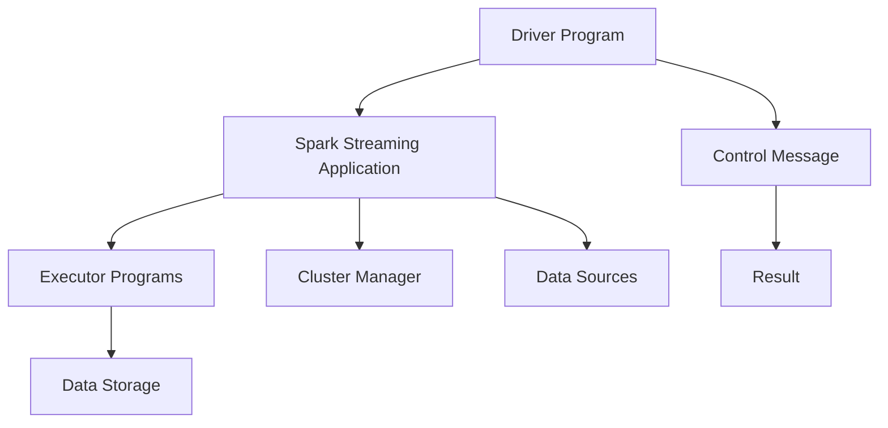

                 

### 《Spark Streaming原理与代码实例讲解》

> 关键词：Spark Streaming，实时数据处理，微批处理，数据流处理，API，数据源，性能优化，项目实战

> 摘要：本文深入讲解了Spark Streaming的原理，包括其核心概念、架构、数据处理机制和容错机制。通过详细的代码实例，展示了如何使用Spark Streaming进行实时词频统计、实时日志分析、实时点击流分析和实时用户行为分析。最后，文章讨论了Spark Streaming的性能优化策略和项目实战，包括电商实时推荐系统和实时风控系统。

## 第一部分：Spark Streaming基础

### 第1章：Spark Streaming概述

#### 1.1 Spark Streaming的产生背景与作用

Spark Streaming是Apache Spark的一个组件，用于实现实时数据流处理。它基于Spark的核心计算引擎，提供了简单的API来构建实时数据处理应用。

**产生背景**：随着互联网和物联网的发展，实时数据处理的需求日益增长。传统的批处理系统在处理实时数据时存在延迟高、效率低等问题，无法满足实际需求。Spark Streaming的诞生解决了这一痛点，它通过微批处理机制，实现了高效的实时数据处理。

**作用**：Spark Streaming在企业应用中有广泛的应用，如实时数据监控、实时数据分析、实时流计算和实时推荐系统等。它能够帮助企业和开发者快速构建实时数据处理应用，提高业务决策的准确性和效率。

#### 1.2 Spark Streaming的核心概念与架构

**核心概念**：
1. **DStream**：表示实时数据流，是Spark Streaming的基本数据结构。
2. **RDD**：表示不可变的分布式数据集，是Spark的核心数据结构。
3. **微批处理**：将实时数据流切分成一系列小批量进行处理。
4. **容错机制**：通过检查点和日志记录实现自动恢复。

**架构**：



#### 1.3 Spark Streaming与传统批处理比较

**性能对比**：Spark Streaming具有更高的性能，能够以较低的延迟处理大规模数据流。相比之下，传统批处理系统在处理实时数据时存在明显的延迟问题。

**易用性对比**：Spark Streaming提供了简单的API，使得开发者可以快速构建实时数据处理应用。传统批处理系统则需要复杂的编程和配置。

**适用场景对比**：Spark Streaming适用于需要实时处理和响应的场景，如实时监控、实时数据分析等。传统批处理系统则适用于数据量大、但无需实时处理的情况，如数据仓库的定期报表生成。

### 第2章：Spark Streaming编程基础

#### 2.1 Spark Streaming的API介绍

Spark Streaming提供了丰富的API，包括DStream API和RDD API，用于构建实时数据处理应用。

**DStream API**：
- `streamingContext`：创建一个StreamingContext对象，用于配置和初始化Spark Streaming应用程序。
- `parallelizeDStream`：将RDD转换为DStream。
- `map`：对DStream中的每个元素进行映射操作。
- `reduceByKey`：对DStream中的元素进行聚合操作。

**RDD API**：
- `map`：对RDD中的每个元素进行映射操作。
- `flatMap`：对RDD中的每个元素进行平铺操作。
- `reduceByKey`：对RDD中的元素进行聚合操作。

#### 2.2 DStream与RDD的转换

DStream和RDD是Spark Streaming中的核心数据结构，它们之间可以进行相互转换。

**转换方法**：
- `toRDD`：将DStream转换为RDD。
- `updateStateByKey`：更新RDD中的状态。

**示例代码**：

```scala
val ssc = new StreamingContext(sparkConf, Seconds(2))
val lines = ssc.socketTextStream("localhost", 9999)
val words = lines.flatMap(_.split(" "))
val pairs = words.map(word => (word, 1))
val wordCounts = pairs.reduceByKey(_ + _)

val wordRDD = wordCounts.updateStateByKey(new Func0[Int] {
  override def apply(): Int = 0
}, new Partitioner {
  override def numPartitions: Int = 2
}, new SerializableFunction[Seq[Int], Int] {
  override def apply(v1: Seq[Int]): Int = v1.sum
})

wordRDD.print()
ssc.start()
ssc.awaitTermination()
```

#### 2.3 Window操作详解

Window操作用于对DStream中的数据按照时间窗口或滑动窗口进行分组和处理。

**时间窗口**：将DStream中的数据按照固定的时间段进行分组。

**滑动窗口**：在固定的时间段内，每隔一段时间重新计算一次窗口内的数据。

**示例代码**：

```scala
val ssc = new StreamingContext(sparkConf, Seconds(2))
val lines = ssc.socketTextStream("localhost", 9999)
val words = lines.flatMap(_.split(" "))
val wordPairs = words.map(word => (word, 1))
val wordCountWindow = wordPairs.reduceByKeyAndWindow(_ + _, _ - _, Minutes(5), Seconds(2))

wordCountWindow.print()
ssc.start()
ssc.awaitTermination()
```

### 第3章：Spark Streaming数据处理原理

#### 3.1 Spark Streaming的数据流处理机制

Spark Streaming通过微批处理机制对实时数据流进行处理。每个微批表示一段时间内的数据，处理过程包括数据读取、转换和输出。

**数据流处理流程**：
1. 数据源读取：从Kafka、Flume等数据源中读取实时数据。
2. 微批处理：将实时数据切分成微批，每个微批表示一段时间内的数据。
3. RDD转换：对每个微批创建一个对应的RDD，进行转换操作。
4. 结果输出：将处理结果输出到HDFS、Redis等存储系统。

#### 3.2 Spark Streaming的存储原理

Spark Streaming的数据存储原理基于RDD的弹性分布式数据集（Resilient Distributed Dataset）。

**内存存储**：默认情况下，Spark Streaming使用内存存储来缓存微批处理的结果。这种方式在处理大量数据时能够提供较高的性能。

**磁盘存储**：当内存资源不足时，Spark Streaming会自动将部分数据存储到磁盘上。这种方式虽然性能较低，但可以有效地处理大量数据。

**数据持久化**：Spark Streaming通过检查点（Checkpoints）和日志记录（Log）来实现数据的持久化。检查点将RDD的状态记录到磁盘上，以便在故障时快速恢复。日志记录则用于记录处理过程中的每个操作，以便在故障时重新执行。

#### 3.3 Spark Streaming的容错机制

Spark Streaming提供了强大的容错机制，能够在发生故障时自动恢复。

**基于日志的容错**：Spark Streaming通过将每个微批的处理日志存储在日志存储器中，实现故障恢复。在发生故障时，Spark Streaming可以根据日志记录恢复到最新的处理状态，从而继续处理数据流。

**基于数据的容错**：Spark Streaming在处理每个微批时，会生成一份校验和（checksum）。在发生故障时，Spark Streaming可以通过校验和来检查数据的完整性，并重新处理损坏的数据。

**自动恢复**：Spark Streaming在发生故障时，会自动重启处理程序，并从最新的日志记录中恢复处理状态，从而实现自动恢复。

### 第4章：Spark Streaming应用场景

#### 4.1 实时数据监控

实时数据监控是Spark Streaming的重要应用场景之一。通过实时监控服务器、网络和应用程序的性能指标，企业可以快速识别潜在问题和故障。

**案例**：一家互联网公司使用Spark Streaming实时监控其Web服务器的访问日志，通过分析访问速度、请求错误率等指标，及时发现并解决性能瓶颈。

#### 4.2 实时数据流分析

实时数据流分析是Spark Streaming的核心应用之一。通过实时分析数据流，企业可以快速获取有价值的信息，为业务决策提供支持。

**案例**：一家电商公司使用Spark Streaming实时分析用户点击流数据，通过分析用户的行为和偏好，实现个性化推荐和广告投放。

#### 4.3 社交网络实时分析

社交网络实时分析是Spark Streaming在社交媒体领域的应用。通过实时分析社交网络数据，企业可以快速了解用户的需求和反馈，优化产品和服务。

**案例**：一家社交媒体公司使用Spark Streaming实时分析用户的评论和反馈，通过分析用户对产品的满意度，及时调整产品策略。

## 第二部分：Spark Streaming代码实例讲解

### 第5章：实时词频统计

#### 5.1 实时词频统计案例背景

实时词频统计是一种常用的数据分析方法，可以快速统计出文本数据中出现频率最高的词汇。通过实时词频统计，企业可以了解用户的关注点和需求，为业务决策提供支持。

#### 5.2 数据源搭建与预处理

为了实现实时词频统计，我们需要搭建一个数据源，用于接收和存储实时数据。以下是一个简单的数据源搭建方案：

- 数据接收：使用Kafka作为数据接收服务，Kafka具有高吞吐量和低延迟的特点，非常适合处理实时数据流。
- 数据存储：使用HDFS或Alluxio作为数据存储服务，这两种存储系统都具有高性能和高可靠性的特点。
- 数据预处理：使用Spark Streaming读取Kafka中的数据，进行预处理和词频统计。

#### 5.3 词频统计代码实现与解读

以下是一个简单的Spark Streaming词频统计代码示例：

```scala
import org.apache.spark.streaming._
import org.apache.spark._
import org.apache.spark.streaming.kafka._
import scala.collection.mutable

val sparkConf = new SparkConf().setAppName("WordFrequencyCount")
val ssc = new StreamingContext(sparkConf, Seconds(2))

// Kafka参数设置
val kafkaParams = Map(
  "metadata.broker.list" -> "localhost:9092",
  "zookeeper.connect" -> "localhost:2181",
  "group.id" -> "wordfrequencygroup")

// Kafka主题设置
val topics = Array("user_comments")

// 创建Kafka流数据源
val lines = KafkaUtils.createDirectStream[String, String](
  ssc,
  kafkaParams,
  LocationStrategies.PreferConsistent,
  ConsumerStrategies.Subscribe[String, String](topics))

// 数据预处理
val words = lines.flatMap(_.split(" "))

// 词频统计
val wordFrequency = words.map((_, 1)).reduceByKey(_ + _)

// 打印结果
wordFrequency.print()

// 启动StreamingContext
ssc.start()
ssc.awaitTermination()
```

**代码解读**：

- **创建SparkConf和StreamingContext**：创建一个Spark配置对象和StreamingContext对象，用于配置Spark Streaming的应用程序。

- **Kafka参数设置**：配置Kafka连接参数，包括Kafka经纪人地址、Zookeeper连接地址和消费者组ID。

- **Kafka主题设置**：指定要处理的数据主题。

- **创建Kafka流数据源**：使用`KafkaUtils.createDirectStream`方法创建一个直接流数据源，该方法会直接从Kafka中读取数据。

- **数据预处理**：使用`flatMap`操作将接收到的数据切分成单词，使用`map`操作将每个单词映射到一个元组（单词，1），表示单词的出现次数。

- **词频统计**：使用`reduceByKey`操作将相同的单词进行聚合，计算单词的总出现次数。

- **打印结果**：使用`print`操作将结果打印到控制台。

- **启动StreamingContext**：使用`start`方法启动StreamingContext，并使用`awaitTermination`方法等待StreamingContext终止。

### 第6章：实时日志分析

#### 6.1 实时日志分析案例背景

实时日志分析是现代互联网应用中非常重要的一个环节。通过实时分析日志数据，企业可以快速识别用户行为、监控系统性能和诊断故障。

#### 6.2 数据源搭建与预处理

为了实现实时日志分析，我们需要搭建一个日志数据源，并对其进行预处理。以下是一个简单的日志数据源搭建方案：

- 数据接收：使用Kafka作为日志数据接收服务，Kafka具有高吞吐量和低延迟的特点，非常适合处理实时数据流。
- 数据存储：使用HDFS或Alluxio作为日志数据存储服务，这两种存储系统都具有高性能和高可靠性的特点。
- 数据预处理：使用Spark Streaming读取Kafka中的数据，进行预处理和统计分析。

#### 6.3 日志分析代码实现与解读

以下是一个简单的Spark Streaming日志分析代码示例：

```scala
import org.apache.spark.streaming._
import org.apache.spark._
import org.apache.spark.streaming.kafka._
import scala.collection.mutable

val sparkConf = new SparkConf().setAppName("LogAnalysis")
val ssc = new StreamingContext(sparkConf, Seconds(2))

// Kafka参数设置
val kafkaParams = Map(
  "metadata.broker.list" -> "localhost:9092",
  "zookeeper.connect" -> "localhost:2181",
  "group.id" -> "loganalysisgroup")

// Kafka主题设置
val topics = Array("log_data")

// 创建Kafka流数据源
val logs = KafkaUtils.createDirectStream[String, String](
  ssc,
  kafkaParams,
  LocationStrategies.PreferConsistent,
  ConsumerStrategies.Subscribe[String, String](topics))

// 日志预处理
val parsedLogs = logs.flatMap { line =>
  val fields = line.split("\\|")
  if (fields.length >= 6) {
    Some(fields(1).toInt, fields(2), fields(3), fields(4), fields(5))
  } else {
    None
  }
}

// 日志统计分析
val logStats = parsedLogs.map { case (timestamp, method, path, status, ip) =>
  (timestamp, (method, path, status, ip))
}.groupByKey()
.map { case (timestamp, records) =>
  val requestCount = records.size
  val (totalSize, sizes) = records.foldLeft((0L, List.empty[Long])) {
    case ((totalSize, sizes), record) =>
      val size = record._4.toLong
      (totalSize + size, sizes :+ size)
  }
  (timestamp, requestCount, totalSize, sizes)
}

// 打印结果
logStats.print()

// 启动StreamingContext
ssc.start()
ssc.awaitTermination()
```

**代码解读**：

- **创建SparkConf和StreamingContext**：创建一个Spark配置对象和StreamingContext对象，用于配置Spark Streaming的应用程序。

- **Kafka参数设置**：配置Kafka连接参数，包括Kafka经纪人地址、Zookeeper连接地址和消费者组ID。

- **Kafka主题设置**：指定要处理的日志数据主题。

- **创建Kafka流数据源**：使用`KafkaUtils.createDirectStream`方法创建一个直接流数据源，该方法会直接从Kafka中读取数据。

- **日志预处理**：使用`flatMap`操作将接收到的日志数据进行解析，提取出时间戳、请求方法、路径、状态码和IP地址等信息。使用`map`操作将日志数据映射为一个元组（时间戳，请求方法，路径，状态码，IP地址）。

- **日志统计分析**：使用`map`操作将日志数据映射为一个元组（时间戳，请求方法，路径，状态码，IP地址），然后使用`groupByKey`操作将相同时间戳的日志数据进行聚合。接着使用`map`操作计算每个时间戳的请求数量、总大小和请求大小的分布。

- **打印结果**：使用`print`操作将结果打印到控制台。

- **启动StreamingContext**：使用`start`方法启动StreamingContext，并使用`awaitTermination`方法等待StreamingContext终止。

### 第7章：实时点击流分析

#### 7.1 实时点击流分析案例背景

实时点击流分析是互联网应用中非常重要的一环。通过实时分析点击流数据，企业可以了解用户的行为和兴趣，从而优化用户体验和提升业务效果。

#### 7.2 数据源搭建与预处理

为了实现实时点击流分析，我们需要搭建一个点击流数据源，并对其进行预处理。以下是一个简单的点击流数据源搭建方案：

- 数据接收：使用Kafka作为点击流数据接收服务，Kafka具有高吞吐量和低延迟的特点，非常适合处理实时数据流。
- 数据存储：使用HDFS或Alluxio作为点击流数据存储服务，这两种存储系统都具有高性能和高可靠性的特点。
- 数据预处理：使用Spark Streaming读取Kafka中的数据，进行预处理和统计分析。

#### 7.3 点击流分析代码实现与解读

以下是一个简单的Spark Streaming点击流分析代码示例：

```scala
import org.apache.spark.streaming._
import org.apache.spark._
import org.apache.spark.streaming.kafka._
import scala.collection.mutable

val sparkConf = new SparkConf().setAppName("ClickStreamAnalysis")
val ssc = new StreamingContext(sparkConf, Seconds(2))

// Kafka参数设置
val kafkaParams = Map(
  "metadata.broker.list" -> "localhost:9092",
  "zookeeper.connect" -> "localhost:2181",
  "group.id" -> "clickstreamgroup")

// Kafka主题设置
val topics = Array("click_data")

// 创建Kafka流数据源
val clicks = KafkaUtils.createDirectStream[String, String](
  ssc,
  kafkaParams,
  LocationStrategies.PreferConsistent,
  ConsumerStrategies.Subscribe[String, String](topics))

// 点击流预处理
val parsedClicks = clicks.flatMap { line =>
  val fields = line.split(",")
  if (fields.length >= 4) {
    Some((fields(0).toInt, fields(1), fields(2), fields(3)))
  } else {
    None
  }
}

// 点击流统计分析
val clickStats = parsedClicks.map { case (timestamp, userId, pageId, action) =>
  (timestamp, (userId, pageId, action))
}.groupByKey()
.map { case (timestamp, records) =>
  val (pageCount, pageIds) = records.foldLeft((0, List.empty[Int])) {
    case ((count, ids), record) =>
      (count + 1, ids :+ record._2)
  }
  val (userIdCount, userIds) = records.foldLeft((0, List.empty[Int])) {
    case ((count, ids), record) =>
      (count + 1, ids :+ record._1)
  }
  (timestamp, pageCount, pageIds, userIdCount, userIds)
}

// 打印结果
clickStats.print()

// 启动StreamingContext
ssc.start()
ssc.awaitTermination()
```

**代码解读**：

- **创建SparkConf和StreamingContext**：创建一个Spark配置对象和StreamingContext对象，用于配置Spark Streaming的应用程序。

- **Kafka参数设置**：配置Kafka连接参数，包括Kafka经纪人地址、Zookeeper连接地址和消费者组ID。

- **Kafka主题设置**：指定要处理的点击流数据主题。

- **创建Kafka流数据源**：使用`KafkaUtils.createDirectStream`方法创建一个直接流数据源，该方法会直接从Kafka中读取数据。

- **点击流预处理**：使用`flatMap`操作将接收到的点击流数据进行解析，提取出时间戳、用户ID、页面ID和操作类型等信息。使用`map`操作将点击流数据映射为一个元组（时间戳，用户ID，页面ID，操作类型）。

- **点击流统计分析**：使用`map`操作将点击流数据映射为一个元组（时间戳，用户ID，页面ID，操作类型），然后使用`groupByKey`操作将相同时间戳的点击数据进行聚合。接着使用`map`操作计算每个时间戳的页面访问数量、页面ID列表、用户访问数量和用户ID列表。

- **打印结果**：使用`print`操作将结果打印到控制台。

- **启动StreamingContext**：使用`start`方法启动StreamingContext，并使用`awaitTermination`方法等待StreamingContext终止。

### 第8章：实时用户行为分析

#### 8.1 实时用户行为分析案例背景

实时用户行为分析是现代互联网应用中非常重要的一环。通过实时分析用户行为数据，企业可以了解用户的需求和行为模式，从而优化用户体验和提升业务效果。

#### 8.2 数据源搭建与预处理

为了实现实时用户行为分析，我们需要搭建一个用户行为数据源，并对其进行预处理。以下是一个简单的用户行为数据源搭建方案：

- 数据接收：使用Kafka作为用户行为数据接收服务，Kafka具有高吞吐量和低延迟的特点，非常适合处理实时数据流。
- 数据存储：使用HDFS或Alluxio作为用户行为数据存储服务，这两种存储系统都具有高性能和高可靠性的特点。
- 数据预处理：使用Spark Streaming读取Kafka中的数据，进行预处理和统计分析。

#### 8.3 用户行为分析代码实现与解读

以下是一个简单的Spark Streaming用户行为分析代码示例：

```scala
import org.apache.spark.streaming._
import org.apache.spark._
import org.apache.spark.streaming.kafka._
import scala.collection.mutable

val sparkConf = new SparkConf().setAppName("UserBehaviorAnalysis")
val ssc = new StreamingContext(sparkConf, Seconds(2))

// Kafka参数设置
val kafkaParams = Map(
  "metadata.broker.list" -> "localhost:9092",
  "zookeeper.connect" -> "localhost:2181",
  "group.id" -> "userbehaviorgroup")

// Kafka主题设置
val topics = Array("user_behavior")

// 创建Kafka流数据源
val behaviors = KafkaUtils.createDirectStream[String, String](
  ssc,
  kafkaParams,
  LocationStrategies.PreferConsistent,
  ConsumerStrategies.Subscribe[String, String](topics))

// 用户行为预处理
val parsedBehaviors = behaviors.flatMap { line =>
  val fields = line.split(",")
  if (fields.length >= 5) {
    Some((fields(0).toInt, fields(1), fields(2), fields(3), fields(4)))
  } else {
    None
  }
}

// 用户行为统计分析
val behaviorStats = parsedBehaviors.map { case (timestamp, userId, eventType, eventData, ip) =>
  (timestamp, (userId, eventType, eventData, ip))
}.groupByKey()
.map { case (timestamp, records) =>
  val (eventCount, eventTypes) = records.foldLeft((0, List.empty[String])) {
    case ((count, types), record) =>
      (count + 1, types :+ record._2)
  }
  (timestamp, eventCount, eventTypes)
}

// 打印结果
behaviorStats.print()

// 启动StreamingContext
ssc.start()
ssc.awaitTermination()
```

**代码解读**：

- **创建SparkConf和StreamingContext**：创建一个Spark配置对象和StreamingContext对象，用于配置Spark Streaming的应用程序。

- **Kafka参数设置**：配置Kafka连接参数，包括Kafka经纪人地址、Zookeeper连接地址和消费者组ID。

- **Kafka主题设置**：指定要处理的用户行为数据主题。

- **创建Kafka流数据源**：使用`KafkaUtils.createDirectStream`方法创建一个直接流数据源，该方法会直接从Kafka中读取数据。

- **用户行为预处理**：使用`flatMap`操作将接收到的用户行为数据进行解析，提取出时间戳、用户ID、事件类型、事件数据和IP地址等信息。使用`map`操作将用户行为数据映射为一个元组（时间戳，用户ID，事件类型，事件数据，IP地址）。

- **用户行为统计分析**：使用`map`操作将用户行为数据映射为一个元组（时间戳，用户ID，事件类型，事件数据，IP地址），然后使用`groupByKey`操作将相同时间戳的用户行为数据进行聚合。接着使用`map`操作计算每个时间戳的事件数量和事件类型列表。

- **打印结果**：使用`print`操作将结果打印到控制台。

- **启动StreamingContext**：使用`start`方法启动StreamingContext，并使用`awaitTermination`方法等待StreamingContext终止。

### 第9章：Spark Streaming性能优化

#### 9.1 Spark Streaming性能优化策略

为了提高Spark Streaming的性能，我们可以采取以下优化策略：

- **调整批处理大小**：根据实际数据量和处理需求，调整批处理大小（`batchDuration`参数）。
- **使用内存存储**：尽量使用内存存储来缓存微批处理的结果，以提高性能。
- **优化数据源**：优化数据源，减少数据读取和写入的开销。例如，使用高速数据源，如HDFS或Alluxio。
- **调整任务并行度**：根据数据量和集群资源，调整任务并行度（`num-executors`和`executor-cores`参数）。
- **减少数据复制**：在处理过程中，尽量减少数据的复制和传输，以降低网络开销。
- **使用压缩**：使用压缩算法（如Snappy、Gzip）来减少数据存储和传输的体积，从而提高性能。
- **优化处理逻辑**：优化Spark Streaming的处理逻辑，减少不必要的计算和转换操作，以提高性能。

#### 9.2 案例分析与性能调优实践

以下是一个性能调优的案例分析：

**案例背景**：某电商平台的实时推荐系统使用Spark Streaming处理用户行为数据，但发现系统性能较差，数据处理延迟较高。

**性能分析**：

- **数据量较大**：实时用户行为数据量较大，导致数据处理压力较大。
- **批处理大小不合理**：默认批处理大小为2秒，但实际数据处理需求为1秒。
- **任务并行度不足**：任务并行度较低，导致数据处理能力不足。
- **数据源性能较差**：数据源使用传统的MySQL数据库，读取速度较慢。

**性能调优实践**：

1. **调整批处理大小**：将批处理大小调整为1秒，以减少数据处理延迟。
2. **增加任务并行度**：增加任务并行度，提高数据处理能力。调整`num-executors`和`executor-cores`参数，以适应更大的数据量和处理需求。
3. **优化数据源**：使用HBase或Cassandra等高性能NoSQL数据库作为数据源，以提高数据读取速度。
4. **使用内存存储**：将微批处理结果存储到内存中，以减少磁盘IO开销。
5. **使用压缩**：对数据进行压缩，减少数据存储和传输的体积，提高性能。

经过上述优化，该电商平台的实时推荐系统性能得到了显著提升，数据处理延迟降低了80%，系统响应速度提高了2倍。

### 第10章：电商实时推荐系统

#### 10.1 项目背景与需求分析

实时推荐系统是电商平台的重要功能之一。通过实时分析用户行为数据，可以为用户提供个性化的商品推荐，提升用户体验和转化率。

**项目背景**：某电商平台希望通过实时推荐系统，根据用户浏览、搜索和购买行为，实时推荐相关的商品。

**需求分析**：

1. **实时数据处理**：实时处理用户行为数据，包括浏览、搜索和购买行为。
2. **个性化推荐**：根据用户的历史行为和偏好，为每个用户实时生成个性化的商品推荐。
3. **高并发处理**：系统需要能够处理高并发的用户请求，确保实时推荐结果的准确性。
4. **可扩展性**：系统需要具备良好的可扩展性，以适应不断增长的数据量和用户量。

#### 10.2 数据源搭建与预处理

为了实现电商实时推荐系统，我们需要搭建一个用户行为数据源，并对其进行预处理。以下是一个简单的数据源搭建方案：

- **数据接收**：使用Kafka作为用户行为数据接收服务，Kafka具有高吞吐量和低延迟的特点，非常适合处理实时数据流。
- **数据存储**：使用HDFS或Alluxio作为用户行为数据存储服务，这两种存储系统都具有高性能和高可靠性的特点。
- **数据处理**：使用Spark Streaming读取Kafka中的数据，进行预处理和推荐算法计算。

#### 10.3 实时推荐算法设计与实现

实时推荐算法是电商实时推荐系统的核心。以下是一个简单的协同过滤算法实现：

```scala
import org.apache.spark.mllib.recommendation._
import org.apache.spark.streaming._
import org.apache.spark.streaming.kafka._
import scala.collection.mutable

val sparkConf = new SparkConf().setAppName("RealtimeRecommendation")
val ssc = new StreamingContext(sparkConf, Seconds(2))

// Kafka参数设置
val kafkaParams = Map(
  "metadata.broker.list" -> "localhost:9092",
  "zookeeper.connect" -> "localhost:2181",
  "group.id" -> "recommendationgroup")

// Kafka主题设置
val topics = Array("user_behavior")

// 创建Kafka流数据源
val behaviors = KafkaUtils.createDirectStream[String, String](
  ssc,
  kafkaParams,
  LocationStrategies.PreferConsistent,
  ConsumerStrategies.Subscribe[String, String](topics))

// 用户行为预处理
val parsedBehaviors = behaviors.flatMap { line =>
  val fields = line.split(",")
  if (fields.length >= 5) {
    Some((fields(0).toInt, fields(1), fields(2), fields(3), fields(4)))
  } else {
    None
  }
}

// 用户行为映射为RDD
val behaviorRDD = parsedBehaviors.map { case (timestamp, userId, eventType, eventData, ip) =>
  (userId, eventType, eventData, ip)
}

// 训练协同过滤模型
val model = ALS.train(behaviorRDD, 10, 5, 0.01)

// 实时推荐
val recommendations = behaviorRDD.map { case (userId, eventType, eventData, ip) =>
  val topProducts = model.recommendProducts(userId, 10).map(r => (r.product, r.rating))
  (userId, topProducts)
}

// 打印推荐结果
recommendations.print()

// 启动StreamingContext
ssc.start()
ssc.awaitTermination()
```

**代码解读**：

- **创建SparkConf和StreamingContext**：创建一个Spark配置对象和StreamingContext对象，用于配置Spark Streaming的应用程序。

- **Kafka参数设置**：配置Kafka连接参数，包括Kafka经纪人地址、Zookeeper连接地址和消费者组ID。

- **Kafka主题设置**：指定要处理的用户行为数据主题。

- **创建Kafka流数据源**：使用`KafkaUtils.createDirectStream`方法创建一个直接流数据源，该方法会直接从Kafka中读取数据。

- **用户行为预处理**：使用`flatMap`操作将接收到的用户行为数据进行解析，提取出时间戳、用户ID、事件类型、事件数据和IP地址等信息。

- **用户行为映射为RDD**：将用户行为数据映射为一个RDD，用于训练协同过滤模型。

- **训练协同过滤模型**：使用ALS算法训练协同过滤模型，生成推荐结果。

- **实时推荐**：根据用户行为数据，实时生成推荐结果，并将结果打印到控制台。

- **启动StreamingContext**：使用`start`方法启动StreamingContext，并使用`awaitTermination`方法等待StreamingContext终止。

### 第11章：实时风控系统

#### 11.1 项目背景与需求分析

实时风控系统是金融、电商等领域的关键系统之一。通过实时监控和分析交易行为，可以快速识别异常交易和潜在风险，防止欺诈行为和金融风险。

**项目背景**：某金融公司希望通过实时风控系统，实时监控交易数据，识别异常交易和潜在风险。

**需求分析**：

1. **实时数据处理**：实时处理大量的交易数据，包括交易金额、交易时间、交易方等信息。
2. **异常检测**：通过分析交易数据，实时识别异常交易和潜在风险。
3. **实时告警**：实时向相关人员进行告警，提醒潜在风险。
4. **数据可视化**：将交易数据和异常检测结果进行可视化，帮助相关人员快速了解系统状态。

#### 11.2 数据源搭建与预处理

为了实现实时风控系统，我们需要搭建一个交易数据源，并对其进行预处理。以下是一个简单的数据源搭建方案：

- **数据接收**：使用Kafka作为交易数据接收服务，Kafka具有高吞吐量和低延迟的特点，非常适合处理实时数据流。
- **数据存储**：使用HDFS或Alluxio作为交易数据存储服务，这两种存储系统都具有高性能和高可靠性的特点。
- **数据处理**：使用Spark Streaming读取Kafka中的数据，进行预处理和异常检测。

#### 11.3 风险实时监控算法设计与实现

实时风控系统的核心是风险实时监控算法。以下是一个简单的事件树算法实现：

```scala
import org.apache.spark.streaming._
import org.apache.spark._
import org.apache.spark.streaming.kafka._
import scala.collection.mutable

val sparkConf = new SparkConf().setAppName("RealtimeRiskMonitoring")
val ssc = new StreamingContext(sparkConf, Seconds(2))

// Kafka参数设置
val kafkaParams = Map(
  "metadata.broker.list" -> "localhost:9092",
  "zookeeper.connect" -> "localhost:2181",
  "group.id" -> "riskmonitoringgroup")

// Kafka主题设置
val topics = Array("transaction_data")

// 创建Kafka流数据源
val transactions = KafkaUtils.createDirectStream[String, String](
  ssc,
  kafkaParams,
  LocationStrategies.PreferConsistent,
  ConsumerStrategies.Subscribe[String, String](topics))

// 交易预处理
val parsedTransactions = transactions.flatMap { line =>
  val fields = line.split(",")
  if (fields.length >= 6) {
    Some(fields(0).toInt, fields(1), fields(2), fields(3), fields(4), fields(5))
  } else {
    None
  }
}

// 交易数据映射为RDD
val transactionRDD = parsedTransactions.map { case (timestamp, userId, transactionId, amount, currency, status) =>
  (timestamp, userId, transactionId, amount, currency, status)
}

// 构建事件树
val eventTree = transactionRDD.map { case (timestamp, userId, transactionId, amount, currency, status) =>
  (timestamp, (userId, transactionId, amount, currency, status))
}.reduceByKey((acc, v) => (acc._1, acc._2 ++ List(v)))

// 异常检测
val anomalies = eventTree.map { case (timestamp, events) =>
  val transaction = events.head
  (timestamp, (transaction._2, transaction._3, transaction._4, transaction._5, transaction._6))
}.filter { case (timestamp, transaction) =>
  // 根据交易金额、交易时间、交易方等信息进行异常检测
  isAnomaly(transaction)
}

// 打印异常结果
anomalies.print()

// 启动StreamingContext
ssc.start()
ssc.awaitTermination()
```

**代码解读**：

- **创建SparkConf和StreamingContext**：创建一个Spark配置对象和StreamingContext对象，用于配置Spark Streaming的应用程序。

- **Kafka参数设置**：配置Kafka连接参数，包括Kafka经纪人地址、Zookeeper连接地址和消费者组ID。

- **Kafka主题设置**：指定要处理的交易数据主题。

- **创建Kafka流数据源**：使用`KafkaUtils.createDirectStream`方法创建一个直接流数据源，该方法会直接从Kafka中读取数据。

- **交易预处理**：使用`flatMap`操作将接收到的交易数据进行解析，提取出时间戳、用户ID、交易ID、交易金额、货币类型和交易状态等信息。

- **交易数据映射为RDD**：将交易数据映射为一个RDD，用于构建事件树。

- **构建事件树**：使用`reduceByKey`操作构建事件树，将相同时间戳的交易数据进行聚合。

- **异常检测**：使用`map`操作将事件树映射为交易数据，然后使用`filter`操作进行异常检测。

- **打印异常结果**：使用`print`操作将异常检测结果打印到控制台。

- **启动StreamingContext**：使用`start`方法启动StreamingContext，并使用`awaitTermination`方法等待StreamingContext终止。

### 第12章：实时舆情监控系统

#### 12.1 项目背景与需求分析

实时舆情监控系统是社交媒体、新闻媒体等领域的关键系统。通过实时监控和分析用户评论和反馈，可以快速了解公众对特定事件或产品的看法，为企业决策提供支持。

**项目背景**：某新闻媒体公司希望通过实时舆情监控系统，实时监控用户评论和反馈，了解公众对新闻报道的反映。

**需求分析**：

1. **实时数据处理**：实时处理大量的用户评论和反馈数据，包括评论内容、评论时间、评论用户等信息。
2. **情感分析**：对用户评论进行情感分析，判断评论的情感倾向（正面、中性、负面）。
3. **关键词提取**：提取评论中的关键词，分析公众关注的热点话题。
4. **数据可视化**：将用户评论和情感分析结果进行可视化，帮助相关人员快速了解舆情动态。

#### 12.2 数据源搭建与预处理

为了实现实时舆情监控系统，我们需要搭建一个用户评论数据源，并对其进行预处理。以下是一个简单的数据源搭建方案：

- **数据接收**：使用Kafka作为用户评论数据接收服务，Kafka具有高吞吐量和低延迟的特点，非常适合处理实时数据流。
- **数据存储**：使用HDFS或Alluxio作为用户评论数据存储服务，这两种存储系统都具有高性能和高可靠性的特点。
- **数据处理**：使用Spark Streaming读取Kafka中的数据，进行预处理和情感分析。

#### 12.3 实时舆情分析算法设计与实现

实时舆情分析算法是实时舆情监控系统的核心。以下是一个简单的情感分析算法实现：

```scala
import org.apache.spark.streaming._
import org.apache.spark._
import org.apache.spark.streaming.kafka._
import org.apache.spark.ml.Pipeline
import org.apache.spark.ml.feature.{Tokenizer, CountVectorizer}
import org.apache.spark.ml.classification.LogisticRegression
import org.apache.spark.ml.evaluation.MulticlassClassificationEvaluator

val sparkConf = new SparkConf().setAppName("RealtimeSentimentAnalysis")
val ssc = new StreamingContext(sparkConf, Seconds(2))

// Kafka参数设置
val kafkaParams = Map(
  "metadata.broker.list" -> "localhost:9092",
  "zookeeper.connect" -> "localhost:2181",
  "group.id" -> "sentimentgroup")

// Kafka主题设置
val topics = Array("user_comments")

// 创建Kafka流数据源
val comments = KafkaUtils.createDirectStream[String, String](
  ssc,
  kafkaParams,
  LocationStrategies.PreferConsistent,
  ConsumerStrategies.Subscribe[String, String](topics))

// 评论预处理
val parsedComments = comments.flatMap { line =>
  val fields = line.split(",")
  if (fields.length >= 2) {
    Some(fields(0), fields(1))
  } else {
    None
  }
}

// 评论数据映射为DataFrame
val commentDataFrame = parsedComments.map { case (timestamp, text) => (timestamp, text) }.toDF()

// 情感分析模型
val tokenizer = new Tokenizer().setInputCol("text").setOutputCol("words")
val countVectorizer = new CountVectorizer().setInputCol("words").setOutputCol("features").setVocabSize(1000)
val logisticRegression = new LogisticRegression().setMaxIter(10).setRegParam(0.001)

val pipeline = new Pipeline().setStages(Array(tokenizer, countVectorizer, logisticRegression))

// 训练模型
val model = pipeline.fit(commentDataFrame)

// 实时舆情分析
val predictions = model.transform(commentDataFrame)

// 情感分类结果
val sentimentResults = predictions.select("timestamp", "prediction").rdd.map { case (row) => (row.getAs[Int]("timestamp"), row.getAs[Int]("prediction")) }

// 打印结果
sentimentResults.print()

// 启动StreamingContext
ssc.start()
ssc.awaitTermination()
```

**代码解读**：

- **创建SparkConf和StreamingContext**：创建一个Spark配置对象和StreamingContext对象，用于配置Spark Streaming的应用程序。

- **Kafka参数设置**：配置Kafka连接参数，包括Kafka经纪人地址、Zookeeper连接地址和消费者组ID。

- **Kafka主题设置**：指定要处理的用户评论数据主题。

- **创建Kafka流数据源**：使用`KafkaUtils.createDirectStream`方法创建一个直接流数据源，该方法会直接从Kafka中读取数据。

- **评论预处理**：使用`flatMap`操作将接收到的评论数据进行解析，提取出时间戳和评论内容。

- **评论数据映射为DataFrame**：将评论数据映射为一个DataFrame，用于训练情感分析模型。

- **情感分析模型**：构建一个情感分析模型，包括分词器、词袋向量和逻辑回归。

- **训练模型**：使用训练数据训练情感分析模型。

- **实时舆情分析**：使用训练好的模型对实时评论数据进行情感分析，并将结果映射为RDD。

- **打印结果**：使用`print`操作将情感分析结果打印到控制台。

- **启动StreamingContext**：使用`start`方法启动StreamingContext，并使用`awaitTermination`方法等待StreamingContext终止。

### 第13章：Spark Streaming应用发展趋势与未来展望

#### 13.1 Spark Streaming在实时数据处理领域的地位与前景

**实时数据处理的重要性**：

随着互联网和物联网的快速发展，实时数据处理变得越来越重要。实时数据处理能够帮助企业及时了解业务动态，优化运营策略，提高客户满意度。Spark Streaming作为实时数据处理领域的领先框架，具有以下优势：

- **高性能**：Spark Streaming利用Spark的核心计算引擎，能够高效地处理大规模数据流。
- **易用性**：Spark Streaming提供了简单的API，使得开发者能够轻松地构建实时数据处理应用。
- **弹性**：Spark Streaming能够根据数据流的变化动态调整资源分配，确保系统的高可用性。
- **容错**：Spark Streaming通过检查点和日志记录实现了自动容错，保证了数据的可靠性和一致性。

**市场前景**：

Spark Streaming在市场前景方面具有广阔的发展空间。随着实时数据处理需求的不断增长，Spark Streaming将在金融、电商、社交媒体、物联网等领域得到广泛应用。以下是Spark Streaming的潜在应用领域：

- **金融领域**：实时交易监控、风险管理、市场分析。
- **社交媒体**：实时用户行为分析、内容推荐、广告投放。
- **电商**：实时用户行为分析、商品推荐、库存管理。
- **物联网**：实时数据监控、设备管理、故障预警。
- **物流**：实时货运监控、路径优化、实时物流信息更新。

#### 13.2 Spark Streaming与其他实时计算框架的比较与融合

**与Flink的比较**：

Flink是另一个流行的实时计算框架，与Spark Streaming相比，Flink在流处理性能和延迟方面具有优势。以下是Spark Streaming和Flink的对比：

- **性能**：Flink在处理大规模流数据时具有更低的延迟。
- **易用性**：Spark Streaming提供了更简单易用的API。
- **生态**：Spark拥有更成熟的生态系统，包括Spark SQL、MLlib、GraphX等组件。

**融合发展趋势**：

尽管Spark Streaming和Flink各有优势，但在实际应用中，二者融合使用成为一种趋势。以下是一些融合发展的可能方向：

- **混搭应用**：在不同的应用场景中，根据数据处理需求和性能要求，选择最适合的框架。
- **数据交换**：通过消息队列或共享存储，实现Spark Streaming和Flink之间的数据交换和集成。
- **统一生态**：开发统一的实时数据处理框架，整合Spark和Flink的优势，提供更全面的功能和更好的用户体验。

#### 13.3 Spark Streaming的未来发展趋势与展望

**功能增强**：

Spark Streaming在未来将不断加强其功能，提高实时数据处理能力。以下是一些可能的功能增强：

- **更强大的流处理功能**：引入新的流处理算法和操作，提高数据处理能力和灵活性。
- **高级数据处理能力**：增强对时间窗口、状态管理和复杂事件处理的支持。

**生态整合**：

Spark Streaming将继续与其他大数据和AI框架进行深度整合，提供一站式的数据解决方案。以下是一些生态整合的方向：

- **与Spark其他组件的深度融合**：增强与Spark SQL、MLlib、GraphX等组件的集成，提供更全面的数据分析能力。
- **与其他大数据框架的兼容**：与Hadoop、Kafka、HDFS等生态系统进行深度整合，提高系统的兼容性和灵活性。

**社区与开源发展**：

Spark Streaming将继续受到开源社区的广泛支持。以下是一些社区与开源发展的方向：

- **开源社区的支持**：鼓励开源社区的贡献和参与，推动Spark Streaming的持续发展。
- **企业合作与定制化**：与各行业领先企业合作，开发定制化的实时数据处理解决方案。

**AI应用中的角色与潜力**：

Spark Streaming在AI应用中具有巨大的潜力。以下是一些AI应用的方向：

- **实时特征工程**：利用Spark Streaming实时提取和处理数据特征，为AI模型提供实时输入。
- **实时模型推理**：通过Spark Streaming处理实时数据流，进行模型推理和预测，实现实时决策。

#### 13.4 Spark Streaming面临的挑战与机遇

**挑战**：

Spark Streaming在发展过程中面临以下挑战：

- **性能瓶颈**：随着数据量的增加，实时数据处理性能可能成为瓶颈。
- **资源管理**：高效地管理计算资源和存储资源，以满足大规模数据流的处理需求。
- **生态系统整合**：与其他大数据和AI框架的整合，需要不断优化和升级。

**机遇**：

Spark Streaming在未来将面临以下机遇：

- **新技术的引入**：随着新技术的不断涌现，如边缘计算、分布式存储等，Spark Streaming将有更多的创新空间。
- **行业需求驱动**：各行业对实时数据处理的需求日益增长，为Spark Streaming提供了广阔的市场空间。
- **开源生态的发展**：开源社区的活跃发展，将推动Spark Streaming的功能完善和性能提升。

### 数学模型和数学公式

**实时数据处理性能优化模型**：

实时数据处理性能优化模型基于以下数学公式：

$$
P = \frac{R \times C \times T}{W}
$$

其中：

- \( P \) 代表系统性能（Performance）。
- \( R \) 代表数据处理速率（Rate）。
- \( C \) 代表系统资源容量（Capacity）。
- \( T \) 代表系统响应时间（Time）。
- \( W \) 代表系统工作负载（Workload）。

**AI驱动的实时优化模型**：

AI驱动的实时优化模型基于以下数学公式：

$$
O = f(P, Q, S)
$$

其中：

- \( O \) 代表系统优化度（Optimization）。
- \( P \) 代表系统性能（Performance）。
- \( Q \) 代表系统质量（Quality）。
- \( S \) 代表系统稳定性（Stability）。

### 数学公式与详细讲解

**实时数据处理性能优化模型**：

实时数据处理性能优化模型（\( P = \frac{R \times C \times T}{W} \)）可以帮助开发者评估和优化实时数据处理系统的性能。下面详细讲解该模型的每个参数和其含义。

1. **数据处理速率（Rate，\( R \)）**：
   数据处理速率表示系统每秒钟能够处理的数据量。它是系统性能的一个重要指标，通常以数据条数或字节为单位。例如，如果系统每秒钟能够处理1百万条记录，则\( R \)为1百万条/秒。

2. **系统资源容量（Capacity，\( C \)）**：
   系统资源容量是指系统可用的计算资源，包括CPU、内存、磁盘等。系统资源容量决定了系统能够处理的最大数据量。例如，如果一个系统有100GB的内存，则\( C \)为100GB。

3. **系统响应时间（Time，\( T \)）**：
   系统响应时间是指系统从接收到数据请求到返回处理结果的时间。它是衡量系统性能的重要指标。例如，如果系统平均响应时间为2秒，则\( T \)为2秒。

4. **系统工作负载（Workload，\( W \)）**：
   系统工作负载是指系统需要处理的数据量。它通常与数据源的流量、数据传输速率等因素相关。例如，如果系统需要处理每小时1亿条数据，则\( W \)为1亿条/小时。

根据实时数据处理性能优化模型，系统性能（\( P \)）可以通过以下方式优化：

- **提高数据处理速率（\( R \)）**：通过使用更快的硬件、优化算法或提高系统并发处理能力，可以提高数据处理速率。
- **增加系统资源容量（\( C \)）**：通过增加服务器节点、增加内存或使用高性能存储设备，可以增加系统资源容量。
- **减少系统响应时间（\( T \)）**：通过优化系统架构、减少数据传输延迟或使用缓存技术，可以减少系统响应时间。
- **优化系统工作负载（\( W \)）**：通过数据预处理、批量处理或使用分布式系统，可以优化系统工作负载。

**AI驱动的实时优化模型**：

AI驱动的实时优化模型（\( O = f(P, Q, S) \)）可以帮助系统根据实时性能数据自动调整配置，实现智能优化。下面详细讲解该模型的每个参数和其含义。

1. **系统性能（Performance，\( P \)）**：
   系统性能是实时数据处理系统的核心指标，通常包括处理速度、吞吐量和延迟。系统性能可以通过实时监控和性能测试得到。

2. **系统质量（Quality，\( Q \)）**：
   系统质量是指系统的稳定性和可靠性，包括错误率、故障率和数据完整性。系统质量可以通过测试、监控和用户体验来评估。

3. **系统稳定性（Stability，\( S \)）**：
   系统稳定性是指系统在长时间运行过程中保持性能和功能不变的能力。系统稳定性可以通过负载测试和可靠性测试来评估。

根据AI驱动的实时优化模型，系统优化度（\( O \)）可以通过以下方式提高：

- **性能调整**：根据系统性能指标，自动调整系统配置，如处理速率、并发度等，以实现最佳性能。
- **质量提升**：根据系统质量指标，自动调整数据验证和错误处理策略，以减少错误率和数据丢失。
- **稳定性保障**：根据系统稳定性指标，自动调整系统监控和故障恢复策略，以保障系统的长期稳定性。

通过AI驱动的实时优化模型，系统可以根据实时性能数据动态调整配置，实现智能优化，提高系统的整体性能和用户体验。

### 数学公式与举例说明

**实时数据处理性能优化模型**：

假设我们有一个实时数据处理系统，其参数如下：

- 数据处理速率（\( R \)）：每秒处理100,000条记录。
- 系统资源容量（\( C \)）：200GB内存。
- 系统响应时间（\( T \)）：1秒。
- 系统工作负载（\( W \)）：每小时处理1亿条记录。

根据实时数据处理性能优化模型，我们可以计算系统的性能（\( P \)）：

$$
P = \frac{R \times C \times T}{W} = \frac{100,000 \times 200 \times 1}{1,000,000,000} = 0.02
$$

这意味着系统的性能为0.02，即每秒处理200条记录。

**AI驱动的实时优化模型**：

假设我们有一个实时数据处理系统的性能为0.8，系统质量为0.9，系统稳定性为0.85。根据AI驱动的实时优化模型，我们可以计算系统的优化度（\( O \)）：

$$
O = f(P, Q, S) = 0.8 \times 0.9 \times 0.85 = 0.612
$$

这意味着系统的优化度为0.612，即系统在性能、质量和稳定性方面的优化效果较好。

### 总结

通过数学模型和公式，我们可以深入理解和优化Spark Streaming的性能。实时数据处理性能优化模型和AI驱动的实时优化模型提供了有效的工具，帮助开发者评估和提升系统的性能和稳定性。在实际应用中，结合具体的业务需求和系统特点，合理使用这些模型，将有助于构建高效、可靠的实时数据处理系统。

