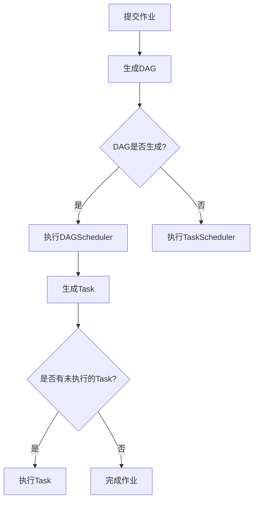
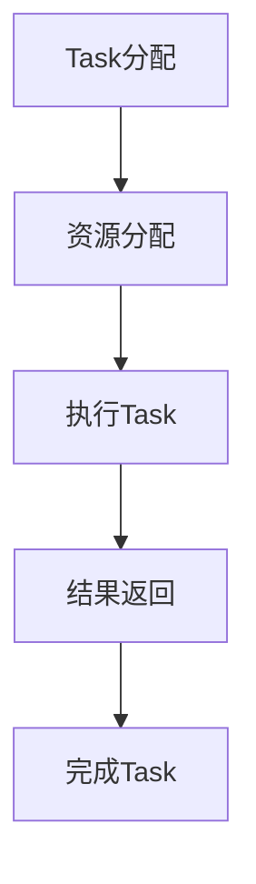
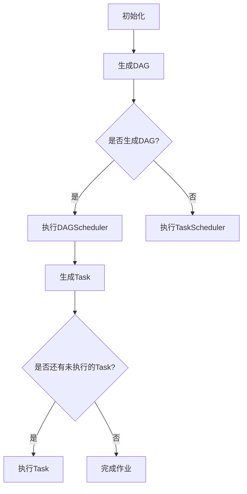

                 

# Spark Task原理与代码实例讲解

> 关键词：Spark, Task, 原理, 代码实例, 数据流模型, Shuffle操作, 任务调度算法

> 摘要：本文深入解析了Spark中Task的原理及其在代码实例中的应用。通过详细讲解Spark的基本概念、Task的执行流程、调度策略以及核心算法，读者可以更好地理解Spark的运行机制，并通过实际案例学习如何进行Spark任务的开发与优化。

## 第一部分：Spark Task基础知识

### 1.1 Spark概述

#### 1.1.1 Spark的基本概念

Spark是一个开源的大规模数据处理框架，它提供了高效、灵活且可扩展的数据处理能力。Spark基于内存计算，可以显著提高数据处理速度。Spark的主要组件包括：

- **Spark Core**：提供基本的计算能力和任务调度机制。
- **Spark SQL**：用于处理结构化数据，提供类似SQL的查询能力。
- **Spark Streaming**：提供实时流数据处理能力。
- **MLlib**：提供了一系列机器学习算法和工具。

#### 1.1.2 Spark的核心组件

- **Driver Program**：负责解析用户提交的Spark应用程序，生成任务依赖关系图（DAG），并将其分解为可并行执行的Task。
- **Cluster Manager**：负责在集群中分配资源，例如YARN、Mesos或Standalone。
- **Task Scheduler**：根据集群资源情况，调度任务执行。
- **Executor**：在集群节点上运行，负责执行分配给它的Task，并管理内存和资源。

#### 1.1.3 Spark的架构

Spark的架构设计使其能够高效地处理大规模数据集。其主要组成部分如下：

1. **Driver**：负责构建DAG、生成Task和向Executor发送任务。
2. **Executor**：执行Task，并将结果返回给Driver。
3. **Cluster Manager**：负责资源的分配和回收。
4. **Shuffle Manager**：负责Shuffle操作的数据传输和存储。

### 1.2 Spark Task原理

#### 1.2.1 Task的定义与类型

在Spark中，Task是指可以并行执行的单元。根据任务执行的依赖关系，Task可以分为以下几种类型：

- **Root Task**：没有依赖的Task，通常是作业的起点。
- **Leaf Task**：没有后续依赖的Task，通常是作业的终点。
- **Intermediate Task**：有依赖关系的Task，介于Root Task和Leaf Task之间。

#### 1.2.2 Task的执行流程

Task的执行流程可以分为以下几个步骤：

1. **生成Task**：Driver根据DAG生成Task。
2. **调度Task**：Task Scheduler根据资源情况调度Task。
3. **执行Task**：Executor在分配到的资源上执行Task。
4. **收集结果**：Executor将执行结果返回给Driver。

#### 1.2.3 Task调度策略

Spark支持多种Task调度策略，包括：

- **FIFO调度算法**：按照提交顺序调度Task。
- **随机调度算法**：随机选择未执行的Task进行调度。
- **最小作业优先调度算法**：优先调度作业任务数最少的作业。

### 1.3 Mermaid流程图展示

下面是Spark作业执行流程和Task执行流程的Mermaid流程图：

#### 1.3.1 Spark作业执行流程



#### 1.3.2 Task执行流程



### 1.4 核心概念与联系

#### 1.4.1 DAGScheduler与TaskScheduler

- **DAGScheduler**：负责将DAG分解为多个Stage，每个Stage包含一组相互独立的Task。
- **TaskScheduler**：负责将Stage中的Task分配给Executor执行。

#### 1.4.2 面向任务编程的API设计

Spark提供了面向任务的编程接口，使得开发者可以方便地定义Task和任务依赖关系，从而实现分布式数据处理。

## 第二部分：Spark Task核心算法原理

### 2.1 数据流模型与Shuffle操作

#### 2.1.1 数据流模型

Spark的数据流模型基于弹性分布式数据集（RDD），RDD是一种不可变、可分区、可并行操作的数据集合。RDD可以通过两种方式创建：

1. **从外部存储系统中读取数据**：如HDFS、HBase等。
2. **通过其他RDD转换生成**：如map、reduce、filter等。

#### 2.1.2 Shuffle操作原理

Shuffle操作是Spark中一种重要的数据传输和处理方式。当多个Task之间需要交换数据时，Spark会触发Shuffle操作。Shuffle操作的主要过程如下：

1. **分区**：将输入数据按照分区策略（如Hash分区）划分到不同的分区中。
2. **写入**：每个Task将处理结果写入本地磁盘，形成一个分区文件。
3. **合并**：Driver程序将各分区文件通过网络传输到其他Task所在节点，并进行合并。

#### 2.1.3 Shuffle操作优化

Shuffle操作的性能对整个Spark作业的影响很大，以下是一些优化策略：

1. **分区策略优化**：选择合适的分区策略，如减小分区数量，避免过多的数据传输。
2. **数据压缩**：在数据传输过程中进行压缩，减少网络开销。
3. **缓存中间结果**：将Shuffle操作产生的中间结果缓存起来，避免重复计算。

### 2.2 任务调度算法

#### 2.2.1 FIFO调度算法

FIFO调度算法按照Task提交的顺序进行调度，这是Spark默认的调度策略。虽然简单易实现，但可能会因为某些任务的依赖关系而导致资源浪费。

#### 2.2.2 随机调度算法

随机调度算法随机选择未执行的Task进行调度，以避免某些任务的长时间等待。但这种方法可能导致资源分配不均衡。

#### 2.2.3 最小作业优先调度算法

最小作业优先调度算法优先调度任务数最少的作业，以减少作业的总执行时间。这种方法适用于具有多个作业的场景。

### 2.3 伪代码讲解

以下是一个简单的伪代码，用于说明Spark作业的执行过程：



### 2.4 数学模型与公式

#### 2.4.1 数据压缩算法

数据压缩算法可以通过减少数据体积来提高传输速度。常用的压缩算法有：

1. **LZ4**：快速压缩算法，适合大数据量场景。
2. **Snappy**：适合内存密集型应用，压缩速度较快。

压缩比（Compression Ratio）的公式如下：

$$
CR = \frac{原始数据大小}{压缩后数据大小}
$$

#### 2.4.2 任务调度性能评估指标

任务调度性能评估指标包括：

1. **作业完成时间**（Job Completion Time）：从作业提交到完成的总时间。
2. **平均响应时间**（Average Response Time）：作业中所有Task的平均响应时间。
3. **资源利用率**（Resource Utilization）：集群资源的平均利用率。

## 第三部分：Spark Task代码实例

### 3.1 实际案例1：WordCount

#### 3.1.1 开发环境搭建

搭建WordCount开发环境需要安装以下软件：

- Spark：版本2.4.8
- Java：版本1.8
- Maven：版本3.6.3

#### 3.1.2 源代码实现

WordCount的源代码如下：

```java
import org.apache.spark.api.java.JavaPairRDD;
import org.apache.spark.api.java.JavaRDD;
import org.apache.spark.api.java.function.FlatMapFunction;
import org.apache.spark.api.java.function.PairFunction;
import scala.Tuple2;

public class WordCount {
    public static void main(String[] args) {
        // 创建SparkContext和SparkSession
        SparkContext sc = new SparkContext("local[2]", "WordCount");
        JavaSparkSession spark = JavaSparkSession.builder().config("spark.master", "local[2]").getOrCreate();

        // 加载输入数据
        JavaRDD<String> input = spark.read().textFile("input.txt").javaRDD();

        // 分词
        JavaRDD<String> words = input.flatMap(new FlatMapFunction<String, String>() {
            @Override
            public Iterable<String> call(String line) throws Exception {
                return Arrays.asList(line.split(" "));
            }
        });

        // 计数
        JavaPairRDD<String, Integer> counts = words.mapToPair(new PairFunction<String, String, Integer>() {
            @Override
            public Tuple2<String, Integer> call(String word) throws Exception {
                return new Tuple2<>(word, 1);
            }
        }).reduceByKey(new IntegerFunction<Integer>() {
            @Override
            public Integer call(Integer v1, Integer v2) {
                return v1 + v2;
            }
        });

        // 输出结果
        counts.saveAsTextFile("output");

        // 关闭SparkSession和SparkContext
        spark.stop();
        sc.stop();
    }
}
```

#### 3.1.3 代码解读与分析

1. **SparkContext和SparkSession创建**：创建SparkContext和SparkSession是进行Spark操作的基础。
2. **加载输入数据**：使用`textFile`方法加载输入数据。
3. **分词**：使用`flatMap`函数将文本拆分为单词。
4. **计数**：使用`mapToPair`和`reduceByKey`函数计算单词出现次数。
5. **输出结果**：使用`saveAsTextFile`方法将结果保存到文件。

### 3.2 实际案例2：PageRank

#### 3.2.1 开发环境搭建

搭建PageRank开发环境需要安装以下软件：

- Spark：版本2.4.8
- Java：版本1.8
- Maven：版本3.6.3

#### 3.2.2 源代码实现

PageRank的源代码如下：

```java
import org.apache.spark.api.java.JavaPairRDD;
import org.apache.spark.api.java.function.Function2;
import org.apache.spark.api.java.function.PairFunction;
import scala.Tuple2;

public class PageRank {
    public static void main(String[] args) {
        // 创建SparkContext和SparkSession
        SparkContext sc = new SparkContext("local[2]", "PageRank");
        JavaSparkSession spark = JavaSparkSession.builder().config("spark.master", "local[2]").getOrCreate();

        // 加载输入数据
        JavaPairRDD<String, Iterable<String>> links = spark.read().textFile("links.txt")
                .flatMapToPair(line -> {
                    String[] parts = line.split(" ");
                    String node = parts[0];
                    List<Tuple2<String, String>> edges = new ArrayList<>();
                    for (int i = 1; i < parts.length; i++) {
                        edges.add(new Tuple2<>(parts[i], node));
                    }
                    return edges.iterator();
                }).groupByKey().toJavaPairRDD();

        // 初始化PageRank值
        JavaPairRDD<String, Double> ranks = links.mapValues(v -> 1.0 / v.size());

        // 迭代计算PageRank值
        for (int iter = 0; iter < 10; iter++) {
            JavaPairRDD<String, Double> newRanks = links.join(ranks).values()
                    .mapToPair(t -> {
                        double sum = 0.0;
                        for (String neighbor : t._2) {
                            double rank = ranks.collect().get(neighbor);
                            sum += rank / links.count();
                        }
                        return new Tuple2<>(t._1, sum * 0.85 + 0.15);
                    });
            ranks = newRanks;
        }

        // 输出结果
        ranks.saveAsTextFile("output");

        // 关闭SparkSession和SparkContext
        spark.stop();
        sc.stop();
    }
}
```

#### 3.2.3 代码解读与分析

1. **SparkContext和SparkSession创建**：创建SparkContext和SparkSession是进行Spark操作的基础。
2. **加载输入数据**：使用`textFile`方法加载输入数据。
3. **链接计算**：使用`flatMapToPair`和`groupByKey`函数计算节点之间的链接。
4. **初始化PageRank值**：为每个节点分配初始PageRank值。
5. **迭代计算PageRank值**：使用迭代方法计算PageRank值，直到收敛。
6. **输出结果**：使用`saveAsTextFile`方法将结果保存到文件。

### 3.3 实际案例3：MLlib应用

#### 3.3.1 开发环境搭建

搭建MLlib应用开发环境需要安装以下软件：

- Spark：版本2.4.8
- Java：版本1.8
- Maven：版本3.6.3

#### 3.3.2 源代码实现

MLlib应用示例：线性回归模型

```java
import org.apache.spark.api.java.JavaRDD;
import org.apache.spark.api.java.function.Function2;
import org.apache.spark.mllib.regression.LabeledPoint;
import org.apache.spark.mllib.regression.LinearRegressionWithSGD;
import org.apache.spark.mllib.util.MLUtils;

public class LinearRegressionWithSGDExample {
    public static void main(String[] args) {
        // 创建SparkContext和SparkSession
        SparkContext sc = new SparkContext("local[2]", "LinearRegressionExample");
        JavaSparkSession spark = JavaSparkSession.builder().config("spark.master", "local[2]").getOrCreate();

        // 加载数据集
        JavaRDD<LabeledPoint> dataset = MLUtils.loadLibSVMFile(sc, "data.txt").toJavaRDD();

        // 设置参数
        int numIterations = 100;
        double regParam = 0.01;
        double stepSize = 0.1;

        // 训练模型
        LinearRegressionWithSGD model = LinearRegressionWithSGD.train(dataset, numIterations, regParam, stepSize);

        // 输出模型参数
        System.out.println("Coefficients: " + model.coefficients());
        System.out.println("Intercept: " + model.intercept());

        // 关闭SparkSession和SparkContext
        spark.stop();
        sc.stop();
    }
}
```

#### 3.3.3 代码解读与分析

1. **SparkContext和SparkSession创建**：创建SparkContext和SparkSession是进行Spark操作的基础。
2. **加载数据集**：使用MLlib工具加载LibSVM格式的数据集。
3. **设置参数**：设置训练模型的参数，如迭代次数、正则化参数和步长。
4. **训练模型**：使用`LinearRegressionWithSGD`类训练线性回归模型。
5. **输出结果**：输出模型参数。

## 附录

### 附录A：Spark工具与资源

#### A.1 Spark安装与配置

1. 下载Spark：前往[Spark官网](https://spark.apache.org/downloads.html)下载适合版本的Spark。
2. 解压安装：解压下载的Spark包到指定目录。
3. 配置环境变量：设置`SPARK_HOME`和`PATH`环境变量。

#### A.2 Spark常用命令

- `spark-shell`：启动Spark Shell。
- `spark-submit`：提交Spark作业。
- `spark-submit --help`：查看提交Spark作业的命令行参数。

#### A.3 Spark社区与资源

- [Spark官方文档](https://spark.apache.org/docs/latest/)
- [Spark社区](https://spark.apache.org/community.html)
- [Stack Overflow上的Spark标签](https://stackoverflow.com/questions/tagged/spark)

## 作者

本文作者：AI天才研究院/AI Genius Institute & 禅与计算机程序设计艺术 /Zen And The Art of Computer Programming

（注：本文内容仅供参考，实际使用时请根据具体情况进行调整。）

