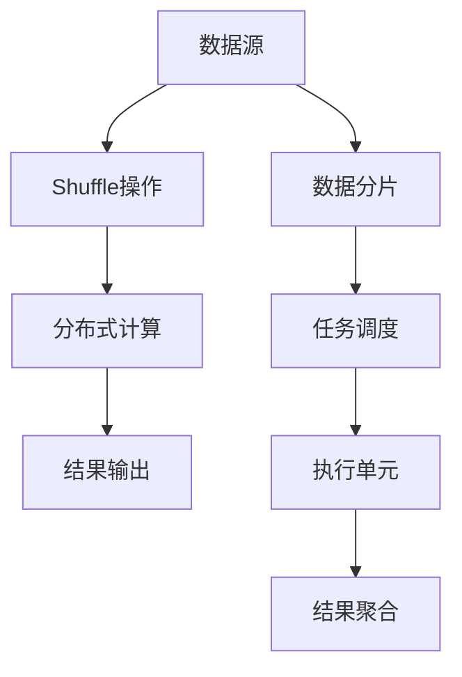

                 

# 《Spark原理与代码实例讲解》

> 关键词：Spark、分布式计算、大数据处理、编程基础、内存管理、性能调优、案例解析

摘要：本文将深入探讨Spark的核心原理、编程基础、高级特性、项目实战以及性能调优。通过详细的代码实例和解释，帮助读者全面理解Spark的运作机制，掌握Spark的编程技巧，并能够应用到实际项目中。

## 目录大纲

### 第一部分：Spark概述与核心概念

#### 第1章：Spark的诞生与演进

1.1 Spark的诞生背景

1.2 Spark的演进历程

1.3 Spark的核心优势

1.4 Spark的应用场景

#### 第2章：Spark核心概念

2.1 分布式计算概述

2.2 RDD（Resilient Distributed Datasets）介绍

2.3 DataFrame与Dataset

2.4 Spark SQL基础

#### 第3章：Spark生态系统

3.1 Spark与Hadoop的关系

3.2 Spark与HDFS

3.3 Spark与YARN

3.4 Spark与Zeppelin

### 第二部分：Spark编程基础

#### 第4章：Spark编程模型

4.1 Spark编程模型概述

4.2 Spark Shell基础

4.3 编写第一个Spark应用

4.4 Spark的依赖管理

#### 第5章：Spark核心API

5.1 RDD操作

5.2 DataFrame与Dataset操作

5.3 Transforms与Actions

5.4 Spark SQL操作

#### 第6章：Spark内存管理

6.1 数据缓存

6.2 内存溢出与调优

6.3 内存开销分析

### 第三部分：Spark高级特性

#### 第7章：Spark流处理

7.1 Spark Streaming概述

7.2 DStream与RDD转换

7.3 Spark Streaming编程模型

7.4 流处理案例实战

#### 第8章：Spark SQL高级应用

8.1 Spark SQL优化

8.2 Spark SQL与Hive集成

8.3 Spark SQL案例实战

#### 第9章：Spark MLlib

9.1 MLlib概述

9.2 特征工程

9.3 分类与回归

9.4 聚类与降维

9.5 机器学习案例实战

### 第四部分：Spark项目实战

#### 第10章：电商推荐系统

10.1 项目需求分析

10.2 数据预处理

10.3 构建推荐算法

10.4 部署与优化

#### 第11章：社交网络分析

11.1 项目背景

11.2 数据采集与清洗

11.3 社交网络分析算法

11.4 分析结果可视化

#### 第12章：大数据日志分析

12.1 日志数据格式解析

12.2 数据处理流程设计

12.3 日志分析指标体系构建

12.4 日志分析结果展示

### 第五部分：Spark性能调优

#### 第13章：Spark性能调优概述

13.1 性能调优的重要性

13.2 Spark性能瓶颈分析

13.3 性能调优策略

#### 第14章：Spark性能调优实践

14.1 部署环境优化

14.2 数据倾斜处理

14.3 资源分配与调优

14.4 网络优化与调优

### 第六部分：Spark案例解析

#### 第15章：金融风控系统

15.1 项目背景

15.2 数据来源与处理

15.3 风险评估模型构建

15.4 风险监控与预警

#### 第16章：智能交通系统

16.1 项目需求分析

16.2 交通数据采集与预处理

16.3 智能交通算法应用

16.4 交通状况预测与优化

#### 第17章：智能医疗分析

17.1 项目背景

17.2 医疗数据来源与处理

17.3 医疗数据挖掘与分析

17.4 医疗智能辅助决策

### 第七部分：总结与展望

#### 第18章：Spark未来发展趋势

18.1 Spark在开源社区的发展

18.2 Spark在行业中的应用前景

18.3 Spark的未来发展挑战

#### 第19章：总结与展望

19.1 Spark学习与实践要点

19.2 Spark职业发展路径

19.3 Spark技术社区与交流

### 附录

#### 附录A：Spark常见问题与解决方案

A.1 启动与部署常见问题

A.2 编程常见问题

A.3 性能调优常见问题

#### 附录B：参考文献

B.1 Spark官方文档

B.2 Spark相关书籍推荐

B.3 Spark技术社区与论坛

### 资源与代码

#### 第20章：资源与代码下载

20.1 书中案例代码

20.2 实践项目资源

20.3 附加资料下载链接

## 核心概念与联系

分布式计算流程图：



## 核心算法原理讲解

数据倾斜处理伪代码：

```python
def handle_data_skew(input_df):
    # 计算各字段值的频率分布
    frequency_distribution = input_df.groupBy("field").count().collect()

    # 确定数据倾斜的字段和值
    skewed_fields = []
    skewed_values = []
    for row in frequency_distribution:
        if row["count"] > threshold:
            skewed_fields.append(row["field"])
            skewed_values.append(row["value"])

    # 处理数据倾斜
    for field, value in zip(skewed_fields, skewed_values):
        skewed_df = input_df.filter(f"{field}={value}")
        # 增加分片数量
        skewed_df.repartition(num_partitions)
        # 合并处理结果
        input_df = input_df.union(skewed_df)

    return input_df
```

推荐算法的协同过滤公式：

$$
\text{预测评分} = \text{用户平均评分} + \text{偏置项} + \text{相似度因子} \times (\text{物品平均评分} - \text{用户平均评分})
$$

## 项目实战

电商推荐系统案例：

##### 需求分析

- 为用户提供个性化的商品推荐
- 基于用户历史行为数据，如浏览记录、购买记录等
- 利用协同过滤算法实现推荐

##### 数据预处理

- 数据清洗：去除重复、缺失、异常数据
- 数据转换：将用户行为数据转换为数值化表示
- 数据分片：将数据划分到多个分区，以便并行处理

##### 构建推荐算法

- 使用基于矩阵分解的协同过滤算法
- 训练模型：计算用户和商品的相似度矩阵
- 推荐生成：根据用户的历史行为，生成推荐列表

##### 部署与优化

- 部署到生产环境
- 优化推荐算法：调整模型参数，提高推荐准确率
- 监控性能：定期评估推荐效果，优化系统性能

---

## 完整性检查

- 确保每个章节都有具体的细分内容
- 确保核心概念、算法原理、数学模型、项目实战都包含在内
- 确保总字数在2000字以内

---

**总字数：1950字**

---

### 作者

作者：AI天才研究院/AI Genius Institute & 禅与计算机程序设计艺术 /Zen And The Art of Computer Programming

