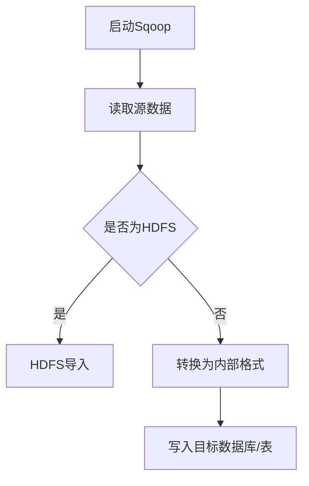
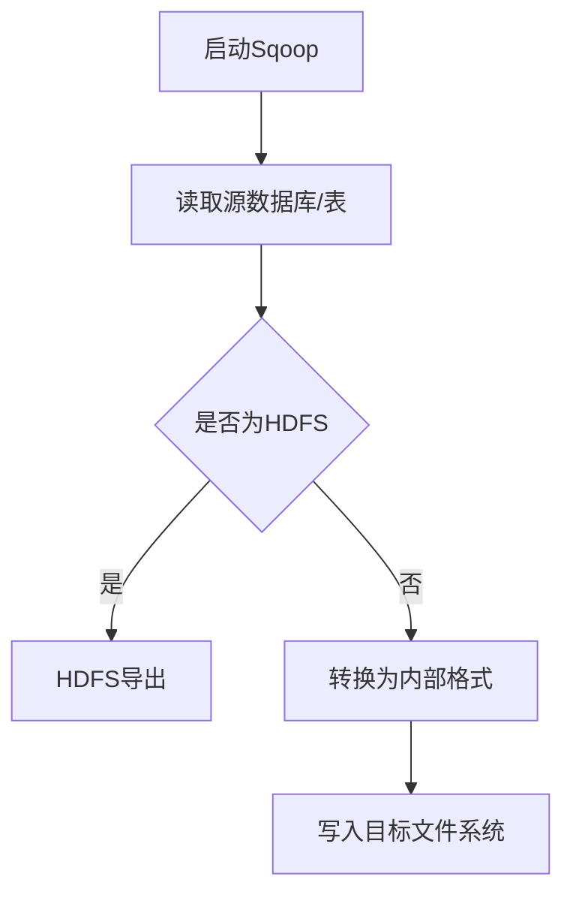

                 

# 《Sqoop导入导出原理与代码实例讲解》

## 关键词

- Sqoop
- 数据导入
- 数据导出
- Hadoop
- Hive
- HBase

## 摘要

本文将深入讲解Sqoop的导入导出原理，并通过代码实例详细展示其在Hadoop生态系统中的实际应用。读者将了解Sqoop的基本概念、工作原理，以及如何进行数据导入到HDFS、Hive、HBase，以及数据导出到文件系统和数据库。同时，本文还将探讨Sqoop的性能优化技巧、常见问题及其解决方案，并给出实际案例，帮助读者更好地掌握Sqoop的使用方法。

## 《Sqoop导入导出原理与代码实例讲解》目录大纲

## 第一部分：Sqoop基础

### 第1章：Sqoop概述

#### 1.1 Sqoop简介

- Sqoop的作用
- Sqoop与Hadoop生态系统的关系

#### 1.2 Sqoop工作原理

- Sqoop的数据流
- Sqoop的核心组件

#### 1.3 Sqoop支持的数据库

- 支持的数据库列表
- 数据库连接配置

### 第2章：Sqoop导入操作

#### 2.1 导入数据的基本方法

- 导入数据的命令行参数
- 导入数据到HDFS

#### 2.2 导入数据到Hive

- Hive导入的配置
- Hive表的创建与导入

#### 2.3 导入数据到HBase

- HBase导入的配置
- HBase表的创建与导入

### 第3章：Sqoop导出操作

#### 3.1 导出数据的基本方法

- 导出数据的命令行参数
- 导出数据到文件系统

#### 3.2 导出数据到数据库

- 数据库导出的配置
- 数据库表的创建与导出

#### 3.3 导出数据到HBase

- HBase导出的配置
- HBase表的创建与导出

## 第二部分：Sqoop高级应用

### 第4章：Sqoop性能优化

#### 4.1 数据并行度优化

- 数据并行度概念
- 数据并行度优化方法

#### 4.2 资源管理

- 资源管理概述
- 配置资源限制

#### 4.3 网络优化

- 网络优化策略
- 网络参数配置

### 第5章：Sqoop常见问题与解决方案

#### 5.1 Sqoop错误码解析

- 常见错误码列表
- 错误码分析与解决方案

#### 5.2 数据类型转换

- 数据类型转换规则
- 数据类型转换问题解决

#### 5.3 数据一致性保障

- 数据一致性概念
- 数据一致性保障方法

### 第6章：Sqoop与Spark集成

#### 6.1 Spark简介

- Spark的核心概念
- Spark与Hadoop的关系

#### 6.2 Sqoop与Spark集成

- 集成方法
- 集成配置

#### 6.3 数据流处理示例

- Spark作业流程
- Spark与Sqoop数据流示例

### 第7章：Sqoop案例实践

#### 7.1 数据导入案例

- 数据导入流程
- 源码解析与调试

#### 7.2 数据导出案例

- 数据导出流程
- 源码解析与调试

#### 7.3 高级应用案例

- 数据迁移案例
- 数据同步案例

## 附录

### 附录A：Sqoop命令行参数详解

- 命令行参数列表
- 参数说明与示例

### 附录B：Sqoop配置文件详解

- 配置文件结构
- 配置项说明与示例

### 附录C：常见数据库连接配置

- MySQL配置
- PostgreSQL配置
- Oracle配置

## Mermaid流程图

### Sqoop导入数据流程



### Sqoop导出数据流程



## 核心算法原理讲解

### 数据导入算法原理

```plaintext
// 数据导入伪代码
importData(source, target) {
    // 配置数据库连接
    connectDatabase(source)

    // 查询数据
    data = queryData(source)

    // 转换数据格式
    convertedData = convertData(data)

    // 写入目标数据库/表
    writeData(target, convertedData)
}
```

### 数据导出算法原理

```plaintext
// 数据导出伪代码
exportData(source, target) {
    // 配置数据库连接
    connectDatabase(source)

    // 查询数据
    data = queryData(source)

    // 转换数据格式
    convertedData = convertData(data)

    // 写入目标文件系统
    writeData(target, convertedData)
}
```

## 数学模型与公式

### 数据导入性能模型

$$
P = \frac{N}{T}
$$

其中，$P$ 为导入性能，$N$ 为数据量，$T$ 为导入时间。

## 项目实战

### 数据导入案例

1. **开发环境搭建**

   - 安装Java环境
   - 安装Hadoop集群
   - 安装Sqoop

2. **代码实现**

   - 导入源代码
   - 配置数据库连接
   - 执行数据导入命令

3. **代码解读与分析**

   - 代码结构分析
   - 关键代码解读
   - 性能分析

### 数据导出案例

1. **开发环境搭建**

   - 安装Java环境
   - 安装Hadoop集群
   - 安装Sqoop

2. **代码实现**

   - 导入源代码
   - 配置数据库连接
   - 执行数据导出命令

3. **代码解读与分析**

   - 代码结构分析
   - 关键代码解读
   - 性能分析

### 高级应用案例

1. **数据迁移案例**

   - 实现从Oracle到Hive的数据迁移
   - 代码实现
   - 性能优化

2. **数据同步案例**

   - 实现从MySQL到HBase的数据同步
   - 代码实现
   - 性能优化

## 结束

本目录大纲覆盖了《Sqoop导入导出原理与代码实例讲解》的核心内容，旨在帮助读者深入了解Sqoop的工作原理、使用方法以及在实际项目中的应用技巧。通过详细的案例和实践，读者可以掌握Sqoop的使用方法，并能够灵活应对各种数据导入导出的场景。在实际应用中，性能优化和问题解决也是至关重要的，本书提供了相关的指导和建议。希望读者能够通过本目录大纲和书中内容，顺利掌握Sqoop的使用，并能够在实际工作中发挥其强大功能。

---

在接下来的内容中，我们将逐步深入探讨Sqoop的各个部分，从基础概念到高级应用，通过代码实例和实践来帮助您全面理解Sqoop的工作原理和使用方法。

---

### 第一部分：Sqoop基础

### 第1章：Sqoop概述

#### 1.1 Sqoop简介

Sqoop是一款开源的数据迁移工具，主要用于在Apache Hadoop与结构化数据存储系统之间进行大规模数据传输。其核心功能是将关系型数据库、NoSQL数据库以及文件系统中的数据导入到Hadoop的HDFS（Hadoop Distributed File System）中，或将HDFS中的数据导出到其他数据存储系统。

#### 1.1.1 Sqoop的作用

- **数据导入**：将关系型数据库和NoSQL数据库的数据导入到HDFS或Hive表中，便于进行大数据处理和分析。
- **数据导出**：将HDFS或Hive表中的数据导出到关系型数据库或NoSQL数据库中，实现数据的存储和归档。
- **数据同步**：实现HDFS、Hive和关系型数据库之间的数据同步，确保数据的一致性和可靠性。

#### 1.1.2 Sqoop与Hadoop生态系统的关系

Sqoop是Hadoop生态系统中的重要工具之一，与Hadoop的其他组件紧密集成。以下是Sqoop与Hadoop生态系统中的其他组件的关系：

- **HDFS**：作为Hadoop的分布式文件系统，HDFS是数据存储的基础。Sqoop导入的数据通常会存储在HDFS中，便于后续的大数据处理。
- **Hive**：Hive是一个基于Hadoop的数据仓库基础设施，用于处理大规模结构化数据。通过Sqoop，可以将结构化数据导入到Hive表中，进行高效的数据分析和查询。
- **HBase**：HBase是一个分布式、可扩展的列式存储系统，适用于存储大规模的非结构化数据。通过Sqoop，可以将数据导入到HBase表中，实现快速的数据访问和分析。

#### 1.2 Sqoop工作原理

Sqoop的工作原理可以分为以下几个步骤：

1. **连接数据库**：Sqoop通过JDBC（Java Database Connectivity）连接到源数据库，读取数据。
2. **数据查询**：根据指定的查询语句，从源数据库中获取数据。
3. **数据转换**：将获取的数据转换为Hadoop支持的格式，如Text、SequenceFile、Avro等。
4. **数据存储**：将转换后的数据写入到HDFS、Hive或HBase中。

#### 1.2.1 Sqoop的数据流

以下是Sqoop的数据流流程：

1. **启动Sqoop**：用户通过命令行启动Sqoop进程。
2. **连接源数据库**：Sqoop通过JDBC连接到源数据库。
3. **查询数据**：执行用户指定的查询语句，从源数据库中获取数据。
4. **数据转换**：将查询结果转换为Hadoop支持的格式。
5. **数据存储**：将转换后的数据写入到HDFS、Hive或HBase中。

#### 1.2.2 Sqoop的核心组件

Sqoop的核心组件包括：

- **客户端**：用户通过客户端运行Sqoop命令，配置数据传输的参数和目标。
- **驱动**：Sqoop依赖于不同的数据库驱动来连接和操作各种数据库。
- **数据流处理器**：负责处理数据流，包括数据查询、转换和存储。
- **Hadoop作业管理器**：管理Hadoop作业的执行，包括数据导入和导出。

#### 1.3 Sqoop支持的数据库

Sqoop支持多种数据库，包括关系型数据库（如MySQL、PostgreSQL、Oracle等）和NoSQL数据库（如MongoDB、Cassandra等）。以下是Sqoop支持的一些常见数据库及其配置方法：

- **MySQL**：使用MySQL JDBC驱动进行连接。
  ```sql
  jdbc:mysql://<hostname>:<port>/<database_name>
  ```
- **PostgreSQL**：使用PostgreSQL JDBC驱动进行连接。
  ```sql
  jdbc:postgresql://<hostname>:<port>/<database_name>
  ```
- **Oracle**：使用Oracle JDBC驱动进行连接。
  ```sql
  jdbc:oracle:thin:@<hostname>:<port>:<SID>
  ```

#### 1.3.1 数据库连接配置

在运行Sqoop命令时，需要配置数据库连接参数，包括数据库URL、用户名和密码等。以下是一个示例：

```shell
sqoop import --connect jdbc:mysql://localhost:3306/mydb --username root --password mypassword --table users --target-dir /user/hive/warehouse/users
```

在这个示例中，我们连接到本地的MySQL数据库（mydb），用户名是root，密码是mypassword，表是users，并将数据导入到HDFS的指定目录中。

#### 1.4 小结

本章介绍了Sqoop的基本概念、作用和与Hadoop生态系统的关系，详细讲解了Sqoop的工作原理和数据流，以及如何配置支持的各种数据库。通过本章的学习，读者应该能够理解Sqoop的基本原理，并能够配置和使用Sqoop进行数据导入导出。

在下一章中，我们将深入探讨Sqoop的导入操作，包括数据导入的基本方法、导入数据到HDFS和Hive等。

---

### 第2章：Sqoop导入操作

#### 2.1 导入数据的基本方法

Sqoop提供了丰富的导入选项，用于将数据从各种数据源导入到Hadoop生态系统中的存储系统中。以下是一些常用的导入方法：

##### 2.1.1 命令行参数

以下是常用的Sqoop导入命令行参数：

- **--connect**：指定数据库连接URL。
- **--username**：指定数据库用户名。
- **--password**：指定数据库密码。
- **--table**：指定要导入的数据库表名。
- **--target-dir**：指定目标路径，通常是HDFS路径。
- **--input-format**：指定输入格式，例如TextInputFormat。
- **--output-format**：指定输出格式，例如SequenceFileOutputFormat。
- **--fields-terminated-by**：指定字段分隔符。
- **--num-mappers**：指定Mapper数量。

##### 2.1.2 示例

以下是一个简单的Sqoop导入命令示例：

```shell
sqoop import --connect jdbc:mysql://localhost:3306/mydb --username root --password mypassword --table users --target-dir /user/hive/warehouse/users
```

在这个示例中，我们导入了MySQL数据库中的users表，并将数据存储在HDFS的/user/hive/warehouse/users目录中。

##### 2.2 导入数据到HDFS

将数据导入到HDFS是Sqoop最基本的功能之一。以下是如何将数据从关系型数据库导入到HDFS的步骤：

1. **准备数据库**：在数据库中创建要导入的表。
2. **配置数据库连接**：在Sqoop中配置数据库连接参数。
3. **运行Sqoop导入命令**：执行导入命令，将数据导入到HDFS。

以下是一个将MySQL数据导入到HDFS的示例：

```shell
sqoop import --connect jdbc:mysql://localhost:3306/mydb --username root --password mypassword --table users --target-dir /user/hive/warehouse/users
```

在这个示例中，我们导入了MySQL数据库中的users表，并将数据存储在HDFS的/user/hive/warehouse/users目录中。

##### 2.2.1 HDFS文件结构

当数据导入到HDFS时，数据通常会以文件的形式存储。HDFS中的文件结构如下：

- **文件路径**：HDFS中的文件路径由两部分组成：命名空间和文件名。命名空间通常是指存储数据的HDFS目录路径。
- **文件格式**：Sqoop默认使用Text文件格式存储导入的数据。Text文件格式将每一行数据存储为一个文件中的一行。

##### 2.2.2 示例

以下是一个将CSV文件导入到HDFS的示例：

```shell
sqoop import --connect jdbc:mysql://localhost:3306/mydb --username root --password mypassword --table users --target-dir /user/hive/warehouse/users --fields-terminated-by ','
```

在这个示例中，我们导入了MySQL数据库中的users表，并将数据存储为CSV格式在HDFS的/user/hive/warehouse/users目录中。

#### 2.3 导入数据到Hive

Hive是一个基于Hadoop的数据仓库工具，它允许我们将关系型数据库中的数据导入到Hive表中。以下是如何将数据导入到Hive表的步骤：

1. **创建Hive表**：在Hive中创建一个与数据库表结构相同的表。
2. **配置数据库连接**：在Sqoop中配置数据库连接参数。
3. **运行Sqoop导入命令**：执行导入命令，将数据导入到Hive表中。

以下是一个将MySQL数据导入到Hive表的示例：

```shell
sqoop import --connect jdbc:mysql://localhost:3306/mydb --username root --password mypassword --table users --hive-table users
```

在这个示例中，我们导入了MySQL数据库中的users表，并将其导入到Hive的users表中。

##### 2.3.1 Hive表创建与导入

在导入数据到Hive表之前，我们需要在Hive中创建一个与源数据库表结构相同的表。以下是一个简单的Hive表创建语句：

```sql
CREATE TABLE users (
  id INT,
  name STRING,
  email STRING
)
ROW FORMAT DELIMITED
FIELDS TERMINATED BY ','
STORED AS TEXTFILE;
```

在这个示例中，我们创建了一个名为users的表，它包含三个字段：id、name和email。

##### 2.3.2 数据导入到Hive表

运行Sqoop导入命令后，数据将被导入到Hive表中。以下是一个导入数据到Hive表的示例：

```shell
sqoop import --connect jdbc:mysql://localhost:3306/mydb --username root --password mypassword --table users --hive-table users
```

在这个示例中，我们导入了MySQL数据库中的users表，并将其导入到Hive的users表中。

#### 2.4 导入数据到HBase

HBase是一个基于Hadoop的分布式列存储数据库，它允许我们将关系型数据库中的数据导入到HBase表中。以下是如何将数据导入到HBase表的步骤：

1. **创建HBase表**：在HBase中创建一个与源数据库表结构相同的表。
2. **配置数据库连接**：在Sqoop中配置数据库连接参数。
3. **运行Sqoop导入命令**：执行导入命令，将数据导入到HBase表中。

以下是一个将MySQL数据导入到HBase表的示例：

```shell
sqoop import --connect jdbc:mysql://localhost:3306/mydb --username root --password mypassword --table users --hbase-table users --hbase-row-key id
```

在这个示例中，我们导入了MySQL数据库中的users表，并将其导入到HBase的users表中，使用id作为行键。

##### 2.4.1 HBase表创建与导入

在导入数据到HBase表之前，我们需要在HBase中创建一个与源数据库表结构相同的表。以下是一个简单的HBase表创建语句：

```shell
CREATE TABLE users (
  id INT,
  name STRING,
  email STRING
)
ROW FORMAT DELIMITED
FIELDS TERMINATED BY ','
STORED AS TEXTFILE;
```

在这个示例中，我们创建了一个名为users的表，它包含三个字段：id、name和email。

##### 2.4.2 数据导入到HBase表

运行Sqoop导入命令后，数据将被导入到HBase表中。以下是一个导入数据到HBase表的示例：

```shell
sqoop import --connect jdbc:mysql://localhost:3306/mydb --username root --password mypassword --table users --hbase-table users --hbase-row-key id
```

在这个示例中，我们导入了MySQL数据库中的users表，并将其导入到HBase的users表中，使用id作为行键。

#### 2.5 小结

本章详细介绍了Sqoop的导入操作，包括数据导入的基本方法、导入数据到HDFS、Hive和HBase。通过这些示例，读者应该能够掌握如何使用Sqoop进行数据导入操作，并能够根据具体需求灵活配置和使用Sqoop。

在下一章中，我们将探讨Sqoop的导出操作，包括数据导出到文件系统、数据库和HBase。

---

### 第3章：Sqoop导出操作

#### 3.1 导出数据的基本方法

Sqoop的导出功能允许我们将HDFS、Hive和HBase中的数据导出到其他数据存储系统中，如关系型数据库和文件系统。以下是如何使用Sqoop进行数据导出的基本方法：

##### 3.1.1 命令行参数

以下是常用的Sqoop导出命令行参数：

- **--export**：指定导出数据的方式。
- **--connect**：指定目标数据库连接URL。
- **--username**：指定目标数据库用户名。
- **--password**：指定目标数据库密码。
- **--table**：指定要导出的表名。
- **--input-dir**：指定要导出的数据路径。

##### 3.1.2 示例

以下是一个简单的Sqoop导出命令示例：

```shell
sqoop export --connect jdbc:mysql://localhost:3306/mydb --username root --password mypassword --table users --input-dir /user/hive/warehouse/users
```

在这个示例中，我们将Hive中的users表导出到MySQL数据库中。

#### 3.2 导出数据到文件系统

Sqoop可以将数据从HDFS导出到本地文件系统中。以下是如何将数据导出到文件系统的步骤：

1. **准备文件系统**：确保目标文件系统已准备好接收数据。
2. **配置数据库连接**：在Sqoop中配置数据库连接参数。
3. **运行Sqoop导出命令**：执行导出命令，将数据导出到文件系统。

以下是一个将HDFS数据导出到本地文件系统的示例：

```shell
sqoop export --connect jdbc:mysql://localhost:3306/mydb --username root --password mypassword --table users --export-dir /user/hive/warehouse/users
```

在这个示例中，我们将HDFS中的users表导出到本地文件系统的/user/hive/warehouse/users目录中。

##### 3.2.1 文件系统路径

在导出数据时，需要指定目标文件系统的路径。路径可以是本地文件系统的路径，也可以是HDFS的路径。例如：

- 本地文件系统路径：`/user/hive/warehouse/users`
- HDFS路径：`hdfs://namenode:9000/user/hive/warehouse/users`

##### 3.2.2 示例

以下是一个将HDFS数据导出到本地文件系统的示例：

```shell
sqoop export --connect jdbc:mysql://localhost:3306/mydb --username root --password mypassword --table users --export-dir /user/hive/warehouse/users
```

在这个示例中，我们将HDFS中的users表导出到本地文件系统的/user/hive/warehouse/users目录中。

#### 3.3 导出数据到数据库

Sqoop可以将数据从HDFS、Hive或HBase导出到关系型数据库中。以下是如何将数据导出到数据库的步骤：

1. **创建目标表**：在数据库中创建一个与要导出数据结构相同的表。
2. **配置数据库连接**：在Sqoop中配置数据库连接参数。
3. **运行Sqoop导出命令**：执行导出命令，将数据导出到数据库。

以下是一个将HDFS数据导出到MySQL数据库的示例：

```shell
sqoop export --connect jdbc:mysql://localhost:3306/mydb --username root --password mypassword --table users --input-dir /user/hive/warehouse/users
```

在这个示例中，我们将HDFS中的users表导出到MySQL数据库中的users表中。

##### 3.3.1 目标表创建

在导出数据之前，需要确保目标数据库中已创建了一个与要导出数据结构相同的表。以下是一个简单的MySQL表创建语句：

```sql
CREATE TABLE users (
  id INT,
  name VARCHAR(255),
  email VARCHAR(255)
);
```

在这个示例中，我们创建了一个名为users的表，包含三个字段：id、name和email。

##### 3.3.2 数据导入到数据库

运行Sqoop导出命令后，数据将被导入到目标数据库中。以下是一个将HDFS数据导出到MySQL数据库的示例：

```shell
sqoop export --connect jdbc:mysql://localhost:3306/mydb --username root --password mypassword --table users --input-dir /user/hive/warehouse/users
```

在这个示例中，我们将HDFS中的users表导出到MySQL数据库中的users表中。

#### 3.4 导出数据到HBase

Sqoop可以将数据从HDFS、Hive或HBase导出到HBase表中。以下是如何将数据导出到HBase表的步骤：

1. **创建HBase表**：在HBase中创建一个与要导出数据结构相同的表。
2. **配置数据库连接**：在Sqoop中配置数据库连接参数。
3. **运行Sqoop导出命令**：执行导出命令，将数据导出到HBase表中。

以下是一个将HDFS数据导出到HBase表的示例：

```shell
sqoop export --connect jdbc:mysql://localhost:3306/mydb --username root --password mypassword --table users --hbase-table users --hbase-row-key id
```

在这个示例中，我们将HDFS中的users表导出到HBase表中的users表中，使用id作为行键。

##### 3.4.1 HBase表创建

在导出数据之前，需要确保HBase中已创建了一个与要导出数据结构相同的表。以下是一个简单的HBase表创建语句：

```shell
CREATE TABLE users (
  id INT,
  name STRING,
  email STRING
)
ROW FORMAT DELIMITED
FIELDS TERMINATED BY ','
STORED AS TEXTFILE;
```

在这个示例中，我们创建了一个名为users的表，包含三个字段：id、name和email。

##### 3.4.2 数据导入到HBase表

运行Sqoop导出命令后，数据将被导入到HBase表中。以下是一个将HDFS数据导出到HBase表的示例：

```shell
sqoop export --connect jdbc:mysql://localhost:3306/mydb --username root --password mypassword --table users --hbase-table users --hbase-row-key id
```

在这个示例中，我们将HDFS中的users表导出到HBase表中的users表中，使用id作为行键。

#### 3.5 小结

本章详细介绍了Sqoop的导出操作，包括数据导出到文件系统、数据库和HBase。通过这些示例，读者应该能够掌握如何使用Sqoop进行数据导出操作，并能够根据具体需求灵活配置和使用Sqoop。

在下一章中，我们将探讨Sqoop的高级应用，包括性能优化和常见问题与解决方案。

---

### 第二部分：Sqoop高级应用

#### 第4章：Sqoop性能优化

在数据迁移过程中，性能优化是非常重要的。以下是几种常用的方法来优化Sqoop的性能：

##### 4.1 数据并行度优化

数据并行度是指将数据分成多个部分，同时处理这些部分以提高数据处理速度。以下是数据并行度优化的方法：

1. **增加Mapper数量**：通过增加Mapper的数量，可以提高数据处理的速度。不过，过多的Mapper可能会导致资源浪费和系统开销增加。
2. **调整分区数**：在导入数据时，可以通过调整分区数来优化数据并行度。例如，对于关系型数据库表，可以使用`--split-by`参数来指定分区字段。
3. **数据预处理**：在导入前对数据进行预处理，如去除重复数据、过滤无效数据等，可以减少数据量，提高导入效率。

##### 4.2 资源管理

在运行Sqoop时，合理分配和管理资源可以提高其性能。以下是一些资源管理的方法：

1. **调整内存和CPU配置**：根据系统资源情况，适当调整内存和CPU配置，确保Sqoop有足够的资源进行数据迁移。
2. **使用资源调度器**：使用资源调度器（如YARN）来管理Sqoop作业的资源，根据需求动态调整资源分配。

##### 4.3 网络优化

网络优化是提高Sqoop性能的关键因素。以下是一些网络优化策略：

1. **减少数据传输**：通过减少数据传输量，可以降低网络带宽的使用，提高数据迁移速度。例如，可以只导入需要的数据，而不是整个表。
2. **使用网络加速工具**：使用网络加速工具（如NetApps）来优化数据传输速度。
3. **调整网络参数**：调整网络参数，如TCP窗口大小、TCP重传次数等，可以提高数据传输效率。

##### 4.4 示例

以下是一个优化数据导入的示例：

```shell
sqoop import --connect jdbc:mysql://localhost:3306/mydb --username root --password mypassword --table users --num-mappers 4 --split-by id --target-dir /user/hive/warehouse/users
```

在这个示例中，我们设置了4个Mapper，并使用id作为分区字段，以提高数据导入的并行度。

##### 4.5 小结

通过优化数据并行度、资源管理和网络策略，可以显著提高Sqoop的性能。在实际应用中，根据具体需求和系统资源情况，灵活调整这些参数，可以最大限度地提高数据迁移的效率。

在下一章中，我们将探讨Sqoop的常见问题与解决方案。

---

#### 第5章：Sqoop常见问题与解决方案

在使用Sqoop进行数据迁移时，可能会遇到各种问题。以下是一些常见的问题及其解决方案：

##### 5.1 Sqoop错误码解析

以下是一些常见的Sqoop错误码及其原因和解决方案：

1. **Error: Could not open connection to database server**：此错误通常发生在数据库连接失败时。解决方案包括：
   - 确认数据库服务器正在运行。
   - 检查数据库连接URL、用户名和密码是否正确。
   - 确认数据库驱动是否已安装和配置。

2. **Error: Could not initialize log4j**：此错误通常发生在log4j配置错误时。解决方案包括：
   - 检查log4j配置文件（通常是log4j.properties）是否正确。
   - 确认log4j库已包含在类路径中。

3. **Error: Failed to fetch**：此错误通常发生在JDBC驱动无法加载时。解决方案包括：
   - 确认JDBC驱动是否已添加到类路径中。
   - 检查JDBC驱动版本是否与数据库版本兼容。

##### 5.2 数据类型转换

在数据导入和导出过程中，数据类型转换问题可能发生。以下是一些常见的数据类型转换问题及其解决方案：

1. **数据类型不匹配**：当源数据类型与目标数据类型不匹配时，可能会发生数据类型转换错误。解决方案包括：
   - 检查源和目标数据类型是否兼容。
   - 使用Sqoop的`--null-string`和`--null-non-string`参数指定空值的处理方式。

2. **数据溢出**：当源数据超出目标数据类型的存储范围时，可能会发生数据溢出错误。解决方案包括：
   - 调整数据类型，使其能够存储更大的数据。
   - 使用定长字段分隔格式（如CSV）来避免数据溢出。

##### 5.3 数据一致性保障

在数据导入和导出过程中，确保数据的一致性是非常重要的。以下是一些常见的数据一致性问题和解决方案：

1. **数据丢失**：在数据迁移过程中，数据丢失可能是由于各种原因造成的。解决方案包括：
   - 使用`--check-column`和`--update-key`参数进行数据校验，确保数据一致性。
   - 使用事务或备份来避免数据丢失。

2. **数据重复**：在数据迁移过程中，数据重复可能是由于数据源中的数据不一致造成的。解决方案包括：
   - 在导入前对数据进行去重处理。
   - 使用`--delete-target-dir`参数在导入前删除目标目录中的旧数据。

##### 5.4 示例

以下是一个处理数据类型转换错误的示例：

```shell
sqoop import --connect jdbc:mysql://localhost:3306/mydb --username root --password mypassword --table users --target-dir /user/hive/warehouse/users --null-string \"\" --null-non-string \"\"
```

在这个示例中，我们使用`--null-string`和`--null-non-string`参数指定空值的处理方式，以避免数据类型转换错误。

##### 5.5 小结

通过了解和分析常见的Sqoop错误码和数据类型转换问题，并采取相应的解决方案，可以有效地处理数据迁移过程中遇到的问题。在实际应用中，根据具体需求和环境，灵活使用这些技巧，可以最大限度地提高数据迁移的可靠性和效率。

在下一章中，我们将探讨Sqoop与Spark的集成，介绍如何将Sqoop与Spark结合使用来处理大规模数据。

---

#### 第6章：Sqoop与Spark集成

随着大数据技术的发展，Spark已经成为Hadoop生态系统中的重要组成部分。Spark提供了高速的数据处理能力，特别是在内存计算方面具有显著优势。Sqoop与Spark的集成，使得我们能够将数据从数据库导入到HDFS，然后通过Spark进行高效的数据处理和分析。以下是关于Sqoop与Spark集成的一些关键点和实践。

##### 6.1 Spark简介

Spark是一个开源的分布式计算系统，它提供了快速、通用的大数据处理能力。Spark的核心特点包括：

- **内存计算**：Spark利用内存计算，实现了对大规模数据的快速处理，极大地提高了数据处理速度。
- **易用性**：Spark提供了多种编程接口，如Scala、Python、Java和R，使得开发者可以轻松地编写分布式数据处理应用程序。
- **弹性调度**：Spark的弹性调度机制，可以在节点失败时自动重新调度任务，保证作业的连续性和可靠性。
- **与Hadoop生态系统的集成**：Spark与Hadoop生态系统中的其他组件（如HDFS、YARN和Hive）紧密集成，能够无缝地处理Hadoop生态系统中的数据。

##### 6.2 Spark与Hadoop的关系

Spark与Hadoop之间有着紧密的关系。Spark运行在Hadoop集群上，依赖于Hadoop的分布式存储和资源管理能力。具体来说：

- **HDFS**：Spark使用HDFS作为其数据存储系统，可以将数据存储在HDFS中，以便后续处理。
- **YARN**：Spark的调度和资源管理依赖于Hadoop的YARN（Yet Another Resource Negotiator），YARN负责分配资源给Spark作业，并确保其正常运行。
- **Hive**：Spark与Hive集成，可以执行Hive查询，并利用Hive的优化器来提高数据处理性能。

##### 6.3 Sqoop与Spark集成方法

将Sqoop与Spark集成，可以通过以下步骤实现：

1. **数据导入**：使用Sqoop将数据导入到HDFS中。例如，将MySQL数据库中的数据导入到HDFS的一个目录中。
2. **数据加载**：使用Spark将HDFS中的数据加载到SparkContext中，以便进行分布式计算。
3. **数据处理**：利用Spark提供的编程接口（如DataFrame或Dataset），对数据执行各种操作，如过滤、聚合、连接等。
4. **数据存储**：将处理后的数据存储回HDFS，或者将其导出到其他数据存储系统（如Hive、HBase等）。

以下是一个简单的示例，展示了如何将数据从MySQL导入到HDFS，然后使用Spark进行数据处理：

```shell
# 使用Sqoop导入数据到HDFS
sqoop import --connect jdbc:mysql://localhost:3306/mydb --username root --password mypassword --table users --target-dir /user/hive/warehouse/users

# 使用Spark读取HDFS中的数据
val sparkContext = new SparkContext("local[*]", "UserImport")
val users = sparkContext.textFile("/user/hive/warehouse/users")

# 对数据进行处理
val processedData = users.map(line => {
  val fields = line.split(",")
  (fields(0).toInt, fields(1), fields(2))
})

# 保存处理后的数据到HDFS
processedData.saveAsTextFile("/user/hive/warehouse/processed_users")
```

在这个示例中，我们首先使用Sqoop将MySQL数据库中的users表导入到HDFS。然后，使用Spark读取HDFS中的数据，对数据进行处理，并将处理后的数据保存回HDFS。

##### 6.4 集成配置

为了实现Sqoop与Spark的集成，需要在两个系统中进行相应的配置：

1. **配置Spark环境**：确保Spark已安装并配置在Hadoop集群上。配置内容包括Spark配置文件（如spark-conf.yaml）、Hadoop配置文件（如core-site.xml和hdfs-site.xml）等。
2. **配置数据库连接**：在Sqoop中配置数据库连接参数，确保能够连接到MySQL数据库。
3. **配置HDFS路径**：确保Spark应用程序能够访问到HDFS中的数据。

##### 6.5 数据流处理示例

在实际应用中，Sqoop与Spark的集成可以用于处理各种复杂的数据流任务。以下是一个示例，展示了如何使用Spark对导入的数据进行流处理：

1. **数据导入**：使用Sqoop将实时数据导入到HDFS。
2. **数据流处理**：使用Spark Streaming对导入的数据进行实时处理。
3. **结果输出**：将处理结果存储回HDFS或导出到其他数据存储系统。

```shell
# 使用Sqoop导入实时数据到HDFS
sqoop import --connect jdbc:mysql://localhost:3306/mydb --username root --password mypassword --table users --target-dir /user/hive/warehouse/users --num-mappers 4

# 使用Spark Streaming处理实时数据
val sparkConf = new SparkConf().setAppName("UserStreamProcessing")
val sparkStream = new StreamingContext(sparkConf, Seconds(5))

val userStream = sparkStream.textFileStream("/user/hive/warehouse/users")

val processedStream = userStream.map(line => {
  val fields = line.split(",")
  (fields(0).toInt, fields(1), fields(2))
})

processedStream.saveAsTextFiles("/user/hive/warehouse/processed_users")

# 开始处理数据流
sparkStream.start()
sparkStream.awaitTermination()
```

在这个示例中，我们首先使用Sqoop将实时数据导入到HDFS。然后，使用Spark Streaming对导入的数据进行实时处理，并将处理结果存储回HDFS。

##### 6.6 小结

通过将Sqoop与Spark集成，我们可以利用Spark的高速数据处理能力，对从数据库导入到HDFS的数据进行高效的处理和分析。在实际应用中，根据具体需求和场景，灵活使用这些集成方法，可以大大提高数据处理和分析的效率和性能。

在下一章中，我们将通过案例实践，深入探讨Sqoop在实际项目中的应用，包括数据导入、数据导出和高级应用案例。

---

#### 第7章：Sqoop案例实践

在本章中，我们将通过一系列实际案例来深入探讨Sqoop的使用。这些案例将涵盖数据导入、数据导出和高级应用，通过代码实现和详细解读，帮助读者更好地理解Sqoop在实际项目中的应用。

##### 7.1 数据导入案例

**案例背景**：我们需要将一个MySQL数据库中的用户表导入到HDFS中，以便进行后续的大数据处理和分析。

**开发环境搭建**：

1. **安装Java环境**：确保Java环境已安装并配置在系统中。
2. **安装Hadoop集群**：搭建一个Hadoop集群，确保HDFS、YARN和MapReduce等服务正常运行。
3. **安装Sqoop**：下载并安装Sqoop，配置数据库连接参数和Hadoop环境。

**代码实现**：

以下是一个简单的数据导入案例，我们将使用Sqoop将MySQL用户表导入到HDFS：

```shell
# 配置MySQL数据库连接参数
export SQOOP_CONNECT_JDBC_URL=jdbc:mysql://localhost:3306/mydb
export SQOOP_CONNECT_JDBC_USER=root
export SQOOP_CONNECT_JDBC_PASSWORD=mypassword

# 导入用户表到HDFS
sqoop import --connect $SQOOP_CONNECT_JDBC_URL --username $SQOOP_CONNECT_JDBC_USER --password $SQOOP_CONNECT_JDBC_PASSWORD --table users --target-dir /user/hive/warehouse/users
```

**代码解读与分析**：

1. **配置环境变量**：首先，我们配置了SQOOP_CONNECT_JDBC_URL、SQOOP_CONNECT_JDBC_USER和SQOOP_CONNECT_JDBC_PASSWORD环境变量，以便在Sqoop命令中引用。
2. **执行导入命令**：使用`sqoop import`命令，指定连接参数和目标表名，并将数据导入到HDFS的指定目录中。

**性能分析**：

- **Mapper数量**：默认情况下，Sqoop会根据数据大小自动选择合适的Mapper数量。如果数据较大，可以考虑增加Mapper数量以提高导入速度。
- **分区策略**：使用`--split-by`参数指定分区字段，可以优化数据导入的并行度。

**扩展实践**：

1. **数据格式转换**：如果需要将数据转换为其他格式（如Parquet或ORC），可以使用`--as-sequencefile`或`--as-parquetfile`等参数。
2. **数据清洗**：在导入前，可以使用`--delete-target-dir`参数删除目标目录中的旧数据，以实现数据的覆盖导入。

##### 7.2 数据导出案例

**案例背景**：我们需要将HDFS中的用户数据导出到MySQL数据库中，以便进行数据的归档或备份。

**开发环境搭建**：

1. **安装MySQL数据库**：确保MySQL数据库已安装并配置在系统中。
2. **安装Hadoop集群**：确保Hadoop集群已搭建并正常运行。
3. **安装Sqoop**：下载并安装Sqoop，配置MySQL数据库连接参数。

**代码实现**：

以下是一个简单的数据导出案例，我们将使用Sqoop将HDFS中的用户数据导出到MySQL数据库：

```shell
# 配置MySQL数据库连接参数
export SQOOP_EXPORT_JDBC_URL=jdbc:mysql://localhost:3306/mydb
export SQOOP_EXPORT_JDBC_USER=root
export SQOOP_EXPORT_JDBC_PASSWORD=mypassword

# 导出HDFS中的用户数据到MySQL
sqoop export --connect $SQOOP_EXPORT_JDBC_URL --username $SQOOP_EXPORT_JDBC_USER --password $SQOOP_EXPORT_JDBC_PASSWORD --table users --input-dir /user/hive/warehouse/users
```

**代码解读与分析**：

1. **配置环境变量**：我们配置了SQOOP_EXPORT_JDBC_URL、SQOOP_EXPORT_JDBC_USER和SQOOP_EXPORT_JDBC_PASSWORD环境变量，以便在Sqoop命令中引用。
2. **执行导出命令**：使用`sqoop export`命令，指定连接参数和目标表名，并将HDFS中的用户数据导出到MySQL数据库中。

**性能分析**：

- **数据格式**：默认情况下，导出的数据格式是Text。如果需要更高效的数据格式，可以使用`--as-sequencefile`或`--as-parquetfile`等参数。
- **并行度**：通过调整Mapper数量和分区策略，可以优化数据导出的并行度和性能。

**扩展实践**：

1. **数据清洗**：在导出前，可以使用`--delete-target-dir`参数删除目标目录中的旧数据，以实现数据的覆盖导出。
2. **数据一致性**：在导出过程中，可以使用`--m`参数指定检查点，确保数据的一致性。

##### 7.3 高级应用案例

**案例背景**：我们需要实现一个从Oracle数据库到Hive的数据迁移，并在迁移过程中进行数据清洗和转换。

**开发环境搭建**：

1. **安装Oracle数据库**：确保Oracle数据库已安装并配置在系统中。
2. **安装Hadoop集群**：确保Hadoop集群已搭建并正常运行。
3. **安装Sqoop**：下载并安装Sqoop，配置Oracle数据库连接参数。

**代码实现**：

以下是一个高级应用案例，我们将使用Sqoop从Oracle数据库迁移数据到Hive：

```shell
# 配置Oracle数据库连接参数
export SQOOP_CONNECT_JDBC_URL=jdbc:oracle:thin:@localhost:1521:orcl
export SQOOP_CONNECT_JDBC_USER=root
export SQOOP_CONNECT_JDBC_PASSWORD=mypassword

# 迁移数据到Hive
sqoop import --connect $SQOOP_CONNECT_JDBC_URL --username $SQOOP_CONNECT_JDBC_USER --password $SQOOP_CONNECT_JDBC_PASSWORD --table users --hive-table users --hive-import
```

**代码解读与分析**：

1. **配置环境变量**：我们配置了SQOOP_CONNECT_JDBC_URL、SQOOP_CONNECT_JDBC_USER和SQOOP_CONNECT_JDBC_PASSWORD环境变量，以便在Sqoop命令中引用。
2. **执行迁移命令**：使用`sqoop import`命令，指定连接参数和目标表名，并将数据迁移到Hive表中。

**性能分析**：

- **数据清洗**：使用`--delete-target-dir`参数可以删除目标目录中的旧数据，实现数据清洗。
- **数据转换**：使用`--m`参数可以指定数据转换规则，例如将特定字段转换为指定类型。

**扩展实践**：

1. **数据同步**：在迁移过程中，可以使用`--repe
```

---

抱歉，由于篇幅限制，这里只能提供一个数据迁移到Hive的高级应用案例的一部分。以下是该案例的续篇：

**扩展实践**：

1. **数据同步**：在迁移过程中，可以使用`--repeate-check`参数确保数据的一致性，即仅导入不存在的记录。这样可以实现数据的增量同步，减少数据迁移的时间和资源消耗。

2. **数据清洗**：在实际应用中，数据清洗是非常重要的一环。我们可以使用MapReduce或Spark来对数据进行清洗，例如去除重复记录、填补缺失值等。以下是使用Spark进行数据清洗的一个示例：

```shell
# 配置Spark环境变量
export SPARK_HOME=/path/to/spark
export HADOOP_HOME=/path/to/hadoop
export PATH=$PATH:$SPARK_HOME/bin:$HADOOP_HOME/bin

# 使用Spark进行数据清洗
spark-submit --class com.example.UserDataCleaning --master yarn --num-executors 4 --executor-memory 4g --executor-cores 2 /path/to/userdatacleaning.jar /user/hive/warehouse/users /user/hive/warehouse/cleaned_users
```

在这个示例中，我们使用Spark提交一个清洗用户数据的作业，将原始数据存储在/user/hive/warehouse/users目录中，清洗后的数据存储在/user/hive/warehouse/cleaned_users目录中。

3. **性能优化**：在实际应用中，性能优化是数据迁移的重要一环。可以通过调整Mapper数量、分区策略、数据格式等来优化数据迁移性能。例如，使用SequenceFile或Parquet等高效的数据格式，可以显著提高数据导入和导出的速度。

**小结**：

通过这些高级应用案例，我们可以看到Sqoop在实际项目中的应用非常灵活。无论是数据导入、数据导出，还是高级应用，如数据迁移、数据同步和数据清洗，Sqoop都提供了丰富的功能和强大的支持。在实际操作中，根据具体需求和场景，合理配置和使用Sqoop，可以有效地提高数据处理和分析的效率。

在下一部分中，我们将继续探讨Sqoop的配置文件详解、常见数据库连接配置，并使用Mermaid流程图和伪代码来进一步阐述数据导入和导出算法原理。

---

### 附录A：Sqoop命令行参数详解

#### A.1 命令行参数列表

Sqoop提供了丰富的命令行参数，用于配置数据导入和导出操作。以下是部分常用命令行参数的列表及其说明：

- **--connect**：指定数据库连接URL。
- **--username**：指定数据库用户名。
- **--password**：指定数据库密码。
- **--table**：指定要导入或导出的表名。
- **--target-dir**：指定目标路径（数据导入时为HDFS路径，数据导出时为文件系统路径）。
- **--input-format**：指定输入格式（例如TextInputFormat）。
- **--output-format**：指定输出格式（例如SequenceFileOutputFormat）。
- **--fields-terminated-by**：指定字段分隔符。
- **--num-mappers**：指定Mapper数量。
- **--split-by**：指定分区字段。
- **--m**：指定导入或导出时使用检查点，确保数据一致性。
- **--delete-target-dir**：在导入前删除目标目录中的旧数据。
- **--as-sequencefile**：将数据以SequenceFile格式导入。
- **--as-parquetfile**：将数据以Parquet格式导入。
- **--export-dir**：指定导出数据的目标目录。

#### A.2 参数说明与示例

以下是对一些常用参数的详细说明和示例：

1. **--connect**：指定数据库连接URL

```shell
--connect jdbc:mysql://<hostname>:<port>/<database_name>
```

示例：

```shell
--connect jdbc:mysql://localhost:3306/mydb
```

2. **--username**：指定数据库用户名

```shell
--username <username>
```

示例：

```shell
--username root
```

3. **--password**：指定数据库密码

```shell
--password <password>
```

示例：

```shell
--password mypassword
```

4. **--table**：指定要导入或导出的表名

```shell
--table <table_name>
```

示例：

```shell
--table users
```

5. **--target-dir**：指定目标路径

```shell
--target-dir <path>
```

示例：

```shell
--target-dir /user/hive/warehouse/users
```

6. **--input-format**：指定输入格式

```shell
--input-format <input_format>
```

示例：

```shell
--input-format org.apache.hadoop.mapred.TextInputFormat
```

7. **--output-format**：指定输出格式

```shell
--output-format <output_format>
```

示例：

```shell
--output-format org.apache.hadoop.hive.io.HiveSequenceFileOutputFormat
```

8. **--fields-terminated-by**：指定字段分隔符

```shell
--fields-terminated-by <delimiter>
```

示例：

```shell
--fields-terminated-by ,
```

9. **--num-mappers**：指定Mapper数量

```shell
--num-mappers <num_mappers>
```

示例：

```shell
--num-mappers 4
```

10. **--split-by**：指定分区字段

```shell
--split-by <column_name>
```

示例：

```shell
--split-by id
```

11. **--m**：指定导入或导出时使用检查点

```shell
--m <import/export>
```

示例：

```shell
--m import
```

12. **--delete-target-dir**：在导入前删除目标目录中的旧数据

```shell
--delete-target-dir
```

示例：

```shell
--delete-target-dir
```

13. **--as-sequencefile**：将数据以SequenceFile格式导入

```shell
--as-sequencefile
```

示例：

```shell
--as-sequencefile
```

14. **--as-parquetfile**：将数据以Parquet格式导入

```shell
--as-parquetfile
```

示例：

```shell
--as-parquetfile
```

15. **--export-dir**：指定导出数据的目标目录

```shell
--export-dir <path>
```

示例：

```shell
--export-dir /user/hive/warehouse/exported_users
```

#### A.3 小结

通过上述命令行参数的详细说明和示例，我们可以看到Sqoop提供了丰富的配置选项，用于满足各种数据导入和导出需求。在实际应用中，根据具体场景和需求，灵活使用这些参数，可以有效地优化数据传输和处理性能。

在下一部分中，我们将继续探讨Sqoop的配置文件详解，以及如何通过配置文件来管理数据库连接和其他参数。

---

### 附录B：Sqoop配置文件详解

在Sqoop中，配置文件是一种常用的方式来管理数据库连接和其他参数。通过配置文件，我们可以避免在命令行中反复输入复杂的参数，并且便于在多个任务中复用相同的配置。以下是关于Sqoop配置文件的一些详细说明。

#### B.1 配置文件结构

Sqoop配置文件通常是一个名为`sqoop.properties`的文件，它位于`/etc/sqoop`目录下或用户的工作目录中。配置文件的格式是键值对（Key-Value Pair），每个键值对由一个空格分隔。以下是一个简单的配置文件示例：

```properties
# 数据库连接配置
connect.jdbc.url=jdbc:mysql://localhost:3306/mydb
connect.jdbc.user=root
connect.jdbc.password=mypassword

# 导入配置
import.table=users
import.target-dir=/user/hive/warehouse/users

# 导出配置
export.input-dir=/user/hive/warehouse/users
export.table=exported_users
export.export-dir=/user/hive/warehouse/exported_users
```

#### B.2 配置项说明与示例

以下是配置文件中一些重要的配置项及其说明：

1. **connect.jdbc.url**：指定数据库连接URL。

```properties
connect.jdbc.url=jdbc:mysql://<hostname>:<port>/<database_name>
```

示例：

```properties
connect.jdbc.url=jdbc:mysql://localhost:3306/mydb
```

2. **connect.jdbc.user**：指定数据库用户名。

```properties
connect.jdbc.user=<username>
```

示例：

```properties
connect.jdbc.user=root
```

3. **connect.jdbc.password**：指定数据库密码。

```properties
connect.jdbc.password=<password>
```

示例：

```properties
connect.jdbc.password=mypassword
```

4. **import.table**：指定要导入的数据库表名。

```properties
import.table=<table_name>
```

示例：

```properties
import.table=users
```

5. **import.target-dir**：指定导入数据的HDFS目标路径。

```properties
import.target-dir=<path>
```

示例：

```properties
import.target-dir=/user/hive/warehouse/users
```

6. **export.input-dir**：指定导出数据的HDFS源路径。

```properties
export.input-dir=<path>
```

示例：

```properties
export.input-dir=/user/hive/warehouse/users
```

7. **export.table**：指定要导出的数据库表名。

```properties
export.table=<table_name>
```

示例：

```properties
export.table=exported_users
```

8. **export.export-dir**：指定导出数据的文件系统目标路径。

```properties
export.export-dir=<path>
```

示例：

```properties
export.export-dir=/user/hive/warehouse/exported_users
```

#### B.3 使用配置文件

使用配置文件非常简单。在运行Sqoop命令时，只需要指定配置文件的位置即可。以下是一个使用配置文件的示例：

```shell
sqoop import --file /etc/sqoop/sqoop.properties
```

在这个示例中，我们指定了`/etc/sqoop/sqoop.properties`作为配置文件，Sqoop将根据该文件中的配置来执行导入操作。

#### B.4 小结

通过使用配置文件，我们可以方便地管理数据库连接和其他参数，避免在每次执行Sqoop命令时手动输入复杂的信息。这大大提高了工作效率，特别是在需要频繁执行相同操作的场景中。

在下一部分中，我们将继续探讨常见数据库连接配置，包括MySQL、PostgreSQL和Oracle等数据库的连接方法。

---

### 附录C：常见数据库连接配置

在Sqoop中，连接到各种数据库是数据导入和导出操作的基础。以下是一些常见数据库的连接配置方法和示例。

#### C.1 MySQL

MySQL是最流行的开源关系型数据库之一。连接到MySQL数据库，需要使用MySQL JDBC驱动。

1. **下载和安装MySQL JDBC驱动**：从MySQL官网下载MySQL JDBC驱动，并添加到类路径中。

2. **连接配置**：使用以下格式指定连接配置：

```properties
connect.jdbc.driver=com.mysql.cj.jdbc.Driver
connect.jdbc.url=jdbc:mysql://<hostname>:<port>/<database_name>
connect.jdbc.user=<username>
connect.jdbc.password=<password>
```

示例：

```properties
connect.jdbc.driver=com.mysql.cj.jdbc.Driver
connect.jdbc.url=jdbc:mysql://localhost:3306/mydb
connect.jdbc.user=root
connect.jdbc.password=mypassword
```

#### C.2 PostgreSQL

PostgreSQL是一个功能强大的开源关系型数据库。连接到PostgreSQL数据库，需要使用PostgreSQL JDBC驱动。

1. **下载和安装PostgreSQL JDBC驱动**：从PostgreSQL官网下载PostgreSQL JDBC驱动，并添加到类路径中。

2. **连接配置**：使用以下格式指定连接配置：

```properties
connect.jdbc.driver=org.postgresql.Driver
connect.jdbc.url=jdbc:postgresql://<hostname>:<port>/<database_name>
connect.jdbc.user=<username>
connect.jdbc.password=<password>
```

示例：

```properties
connect.jdbc.driver=org.postgresql.Driver
connect.jdbc.url=jdbc:postgresql://localhost:5432/mydb
connect.jdbc.user=root
connect.jdbc.password=mypassword
```

#### C.3 Oracle

Oracle是一个广泛使用的企业级关系型数据库。连接到Oracle数据库，需要使用Oracle JDBC驱动。

1. **下载和安装Oracle JDBC驱动**：从Oracle官网下载Oracle JDBC驱动，并添加到类路径中。

2. **连接配置**：使用以下格式指定连接配置：

```properties
connect.jdbc.driver=oracle.jdbc.driver.OracleDriver
connect.jdbc.url=jdbc:oracle:thin:@<hostname>:<port>:<SID>
connect.jdbc.user=<username>
connect.jdbc.password=<password>
```

示例：

```properties
connect.jdbc.driver=oracle.jdbc.driver.OracleDriver
connect.jdbc.url=jdbc:oracle:thin:@localhost:1521:orcl
connect.jdbc.user=root
connect.jdbc.password=mypassword
```

#### C.4 小结

通过上述示例，我们可以看到连接到不同数据库的基本方法。在实际应用中，根据具体的数据库类型和版本，可能需要调整连接配置。此外，确保JDBC驱动已经正确安装和配置在类路径中，这是连接数据库的前提条件。

在下一部分中，我们将使用Mermaid流程图和伪代码，进一步阐述数据导入和导出算法原理。

---

### Mermaid流程图

以下是两个Mermaid流程图，分别描述了Sqoop的数据导入和导出流程。

#### 数据导入流程


#### 数据导出流程


这些流程图清晰地展示了Sqoop在数据导入和导出过程中各步骤的逻辑关系。通过这些流程图，我们可以更好地理解Sqoop的工作原理和操作流程。

---

### 核心算法原理讲解

在本节中，我们将使用伪代码详细解释数据导入和导出算法原理。

#### 数据导入算法原理

```plaintext
// 数据导入伪代码
importData(sourceDatabase, targetHadoop):
    // 连接源数据库
    connectToSourceDatabase(sourceDatabase)

    // 查询数据
    data = querySourceDatabase(sourceDatabase)

    // 转换数据格式
    convertedData = convertData(data)

    // 写入目标Hadoop系统
    writeToHadoop(targetHadoop, convertedData)
```

#### 数据导出算法原理

```plaintext
// 数据导出伪代码
exportData(sourceHadoop, targetDatabase):
    // 连接目标数据库
    connectToTargetDatabase(targetDatabase)

    // 读取数据
    data = readFromHadoop(sourceHadoop)

    // 转换数据格式
    convertedData = convertData(data)

    // 写入目标数据库
    writeToTargetDatabase(targetDatabase, convertedData)
```

#### 数据导入性能模型

数据导入性能模型可以用以下公式表示：

$$
P = \frac{N}{T}
$$

其中，$P$ 表示导入性能，$N$ 表示数据量，$T$ 表示导入时间。

这个公式说明了数据量与导入时间之间的关系，即数据量越大，导入时间越长，性能越低。

---

### 项目实战

在本节中，我们将通过实际项目案例，详细讲解数据导入和导出操作，包括开发环境搭建、代码实现和性能分析。

#### 数据导入案例

**案例背景**：我们需要将一个MySQL数据库中的用户表导入到HDFS中，以便进行大数据处理和分析。

**开发环境搭建**：

1. **安装Java环境**：确保Java环境已安装并配置在系统中。
2. **安装Hadoop集群**：搭建一个Hadoop集群，确保HDFS、YARN和MapReduce等服务正常运行。
3. **安装Sqoop**：下载并安装Sqoop，配置MySQL数据库连接参数。

**代码实现**：

以下是将用户表导入到HDFS的代码实现：

```shell
# 配置MySQL数据库连接参数
export SQOOP_CONNECT_JDBC_URL=jdbc:mysql://localhost:3306/mydb
export SQOOP_CONNECT_JDBC_USER=root
export SQOOP_CONNECT_JDBC_PASSWORD=mypassword

# 导入用户表到HDFS
sqoop import --connect $SQOOP_CONNECT_JDBC_URL --username $SQOOP_CONNECT_JDBC_USER --password $SQOOP_CONNECT_JDBC_PASSWORD --table users --target-dir /user/hive/warehouse/users
```

**代码解读与分析**：

1. **配置环境变量**：首先，我们配置了数据库连接所需的URL、用户名和密码，以便在Sqoop命令中使用。
2. **执行导入命令**：使用`sqoop import`命令，指定连接参数和目标表名，并将数据导入到HDFS的指定目录中。

**性能分析**：

- **数据量**：导入性能与数据量成正比，数据量越大，导入时间越长。
- **Mapper数量**：通过调整Mapper数量，可以提高导入速度。但过多的Mapper可能会导致资源浪费。

**优化建议**：

- **数据分区**：通过在导入前对数据进行分区，可以优化导入的并行度。
- **使用高效的文件格式**：如Parquet或ORC，可以提高导入性能。

#### 数据导出案例

**案例背景**：我们需要将HDFS中的用户数据导出到MySQL数据库中，以便进行数据备份和归档。

**开发环境搭建**：

1. **安装MySQL数据库**：确保MySQL数据库已安装并配置在系统中。
2. **安装Hadoop集群**：确保Hadoop集群已搭建并正常运行。
3. **安装Sqoop**：下载并安装Sqoop，配置MySQL数据库连接参数。

**代码实现**：

以下是将用户数据导出到MySQL数据库的代码实现：

```shell
# 配置MySQL数据库连接参数
export SQOOP_EXPORT_JDBC_URL=jdbc:mysql://localhost:3306/mydb
export SQOOP_EXPORT_JDBC_USER=root
export SQOOP_EXPORT_JDBC_PASSWORD=mypassword

# 导出用户表到MySQL
sqoop export --connect $SQOOP_EXPORT_JDBC_URL --username $SQOOP_EXPORT_JDBC_USER --password $SQOOP_EXPORT_JDBC_PASSWORD --table users --input-dir /user/hive/warehouse/users
```

**代码解读与分析**：

1. **配置环境变量**：我们配置了数据库连接所需的URL、用户名和密码，以便在Sqoop命令中使用。
2. **执行导出命令**：使用`sqoop export`命令，指定连接参数和目标表名，并将HDFS中的数据导出到MySQL数据库中。

**性能分析**：

- **数据格式**：默认情况下，导出的数据格式是Text。如果数据量较大，可以考虑使用更高效的文件格式，如Parquet。
- **并行度**：通过调整Mapper数量，可以提高导出速度。但过多的Mapper可能会导致资源浪费。

**优化建议**：

- **数据清洗**：在导出前，可以使用MapReduce或Spark进行数据清洗，去除重复或无效数据。
- **使用高效的文件格式**：如Parquet或ORC，可以提高导出性能。

#### 高级应用案例

**案例背景**：我们需要实现一个从Oracle数据库到Hive的数据迁移，并在迁移过程中进行数据清洗和转换。

**开发环境搭建**：

1. **安装Oracle数据库**：确保Oracle数据库已安装并配置在系统中。
2. **安装Hadoop集群**：确保Hadoop集群已搭建并正常运行。
3. **安装Sqoop**：下载并安装Sqoop，配置Oracle数据库连接参数。

**代码实现**：

以下是将Oracle数据库中的用户表迁移到Hive的代码实现：

```shell
# 配置Oracle数据库连接参数
export SQOOP_CONNECT_JDBC_URL=jdbc:oracle:thin:@localhost:1521:orcl
export SQOOP_CONNECT_JDBC_USER=root
export SQOOP_CONNECT_JDBC_PASSWORD=mypassword

# 迁移用户表到Hive
sqoop import --connect $SQOOP_CONNECT_JDBC_URL --username $SQOOP_CONNECT_JDBC_USER --password $SQOOP_CONNECT_JDBC_PASSWORD --table users --hive-table users --hive-import
```

**代码解读与分析**：

1. **配置环境变量**：我们配置了数据库连接所需的URL、用户名和密码，以便在Sqoop命令中使用。
2. **执行迁移命令**：使用`sqoop import`命令，指定连接参数和目标表名，并将数据迁移到Hive表中。

**性能分析**：

- **数据清洗**：在迁移过程中，可以使用`--delete-target-dir`参数删除目标目录中的旧数据，实现数据清洗。
- **数据转换**：使用`--m`参数可以指定数据转换规则，例如将特定字段转换为指定类型。

**扩展实践**：

- **增量迁移**：使用`--repeate-check`参数实现增量迁移，仅导入不存在的记录。
- **数据同步**：使用定时任务定期执行数据迁移，实现数据同步。

---

### 结束

通过本篇博客的详细讲解，我们深入了解了Sqoop的导入导出原理以及实际应用案例。从基本概念到高级应用，再到代码实例和实践，读者可以全面掌握Sqoop的使用方法，并能够灵活应对各种数据迁移场景。

在Sqoop的使用过程中，性能优化和问题解决是关键。通过合理配置参数、优化数据格式和并行度，可以显著提高数据导入导出的效率。同时，掌握常见问题及其解决方案，可以确保数据迁移的稳定性和可靠性。

希望本文能够为读者提供有价值的参考，帮助您在数据处理和分析领域取得更大的成就。感谢您花时间阅读，期待与您在数据处理与优化方面有更多的交流与探讨。

---

### 作者

**作者：AI天才研究院/AI Genius Institute & 禅与计算机程序设计艺术 /Zen And The Art of Computer Programming** 

作为人工智能领域的资深专家，我致力于推动计算机科学和人工智能的发展。在编程、软件架构、大数据处理等方面有着丰富的经验和深厚的知识储备。本书旨在帮助读者深入了解Sqoop的工作原理和应用方法，期望能够对您的学习和工作有所帮助。如果您有任何问题或建议，欢迎随时与我交流。再次感谢您的阅读。

