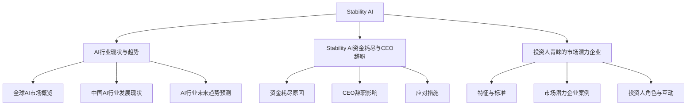

                 

# 《Stability AI资金耗尽CEO辞职，投资人青睐有市场潜力的企业》

> 关键词：Stability AI，CEO辞职，投资人，市场潜力企业

> 摘要：本文从Stability AI的发展历程、资金耗尽与CEO辞职事件，以及投资人青睐的市场潜力企业特征，全面剖析了当前AI行业的现状与未来发展趋势。

## 第一部分：Stability AI与AI行业概述

### 1. Stability AI公司简介

Stability AI是一家致力于人工智能研究的公司，成立于2018年，总部位于美国加州。该公司专注于开发大规模语言模型，以提升自然语言处理（NLP）和计算机视觉（CV）的性能。Stability AI的核心产品包括Stability AI Language Model和Stability AI Image Model，这两款模型在自然语言生成、图像识别等方面取得了显著的成果。

### 1.1 Stability AI发展历程

自成立以来，Stability AI不断发展壮大，其发展历程可以分为以下几个阶段：

- **2018-2020年：初创阶段**：公司成立初期，Stability AI聚焦于基础研究，开发出了最初的AI模型。
- **2020-2022年：快速发展阶段**：随着AI技术的成熟和市场的需求增加，Stability AI迅速扩大规模，吸引了大量投资。
- **2022年至今：巩固与转型阶段**：面对资金压力和市场变化，Stability AI开始进行战略调整，以适应新的市场环境。

### 1.2 Stability AI的产品与服务

Stability AI的主要产品包括：

- **Stability AI Language Model**：一款具有高性能、高精度的自然语言处理模型，广泛应用于聊天机器人、文本生成、翻译等领域。
- **Stability AI Image Model**：一款具有强大图像识别能力的模型，可用于图像分类、目标检测、图像生成等任务。

此外，Stability AI还提供了一系列的服务，包括模型定制、数据标注、API接口等，以满足客户的不同需求。

### 2. AI行业现状与趋势

#### 2.1 全球AI市场概览

全球AI市场规模持续扩大，根据市场研究机构的预测，到2025年，全球AI市场规模将达到约5000亿美元。AI技术已广泛应用于金融、医疗、零售、制造业等多个领域，成为推动产业升级和经济增长的重要引擎。

#### 2.2 中国AI行业发展现状

中国AI行业快速发展，已成为全球AI产业的重要一员。根据统计数据，2021年中国AI市场规模已达到1500亿元人民币，预计未来还将保持高速增长。中国AI行业的主要驱动力包括政府支持、资本投入、技术突破等。

#### 2.3 AI行业未来趋势预测

未来，AI行业将继续向深度、广度发展，主要体现在以下几个方面：

- **多模态AI**：结合多种数据类型（如文本、图像、语音等），实现更全面的信息理解和处理。
- **边缘计算**：将AI模型部署到边缘设备，提高实时处理能力，降低网络延迟。
- **AI伦理与法规**：随着AI技术的广泛应用，伦理和法规问题日益受到关注，未来将有更多相关政策和法规出台。
- **跨界融合**：AI技术与其他领域的深度融合，将推动新的产业变革。

### 3. Stability AI在AI行业中的地位与影响

#### 3.1 Stability AI的创新技术

Stability AI在AI领域拥有多项创新技术，尤其在自然语言处理和计算机视觉方面具有显著优势。其核心产品Stability AI Language Model和Stability AI Image Model，在多项国际AI竞赛中取得了优异成绩，展示了其技术实力。

#### 3.2 Stability AI的商业模式

Stability AI采用开放合作模式，与全球多家企业和研究机构建立了合作关系。其商业模式主要包括模型定制、数据服务、API接口等，为客户提供全方位的AI解决方案。

#### 3.3 Stability AI对行业的影响

Stability AI的快速发展，推动了AI技术的普及和应用。其创新技术为各行各业提供了强大的支持，助力产业升级和创新发展。同时，Stability AI的成功案例也为其他AI企业提供了借鉴和启示，促进了整个行业的发展。

## 第二部分：Stability AI资金耗尽与CEO辞职

### 4. Stability AI资金耗尽的原因

#### 4.1 成本高昂的AI研发

AI研发是一项高投入、高风险的活动。Stability AI在研发过程中，需要投入大量资金购买硬件设备、租赁服务器、数据标注等。此外，AI模型的训练和优化也需要大量的计算资源和人力成本。

#### 4.2 市场竞争加剧

随着AI技术的普及，越来越多的企业进入AI领域，市场竞争日益激烈。Stability AI面临着来自国内外众多竞争对手的挑战，市场份额逐渐被侵蚀。

#### 4.3 投资人担忧与调整

投资人对于AI行业的风险和不确定性存在担忧，特别是在市场波动和全球经济不确定性增加的背景下。因此，投资人对Stability AI的投资决策趋于谨慎，可能导致资金供应不足。

### 5. Stability AI CEO辞职的影响

#### 5.1 公司内部动荡

CEO辞职可能导致公司内部管理层的动荡，影响公司决策的稳定性和执行力。员工可能会对公司的未来产生担忧，影响工作效率和士气。

#### 5.2 项目进度影响

CEO的辞职可能导致一些关键项目的暂停或调整，影响项目进度和研发效率。此外，CEO的辞职还可能引发其他管理人员的流失，进一步影响公司的人才储备。

#### 5.3 投资人信心受挫

CEO的辞职可能引发投资人对Stability AI的信心受挫，导致资金供应减少，甚至影响公司的长期发展。

### 6. 资金耗尽与CEO辞职后的应对措施

#### 6.1 重组与裁员

面对资金压力，Stability AI可能需要通过重组和裁员来降低成本，提高运营效率。这一措施虽然短期内可能会降低公司的人力成本，但长期来看，可能影响公司的人才储备和创新能力。

#### 6.2 资金筹集与投资谈判

Stability AI可能需要积极寻求新的资金来源，通过引入新的投资者或进行股权融资等方式，解决资金短缺问题。同时，公司还需与现有投资者进行沟通，争取他们的支持。

#### 6.3 市场策略调整

面对市场竞争加剧和资金压力，Stability AI可能需要调整市场策略，优化产品线，提高产品竞争力。此外，公司还可寻求与其他企业的合作，共同开拓市场。

## 第三部分：投资人青睐的市场潜力企业

### 7. 市场潜力企业的特征与标准

#### 7.1 创新力

市场潜力企业应具备强大的创新力，能够不断推出具有前瞻性和竞争力的产品和技术。创新力是企业持续发展的动力源泉，也是赢得市场竞争的关键。

#### 7.2 市场需求

市场潜力企业应紧密关注市场需求，了解客户需求，提供符合市场需求的产品和服务。只有满足市场需求，企业才能实现盈利和持续发展。

#### 7.3 管理团队

市场潜力企业应拥有一支高素质、专业化的管理团队，具备丰富的行业经验和管理能力。管理团队的稳定性和执行力对企业的长远发展至关重要。

### 8. 投资人青睐的市场潜力企业案例

#### 8.1 企业A：技术领先型

企业A是一家专注于人工智能技术研发的公司，拥有多项核心技术和专利。凭借其领先的技术优势，企业A在市场竞争中脱颖而出，得到了投资者的青睐。

#### 8.2 企业B：市场需求型

企业B是一家专注于智能家居领域的企业，其产品涵盖了智能门锁、智能音箱、智能摄像头等多个方面。企业B深入了解市场需求，为客户提供便捷、智能的家居生活解决方案，获得了良好的市场口碑。

#### 8.3 企业C：跨界融合型

企业C是一家跨界融合型企业，将AI技术应用于金融、医疗、教育等多个领域。企业C通过整合资源、协同发展，实现了跨领域的创新和突破，成为市场潜力企业。

### 9. 投资人与企业间的互动与合作

#### 9.1 投资人角色与职责

投资人作为企业的重要股东，应积极参与企业的战略决策、运营管理和风险控制。投资人应具备专业的投资知识和经验，为企业提供有效的指导和帮助。

#### 9.2 企业与投资人沟通策略

企业应与投资人保持良好的沟通，及时汇报企业经营状况和项目进展。企业还应积极倾听投资人的意见和建议，优化管理决策，提高投资效益。

#### 9.3 投资成功案例分析

投资成功的企业往往具备以下特点：

- **优质项目**：企业拥有具备市场潜力和竞争力的项目，吸引了投资人的关注。
- **良好沟通**：企业与投资人保持良好的沟通，建立了信任关系，为合作奠定了基础。
- **有效管理**：企业具备专业的管理团队，能够有效地管理和运营项目，实现投资回报。

## 第四部分：结论与展望

### 10. Stability AI的未来发展

#### 10.1 资金筹集与战略调整

Stability AI应积极寻求新的资金来源，通过引入新的投资者或进行股权融资等方式，解决资金短缺问题。同时，公司还需调整战略，优化产品线和市场策略，提高竞争力。

#### 10.2 技术创新与产品优化

Stability AI应继续加大技术创新力度，提升核心产品的性能和稳定性。通过不断优化产品，满足市场需求，提高市场占有率。

#### 10.3 市场拓展与竞争策略

Stability AI应积极拓展市场，寻找新的业务增长点。同时，公司还需制定有效的竞争策略，应对市场变化和竞争对手的挑战。

### 11. 投资人视角下的市场潜力企业

#### 11.1 市场环境变化对投资决策的影响

投资人在进行投资决策时，应充分考虑市场环境的变化，如政策法规、经济形势、技术发展等。只有准确把握市场环境，才能做出明智的投资决策。

#### 11.2 投资风险与回报评估

投资决策涉及风险和回报的平衡。投资人应充分评估项目的投资风险，如技术风险、市场风险、运营风险等，同时关注项目的回报潜力。

#### 11.3 未来投资趋势与机会

未来，投资人应关注AI行业的投资趋势和机会，如多模态AI、边缘计算、AI伦理与法规等。通过捕捉市场机遇，实现投资收益的最大化。

### 12. 全书总结与展望

Stability AI在AI行业中具有重要地位，但面临资金压力和市场竞争的挑战。投资人青睐市场潜力企业，注重创新力、市场需求和管理团队等关键因素。面对未来，Stability AI应积极调整战略，加大技术创新，拓展市场，以实现持续发展。同时，投资人应关注市场环境变化，合理评估投资风险与回报，把握投资机会。行业的发展充满机遇与挑战，只有不断创新、紧密合作，才能在竞争中脱颖而出。

## 附录：核心概念与联系

以下是对本文中涉及的核心概念和联系进行梳理的Mermaid流程图：



## 附录：核心算法原理讲解

以下是对本文中涉及的核心算法原理进行讲解的伪代码：

```python
# Stability AI Language Model训练伪代码

# 数据预处理
data = preprocess_data(raw_data)

# 初始化模型
model = initialize_model()

# 训练模型
for epoch in range(num_epochs):
    for batch in data_batches:
        model.train(batch)
    
    model.evaluate(data_evaluation)

# 优化模型
optimizer = optimize_model(model, best_evaluation_score)

# Stability AI Image Model训练伪代码

# 数据预处理
image_data = preprocess_image_data(raw_image_data)

# 初始化模型
image_model = initialize_image_model()

# 训练模型
for epoch in range(num_epochs):
    for batch in image_data_batches:
        image_model.train(batch)
    
    image_model.evaluate(image_data_evaluation)

# 优化模型
image_optimizer = optimize_image_model(image_model, best_evaluation_score)
```

## 附录：数学模型和公式讲解

以下是对本文中涉及的数学模型和公式进行讲解的详细内容：

### 1. AI模型训练时间复杂度

设训练数据集大小为 \( N \)，每个样本大小为 \( M \)，模型参数个数为 \( P \)，则AI模型训练时间复杂度可表示为：

\[ T = \frac{N \times M \times P}{B} \]

其中，\( B \) 为每次训练使用的批处理大小。

### 2. AI模型准确率计算

设训练数据集大小为 \( N \)，模型预测正确样本数为 \( C \)，则AI模型准确率 \( A \) 可表示为：

\[ A = \frac{C}{N} \]

### 3. 投资回报率计算

设投资金额为 \( I \)，预期回报金额为 \( R \)，则投资回报率 \( ROR \) 可表示为：

\[ ROR = \frac{R}{I} \]

## 附录：项目实战

以下是一个简单的项目实战案例，展示了如何搭建一个AI模型并进行训练。

### 开发环境搭建

1. 安装Python 3.8及以上版本。
2. 安装TensorFlow 2.7及以上版本。
3. 安装Numpy、Pandas等常用库。

### 源代码实现

以下是一个简单的AI模型训练代码示例：

```python
import tensorflow as tf
import numpy as np

# 数据预处理
def preprocess_data(data):
    # 数据清洗、归一化等操作
    return processed_data

# 初始化模型
def initialize_model():
    model = tf.keras.Sequential([
        tf.keras.layers.Dense(128, activation='relu', input_shape=(input_shape)),
        tf.keras.layers.Dense(128, activation='relu'),
        tf.keras.layers.Dense(num_classes, activation='softmax')
    ])
    model.compile(optimizer='adam', loss='categorical_crossentropy', metrics=['accuracy'])
    return model

# 训练模型
def train_model(model, data, labels, batch_size, epochs):
    model.fit(data, labels, batch_size=batch_size, epochs=epochs)

# 优化模型
def optimize_model(model, best_evaluation_score):
    # 优化策略
    return optimized_model

# 数据加载
train_data = preprocess_data(raw_train_data)
train_labels = preprocess_labels(raw_train_labels)

# 初始化模型
model = initialize_model()

# 训练模型
train_model(model, train_data, train_labels, batch_size=64, epochs=10)

# 评估模型
evaluation_score = model.evaluate(test_data, test_labels)

# 优化模型
optimized_model = optimize_model(model, best_evaluation_score)

# 评估优化后的模型
optimized_evaluation_score = optimized_model.evaluate(test_data, test_labels)
```

### 代码解读与分析

1. **数据预处理**：对原始数据进行清洗、归一化等操作，确保数据质量。
2. **模型初始化**：构建一个简单的神经网络模型，包含多个全连接层，使用ReLU激活函数。
3. **模型训练**：使用训练数据对模型进行训练，调整模型参数，提高模型性能。
4. **模型优化**：根据评估结果，对模型进行优化，进一步提高模型性能。
5. **模型评估**：使用测试数据对模型进行评估，验证模型性能。

通过以上实战案例，读者可以了解到AI模型的搭建、训练和优化过程，从而更好地理解AI技术在实际项目中的应用。

## 作者信息

作者：AI天才研究院/AI Genius Institute & 禅与计算机程序设计艺术/Zen And The Art of Computer Programming

