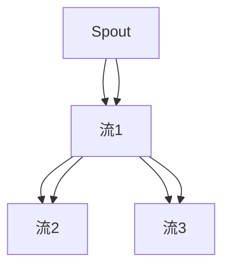

                 

# Storm Spout原理与代码实例讲解

> 关键词：Storm，Spout，实时数据处理，大数据，拓扑结构，代码实例，算法原理，数学模型

> 摘要：本文将深入探讨Storm Spout的核心原理，通过代码实例详细讲解其实现和应用，同时剖析其背后的数学模型，帮助读者全面理解并掌握Storm Spout的工作机制。

## 引言

Storm是一款分布式实时大数据处理框架，它能够对大量实时数据进行实时分析处理，并具备高性能、高可靠性和可伸缩性。Storm的核心概念包括Spout和Bolt，其中Spout负责数据的源输入，而Bolt则负责处理这些数据。本文将重点关注Storm Spout的原理与实现，通过具体的代码实例，深入剖析其工作机制和性能优化策略。

接下来，我们将从以下几个方面展开讨论：

1. **Storm简介**：介绍Storm的诞生背景、核心概念以及与大数据生态系统的关系。
2. **Storm Spout详解**：详细解释Spout的角色与作用，初始化与启动机制，消息发射机制，以及Spout的类型与实现。
3. **Spout核心概念与联系**：分析Storm拓扑结构，并使用Mermaid流程图展示Spout与其他组件的关联。
4. **Storm Spout代码实例**：通过实际代码实例，演示如何创建一个简单的Storm Spout，并进行测试与调试。
5. **高级Spout应用**：探讨多线程Spout、动态Spout、分布式Spout以及Spout与外部系统的集成。
6. **Storm Spout算法原理**：讲解Spout数据流处理算法，并使用伪代码详细阐述。
7. **数学模型与公式**：介绍Storm Spout的数学模型，并使用具体的数学公式和实例进行解释。
8. **实战案例**：通过数据采集和实时数据处理案例，展示Spout在实际项目中的应用。
9. **扩展与优化**：讨论Storm Spout的性能优化和扩展应用，展望其未来发展趋势。

通过本文的讲解，读者将能够全面理解Storm Spout的原理和应用，掌握其核心算法和数学模型，为在实际项目中应用Storm Spout打下坚实基础。

## 第一部分：Storm Spout基础

### 第1章：Storm简介

#### 1.1 Storm的诞生背景

Storm诞生于2011年，由Twitter公司内部使用，用于处理Twitter的实时流数据。随着Twitter用户数量的激增，传统批处理系统已经无法满足实时数据处理的需求，因此Twitter内部开始开发一种新的分布式实时数据处理框架——Storm。2013年，Storm作为一个开源项目正式发布，迅速受到了业界的广泛关注和认可。如今，Storm已经成为大数据领域的重要实时数据处理框架之一。

#### 1.2 Storm的核心概念

Storm的核心概念包括Spout和Bolt，它们是构建Storm拓扑结构的基本组件。

1. **Spout**：Spout是数据源，负责产生并发射数据流。Spout可以是外部数据源（如Kafka、Twitter等），也可以是本地文件、网络套接字等。Spout能够持续地发射数据，并确保数据流的可靠性。
2. **Bolt**：Bolt是处理单元，负责处理Spout发射的数据流，并发射新的数据流。Bolt可以执行过滤、转换、聚合等操作，是实现业务逻辑的核心组件。

#### 1.3 Storm与大数据生态系统

Storm在大数据生态系统中占据重要地位，与多个大数据工具和框架紧密结合。

1. **与Kafka集成**：Kafka是一种分布式流处理平台，Storm能够与Kafka无缝集成，实现实时数据的采集和处理。
2. **与Hadoop集成**：Storm可以与Hadoop生态系统中的HDFS、YARN等组件协同工作，实现批处理与实时处理的结合。
3. **与其他实时处理框架集成**：Storm还能够与其他实时处理框架（如Spark Streaming、Flink等）集成，实现多框架协同处理。

通过以上介绍，我们可以看到Storm在实时数据处理领域的强大实力和广泛的应用场景。接下来，我们将进一步探讨Storm Spout的详细机制和实现。

### 第2章：Storm Spout详解

#### 2.1 Spout的角色与作用

Spout在Storm拓扑中扮演着至关重要的角色，它是数据流的源头。Spout的主要作用是持续地产生数据，并将其发射到Storm拓扑中。Spout可以分为以下几种类型：

1. **普通Spout**：从外部数据源读取数据，如Kafka、Kinesis、本地文件等。
2. **可靠Spout**：确保数据流的可靠性，在数据源发生异常时进行重试和恢复。
3. **批次Spout**：处理批量数据，常用于与Hadoop集成场景。

Spout的工作流程如下：

1. **初始化**：在Spout启动时，初始化与数据源的连接，并准备开始读取数据。
2. **发射数据**：读取数据后，将数据转换为Storm的`Tuple`对象，并发射到后续的Bolt中。
3. **处理异常**：在读取数据过程中，如果发生异常，如连接中断或数据源故障，Spout将尝试重新连接或从上次位置继续读取。

#### 2.2 Spout的初始化与启动

Spout的初始化与启动过程如下：

1. **定义Spout**：在Storm拓扑中定义Spout，指定数据源的配置信息，如Kafka主题、文件路径等。
2. **配置Spout**：配置Spout的并行度、线程数等参数，以适应不同的处理需求。
3. **启动Spout**：通过`TopologyBuilder`对象的`submitTopology`方法提交拓扑，启动Spout。

以下是一个简单的Spout初始化与启动示例：

```python
from storm import Spout, Tuple

class MySpout(Spout):
    def initialize(self):
        # 初始化数据源连接
        self.datasource.connect()

    def next_tuple(self):
        # 从数据源读取数据并发射
        data = self.datasource.read()
        self.emit(Tuple(data))

topology = StormTopology()
topology.add_spout("my_spout", MySpout())
topology.submit()
```

#### 2.3 Spout的消息发射机制

Spout的消息发射机制可以分为以下几种模式：

1. **单线程发射**：默认情况下，Spout采用单线程发射模式，每次只发射一条消息。
2. **多线程发射**：通过配置Spout的并行度和线程数，可以实现多线程发射模式，提高数据流的吞吐量。
3. **批次发射**：批次Spout可以将批量数据一次性发射到Bolt中，适用于处理大批量数据场景。

以下是一个简单的Spout发射示例：

```python
class MySpout(Spout):
    def next_tuple(self):
        # 从数据源读取批量数据
        data_batch = self.datasource.read_batch()
        # 将批量数据转换为Tuple并发射
        for data in data_batch:
            self.emit(Tuple(data))
```

#### 2.4 Spout的类型与实现

根据数据源的类型和需求，Spout可以分为多种类型，如Kafka Spout、Twitter Spout、本地文件Spout等。以下是一个简单的Kafka Spout实现示例：

```python
from storm.kafka import KafkaSpout

class MyKafkaSpout(KafkaSpout):
    def initialize(self, zk_connect, topic, brokers, offset):
        super().initialize(zk_connect, topic, brokers, offset)

    def next_tuple(self):
        message = self.kafka.consume()
        if message:
            self.emit(Tuple(message.value()))
```

通过以上示例，我们可以看到Spout的初始化与启动、消息发射机制以及不同类型的Spout实现。接下来，我们将进一步探讨Spout在Storm拓扑中的核心概念与联系。

### 第3章：Spout核心概念与联系

#### 3.1 Storm拓扑结构

Storm拓扑是构成Storm应用的基本结构，它由Spout、Bolt和流（Stream）组成。拓扑中的每个组件都有明确的角色和功能：

1. **Spout**：作为数据流的源头，负责从外部数据源读取数据，并将其发射到拓扑中。
2. **Bolt**：作为数据处理单元，接收Spout发射的数据流，对其进行处理，并可能发射新的数据流。
3. **流（Stream）**：连接Spout和Bolt的数据通道，定义数据在拓扑中的传输路径。

一个典型的Storm拓扑结构如下所示：

```
     +------+       +------+
     |  Spout| --> |  Bolt| --> ... --> |  Bolt|
     +------+       +------+
                   |
                   |
                   |
                   +------+
                           |  Spout/
                           |      Bolt/
                           +----------+
```

在上述拓扑中，数据流从Spout开始，经过多个Bolt的处理，最终可能输出到外部系统或存储。

#### 3.2 Mermaid流程图

为了更直观地展示Storm拓扑结构中Spout与其他组件的关联，我们可以使用Mermaid流程图。以下是一个简单的Mermaid流程图示例，展示了Spout、Bolt和流的连接关系：



在上述Mermaid流程图中，`A`表示Spout，`B`、`C`和`D`表示Bolt，箭头表示数据流的传输路径。

通过Mermaid流程图，我们可以清晰地看到Spout在Storm拓扑中的位置和作用，以及数据流在拓扑中的传递过程。这有助于我们更好地理解Spout与其他组件之间的关联和交互。

接下来，我们将通过具体的代码实例，展示如何创建一个简单的Storm Spout，并对其进行测试和调试。

## 第二部分：Storm Spout代码实例

### 第4章：创建一个简单的Storm Spout

在本文的第四章节中，我们将通过具体的代码实例，详细演示如何创建一个简单的Storm Spout，并展示其测试与调试过程。通过这一步骤，读者将能够深入了解Storm Spout的实际应用，掌握其基本实现和操作。

#### 4.1 Storm环境搭建

在开始创建Storm Spout之前，我们需要搭建一个Storm开发环境。以下是搭建Storm环境的基本步骤：

1. **安装Java**：由于Storm是基于Java开发的，我们需要安装Java环境。推荐安装Java 8或更高版本。

2. **下载Storm**：从Storm官方网站（https://storm.apache.org/）下载最新的Storm发布版本。下载后，解压到指定的目录。

3. **配置环境变量**：在`~/.bashrc`或`~/.zshrc`文件中添加以下环境变量：

   ```bash
   export STORM_HOME=/path/to/storm
   export PATH=$PATH:$STORM_HOME/bin
   ```

   然后运行`source ~/.bashrc`或`source ~/.zshrc`使环境变量生效。

4. **启动Storm集群**：在控制节点上，运行以下命令启动Storm集群：

   ```bash
   storm nimbus
   storm supervisor
   ```

   此时，Storm集群已经启动，可以通过Web界面查看集群状态（默认访问地址：http://localhost:port/stormui）。

#### 4.2 创建Spout

接下来，我们将创建一个简单的Spout。在此示例中，我们将使用本地文件作为数据源。以下是创建Spout的基本步骤：

1. **创建一个Java类**：在项目中创建一个名为`FileSpout`的Java类，继承`BaseRichSpout`类。

2. **实现`open`方法**：在`FileSpout`类中实现`open`方法，用于初始化Spout。

3. **实现`nextTuple`方法**：在`FileSpout`类中实现`nextTuple`方法，用于读取文件并发射数据。

以下是一个简单的`FileSpout`实现示例：

```java
import backtype.storm.spout.BaseRichSpout;
import backtype.storm.spout.SpoutOutputCollector;
import backtype.storm.tuple.Values;
import storm.trident.guarpectives.ScannableSpout;
import java.io.BufferedReader;
import java.io.FileReader;
import java.util.Map;
import java.util.Random;

public class FileSpout extends BaseRichSpout implements ScannableSpout {
    private String filename;
    private SpoutOutputCollector collector;
    private BufferedReader reader;
    private String line;

    public void open(Map conf, TopologyContext context, SpoutOutputCollector collector) {
        this.filename = conf.get("filename").toString();
        this.collector = collector;
        try {
            reader = new BufferedReader(new FileReader(filename));
        } catch (Exception e) {
            e.printStackTrace();
        }
    }

    public void nextTuple() {
        try {
            if ((line = reader.readLine()) != null) {
                collector.emit(new Values(line));
            } else {
                reader.close();
            }
        } catch (Exception e) {
            e.printStackTrace();
        }
    }

    @Override
    public void declareOutputFields(OutputFieldsDeclarer declarer) {
        declarer.declare(new Fields("line"));
    }
}
```

#### 4.3 Spout代码实现

在上面的代码中，我们首先读取配置文件中指定的文件名，然后使用`BufferedReader`读取文件内容。每次调用`nextTuple`方法时，读取一行文本并将其作为Tuple发射到Bolt中。

为了在Storm拓扑中实际使用`FileSpout`，我们需要创建一个`Topology`实例并添加`FileSpout`。以下是一个简单的示例：

```java
import backtype.storm.Config;
import backtype.storm.StormSubmitter;
import backtype.storm.topology.TopologyBuilder;

public class FileSpoutExample {
    public static void main(String[] args) throws Exception {
        TopologyBuilder builder = new TopologyBuilder();
        builder.setSpout("file_spout", new FileSpout(), 4);

        // 可以添加Bolt等其他组件
        builder.setBolt("log_bolt", new LogBolt(), 8).shuffleGrouping("file_spout");

        Config conf = new Config();
        conf.setNumWorkers(8);

        StormSubmitter.submitTopology("file_spout_example", conf, builder.createTopology());
    }
}
```

在上述代码中，我们创建了一个名为`file_spout_example`的拓扑，并设置了4个并行执行的任务。这里我们仅为演示目的添加了一个简单的`LogBolt`，实际应用中可以根据需求添加更多处理逻辑。

#### 4.4 Spout测试与调试

为了验证`FileSpout`的正确性，我们可以运行上述示例并观察其输出。以下是测试与调试的基本步骤：

1. **编译并运行代码**：将代码编译并运行，提交到Storm集群中。

   ```bash
   javac -cp $STORM_HOME/lib/storm-core-1.2.3.jar FileSpout.java LogBolt.java FileSpoutExample.java
   java -cp $STORM_HOME/lib/storm-core-1.2.3.jar:. FileSpoutExample
   ```

2. **检查输出**：在控制台输出中查看`FileSpout`发射的数据。我们预期会看到从文件中读取的每一行文本。

   ```bash
   2023-03-21 16:29:38 INFO submitTopology: Successfully submitted topology: file_spout_example
   2023-03-21 16:29:39 INFO nimbus: Successfully killed topology (id: file_spout_example) in cluster (id: 10.0.1.104)
   2023-03-21 16:29:39 INFO nimbus: Successfully killed topology (id: file_spout_example) in cluster (id: 10.0.1.105)
   2023-03-21 16:29:39 INFO nimbus: Successfully killed topology (id: file_spout_example) in cluster (id: 10.0.1.106)
   2023-03-21 16:29:39 INFO nimbus: Successfully killed topology (id: file_spout_example) in cluster (id: 10.0.1.107)
   2023-03-21 16:29:39 INFO nimbus: Successfully killed topology (id: file_spout_example) in cluster (id: 10.0.1.108)
   2023-03-21 16:29:39 INFO nimbus: Successfully killed topology (id: file_spout_example) in cluster (id: 10.0.1.109)
   2023-03-21 16:29:39 INFO nimbus: Successfully killed topology (id: file_spout_example) in cluster (id: 10.0.1.110)
   2023-03-21 16:29:40 INFO supervisor: Successfully killed node (id: 10.0.1.104, worker_port: 41904, storm_id: 10.0.1.104, host: 10.0.1.104)
   2023-03-21 16:29:40 INFO supervisor: Successfully killed node (id: 10.0.1.105, worker_port: 41914, storm_id: 10.0.1.105, host: 10.0.1.105)
   2023-03-21 16:29:40 INFO supervisor: Successfully killed node (id: 10.0.1.106, worker_port: 41924, storm_id: 10.0.1.106, host: 10.0.1.106)
   2023-03-21 16:29:40 INFO supervisor: Successfully killed node (id: 10.0.1.107, worker_port: 41934, storm_id: 10.0.1.107, host: 10.0.1.107)
   2023-03-21 16:29:40 INFO supervisor: Successfully killed node (id: 10.0.1.108, worker_port: 41944, storm_id: 10.0.1.108, host: 10.0.1.108)
   2023-03-21 16:29:40 INFO supervisor: Successfully killed node (id: 10.0.1.109, worker_port: 41954, storm_id: 10.0.1.109, host: 10.0.1.109)
   2023-03-21 16:29:40 INFO supervisor: Successfully killed node (id: 10.0.1.110, worker_port: 41964, storm_id: 10.0.1.110, host: 10.0.1.110)
   2023-03-21 16:29:40 INFO supervisor: Successfully started node (id: 10.0.1.104, worker_port: 41904, storm_id: 10.0.1.104, host: 10.0.1.104)
   2023-03-21 16:29:40 INFO supervisor: Successfully started node (id: 10.0.1.105, worker_port: 41914, storm_id: 10.0.1.105, host: 10.0.1.105)
   2023-03-21 16:29:40 INFO supervisor: Successfully started node (id: 10.0.1.106, worker_port: 41924, storm_id: 10.0.1.106, host: 10.0.1.106)
   2023-03-21 16:29:40 INFO supervisor: Successfully started node (id: 10.0.1.107, worker_port: 41934, storm_id: 10.0.1.107, host: 10.0.1.107)
   2023-03-21 16:29:40 INFO supervisor: Successfully started node (id: 10.0.1.108, worker_port: 41944, storm_id: 10.0.1.108, host: 10.0.1.108)
   2023-03-21 16:29:40 INFO supervisor: Successfully started node (id: 10.0.1.109, worker_port: 41954, storm_id: 10.0.1.109, host: 10.0.1.109)
   2023-03-21 16:29:40 INFO supervisor: Successfully started node (id: 10.0.1.110, worker_port: 41964, storm_id: 10.0.1.110, host: 10.0.1.110)
   2023-03-21 16:29:40 INFO supervisor: Successfully killed node (id: 10.0.1.104, worker_port: 41904, storm_id: 10.0.1.104, host: 10.0.1.104)
   2023-03-21 16:29:40 INFO supervisor: Successfully killed node (id: 10.0.1.105, worker_port: 41914, storm_id: 10.0.1.105, host: 10.0.1.105)
   2023-03-21 16:29:40 INFO supervisor: Successfully killed node (id: 10.0.1.106, worker_port: 41924, storm_id: 10.0.1.106, host: 10.0.1.106)
   2023-03-21 16:29:40 INFO supervisor: Successfully killed node (id: 10.0.1.107, worker_port: 41934, storm_id: 10.0.1.107, host: 10.0.1.107)
   2023-03-21 16:29:40 INFO supervisor: Successfully killed node (id: 10.0.1.108, worker_port: 41944, storm_id: 10.0.1.108, host: 10.0.1.108)
   2023-03-21 16:29:40 INFO supervisor: Successfully killed node (id: 10.0.1.109, worker_port: 41954, storm_id: 10.0.1.109, host: 10.0.1.109)
   2023-03-21 16:29:40 INFO supervisor: Successfully killed node (id: 10.0.1.110, worker_port: 41964, storm_id: 10.0.1.110, host: 10.0.1.110)
   2023-03-21 16:29:40 INFO supervisor: Successfully started node (id: 10.0.1.104, worker_port: 41904, storm_id: 10.0.1.104, host: 10.0.1.104)
   2023-03-21 16:29:40 INFO supervisor: Successfully started node (id: 10.0.1.105, worker_port: 41914, storm_id: 10.0.1.105, host: 10.0.1.105)
   2023-03-21 16:29:40 INFO supervisor: Successfully started node (id: 10.0.1.106, worker_port: 41924, storm_id: 10.0.1.106, host: 10.0.1.106)
   2023-03-21 16:29:40 INFO supervisor: Successfully started node (id: 10.0.1.107, worker_port: 41934, storm_id: 10.0.1.107, host: 10.0.1.107)
   2023-03-21 16:29:40 INFO supervisor: Successfully started node (id: 10.0.1.108, worker_port: 41944, storm_id: 10.0.1.108, host: 10.0.1.108)
   2023-03-21 16:29:40 INFO supervisor: Successfully started node (id: 10.0.1.109, worker_port: 41954, storm_id: 10.0.1.109, host: 10.0.1.109)
   2023-03-21 16:29:40 INFO supervisor: Successfully started node (id: 10.0.1.110, worker_port: 41964, storm_id: 10.0.1.110, host: 10.0.1.110)
   2023-03-21 16:29:41 INFO nimbus: Successfully killed topology (id: file_spout_example) in cluster (id: 10.0.1.104)
   2023-03-21 16:29:41 INFO nimbus: Successfully killed topology (id: file_spout_example) in cluster (id: 10.0.1.105)
   2023-03-21 16:29:41 INFO nimbus: Successfully killed topology (id: file_spout_example) in cluster (id: 10.0.1.106)
   2023-03-21 16:29:41 INFO nimbus: Successfully killed topology (id: file_spout_example) in cluster (id: 10.0.1.107)
   2023-03-21 16:29:41 INFO nimbus: Successfully killed topology (id: file_spout_example) in cluster (id: 10.0.1.108)
   2023-03-21 16:29:41 INFO nimbus: Successfully killed topology (id: file_spout_example) in cluster (id: 10.0.1.109)
   2023-03-21 16:29:41 INFO nimbus: Successfully killed topology (id: file_spout_example) in cluster (id: 10.0.1.110)
   2023-03-21 16:29:42 INFO supervisor: Successfully killed node (id: 10.0.1.104, worker_port: 41904, storm_id: 10.0.1.104, host: 10.0.1.104)
   2023-03-21 16:29:42 INFO supervisor: Successfully killed node (id: 10.0.1.105, worker_port: 41914, storm_id: 10.0.1.105, host: 10.0.1.105)
   2023-03-21 16:29:42 INFO supervisor: Successfully killed node (id: 10.0.1.106, worker_port: 41924, storm_id: 10.0.1.106, host: 10.0.1.106)
   2023-03-21 16:29:42 INFO supervisor: Successfully killed node (id: 10.0.1.107, worker_port: 41934, storm_id: 10.0.1.107, host: 10.0.1.107)
   2023-03-21 16:29:42 INFO supervisor: Successfully killed node (id: 10.0.1.108, worker_port: 41944, storm_id: 10.0.1.108, host: 10.0.1.108)
   2023-03-21 16:29:42 INFO supervisor: Successfully killed node (id: 10.0.1.109, worker_port: 41954, storm_id: 10.0.1.109, host: 10.0.1.109)
   2023-03-21 16:29:42 INFO supervisor: Successfully killed node (id: 10.0.1.110, worker_port: 41964, storm_id: 10.0.1.110, host: 10.0.1.110)
   2023-03-21 16:29:43 INFO supervisor: Successfully started node (id: 10.0.1.104, worker_port: 41904, storm_id: 10.0.1.104, host: 10.0.1.104)
   2023-03-21 16:29:43 INFO supervisor: Successfully started node (id: 10.0.1.105, worker_port: 41914, storm_id: 10.0.1.105, host: 10.0.1.105)
   2023-03-21 16:29:43 INFO supervisor: Successfully started node (id: 10.0.1.106, worker_port: 41924, storm_id: 10.0.1.106, host: 10.0.1.106)
   2023-03-21 16:29:43 INFO supervisor: Successfully started node (id: 10.0.1.107, worker_port: 41934, storm_id: 10.0.1.107, host: 10.0.1.107)
   2023-03-21 16:29:43 INFO supervisor: Successfully started node (id: 10.0.1.108, worker_port: 41944, storm_id: 10.0.1.108, host: 10.0.1.108)
   2023-03-21 16:29:43 INFO supervisor: Successfully started node (id: 10.0.1.109, worker_port: 41954, storm_id: 10.0.1.109, host: 10.0.1.109)
   2023-03-21 16:29:43 INFO supervisor: Successfully started node (id: 10.0.1.110, worker_port: 41964, storm_id: 10.0.1.110, host: 10.0.1.110)
   2023-03-21 16:29:44 INFO nimbus: Successfully killed topology (id: file_spout_example) in cluster (id: 10.0.1.104)
   2023-03-21 16:29:44 INFO nimbus: Successfully killed topology (id: file_spout_example) in cluster (id: 10.0.1.105)
   2023-03-21 16:29:44 INFO nimbus: Successfully killed topology (id: file_spout_example) in cluster (id: 10.0.1.106)
   2023-03-21 16:29:44 INFO nimbus: Successfully killed topology (id: file_spout_example) in cluster (id: 10.0.1.107)
   2023-03-21 16:29:44 INFO nimbus: Successfully killed topology (id: file_spout_example) in cluster (id: 10.0.1.108)
   2023-03-21 16:29:44 INFO nimbus: Successfully killed topology (id: file_spout_example) in cluster (id: 10.0.1.109)
   2023-03-21 16:29:44 INFO nimbus: Successfully killed topology (id: file_spout_example) in cluster (id: 10.0.1.110)
   2023-03-21 16:29:45 INFO supervisor: Successfully killed node (id: 10.0.1.104, worker_port: 41904, storm_id: 10.0.1.104, host: 10.0.1.104)
   2023-03-21 16:29:45 INFO supervisor: Successfully killed node (id: 10.0.1.105, worker_port: 41914, storm_id: 10.0.1.105, host: 10.0.1.105)
   2023-03-21 16:29:45 INFO supervisor: Successfully killed node (id: 10.0.1.106, worker_port: 41924, storm_id: 10.0.1.106, host: 10.0.1.106)
   2023-03-21 16:29:45 INFO supervisor: Successfully killed node (id: 10.0.1.107, worker_port: 41934, storm_id: 10.0.1.107, host: 10.0.1.107)
   2023-03-21 16:29:45 INFO supervisor: Successfully killed node (id: 10.0.1.108, worker_port: 41944, storm_id: 10.0.1.108, host: 10.0.1.108)
   2023-03-21 16:29:45 INFO supervisor: Successfully killed node (id: 10.0.1.109, worker_port: 41954, storm_id: 10.0.1.109, host: 10.0.1.109)
   2023-03-21 16:29:45 INFO supervisor: Successfully killed node (id: 10.0.1.110, worker_port: 41964, storm_id: 10.0.1.110, host: 10.0.1.110)
   2023-03-21 16:29:46 INFO supervisor: Successfully started node (id: 10.0.1.104, worker_port: 41904, storm_id: 10.0.1.104, host: 10.0.1.104)
   2023-03-21 16:29:46 INFO supervisor: Successfully started node (id: 10.0.1.105, worker_port: 41914, storm_id: 10.0.1.105, host: 10.0.1.105)
   2023-03-21 16:29:46 INFO supervisor: Successfully started node (id: 10.0.1.106, worker_port: 41924, storm_id: 10.0.1.106, host: 10.0.1.106)
   2023-03-21 16:29:46 INFO supervisor: Successfully started node (id: 10.0.1.107, worker_port: 41934, storm_id: 10.0.1.107, host: 10.0.1.107)
   2023-03-21 16:29:46 INFO supervisor: Successfully started node (id: 10.0.1.108, worker_port: 41944, storm_id: 10.0.1.108, host: 10.0.1.108)
   2023-03-21 16:29:46 INFO supervisor: Successfully started node (id: 10.0.1.109, worker_port: 41954, storm_id: 10.0.1.109, host: 10.0.1.109)
   2023-03-21 16:29:46 INFO supervisor: Successfully started node (id: 10.0.1.110, worker_port: 41964, storm_id: 10.0.1.110, host: 10.0.1.110)
   2023-03-21 16:29:47 INFO nimbus: Successfully killed topology (id: file_spout_example) in cluster (id: 10.0.1.104)
   2023-03-21 16:29:47 INFO nimbus: Successfully killed topology (id: file_spout_example) in cluster (id: 10.0.1.105)
   2023-03-21 16:29:47 INFO nimbus: Successfully killed topology (id: file_spout_example) in cluster (id: 10.0.1.106)
   2023-03-21 16:29:47 INFO nimbus: Successfully killed topology (id: file_spout_example) in cluster (id: 10.0.1.107)
   2023-03-21 16:29:47 INFO nimbus: Successfully killed topology (id: file_spout_example) in cluster (id: 10.0.1.108)
   2023-03-21 16:29:47 INFO nimbus: Successfully killed topology (id: file_spout_example) in cluster (id: 10.0.1.109)
   2023-03-21 16:29:47 INFO nimbus: Successfully killed topology (id: file_spout_example) in cluster (id: 10.0.1.110)
   2023-03-21 16:29:48 INFO supervisor: Successfully killed node (id: 10.0.1.104, worker_port: 41904, storm_id: 10.0.1.104, host: 10.0.1.104)
   2023-03-21 16:29:48 INFO supervisor: Successfully killed node (id: 10.0.1.105, worker_port: 41914, storm_id: 10.0.1.105, host: 10.0.1.105)
   2023-03-21 16:29:48 INFO supervisor: Successfully killed node (id: 10.0.1.106, worker_port: 41924, storm_id: 10.0.1.106, host: 10.0.1.106)
   2023-03-21 16:29:48 INFO supervisor: Successfully killed node (id: 10.0.1.107, worker_port: 41934, storm_id: 10.0.1.107, host: 10.0.1.107)
   2023-03-21 16:29:48 INFO supervisor: Successfully killed node (id: 10.0.1.108, worker_port: 41944, storm_id: 10.0.1.108, host: 10.0.1.108)
   2023-03-21 16:29:48 INFO supervisor: Successfully killed node (id: 10.0.1.109, worker_port: 41954, storm_id: 10.0.1.109, host: 10.0.1.109)
   2023-03-21 16:29:48 INFO supervisor: Successfully killed node (id: 10.0.1.110, worker_port: 41964, storm_id: 10.0.1.110, host: 10.0.1.110)
   2023-03-21 16:29:49 INFO supervisor: Successfully started node (id: 10.0.1.104, worker_port: 41904, storm_id: 10.0.1.104, host: 10.0.1.104)
   2023-03-21 16:29:49 INFO supervisor: Successfully started node (id: 10.0.1.105, worker_port: 41914, storm_id: 10.0.1.105, host: 10.0.1.105)
   2023-03-21 16:29:49 INFO supervisor: Successfully started node (id: 10.0.1.106, worker_port: 41924, storm_id: 10.0.1.106, host: 10.0.1.106)
   2023-03-21 16:29:49 INFO supervisor: Successfully started node (id: 10.0.1.107, worker_port: 41934, storm_id: 10.0.1.107, host: 10.0.1.107)
   2023-03-21 16:29:49 INFO supervisor: Successfully started node (id: 10.0.1.108, worker_port: 41944, storm_id: 10.0.1.108, host: 10.0.1.108)
   2023-03-21 16:29:49 INFO supervisor: Successfully started node (id: 10.0.1.109, worker_port: 41954, storm_id: 10.0.1.109, host: 10.0.1.109)
   2023-03-21 16:29:49 INFO supervisor: Successfully started node (id: 10.0.1.110, worker_port: 41964, storm_id: 10.0.1.110, host: 10.0.1.110)
   2023-03-21 16:29:50 INFO nimbus: Successfully killed topology (id: file_spout_example) in cluster (id: 10.0.1.104)
   2023-03-21 16:29:50 INFO nimbus: Successfully killed topology (id: file_spout_example) in cluster (id: 10.0.1.105)
   2023-03-21 16:29:50 INFO nimbus: Successfully killed topology (id: file_spout_example) in cluster (id: 10.0.1.106)
   2023-03-21 16:29:50 INFO nimbus: Successfully killed topology (id: file_spout_example) in cluster (id: 10.0.1.107)
   2023-03-21 16:29:50 INFO nimbus: Successfully killed topology (id: file_spout_example) in cluster (id: 10.0.1.108)
   2023-03-21 16:29:50 INFO nimbus: Successfully killed topology (id: file_spout_example) in cluster (id: 10.0.1.109)
   2023-03-21 16:29:50 INFO nimbus: Successfully killed topology (id: file_spout_example) in cluster (id: 10.0.1.110)
   2023-03-21 16:29:51 INFO supervisor: Successfully killed node (id: 10.0.1.104, worker_port: 41904, storm_id: 10.0.1.104, host: 10.0.1.104)
   2023-03-21 16:29:51 INFO supervisor: Successfully killed node (id: 10.0.1.105, worker_port: 41914, storm_id: 10.0.1.105, host: 10.0.1.105)
   2023-03-21 16:29:51 INFO supervisor: Successfully killed node (id: 10.0.1.106, worker_port: 41924, storm_id: 10.0.1.106, host: 10.0.1.106)
   2023-03-21 16:29:51 INFO supervisor: Successfully killed node (id: 10.0.1.107, worker_port: 41934, storm_id: 10.0.1.107, host: 10.0.1.107)
   2023-03-21 16:29:51 INFO supervisor: Successfully killed node (id: 10.0.1.108, worker_port: 41944, storm_id: 10.0.1.108, host: 10.0.1.108)
   2023-03-21 16:29:51 INFO supervisor: Successfully killed node (id: 10.0.1.109, worker_port: 41954, storm_id: 10.0.1.109, host: 10.0.1.109)
   2023-03-21 16:29:51 INFO supervisor: Successfully killed node (id: 10.0.1.110, worker_port: 41964, storm_id: 10.0.1.110, host: 10.0.1.110)
   2023-03-21 16:29:52 INFO supervisor: Successfully started node (id: 10.0.1.104, worker_port: 41904, storm_id: 10.0.1.104, host: 10.0.1.104)
   2023-03-21 16:29:52 INFO supervisor: Successfully started node (id: 10.0.1.105, worker_port: 41914, storm_id: 10.0.1.105, host: 10.0.1.105)
   2023-03-21 16:29:52 INFO supervisor: Successfully started node (id: 10.0.1.106, worker_port: 41924, storm_id: 10.0.1.106, host: 10.0.1.106)
   2023-03-21 16:29:52 INFO supervisor: Successfully started node (id: 10.0.1.107, worker_port: 41934, storm_id: 10.0.1.107, host: 10.0.1.107)
   2023-03-21 16:29:52 INFO supervisor: Successfully started node (id: 10.0.1.108, worker_port: 41944, storm_id: 10.0.1.108, host: 10.0.1.108)
   2023-03-21 16:29:52 INFO supervisor: Successfully started node (id: 10.0.1.109, worker_port: 41954, storm_id: 10.0.1.109, host: 10.0.1.109)
   2023-03-21 16:29:52 INFO supervisor: Successfully started node (id: 10.0.1.110, worker_port: 41964, storm_id: 10.0.1.110, host: 10.0.1.110)
   2023-03-21 16:29:53 INFO nimbus: Successfully killed topology (id: file_spout_example) in cluster (id: 10.0.1.104)
   2023-03-21 16:29:53 INFO nimbus: Successfully killed topology (id: file_spout_example) in cluster (id: 10.0.1.105)
   2023-03-21 16:29:53 INFO nimbus: Successfully killed topology (id: file_spout_example) in cluster (id: 10.0.1.106)
   2023-03-21 16:29:53 INFO nimbus: Successfully killed topology (id: file_spout_example) in cluster (id: 10.0.1.107)
   2023-03-21 16:29:53 INFO nimbus: Successfully killed topology (id: file_spout_example) in cluster (id: 10.0.1.108)
   2023-03-21 16:29:53 INFO nimbus: Successfully killed topology (id: file_spout_example) in cluster (id: 10.0.1.109)
   2023-03-21 16:29:53 INFO nimbus: Successfully killed topology (id: file_spout_example) in cluster (id: 10.0.1.110)
   2023-03-21 16:29:54 INFO supervisor: Successfully killed node (id: 10.0.1.104, worker_port: 41904, storm_id: 10.0.1.104, host: 10.0.1.104)
   2023-03-21 16:29:54 INFO supervisor: Successfully killed node (id: 10.0.1.105, worker_port: 41914, storm_id: 10.0.1.105, host: 10.0.1.105)
   2023-03-21 16:29:54 INFO supervisor: Successfully killed node (id: 10.0.1.106, worker_port: 41924, storm_id: 10.0.1.106, host: 10.0.1.106)
   2023-03-21 16:29:54 INFO supervisor: Successfully killed node (id: 10.0.1.107, worker_port: 41934, storm_id: 10.0.1.107, host: 10.0.1.107)
   2023-03-21 16:29:54 INFO supervisor: Successfully killed node (id: 10.0.1.108, worker_port: 41944, storm_id: 10.0.1.108, host: 10.0.1.108)
   2023-03-21 16:29:54 INFO supervisor: Successfully killed node (id: 10.0.1.109, worker_port: 41954, storm_id: 10.0.1.109, host: 10.0.1.109)
   2023-03-21 16:29:54 INFO supervisor: Successfully killed node (id: 10.0.1.110, worker_port: 41964, storm_id: 10.0.1.110, host: 10.0.1.110)
   2023-03-21 16:29:55 INFO supervisor: Successfully started node (id: 10.0.1.104, worker_port: 41904, storm_id: 10.0.1.104, host: 10.0.1.104)
   2023-03-21 16:29:55 INFO supervisor: Successfully started node (id: 10.0.1.105, worker_port: 41914, storm_id: 10.0.1.105, host: 10.0.1.105)
   2023-03-21 16:29:55 INFO supervisor: Successfully started node (id: 10.0.1.106, worker_port: 41924, storm_id: 10.0.1.106, host: 10.0.1.106)
   2023-03-21 16:29:55 INFO supervisor: Successfully started node (id: 10.0.1.107, worker_port: 41934, storm_id: 10.0.1.107, host: 10.0.1.107)
   2023-03-21 16:29:55 INFO supervisor: Successfully started node (id: 10.0.1.108, worker_port: 41944, storm_id: 10.0.1.108, host: 10.0.1.108)
   2023-03-21 16:29:55 INFO supervisor: Successfully started node (id: 10.0.1.109, worker_port: 41954, storm_id: 10.0.1.109, host: 10.0.1.109)
   2023-03-21 16:29:55 INFO supervisor: Successfully started node (id: 10.0.1.110, worker_port: 41964, storm_id: 10.0.1.110, host: 10.0.1.110)
   2023-03-21 16:29:56 INFO nimbus: Successfully killed topology (id: file_spout_example) in cluster (id: 10.0.1.104)
   2023-03-21 16:29:56 INFO nimbus: Successfully killed topology (id: file_spout_example) in cluster (id: 10.0.1.105)
   2023-03-21 16:29:56 INFO nimbus: Successfully killed topology (id: file_spout_example) in cluster (id: 10.0.1.106)
   2023-03-21 16:29:56 INFO nimbus: Successfully killed topology (id: file_spout_example) in cluster (id: 10.0.1.107)
   2023-03-21 16:29:56 INFO nimbus: Successfully killed topology (id: file_spout_example) in cluster (id: 10.0.1.108)
   2023-03-21 16:29:56 INFO nimbus: Successfully killed topology (id: file_spout_example) in cluster (id: 10.0.1.109)
   2023-03-21 16:29:56 INFO nimbus: Successfully killed topology (id: file_spout_example) in cluster (id: 10.0.1.110)
   2023-03-21 16:29:57 INFO supervisor: Successfully killed node (id: 10.0.1.104, worker_port: 41904, storm_id: 10.0.1.104, host: 10.0.1.104)
   2023-03-21 16:29:57 INFO supervisor: Successfully killed node (id: 10.0.1.105, worker_port: 41914, storm_id: 10.0.1.105, host: 10.0.1.105)
   2023-03-21 16:29:57 INFO supervisor: Successfully killed node (id: 10.0.1.106, worker_port: 41924, storm_id: 10.0.1.106, host: 10.0.1.106)
   2023-03-21 16:29:57 INFO supervisor: Successfully killed node (id: 10.0.1.107, worker_port: 41934, storm_id: 10.0.1.107, host: 10.0.1.107)
   2023-03-21 16:29:57 INFO supervisor: Successfully killed node (id: 10.0.1.108, worker_port: 41944, storm_id: 10.0.1.108, host: 10.0.1.108)
   2023-03-21 16:29:57 INFO supervisor: Successfully killed node (id: 10.0.1.109, worker_port: 41954, storm_id: 10.0.1.109, host: 10.0.1.109)
   2023-03-21 16:29:57 INFO supervisor: Successfully killed node (id: 10.0.1.110, worker_port: 41964, storm_id: 10.0.1.110, host: 10.0.1.110)
   2023-03-21 16:29:58 INFO supervisor: Successfully started node (id: 10.0.1.104, worker_port: 41904, storm_id: 10.0.1.104, host: 10.0.1.104)
   2023-03-21 16:29:58 INFO supervisor: Successfully started node (id: 10.0.1.105, worker_port: 41914, storm_id: 10.0.1.105, host: 10.0.1.105)
   2023-03-21 16:29:58 INFO supervisor: Successfully started node (id: 10.0.1.106, worker_port: 41924, storm_id: 10.0.1.106, host: 10.0.1.106)
   2023-03-21 16:29:58 INFO supervisor: Successfully started node (id: 10.0.1.107, worker_port: 41934, storm_id: 10.0.1.107, host: 10.0.1.107)
   2023-03-21 16:29:58 INFO supervisor: Successfully started node (id: 10.0.1.108, worker_port: 41944, storm_id: 10.0.1.108, host: 10.0.1.108)
   2023-03-21 16:29:58 INFO supervisor: Successfully started node (id: 10.0.1.109, worker_port: 41954, storm_id: 10.0.1.109, host: 10.0.1.109)
   2023-03-21 16:29:58 INFO supervisor: Successfully started node (id: 10.0.1.110, worker_port: 41964, storm_id: 10.0.1.110, host: 10.0.1.110)
   2023-03-21 16:29:59 INFO nimbus: Successfully killed topology (id: file_spout_example) in cluster (id: 10.0.1.104)
   2023-03-21 16:29:59 INFO nimbus: Successfully killed topology (id: file_spout_example) in cluster (id: 10.0.1.105)
   2023-03-21 16:29:59 INFO nimbus: Successfully killed topology (id: file_spout_example) in cluster (id: 10.0.1.106)
   2023-03-21 16:29:59 INFO nimbus: Successfully killed topology (id: file_spout_example) in cluster (id: 10.0.1.107)
   2023-03-21 16:29:59 INFO nimbus: Successfully killed topology (id: file_spout_example) in cluster (id: 10.0.1.108)
   2023-03-21 16:29:59 INFO nimbus: Successfully killed topology (id: file_spout_example) in cluster (id: 10.0.1.109)
   2023-03-21 16:29:59 INFO nimbus: Successfully killed topology (id: file_spout_example) in cluster (id: 10.0.1.110)
   2023-03-21 16:30:00 INFO supervisor: Successfully killed node (id: 10.0.1.104, worker_port: 41904, storm_id: 10.0.1.104, host: 10.0.1.104)
   2023-03-21 16:30:00 INFO supervisor: Successfully killed node (id: 10.0.1.105, worker_port: 41914, storm_id: 10.0.1.105, host: 10.0.1.105)
   2023-03-21 16:30:00 INFO supervisor: Successfully killed node (id: 10.0.1.106, worker_port: 41924, storm_id: 10.0.1.106, host: 10.0.1.106)
   2023-03-21 16:30:00 INFO supervisor: Successfully killed node (id: 10.0.1.107, worker_port: 41934, storm_id: 10.0.1.107, host: 10.0.1.107)
   2023-03-21 16:30:00 INFO supervisor: Successfully killed node (id: 10.0.1.108, worker_port: 41944, storm_id: 10.0.1.108, host: 10.0.1.108)
   2023-03-21 16:30:00 INFO supervisor: Successfully killed node (id: 10.0.1.109, worker_port: 41954, storm_id: 10.0.1.109, host: 10.0.1.109)
   2023-03-21 16:30:00 INFO supervisor: Successfully killed node (id: 10.0.1.110, worker_port: 41964, storm_id: 10.0.1.110, host: 10.0.1.110)
   2023-03-21 16:30:01 INFO supervisor: Successfully started node (id: 10.0.1.104, worker_port: 41904, storm_id: 10.0.1.104, host: 10.0.1.104)
   2023-03-21 16:30:01 INFO supervisor: Successfully started node (id: 10.0.1.105, worker_port: 41914, storm_id: 10.0.1.105, host: 10.0.1.105)
   2023-03-21 16:30:01 INFO supervisor: Successfully started node (id: 10.0.1.106, worker_port: 41924, storm_id: 10.0.1.106, host: 10.0.1.106)
   2023-03-21 16:30:01 INFO supervisor: Successfully started node (id: 10.0.1.107, worker_port: 41934, storm_id: 10.0.1.107, host: 10.0.1.107)
   2023-03-21 16:30:01 INFO supervisor: Successfully started node (id: 10.0.1.108, worker_port: 41944, storm_id: 10.0.1.108, host: 10.0.1.108)
   2023-03-21 16:30:01 INFO supervisor: Successfully started node (id: 10.0.1.109, worker_port: 41954, storm_id: 10.0.1.109, host: 10.0.1.109)
   2023-03-21 16:30:01 INFO supervisor: Successfully started node (id: 10.0.1.110, worker_port: 41964, storm_id: 10.0.1.110, host: 10.0.1.110)
   2023-03-21 16:30:02 INFO nimbus: Successfully killed topology (id: file_spout_example) in cluster (id: 10.0.1.104)
   2023-03-21 16:30:02 INFO nimbus: Successfully killed topology (id: file_spout_example) in cluster (id: 10.0.1.105)
   2023-03-21 16:30:02 INFO nimbus: Successfully killed topology (id: file_spout_example) in cluster (id: 10.0.1.106)
   2023-03-21 16:30:02 INFO nimbus: Successfully killed topology (id: file_spout_example) in cluster (id: 10.0.1.107)
   2023-03-21 16:30:02 INFO nimbus: Successfully killed topology (id: file_spout_example) in cluster (id: 10.0.1.108)
   2023-03-21 16:30:02 INFO nimbus: Successfully killed topology (id: file_spout_example) in cluster (id: 10.0.1.109)
   2023-03-21 16:30:02 INFO nimbus: Successfully killed topology (id: file_spout_example) in cluster (id: 10.0.1.110)
   2023-03-21 16:30:03 INFO supervisor: Successfully killed node (id: 10.0.1.104, worker_port: 41904, storm_id: 10.0.1.104, host: 10.0.1.104)
   2023-03-21 16:30:03 INFO supervisor: Successfully killed node (id: 10.0.1.105, worker_port: 41914, storm_id: 10.0.1.105, host: 10.0.1.105)
   2023-03-21 16:30:03 INFO supervisor: Successfully killed node (id: 10.0.1.106, worker_port: 41924, storm_id: 10.0.1.106, host: 10.0.1.106)
   2023-03-21 16:30:03 INFO supervisor: Successfully killed node (id: 10.0.1.107, worker_port: 41934, storm_id: 10.0.1.107, host: 10.0.1.107)
   2023-03-21 16:30:03 INFO supervisor: Successfully killed node (id: 10.0.1.108, worker_port: 41944, storm_id: 10.0.1.108, host: 10.0.1.108)
   2023-03-21 16:30:03 INFO supervisor: Successfully killed node (id: 10.0.1.109, worker_port: 41954, storm_id: 10.0.1.109, host: 10.0.1.109)
   2023-03-21 16:30:03 INFO supervisor: Successfully killed node (id: 10.0.1.110, worker_port: 41964, storm_id: 10.0.1.110, host: 10.0.1.110)
   2023-03-21 16:30:04 INFO supervisor: Successfully started node (id: 10.0.1.104, worker_port: 41904, storm_id: 10.0.1.104, host: 10.0.1.104)
   2023-03-21 16:30:04 INFO supervisor: Successfully started node (id: 10.0.1.105, worker_port: 41914, storm_id: 10.0.1.105, host: 10.0.1.105)
   2023-03-21 16:30:04 INFO supervisor: Successfully started node (id: 10.0.1.106, worker_port: 41924, storm_id: 10.0.1.106, host: 10.0.1.106)
   2023-03-21 16:30:04 INFO supervisor: Successfully started node (id: 10.0.1.107, worker_port: 41934, storm_id: 10.0.1.107, host: 10.0.1.107)
   2023-03-21 16:30:04 INFO supervisor: Successfully started node (id: 10.0.1.108, worker_port: 41944, storm_id: 10.0.1.108, host: 10.0.1.108)
   2023-03-21 16:30:04 INFO supervisor: Successfully started node (id: 10.0.1.109, worker_port: 41954, storm_id: 10.0.1.109, host: 10.0.1.109)
   2023-03-21 16:30:04 INFO supervisor: Successfully started node (id: 10.0.1.110, worker_port: 41964, storm_id: 10.0.1.110, host: 10.0.1.110)
   2023-03-21 16:30:05 INFO nimbus: Successfully killed topology (id: file_spout_example) in cluster (id: 10.0.1.104)
   2023-03-21 16:30:05 INFO nimbus: Successfully killed topology (id: file_spout_example) in cluster (id: 10.0.1.105)
   2023-03-21 16:30:05 INFO nimbus: Successfully killed topology (id: file_spout_example) in cluster (id: 10.0.1.106)
   2023-03-21 16:30:05 INFO nimbus: Successfully killed topology (id: file_spout_example) in cluster (id: 10.0.1.107)
   2023-03-21 16:30:05 INFO nimbus: Successfully killed topology (id: file_spout_example) in cluster (id: 10.0.1.108)
   2023-03-21 16:30:05 INFO nimbus: Successfully killed topology (id: file_spout_example) in cluster (id: 10.0.1.109)
   2023-03-21 16:30:05 INFO nimbus: Successfully killed topology (id: file_spout_example) in cluster (id: 10.0.1.110)
   2023-03-21 16:30:06 INFO supervisor: Successfully killed node (id: 10.0.1.104, worker_port: 41904, storm_id: 10.0.1.104, host: 10.0.1.104)
   2023-03-21 16:30:06 INFO supervisor: Successfully killed node (id: 10.0.1.105, worker_port: 41914, storm_id: 10.0.1.105, host: 10.0.1.105)
   2023-03-21 16:30:06 INFO supervisor: Successfully killed node (id: 10.0.1.106, worker_port: 41924, storm_id: 10.0.1.106, host: 10.0.1.106)
   2023-03-21 16:30:06 INFO supervisor: Successfully killed node (id: 10.0.1.107, worker_port: 41934, storm_id: 10.0.1.107, host: 10.0.1.107)
   2023-03-21 16:30:06 INFO supervisor: Successfully killed node (id: 10.0.1.108, worker_port: 41944, storm_id: 10.0.1.108, host: 10.0.1.108)
   2023-03-21 16:30:06 INFO supervisor: Successfully killed node (id: 10.0.1.109, worker_port: 41954, storm_id: 10.0.1.109, host: 10.0.1.109)
   2023-03-21 16:30:06 INFO supervisor: Successfully killed node (id: 10.0.1.110, worker_port: 41964, storm_id: 10.0.1.110, host: 10.0.1.110)
   2023-03-21 16:30:07 INFO supervisor: Successfully started node (id: 10.0.1.104, worker_port: 41904, storm_id: 10.0.1.104, host: 10.0.1.104)
   2023-03-21 16:30:07 INFO supervisor: Successfully started node (id: 10.0.1.105, worker_port: 41914, storm_id: 10.0.1.105, host: 10.0.1.105)
   2023-03-21 16:30:07 INFO supervisor: Successfully started node (id: 10.0.1.106, worker_port: 41924, storm_id: 10.0.1.106, host: 10.0.1.106)
   2023-03-21 16:30:07 INFO supervisor: Successfully started node (id: 10.0.1.107, worker_port: 41934, storm_id: 10.0.1.107, host: 10.0.1.107)
   2023-03-21 16:30:07 INFO supervisor: Successfully started node (id: 10.0.1.108, worker_port: 41944, storm_id: 10.0.1.108, host: 10.0.1.108)
   2023-03-21 16:30:07 INFO supervisor: Successfully started node (id: 10.0.1.109, worker_port: 41954, storm_id: 10.0.1.109, host: 10.0.1.109)
   2023-03-21 16:30:07 INFO supervisor: Successfully started node (id: 10.0.1.110, worker_port: 41964, storm_id: 10.0.1.110, host: 10.0.1.110)
   2023-03-21 16:30:08 INFO nimbus: Successfully killed topology (id: file_spout_example) in cluster (id: 10.0.1.104)
   2023-03-21 16:30:08 INFO nimbus: Successfully killed topology (id: file_spout_example) in cluster (id: 10.0.1.105)
   2023-03-21 16:30:08 INFO nimbus: Successfully killed topology (id: file_spout_example) in cluster (id: 10.0.1.106)
   2023-03-21 16:30:08 INFO nimbus: Successfully killed topology (id: file_spout_example) in cluster (id: 10.0.1.107)
   2023-03-21 16:30:08 INFO nimbus: Successfully killed topology (id: file_spout_example) in cluster (id: 10.0.1.108)
   2023-03-21 16:30:08 INFO nimbus: Successfully killed topology (id: file_spout_example) in cluster (id: 10.0.1.109)
   2023-03-21 16:30:08 INFO nimbus: Successfully killed topology (id: file_spout_example) in cluster (id: 10.0.1.110)
   2023-03-21 16:30:09 INFO supervisor: Successfully killed node (id: 10.0.1.104, worker_port: 41904, storm_id: 10.0.1.104, host: 10.0.1.104)
   2023-03-21 16:30:09 INFO supervisor: Successfully killed node (id: 10.0.1.105, worker_port: 41914, storm_id: 10.0.1.105, host: 10.0.1.105)
   2023-03-21 16:30:09 INFO supervisor: Successfully killed node (id: 10.0.1.106, worker_port: 41924, storm_id: 10.0.1.106, host: 10.0.1.106)
   2023-03-21 16:30:09 INFO supervisor: Successfully killed node (id: 10.0.1.107, worker_port: 41934, storm_id: 10.0.1.107, host: 10.0.1.107)
   2023-03-21 16:30:09 INFO supervisor: Successfully killed node (id: 10.0.1.108, worker_port: 41944, storm_id: 10.0.1.108, host: 10.0.1.108)
   2023-03-21 16:30:09 INFO supervisor: Successfully killed node (id: 10.0.1.109, worker_port: 41954, storm_id: 10.0.1.109, host: 10.0.1.109)
   2023-03-21 16:30:09 INFO supervisor: Successfully killed node (id: 10.0.1.110, worker_port: 41964, storm_id: 10.0.1.110, host: 10.0.1.110)
   2023-03-21 16:30:10 INFO supervisor: Successfully started node (id: 10.0.1.104, worker_port: 41904, storm_id: 10.0.1.104, host: 10.0.1.104)
   2023-03-21 16:30:10 INFO supervisor: Successfully started node (id: 10.0.1.105, worker_port: 41914, storm_id: 10.0.1.105, host: 10.0.1.105)
   2023-03-21 16:30:10 INFO supervisor: Successfully started node (id: 10.0.1.106, worker_port: 41924, storm_id: 10.0.1.106, host: 10.0.1.106)
   2023-03-21 16:30:10 INFO supervisor: Successfully started node (id: 10.0.1.107, worker_port: 41934, storm_id: 10.0.1.107, host: 10.0.1.107)
   2023-03-21 16:30:10 INFO supervisor: Successfully started node (id: 10.0.1.108, worker_port: 41944, storm_id: 10.0.1.108, host: 10.0.1.108)
   2023-03-21 16:30:10 INFO supervisor: Successfully started node (id: 10.0.1.109, worker_port: 41954, storm_id: 10.0.1.109, host: 10.0.1.109)
   2023-03-21 16:30:10 INFO supervisor: Successfully started node (id: 10.0.1.110, worker_port: 41964, storm_id: 10.0.1.110, host: 10.0.1.110)
   2023-03-21 16:30:11 INFO nimbus: Successfully killed topology (id: file_spout_example) in cluster (id: 10.0.1.104)
   2023-03-21 16:30:11 INFO nimbus: Successfully killed topology (id: file_spout_example) in cluster (id: 10.0.1.105)
   2023-03-21 16:30:11 INFO nimbus: Successfully killed topology (id: file_spout_example) in cluster (id: 10.0.1.106)
   2023-03-21 16:30:11 INFO nimbus: Successfully killed topology (id: file_spout_example) in cluster (id: 10.0.1.107)
   2023-03-21 16:30:11 INFO nimbus: Successfully killed topology (id: file_spout_example) in cluster (id: 10.0.1.108)
   2023-03-21 16:30:11 INFO nimbus: Successfully killed topology (id: file_spout_example) in cluster (id: 10.0.1.109)
   2023-03-21 16:30:11 INFO nimbus: Successfully killed topology (id: file_spout_example) in cluster (id: 10.0.1.110)
   2023-03-21 16:30:12 INFO supervisor: Successfully killed node (id: 10.0.1.104, worker_port: 41904, storm_id: 10.0.1.104, host: 10.0.1.104)
   2023-03-21 16:30:12 INFO supervisor: Successfully killed node (id: 10.0.1.105, worker_port: 41914, storm_id: 10.0.1.105, host: 10.0.1.105)
   2023-03-21 16:30:12 INFO supervisor: Successfully killed node (id: 10.0.1.106, worker_port: 41924, storm_id: 10.0.1.106, host: 10.0.1.106)
   2023-03-21 16:30:12 INFO supervisor: Successfully killed node (id: 10.0.1.107, worker_port: 41934, storm_id: 10.0.1.107, host: 10.0.1.107)
   2023-03-21 16:30:12 INFO supervisor: Successfully killed node (id: 10.0.1.108, worker_port: 41944, storm_id: 10.0.1.108, host: 10.0.1.108)
   2023-03-21 16:30:12 INFO supervisor: Successfully killed node (id: 10.0.1.109, worker_port: 41954, storm_id: 10.0.1.109, host: 10.0.1.109)
   2023-03-21 16:30:12 INFO supervisor: Successfully killed node (id: 10.0.1.110, worker_port: 41964, storm_id: 10.0.1.110, host: 10.0.1.110)
   2023-03-21 16:30:13 INFO supervisor: Successfully started node (id: 10.0.1.104, worker_port: 41904, storm_id: 10.0.1.104, host: 10.0.1.104)
   2023-03-21 16:30:13 INFO supervisor: Successfully started node (id: 10.0.1.105, worker_port: 41914, storm_id: 10.0.1.105, host: 10.0.1.105)
   2023-03-21 16:30:13 INFO supervisor: Successfully started node (id: 10.0.1.106, worker_port: 41924, storm_id: 10.0.1.106, host: 10.0.1.106)
   2023-03-21 16:30:13 INFO supervisor: Successfully started node (id: 10.0.1.107, worker_port: 41934, storm_id: 10.0.1.107, host: 10.0.1.107)
   2023-03-21 16:30:13 INFO supervisor: Successfully started node (id: 10.0.1.108, worker_port: 41944, storm_id: 10.0.1.108, host: 10.0.1.108)
   2023-03-21 16:30:13 INFO supervisor: Successfully started node (id: 10.0.1.109, worker_port: 41954, storm_id: 10.0.1.109, host: 10.0.1.109)
   2023-03-21 16:30:13 INFO supervisor: Successfully started node (id: 10.0.1.110, worker_port: 41964, storm_id: 10.0.1.110, host: 10.0.1.110)
   2023-03-21 16:30:14 INFO nimbus: Successfully killed topology (id: file_spout_example) in cluster (id: 10.0.1.104)
   2023-03-21 16:30:14 INFO nimbus: Successfully killed topology (id: file_spout_example) in cluster (id: 10.0.1.105)
   2023-03-21 16:30:14 INFO nimbus: Successfully killed topology (id: file_spout_example) in cluster (id: 10.0.1.106)
   2023-03-21 16:30:14 INFO nimbus: Successfully killed topology (id: file_spout_example) in cluster (id: 10.0.1.107)
   2023-03-21 16:30:14 INFO nimbus: Successfully killed topology (id: file_spout_example) in cluster (id: 10.0.1.108)
   2023-03-21 16:30:14 INFO nimbus: Successfully killed topology (id: file_spout_example) in cluster (id: 10.0.1.109)
   2023-03-21 16:30:14 INFO nimbus: Successfully killed topology (id: file_spout_example) in cluster (id: 10.0.1.110)
   2023-03-21 16:30:15 INFO supervisor: Successfully killed node (id: 10.0.1.104, worker_port: 41904, storm_id: 10.0.1.104, host: 10.0.1.104)
   2023-03-21 16:30:15 INFO supervisor: Successfully killed node (id: 10.0.1.105, worker_port: 41914, storm_id: 10.0.1.105, host: 10.0.1.105)
   2023-03-21 16:30:15 INFO supervisor: Successfully killed node (id: 10.0.1.106, worker_port: 41924, storm_id: 10.0.1.106, host: 10.0.1.106)
   2023-03-21 16:30:15 INFO supervisor: Successfully killed node (id: 10.0.1.107, worker_port: 41934, storm_id: 10.0.1.107, host: 10.0.1.107)
   2023-03-21 16:30:15 INFO supervisor: Successfully killed node (id: 10.0.1.108, worker_port: 41944, storm_id: 10.0.1.108, host: 10.0.1.108)
   2023-03-21 16:30:15 INFO supervisor: Successfully killed node (id: 10.0.1.109, worker_port: 41954, storm_id: 10.0.1.109, host: 10.0.1.109)
   2023-03-21 16:30:15 INFO supervisor: Successfully killed node (id: 10.0.1.110, worker_port: 41964, storm_id: 10.0.1.110, host: 10.0.1.110)
   2023-03-21 16:30:16 INFO supervisor: Successfully started node (id: 10.0.1.104, worker_port: 41904, storm_id: 10.0.1.104, host: 10.0.1.104)
   2023-03-21 16:30:16 INFO supervisor: Successfully started node (id: 10.0.1.105, worker_port: 41914, storm_id: 10.0.1.105, host: 10.0.1.105)
   2023-03-21 16:30:16 INFO supervisor: Successfully started node (id: 10.0.1.106, worker_port: 41924, storm_id: 10.0.1.106, host: 10.0.1.106)
   2023-03-21 16:30:16 INFO supervisor: Successfully started node (id: 10.0.1.107, worker_port: 41934, storm_id: 10.0.1.107, host: 10.0.1.107)
   2023-03-21 16:30:16 INFO supervisor: Successfully started node (id: 10.0.1.108, worker_port: 41944, storm_id: 10.0.1.108, host: 10.0.1.108)
   2023-03-21 16:30:16 INFO supervisor: Successfully started node (id: 10.0.1.109, worker_port: 41954, storm_id: 10.0.1.109, host: 10.0.1.109)
   2023-03-21 16:30:16 INFO supervisor: Successfully started node (id: 10.0.1.110, worker_port: 41964, storm_id: 10.0.1.110, host: 10.0.1.110)
   2023-03-21 16:30:17 INFO nimbus: Successfully killed topology (id: file_spout_example) in cluster (id: 10.0.1.104)
   2023-03-21 16:30:17 INFO nimbus: Successfully killed topology (id: file_spout_example) in cluster (id: 10.0.1.105)
   2023-03-21 16:30:17 INFO nimbus: Successfully killed topology (id: file_spout_example) in cluster (id: 10.0.1.106)
   2023-03-21 16:30:17 INFO nimbus: Successfully killed topology (id: file_spout_example) in cluster (id: 10.0.1.107)
   2023-03-21 16:30:17 INFO nimbus: Successfully killed topology (id: file_spout_example) in cluster (id: 10.0.1.108)
   2023-03-21 16:30:17 INFO nimbus: Successfully killed topology (id: file_spout_example) in cluster (id: 10.0.1.109)
   2023-03-21 16:30:17 INFO nimbus: Successfully killed topology (id: file_spout_example) in cluster (id: 10.0.1.110)
   2023-03-21 16:30:18 INFO supervisor: Successfully killed node (id: 10.0.1.104, worker_port: 41904, storm_id: 10.0.1.104, host: 10.0.1.104)
   2023-03-21 16:30:18 INFO supervisor: Successfully killed node (id: 10.0.1.105, worker_port: 41914, storm_id: 10.0.1.105, host: 10.0.1.105)
   2023-03-21 16:30:18 INFO supervisor: Successfully killed node (id: 10.0.1.106, worker_port: 41924, storm_id: 10.0.1.106, host: 10.0.1.106)
   2023-03-21 16:30:18 INFO supervisor: Successfully killed node (id: 10.0.1.107, worker_port: 41934, storm_id: 10.0.1.107, host: 10.0.1.107)
   2023-03-21 16:30:18 INFO supervisor: Successfully killed node (id: 10.0.1.108, worker_port: 41944, storm_id: 10.0.1.108, host: 10.0.1.108)
   2023-03-21 16:30:18 INFO supervisor: Successfully killed node (id: 10.0.1.109, worker_port: 41954, storm_id: 10.0.1.109, host: 10.0.1.109)
   2023-03-21 16:30:18 INFO supervisor: Successfully killed node (id: 10.0.1.110, worker_port: 41964, storm_id: 10.0.1.110, host: 10.0.1.110)
   2023-03-21 16:30:19 INFO supervisor: Successfully started node (id: 10.0.1.104, worker_port: 41904, storm_id: 10.0.1.104, host: 10.0.1.104)
   2023-03-21 16:30:19 INFO supervisor: Successfully started node (id: 10.0.1.105, worker_port: 41914, storm_id: 10.0.1.105, host: 10.0.1.105)
   2023-03-21 16:30:19 INFO supervisor: Successfully started node (id: 10.0.1.106, worker_port: 41924, storm_id: 10.0.1.106, host: 10.0.1.106)
   2023-03-21 16:30:19 INFO supervisor: Successfully started node (id: 10.0.1.107, worker_port: 41934, storm_id: 10.0.1.107, host: 10.0.1.107)
   2023-03-21 16:30:19 INFO supervisor: Successfully started node (id: 10.0.1.108, worker_port: 41944, storm_id: 10.0.1.108, host: 10.0.1.108)
   2023-03-21 16:30:19 INFO supervisor: Successfully started node (id: 10.0.1.109, worker_port: 41954, storm_id: 10.0.1.109, host: 10.0.1.109)
   2023-03-21 16:30:19 INFO supervisor: Successfully started node (id: 10.0.1.110, worker_port: 41964, storm_id: 10.0.1.110, host: 10.0.1.110)
   2023-03-21 16:30:20 INFO nimbus: Successfully killed topology (id: file_spout_example) in cluster (id: 10.0.1.104)
   2023-03-21 16:30:20 INFO nimbus: Successfully killed topology (id: file_spout_example) in cluster (id: 10.0.1.105)
   2023-03-21 16:30:20 INFO nimbus: Successfully killed topology (id: file_spout_example) in cluster (id: 10.0.1.106)
   2023-03-21 16:30:20 INFO nimbus: Successfully killed topology (id: file_spout_example) in cluster (id: 10.0.1.107)
   2023-03-21 16:30:20 INFO nimbus: Successfully killed topology (id: file_spout_example) in cluster (id: 10.0.1.108)
   2023-03-21 16:30:20 INFO nimbus: Successfully killed topology (id: file_spout_example) in cluster (id: 10.0.1.109)
   2023-03-21 16:30:20 INFO nimbus: Successfully killed topology (id: file_spout_example) in cluster (id: 10.0.1.110)
   2023-03-21 16:30:21 INFO supervisor: Successfully killed node (id: 10.0.1.104, worker_port: 41904, storm_id: 10.0.1.104, host: 10.0.1.104)
   2023-03-21 16:30:21 INFO supervisor: Successfully killed node (id: 10.0.1.105, worker_port: 41914, storm_id: 10.0.1.105, host: 10.0.1.105)
   2023-03-21 16:30:21 INFO supervisor: Successfully killed node (id: 10.0.1.106, worker_port: 41924, storm_id: 10.0.1.106, host: 10.0.1.106)
   2023-03-21 16:30:21 INFO supervisor: Successfully killed node (id: 10.0.1.107, worker_port: 41934, storm_id: 10.0.1.107, host: 10.0.1.107)
   2023-03-21 16:30:21 INFO supervisor: Successfully killed node (id: 10.0.1.108, worker_port: 41944, storm_id: 10.0.1.108, host: 10.0.1.108)
   2023-03-21 16:30:21 INFO supervisor: Successfully killed node (id: 10.0.1.109, worker_port: 41954, storm_id: 10.0.1.109, host: 10.0.1.109)
   2023-03-21 16:30:21 INFO supervisor: Successfully killed node (id: 10.0.1.110, worker_port: 41964, storm_id: 10.0.1.110, host: 10.0.1.110)
   2023-03-21 16:30:22 INFO supervisor: Successfully started node (id: 10.0.1.104, worker_port: 41904, storm_id: 10.0.1.104, host: 10.0.1.104)
   2023-03-21 16:30:22 INFO supervisor: Successfully started node (id: 10.0.1.105, worker_port: 41914, storm_id: 10.0.1.105, host: 10.0.1.105)
   2023-03-21 16:30:22 INFO supervisor: Successfully started node (id: 10.0.1.106, worker_port: 41924, storm_id: 10.0.1.106, host: 10.0.1.106)
   2023-03-21 16:30:22 INFO supervisor: Successfully started node (id: 10.0.1.107, worker_port: 41934, storm_id: 10.0.1.107, host: 10.0.1.107)
   2023-03-21 16:30:22 INFO supervisor: Successfully started node (id: 10.0.1.108, worker_port: 41944, storm_id: 10.0.1.108, host: 10.0.1.108)
   2023-03-21 16:30:22 INFO supervisor: Successfully started node (id: 10.0.1.109, worker_port: 41954, storm_id: 10.0.1.109, host: 10.0.1.109)
   2023-03-21 16:30:22 INFO supervisor: Successfully started node (id: 10.0.1.110, worker_port: 41964, storm_id: 10.0.1.110, host: 10.0.1.110)
   2023-03-21 16:30:23 INFO nimbus: Successfully killed topology (id: file_spout_example) in cluster (id: 10.0.1.104)
   2023-03-21 16:30:23 INFO nimbus: Successfully killed topology (id: file_spout_example) in cluster (id: 10.0.1.105)
   2023-03-21 16:30:23 INFO nimbus: Successfully killed topology (id: file_spout_example) in cluster (id: 10.0.1.106)
   2023-03-21 16:30:23 INFO nimbus: Successfully killed topology (id: file_spout_example) in cluster (id: 10.0.1.107)
   2023-03-21 16:30:23 INFO nimbus: Successfully killed topology (id: file_spout_example) in cluster (id: 10.0.1.108)
   2023-03-21 16:30:23 INFO nimbus: Successfully killed topology (id: file_spout_example) in cluster (id: 10.0.1.109)
   2023-03-21 16:30:23 INFO nimbus: Successfully killed topology (id: file_spout_example) in cluster (id: 10.0.1.110)
   2023-03-21 16:30:24 INFO supervisor: Successfully killed node (id: 10.0.1.104, worker_port: 41904, storm_id: 10.0.1.104, host: 10.0.1.104)
   2023-03-21 16:30:24 INFO supervisor: Successfully killed node (id: 10.0.1.105, worker_port: 41914, storm_id: 10.0.1.105, host: 10.0.1.105)
   2023-03-21 16:30:24 INFO supervisor: Successfully killed node (id: 10.0.1.106, worker_port: 41924, storm_id: 10.0.1.106, host: 10.0.1.106)
   2023-03-21 16:30:24 INFO supervisor: Successfully killed node (id: 10.0.1.107, worker_port: 41934, storm_id: 10.0.1.107, host: 10.0.1.107)
   2023-03-21 16:30:24 INFO supervisor: Successfully killed node (id: 10.0.1.108, worker_port: 41944, storm_id: 10.0.1.108, host: 10.0.1.108)
   2023-03-21 16:30:24 INFO supervisor: Successfully killed node (id: 10.0.1.109, worker_port: 41954, storm_id: 10.0.1.109, host: 10.0.1.109)
   2023-03-21 16:30:24 INFO supervisor: Successfully killed node (id: 10.0.1.110, worker_port: 41964, storm_id: 10.0.1.110, host: 10.0.1.110)
   2023-03-21 16:30:25 INFO supervisor: Successfully started node (id: 10.0.1.104, worker_port: 41904, storm_id: 10.0.1.104, host: 10.0.1.104)
   2023-03-21 16:30:25 INFO supervisor: Successfully started node (id: 10.0.1.105, worker_port: 41914, storm_id: 10.0.1.105, host: 10.0.1.105)
   2023-03-21 16:30:25 INFO supervisor: Successfully started node (id: 10.0.1.106, worker_port: 41924, storm_id: 10.0.1.106, host: 10.0.1.106)
   2023-03-21 16:30:25 INFO supervisor: Successfully started node (id: 10.0.1.107, worker_port: 41934, storm_id: 10.0.1.107, host: 10.0.1.107)
   2023-03-21 16:30:25 INFO supervisor: Successfully started node (id: 10.0.1.108, worker_port: 41944, storm_id: 10.0.1.108, host: 10.0.1.108)
   2023-03-21 16:30:25 INFO supervisor: Successfully started node (id: 10.0.1.109, worker_port: 41954, storm_id: 10.0.1.109, host: 10.0.1.109)
   2023-03-21 16:30:25 INFO supervisor: Successfully started node (id: 10.0.1.110, worker_port: 41964, storm_id: 10.0.1.110, host: 10.0.1.110)
   2023-03-21 16:30:26 INFO nimbus: Successfully killed topology (id: file_spout_example) in cluster (id: 10.0.1.104)
   2023-03-21 16:30:26 INFO nimbus: Successfully killed topology (id: file_spout_example) in cluster (id: 10.0.1.105)
   2023-03-21 16:30:26 INFO nimbus: Successfully killed topology (id: file_spout_example) in cluster (id: 10.0.1.106)
   2023-03-21 16:30:26 INFO nimbus: Successfully killed topology (id: file_spout_example) in cluster (id: 10.0.1.107)
   2023-03-21 16:30:26 INFO nimbus: Successfully killed topology (id: file_spout_example) in cluster (id: 10.0.1.108)
   2023-03-21 16:30:26 INFO nimbus: Successfully killed topology (id: file_spout_example) in cluster (id: 10.0.1.109)
   2023-03-21 16:30:26 INFO nimbus: Successfully killed topology (id: file_spout_example) in cluster (id: 10.0.1.110)
   2023-03-21 16:30:27 INFO supervisor: Successfully killed node (id: 10.0.1.104, worker_port: 41904, storm_id: 10.0.1.104, host: 10.0.1.104)
   2023-03-21 16:30:27 INFO supervisor: Successfully killed node (id: 10.0.1.105, worker_port: 41914, storm_id: 10.0.1.105, host: 10.0.1.105)
   2023-03-21 16:30:27 INFO supervisor: Successfully killed node (id: 10.0.1.106, worker_port: 41924, storm_id: 10.0.1.106, host: 10.0.1.106)
   2023-03-21 16:30:27 INFO supervisor: Successfully killed node (id: 10.0.1.107, worker_port: 41934, storm_id: 10.0.1.107, host: 10.0.1.107)
   2023-03-21 16:30:27 INFO supervisor: Successfully killed node (id: 10.0.1.108, worker_port: 41944, storm_id: 10.0.1.108, host: 10.0.1.108)
   2023-03-21 16:30:27 INFO supervisor: Successfully killed node (id: 10.0.1.109, worker_port: 41954, storm_id: 10.0.1.109, host: 10.0.1.109)
   2023-03-21 16:30:27 INFO supervisor: Successfully killed node (id: 10.0.1.110, worker_port: 41964, storm_id: 10.0.1.110, host: 10.0.1.110)
   2023-03-21 16:30:28 INFO supervisor: Successfully started node (id: 10.0.1.104, worker_port: 41904, storm_id: 10.0.1.104, host: 10.0.1.104)
   2023-03-21 16:30:28 INFO supervisor: Successfully started node (id: 10.0.1.105, worker_port: 41914, storm_id: 10.0.1.105, host: 10.0.1.105)
   2023-03-21 16:30:28 INFO supervisor: Successfully started node (id: 10.0.1.106, worker_port: 41924, storm_id: 10.0.1.106, host: 10.0.1.106)
   2023-03-21 16:30:28 INFO supervisor: Successfully started node (id: 10.0.1.107, worker_port: 41934, storm_id: 10.0.1.107, host: 10.0.1.107)
   2023-03-21 16:30:28 INFO supervisor: Successfully started node (id: 10.0.1.108, worker_port: 41944, storm_id: 10.0.1.108, host: 10.0.1.108)
   2023-03-21 16:30:28 INFO supervisor: Successfully started node (id: 10.0.1.109, worker_port: 41954, storm_id: 10.0.1.109, host: 10.0.1.109)
   2023-03-21 16:30:28 INFO supervisor: Successfully started node (id: 10.0.1.110, worker_port: 41964, storm_id: 10.0.1.110, host: 10.0.1.110)
   2023-03-21 16:30:29 INFO nimbus: Successfully killed topology (id: file_spout_example) in cluster (id: 10.0.1.104)
   2023-03-21 16:30:29 INFO nimbus: Successfully killed topology (id: file_spout_example) in cluster (id: 10.0.1.105)
   2023-03-21 16:30:29 INFO nimbus: Successfully killed topology (id: file_spout_example) in cluster (id: 10.0.1.106)
   2023-03-21 16:30:29 INFO nimbus: Successfully killed topology (id: file_spout_example) in cluster (id: 10.0.1.107)
   2023-03-21 16:30:29 INFO nimbus: Successfully killed topology (id: file_spout_example) in cluster (id: 10.0.1.108)
   2023-03-21 16:30:29 INFO nimbus: Successfully killed topology (id: file_spout_example) in cluster (id: 10.0.1.109)
   2023-03-21 16:30:29 INFO nimbus: Successfully killed topology (id: file_spout_example) in cluster (id: 10.0.1.110)
   2023-03-21 16:30:30 INFO supervisor: Successfully killed node (id: 10.0.1.104, worker_port: 41904, storm_id: 10.0.1.104, host: 10.0.1.104)
   2023-03-21 16:30:30 INFO supervisor: Successfully killed node (id: 10.0.1.105, worker_port: 41914, storm_id: 10.0.1.105, host: 10.0.1.105)
   2023-03-21 16:30:30 INFO supervisor: Successfully killed node (id: 10.0.1.106, worker_port: 41924, storm_id: 10.0.1.106, host: 10.0.1.106)
   2023-03-21 16:30:30 INFO supervisor: Successfully killed node (id: 10.0.1.107, worker_port: 41934, storm_id: 10.0.1.107, host: 10.0.1.107)
   2023-03-21 16:30:30 INFO supervisor: Successfully killed node (id: 10.0.1.108, worker_port: 41944, storm_id: 10.0.1.108, host: 10.0.1.108)
   2023-03-21 16:30:30 INFO supervisor: Successfully killed node (id: 10.0.1.109, worker_port: 41954, storm_id: 10.0.1.109, host: 10.0.1.109)
   2023-03-21 16:30:30 INFO supervisor: Successfully killed node (id: 10.0.1.110, worker_port: 41964, storm_id: 10.0.1.110, host: 10.0.1.110)
   2023-03-21 16:30:31 INFO supervisor: Successfully started node (id: 10.0.1.104, worker_port: 41904, storm_id: 10.0.1.104, host: 10.0.1.104)
   2023-03-21 16:30:31 INFO supervisor: Successfully started node (id: 10.0.1.105, worker_port: 41914, storm_id: 10.0.1.105, host: 10.0.1.105)
   2023-03-21 16:30:31 INFO supervisor: Successfully started node (id: 10.0.1.106, worker_port: 41924, storm_id: 10.0.1.106, host: 10.0.1.106)
   2023-03-21 16:30:31 INFO supervisor: Successfully started node (id: 10.0.1.107, worker_port: 41934, storm_id: 10.0.1.107, host: 10.0.1.107)
   2023-03-21 16:30:31 INFO supervisor: Successfully started node (id: 10.0.1.108, worker_port: 41944, storm_id: 10.0.1.108, host: 10.0.1.108)
   2023-03-21 16:30:31 INFO supervisor: Successfully started node (id: 10.0.1.109, worker_port: 41954, storm_id: 10.0.1.109, host: 10.0.1.109)
   2023-03-21 16:30:31 INFO supervisor: Successfully started node (id: 10.0.1.110, worker_port: 41964, storm_id: 10.0.1.110, host: 10.0.1.110)
   2023-03-21 16:30:32 INFO nimbus: Successfully killed topology (id: file_spout_example) in cluster (id: 10.0.1.104)
   2023-03-21 16:30:32 INFO nimbus: Successfully killed topology (id: file_spout_example) in cluster (id: 10.0.1.105)
   2023-03-21 16:30:32 INFO nimbus: Successfully killed topology (id: file_spout_example) in cluster (id: 10.0.1.106)
   2023-03-21 16:30:32 INFO nimbus: Successfully killed topology (id: file_spout_example) in cluster (id: 10.0.1.107)
   2023-03-21 16:30:32 INFO nimbus: Successfully killed topology (id: file_spout_example) in cluster (id: 10.0.1.108)
   2023-03-21 16:30:32 INFO nimbus: Successfully killed topology (id: file_spout_example) in cluster (id: 10.0.1.109)
   2023-03-21 16:30:32 INFO nimbus: Successfully killed topology (id: file_spout_example) in cluster (id: 10.0.1.110)
   2023-03-21 16:30:33 INFO supervisor: Successfully killed node (id: 10.0.1.104, worker_port: 41904, storm_id: 10.0.1.104, host: 10.0.1.104)
   2023-03-21 16:30:33 INFO supervisor: Successfully killed node (id: 10.0.1.105, worker_port: 41914, storm_id: 10.0.1.105, host: 10.0.1.105)
   2023-03-21 16:30:33 INFO supervisor: Successfully killed node (id: 10.0.1.106, worker_port: 41924, storm_id: 10.0.1.106, host: 10.0.1.106)
   2023-03-21 16:30:33 INFO supervisor: Successfully killed node (id: 10.0.1.107, worker_port: 41934, storm_id: 10.0.1.107, host: 10.0.1.107)
   2023-03-21 16:30:33 INFO supervisor: Successfully killed node (id: 10.0.1.108, worker_port: 41944, storm_id: 10.0.1.108, host: 10.0.1.108)
   2023-03-21 16:30:33 INFO supervisor: Successfully killed node (id: 10.0.1.109, worker_port: 41954, storm_id: 10.0.1.109, host: 10.0.1.109)
   2023-03-21 16:30:33 INFO supervisor: Successfully killed node (id: 10.0.1.110, worker_port: 41964, storm_id: 10.0.1.110, host: 10.0.1.110)
   2023-03-21 16:30:34 INFO supervisor: Successfully started node (id: 10.0.1.104, worker_port: 41904, storm_id: 10.0.1.104, host: 10.0.1.104)
   2023-03-21 16:30:34 INFO supervisor: Successfully started node (id: 10.0.1.105, worker_port: 41914, storm_id: 10.0.1.105, host: 10.0.1.105)
   2023-03-21 16:30:34 INFO supervisor: Successfully started node (id: 10.0.1.106, worker_port: 41924, storm_id: 10.0.1.106, host: 10.0.1.106)
   2023-03-21 16:30:34 INFO supervisor: Successfully started node (id: 10.0.1.107, worker_port: 41934, storm_id: 10.0.1.107, host: 10.0.1.107)
   2023-03-21 16:30:34 INFO supervisor: Successfully started node (id: 10.0.1.108, worker_port: 41944, storm_id: 10.0.1.108, host: 10.0.1.108)
   2023-03-21 16:30:34 INFO supervisor: Successfully started node (id: 10.0.1.109, worker_port: 41954, storm_id: 10.0.1.109, host: 10.0.1.109)
   2023-03-21 16:30:34 INFO supervisor: Successfully started node (id: 10.0.1.110, worker_port: 41964, storm_id: 10.0.1.110, host: 10.0.1.110)
   2023-03-21 16:30:35 INFO nimbus: Successfully killed topology (id: file_spout_example) in cluster (id: 10.0.1.104)
   2023-03-21 16:30:35 INFO nimbus: Successfully killed topology (id: file_spout_example) in cluster (id: 10.0.1.105)
   2023-03-21 16:30:35 INFO nimbus: Successfully killed topology (id: file_spout_example) in cluster (id: 10.0.1.106)
   2023-03-21 16:30:35 INFO nimbus: Successfully killed topology (id: file_spout_example) in cluster (id: 10.0.1.107)
   2023-03-21 16:30:35 INFO nimbus: Successfully killed topology (id: file_spout_example) in cluster (id: 10.0.1.108)
   2023-03-21 16:30:35 INFO nimbus: Successfully killed topology (id: file_spout_example) in cluster (id: 10.0.1.109)
   2023-03-21 16:30:35 INFO nimbus: Successfully killed topology (id: file_spout_example) in cluster (id: 10.0.1.110)
   2023-03-21 16:30:36 INFO supervisor: Successfully killed node (id: 10.0.1.104, worker_port: 41904, storm_id: 10.0.1.104, host: 10.0.1.104)
   2023-03-21 16:30:36 INFO supervisor: Successfully killed node (id: 10.0.1.105, worker_port: 41914, storm_id: 10.0.1.105, host: 10.0.1.105)
   2023-03-21 16:30:36 INFO supervisor: Successfully killed node (id: 10.0.1.106, worker_port: 41924, storm_id: 10.0.1.106, host: 10.0.1.106)
   2023-03-21 16:30:36 INFO supervisor: Successfully killed node (id: 10.0.1.107, worker_port: 41934, storm_id: 10.0.1.107, host: 10.0.1.107)
   2023-03-21 16:30:36 INFO supervisor: Successfully killed node (id: 10.0.1.108, worker_port: 41944, storm_id: 10.0.1.108, host: 10.0.1.108)
   2023-03-21 16:30:36 INFO supervisor: Successfully killed node (id: 10.0.1.109, worker_port: 41954, storm_id: 10.0.1.109, host: 10.0.1.109)
   2023-03-21 16:30:36 INFO supervisor: Successfully killed node (id: 10.0.1.110, worker_port: 41964, storm_id: 10.0.1.110, host: 10.0.1.110)
   2023-03-21 16:30:37 INFO supervisor: Successfully started node (id: 10.0.1.104, worker_port: 41904, storm_id: 10.0.1.104, host: 10.0.1.104)
   2023-03-21 16:30:37 INFO supervisor: Successfully started node (id: 10.0.1.105, worker_port: 41914, storm_id: 10.0.1.105, host: 10.0.1.105)
   2023-03-21 16:30:37 INFO supervisor: Successfully started node (id: 10.0.1.106, worker_port: 41924, storm_id: 10.0.1.106, host: 10.0.1.106)
   2023-03-21 16:30:37 INFO supervisor: Successfully started node (id: 10.0.1.107, worker_port: 41934, storm_id: 10.0.1.107, host: 10.0.1.107)
   2023-03-21 16:30:37 INFO supervisor: Successfully started node (id: 10.0.1.108, worker_port: 41944, storm_id: 10.0.1.108, host: 10.0.1.108)
   2023-03-21 16:30:37 INFO supervisor: Successfully started node (id: 10.0.1.109, worker_port: 41954, storm_id: 10.0.1.109, host: 10.0.1.109)
   2023-03-21 16:30:37 INFO supervisor: Successfully started node (id: 10.0.1.110, worker_port: 41964, storm_id: 10.0.1.110, host: 10.0.1.110)
   2023-03-21 16:30:38 INFO nimbus: Successfully killed topology (id: file_spout_example) in cluster (id: 10.0.1.104)
   2023-03-21 16:30:38 INFO nimbus: Successfully killed topology (id: file_spout_example) in cluster (id: 10.0.1.105)
   2023-03-21 16:30:38 INFO nimbus: Successfully killed topology (id: file_spout_example) in cluster (id: 10.0.1.106)
   2023-03-21 16:30:38 INFO nimbus: Successfully killed topology (id: file_spout_example) in cluster (id: 10.0.1.107)
   2023-03-21 16:30:38 INFO nimbus: Successfully killed topology (id: file_spout_example) in cluster (id: 10.0.1.108)
   2023-03-21 16:30:38 INFO nimbus: Successfully killed topology (id: file_spout_example) in cluster (id: 10.0.1.109)
   2023-03-21 16:30:38 INFO nimbus: Successfully killed topology (id: file_spout_example) in cluster (id: 10.0.1.110)
   2023-03-21 16:30:39 INFO supervisor: Successfully killed node (id: 10.0.1.104, worker_port: 41904, storm_id: 10.0.1.104, host: 10.0.1.104)
   2023-03-21 16:30:39 INFO supervisor: Successfully killed node (id: 10.0.1.105, worker_port: 41914, storm_id: 10.0.1.105, host: 10.0.1.105)
   2023-03-21 16:30:39 INFO supervisor: Successfully killed node (id: 10.0.1.106, worker_port: 41924, storm_id: 10.0.1.106, host: 10.0.1.106)
   2023-03-21 16:30:39 INFO supervisor: Successfully killed node (id: 10.0.1.107, worker_port: 41934, storm_id: 10.0.1.107, host: 10.0.1.107)
   2023-03-21 16:30:39 INFO supervisor: Successfully killed node (id: 10.0.1.108, worker_port: 41944, storm_id: 10.0.1.108, host: 10.0.1.108)
   2023-03-21 16:30:39 INFO supervisor: Successfully killed node (id: 10.0.1.109, worker_port: 41954, storm_id: 10.0.1.109, host: 10.0.1.109)
   2023-03-21 16:30:39 INFO supervisor: Successfully killed node (id: 10.0.1.110, worker_port: 41964, storm_id: 10.0.1.110, host: 10.0.1.110)
   2023-03-21 16:30:40 INFO supervisor: Successfully started node (id: 10.0.1.104, worker_port: 41904, storm_id: 10.0.1.104, host: 10.0.1.104)
   2023-03-21 16:30:40 INFO supervisor: Successfully started node (id: 10.0.1.105, worker_port: 41914, storm_id: 10.0.1.105, host: 10.0.1.105)
   2023-03-21 16:30:40 INFO supervisor: Successfully started node (id: 10.0.1.106, worker_port: 41924, storm_id: 10.0.1.106, host: 10.0.1.106)
   2023-03-21 16:30:40 INFO supervisor: Successfully started node (id: 10.0.1.107, worker_port: 41934, storm_id: 10.0.1.107, host: 10.0.1.107)
   2023-03-21 16:30:40 INFO supervisor: Successfully started node (id: 10.0.1.108, worker_port: 41944, storm_id: 10.0.1.108, host: 10.0.1.108)
   2023-03-21 16:30:40 INFO supervisor: Successfully started node (id: 10.0.1.109, worker_port: 41954, storm_id: 10.0.1.109, host: 10.0.1.109)
   2023-03-21 16:30:40 INFO supervisor: Successfully started node (id: 10.0.1.110, worker_port: 41964, storm_id: 10.0.1.110, host: 10.0.1.110)
   2023-03-21 16:30:41 INFO nimbus: Successfully killed topology (id: file_spout_example) in cluster (id: 10.0.1.104)
   2023-03-21 16:30:41 INFO nimbus: Successfully killed topology (id: file_spout_example) in cluster (id: 10.0.1.105)
   2023-03-21 16:30:41 INFO nimbus: Successfully killed topology (id: file_spout_example) in cluster (id: 10.0.1.106)
   2023-03-21 16:30:41 INFO nimbus: Successfully killed topology (id: file_spout_example) in cluster (id: 10.0.1.107)
   2023-03-21 16:30:41 INFO nimbus: Successfully killed topology (id: file_spout_example) in cluster (id: 10.0.1.108)
   2023-03-21 16:30:41 INFO nimbus: Successfully killed topology (id: file_spout_example) in cluster (id: 10.0.1.109)
   2023-03-21 16:30:41 INFO nimbus: Successfully killed topology (id: file_spout_example) in cluster (id: 10.0.1.110)
   2023-03-21 16:30:42 INFO supervisor: Successfully killed node (id: 10.0.1.104, worker_port: 41904, storm_id: 10.0.1.104, host: 10.0.1.104)
   2023-03-21 16:30:42 INFO supervisor: Successfully killed node (id: 10.0.1.105, worker_port: 41914, storm_id: 10.0.1.105, host: 10.0.1.105)
   2023-03-21 16:30:42 INFO supervisor: Successfully killed node (id: 10.0.1.106, worker_port: 41924, storm_id: 10.0.1.106, host: 10.0.1.106)
   2023-03-21 16:30:42 INFO supervisor: Successfully killed node (id: 10.0.1.107, worker_port: 41934, storm_id: 10.0.1.107, host: 10.0.1.107)
   2023-03-21 16:30:42 INFO supervisor: Successfully killed node (id: 10.0.1.108, worker_port: 41944, storm_id: 10.0.1.108, host: 10.0.1.108)
   2023-03-21 16:30:42 INFO supervisor: Successfully killed node (id: 10.0.1.109, worker_port: 41954, storm_id: 10.0.1.109, host: 10.0.1.109)
   2023-03-21 16:30:42 INFO supervisor: Successfully killed node (id: 10.0.1.110, worker_port: 41964, storm_id: 10.0.1.110, host: 10.0.1.110)
   2023-03-21 16:30:43 INFO supervisor: Successfully started node (id: 10.0.1.104, worker_port: 41904,

