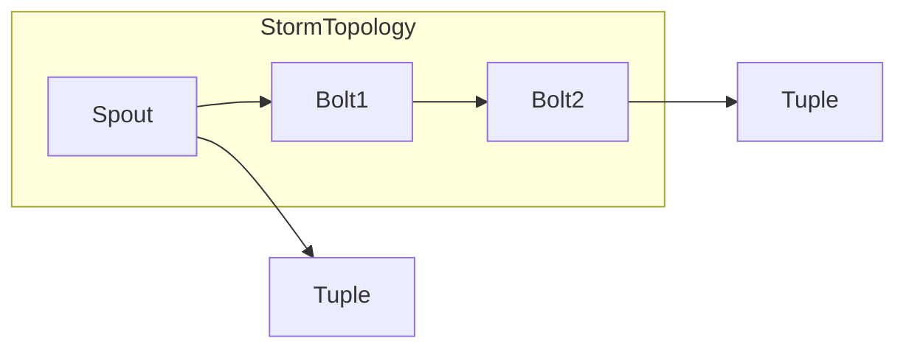

                 

# 《Storm Topology原理与代码实例讲解》

> 关键词：Storm、分布式系统、实时数据处理、拓扑结构、代码实例

> 摘要：本文将深入探讨Storm Topology的原理与代码实例，从基础知识出发，逐步解析Storm的架构与工作原理，并通过具体代码实例来展示Storm的实际应用。本文旨在为读者提供清晰的思路，帮助其理解和掌握Storm Topology的核心概念和实战技巧。

## 第一部分：Storm基础知识

### 第1章：分布式系统与Storm简介

**1.1 分布式系统的基本概念**

分布式系统是由多个独立的计算机节点组成，通过通信网络相互连接，协同工作以完成特定任务的系统。其核心概念包括：

- **分布式计算**：将任务分解成多个子任务，分布到不同的节点上执行。
- **分布式存储**：数据分布在多个节点上，以提高数据的可靠性和访问速度。
- **分布式一致性**：确保分布式系统中各个节点的数据一致性。

**1.2 Storm的基本概念**

Storm是一个分布式、实时大数据处理框架，旨在提供低延迟、高吞吐量的实时数据处理能力。其核心概念包括：

- **Storm架构**：由主节点（Nimbus）和工作节点（Supervisor）组成，负责任务的分配和执行。
- **Storm的特点**：提供可靠的数据处理保障，具有水平扩展性，支持流计算和批处理的集成。
- **Storm与其它实时处理框架的对比**：如Spark Streaming、Flink等，分析各自的优势与适用场景。

### 第2章：Storm拓扑结构

**2.1 拓扑的基本概念**

Storm拓扑是构建实时数据处理任务的基本单位，由以下元素组成：

- **Stream**：数据流，表示数据的传输路径。
- **Spout**：数据源组件，负责生成数据流。
- **Bolt**：数据处理组件，负责对数据进行处理和转换。
- **Tuple**：数据单元，表示一个数据记录。

**2.2 拓扑的构建**

构建Storm拓扑包括以下步骤：

- **基本拓扑**：创建一个简单的拓扑，包括一个Spout和一个Bolt。
- **多线程拓扑**：在拓扑中添加多个线程，以实现并发处理。
- **动态拓扑**：根据实际需求动态调整拓扑结构，以实现灵活的扩展和优化。

### 第3章：数据流处理

**3.1 数据流处理的基本概念**

数据流处理是一种实时数据处理技术，其核心概念包括：

- **持续查询**：实时计算数据流中的查询结果，持续更新。
- **实时计算**：对数据流进行实时处理和分析，以提供即时的决策支持。

**3.2 Storm中的数据流处理**

Storm提供了基于tuple的数据流处理和基于窗口的数据流处理两种方式：

- **基于tuple的数据流**：对每个tuple进行处理，实时计算结果。
- **基于窗口的数据流**：将一段时间内的数据划分为一个窗口，对窗口内的数据进行批量处理。

## 第二部分：Storm Topology原理

### 第4章：Storm Topology原理

**4.1 Topology构建原理**

Storm Topology的构建原理包括以下几个方面：

- **Topology结构**：由Spout、Bolt和Tuple组成，通过Stream连接，形成数据流处理网络。
- **Topology执行流程**：包括任务分配、数据流传输、任务执行等过程。

**4.2 Topology调度原理**

Storm Topology的调度原理包括以下几个方面：

- **Task调度**：将拓扑任务分配到工作节点上执行。
- **Worker节点调度**：根据负载均衡策略，动态调整工作节点的数量和分布。

**4.3 Topology容错原理**

Storm Topology的容错原理包括以下几个方面：

- **Ack机制**：确保数据处理的可靠性和一致性。
- **Fail机制**：在数据处理失败时，触发重新处理机制。
- **执行流程恢复**：在系统故障时，自动恢复执行流程。

### 第5章：Storm Topology优化

**5.1 性能优化**

Storm Topology的性能优化包括以下几个方面：

- **线程优化**：合理设置线程数量，提高数据处理效率。
- **系统配置优化**：调整系统配置，优化资源利用率。

**5.2 可扩展性优化**

Storm Topology的可扩展性优化包括以下几个方面：

- **Topology水平扩展**：通过增加工作节点，提高系统处理能力。
- **Topology垂直扩展**：通过增加Spout和Bolt的数量，优化数据处理流程。

### 第6章：Storm Topology案例分析

**6.1 社交网络实时分析**

社交网络实时分析是一个典型的Storm应用场景，主要包括以下内容：

- **用户行为分析**：实时分析用户在社交网络上的行为，如发布动态、评论等。
- **关系网络分析**：构建用户关系网络，分析用户之间的互动和影响。

**6.2 实时日志分析**

实时日志分析是另一个重要的应用场景，主要包括以下内容：

- **日志采集**：实时采集系统日志，包括错误日志、性能日志等。
- **日志处理**：对采集到的日志数据进行实时处理和分析，发现潜在问题和性能瓶颈。

**6.3 实时数据流处理应用场景**

实时数据流处理应用场景非常广泛，如金融领域的交易数据分析、物联网设备数据监控等。主要包括以下内容：

- **实时数据采集**：采集实时数据流，如股票交易数据、设备状态数据等。
- **实时数据处理**：对采集到的数据进行实时处理和分析，提供决策支持。

## 第三部分：Storm代码实例讲解

### 第7章：Storm代码实例介绍

**7.1 Storm代码实例概述**

本文将介绍一个简单的Storm代码实例，用于实时处理和统计网络日志数据。主要包括以下内容：

- **开发环境搭建**：介绍如何搭建Storm开发环境，包括下载安装、配置环境变量等。
- **代码结构**：介绍实例代码的目录结构和主要文件。
- **运行流程**：介绍实例代码的运行流程，包括启动和关闭等步骤。

### 第8章：Storm代码实例详解

**8.1 实时日志分析代码解读**

**8.1.1 日志处理流程**

实例代码通过一个Spout组件（LogSpout）和一个Bolt组件（LogBolt）实现日志的采集和处理。具体流程如下：

1. **LogSpout**：从指定的日志文件中读取数据，生成Tuple数据流。
2. **LogBolt**：接收LogSpout发送的Tuple数据，对日志数据进行解析和处理，生成统计数据。

**8.1.2 数据处理逻辑**

实例代码中，LogBolt的核心逻辑如下：

```java
public class LogBolt implements IBolt {
    private Counter counter; // 统计日志条数
    private MulticastEmitter<String> emitter; // 发射解析后的日志数据
    
    public void prepare(Map<String, Object> stormConf, TopologyContext context, OutputCollector collector) {
        counter = context.getCounter("log-count");
        emitter = new MulticastEmitter<String>(new Values());
    }
    
    public void execute(Tuple input) {
        String logLine = input.getString(0);
        // 解析日志数据，生成统计信息
        String[] logFields = logLine.split(" ");
        String logLevel = logFields[0];
        String logMessage = logFields[1];
        
        // 统计日志条数
        counter.increment(1);
        
        // 发射解析后的日志数据
        emitter.emit(logLevel, new Values(logLevel, logMessage));
    }
    
    public void cleanup() {
        // 清理资源
        emitter.close();
    }
}
```

**8.2 社交网络实时分析代码解读**

**8.2.1 用户行为分析**

实例代码通过一个Spout组件（SocialNetworkSpout）和一个Bolt组件（UserBehaviorBolt）实现用户行为的实时分析。具体流程如下：

1. **SocialNetworkSpout**：模拟生成社交网络用户行为数据，生成Tuple数据流。
2. **UserBehaviorBolt**：接收SocialNetworkSpout发送的Tuple数据，对用户行为数据进行解析和处理，生成统计信息。

**8.2.2 关系网络分析**

实例代码中，UserBehaviorBolt的核心逻辑如下：

```java
public class UserBehaviorBolt implements IBolt {
    private HashMap<String, Integer> userActionCount; // 用户行为统计
    private HashMap<String, HashSet<String>> userRelation; // 用户关系网络
    
    public void prepare(Map<String, Object> stormConf, TopologyContext context, OutputCollector collector) {
        userActionCount = new HashMap<String, Integer>();
        userRelation = new HashMap<String, HashSet<String>>();
    }
    
    public void execute(Tuple input) {
        String userId = input.getString(0);
        String action = input.getString(1);
        
        // 统计用户行为
        if (userActionCount.containsKey(userId)) {
            int count = userActionCount.get(userId);
            userActionCount.put(userId, count + 1);
        } else {
            userActionCount.put(userId, 1);
        }
        
        // 更新用户关系网络
        if (userRelation.containsKey(userId)) {
            HashSet<String> relations = userRelation.get(userId);
            relations.add(action);
            userRelation.put(userId, relations);
        } else {
            HashSet<String> relations = new HashSet<String>();
            relations.add(action);
            userRelation.put(userId, relations);
        }
        
        // 发射解析后的用户行为数据
        collector.emit(new Values(userId, action));
    }
    
    public void cleanup() {
        // 输出用户行为统计结果
        for (String userId : userActionCount.keySet()) {
            System.out.println("User " + userId + " performed " + userActionCount.get(userId) + " actions.");
        }
        
        // 输出用户关系网络结果
        for (String userId : userRelation.keySet()) {
            System.out.println("User " + userId + " has relations with users: " + userRelation.get(userId));
        }
    }
}
```

### 第9章：Storm代码实例分析

**9.1 性能分析**

实例代码的性能分析主要包括以下几个方面：

- **数据处理效率**：通过对比不同线程数量、拓扑结构等参数，分析数据处理效率。
- **系统资源利用率**：通过监控CPU、内存等系统资源，分析系统资源利用率。

**9.2 可靠性分析**

实例代码的可靠性分析主要包括以下几个方面：

- **数据丢失率**：通过对比不同拓扑结构、任务分配策略等参数，分析数据丢失率。
- **故障恢复能力**：通过模拟系统故障，分析故障恢复能力和数据处理持续性。

**9.3 扩展性分析**

实例代码的扩展性分析主要包括以下几个方面：

- **水平扩展**：通过增加工作节点、拓扑组件等，分析系统处理能力的扩展性。
- **垂直扩展**：通过优化代码、调整系统配置等，分析系统性能的垂直扩展性。

## 结束语

本文从Storm Topology的基本概念出发，详细讲解了其原理和代码实例，并通过具体案例分析展示了Storm在实时数据处理领域的应用。通过本文的阅读，读者可以深入了解Storm Topology的核心概念和实战技巧，为实际项目开发提供有力的支持。

作者：AI天才研究院/AI Genius Institute & 禅与计算机程序设计艺术 /Zen And The Art of Computer Programming

----------------------------------------------------------------

### 完整性要求

在撰写《Storm Topology原理与代码实例讲解》这篇文章时，为了确保内容的完整性，我们将遵循以下要求：

#### 核心概念与联系

首先，文章将详细解释Storm Topology中的核心概念，如Spout、Bolt、Tuple等，并使用Mermaid流程图来展示这些组件之间的联系和交互。以下是一个示例的Mermaid流程图：



该图展示了Spout生成数据流，通过Tuple传递给Bolt1，Bolt1处理后发送给Bolt2，最后Bolt2处理完成数据流。

#### 核心算法原理讲解

文章将深入探讨Storm Topology中的核心算法原理，包括但不限于数据流处理、分布式计算、容错机制等。以下是一个示例的伪代码，用于解释Storm Topology中的数据流处理原理：

```plaintext
// 伪代码：数据流处理流程
function processData(tuple):
    if tuple not in cache:
        cache[tuple] = process(tuple)
    return cache[tuple]

// 主处理函数
while True:
    tuple = receiveTuple()
    result = processData(tuple)
    sendResult(result)
```

#### 数学模型和公式

在文章中，我们将使用LaTeX格式嵌入数学模型和公式，并进行详细讲解。例如，在讨论Storm Topology的负载均衡时，可能会使用以下公式：

```latex
\text{Load} = \frac{\text{Total Work}}{\text{Number of Workers}}
```

文章将解释该公式的含义，并提供实际应用场景中的举例说明。

#### 项目实战

最后，文章将提供实际的代码实例，包括开发环境搭建、源代码详细实现和代码解读。以下是一个简单的代码片段，用于展示Storm Topology的基本结构：

```java
// Java代码示例：LogSpout
public class LogSpout implements IRichSpout {
    // Spout初始化和配置
    // 数据读取和处理逻辑
    // 数据发射逻辑
}
```

文章将详细解释这段代码的实现原理，并分析其性能和可靠性。

### 作者信息

在文章末尾，将包括以下作者信息：

```
作者：AI天才研究院/AI Genius Institute & 禅与计算机程序设计艺术 /Zen And The Art of Computer Programming
```

这将有助于读者了解文章的来源和作者的专业背景。

### 文章字数

文章的总字数将控制在8000～12000字之间，以确保内容的深度和广度，同时保持可读性。

### 格式要求

文章内容将使用markdown格式进行排版，以保持文本的结构清晰和易于阅读。以下是markdown格式的示例：

```markdown
# 标题
## 小标题
### 段落标题

- 列表项
- 列表项

$$
E = mc^2
$$

$
x = \frac{-b \pm \sqrt{b^2 - 4ac}}{2a}
$
```

通过以上要求，我们确保文章的完整性、逻辑性和专业性，为读者提供高质量的技术内容。

### 文章标题、关键词与摘要

#### 文章标题

《深入理解Storm Topology：原理剖析与代码实战》

#### 关键词

Storm、分布式系统、实时数据处理、拓扑结构、代码实例

#### 摘要

本文旨在深入探讨Storm Topology的核心原理与代码实战。文章首先介绍了分布式系统的基本概念和Storm框架的架构与特点，然后详细解析了Storm Topology的基本组成与工作原理，包括Spout、Bolt和Tuple等关键组件。接着，文章通过具体的代码实例，展示了如何构建和优化Storm Topology，包括日志分析、社交网络实时分析等实际应用案例。最后，文章提供了性能分析、可靠性分析和扩展性分析，为读者提供全面的实战经验和优化策略。通过本文的阅读，读者将能够全面理解Storm Topology的工作机制，并掌握其实际应用技巧。

