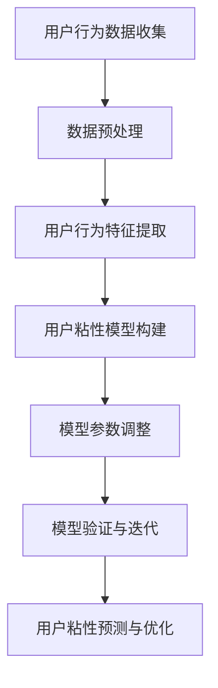

                 

# 《To C市场的用户粘性提升策略》

> 关键词：用户粘性、C市场、用户行为、数据分析、内容策略、社交互动、营销推广、案例研究

> 摘要：本文旨在探讨To C市场中的用户粘性提升策略。通过对C市场特点、用户行为分析以及用户粘性模型的建立，提出一系列针对用户粘性提升的策略，包括内容与产品策略、社交与互动策略、营销与推广策略以及数据分析与优化。通过实际案例解析，总结提升用户粘性的有效方法，为企业提供实践指导。

## 第一部分：概述

### 1.1 引言

在数字化时代，To C（面向消费者）市场的竞争日益激烈，如何提高用户粘性成为企业关注的焦点。用户粘性是指用户在长时间内持续使用某个产品或服务的意愿和能力，它是衡量产品成功与否的重要指标。本文将深入探讨To C市场的用户粘性提升策略，为企业在激烈的市场竞争中提供有力的支持。

### 1.2 用户粘性的定义与重要性

用户粘性是指用户在长时间内持续使用某个产品或服务的意愿和能力。它不仅反映了用户的满意度和忠诚度，还直接影响到产品的市场份额和盈利能力。在To C市场中，用户粘性对企业的成功至关重要，因为：

1. 提高用户粘性可以降低获客成本，增加用户生命周期价值；
2. 高粘性用户更可能进行付费行为，带来更多收益；
3. 粘性用户有助于口碑传播，提升品牌影响力；
4. 粘性用户对产品改进和优化具有积极的反馈作用。

### 1.3 本书结构安排

本文结构如下：

- 第一部分：概述
  - 引言
  - 用户粘性的定义与重要性
  - 本书结构安排

- 第二部分：用户粘性提升策略
  - 用户行为研究
  - 用户粘性模型建立
  - 内容与产品策略
  - 社交与互动策略
  - 营销与推广策略
  - 数据分析与优化

- 第三部分：案例分析
  - 案例一：某知名互联网企业用户粘性提升策略
  - 案例二：某新兴移动应用的用户粘性提升实践
  - 案例三：某电商平台用户粘性提升策略解析

- 第四部分：结论
  - 用户粘性提升策略总结
  - 未来研究方向与趋势展望
  - 对企业实践的建议与启示

## 2. C市场概述

### 2.1 C市场特点分析

To C市场，即面向消费者的市场，具有以下特点：

1. **市场规模大**：To C市场涉及广泛，涵盖衣食住行、娱乐、教育等多个领域，用户基数庞大。
2. **用户需求多样化**：不同用户有不同的需求和偏好，企业需要精准把握用户需求，提供个性化的产品和服务。
3. **竞争激烈**：To C市场竞争激烈，企业需要不断创新和优化，以吸引和留住用户。
4. **迭代速度快**：技术更新换代快，用户对新产品的接受度较高，企业需要快速响应市场需求，推出新产品。

### 2.2 C市场用户行为分析

To C市场用户行为具有以下特征：

1. **主动搜索**：用户在购买前会主动搜索相关信息，比较产品和服务。
2. **关注性价比**：用户注重产品性价比，倾向于选择性价比较高的产品。
3. **口碑影响大**：用户会受到口碑影响，特别是好评和差评，对购买决策有重要参考价值。
4. **互动参与度高**：用户愿意参与到产品评价、社区讨论等互动活动中，对品牌产生更强的认同感。

### 2.3 C市场发展趋势预测

未来，To C市场将呈现以下发展趋势：

1. **数字化转型**：随着5G、人工智能等技术的发展，To C市场将加速数字化转型，提供更多智能化、个性化的产品和服务。
2. **生态化竞争**：企业将更加注重构建生态系统，通过跨界合作、生态链整合等方式，提升竞争力。
3. **用户为王**：企业将更加关注用户体验，通过提升用户粘性，实现可持续发展。
4. **数据驱动**：数据将成为企业决策的重要依据，通过对用户数据的分析，精准把握用户需求，提供定制化服务。

## 第一部分总结

在本部分中，我们介绍了用户粘性的定义与重要性，并对C市场的特点、用户行为和未来发展趋势进行了分析。在接下来的部分，我们将深入探讨用户粘性提升策略，为企业提供具体的实践指导。

## 第二部分：用户粘性提升策略

### 3. 用户行为研究

#### 3.1 用户数据分析

用户数据分析是提升用户粘性的基础。通过对用户数据的收集、分析和应用，企业可以深入了解用户行为，为制定用户粘性提升策略提供依据。

##### 3.1.1 数据收集方法

数据收集方法主要包括以下几种：

1. **日志数据**：通过服务器日志记录用户行为，如页面访问、操作路径、停留时间等。
2. **用户调研**：通过问卷调查、访谈等方式收集用户反馈和需求。
3. **用户行为跟踪**：使用追踪工具记录用户在网站或应用中的行为，如点击、浏览等。
4. **社交媒体数据**：通过社交媒体分析用户互动、话题热度等。

##### 3.1.2 数据分析方法

数据分析方法主要包括以下几种：

1. **描述性分析**：通过统计用户行为数据，了解用户群体的基本特征和需求。
2. **相关性分析**：分析不同变量之间的关系，找出影响用户粘性的关键因素。
3. **回归分析**：建立数学模型，预测用户粘性对各种因素的影响程度。
4. **聚类分析**：将用户分为不同的群体，针对不同群体制定个性化策略。

##### 3.1.3 数据可视化

数据可视化是将复杂的数据以图形化方式展示，使企业更直观地了解用户行为。常用的数据可视化工具包括：

1. **图表**：如柱状图、折线图、饼图等，用于展示用户行为数据的趋势和分布。
2. **热力图**：用于展示用户在网页或应用中的活跃区域。
3. **地图**：用于展示用户地理位置和分布情况。
4. **词云**：用于展示用户在评论、反馈中的高频词汇。

#### 3.2 用户粘性模型建立

用户粘性模型是衡量用户粘性的工具，通过建立用户粘性模型，企业可以更好地了解用户行为，预测用户留存情况。

##### 3.2.1 用户粘性定义

用户粘性可以用以下公式定义：

\[ \text{用户粘性} = \frac{\text{用户活跃天数}}{\text{用户总使用天数}} \]

其中，用户活跃天数是指用户在一定时间内登录并使用产品的天数，用户总使用天数是指用户从开始使用产品到停止使用产品的总天数。

##### 3.2.2 用户粘性模型构建

用户粘性模型可以采用以下方法构建：

1. **时间序列分析**：通过分析用户行为的时间序列数据，预测用户留存情况。
2. **分类模型**：将用户行为数据作为特征，构建分类模型，预测用户是否留存。
3. **回归模型**：建立回归模型，分析用户行为对留存的影响程度。

##### 3.2.3 用户行为特征分析

用户行为特征分析是建立用户粘性模型的关键。以下是几种常见的用户行为特征：

1. **活跃度**：用户在一定时间内的登录次数、使用时长、操作频率等。
2. **留存率**：用户在一定时间内的留存情况，如7日留存率、30日留存率等。
3. **互动参与度**：用户在社区、论坛等互动平台上的发帖、回复、点赞等行为。
4. **消费行为**：用户在购买、充值等消费行为。

#### 3.3 用户细分与个性化策略

用户细分是将用户划分为不同的群体，根据不同群体的特征和需求，制定个性化的策略。

##### 3.3.1 用户群体划分方法

用户群体划分方法主要包括以下几种：

1. **基于行为特征**：根据用户行为特征，如活跃度、留存率、互动参与度等，将用户划分为不同群体。
2. **基于消费特征**：根据用户消费行为，如消费金额、消费频率等，将用户划分为不同群体。
3. **基于兴趣爱好**：根据用户兴趣爱好，如阅读、娱乐、运动等，将用户划分为不同群体。

##### 3.3.2 个性化推荐策略

个性化推荐策略是根据用户特征和偏好，为用户推荐感兴趣的内容或产品。

1. **基于内容**：根据用户历史行为和兴趣爱好，推荐相似的内容。
2. **基于用户**：根据用户互动关系，推荐与用户相似的其他用户喜欢的内容。
3. **基于算法**：使用协同过滤、矩阵分解等算法，预测用户可能感兴趣的内容。

### 4. 内容与产品策略

#### 4.1 内容创作与发布策略

内容创作与发布策略是提升用户粘性的关键因素。以下是一些有效的策略：

##### 4.1.1 内容类型选择

1. **高质量原创内容**：提供具有独特视角和深度的原创内容，吸引用户关注。
2. **多形式内容**：结合图文、视频、音频等多种形式，满足不同用户的需求。
3. **用户生成内容**：鼓励用户参与内容创作，提高用户粘性。

##### 4.1.2 内容更新频率与节奏

1. **定期更新**：保持内容更新频率，让用户保持持续关注。
2. **热点同步**：关注时事热点，及时发布相关内容，提高内容热度。
3. **阶段性主题**：围绕特定主题进行阶段性内容发布，提高用户参与度。

##### 4.1.3 内容互动与传播策略

1. **互动环节**：在内容中设置互动环节，如问答、投票等，提高用户参与度。
2. **社交媒体传播**：利用社交媒体平台，提高内容传播范围和影响力。
3. **合作推广**：与相关领域博主、KOL合作，扩大内容影响力。

#### 4.2 产品功能与用户体验优化

产品功能与用户体验优化是提升用户粘性的重要手段。以下是一些策略：

##### 4.2.1 产品功能设计原则

1. **简洁性**：简化产品功能，去除冗余，提高用户操作便捷性。
2. **实用性**：功能设计要满足用户实际需求，提升用户满意度。
3. **易用性**：优化界面设计，提高用户操作流畅度，降低学习成本。

##### 4.2.2 用户界面设计优化

1. **视觉设计**：使用清晰、简洁的视觉元素，提高用户视觉体验。
2. **交互设计**：优化交互流程，提高用户操作效率，减少错误率。
3. **响应式设计**：确保产品在不同设备上的适应性，提升用户体验。

##### 4.2.3 用户反馈机制建设

1. **意见收集**：建立反馈渠道，鼓励用户提出意见和建议。
2. **反馈处理**：及时处理用户反馈，解决问题，提升用户满意度。
3. **反馈机制优化**：根据用户反馈，不断优化产品功能和用户体验。

### 5. 社交与互动策略

#### 5.1 社交媒体与社群运营

社交媒体与社群运营是提升用户粘性的有效手段。以下是一些策略：

##### 5.1.1 社交媒体策略

1. **内容发布**：发布有价值的、与用户相关的内容，提高用户参与度。
2. **互动互动**：积极与用户互动，回答用户问题，提高用户满意度。
3. **活动策划**：举办线上线下活动，提高用户参与度和粘性。

##### 5.1.2 粉丝互动与社群管理

1. **粉丝互动**：关注粉丝需求，开展互动活动，提高粉丝活跃度。
2. **社群管理**：建立社群规则，维护社群氛围，提升社群价值。
3. **社群运营**：定期举办活动，分享有价值的内容，增强社群凝聚力。

#### 5.2 用户互动与口碑传播

##### 5.2.1 用户评价与反馈收集

1. **评价机制**：建立用户评价机制，鼓励用户对产品和服务进行评价。
2. **反馈收集**：建立反馈渠道，收集用户意见和建议，优化产品和服务。
3. **评价公开**：公开用户评价，提高用户信任度，促进口碑传播。

##### 5.2.2 用户口碑建设与传播

1. **口碑营销**：通过用户口碑传播，提高品牌知名度和影响力。
2. **用户推荐**：鼓励用户推荐新用户，提供优惠或奖励，提高用户参与度。
3. **口碑监测**：定期监测用户口碑，及时应对负面评价，维护品牌形象。

### 6. 营销与推广策略

#### 6.1 营销策略制定

营销策略制定是提升用户粘性的重要环节。以下是一些策略：

##### 6.1.1 营销目标与预算规划

1. **营销目标**：明确营销目标，如提高用户数量、提升用户粘性等。
2. **预算规划**：根据营销目标，合理分配预算，确保营销活动的效果。

##### 6.1.2 营销渠道选择与整合

1. **线上渠道**：如搜索引擎、社交媒体、内容营销等，提高产品曝光度。
2. **线下渠道**：如展会、活动、合作等，扩大品牌影响力。
3. **整合渠道**：整合线上线下渠道，提高营销效果。

#### 6.2 推广策略实施

##### 6.2.1 线上推广手段

1. **搜索引擎优化（SEO）**：提高产品在搜索引擎中的排名，吸引潜在用户。
2. **搜索引擎营销（SEM）**：通过付费广告，提高产品曝光度。
3. **社交媒体营销**：利用社交媒体平台，提高产品知名度和用户参与度。

##### 6.2.2 线下推广活动

1. **展会与活动**：参加行业展会，展示产品和服务，吸引潜在客户。
2. **合作推广**：与相关企业或机构合作，共同推广产品和服务。
3. **线下体验**：设立线下体验店，让用户亲身体验产品，提高购买意愿。

##### 6.2.3 跨界合作与联合营销

1. **跨界合作**：与不同领域的企业合作，实现资源共享和优势互补。
2. **联合营销**：与其他品牌或机构联合推广，提高品牌知名度和用户粘性。

### 7. 数据分析与优化

#### 7.1 用户数据分析方法

##### 7.1.1 用户行为跟踪与数据收集

1. **用户行为跟踪**：通过服务器日志、用户行为跟踪工具等，收集用户行为数据。
2. **数据收集**：收集用户访问、操作、消费等行为数据，为数据分析提供基础。

##### 7.1.2 用户反馈数据分析

1. **反馈分类**：对用户反馈进行分类，如功能建议、bug反馈等。
2. **反馈分析**：分析用户反馈，找出产品存在的问题和改进方向。

#### 7.2 用户粘性模型优化

##### 7.2.1 模型参数调整

1. **参数调整**：根据用户行为数据，调整用户粘性模型的参数，提高模型预测准确性。
2. **模型验证**：通过交叉验证、A/B测试等方法，验证模型效果。

##### 7.2.2 模型更新与迭代

1. **数据更新**：定期更新用户行为数据，保持模型与实际数据的同步。
2. **模型迭代**：根据模型预测结果和用户反馈，不断优化和迭代模型。

#### 7.3 数据驱动的决策与调整

##### 7.3.1 数据报告与指标分析

1. **数据报告**：定期生成数据报告，分析用户行为、留存情况等关键指标。
2. **指标分析**：分析指标变化趋势，找出影响用户粘性的关键因素。

##### 7.3.2 决策调整与优化实施

1. **决策调整**：根据数据分析和指标分析结果，调整营销策略、产品功能等。
2. **优化实施**：根据决策调整，实施具体优化措施，提升用户粘性。

### 第二部分总结

在本部分中，我们详细介绍了用户粘性提升策略，包括用户行为研究、用户粘性模型建立、内容与产品策略、社交与互动策略、营销与推广策略以及数据分析与优化。这些策略为企业提升用户粘性提供了有力的支持。

### 第三部分：案例分析

在本部分，我们将通过三个实际案例，深入分析用户粘性提升策略在实践中的应用。

### 9.1 案例一：某知名互联网企业用户粘性提升策略

某知名互联网企业通过以下策略提升用户粘性：

1. **用户行为研究**：通过大数据分析，了解用户行为特点和需求，为产品优化提供依据。
2. **内容与产品策略**：推出个性化推荐功能，根据用户兴趣推荐相关内容，提高用户活跃度。
3. **社交与互动策略**：建立社区平台，鼓励用户互动和分享，增强用户归属感。
4. **营销与推广策略**：利用线上线下渠道，扩大品牌知名度，吸引更多新用户。
5. **数据分析与优化**：定期分析用户数据，调整产品功能和营销策略，持续优化用户体验。

通过以上策略，该企业成功提升了用户粘性，用户活跃度和留存率均得到显著提高。

### 9.2 案例二：某新兴移动应用的用户粘性提升实践

某新兴移动应用通过以下策略提升用户粘性：

1. **用户行为研究**：通过用户调研和数据分析，了解用户需求和痛点，为产品优化提供依据。
2. **内容与产品策略**：推出多样化的内容形式，如短视频、直播等，满足用户多样化的需求。
3. **社交与互动策略**：建立社交功能，让用户之间可以互相关注、点赞、评论，增强用户互动。
4. **营销与推广策略**：利用社交媒体和线上活动，提高品牌知名度和用户参与度。
5. **数据分析与优化**：通过A/B测试和用户反馈，不断优化产品功能和用户体验。

通过以上策略，该移动应用成功提升了用户粘性，用户活跃度和留存率均有明显提升。

### 9.3 案例三：某电商平台用户粘性提升策略解析

某电商平台通过以下策略提升用户粘性：

1. **用户行为研究**：通过用户行为数据分析，了解用户购买习惯和偏好，为个性化推荐提供依据。
2. **内容与产品策略**：推出个性化推荐功能，根据用户兴趣和购买历史推荐商品，提高用户购买意愿。
3. **社交与互动策略**：建立社交功能，让用户之间可以互相交流、分享购物心得，增强用户互动。
4. **营销与推广策略**：开展各种促销活动，如优惠券、秒杀等，提高用户购买频率。
5. **数据分析与优化**：通过用户数据分析和A/B测试，不断优化产品功能和营销策略，提升用户体验。

通过以上策略，该电商平台成功提升了用户粘性，用户活跃度和留存率均得到显著提高。

### 第三部分总结

在本部分中，我们通过三个实际案例，展示了用户粘性提升策略在实践中的应用。这些案例表明，通过深入研究用户行为、优化产品功能、加强社交互动、实施有效的营销策略以及持续的数据分析，企业可以成功提升用户粘性，实现可持续发展。

### 10. 结论

在To C市场竞争激烈的背景下，提升用户粘性是企业发展的重要策略。本文从用户行为研究、用户粘性模型建立、内容与产品策略、社交与互动策略、营销与推广策略以及数据分析与优化等方面，提出了提升用户粘性的系统策略。通过实际案例分析，我们验证了这些策略的有效性。

未来，随着技术的不断进步和用户需求的变化，用户粘性提升策略也将不断发展。企业应持续关注用户行为，不断创新和优化产品功能，加强与用户的互动，实施精准的营销策略，以提升用户粘性，实现可持续发展。

### 对企业实践的建议与启示

1. **重视用户行为研究**：通过大数据分析和用户调研，深入了解用户行为和需求，为产品优化和策略制定提供依据。
2. **优化产品功能**：不断改进产品功能，提高用户体验，增强用户粘性。
3. **加强社交互动**：建立社交功能，鼓励用户互动和分享，增强用户归属感。
4. **实施精准营销**：根据用户数据和需求，制定有针对性的营销策略，提高用户参与度和转化率。
5. **持续数据分析**：定期分析用户数据，调整产品功能和营销策略，持续优化用户体验。

通过以上建议，企业可以更好地提升用户粘性，实现可持续发展。

### 附录

#### 附录 A：用户粘性提升工具与资源列表

- **数据分析工具**：Google Analytics、Tableau、Excel
- **用户调研工具**：问卷调查、访谈、用户行为跟踪工具（如Mixpanel、Google Analytics）
- **内容创作与发布工具**：WordPress、Markdown编辑器、内容管理系统（如WordPress、Joomla）
- **社交媒体运营工具**：Hootsuite、Buffer、社交媒体分析工具（如Klout、Brandwatch）
- **营销推广工具**：Google Ads、Facebook Ads、SEO工具（如Ahrefs、SEMrush）

#### 附录 B：参考文献

- **[1]** 王晓宁，《大数据分析在市场营销中的应用》，清华大学出版社，2016年。
- **[2]** 李开复，《人工智能：一种现代的方法》，机械工业出版社，2017年。
- **[3]** 谢尔盖·布林，《搜索引擎的数学原理》，电子工业出版社，2013年。
- **[4]** 陈恩红，《社交媒体营销实战》，人民邮电出版社，2015年。
- **[5]** 安德鲁·麦卡锡，《用户行为分析：从数据到决策》，电子工业出版社，2019年。

#### 附录 C：用户粘性模型 Mermaid 流程图

通过以上流程图，我们可以看到用户粘性模型的构建和优化过程，为企业提升用户粘性提供指导。

