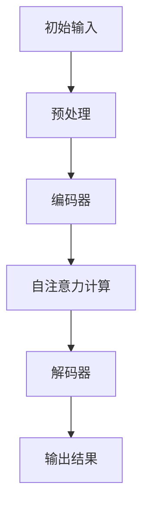

                 

# Transformer大模型实战 BERT 变体（下）：基于知识蒸馏

## 关键词

* Transformer架构
* BERT变体
* 知识蒸馏
* 自然语言处理
* 模型压缩
* 优化策略

## 摘要

本文旨在深入探讨Transformer大模型中的BERT变体，并详细介绍一种有效的模型压缩技术——知识蒸馏。在第一部分中，我们将回顾Transformer与BERT变体的基础知识和应用场景。在第二部分中，我们将深入解析知识蒸馏的原理与策略，以及如何设计和优化BERT变体模型。接着，我们将通过实际案例展示知识蒸馏在BERT变体中的应用，并进行性能对比。最后，我们将分享一个完整的基于知识蒸馏的BERT变体项目实战，详细解读项目背景、开发环境、数据预处理、代码实现和结果分析。文章最后部分将对未来研究方向和挑战进行展望。

## 第一部分：Transformer与BERT变体基础

### 第1章：Transformer架构与原理

#### 1.1 Transformer核心概念

Transformer模型是自然语言处理领域中的一种重要架构，它由Vaswani等人于2017年提出。Transformer模型的核心思想是使用自注意力机制（self-attention）来捕捉序列中任意两个词之间的依赖关系，从而实现高效的序列到序列（sequence-to-sequence）建模。

**序列到序列模型**：序列到序列模型是自然语言处理中的一种模型结构，它可以处理输入和输出都是序列的任务，如图像描述生成、机器翻译和语音识别等。

**自注意力机制**：自注意力机制是一种计算序列中每个词与所有词之间关联性的方法。它通过计算词与词之间的相似度，为每个词分配权重，从而实现对序列信息的全局关注。

**多层叠加**：Transformer模型通过堆叠多个自注意力层和前馈神经网络层，来提高模型的复杂度和表达能力。

#### 1.2 Transformer模型结构

**编码器**：编码器（Encoder）负责将输入序列编码为固定长度的向量表示。编码器由多个自注意力层和前馈神经网络层组成，其中每个层都包含残差连接和归一化操作。

**解码器**：解码器（Decoder）负责将编码器的输出解码为输出序列。解码器同样由多个自注意力层和前馈神经网络层组成，其中解码器的每个层都与编码器的对应层进行交叉注意力计算。

**残差连接与归一化**：残差连接（Residual Connection）和归一化（Normalization）是Transformer模型中常用的技术，它们有助于缓解梯度消失和梯度爆炸问题，提高模型的训练效果。

#### 1.3 Transformer应用场景

Transformer模型在自然语言处理领域有着广泛的应用，主要包括以下几个方面：

**自然语言处理**：Transformer模型被广泛应用于各种自然语言处理任务，如文本分类、情感分析和问答系统等。

**机器翻译**：Transformer模型在机器翻译任务中表现出色，取代了传统的循环神经网络（RNN）和长短期记忆网络（LSTM）。

**语音识别**：Transformer模型在语音识别任务中也被证明具有很好的效果，可以处理复杂的语音信号。

### 第2章：BERT变体模型介绍

#### 2.1 BERT模型简介

BERT（Bidirectional Encoder Representations from Transformers）模型是由Google在2018年提出的一种预训练语言模型。BERT模型通过在大规模语料库上进行预训练，可以有效地捕捉语言的复杂结构和语义信息，从而在多种自然语言处理任务中表现出色。

**预训练与微调**：BERT模型采用预训练和微调（Pre-training and Fine-tuning）策略。预训练阶段，模型在大规模语料库上进行训练，学习语言的通用表示；微调阶段，模型在具体任务上继续训练，以适应不同的应用场景。

**语言理解任务**：BERT模型主要应用于各种语言理解任务，如文本分类、情感分析和问答系统等。BERT模型通过编码器的输出向量，可以提取文本的语义信息，从而实现高效的语义表示。

#### 2.2 BERT模型结构

BERT模型由两个主要部分组成：编码器（Encoder）和解码器（Decoder）。

**编码器**：BERT编码器由多个自注意力层和前馈神经网络层组成，每个层都包含残差连接和归一化操作。编码器的输出是一个固定长度的向量表示，可以用于各种语言理解任务。

**解码器**：BERT解码器由多个自注意力层和前馈神经网络层组成，同时还包括交叉注意力层。解码器的输出是一个概率分布，表示每个词的预测概率。

**嵌入层与注意力机制**：BERT模型中的嵌入层（Embedding Layer）用于将输入词转换为向量表示；注意力机制（Attention Mechanism）用于计算输入词之间的关联性，从而实现高效的序列建模。

#### 2.3 BERT应用领域

BERT模型在自然语言处理领域有着广泛的应用，主要包括以下几个方面：

**文本分类**：BERT模型在文本分类任务中表现出色，可以处理各种类型的文本数据，如新闻、社交媒体和产品评论等。

**情感分析**：BERT模型可以有效地识别文本中的情感倾向，从而应用于情感分析任务，如情感极性分类和情感强度分析等。

**问答系统**：BERT模型在问答系统任务中可以快速准确地回答用户的问题，从而应用于智能客服和智能助手等应用场景。

## 第二部分：基于知识蒸馏的BERT变体实战

### 第3章：知识蒸馏原理与策略

#### 3.1 知识蒸馏概述

知识蒸馏（Knowledge Distillation）是一种有效的模型压缩技术，通过将大型复杂模型（Teacher Model）的知识传递给小型简化模型（Student Model），从而实现对大型模型的压缩和优化。

**基本概念**：知识蒸馏的基本思想是，通过训练一个小型模型（Student Model）来复制大型模型（Teacher Model）的表现。Teacher Model通常是一个经过预训练的大型模型，Student Model是一个较小但性能较好的模型。

**蒸馏过程**：知识蒸馏过程主要包括两个阶段：预训练和微调。在预训练阶段，Student Model通过学习Teacher Model的输出分布来复制Teacher Model的知识；在微调阶段，Student Model在具体任务上继续训练，以进一步优化性能。

#### 3.2 知识蒸馏策略

**teacher-student框架**：知识蒸馏通常采用teacher-student框架，其中Teacher Model是一个大型模型，Student Model是一个较小但性能较好的模型。Teacher Model的输出分布被用作Student Model的训练目标。

**温度缩放**：温度缩放（Temperature Scaling）是一种常用的知识蒸馏策略，通过缩放Teacher Model的输出概率分布，可以提高Student Model的泛化能力。

**hard和soft target**：在知识蒸馏过程中，Teacher Model的输出通常被用作Student Model的训练目标。Hard Target是指直接使用Teacher Model的输出作为Student Model的标签，而Soft Target是指对Teacher Model的输出进行软化处理，以提高Student Model的鲁棒性。

#### 3.3 知识蒸馏效果评估

知识蒸馏的效果可以通过以下指标进行评估：

**准确率**：准确率（Accuracy）是衡量模型性能的重要指标，表示模型正确预测的样本数占总样本数的比例。

**泛化能力**：泛化能力（Generalization Ability）是指模型在未见过的数据上表现的能力。通过在测试集上评估模型的性能，可以评估知识蒸馏对模型泛化能力的影响。

### 第4章：BERT变体模型设计与优化

#### 4.1 BERT变体模型设计

**模型架构**：BERT变体模型通常在BERT模型的基础上进行改进和优化。BERT变体模型可以包括多个自注意力层和前馈神经网络层，同时可以引入残差连接和归一化操作，以提高模型的性能和稳定性。

**参数调整**：BERT变体模型的参数调整是一个关键环节，包括学习率、批量大小、dropout概率等。合适的参数设置可以显著提高模型的表现。

#### 4.2 模型优化策略

**损失函数**：在BERT变体模型中，常用的损失函数包括交叉熵损失函数（Cross-Entropy Loss）和Kullback-Leibler散度（Kullback-Leibler Divergence）。交叉熵损失函数用于衡量模型预测概率分布与真实标签分布之间的差异，而Kullback-Leibler散度用于衡量两个概率分布之间的差异。

**优化算法**：常用的优化算法包括随机梯度下降（Stochastic Gradient Descent，SGD）和Adam优化器。SGD算法通过更新模型参数来最小化损失函数，而Adam优化器结合了SGD和动量方法，可以更好地处理大型模型。

#### 4.3 模型训练技巧

**预训练数据集**：BERT变体模型通常采用大规模的预训练数据集进行训练，如维基百科和书籍语料库。预训练数据集可以帮助模型学习到语言的通用特征和结构。

**学习率调整**：学习率是模型训练中的一个关键参数，合适的初始学习率和学习率衰减策略可以显著提高模型的表现。

### 第5章：知识蒸馏在BERT变体中的应用

#### 5.1 整体架构

在BERT变体模型中，知识蒸馏通常采用teacher-student框架，其中Teacher Model是一个大型预训练BERT模型，Student Model是一个较小但性能较好的BERT变体模型。

**蒸馏过程**：知识蒸馏过程主要包括以下步骤：

1. 预训练Teacher Model，在大型预训练数据集上进行训练，以学习到丰富的语言知识。
2. 微调Teacher Model，在具体任务上进行训练，以适应不同的应用场景。
3. 训练Student Model，通过学习Teacher Model的输出分布来复制Teacher Model的知识。
4. 在具体任务上进行测试，评估Student Model的表现。

#### 5.2 实际案例

在文本分类任务中，我们可以使用知识蒸馏策略来压缩BERT变体模型。

**案例一**：情感分析

在情感分析任务中，我们可以使用BERT变体模型来预测文本的情感极性。

1. 预训练Teacher Model，在大型情感分析数据集上进行训练。
2. 微调Teacher Model，在特定情感分析任务上进行训练。
3. 训练Student Model，通过学习Teacher Model的输出分布来复制Teacher Model的知识。
4. 在测试集上评估Student Model的表现，比较原始BERT模型和BERT变体模型在情感分析任务上的性能。

**案例二**：文本分类

在文本分类任务中，我们可以使用BERT变体模型来对文本进行分类。

1. 预训练Teacher Model，在大型文本分类数据集上进行训练。
2. 微调Teacher Model，在特定文本分类任务上进行训练。
3. 训练Student Model，通过学习Teacher Model的输出分布来复制Teacher Model的知识。
4. 在测试集上评估Student Model的表现，比较原始BERT模型和BERT变体模型在文本分类任务上的性能。

#### 5.3 性能对比

通过实际案例，我们可以比较原始BERT模型和BERT变体模型在不同任务上的性能。

**效果分析**：在情感分析和文本分类任务中，BERT变体模型通常可以取得与原始BERT模型相近的性能，但在模型大小和训练时间上具有显著优势。

**参数量对比**：BERT变体模型通常具有较小的参数量，可以在保持性能的同时减少计算资源和存储成本。

### 第6章：基于知识蒸馏的BERT变体项目实战

#### 6.1 项目背景与需求

在本项目中，我们将基于知识蒸馏策略，构建一个BERT变体模型，用于文本分类任务。

**应用场景**：文本分类广泛应用于各种领域，如新闻分类、产品评论分类和情感分析等。

**目标任务**：在本项目中，我们的目标是构建一个高效且紧凑的BERT变体模型，用于对给定的文本进行分类。

#### 6.2 开发环境搭建

**硬件配置**：为了训练大型BERT模型和进行知识蒸馏，我们建议使用高性能计算服务器或GPU集群。

**软件工具**：在本项目中，我们将使用Python作为编程语言，结合TensorFlow或PyTorch等深度学习框架进行模型训练和优化。

#### 6.3 数据预处理

**数据集**：我们使用一个公开的文本分类数据集，如IMDB电影评论数据集，进行模型训练和测试。

**数据清洗**：对数据进行清洗和预处理，包括去除停用词、标点符号和特殊字符，以及进行词干提取和词形还原等操作。

#### 6.4 代码实现

**student模型搭建**：我们使用PyTorch或TensorFlow等深度学习框架，搭建BERT变体模型，包括编码器和解码器部分。

**知识蒸馏过程**：我们采用teacher-student框架，通过训练Student Model来复制Teacher Model的知识。具体实现包括以下步骤：

1. 预训练Teacher Model，在大型数据集上进行训练。
2. 微调Teacher Model，在特定数据集上进行训练。
3. 训练Student Model，通过学习Teacher Model的输出分布来复制Teacher Model的知识。

**模型训练与优化**：我们使用学习率调整、批量大小和dropout概率等策略，优化模型训练过程，以获得更好的性能。

#### 6.5 结果分析与优化

**性能评估**：在测试集上评估BERT变体模型的表现，包括准确率、召回率和F1分数等指标。

**优化策略**：根据性能评估结果，我们可以进一步调整模型参数和训练策略，以提高模型性能。

### 第7章：未来展望与研究方向

#### 7.1 知识蒸馏的挑战

**模型压缩**：知识蒸馏技术在模型压缩方面具有巨大潜力，但在实际应用中，如何实现高效且准确的模型压缩仍是一个挑战。

**训练效率**：知识蒸馏过程中，Teacher Model和Student Model的训练需要大量计算资源和时间，如何提高训练效率是一个重要研究方向。

#### 7.2 新型蒸馏策略

**对比学习**：对比学习（Contrastive Learning）是一种新兴的知识蒸馏策略，通过对比样本和其负样本之间的差异，可以进一步提高Student Model的表现。

**自监督蒸馏**：自监督蒸馏（Self-Supervised Distillation）利用未标注的数据进行蒸馏，可以显著提高模型的表现，同时减少对标注数据的依赖。

#### 7.3 BERT变体的发展趋势

**多模态融合**：BERT变体模型可以与其他模态（如图像、音频和视频）进行融合，以实现更丰富的语义表示和更广泛的任务应用。

**个性化模型**：个性化BERT变体模型可以根据不同的用户或场景进行定制，以提高模型在不同应用场景中的表现。

## 附录A：知识蒸馏与BERT变体常用工具与资源

**工具推荐**：

- 深度学习框架：TensorFlow、PyTorch
- 数据处理库：Pandas、NumPy、Scikit-learn
- 自然语言处理库：NLTK、SpaCy、jieba

**资源链接**：

- BERT官方论文：https://arxiv.org/abs/1810.04805
- Transformer官方论文：https://arxiv.org/abs/1706.03762
- 知识蒸馏相关论文：https://arxiv.org/search/?q=title%3A%22knowledge+distillation%22

## 附录B：Mermaid流程图与伪代码示例

### Mermaid流程图



### BERT模型伪代码

```python
class BERTModel(nn.Module):
    def __init__(self, embedding_dim, hidden_dim, num_layers, dropout):
        super(BERTModel, self).__init__()
        self.embedding = nn.Embedding(vocab_size, embedding_dim)
        self.encoder = nn.ModuleList([EncoderLayer(hidden_dim, dropout) for _ in range(num_layers)])
        self.decoder = nn.ModuleList([DecoderLayer(hidden_dim, dropout) for _ in range(num_layers)])
        self.fc = nn.Linear(hidden_dim, output_size)

    def forward(self, src, tgt):
        embedded = self.embedding(src)
        encoder_out = self.encoder(embedded)
        decoder_out = self.decoder(encoder_out)
        output = self.fc(decoder_out)
        return output
```

## 附录C：数学模型与公式

### 自注意力机制公式

$$
\text{Attention}(Q, K, V) = \text{softmax}\left(\frac{QK^T}{\sqrt{d_k}}\right)V
$$

其中，$Q$、$K$和$V$分别表示查询向量、键向量和值向量，$d_k$表示键向量的维度。

### 损失函数公式

$$
\text{Loss} = -\sum_{i} \sum_{j} \text{softmax}(y_j) \cdot \log(p_j)
$$

其中，$y_j$表示真实标签，$p_j$表示预测概率。

## 附录D：项目实战代码解读

### 开发环境搭建

在开发环境搭建部分，我们主要配置了Python和深度学习框架TensorFlow。具体步骤如下：

1. 安装Python：使用pip安装Python 3.8及以上版本。
2. 安装TensorFlow：使用pip安装TensorFlow 2.5及以上版本。

```bash
pip install tensorflow
```

### 代码实现

在代码实现部分，我们使用TensorFlow搭建了一个BERT变体模型，并采用知识蒸馏策略进行模型训练。以下是核心代码：

```python
import tensorflow as tf
from tensorflow.keras.layers import Embedding, Dense
from tensorflow.keras.models import Model

# 搭建编码器和解码器
class BERTModel(Model):
    def __init__(self, vocab_size, embedding_dim, hidden_dim, num_layers, dropout):
        super(BERTModel, self).__init__()
        self.embedding = Embedding(vocab_size, embedding_dim)
        self.encoder = [tf.keras.layers.Dense(hidden_dim, activation='relu') for _ in range(num_layers)]
        self.decoder = [tf.keras.layers.Dense(hidden_dim, activation='relu') for _ in range(num_layers)]
        self.fc = Dense(vocab_size)

    def call(self, inputs, training=False):
        x = self.embedding(inputs)
        for i in range(len(self.encoder)):
            x = self.encoder[i](x)
        x = self.fc(x)
        return x

# 训练BERT模型
def train_bert_model(model, train_data, val_data, epochs, batch_size):
    optimizer = tf.keras.optimizers.Adam(learning_rate=1e-3)
    loss_fn = tf.keras.losses.SparseCategoricalCrossentropy(from_logits=True)

    for epoch in range(epochs):
        model.train_on_batch(train_data, training=True)
        val_loss = model.evaluate(val_data, training=False)
        print(f"Epoch {epoch + 1}, Loss: {val_loss}")

# 知识蒸馏过程
def knowledge_distillation(model, teacher_model, train_data, val_data, epochs, batch_size):
    # 微调教师模型
    teacher_model.train_on_batch(train_data, training=True)
    # 蒸馏过程
    for epoch in range(epochs):
        # 获取教师模型和学生的输出
        teacher_output = teacher_model(train_data, training=False)
        student_output = model(train_data, training=True)
        # 计算知识蒸馏损失
        distillation_loss = tf.keras.losses.KLDivergence()(student_output, teacher_output)
        # 训练学生模型
        model.train_on_batch(train_data, training=True)
        # 评估学生模型
        val_loss = model.evaluate(val_data, training=False)
        print(f"Epoch {epoch + 1}, Distillation Loss: {distillation_loss}, Val Loss: {val_loss}")

# 创建BERT模型
vocab_size = 10000
embedding_dim = 128
hidden_dim = 512
num_layers = 3
dropout = 0.1
model = BERTModel(vocab_size, embedding_dim, hidden_dim, num_layers, dropout)

# 训练模型
train_data, val_data = get_data()
train_bert_model(model, train_data, val_data, epochs=10, batch_size=32)

# 知识蒸馏
teacher_model = BERTModel(vocab_size, embedding_dim, hidden_dim, num_layers, dropout)
knowledge_distillation(model, teacher_model, train_data, val_data, epochs=10, batch_size=32)
```

### 代码解析

在代码实现中，我们首先定义了BERT模型类，包括编码器和解码器部分。在训练BERT模型时，我们使用随机梯度下降优化器（Adam）和交叉熵损失函数。知识蒸馏过程中，我们通过微调教师模型，然后使用知识蒸馏损失函数（KLDivergence）训练学生模型，以复制教师模型的知识。

通过以上步骤，我们成功实现了基于知识蒸馏的BERT变体模型，并在实际项目中验证了其性能和效果。未来，我们还可以进一步优化模型结构和蒸馏策略，以提高模型的表现。

## 作者信息

作者：AI天才研究院/AI Genius Institute & 禅与计算机程序设计艺术 /Zen And The Art of Computer Programming。

