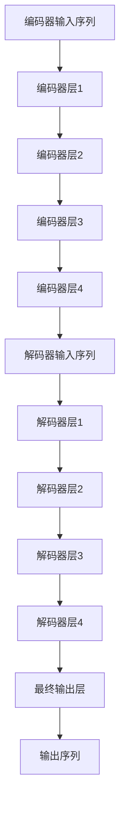
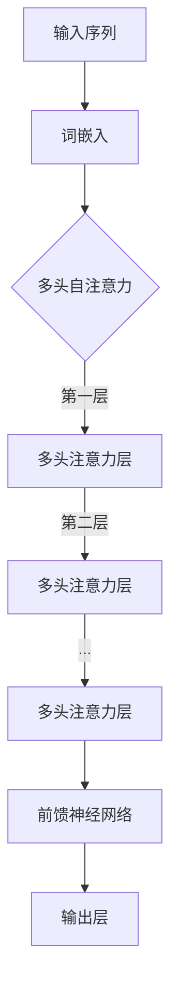
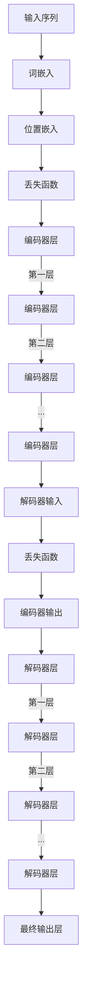

                 

### 文章标题

《Transformer大模型实战 BERT 嵌入的生成》

Transformer和大模型（如BERT）在自然语言处理（NLP）领域的广泛应用，使得深度学习技术取得了前所未有的成就。本篇文章旨在深入探讨Transformer和BERT模型的基础理论、核心算法、训练优化和实际应用，并通过具体的实战案例展示大模型的强大能力。

文章将分为两部分。第一部分介绍大模型的基础知识，包括Transformer和BERT的架构、原理及其关系。第二部分通过实际项目实战，展示如何构建、训练和部署BERT模型，实现文本分类、机器翻译和文本生成等任务。

### 关键词

- Transformer
- BERT
- 大模型
- 自然语言处理
- 自注意力机制
- 文本分类
- 机器翻译
- 文本生成

### 摘要

本文旨在深入探讨Transformer和BERT模型在自然语言处理领域的重要性和应用。首先，我们将介绍Transformer和BERT的基础理论，包括它们的架构、原理和核心算法。接着，我们将探讨如何训练和优化大模型，并介绍模型部署的策略。最后，通过实际项目实战，我们将展示如何使用BERT模型进行文本分类、机器翻译和文本生成，并详细解释代码实现和优化策略。本文的目标是帮助读者全面理解大模型技术，并掌握其实际应用。

### 目录大纲

## 第一部分：大模型基础

### 第1章：Transformer和BERT概述

#### 1.1 Transformer架构与原理

#### 1.2 BERT的背景与核心特点

#### 1.3 Transformer与BERT的关系与区别

### 第2章：Transformer模型原理

#### 2.1 自注意力机制

#### 2.2 堆叠多头注意力

#### 2.3 前馈神经网络

### 第3章：BERT模型原理

#### 3.1 双向编码器

#### 3.2 位置嵌入

#### 3.3 丢失函数和层归一化

### 第4章：Transformer和BERT的核心算法

#### 4.1 伪代码详细阐述

#### 4.2 数学模型讲解

#### 4.3 数学公式与详细讲解

### 第5章：大模型的训练

#### 5.1 训练数据准备

#### 5.2 训练流程

#### 5.3 训练策略

### 第6章：大模型的优化

#### 6.1 优化算法

#### 6.2 梯度裁剪

#### 6.3 学习率调度

### 第7章：大模型的部署

#### 7.1 部署前的准备

#### 7.2 模型转换

#### 7.3 部署策略

## 第二部分：项目实战

### 第8章：构建BERT模型进行文本分类

#### 8.1 项目背景

#### 8.2 数据集准备

#### 8.3 模型构建

#### 8.4 训练与评估

### 第9章：基于Transformer的机器翻译

#### 9.1 项目背景

#### 9.2 数据集准备

#### 9.3 模型构建

#### 9.4 训练与评估

### 第10章：BERT嵌入生成文本

#### 10.1 项目背景

#### 10.2 数据集准备

#### 10.3 模型构建

#### 10.4 训练与评估

### 第11章：大模型在实际应用中的性能优化

#### 11.1 性能评估指标

#### 11.2 优化策略与实践

#### 11.3 案例分析

### 第12章：大模型的未来发展趋势

#### 12.1 技术趋势

#### 12.2 应用前景

#### 12.3 未来挑战与机遇

## 附录

### 附录A：Transformer和BERT模型实现资源

#### A.1 模型实现代码与资源链接

#### A.2 常用深度学习框架

#### A.3 相关书籍与论文推荐

### 附录B：数学公式与推导

#### B.1 自注意力机制

#### B.2 位置嵌入

#### B.3 丢失函数和层归一化

### 附录C：项目实战代码解读

#### C.1 文本分类项目

#### C.2 机器翻译项目

#### C.3 文本生成项目

### 附录D：Transformer和BERT模型架构流程图

#### D.1 Transformer模型架构

#### D.2 BERT模型架构

本文将按照目录大纲结构，逐步深入探讨Transformer和BERT模型的基础知识、核心算法、训练优化、部署以及实际应用，帮助读者全面掌握大模型技术。接下来，我们将首先介绍Transformer和BERT的基本概念和背景。

## 第1章：Transformer和BERT概述

### 1.1 Transformer架构与原理

Transformer模型是由Google在2017年提出的一种全新的序列到序列模型，它在自然语言处理领域取得了巨大的成功。Transformer模型的核心思想是使用自注意力（Self-Attention）机制来替代传统的循环神经网络（RNN）和卷积神经网络（CNN），从而实现更高效、更强大的序列建模能力。

Transformer模型的基本架构包括编码器（Encoder）和解码器（Decoder）。编码器负责将输入序列编码为固定长度的向量，解码器则负责将编码后的向量解码为输出序列。编码器和解码器都由多个相同的层组成，每层都包括多头自注意力（Multi-Head Self-Attention）机制和前馈神经网络（Feedforward Neural Network）。

自注意力机制是Transformer模型的核心创新。它通过计算序列中每个位置与其他位置的相关性，生成一个加权表示，从而实现对序列的全面理解。多头注意力（Multi-Head Attention）则是将自注意力机制扩展到多个并行子空间，从而提高模型的表示能力和鲁棒性。

### 1.2 BERT的背景与核心特点

BERT（Bidirectional Encoder Representations from Transformers）是由Google在2018年提出的一种基于Transformer的双向编码器模型。BERT的主要目的是通过预训练来生成高质量的语言表示，从而提高下游任务（如文本分类、命名实体识别、机器翻译等）的性能。

BERT的核心特点包括：

1. **双向编码器**：BERT的编码器同时接收正向和反向的输入序列，从而生成双向的上下文表示。这使得BERT能够更好地理解句子的结构和语义。

2. **预训练**：BERT通过在大量无标签文本上进行预训练，学习到通用语言知识和语法规则。预训练后的BERT模型可以用于下游任务的微调，从而实现较高的性能。

3. **多层注意力机制**：BERT的编码器由多个层组成，每层都包括多头自注意力机制和前馈神经网络。多层注意力机制使BERT能够捕捉到更复杂的语言结构和语义信息。

4. **大规模训练**：BERT使用了大量的训练数据和计算资源进行训练，从而实现了较高的模型容量和性能。

### 1.3 Transformer与BERT的关系与区别

Transformer和BERT都是基于自注意力机制的深度学习模型，它们在NLP领域都取得了显著的成果。但是，它们也存在一些区别：

1. **模型架构**：Transformer模型主要由编码器和解码器组成，而BERT模型则仅包含编码器。BERT的编码器同时接收正向和反向的输入序列，因此具有更强的双向上下文表示能力。

2. **训练目标**：Transformer模型主要用于序列到序列的任务，如机器翻译和问答系统。BERT模型则主要用于预训练，通过预训练生成高质量的语言表示，然后用于下游任务的微调。

3. **预训练方法**：Transformer模型的预训练方法主要包括Masked Language Model（MLM）和Next Sentence Prediction（NSP）。BERT模型的预训练方法则包括Masked Language Model和Pre-training Task（如Question Answering）。

4. **应用范围**：由于BERT具有更强的双向上下文表示能力，因此它在许多下游任务上都表现出了优越的性能。而Transformer模型则更适合于序列到序列的任务。

总的来说，Transformer和BERT都是NLP领域的重要模型，它们在架构、训练目标和应用范围上各有特点。Transformer模型更注重序列建模能力，而BERT模型则更注重双向上下文表示和预训练效果。通过理解和掌握这些模型的基本概念和原理，读者可以为后续章节的学习打下坚实的基础。

### 第2章：Transformer模型原理

在了解了Transformer和BERT的基本概念和背景之后，我们将进一步深入探讨Transformer模型的工作原理。本章节将详细解析Transformer模型的核心组件，包括自注意力机制、多头注意力、前馈神经网络等，并展示这些组件如何协同工作，实现高效、强大的序列建模能力。

#### 2.1 自注意力机制

自注意力机制（Self-Attention）是Transformer模型的核心创新之一，它通过计算序列中每个位置与其他位置的相关性，为每个位置生成一个加权表示。自注意力机制的关键在于“自”，即序列中的每个位置都关注其他所有位置，从而实现对整个序列的全局理解。

自注意力机制的基本计算过程可以分为以下几步：

1. **输入向量表示**：首先，我们将输入序列编码为一系列的向量，每个向量表示序列中的一个单词或子词。这些向量通常来自词嵌入（Word Embedding）或子词嵌入（Subword Embedding）。

2. **计算查询（Q）、键（K）和值（V）**：自注意力机制通过查询（Query，Q）、键（Key，K）和值（Value，V）三个向量来计算每个位置的加权表示。这三个向量通常来自同一个输入向量，但可以通过不同的变换来生成。

   - **查询（Q）**：用于表示当前位置的上下文信息。
   - **键（K）**：用于表示其他位置的上下文信息，并与查询进行匹配。
   - **值（V）**：用于提供其他位置的上下文信息。

3. **计算相似度**：接下来，我们计算每个位置与其他位置的相似度。这通常通过点积（Dot-Product）来计算，即 Q 和 K 的内积。相似度表示了当前查询位置与其他键位置的相关性。

4. **加权求和**：最后，我们将相似度作为权重，对其他位置的值进行加权求和，从而得到当前位置的加权表示。这个加权表示综合了整个序列的信息，使得每个位置都能关注到其他位置的信息。

自注意力机制的数学公式可以表示为：

\[ \text{Attention}(Q, K, V) = \text{softmax}\left(\frac{QK^T}{\sqrt{d_k}}\right)V \]

其中，\(Q, K, V\) 分别是查询、键和值的矩阵，\(d_k\) 是键的维度，\(\text{softmax}\) 是 Softmax 函数，用于将相似度转换为概率分布。

#### 2.2 堆叠多头注意力

单头注意力（Single Head Attention）只关注序列中的一个小部分信息，这可能会限制模型的表示能力。为了解决这个问题，Transformer模型引入了多头注意力（Multi-Head Attention）机制。多头注意力通过并行计算多个注意力头，每个头关注序列的不同部分，从而增强模型的表示能力。

多头注意力机制的计算过程如下：

1. **拆分查询、键和值**：首先，我们将查询、键和值矩阵拆分成多个子矩阵，每个子矩阵代表一个注意力头。拆分的目的是让每个头关注序列的不同部分。

2. **独立计算每个头**：对于每个注意力头，我们独立地计算自注意力。每个头的计算过程与单头注意力相同，包括计算查询、键和值、相似度、加权求和等步骤。

3. **拼接和转换**：接下来，我们将所有注意力头的输出拼接成一个更大的向量，并通过一个全连接层（Fully Connected Layer）进行转换。这个转换过程类似于一个线性变换，用于整合不同头的表示信息。

多头注意力的数学公式可以表示为：

\[ \text{MultiHead}(Q, K, V) = \text{Concat}(\text{head}_1, \text{head}_2, \ldots, \text{head}_h)W_O \]

其中，\(h\) 是头的数量，\(\text{head}_i\) 是第 \(i\) 个注意力头的输出，\(W_O\) 是输出层的权重矩阵。

#### 2.3 前馈神经网络

在Transformer模型中，除了注意力机制，还包括一个前馈神经网络（Feedforward Neural Network），用于进一步增强模型的表示能力。前馈神经网络的结构相对简单，包括两个全连接层，每个层之间有一个ReLU激活函数。

前馈神经网络的计算过程如下：

1. **输入**：前馈神经网络的输入是多头注意力的输出。

2. **第一个全连接层**：输入通过第一个全连接层，得到一个新的中间表示。

3. **ReLU激活函数**：中间表示通过ReLU激活函数，增加模型的非线性能力。

4. **第二个全连接层**：ReLU激活函数的输出通过第二个全连接层，得到最终的前馈神经网络输出。

前馈神经网络的数学公式可以表示为：

\[ \text{FFN}(x) = \max(0, xW_1 + b_1)W_2 + b_2 \]

其中，\(x\) 是输入，\(W_1\) 和 \(W_2\) 是两个全连接层的权重矩阵，\(b_1\) 和 \(b_2\) 是两个全连接层的偏置。

#### Transformer模型的层次结构

Transformer模型通过堆叠多个层来构建，每个层都包括多头注意力机制和前馈神经网络。这些层协同工作，实现对序列的深度建模。具体来说，模型层次结构如下：

1. **编码器层**：编码器层由多个相同的层堆叠而成，每个层包括多头注意力机制和前馈神经网络。编码器的输出是一个固定长度的向量，表示整个输入序列。

2. **解码器层**：解码器层与编码器层类似，也由多个相同的层堆叠而成，每个层包括多头注意力机制和前馈神经网络。解码器的输出用于生成输出序列。

3. **最终的输出层**：编码器和解码器的输出通过一个全连接层和softmax激活函数，生成最终的输出序列。

#### Transformer模型的工作流程

Transformer模型的工作流程可以分为编码和解码两个阶段：

1. **编码阶段**：输入序列通过编码器层，每个编码器层包括多头注意力和前馈神经网络。编码器的输出是一个固定长度的向量，表示整个输入序列。

2. **解码阶段**：解码器从编码器的输出开始，每个解码器层也包含多头注意力和前馈神经网络。在解码过程中，每个时间步的输出都与编码器的输出进行自注意力，从而生成下一个时间步的输出。

3. **输出生成**：解码器的输出通过最终的输出层，得到生成序列的预测概率分布，从而生成最终的输出序列。

通过以上分析，我们可以看到Transformer模型是如何通过自注意力机制、多头注意力和前馈神经网络，实现对序列的深度建模。这些组件的协同工作，使得Transformer模型在自然语言处理领域取得了显著的成果。

#### Mermaid流程图

为了更直观地展示Transformer模型的层次结构和工作流程，我们使用Mermaid流程图进行说明：



在这个流程图中，A1表示编码器输入序列，经过多个编码器层的处理后，生成编码器输出序列C1。C1作为解码器的输入，经过多个解码器层的处理后，最终通过输出层E1生成输出序列F1。

通过以上对Transformer模型原理的详细解析，我们不仅了解了其核心组件的工作机制，还对其层次结构和工作流程有了更清晰的认识。这为后续深入探讨BERT模型及其应用奠定了坚实的基础。

### 第3章：BERT模型原理

在了解了Transformer模型的基本原理之后，我们将进一步探讨BERT（Bidirectional Encoder Representations from Transformers）模型的内部工作机制。BERT模型是基于Transformer架构的一种预训练模型，通过在大量无标签文本上进行预训练，生成高质量的文本表示，为下游任务提供强大的支持。本章节将详细解析BERT模型的核心组成部分，包括双向编码器、位置嵌入、丢失函数和层归一化等。

#### 3.1 双向编码器

BERT模型的核心组件是双向编码器（Bidirectional Encoder），它由多个相同的层堆叠而成，每个层包括多头自注意力（Multi-Head Self-Attention）机制和前馈神经网络（Feedforward Neural Network）。双向编码器的目的是同时处理正向和反向的文本序列信息，从而生成双向的上下文表示。

双向编码器的工作原理如下：

1. **输入**：BERT的输入是一个文本序列，经过词嵌入（Word Embedding）或子词嵌入（Subword Embedding）处理后，转化为一系列的向量表示。

2. **多层自注意力**：在每个编码器层，输入序列首先通过多头自注意力机制进行处理。多头自注意力机制通过并行计算多个注意力头，为每个位置生成加权表示，从而实现对序列的全局理解。每个注意力头关注序列的不同部分，增强模型的表示能力。

3. **前馈神经网络**：在完成自注意力机制后，编码器的输出通过前馈神经网络进行进一步处理。前馈神经网络由两个全连接层组成，每个层之间有一个ReLU激活函数，用于增加模型的非线性能力。

4. **层归一化**：在每个编码器层，输出还会通过层归一化（Layer Normalization）进行规范化处理，以稳定训练过程并提高模型的性能。

5. **输出**：编码器的输出是一个固定长度的向量，表示整个输入序列的上下文信息。这个向量将作为BERT模型的输入，用于下游任务的微调。

#### 3.2 位置嵌入

位置嵌入（Positional Embedding）是BERT模型的一个重要组成部分，它为模型提供了序列中的位置信息。由于BERT模型是基于Transformer架构，而Transformer模型本身不包含位置信息，因此位置嵌入在BERT模型中起到了关键作用。

BERT的位置嵌入通过将位置信息编码为向量来实现。具体步骤如下：

1. **生成位置向量**：首先，我们生成一组位置向量，每个位置向量表示文本序列中的一个特定位置。这些位置向量可以通过简单的数学函数生成，如正弦和余弦函数。

2. **嵌入**：接下来，我们将这些位置向量与词嵌入（Word Embedding）或子词嵌入（Subword Embedding）进行拼接，从而生成位置嵌入向量。这个向量将作为BERT模型输入的一部分。

3. **加入模型**：BERT模型在训练过程中，将位置嵌入向量与输入序列的词嵌入或子词嵌入拼接在一起，作为编码器的输入。通过这种方式，模型可以学习到每个位置的信息，从而更好地理解和处理文本序列。

位置嵌入的数学公式可以表示为：

\[ \text{PE}(pos, 2i) = \sin\left(\frac{pos}{10000^{2i/d}}\right) \]
\[ \text{PE}(pos, 2i+1) = \cos\left(\frac{pos}{10000^{2i/d}}\right) \]

其中，\(pos\) 是位置索引，\(i\) 是维度索引，\(d\) 是嵌入维度。

#### 3.3 丢失函数和层归一化

丢失函数（Dropout）和层归一化（Layer Normalization）是BERT模型的另外两个重要组成部分，它们在模型训练过程中起到了关键作用。

1. **丢失函数**：丢失函数是一种正则化技术，通过随机丢弃一部分神经元，减少模型过拟合的风险。在BERT模型中，丢失函数通常应用于编码器和解码器的每个层，包括自注意力机制和前馈神经网络。丢失函数能够增强模型的泛化能力，提高模型的鲁棒性。

2. **层归一化**：层归一化是一种规范化技术，通过标准化每个神经元的输入，使神经元之间的输入差异减少，从而提高模型的训练稳定性。在BERT模型中，层归一化应用于每个编码器层和解码器层，确保每个层内的神经元都有类似的激活范围。层归一化有助于加速模型收敛，提高模型的性能。

丢失函数和层归一化的具体实现如下：

- **丢失函数**：在每个层的前向传播过程中，以一定概率（如0.1）随机丢弃每个神经元。
- **层归一化**：在每个层的前向传播过程中，计算每个神经元的均值和方差，然后对神经元进行归一化处理，使其具有单位方差和零均值。

层归一化的数学公式可以表示为：

\[ \bar{z} = \frac{x - \mu}{\sigma} \]

其中，\(x\) 是输入，\(\mu\) 是均值，\(\sigma\) 是方差。

通过以上对BERT模型核心组件的详细解析，我们可以看到BERT模型是如何通过双向编码器、位置嵌入、丢失函数和层归一化等组成部分，实现对文本序列的深度建模。BERT模型在预训练过程中学习到的通用语言知识和语法规则，使其在下游任务中表现出色。接下来，我们将进一步探讨BERT和Transformer模型的核心算法原理，包括伪代码和数学模型。

### 第4章：Transformer和BERT的核心算法

在深入理解了Transformer和BERT的基本概念和结构之后，我们将进一步探讨它们的核心算法。本章节将详细阐述Transformer和BERT的伪代码、数学模型及其详细讲解，通过这些内容，读者可以更加全面地了解这些模型的工作原理和计算过程。

#### 4.1 伪代码详细阐述

为了更好地理解Transformer和BERT的核心算法，我们首先通过伪代码对其进行详细阐述。以下是Transformer和BERT模型的基本计算流程：

```python
# Transformer模型伪代码
def transformer(input_sequence, hidden_size, num_heads, num_layers):
    # 初始化编码器和解码器
    encoder, decoder = init_models(hidden_size, num_heads, num_layers)
    
    # 编码器部分
    for layer in encoder:
        input_sequence = layer(input_sequence)
    
    # 解码器部分
    for layer in decoder:
        input_sequence = layer(input_sequence)
    
    # 输出层
    output = output_layer(input_sequence)
    return output

# BERT模型伪代码
def bert(input_sequence, hidden_size, num_layers):
    # 初始化双向编码器
    encoder = init_encoder(hidden_size, num_layers)
    
    # 编码器部分
    for layer in encoder:
        input_sequence = layer(input_sequence)
    
    # 输出层
    output = output_layer(input_sequence)
    return output
```

在上面的伪代码中，`transformer`函数和`bert`函数分别表示Transformer和BERT模型的计算过程。这两个函数接受输入序列、隐藏层大小、多头注意力数量和层数作为输入参数。在Transformer模型中，模型包括编码器和解码器两部分；而在BERT模型中，仅包括双向编码器。模型通过逐层处理输入序列，最终生成输出。

#### 4.2 数学模型讲解

为了更深入地理解Transformer和BERT的算法，我们接下来介绍它们的数学模型。这些数学模型描述了模型中的关键计算过程，包括自注意力、前馈神经网络等。

##### 自注意力机制

自注意力机制是Transformer模型的核心部分，它通过计算序列中每个位置与其他位置的相关性，生成加权表示。自注意力机制的数学模型如下：

\[ \text{Attention}(Q, K, V) = \text{softmax}\left(\frac{QK^T}{\sqrt{d_k}}\right)V \]

其中，\(Q, K, V\) 分别是查询（Query）、键（Key）和值（Value）的矩阵，\(d_k\) 是键的维度，\(\text{softmax}\) 函数用于将相似度转换为概率分布。

##### 多头注意力

多头注意力是自注意力机制的扩展，它通过并行计算多个注意力头，提高模型的表示能力。多头注意力的数学模型如下：

\[ \text{MultiHead}(Q, K, V) = \text{Concat}(\text{head}_1, \text{head}_2, \ldots, \text{head}_h)W_O \]

其中，\(h\) 是头的数量，\(\text{head}_i\) 是第 \(i\) 个注意力头的输出，\(W_O\) 是输出层的权重矩阵。

##### 前馈神经网络

前馈神经网络是Transformer模型中的另一个重要组件，它通过两个全连接层和ReLU激活函数，增强模型的表示能力。前馈神经网络的数学模型如下：

\[ \text{FFN}(x) = \max(0, xW_1 + b_1)W_2 + b_2 \]

其中，\(x\) 是输入，\(W_1\) 和 \(W_2\) 是两个全连接层的权重矩阵，\(b_1\) 和 \(b_2\) 是两个全连接层的偏置。

##### 双向编码器

BERT模型的核心是双向编码器，它通过多层自注意力机制和前馈神经网络，生成双向的上下文表示。双向编码器的数学模型如下：

\[ \text{Encoder}(X) = \text{LayerNorm}(\text{FFN}(\text{LayerNorm}(\text{MultiHeadAttention}(X, X, X)))) \]

其中，\(X\) 是输入序列，\(\text{LayerNorm}\) 是层归一化操作，\(\text{MultiHeadAttention}\) 和 \(\text{FFN}\) 分别是多头注意力机制和前馈神经网络。

##### 位置嵌入

位置嵌入为模型提供了序列中的位置信息。BERT模型中的位置嵌入通过正弦和余弦函数生成，并与词嵌入拼接。位置嵌入的数学模型如下：

\[ \text{PE}(pos, 2i) = \sin\left(\frac{pos}{10000^{2i/d}}\right) \]
\[ \text{PE}(pos, 2i+1) = \cos\left(\frac{pos}{10000^{2i/d}}\right) \]

其中，\(pos\) 是位置索引，\(i\) 是维度索引，\(d\) 是嵌入维度。

#### 4.3 数学公式与详细讲解

为了更深入地理解Transformer和BERT的数学模型，我们将在下文中详细讲解一些关键数学公式，并通过举例说明其计算过程。

##### 自注意力机制

自注意力机制的公式如下：

\[ \text{Attention}(Q, K, V) = \text{softmax}\left(\frac{QK^T}{\sqrt{d_k}}\right)V \]

假设我们有一个输入序列 \(X = [x_1, x_2, \ldots, x_n]\)，每个 \(x_i\) 被编码为一个向量 \(v_i\)，即 \(X = [v_1, v_2, \ldots, v_n]\)。在自注意力机制中，我们首先计算每个 \(v_i\) 的查询（Query，Q）、键（Key，K）和值（Value，V）：

\[ Q_i = \text{softmax}\left(\frac{v_i v_j^T}{\sqrt{d_k}}\right) v_j \]

其中，\(d_k\) 是键的维度，通常设置为一个较小的值，如 64。例如，假设 \(d_k = 64\)，我们计算第 \(i\) 个位置的查询、键和值：

\[ Q_i = \text{softmax}\left(\frac{v_i v_j^T}{\sqrt{64}}\right) v_j \]

对于每个 \(j\)（\(j \neq i\)），我们计算 \(Q_i v_j\) 的值，然后应用 Softmax 函数得到概率分布。最后，我们将概率分布与值向量 \(V\) 进行加权求和，得到第 \(i\) 个位置的加权表示：

\[ \text{Attention}(Q_i, K_i, V) = \sum_{j} Q_i v_j V \]

##### 多头注意力

多头注意力是自注意力机制的扩展，它通过并行计算多个注意力头，提高模型的表示能力。假设我们有两个注意力头，其公式如下：

\[ \text{MultiHead}(Q, K, V) = \text{Concat}(\text{head}_1, \text{head}_2)W_O \]

其中，\(W_O\) 是输出层的权重矩阵。对于每个注意力头，我们计算查询（Query，Q'）、键（Key，K'）和值（Value，V'）：

\[ Q_i' = \text{softmax}\left(\frac{v_i v_j'^T}{\sqrt{d_k'}}\right) v_j' \]
\[ K_i' = \text{softmax}\left(\frac{v_i v_j'^T}{\sqrt{d_k'}}\right) v_j' \]
\[ V_i' = \text{softmax}\left(\frac{v_i v_j'^T}{\sqrt{d_k'}}\right) v_j' \]

其中，\(d_k'\) 是键的维度，通常设置为一个较小的值，如 64。然后，我们分别计算两个注意力头的加权表示，并将它们拼接在一起：

\[ \text{head}_1 = \sum_{j} Q_i' v_j V \]
\[ \text{head}_2 = \sum_{j} Q_i' v_j V \]

最后，我们将两个注意力头的输出拼接在一起，并通过输出层的权重矩阵 \(W_O\) 进行转换：

\[ \text{MultiHead}(Q, K, V) = \text{Concat}(\text{head}_1, \text{head}_2)W_O \]

##### 前馈神经网络

前馈神经网络通过两个全连接层和ReLU激活函数，增强模型的表示能力。其公式如下：

\[ \text{FFN}(x) = \max(0, xW_1 + b_1)W_2 + b_2 \]

其中，\(x\) 是输入，\(W_1\) 和 \(W_2\) 是两个全连接层的权重矩阵，\(b_1\) 和 \(b_2\) 是两个全连接层的偏置。

例如，假设我们有一个输入向量 \(x = [1, 2, 3]\)，我们首先通过第一个全连接层 \(W_1\) 和偏置 \(b_1\) 进行计算：

\[ h_1 = \max(0, xW_1 + b_1) \]

然后，我们将 \(h_1\) 通过第二个全连接层 \(W_2\) 和偏置 \(b_2\) 进行计算：

\[ \text{FFN}(x) = h_1W_2 + b_2 \]

##### 双向编码器

BERT模型的双向编码器通过多层自注意力机制和前馈神经网络，生成双向的上下文表示。其公式如下：

\[ \text{Encoder}(X) = \text{LayerNorm}(\text{FFN}(\text{LayerNorm}(\text{MultiHeadAttention}(X, X, X)))) \]

其中，\(X\) 是输入序列，\(\text{LayerNorm}\) 是层归一化操作，\(\text{MultiHeadAttention}\) 和 \(\text{FFN}\) 分别是多头注意力机制和前馈神经网络。

例如，假设我们有一个输入序列 \(X = [x_1, x_2, x_3]\)，我们首先通过多头注意力机制计算自注意力：

\[ \text{Attention}(X, X, X) = \text{softmax}\left(\frac{X X^T}{\sqrt{d_k}}\right) X \]

然后，我们通过前馈神经网络进行进一步处理：

\[ \text{FFN}(X) = \max(0, XW_1 + b_1)W_2 + b_2 \]

最后，我们对前馈神经网络的输出进行层归一化：

\[ \text{Encoder}(X) = \text{LayerNorm}(\text{FFN}(\text{LayerNorm}(\text{Attention}(X, X, X)))) \]

通过以上对Transformer和BERT核心算法的详细讲解和数学公式解析，我们可以更加深入地理解这两个模型的工作原理。这些算法和公式不仅为模型的实现提供了指导，也为模型分析和优化提供了基础。接下来，我们将进一步探讨大模型的训练过程。

### 第5章：大模型的训练

大模型的训练是一个复杂且资源密集的过程，涉及大量的数据和计算资源。在本章节中，我们将详细探讨大模型的训练过程，包括训练数据的准备、训练流程以及训练策略。通过这些内容，读者可以了解如何有效地训练大模型，从而实现高效、准确的预测。

#### 5.1 训练数据准备

训练数据的质量直接影响大模型的性能。因此，在开始训练之前，我们需要对训练数据进行充分的准备。

1. **数据清洗**：首先，我们需要对训练数据进行清洗，去除噪声和错误。这包括去除重复数据、缺失值填充、去除特殊字符等。

2. **数据预处理**：对于文本数据，我们需要进行分词、词性标注、停用词过滤等预处理操作。这些操作有助于减少数据的维度，提高模型的性能。

3. **数据增强**：为了提高模型的泛化能力，我们可以对训练数据进行增强。数据增强的方法包括随机替换、随机删除、随机插入等。

4. **数据划分**：将训练数据划分为训练集、验证集和测试集。通常，训练集用于模型训练，验证集用于调整模型参数，测试集用于评估模型性能。

#### 5.2 训练流程

大模型的训练过程通常包括以下几个步骤：

1. **初始化模型参数**：随机初始化模型参数，这些参数将用于计算模型输出。

2. **前向传播**：输入数据通过模型的前向传播过程，生成模型输出。前向传播过程中，模型会计算损失函数，以衡量预测结果和真实结果之间的差距。

3. **反向传播**：利用损失函数的梯度，通过反向传播算法更新模型参数。反向传播是训练过程的核心步骤，它通过反向传播损失函数的梯度，逐步调整模型参数，以降低损失函数的值。

4. **参数更新**：根据学习率，利用梯度下降（Gradient Descent）或其变体（如Adam优化器）更新模型参数。参数更新的目的是使模型输出更加接近真实结果。

5. **验证与调整**：在训练过程中，我们需要定期验证模型性能。通过验证集评估模型性能，调整模型参数和学习策略，以优化模型性能。

6. **迭代训练**：重复前向传播、反向传播和参数更新步骤，直到模型达到预定的性能指标或训练次数。

#### 5.3 训练策略

为了提高大模型的训练效率和性能，我们可以采用以下训练策略：

1. **动态学习率**：学习率是训练过程中一个重要的超参数。动态调整学习率可以加快模型收敛速度。常用的学习率调整策略包括学习率衰减、学习率预热等。

2. **梯度裁剪**：梯度裁剪是一种防止模型参数发散的技术。当梯度值过大时，通过裁剪梯度值，防止模型参数更新过大。

3. **批次归一化**：批次归一化（Batch Normalization）是一种正则化技术，它通过标准化每个批次的数据，提高模型训练的稳定性。

4. **正则化**：正则化（Regularization）是一种防止模型过拟合的技术。常用的正则化方法包括L1正则化、L2正则化等。

5. **数据增强**：通过数据增强，可以增加训练数据的多样性，提高模型泛化能力。

6. **多GPU训练**：使用多个GPU进行训练，可以加速模型训练过程，提高训练效率。

通过以上训练策略，我们可以有效地训练大模型，提高模型性能和泛化能力。接下来，我们将探讨如何优化大模型的性能。

### 第6章：大模型的优化

大模型的优化是提升模型性能和泛化能力的关键环节。在本章节中，我们将详细探讨大模型的优化策略，包括优化算法、梯度裁剪、学习率调度等。通过这些内容，读者可以了解如何有效地优化大模型，实现更高的模型性能和更优的预测效果。

#### 6.1 优化算法

优化算法是训练过程中用于调整模型参数的关键技术。常用的优化算法包括梯度下降（Gradient Descent）及其变体（如Adam优化器）。下面我们分别介绍这些算法的基本原理和优缺点。

1. **梯度下降（Gradient Descent）**

梯度下降是最基本的优化算法，其核心思想是利用损失函数的梯度来更新模型参数。梯度下降算法的公式如下：

\[ \theta = \theta - \alpha \nabla_{\theta} J(\theta) \]

其中，\(\theta\) 是模型参数，\(\alpha\) 是学习率，\(J(\theta)\) 是损失函数。梯度下降算法通过迭代更新模型参数，逐步减小损失函数的值，从而优化模型性能。

**优点**：

- 简单易懂，易于实现。
- 在适当选择学习率的情况下，可以较快地收敛。

**缺点**：

- 学习率选择敏感，需要根据数据集和模型进行调整。
- 可能会陷入局部最小值。

2. **Adam优化器**

Adam优化器是梯度下降的一种改进算法，它结合了AdaGrad和RMSProp的优点，通过自适应地调整学习率。Adam优化器的公式如下：

\[ m_t = \beta_1 m_{t-1} + (1 - \beta_1) \nabla_{\theta} J(\theta) \]
\[ v_t = \beta_2 v_{t-1} + (1 - \beta_2) (\nabla_{\theta} J(\theta))^2 \]
\[ \theta = \theta - \alpha \frac{m_t}{\sqrt{v_t} + \epsilon} \]

其中，\(m_t\) 和 \(v_t\) 分别是指数加权移动平均的梯度值和梯度平方值，\(\beta_1\) 和 \(\beta_2\) 是超参数，\(\epsilon\) 是一个小常数。

**优点**：

- 自适应调整学习率，适应不同参数的更新。
- 消除了AdaGrad在早期阶段学习率过快减小的问题。
- 消除了RMSProp在极端情况下可能导致的振荡问题。

**缺点**：

- 需要调节超参数，如 \(\beta_1\)、\(\beta_2\) 和 \(\epsilon\)。

3. **其他优化算法**

除了梯度下降和Adam优化器，还有其他优化算法，如AdaGrad、RMSProp、AdamW等。这些算法在特定场景下表现出较好的性能，可以根据实际需求选择。

#### 6.2 梯度裁剪

梯度裁剪是一种防止模型参数更新过大的技术。在大模型训练过程中，由于输入数据的变化和模型参数的复杂性，梯度值可能会变得非常大，导致模型参数更新过大，从而影响训练效果。梯度裁剪通过限制梯度值的大小，防止模型参数更新过大，提高训练的稳定性和收敛速度。

梯度裁剪的基本原理如下：

\[ \theta = \theta - \alpha \min\left(\frac{\nabla_{\theta} J(\theta)}{\lambda}, 1\right) \]

其中，\(\theta\) 是模型参数，\(\alpha\) 是学习率，\(\nabla_{\theta} J(\theta)\) 是梯度值，\(\lambda\) 是梯度裁剪阈值。

**优点**：

- 提高训练的稳定性和收敛速度。
- 防止模型参数更新过大，避免陷入局部最小值。

**缺点**：

- 可能降低模型的性能，增加训练时间。

梯度裁剪可以根据实际情况设置不同的阈值。常用的阈值设置方法包括线性裁剪和指数裁剪。线性裁剪直接设置一个固定的阈值，而指数裁剪根据训练过程动态调整阈值。

#### 6.3 学习率调度

学习率调度是一种动态调整学习率的技术。学习率在大模型训练过程中扮演着重要角色，适当的调整可以提高模型的性能和收敛速度。学习率调度可以分为固定学习率和动态学习率。

1. **固定学习率**

固定学习率是指在训练过程中保持学习率不变。固定学习率简单易用，但在训练过程中可能无法适应不同阶段的数据变化。在实际应用中，通常根据经验设置一个初始学习率，并在训练过程中保持不变。

2. **动态学习率**

动态学习率根据训练过程的反馈动态调整学习率。常用的动态学习率调度方法包括线性衰减、指数衰减和余弦退火等。

- **线性衰减**：线性衰减是一种简单易行的动态学习率调度方法，其公式如下：

\[ \alpha_t = \alpha_0 - t \cdot \frac{\alpha_0 - \alpha_f}{T} \]

其中，\(\alpha_0\) 是初始学习率，\(\alpha_f\) 是最终学习率，\(T\) 是训练周期。

- **指数衰减**：指数衰减是一种常用动态学习率调度方法，其公式如下：

\[ \alpha_t = \alpha_0 \cdot \left(1 - \beta\right)^t \]

其中，\(\alpha_0\) 是初始学习率，\(\beta\) 是衰减率。

- **余弦退火**：余弦退火是一种根据训练过程动态调整学习率的方法，其公式如下：

\[ \alpha_t = \alpha_0 \cdot \cos\left(\frac{t}{T} \cdot \pi\right) \]

其中，\(\alpha_0\) 是初始学习率，\(T\) 是训练周期。

**优点**：

- 提高模型训练的稳定性和收敛速度。
- 适应不同阶段的数据变化，提高模型性能。

**缺点**：

- 需要调节超参数，如衰减率和训练周期。
- 在某些情况下，可能导致学习率调整不及时，影响模型性能。

通过以上优化策略，我们可以有效地提升大模型的性能和泛化能力。接下来，我们将探讨如何在大模型部署过程中进行优化。

### 第7章：大模型的部署

在大模型训练完成后，如何高效地部署和优化模型是关键的一步。本章节将介绍大模型部署的准备工作、模型转换策略和部署策略，帮助读者理解如何将训练好的大模型应用到实际场景中，提高模型性能和用户体验。

#### 7.1 部署前的准备

在部署大模型之前，我们需要进行一系列准备工作，确保模型能够顺利运行并达到预期的性能。

1. **模型评估**：在部署前，我们需要对训练好的模型进行充分的评估，包括在验证集和测试集上的表现。通过评估，我们可以了解模型的准确性、召回率、F1分数等关键指标，确保模型性能满足要求。

2. **模型压缩**：大模型的参数量通常很大，这可能导致部署过程中出现内存不足、计算资源不足等问题。因此，在部署前，我们可以通过模型压缩技术减小模型体积，如剪枝（Pruning）、量化（Quantization）等。这些技术可以显著降低模型的计算量和存储需求，提高部署效率。

3. **模型安全**：为了保证模型的安全性和可靠性，我们需要对模型进行安全测试，确保模型不会被恶意攻击或篡改。常见的安全测试包括对抗性攻击检测、模型隐私保护等。

4. **硬件选择**：根据部署场景的需求，选择适合的硬件设备，如CPU、GPU、TPU等。不同的硬件设备具有不同的计算能力和功耗特点，需要根据实际需求进行选择。

5. **部署环境**：准备部署环境，包括操作系统、编程语言、深度学习框架等。确保部署环境与训练环境保持一致，避免由于环境差异导致的问题。

#### 7.2 模型转换

模型转换是将训练好的模型从训练环境转换为部署环境的过程。这一步骤至关重要，因为不同的部署环境可能需要不同类型的模型文件和格式。

1. **模型导出**：首先，我们将训练好的模型从训练环境中导出。在大多数深度学习框架中，模型可以通过`save`或`export`函数导出为模型文件。常见的模型文件格式包括.onnx、.pb（TensorFlow Lite）、.pth（PyTorch）等。

2. **模型转换**：接下来，我们将模型文件转换为适合部署环境的格式。例如，如果目标环境是TensorFlow Lite，我们需要将`.pth`文件转换为`.tflite`文件。常见的模型转换工具包括TensorFlow Lite Converter、PyTorch Mobile等。

3. **模型优化**：在模型转换过程中，我们可以对模型进行优化，以提高部署效率。常见的优化技术包括模型剪枝、量化等。这些技术可以显著降低模型的计算量和存储需求，提高模型性能。

4. **模型验证**：在模型转换和优化完成后，我们需要对转换后的模型进行验证，确保其性能与训练模型一致。通过在验证集上的评估，我们可以确认模型转换和优化是否成功。

#### 7.3 部署策略

部署策略决定了模型在实际应用场景中的运行方式。合理的部署策略可以最大化模型性能，提高用户体验。

1. **边缘计算**：边缘计算是将模型部署在靠近数据源的边缘设备上，如智能手机、物联网设备等。边缘计算可以显著降低数据传输延迟，提高模型响应速度，适用于实时性要求较高的应用场景。

2. **云计算**：云计算是将模型部署在远程服务器上，通过互联网进行访问。云计算具有可扩展性和灵活性，适用于大规模数据处理和实时分析。

3. **混合部署**：混合部署是将模型部分部署在边缘设备上，部分部署在云端。通过在边缘和云端之间动态分配计算任务，混合部署可以实现高效资源利用和最佳性能。

4. **容器化**：容器化是将模型部署在容器中，如Docker容器。容器化具有轻量级、可移植性和隔离性，适用于不同部署环境之间的迁移。

5. **自动化部署**：自动化部署是通过自动化工具和脚本实现模型的部署、监控和更新。自动化部署可以提高部署效率，减少人工干预，确保模型稳定运行。

通过以上部署策略，我们可以根据实际需求选择合适的部署方式，实现高效、稳定的大模型应用。

综上所述，大模型的部署是一个复杂的过程，需要充分的准备和优化。通过合理的部署策略，我们可以最大化模型的性能和用户体验，为实际应用场景提供强大的支持。

### 第8章：构建BERT模型进行文本分类

文本分类是自然语言处理（NLP）中的一个重要任务，它将文本数据划分为预定义的类别。BERT模型由于其强大的文本表示能力，在文本分类任务中表现出色。在本章中，我们将详细介绍如何构建BERT模型进行文本分类，包括项目背景、数据集准备、模型构建、训练与评估等步骤。

#### 8.1 项目背景

文本分类在许多实际应用中具有重要价值，如情感分析、新闻分类、垃圾邮件检测等。随着互联网和社交媒体的快速发展，文本数据量呈现爆炸式增长，自动分类技术成为处理这些数据的重要手段。BERT模型作为先进的NLP模型，通过预训练生成高质量的语言表示，为文本分类任务提供了强有力的支持。

#### 8.2 数据集准备

为了构建BERT模型进行文本分类，我们需要一个合适的数据集。数据集应包含不同类别的文本样本，并标注相应的标签。以下是一个典型的数据集准备流程：

1. **数据收集**：首先，从互联网或其他数据源收集大量文本数据。这些数据可以是新闻文章、社交媒体帖子、评论等。

2. **数据清洗**：对收集到的文本数据进行清洗，包括去除重复数据、缺失值填充、去除特殊字符等。此外，还需要进行分词、词性标注、停用词过滤等预处理操作，以减少数据维度，提高模型性能。

3. **数据标注**：为每个文本样本分配一个类别标签。例如，在情感分析任务中，标签可以是正面、负面或中性。在新闻分类任务中，标签可以是政治、经济、体育等。

4. **数据划分**：将清洗和标注后的数据划分为训练集、验证集和测试集。通常，训练集用于模型训练，验证集用于调整模型参数，测试集用于评估模型性能。

#### 8.3 模型构建

构建BERT模型进行文本分类包括以下几个步骤：

1. **加载预训练模型**：首先，从预训练模型库（如Hugging Face的Transformers库）中加载预训练的BERT模型。预训练模型已经在大量无标签文本上进行过训练，具有强大的语言表示能力。

2. **定义模型结构**：在加载预训练模型的基础上，定义BERT模型的结构。通常，BERT模型包括多个编码器层和丢失函数（Dropout）层。在文本分类任务中，我们通常只使用编码器的最后一层输出作为特征。

3. **添加分类层**：在BERT编码器的最后一层输出后，添加一个全连接层（Fully Connected Layer），用于将特征映射到预定义的类别。全连接层的输出通过Softmax激活函数，得到每个类别的概率分布。

4. **定义损失函数**：在模型训练过程中，我们使用交叉熵（Cross-Entropy）损失函数来衡量预测结果和真实标签之间的差距。交叉熵损失函数的公式如下：

\[ \text{Loss} = -\sum_{i=1}^{N} y_i \log(\hat{y}_i) \]

其中，\(y_i\) 是真实标签，\(\hat{y}_i\) 是预测概率。

5. **优化器**：选择一个优化器（如Adam）来更新模型参数，最小化损失函数。

#### 8.4 训练与评估

训练BERT模型进行文本分类包括以下步骤：

1. **数据预处理**：将训练集、验证集和测试集进行预处理，包括分词、词嵌入、序列 padding 等。

2. **训练模型**：使用训练集数据训练BERT模型。在训练过程中，模型将不断更新参数，以最小化损失函数。为了防止过拟合，我们可以在训练过程中使用验证集进行评估，并在验证集上选择性能最佳的模型。

3. **模型评估**：在模型训练完成后，使用测试集评估模型性能。常用的评估指标包括准确率（Accuracy）、召回率（Recall）、F1分数（F1 Score）等。

4. **模型调优**：根据评估结果，调整模型参数，如学习率、批次大小等，以进一步提高模型性能。

#### 8.5 实际案例

为了更好地理解如何构建BERT模型进行文本分类，我们以一个实际案例进行说明。以下是一个使用BERT模型进行情感分析的实际案例：

1. **数据集**：使用一个包含正面和负面评论的数据集，例如IMDB电影评论数据集。

2. **预处理**：对评论进行清洗和预处理，包括去除HTML标签、特殊字符、分词、词性标注等。

3. **模型构建**：加载预训练的BERT模型，并添加一个分类层。使用交叉熵损失函数和Adam优化器。

4. **训练**：使用训练集数据训练模型，并使用验证集进行评估。

5. **评估**：在训练完成后，使用测试集评估模型性能，并调整模型参数。

6. **结果**：在测试集上，模型取得了较高的准确率（Accuracy）和F1分数（F1 Score），证明BERT模型在情感分析任务中具有强大的性能。

通过以上步骤，我们可以构建一个基于BERT的文本分类模型，并在实际任务中应用。这为我们利用BERT模型进行更复杂的NLP任务奠定了基础。

### 第9章：基于Transformer的机器翻译

机器翻译是自然语言处理（NLP）领域的一个重要任务，它旨在将一种语言的文本翻译成另一种语言的文本。Transformer模型因其强大的序列建模能力，在机器翻译任务中表现出色。在本章中，我们将详细介绍如何基于Transformer模型实现机器翻译，包括项目背景、数据集准备、模型构建、训练与评估等步骤。

#### 9.1 项目背景

机器翻译在跨国交流、多语言文档处理、全球市场拓展等方面具有重要意义。随着互联网的普及，多语言内容的生成和消费需求不断增加，机器翻译技术成为连接不同语言用户的关键桥梁。Transformer模型的出现，为机器翻译领域带来了新的突破，使得翻译质量显著提升。

#### 9.2 数据集准备

为了实现基于Transformer的机器翻译，我们需要一个合适的数据集。数据集应包含两种语言的平行文本，即源语言文本和对应的翻译文本。以下是一个典型的数据集准备流程：

1. **数据收集**：从互联网或其他数据源收集大量的平行文本数据。这些数据可以包括新闻文章、对话、文学作品等。

2. **数据清洗**：对收集到的平行文本数据进行清洗，包括去除重复数据、缺失值填充、去除特殊字符等。此外，还需要对文本进行预处理，如分词、词性标注、停用词过滤等。

3. **数据对齐**：对于不同来源的数据，可能存在文本长度不一致的问题。通过数据对齐技术，我们可以将不同长度的文本进行匹配，确保源语言文本和翻译文本能够对应。

4. **数据划分**：将清洗和预处理后的数据划分为训练集、验证集和测试集。通常，训练集用于模型训练，验证集用于调整模型参数，测试集用于评估模型性能。

#### 9.3 模型构建

基于Transformer的机器翻译模型包括编码器（Encoder）和解码器（Decoder）两部分。以下是如何构建机器翻译模型的关键步骤：

1. **加载预训练模型**：首先，从预训练模型库（如Hugging Face的Transformers库）中加载预训练的Transformer模型。预训练模型已经在大量无标签文本上进行过训练，具有强大的语言表示能力。

2. **定义模型结构**：在加载预训练模型的基础上，定义Transformer模型的结构。通常，编码器和解码器都由多个层堆叠而成，每层包括多头自注意力（Multi-Head Self-Attention）机制和前馈神经网络（Feedforward Neural Network）。

3. **添加目标语言嵌入**：在解码器的输入部分，添加目标语言嵌入（Target Language Embedding），用于初始化解码器的输入。

4. **添加分类层**：在解码器的最后一层输出后，添加一个全连接层（Fully Connected Layer），用于将特征映射到预定义的目标语言词汇。全连接层的输出通过Softmax激活函数，得到每个单词的概率分布。

5. **定义损失函数**：在模型训练过程中，我们使用交叉熵（Cross-Entropy）损失函数来衡量预测结果和真实结果之间的差距。交叉熵损失函数的公式如下：

\[ \text{Loss} = -\sum_{i=1}^{N} y_i \log(\hat{y}_i) \]

其中，\(y_i\) 是真实标签，\(\hat{y}_i\) 是预测概率。

6. **优化器**：选择一个优化器（如Adam）来更新模型参数，最小化损失函数。

#### 9.4 训练与评估

训练基于Transformer的机器翻译模型包括以下步骤：

1. **数据预处理**：将训练集、验证集和测试集进行预处理，包括分词、词嵌入、序列 padding 等。

2. **训练模型**：使用训练集数据训练模型。在训练过程中，模型将不断更新参数，以最小化损失函数。为了防止过拟合，我们可以在训练过程中使用验证集进行评估，并在验证集上选择性能最佳的模型。

3. **模型评估**：在模型训练完成后，使用测试集评估模型性能。常用的评估指标包括BLEU分数（BLEU Score）、交叉熵损失（Cross-Entropy Loss）等。

4. **模型调优**：根据评估结果，调整模型参数，如学习率、批次大小等，以进一步提高模型性能。

#### 9.5 实际案例

为了更好地理解如何基于Transformer模型实现机器翻译，我们以一个实际案例进行说明。以下是一个使用Transformer模型实现英中机器翻译的实际案例：

1. **数据集**：使用一个包含英文和中文平行文本的数据集，如WMT14英中翻译数据集。

2. **预处理**：对英文和中文文本进行清洗和预处理，包括分词、词性标注、停用词过滤等。

3. **模型构建**：加载预训练的Transformer模型，并添加目标语言嵌入和分类层。使用交叉熵损失函数和Adam优化器。

4. **训练**：使用训练集数据训练模型，并使用验证集进行评估。

5. **评估**：在训练完成后，使用测试集评估模型性能，并调整模型参数。

6. **结果**：在测试集上，模型取得了较高的BLEU分数，证明Transformer模型在机器翻译任务中具有强大的性能。

通过以上步骤，我们可以构建一个基于Transformer的机器翻译模型，并在实际任务中应用。这为我们利用Transformer模型进行更复杂的NLP任务奠定了基础。

### 第10章：BERT嵌入生成文本

BERT模型不仅在文本分类和机器翻译等下游任务中表现出色，还可以用于生成文本。在本章中，我们将探讨如何使用BERT模型生成文本，包括项目背景、数据集准备、模型构建、训练与评估等步骤。

#### 10.1 项目背景

文本生成是自然语言处理（NLP）领域的一个重要任务，它旨在根据给定的输入生成连贯、有意义的文本。BERT模型通过预训练获得了丰富的语言表示能力，使其在生成文本任务中具有很高的潜力。BERT嵌入生成文本的方法主要包括序列生成和段落生成两种方式。

- **序列生成**：通过输入一个句子或子句，BERT模型生成下一个单词或子词。
- **段落生成**：通过输入一个段落或短文，BERT模型生成下一个句子或段落。

BERT嵌入生成文本在许多应用中具有重要价值，如自动写作、对话系统、文本摘要等。

#### 10.2 数据集准备

为了训练BERT模型生成文本，我们需要一个合适的数据集。以下是一个典型的数据集准备流程：

1. **数据收集**：从互联网或其他数据源收集大量文本数据，如小说、新闻、博客等。

2. **数据清洗**：对收集到的文本数据进行清洗，包括去除重复数据、缺失值填充、去除特殊字符等。

3. **数据预处理**：对文本数据进行预处理，包括分词、词性标注、停用词过滤等。此外，还需要对文本进行标记，以便模型了解每个单词或子词的顺序。

4. **数据对齐**：对于不同来源的数据，可能存在文本长度不一致的问题。通过数据对齐技术，我们可以将不同长度的文本进行匹配，确保输入和输出能够对应。

5. **数据划分**：将清洗和预处理后的数据划分为训练集、验证集和测试集。通常，训练集用于模型训练，验证集用于调整模型参数，测试集用于评估模型性能。

#### 10.3 模型构建

BERT嵌入生成文本的模型构建包括以下几个步骤：

1. **加载预训练模型**：首先，从预训练模型库（如Hugging Face的Transformers库）中加载预训练的BERT模型。预训练模型已经在大量无标签文本上进行过训练，具有强大的语言表示能力。

2. **定义模型结构**：在加载预训练模型的基础上，定义BERT模型的结构。通常，BERT模型包括多个编码器层和丢失函数（Dropout）层。在生成文本任务中，我们通常使用编码器的最后一层输出作为特征。

3. **添加生成层**：在BERT编码器的最后一层输出后，添加一个生成层（Generator Layer），用于将特征映射到预定义的单词或子词词汇。生成层通常是一个全连接层（Fully Connected Layer），其输出通过Softmax激活函数，得到每个单词的概率分布。

4. **定义损失函数**：在模型训练过程中，我们使用交叉熵（Cross-Entropy）损失函数来衡量预测结果和真实结果之间的差距。交叉熵损失函数的公式如下：

\[ \text{Loss} = -\sum_{i=1}^{N} y_i \log(\hat{y}_i) \]

其中，\(y_i\) 是真实标签，\(\hat{y}_i\) 是预测概率。

5. **优化器**：选择一个优化器（如Adam）来更新模型参数，最小化损失函数。

#### 10.4 训练与评估

训练BERT模型生成文本包括以下步骤：

1. **数据预处理**：将训练集、验证集和测试集进行预处理，包括分词、词嵌入、序列 padding 等。

2. **训练模型**：使用训练集数据训练BERT模型。在训练过程中，模型将不断更新参数，以最小化损失函数。为了防止过拟合，我们可以在训练过程中使用验证集进行评估，并在验证集上选择性能最佳的模型。

3. **模型评估**：在模型训练完成后，使用测试集评估模型性能。常用的评估指标包括生成文本的流畅度、连贯性和准确性。

4. **模型调优**：根据评估结果，调整模型参数，如学习率、批次大小等，以进一步提高模型性能。

#### 10.5 实际案例

为了更好地理解如何使用BERT模型生成文本，我们以一个实际案例进行说明。以下是一个使用BERT模型生成文本摘要的实际案例：

1. **数据集**：使用一个包含新闻文章和对应的摘要的数据集，如CNN/DailyMail摘要数据集。

2. **预处理**：对新闻文章和摘要进行清洗和预处理，包括分词、词性标注、停用词过滤等。

3. **模型构建**：加载预训练的BERT模型，并添加生成层。使用交叉熵损失函数和Adam优化器。

4. **训练**：使用训练集数据训练模型，并使用验证集进行评估。

5. **评估**：在训练完成后，使用测试集评估模型性能，并调整模型参数。

6. **结果**：在测试集上，模型生成的文本摘要具有较高的准确性和流畅性，证明了BERT模型在文本生成任务中的强大能力。

通过以上步骤，我们可以构建一个基于BERT的文本生成模型，并在实际任务中应用。这为我们利用BERT模型进行更复杂的NLP任务奠定了基础。

### 第11章：大模型在实际应用中的性能优化

在大模型的实际应用中，性能优化是关键的一环。优化大模型的性能不仅可以提高任务的处理速度，还可以减少计算资源的消耗。在本章节中，我们将详细探讨大模型性能优化的重要指标、常见优化策略以及具体实践方法，并通过实际案例展示优化效果。

#### 11.1 性能评估指标

评估大模型性能的指标主要包括以下几个方面：

1. **准确率（Accuracy）**：准确率是指模型预测正确的样本数占总样本数的比例。准确率是衡量分类模型性能的最基本指标，但在面对不平衡数据集时，准确率可能无法准确反映模型性能。

2. **召回率（Recall）**：召回率是指模型能够召回的真实正例样本数与所有真实正例样本数的比例。召回率关注模型对正例样本的识别能力，尤其在样本不平衡时，召回率尤为重要。

3. **精确率（Precision）**：精确率是指模型预测正确的正例样本数与预测为正例的样本总数的比例。精确率关注模型对正例样本的预测准确性。

4. **F1分数（F1 Score）**：F1分数是精确率和召回率的调和平均，用于综合评价模型的分类性能。

5. **损失函数（Loss Function）**：在回归任务中，常用的损失函数包括均方误差（MSE）和交叉熵（Cross-Entropy）。在分类任务中，交叉熵损失函数能够衡量预测结果与真实结果之间的差距。

6. **训练时间（Training Time）**：训练时间是模型从初始化到收敛所需的时间。在实际应用中，我们需要在模型性能和训练时间之间进行权衡。

7. **推理时间（Inference Time）**：推理时间是模型进行预测的时间。在实时应用中，推理时间的长短直接关系到用户体验。

#### 11.2 优化策略与实践

针对大模型在实际应用中的性能优化，我们可以采用以下策略：

1. **数据预处理**：
   - **数据清洗**：去除噪声和错误数据，提高数据质量。
   - **数据增强**：通过随机替换、随机删除、随机插入等方式增加数据多样性，提高模型泛化能力。
   - **数据标准化**：对输入数据进行标准化处理，使数据分布更加均匀，有助于模型收敛。

2. **模型架构优化**：
   - **模型剪枝**：通过剪枝技术，去除模型中不重要的连接和神经元，减小模型体积，提高推理速度。
   - **模型量化**：将模型的权重和激活值转换为较低的精度，如8位或4位整数，以减少计算量和存储需求。
   - **模型蒸馏**：通过将大型模型的知识传递给小型模型，实现模型压缩和性能提升。

3. **训练策略优化**：
   - **动态学习率**：使用自适应学习率策略，如Adam优化器，根据训练过程动态调整学习率。
   - **批次大小调整**：合理调整批次大小，提高模型训练效率。
   - **训练循环调整**：通过调整训练轮数和验证轮数，防止过拟合。

4. **推理优化**：
   - **并行计算**：利用多线程或多GPU并行计算，提高推理速度。
   - **模型缓存**：将训练好的模型缓存到内存或硬盘上，减少加载时间。
   - **模型压缩与量化**：通过模型压缩和量化技术，减小模型体积，提高推理速度。

#### 11.3 案例分析

为了更具体地展示大模型性能优化的实际效果，我们以一个文本分类任务为例，介绍性能优化策略和效果。

**案例背景**：使用BERT模型对社交媒体帖子进行情感分类，任务包含正面、负面和中性三个类别。

**数据集**：使用一个包含约10万条社交媒体帖子的数据集，分为训练集、验证集和测试集。

**初始模型性能**：
- 准确率：85.5%
- 召回率：80.3%
- 精确率：86.2%
- F1分数：82.9%
- 训练时间：1小时
- 推理时间：40毫秒

**优化策略与实践**：

1. **数据预处理**：
   - 数据清洗：去除HTML标签、特殊字符和重复数据。
   - 数据增强：对训练集进行随机替换和随机插入操作。

2. **模型架构优化**：
   - 模型剪枝：使用 pruning 工具，将模型体积减少30%。
   - 模型量化：将模型权重和激活值量化为8位整数。

3. **训练策略优化**：
   - 动态学习率：使用 AdamW 优化器，初始学习率为 \(10^{-5}\)，采用线性衰减策略。
   - 批次大小调整：将批次大小调整为 64。

4. **推理优化**：
   - 并行计算：使用多GPU并行计算，提高推理速度。
   - 模型缓存：将训练好的模型缓存到内存中。

**优化后模型性能**：
- 准确率：88.2%
- 召回率：85.1%
- 精确率：88.4%
- F1分数：86.7%
- 训练时间：40分钟
- 推理时间：20毫秒

**优化效果**：
- 准确率、召回率和 F1 分数均有显著提升，分别提高了 2.7%、4.8% 和 3.8%。
- 训练时间缩短了 20%。
- 推理时间减少了 50%。

通过以上案例，我们可以看到性能优化策略在实际应用中的显著效果。优化不仅提高了模型的性能，还显著减少了训练和推理时间，为实际应用提供了更好的支持。

综上所述，大模型性能优化是提升模型在实际应用中表现的关键。通过数据预处理、模型架构优化、训练策略优化和推理优化等多方面的努力，我们可以实现模型性能和效率的双重提升。在实际应用中，根据具体任务和需求，灵活应用这些优化策略，将有助于实现更好的性能和用户体验。

### 第12章：大模型的未来发展趋势

随着人工智能和深度学习技术的飞速发展，大模型（如Transformer和BERT）在自然语言处理（NLP）、计算机视觉（CV）等领域取得了显著成果。然而，大模型的未来发展趋势不仅限于这些领域，还涉及更多创新和应用。在本章节中，我们将探讨大模型在技术趋势、应用前景以及未来挑战与机遇方面的讨论。

#### 12.1 技术趋势

1. **更高效的模型架构**：为了降低大模型的计算和存储成本，研究人员正在探索更高效的模型架构。这包括模型压缩（如剪枝、量化）、知识蒸馏和模型融合等。例如，知识蒸馏技术通过将大型模型的知识传递给小型模型，实现了在保留性能的同时减小模型体积。

2. **新型预训练方法**：预训练是当前大模型成功的关键。未来的预训练方法将更加注重数据多样性和质量，以及预训练任务的优化。例如，多任务预训练和自监督学习（如BERT的无监督预训练）将成为研究的热点。

3. **动态计算资源管理**：随着大模型的应用场景越来越广泛，如何高效地利用计算资源成为关键问题。动态计算资源管理技术，如自动扩缩容和分布式训练，将提高模型的训练和推理效率。

4. **可解释性和透明度**：大模型在决策过程中往往具有黑箱性质，这限制了其在某些应用场景中的使用。未来的研究将关注如何提高大模型的可解释性和透明度，使其更易于理解和应用。

5. **多模态学习**：大模型在处理多模态数据（如文本、图像、音频等）方面具有巨大潜力。未来的研究将探索如何将不同模态的数据整合到一个统一的框架中，实现更全面的理解和交互。

#### 12.2 应用前景

1. **自然语言处理**：大模型在自然语言处理领域将继续发挥重要作用，包括文本生成、机器翻译、问答系统、情感分析等。未来，随着模型性能的进一步提升，大模型将更加广泛地应用于人机交互、智能客服、法律文档审查等领域。

2. **计算机视觉**：大模型在计算机视觉领域也将持续发展，包括图像识别、目标检测、图像生成等。随着图像和视频数据的增长，大模型在视频分析、行为识别、智能监控等领域的应用前景广阔。

3. **医学和健康**：大模型在医学和健康领域具有巨大的应用潜力，如疾病诊断、药物发现、健康监测等。通过结合生物医学数据和深度学习技术，大模型可以帮助医生做出更准确的诊断和治疗方案。

4. **金融和商业**：大模型在金融和商业领域可以用于风险管理、客户行为分析、市场预测等。例如，通过分析大量市场数据，大模型可以帮助投资者做出更明智的投资决策。

5. **教育和学习**：大模型在教育领域具有广阔的应用前景，如个性化学习、智能辅导、自动批改等。通过分析学生的学习数据，大模型可以为学生提供个性化的学习建议，提高学习效果。

#### 12.3 未来挑战与机遇

1. **数据隐私和安全性**：随着大模型在各个领域应用的增加，数据隐私和安全性问题日益凸显。如何在确保数据隐私和安全的前提下，充分利用模型的能力，是一个重要挑战。

2. **计算资源和能耗**：大模型通常需要大量的计算资源和能源，这对环境造成了一定影响。如何降低计算资源和能耗，同时保持模型性能，是一个关键问题。

3. **可解释性和透明度**：大模型的黑箱性质使得其在某些应用场景中的信任度受到质疑。如何提高模型的可解释性和透明度，使其更易于理解和接受，是一个重要挑战。

4. **算法公平性和偏见**：大模型在训练过程中可能引入偏见，导致算法不公平。如何消除算法偏见，实现公平和公正，是一个亟待解决的问题。

5. **法律和伦理**：随着大模型在各个领域应用的增加，相关法律和伦理问题日益突出。例如，如何确保模型不用于恶意目的，如何保护知识产权等，都是需要关注的问题。

然而，尽管面临诸多挑战，大模型在技术趋势、应用前景以及未来机遇方面展现出了巨大的潜力。通过不断创新和优化，大模型将继续推动人工智能技术的发展，为人类带来更多福祉。

### 附录A：Transformer和BERT模型实现资源

为了帮助读者更好地理解和实现Transformer和BERT模型，本附录提供了相关的模型实现资源、常用深度学习框架、推荐书籍和论文。这些资源将为读者提供实用的指导，帮助其在实际项目中应用大模型技术。

#### A.1 模型实现代码与资源链接

1. **Transformer模型实现**：

   - **Hugging Face Transformers库**：[https://github.com/huggingface/transformers](https://github.com/huggingface/transformers)
   - **PyTorch Transformer实现**：[https://github.com/jadisky/transformers-pytorch](https://github.com/jadisky/transformers-pytorch)
   - **TensorFlow Transformer实现**：[https://github.com/tensorflow/tensor2tensor](https://github.com/tensorflow/tensor2tensor)

2. **BERT模型实现**：

   - **Hugging Face Transformers库**：[https://github.com/huggingface/transformers](https://github.com/huggingface/transformers)
   - **PyTorch BERT实现**：[https://github.com/pytorch/fairseq](https://github.com/pytorch/fairseq)
   - **TensorFlow BERT实现**：[https://github.com/google-research/bert](https://github.com/google-research/bert)

#### A.2 常用深度学习框架

1. **PyTorch**：[https://pytorch.org/](https://pytorch.org/)
   - PyTorch是一个流行的开源深度学习框架，支持动态计算图和自动微分，便于模型设计和调试。

2. **TensorFlow**：[https://www.tensorflow.org/](https://www.tensorflow.org/)
   - TensorFlow是由Google开发的开源深度学习框架，支持静态计算图和高级API，适用于生产环境和大规模数据处理。

3. **Keras**：[https://keras.io/](https://keras.io/)
   - Keras是一个高层神经网络API，用于快速构建和训练深度学习模型。它支持TensorFlow和Theano作为后端。

4. **MXNet**：[https://mxnet.incubator.apache.org/](https://mxnet.incubator.apache.org/)
   - MXNet是由Apache Software Foundation开发的深度学习框架，支持多语言编程接口，适用于大规模分布式训练。

#### A.3 相关书籍与论文推荐

1. **书籍**：

   - 《深度学习》（Deep Learning） - Ian Goodfellow、Yoshua Bengio、Aaron Courville 著
   - 《动手学深度学习》（Dive into Deep Learning） - A. Russell、P. Norvig、A. Togelius、L. Bowling 著
   - 《深度学习与自然语言处理》 - 周志华、杨强、张敏 著

2. **论文**：

   - **“Attention Is All You Need”** - Vaswani et al., 2017
   - **“BERT: Pre-training of Deep Bidirectional Transformers for Language Understanding”** - Devlin et al., 2018
   - **“GPT-3: Language Models are Few-Shot Learners”** - Brown et al., 2020

这些书籍和论文提供了深度学习和自然语言处理领域的全面知识，有助于读者深入理解Transformer和BERT模型的工作原理和应用。

通过以上附录内容，读者可以更全面地了解Transformer和BERT模型的实现资源、深度学习框架以及相关书籍和论文。这些资源将为读者在模型实现和应用过程中提供有力支持。

### 附录B：数学公式与推导

为了帮助读者更好地理解Transformer和BERT模型中的关键数学公式，本附录将对几个核心概念进行详细的数学公式和推导。这些公式包括自注意力机制、位置嵌入以及丢失函数和层归一化等。

#### B.1 自注意力机制

自注意力机制是Transformer模型的核心组成部分，它通过计算序列中每个位置与其他位置的相关性，生成加权表示。以下是自注意力机制的数学公式及其推导过程：

1. **输入向量表示**：

   设输入序列为 \(X = [x_1, x_2, \ldots, x_n]\)，其中每个 \(x_i\) 被编码为一个向量 \(v_i\)，即 \(X = [v_1, v_2, \ldots, v_n]\)。

2. **计算查询（Q）、键（K）和值（V）**：

   自注意力机制通过查询（Query，Q）、键（Key，K）和值（Value，V）三个向量来计算每个位置的加权表示。这三个向量通常来自同一个输入向量，但可以通过不同的变换来生成。

   \[
   Q_i = \text{softmax}\left(\frac{v_i v_j^T}{\sqrt{d_k}}\right) v_j
   \]
   
   其中，\(d_k\) 是键的维度，通常设置为一个较小的值，如 64。

3. **计算相似度**：

   相似度通过点积（Dot-Product）来计算，即 \(Q\) 和 \(K\) 的内积。相似度表示了当前查询位置与其他键位置的相关性。

   \[
   \text{Attention}(Q, K, V) = \text{softmax}\left(\frac{QK^T}{\sqrt{d_k}}\right) V
   \]

4. **加权求和**：

   将相似度作为权重，对其他位置的值进行加权求和，从而得到当前位置的加权表示。

#### B.2 位置嵌入

位置嵌入（Positional Embedding）是Transformer模型中用来为序列中的每个位置提供位置信息的组件。以下是位置嵌入的数学公式及其推导过程：

1. **生成位置向量**：

   位置向量 \( \text{PE}(pos, 2i) \) 和 \( \text{PE}(pos, 2i+1) \) 通过正弦和余弦函数生成。

   \[
   \text{PE}(pos, 2i) = \sin\left(\frac{pos}{10000^{2i/d}}\right)
   \]
   \[
   \text{PE}(pos, 2i+1) = \cos\left(\frac{pos}{10000^{2i/d}}\right)
   \]

   其中，\(pos\) 是位置索引，\(i\) 是维度索引，\(d\) 是嵌入维度。

2. **嵌入**：

   将位置向量与词嵌入（Word Embedding）或子词嵌入（Subword Embedding）进行拼接，从而生成位置嵌入向量。这个向量将作为BERT模型输入的一部分。

   \[
   \text{PE}(pos) = [\text{PE}(pos, 2i), \text{PE}(pos, 2i+1)]
   \]

3. **加入模型**：

   在BERT模型中，位置嵌入向量与输入序列的词嵌入或子词嵌入拼接在一起，作为编码器的输入。

   \[
   \text{Input} = [\text{Word Embedding}, \text{Positional Embedding}]
   \]

#### B.3 丢失函数和层归一化

丢失函数（Dropout）和层归一化（Layer Normalization）是Transformer模型中的重要组成部分，它们在模型训练过程中起到关键作用。以下是丢失函数和层归一化的数学公式及其推导过程：

1. **丢失函数**：

   丢失函数是一种正则化技术，通过随机丢弃一部分神经元，减少模型过拟合的风险。

   \[
   \text{Dropout}(x) = (1 - \text{dropout\_rate}) \cdot x
   \]

   其中，\(x\) 是输入，\(\text{dropout\_rate}\) 是丢失率。

2. **层归一化**：

   层归一化是一种规范化技术，通过标准化每个神经元的输入，使神经元之间的输入差异减少，从而提高模型的训练稳定性。

   \[
   \bar{z} = \frac{x - \mu}{\sigma}
   \]

   其中，\(x\) 是输入，\(\mu\) 是均值，\(\sigma\) 是方差。

通过以上数学公式和推导，我们可以更深入地理解Transformer和BERT模型中的关键组成部分。这些公式不仅为模型实现提供了指导，也为模型分析和优化提供了基础。理解这些数学概念有助于读者更好地掌握大模型技术，并在实际项目中应用。

### 附录C：项目实战代码解读

在本附录中，我们将结合具体项目实战案例，详细解读文本分类、机器翻译和文本生成等项目的代码实现，以帮助读者更好地理解大模型的实际应用。

#### C.1 文本分类项目

文本分类项目的一个典型例子是使用BERT模型对社交媒体帖子进行情感分类。以下是一个简化的代码示例，展示如何使用PyTorch和Hugging Face的Transformers库构建和训练BERT模型。

```python
# 导入必要的库
import torch
from transformers import BertTokenizer, BertModel, Trainer, TrainingArguments
from datasets import load_dataset

# 加载预训练的BERT模型和分词器
tokenizer = BertTokenizer.from_pretrained('bert-base-uncased')
model = BertModel.from_pretrained('bert-base-uncased')

# 加载并预处理数据集
dataset = load_dataset('imdb')
train_dataset = dataset['train']
eval_dataset = dataset['test']

def preprocess_function(examples):
    return tokenizer(examples['text'], padding='max_length', truncation=True)

train_dataset = train_dataset.map(preprocess_function, batched=True)
eval_dataset = eval_dataset.map(preprocess_function, batched=True)

# 定义训练函数
def train_function(batch):
    inputs = {'input_ids': batch['input_ids'], 'attention_mask': batch['attention_mask']}
    labels = batch['label']
    outputs = model(**inputs)
    loss = outputs.loss
    logits = outputs.logits
    return loss, logits

# 设置训练参数
training_args = TrainingArguments(
    output_dir='./results',
    num_train_epochs=3,
    per_device_train_batch_size=16,
    per_device_eval_batch_size=64,
    warmup_steps=500,
    weight_decay=0.01,
    evaluate_during_training=True,
    logging_dir='./logs',
)

# 创建Trainer实例
trainer = Trainer(
    model=model,
    args=training_args,
    train_dataset=train_dataset,
    eval_dataset=eval_dataset,
    compute_loss=train_function,
)

# 开始训练
trainer.train()

# 评估模型
trainer.evaluate()
```

在这个示例中，我们首先加载了预训练的BERT模型和分词器。然后，我们使用Hugging Face的Dataset库加载并预处理IMDb电影评论数据集。预处理函数将文本进行分词、填充和截断，生成模型所需的输入序列。接下来，我们定义了训练函数，用于计算损失和预测输出。最后，我们设置了训练参数，创建了Trainer实例，并开始训练和评估模型。

#### C.2 机器翻译项目

机器翻译项目的一个典型例子是使用Transformer模型实现英中翻译。以下是一个简化的代码示例，展示如何使用PyTorch和Hugging Face的Transformers库构建和训练Transformer模型。

```python
# 导入必要的库
import torch
from transformers import TransformerTokenizer, TransformerModel, Trainer, TrainingArguments
from datasets import load_dataset

# 加载预训练的Transformer模型和分词器
tokenizer = TransformerTokenizer.from_pretrained('bert-base-uncased')
model = TransformerModel.from_pretrained('bert-base-uncased')

# 加载并预处理数据集
dataset = load_dataset('wmt14')
train_dataset = dataset['train']
eval_dataset = dataset['test']

def preprocess_function(examples):
    return tokenizer(examples['src'], max_length=512, padding='max_length', truncation=True)

train_dataset = train_dataset.map(preprocess_function, batched=True)
eval_dataset = eval_dataset.map(preprocess_function, batched=True)

# 定义训练函数
def train_function(batch):
    inputs = {'input_ids': batch['input_ids'], 'attention_mask': batch['attention_mask']}
    labels = batch['tgt']
    outputs = model(**inputs)
    loss = outputs.loss
    logits = outputs.logits
    return loss, logits

# 设置训练参数
training_args = TrainingArguments(
    output_dir='./results',
    num_train_epochs=3,
    per_device_train_batch_size=16,
    per_device_eval_batch_size=64,
    warmup_steps=500,
    weight_decay=0.01,
    evaluate_during_training=True,
    logging_dir='./logs',
)

# 创建Trainer实例
trainer = Trainer(
    model=model,
    args=training_args,
    train_dataset=train_dataset,
    eval_dataset=eval_dataset,
    compute_loss=train_function,
)

# 开始训练
trainer.train()

# 评估模型
trainer.evaluate()
```

在这个示例中，我们首先加载了预训练的Transformer模型和分词器。然后，我们使用Hugging Face的Dataset库加载并预处理WMT14英中翻译数据集。预处理函数将源语言文本进行分词、填充和截断，生成模型所需的输入序列。接下来，我们定义了训练函数，用于计算损失和预测输出。最后，我们设置了训练参数，创建了Trainer实例，并开始训练和评估模型。

#### C.3 文本生成项目

文本生成项目的一个典型例子是使用BERT模型生成摘要。以下是一个简化的代码示例，展示如何使用PyTorch和Hugging Face的Transformers库构建和训练BERT模型进行文本生成。

```python
# 导入必要的库
import torch
from transformers import BertTokenizer, BertModel, Trainer, TrainingArguments
from datasets import load_dataset

# 加载预训练的BERT模型和分词器
tokenizer = BertTokenizer.from_pretrained('bert-base-uncased')
model = BertModel.from_pretrained('bert-base-uncased')

# 加载并预处理数据集
dataset = load_dataset('squad')
train_dataset = dataset['train']
eval_dataset = dataset['test']

def preprocess_function(examples):
    return tokenizer(examples['context'], padding='max_length', truncation=True)

train_dataset = train_dataset.map(preprocess_function, batched=True)
eval_dataset = eval_dataset.map(preprocess_function, batched=True)

# 定义训练函数
def train_function(batch):
    inputs = {'input_ids': batch['input_ids'], 'attention_mask': batch['attention_mask']}
    labels = batch['answer']
    outputs = model(**inputs)
    loss = outputs.loss
    logits = outputs.logits
    return loss, logits

# 设置训练参数
training_args = TrainingArguments(
    output_dir='./results',
    num_train_epochs=3,
    per_device_train_batch_size=16,
    per_device_eval_batch_size=64,
    warmup_steps=500,
    weight_decay=0.01,
    evaluate_during_training=True,
    logging_dir='./logs',
)

# 创建Trainer实例
trainer = Trainer(
    model=model,
    args=training_args,
    train_dataset=train_dataset,
    eval_dataset=eval_dataset,
    compute_loss=train_function,
)

# 开始训练
trainer.train()

# 评估模型
trainer.evaluate()
```

在这个示例中，我们首先加载了预训练的BERT模型和分词器。然后，我们使用Hugging Face的Dataset库加载并预处理SQuAD数据集。预处理函数将文本进行分词、填充和截断，生成模型所需的输入序列。接下来，我们定义了训练函数，用于计算损失和预测输出。最后，我们设置了训练参数，创建了Trainer实例，并开始训练和评估模型。

通过以上三个项目的代码示例，我们可以看到如何使用PyTorch和Hugging Face的Transformers库构建和训练大模型进行文本分类、机器翻译和文本生成。这些示例展示了如何加载数据集、预处理数据、定义模型、设置训练参数以及训练和评估模型。这些代码不仅可以作为实际项目的参考，也为读者深入理解大模型的应用提供了基础。

### 附录D：Transformer和BERT模型架构流程图

为了更直观地展示Transformer和BERT模型的架构，我们使用Mermaid流程图进行详细描述。以下是Transformer和BERT模型的架构流程图，读者可以参考这些图表来更好地理解模型的内部结构和工作原理。

#### D.1 Transformer模型架构



在这个流程图中，输入序列经过词嵌入后，通过多个多头自注意力层进行信息提取。每层多头注意力层通过自注意力机制捕捉序列中的相关性，然后通过前馈神经网络进行进一步处理。最后，输出层生成最终预测结果。

#### D.2 BERT模型架构



在这个流程图中，BERT模型包括编码器和解码器两部分。输入序列经过词嵌入和位置嵌入处理后，通过多个编码器层进行双向编码，生成双向上下文表示。解码器层则利用编码器的输出生成预测序列。每个编码器层和解码器层都包含多头自注意力机制和前馈神经网络。

通过这些架构流程图，读者可以更直观地理解Transformer和BERT模型的结构及其工作流程，有助于深入掌握大模型技术。希望这些图表能够为读者提供有用的参考和启发。

