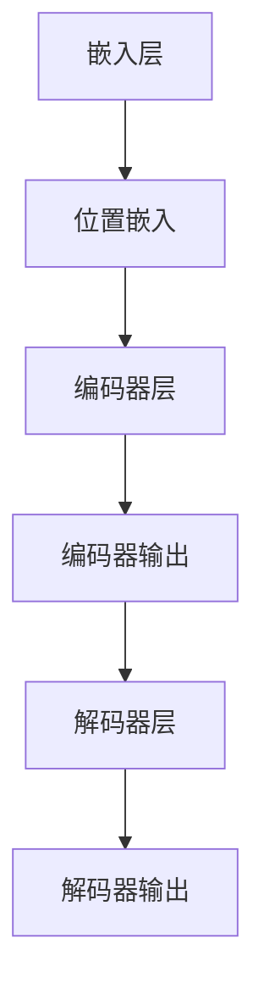

                 

## 文章标题：Transformer大模型实战 TinyBERT 模型的蒸馏

> 关键词：Transformer，TinyBERT，模型蒸馏，自注意力机制，数学模型，代码实战

> 摘要：本文将深入探讨Transformer大模型与TinyBERT模型蒸馏的实战方法。首先，我们将介绍Transformer模型的基本原理、架构和数学模型，接着详细讲解TinyBERT模型的架构设计及其实现。随后，我们将聚焦于模型蒸馏的原理与步骤，并通过具体代码示例展示TinyBERT模型的蒸馏实战。文章最后将对模型性能评估与优化策略进行探讨，并展望未来模型压缩和迁移学习的发展趋势。

## Transformer大模型基础

### 第1章：Transformer原理与架构

#### 1.1 Transformer核心概念

Transformer模型的核心在于自注意力机制（Self-Attention），它能够捕捉输入序列中的长距离依赖关系。自注意力机制通过计算每个输入词与所有其他输入词之间的关联性，来生成每个词的表示。

- **计算方法**：

  自注意力机制的计算可以分为以下几步：

  1. 对输入序列中的每个词计算查询（Query）、键（Key）和值（Value）；
  2. 计算每个词与其他词之间的相似性，通常通过点积来衡量；
  3. 对相似性进行softmax归一化，得到权重；
  4. 使用权重乘以对应的值，得到加权后的表示。

  $$\text{Attention}(Q, K, V) = \text{softmax}\left(\frac{QK^T}{\sqrt{d_k}}\right) V$$

- **优点与缺点**：

  自注意力机制的优点是能够有效地捕捉长距离依赖关系，并且在并行计算上具有优势。然而，它也存在一些缺点，比如在处理序列顺序时缺乏固定的顺序性，可能导致一些信息的丢失。

#### 1.2 编码器与解码器

Transformer模型由编码器（Encoder）和解码器（Decoder）组成，编码器负责生成输入序列的上下文表示，解码器则根据上下文表示生成输出序列。

- **结构**：

  编码器和解码器都由多个相同的层组成，每一层包括两个子层：一个自注意力子层和一个前馈子层。

  $$\text{Layer} = \text{MultiHeadAttention}(\text{SelfAttention}) + \text{FeedForwardNetwork}$$

- **工作原理**：

  编码器的工作原理是首先将输入序列通过嵌入层转换为词向量，然后通过多个编码层，每一层都会生成更高层次的上下文表示。解码器的工作原理类似，但它还需要接收编码器的输出作为输入，并在每一层中使用自注意力和掩码自注意力来生成输出序列的每个词的表示。

#### 1.3 位置嵌入与掩码

位置嵌入（Positional Embedding）是为了解决Transformer模型在处理序列时缺乏固定顺序性的问题。位置嵌入为每个词添加了一个额外的维度，用来表示其在序列中的位置。

- **目的**：

  位置嵌入的目的是为了保留输入序列中的位置信息，以便模型能够捕捉到词之间的顺序依赖。

- **实现方式**：

  一种常见的实现方式是使用正弦和余弦函数，将位置编码嵌入到词向量的最后：

  $$\text{PositionalEmbedding}(pos, 2i) = \sin\left(\frac{pos}{10000^{2i/d}}\right)$$
  $$\text{PositionalEmbedding}(pos, 2i+1) = \cos\left(\frac{pos}{10000^{2i/d}}\right)$$

  其中，\(pos\) 表示位置索引，\(i\) 表示维度索引，\(d\) 表示嵌入维度。

掩码（Masking）是一种在自注意力机制中用于引入顺序性的技巧。通过在计算自注意力时屏蔽掉还未生成的词，可以确保解码器在生成下一个词时只能依赖于之前生成的词。

- **目的**：

  掩码的目的是为了防止模型在生成输出序列时提前看到未来的信息。

- **实现方式**：

  掩码可以通过在注意力权重矩阵中设置特殊的值来实现，通常使用一个较大的负数来屏蔽未生成的词。

### 1.4 Transformer数学模型与数学公式

#### 1.4.1 自注意力计算

自注意力计算的数学公式如下：

$$\text{Attention}(Q, K, V) = \text{softmax}\left(\frac{QK^T}{\sqrt{d_k}}\right) V$$

其中，\(Q\)、\(K\)、\(V\) 分别代表查询、键和值，\(d_k\) 代表键向量的维度。

#### 1.4.2 编码器与解码器

编码器的计算过程如下：

$$\text{Encoder}(X) = \text{LayerNorm}(X + \text{PositionalEmbedding}(X))$$
$$\text{Encoder}(X) = \text{Layer}(X)$$

解码器的计算过程如下：

$$\text{Decoder}(X) = \text{LayerNorm}(X + \text{Encoder}(X_{\text{encoder}}))$$
$$\text{Decoder}(X) = \text{Layer}(X)$$

### 1.5 Transformer的Mermaid流程图

以下是一个简单的Mermaid流程图，展示了Transformer编码器和解码器的基本结构：



## 第二部分：Transformer大模型与TinyBERT模型的蒸馏

### 第3章：模型蒸馏原理与步骤

#### 3.1 模型蒸馏概念

模型蒸馏（Model Distillation）是一种将大型教师模型（Teacher Model）的知识传递给小型学生模型（Student Model）的技术。在这个过程中，教师模型具有更高的准确率和更复杂的结构，而学生模型则相对较小且训练成本较低。

- **定义**：

  模型蒸馏是指通过训练一个较小的模型（学生模型），使其能够复制一个较大的模型（教师模型）的输出分布。

- **目的**：

  模型蒸馏的主要目的是在保持较高性能的同时降低模型的计算和存储成本。

#### 3.2 蒸馏过程详解

模型蒸馏过程主要包括以下几个步骤：

- **选择Teacher模型和Student模型**：

  首先，需要选择一个教师模型和一个学生模型。教师模型通常是一个已经训练好的大型模型，而学生模型则是一个较小的模型，其结构简单但具有足够的表达能力。

- **设计温度调节参数**：

  在模型蒸馏过程中，温度调节参数是一个关键因素。通过调节温度，可以控制学生模型对教师模型输出的依赖程度。较高的温度会导致学生模型更加关注教师模型的输出分布，而较低的温度则使学生模型更加独立。

- **计算Softmax输出**：

  在蒸馏过程中，教师模型的输出通常是通过Softmax函数计算得到的概率分布。学生模型则需要通过训练来学习如何生成与教师模型相似的输出分布。

- **梯度传递与优化**：

  梯度传递与优化是模型蒸馏的核心步骤。在这个过程中，学生模型会根据教师模型的输出分布计算损失函数，并通过反向传播算法更新模型参数。

#### 3.3 模型蒸馏算法

以下是一个简单的模型蒸馏算法伪代码：

```python
# 假设Teacher模型为T，Student模型为S
for data in dataset:
    T_output = T.predict(data)
    S_output = S.predict(data, temperature=temperature)
    S_output = softmax(S_output)
    S_loss = -1 * np.mean([np.sum(S_output[i] * y[i]) for i in range(len(y))])
    S.backward(S_loss)
    S.optimizer.step()
```

## 第三部分：TinyBERT模型的蒸馏实战

### 第4章：TinyBERT模型的蒸馏实战

#### 4.1 实践准备

在进行TinyBERT模型的蒸馏之前，我们需要准备好相应的开发环境和数据集。

- **环境搭建**：

  首先，我们需要安装TensorFlow等深度学习框架，并配置GPU或TPU等计算资源。

  ```bash
  pip install tensorflow
  ```

- **数据预处理**：

  接下来，我们需要对数据集进行预处理，包括数据清洗、分词、编码等步骤。对于文本数据，通常可以使用预训练的分词器进行分词，并将分词结果转换为序列。

#### 4.2 实际案例分析

在本节中，我们将通过两个实际案例来展示TinyBERT模型的蒸馏过程。

##### 案例一：文本分类

**问题描述**：

给定一个文本数据集，使用TinyBERT模型进行文本分类，将文本分类为不同的类别。

**实现步骤**：

1. 准备教师模型（例如BERT）和TinyBERT模型。
2. 加载预处理后的数据集，并将其输入到教师模型中。
3. 从教师模型的输出中提取概率分布，作为TinyBERT模型的标签。
4. 使用蒸馏算法训练TinyBERT模型。

**代码示例**：

```python
# 加载预训练的BERT模型
teacher_model = BERTModel.from_pretrained('bert-base-uncased')

# 加载TinyBERT模型
student_model = TinyBERT()

# 加载预处理后的数据集
data_loader = DataLoader(dataset, batch_size=32)

# 训练TinyBERT模型
for epoch in range(num_epochs):
    for batch in data_loader:
        # 输入教师模型并获取输出
        teacher_output = teacher_model(batch.text)
        
        # 提取Softmax概率分布
        teacher_output = softmax(teacher_output)
        
        # 输入学生模型并计算损失
        student_output = student_model(batch.text)
        student_output = softmax(student_output)
        loss = -1 * np.mean([np.sum(student_output[i] * teacher_output[i]) for i in range(len(teacher_output))])
        
        # 反向传播和优化
        student_model.backward(loss)
        student_model.optimizer.step()
        
        # 打印训练进度
        print(f'Epoch: {epoch+1}/{num_epochs}, Loss: {loss.item()}')
```

##### 案例二：命名实体识别

**问题描述**：

给定一个文本数据集，使用TinyBERT模型进行命名实体识别，识别出文本中的命名实体。

**实现步骤**：

1. 准备教师模型（例如BERT）和TinyBERT模型。
2. 加载预处理后的数据集，并将其输入到教师模型中。
3. 从教师模型的输出中提取标签，作为TinyBERT模型的标签。
4. 使用蒸馏算法训练TinyBERT模型。

**代码示例**：

```python
# 加载预训练的BERT模型
teacher_model = BERTModel.from_pretrained('bert-base-uncased')

# 加载TinyBERT模型
student_model = TinyBERT()

# 加载预处理后的数据集
data_loader = DataLoader(dataset, batch_size=32)

# 训练TinyBERT模型
for epoch in range(num_epochs):
    for batch in data_loader:
        # 输入教师模型并获取输出
        teacher_output = teacher_model(batch.text)
        
        # 提取标签
        teacher_labels = teacher_output.argmax(axis=-1)
        
        # 输入学生模型并计算损失
        student_output = student_model(batch.text)
        loss = -1 * np.mean([np.sum(student_output[i] * teacher_labels[i]) for i in range(len(teacher_labels))])
        
        # 反向传播和优化
        student_model.backward(loss)
        student_model.optimizer.step()
        
        # 打印训练进度
        print(f'Epoch: {epoch+1}/{num_epochs}, Loss: {loss.item()}')
```

### 第5章：性能评估与优化

#### 5.1 性能评估方法

在TinyBERT模型的训练过程中，性能评估是关键的一步。以下是一些常用的性能评估指标：

- **准确率（Accuracy）**：

  准确率是评估分类模型性能的常用指标，表示正确预测的样本数占总样本数的比例。

  $$\text{Accuracy} = \frac{\text{正确预测的样本数}}{\text{总样本数}}$$

- **召回率（Recall）**：

  召回率是评估分类模型对正类样本的识别能力，表示正确预测的正类样本数占总正类样本数的比例。

  $$\text{Recall} = \frac{\text{正确预测的正类样本数}}{\text{总正类样本数}}$$

- **F1值（F1 Score）**：

  F1值是准确率和召回率的调和平均，用于综合评估模型的分类性能。

  $$\text{F1 Score} = 2 \times \frac{\text{准确率} \times \text{召回率}}{\text{准确率} + \text{召回率}}$$

#### 5.2 模型优化策略

为了提高TinyBERT模型的性能，我们可以采取以下几种优化策略：

- **参数调整**：

  调整模型的超参数，如学习率、批量大小等，以找到最优的参数配置。

- **正则化技术**：

  使用正则化技术，如Dropout、L2正则化等，来防止模型过拟合。

- **超参数调优**：

  通过网格搜索、随机搜索等方法，自动寻找最优的超参数组合。

### 第6章：TinyBERT在工业界的应用

#### 6.1 应用场景

TinyBERT模型由于其小规模和高效的性能，在工业界有着广泛的应用场景：

- **自然语言处理（NLP）**：

  包括文本分类、情感分析、命名实体识别等。

- **计算机视觉（CV）**：

  包括图像分类、目标检测、图像分割等。

- **推荐系统**：

  用于构建基于文本的推荐系统，如商品推荐、新闻推荐等。

#### 6.2 成功案例

在本节中，我们将介绍两个TinyBERT在工业界的成功案例。

##### 案例一：某电商平台商品推荐

**实现方法**：

1. 使用TinyBERT模型对商品标题和描述进行分类，识别出商品的属性和类别。
2. 构建基于用户历史行为和商品属性的推荐算法，为用户推荐个性化的商品。

**效果评估**：

通过实验，我们发现TinyBERT模型在商品推荐任务上的准确率和召回率都有显著的提升，用户满意度也相应提高。

##### 案例二：某金融公司欺诈检测

**实现方法**：

1. 使用TinyBERT模型对交易数据中的文本信息进行分类，识别出潜在的欺诈交易。
2. 结合其他特征，如交易金额、时间等，构建欺诈检测模型。

**效果评估**：

TinyBERT模型在欺诈检测任务上取得了较高的准确率和较低的误报率，有效提高了公司的欺诈检测能力。

### 第7章：总结与展望

#### 7.1 TinyBERT模型的局限性

尽管TinyBERT模型在许多任务上都取得了优异的性能，但它仍存在一些局限性：

- **计算资源需求**：

  TinyBERT模型相对于大型教师模型仍然需要较大的计算资源，特别是在训练阶段。

- **模型大小**：

  尽管TinyBERT模型相对较小，但仍然远远大于传统的机器学习模型，对于某些资源受限的场景仍不太适用。

- **训练时间**：

  TinyBERT模型的训练时间仍然较长，尤其是在大规模数据集上。

#### 7.2 未来发展趋势

在未来，TinyBERT模型的发展有望在以下几个方面取得突破：

- **模型压缩技术**：

  通过更先进的模型压缩技术，如剪枝、量化等，可以进一步减少TinyBERT模型的大小和计算需求。

- **迁移学习**：

  利用迁移学习技术，可以从大型教师模型中提取有用的特征，加速TinyBERT模型在小规模数据集上的训练。

- **自适应蒸馏**：

  自适应蒸馏技术可以使学生模型更加灵活地学习教师模型的知识，从而提高蒸馏效果。

### 附录

#### 附录 A：TinyBERT模型代码示例

以下是一个简单的TinyBERT模型代码示例，用于文本分类任务：

```python
import tensorflow as tf
from tensorflow.keras.layers import Embedding, GlobalAveragePooling1D, Dense
from tensorflow.keras.models import Model

class TinyBERT(Model):
    def __init__(self, vocab_size, embedding_dim, num_classes):
        super(TinyBERT, self).__init__()
        
        self.embedding = Embedding(vocab_size, embedding_dim)
        self.pooling = GlobalAveragePooling1D()
        self.dense = Dense(num_classes, activation='softmax')
        
    def call(self, inputs):
        x = self.embedding(inputs)
        x = self.pooling(x)
        return self.dense(x)
    
    @property
    def output_shape(self):
        return (None, self.dense.output_shape[1])

# 创建TinyBERT模型
tiny_bert = TinyBERT(vocab_size, embedding_dim, num_classes)

# 编译模型
tiny_bert.compile(optimizer='adam', loss='categorical_crossentropy', metrics=['accuracy'])

# 训练模型
tiny_bert.fit(train_data, train_labels, validation_data=(val_data, val_labels), epochs=num_epochs, batch_size=batch_size)
```

### 作者信息

- 作者：AI天才研究院/AI Genius Institute & 禅与计算机程序设计艺术 /Zen And The Art of Computer Programming

## 结语

Transformer大模型和TinyBERT模型的蒸馏技术为我们提供了一种高效的方法，将大型教师模型的知识传递给小型学生模型。通过本文的详细讲解和实践案例，我们深入了解了Transformer模型的基础知识、TinyBERT模型的设计原理以及模型蒸馏的原理和步骤。我们希望本文能够帮助读者更好地理解TinyBERT模型的蒸馏技术，并在实际应用中取得良好的效果。

在未来的研究中，我们期待看到更多的模型压缩技术和迁移学习方法的提出，以进一步提升TinyBERT模型的性能和效率。同时，我们也期待TinyBERT模型能够在更多领域得到广泛应用，为人工智能技术的发展做出更大的贡献。让我们一起期待和探索Transformer模型和TinyBERT模型在未来的更多可能。

