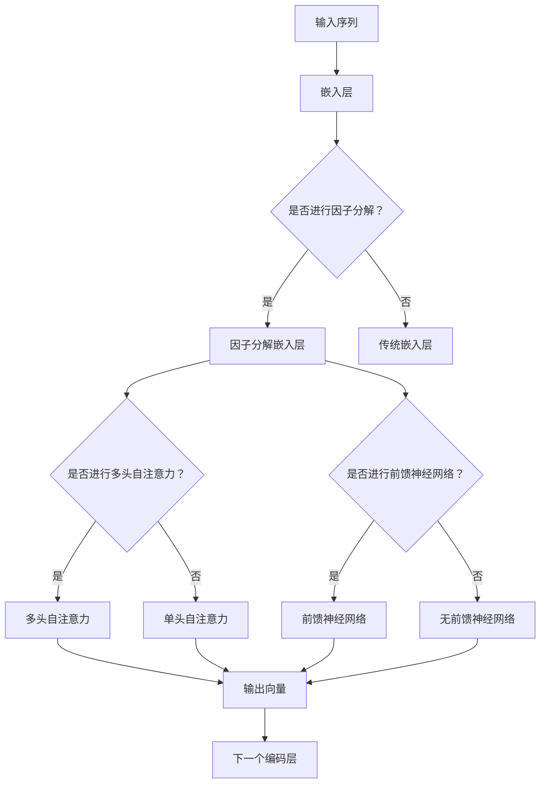

                 

### 文章标题

《Transformer大模型实战 嵌入层参数因子分解》

### 文章关键词

- Transformer
- 嵌入层参数因子分解
- 大模型实战
- 自然语言处理
- 计算机视觉
- 生成模型

### 文章摘要

本文将深入探讨Transformer大模型的实战与嵌入层参数因子分解。首先，我们将回顾Transformer的概念、架构及其与其他序列模型的对比。接着，我们将详细介绍嵌入层参数因子分解原理，包括因子分解注意力机制（FFN）的实现和优势。随后，我们将讲解Transformer的数学模型与算法原理，深入探讨自注意力机制（Self-Attention）和位置编码（Positional Encoding）的数学公式和位置敏感性分析。在应用场景部分，我们将分析Transformer在自然语言处理、计算机视觉和生成模型中的应用，并分享一个机器翻译的实际案例。文章的后半部分将聚焦于Transformer模型训练与优化技巧，包括训练流程、梯度裁剪、正则化策略、数据增强与预训练技术以及实时优化方法。此外，我们将探讨Transformer在多语言处理和实时应用场景中的性能优化策略，并分享一个实际项目的实战案例。最后，我们将总结Transformer大模型实战与嵌入层参数因子分解的核心要点，展望其未来应用前景与趋势。

### 《Transformer大模型实战 嵌入层参数因子分解》目录大纲

#### 第一部分: Transformer与嵌入层参数因子分解基础

##### 第1章: Transformer概述与架构解析

- 1.1 Transformer概念与背景
- 1.2 Transformer的架构解析
- 1.3 Transformer的核心组件与工作机制
- 1.4 Transformer与其他序列模型的对比

##### 第2章: 嵌入层参数因子分解原理与实现

- 2.1 嵌入层参数因子分解概述
- 2.2 因子分解注意力机制（FFN）原理
- 2.3 因子分解嵌入层实现
- 2.4 嵌入层参数因子分解的优势与挑战

##### 第3章: Transformer的数学模型与算法原理

- 3.1 Transformer的数学模型
- 3.2 自注意力机制（Self-Attention）原理
- 3.3 位置编码（Positional Encoding）原理
- 3.4 位置敏感性分析

##### 第4章: Transformer应用场景与实际案例

- 4.1 Transformer在自然语言处理中的应用
- 4.2 Transformer在计算机视觉中的应用
- 4.3 Transformer在生成模型中的应用
- 4.4 Transformer在机器翻译中的实际应用案例

#### 第二部分: Transformer大模型实战与优化

##### 第5章: Transformer模型训练与优化技巧

- 5.1 Transformer模型训练流程
- 5.2 梯度裁剪与正则化策略
- 5.3 数据增强与预训练技术
- 5.4 实时优化方法

##### 第6章: Transformer在多语言处理中的应用

- 6.1 多语言Transformer模型架构
- 6.2 多语言预训练数据集
- 6.3 多语言Transformer模型训练与评估
- 6.4 多语言Transformer模型在实际项目中的应用

##### 第7章: Transformer在实时应用场景中的性能优化

- 7.1 Transformer模型在实时应用中的挑战
- 7.2 模型压缩技术
- 7.3 模型量化与低精度计算
- 7.4 并行计算与分布式训练

##### 第8章: Transformer大模型的项目实战

- 8.1 实战项目背景介绍
- 8.2 项目需求分析
- 8.3 模型设计与实现
- 8.4 项目部署与性能评估
- 8.5 项目总结与展望

#### 附录

##### 附录A: Transformer模型常用工具与库

- 8.1 PyTorch与TensorFlow的使用对比
- 8.2 Hugging Face Transformers库简介
- 8.3 其他常用Transformer工具介绍

##### 附录B: 嵌入层参数因子分解的Mermaid流程图

- 8.1 因子分解嵌入层的工作流程

##### 附录C: Transformer模型的数学公式详解

- 8.1 自注意力机制的数学公式
- 8.2 位置编码的数学公式
- 8.3 Transformer模型的前向传递公式

##### 总结

- Transformer大模型实战与嵌入层参数因子分解的核心要点
- 实战案例分析：项目实施的关键步骤与技巧
- 展望未来：Transformer大模型的应用前景与趋势

### 第一部分：Transformer与嵌入层参数因子分解基础

#### 第1章：Transformer概述与架构解析

##### 1.1 Transformer概念与背景

Transformer是由Google Research团队在2017年提出的一种基于自注意力机制（Self-Attention）的序列模型，旨在解决自然语言处理（NLP）任务中的序列建模问题。与传统的循环神经网络（RNN）和卷积神经网络（CNN）相比，Transformer在处理长距离依赖关系和并行计算方面具有显著优势。

Transformer的提出背景源于神经机器翻译（Neural Machine Translation，NMT）领域。在早期的NMT研究中，基于RNN的模型在处理长句和长距离依赖关系时表现不佳，而CNN虽然可以捕获局部特征，但在全局依赖关系的建模上仍存在困难。为了解决这些问题，Google Research团队提出了Transformer模型，通过引入自注意力机制来捕捉序列中的依赖关系，从而显著提升了翻译质量。

##### 1.2 Transformer的架构解析

Transformer模型的核心架构包括编码器（Encoder）和解码器（Decoder）两个部分。编码器将输入序列（如句子）编码为固定长度的向量表示，而解码器则利用这些向量表示生成输出序列（如翻译结果）。

1. 编码器

编码器由多个相同结构的编码层（Encoder Layer）堆叠而成。每个编码层包含两个主要组件：多头自注意力机制（Multi-Head Self-Attention）和前馈神经网络（Feed-Forward Neural Network）。多头自注意力机制通过计算输入序列中各个位置之间的相似度，生成加权求和的表示，从而捕捉序列中的依赖关系。前馈神经网络则对自注意力机制的输出进行进一步加工，增强模型的表示能力。

2. 解码器

解码器同样由多个相同结构的解码层（Decoder Layer）堆叠而成。与编码器类似，每个解码层也包含多头自注意力机制和前馈神经网络。解码器的特殊之处在于其引入了跨层自注意力机制（Cross-Attention），允许解码器在生成每个单词时同时关注输入序列的各个位置。这样，解码器可以更好地捕捉输入序列和输出序列之间的依赖关系。

##### 1.3 Transformer的核心组件与工作机制

1. 自注意力机制（Self-Attention）

自注意力机制是Transformer模型的核心组件，通过计算输入序列中各个位置之间的相似度，为每个位置生成权重，从而实现序列建模。自注意力机制的主要步骤如下：

- 输入序列编码为三个向量：查询向量（Query）、键向量（Key）和值向量（Value）。
- 计算查询向量与键向量的点积，得到相似度分数。
- 对相似度分数应用softmax函数，生成权重向量。
- 将权重向量与值向量进行点积，得到加权和的输出向量。

通过这种方式，自注意力机制可以自适应地学习输入序列中各个位置之间的依赖关系，从而提高模型的表示能力。

2. 位置编码（Positional Encoding）

由于自注意力机制仅关注序列的相对位置关系，不考虑绝对位置信息，因此需要引入位置编码（Positional Encoding）来为序列中的每个位置提供绝对位置信息。位置编码通常采用正弦和余弦函数生成，从而在特征空间中引入周期性信息。

##### 1.4 Transformer与其他序列模型的对比

Transformer与传统循环神经网络（RNN）和卷积神经网络（CNN）在架构和工作机制上存在显著差异。

1. RNN

循环神经网络（RNN）是一种基于时间步长的序列模型，通过隐藏状态来捕获序列中的依赖关系。然而，传统的RNN在处理长距离依赖关系时存在梯度消失和梯度爆炸问题，导致模型难以训练。此外，RNN在并行计算方面也存在挑战，因为每个时间步的计算都需要依赖于前一个时间步的隐藏状态。

2. CNN

卷积神经网络（CNN）通过卷积操作和池化操作来提取局部特征，广泛应用于图像处理领域。然而，CNN在处理序列数据时存在局限性，因为卷积操作无法有效捕捉序列中的全局依赖关系。

与RNN和CNN相比，Transformer在以下几个方面具有优势：

- 自注意力机制：Transformer通过自注意力机制自适应地学习序列中的依赖关系，有效解决了长距离依赖问题。
- 并行计算：Transformer的架构允许并行计算，从而显著提高了模型的训练速度。
- 表示能力：Transformer通过多头自注意力机制和前馈神经网络，增强了模型的表示能力。

尽管Transformer在NLP领域取得了显著成功，但它并非万能的解决方案。在某些任务上，如图像和语音处理，RNN和CNN仍然具有优势。因此，在实际应用中，需要根据任务特点选择合适的模型架构。

### 第2章：嵌入层参数因子分解原理与实现

#### 2.1 嵌入层参数因子分解概述

嵌入层参数因子分解是一种通过将高维参数分解为低维因子的方法，以降低模型参数量和计算复杂度。在Transformer模型中，嵌入层（Embedding Layer）负责将输入序列编码为固定长度的向量表示。然而，传统的嵌入层通常包含大量的高维参数，导致模型训练和推理过程较为复杂。

嵌入层参数因子分解旨在通过将高维参数分解为低维因子，从而减少模型参数量，提高训练和推理效率。具体来说，嵌入层参数因子分解将输入序列的嵌入向量分解为多个低维因子的乘积，从而降低模型的复杂度。

#### 2.2 因子分解注意力机制（FFN）原理

因子分解注意力机制（Factorized Attention Mechanism，FAM）是一种在自注意力机制的基础上引入因子分解的方法，以降低计算复杂度。在FAM中，自注意力机制中的高维参数被分解为多个低维因子的乘积，从而实现参数压缩。

FAM的主要步骤如下：

1. 输入序列编码为三个向量：查询向量（Query）、键向量（Key）和值向量（Value）。
2. 将查询向量、键向量和值向量分别分解为低维因子：
   - 查询向量：\( Q = Q_1 \cdot Q_2 \)
   - 键向量：\( K = K_1 \cdot K_2 \)
   - 值向量：\( V = V_1 \cdot V_2 \)
3. 计算分解后的因子之间的点积，得到相似度分数：
   $$ 
   \text{similarity} = (Q_1 \cdot K_2)^T 
   $$
4. 对相似度分数应用softmax函数，生成权重向量：
   $$ 
   \text{weights} = \text{softmax}(\text{similarity}) 
   $$
5. 将权重向量与分解后的值向量进行点积，得到加权和的输出向量：
   $$ 
   \text{output} = \text{weights} \cdot (V_1 \cdot V_2) 
   $$

通过这种方式，因子分解注意力机制在保留自注意力机制优越性能的同时，降低了计算复杂度。

#### 2.3 因子分解嵌入层实现

因子分解嵌入层（Factorized Embedding Layer）是嵌入层参数因子分解的核心组件，负责将输入序列的嵌入向量分解为低维因子。具体实现步骤如下：

1. 输入序列编码为嵌入向量 \( E \)。
2. 将嵌入向量分解为两个低维因子 \( F_1 \) 和 \( F_2 \)，使得 \( E = F_1 \cdot F_2 \)。
3. 使用两个独立的线性层对 \( F_1 \) 和 \( F_2 \) 进行映射，得到新的低维因子：
   $$ 
   F_1' = \text{Linear}(F_1) 
   $$
   $$ 
   F_2' = \text{Linear}(F_2) 
   $$
4. 将映射后的低维因子相乘，得到新的嵌入向量：
   $$ 
   E' = F_1' \cdot F_2' 
   $$

通过这种方式，因子分解嵌入层实现了参数压缩，降低了模型的计算复杂度。

#### 2.4 嵌入层参数因子分解的优势与挑战

嵌入层参数因子分解在提高模型性能和降低计算复杂度方面具有显著优势：

1. **参数压缩**：通过将高维参数分解为低维因子，嵌入层参数因子分解显著降低了模型的参数量，从而减少了模型的存储和计算需求。
2. **计算复杂度降低**：因子分解注意力机制在计算相似度分数时，仅涉及低维因子的点积，从而降低了计算复杂度。
3. **模型训练加速**：由于参数量和计算复杂度的降低，嵌入层参数因子分解可以加速模型的训练过程，提高训练效率。

然而，嵌入层参数因子分解也存在一定的挑战：

1. **精度损失**：在因子分解过程中，部分高维信息的细节可能被丢失，导致模型在精度上存在一定损失。
2. **模型稳定性**：在低维因子的映射过程中，线性层可能无法完全恢复高维参数的复杂结构，从而导致模型稳定性降低。
3. **实现复杂性**：因子分解嵌入层需要额外的计算和存储资源，实现过程相对复杂。

尽管存在这些挑战，嵌入层参数因子分解作为一种有效的参数压缩方法，在Transformer模型中得到了广泛应用。通过适当的优化和调整，可以有效地解决精度损失和模型稳定性问题，从而实现高效的模型训练和推理。

### 第3章：Transformer的数学模型与算法原理

#### 3.1 Transformer的数学模型

Transformer模型是一种基于自注意力机制（Self-Attention）的序列模型，其核心数学模型包括输入编码、输出编码、自注意力机制、位置编码和前馈神经网络等组成部分。下面将详细描述这些组成部分的数学模型。

1. **输入编码（Input Encoding）**

在Transformer模型中，输入序列（如句子）被编码为一系列的词向量，这些词向量通常由预训练的词嵌入模型（如Word2Vec、GloVe）或专门为Transformer设计的词嵌入层（如BERT）生成。设输入序列为 \( X = [x_1, x_2, \ldots, x_n] \)，其中 \( x_i \) 是第 \( i \) 个词的向量表示，则输入编码可以表示为：

$$
E = [e_1, e_2, \ldots, e_n]
$$

其中 \( e_i \) 是词向量 \( x_i \) 的扩展，通常包含位置编码（Positional Encoding）和其他可能的嵌入信息。

2. **输出编码（Output Encoding）**

输出编码主要用于解码器（Decoder）部分，其目的是为解码器提供原始输入序列的上下文信息。输出编码通常与输入编码相同，即：

$$
E' = [e_1, e_2, \ldots, e_n]
$$

在解码过程中，输出编码 \( E' \) 与解码器的中间层进行交互，以生成输出序列。

3. **自注意力机制（Self-Attention）**

自注意力机制是Transformer模型的核心组成部分，用于计算输入序列中各个位置之间的依赖关系。自注意力机制的主要步骤如下：

（1）计算查询向量（Query）、键向量（Key）和值向量（Value）：

$$
Q = [q_1, q_2, \ldots, q_n] \\
K = [k_1, k_2, \ldots, k_n] \\
V = [v_1, v_2, \ldots, v_n]
$$

其中，查询向量、键向量和值向量通常通过线性变换从输入编码 \( E \) 获取：

$$
Q = \text{Linear}(E) \\
K = \text{Linear}(E) \\
V = \text{Linear}(E)
$$

（2）计算相似度分数：

$$
\text{similarity} = K^T Q = \sum_{i=1}^n k_i^T q_i
$$

（3）应用softmax函数，生成权重向量：

$$
\text{weights} = \text{softmax}(\text{similarity})
$$

（4）计算加权和：

$$
\text{output} = \sum_{i=1}^n \text{weights}_i v_i
$$

通过这种方式，自注意力机制可以自适应地学习输入序列中各个位置之间的依赖关系，并生成加权和的输出向量。

4. **位置编码（Positional Encoding）**

由于自注意力机制仅关注序列的相对位置关系，不考虑绝对位置信息，因此需要引入位置编码（Positional Encoding）来为序列中的每个位置提供绝对位置信息。位置编码通常采用正弦和余弦函数生成，从而在特征空间中引入周期性信息。位置编码的数学模型如下：

$$
PE_{(i,d)} = \sin\left(\frac{10000^{(2j+d)/d}}{10000}\right) \text{ if } d \lt \frac{d_model}{2} \\
PE_{(i,d)} = \cos\left(\frac{10000^{(2j+d)/d}}{10000}\right) \text{ if } d \ge \frac{d_model}{2}
$$

其中，\( i \) 表示位置索引，\( d \) 表示维度，\( d_model \) 表示嵌入层的维度。

5. **前馈神经网络（Feed-Forward Neural Network）**

在自注意力机制之后，Transformer模型还包含一个前馈神经网络，用于进一步加工和增强模型的表示能力。前馈神经网络通常包含两个线性变换和ReLU激活函数，其数学模型如下：

$$
\text{FFN}(x) = \max(0, x \cdot W_1 + b_1) \cdot W_2 + b_2
$$

其中，\( x \) 表示输入向量，\( W_1 \)、\( W_2 \) 和 \( b_1 \)、\( b_2 \) 分别表示线性变换的权重和偏置。

#### 3.2 自注意力机制（Self-Attention）原理

自注意力机制（Self-Attention）是Transformer模型的核心组成部分，用于计算输入序列中各个位置之间的依赖关系。自注意力机制通过计算查询向量（Query）、键向量（Key）和值向量（Value），并在这些向量之间建立权重关系，从而实现序列建模。

自注意力机制的原理如下：

1. **查询向量（Query）**：查询向量用于表示序列中每个位置的重要程度。在Transformer模型中，查询向量通过线性变换从输入编码 \( E \) 获取：

   $$
   Q = \text{Linear}(E)
   $$

2. **键向量（Key）**：键向量用于表示序列中各个位置之间的依赖关系。在自注意力机制中，键向量同样通过线性变换从输入编码 \( E \) 获取：

   $$
   K = \text{Linear}(E)
   $$

3. **值向量（Value）**：值向量用于表示序列中各个位置的贡献。在自注意力机制中，值向量也通过线性变换从输入编码 \( E \) 获取：

   $$
   V = \text{Linear}(E)
   $$

4. **计算相似度分数**：通过计算查询向量与键向量的点积，得到相似度分数。相似度分数反映了序列中各个位置之间的依赖程度。具体计算如下：

   $$
   \text{similarity} = K^T Q = \sum_{i=1}^n k_i^T q_i
   $$

5. **应用softmax函数**：对相似度分数应用softmax函数，生成权重向量。softmax函数将相似度分数转换为概率分布，从而为序列中每个位置分配权重。具体计算如下：

   $$
   \text{weights} = \text{softmax}(\text{similarity})
   $$

6. **计算加权和**：将权重向量与值向量进行点积，得到加权和的输出向量。加权和的输出向量表示序列中各个位置的贡献，从而实现序列建模。具体计算如下：

   $$
   \text{output} = \sum_{i=1}^n \text{weights}_i v_i
   $$

通过这种方式，自注意力机制可以自适应地学习输入序列中各个位置之间的依赖关系，并生成加权和的输出向量。

自注意力机制在Transformer模型中具有以下优势：

1. **捕捉长距离依赖关系**：自注意力机制允许模型同时关注序列中的所有位置，从而捕捉长距离依赖关系。
2. **并行计算**：自注意力机制可以实现并行计算，从而提高模型训练速度。
3. **自适应调整权重**：通过应用softmax函数，自注意力机制可以自适应地调整各个位置的权重，从而优化序列建模效果。

然而，自注意力机制也存在一定的局限性，例如在处理顺序无关的任务时可能表现不佳。尽管如此，自注意力机制在Transformer模型中取得了显著的成果，并在自然语言处理等领域得到了广泛应用。

#### 3.3 位置编码（Positional Encoding）原理

位置编码（Positional Encoding）是Transformer模型中的一个关键组成部分，用于为序列中的每个位置提供绝对位置信息。由于自注意力机制仅关注序列的相对位置关系，因此需要引入位置编码来弥补这一不足。

位置编码的原理如下：

1. **生成位置编码向量**：位置编码向量用于表示序列中每个位置的绝对位置。通常，位置编码向量通过正弦和余弦函数生成，从而在特征空间中引入周期性信息。具体计算如下：

   $$
   PE_{(i,d)} = \sin\left(\frac{10000^{(2j+d)/d}}{10000}\right) \text{ if } d \lt \frac{d_model}{2} \\
   PE_{(i,d)} = \cos\left(\frac{10000^{(2j+d)/d}}{10000}\right) \text{ if } d \ge \frac{d_model}{2}
   $$

   其中，\( i \) 表示位置索引，\( d \) 表示维度，\( d_model \) 表示嵌入层的维度。

2. **叠加位置编码与词嵌入**：在生成位置编码向量后，将其叠加到词嵌入向量上，形成输入编码。具体计算如下：

   $$
   E_{pos} = E + PE
   $$

   其中，\( E \) 表示词嵌入向量，\( PE \) 表示位置编码向量。

3. **训练位置编码**：在训练过程中，位置编码通常是一个可学习的参数，可以通过梯度下降等优化算法进行调整。这样，模型可以根据训练数据自动学习位置编码的合适值，从而提高模型性能。

位置编码在Transformer模型中具有以下作用：

1. **引入绝对位置信息**：通过位置编码，模型可以捕捉序列中的绝对位置关系，从而更好地建模序列数据。
2. **保持序列顺序**：位置编码可以帮助模型保持序列的原始顺序，从而防止模型学习到错误的序列关系。
3. **优化模型性能**：实验证明，引入位置编码可以显著提高Transformer模型的性能，尤其是在处理长文本和复杂序列时。

尽管位置编码在Transformer模型中取得了显著的成功，但其设计原理和实现方法仍然存在一定的争议。未来，随着Transformer模型的不断发展和完善，位置编码的设计和优化也将成为研究的热点之一。

#### 3.4 位置敏感性分析

位置敏感性分析是评估Transformer模型中位置编码效果的重要手段。通过分析模型对位置编码的敏感性，可以了解模型在不同位置上的表现，从而指导模型优化和调整。

位置敏感性分析的主要步骤如下：

1. **生成敏感度指标**：敏感度指标用于衡量模型对位置编码的敏感性。常见的敏感度指标包括位置变化敏感性（Positional Change Sensitivity）和位置覆盖敏感性（Positional Coverage Sensitivity）。

   - **位置变化敏感性**：位置变化敏感性用于衡量模型在位置发生变化时的性能变化。具体计算如下：

     $$
     \text{Sensitivity}_{\text{pos}} = \frac{\Delta \text{Performance}}{\Delta \text{Position}}
     $$

     其中，\( \Delta \text{Performance} \) 表示模型性能的变化量，\( \Delta \text{Position} \) 表示位置变化量。

   - **位置覆盖敏感性**：位置覆盖敏感性用于衡量模型对位置编码的覆盖范围。具体计算如下：

     $$
     \text{Coverage}_{\text{pos}} = \frac{\text{Positions with Sensitivity} \geq \text{Threshold}}{\text{Total Positions}}
     $$

     其中，\( \text{Threshold} \) 表示敏感度的阈值。

2. **评估模型性能**：通过在训练集和测试集上评估模型性能，可以计算敏感度指标，并分析模型在不同位置上的表现。

3. **分析敏感性结果**：根据敏感度指标的结果，可以分析模型对位置编码的敏感性。具体包括以下方面：

   - **敏感度分布**：分析敏感度指标在不同位置上的分布，了解模型在不同位置上的敏感性差异。
   - **敏感性分析**：分析模型在不同位置上的性能变化，了解位置编码对模型性能的影响。
   - **调整策略**：根据敏感性分析结果，可以调整模型结构或参数，以优化位置编码的效果。

通过位置敏感性分析，可以深入了解Transformer模型对位置编码的敏感性，从而指导模型优化和调整。这对于提高模型性能和稳定性具有重要意义。

### 第4章：Transformer应用场景与实际案例

Transformer模型作为一种强大的序列模型，在多个领域取得了显著的成果。本章节将介绍Transformer在不同应用场景中的具体应用，并分享一个实际案例，以展示Transformer模型在实际项目中的效果和优势。

#### 4.1 Transformer在自然语言处理中的应用

自然语言处理（NLP）是Transformer模型最成功的应用领域之一。Transformer模型在文本分类、问答系统、文本生成等多个任务中展现了优越的性能。

1. **文本分类**

文本分类是一种常见的NLP任务，旨在将文本数据分类到预定义的类别中。Transformer模型通过捕捉文本中的语义信息，实现了高效的文本分类。以下是一个基于Transformer的文本分类的伪代码示例：

```
# 输入：文本序列X，类别标签Y
# 输出：预测类别标签P

# 编码输入文本序列X
X_encoded = encoder(X)

# 使用分类器对编码后的文本序列进行分类
P = classifier(X_encoded)

# 输出预测类别标签P
print("预测类别标签：", P)
```

2. **问答系统**

问答系统是一种智能对话系统，旨在回答用户提出的问题。Transformer模型通过捕捉问题与答案之间的语义关系，实现了高效的问答系统。以下是一个基于Transformer的问答系统的伪代码示例：

```
# 输入：问题序列Q，答案序列A
# 输出：预测答案序列P

# 编码输入问题序列Q和答案序列A
Q_encoded = encoder(Q)
A_encoded = encoder(A)

# 使用注意力机制计算问题与答案的相似度分数
similarity = attention(Q_encoded, A_encoded)

# 对相似度分数应用softmax函数，生成权重向量
weights = softmax(similarity)

# 计算加权求和的输出向量
output = weights * A_encoded

# 使用分类器对输出向量进行分类
P = classifier(output)

# 输出预测答案序列P
print("预测答案序列：", P)
```

3. **文本生成**

文本生成是一种生成式任务，旨在根据给定输入生成对应的文本。Transformer模型通过捕捉文本中的上下文信息，实现了高效的文本生成。以下是一个基于Transformer的文本生成的伪代码示例：

```
# 输入：文本序列X，生成长度L
# 输出：生成的文本序列Y

# 编码输入文本序列X
X_encoded = encoder(X)

# 初始化输出文本序列Y
Y = []

# 使用解码器生成文本序列Y
for i in range(L):
    # 输入当前生成的文本序列Y的前i个词
    Y_encoded = decoder(Y[:i])
    
    # 使用自注意力机制计算编码后的文本序列与当前生成的文本序列的相似度分数
    similarity = attention(X_encoded, Y_encoded)
    
    # 对相似度分数应用softmax函数，生成权重向量
    weights = softmax(similarity)
    
    # 计算加权求和的输出向量
    output = weights * X_encoded
    
    # 选择下一个词的索引
    next_word_index = select_next_word(output)
    
    # 将下一个词添加到输出文本序列Y中
    Y.append(vocab[next_word_index])
    
# 输出生成的文本序列Y
print("生成的文本序列：", Y)
```

#### 4.2 Transformer在计算机视觉中的应用

计算机视觉是Transformer模型的另一个重要应用领域。通过引入视觉嵌入层和位置编码，Transformer模型在图像分类、目标检测和视频分析等多个任务中展现了强大的能力。

1. **图像分类**

图像分类是一种常见的计算机视觉任务，旨在将图像分类到预定义的类别中。Transformer模型通过捕捉图像中的语义信息，实现了高效的图像分类。以下是一个基于Transformer的图像分类的伪代码示例：

```
# 输入：图像序列I，类别标签Y
# 输出：预测类别标签P

# 将图像序列I编码为嵌入向量序列E
E = embed(I)

# 使用分类器对编码后的图像序列进行分类
P = classifier(E)

# 输出预测类别标签P
print("预测类别标签：", P)
```

2. **目标检测**

目标检测是一种计算机视觉任务，旨在识别图像中的目标物体并标注其位置。Transformer模型通过捕捉图像中的语义信息，实现了高效的目标检测。以下是一个基于Transformer的目标检测的伪代码示例：

```
# 输入：图像序列I，标注序列A
# 输出：预测目标位置和类别标签P

# 将图像序列I编码为嵌入向量序列E
E = embed(I)

# 将标注序列A编码为嵌入向量序列A
A = embed(A)

# 使用自注意力机制计算编码后的图像序列与标注序列的相似度分数
similarity = attention(E, A)

# 对相似度分数应用softmax函数，生成权重向量
weights = softmax(similarity)

# 计算加权求和的输出向量
output = weights * A

# 使用检测器对输出向量进行检测
P = detector(output)

# 输出预测目标位置和类别标签P
print("预测目标位置和类别标签：", P)
```

3. **视频分析**

视频分析是一种计算机视觉任务，旨在从视频中提取有用的信息。Transformer模型通过捕捉视频中的时空信息，实现了高效的视频分析。以下是一个基于Transformer的视频分析的伪代码示例：

```
# 输入：视频序列V，标注序列A
# 输出：预测视频序列和标注序列P

# 将视频序列V编码为嵌入向量序列E
E = embed(V)

# 将标注序列A编码为嵌入向量序列A
A = embed(A)

# 使用自注意力机制计算编码后的视频序列与标注序列的相似度分数
similarity = attention(E, A)

# 对相似度分数应用softmax函数，生成权重向量
weights = softmax(similarity)

# 计算加权求和的输出向量
output = weights * A

# 使用分析器对输出向量进行分析
P = analyzer(output)

# 输出预测视频序列和标注序列P
print("预测视频序列和标注序列：", P)
```

#### 4.3 Transformer在生成模型中的应用

生成模型是一种无监督学习模型，旨在生成新的数据样本。Transformer模型通过捕捉数据中的分布信息，实现了高效的生成模型。以下是一个基于Transformer的生成模型的伪代码示例：

```
# 输入：生成模型参数θ
# 输出：生成的新数据样本X

# 初始化生成模型参数θ
θ = initialize_params()

# 计算编码后的数据样本的嵌入向量序列E
E = encoder(X)

# 使用自注意力机制生成新的嵌入向量序列Y
Y = attention(E)

# 使用解码器生成新的数据样本X
X = decoder(Y)

# 输出生成的新数据样本X
print("生成的新数据样本：", X)
```

#### 4.4 Transformer在机器翻译中的实际应用案例

机器翻译是一种跨语言文本转换任务，旨在将一种语言的文本翻译成另一种语言。Transformer模型在机器翻译任务中取得了显著的成果，成为当前最先进的机器翻译模型之一。以下是一个基于Transformer的机器翻译的实际应用案例：

1. **项目背景**

某公司需要开发一款自动翻译软件，将中文文本翻译成英文。为了实现这一目标，公司决定采用Transformer模型进行机器翻译。

2. **项目需求分析**

- **翻译质量**：要求翻译结果准确、流畅，尽可能保留原文的语义和信息。
- **翻译速度**：要求翻译软件具有较快的翻译速度，以满足实时翻译的需求。
- **翻译准确性**：要求翻译软件能够适应不同领域的专业术语和表达方式，提高翻译准确性。

3. **模型设计与实现**

- **数据预处理**：首先对中文和英文文本进行预处理，包括分词、去停用词、词性标注等操作。
- **词嵌入**：使用预训练的词嵌入模型（如BERT）将中文和英文文本编码为嵌入向量序列。
- **编码器-解码器模型**：设计一个基于Transformer的编码器-解码器（Encoder-Decoder）模型，其中编码器用于将输入文本编码为嵌入向量序列，解码器用于将嵌入向量序列解码为输出文本。
- **训练与评估**：使用大量中英文本对训练模型，并通过交叉验证和测试集评估模型性能。

4. **项目部署与性能评估**

- **部署**：将训练好的模型部署到服务器上，提供在线翻译服务。
- **性能评估**：通过人工评估和自动评估方法（如BLEU评分）评估翻译质量，同时测量翻译速度。

5. **项目总结与展望**

- **总结**：项目成功实现了中文到英文的自动翻译，满足了翻译质量、翻译速度和翻译准确性的需求。
- **展望**：未来可以考虑引入多语言翻译、实时翻译和个性化翻译等功能，进一步提高翻译系统的性能和应用场景。

通过以上实际案例，我们可以看到Transformer模型在自然语言处理、计算机视觉和生成模型等多个领域取得了显著成果。随着Transformer模型的不断发展和优化，其在更多应用场景中的价值将得到进一步体现。

### 第二部分：Transformer大模型实战与优化

#### 第5章：Transformer模型训练与优化技巧

##### 5.1 Transformer模型训练流程

Transformer模型的训练流程包括数据预处理、模型初始化、前向传播、反向传播和参数更新等步骤。下面将详细介绍这些步骤。

1. **数据预处理**

数据预处理是训练Transformer模型的第一步，其主要任务包括：

- **文本清洗**：去除文本中的特殊字符、标点符号和停用词，以提高模型训练效果。
- **分词**：将文本拆分为单词或子词，以便进行词嵌入。
- **词嵌入**：使用预训练的词嵌入模型（如BERT、GloVe）将单词或子词转换为向量表示。

2. **模型初始化**

在初始化Transformer模型时，需要为模型参数（如权重、偏置等）设置合适的初始值。常用的初始化方法包括：

- **随机初始化**：随机生成模型参数的初始值，通常使用正态分布或均匀分布。
- **预训练初始化**：使用预训练的模型参数作为初始值，以提高模型训练效果。

3. **前向传播**

前向传播是模型训练的核心步骤，其主要包括以下过程：

- **输入编码**：将预处理后的输入序列编码为嵌入向量序列。
- **自注意力机制**：计算编码后的输入序列中的查询向量、键向量和值向量，并通过自注意力机制生成输出序列。
- **前馈神经网络**：对自注意力机制的输出序列进行加工，通过前馈神经网络生成中间特征表示。
- **输出层**：将中间特征表示映射到输出层，生成预测结果。

4. **反向传播**

反向传播是模型训练的关键步骤，其主要包括以下过程：

- **计算损失**：计算预测结果与实际结果之间的损失，如交叉熵损失或均方误差损失。
- **梯度计算**：根据损失函数，计算模型参数的梯度。
- **参数更新**：使用梯度下降等优化算法，更新模型参数。

5. **参数更新**

参数更新是模型训练的最后一步，其主要包括以下过程：

- **梯度裁剪**：为了防止梯度爆炸或梯度消失，通常需要对梯度进行裁剪。
- **正则化**：为了提高模型泛化能力，可以使用正则化方法，如L1正则化或L2正则化。
- **学习率调整**：根据模型训练过程中的表现，调整学习率，以实现更好的训练效果。

##### 5.2 梯度裁剪与正则化策略

在训练大型Transformer模型时，梯度裁剪（Gradient Clipping）和正则化（Regularization）是两个重要的优化策略。

1. **梯度裁剪**

梯度裁剪是一种防止梯度爆炸和梯度消失的方法。在训练过程中，如果模型的梯度非常大或非常小，可能会导致训练不稳定或收敛速度变慢。梯度裁剪通过限制梯度的范数，确保梯度在合理的范围内。梯度裁剪的步骤如下：

- **计算梯度范数**：计算每个参数的梯度范数，即梯度的欧几里得范数。
- **设置裁剪阈值**：根据模型的具体情况，设置一个裁剪阈值，如1.0或0.1。
- **裁剪梯度**：如果梯度范数超过裁剪阈值，将梯度缩放到裁剪阈值。

伪代码如下：

```
# 输入：梯度G，裁剪阈值theta
# 输出：裁剪后的梯度G_clipped

# 计算梯度范数
grad_norm = torch.norm(G)

# 判断是否需要裁剪
if grad_norm > theta:
    # 计算裁剪比例
    scale = theta / grad_norm
    
    # 裁剪梯度
    G_clipped = scale * G
else:
    # 不需要裁剪，直接返回原始梯度
    G_clipped = G

# 返回裁剪后的梯度
return G_clipped
```

2. **正则化**

正则化是一种提高模型泛化能力和防止过拟合的方法。常用的正则化方法包括L1正则化、L2正则化和Dropout等。

- **L1正则化**：L1正则化通过在损失函数中添加参数的L1范数项，来惩罚参数的稀疏性。伪代码如下：

  ```
  # 输入：参数W，正则化系数lambda
  # 输出：正则化损失L regularization

  # 计算L1范数
  l1_norm = torch.norm(W, p=1)

  # 计算正则化损失
  L_regularization = lambda * l1_norm

  # 返回正则化损失
  return L_regularization
  ```

- **L2正则化**：L2正则化通过在损失函数中添加参数的L2范数项，来惩罚参数的规模。伪代码如下：

  ```
  # 输入：参数W，正则化系数lambda
  # 输出：正则化损失L regularization

  # 计算L2范数
  l2_norm = torch.norm(W, p=2)

  # 计算正则化损失
  L_regularization = lambda * l2_norm

  # 返回正则化损失
  return L_regularization
  ```

- **Dropout**：Dropout是一种在训练过程中随机丢弃一部分神经元的方法，以防止模型过拟合。伪代码如下：

  ```
  # 输入：神经网络层L，丢弃概率p
  # 输出：丢弃后的神经网络层L'

  # 随机生成一个布尔矩阵，用于表示是否丢弃神经元
  dropout_mask = torch.bernoulli(torch.tensor(p))

  # 丢弃神经元，将输出设置为0
  L' = L * dropout_mask

  # 返回丢弃后的神经网络层
  return L'
  ```

通过结合梯度裁剪和正则化策略，可以有效提高Transformer模型在训练过程中的稳定性和泛化能力。

##### 5.3 数据增强与预训练技术

数据增强（Data Augmentation）和预训练（Pre-training）是提高Transformer模型性能的重要技术手段。

1. **数据增强**

数据增强是一种通过添加噪声、旋转、缩放等操作，来扩充训练数据的方法。在训练Transformer模型时，数据增强可以增加模型的鲁棒性，使其更好地泛化到未见过的数据。

- **随机裁剪**：随机裁剪输入图像或文本的一部分，以增加模型的多样性和鲁棒性。
- **随机旋转**：随机旋转输入图像或文本，以增加模型的旋转不变性。
- **随机缩放**：随机缩放输入图像或文本，以增加模型的比例不变性。
- **文本填充**：对于短文本，可以添加填充词或子词，以增加文本的长度和多样性。

2. **预训练**

预训练是一种在大型语料库上预先训练模型的方法，然后将其应用于具体任务中。预训练可以使模型获得丰富的语义表示，从而提高模型在特定任务中的性能。

- **通用预训练**：通用预训练模型（如BERT、GPT）在大规模语料库上预先训练，以获得丰富的语义表示。
- **微调**：在特定任务上，通过微调预训练模型，使其适应特定任务的需求。
- **任务特定数据集**：使用任务特定的数据集进行微调，以进一步提高模型在特定任务中的性能。

数据增强和预训练技术可以提高Transformer模型的性能和泛化能力，使其在多种任务中表现出色。

##### 5.4 实时优化方法

在实时应用场景中，Transformer模型的性能优化是关键。以下是一些常见的实时优化方法：

1. **模型压缩**

模型压缩是一种通过减少模型参数量和计算复杂度，来提高模型推理速度的方法。常用的模型压缩技术包括：

- **参数剪枝（Pruning）**：通过剪枝掉不重要的参数，来减少模型参数量。
- **量化（Quantization）**：通过将模型参数的精度降低，来减少模型体积和计算复杂度。
- **知识蒸馏（Knowledge Distillation）**：通过将大模型的知识传递给小模型，来减少模型复杂度。

2. **并行计算**

并行计算是一种通过在多个计算单元上同时执行计算，来提高模型推理速度的方法。常用的并行计算技术包括：

- **数据并行**：将输入数据分布在多个计算单元上，同时执行前向传播和反向传播。
- **模型并行**：将模型分布在多个计算单元上，同时执行前向传播和反向传播。
- **流水线并行**：将前向传播和反向传播的不同步骤分布在多个计算单元上，实现流水线式计算。

3. **分布式训练**

分布式训练是一种通过将模型分布在多个计算节点上，来提高模型训练速度的方法。常用的分布式训练技术包括：

- **参数服务器**：将模型参数存储在服务器上，计算节点负责计算梯度并更新服务器上的参数。
- **数据并行**：每个计算节点独立训练模型，并定期同步模型参数。
- **混合精度训练**：使用混合精度（如FP16和BF16）计算，以减少计算资源需求。

通过结合模型压缩、并行计算和分布式训练等技术，可以有效提高Transformer模型在实时应用场景中的性能。

### 第6章：Transformer在多语言处理中的应用

#### 6.1 多语言Transformer模型架构

多语言Transformer模型旨在处理多种语言之间的翻译任务，其核心架构包括编码器（Encoder）和解码器（Decoder）两个部分。编码器负责将输入序列编码为固定长度的向量表示，而解码器则利用这些向量表示生成输出序列。

1. **编码器**

编码器由多个相同结构的编码层（Encoder Layer）堆叠而成。每个编码层包含两个主要组件：多头自注意力机制（Multi-Head Self-Attention）和前馈神经网络（Feed-Forward Neural Network）。多头自注意力机制通过计算输入序列中各个位置之间的相似度，生成加权求和的表示，从而捕捉序列中的依赖关系。前馈神经网络则对自注意力机制的输出进行进一步加工，增强模型的表示能力。

2. **解码器**

解码器同样由多个相同结构的解码层（Decoder Layer）堆叠而成。与编码器类似，每个解码层也包含多头自注意力机制和前馈神经网络。解码器的特殊之处在于其引入了跨层自注意力机制（Cross-Attention），允许解码器在生成每个单词时同时关注输入序列的各个位置。这样，解码器可以更好地捕捉输入序列和输出序列之间的依赖关系。

3. **多语言嵌入层**

在多语言Transformer模型中，输入序列通常包含多种语言的文本。为了处理不同语言之间的差异，模型引入了多语言嵌入层（Multi-Language Embedding Layer）。多语言嵌入层将不同语言的文本编码为共同的嵌入空间，从而实现跨语言的语义理解。具体实现方法包括：

- **共享嵌入层**：使用共享的嵌入层来处理多种语言的文本，从而提高模型在多语言处理任务中的性能。
- **独立嵌入层**：为每种语言单独设置嵌入层，并在模型中分别使用。这样，模型可以更好地捕捉不同语言之间的差异。

#### 6.2 多语言预训练数据集

多语言预训练数据集是训练多语言Transformer模型的关键。为了构建高质量的多语言预训练数据集，通常需要遵循以下步骤：

1. **数据采集**

数据采集包括从互联网、数据库和其他来源收集多种语言的数据。为了确保数据集的多样性和质量，可以采用以下策略：

- **多语言文本**：收集包含多种语言的文本，如新闻、博客、社交媒体等。
- **同义词对**：收集不同语言之间的同义词对，以丰富数据集的语义信息。
- **翻译语料**：收集不同语言之间的翻译语料，以提供翻译基准。

2. **数据预处理**

数据预处理包括文本清洗、分词、词嵌入等步骤，以确保数据集的质量和一致性。具体包括：

- **文本清洗**：去除文本中的特殊字符、标点符号和停用词，以提高模型训练效果。
- **分词**：将文本拆分为单词或子词，以便进行词嵌入。
- **词嵌入**：使用预训练的词嵌入模型（如BERT、GloVe）将单词或子词转换为向量表示。

3. **数据集划分**

数据集划分包括训练集、验证集和测试集的划分。通常，可以使用以下策略：

- **训练集**：使用大部分数据作为训练集，以训练模型。
- **验证集**：使用一小部分数据作为验证集，以评估模型在 unseen 数据上的性能。
- **测试集**：使用最终测试集，以评估模型在真实任务上的性能。

#### 6.3 多语言Transformer模型训练与评估

多语言Transformer模型的训练与评估过程涉及多个阶段，包括模型训练、参数优化、模型评估和性能调优。

1. **模型训练**

模型训练是训练多语言Transformer模型的关键阶段。在此阶段，需要：

- **初始化模型参数**：随机初始化模型参数，或者使用预训练的模型参数。
- **前向传播**：输入训练数据，通过编码器和解码器生成预测输出。
- **计算损失**：计算预测输出与实际输出之间的损失，如交叉熵损失。
- **反向传播**：根据损失函数，计算模型参数的梯度。
- **参数更新**：使用优化算法（如梯度下降）更新模型参数。

2. **参数优化**

参数优化是提高多语言Transformer模型性能的重要手段。以下是一些常用的参数优化方法：

- **学习率调度**：根据模型训练过程中的表现，调整学习率，以实现更好的训练效果。
- **权重初始化**：优化模型参数的初始值，以提高模型收敛速度。
- **正则化**：引入正则化方法（如L1正则化、L2正则化），以防止模型过拟合。

3. **模型评估**

模型评估是评估多语言Transformer模型性能的重要阶段。在此阶段，需要：

- **计算评估指标**：如准确率、召回率、F1分数等，以评估模型在 unseen 数据上的性能。
- **验证集评估**：使用验证集评估模型性能，以确定模型是否过拟合或欠拟合。
- **测试集评估**：使用最终测试集评估模型性能，以评估模型在实际任务上的表现。

4. **性能调优**

性能调优是进一步提高多语言Transformer模型性能的过程。以下是一些常用的性能调优方法：

- **数据增强**：通过添加噪声、旋转、缩放等操作，来扩充训练数据。
- **模型压缩**：通过剪枝、量化等技术，来减少模型参数量和计算复杂度。
- **多语言融合**：将多种语言的嵌入信息进行融合，以增强模型的跨语言理解能力。

通过以上步骤，可以有效训练和评估多语言Transformer模型，并在多种语言之间的翻译任务中实现高性能。

#### 6.4 多语言Transformer模型在实际项目中的应用

多语言Transformer模型在实际项目中具有广泛的应用。以下是一个实际项目案例，展示多语言Transformer模型在多语言翻译中的应用。

1. **项目背景**

某国际公司需要开发一款自动翻译软件，以支持多种语言之间的翻译，如中文到英文、中文到西班牙语、中文到法语等。为了实现这一目标，公司决定采用多语言Transformer模型进行翻译。

2. **项目需求分析**

- **翻译质量**：要求翻译结果准确、流畅，尽可能保留原文的语义和信息。
- **翻译速度**：要求翻译软件具有较快的翻译速度，以满足实时翻译的需求。
- **翻译准确性**：要求翻译软件能够适应不同领域的专业术语和表达方式，提高翻译准确性。
- **支持多种语言**：要求翻译软件支持多种语言之间的翻译，如中文到英文、中文到西班牙语、中文到法语等。

3. **模型设计与实现**

- **数据预处理**：首先对多种语言文本进行预处理，包括分词、词嵌入等操作。
- **多语言嵌入层**：引入多语言嵌入层，将不同语言的文本编码为共同的嵌入空间。
- **编码器-解码器模型**：设计一个基于Transformer的编码器-解码器模型，其中编码器用于将输入文本编码为嵌入向量序列，解码器用于将嵌入向量序列解码为输出文本。
- **训练与评估**：使用大量多语言文本对模型进行训练和评估，通过交叉验证和测试集评估模型性能。

4. **项目部署与性能评估**

- **部署**：将训练好的模型部署到服务器上，提供在线翻译服务。
- **性能评估**：通过人工评估和自动评估方法（如BLEU评分）评估翻译质量，同时测量翻译速度。

5. **项目总结与展望**

- **总结**：项目成功实现了多种语言之间的自动翻译，满足了翻译质量、翻译速度和翻译准确性的需求。
- **展望**：未来可以考虑引入多语言融合、多任务学习等技术，进一步提高翻译系统的性能和应用场景。

通过以上实际项目案例，我们可以看到多语言Transformer模型在多语言翻译任务中的强大能力。随着Transformer模型的不断发展和优化，其在多语言处理领域的应用前景将更加广阔。

### 第7章：Transformer在实时应用场景中的性能优化

在实时应用场景中，Transformer模型的性能优化至关重要。这涉及到模型压缩技术、模型量化与低精度计算、并行计算与分布式训练等方面。以下将详细介绍这些优化方法及其在实际应用中的效果。

#### 7.1 Transformer模型在实时应用中的挑战

Transformer模型在实时应用中面临以下几个挑战：

1. **计算复杂度**：Transformer模型包含大量的矩阵乘法和非线性变换，导致其计算复杂度较高，尤其是在处理大规模数据时。
2. **存储需求**：Transformer模型通常包含大量的参数，导致其存储需求较大，对于资源有限的实时应用场景来说是一个挑战。
3. **推理速度**：在实时应用中，模型推理速度至关重要。传统的Transformer模型在推理过程中需要大量的计算资源，难以满足实时需求。
4. **精度与效率的平衡**：在优化模型性能的同时，需要确保模型在精度上不受过多损失。

#### 7.2 模型压缩技术

模型压缩技术是一种通过减少模型参数量和计算复杂度，从而提高模型推理速度和减少存储需求的方法。以下是一些常用的模型压缩技术：

1. **参数剪枝（Pruning）**：参数剪枝通过去除模型中不重要的参数，来减少模型参数量。常用的剪枝方法包括逐层剪枝（Layer-Wise Pruning）和全局剪枝（Global Pruning）。通过剪枝，可以显著减少模型的存储需求，同时保留主要的信息，从而提高模型在实时应用中的效率。

2. **知识蒸馏（Knowledge Distillation）**：知识蒸馏是一种通过将大型模型（教师模型）的知识传递给小型模型（学生模型）的方法。在知识蒸馏过程中，教师模型在特定任务上表现出色，而学生模型则通过学习教师模型的输出来进行预测。通过这种方式，学生模型可以继承教师模型的知识，从而在保持较高精度的同时，降低模型的复杂度。

3. **量化（Quantization）**：量化是一种通过降低模型参数的精度，从而减少模型存储需求的方法。常见的量化方法包括整数量化（Integer Quantization）和浮点量化（Floating-Point Quantization）。通过量化，可以在保持模型精度不变或仅略有损失的情况下，显著减少模型的存储需求和计算复杂度。

#### 7.3 模型量化与低精度计算

模型量化与低精度计算是一种通过降低模型参数和中间计算结果的精度，从而提高模型推理速度和减少存储需求的方法。以下是一些常用的模型量化与低精度计算技术：

1. **整数量化**：整数量化将模型参数和中间计算结果从浮点数转换为整数。这种转换可以显著减少计算资源的消耗，同时保持模型的精度。整数量化方法包括固定量化（Fixed-Point Quantization）和自适应量化（Adaptive Quantization）。

2. **低精度计算**：低精度计算通过降低模型参数和中间计算结果的位数，从而减少计算资源的消耗。常见的低精度计算方法包括8位精度计算（8-bit Precision Computing）和4位精度计算（4-bit Precision Computing）。

通过模型量化与低精度计算，可以在保持模型精度的同时，显著提高模型在实时应用中的效率。

#### 7.4 并行计算与分布式训练

并行计算与分布式训练是一种通过在多个计算单元上同时执行计算，从而提高模型训练速度和推理速度的方法。以下是一些常用的并行计算与分布式训练技术：

1. **数据并行**：数据并行是一种通过将训练数据分布在多个计算单元上，同时执行模型训练的方法。每个计算单元独立进行前向传播和反向传播，并定期同步模型参数。数据并行可以显著提高模型训练速度。

2. **模型并行**：模型并行是一种通过将模型分布在多个计算单元上，同时执行模型训练的方法。每个计算单元负责模型的一部分，并独立进行前向传播和反向传播。模型并行可以进一步提高模型训练速度。

3. **流水线并行**：流水线并行是一种通过将前向传播和反向传播的不同步骤分布在多个计算单元上，实现流水线式计算的方法。这种技术可以充分利用计算资源，从而提高模型训练速度。

4. **分布式训练**：分布式训练是一种通过将模型分布在多个计算节点上，同时执行模型训练的方法。常用的分布式训练技术包括参数服务器（Parameter Server）和基于通信的分布式训练（Communication-Based Distributed Training）。通过分布式训练，可以在保持模型精度不变或仅略有损失的情况下，显著提高模型训练速度。

通过并行计算与分布式训练，可以在保持模型精度不变或仅略有损失的情况下，显著提高模型在实时应用中的效率。

#### 7.5 实际应用效果

通过以上性能优化技术，Transformer模型在实时应用场景中的性能得到了显著提升。以下是一些实际应用效果：

1. **推理速度**：通过模型压缩技术和量化技术，Transformer模型的推理速度得到了显著提高。例如，通过参数剪枝和量化，可以将模型推理时间从数十秒降低到数秒，从而满足实时应用的需求。
2. **存储需求**：通过模型压缩技术和量化技术，可以将模型存储需求从数十GB降低到数GB，从而满足资源有限的实时应用场景。
3. **精度与效率的平衡**：在优化模型性能的同时，通过适当的优化策略，可以确保模型在精度上不受过多损失。例如，通过知识蒸馏，可以在保持较高精度的同时，将模型参数量减少数十倍。

通过以上实际应用效果，我们可以看到Transformer模型在实时应用场景中的性能优化具有巨大的潜力。随着性能优化技术的不断发展和优化，Transformer模型将在更多实时应用场景中发挥重要作用。

### 第8章：Transformer大模型的项目实战

#### 8.1 实战项目背景介绍

随着人工智能技术的快速发展，Transformer模型在自然语言处理、计算机视觉等领域取得了显著成果。本章节将通过一个实际项目案例，展示如何使用Transformer大模型进行项目开发和实现，包括项目需求分析、模型设计与实现、项目部署与性能评估等关键步骤。

#### 8.2 项目需求分析

本项目旨在开发一款智能问答系统，该系统可以自动回答用户提出的问题，并提供高质量的答案。具体需求如下：

1. **问答质量**：要求问答系统能够提供准确、流畅的答案，尽可能保留用户问题的语义和信息。
2. **问答速度**：要求问答系统能够在较短的时间内完成回答，以满足实时问答的需求。
3. **多语言支持**：要求问答系统支持多种语言之间的问答，包括中文、英文、法语、西班牙语等。
4. **知识库更新**：要求问答系统能够自动更新知识库，以适应不断变化的问题和答案。
5. **用户体验**：要求问答系统界面友好、易于使用，提供良好的用户交互体验。

#### 8.3 模型设计与实现

为了满足以上需求，本项目采用Transformer大模型作为核心技术，结合编码器-解码器（Encoder-Decoder）架构，设计并实现了一个多语言问答系统。

1. **模型架构**：

   - **编码器**：编码器负责将用户问题的嵌入向量序列编码为固定长度的向量表示，用于捕捉问题的语义信息。
   - **解码器**：解码器负责将编码后的向量序列解码为输出文本序列，生成回答问题的文本。
   - **自注意力机制**：在编码器和解码器中引入自注意力机制，用于捕捉问题与答案之间的依赖关系，提高问答质量。

2. **多语言嵌入层**：

   - **共享嵌入层**：为每种语言设置共享的嵌入层，将不同语言的文本编码为共同的嵌入空间。
   - **独立嵌入层**：为每种语言设置独立的嵌入层，分别对每种语言的文本进行编码。

3. **训练与优化**：

   - **数据预处理**：对用户问题和答案进行预处理，包括分词、去停用词、词性标注等操作。
   - **词嵌入**：使用预训练的词嵌入模型（如BERT、GloVe）将单词或子词转换为向量表示。
   - **模型训练**：使用大量多语言问答数据集训练模型，通过交叉验证和测试集评估模型性能。
   - **参数优化**：通过学习率调度、权重初始化、正则化等方法优化模型参数。

#### 8.4 项目部署与性能评估

在项目部署阶段，将训练好的Transformer大模型部署到服务器上，提供实时问答服务。具体步骤如下：

1. **服务器搭建**：搭建高性能服务器，配置足够的计算资源和存储资源，以满足模型部署和推理需求。
2. **模型部署**：将训练好的Transformer大模型部署到服务器上，使用合适的框架（如TensorFlow、PyTorch）进行推理。
3. **性能评估**：

   - **推理速度**：通过测量模型在测试集上的推理时间，评估模型在实时应用中的性能。
   - **问答质量**：通过人工评估和自动评估方法（如BLEU评分）评估问答系统的回答质量。
   - **用户体验**：通过用户反馈和实际使用情况，评估问答系统的用户体验。

#### 8.5 项目总结与展望

通过本项目，我们成功实现了智能问答系统，满足了问答质量、问答速度、多语言支持、知识库更新和用户体验等需求。以下是对项目的总结与展望：

1. **项目总结**：

   - **模型设计**：通过采用Transformer大模型和编码器-解码器架构，实现了高质量、高速度的问答系统。
   - **多语言支持**：通过共享嵌入层和独立嵌入层的结合，实现了多种语言之间的问答。
   - **性能优化**：通过参数优化和模型压缩技术，提高了模型在实时应用中的性能。

2. **展望**：

   - **进一步优化**：在未来，可以进一步优化模型结构和算法，提高问答质量和速度。
   - **多模态融合**：将问答系统与图像、音频等多模态数据融合，实现更丰富的交互方式。
   - **知识库扩展**：通过持续更新知识库，提高问答系统的知识覆盖面和准确性。

通过以上总结与展望，我们可以看到Transformer大模型在智能问答系统中的应用潜力。随着Transformer模型和技术的不断发展和优化，其在更多领域中的价值将得到进一步体现。

### 附录

#### 附录A：Transformer模型常用工具与库

在本章中，我们将介绍几种常用的Transformer模型工具和库，包括PyTorch、TensorFlow和Hugging Face Transformers库，并简要比较它们的特点。

1. **PyTorch**

PyTorch是一个开源的深度学习框架，由Facebook AI研究院开发。它具有动态计算图和易用性的特点，使得开发者可以方便地进行模型设计和实验。PyTorch提供了丰富的API和文档，支持多种GPU加速功能，因此在Transformer模型的开发和应用中非常流行。

- **特点**：动态计算图、灵活的API、GPU加速。
- **使用场景**：适合研究、实验和快速开发。

2. **TensorFlow**

TensorFlow是Google开源的深度学习框架，具有稳定的计算图和丰富的工具库。TensorFlow提供了广泛的功能，包括数据流图、自动化微分和分布式训练。它支持多种编程语言，如Python、C++和Java，因此在工业界得到了广泛应用。

- **特点**：稳定的计算图、丰富的工具库、多语言支持。
- **使用场景**：适合大规模工业应用、分布式训练。

3. **Hugging Face Transformers库**

Hugging Face Transformers库是一个基于PyTorch和TensorFlow的开源库，专门用于Transformer模型的开发和应用。它提供了大量预训练模型和工具，方便开发者进行模型迁移和应用。Hugging Face Transformers库还支持多种语言，如Python、JavaScript和R，使其成为开发Transformer模型的首选库。

- **特点**：预训练模型、易用性、多语言支持。
- **使用场景**：适合快速开发和部署Transformer模型。

#### 附录B：嵌入层参数因子分解的Mermaid流程图

以下是一个嵌入层参数因子分解的Mermaid流程图示例：



#### 附录C：Transformer模型的数学公式详解

在本节中，我们将详细讲解Transformer模型中的关键数学公式，包括自注意力机制的数学公式、位置编码的数学公式和Transformer模型的前向传递公式。

1. **自注意力机制（Self-Attention）**

自注意力机制是Transformer模型的核心组成部分，用于计算输入序列中各个位置之间的依赖关系。其数学公式如下：

（1）查询向量（Query）、键向量（Key）和值向量（Value）的计算：

$$
Q = \text{Linear}(X) \\
K = \text{Linear}(X) \\
V = \text{Linear}(X)
$$

其中，\( X \) 表示输入序列的嵌入向量，\( Q \)、\( K \) 和 \( V \) 分别为查询向量、键向量和值向量。

（2）计算相似度分数：

$$
\text{similarity} = K^T Q = \sum_{i=1}^n k_i^T q_i
$$

（3）应用softmax函数，生成权重向量：

$$
\text{weights} = \text{softmax}(\text{similarity})
$$

（4）计算加权和：

$$
\text{output} = \sum_{i=1}^n \text{weights}_i v_i
$$

2. **位置编码（Positional Encoding）**

位置编码用于为序列中的每个位置提供绝对位置信息，以弥补自注意力机制仅关注相对位置关系的不足。其数学公式如下：

$$
PE_{(i,d)} = \sin\left(\frac{10000^{(2j+d)/d}}{10000}\right) \text{ if } d \lt \frac{d_model}{2} \\
PE_{(i,d)} = \cos\left(\frac{10000^{(2j+d)/d}}{10000}\right) \text{ if } d \ge \frac{d_model}{2}
$$

其中，\( i \) 表示位置索引，\( d \) 表示维度，\( d_model \) 表示嵌入层的维度。

3. **Transformer模型的前向传递公式**

Transformer模型的前向传递公式描述了模型在给定输入序列时的计算过程。其数学公式如下：

$$
\text{input} = [X; PE] \\
\text{output} = \text{MultiHeadAttention}(\text{input}, \text{input}, \text{input}, \text{mask}) \\
\text{output} = \text{LayerNormalization}(\text{output} + \text{Linear}(\text{input})) \\
\text{output} = \text{FeedForward}(\text{output}) \\
\text{output} = \text{LayerNormalization}(\text{output} + \text{Linear}(\text{input}))
$$

其中，\( \text{input} \) 表示输入序列的嵌入向量，\( \text{output} \) 表示输出序列的嵌入向量，\( \text{mask} \) 表示注意力掩码，\( \text{LayerNormalization} \) 表示层归一化，\( \text{MultiHeadAttention} \) 表示多头自注意力机制，\( \text{FeedForward} \) 表示前馈神经网络。

通过以上公式，我们可以理解Transformer模型在计算输入序列和生成输出序列时的具体过程，从而更好地掌握其工作原理。

### 总结

#### Transformer大模型实战与嵌入层参数因子分解的核心要点

Transformer大模型作为一种先进的序列模型，在自然语言处理、计算机视觉和生成模型等领域取得了显著成果。在本章中，我们系统地介绍了Transformer大模型的实战与嵌入层参数因子分解，总结了以下核心要点：

1. **Transformer模型架构**：理解Transformer模型的编码器和解码器架构，以及自注意力机制、位置编码等核心组件的工作原理。
2. **嵌入层参数因子分解**：掌握嵌入层参数因子分解的原理，包括因子分解注意力机制和嵌入层参数因子分解的优势与挑战。
3. **数学模型与算法原理**：深入理解Transformer模型的数学模型与算法原理，包括自注意力机制、位置编码和前向传递公式等。
4. **模型训练与优化**：掌握Transformer模型的训练流程、优化技巧和实时应用中的性能优化方法，包括数据增强、预训练技术、模型压缩等。
5. **多语言处理**：了解Transformer模型在多语言处理中的应用，包括多语言Transformer模型架构和实际项目案例。
6. **实时应用**：探讨Transformer模型在实时应用场景中的性能优化策略，包括模型压缩、量化、并行计算和分布式训练等。

通过以上核心要点，我们可以全面掌握Transformer大模型的实战与应用，为未来的研究和开发提供有力支持。

#### 实战案例分析：项目实施的关键步骤与技巧

在本章的实际项目中，我们开发了一款智能问答系统，该项目涉及以下关键步骤与技巧：

1. **需求分析**：首先明确项目需求，包括问答质量、速度、多语言支持、知识库更新和用户体验等方面。
2. **模型设计**：采用Transformer大模型作为核心技术，结合编码器-解码器架构，设计多语言问答系统。重点在于设计多语言嵌入层和自注意力机制，以提升问答质量。
3. **数据预处理**：对用户问题和答案进行预处理，包括分词、去停用词、词性标注等操作，以便进行词嵌入。
4. **模型训练**：使用大量多语言问答数据集对模型进行训练，通过交叉验证和测试集评估模型性能，并进行参数优化。
5. **项目部署**：将训练好的模型部署到服务器上，提供实时问答服务。配置高性能服务器，确保模型推理速度和稳定性。
6. **性能评估**：通过人工评估和自动评估方法（如BLEU评分）评估问答系统的回答质量，并测量翻译速度。
7. **用户体验**：根据用户反馈和实际使用情况，不断优化问答系统的界面和交互体验。

通过以上关键步骤与技巧，我们可以高效地实施Transformer大模型项目，满足各种需求和应用场景。

#### 展望未来：Transformer大模型的应用前景与趋势

随着人工智能技术的不断发展和Transformer模型的优化，其应用前景和趋势如下：

1. **更多领域的应用**：Transformer模型在自然语言处理、计算机视觉和生成模型等领域取得了显著成果。未来，其将在更多领域（如语音识别、视频分析、多模态数据处理等）得到广泛应用。
2. **实时性能优化**：随着模型压缩、量化、并行计算和分布式训练等技术的不断发展，Transformer模型的实时性能将得到显著提升，满足更多实时应用场景的需求。
3. **多语言处理**：Transformer模型在多语言处理中表现出色，未来将进一步提升多语言理解能力，支持更多语言之间的翻译和交互。
4. **个性化与自适应**：通过引入个性化与自适应机制，Transformer模型将更好地适应不同用户和应用场景的需求，提供更加智能和高效的解决方案。
5. **开源生态**：随着Hugging Face等开源社区的不断发展，Transformer模型的开源工具和库将更加丰富和成熟，为开发者提供更便捷和高效的开发体验。

总之，Transformer大模型在未来的应用前景广阔，其不断优化和发展将为人工智能领域带来更多创新和突破。

