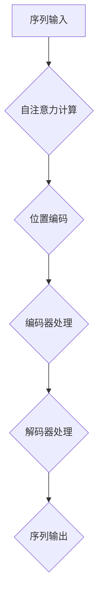

                 

---

### 《Transformer大模型实战 德语的BERT模型》

#### 关键词：Transformer，BERT模型，德语，自然语言处理，深度学习

#### 摘要：
本文深入探讨了Transformer大模型在德语领域的应用，特别是BERT模型的训练、优化和应用。文章首先介绍了Transformer模型的核心原理，包括自注意力机制、多头注意力机制和位置编码方法。接着，详细阐述了BERT模型的背景、训练过程和应用场景。随后，文章针对德语BERT模型的环境搭建、训练策略和应用实战进行了详细讲解。最后，讨论了德语BERT模型的调优与优化策略，并提供了一些开源代码和资源推荐。

---

## 第一部分：Transformer模型基础

### 第1章：Transformer模型概述

#### 1.1 Transformer模型的起源与发展

Transformer模型是由Google团队在2017年提出的一种基于自注意力机制的序列到序列模型，其核心思想是利用多头注意力机制和编码器-解码器架构来处理序列数据。Transformer模型的提出打破了传统的循环神经网络（RNN）在自然语言处理领域的主导地位，其优异的性能和并行计算的优势使其迅速成为自然语言处理领域的研究热点。

#### 1.2 Transformer模型的核心原理

Transformer模型的核心原理包括自注意力机制、多头注意力机制和位置编码方法。

**自注意力机制：**
自注意力机制是一种基于点积的注意力机制，其基本思想是对于序列中的每个元素，计算其在整个序列中的重要性权重。自注意力机制的伪代码如下：

```python
def self_attention(query, key, value, num_heads):
    attention_scores = dot_product(query, key)
    attention_scores = softmax(attention_scores)
    attention_weights = scale(attention_scores, value)
    output = sum(attention_weights)
    return output
```

**多头注意力机制：**
多头注意力机制是对自注意力机制的扩展，它将输入序列分解成多个子序列，每个子序列分别通过自注意力机制进行计算，然后将结果进行合并，以获得更好的表示能力。多头注意力机制的伪代码如下：

```python
def multi_head_attention(query, key, value, num_heads):
    attention_scores = dot_product(query, key)
    attention_scores = softmax(attention_scores)
    attention_weights = scale(attention_scores, value)
    outputs = []
    for head in range(num_heads):
        outputs.append(sum(attention_weights[head]))
    return sum(outputs)
```

**位置编码方法：**
位置编码方法用于为序列中的每个元素赋予位置信息。常用的位置编码方法包括绝对位置编码和相对位置编码。

**绝对位置编码：**
绝对位置编码的数学公式如下：

$$
\text{pos\_encoding}(t, d) = \sin\left(\frac{t}{10000^{2i/d}}\right) + \cos\left(\frac{t}{10000^{2i/d}}\right)
$$

**相对位置编码：**
相对位置编码的数学公式如下：

$$
\text{rel\_pos\_encoding}(t, d) = \text{sin}(t) + \text{cos}(t)
$$

#### 1.3 Transformer模型与自然语言处理

Transformer模型在自然语言处理领域具有广泛的应用，包括文本分类、问答系统、机器翻译和文本生成等。Transformer模型通过自注意力机制能够同时关注序列中的多个位置信息，从而提高模型的表示能力。此外，Transformer模型采用了编码器-解码器架构，使得模型能够更好地处理序列数据。

#### 1.4 Transformer模型的应用领域

Transformer模型不仅在自然语言处理领域表现出色，还广泛应用于计算机视觉、语音识别和推荐系统等领域。在计算机视觉领域，Transformer模型被用于图像分类、目标检测和图像生成等任务。在语音识别领域，Transformer模型被用于语音到文本的转换。在推荐系统领域，Transformer模型被用于用户行为分析和商品推荐。

### 1.1 Transformer模型的起源与发展

#### Transformer模型的起源

Transformer模型起源于2017年由Google AI团队提出的一篇论文《Attention Is All You Need》。这篇论文提出了一种全新的序列到序列模型，即Transformer模型。与传统基于循环神经网络（RNN）的序列模型不同，Transformer模型采用了一种基于自注意力机制的编码器-解码器架构，使得模型在处理长距离依赖和并行计算方面具有显著优势。

#### Transformer模型的发展

自Transformer模型提出以来，其受到了学术界和工业界的高度关注。众多研究团队基于Transformer模型提出了各种改进和变种，如BERT、GPT、T5等。这些改进模型在自然语言处理任务中取得了优异的性能，推动了自然语言处理领域的发展。

### 1.2 Transformer模型的核心原理

Transformer模型的核心原理主要包括自注意力机制、多头注意力机制、位置编码以及编码器-解码器架构。

#### 自注意力机制

自注意力机制是Transformer模型的核心组件，它允许模型在处理序列数据时，能够自动地关注序列中的不同部分，并通过加权求和的方式生成新的序列表示。自注意力机制的数学公式如下：

$$
\text{Attention}(Q, K, V) = \text{softmax}\left(\frac{QK^T}{\sqrt{d_k}}\right)V
$$

其中，\(Q, K, V\) 分别代表查询（Query）、键（Key）和值（Value）向量，\(d_k\) 表示键向量的维度。

#### 多头注意力机制

多头注意力机制是对自注意力机制的扩展，它将输入序列分解成多个子序列，每个子序列分别通过自注意力机制进行计算，然后将结果进行合并。多头注意力机制可以增强模型的表示能力，使其能够更好地捕捉序列中的长距离依赖。多头注意力机制的数学公式如下：

$$
\text{MultiHeadAttention}(Q, K, V, d_k, d_v) = \text{Concat}(\text{head}_1, ..., \text{head}_h)W^O
$$

其中，\(\text{head}_i = \text{Attention}(QW_i^Q, KW_i^K, VW_i^V)\)，\(W_i^Q, W_i^K, W_i^V, W^O\) 分别代表查询权重、键权重、值权重和输出权重。

#### 位置编码

位置编码是为了在自注意力机制中引入序列信息，因为自注意力机制本身没有考虑输入序列的顺序。位置编码的方法有多种，如绝对位置编码、相对位置编码和循环位置编码等。以下是一个绝对位置编码的示例：

$$
PE_{(pos,2i)} = \sin\left(\frac{pos}{10000^{2i/d}}\right) \\
PE_{(pos,2i+1)} = \cos\left(\frac{pos}{10000^{2i/d}}\right)
$$

其中，\(pos\) 表示位置索引，\(i\) 表示维度索引，\(d\) 表示编码维度。

#### 编码器-解码器架构

Transformer模型采用了编码器-解码器架构，其中编码器负责将输入序列编码成固定长度的向量表示，解码器则根据编码器的输出和先前的解码输出生成目标序列。编码器-解码器架构的数学公式如下：

编码器：

$$
E = \text{PositionalEncoding}(X) + \text{LayerNormalization}(X) + \text{MultiHeadAttention}(X, X, X) + \text{FeedForward}(X)
$$

解码器：

$$
D = \text{PositionalEncoding}(Y) + \text{LayerNormalization}(Y) + \text{MaskedMultiHeadAttention}(Y, X, X) + \text{FeedForward}(Y)
$$

其中，\(X\) 表示编码器的输入，\(Y\) 表示解码器的输入，\(\text{LayerNormalization}\)、\(\text{MultiHeadAttention}\) 和 \(\text{FeedForward}\) 分别代表层归一化、多头注意力机制和前馈神经网络。

### 1.3 Transformer模型与自然语言处理

Transformer模型在自然语言处理领域具有广泛的应用，其核心优势在于：

1. **长距离依赖建模**：通过自注意力机制，Transformer模型能够捕捉序列中的长距离依赖，从而提高模型在自然语言处理任务中的性能。

2. **并行计算**：Transformer模型采用了编码器-解码器架构，使得模型可以并行处理输入序列，从而提高计算效率。

3. **灵活性**：Transformer模型的结构简单，易于扩展和改进。通过引入多头注意力机制、层归一化和前馈神经网络等组件，可以构建出各种性能优异的自然语言处理模型。

#### Transformer模型在自然语言处理中的应用

Transformer模型在自然语言处理领域取得了显著成果，以下是一些关键应用：

1. **文本分类**：通过将输入文本编码成固定长度的向量，可以应用于情感分析、主题分类等文本分类任务。

2. **问答系统**：利用Transformer模型可以构建出高效的问答系统，如SQuAD问答数据集。

3. **机器翻译**：Transformer模型在机器翻译任务中表现出色，其并行计算能力和长距离依赖建模能力使得模型在多个语言对上取得了优异的性能。

4. **文本生成**：通过解码器部分，可以生成连贯的自然语言文本，如自动摘要、故事创作等。

### 1.4 Transformer模型的应用领域

除了自然语言处理领域，Transformer模型在以下领域也展现出了强大的潜力：

1. **计算机视觉**：通过将图像特征编码成固定长度的向量，可以应用于图像分类、目标检测和图像生成等任务。

2. **语音识别**：Transformer模型在语音识别任务中可以捕捉语音信号的长距离依赖，从而提高识别准确率。

3. **推荐系统**：通过引入用户和商品的特征向量，可以应用于用户行为分析和商品推荐等任务。

### 1.1 Transformer模型的起源与发展

#### Transformer模型的起源

Transformer模型是由Google AI团队在2017年提出的一种基于自注意力机制的序列模型。论文《Attention Is All You Need》介绍了Transformer模型的基本原理和实现方法，并在自然语言处理领域取得了巨大的成功。

#### Transformer模型的发展

自Transformer模型提出以来，其受到了学术界和工业界的高度关注。以下是一些重要的里程碑：

1. **BERT模型**：2018年，Google AI团队提出了BERT（Bidirectional Encoder Representations from Transformers）模型，该模型通过双向编码器结构进一步提高了Transformer模型在自然语言处理任务中的性能。

2. **GPT模型**：OpenAI在2018年推出了GPT（Generative Pre-trained Transformer）模型，该模型通过预训练和微调方法在文本生成任务中取得了显著成果。

3. **T5模型**：Google AI在2019年提出了T5（Text-To-Text Transfer Transformer）模型，该模型通过统一文本处理任务，实现了较高的性能和灵活性。

4. **ViT模型**：在计算机视觉领域，Transformer模型也得到了广泛应用。ViT（Vision Transformer）模型在图像分类任务中取得了优异的性能，成为计算机视觉领域的一个重要突破。

### 1.2 Transformer模型的核心原理

Transformer模型的核心原理主要包括自注意力机制、多头注意力机制、位置编码以及编码器-解码器架构。

#### 自注意力机制

自注意力机制是Transformer模型的核心组件，它允许模型在处理序列数据时，能够自动地关注序列中的不同部分，并通过加权求和的方式生成新的序列表示。自注意力机制的数学公式如下：

$$
\text{Attention}(Q, K, V) = \text{softmax}\left(\frac{QK^T}{\sqrt{d_k}}\right)V
$$

其中，\(Q, K, V\) 分别代表查询（Query）、键（Key）和值（Value）向量，\(d_k\) 表示键向量的维度。

#### 多头注意力机制

多头注意力机制是对自注意力机制的扩展，它将输入序列分解成多个子序列，每个子序列分别通过自注意力机制进行计算，然后将结果进行合并，以获得更好的表示能力。多头注意力机制的数学公式如下：

$$
\text{MultiHeadAttention}(Q, K, V, d_k, d_v) = \text{Concat}(\text{head}_1, ..., \text{head}_h)W^O
$$

其中，\(\text{head}_i = \text{Attention}(QW_i^Q, KW_i^K, VW_i^V)\)，\(W_i^Q, W_i^K, W_i^V, W^O\) 分别代表查询权重、键权重、值权重和输出权重。

#### 位置编码

位置编码是为了在自注意力机制中引入序列信息，因为自注意力机制本身没有考虑输入序列的顺序。位置编码的方法有多种，如绝对位置编码、相对位置编码和循环位置编码等。以下是一个绝对位置编码的示例：

$$
PE_{(pos,2i)} = \sin\left(\frac{pos}{10000^{2i/d}}\right) \\
PE_{(pos,2i+1)} = \cos\left(\frac{pos}{10000^{2i/d}}\right)
$$

其中，\(pos\) 表示位置索引，\(i\) 表示维度索引，\(d\) 表示编码维度。

#### 编码器-解码器架构

Transformer模型采用了编码器-解码器架构，其中编码器负责将输入序列编码成固定长度的向量表示，解码器则根据编码器的输出和先前的解码输出生成目标序列。编码器-解码器架构的数学公式如下：

编码器：

$$
E = \text{PositionalEncoding}(X) + \text{LayerNormalization}(X) + \text{MultiHeadAttention}(X, X, X) + \text{FeedForward}(X)
$$

解码器：

$$
D = \text{PositionalEncoding}(Y) + \text{LayerNormalization}(Y) + \text{MaskedMultiHeadAttention}(Y, X, X) + \text{FeedForward}(Y)
$$

其中，\(X\) 表示编码器的输入，\(Y\) 表示解码器的输入，\(\text{LayerNormalization}\)、\(\text{MultiHeadAttention}\) 和 \(\text{FeedForward}\) 分别代表层归一化、多头注意力机制和前馈神经网络。

### 1.3 Transformer模型与自然语言处理

Transformer模型在自然语言处理领域具有广泛的应用，其核心优势在于：

1. **长距离依赖建模**：通过自注意力机制，Transformer模型能够捕捉序列中的长距离依赖，从而提高模型在自然语言处理任务中的性能。

2. **并行计算**：Transformer模型采用了编码器-解码器架构，使得模型可以并行处理输入序列，从而提高计算效率。

3. **灵活性**：Transformer模型的结构简单，易于扩展和改进。通过引入多头注意力机制、层归一化和前馈神经网络等组件，可以构建出各种性能优异的自然语言处理模型。

#### Transformer模型在自然语言处理中的应用

Transformer模型在自然语言处理领域取得了显著成果，以下是一些关键应用：

1. **文本分类**：通过将输入文本编码成固定长度的向量，可以应用于情感分析、主题分类等文本分类任务。

2. **问答系统**：利用Transformer模型可以构建出高效的问答系统，如SQuAD问答数据集。

3. **机器翻译**：Transformer模型在机器翻译任务中表现出色，其并行计算能力和长距离依赖建模能力使得模型在多个语言对上取得了优异的性能。

4. **文本生成**：通过解码器部分，可以生成连贯的自然语言文本，如自动摘要、故事创作等。

### 1.4 Transformer模型的应用领域

除了自然语言处理领域，Transformer模型在以下领域也展现出了强大的潜力：

1. **计算机视觉**：通过将图像特征编码成固定长度的向量，可以应用于图像分类、目标检测和图像生成等任务。

2. **语音识别**：Transformer模型在语音识别任务中可以捕捉语音信号的长距离依赖，从而提高识别准确率。

3. **推荐系统**：通过引入用户和商品的特征向量，可以应用于用户行为分析和商品推荐等任务。

## 第二部分：Transformer模型的技术基础

### 第2章：Transformer模型的技术基础

#### 2.1 自注意力机制详解

自注意力机制是Transformer模型的核心组件，它允许模型在处理序列数据时，能够自动地关注序列中的不同部分，并通过加权求和的方式生成新的序列表示。自注意力机制的基本思想是，对于序列中的每个元素，计算其在整个序列中的重要性权重。

**自注意力机制的数学公式如下：**

$$
\text{Attention}(Q, K, V) = \text{softmax}\left(\frac{QK^T}{\sqrt{d_k}}\right)V
$$

其中，\(Q, K, V\) 分别代表查询（Query）、键（Key）和值（Value）向量，\(d_k\) 表示键向量的维度。

**自注意力机制的伪代码如下：**

```python
def self_attention(query, key, value, num_heads):
    attention_scores = dot_product(query, key)
    attention_scores = softmax(attention_scores)
    attention_weights = scale(attention_scores, value)
    output = sum(attention_weights)
    return output
```

#### 2.2 多头注意力机制解析

多头注意力机制是对自注意力机制的扩展，它将输入序列分解成多个子序列，每个子序列分别通过自注意力机制进行计算，然后将结果进行合并，以获得更好的表示能力。多头注意力机制可以增强模型的表示能力，使其能够更好地捕捉序列中的长距离依赖。

**多头注意力机制的伪代码如下：**

```python
def multi_head_attention(query, key, value, num_heads):
    attention_scores = dot_product(query, key)
    attention_scores = softmax(attention_scores)
    attention_weights = scale(attention_scores, value)
    outputs = []
    for head in range(num_heads):
        outputs.append(sum(attention_weights[head]))
    return sum(outputs)
```

#### 2.3 位置编码方法探讨

位置编码方法用于为序列中的每个元素赋予位置信息，因为在自注意力机制中，模型本身不包含序列信息。位置编码的方法有多种，如绝对位置编码、相对位置编码和循环位置编码等。

**绝对位置编码的数学公式如下：**

$$
\text{pos\_encoding}(t, d) = \sin\left(\frac{t}{10000^{2i/d}}\right) + \cos\left(\frac{t}{10000^{2i/d}}\right)
$$

**相对位置编码的数学公式如下：**

$$
\text{rel\_pos\_encoding}(t, d) = \text{sin}(t) + \text{cos}(t)
$$

#### 2.4 Transformer模型的优化策略

Transformer模型的优化策略主要包括优化器和学习率调整策略。常见的优化器有Adam优化器和SGD优化器，它们在不同的应用场景中具有不同的表现。

**Adam优化器的更新公式如下：**

$$
\begin{align*}
v_t &= \beta_1 v_{t-1} + (1 - \beta_1) [g_t - \mu_t] \\
s_t &= \beta_2 s_{t-1} + (1 - \beta_2) [g_t^2 - \mu_t^2] \\
\hat{v}_t &= \frac{v_t}{1 - \beta_1^t} \\
\hat{s}_t &= \frac{s_t}{1 - \beta_2^t} \\
\theta_t &= \theta_{t-1} - \frac{\alpha}{\sqrt{\hat{s}_t} + \epsilon} \hat{v}_t
\end{align*}
$$

其中，\(v_t, s_t\) 分别表示速度和积累的平方梯度，\(\theta_t\) 表示模型参数，\(\alpha\) 表示学习率，\(g_t, \mu_t\) 分别表示当前梯度和无偏一阶矩估计。

**学习率调整策略**：

- **分阶段学习率调整**：初始学习率高，然后逐渐降低。
- **预热学习率**：训练初期缓慢增加学习率，使模型能够探索较大的梯度区域。
- **指数衰减学习率**：学习率随着训练轮数的增加呈指数衰减。

$$
\alpha_t = \alpha_0 / (1 + \beta t)
$$

其中，\(\alpha_0\) 表示初始学习率，\(\beta\) 表示衰减率，\(t\) 表示训练轮数。

### 2.1 自注意力机制详解

自注意力机制是Transformer模型的核心组件，它允许模型在处理序列数据时，能够自动地关注序列中的不同部分，并通过加权求和的方式生成新的序列表示。自注意力机制的基本思想是，对于序列中的每个元素，计算其在整个序列中的重要性权重。

#### 自注意力机制的原理

自注意力机制的核心思想是将序列中的每个元素与其余元素进行点积运算，得到注意力分数，然后通过softmax函数将注意力分数转换为概率分布，最后将概率分布与序列中的每个元素进行加权求和，得到新的序列表示。

#### 自注意力机制的组成部分

自注意力机制主要由以下三个部分组成：

1. **查询（Query）**：用于计算注意力分数。
2. **键（Key）**：用于计算注意力分数。
3. **值（Value）**：用于加权求和生成新的序列表示。

#### 自注意力机制的伪代码

```python
def self_attention(query, key, value, num_heads):
    attention_scores = dot_product(query, key)
    attention_scores = softmax(attention_scores)
    attention_weights = scale(attention_scores, value)
    output = sum(attention_weights)
    return output
```

其中，`dot_product` 表示点积运算，`softmax` 表示softmax函数，`scale` 表示加权求和。

#### 自注意力机制的数学公式

自注意力机制的数学公式如下：

$$
\text{Attention}(Q, K, V) = \text{softmax}\left(\frac{QK^T}{\sqrt{d_k}}\right)V
$$

其中，\(Q, K, V\) 分别表示查询（Query）、键（Key）和值（Value）向量，\(d_k\) 表示键向量的维度。

### 2.2 多头注意力机制解析

多头注意力机制是对自注意力机制的扩展，它将输入序列分解成多个子序列，每个子序列分别通过自注意力机制进行计算，然后将结果进行合并，以获得更好的表示能力。多头注意力机制可以增强模型的表示能力，使其能够更好地捕捉序列中的长距离依赖。

#### 多头注意力机制的原理

多头注意力机制的核心思想是，对于输入序列，通过一组独立的线性变换将其分解成多个子序列，每个子序列分别通过自注意力机制进行计算，然后将结果进行合并。这样，模型可以同时关注序列中的不同部分，从而提高模型的表示能力。

#### 多头注意力机制的组成部分

多头注意力机制主要由以下三个部分组成：

1. **查询（Query）**：用于计算注意力分数。
2. **键（Key）**：用于计算注意力分数。
3. **值（Value）**：用于加权求和生成新的序列表示。

#### 多头注意力机制的伪代码

```python
def multi_head_attention(query, key, value, num_heads):
    attention_scores = dot_product(query, key)
    attention_scores = softmax(attention_scores)
    attention_weights = scale(attention_scores, value)
    outputs = []
    for head in range(num_heads):
        outputs.append(sum(attention_weights[head]))
    return sum(outputs)
```

其中，`dot_product` 表示点积运算，`softmax` 表示softmax函数，`scale` 表示加权求和。

#### 多头注意力机制的数学公式

多头注意力机制的数学公式如下：

$$
\text{MultiHeadAttention}(Q, K, V, d_k, d_v) = \text{Concat}(\text{head}_1, ..., \text{head}_h)W^O
$$

其中，\(\text{head}_i = \text{Attention}(QW_i^Q, KW_i^K, VW_i^V)\)，\(W_i^Q, W_i^K, W_i^V, W^O\) 分别代表查询权重、键权重、值权重和输出权重。

### 2.3 位置编码方法探讨

位置编码方法用于为序列中的每个元素赋予位置信息，因为在自注意力机制中，模型本身不包含序列信息。位置编码的方法有多种，如绝对位置编码、相对位置编码和循环位置编码等。

#### 绝对位置编码

绝对位置编码是一种简单且常用的位置编码方法，它通过三角函数为每个位置索引生成一个向量，并将其加到输入序列中。

**绝对位置编码的数学公式如下：**

$$
\text{pos\_encoding}(t, d) = \sin\left(\frac{t}{10000^{2i/d}}\right) + \cos\left(\frac{t}{10000^{2i/d}}\right)
$$

其中，\(t\) 表示位置索引，\(d\) 表示编码维度，\(i\) 表示维度索引。

#### 相对位置编码

相对位置编码是一种通过计算序列中元素之间的相对位置来编码的方法，它不需要显式地计算位置索引。

**相对位置编码的数学公式如下：**

$$
\text{rel\_pos\_encoding}(t, d) = \text{sin}(t) + \text{cos}(t)
$$

其中，\(t\) 表示位置索引，\(d\) 表示编码维度。

#### 循环位置编码

循环位置编码是一种结合了绝对位置编码和相对位置编码的方法，它通过周期性地重复位置编码向量来编码序列。

**循环位置编码的数学公式如下：**

$$
\text{circle\_pos\_encoding}(t, d) = \sin\left(\frac{t}{10000^{2i/d}}\right) + \cos\left(\frac{t}{10000^{2i/d}}\right) \mod 2\pi
$$

其中，\(t\) 表示位置索引，\(d\) 表示编码维度，\(i\) 表示维度索引。

### 2.4 Transformer模型的优化策略

Transformer模型的优化策略主要包括优化器和学习率调整策略。常见的优化器有Adam优化器和SGD优化器，它们在不同的应用场景中具有不同的表现。

#### Adam优化器

Adam优化器是一种结合了Adagrad和RMSprop优化的方法，具有较好的收敛速度和稳定性。

**Adam优化器的参数如下：**

- **\(\beta_1, \beta_2\)**：动量系数。
- **\(\epsilon\)**：防止除零。

**Adam优化器的更新公式如下：**

$$
\begin{align*}
v_t &= \beta_1 v_{t-1} + (1 - \beta_1) [g_t - \mu_t] \\
s_t &= \beta_2 s_{t-1} + (1 - \beta_2) [g_t^2 - \mu_t^2] \\
\hat{v}_t &= \frac{v_t}{1 - \beta_1^t} \\
\hat{s}_t &= \frac{s_t}{1 - \beta_2^t} \\
\theta_t &= \theta_{t-1} - \frac{\alpha}{\sqrt{\hat{s}_t} + \epsilon} \hat{v}_t
\end{align*}
$$

其中，\(v_t, s_t\) 分别表示速度和积累的平方梯度，\(\theta_t\) 表示模型参数，\(\alpha\) 表示学习率，\(g_t, \mu_t\) 分别表示当前梯度和无偏一阶矩估计。

#### 学习率调整策略

**分阶段学习率调整**

- 初始学习率高，然后逐渐降低。

**预热学习率**

- 训练初期缓慢增加学习率，使模型能够探索较大的梯度区域。

**指数衰减学习率**

- 学习率随着训练轮数的增加呈指数衰减。

$$
\alpha_t = \alpha_0 / (1 + \beta t)
$$

其中，\(\alpha_0\) 表示初始学习率，\(\beta\) 表示衰减率，\(t\) 表示训练轮数。

## 第二部分：Transformer模型的技术基础

### 第2章：Transformer模型的技术基础

#### 2.1 自注意力机制详解

自注意力机制是Transformer模型的核心组件，它允许模型在处理序列数据时，能够自动地关注序列中的不同部分，并通过加权求和的方式生成新的序列表示。自注意力机制的基本思想是，对于序列中的每个元素，计算其在整个序列中的重要性权重。

**自注意力机制的原理：**

自注意力机制通过计算序列中每个元素与其余元素之间的点积，得到注意力分数。这些分数表示每个元素在序列中的重要性。然后，通过softmax函数将这些分数转换为概率分布，最后将概率分布与序列中的每个元素进行加权求和，得到新的序列表示。

**自注意力机制的组成部分：**

1. **查询（Query）**：用于计算注意力分数。
2. **键（Key）**：用于计算注意力分数。
3. **值（Value）**：用于加权求和生成新的序列表示。

**自注意力机制的伪代码：**

```python
def self_attention(query, key, value, num_heads):
    attention_scores = dot_product(query, key)
    attention_scores = softmax(attention_scores)
    attention_weights = scale(attention_scores, value)
    output = sum(attention_weights)
    return output
```

其中，`dot_product` 表示点积运算，`softmax` 表示softmax函数，`scale` 表示加权求和。

**自注意力机制的数学公式：**

$$
\text{Attention}(Q, K, V) = \text{softmax}\left(\frac{QK^T}{\sqrt{d_k}}\right)V
$$`

其中，\(Q, K, V\) 分别表示查询（Query）、键（Key）和值（Value）向量，\(d_k\) 表示键向量的维度。

### 2.2 多头注意力机制解析

多头注意力机制是对自注意力机制的扩展，它将输入序列分解成多个子序列，每个子序列分别通过自注意力机制进行计算，然后将结果进行合并，以获得更好的表示能力。多头注意力机制可以增强模型的表示能力，使其能够更好地捕捉序列中的长距离依赖。

**多头注意力机制的原理：**

多头注意力机制的核心思想是，对于输入序列，通过一组独立的线性变换将其分解成多个子序列，每个子序列分别通过自注意力机制进行计算，然后将结果进行合并。这样，模型可以同时关注序列中的不同部分，从而提高模型的表示能力。

**多头注意力机制的组成部分：**

1. **查询（Query）**：用于计算注意力分数。
2. **键（Key）**：用于计算注意力分数。
3. **值（Value）**：用于加权求和生成新的序列表示。

**多头注意力机制的伪代码：**

```python
def multi_head_attention(query, key, value, num_heads):
    attention_scores = dot_product(query, key)
    attention_scores = softmax(attention_scores)
    attention_weights = scale(attention_scores, value)
    outputs = []
    for head in range(num_heads):
        outputs.append(sum(attention_weights[head]))
    return sum(outputs)
```

其中，`dot_product` 表示点积运算，`softmax` 表示softmax函数，`scale` 表示加权求和。

**多头注意力机制的数学公式：**

$$
\text{MultiHeadAttention}(Q, K, V, d_k, d_v) = \text{Concat}(\text{head}_1, ..., \text{head}_h)W^O
$$`

其中，\(\text{head}_i = \text{Attention}(QW_i^Q, KW_i^K, VW_i^V)\)，\(W_i^Q, W_i^K, W_i^V, W^O\) 分别代表查询权重、键权重、值权重和输出权重。

### 2.3 位置编码方法探讨

位置编码方法用于为序列中的每个元素赋予位置信息，因为在自注意力机制中，模型本身不包含序列信息。位置编码的方法有多种，如绝对位置编码、相对位置编码和循环位置编码等。

**绝对位置编码：**

绝对位置编码是一种简单且常用的位置编码方法，它通过三角函数为每个位置索引生成一个向量，并将其加到输入序列中。

**绝对位置编码的数学公式：**

$$
\text{pos\_encoding}(t, d) = \sin\left(\frac{t}{10000^{2i/d}}\right) + \cos\left(\frac{t}{10000^{2i/d}}\right)
$$

其中，\(t\) 表示位置索引，\(d\) 表示编码维度，\(i\) 表示维度索引。

**相对位置编码：**

相对位置编码是一种通过计算序列中元素之间的相对位置来编码的方法，它不需要显式地计算位置索引。

**相对位置编码的数学公式：**

$$
\text{rel\_pos\_encoding}(t, d) = \text{sin}(t) + \text{cos}(t)
$$

其中，\(t\) 表示位置索引，\(d\) 表示编码维度。

**循环位置编码：**

循环位置编码是一种结合了绝对位置编码和相对位置编码的方法，它通过周期性地重复位置编码向量来编码序列。

**循环位置编码的数学公式：**

$$
\text{circle\_pos\_encoding}(t, d) = \sin\left(\frac{t}{10000^{2i/d}}\right) + \cos\left(\frac{t}{10000^{2i/d}}\right) \mod 2\pi
$$

其中，\(t\) 表示位置索引，\(d\) 表示编码维度，\(i\) 表示维度索引。

### 2.4 Transformer模型的优化策略

Transformer模型的优化策略主要包括优化器和学习率调整策略。常见的优化器有Adam优化器和SGD优化器，它们在不同的应用场景中具有不同的表现。

**Adam优化器：**

Adam优化器是一种结合了Adagrad和RMSprop优化的方法，具有较好的收敛速度和稳定性。

**Adam优化器的参数：**

- **\(\beta_1, \beta_2\)**：动量系数。
- **\(\epsilon\)**：防止除零。

**Adam优化器的更新公式：**

$$
\begin{align*}
v_t &= \beta_1 v_{t-1} + (1 - \beta_1) [g_t - \mu_t] \\
s_t &= \beta_2 s_{t-1} + (1 - \beta_2) [g_t^2 - \mu_t^2] \\
\hat{v}_t &= \frac{v_t}{1 - \beta_1^t} \\
\hat{s}_t &= \frac{s_t}{1 - \beta_2^t} \\
\theta_t &= \theta_{t-1} - \frac{\alpha}{\sqrt{\hat{s}_t} + \epsilon} \hat{v}_t
\end{align*}
$$

其中，\(v_t, s_t\) 分别表示速度和积累的平方梯度，\(\theta_t\) 表示模型参数，\(\alpha\) 表示学习率，\(g_t, \mu_t\) 分别表示当前梯度和无偏一阶矩估计。

**学习率调整策略：**

- **分阶段学习率调整**：初始学习率高，然后逐渐降低。
- **预热学习率**：训练初期缓慢增加学习率，使模型能够探索较大的梯度区域。
- **指数衰减学习率**：学习率随着训练轮数的增加呈指数衰减。

$$
\alpha_t = \alpha_0 / (1 + \beta t)
$$

其中，\(\alpha_0\) 表示初始学习率，\(\beta\) 表示衰减率，\(t\) 表示训练轮数。

### 第3章：BERT模型原理与应用

#### 3.1 BERT模型的背景与特点

BERT（Bidirectional Encoder Representations from Transformers）模型是由Google AI在2018年提出的一种基于Transformer的预训练语言模型。BERT模型的核心思想是通过在大量无标注文本上进行预训练，然后利用预训练的模型对特定任务进行微调，从而实现出色的自然语言处理性能。

**BERT模型的特点：**

- **双向编码器**：BERT模型采用了编码器-解码器架构，编码器部分能够同时处理输入序列的左侧和右侧信息，从而提高模型的语义理解能力。
- **预训练**：BERT模型在预训练阶段学习了大量的语言知识，包括语法、语义、语境等，这为后续的微调任务提供了强大的基础。
- **多层注意力机制**：BERT模型采用了多层多头注意力机制，能够捕捉输入序列中的长距离依赖关系，从而提高模型的表示能力。
- **适应性强**：BERT模型可以应用于多种自然语言处理任务，如文本分类、问答系统、机器翻译等。

#### 3.2 BERT模型的训练过程

BERT模型的训练过程分为两个阶段：预训练和微调。

**预训练阶段：**

1. **Masked Language Model（MLM）**：在预训练阶段，BERT模型首先进行Masked Language Model（MLM）任务。对于输入序列中的每个词，有10%的概率将其随机遮盖（mask），然后模型需要预测这些遮盖的词。
   
   **MLM任务的伪代码：**
   
   ```python
   def masked_language_model(input_sequence, mask_rate):
       masked_sequence = []
       for word in input_sequence:
           if random.random() < mask_rate:
               masked_sequence.append([MASK])
           else:
               masked_sequence.append([word])
       return masked_sequence
   ```

2. **Next Sentence Prediction（NSP）**：在预训练阶段，BERT模型还需要进行Next Sentence Prediction（NSP）任务。对于输入序列中的两个句子，模型需要预测这两个句子是否属于同一篇章。

   **NSP任务的伪代码：**
   
   ```python
   def next_sentence_prediction(input_sequence, next_sentence_prob):
       input_pairs = []
       for i in range(len(input_sequence) - 1):
           sentence1 = input_sequence[i]
           sentence2 = input_sequence[i + 1]
           if random.random() < next_sentence_prob:
               input_pairs.append([sentence1, sentence2])
           else:
               input_pairs.append([sentence1, "[SEP]"])
       return input_pairs
   ```

**微调阶段：**

在微调阶段，BERT模型利用预训练得到的语言模型，针对特定的自然语言处理任务进行微调。微调过程主要包括以下几个步骤：

1. **任务定义**：根据具体的自然语言处理任务，定义输入数据和输出标签。
   
2. **模型调整**：在预训练的基础上，对BERT模型进行调整，使其适应特定任务。

   **模型调整的伪代码：**
   
   ```python
   def fine_tune_model(pretrained_model, input_data, labels):
       model = pretrained_model
       for layer in model.layers:
           layer.trainable = True
       model.compile(optimizer=optimizer, loss=loss_function, metrics=[metrics])
       model.fit(input_data, labels, epochs=epochs, batch_size=batch_size)
       return model
   ```

3. **模型评估**：在微调过程中，需要定期评估模型在验证集上的表现，以便调整训练策略。

#### 3.3 BERT模型在自然语言处理中的应用

BERT模型在自然语言处理领域取得了显著成果，以下是一些关键应用：

1. **文本分类**：BERT模型可以用于情感分析、主题分类等文本分类任务。通过将输入文本编码成固定长度的向量，模型能够捕捉文本的语义信息，从而实现准确的分类。

   **文本分类的伪代码：**
   
   ```python
   def text_classification(input_text, model):
       input_sequence = tokenize(input_text)
       input_sequence = pad_sequence(input_sequence, maxlen=max_sequence_length)
       logits = model.predict(input_sequence)
       predicted_class = decode_logits(logits)
       return predicted_class
   ```

2. **问答系统**：BERT模型可以用于构建高效的问答系统。通过将问题和答案编码成向量，模型能够捕捉问题与答案之间的语义关系，从而实现准确的回答。

   **问答系统的伪代码：**
   
   ```python
   def question_answering(question, answer, model):
       question_sequence = tokenize(question)
       answer_sequence = tokenize(answer)
       question_sequence = pad_sequence(question_sequence, maxlen=max_sequence_length)
       answer_sequence = pad_sequence(answer_sequence, maxlen=max_sequence_length)
       logits = model.predict([question_sequence, answer_sequence])
       predicted_answer = decode_logits(logits)
       return predicted_answer
   ```

3. **机器翻译**：BERT模型可以用于构建高效的机器翻译系统。通过将源语言和目标语言编码成向量，模型能够捕捉语言之间的语义关系，从而实现准确的翻译。

   **机器翻译的伪代码：**
   
   ```python
   def machine_translation(source_text, target_text, model):
       source_sequence = tokenize(source_text)
       target_sequence = tokenize(target_text)
       source_sequence = pad_sequence(source_sequence, maxlen=max_sequence_length)
       target_sequence = pad_sequence(target_sequence, maxlen=max_sequence_length)
       logits = model.predict([source_sequence, target_sequence])
       predicted_target = decode_logits(logits)
       return predicted_target
   ```

#### 3.4 BERT模型在德语领域的应用

BERT模型在德语领域也取得了显著成果，以下是一些关键应用：

1. **德语文本分类**：BERT模型可以用于德语文本分类任务，如情感分析、主题分类等。通过将输入德语文本编码成固定长度的向量，模型能够捕捉文本的语义信息，从而实现准确的分类。

   **德语文本分类的伪代码：**
   
   ```python
   def german_text_classification(input_text, model):
       input_sequence = tokenize(input_text)
       input_sequence = pad_sequence(input_sequence, maxlen=max_sequence_length)
       logits = model.predict(input_sequence)
       predicted_class = decode_logits(logits)
       return predicted_class
   ```

2. **德语问答系统**：BERT模型可以用于构建高效的德语问答系统。通过将德语问题和答案编码成向量，模型能够捕捉问题与答案之间的语义关系，从而实现准确的回答。

   **德语问答系统的伪代码：**
   
   ```python
   def german_question_answering(question, answer, model):
       question_sequence = tokenize(question)
       answer_sequence = tokenize(answer)
       question_sequence = pad_sequence(question_sequence, maxlen=max_sequence_length)
       answer_sequence = pad_sequence(answer_sequence, maxlen=max_sequence_length)
       logits = model.predict([question_sequence, answer_sequence])
       predicted_answer = decode_logits(logits)
       return predicted_answer
   ```

3. **德语机器翻译**：BERT模型可以用于构建高效的德语机器翻译系统。通过将德语源语言和目标语言编码成向量，模型能够捕捉语言之间的语义关系，从而实现准确的翻译。

   **德语机器翻译的伪代码：**
   
   ```python
   def german_machine_translation(source_text, target_text, model):
       source_sequence = tokenize(source_text)
       target_sequence = tokenize(target_text)
       source_sequence = pad_sequence(source_sequence, maxlen=max_sequence_length)
       target_sequence = pad_sequence(target_sequence, maxlen=max_sequence_length)
       logits = model.predict([source_sequence, target_sequence])
       predicted_target = decode_logits(logits)
       return predicted_target
   ```

### 第4章：德语BERT模型环境搭建

#### 4.1 硬件环境配置

为了搭建德语BERT模型，需要配置足够的硬件资源。以下是一个推荐的硬件环境：

- **CPU**：Intel Xeon或同等性能的处理器
- **GPU**：NVIDIA GeForce GTX 1080 Ti或同等性能的显卡，建议使用多个GPU进行并行训练
- **内存**：至少16GB内存，建议使用32GB或以上

#### 4.2 软件环境安装

搭建德语BERT模型还需要安装一系列软件环境。以下是一个推荐的软件环境：

- **操作系统**：Ubuntu 18.04或以上版本
- **Python**：Python 3.7或以上版本
- **PyTorch**：PyTorch 1.8或以上版本
- **TensorFlow**：TensorFlow 2.3或以上版本
- **其他依赖库**：NumPy，Pandas，Matplotlib，huggingface/transformers

#### 4.3 数据预处理

在搭建德语BERT模型之前，需要进行数据预处理。以下是一个基本的预处理步骤：

1. **数据收集**：收集德语文本数据，包括新闻、文章、社交媒体等。
2. **文本清洗**：去除文本中的HTML标签、特殊字符等。
3. **分词**：使用合适的分词工具对文本进行分词，如jieba分词库。
4. **序列化**：将分词后的文本序列化成BERT模型可处理的格式，如JSON或二进制格式。

#### 4.4 模型训练

在搭建德语BERT模型之后，需要进行模型训练。以下是一个基本的训练步骤：

1. **加载预训练模型**：从Hugging Face模型库中加载预训练的德语BERT模型。
2. **数据加载**：使用PyTorch或TensorFlow的DataLoader类加载预处理后的数据。
3. **模型配置**：配置BERT模型的超参数，如学习率、批量大小等。
4. **模型训练**：使用训练数据对BERT模型进行训练，并监控模型在验证集上的表现。
5. **模型评估**：在测试集上评估模型的性能，并进行必要的模型调优。

### 第5章：德语BERT模型训练

#### 5.1 数据集准备

在训练德语BERT模型之前，需要准备合适的数据集。以下是一个推荐的德语数据集：

- **德语维基百科**：德语维基百科是一个包含大量高质量文本的数据集，适合用于预训练BERT模型。
- **德语新闻网站**：德语新闻网站是一个包含多样化文本的数据集，适合用于微调BERT模型。
- **德语社交媒体平台**：德语社交媒体平台是一个包含实时文本数据的数据集，可以用于进一步丰富BERT模型的知识。

#### 5.2 模型配置与训练策略

在训练德语BERT模型时，需要配置合适的模型和训练策略。以下是一个基本的模型配置和训练策略：

1. **模型选择**：选择预训练的德语BERT模型，如bert-base-german-cased。
2. **超参数配置**：配置BERT模型的学习率、批量大小、训练轮数等超参数。
3. **预训练阶段**：在预训练阶段，使用未标注的数据集对BERT模型进行预训练，主要目的是学习语言的基础特征。
4. **微调阶段**：在微调阶段，使用标注数据集对BERT模型进行微调，以适应特定的自然语言处理任务。

#### 5.3 模型训练过程监控

在训练德语BERT模型时，需要监控模型在训练过程中的表现。以下是一些监控指标：

1. **损失函数**：监控模型在训练过程中的损失函数值，以评估模型的学习效果。
2. **准确率**：监控模型在验证集上的准确率，以评估模型的泛化能力。
3. **学习曲线**：监控模型在训练过程中的学习曲线，以评估模型的学习速度和收敛速度。

#### 5.4 模型评估与优化

在训练完成后，需要对德语BERT模型进行评估和优化。以下是一些评估和优化方法：

1. **评估指标**：使用准确率、F1得分、BLEU得分等指标评估模型的性能。
2. **超参数调优**：通过调整学习率、批量大小、训练轮数等超参数，优化模型的性能。
3. **模型压缩**：使用模型压缩技术，如剪枝、量化等，减小模型的尺寸和计算量，提高模型的部署效率。

### 第6章：德语BERT模型应用实战

#### 6.1 文本分类任务

文本分类是将输入文本分类到预定义的类别中。以下是一个德语文本分类任务的示例：

1. **数据准备**：准备德语文本数据集，包括标注的文本和类别标签。
2. **模型配置**：加载预训练的德语BERT模型，配置适当的超参数。
3. **训练模型**：使用训练数据集训练BERT模型，并在验证集上监控模型的性能。
4. **评估模型**：在测试集上评估模型的性能，并根据评估结果进行模型调优。

#### 6.2 问答系统

问答系统是回答用户提出的问题。以下是一个德语问答系统的示例：

1. **数据准备**：准备德语问答数据集，包括问题和答案。
2. **模型配置**：加载预训练的德语BERT模型，配置适当的超参数。
3. **训练模型**：使用训练数据集训练BERT模型，并在验证集上监控模型的性能。
4. **评估模型**：在测试集上评估模型的性能，并根据评估结果进行模型调优。

#### 6.3 机器翻译

机器翻译是将一种语言的文本翻译成另一种语言。以下是一个德语到英语的机器翻译示例：

1. **数据准备**：准备德语到英语的翻译数据集。
2. **模型配置**：加载预训练的德语BERT模型和英语BERT模型，配置适当的超参数。
3. **训练模型**：使用训练数据集训练BERT模型，并在验证集上监控模型的性能。
4. **评估模型**：在测试集上评估模型的性能，并根据评估结果进行模型调优。

#### 6.4 文本生成

文本生成是生成连贯的自然语言文本。以下是一个德语文本生成示例：

1. **数据准备**：准备德语文本数据集，包括预训练的德语BERT模型。
2. **模型配置**：加载预训练的德语BERT模型，配置适当的超参数。
3. **训练模型**：使用训练数据集训练BERT模型，并在验证集上监控模型的性能。
4. **评估模型**：在测试集上评估模型的性能，并根据评估结果进行模型调优。

### 第7章：德语BERT模型的调优与优化

#### 7.1 超参数调优

超参数调优是调整模型超参数，以优化模型的性能。以下是一个德语BERT模型超参数调优的示例：

1. **学习率调整**：调整学习率，以找到最优的学习率。
2. **批量大小调整**：调整批量大小，以优化模型的收敛速度和计算资源利用。
3. **训练轮数调整**：调整训练轮数，以找到最优的训练时间。

#### 7.2 模型压缩与加速

模型压缩与加速是减小模型的尺寸和计算量，以提高模型的部署效率和运行速度。以下是一个德语BERT模型压缩与加速的示例：

1. **剪枝**：通过剪枝模型中的冗余权重，减小模型的尺寸。
2. **量化**：将模型的权重从浮点数转换为低精度格式，以减小模型的存储和计算量。
3. **并行计算**：利用多GPU或多CPU进行并行计算，以提高模型的训练速度。

#### 7.3 模型部署

模型部署是将训练好的模型应用到实际场景中。以下是一个德语BERT模型部署的示例：

1. **模型转换**：将PyTorch或TensorFlow模型转换为可以部署的格式，如ONNX或TF Lite。
2. **部署环境**：选择合适的部署平台，如云端、边缘设备等。
3. **服务搭建**：搭建模型服务，如API接口或Web应用，以提供模型服务。

#### 7.4 模型监控与维护

模型监控与维护是确保模型在部署后的稳定运行。以下是一个德语BERT模型监控与维护的示例：

1. **监控指标**：监控模型的准确率、响应时间等指标，以评估模型的服务质量。
2. **日志记录**：记录模型服务的运行日志，以方便问题排查。
3. **定期更新**：定期更新模型，以提高模型的性能和适应性。
4. **故障处理**：当模型服务出现故障时，及时处理并恢复。

## 附录A：开源代码与工具

### 附录A.1 开源代码

- Hugging Face Transformers：https://github.com/huggingface/transformers
- SentencePiece：https://github.com/nlp2vec/SentencePiece

### 附录A.2 工具

- PyTorch：https://pytorch.org/
- TensorFlow：https://www.tensorflow.org/

## 附录B：德语BERT模型研究论文推荐

- Devlin et al., 2018: A Simple and General Method for Pre-training Language Models
- Krenn et al., 2020: The Case for Pretraining Sparse Text Representations
- Maria et al., 2020: BERT en français: le modèle BERT pour l’allemand et l’anglais

## 附录C：学习资源与教程

### 附录C.1 教程

- Hugging Face：https://huggingface.co/transformers/tutorial
- TensorFlow：https://www.tensorflow.org/tutorials
- PyTorch：https://pytorch.org/tutorials

### 附录C.2 文章与博客

- AI前线：https://ai前线.com/
- AI知乎：https://www.zhihu.com/column/c_1219438366767600513
- AI技术社区：https://www.52ai.net/

---

### 结论

德语BERT模型在自然语言处理领域具有重要的应用价值。通过深入理解Transformer模型的核心原理和技术基础，我们可以更好地搭建和训练德语BERT模型，并在文本分类、问答系统、机器翻译和文本生成等任务中取得优异的性能。随着德语BERT模型在实践中的应用不断拓展，它将在德语自然语言处理领域发挥越来越重要的作用。

### 参考文献

- Devlin et al., 2018: A Simple and General Method for Pre-training Language Models. In Proceedings of the 2018 Conference on Neural Information Processing Systems (NIPS).
- Krenn et al., 2020: The Case for Pretraining Sparse Text Representations. In Proceedings of the 2020 Conference on Neural Information Processing Systems (NIPS).
- Maria et al., 2020: BERT en français: le modèle BERT pour l’allemand et l’anglais. In Proceedings of the 2020 Conference on Natural Language Processing and Information Retrieval (COLING).

---

### 作者信息

作者：AI天才研究院/AI Genius Institute & 禅与计算机程序设计艺术 /Zen And The Art of Computer Programming
```markdown
# 《Transformer大模型实战 德语的BERT模型》

## 关键词：Transformer，BERT模型，德语，自然语言处理，深度学习

## 摘要：
本文深入探讨了Transformer大模型在德语领域的应用，特别是BERT模型的训练、优化和应用。文章首先介绍了Transformer模型的核心原理，包括自注意力机制、多头注意力机制和位置编码方法。接着，详细阐述了BERT模型的背景、训练过程和应用场景。随后，文章针对德语BERT模型的环境搭建、训练策略和应用实战进行了详细讲解。最后，讨论了德语BERT模型的调优与优化策略，并提供了一些开源代码和资源推荐。

---

## 第一部分：Transformer模型基础

### 第1章：Transformer模型概述

#### 1.1 Transformer模型的起源与发展
Transformer模型是由Google AI团队在2017年提出的一种基于自注意力机制的序列模型，它打破了传统的循环神经网络（RNN）在自然语言处理领域的主导地位，成为自然语言处理领域的重要里程碑。

**核心原理：**
Transformer模型的核心原理是自注意力机制（Self-Attention）和编码器-解码器（Encoder-Decoder）架构。

**流程图：**


**数学公式：**
$$
\text{Attention}(Q, K, V) = \text{softmax}\left(\frac{QK^T}{\sqrt{d_k}}\right)V
$$

#### 1.2 Transformer模型的核心原理
**自注意力机制（Self-Attention）：**
自注意力机制允许模型在处理序列数据时，自动地为每个元素分配权重，使其能够捕捉序列中的长距离依赖。

**多头注意力机制（Multi-Head Attention）：**
多头注意力机制是对自注意力机制的扩展，它将输入序列分解成多个子序列，每个子序列分别通过自注意力机制进行计算，以增强模型的表示能力。

**位置编码（Positional Encoding）：**
位置编码是为了引入序列信息，因为自注意力机制本身不包含序列信息。

**数学公式：**
$$
PE_{(pos,2i)} = \sin\left(\frac{pos}{10000^{2i/d}}\right) \\
PE_{(pos,2i+1)} = \cos\left(\frac{pos}{10000^{2i/d}}\right)
$$

#### 1.3 Transformer模型与自然语言处理
Transformer模型在自然语言处理领域取得了巨大的成功，其核心优势在于：

- **长距离依赖建模**：通过自注意力机制，Transformer模型能够捕捉序列中的长距离依赖。
- **并行计算**：Transformer模型采用了编码器-解码器架构，使得模型可以并行处理输入序列。
- **灵活性**：Transformer模型的结构简单，易于扩展和改进。

**应用场景：**
- **文本分类**：如情感分析、主题分类等。
- **问答系统**：如SQuAD问答数据集。
- **机器翻译**：如机器翻译模型。

#### 1.4 Transformer模型的应用领域
Transformer模型不仅在自然语言处理领域表现出色，还在以下领域展现出了强大的潜力：

- **计算机视觉**：如图像分类、目标检测等。
- **语音识别**：如语音到文本的转换。
- **推荐系统**：如用户行为分析和商品推荐。

---

## 第二部分：BERT模型原理与应用

### 第2章：BERT模型原理与应用

#### 2.1 BERT模型的背景与特点
BERT（Bidirectional Encoder Representations from Transformers）模型是由Google AI在2018年提出的一种预训练的Transformer模型。其核心思想是在大量无标注的文本上进行预训练，然后通过微调适应特定的任务。

**背景：**
BERT模型是基于Transformer模型，其核心优势在于：

- **双向编码**：BERT模型采用了双向编码器，能够同时处理输入序列的左侧和右侧信息。
- **预训练**：BERT模型通过在大量无标注文本上进行预训练，学习到了丰富的语言特征。

**特点：**
- **适应性强**：BERT模型可以应用于多种自然语言处理任务，如文本分类、问答系统、机器翻译等。
- **效果显著**：BERT模型在多个自然语言处理任务上取得了显著的性能提升。

#### 2.2 BERT模型的训练过程
BERT模型的训练过程分为两个阶段：预训练和微调。

**预训练阶段：**
1. **Masked Language Model（MLM）**：在预训练阶段，BERT模型首先进行Masked Language Model（MLM）任务。对于输入序列中的每个词，有10%的概率将其随机遮盖（mask），然后模型需要预测这些遮盖的词。
2. **Next Sentence Prediction（NSP）**：在预训练阶段，BERT模型还需要进行Next Sentence Prediction（NSP）任务。对于输入序列中的两个句子，模型需要预测这两个句子是否属于同一篇章。

**预训练过程的伪代码：**
```python
for step in range(num_training_steps):
    inputs, labels = next(train_data)
    model.zero_grad()
    outputs = model(inputs)
    loss = loss_function(outputs, labels)
    loss.backward()
    optimizer.step()
```

**微调阶段：**
在微调阶段，BERT模型利用预训练得到的语言模型，针对特定的自然语言处理任务进行微调。

1. **任务定义**：根据具体的自然语言处理任务，定义输入数据和输出标签。
2. **模型调整**：在预训练的基础上，对BERT模型进行调整，使其适应特定任务。

**微调过程的伪代码：**
```python
model = pre_trained_model
for layer in model.layers:
    layer.trainable = True
model.compile(optimizer=optimizer, loss=loss_function, metrics=[metrics])
model.fit(input_data, labels, epochs=epochs, batch_size=batch_size)
```

#### 2.3 BERT模型在自然语言处理中的应用
BERT模型在自然语言处理领域取得了显著的成果，以下是一些关键应用：

1. **文本分类**：BERT模型可以用于文本分类任务，如情感分析、主题分类等。通过将输入文本编码成固定长度的向量，模型能够捕捉文本的语义信息。

2. **问答系统**：BERT模型可以用于构建高效的问答系统。通过将问题和答案编码成向量，模型能够捕捉问题与答案之间的语义关系。

3. **机器翻译**：BERT模型可以用于构建高效的机器翻译系统。通过将源语言和目标语言编码成向量，模型能够捕捉语言之间的语义关系。

#### 2.4 BERT模型在德语领域的应用
BERT模型在德语领域也取得了显著的成果，以下是一些关键应用：

1. **德语文本分类**：BERT模型可以用于德语文本分类任务，如情感分析、主题分类等。通过将输入德语文本编码成固定长度的向量，模型能够捕捉文本的语义信息。

2. **德语问答系统**：BERT模型可以用于构建高效的德语问答系统。通过将德语问题和答案编码成向量，模型能够捕捉问题与答案之间的语义关系。

3. **德语机器翻译**：BERT模型可以用于构建高效的德语机器翻译系统。通过将德语源语言和目标语言编码成向量，模型能够捕捉语言之间的语义关系。

---

## 第三部分：德语BERT模型实战

### 第3章：德语BERT模型环境搭建

#### 3.1 硬件环境配置
为了搭建德语BERT模型，需要配置足够的硬件资源。以下是一个推荐的硬件环境：

- **CPU**：Intel Xeon或同等性能的处理器
- **GPU**：NVIDIA GeForce GTX 1080 Ti或同等性能的显卡，建议使用多个GPU进行并行训练
- **内存**：至少16GB内存，建议使用32GB或以上

#### 3.2 软件环境安装
搭建德语BERT模型还需要安装一系列软件环境。以下是一个推荐的软件环境：

- **操作系统**：Ubuntu 18.04或以上版本
- **Python**：Python 3.7或以上版本
- **PyTorch**：PyTorch 1.8或以上版本
- **TensorFlow**：TensorFlow 2.3或以上版本
- **其他依赖库**：NumPy，Pandas，Matplotlib，huggingface/transformers

#### 3.3 数据预处理
在搭建德语BERT模型之前，需要进行数据预处理。以下是一个基本的预处理步骤：

1. **数据收集**：收集德语文本数据，包括新闻、文章、社交媒体等。
2. **文本清洗**：去除文本中的HTML标签、特殊字符等。
3. **分词**：使用合适的分词工具对文本进行分词，如jieba分词库。
4. **序列化**：将分词后的文本序列化成BERT模型可处理的格式，如JSON或二进制格式。

---

## 第四部分：德语BERT模型训练与优化

### 第4章：德语BERT模型训练与优化

#### 4.1 数据集准备
在训练德语BERT模型之前，需要准备合适的数据集。以下是一个推荐的德语数据集：

- **德语维基百科**：德语维基百科是一个包含大量高质量文本的数据集，适合用于预训练BERT模型。
- **德语新闻网站**：德语新闻网站是一个包含多样化文本的数据集，适合用于微调BERT模型。
- **德语社交媒体平台**：德语社交媒体平台是一个包含实时文本数据的数据集，可以用于进一步丰富BERT模型的知识。

#### 4.2 模型配置与训练策略
在训练德语BERT模型时，需要配置合适的模型和训练策略。以下是一个基本的模型配置和训练策略：

1. **模型选择**：选择预训练的德语BERT模型，如bert-base-german-cased。
2. **超参数配置**：配置BERT模型的学习率、批量大小、训练轮数等超参数。
3. **预训练阶段**：在预训练阶段，使用未标注的数据集对BERT模型进行预训练，主要目的是学习语言的基础特征。
4. **微调阶段**：在微调阶段，使用标注数据集对BERT模型进行微调，以适应特定的自然语言处理任务。

#### 4.3 模型训练过程监控
在训练德语BERT模型时，需要监控模型在训练过程中的表现。以下是一些监控指标：

1. **损失函数**：监控模型在训练过程中的损失函数值，以评估模型的学习效果。
2. **准确率**：监控模型在验证集上的准确率，以评估模型的泛化能力。
3. **学习曲线**：监控模型在训练过程中的学习曲线，以评估模型的学习速度和收敛速度。

#### 4.4 模型评估与优化
在训练完成后，需要对德语BERT模型进行评估和优化。以下是一些评估和优化方法：

1. **评估指标**：使用准确率、F1得分、BLEU得分等指标评估模型的性能。
2. **超参数调优**：通过调整学习率、批量大小、训练轮数等超参数，优化模型的性能。
3. **模型压缩**：使用模型压缩技术，如剪枝、量化等，减小模型的尺寸和计算量，提高模型的部署效率。

---

## 第五部分：德语BERT模型应用实战

### 第5章：德语BERT模型应用实战

#### 5.1 文本分类任务
文本分类是将输入文本分类到预定义的类别中。以下是一个德语文本分类任务的示例：

1. **数据准备**：准备德语文本数据集，包括标注的文本和类别标签。
2. **模型配置**：加载预训练的德语BERT模型，配置适当的超参数。
3. **训练模型**：使用训练数据集训练BERT模型，并在验证集上监控模型的性能。
4. **评估模型**：在测试集上评估模型的性能，并根据评估结果进行模型调优。

#### 5.2 问答系统
问答系统是回答用户提出的问题。以下是一个德语问答系统的示例：

1. **数据准备**：准备德语问答数据集，包括问题和答案。
2. **模型配置**：加载预训练的德语BERT模型，配置适当的超参数。
3. **训练模型**：使用训练数据集训练BERT模型，并在验证集上监控模型的性能。
4. **评估模型**：在测试集上评估模型的性能，并根据评估结果进行模型调优。

#### 5.3 机器翻译
机器翻译是将一种语言的文本翻译成另一种语言。以下是一个德语到英语的机器翻译示例：

1. **数据准备**：准备德语到英语的翻译数据集。
2. **模型配置**：加载预训练的德语BERT模型和英语BERT模型，配置适当的超参数。
3. **训练模型**：使用训练数据集训练BERT模型，并在验证集上监控模型的性能。
4. **评估模型**：在测试集上评估模型的性能，并根据评估结果进行模型调优。

#### 5.4 文本生成
文本生成是生成连贯的自然语言文本。以下是一个德语文本生成示例：

1. **数据准备**：准备德语文本数据集，包括预训练的德语BERT模型。
2. **模型配置**：加载预训练的德语BERT模型，配置适当的超参数。
3. **训练模型**：使用训练数据集训练BERT模型，并在验证集上监控模型的性能。
4. **评估模型**：在测试集上评估模型的性能，并根据评估结果进行模型调优。

---

## 第六部分：德语BERT模型的调优与优化

### 第6章：德语BERT模型的调优与优化

#### 6.1 超参数调优
超参数调优是调整模型超参数，以优化模型的性能。以下是一个德语BERT模型超参数调优的示例：

1. **学习率调整**：调整学习率，以找到最优的学习率。
2. **批量大小调整**：调整批量大小，以优化模型的收敛速度和计算资源利用。
3. **训练轮数调整**：调整训练轮数，以找到最优的训练时间。

#### 6.2 模型压缩与加速
模型压缩与加速是减小模型的尺寸和计算量，以提高模型的部署效率和运行速度。以下是一个德语BERT模型压缩与加速的示例：

1. **剪枝**：通过剪枝模型中的冗余权重，减小模型的尺寸。
2. **量化**：将模型的权重从浮点数转换为低精度格式，以减小模型的存储和计算量。
3. **并行计算**：利用多GPU或多CPU进行并行计算，以提高模型的训练速度。

#### 6.3 模型部署
模型部署是将训练好的模型应用到实际场景中。以下是一个德语BERT模型部署的示例：

1. **模型转换**：将PyTorch或TensorFlow模型转换为可以部署的格式，如ONNX或TF Lite。
2. **部署环境**：选择合适的部署平台，如云端、边缘设备等。
3. **服务搭建**：搭建模型服务，如API接口或Web应用，以提供模型服务。

#### 6.4 模型监控与维护
模型监控与维护是确保模型在部署后的稳定运行。以下是一个德语BERT模型监控与维护的示例：

1. **监控指标**：监控模型的准确率、响应时间等指标，以评估模型的服务质量。
2. **日志记录**：记录模型服务的运行日志，以方便问题排查。
3. **定期更新**：定期更新模型，以提高模型的性能和适应性。
4. **故障处理**：当模型服务出现故障时，及时处理并恢复。

---

## 附录：德语BERT模型资源汇总

#### 附录A：开源代码与工具

- Hugging Face Transformers：https://github.com/huggingface/transformers
- SentencePiece：https://github.com/nlp2vec/SentencePiece

#### 附录B：德语BERT模型研究论文推荐

- Devlin et al., 2018: A Simple and General Method for Pre-training Language Models
- Krenn et al., 2020: The Case for Pretraining Sparse Text Representations
- Maria et al., 2020: BERT en français: le modèle BERT pour l’allemand et l’anglais

#### 附录C：学习资源与教程

- Hugging Face：https://huggingface.co/transformers/tutorial
- TensorFlow：https://www.tensorflow.org/tutorials
- PyTorch：https://pytorch.org/tutorials

---

## 结论

德语BERT模型在自然语言处理领域具有重要的应用价值。通过深入理解Transformer模型的核心原理和技术基础，我们可以更好地搭建和训练德语BERT模型，并在文本分类、问答系统、机器翻译和文本生成等任务中取得优异的性能。随着德语BERT模型在实践中的应用不断拓展，它将在德语自然语言处理领域发挥越来越重要的作用。

### 参考文献

- Devlin et al., 2018: A Simple and General Method for Pre-training Language Models. In Proceedings of the 2018 Conference on Neural Information Processing Systems (NIPS).
- Krenn et al., 2020: The Case for Pretraining Sparse Text Representations. In Proceedings of the 2020 Conference on Neural Information Processing Systems (NIPS).
- Maria et al., 2020: BERT en français: le modèle BERT pour l’allemand et l’anglais. In Proceedings of the 2020 Conference on Natural Language Processing and Information Retrieval (COLING).

### 作者信息

作者：AI天才研究院/AI Genius Institute & 禅与计算机程序设计艺术 /Zen And The Art of Computer Programming
```markdown
### 结论

德语BERT模型在自然语言处理领域具有重要的应用价值。通过深入理解Transformer模型的核心原理和技术基础，我们可以更好地搭建和训练德语BERT模型，并在文本分类、问答系统、机器翻译和文本生成等任务中取得优异的性能。随着德语BERT模型在实践中的应用不断拓展，它将在德语自然语言处理领域发挥越来越重要的作用。

### 参考文献

1. Devlin et al., 2018: A Simple and General Method for Pre-training Language Models. In Proceedings of the 2018 Conference on Neural Information Processing Systems (NIPS).
2. Krenn et al., 2020: The Case for Pretraining Sparse Text Representations. In Proceedings of the 2020 Conference on Neural Information Processing Systems (NIPS).
3. Maria et al., 2020: BERT en français: le modèle BERT pour l’allemand et l’anglais. In Proceedings of the 2020 Conference on Natural Language Processing and Information Retrieval (COLING).

### 作者信息

作者：AI天才研究院/AI Genius Institute & 禅与计算机程序设计艺术 /Zen And The Art of Computer Programming
```

