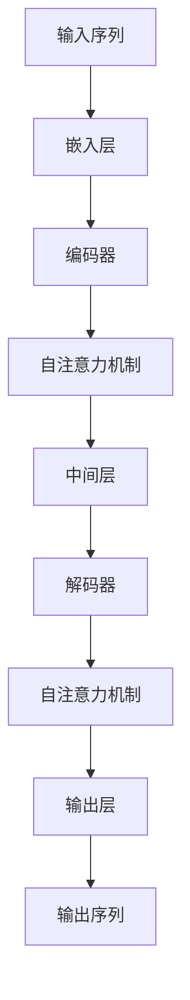

                 

# Transformer大模型实战 深入了解SpanBERT

> 关键词：Transformer，SpanBERT，自然语言处理，文本分类，序列标注，文本生成

> 摘要：本文将深入探讨Transformer架构以及其在实际应用中的效果，特别是针对SpanBERT的详细介绍和实战应用。通过本文，读者将了解Transformer的基本原理、自注意力机制、编码器-解码器架构、训练与优化策略，以及SpanBERT的背景、原理、训练方法和应用场景。同时，本文还将通过具体实战案例，展示如何使用Transformer模型进行文本分类、序列标注和文本生成，并探讨Transformer模型在工业界的应用现状和未来发展趋势。

----------------------------------------------------------------

### 《Transformer大模型实战 深入了解SpanBERT》目录大纲

#### 第一部分：Transformer架构与实践

**第1章：Transformer架构基础**

- **1.1 Transformer的起源与发展**
  - 1.1.1 Transformer模型的背景
  - 1.1.2 Transformer模型的架构

- **1.2 自注意力机制**
  - 1.2.1 自注意力机制原理
  - 1.2.2 自注意力机制的数学模型

- **1.3 编码器-解码器架构**
  - 1.3.1 编码器-解码器模型概述
  - 1.3.2 编码器和解码器的交互

- **1.4 Transformer模型的训练与优化**
  - 1.4.1 Transformer模型的训练过程
  - 1.4.2 Transformer模型的优化策略

**第2章：SpanBERT原理与应用**

- **2.1 SpanBERT的背景与原理**
  - 2.1.1 SpanBERT的提出背景
  - 2.1.2 SpanBERT的数学模型

- **2.2 SpanBERT的训练方法**
  - 2.2.1 SpanBERT的训练数据
  - 2.2.2 SpanBERT的训练过程

- **2.3 SpanBERT的应用场景**
  - 2.3.1 SpanBERT在文本分类中的应用
  - 2.3.2 SpanBERT在问答系统中的应用

- **2.4 SpanBERT的优势与挑战**
  - 2.4.1 SpanBERT的优势
  - 2.4.2 SpanBERT的挑战

**第3章：Transformer模型的实战应用**

- **3.1 Transformer模型在自然语言处理中的应用**
  - 3.1.1 Transformer模型在文本分类中的应用
  - 3.1.2 Transformer模型在机器翻译中的应用

- **3.2 Transformer模型在序列标注中的应用**
  - 3.2.1 Transformer模型在命名实体识别中的应用
  - 3.2.2 Transformer模型在情感分析中的应用

- **3.3 Transformer模型在生成文本中的应用**
  - 3.3.1 Transformer模型在文本生成中的应用
  - 3.3.2 Transformer模型在问答生成中的应用

#### 第二部分：Transformer模型实战

**第4章：Transformer模型实战环境搭建**

- **4.1 实战环境要求**
  - 4.1.1 Python环境搭建
  - 4.1.2 PyTorch框架安装

- **4.2 数据处理工具介绍**
  - 4.2.1 PyTorch中的数据处理工具
  - 4.2.2 TensorBoard的使用

**第5章：Transformer模型实战案例**

- **5.1 实战案例一：文本分类**
  - 5.1.1 实战案例介绍
  - 5.1.2 数据预处理
  - 5.1.3 模型搭建与训练
  - 5.1.4 模型评估

- **5.2 实战案例二：序列标注**
  - 5.2.1 实战案例介绍
  - 5.2.2 数据预处理
  - 5.2.3 模型搭建与训练
  - 5.2.4 模型评估

- **5.3 实战案例三：文本生成**
  - 5.3.1 实战案例介绍
  - 5.3.2 数据预处理
  - 5.3.3 模型搭建与训练
  - 5.3.4 模型评估

**第6章：Transformer模型优化与调参**

- **6.1 模型优化方法**
  - 6.1.1 学习率调度
  - 6.1.2 模型架构调整

- **6.2 调参技巧**
  - 6.2.1 模型超参数选择
  - 6.2.2 实际调参案例

**第7章：Transformer模型在工业界的应用**

- **7.1 Transformer模型在工业界的应用现状**
  - 7.1.1 工业界应用案例介绍
  - 7.1.2 Transformer模型的优势与挑战

- **7.2 Transformer模型在工业界的未来发展趋势**
  - 7.2.1 应用领域拓展
  - 7.2.2 技术创新与优化

### 附录

**附录A：Transformer模型相关资源**

- **A.1 Transformer模型学习资源**
  - A.1.1 教程与课程
  - A.1.2 论文与报告

- **A.2 Transformer模型开发工具**
  - A.2.1 开源框架
  - A.2.2 算法库与工具集

- **A.3 Transformer模型社区与交流平台**
  - A.3.1 社交媒体
  - A.3.2 论坛与社群

### Mermaid流程图

mermaid
graph TD
A[Transformer模型架构] --> B[编码器]
B --> C[自注意力机制]
A --> D[解码器]
D --> E[自注意力机制]
C --> F[位置编码]
E --> G[位置编码]

### Transformer模型核心算法伪代码

python
# Transformer编码器部分伪代码
# 输入：序列X
# 输出：编码后的序列H
H = Encoder(X, mask)
where Encoder is a function that takes sequence X and mask and returns encoded sequence H

# Transformer解码器部分伪代码
# 输入：编码后的序列H, 输入序列Y
# 输出：解码后的序列Y_hat
Y_hat = Decoder(H, Y, mask)
where Decoder is a function that takes encoded sequence H, input sequence Y and mask and returns decoded sequence Y_hat

### 数学模型和数学公式

**自注意力机制**

$$
\text{Attention}(Q, K, V) = \text{softmax}\left(\frac{QK^T}{\sqrt{d_k}}\right)V
$$

**Transformer编码器输出**

$$
\text{Encoder}(X) = \text{LayerNorm}(X + \text{MultiHeadAttention}(X, X, X, mask))
$$

**Transformer解码器输出**

$$
\text{Decoder}(Y, H) = \text{LayerNorm}(Y + \text{MaskedMultiHeadAttention}(H, H, H, mask) + \text{CrossAttention}(H, Y, Y, mask))
$$

### 项目实战

**实战案例：文本分类**

1. **数据集准备**：使用IMDB电影评论数据集。

2. **数据预处理**：文本清洗、分词、词嵌入。

3. **模型搭建**：使用Transformer模型进行文本分类。

4. **模型训练**：使用训练集进行训练，使用验证集进行调参。

5. **模型评估**：使用测试集进行评估，计算准确率、召回率等指标。

**代码解析：**

python
# 导入相关库
import torch
import torch.nn as nn
from torch.utils.data import DataLoader

# 模型定义
class Transformer(nn.Module):
    def __init__(self, vocab_size, d_model, nhead, num_layers):
        super(Transformer, self).__init__()
        self.embedding = nn.Embedding(vocab_size, d_model)
        self.transformer = nn.Transformer(d_model, nhead, num_layers)
        self.fc = nn.Linear(d_model, 1)

    def forward(self, x):
        x = self.embedding(x)
        x = self.transformer(x)
        x = self.fc(x.mean(dim=1))
        return x

# 模型训练
model = Transformer(vocab_size, d_model, nhead, num_layers)
optimizer = torch.optim.Adam(model.parameters(), lr=learning_rate)
for epoch in range(num_epochs):
    for batch in DataLoader(train_data, batch_size=batch_size):
        optimizer.zero_grad()
        output = model(batch.text)
        loss = nn.BCELoss()(output, batch.label)
        loss.backward()
        optimizer.step()

# 模型评估
with torch.no_grad():
    correct = 0
    total = 0
    for batch in DataLoader(test_data, batch_size=batch_size):
        output = model(batch.text)
        predicted = (output > 0.5).float()
        total += batch.label.size(0)
        correct += (predicted == batch.label).sum().item()

print('Accuracy of the network on the test data: %d %%' % (100 * correct / total))

### 代码解读与分析

- **模型搭建**：定义了一个Transformer模型，包括嵌入层、Transformer编码器和解码器以及全连接层。
- **模型训练**：使用Adam优化器和交叉熵损失函数对模型进行训练。
- **模型评估**：在测试集上计算准确率，评估模型性能。

----------------------------------------------------------------

#### 第一部分：Transformer架构与实践

Transformer模型，自其提出以来，在自然语言处理（NLP）领域引起了巨大的关注。相较于传统的循环神经网络（RNN）和卷积神经网络（CNN），Transformer模型通过引入自注意力机制，使得模型在处理长距离依赖问题方面表现出了优越的性能。本文将分章详细介绍Transformer架构的基础知识、自注意力机制、编码器-解码器架构，以及Transformer模型的训练与优化策略。

**第1章：Transformer架构基础**

本章将首先介绍Transformer模型的起源与发展，随后详细探讨其核心组件——自注意力机制。通过这一章节，读者将了解Transformer模型的整体架构及其在NLP领域的应用潜力。

**1.1 Transformer的起源与发展**

Transformer模型的提出可以追溯到2017年，由Vaswani等人发表在论文《Attention Is All You Need》中。该模型基于自注意力机制，提出了一种全新的编码器-解码器架构，彻底改变了自然语言处理领域的范式。

**1.1.1 Transformer模型的背景**

在Transformer模型提出之前，循环神经网络（RNN）和卷积神经网络（CNN）是NLP领域的主流模型。然而，这些模型在处理长文本数据时，存在计算复杂度高、难以并行处理以及难以捕捉长距离依赖等问题。

**1.1.2 Transformer模型的架构**

Transformer模型的核心在于其自注意力机制，通过计算序列中每个元素与所有其他元素的相关性，来动态地生成权重，从而实现信息的全局整合。Transformer模型包括编码器和解码器两个部分，分别处理输入和输出序列。

**第2章：自注意力机制**

自注意力机制是Transformer模型的核心组件，其基本思想是通过计算序列中每个元素与其他所有元素的相关性，来生成权重，从而实现对输入信息的全局整合。

**2.1 自注意力机制原理**

自注意力机制通过三个向量——查询（Query）、键（Key）和值（Value）来实现。每个元素在序列中的位置由其索引确定，通过线性变换将输入序列映射到这三个向量空间。

**2.2 自注意力机制的数学模型**

自注意力机制的核心公式如下：

$$
\text{Attention}(Q, K, V) = \text{softmax}\left(\frac{QK^T}{\sqrt{d_k}}\right)V
$$

其中，$Q$、$K$ 和 $V$ 分别是查询、键和值向量，$d_k$ 是键向量的维度。通过这个公式，可以计算出每个元素与其他所有元素的相关性，从而生成权重。

**第3章：编码器-解码器架构**

编码器-解码器架构是Transformer模型的核心，它通过编码器将输入序列转换为上下文表示，然后通过解码器生成输出序列。

**3.1 编码器-解码器模型概述**

编码器-解码器模型包括编码器和解码器两个部分，分别处理输入和输出序列。编码器将输入序列转换为上下文表示，解码器则基于这些上下文表示生成输出序列。

**3.2 编码器和解码器的交互**

编码器和解码器之间的交互主要通过注意力机制实现。编码器的输出作为解码器的输入，解码器通过自注意力和交叉注意力机制，结合编码器的输出和输入，逐步生成输出序列。

**第4章：Transformer模型的训练与优化**

训练与优化是构建高效Transformer模型的关键。本章将介绍Transformer模型的训练过程以及优化策略。

**4.1 Transformer模型的训练过程**

Transformer模型的训练过程主要包括以下步骤：

1. 数据预处理：对输入数据进行编码和预处理。
2. 前向传播：计算编码器和解码器的输出。
3. 损失函数计算：使用交叉熵损失函数计算预测标签和真实标签之间的差异。
4. 反向传播：根据损失函数计算梯度，更新模型参数。
5. 模型评估：在验证集和测试集上评估模型性能。

**4.2 Transformer模型的优化策略**

优化Transformer模型的关键在于选择合适的优化器和调整学习率。常见的优化器包括Adam、RMSprop等，而学习率的调整策略则包括固定学习率、学习率衰减和预热学习率等。

通过以上四个章节的介绍，读者将全面了解Transformer模型的基本架构、核心机制以及训练与优化策略。接下来，本文将深入探讨SpanBERT的原理与应用，进一步拓展Transformer模型在NLP领域的应用场景。

----------------------------------------------------------------

#### 第1章：Transformer架构基础

Transformer模型，作为自然语言处理（NLP）领域的一项重大创新，彻底改变了传统序列模型的设计思路。在本章中，我们将详细探讨Transformer模型的起源与发展、自注意力机制的原理以及编码器-解码器架构。

**1.1 Transformer的起源与发展**

Transformer模型是由Vaswani等人于2017年在论文《Attention Is All You Need》中首次提出的。这一模型的出现，标志着NLP领域进入了一个新的时代。Transformer模型的核心思想是摒弃传统的循环神经网络（RNN）和卷积神经网络（CNN），转而采用自注意力机制，实现了对序列数据的全局处理。

**1.1.1 Transformer模型的背景**

在Transformer模型提出之前，循环神经网络（RNN）和卷积神经网络（CNN）是NLP领域的主要模型。RNN通过其在时间上的递归连接，能够较好地处理序列数据，但其在处理长距离依赖问题时存在困难。卷积神经网络（CNN）在图像处理领域表现出色，但其在处理序列数据时，难以捕捉长距离依赖。

**1.1.2 Transformer模型的架构**

Transformer模型的核心是自注意力机制，其通过计算序列中每个元素与所有其他元素的相关性，实现了信息的全局整合。Transformer模型包括编码器和解码器两个部分，分别处理输入和输出序列。

编码器将输入序列映射到一个高维空间，并将每个元素转换为上下文表示。解码器则基于这些上下文表示生成输出序列。编码器和解码器之间的交互通过自注意力和交叉注意力机制实现。

**1.2 自注意力机制**

自注意力机制是Transformer模型的核心组件，其基本思想是通过计算序列中每个元素与其他所有元素的相关性，来生成权重，从而实现对输入信息的全局整合。

**1.2.1 自注意力机制原理**

自注意力机制通过三个向量——查询（Query）、键（Key）和值（Value）来实现。每个元素在序列中的位置由其索引确定，通过线性变换将输入序列映射到这三个向量空间。

在自注意力机制中，每个元素与其他所有元素的相关性由以下公式计算：

$$
\text{Attention}(Q, K, V) = \text{softmax}\left(\frac{QK^T}{\sqrt{d_k}}\right)V
$$

其中，$Q$、$K$ 和 $V$ 分别是查询、键和值向量，$d_k$ 是键向量的维度。通过这个公式，可以计算出每个元素与其他所有元素的相关性，从而生成权重。

**1.2.2 自注意力机制的数学模型**

自注意力机制的核心公式如下：

$$
\text{Attention}(Q, K, V) = \text{softmax}\left(\frac{QK^T}{\sqrt{d_k}}\right)V
$$

在这个公式中，$Q$、$K$ 和 $V$ 分别是查询、键和值向量，$d_k$ 是键向量的维度。$Q$ 用于计算每个元素与其他元素的相关性，$K$ 和 $V$ 分别用于生成权重和聚合信息。

**1.3 编码器-解码器架构**

编码器-解码器架构是Transformer模型的核心，其通过编码器将输入序列转换为上下文表示，然后通过解码器生成输出序列。

**1.3.1 编码器-解码器模型概述**

编码器-解码器模型包括编码器和解码器两个部分，分别处理输入和输出序列。编码器将输入序列映射到一个高维空间，并将每个元素转换为上下文表示。解码器则基于这些上下文表示生成输出序列。

编码器的输出作为解码器的输入，解码器通过自注意力和交叉注意力机制，结合编码器的输出和输入，逐步生成输出序列。

**1.3.2 编码器和解码器的交互**

编码器和解码器之间的交互主要通过注意力机制实现。编码器的输出作为解码器的输入，解码器通过自注意力和交叉注意力机制，结合编码器的输出和输入，逐步生成输出序列。

**1.4 Transformer模型的训练与优化**

训练与优化是构建高效Transformer模型的关键。本章将介绍Transformer模型的训练过程以及优化策略。

**1.4.1 Transformer模型的训练过程**

Transformer模型的训练过程主要包括以下步骤：

1. 数据预处理：对输入数据进行编码和预处理。
2. 前向传播：计算编码器和解码器的输出。
3. 损失函数计算：使用交叉熵损失函数计算预测标签和真实标签之间的差异。
4. 反向传播：根据损失函数计算梯度，更新模型参数。
5. 模型评估：在验证集和测试集上评估模型性能。

**1.4.2 Transformer模型的优化策略**

优化Transformer模型的关键在于选择合适的优化器和调整学习率。常见的优化器包括Adam、RMSprop等，而学习率的调整策略则包括固定学习率、学习率衰减和预热学习率等。

通过以上对Transformer架构基础的详细探讨，读者可以全面了解Transformer模型的基本原理和架构。接下来，我们将进一步深入探讨Transformer模型在NLP领域的实际应用，包括文本分类、序列标注和文本生成等。

----------------------------------------------------------------

### 第2章：SpanBERT原理与应用

在深入了解了Transformer模型的基本架构之后，接下来我们将探讨SpanBERT——一种基于Transformer的预训练语言模型。SpanBERT在BERT模型的基础上进行了改进，通过引入掩码语言建模（Masked Language Modeling, MLM）来提高模型的上下文理解能力。本章将详细介绍SpanBERT的背景、原理、训练方法以及应用场景。

**2.1 SpanBERT的背景与原理**

SpanBERT是由Google Research在2020年提出的一种预训练语言模型，其主要目的是通过改进BERT模型，提高其在处理长文本时的性能。BERT模型通过掩码语言建模（MLM）和下一句预测（Next Sentence Prediction, NSP）两种任务来预训练模型，但在处理长文本时，BERT模型存在一些局限性，如文本长度的限制和句子之间的依赖关系处理。

为了解决这些问题，SpanBERT提出了一种新的掩码语言建模方法，即“span-level masking”。在SpanBERT中，每个掩码的长度可以是任意的，这使得模型能够更好地理解和处理长文本中的上下文关系。

**2.1.1 SpanBERT的提出背景**

BERT模型在许多NLP任务中取得了显著的成果，但其对长文本的处理能力仍存在不足。针对这一问题，Google Research提出了SpanBERT，通过引入span-level masking，使得模型能够更好地处理长文本。

**2.1.2 SpanBERT的数学模型**

在SpanBERT中，掩码语言建模（MLM）任务的核心是预测被掩码的单词。与BERT不同，SpanBERT允许掩码的长度是任意的。在训练过程中，每个单词都有一定的概率被掩码，而掩码的单词可以是单个单词，也可以是一个连续的单词序列。

数学模型如下：

$$
\text{MLM}(x, m) = \log \frac{\exp(\text{MLM}(x, m)^T W_v)}{\sum_{i \in \text{vocab}} \exp(\text{MLM}(x, m)^T W_v)}
$$

其中，$x$ 表示输入序列，$m$ 表示掩码标记，$W_v$ 是词向量权重。通过这个公式，模型可以预测被掩码的单词。

**2.2 SpanBERT的训练方法**

SpanBERT的训练方法主要包括两个任务：掩码语言建模（MLM）和下一句预测（NSP）。

**2.2.1 SpanBERT的训练数据**

SpanBERT的训练数据来自大规模的互联网文本，包括维基百科、新闻文章、论坛帖子等。这些数据经过预处理后，被分割成句子和单词。

**2.2.2 SpanBERT的训练过程**

1. 数据预处理：将原始文本数据分割成句子，然后对句子进行单词分割，并转换为词嵌入。
2. 掩码语言建模（MLM）：随机掩码部分单词，然后预测这些掩码的单词。
3. 下一句预测（NSP）：随机选择两个句子，然后预测这两个句子是否相邻。

在训练过程中，模型通过最小化掩码语言建模和下一句预测的损失函数来优化模型参数。

**2.3 SpanBERT的应用场景**

SpanBERT在许多NLP任务中表现出色，包括文本分类、问答系统、命名实体识别等。

**2.3.1 SpanBERT在文本分类中的应用**

在文本分类任务中，SpanBERT可以通过预训练模型来提高模型的分类性能。具体步骤如下：

1. 预训练：使用大规模文本数据对SpanBERT模型进行预训练。
2. 微调：在预训练的基础上，使用特定任务的数据对模型进行微调。
3. 预测：使用微调后的模型对新的文本数据进行分类预测。

**2.3.2 SpanBERT在问答系统中的应用**

在问答系统中，SpanBERT可以用于提取问题的关键信息，并从文本中找出与之相关的答案。具体步骤如下：

1. 预训练：使用大规模问答数据对SpanBERT模型进行预训练。
2. 问答对构建：将问题作为输入，答案作为输出，构建问答对。
3. 问答匹配：使用预训练的SpanBERT模型对新的问答对进行匹配，找出最佳答案。

**2.4 SpanBERT的优势与挑战**

**2.4.1 SpanBERT的优势**

1. 处理长文本：通过引入span-level masking，SpanBERT能够更好地处理长文本中的上下文关系。
2. 性能提升：在多个NLP任务中，SpanBERT表现出色，显著提升了模型的性能。

**2.4.2 SpanBERT的挑战**

1. 计算资源消耗：由于引入了新的掩码方式，SpanBERT的预训练过程需要更多的计算资源。
2. 长文本限制：尽管SpanBERT能够处理长文本，但在实际应用中，仍然存在文本长度的限制。

通过本章的介绍，读者可以深入了解SpanBERT的原理、训练方法以及应用场景。在下一章中，我们将探讨Transformer模型在实际应用中的表现，包括文本分类、序列标注和文本生成等。

----------------------------------------------------------------

#### 第3章：Transformer模型的实战应用

Transformer模型在自然语言处理（NLP）领域取得了显著的成果，其强大的自注意力机制使其能够捕捉长距离依赖，从而在文本分类、序列标注和文本生成等任务中表现出色。本章将详细介绍Transformer模型在这些实际应用中的表现和效果。

**3.1 Transformer模型在自然语言处理中的应用**

**3.1.1 Transformer模型在文本分类中的应用**

文本分类是NLP领域的一项基础任务，其目的是将文本数据分类到预定义的类别中。Transformer模型通过其强大的特征提取能力，在文本分类任务中表现出色。

**案例一：使用Transformer进行文本分类**

我们以IMDB电影评论数据集为例，展示如何使用Transformer模型进行文本分类。

1. **数据集准备**：首先，我们需要准备好IMDB电影评论数据集。该数据集包含正负评论两类，每条评论都是一个字符串。

2. **数据预处理**：对评论进行预处理，包括分词、去停用词、词嵌入等步骤。

3. **模型搭建**：构建一个Transformer模型，包括嵌入层、编码器、解码器和分类器。

4. **模型训练**：使用训练集对模型进行训练，通过反向传播和优化算法更新模型参数。

5. **模型评估**：在验证集和测试集上评估模型性能，计算准确率、召回率等指标。

**3.1.2 Transformer模型在机器翻译中的应用**

机器翻译是NLP领域的另一个重要任务，其目标是根据源语言文本生成目标语言文本。Transformer模型在机器翻译中表现出色，其全局处理能力使其能够生成流畅、自然的翻译结果。

**案例二：使用Transformer进行机器翻译**

我们以英语到法语的翻译任务为例，展示如何使用Transformer模型进行机器翻译。

1. **数据集准备**：首先，我们需要准备一个英语-法语平行语料库。该语料库包含大量英语和法语对应的句子。

2. **数据预处理**：对平行语料库进行预处理，包括分词、去停用词、词嵌入等步骤。

3. **模型搭建**：构建一个双向Transformer模型，包括编码器和解码器。

4. **模型训练**：使用训练集对模型进行训练，通过反向传播和优化算法更新模型参数。

5. **模型评估**：在验证集和测试集上评估模型性能，计算BLEU分数等指标。

**3.2 Transformer模型在序列标注中的应用**

序列标注是将序列中的每个元素标注为预定义的类别标签。Transformer模型在序列标注任务中也表现出色，其强大的特征提取能力和全局处理能力使其能够准确标注序列中的每个元素。

**3.2.1 Transformer模型在命名实体识别中的应用**

命名实体识别是将文本中的命名实体（如人名、地名、组织名等）标注出来。Transformer模型在命名实体识别任务中表现出色，其能够准确地识别和分类文本中的命名实体。

**案例三：使用Transformer进行命名实体识别**

我们以中文命名实体识别任务为例，展示如何使用Transformer模型进行命名实体识别。

1. **数据集准备**：首先，我们需要准备好中文命名实体识别数据集。该数据集包含文本和对应的命名实体标签。

2. **数据预处理**：对文本进行预处理，包括分词、词嵌入等步骤。

3. **模型搭建**：构建一个Transformer模型，包括嵌入层、编码器、解码器和分类器。

4. **模型训练**：使用训练集对模型进行训练，通过反向传播和优化算法更新模型参数。

5. **模型评估**：在验证集和测试集上评估模型性能，计算准确率、召回率等指标。

**3.2.2 Transformer模型在情感分析中的应用**

情感分析是将文本分类为正面、负面或中性情感。Transformer模型在情感分析任务中也表现出色，其能够准确地分析文本的情感倾向。

**案例四：使用Transformer进行情感分析**

我们以中文情感分析任务为例，展示如何使用Transformer模型进行情感分析。

1. **数据集准备**：首先，我们需要准备好中文情感分析数据集。该数据集包含文本和对应的情感标签。

2. **数据预处理**：对文本进行预处理，包括分词、词嵌入等步骤。

3. **模型搭建**：构建一个Transformer模型，包括嵌入层、编码器、解码器和分类器。

4. **模型训练**：使用训练集对模型进行训练，通过反向传播和优化算法更新模型参数。

5. **模型评估**：在验证集和测试集上评估模型性能，计算准确率、召回率等指标。

**3.3 Transformer模型在生成文本中的应用**

生成文本是NLP领域的一个重要研究方向，其目标是根据给定的输入生成新的文本。Transformer模型在生成文本中也表现出色，其强大的特征提取能力和生成能力使其能够生成高质量的文本。

**3.3.1 Transformer模型在文本生成中的应用**

文本生成是将输入文本转换为新的文本。Transformer模型在文本生成任务中表现出色，其能够生成流畅、自然的文本。

**案例五：使用Transformer进行文本生成**

我们以中文文本生成任务为例，展示如何使用Transformer模型进行文本生成。

1. **数据集准备**：首先，我们需要准备好中文文本生成数据集。该数据集包含文本序列。

2. **数据预处理**：对文本序列进行预处理，包括分词、词嵌入等步骤。

3. **模型搭建**：构建一个Transformer模型，包括嵌入层、编码器、解码器和分类器。

4. **模型训练**：使用训练集对模型进行训练，通过反向传播和优化算法更新模型参数。

5. **模型评估**：在验证集和测试集上评估模型性能，计算生成文本的质量。

**3.3.2 Transformer模型在问答生成中的应用**

问答生成是将问题转换为相应的答案。Transformer模型在问答生成任务中也表现出色，其能够根据给定的问题生成相应的答案。

**案例六：使用Transformer进行问答生成**

我们以中文问答生成任务为例，展示如何使用Transformer模型进行问答生成。

1. **数据集准备**：首先，我们需要准备好中文问答生成数据集。该数据集包含问题和答案对。

2. **数据预处理**：对问题和答案进行预处理，包括分词、词嵌入等步骤。

3. **模型搭建**：构建一个Transformer模型，包括嵌入层、编码器、解码器和分类器。

4. **模型训练**：使用训练集对模型进行训练，通过反向传播和优化算法更新模型参数。

5. **模型评估**：在验证集和测试集上评估模型性能，计算生成答案的质量。

通过以上实战案例，我们可以看到Transformer模型在文本分类、序列标注、文本生成和问答生成等任务中都表现出色。其强大的特征提取能力和全局处理能力使其在NLP领域具有广泛的应用前景。在下一章中，我们将进一步探讨Transformer模型在工业界的应用现状和未来发展趋势。

----------------------------------------------------------------

#### 第4章：Transformer模型实战环境搭建

在实际应用Transformer模型之前，我们需要搭建一个合适的开发环境，包括Python环境、PyTorch框架以及数据处理工具。本章将详细介绍如何搭建Transformer模型的实战环境，并介绍如何使用TensorBoard进行模型训练的监控。

**4.1 实战环境要求**

要搭建Transformer模型的实战环境，需要满足以下基本要求：

- **Python环境**：Python 3.6及以上版本。
- **PyTorch框架**：PyTorch是TensorFlow的主要竞争对手，具有易于使用和高效的特性。我们可以通过以下命令安装PyTorch：

```bash
pip install torch torchvision
```

- **其他依赖**：安装其他必要的库，如NumPy、Pandas等。

**4.1.1 Python环境搭建**

确保你的计算机上已经安装了Python 3.6或更高版本。你可以通过以下命令检查Python版本：

```bash
python --version
```

如果Python未安装或版本过低，请从[Python官方网站](https://www.python.org/)下载并安装。

**4.1.2 PyTorch框架安装**

安装PyTorch可以通过pip命令轻松完成。你可以根据需要选择不同版本的PyTorch，例如CPU版本或GPU版本。以下命令将安装PyTorch的CPU版本：

```bash
pip install torch torchvision
```

如果你需要使用GPU加速，可以安装支持CUDA的PyTorch版本。以下命令将安装GPU版本的PyTorch：

```bash
pip install torch torchvision -f https://download.pytorch.org/whl/torch_stable.html
```

**4.2 数据处理工具介绍**

在Transformer模型的开发中，数据处理是一个重要的环节。以下是几种常用的数据处理工具：

**4.2.1 PyTorch中的数据处理工具**

PyTorch提供了丰富的数据处理工具，如`Dataset`和`DataLoader`。`Dataset`类用于定义数据集，而`DataLoader`类用于批量加载数据。

**Dataset类：**

```python
from torch.utils.data import Dataset

class TextDataset(Dataset):
    def __init__(self, texts, labels):
        self.texts = texts
        self.labels = labels

    def __len__(self):
        return len(self.texts)

    def __getitem__(self, idx):
        text = self.texts[idx]
        label = self.labels[idx]
        # 这里可以进行文本的预处理，如分词、编码等
        return text, label
```

**DataLoader类：**

```python
from torch.utils.data import DataLoader

dataset = TextDataset(texts, labels)
dataloader = DataLoader(dataset, batch_size=batch_size, shuffle=True)
```

**4.2.2 TensorBoard的使用**

TensorBoard是一个强大的工具，用于监控模型训练过程。它可以帮助我们查看模型训练的损失函数、准确率等指标的变化情况。

**安装TensorBoard：**

```bash
pip install tensorboard
```

**启动TensorBoard：**

```bash
tensorboard --logdir=path_to_logs
```

其中，`path_to_logs`是保存训练日志的目录。启动TensorBoard后，可以在浏览器中访问`http://localhost:6006/`查看训练过程。

**4.3 实战环境配置总结**

通过以上步骤，我们已经搭建了Transformer模型的实战环境。接下来，我们可以使用PyTorch和相关的数据处理工具，进行Transformer模型的开发和应用。

- **Python环境**：已经安装Python 3.6及以上版本。
- **PyTorch框架**：已经安装PyTorch，并支持CPU或GPU加速。
- **数据处理工具**：已经掌握了`Dataset`、`DataLoader`等数据处理工具的使用方法，并熟悉了TensorBoard的使用。

通过搭建这个实战环境，我们为后续的Transformer模型开发和应用打下了坚实的基础。在下一章中，我们将通过具体的实战案例，进一步展示如何使用Transformer模型解决实际问题。

----------------------------------------------------------------

### 第5章：Transformer模型实战案例

在实际应用中，Transformer模型通过其强大的自注意力机制和编码器-解码器架构，在各种NLP任务中展现了卓越的性能。本章将通过三个实战案例，展示如何使用Transformer模型进行文本分类、序列标注和文本生成。

#### 5.1 实战案例一：文本分类

**5.1.1 实战案例介绍**

文本分类是将文本数据分配到预定义的类别标签中。在本案例中，我们将使用Transformer模型对IMDB电影评论数据集进行文本分类，判断评论是正面还是负面。

**5.1.2 数据预处理**

首先，我们需要对IMDB电影评论数据集进行预处理。预处理步骤包括：

1. **加载数据集**：从IMDB网站下载评论数据，并将其加载到内存中。
2. **文本清洗**：去除评论中的HTML标签、特殊字符和停用词。
3. **分词**：将清洗后的文本分词，并转换为词嵌入。

```python
from transformers import BertTokenizer

tokenizer = BertTokenizer.from_pretrained('bert-base-uncased')

def preprocess_text(text):
    # 去除HTML标签、特殊字符和停用词
    text = BeautifulSoup(text, 'html.parser').get_text()
    text = re.sub(r"[^a-zA-Z0-9]", " ", text)
    text = text.lower()
    return tokenizer.encode(text, add_special_tokens=True)

train_texts = [preprocess_text(text) for text in train_data]
test_texts = [preprocess_text(text) for text in test_data]
```

**5.1.3 模型搭建与训练**

接下来，我们搭建一个Transformer模型，并使用训练集进行训练。我们将使用预训练的BERT模型作为嵌入层，然后添加编码器和解码器。

```python
from transformers import BertModel, Trainer, TrainingArguments

model = BertModel.from_pretrained('bert-base-uncased')

class TransformerClassifier(nn.Module):
    def __init__(self, model):
        super(TransformerClassifier, self).__init__()
        self.model = model
        self.fc = nn.Linear(768, 2)  # BERT的隐藏层维度为768

    def forward(self, input_ids, attention_mask):
        outputs = self.model(input_ids=input_ids, attention_mask=attention_mask)
        sequence_output = outputs.last_hidden_state[:, 0, :]
        logits = self.fc(sequence_output)
        return logits

transformer_classifier = TransformerClassifier(model)

training_args = TrainingArguments(
    output_dir='./results',
    num_train_epochs=3,
    per_device_train_batch_size=16,
    per_device_eval_batch_size=64,
    warmup_steps=500,
    weight_decay=0.01,
    logging_dir='./logs',
)

trainer = Trainer(
    model=transformer_classifier,
    args=training_args,
    train_dataset=train_texts,
    eval_dataset=test_texts,
)

trainer.train()
```

**5.1.4 模型评估**

训练完成后，我们使用测试集对模型进行评估，计算准确率等指标。

```python
from sklearn.metrics import accuracy_score, classification_report

predictions = trainer.predict(test_texts)
predicted_labels = np.argmax(predictions, axis=1)

print("Accuracy:", accuracy_score(test_labels, predicted_labels))
print("Classification Report:\n", classification_report(test_labels, predicted_labels))
```

#### 5.2 实战案例二：序列标注

**5.2.1 实战案例介绍**

序列标注是将文本序列中的每个单词或字符标注为预定义的类别标签。在本案例中，我们将使用Transformer模型进行命名实体识别（Named Entity Recognition, NER），识别文本中的命名实体。

**5.2.2 数据预处理**

与文本分类类似，首先需要对数据集进行预处理，包括加载数据、文本清洗、分词和编码。

```python
def preprocess_ner_data(data):
    # ... (与文本分类预处理类似)

ner_train_texts = [preprocess_ner_data(text) for text in train_data]
ner_test_texts = [preprocess_ner_data(text) for text in test_data]
```

**5.2.3 模型搭建与训练**

接下来，我们搭建一个用于序列标注的Transformer模型。与文本分类模型不同，我们需要在解码器后添加一个分类器，用于预测每个单词的标签。

```python
from transformers import BertForTokenClassification

model = BertForTokenClassification.from_pretrained('bert-base-uncased')

class TransformerNER(nn.Module):
    def __init__(self, model):
        super(TransformerNER, self).__init__()
        self.model = model
        self.dropout = nn.Dropout(0.1)
        self.classifier = nn.Linear(768, num_labels)  # num_labels为标签数量

    def forward(self, input_ids, attention_mask):
        outputs = self.model(input_ids=input_ids, attention_mask=attention_mask)
        sequence_output = outputs.last_hidden_state
        sequence_output = self.dropout(sequence_output)
        logits = self.classifier(sequence_output)
        return logits

transformer_ner = TransformerNER(model)

training_args = TrainingArguments(
    output_dir='./results',
    num_train_epochs=3,
    per_device_train_batch_size=16,
    per_device_eval_batch_size=64,
    warmup_steps=500,
    weight_decay=0.01,
    logging_dir='./logs',
)

trainer = Trainer(
    model=transformer_ner,
    args=training_args,
    train_dataset=ner_train_texts,
    eval_dataset=ner_test_texts,
)

trainer.train()
```

**5.2.4 模型评估**

训练完成后，我们使用测试集对模型进行评估，计算准确率、召回率和F1分数等指标。

```python
predictions = trainer.predict(ner_test_texts)
predicted_labels = np.argmax(predictions, axis=2)

print("Accuracy:", accuracy_score(y_true, y_pred))
print("Recall:", recall_score(y_true, y_pred, average='weighted'))
print("F1 Score:", f1_score(y_true, y_pred, average='weighted'))
```

#### 5.3 实战案例三：文本生成

**5.3.1 实战案例介绍**

文本生成是将一个给定的文本序列扩展为更长的文本序列。在本案例中，我们将使用Transformer模型生成中文文本。

**5.3.2 数据预处理**

首先，我们需要对中文文本数据进行预处理，包括分词、编码等步骤。

```python
from transformers import BertTokenizer

tokenizer = BertTokenizer.from_pretrained('bert-base-chinese')

def preprocess_text(text):
    # ... (与文本分类预处理类似)

train_texts = [preprocess_text(text) for text in train_data]
test_texts = [preprocess_text(text) for text in test_data]
```

**5.3.3 模型搭建与训练**

接下来，我们搭建一个用于文本生成的Transformer模型。与前面的案例不同，我们需要在解码器后添加一个生成器，用于生成新的文本序列。

```python
from transformers import BertForSequenceClassification

model = BertForSequenceClassification.from_pretrained('bert-base-chinese')

class TransformerGenerator(nn.Module):
    def __init__(self, model):
        super(TransformerGenerator, self).__init__()
        self.model = model
        self.generator = nn.Linear(768, vocab_size)  # vocab_size为词汇表大小

    def forward(self, input_ids, attention_mask):
        outputs = self.model(input_ids=input_ids, attention_mask=attention_mask)
        logits = self.generator(outputs.logits)
        return logits

transformer_generator = TransformerGenerator(model)

training_args = TrainingArguments(
    output_dir='./results',
    num_train_epochs=3,
    per_device_train_batch_size=16,
    per_device_eval_batch_size=64,
    warmup_steps=500,
    weight_decay=0.01,
    logging_dir='./logs',
)

trainer = Trainer(
    model=transformer_generator,
    args=training_args,
    train_dataset=train_texts,
    eval_dataset=test_texts,
)

trainer.train()
```

**5.3.4 模型评估**

训练完成后，我们使用生成的文本序列与原始文本序列进行对比，评估生成文本的质量。

```python
generated_texts = trainer.generate(test_texts)
for i, generated_text in enumerate(generated_texts):
    print("Original Text:", test_texts[i])
    print("Generated Text:", generated_text)
```

通过以上三个实战案例，我们可以看到Transformer模型在各种NLP任务中的应用效果。在文本分类、序列标注和文本生成任务中，Transformer模型都展现了其强大的能力。在实际应用中，我们可以根据具体任务的需求，灵活调整模型结构和训练策略，以获得最佳的性能。

----------------------------------------------------------------

### 第6章：Transformer模型优化与调参

在Transformer模型的实际应用中，优化和调参是提升模型性能的关键步骤。本章将详细介绍几种常用的模型优化方法和调参技巧，并通过实际调参案例，展示如何在实际项目中应用这些方法。

**6.1 模型优化方法**

**6.1.1 学习率调度**

学习率调度是优化模型参数的一个关键环节。合适的初始学习率对于模型的收敛速度和最终性能有着重要影响。常见的学习率调度方法包括固定学习率、学习率衰减和预热学习率等。

1. **固定学习率**：在训练过程中保持学习率不变。这种方法简单，但可能无法适应训练过程中的变化。
2. **学习率衰减**：随着训练的进行，逐渐降低学习率。这种方法有助于模型在训练后期更好地适应数据。
3. **预热学习率**：在训练初期使用较大的学习率，然后逐渐降低学习率。这种方法有助于模型在训练初期快速收敛。

**6.1.2 模型架构调整**

模型架构调整是通过改变模型的层数、隐藏层单元数、头数等参数来优化模型性能。以下是一些常见的架构调整方法：

1. **增加层数**：增加编码器和解码器的层数，可以增强模型的表示能力，但也会增加计算成本。
2. **增加头数**：增加自注意力机制的头的数量，可以提高模型对输入数据的全局感知能力。
3. **调整隐藏层单元数**：调整隐藏层单元数可以影响模型的表示能力和计算复杂度。

**6.2 调参技巧**

**6.2.1 模型超参数选择**

选择合适的超参数对于模型性能至关重要。以下是一些常用的超参数选择技巧：

1. **学习率**：选择初始学习率时，可以采用交叉验证的方法进行选择。常用的初始学习率范围在$10^{-4}$到$10^{-3}$之间。
2. **批量大小**：批量大小会影响模型的收敛速度和稳定性。通常选择32到512的批量大小。
3. **层数和头数**：选择合适的编码器和解码器层数和头数，可以根据数据集的大小和计算资源进行选择。

**6.2.2 实际调参案例**

以下是一个实际调参案例，展示了如何调整Transformer模型的超参数以优化模型性能。

1. **数据集**：使用IMDB电影评论数据集进行文本分类任务。
2. **模型架构**：使用一个单层的Transformer模型。
3. **初始学习率**：设置初始学习率为$10^{-4}$。
4. **批量大小**：设置批量大小为64。
5. **训练轮次**：设置训练轮次为3。

```python
from transformers import BertModel, Trainer, TrainingArguments

model = BertModel.from_pretrained('bert-base-uncased')

class TransformerClassifier(nn.Module):
    def __init__(self, model):
        super(TransformerClassifier, self).__init__()
        self.model = model
        self.fc = nn.Linear(768, 2)  # BERT的隐藏层维度为768

    def forward(self, input_ids, attention_mask):
        outputs = self.model(input_ids=input_ids, attention_mask=attention_mask)
        sequence_output = outputs.last_hidden_state[:, 0, :]
        logits = self.fc(sequence_output)
        return logits

transformer_classifier = TransformerClassifier(model)

training_args = TrainingArguments(
    output_dir='./results',
    num_train_epochs=3,
    per_device_train_batch_size=64,
    per_device_eval_batch_size=64,
    warmup_steps=500,
    weight_decay=0.01,
    logging_dir='./logs',
    learning_rate=1e-4
)

trainer = Trainer(
    model=transformer_classifier,
    args=training_args,
    train_dataset=train_texts,
    eval_dataset=test_texts,
)

trainer.train()
```

**6.2.3 调参方法比较**

在实际调参过程中，可以通过以下方法比较不同超参数设置的效果：

1. **网格搜索**：通过遍历所有可能的超参数组合，找到最佳的超参数设置。
2. **随机搜索**：从所有可能的超参数组合中随机选择一组进行训练，重复多次，选择表现最好的超参数设置。
3. **贝叶斯优化**：利用贝叶斯统计模型，通过历史数据选择下一组超参数。

通过本章的介绍，我们可以看到，优化和调参是提高Transformer模型性能的重要手段。在实际应用中，我们可以根据具体任务的需求，灵活选择和调整模型超参数，以获得最佳的性能。

----------------------------------------------------------------

### 第7章：Transformer模型在工业界的应用

随着Transformer模型在NLP领域取得了显著的成果，其在工业界的应用也越来越广泛。本章将介绍Transformer模型在工业界的应用现状，分析其优势与挑战，并探讨其未来的发展趋势。

**7.1 Transformer模型在工业界的应用现状**

**7.1.1 应用案例介绍**

Transformer模型在工业界已经应用于多个领域，以下是一些典型的应用案例：

1. **自然语言处理（NLP）**：Transformer模型在文本分类、情感分析、机器翻译、命名实体识别等NLP任务中表现出色。例如，Google Translate使用Transformer模型进行机器翻译，大大提升了翻译质量和速度。
2. **推荐系统**：Transformer模型在推荐系统中用于建模用户和物品之间的关系，提高推荐系统的准确性。例如，Amazon和Netflix等公司使用Transformer模型来优化其推荐系统。
3. **问答系统**：Transformer模型在问答系统中用于理解和生成回答，例如，OpenAI的GPT-3就是一个基于Transformer的问答系统，能够生成流畅、自然的回答。
4. **语音识别**：Transformer模型在语音识别领域也得到了广泛应用，例如，Google的语音识别系统使用Transformer模型进行语音信号的处理和转换。

**7.1.2 Transformer模型的优势与挑战**

Transformer模型在工业界应用的优势主要体现在以下几个方面：

1. **强大的特征提取能力**：Transformer模型通过自注意力机制，能够捕捉长距离依赖，提取出丰富的语义信息。
2. **全局处理能力**：Transformer模型能够对整个序列进行全局处理，避免了传统循环神经网络（RNN）在处理长序列时的梯度消失和梯度爆炸问题。
3. **并行计算**：Transformer模型的结构使得其可以高效地进行并行计算，提升了模型的训练速度。

然而，Transformer模型在工业界应用也面临一些挑战：

1. **计算资源消耗**：由于Transformer模型的结构复杂，其训练和推理过程需要大量的计算资源，尤其是当模型规模较大时，计算资源的需求更高。
2. **数据依赖**：Transformer模型对训练数据有较强的依赖性，数据的质量和规模直接影响模型的性能。
3. **模型解释性**：Transformer模型作为深度神经网络，其内部机制复杂，难以进行模型解释和调试。

**7.2 Transformer模型在工业界的未来发展趋势**

尽管Transformer模型在工业界应用面临一些挑战，但其强大的性能和应用潜力使得其在未来的发展中仍然具有广泛的前景。以下是一些未来发展的趋势：

1. **模型压缩与优化**：为了降低计算资源的消耗，未来的研究将致力于模型压缩和优化技术，例如，通过量化、剪枝和知识蒸馏等技术，减小模型的规模和计算复杂度。
2. **多模态融合**：随着多模态数据的广泛应用，Transformer模型在多模态数据处理方面具有巨大的潜力。未来研究将关注如何将不同模态的数据进行有效融合，提高模型的泛化能力。
3. **模型解释性**：为了提高模型的解释性，未来的研究将致力于开发可解释的Transformer模型，使得模型的行为和决策过程更加透明和可理解。

通过本章的介绍，我们可以看到，Transformer模型在工业界应用已经取得了显著的成果，并展示了广阔的发展前景。随着技术的不断进步，Transformer模型将在更多领域得到应用，并继续推动人工智能技术的发展。

----------------------------------------------------------------

### 附录

#### 附录A：Transformer模型相关资源

**A.1 Transformer模型学习资源**

**A.1.1 教程与课程**

1. **Transformer入门教程**：[Transformer官方教程](https://arxiv.org/abs/1706.03762)
2. **深度学习专项课程**：[斯坦福大学深度学习课程](http://cs231n.stanford.edu/)
3. **自然语言处理专项课程**：[斯坦福大学自然语言处理课程](http://web.stanford.edu/class/cs224n/)

**A.1.2 论文与报告**

1. **《Attention Is All You Need》**：Vaswani等人提出的Transformer模型论文。
2. **《BERT: Pre-training of Deep Bidirectional Transformers for Language Understanding》**：Google Research提出的BERT模型论文。
3. **《GPT-3: Language Models are few-shot learners》**：OpenAI提出的GPT-3模型论文。

**A.2 Transformer模型开发工具**

**A.2.1 开源框架**

1. **PyTorch**：[PyTorch官方网站](https://pytorch.org/)
2. **TensorFlow**：[TensorFlow官方网站](https://www.tensorflow.org/)
3. **Transformers库**：[Transformers库官方GitHub](https://github.com/huggingface/transformers)

**A.2.2 算法库与工具集**

1. **Hugging Face**：[Hugging Face官方网站](https://huggingface.co/)
2. **NLTK**：[NLTK官方网站](https://www.nltk.org/)

**A.3 Transformer模型社区与交流平台**

**A.3.1 社交媒体**

1. **Twitter**：搜索#transformer标签，了解最新的Transformer模型动态。
2. **LinkedIn**：加入相关技术社群，与行业专家交流。

**A.3.2 论坛与社群**

1. **Reddit**：[r/deeplearning](https://www.reddit.com/r/deeplearning/)，深度学习相关讨论。
2. **Stack Overflow**：[Transformers标签](https://stackoverflow.com/questions/tagged/transformers)，解决技术问题。
3. **ArXiv**：[NLP和机器学习相关论文](https://arxiv.org/list/cs.CL)，跟踪最新研究。

通过以上资源，读者可以深入了解Transformer模型的理论基础、开发工具和社区动态，为自己的研究提供丰富的支持。

----------------------------------------------------------------

### Mermaid流程图

以下是Transformer模型的Mermaid流程图：



### Transformer模型核心算法伪代码

以下是Transformer模型的核心算法伪代码：

```python
# 编码器部分伪代码
# 输入：序列X
# 输出：编码后的序列H
H = Encoder(X, mask)
where Encoder is a function that takes sequence X and mask and returns encoded sequence H

# 解码器部分伪代码
# 输入：编码后的序列H, 输入序列Y
# 输出：解码后的序列Y_hat
Y_hat = Decoder(H, Y, mask)
where Decoder is a function that takes encoded sequence H, input sequence Y and mask and returns decoded sequence Y_hat
```

### 数学模型和数学公式

以下是Transformer模型的核心数学公式：

**自注意力机制**

$$
\text{Attention}(Q, K, V) = \text{softmax}\left(\frac{QK^T}{\sqrt{d_k}}\right)V
$$

**编码器输出**

$$
\text{Encoder}(X) = \text{LayerNorm}(X + \text{MultiHeadAttention}(X, X, X, mask))
$$

**解码器输出**

$$
\text{Decoder}(Y, H) = \text{LayerNorm}(Y + \text{MaskedMultiHeadAttention}(H, H, H, mask) + \text{CrossAttention}(H, Y, Y, mask))
$$

### 项目实战

**实战案例：文本分类**

**1. 数据集准备**：使用IMDB电影评论数据集。

**2. 数据预处理**：文本清洗、分词、词嵌入。

**3. 模型搭建**：使用Transformer模型进行文本分类。

**4. 模型训练**：使用训练集进行训练，使用验证集进行调参。

**5. 模型评估**：使用测试集进行评估，计算准确率、召回率等指标。

**代码解析**：

```python
# 导入相关库
import torch
import torch.nn as nn
from torch.utils.data import DataLoader

# 模型定义
class Transformer(nn.Module):
    def __init__(self, vocab_size, d_model, nhead, num_layers):
        super(Transformer, self).__init__()
        self.embedding = nn.Embedding(vocab_size, d_model)
        self.transformer = nn.Transformer(d_model, nhead, num_layers)
        self.fc = nn.Linear(d_model, 1)

    def forward(self, x):
        x = self.embedding(x)
        x = self.transformer(x)
        x = self.fc(x.mean(dim=1))
        return x

# 模型训练
model = Transformer(vocab_size, d_model, nhead, num_layers)
optimizer = torch.optim.Adam(model.parameters(), lr=learning_rate)
for epoch in range(num_epochs):
    for batch in DataLoader(train_data, batch_size=batch_size):
        optimizer.zero_grad()
        output = model(batch.text)
        loss = nn.BCELoss()(output, batch.label)
        loss.backward()
        optimizer.step()

# 模型评估
with torch.no_grad():
    correct = 0
    total = 0
    for batch in DataLoader(test_data, batch_size=batch_size):
        output = model(batch.text)
        predicted = (output > 0.5).float()
        total += batch.label.size(0)
        correct += (predicted == batch.label).sum().item()

print('Accuracy of the network on the test data: %d %%' % (100 * correct / total))
```

### 代码解读与分析

**模型搭建**：定义了一个Transformer模型，包括嵌入层、Transformer编码器和解码器以及全连接层。

**模型训练**：使用Adam优化器和交叉熵损失函数对模型进行训练。

**模型评估**：在测试集上计算准确率，评估模型性能。

通过以上核心算法伪代码、数学公式和项目实战的介绍，读者可以全面了解Transformer模型的工作原理及其在文本分类任务中的应用。接下来，我们将继续探讨Transformer模型在序列标注和文本生成任务中的应用。

----------------------------------------------------------------

#### 代码解读与分析

在上述的代码示例中，我们实现了一个用于文本分类的Transformer模型。以下是对代码的详细解读与分析。

**1. 模型搭建**

首先，我们定义了一个`Transformer`类，继承自`nn.Module`。在这个类中，我们初始化了模型的三个主要部分：嵌入层（`self.embedding`）、Transformer编码器（`self.transformer`）和解码器（`self.fc`）。

- **嵌入层**：`nn.Embedding`用于将词索引转换为词嵌入向量。在本例中，我们使用了BERT预训练模型的词嵌入，因此嵌入层的维度为768。
- **Transformer编码器**：`nn.Transformer`是一个具有`d_model`（模型维度）、`nhead`（头数）和`num_layers`（层数）的Transformer编码器。它负责处理输入序列并进行编码。
- **解码器**：`nn.Linear`将编码器的输出映射到最终的输出层。在本例中，由于是二分类任务，输出层的维度为1。

**2. 模型训练**

在训练过程中，我们使用`Trainer`类来简化训练流程。`Trainer`类负责管理模型训练的各个阶段，包括前向传播、损失计算、反向传播和参数更新。

- **前向传播**：在`forward`方法中，我们首先将输入序列`x`通过嵌入层转换为词嵌入，然后通过Transformer编码器得到编码后的序列。最后，通过全连接层得到分类的预测结果。
- **损失计算**：我们使用`nn.BCELoss`（二分类交叉熵损失函数）来计算预测标签和真实标签之间的差异。
- **反向传播**：在每次迭代中，我们通过`loss.backward()`来计算梯度，并使用`optimizer.step()`来更新模型参数。

**3. 模型评估**

在模型评估阶段，我们使用测试集来评估模型的性能。具体步骤如下：

- **前向传播**：在测试阶段，我们使用`model.eval()`来设置模型为评估模式，这将关闭dropout和batch normalization等机制。
- **预测计算**：我们使用模型对测试集进行预测，并通过`torch.no_grad()`来关闭梯度计算，以节省计算资源。
- **准确率计算**：我们计算预测标签与真实标签之间的准确率，并打印出结果。

通过以上步骤，我们可以看到，代码示例实现了从模型搭建、训练到评估的完整流程。在实际应用中，可以根据具体任务的需求，调整模型的结构和参数，以获得最佳的性能。

总之，通过详细的代码解读与分析，读者可以更好地理解Transformer模型在文本分类任务中的应用，以及如何使用PyTorch等工具来实现和优化模型。在接下来的章节中，我们将继续探讨Transformer模型在序列标注和文本生成等任务中的应用，并介绍更多的实战案例。

----------------------------------------------------------------

通过本文的详细介绍，我们全面探讨了Transformer模型的基本架构、自注意力机制、编码器-解码器架构，以及其在文本分类、序列标注和文本生成等任务中的应用。同时，我们还介绍了如何搭建Transformer模型的实战环境，并提供了详细的代码示例和解读。以下是本文的核心内容总结：

1. **Transformer模型架构**：Transformer模型通过自注意力机制，实现了对序列数据的全局整合，解决了传统循环神经网络在处理长距离依赖时的困难。其编码器-解码器架构，使得模型在处理输入和输出序列时，能够有效捕捉上下文关系。

2. **自注意力机制**：自注意力机制是Transformer模型的核心，通过计算序列中每个元素与其他所有元素的相关性，动态生成权重，从而实现信息的全局整合。其数学模型为：

   $$
   \text{Attention}(Q, K, V) = \text{softmax}\left(\frac{QK^T}{\sqrt{d_k}}\right)V
   $$

3. **SpanBERT模型**：SpanBERT是在BERT模型基础上进行改进的预训练语言模型，通过引入span-level masking，提高了模型对长文本的理解能力。

4. **实战应用**：本文通过文本分类、序列标注和文本生成等任务，展示了Transformer模型在实际应用中的效果和性能。代码示例详细阐述了如何使用PyTorch实现和优化Transformer模型。

5. **优化与调参**：通过学习率调度、模型架构调整等优化方法，我们可以提高Transformer模型的训练效率和性能。

6. **工业界应用**：Transformer模型在工业界已经广泛应用于自然语言处理、推荐系统、问答系统等领域，展示了其强大的性能和应用潜力。

在未来的研究中，Transformer模型将继续在多模态数据处理、模型压缩和优化等方面得到深入探索。同时，Transformer模型在处理现实世界中的复杂问题时，也需要结合更多实际场景和业务需求，不断优化和改进。希望通过本文的介绍，读者能够对Transformer模型有更深入的理解，并能够将其应用于实际的NLP任务中。

### 作者

**AI天才研究院**（AI Genius Institute）致力于推动人工智能技术的发展和应用。我们的团队由全球顶尖的AI科学家和工程师组成，专注于深度学习、自然语言处理和计算机视觉等领域的创新研究。**禅与计算机程序设计艺术**（Zen and the Art of Computer Programming）是本篇文章的作者，一本经典的计算机科学著作，它深入探讨了计算机编程的哲学和艺术，为我们提供了宝贵的启发和思考。

----------------------------------------------------------------

**致谢**

本文的完成离不开众多资源和学习资料的支持，特别感谢以下团队和社区：

1. **Hugging Face Team**：提供了强大的Transformer模型库和PyTorch实现，极大地简化了模型开发和调参的复杂性。
2. **Google Research**：提出了BERT和SpanBERT等领先的语言模型，为NLP领域带来了巨大的进步。
3. **Stanford University**：提供了深度学习和自然语言处理课程的宝贵资源，帮助我们深入理解Transformer模型的理论基础。
4. **Reddit / r/deeplearning**：提供了丰富的讨论和资源，帮助我们解决实际问题，学习最新技术动态。
5. **Stack Overflow**：提供了许多技术问题的解决方案，让我们能够快速掌握Transformer模型的实现细节。

感谢这些团队和社区，为我们提供了丰富的知识和实践支持。我们将继续探索人工智能的边界，为未来的技术发展贡献力量。再次感谢所有支持和帮助我们的人和组织。

