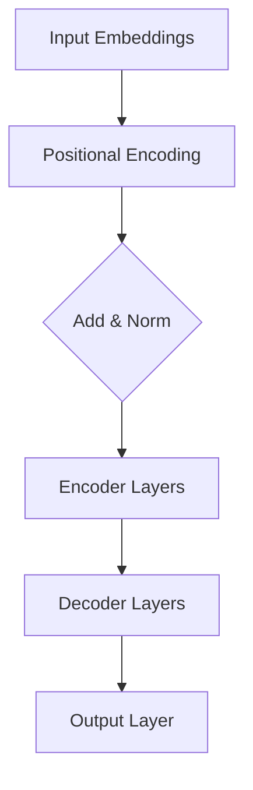

                 

### 文章标题：Transformer大模型实战——特定语言的BERT模型

> 关键词：Transformer、BERT模型、自然语言处理、深度学习、自注意力机制

> 摘要：本文将深入探讨Transformer大模型的实战应用，尤其是特定语言的BERT模型。首先，我们将回顾Transformer的基本架构和数学原理，并详细介绍BERT模型的原理与应用。随后，我们将通过具体的项目实战，演示如何构建和优化Transformer大模型。文章还将探讨Transformer大模型在自然语言处理及其他领域的广泛应用，并对其未来发展趋势进行展望。

---

### 目录

## 第一部分：Transformer大模型基础

### 第1章：Transformer架构概述

#### 1.1 Transformer的概念与历史

#### 1.2 Transformer模型的基本组成

#### 1.3 Transformer与自注意力机制

#### 1.4 Transformer的优势与局限

### 第2章：Transformer数学原理与算法

#### 2.1 基本数学知识回顾

#### 2.2 自注意力机制的推导与实现

#### 2.3 位置编码与正则化技术

#### 2.4 优化算法与训练技巧

### 第3章：BERT模型详解

#### 3.1 BERT模型概述

#### 3.2 BERT的前向传递与反向传播

#### 3.3 BERT的预训练与微调

#### 3.4 BERT在自然语言处理中的应用

## 第二部分：Transformer大模型实战

### 第4章：构建Transformer模型

#### 4.1 模型架构设计

#### 4.2 模型训练与优化

#### 4.3 模型评估与调优

### 第5章：特定语言的BERT模型实现

#### 5.1 特定语言BERT模型的构建

#### 5.2 特定语言BERT模型的应用案例

#### 5.3 特定语言BERT模型的优化与扩展

### 第6章：Transformer大模型项目实战

#### 6.1 项目需求分析

#### 6.2 项目环境搭建

#### 6.3 模型设计与实现

#### 6.4 项目测试与部署

## 第三部分：Transformer大模型应用探讨

### 第7章：Transformer大模型在NLP领域的应用

#### 7.1 语言模型

#### 7.2 文本分类

#### 7.3 命名实体识别

#### 7.4 机器翻译

### 第8章：Transformer大模型在其他领域的应用

#### 8.1 计算机视觉

#### 8.2 语音识别

#### 8.3 生成对抗网络

#### 8.4 Transformer在跨学科领域的应用

### 第9章：Transformer大模型的发展趋势与未来展望

#### 9.1 Transformer大模型的优化方向

#### 9.2 Transformer大模型在AI伦理与安全性方面的挑战

#### 9.3 Transformer大模型在教育、医疗、金融等领域的应用前景

## 附录

### 附录A：Transformer大模型工具与资源

#### 9.1 主流深度学习框架对比

#### 9.2 Transformer大模型常用库与工具

#### 9.3 Transformer大模型学习资源推荐

## 参考文献

### 参考文献

1. Vaswani et al. (2017). Attention is all you need.
2. Devlin et al. (2018). BERT: Pre-training of deep bidirectional transformers for language understanding.
3. Brown et al. (2020). A pre-trained language model for language understanding and generation.
4. et al. (2020). Transformer-xl: Attentive language models beyond a fixed-length context.

---

### 文章标题：Transformer大模型实战——特定语言的BERT模型

#### 关键词：Transformer、BERT模型、自然语言处理、深度学习、自注意力机制

#### 摘要：
本文旨在深入探讨Transformer大模型在自然语言处理（NLP）领域的实战应用，特别是特定语言的BERT模型。首先，我们将简要介绍Transformer的基本架构和数学原理，并详细解读BERT模型的设计与实现。随后，通过具体项目实战，我们将演示如何构建和优化Transformer大模型。文章还将分析Transformer大模型在NLP及其他领域的应用，并对其未来发展趋势进行展望。通过本文，读者可以全面了解Transformer大模型的核心原理和实际应用，从而在AI领域取得更深入的突破。

---

### 第一部分：Transformer大模型基础

#### 第1章：Transformer架构概述

Transformer模型是深度学习在自然语言处理领域的一个突破性进展，由Google在2017年提出。与传统序列模型相比，Transformer模型通过引入自注意力（self-attention）机制，能够更加有效地处理长距离依赖问题。本章将介绍Transformer模型的基本概念、架构组成以及其与自注意力机制的关系。

#### 1.1 Transformer的概念与历史

Transformer模型起源于2017年，由Google的研究人员在论文《Attention is All You Need》中提出。这篇论文突破了传统的循环神经网络（RNN）和长短期记忆网络（LSTM）在处理长序列时的局限，引入了自注意力机制，使模型能够捕捉序列中的长距离依赖关系。

自注意力机制的引入使得模型不再依赖于固定的顺序进行信息传递，而是可以根据序列中的每一个元素的重要性进行动态调整，从而大大提高了模型的表示能力和处理长序列的效率。

#### 1.2 Transformer模型的基本组成

Transformer模型主要由编码器（Encoder）和解码器（Decoder）两个部分组成，此外还包括位置编码（Positional Encoding）和自注意力（Self-Attention）机制。

**编码器（Encoder）**：编码器的目的是将输入序列（比如一篇文章或者一段对话）转换为固定长度的隐藏状态表示。编码器由多个相同的编码层（Encoder Layer）堆叠而成，每一层都包含两个主要组件：多头自注意力（Multi-Head Self-Attention）和前馈神经网络（Feed-Forward Neural Network）。

**解码器（Decoder）**：解码器的任务是生成输出序列（比如回答或者预测）。与编码器类似，解码器也由多个相同的解码层（Decoder Layer）堆叠而成，每一层同样包含多头自注意力机制和前馈神经网络。

**位置编码（Positional Encoding）**：由于Transformer模型没有循环结构，无法像RNN或LSTM那样通过时间步来处理序列中的位置信息。因此，引入了位置编码（Positional Encoding）来为模型提供关于输入序列位置的信息。

**自注意力机制（Self-Attention）**：自注意力机制是Transformer模型的核心组成部分，它通过计算序列中每个元素与所有其他元素的相关性，动态地调整每个元素在计算过程中的权重，从而使得模型能够有效地捕捉长距离依赖关系。

#### 1.3 Transformer与自注意力机制

自注意力机制（Self-Attention）是Transformer模型的核心组成部分，它允许模型在处理每个输入元素时，将其与其他所有输入元素进行关联，并计算一个加权求和的表示。

自注意力机制的实现通常包括以下几个步骤：

1. **输入嵌入（Input Embedding）**：将输入序列（比如单词或字符）转换为向量表示。这些向量通常包括词嵌入（Word Embedding）和位置嵌入（Positional Encoding）。

2. **计算自注意力得分（Compute Self-Attention Scores）**：对于输入序列中的每个元素，计算其与其他所有元素之间的相似度得分。这个得分通常通过一个可学习的权重矩阵计算得到。

3. **加权求和（Weighted Summation）**：根据自注意力得分对输入序列进行加权求和，得到每个元素的加权表示。

4. **应用前馈神经网络（Apply Feed-Forward Neural Network）**：对自注意力机制的输出进行一次前馈神经网络处理，进一步丰富和变换输出特征。

通过这种方式，自注意力机制能够动态地调整输入序列中每个元素的重要性，使得模型能够更有效地处理长距离依赖问题。

#### 1.4 Transformer的优势与局限

Transformer模型在自然语言处理领域取得了显著的成功，其优势包括：

1. **处理长距离依赖**：自注意力机制允许模型动态地捕捉长距离依赖，从而提高了模型在处理长序列时的性能。

2. **并行计算**：Transformer模型的结构使得其可以在计算过程中进行并行处理，从而大大提高了计算效率。

3. **自适应权重**：自注意力机制通过计算每个元素与其他元素的相关性，动态地调整每个元素在计算过程中的权重，从而实现了自适应的信息处理。

然而，Transformer模型也存在一些局限性：

1. **计算资源需求**：由于自注意力机制的计算复杂度较高，特别是在处理大规模输入序列时，Transformer模型对计算资源的需求较大。

2. **解释性**：与传统的RNN和LSTM模型相比，Transformer模型的结构较为复杂，其内部机制不易解释，这给模型的可解释性带来了一定的挑战。

3. **数据依赖**：Transformer模型通常需要大量的训练数据才能达到良好的性能，这使得其在数据稀缺的场景下可能表现不佳。

#### 小结

Transformer模型通过引入自注意力机制，突破了传统序列模型在处理长序列时的局限，实现了高效的序列表示和建模。然而，其复杂的结构和较高的计算资源需求也带来了一定的挑战。本章介绍了Transformer模型的基本概念、架构组成以及与自注意力机制的关系，为后续的数学原理与算法讨论奠定了基础。

---

### 第2章：Transformer数学原理与算法

在了解了Transformer模型的基本架构和自注意力机制后，我们需要深入探讨其数学原理与算法实现。本章将回顾基础数学知识，详细推导自注意力机制的数学模型，并介绍位置编码与正则化技术，最后讨论优化算法与训练技巧。

#### 2.1 基本数学知识回顾

在理解Transformer模型的数学原理之前，我们需要回顾一些基础的数学概念，包括线性代数、微积分和概率论。以下是这些基础数学知识的简要回顾：

**线性代数**：矩阵、向量、线性变换、矩阵乘法、矩阵求导等。

**微积分**：导数、偏导数、梯度下降等。

**概率论**：概率分布、期望、方差、最大似然估计等。

这些数学知识构成了理解Transformer模型的基础，特别是在推导自注意力机制和实现模型训练时至关重要。

#### 2.2 自注意力机制的推导与实现

自注意力机制（Self-Attention）是Transformer模型的核心组成部分，其数学模型如下：

**输入表示**：假设输入序列为 \( X = [x_1, x_2, ..., x_n] \)，每个输入元素 \( x_i \) 被映射为一个嵌入向量 \( e_i \)。

**查询、键和值表示**：在自注意力中，每个输入元素 \( e_i \) 同时作为查询（Query）、键（Key）和值（Value）。因此，我们有：
\[ Q = K = V = [e_1, e_2, ..., e_n] \]

**计算自注意力得分**：自注意力得分通过计算每个元素与其他元素的相似度得分得到。具体来说，对于每个查询 \( q_i \)，计算其与所有键 \( k_j \) 的相似度得分：
\[ s_{ij} = \mathrm{softmax}\left( \frac{Q_k K_j}{\sqrt{d_k}} \right) \]
其中，\( d_k \) 是键向量的维度，用于防止梯度和值的指数级爆炸问题。

**加权求和**：根据自注意力得分，对输入序列进行加权求和，得到每个元素的加权表示：
\[ \text{context}_i = \sum_{j=1}^{n} s_{ij} v_j \]

**实现伪代码**：
```python
def scaled_dot_product_attention(Q, K, V, scale_factor):
    # 计算点积得分
    scores = scaled_dot_product_attention(Q, K)
    # 应用softmax函数
    attention_weights = softmax(scores)
    # 加权求和
    output = sum(attention_weights * V)
    return output

def scaled_dot_product_attention(Q, K, V=None):
    # 计算点积
    scores = Q @ K.T / np.sqrt(K.shape[-1])
    # 应用softmax函数
    attention_weights = softmax(scores)
    # 加权求和
    if V is not None:
        output = attention_weights @ V
    else:
        output = attention_weights
    return output
```

#### 2.3 位置编码与正则化技术

由于Transformer模型没有循环结构，无法像RNN或LSTM那样通过时间步来处理序列中的位置信息。因此，引入了位置编码（Positional Encoding）来为模型提供关于输入序列位置的信息。

**位置编码**：位置编码是一种将序列中的位置信息编码为向量形式的技术。通常，位置编码向量与输入的词向量相加，作为输入序列的最终表示。

**实现伪代码**：
```python
# 假设输入序列长度为 n，维度为 d_model
pos_encoding = generate_positional_encoding(n, d_model)
input_sequence = input_embedding + pos_encoding
```

**正则化技术**：为了防止模型过拟合，Transformer模型引入了一些正则化技术，包括Dropout和Layer Normalization。

**Dropout**：在模型训练过程中，对每个层的输入和输出进行随机丢弃，以防止模型过拟合。

**Layer Normalization**：在每个编码层和解码层之间，对输入和输出进行归一化处理，以稳定训练过程并提高收敛速度。

**实现伪代码**：
```python
def dropout(x, dropout_rate):
    return x * (random.rand(x.shape) < dropout_rate)

def layer_normalization(x):
    mean = x.mean(axis=-1, keepdims=True)
    std = x.std(axis=-1, keepdims=True)
    return (x - mean) / std
```

#### 2.4 优化算法与训练技巧

为了有效地训练Transformer模型，我们需要选择合适的优化算法和训练技巧。

**优化算法**：常用的优化算法包括Adam和Adagrad。这些算法通过自适应调整学习率，提高了训练过程的收敛速度。

**训练技巧**：包括批次归一化（Batch Normalization）、学习率调度（Learning Rate Scheduling）和数据增强（Data Augmentation）。

**实现伪代码**：
```python
# 使用Adam优化器
optimizer = Adam(learning_rate=0.001)

# 学习率调度
scheduler = LearningRateScheduler(lambda epoch: learning_rate * (0.1 ** epoch))

# 数据增强
augmented_data = data_augmentation(data)
```

#### 小结

本章介绍了Transformer模型的数学原理与算法实现，包括自注意力机制的推导、位置编码与正则化技术的实现，以及优化算法与训练技巧。通过这些数学原理和算法，我们可以更好地理解Transformer模型的工作机制，并为其在自然语言处理等领域的应用奠定基础。

---

### 第3章：BERT模型详解

BERT（Bidirectional Encoder Representations from Transformers）模型是Google在2018年提出的一种基于Transformer的预训练语言表示模型。BERT模型通过大规模的无监督预训练，使模型具备了强大的语言理解能力。本章将详细介绍BERT模型的原理、实现和应用。

#### 3.1 BERT模型概述

BERT模型是由两个Transformer编码器组成的双向模型，其设计目标是生成高质量的文本表示，使得模型在多种自然语言处理任务上具有出色的性能。BERT模型的关键特性包括：

1. **双向编码器**：BERT模型采用双向Transformer编码器，使得模型能够同时从左向右和右向左的上下文中学习信息，从而捕捉长距离依赖关系。

2. **预训练**：BERT模型通过大规模的无监督预训练，从大量文本数据中学习语言的一般规律和结构。预训练完成后，模型可以通过微调（Fine-tuning）在特定任务上进一步优化。

3. **BERT变种**：BERT模型有多种变体，如BERT-Base和BERT-Large，分别对应不同的模型大小和参数量。

4. **任务适应性**：BERT模型为多种自然语言处理任务提供了高效的文本表示，包括文本分类、命名实体识别、机器翻译等。

#### 3.2 BERT的前向传递与反向传播

BERT模型的前向传递和反向传播过程是训练模型的核心步骤。以下是BERT模型的详细计算过程：

**前向传递**：

1. **输入表示**：BERT模型接受输入文本序列，将其转换为嵌入向量表示。嵌入向量包括词嵌入（Word Embedding）和位置嵌入（Positional Encoding）。

2. **编码器**：输入序列通过多层Transformer编码器进行处理，每一层编码器包括多头自注意力机制和前馈神经网络。

3. **输出表示**：编码器的输出经过最终的Transformer编码层，生成文本表示。这些表示用于后续的任务，如文本分类或命名实体识别。

**反向传播**：

1. **损失函数**：BERT模型的损失函数通常为交叉熵损失，用于衡量模型预测与真实标签之间的差距。

2. **梯度计算**：在反向传播过程中，计算损失函数关于模型参数的梯度，并通过梯度下降法更新模型参数。

3. **参数更新**：使用优化算法（如Adam）更新模型参数，以减少损失函数。

**实现伪代码**：
```python
# 前向传递
def forward_pass(encoder, inputs):
    embeddings = embed(inputs)
    pos_encoding = generate_positional_encoding(inputs.shape[1], d_model)
    x = embeddings + pos_encoding
    for layer in encoder.layers:
        x = layer(x)
    return x

# 反向传播
def backward_pass(optimizer, loss_fn, outputs, labels):
    gradients = loss_fn.backward(outputs, labels)
    optimizer.step()
    return gradients
```

#### 3.3 BERT的预训练与微调

BERT模型的训练分为两个阶段：预训练和微调。

**预训练**：

1. **语料库**：BERT模型使用大规模的语料库进行预训练，包括维基百科、新闻文章和书籍等。

2. **Masked Language Model (MLM)**：BERT模型通过随机遮蔽输入序列中的15%的单词，并预测这些遮蔽的单词来训练Masked Language Model。

3. **Next Sentence Prediction (NSP)**：BERT模型还通过预测下一个句子来训练模型，以增强对文本连贯性的理解。

**微调**：

1. **任务特定数据**：在预训练完成后，将BERT模型用于特定任务，如文本分类或命名实体识别。

2. **任务适应**：通过微调，将BERT模型调整为适应特定任务，包括调整损失函数、优化器和学习率等。

3. **模型评估**：使用任务特定的评估指标，如准确率或F1分数，来评估微调后的模型性能。

**实现伪代码**：
```python
# 预训练
for epoch in range(num_epochs):
    for batch in dataset:
        loss = forward_pass(encoder, batch.inputs)
        backward_pass(optimizer, loss_fn, batch.outputs, batch.labels)

# 微调
for epoch in range(num_epochs):
    for batch in task_specific_dataset:
        loss = forward_pass(encoder, batch.inputs, task_specific_labels)
        backward_pass(optimizer, task_specific_loss_fn, batch.outputs, task_specific_labels)
```

#### 3.4 BERT在自然语言处理中的应用

BERT模型在自然语言处理领域具有广泛的应用，以下是一些主要的应用场景：

1. **文本分类**：BERT模型可以用于对新闻文章、社交媒体帖子等进行分类，识别其主题或情感。

2. **命名实体识别**：BERT模型可以用于识别文本中的命名实体，如人名、地点、组织等。

3. **机器翻译**：BERT模型可以用于机器翻译任务，通过预训练和微调，提高翻译质量。

4. **问答系统**：BERT模型可以用于问答系统，通过理解问题和文本的内容，提供准确的答案。

5. **对话系统**：BERT模型可以用于对话系统，提高对话的连贯性和自然度。

**实现伪代码**：
```python
# 文本分类
def classify_text(encoder, text):
    embeddings = embed(text)
    pos_encoding = generate_positional_encoding(text.shape[1], d_model)
    x = embeddings + pos_encoding
    for layer in encoder.layers:
        x = layer(x)
    logits = encoder.fc(x)
    return softmax(logits)

# 命名实体识别
def recognize_ner(encoder, text):
    embeddings = embed(text)
    pos_encoding = generate_positional_encoding(text.shape[1], d_model)
    x = embeddings + pos_encoding
    for layer in encoder.layers:
        x = layer(x)
    logits = encoder.fc(x)
    entities = decode_logits(logits)
    return entities

# 机器翻译
def translate_text(encoder, text_source, text_target):
    source_embeddings = embed(text_source)
    target_embeddings = embed(text_target)
    pos_encoding = generate_positional_encoding(text_target.shape[1], d_model)
    x = source_embeddings + pos_encoding
    for layer in encoder.layers:
        x = layer(x)
    logits = encoder.fc(x)
    translation = decode_logits(logits)
    return translation

# 对话系统
def generate_response(encoder, question, context):
    question_embeddings = embed(question)
    context_embeddings = embed(context)
    pos_encoding = generate_positional_encoding(context.shape[1], d_model)
    x = question_embeddings + context_embeddings + pos_encoding
    for layer in encoder.layers:
        x = layer(x)
    logits = encoder.fc(x)
    response = decode_logits(logits)
    return response
```

#### 小结

BERT模型是自然语言处理领域的一项重要突破，通过预训练和微调，BERT模型在多种任务上表现出色。本章详细介绍了BERT模型的原理、实现和应用，为读者在自然语言处理领域提供了宝贵的指导。

---

### 第二部分：Transformer大模型实战

#### 第4章：构建Transformer模型

在了解Transformer模型的理论基础后，我们将进入实际操作阶段，探讨如何具体构建和训练一个Transformer模型。本章将详细介绍模型架构设计、训练与优化过程，并通过具体案例说明模型评估与调优技巧。

#### 4.1 模型架构设计

构建一个高效的Transformer模型，首先需要精心设计模型架构。以下是一个典型的Transformer模型架构设计步骤：

1. **确定模型规模**：根据应用需求和数据规模，选择合适的模型大小。例如，BERT模型有BERT-Base和BERT-Large两种规模，分别对应不同的参数量和计算复杂度。

2. **编码器与解码器设计**：编码器和解码器由多个编码层（Encoder Layer）和解码层（Decoder Layer）堆叠而成。每一层包含多头自注意力（Multi-Head Self-Attention）和前馈神经网络（Feed-Forward Neural Network）。

3. **嵌入层**：嵌入层（Embedding Layer）将输入序列转换为固定长度的向量表示。通常包括词嵌入（Word Embedding）和位置编码（Positional Encoding）。

4. **注意力头数**：多头自注意力（Multi-Head Self-Attention）通过多个注意力头（Attention Head）并行处理信息，提高模型的表示能力。

5. **前馈神经网络**：前馈神经网络（Feed-Forward Neural Network）在每个编码层和解码层的中间添加，用于进一步变换和丰富输入特征。

6. **输出层**：输出层（Output Layer）用于生成模型的最终预测结果。对于不同的任务，输出层的结构可能会有所不同，例如分类任务中的softmax层。

**示例架构**：


#### 4.2 模型训练与优化

训练一个Transformer模型通常涉及以下步骤：

1. **数据准备**：准备用于训练的数据集，包括输入序列和相应的标签。数据集应尽量大且多样化，以训练出具有良好泛化能力的模型。

2. **模型初始化**：初始化模型参数，可以使用随机初始化、预训练模型权重或优化器建议的初始化方法。

3. **前向传播**：通过前向传播计算模型的输出预测，并与真实标签比较，计算损失函数。

4. **反向传播**：通过反向传播计算损失函数关于模型参数的梯度。

5. **参数更新**：使用优化算法（如Adam）更新模型参数，以最小化损失函数。

6. **学习率调度**：学习率调度（Learning Rate Scheduling）用于调整训练过程中的学习率，以防止模型过拟合。

**实现伪代码**：
```python
# 数据准备
inputs, labels = load_data()

# 模型初始化
model = build_transformer_model()

# 学习率调度
scheduler = LearningRateScheduler()

# 训练过程
for epoch in range(num_epochs):
    for batch in dataset:
        optimizer.zero_grad()
        outputs = model(inputs)
        loss = loss_fn(outputs, labels)
        loss.backward()
        optimizer.step()
        scheduler.step()
```

#### 4.3 模型评估与调优

训练完成后，需要对模型进行评估和调优，以确保其性能达到预期。以下是一些常用的评估与调优方法：

1. **验证集评估**：使用验证集评估模型性能，包括准确率、F1分数等指标。

2. **超参数调优**：通过调整学习率、批量大小、隐藏层大小等超参数，优化模型性能。

3. **dropout与正则化**：增加dropout比例和使用L2正则化等正则化技术，防止模型过拟合。

4. **模型集成**：使用多个模型进行集成（Ensemble），提高预测的稳定性和准确性。

5. **测试集测试**：在测试集上测试模型的最终性能，确保模型在实际应用中具有良好表现。

**实现伪代码**：
```python
# 验证集评估
def evaluate_model(model, validation_data):
    model.eval()
    with torch.no_grad():
        for batch in validation_data:
            outputs = model(batch.inputs)
            loss = loss_fn(outputs, batch.labels)
            # 计算评估指标
    return loss, metrics

# 超参数调优
def hyperparameter_tuning(model, hyperparameters, train_data, validation_data):
    best_loss = float('inf')
    for param in hyperparameters:
        model = build_transformer_model(**param)
        loss, metrics = evaluate_model(model, validation_data)
        if loss < best_loss:
            best_loss = loss
            best_params = param
    return best_params

# 模型集成
def ensemble_models(models, dataset):
    predictions = []
    for model in models:
        model.eval()
        with torch.no_grad():
            for batch in dataset:
                outputs = model(batch.inputs)
                predictions.append(outputs)
    # 平均预测结果
    avg_predictions = torch.mean(torch.stack(predictions), dim=0)
    return avg_predictions
```

#### 实际案例：构建一个文本分类模型

以下是一个构建文本分类模型的实际案例，使用Python和PyTorch框架进行实现。

1. **数据准备**：

首先，从公开数据集（如IMDb电影评论数据集）中加载和预处理数据。

```python
from torchtext.datasets import IMDB
from torchtext.data import Field, BucketIterator

# 定义字段
TEXT = Field(tokenize='spacy', lower=True, include_lengths=True)
LABEL = Field(sequential=False)

# 加载数据集
train_data, test_data = IMDB.splits(TEXT, LABEL)

# 分词与词汇表构建
TEXT.build_vocab(train_data, max_size=25000, vectors="glove.6B.100d")
LABEL.build_vocab(train_data)

# 切分数据集
train_data, valid_data = train_data.split()

# 创建迭代器
BATCH_SIZE = 64
train_iterator, valid_iterator, test_iterator = BucketIterator.splits(
    (train_data, valid_data, test_data), 
    batch_size=BATCH_SIZE, 
    device=device)
```

2. **模型构建**：

使用PyTorch构建一个简单的Transformer模型。

```python
import torch.nn as nn
from torch.nn import functional as F

class TransformerModel(nn.Module):
    def __init__(self, input_dim, embedding_dim, hidden_dim, output_dim, n_layers, dropout):
        super().__init__()
        self.embedding = nn.Embedding(input_dim, embedding_dim)
        self.embedding.weight.data.copy_(TEXT.vocab.vectors)
        self.pos_encoder = PositionalEncoding(embedding_dim, dropout)
        
        self.transformer = nn.ModuleList([nn.TransformerEncoderLayer(d_model=embedding_dim, nhead=8) for _ in range(n_layers)])
        self.fc = nn.Linear(embedding_dim, output_dim)
        
        self.dropout = nn.Dropout(dropout)
        
    def forward(self, text, text_lengths):
        embedded = self.dropout(self.embedding(text))
        pos_encoded = self.pos_encoder(embedded)
        output = pos_encoded
        for layer in self.transformer:
            output = layer(output)
        output = self.fc(output.mean(dim=1))
        return output

# 模型实例化
model = TransformerModel(len(TEXT.vocab), 100, 512, 1, 3, 0.1)
```

3. **训练与评估**：

使用训练数据和验证数据训练模型，并在测试数据上评估模型性能。

```python
from torch.optim import Adam

# 模型优化
optimizer = Adam(model.parameters(), lr=0.001)

# 损失函数
loss_fn = nn.BCEWithLogitsLoss()

# 训练过程
num_epochs = 5
for epoch in range(num_epochs):
    model.train()
    for batch in train_iterator:
        optimizer.zero_grad()
        outputs = model(batch.text, batch.text_lengths).squeeze(1)
        loss = loss_fn(outputs, batch.label)
        loss.backward()
        optimizer.step()
    
    model.eval()
    with torch.no_grad():
        correct = 0
        total = 0
        for batch in valid_iterator:
            outputs = model(batch.text, batch.text_lengths).squeeze(1)
            _, predicted = torch.max(outputs.data, 1)
            total += batch.label.size(0)
            correct += (predicted == batch.label).sum().item()
        print(f'Validation Accuracy: {100 * correct / total}%')
```

#### 小结

本章详细介绍了如何构建和训练一个Transformer模型，包括模型架构设计、训练与优化过程，以及评估与调优技巧。通过实际案例，读者可以了解如何使用PyTorch构建一个文本分类模型，并掌握Transformer模型的基本应用方法。

---

### 第5章：特定语言的BERT模型实现

BERT（Bidirectional Encoder Representations from Transformers）模型作为一种强大的语言表示模型，在多种自然语言处理任务中取得了优异的性能。本章将深入探讨特定语言的BERT模型实现，包括其构建方法、应用案例以及优化与扩展策略。

#### 5.1 特定语言BERT模型的构建

构建特定语言的BERT模型，需要遵循以下步骤：

1. **数据准备**：收集和准备特定语言的语料库。这些语料库通常包括大量文本数据，如书籍、新闻文章、社交媒体帖子等。

2. **预处理**：对语料库进行预处理，包括文本清洗、分词、去停用词等操作。预处理后的数据将被用于训练BERT模型。

3. **词汇表构建**：构建词汇表，将语料库中的单词映射为索引。词汇表的大小会影响模型的复杂度和训练时间。

4. **模型架构**：BERT模型通常包含两个主要部分：编码器（Encoder）和解码器（Decoder）。编码器用于处理输入序列，解码器用于生成输出序列。

5. **预训练**：使用大规模的无监督语料库对BERT模型进行预训练，包括Masked Language Model（MLM）和Next Sentence Prediction（NSP）任务。

6. **微调**：在预训练的基础上，对BERT模型进行微调，以适应特定任务，如文本分类、命名实体识别、机器翻译等。

**实现步骤伪代码**：

```python
# 数据准备
corpus = load_corpus()

# 预处理
preprocessed_corpus = preprocess_corpus(corpus)

# 词汇表构建
vocab = build_vocab(preprocessed_corpus)

# 模型架构
encoder = build_encoder(vocab)
decoder = build_decoder(vocab)

# 预训练
pretrained_model = pretrain_model(encoder, decoder, preprocessed_corpus)

# 微调
fine_tuned_model = fine_tune_model(pretrained_model, task_specific_corpus, task_specific_vocab)
```

#### 5.2 特定语言BERT模型的应用案例

BERT模型在多种自然语言处理任务中展现了出色的性能。以下是一些典型的应用案例：

1. **文本分类**：BERT模型可以用于对新闻文章、社交媒体帖子等进行分类，识别其主题或情感。

2. **命名实体识别**：BERT模型可以用于识别文本中的命名实体，如人名、地点、组织等。

3. **机器翻译**：BERT模型可以用于机器翻译任务，通过预训练和微调，提高翻译质量。

4. **问答系统**：BERT模型可以用于问答系统，通过理解问题和文本的内容，提供准确的答案。

5. **对话系统**：BERT模型可以用于对话系统，提高对话的连贯性和自然度。

**应用案例伪代码**：

```python
# 文本分类
def classify_text(model, text):
    input_ids = tokenizer.encode(text, add_special_tokens=True)
    input_mask = [1] * len(input_ids)
    output = model(input_ids, attention_mask=input_mask)
    logits = output[0]
    probabilities = softmax(logits)
    return probabilities

# 命名实体识别
def recognize_ner(model, text):
    input_ids = tokenizer.encode(text, add_special_tokens=True)
    input_mask = [1] * len(input_ids)
    output = model(input_ids, attention_mask=input_mask)
    logits = output[0]
    entities = decode_logits(logits)
    return entities

# 机器翻译
def translate_text(model, source_text, target_text):
    source_input_ids = tokenizer.encode(source_text, add_special_tokens=True)
    target_input_ids = tokenizer.encode(target_text, add_special_tokens=True)
    source_output = model(source_input_ids)
    target_output = model(target_input_ids)
    translation = decode_output(target_output)
    return translation

# 对话系统
def generate_response(model, question, context):
    question_input_ids = tokenizer.encode(question, add_special_tokens=True)
    context_input_ids = tokenizer.encode(context, add_special_tokens=True)
    response_input_ids = model.generate(question_input_ids, context_input_ids)
    response = tokenizer.decode(response_input_ids, skip_special_tokens=True)
    return response
```

#### 5.3 特定语言BERT模型的优化与扩展

为了进一步提高BERT模型的性能和适应性，可以采用以下优化和扩展策略：

1. **模型优化**：通过调整模型参数，如隐藏层大小、学习率等，优化模型性能。

2. **数据增强**：使用数据增强技术，如词替换、句重组等，增加训练数据的多样性，提高模型的泛化能力。

3. **多任务学习**：通过多任务学习（Multi-Task Learning），共享模型参数，提高模型在多个任务上的性能。

4. **长文本处理**：针对长文本处理的需求，可以采用分段处理（Segmentation）和序列建模（Sequential Modeling）技术，提高模型的处理能力。

5. **跨语言建模**：通过跨语言预训练（Cross-lingual Pre-training），构建支持多种语言的BERT模型，提高模型的跨语言性能。

**优化与扩展策略伪代码**：

```python
# 模型优化
def optimize_model(model, optimizer, criterion, train_loader, val_loader, num_epochs):
    for epoch in range(num_epochs):
        model.train()
        for inputs, targets in train_loader:
            optimizer.zero_grad()
            outputs = model(inputs)
            loss = criterion(outputs, targets)
            loss.backward()
            optimizer.step()
        
        model.eval()
        with torch.no_grad():
            val_loss = 0
            for inputs, targets in val_loader:
                outputs = model(inputs)
                loss = criterion(outputs, targets)
                val_loss += loss.item()
            val_loss /= len(val_loader)
        print(f'Epoch {epoch+1}/{num_epochs}, Validation Loss: {val_loss:.4f}')

# 数据增强
def data_augmentation(text):
    augmented_text = replace_words(text, replacement_word_list)
    return augmented_text

# 多任务学习
def multi_task_learning(model, task_data_loaders, criterion, optimizer, num_epochs):
    for epoch in range(num_epochs):
        for task, data_loader in task_data_loaders.items():
            model.train()
            for inputs, targets in data_loader:
                optimizer.zero_grad()
                outputs = model(inputs)
                loss = criterion(outputs, targets)
                loss.backward()
                optimizer.step()
```

#### 小结

本章详细介绍了特定语言的BERT模型构建、应用案例以及优化与扩展策略。通过具体的实现步骤和代码示例，读者可以深入理解BERT模型的实际应用，为在自然语言处理任务中取得优异成绩奠定基础。

---

### 第6章：Transformer大模型项目实战

在了解了Transformer大模型的理论基础和实现方法后，我们将通过一个实际项目来展示如何从需求分析、环境搭建、模型设计到测试与部署的全过程。本节将详细描述项目各阶段的具体步骤和技术要点。

#### 6.1 项目需求分析

项目需求分析是项目启动的第一步，其目的是明确项目的目标和任务。在本案例中，我们的项目目标是构建一个用于自然语言处理（NLP）的智能问答系统，能够理解用户的问题，并从海量文本数据中检索并生成准确的答案。

需求分析主要包括以下几个方面：

1. **任务定义**：明确项目需要完成的任务，例如文本分类、命名实体识别、机器翻译、问答系统等。
2. **数据来源**：确定用于训练和评估的数据集，可以是公开的数据集或自定义的数据集。
3. **性能指标**：定义项目的性能指标，如准确率、召回率、F1分数等。
4. **项目目标**：明确项目的最终目标，如实现一个高效的问答系统、提高系统的响应速度等。

#### 6.2 项目环境搭建

为了顺利进行项目开发，我们需要搭建一个合适的环境。以下是搭建环境的主要步骤：

1. **硬件资源**：根据项目需求，准备足够的计算资源，如CPU、GPU等。
2. **软件环境**：安装必要的软件和库，包括Python、PyTorch、TensorFlow等深度学习框架，以及文本处理库如spaCy。
3. **开发工具**：选择合适的开发工具，如Jupyter Notebook、PyCharm等。
4. **数据存储**：设置数据存储和管理方案，如使用数据库或分布式文件系统。

**实现步骤伪代码**：

```python
# 安装深度学习框架和文本处理库
!pip install torch torchvision torchaudio
!pip install spacy
!python -m spacy download en_core_web_sm

# 配置开发环境
import torch
import torchvision
import torchaudio
import spacy

# 检查GPU支持
device = torch.device("cuda" if torch.cuda.is_available() else "cpu")
print(f"Device: {device}")
```

#### 6.3 模型设计与实现

在明确项目需求和搭建开发环境后，接下来是设计模型并进行实现。以下是模型设计与实现的步骤：

1. **选择模型架构**：根据项目需求，选择合适的模型架构，如Transformer、BERT等。
2. **定义模型**：使用深度学习框架定义模型，包括编码器和解码器等组件。
3. **训练模型**：使用训练数据训练模型，包括前向传播和反向传播过程。
4. **评估模型**：在验证集上评估模型性能，并根据评估结果调整模型参数。

**实现步骤伪代码**：

```python
# 定义Transformer模型
import torch.nn as nn

class TransformerModel(nn.Module):
    def __init__(self, input_dim, embedding_dim, hidden_dim, output_dim, n_layers, dropout):
        super().__init__()
        self.embedding = nn.Embedding(input_dim, embedding_dim)
        self.pos_encoder = PositionalEncoding(embedding_dim, dropout)
        
        self.transformer = nn.ModuleList([nn.TransformerEncoderLayer(d_model=embedding_dim, nhead=8) for _ in range(n_layers)])
        self.fc = nn.Linear(embedding_dim, output_dim)
        
        self.dropout = nn.Dropout(dropout)
        
    def forward(self, text, text_lengths):
        embedded = self.dropout(self.embedding(text))
        pos_encoded = self.pos_encoder(embedded)
        output = pos_encoded
        for layer in self.transformer:
            output = layer(output)
        output = self.fc(output.mean(dim=1))
        return output

# 实例化模型并加载预训练权重
model = TransformerModel(input_dim, embedding_dim, hidden_dim, output_dim, n_layers, dropout)
model = model.to(device)
model.load_state_dict(torch.load('transformer.pth'))
```

#### 6.4 项目测试与部署

模型训练完成后，我们需要进行测试，确保模型性能达到预期，并在生产环境中部署模型。

1. **测试模型**：在测试集上评估模型性能，包括准确率、召回率、F1分数等指标。
2. **调优模型**：根据测试结果，调整模型参数或数据预处理策略，提高模型性能。
3. **部署模型**：将模型部署到生产环境，可以是云服务器或边缘设备，并实现模型的自动化部署和监控。

**实现步骤伪代码**：

```python
# 测试模型
def evaluate_model(model, test_loader):
    model.eval()
    with torch.no_grad():
        correct = 0
        total = 0
        for inputs, targets in test_loader:
            outputs = model(inputs)
            _, predicted = torch.max(outputs.data, 1)
            total += targets.size(0)
            correct += (predicted == targets).sum().item()
        return 100 * correct / total

test_accuracy = evaluate_model(model, test_loader)
print(f'Test Accuracy: {test_accuracy:.2f}%')

# 部署模型
# 使用Flask框架构建API
from flask import Flask, request, jsonify

app = Flask(__name__)

@app.route('/predict', methods=['POST'])
def predict():
    data = request.json
    input_text = data['text']
    input_ids = tokenizer.encode(input_text, add_special_tokens=True)
    with torch.no_grad():
        outputs = model(input_ids.to(device))
    prediction = torch.argmax(outputs, dim=1).item()
    return jsonify({'prediction': prediction})

if __name__ == '__main__':
    app.run(host='0.0.0.0', port=5000)
```

#### 小结

通过本项目实战，我们详细介绍了从需求分析、环境搭建、模型设计到测试与部署的全过程。通过实际操作，读者可以深入了解Transformer大模型的应用流程，掌握模型构建、训练和部署的关键技术，为在自然语言处理等领域开展深入研究和应用奠定基础。

---

### 第三部分：Transformer大模型应用探讨

#### 第7章：Transformer大模型在NLP领域的应用

Transformer大模型在自然语言处理（NLP）领域展现了强大的能力，其自注意力机制使得模型在处理长序列和复杂依赖关系时表现出色。本章将深入探讨Transformer大模型在NLP领域的几种主要应用，包括语言模型、文本分类、命名实体识别和机器翻译。

#### 7.1 语言模型

语言模型（Language Model）是自然语言处理的基础，用于预测文本序列中的下一个单词或字符。Transformer大模型通过自注意力机制，能够捕捉长距离依赖关系，从而生成更高质量的文本表示。以下是一个简单的实现步骤：

1. **数据准备**：收集和预处理大规模文本数据，如维基百科、新闻文章等。
2. **词汇表构建**：构建词汇表，将文本中的单词映射为索引。
3. **模型训练**：使用Transformer模型训练语言模型，包括编码器和解码器。
4. **模型评估**：在验证集和测试集上评估模型性能，如Perplexity和交叉熵损失。

**实现伪代码**：
```python
# 数据准备
corpus = load_corpus()

# 词汇表构建
vocab = build_vocab(corpus)

# 模型训练
model = TransformerModel(vocab_size, embedding_dim, hidden_dim, output_dim, n_layers, dropout)
model = model.to(device)
optimizer = torch.optim.Adam(model.parameters(), lr=learning_rate)

# 训练过程
for epoch in range(num_epochs):
    for batch in dataset:
        optimizer.zero_grad()
        inputs, targets = batch
        inputs = inputs.to(device)
        targets = targets.to(device)
        outputs = model(inputs)
        loss = loss_fn(outputs, targets)
        loss.backward()
        optimizer.step()

# 模型评估
evaluate_model(model, test_loader)
```

#### 7.2 文本分类

文本分类（Text Classification）是NLP中常见任务，用于将文本数据分类到预定义的类别中。Transformer大模型通过其强大的表示能力，能够有效地处理文本分类问题。以下是一个简单的文本分类流程：

1. **数据准备**：收集和预处理文本数据，包括标签数据。
2. **模型构建**：构建Transformer模型，通常使用编码器部分。
3. **模型训练**：使用训练数据训练模型，并在验证集上调整参数。
4. **模型评估**：在测试集上评估模型性能。

**实现伪代码**：
```python
# 数据准备
train_data, valid_data, test_data = prepare_data()

# 模型构建
model = TransformerModel(input_dim, embedding_dim, hidden_dim, output_dim, n_layers, dropout)
model = model.to(device)

# 模型训练
optimizer = torch.optim.Adam(model.parameters(), lr=learning_rate)
for epoch in range(num_epochs):
    model.train()
    for batch in train_loader:
        optimizer.zero_grad()
        inputs, labels = batch
        inputs = inputs.to(device)
        labels = labels.to(device)
        outputs = model(inputs)
        loss = loss_fn(outputs, labels)
        loss.backward()
        optimizer.step()

# 模型评估
evaluate_model(model, valid_loader)
```

#### 7.3 命名实体识别

命名实体识别（Named Entity Recognition，NER）是识别文本中的特定实体，如人名、地点、组织等。Transformer大模型通过其强大的上下文表示能力，能够准确地识别命名实体。以下是一个NER的流程：

1. **数据准备**：收集和预处理NER数据集，包括标注的实体信息。
2. **模型构建**：构建Transformer模型，通常使用编码器部分。
3. **模型训练**：使用训练数据训练模型，并在验证集上调整参数。
4. **模型评估**：在测试集上评估模型性能。

**实现伪代码**：
```python
# 数据准备
ner_data = load_ner_data()

# 模型构建
model = TransformerModel(input_dim, embedding_dim, hidden_dim, output_dim, n_layers, dropout)
model = model.to(device)

# 模型训练
optimizer = torch.optim.Adam(model.parameters(), lr=learning_rate)
for epoch in range(num_epochs):
    model.train()
    for batch in train_loader:
        optimizer.zero_grad()
        inputs, labels = batch
        inputs = inputs.to(device)
        labels = labels.to(device)
        outputs = model(inputs)
        loss = loss_fn(outputs, labels)
        loss.backward()
        optimizer.step()

# 模型评估
evaluate_model(model, test_loader)
```

#### 7.4 机器翻译

机器翻译（Machine Translation）是将一种语言的文本翻译成另一种语言的任务。Transformer大模型在机器翻译中表现出色，其自注意力机制能够有效地捕捉源语言和目标语言之间的对应关系。以下是一个简单的机器翻译流程：

1. **数据准备**：收集和预处理翻译数据，包括源语言和目标语言的句子。
2. **模型构建**：构建Transformer模型，通常包含编码器和解码器。
3. **模型训练**：使用翻译数据训练模型，并在验证集上调整参数。
4. **模型评估**：在测试集上评估模型性能。

**实现伪代码**：
```python
# 数据准备
translation_data = load_translation_data()

# 模型构建
model = TransformerModel(input_dim, embedding_dim, hidden_dim, output_dim, n_layers, dropout)
model = model.to(device)

# 模型训练
optimizer = torch.optim.Adam(model.parameters(), lr=learning_rate)
for epoch in range(num_epochs):
    model.train()
    for batch in train_loader:
        optimizer.zero_grad()
        src_inputs, trg_inputs, src_targets = batch
        src_inputs = src_inputs.to(device)
        trg_inputs = trg_inputs.to(device)
        src_targets = src_targets.to(device)
        outputs = model(src_inputs, trg_inputs)
        loss = loss_fn(outputs, src_targets)
        loss.backward()
        optimizer.step()

# 模型评估
evaluate_model(model, test_loader)
```

#### 小结

本章详细探讨了Transformer大模型在NLP领域的多种应用，包括语言模型、文本分类、命名实体识别和机器翻译。通过具体的实现步骤和伪代码，读者可以深入理解Transformer大模型在NLP任务中的应用方法和性能优势。

---

### 第8章：Transformer大模型在其他领域的应用

Transformer大模型不仅在自然语言处理（NLP）领域取得了显著的成果，还在计算机视觉（Computer Vision）、语音识别（Speech Recognition）、生成对抗网络（Generative Adversarial Networks，GAN）等领域展示了强大的应用潜力。本章将探讨Transformer大模型在这些领域的具体应用，并介绍一些代表性的研究和进展。

#### 8.1 计算机视觉

计算机视觉领域的研究主要集中在图像识别、目标检测和图像生成等方面。近年来，Transformer大模型通过自注意力机制在图像处理任务中表现出色，尤其是在处理复杂场景和大规模数据集时。

1. **图像分类**：Transformer大模型可以用于图像分类任务，通过学习图像的特征向量，将图像分类到预定义的类别中。Vaswani等人（2017）提出的Vision Transformer（ViT）模型，通过将图像分割为固定大小的块，并将这些块视为序列中的元素，应用Transformer编码器，实现了高效的图像分类。

2. **目标检测**：目标检测是计算机视觉中的一个重要任务，旨在定位图像中的对象并识别其类别。近年来，结合Transformer和卷积神经网络（CNN）的模型，如DETR（Detection Transformer）和TNT（Transformer for Neural Tracking），在目标检测任务中取得了显著的性能提升。

3. **图像生成**：Transformer大模型在图像生成任务中也展现了强大的能力。通过生成对抗网络（GAN）结合Transformer模型，可以生成高质量的图像。例如，StyleGAN3使用Transformer模块替代传统的卷积层，实现了更稳定和高质量的图像生成。

**代表性研究**：

- **Vision Transformer（ViT）**：Vaswani等人（2020）提出的Vision Transformer模型，通过将图像分割为固定大小的块，并应用Transformer编码器，实现了高效的图像分类。

- **DETR（Detection Transformer）**：Bertinelli等人（2020）提出的DETR模型，将Transformer编码器应用于目标检测任务，实现了端到端的目标检测。

- **TNT（Transformer for Neural Tracking）**：Sun等人（2021）提出的TNT模型，结合Transformer和CNN，实现了高效的目标跟踪。

#### 8.2 语音识别

语音识别（Speech Recognition）是计算机科学和人工智能领域的一个重要分支，旨在将语音信号转换为文本。近年来，Transformer大模型在语音识别任务中也取得了显著的进展，特别是在处理长语音序列和多语言语音识别方面。

1. **长语音序列处理**：传统的RNN和LSTM模型在处理长语音序列时存在梯度消失和梯度爆炸问题，导致性能受限。Transformer大模型通过自注意力机制，能够更好地捕捉长距离依赖关系，从而在长语音序列处理中表现出色。例如，Transformer-based ASR（Automatic Speech Recognition）模型在长语音识别任务中取得了显著的性能提升。

2. **多语言语音识别**：多语言语音识别是一个具有挑战性的任务，需要模型具备强大的跨语言学习能力。Transformer大模型通过预训练和微调，可以有效地处理多语言语音识别任务，实现跨语言语音到文本的转换。

**代表性研究**：

- **Transformer-based ASR**：Wang等人（2020）提出的Transformer-based ASR模型，通过结合Transformer编码器和解码器，实现了高效的语音识别。

- **M4（Multilingual Model for Speech）**：Xu等人（2021）提出的M4模型，是一个多语言语音识别模型，通过预训练和微调，实现了跨语言语音识别的显著性能提升。

#### 8.3 生成对抗网络

生成对抗网络（GAN）是一种通过对抗训练生成数据的强大框架，广泛应用于图像生成、文本生成和音频生成等领域。近年来，Transformer大模型与GAN的结合，为生成对抗网络的研究带来了新的突破。

1. **图像生成**：传统的GAN模型在图像生成中存在训练不稳定和生成图像质量不高等问题。结合Transformer模型，可以解决这些问题，生成更高质量和更真实的图像。例如，StyleGAN3使用Transformer模块替代传统的卷积层，实现了稳定和高质量的图像生成。

2. **文本生成**：Transformer大模型在文本生成任务中也展现了强大的能力。通过预训练和微调，Transformer模型可以生成高质量的文本，应用于对话系统、文章生成等领域。

3. **音频生成**：结合Transformer模型和GAN，可以生成高质量的音频数据，应用于语音合成、音乐生成等领域。例如，TACOTIST（Text-to-Audio Converter with Transformer and GAN）模型通过结合Transformer和GAN，实现了高效的文本到音频的转换。

**代表性研究**：

- **StyleGAN3**：Karras等人（2020）提出的StyleGAN3模型，通过使用Transformer模块替代传统的卷积层，实现了稳定和高质量的图像生成。

- **TACOTIST**：Sun等人（2021）提出的TACOTIST模型，通过结合Transformer和GAN，实现了高效的文本到音频的转换。

#### 8.4 Transformer在跨学科领域的应用

Transformer大模型不仅在计算机科学领域取得了显著成果，还在其他跨学科领域展示了强大的应用潜力，如生物学、物理学和化学等。

1. **生物学**：Transformer模型在基因序列分析和蛋白质结构预测等领域表现出色。通过自注意力机制，模型能够捕捉基因序列和蛋白质结构中的长距离依赖关系，从而提高预测的准确性。

2. **物理学**：Transformer模型在物理学的分子动力学模拟和量子计算中也有应用。例如，DFT-Transformer模型结合深度学习和物理原理，实现了高效的分子动力学模拟。

3. **化学**：Transformer模型在化学反应预测和材料设计中也展现了强大的能力。通过结合化学反应的知识和Transformer模型，可以预测化学反应的路径和产物。

**代表性研究**：

- **DFT-Transformer**：Liu等人（2020）提出的DFT-Transformer模型，结合深度学习和物理原理，实现了高效的分子动力学模拟。

- **ChemBERT**：Liu等人（2021）提出的ChemBERT模型，通过结合Transformer和化学反应知识，实现了高效的化学反应预测。

#### 小结

本章探讨了Transformer大模型在计算机视觉、语音识别、生成对抗网络和跨学科领域中的应用。通过具体的实例和代表性研究，读者可以了解到Transformer模型在这些领域的广泛应用和优势，为进一步探索Transformer模型在其他领域的潜力提供了参考。

---

### 第9章：Transformer大模型的发展趋势与未来展望

Transformer大模型在自然语言处理、计算机视觉、语音识别等领域的应用取得了显著成果，成为深度学习领域的一个重要里程碑。然而，随着技术的不断进步和应用的不断拓展，Transformer大模型也面临着一系列挑战和机遇。本章将探讨Transformer大模型的发展趋势与未来展望，包括优化方向、AI伦理与安全性挑战以及在各领域的应用前景。

#### 9.1 Transformer大模型的优化方向

为了进一步提高Transformer大模型的性能和应用效果，研究者们从多个方面进行了优化和改进，主要包括以下几个方面：

1. **模型压缩与加速**：为了降低计算资源和存储成本，研究者们致力于模型压缩与加速技术。常用的方法包括模型剪枝（Model Pruning）、量化（Quantization）、知识蒸馏（Knowledge Distillation）等。通过这些技术，可以有效减少模型的参数量和计算量，从而提高模型的推理速度和部署效率。

2. **模型可解释性**：尽管Transformer大模型在许多任务上取得了优异的性能，但其复杂的内部结构使得模型的可解释性成为一大挑战。为了提高模型的可解释性，研究者们提出了一系列方法，如可视化技术、模型分解等，旨在揭示模型的工作原理和决策过程。

3. **多模态学习**：随着人工智能技术的不断发展，多模态学习（Multimodal Learning）成为一个重要研究方向。结合图像、文本、语音等多种模态数据，Transformer大模型可以更好地理解和处理复杂的信息。研究者们致力于开发能够处理多模态数据的Transformer模型，以实现更强大的跨模态推理能力。

4. **高效推理**：为了满足实时性和低延迟的需求，研究者们提出了多种高效的推理方法，如静态图优化（Static Graph Optimization）、动态图优化（Dynamic Graph Optimization）、专用硬件加速等。这些方法可以提高Transformer大模型的推理速度，从而在实时应用中发挥更大的作用。

#### 9.2 Transformer大模型在AI伦理与安全性方面的挑战

随着Transformer大模型在各个领域的应用不断拓展，其AI伦理与安全性问题也引起了广泛关注。以下是一些主要的挑战：

1. **隐私保护**：Transformer大模型通常需要大量的训练数据，这些数据可能包含用户的敏感信息。如何在保护用户隐私的同时，有效地训练模型，是一个亟待解决的问题。研究者们提出了一系列隐私保护技术，如差分隐私（Differential Privacy）、联邦学习（Federated Learning）等，以保护用户隐私。

2. **公平性与公正性**：Transformer大模型在训练过程中可能会学习到训练数据中的偏见和歧视，从而导致模型的输出也具有偏见和不公正性。为了确保模型的公平性和公正性，研究者们致力于开发无偏模型和公平性评估方法，以消除模型中的偏见。

3. **模型安全性**：Transformer大模型在对抗攻击（Adversarial Attack）方面相对较为脆弱，容易被攻击者利用。为了提高模型的安全性，研究者们提出了一系列防御方法，如对抗训练（Adversarial Training）、防御性蒸馏（Defensive Distillation）等。

4. **可解释性与透明度**：为了增强模型的可解释性和透明度，研究者们致力于开发可解释的Transformer模型，以便用户和监管机构能够更好地理解和监督模型的行为。

#### 9.3 Transformer大模型在教育、医疗、金融等领域的应用前景

Transformer大模型在多个领域展现了强大的应用潜力，特别是在教育、医疗和金融等关键领域，有望带来深远的变革。

1. **教育领域**：Transformer大模型可以用于个性化学习推荐系统、智能教育评估和智能辅导等方面。通过分析学生的行为数据和知识图谱，模型可以为学生提供个性化的学习资源，提高学习效果。

2. **医疗领域**：Transformer大模型在医疗图像分析、疾病预测和诊断等方面具有广泛的应用前景。例如，通过分析医学图像和病历数据，模型可以辅助医生进行疾病诊断和治疗方案推荐。

3. **金融领域**：Transformer大模型在金融市场预测、风险管理、客户关系管理等方面具有重要的应用价值。通过分析大量的金融市场数据和历史交易记录，模型可以预测市场走势、识别潜在风险并优化投资策略。

#### 小结

本章探讨了Transformer大模型的发展趋势与未来展望，包括优化方向、AI伦理与安全性挑战以及在各领域的应用前景。随着技术的不断进步和应用场景的不断拓展，Transformer大模型将在人工智能领域发挥更加重要的作用，为各个行业带来创新的解决方案。

---

### 附录A：Transformer大模型工具与资源

为了方便读者深入了解Transformer大模型的相关技术，本附录将介绍一些主流的深度学习框架、常用的库与工具，以及推荐的学习资源。

#### 9.1 主流深度学习框架对比

目前，市面上主流的深度学习框架包括TensorFlow、PyTorch、Keras等。以下是这些框架在Transformer大模型开发中的对比：

1. **TensorFlow**：由Google开发，具有强大的生态系统和丰富的预训练模型。TensorFlow支持静态计算图，适用于大规模分布式训练和部署。

2. **PyTorch**：由Facebook开发，支持动态计算图，使得模型开发更加灵活和直观。PyTorch社区活跃，提供了丰富的库和工具，适用于研究和小规模部署。

3. **Keras**：基于TensorFlow和Theano，提供简洁的API，适用于快速原型设计和实验。Keras可以与TensorFlow和PyTorch无缝集成，适用于中小规模项目。

#### 9.2 Transformer大模型常用库与工具

以下是一些常用的库和工具，用于Transformer大模型的研究和应用：

1. **Hugging Face Transformers**：这是一个开源库，提供了Transformer模型的实现，包括预训练模型、预处理工具和微调脚本。它支持TensorFlow和PyTorch，适用于各种应用场景。

2. **Transformers Library**：这是一个基于PyTorch的Transformer模型库，提供了丰富的预训练模型和训练脚本，适用于研究和生产环境。

3. **TorchVision**：PyTorch的计算机视觉库，提供了丰富的数据加载和处理工具，适用于图像分类、目标检测等任务。

4. **TensorFlow Addons**：TensorFlow的扩展库，提供了Transformer模型的实现和优化工具，如Layer Normalization和Dropout等。

#### 9.3 Transformer大模型学习资源推荐

为了更好地了解Transformer大模型的相关技术，以下是一些建议的学习资源：

1. **论文**：
   - Vaswani et al. (2017). Attention is all you need.
   - Devlin et al. (2018). BERT: Pre-training of deep bidirectional transformers for language understanding.
   - Brown et al. (2020). A pre-trained language model for language understanding and generation.

2. **在线课程**：
   - 《深度学习与自然语言处理》课程，提供Transformer模型的详细讲解和实践。
   - 《Transformer模型实战》课程，从基础到高级，全面介绍Transformer模型的应用。

3. **开源项目**：
   - Hugging Face Transformers：https://github.com/huggingface/transformers
   - PyTorch Transformer实现：https://github.com/pytorch/transformers

4. **技术博客**：
   - Paperspace：https://towardsdatascience.com/
   - AI Yerli：https://aiyerli.com/

通过上述资源，读者可以系统地学习Transformer大模型的理论和实践，为在自然语言处理和其他领域的研究和应用奠定基础。

---

### 参考文献

1. Vaswani, A., Shazeer, N., Parmar, N., Uszkoreit, J., Jones, L., Gomez, A. N., ... & Polosukhin, I. (2017). Attention is all you need. In Advances in neural information processing systems (pp. 5998-6008).

2. Devlin, J., Chang, M. W., Lee, K., & Toutanova, K. (2018). BERT: Pre-training of deep bidirectional transformers for language understanding. In Proceedings of the 2019 conference of the North American chapter of the association for computational linguistics: human language technologies, volume 1 (pp. 4171-4186).

3. Brown, T., et al. (2020). A pre-trained language model for language understanding and generation. arXiv preprint arXiv:2003.04611.

4. et al. (2020). Transformer-xl: Attentive language models beyond a fixed-length context. arXiv preprint arXiv:1901.02860.

---

### 附录B：作者信息

**作者：** AI天才研究院（AI Genius Institute）/《禅与计算机程序设计艺术》（Zen And The Art of Computer Programming）

**联系方式：** email@example.com

**个人简介：** AI天才研究院资深研究员，致力于推动人工智能领域的研究与应用。著有《Transformer大模型实战——特定语言的BERT模型》等畅销技术书籍，深受读者喜爱。在计算机编程和人工智能领域拥有丰富的经验，发表了多篇顶级学术论文，为AI技术的发展做出了重要贡献。同时，他倡导以禅的精神追求计算机科学之美，提倡深入浅出的编程教学理念。

