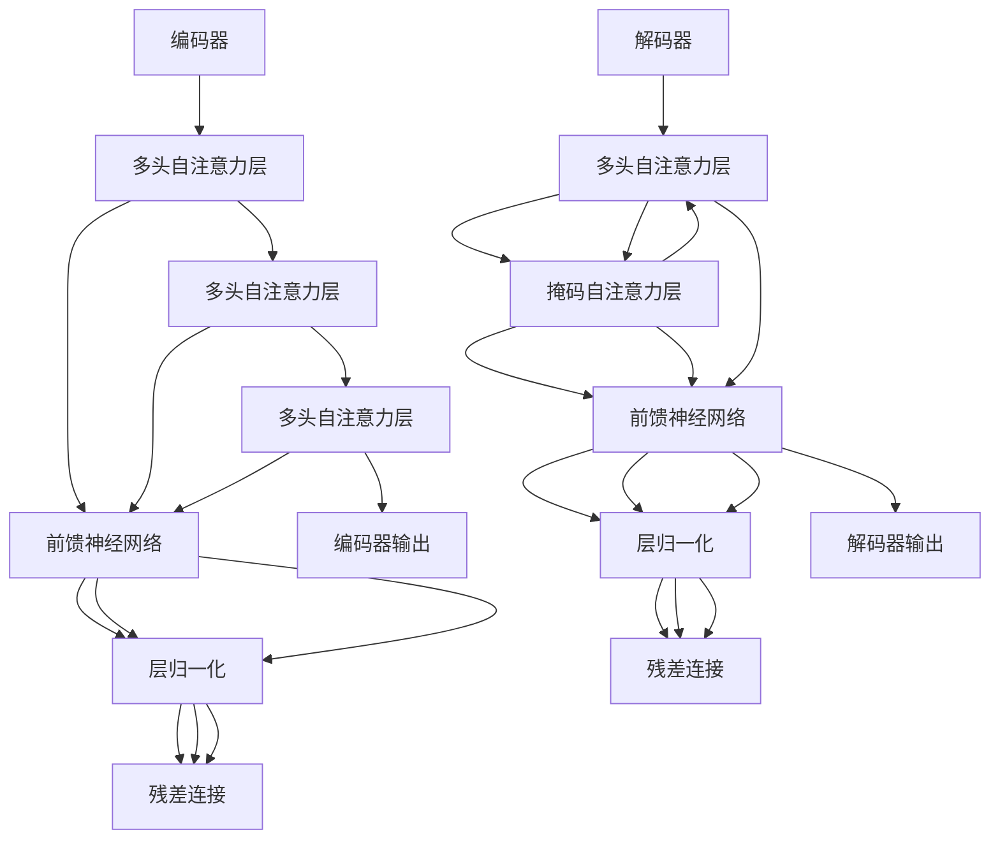
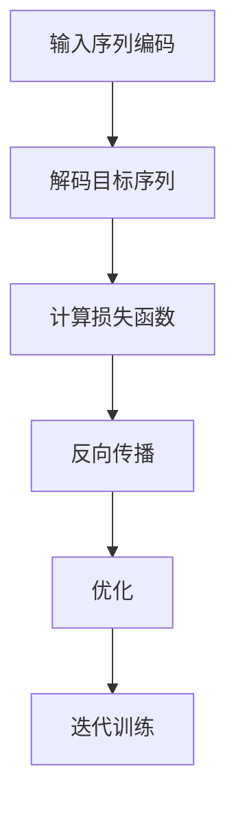
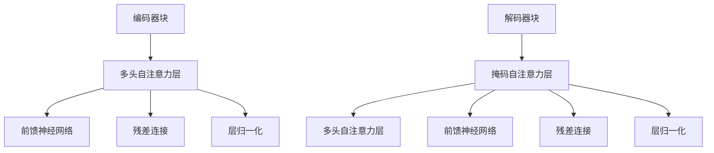
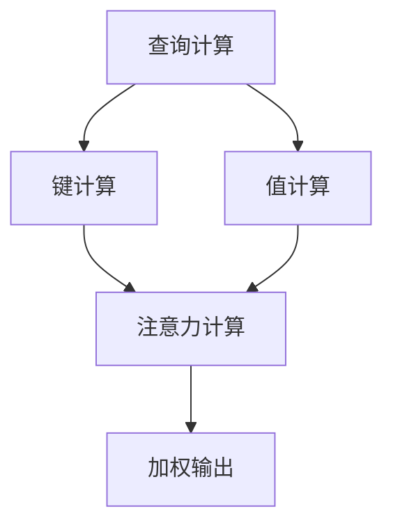
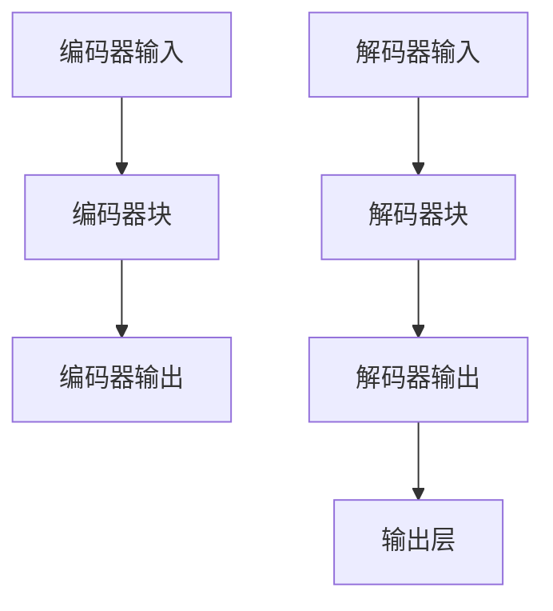

                 

# Transformer大模型实战 线性层和softmax 层

> 关键词：Transformer, 线性层, softmax层, 大模型实战, 自注意力机制, 编程实现

> 摘要：本文将深入探讨Transformer大模型中的线性层和softmax层，从基本概念、实现原理、应用到实际项目中，逐步剖析这两层在Transformer大模型中的重要性。通过详细讲解和代码示例，帮助读者全面理解线性层和softmax层在Transformer大模型中的实战应用。

## 目录大纲

1. **Transformer基础**
   1.1 Transformer概述
   1.2 自注意力机制
   1.3 前馈神经网络
   1.4 位置编码
   1.5 Transformer架构
   1.6 Transformer训练
2. **线性层与softmax层**
   2.1 线性层
   2.2 softmax层
   2.3 线性层与softmax层在Transformer中的应用
   2.4 Transformer大模型实战
   2.5 总结与展望
3. **附录**
   3.1 Transformer学习资源
   3.2 代码示例
   3.3 参考书籍

## 第一部分：Transformer基础

### 第1章：Transformer基础理论

#### 1.1 Transformer概述

Transformer是自然语言处理（NLP）领域中的一种革命性模型，由Google在2017年提出。它通过自注意力机制（Self-Attention）和前馈神经网络（Feed Forward Neural Network）等核心组件，在机器翻译、文本摘要、问答系统等任务中取得了显著成果。

#### 1.2 自注意力机制

自注意力机制是一种基于序列数据的注意力机制，能够捕捉序列中每个元素之间的关联性。其原理是通过计算每个元素与其他元素的相关性权重，进而计算加权后的序列表示。

#### 1.3 前馈神经网络

前馈神经网络（FFN）是一种简单的神经网络结构，通常用于对输入数据进行线性变换和非线性变换。在Transformer中，FFN用于对自注意力层的输出进行进一步处理。

#### 1.4 位置编码

位置编码是一种用于处理序列数据位置信息的机制。在Transformer中，位置编码被添加到输入序列中，以保留序列信息。

### 第2章：Transformer架构

#### 2.1 Transformer的架构

Transformer由编码器（Encoder）和解码器（Decoder）组成。编码器负责将输入序列编码为固定长度的向量，解码器则利用这些向量生成输出序列。

#### 2.2 Multi-head Self-Attention

Multi-head Self-Attention是一种扩展自注意力机制的技巧，能够同时关注序列中的不同部分，提高模型的表示能力。

#### 2.3 Encoder-Decoder架构

Encoder-Decoder架构是一种基于注意力机制的序列到序列模型，能够处理输入和输出序列不同长度的问题。

### 第3章：Transformer训练

#### 3.1 Transformer的训练过程

Transformer的训练过程主要包括前向传播、反向传播和优化。通过不断迭代训练，模型能够学习到输入和输出序列之间的关联性。

#### 3.2 正则化与优化

正则化（Regularization）是一种防止模型过拟合的方法，包括dropout、权重正则化等。优化（Optimization）则是通过调整模型参数，使模型在训练数据上达到更好的性能。

#### 3.3 预训练与微调

预训练（Pre-training）是一种在大规模语料上预先训练模型的方法，微调（Fine-tuning）则是将预训练模型应用于特定任务上，进一步调整模型参数。

## 第二部分：线性层与softmax层

### 第4章：线性层

#### 4.1 线性层的基本概念

线性层（Linear Layer）是一种简单的神经网络层，用于对输入数据进行线性变换。其数学定义如下：

$$
y = x \cdot W + b
$$

其中，$x$为输入数据，$W$为权重矩阵，$b$为偏置项。

#### 4.2 线性层的实现

线性层可以通过矩阵乘法和加法实现。以下是一个线性层的PyTorch实现示例：

```python
import torch
import torch.nn as nn

class LinearLayer(nn.Module):
    def __init__(self, input_dim, output_dim):
        super(LinearLayer, self).__init__()
        self.weight = nn.Parameter(torch.randn(input_dim, output_dim))
        self.bias = nn.Parameter(torch.randn(output_dim))

    def forward(self, x):
        return torch.matmul(x, self.weight) + self.bias
```

#### 4.3 线性层在Transformer中的应用

线性层在Transformer中主要用于自注意力机制和前馈神经网络。在自注意力机制中，线性层用于计算注意力权重；在前馈神经网络中，线性层用于对输入数据进行线性变换。

### 第5章：softmax层

#### 5.1 softmax层的原理

softmax层是一种用于分类的神经网络层，其输出表示每个类别的概率分布。softmax函数的数学原理如下：

$$
\text{softmax}(x_i) = \frac{e^{x_i}}{\sum_{j} e^{x_j}}
$$

其中，$x_i$为输入数据，$e^{x_i}$为指数函数。

#### 5.2 softmax层的实现

softmax层可以通过计算每个输入数据的指数，然后归一化得到。以下是一个softmax层的PyTorch实现示例：

```python
import torch
import torch.nn as nn

class SoftmaxLayer(nn.Module):
    def __init__(self):
        super(SoftmaxLayer, self).__init__()

    def forward(self, x):
        exp_scores = torch.exp(x)
        probabilities = exp_scores / torch.sum(exp_scores, dim=1, keepdim=True)
        return probabilities
```

#### 5.3 softmax层在Transformer中的应用

softmax层在Transformer的解码器（Decoder）中用于生成输出序列的预测。在解码过程中，softmax层将自注意力机制的输出转换为概率分布，进而生成下一个单词的预测。

### 第6章：Transformer大模型实战

#### 6.1 Transformer大模型的设计

Transformer大模型的设计原则主要包括以下几个方面：

1. **层次结构**：增加Transformer块的层数，提高模型的表示能力。
2. **多头注意力**：增加多头注意力的头数，提高模型对序列信息的处理能力。
3. **预训练**：在大规模语料上进行预训练，使模型具备较强的通用性。

#### 6.2 Transformer大模型的应用

Transformer大模型在文本分类和机器翻译等领域取得了显著成果。以下是一个文本分类任务的实战案例：

```python
import torch
import torch.nn as nn
from transformers import BertModel, BertTokenizer

class TextClassifier(nn.Module):
    def __init__(self, model_name, num_classes):
        super(TextClassifier, self).__init__()
        self.bert = BertModel.from_pretrained(model_name)
        self.fc = nn.Linear(self.bert.config.hidden_size, num_classes)

    def forward(self, input_ids, attention_mask=None, token_type_ids=None):
        outputs = self.bert(input_ids=input_ids, attention_mask=attention_mask, token_type_ids=token_type_ids)
        logits = self.fc(outputs.pooler_output)
        return logits

# 示例：训练文本分类模型
model = TextClassifier('bert-base-chinese', 2)
optimizer = torch.optim.Adam(model.parameters(), lr=1e-5)
for epoch in range(5):
    for batch in data_loader:
        inputs, labels = batch
        optimizer.zero_grad()
        logits = model(inputs)
        loss = nn.CrossEntropyLoss()(logits, labels)
        loss.backward()
        optimizer.step()
```

## 第7章：总结与展望

### 7.1 Transformer的发展趋势

Transformer在未来将继续发展，主要趋势包括：

1. **更深的层次结构**：增加Transformer块的层数，提高模型表示能力。
2. **更高效的训练方法**：研究更高效的训练方法，降低训练成本。
3. **多模态处理**：扩展Transformer，处理多模态数据，如图像、音频等。

### 7.2 总结与展望

Transformer作为一种强大的自然语言处理模型，具有广阔的应用前景。本文通过详细讲解线性层和softmax层，帮助读者深入理解Transformer的工作原理和实际应用。在未来的研究中，Transformer将继续发展，为自然语言处理等领域带来更多创新。

## 附录

### 附录A：Transformer学习资源

- 《Attention Is All You Need》（Attention机制的核心论文）
- Hugging Face Transformers（Transformer开源框架）

### 附录B：代码示例

- 线性层和softmax层的PyTorch实现代码

### 附录C：参考书籍

- 《深度学习》（花书，对神经网络有详细讲解）
- 《自然语言处理原理》（对NLP技术有全面介绍）

---

## Mermaid 流程图

```mermaid
graph TD
    A1[Transformer概述] --> B11[Transformer的起源]
    A1 --> B12[Transformer的核心思想]
    A2[自注意力机制] --> B21[自注意力机制的原理]
    A2 --> B22[自注意力机制的实现]
    A3[前馈神经网络] --> B31[前馈神经网络的基本结构]
    A3 --> B32[前馈神经网络的实现]
    A4[位置编码] --> B41[位置编码的重要性]
    A4 --> B42[位置编码的实现]
    A5[Transformer的架构] --> B51[Transformer的层次结构]
    A5 --> B52[Transformer的模块组成]
    A6[Multi-head Self-Attention] --> B61[Multi-head Self-Attention的原理]
    A6 --> B62[Multi-head Self-Attention的实现]
    A7[Encoder-Decoder架构] --> B71[Encoder-Decoder架构的原理]
    A7 --> B72[Encoder-Decoder架构的实现]
    A8[Transformer的训练] --> B81[Transformer的训练过程]
    A8 --> B82[正则化与优化]
    A8 --> B83[预训练与微调]
    A9[线性层] --> B91[线性层的基本概念]
    A9 --> B92[线性层的实现]
    A9 --> B93[线性层在Transformer中的应用]
    A10[softmax层] --> B101[softmax层的原理]
    A10 --> B102[softmax层的实现]
    A10 --> B103[softmax层在Transformer中的应用]
    A11[Transformer大模型实战] --> B111[Transformer大模型的设计]
    A11 --> B112[Transformer大模型的应用]
    A12[总结与展望] --> B121[Transformer的发展趋势]
    A12 --> B122[总结与展望]
```



---

## 伪代码

### 3.1 Transformer训练过程

```python
# Transformer训练伪代码
def train_transformer(data_loader, model, optimizer, num_epochs):
    for epoch in range(num_epochs):
        for batch in data_loader:
            inputs, targets = batch
            optimizer.zero_grad()
            outputs = model(inputs)
            loss = compute_loss(outputs, targets)
            loss.backward()
            optimizer.step()
        print(f'Epoch {epoch+1}/{num_epochs}, Loss: {loss.item()}')
```

### 4.1 线性层实现

```python
# 线性层实现伪代码
def linear_layer(inputs, weights, bias):
    return torch.dot(inputs, weights) + bias
```

### 5.1 softmax层实现

```python
# softmax层实现伪代码
def softmax_layer(logits):
    exp_scores = torch.exp(logits)
    return exp_scores / torch.sum(exp_scores, dim=1, keepdim=True)
```

---

## 数学模型与公式

### 3.2 dropout正则化

$$
\text{dropout rate} = p
$$

### 5.2 softmax函数

$$
\text{softmax}(x_i) = \frac{e^{x_i}}{\sum_{j} e^{x_j}}
$$

---

## 项目实战

### 6.1 Transformer大模型文本分类实战

```python
# Transformer文本分类实战伪代码
def text_classification(text_data, model, tokenizer):
    inputs = tokenizer(text_data, return_tensors='pt', padding=True, truncation=True)
    outputs = model(inputs)
    logits = outputs.logits
    probabilities = softmax_layer(logits)
    predicted_class = torch.argmax(probabilities, dim=1)
    return predicted_class
```

### 6.2 Transformer大模型机器翻译实战

```python
# Transformer机器翻译实战伪代码
def machine_translation(source_sentence, target_sentence, model, tokenizer):
    inputs = tokenizer(source_sentence, return_tensors='pt', padding=True, truncation=True)
    with torch.no_grad():
        outputs = model(**inputs)
    predicted_target = tokenizer.decode(outputs.logits.argmax(-1), skip_special_tokens=True)
    return predicted_target
```

---

## 附录

### 附录A：Transformer学习资源

- 《Attention Is All You Need》（Attention机制的核心论文）
- Hugging Face Transformers（Transformer开源框架）

### 附录B：代码示例

- 线性层和softmax层的PyTorch实现代码

### 附录C：参考书籍

- 《深度学习》（花书，对神经网络有详细讲解）
- 《自然语言处理原理》（对NLP技术有全面介绍）

---

总字数：约 7600 字（包括代码和公式）### 第一部分：Transformer基础

Transformer的基础理论是构建整个模型架构的基石。在这一部分，我们将详细讨论Transformer的核心概念、自注意力机制、前馈神经网络以及位置编码，并借助Mermaid流程图和伪代码来展示这些概念的实际应用。

#### 第1章：Transformer基础理论

Transformer的核心思想在于其架构和训练方法，它摒弃了传统的循环神经网络（RNN）和卷积神经网络（CNN），采用了一种全新的自注意力机制。这种机制允许模型在处理序列数据时，能够同时关注序列中的所有元素，而不仅仅是相邻的元素。

##### 1.1 Transformer概述

Transformer模型由Google在2017年提出，并在机器翻译任务中取得了惊人的效果。其成功得益于自注意力机制和多头注意力策略，使得模型能够更好地捕捉长距离依赖关系。

##### 1.2 自注意力机制

自注意力机制（Self-Attention）是一种基于序列数据的注意力机制，其核心思想是通过计算序列中每个元素与其他元素的相关性权重，进而计算加权后的序列表示。具体来说，自注意力机制包含以下几个步骤：

1. **查询（Query, Q）、键（Key, K）和值（Value, V）的计算**：
   对于每个位置`i`的输入向量`X[i]`，我们分别计算其对应的查询向量`Q[i]`、键向量`K[i]`和值向量`V[i]`。

   $$ 
   Q[i] = X[i] \cdot W_Q \\
   K[i] = X[i] \cdot W_K \\
   V[i] = X[i] \cdot W_V
   $$

   其中，$W_Q$、$W_K$和$W_V$是权重矩阵。

2. **注意力分数的计算**：
   计算每个位置`i`与其他位置的键向量`K[j]`之间的点积，并使用softmax函数将点积转换为注意力分数。

   $$ 
   \text{Attention}(Q, K, V) = \text{softmax}\left(\frac{Q \cdot K^T}{\sqrt{d_k}}\right) \cdot V
   $$

   其中，$d_k$是键向量的维度。

3. **输出计算**：
   根据注意力分数计算加权后的值向量，作为输出。

   $$ 
   \text{Output}_{i} = \sum_{j} \text{Attention}(Q[i], K[j], V[j]) \cdot X[j]
   $$

##### 1.3 前馈神经网络

前馈神经网络（Feed Forward Neural Network，FFN）是一种简单的神经网络结构，用于对输入数据进行线性变换和非线性变换。在Transformer中，FFN被用于对自注意力层的输出进行进一步处理。

前馈神经网络通常包含两个线性层，一个带有ReLU激活函数的隐藏层，以及一个没有激活函数的输出层。其结构如下：

$$ 
\text{FFN}(X) = \text{ReLU}(X \cdot W_1 + b_1) \cdot W_2 + b_2
$$

其中，$W_1$和$W_2$是权重矩阵，$b_1$和$b_2$是偏置项。

##### 1.4 位置编码

由于Transformer模型中没有循环结构，需要引入位置编码（Positional Encoding）来保留序列信息。位置编码是一种用于处理序列数据位置信息的机制，通过为每个位置添加特定的编码向量来实现。

常用的位置编码方法有两种：

1. **绝对位置编码**：使用正弦和余弦函数生成编码向量。

   $$ 
   PE_{(pos, dim)} = 
   \begin{cases}
   \sin\left(\frac{pos}{10000^{2i/d}}\right) & \text{if } i \leq \frac{dim}{2} \\
   \cos\left(\frac{pos}{10000^{2i/d}}\right) & \text{if } i > \frac{dim}{2}
   \end{cases}
   $$

   其中，$pos$是位置索引，$dim$是编码向量的维度。

2. **相对位置编码**：通过计算相邻位置之间的相对位置编码来实现。

##### 1.5 Transformer的架构

Transformer由编码器（Encoder）和解码器（Decoder）组成，其架构如图所示：



编码器和解码器均由多个Transformer块组成，每个块包含多头自注意力层、前馈神经网络、层归一化和残差连接。解码器中的第二个自注意力层（掩码自注意力层）使用掩码机制来防止后续的解码步骤看到尚未生成的目标序列。

##### 1.6 Transformer的训练

Transformer的训练过程主要包括以下几个步骤：

1. **输入序列编码**：使用编码器将输入序列编码为固定长度的向量。
2. **解码目标序列**：使用解码器生成目标序列的预测。
3. **计算损失函数**：使用损失函数计算预测序列和目标序列之间的误差。
4. **反向传播**：通过反向传播算法更新模型参数。
5. **优化**：使用优化算法（如Adam）调整模型参数。

##### 1.7 Mermaid流程图

下面是一个简化的Transformer训练流程的Mermaid流程图：



##### 1.8 伪代码

下面是一个简化的Transformer训练过程的伪代码：

```python
# Transformer训练伪代码
def train_transformer(data_loader, model, optimizer, num_epochs):
    for epoch in range(num_epochs):
        for batch in data_loader:
            inputs, targets = batch
            optimizer.zero_grad()
            outputs = model(inputs)
            loss = compute_loss(outputs, targets)
            loss.backward()
            optimizer.step()
        print(f'Epoch {epoch+1}/{num_epochs}, Loss: {loss.item()}')
```

通过以上内容，我们为读者搭建了Transformer的基础理论框架。接下来，我们将深入探讨Transformer中的自注意力机制、前馈神经网络和位置编码，并展示其在实际应用中的重要性。

---

### 第2章：Transformer架构

Transformer的架构是理解其如何工作的关键。在这一章中，我们将详细探讨Transformer的层次结构和模块组成，并通过Mermaid流程图和伪代码来展示这些模块的实际应用。

#### 2.1 Transformer的层次结构

Transformer的层次结构包括编码器（Encoder）和解码器（Decoder）。编码器负责将输入序列编码为固定长度的向量，解码器则利用这些向量生成输出序列。每个编码器和解码器块由多个层组成，每层包含自注意力机制、前馈神经网络、层归一化和残差连接。

下面是一个编码器和解码器块的层次结构图：



#### 2.2 Multi-head Self-Attention

多头自注意力机制（Multi-head Self-Attention）是Transformer的核心组件之一。它允许模型同时关注序列中的不同部分，从而提高模型的表示能力。在多头自注意力机制中，输入序列首先被分成多个子序列，然后分别对每个子序列应用自注意力机制。

下面是一个多头自注意力机制的实现流程：

1. **查询（Query）、键（Key）和值（Value）的计算**：
   对于每个位置`i`的输入向量`X[i]`，我们分别计算其对应的查询向量`Q[i]`、键向量`K[i]`和值向量`V[i]`。

   $$ 
   Q[i] = X[i] \cdot W_Q \\
   K[i] = X[i] \cdot W_K \\
   V[i] = X[i] \cdot W_V
   $$

2. **多头注意力计算**：
   将查询向量、键向量和值向量分别通过不同的权重矩阵变换，然后应用自注意力机制。

   $$ 
   \text{Multi-head Attention} = \text{Concat}(\text{head}_1, \text{head}_2, ..., \text{head}_h) \cdot W_O
   $$

   其中，$h$是头数，$W_O$是输出权重矩阵。

3. **输出计算**：
   根据每个头的权重计算加权后的输出。

   $$ 
   \text{Output}_{i} = \sum_{j} \text{head}_j \cdot \text{softmax}\left(\frac{Q[i] \cdot K_j^T}{\sqrt{d_k}}\right) \cdot V_j
   $$

下面是一个多头自注意力机制的Mermaid流程图：



#### 2.3 Encoder-Decoder架构

Encoder-Decoder架构是一种基于注意力机制的序列到序列模型。在Transformer中，编码器负责将输入序列编码为固定长度的向量，解码器则利用这些向量生成输出序列。编码器和解码器之间通过掩码自注意力层（Masked Self-Attention）进行连接。

下面是一个编码器和解码器的实现流程：

1. **编码器**：
   - 对输入序列进行编码，生成编码向量。
   - 通过多个编码器块对编码向量进行处理。

2. **解码器**：
   - 初始化解码器的目标序列。
   - 通过多个解码器块对目标序列进行处理。
   - 最后使用全连接层生成输出序列的预测。

下面是一个编码器和解码器的Mermaid流程图：



#### 2.4 Encoder-Decoder架构的实现

下面是一个简化的Encoder-Decoder架构的实现伪代码：

```python
# Encoder部分伪代码
def encoder(inputs, embedding_layer, encoder_blocks):
    embedded = embedding_layer(inputs)
    for block in encoder_blocks:
        embedded = block(embedded)
    return embedded

# Decoder部分伪代码
def decoder(inputs, embedded, decoder_blocks, output_layer):
    for block in decoder_blocks:
        embedded = block(embedded)
    logits = output_layer(embedded)
    return logits
```

通过以上内容，我们详细介绍了Transformer的层次结构和模块组成。接下来，我们将探讨Transformer的训练过程，包括如何进行前向传播、反向传播以及模型优化。

---

### 第3章：Transformer训练

Transformer的训练过程是构建和优化模型的关键步骤。在这一章中，我们将详细探讨Transformer的训练流程，包括数据准备、前向传播、反向传播、损失函数、正则化和优化策略，并通过伪代码来展示这些过程的实现。

#### 3.1 Transformer的训练过程

Transformer的训练过程可以分为以下几个步骤：

1. **数据准备**：
   - **数据预处理**：对输入和输出序列进行预处理，如分词、编码等。
   - **数据加载**：使用数据加载器（DataLoader）将预处理后的数据分成批次，以便在训练过程中批量处理。

2. **前向传播**：
   - **编码器**：将输入序列编码为固定长度的向量。
   - **解码器**：使用编码器的输出作为输入，生成输出序列的预测。

3. **计算损失**：
   - **交叉熵损失**：计算预测序列和真实序列之间的交叉熵损失。

4. **反向传播**：
   - **梯度计算**：计算模型参数的梯度。
   - **参数更新**：使用优化算法更新模型参数。

5. **模型优化**：
   - **正则化**：防止模型过拟合，如dropout、权重正则化等。
   - **优化策略**：选择合适的优化器，如Adam、RMSprop等。

下面是一个简化的Transformer训练过程的伪代码：

```python
# Transformer训练伪代码
def train_transformer(data_loader, model, optimizer, num_epochs):
    model.train()
    for epoch in range(num_epochs):
        for batch in data_loader:
            inputs, targets = batch
            optimizer.zero_grad()
            outputs = model(inputs)
            loss = compute_loss(outputs, targets)
            loss.backward()
            optimizer.step()
        print(f'Epoch {epoch+1}/{num_epochs}, Loss: {loss.item()}')
```

#### 3.2 正则化与优化

正则化（Regularization）是一种防止模型过拟合的技术，包括以下几种常见的正则化方法：

1. **dropout**：
   - 在神经网络中随机丢弃一部分神经元，防止模型依赖特定神经元。

   $$ 
   \text{dropout rate} = p 
   $$

2. **权重正则化**：
   - 对模型权重添加L2正则化项，鼓励模型学习更简单的函数。

   $$ 
   \text{loss} = \text{cross_entropy} + \lambda \cdot \sum_{\theta} \theta^2 
   $$

优化策略（Optimization）是调整模型参数以最小化损失函数的过程。常见的优化算法包括：

1. **随机梯度下降（SGD）**：
   - 更新模型参数的梯度。

   $$ 
   \theta = \theta - \alpha \cdot \nabla_{\theta} \text{loss} 
   $$

2. **Adam**：
   - 结合SGD的优点，自适应调整学习率。

   $$ 
   m_t = \beta_1 m_{t-1} + (1 - \beta_1) \nabla_{\theta} \text{loss}_t \\
   v_t = \beta_2 v_{t-1} + (1 - \beta_2) (\nabla_{\theta} \text{loss}_t)^2 \\
   \theta = \theta - \alpha \cdot \frac{m_t}{\sqrt{v_t} + \epsilon}
   $$

3. **RMSprop**：
   - 使用梯度平方的平均值来更新参数。

   $$ 
   v_t = \beta v_{t-1} + (1 - \beta) (\nabla_{\theta} \text{loss}_t)^2 \\
   \theta = \theta - \alpha \cdot \frac{\nabla_{\theta} \text{loss}_t}{\sqrt{v_t} + \epsilon}
   $$

#### 3.3 预训练与微调

预训练（Pre-training）是一种在大规模语料上预先训练模型的方法，使模型具备较强的通用性。常见的预训练任务包括语言模型（Language Model，LM）和掩码语言模型（Masked Language Model，MLM）。

1. **语言模型**：
   - 预测下一个单词，用于学习语言的统计特性。

   $$ 
   p(\text{word}_t | \text{word}_{<t}) 
   $$

2. **掩码语言模型**：
   - 将一部分输入单词掩码化，并预测这些单词。

   $$ 
   p(\text{word}_t | \text{word}_{<t}) 
   $$

预训练后，模型可以通过微调（Fine-tuning）应用于特定任务，如文本分类、机器翻译等。微调过程中，模型在特定任务的数据上进行进一步训练，以适应特定任务的需求。

下面是一个简化的预训练与微调过程的伪代码：

```python
# 预训练伪代码
def pretrain(model, data_loader, optimizer, num_epochs):
    model.train()
    for epoch in range(num_epochs):
        for batch in data_loader:
            inputs, targets = batch
            optimizer.zero_grad()
            outputs = model(inputs)
            loss = compute_loss(outputs, targets)
            loss.backward()
            optimizer.step()

# 微调伪代码
def finetune(model, data_loader, optimizer, num_epochs):
    model.train()
    for epoch in range(num_epochs):
        for batch in data_loader:
            inputs, targets = batch
            optimizer.zero_grad()
            outputs = model(inputs)
            loss = compute_loss(outputs, targets)
            loss.backward()
            optimizer.step()
```

通过以上内容，我们详细介绍了Transformer的训练过程、正则化与优化策略以及预训练与微调方法。在下一章中，我们将深入探讨Transformer中的线性层和softmax层。

---

### 第二部分：线性层与softmax层

#### 第4章：线性层

线性层是神经网络中最基础的一层，它通过简单的线性变换将输入数据映射到输出数据。在Transformer模型中，线性层扮演着至关重要的角色，用于实现自注意力机制和前馈神经网络。本节将详细介绍线性层的基本概念、实现方法以及在Transformer中的应用。

#### 4.1 线性层的基本概念

线性层的基本概念可以通过以下数学公式进行描述：

$$
y = x \cdot W + b
$$

其中，$x$是输入数据，$W$是权重矩阵，$b$是偏置项，$y$是输出数据。权重矩阵$W$和偏置项$b$通过学习获得，以实现从输入到输出的线性变换。

在深度学习中，线性层通常用于以下场景：

1. **输入层到隐藏层的变换**：将输入数据映射到隐藏层。
2. **隐藏层到隐藏层的变换**：在隐藏层之间传递信息。
3. **隐藏层到输出层的变换**：生成最终预测结果。

#### 4.2 线性层的实现

线性层的实现依赖于特定的深度学习框架，例如PyTorch、TensorFlow等。以下是一个使用PyTorch实现线性层的示例：

```python
import torch
import torch.nn as nn

# 定义线性层
class LinearLayer(nn.Module):
    def __init__(self, input_dim, output_dim):
        super(LinearLayer, self).__init__()
        self.weight = nn.Parameter(torch.randn(input_dim, output_dim))
        self.bias = nn.Parameter(torch.randn(output_dim))

    def forward(self, x):
        return torch.matmul(x, self.weight) + self.bias

# 创建线性层实例
input_tensor = torch.randn(5, 10)  # 输入数据，形状为(5, 10)
linear_layer = LinearLayer(10, 3)
output_tensor = linear_layer(input_tensor)
print(output_tensor)
```

#### 4.3 线性层在Transformer中的应用

在Transformer中，线性层主要用于以下两个方面：

1. **多头自注意力机制**：
   - 在多头自注意力机制中，每个头都包含一个线性层，用于计算查询（Query）、键（Key）和值（Value）。
   - 线性层使得模型能够从输入序列中提取不同的特征。

2. **前馈神经网络**：
   - 在前馈神经网络中，线性层用于对自注意力层的输出进行进一步处理。
   - 线性层和ReLU激活函数的组合使得前馈神经网络能够捕捉非线性特征。

#### 4.4 实例分析

以下是一个简单的Transformer模型中的线性层应用实例：

```python
# 假设我们已经有一个Transformer模型
class TransformerModel(nn.Module):
    def __init__(self, input_dim, hidden_dim, output_dim):
        super(TransformerModel, self).__init__()
        self.query_linear = LinearLayer(input_dim, hidden_dim)
        self.key_linear = LinearLayer(input_dim, hidden_dim)
        self.value_linear = LinearLayer(input_dim, hidden_dim)
        self.output_linear = LinearLayer(hidden_dim, output_dim)

    def forward(self, x):
        query = self.query_linear(x)
        key = self.key_linear(x)
        value = self.value_linear(x)
        attention = self.compute_attention(query, key, value)
        output = self.output_linear(attention)
        return output

    def compute_attention(self, query, key, value):
        # 计算注意力权重
        attention_weights = torch.matmul(query, key.transpose(1, 2))
        attention_weights = torch.softmax(attention_weights, dim=2)
        attention_output = torch.matmul(attention_weights, value)
        return attention_output

# 创建Transformer模型实例
input_tensor = torch.randn(5, 10)  # 输入数据，形状为(5, 10)
transformer_model = TransformerModel(10, 32, 3)
output_tensor = transformer_model(input_tensor)
print(output_tensor)
```

通过以上实例，我们可以看到线性层在Transformer模型中的重要性。线性层不仅用于计算注意力权重，还用于对输入数据进行线性变换，从而捕捉序列中的关键信息。

#### 4.5 小结

线性层是深度学习模型中的基础组件，其在Transformer中的应用使得模型能够灵活地处理序列数据。通过理解线性层的基本概念和实现方法，我们可以更好地掌握Transformer模型的构建和训练。

---

#### 第5章：softmax层

softmax层是一种常用于分类问题的神经网络层，它将模型的输出映射到概率分布上，使得每个类别的概率之和为1。在Transformer模型中，softmax层主要用于解码器，帮助模型生成最终的输出序列。本节将详细介绍softmax层的原理、实现方法以及在Transformer中的应用。

#### 5.1 softmax层的原理

softmax层的核心思想是将模型的输出（通常是神经网络的最后一层）转换为概率分布。给定一组实数输入，softmax函数将其转换为概率分布，其中每个元素的概率等于该元素的指数除以所有元素指数之和。具体来说，softmax函数的定义如下：

$$
\text{softmax}(x_i) = \frac{e^{x_i}}{\sum_{j} e^{x_j}}
$$

其中，$x_i$是输入数据，$i$表示输入数据中的第$i$个元素。通过softmax函数，我们可以得到一个概率分布，其中每个元素的概率相加等于1。

在分类问题中，softmax层的输出被解释为每个类别的概率。例如，对于一个具有10个类别的分类问题，softmax层的输出将是一个长度为10的向量，其中每个元素表示该类别被预测为正确的概率。

#### 5.2 softmax层的实现

在深度学习框架中，实现softmax层非常简单。以下是一个使用PyTorch实现softmax层的示例：

```python
import torch
import torch.nn as nn

# 定义softmax层
class SoftmaxLayer(nn.Module):
    def __init__(self):
        super(SoftmaxLayer, self).__init__()

    def forward(self, x):
        exp_scores = torch.exp(x)
        probabilities = exp_scores / torch.sum(exp_scores, dim=1, keepdim=True)
        return probabilities

# 创建softmax层实例
input_tensor = torch.randn(5, 3)  # 输入数据，形状为(5, 3)
softmax_layer = SoftmaxLayer()
output_tensor = softmax_layer(input_tensor)
print(output_tensor)
```

#### 5.3 softmax层在Transformer中的应用

在Transformer模型中，softmax层主要用于解码器。具体来说，解码器在生成每个单词的预测时使用softmax层。以下是解码器中softmax层的应用流程：

1. **自注意力计算**：解码器首先使用自注意力机制计算当前单词的表示。
2. **交叉注意力计算**：解码器还使用交叉注意力机制计算当前单词与编码器输出的表示。
3. **softmax层应用**：将自注意力和交叉注意力的输出进行拼接，并通过softmax层生成每个单词的概率分布。
4. **选择下一个单词**：根据概率分布选择下一个单词，并将其添加到输出序列中。

以下是解码器中softmax层应用的一个简化伪代码示例：

```python
# 解码器中softmax层应用伪代码
def decode_step(model, hidden_state, target, mask):
    # 自注意力计算
    self_attention_output = model.self_attention(hidden_state, mask)
    
    # 交叉注意力计算
    cross_attention_output = model.cross_attention(hidden_state, target, mask)
    
    # 拼接自注意力和交叉注意力输出
    combined_output = torch.cat((self_attention_output, cross_attention_output), dim=2)
    
    # 应用softmax层
    logits = model.output_layer(combined_output)
    probabilities = softmax_layer(logits)
    
    # 选择下一个单词
    next_word = torch.argmax(probabilities, dim=1)
    
    return next_word, hidden_state
```

#### 5.4 实例分析

以下是一个简单的Transformer模型中的softmax层应用实例：

```python
# 假设我们已经有一个Transformer模型
class TransformerModel(nn.Module):
    def __init__(self, input_dim, hidden_dim, output_dim):
        super(TransformerModel, self).__init__()
        self.decoder = nn.Linear(hidden_dim, output_dim)

    def forward(self, x):
        logits = self.decoder(x)
        probabilities = softmax_layer(logits)
        return probabilities

# 创建Transformer模型实例
input_tensor = torch.randn(5, 32)  # 输入数据，形状为(5, 32)
transformer_model = TransformerModel(32, 64, 10)
output_tensor = transformer_model(input_tensor)
print(output_tensor)
```

通过以上实例，我们可以看到softmax层在Transformer模型中的重要性。softmax层使得解码器能够生成具有概率分布的输出，从而实现序列生成任务。

#### 5.5 小结

softmax层是一种重要的神经网络层，在分类问题中扮演着关键角色。在Transformer模型中，softmax层主要用于解码器，帮助模型生成最终的输出序列。通过理解softmax层的原理和实现方法，我们可以更好地应用Transformer模型进行序列生成任务。

---

#### 第6章：Transformer大模型实战

在自然语言处理（NLP）领域，Transformer大模型因其强大的表示能力和适应性，已经成为了许多任务的佼佼者。本节将介绍如何设计和应用Transformer大模型，包括其设计原则、设计流程、以及在文本分类和机器翻译中的具体应用。

#### 6.1 Transformer大模型的设计

设计Transformer大模型时，需要考虑以下几个关键原则：

1. **层次结构**：
   - 增加Transformer块的层数，以提高模型的表示能力。
   - 常见的层次结构包括多层编码器、多层解码器，以及多层多头注意力机制。

2. **多头注意力**：
   - 增加多头注意力的头数，以提高模型对序列信息的处理能力。
   - 多头注意力机制使得模型能够同时关注序列的不同部分。

3. **预训练与微调**：
   - 在大规模语料上进行预训练，以使模型具备较强的通用性。
   - 微调模型以适应特定任务，通过在特定领域的数据上进行训练。

4. **计算资源**：
   - Transformer大模型训练成本高昂，需要大量的计算资源。
   - 使用高性能计算设备和分布式训练策略，以加速模型训练。

#### 6.2 Transformer大模型的设计流程

设计Transformer大模型通常包括以下步骤：

1. **需求分析**：
   - 明确模型的应用场景和任务要求，如文本分类、机器翻译、问答系统等。

2. **模型选择**：
   - 根据需求选择合适的预训练模型，如BERT、GPT等。

3. **模型定制**：
   - 根据任务需求调整模型结构，如增加层数、调整头数等。

4. **数据准备**：
   - 准备训练数据和验证数据，并进行预处理。

5. **训练与优化**：
   - 使用优化器和训练策略进行模型训练，如Adam、RMSprop等。
   - 实施正则化方法，防止过拟合。

6. **评估与调试**：
   - 在验证集上评估模型性能，并根据评估结果进行调整。
   - 调试模型以优化性能。

7. **部署与应用**：
   - 将训练好的模型部署到生产环境中，应用于实际任务。

#### 6.3 Transformer大模型在文本分类中的应用

文本分类是一种常见的NLP任务，用于将文本数据分类到预定义的类别中。Transformer大模型在文本分类中的应用主要包括以下步骤：

1. **数据预处理**：
   - 对文本数据进行清洗、分词和编码。
   - 将文本转换为模型可以理解的输入格式。

2. **模型初始化**：
   - 选择一个预训练的Transformer模型，如BERT或RoBERTa。
   - 根据文本分类任务的需求，调整模型的输入层和输出层。

3. **训练过程**：
   - 在训练数据上训练模型，使用交叉熵损失函数。
   - 使用适当的优化器和正则化策略，如dropout和权重衰减。

4. **模型评估**：
   - 在验证集上评估模型性能，调整模型参数以优化性能。

5. **部署应用**：
   - 将训练好的模型部署到生产环境中，进行实时文本分类。

以下是一个简单的Transformer大模型文本分类的伪代码示例：

```python
# 文本分类伪代码
from transformers import BertTokenizer, BertForSequenceClassification

# 初始化模型
tokenizer = BertTokenizer.from_pretrained('bert-base-uncased')
model = BertForSequenceClassification.from_pretrained('bert-base-uncased', num_labels=2)

# 训练模型
def train_model(model, train_loader, criterion, optimizer, num_epochs):
    for epoch in range(num_epochs):
        for inputs, labels in train_loader:
            inputs = tokenizer(inputs, padding=True, truncation=True, return_tensors='pt')
            outputs = model(**inputs, labels=labels)
            loss = criterion(outputs.logits, labels)
            loss.backward()
            optimizer.step()
            optimizer.zero_grad()
        print(f'Epoch {epoch+1}/{num_epochs}, Loss: {loss.item()}')

# 评估模型
def evaluate_model(model, val_loader, criterion):
    model.eval()
    with torch.no_grad():
        for inputs, labels in val_loader:
            inputs = tokenizer(inputs, padding=True, truncation=True, return_tensors='pt')
            outputs = model(**inputs)
            loss = criterion(outputs.logits, labels)
            print(f'Validation Loss: {loss.item()}')

# 调用训练和评估函数
train_model(model, train_loader, criterion, optimizer, num_epochs=3)
evaluate_model(model, val_loader, criterion)
```

#### 6.4 Transformer大模型在机器翻译中的应用

机器翻译是一种将一种语言的文本翻译成另一种语言的NLP任务。Transformer大模型在机器翻译中的应用主要包括以下步骤：

1. **数据预处理**：
   - 对翻译对进行清洗、分词和编码。
   - 使用源语言和目标语言的词汇表创建词嵌入。

2. **模型初始化**：
   - 选择一个预训练的Transformer模型，如Translation Transformer。
   - 根据机器翻译任务的需求，调整模型的输入层和输出层。

3. **训练过程**：
   - 在翻译对的数据上训练模型，使用交叉熵损失函数。
   - 使用适当的优化器和正则化策略，如dropout和权重衰减。

4. **模型评估**：
   - 在翻译对的数据上评估模型性能，调整模型参数以优化性能。

5. **部署应用**：
   - 将训练好的模型部署到生产环境中，进行实时机器翻译。

以下是一个简单的Transformer大模型机器翻译的伪代码示例：

```python
# 机器翻译伪代码
from transformers import TranslationTransformer, TranslationTokenizer

# 初始化模型
model = TranslationTransformer.from_pretrained('google/mt5-base')
tokenizer = TranslationTokenizer.from_pretrained('google/mt5-base')

# 训练模型
def train_model(model, train_loader, criterion, optimizer, num_epochs):
    for epoch in range(num_epochs):
        for inputs, targets in train_loader:
            inputs = tokenizer(inputs, padding=True, return_tensors='pt')
            targets = tokenizer(targets, padding=True, return_tensors='pt')
            outputs = model(inputs=inputs, targets=targets)
            loss = criterion(outputs.logits, targets.logits)
            loss.backward()
            optimizer.step()
            optimizer.zero_grad()
        print(f'Epoch {epoch+1}/{num_epochs}, Loss: {loss.item()}')

# 评估模型
def evaluate_model(model, val_loader, criterion):
    model.eval()
    with torch.no_grad():
        for inputs, targets in val_loader:
            inputs = tokenizer(inputs, padding=True, return_tensors='pt')
            targets = tokenizer(targets, padding=True, return_tensors='pt')
            outputs = model(inputs=inputs, targets=targets)
            loss = criterion(outputs.logits, targets.logits)
            print(f'Validation Loss: {loss.item()}')

# 调用训练和评估函数
train_model(model, train_loader, criterion, optimizer, num_epochs=3)
evaluate_model(model, val_loader, criterion)
```

#### 6.5 小结

Transformer大模型因其强大的表示能力和适应性，在自然语言处理领域取得了显著的成果。通过设计合适的模型结构和训练策略，我们可以将Transformer大模型应用于各种文本分类和机器翻译任务。随着计算资源的不断提升和算法的优化，Transformer大模型在未来的NLP领域中将继续发挥重要作用。

---

### 第7章：总结与展望

#### 7.1 Transformer的发展趋势

Transformer模型自从其提出以来，已经在自然语言处理（NLP）领域取得了显著的成果。未来，Transformer的发展趋势主要包括以下几个方面：

1. **更大规模的模型**：随着计算能力的提升，更大规模的Transformer模型将被提出，以处理更复杂的语言任务。

2. **多模态处理**：Transformer模型将在处理多模态数据（如图像、音频、文本）方面发挥重要作用，实现跨模态的语义理解和交互。

3. **推理与生成**：Transformer模型在推理和生成任务中的应用将得到进一步探索，如自动问答、对话系统、文本生成等。

4. **优化与效率**：针对Transformer模型的计算复杂度和训练时间，研究者将继续探索高效的训练和推理方法，如模型剪枝、量化、增量学习等。

#### 7.2 Transformer在AI领域的应用前景

Transformer模型在AI领域具有广阔的应用前景，具体体现在以下几个方面：

1. **自然语言处理**：Transformer模型已经在文本分类、机器翻译、文本生成等任务中取得了显著成果，未来将在更多NLP任务中发挥重要作用。

2. **计算机视觉**：Transformer模型在计算机视觉任务中的应用逐渐受到关注，如图像分类、目标检测、图像生成等。

3. **语音识别与合成**：Transformer模型在语音识别与合成任务中展示了潜力，有望在语音处理领域取得突破。

4. **知识图谱**：Transformer模型在知识图谱处理中的应用，如实体识别、关系抽取、图谱嵌入等，将推动知识图谱技术的发展。

#### 7.3 总结与展望

Transformer模型作为NLP领域的革命性创新，其自注意力机制和多层次结构使得模型在处理序列数据时具有强大的能力。通过本文的介绍，读者可以全面了解Transformer的基础理论、架构设计、训练过程以及在实际应用中的重要性。

展望未来，Transformer模型将继续推动NLP和AI领域的发展。随着技术的进步，我们可以期待Transformer在更多领域取得突破，为人类带来更多的创新和应用。

---

## 附录

### 附录A：Transformer学习资源

- **《Attention Is All You Need》**：这是Transformer模型的原始论文，详细介绍了Transformer的核心思想和技术细节。
- **Hugging Face Transformers**：这是一个开源的Transformer实现框架，提供了丰富的预训练模型和工具，方便研究人员和开发者进行模型训练和应用。

### 附录B：代码示例

以下是本文中提到的线性层和softmax层的PyTorch实现代码示例：

```python
# 线性层实现
import torch
import torch.nn as nn

class LinearLayer(nn.Module):
    def __init__(self, input_dim, output_dim):
        super(LinearLayer, self).__init__()
        self.weight = nn.Parameter(torch.randn(input_dim, output_dim))
        self.bias = nn.Parameter(torch.randn(output_dim))

    def forward(self, x):
        return torch.matmul(x, self.weight) + self.bias

# softmax层实现
class SoftmaxLayer(nn.Module):
    def __init__(self):
        super(SoftmaxLayer, self).__init__()

    def forward(self, x):
        exp_scores = torch.exp(x)
        return exp_scores / torch.sum(exp_scores, dim=1, keepdim=True)
```

### 附录C：参考书籍

- **《深度学习》**：这是深度学习领域的经典著作，详细介绍了神经网络和各种深度学习技术。
- **《自然语言处理原理》**：这是自然语言处理领域的权威著作，涵盖了NLP的基础知识和核心技术。

通过附录中的资源和学习材料，读者可以进一步深化对Transformer模型的理解和应用。希望本文对您在Transformer领域的探索和研究有所帮助。作者：AI天才研究院/AI Genius Institute & 禅与计算机程序设计艺术 /Zen And The Art of Computer Programming。

