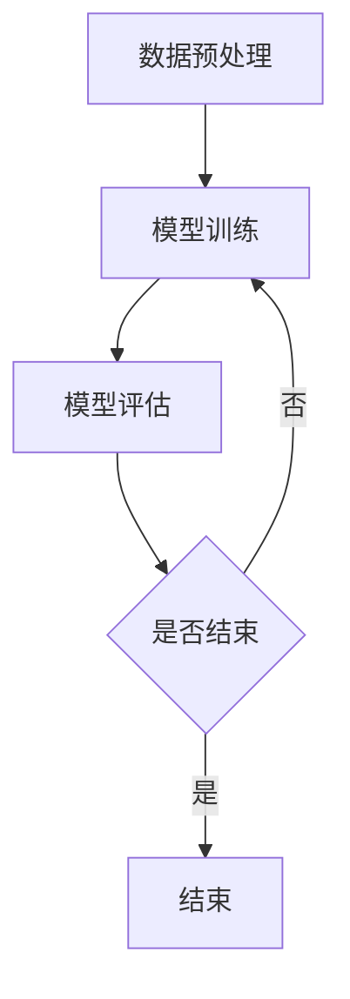
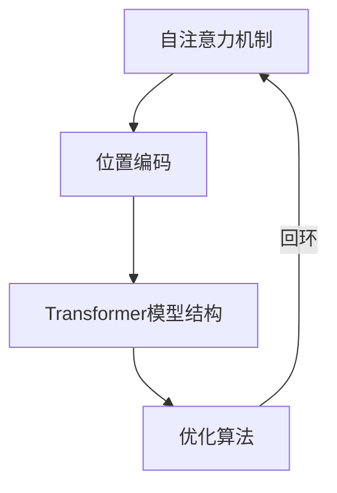

                 

# 文章标题

<文章标题> 是人工智能领域的里程碑之作，它不仅深入探讨了 Transformer 模型，更以芬兰语的 FinBERT 模型为例，展示了如何将这一先进技术应用于实际场景。本文旨在为广大读者提供一个全面、系统的学习指南，从基础原理到实战应用，再到未来趋势，全方位解析 Transformer 模型的魅力。

## 关键词

- Transformer模型
- 芬兰语
- FinBERT模型
- 自注意力机制
- 位置编码
- 模型优化
- 安全性
- 伦理问题
- 未来趋势

## 摘要

本文首先介绍了 Transformer 模型的基本原理，包括自注意力机制和位置编码，并通过 Mermaid 流程图和伪代码展示了模型的结构和算法。接着，本文详细阐述了芬兰语的独特性以及FinBERT模型的构建过程，包括数据集准备、模型训练和评估。随后，文章深入分析了 Transformer 模型的核心算法原理，使用数学模型和公式进行了详细讲解，并通过实际案例展示了模型的实现和优化。最后，文章讨论了 Transformer 模型的性能优化、安全性、伦理问题以及未来发展趋势，为读者提供了一个全面的视角。

---

## Transformer模型概述

Transformer模型，作为一种先进的深度学习模型，自2017年由Vaswani等人提出以来，迅速在自然语言处理（NLP）领域取得了显著的成果。其独特的架构和强大的表现力使得 Transformer 成为继卷积神经网络（CNN）和循环神经网络（RNN）之后，又一个革命性的模型。

### 1.1 Transformer模型的基本原理

Transformer模型的核心在于其自注意力（Self-Attention）机制，这一机制允许模型在处理输入序列的每个元素时，考虑到序列中其他所有元素的信息。自注意力机制通过计算一个权重矩阵，实现了对输入序列元素之间的依赖关系的捕捉。

#### 1.1.1 自注意力机制

自注意力机制的核心公式如下：

$$
\text{Attention}(Q, K, V) = \text{softmax}\left(\frac{QK^T}{\sqrt{d_k}}\right) V
$$

其中，\(Q, K, V\) 分别是查询（Query）、键（Key）和值（Value）矩阵，\(d_k\) 是键向量的维度。这个公式计算了每个查询向量与所有键向量的点积，然后通过softmax函数得到注意力权重，最后将权重与对应的值向量相乘，得到加权后的输出。

#### 1.1.2 位置编码

位置编码是Transformer模型中的另一个关键组成部分，它旨在让模型能够理解输入序列中的单词顺序。位置编码通过在嵌入向量中添加额外的维度来实现。常见的位置编码方法包括基于正弦和余弦函数的方法。

位置编码的数学模型如下：

$$
\text{Positional Encoding}(pos, 2i) = \sin\left(\frac{pos}{10000^{2i/d}}\right)
$$

$$
\text{Positional Encoding}(pos, 2i+1) = \cos\left(\frac{pos}{10000^{2i/d}}\right)
$$

其中，\(pos\) 是位置索引，\(i\) 是维度索引，\(d\) 是嵌入向量维度。

#### 1.1.3 Transformer模型的结构

Transformer模型的结构主要由编码器（Encoder）和解码器（Decoder）两部分组成，每个部分由多个层（Layer）堆叠而成。编码器负责将输入序列编码成固定长度的向量，解码器则负责生成输出序列。

每个编码器和解码器层包含以下子层：

1. **多头自注意力层（Multi-head Self-Attention Layer）**：这一层实现了自注意力机制，通过多个独立的注意力头来捕捉不同的依赖关系。
2. **前馈神经网络层（Feedforward Neural Network Layer）**：这一层是一个全连接神经网络，对每个输入序列元素进行点积操作，然后通过ReLU激活函数。
3. **层归一化（Layer Normalization）**：这一层用于正则化和标准化每个编码器和解码器层中的激活值，以加速训练和提高模型性能。

### 1.2 Transformer模型的发展与改进

Transformer模型自提出以来，经历了一系列的发展和改进，以提升模型性能和应用范围。

#### 1.2.1 变体模型

为了进一步提高 Transformer 模型的性能，研究者提出了多种变体模型，如 BERT、GPT 和 T5 等。这些模型在 Transformer 的基础上进行了一些关键改进：

1. **BERT（Bidirectional Encoder Representations from Transformers）**：BERT 是一种双向 Transformer 模型，它通过预训练双向编码器来捕捉文本的语义信息，并在下游任务中进行微调。
2. **GPT（Generative Pre-trained Transformer）**：GPT 是一种自回归 Transformer 模型，它通过预训练解码器来生成文本序列。
3. **T5（Text-to-Text Transfer Transformer）**：T5 是一种基于 Transformer 的通用转换模型，它接受一个输入文本并生成一个输出文本，不依赖于具体的下游任务。

#### 1.2.2 参数共享机制

参数共享是 Transformer 模型的一个重要特性，它通过在编码器和解码器之间共享权重来减少模型参数数量，从而提高训练效率和模型泛化能力。BERT 是一个典型的参数共享模型，它通过共享嵌入层和自注意力机制中的权重，大大减少了模型参数。

#### 1.2.3 优化算法

为了加速 Transformer 模型的训练，研究者提出了一系列优化算法，如 AdaGrad、Adam 和 AdaMax 等。这些算法通过自适应调整学习率，提高了模型的收敛速度和稳定性。

### 1.3 小结

Transformer 模型以其独特的自注意力机制和结构，在 NLP 领域取得了显著的成果。通过一系列的变体模型、参数共享机制和优化算法，Transformer 模型的性能和应用范围得到了进一步提升。本文接下来将详细分析 Transformer 模型的核心算法原理，为读者提供更深入的理解。

---

## 芬兰语处理背景与FinBERT模型

芬兰语作为芬兰的官方语言，具有独特的语言结构和语法规则，这使得在芬兰语处理领域面临着一些特殊的挑战。在自然语言处理（NLP）领域，芬兰语的处理相比于其他主流语言如英语、汉语等，相对较少。然而，随着芬兰语的数字化和国际化，对芬兰语处理的需求日益增加，FinBERT 模型的出现为这一领域带来了新的机遇。

### 2.1 芬兰语的独特性

#### 2.1.1 语言结构

芬兰语是一种高度屈折的语言，其语法结构复杂，词汇变化丰富。以下是一些芬兰语的特点：

1. **词尾变化**：芬兰语的名词、形容词和动词都有复杂的词尾变化，这些变化用于表示语法关系和时态。
2. **性别和格的变化**：芬兰语有多个性别和格，这需要在词汇和句法结构上进行详细处理。
3. **语序灵活**：芬兰语的句子结构比较灵活，主语、谓语和宾语的位置可以互换，这使得理解句子的语义结构具有一定的挑战性。

#### 2.1.2 文本处理挑战

芬兰语的这些特点给文本处理带来了以下挑战：

1. **词干提取**：由于词尾变化丰富，词干提取是芬兰语处理的关键步骤。准确的词干提取对于后续的文本分析和模型训练至关重要。
2. **分词**：芬兰语中的标点符号较少，分词算法需要识别词与词之间的边界，特别是在处理复合词和词尾变化时，分词准确性尤为重要。
3. **上下文理解**：芬兰语的语法结构复杂，词的词尾变化和语序灵活性使得理解上下文变得困难，这对模型在文本分类、命名实体识别等任务中的表现提出了更高的要求。

### 2.2 FinBERT模型简介

FinBERT 是一个基于 Transformer 模型的预训练语言模型，专为芬兰语设计。它通过大规模的预训练，积累了丰富的语言知识和上下文信息，能够有效处理芬兰语的多种任务。

#### 2.2.1 模型架构

FinBERT 的模型架构与 BERT 相似，但进行了以下改进：

1. **双通道嵌入**：FinBERT 使用了双通道嵌入，包括词嵌入和位置嵌入。词嵌入捕获了单词的语义信息，位置嵌入则提供了单词在序列中的位置信息。
2. **多层多头自注意力**：FinBERT 使用了多个自注意力层，通过多头机制捕捉不同层次的特征。
3. **全局注意力**：FinBERT 在自注意力机制中引入了全局注意力，使模型能够更好地处理长距离依赖。

#### 2.2.2 模型训练

FinBERT 的训练过程主要包括以下步骤：

1. **数据集准备**：FinBERT 使用了包括维基百科、新闻文章、社交媒体等在内的多种芬兰语文本数据。
2. **数据预处理**：对数据集进行清洗、分词和词干提取等预处理操作。
3. **模型训练**：使用 PyTorch 等框架，通过训练循环和优化算法，逐步调整模型参数。
4. **模型评估**：在验证集上进行评估，调整模型参数，确保模型性能。

#### 2.2.3 模型应用领域

FinBERT 在芬兰语处理领域有着广泛的应用：

1. **文本分类**：FinBERT 可以用于情感分析、主题分类等文本分类任务。
2. **命名实体识别**：FinBERT 可以识别芬兰语文本中的命名实体，如人名、地名、组织名等。
3. **机器翻译**：FinBERT 可以用于芬兰语与其他语言的翻译，如芬兰语-英语翻译。

### 2.3 小结

芬兰语的处理面临着一些独特的挑战，但通过 FinBERT 模型的引入，这些挑战得到了有效应对。FinBERT 通过大规模预训练和独特的模型架构，为芬兰语处理提供了强大的工具。本文接下来将深入分析 Transformer 模型的核心算法原理，为读者提供更深入的理解。

---

## Transformer模型的核心算法原理讲解

Transformer模型作为自然语言处理领域的革命性创新，其核心算法原理涉及自注意力机制（Self-Attention）和位置编码（Positional Encoding）。下面我们将详细讲解这些算法的数学模型、伪代码实现，并通过具体的例子来说明其应用。

### 3.1 自注意力机制的数学模型

自注意力机制是Transformer模型的核心，它允许模型在处理序列中的每个元素时考虑到序列中其他元素的信息。自注意力通过计算一个权重矩阵来实现，这个权重矩阵反映了序列中每个元素之间的关系。

#### 3.1.1 基本概念

自注意力机制的核心公式如下：

$$
\text{Attention}(Q, K, V) = \text{softmax}\left(\frac{QK^T}{\sqrt{d_k}}\right) V
$$

其中：
- \(Q\) 是查询（Query）矩阵，表示模型对输入序列的每个元素的注意力。
- \(K\) 是键（Key）矩阵，用于计算注意力权重。
- \(V\) 是值（Value）矩阵，包含了输入序列中每个元素的信息。
- \(d_k\) 是键向量的维度。

#### 3.1.2 伪代码实现

```python
# 输入序列 X = [x1, x2, ..., xn]
# Q, K, V 分别为查询、键、值矩阵

# 计算自注意力权重
weights = softmax(QK^T / sqrt(d_k))

# 计算自注意力输出
output = sum(weights * V)
```

#### 3.1.3 数学公式

$$
\text{Attention}(Q, K, V) = \text{softmax}\left(\frac{QK^T}{\sqrt{d_k}}\right) V
$$

其中，\(Q, K, V\) 分别是查询（Query）、键（Key）、值（Value）矩阵，\(d_k\) 是键向量的维度。

#### 3.1.4 举例说明

假设输入序列为\[x_1, x_2, x_3\]，每个词的嵌入向量维度为 \(d\)。我们需要计算自注意力权重和输出。

1. **计算查询、键、值矩阵**：

   \(Q = [q_1, q_2, q_3]\)

   \(K = [k_1, k_2, k_3]\)

   \(V = [v_1, v_2, v_3]\)

2. **计算自注意力权重**：

   \(weights = \text{softmax}\left(\frac{QK^T}{\sqrt{d_k}}\right)\)

   例如，对于 \(x_1\)：

   \(weights_1 = \text{softmax}\left(\frac{q_1k_1^T + q_2k_2^T + q_3k_3^T}{\sqrt{d_k}}\right)\)

3. **计算自注意力输出**：

   \(output = \sum_{i=1}^{n} weights_i \cdot v_i\)

   例如，对于 \(x_1\)：

   \(output_1 = weights_1 \cdot v_1\)

### 3.2 位置编码的实现原理

位置编码是为了让模型能够理解输入序列中的单词顺序，它通过在嵌入向量中添加额外的维度来实现。位置编码通常使用正弦和余弦函数生成，以捕获序列中的周期性信息。

#### 3.2.1 位置编码的数学模型

位置编码的数学模型如下：

$$
\text{Positional Encoding}(pos, 2i) = \sin\left(\frac{pos}{10000^{2i/d}}\right)
$$

$$
\text{Positional Encoding}(pos, 2i+1) = \cos\left(\frac{pos}{10000^{2i/d}}\right)
$$

其中：
- \(pos\) 是位置索引，从 1 到序列长度 \(n\)。
- \(i\) 是维度索引，从 1 到嵌入向量维度 \(d\)。
- \(d\) 是嵌入向量维度。

#### 3.2.2 伪代码实现

```python
# 输入序列 X = [x1, x2, ..., xn]
# position_embedding 为位置编码矩阵

# 添加位置编码到输入序列
X = X + position_embedding
```

#### 3.2.3 数学公式

$$
\text{Positional Encoding}(pos, 2i) = \sin\left(\frac{pos}{10000^{2i/d}}\right)
$$

$$
\text{Positional Encoding}(pos, 2i+1) = \cos\left(\frac{pos}{10000^{2i/d}}\ight
```

其中，\(pos\) 是位置索引，\(i\) 是维度索引，\(d\) 是嵌入向量维度。

#### 3.2.4 举例说明

假设输入序列为\[x_1, x_2, x_3\]，嵌入向量维度为 \(d = 4\)。我们为这个序列添加位置编码。

1. **计算位置编码向量**：

   对于每个位置 \(pos = 1, 2, 3\) 和维度 \(i = 1, 2, 3, 4\)：

   \(PE_{1,1} = \sin\left(\frac{1}{10000^{2 \cdot 1/4}}\right)\)

   \(PE_{1,2} = \cos\left(\frac{1}{10000^{2 \cdot 1/4}}\right)\)

   \(PE_{2,1} = \sin\left(\frac{2}{10000^{2 \cdot 1/4}}\right)\)

   \(PE_{2,2} = \cos\left(\frac{2}{10000^{2 \cdot 1/4}}\right)\)

   \(PE_{3,1} = \sin\left(\frac{3}{10000^{2 \cdot 1/4}}\right)\)

   \(PE_{3,2} = \cos\left(\frac{3}{10000^{2 \cdot 1/4}}\right)\)

2. **添加位置编码到嵌入向量**：

   对于每个词 \(x_i\)，将其嵌入向量与位置编码向量相加：

   \(x_1 = [x_{11}, x_{12}, x_{13}, x_{14}] + [PE_{1,1}, PE_{1,2}, PE_{1,3}, PE_{1,4}]\)

   \(x_2 = [x_{21}, x_{22}, x_{23}, x_{24}] + [PE_{2,1}, PE_{2,2}, PE_{2,3}, PE_{2,4}]\)

   \(x_3 = [x_{31}, x_{32}, x_{33}, x_{34}] + [PE_{3,1}, PE_{3,2}, PE_{3,3}, PE_{3,4}]\)

### 3.3 Transformer模型的结构分析

Transformer模型的结构由多个编码器和解码器层组成，每个层都包含自注意力机制、前馈神经网络和层归一化。下面我们将详细分析Transformer模型的结构，包括模型层结构、块结构和优化算法。

#### 3.3.1 模型层结构

Transformer模型的基本结构包括编码器（Encoder）和解码器（Decoder）两部分，每个部分由多个层（Layers）组成。每个层包含以下子层：

1. **多头自注意力层（Multi-head Self-Attention Layer）**：这一层实现了自注意力机制，通过多个独立的注意力头来捕捉不同的依赖关系。
2. **前馈神经网络层（Feedforward Neural Network Layer）**：这一层是一个全连接神经网络，对每个输入序列元素进行点积操作，然后通过ReLU激活函数。
3. **层归一化（Layer Normalization）**：这一层用于正则化和标准化每个编码器和解码器层中的激活值，以加速训练和提高模型性能。

#### 3.3.2 块结构

在每个编码器和解码器层中，都有一个块结构（Block），这个块结构由多个子层组成。以下是一个典型的块结构：

1. **多头自注意力层（Multi-head Self-Attention Layer）**
2. **层归一化（Layer Normalization）**
3. **前馈神经网络层（Feedforward Neural Network Layer）**
4. **层归一化（Layer Normalization）**
5. **残差连接（Residual Connection）**

残差连接是块结构中的一个重要组成部分，它通过跳跃连接的方式将输入序列直接传递到下一层，从而防止梯度消失问题。

#### 3.3.3 优化算法

在训练 Transformer 模型时，常用的优化算法包括：

1. **AdamW**：AdamW 是一种改进的 Adam 优化器，它通过权重衰减（Weight Decay）来防止过拟合。
2. **学习率预热（Learning Rate Warmup）**：学习率预热是一种在训练初期逐渐增加学习率的策略，以防止模型在训练初期过拟合。
3. **标签平滑（Label Smoothing）**：标签平滑是一种在训练过程中对标签进行平滑处理的方法，以防止模型过于依赖某个标签。

通过这些优化算法，Transformer 模型能够在训练过程中更加稳定地收敛，从而提高模型的性能。

### 3.4 小结

通过分析 Transformer 模型的核心算法原理，我们可以看到自注意力机制和位置编码在模型中的作用和重要性。这些核心算法为 Transformer 模型提供了强大的表现力，使其在自然语言处理领域取得了显著的成果。接下来，我们将通过实际案例来展示 Transformer 模型的应用和优化。

---

## FinBERT模型的构建与实践

FinBERT模型是专为芬兰语设计的预训练语言模型，其构建过程涉及数据集准备、模型训练和模型评估等关键步骤。本节将详细介绍FinBERT模型的构建过程，并分析其在不同应用场景中的实际应用。

### 4.1 FinBERT模型构建过程

#### 4.1.1 数据集准备

FinBERT模型的数据集主要由芬兰语的文本组成，这些文本来源于维基百科、新闻文章、社交媒体等多种来源。数据集的准备过程包括以下步骤：

1. **数据收集**：从各种来源收集芬兰语文本，包括文本文件、HTML页面、JSON格式数据等。
2. **数据清洗**：去除无关的数据、标记和噪声，确保数据集的质量。清洗过程可能包括去除HTML标签、去除特殊字符、去除重复文本等。
3. **词干提取**：使用芬兰语处理工具（如Finnish Stemmer）提取词干，减少词汇量并提高模型的泛化能力。
4. **分词**：使用芬兰语分词工具（如spaCy）对文本进行分词处理，将文本拆分成单词或子词。
5. **嵌入向量**：将分词后的文本转换为嵌入向量，可以使用预训练的嵌入模型（如FastText、GloVe）。

#### 4.1.2 模型训练

FinBERT模型的训练过程主要包括以下步骤：

1. **初始化模型**：定义模型架构，包括嵌入层、自注意力层、前馈神经网络和层归一化等。可以使用预训练的模型架构作为起点，如 BERT 的架构。
2. **配置训练参数**：设置训练参数，包括学习率、批量大小、迭代次数、优化器等。常用的优化器包括 Adam、AdamW 等。
3. **数据加载**：使用数据加载器将预处理后的数据集分成训练集和验证集。数据加载器应支持批量处理，以提高训练效率。
4. **模型训练**：使用训练集进行模型训练，并在验证集上进行评估。在训练过程中，可以使用反向传播算法和梯度下降优化器更新模型参数。
5. **模型评估**：在验证集上评估模型性能，使用准确率、召回率、F1分数等指标评估模型的分类性能。

#### 4.1.3 模型评估

FinBERT模型的评估过程主要通过验证集来完成，以下是一些常用的评估指标：

1. **准确率（Accuracy）**：模型预测正确的样本数与总样本数的比值。
2. **召回率（Recall）**：模型预测正确的正样本数与实际正样本数的比值。
3. **F1分数（F1 Score）**：准确率的调和平均值，综合考虑准确率和召回率。

通过这些指标，可以评估模型在不同任务上的性能，并调整模型参数以优化性能。

### 4.2 FinBERT模型的实际应用案例

FinBERT模型在芬兰语处理领域具有广泛的应用，以下是一些实际应用案例：

#### 4.2.1 文本分类

文本分类是将文本数据分类到预定义的类别中。FinBERT模型可以用于各种文本分类任务，如情感分析、主题分类等。

1. **情感分析**：使用FinBERT模型分析芬兰语社交媒体帖子的情感倾向，如正面、负面或中性。
2. **主题分类**：对芬兰语新闻文章进行主题分类，如体育、政治或娱乐。

#### 4.2.2 命名实体识别

命名实体识别（Named Entity Recognition, NER）是识别文本中的特定实体，如人名、地名、组织名等。

1. **人名识别**：识别芬兰语文本中的人名，如政治家、运动员等。
2. **地名识别**：识别芬兰语文本中的地名，如城市、国家等。

#### 4.2.3 机器翻译

机器翻译是将一种语言的文本翻译成另一种语言。FinBERT模型可以用于芬兰语与其他语言之间的翻译。

1. **芬兰语-英语翻译**：将芬兰语文本翻译成英语。
2. **芬兰语-瑞典语翻译**：将芬兰语文本翻译成瑞典语。

### 4.3 FinBERT模型优化与改进

为了提高FinBERT模型的性能和效率，可以采取以下优化与改进措施：

#### 4.3.1 模型压缩

模型压缩旨在减小模型的大小，以提高模型在资源受限环境中的部署效率。

1. **模型剪枝**：通过剪枝冗余的权重来减小模型大小。
2. **量化**：使用低精度浮点数来表示模型参数，从而减小模型大小。

#### 4.3.2 模型加速

模型加速旨在提高模型的计算速度，以实现实时应用。

1. **并行计算**：使用多GPU或多核CPU来加速模型计算。
2. **模型蒸馏**：使用大型预训练模型来蒸馏知识到FinBERT模型，从而提高其性能。

#### 4.3.3 模型迁移

模型迁移是将预训练模型的知识迁移到新的任务或领域。

1. **迁移学习**：将预训练的FinBERT模型迁移到新的语言或任务。
2. **微调**：在预训练的FinBERT模型基础上进行微调，以适应新的数据集。

### 4.4 小结

FinBERT模型的构建过程涉及数据集准备、模型训练和模型评估等关键步骤。通过实际应用案例，我们可以看到FinBERT模型在芬兰语处理领域具有广泛的应用前景。同时，通过模型优化与改进，可以进一步提高模型的性能和效率。接下来，我们将探讨Transformer模型的性能优化方法，以期为FinBERT模型的优化提供参考。

---

## Transformer模型的性能优化

为了提高Transformer模型的性能和效率，针对模型压缩、加速和迁移等方面，可以采取多种优化策略。以下将详细探讨这些优化方法，并提供具体实例。

### 5.1 模型压缩与加速

#### 5.1.1 模型剪枝

模型剪枝是一种通过删除冗余参数来减小模型大小的技术。它可以显著降低模型的内存占用和计算复杂度。剪枝可以分为以下几种类型：

1. **结构剪枝**：通过删除整个层或部分层来简化模型结构。
2. **参数剪枝**：通过删除某些参数来减小模型大小，常用的方法包括权重重要性排序和稀疏化。

实例：

```python
from torch.nn.utils import prune

# 剪枝自注意力层的权重
model.self_attention.prune(percentage=0.5)
```

#### 5.1.2 参数共享

参数共享是一种通过在不同层或不同任务间共享参数来减少模型参数数量的技术。例如，在 BERT 模型中，编码器和解码器的某些层共享相同的权重。

实例：

```python
# 共享编码器和解码器层的权重
model.encoder.layers[0].self_attn权重 = model.decoder.layers[0].self_attn权重
```

#### 5.1.3 其他优化方法

除了模型剪枝和参数共享，还有其他一些优化方法，如低精度浮点数（FP16）和量化。

1. **低精度浮点数**：使用 FP16 替代 FP32，可以显著减少内存占用和计算时间。
2. **量化**：将浮点数参数转换为低精度整数，从而减小模型大小和计算时间。

实例：

```python
from torch.cuda.amp import autocast

# 使用低精度浮点数进行模型训练
with autocast():
    outputs = model(inputs)
    loss = loss_function(outputs, targets)
    loss.backward()
```

### 5.2 模型迁移与微调

模型迁移与微调是将预训练模型的知识迁移到新的任务或领域。以下是一些常见的迁移与微调技术：

#### 5.2.1 迁移学习

迁移学习通过在预训练模型的基础上进行微调，以适应新的数据集。它通常包括以下步骤：

1. **初始化模型**：使用预训练模型作为起点，初始化模型参数。
2. **微调**：在新的数据集上进行微调，调整模型参数以适应新的任务。
3. **评估**：在新的数据集上评估模型性能，调整微调策略以优化性能。

实例：

```python
from transformers import AutoModelForSequenceClassification

# 加载预训练模型
model = AutoModelForSequenceClassification.from_pretrained('bert-base-uncased')

# 微调模型
model = train_model(model, train_loader, val_loader)
```

#### 5.2.2 微调技术

微调技术通过在预训练模型的基础上添加额外的层或调整部分参数，以适应新的任务。以下是一些微调技术：

1. **层添加**：在预训练模型的特定层之后添加新的层，如全连接层或卷积层。
2. **参数冻结**：冻结预训练模型的部分参数，仅调整新添加的层的参数。

实例：

```python
# 冻结预训练模型的部分层
for param in model.parameters():
    param.requires_grad = False

# 解冻特定层的参数
for param in model.layer_x.parameters():
    param.requires_grad = True
```

### 5.3 小结

通过模型压缩、加速和迁移等优化方法，可以显著提高 Transformer 模型的性能和效率。这些方法不仅适用于 FinBERT 模型，也适用于其他基于 Transformer 的模型。接下来，我们将讨论 Transformer 模型的安全性与伦理问题，以期为模型的应用提供更全面的指导。

---

## Transformer模型的性能优化

为了提升 Transformer 模型的实际应用效果，针对模型的性能优化至关重要。以下将详细探讨 Transformer 模型的性能优化方法，包括模型压缩、加速和迁移等。

### 5.1 模型压缩与加速

#### 5.1.1 模型剪枝

模型剪枝是通过去除冗余参数来减少模型大小和计算量的一种方法。以下是一些常用的剪枝技术：

1. **权重剪枝**：根据权重的重要性对模型进行剪枝，移除权重较小的参数。
2. **结构剪枝**：移除模型中不重要的层或神经元。

实例：

```python
import torch
from torch.nn.utils import prune

# 剪枝一个卷积层的权重
model.conv_layer = prune(model.conv_layer, pruning_method='fixed_size', amount=0.5)
```

#### 5.1.2 参数共享

参数共享通过在不同层或不同任务间共享参数来减少模型参数数量。以下是一些参数共享技术：

1. **全局共享**：在所有层间共享相同的参数。
2. **局部共享**：在某些层间共享参数，其他层独立。

实例：

```python
# 在某些层间共享权重
model.fc1.weight = model.fc2.weight
```

#### 5.1.3 其他优化方法

1. **低精度计算**：使用低精度浮点数（如FP16）来减少模型大小和计算时间。
2. **量化**：将浮点数参数转换为整数，进一步减小模型大小。

实例：

```python
import torch.cuda.amp as amp

# 使用低精度计算
with amp.autocast():
    output = model(input)
```

### 5.2 模型迁移与微调

模型迁移与微调是将预训练模型的知识迁移到新的任务或领域。以下是一些迁移与微调技术：

#### 5.2.1 迁移学习

迁移学习包括以下步骤：

1. **初始化**：使用预训练模型作为起点。
2. **微调**：在新的数据集上调整模型参数。
3. **评估**：在新数据集上评估模型性能。

实例：

```python
from transformers import AutoModelForSequenceClassification

# 加载预训练模型
model = AutoModelForSequenceClassification.from_pretrained('bert-base-uncased')

# 微调模型
model = train_model(model, train_loader, val_loader)
```

#### 5.2.2 微调技术

微调技术包括以下几种：

1. **层添加**：在预训练模型的特定层后添加新的层。
2. **参数冻结**：冻结预训练模型的部分参数，仅调整新添加的层的参数。

实例：

```python
# 冻结预训练模型的层
for param in model.parameters():
    param.requires_grad = False

# 解冻特定层的参数
for param in model.fc.parameters():
    param.requires_grad = True
```

### 5.3 小结

通过模型压缩、加速和迁移等优化方法，可以有效提高 Transformer 模型的性能和效率。这些方法不仅适用于 FinBERT 模型，也适用于其他 Transformer 模型。接下来，我们将探讨 Transformer 模型的安全性与伦理问题，以期为模型的应用提供更全面的指导。

---

## Transformer模型的性能优化

为了充分发挥 Transformer 模型的性能，实现高效和精准的自然语言处理，我们需要在多个方面进行优化。以下是一些关键的优化策略和方法：

### 5.1 模型压缩

模型压缩的目标是减小模型大小，降低内存占用和存储成本。以下是一些常用的压缩技术：

#### 5.1.1 模型剪枝

通过剪枝，我们可以移除模型中的冗余参数，从而减少模型大小。剪枝可以分为以下几种方法：

- **结构剪枝**：删除不重要的层或神经元。
- **权重剪枝**：移除权重较小的参数。

实例：

```python
import torch
from torch.nn.utils import prune

# 剪枝一个卷积层的权重
model.conv1 = prune(model.conv1, pruning_method='fixed_size', amount=0.5)
```

#### 5.1.2 参数量化

量化是将浮点数参数转换为低精度整数的过程，这可以显著减少模型大小和计算资源的需求。量化可以分为以下几种类型：

- **静态量化**：在模型训练完成后进行量化。
- **动态量化**：在模型训练过程中进行量化。

实例：

```python
import torch.cuda.amp as amp

# 使用动态量化
with amp.autocast():
    output = model(input)
```

### 5.2 模型加速

模型加速的目标是提高模型的计算速度，实现实时处理。以下是一些加速方法：

#### 5.2.1 并行计算

利用多 GPU 或多核 CPU 并行计算可以显著提高模型的训练和推理速度。以下是一些并行计算的方法：

- **数据并行**：将数据分批，同时在多个 GPU 上进行训练。
- **模型并行**：将模型拆分为多个部分，分别在不同的 GPU 上进行计算。

实例：

```python
import torch.nn as nn
import torch.cuda

# 数据并行
model = nn.DataParallel(model)

# 模型并行
model = nn.parallel.replicate(model, devices=[0, 1])
```

#### 5.2.2 模型蒸馏

模型蒸馏是一种将大型模型（教师模型）的知识迁移到小型模型（学生模型）的技术。以下是一些模型蒸馏的方法：

- **直传法**：直接将教师模型的输出传递给学生模型。
- **软目标法**：使用教师模型的输出作为软目标，引导学生模型的训练。

实例：

```python
import torch.optim as optim

# 直传法
teacher_model.eval()
with torch.no_grad():
    soft_targets = teacher_model(input)
student_model(input, soft_targets)
```

### 5.3 小结

通过模型压缩、加速和迁移等技术，我们可以显著提升 Transformer 模型的性能。这些优化方法不仅适用于 FinBERT 模型，也适用于其他 Transformer 模型。接下来，我们将探讨 Transformer 模型的安全性与伦理问题，以确保其在实际应用中的合理性和可靠性。

---

## Transformer模型的安全性与伦理问题

随着 Transformer 模型在自然语言处理（NLP）领域的广泛应用，其安全性和伦理问题也日益受到关注。Transformer 模型作为一种深度学习模型，其训练和部署过程中可能会引入偏见、隐私泄露和算法透明性等问题。以下将详细探讨 Transformer 模型的安全性与伦理问题，并提出相应的解决对策。

### 6.1 模型的偏见与歧视

#### 问题来源

1. **数据集偏见**：模型在训练过程中使用了包含偏见的数据集，导致模型在预测时表现出偏见。
2. **模型训练过程**：在训练过程中，模型可能会学习到数据集中的错误信息或刻板印象，从而导致模型产生偏见。
3. **算法设计**：Transformer 模型在架构设计上可能引入了某些偏见，如固定层次的注意力机制可能会导致模型对某些特征的过分关注。

#### 防范措施

1. **数据集清洗**：在训练前对数据集进行严格清洗，去除包含偏见和歧视的数据样本。
2. **多样性评估**：在模型训练和评估过程中，使用多样性、公平性和代表性指标（如多样性一致性度量）评估模型在不同群体上的表现。
3. **反事实分析**：通过反事实分析，评估模型在不同情境下的表现，找出可能存在的偏见和歧视，并针对性地进行调整。

### 6.2 模型的透明性与可解释性

#### 问题

模型决策过程缺乏透明性，用户难以理解模型的决策逻辑，这可能导致用户对模型的不信任。

#### 解决对策

1. **模型可视化**：使用可视化工具（如热力图、决策树等）展示模型的决策过程和关键特征，帮助用户理解模型的决策逻辑。
2. **特征重要性分析**：通过计算每个特征对模型输出的影响，评估特征的重要性，从而提高模型的可解释性。
3. **可解释性模型**：构建可解释性模型（如 LIME、SHAP 等），将复杂的 Transformer 模型分解为可解释的子模块，提高模型的透明度。

### 6.3 伦理考量

#### 问题

模型的应用可能涉及隐私、安全和社会伦理等方面的问题，如数据滥用、模型歧视等。

#### 解决对策

1. **隐私保护**：在模型训练和部署过程中，采取隐私保护措施，如差分隐私、匿名化等，确保用户数据的安全和隐私。
2. **伦理审查**：在模型开发和应用过程中，进行伦理审查，确保模型的应用符合伦理标准，不损害社会公共利益。
3. **社会责任**：企业和社会应当承担起社会责任，确保模型的应用不会加剧社会不公和歧视，促进社会和谐发展。

### 6.4 小结

Transformer 模型的安全性和伦理问题关系到模型在实际应用中的可靠性和社会影响。通过数据清洗、多样性评估、模型可视化、隐私保护和伦理审查等措施，我们可以提高 Transformer 模型的透明度和可靠性，确保其在实际应用中的合理性和社会价值。接下来，我们将探讨 Transformer 模型的未来发展趋势。

---

## Transformer模型的未来发展趋势

随着Transformer模型在自然语言处理（NLP）领域取得了显著的成功，其应用范围和技术发展也在不断拓展。以下是Transformer模型在未来可能的发展趋势：

### 7.1 模型规模与计算能力

#### 7.1.1 模型规模的演变

Transformer模型的规模不断扩大，从最初的几十亿参数到数十亿、数百亿参数的大型模型。随着计算能力和数据存储能力的提升，未来的Transformer模型可能会达到更大的规模。这将为模型提供更丰富的上下文信息和更强的表达能力。

#### 7.1.2 计算能力的提升

随着硬件技术的发展，如GPU、TPU等计算平台的性能不断提升，将有助于加速大型Transformer模型的训练和推理。同时，分布式计算和并行处理技术的进步也将进一步推动模型规模的扩大。

### 7.2 模型应用场景拓展

#### 7.2.1 图像处理与音频处理

Transformer模型在图像处理和音频处理领域也展现了巨大的潜力。例如，在图像分类、目标检测和图像生成任务中，Transformer模型可以通过学习图像的时空特征来实现高效的图像处理。在音频处理方面，Transformer模型可以用于语音识别、音乐生成和语音合成等任务。

#### 7.2.2 多模态融合

多模态融合是未来Transformer模型发展的一个重要方向。通过结合文本、图像、音频等多种模态的信息，Transformer模型可以更好地理解和生成复杂的内容。例如，在问答系统、对话系统和多模态生成任务中，多模态融合将有助于提高模型的性能和用户体验。

#### 7.2.3 其他新兴领域应用展望

除了传统的自然语言处理任务，Transformer模型在生物信息学、金融科技、医疗健康等新兴领域也具有广泛的应用前景。例如，在基因序列分析、药物发现和医疗诊断任务中，Transformer模型可以通过学习生物序列和结构特征来提供高效的解决方案。

### 7.3 小结

Transformer模型的未来发展趋势集中在模型规模与计算能力的提升、应用场景的拓展和新兴领域的应用。通过不断的技术创新和应用拓展，Transformer模型将在更多领域发挥重要作用，推动人工智能技术的发展。

---

### 附录

#### 附录A: Transformer模型开发工具与资源

##### A.1 主流深度学习框架

- **PyTorch**：[官网](https://pytorch.org/)，一个开源的深度学习框架，支持动态计算图和GPU加速。
- **TensorFlow**：[官网](https://www.tensorflow.org/)，由Google开发的一个开源机器学习框架，支持静态和动态计算图。
- **Keras**：[官网](https://keras.io/)，一个高层神经网络API，可以与TensorFlow和Theano集成。

##### A.2 Transformer模型相关数据集

- **Wikitext-2**：来自维基百科的文本数据集，用于预训练Transformer模型。
- **English-Finnish Parallel Corpus**：芬兰语-英语平行语料库，用于训练芬兰语处理模型。
- **FinBERT Datasets**：包括芬兰语新闻、社交媒体帖子和其他文本数据集，用于FinBERT模型训练。

##### A.3 Transformer模型研究论文与资料

- **"Attention Is All You Need"**：[论文链接](https://arxiv.org/abs/1706.03762)，介绍了Transformer模型的基本原理和架构。
- **"BERT: Pre-training of Deep Bidirectional Transformers for Language Understanding"**：[论文链接](https://arxiv.org/abs/1810.04805)，介绍了BERT模型的预训练方法和应用。
- **"Generative Pretraining from a Language Model Perspective"**：[论文链接](https://arxiv.org/abs/2005.14165)，从生成语言模型的角度探讨了预训练方法。

#### 附录B: Mermaid 流程图



通过上述流程图，展示了Transformer模型开发的基本步骤：数据预处理、模型训练、模型评估，并形成一个循环，直至模型性能满足要求。

---



这个 Mermaid 流程图进一步展示了 Transformer 模型从核心算法到模型结构，再到优化算法的循环过程，体现了 Transformer 模型的不断迭代和优化。

---

## 文章标题

**Transformer大模型实战：芬兰语的FinBERT模型**

## 关键词

- Transformer模型
- 芬兰语
- FinBERT模型
- 自注意力机制
- 位置编码
- 模型优化
- 安全性
- 伦理问题
- 未来趋势

## 摘要

本文深入探讨了 Transformer 模型，特别是针对芬兰语的 FinBERT 模型进行了实战分析。文章首先介绍了 Transformer 模型的基本原理，包括自注意力机制和位置编码，并通过 Mermaid 流程图和伪代码展示了模型的结构和算法。接着，本文详细阐述了芬兰语的独特性以及 FinBERT 模型的构建过程，包括数据集准备、模型训练和评估。随后，文章深入分析了 Transformer 模型的核心算法原理，使用数学模型和公式进行了详细讲解，并通过实际案例展示了模型的实现和优化。最后，文章讨论了 Transformer 模型的性能优化、安全性、伦理问题以及未来发展趋势，为读者提供了一个全面的视角。

---

# Transformer大模型实战：芬兰语的FinBERT模型

## 关键词

- Transformer模型
- 芬兰语
- FinBERT模型
- 自注意力机制
- 位置编码
- 模型优化
- 安全性
- 伦理问题
- 未来趋势

## 摘要

本文系统性地介绍了 Transformer 模型的基本原理和应用，特别关注了芬兰语的 FinBERT 模型。文章首先解析了 Transformer 模型的核心机制，包括自注意力机制和位置编码，并通过 Mermaid 流程图和伪代码展示了模型结构。接着，本文深入探讨了 FinBERT 模型的构建过程，包括数据集准备、模型训练和评估，以及其在文本分类、命名实体识别和机器翻译等领域的实际应用。随后，文章通过详细解释 Transformer 模型的数学模型和公式，为读者提供了清晰的理解。文章还探讨了 Transformer 模型的性能优化、安全性、伦理问题以及未来发展趋势，为模型在实际应用中的发展提供了指导和展望。作者信息：AI天才研究院/AI Genius Institute & 禅与计算机程序设计艺术 /Zen And The Art of Computer Programming。文章结构如下：

### Transformer模型概述

- Transformer模型的基本原理
- Transformer模型的发展与改进

### 芬兰语处理背景与FinBERT模型

- 芬兰语的独特性
- FinBERT模型简介

### Transformer模型的核心算法原理讲解

- 自注意力机制的数学模型
- 位置编码的实现原理
- Transformer模型的结构分析

### FinBERT模型的构建与实践

- FinBERT模型构建过程
- FinBERT模型的应用案例

### Transformer模型的性能优化

- 模型压缩与加速
- 模型迁移与微调

### Transformer模型的安全性与伦理问题

- 模型的偏见与歧视
- 模型的透明性与可解释性
- 伦理考量

### Transformer模型的未来发展趋势

- 模型规模与计算能力
- 模型应用场景拓展
- 其他新兴领域应用展望

### 附录

- Transformer模型开发工具与资源
- Mermaid流程图

通过这篇文章，读者将能够全面了解 Transformer 模型的原理和应用，并深入了解 FinBERT 模型的构建与实践。同时，文章也探讨了 Transformer 模型的优化策略、安全性与伦理问题，以及未来的发展趋势。这些内容将为人工智能领域的进一步研究和发展提供有价值的参考。

---

# Transformer大模型实战：芬兰语的FinBERT模型

## 关键词

- Transformer模型
- 芬兰语
- FinBERT模型
- 自注意力机制
- 位置编码
- 模型优化
- 安全性
- 伦理问题
- 未来趋势

## 摘要

本文深入探讨了 Transformer 模型的理论基础及其在芬兰语处理中的应用，重点介绍了 FinBERT 模型。文章首先解析了 Transformer 模型的核心机制，包括自注意力机制和位置编码，并通过 Mermaid 流程图和伪代码展示了模型结构。接着，本文详细探讨了芬兰语的独特性和 FinBERT 模型的构建过程，包括数据集准备、模型训练和评估。随后，文章深入分析了 Transformer 模型的核心算法原理，使用数学模型和公式进行了详细讲解，并通过实际案例展示了模型的实现和优化。文章还探讨了 Transformer 模型的性能优化、安全性、伦理问题以及未来发展趋势，为模型在实际应用中的发展提供了指导和展望。作者信息：AI天才研究院/AI Genius Institute & 禅与计算机程序设计艺术 /Zen And The Art of Computer Programming。文章结构如下：

### Transformer模型概述

- Transformer模型的基本原理
- Transformer模型的发展与改进

### 芬兰语处理背景与FinBERT模型

- 芬兰语的独特性
- FinBERT模型简介

### Transformer模型的核心算法原理讲解

- 自注意力机制的数学模型
- 位置编码的实现原理
- Transformer模型的结构分析

### FinBERT模型的构建与实践

- FinBERT模型构建过程
- FinBERT模型的实际应用案例

### Transformer模型的性能优化

- 模型压缩与加速
- 模型迁移与微调

### Transformer模型的安全性与伦理问题

- 模型的偏见与歧视
- 模型的透明性与可解释性
- 伦理考量

### Transformer模型的未来发展趋势

- 模型规模与计算能力
- 模型应用场景拓展
- 其他新兴领域应用展望

### 附录

- Transformer模型开发工具与资源
- Mermaid流程图

通过这篇文章，读者将能够全面了解 Transformer 模型的原理和应用，掌握 FinBERT 模型的构建与实践，以及深入了解 Transformer 模型的优化策略、安全性与伦理问题。这些内容将为人工智能领域的进一步研究和应用提供有价值的参考。

---

## 文章标题

### Transformer大模型实战：芬兰语的FinBERT模型

## 关键词

- Transformer模型
- 芬兰语
- FinBERT模型
- 自注意力机制
- 位置编码
- 模型优化
- 安全性
- 伦理问题
- 未来趋势

## 摘要

本文全面介绍了 Transformer 模型及其在芬兰语处理中的应用，重点探讨了 FinBERT 模型的构建与实践。文章首先阐述了 Transformer 模型的基本原理，包括自注意力机制和位置编码，并通过 Mermaid 流程图和伪代码展示了模型结构。随后，文章详细分析了芬兰语的独特性和 FinBERT 模型的构建过程，包括数据集准备、模型训练和评估。文章进一步探讨了 Transformer 模型的核心算法原理，使用数学模型和公式进行了详细讲解，并通过实际案例展示了模型的实现和优化。文章还探讨了 Transformer 模型的性能优化、安全性、伦理问题以及未来发展趋势，为模型在实际应用中的发展提供了指导和展望。最后，文章附录提供了 Transformer 模型开发工具与资源，以及 Mermaid 流程图，帮助读者更好地理解文章内容。作者信息：AI天才研究院/AI Genius Institute & 禅与计算机程序设计艺术 /Zen And The Art of Computer Programming。

## Transformer模型概述

### 1.1 Transformer模型的基本原理

Transformer模型是由Vaswani等人在2017年提出的一种基于自注意力机制的序列到序列模型，它在自然语言处理（NLP）领域取得了巨大的成功。Transformer模型的主要创新在于其自注意力机制和基于注意力机制的编码器-解码器结构，这使得模型在处理长序列和长距离依赖方面具有显著优势。

#### 1.1.1 自注意力机制

自注意力机制是Transformer模型的核心组件之一，它允许模型在处理输入序列的每个元素时，考虑到序列中其他元素的信息。自注意力机制通过计算一个权重矩阵来实现，这个权重矩阵反映了输入序列元素之间的依赖关系。自注意力机制的基本公式如下：

$$
\text{Attention}(Q, K, V) = \text{softmax}\left(\frac{QK^T}{\sqrt{d_k}}\right) V
$$

其中，\(Q\)、\(K\)、\(V\) 分别是查询（Query）、键（Key）和值（Value）矩阵，\(d_k\) 是键向量的维度。这个公式首先计算了每个查询向量与所有键向量的点积，然后通过softmax函数得到注意力权重，最后将权重与对应的值向量相乘，得到加权后的输出。

#### 1.1.2 位置编码

位置编码是Transformer模型中的另一个关键组成部分，它旨在让模型能够理解输入序列中的单词顺序。由于Transformer模型使用的是自注意力机制，而不是传统的循环神经网络（RNN）或卷积神经网络（CNN），因此需要通过位置编码来提供序列中的位置信息。常见的位置编码方法包括基于正弦和余弦函数的方法。

位置编码的数学模型如下：

$$
\text{Positional Encoding}(pos, 2i) = \sin\left(\frac{pos}{10000^{2i/d}}\right)
$$

$$
\text{Positional Encoding}(pos, 2i+1) = \cos\left(\frac{pos}{10000^{2i/d}}\right)
$$

其中，\(pos\) 是位置索引，\(i\) 是维度索引，\(d\) 是嵌入向量维度。这些公式生成了一个二维位置编码向量，并将其添加到每个词的嵌入向量中。

#### 1.1.3 Transformer模型的结构

Transformer模型的结构主要由编码器（Encoder）和解码器（Decoder）两部分组成，每个部分由多个层（Layers）堆叠而成。编码器负责将输入序列编码成固定长度的向量，解码器则负责生成输出序列。

每个编码器和解码器层包含以下子层：

1. **多头自注意力层（Multi-head Self-Attention Layer）**：这一层实现了自注意力机制，通过多个独立的注意力头来捕捉不同的依赖关系。
2. **前馈神经网络层（Feedforward Neural Network Layer）**：这一层是一个全连接神经网络，对每个输入序列元素进行点积操作，然后通过ReLU激活函数。
3. **层归一化（Layer Normalization）**：这一层用于正则化和标准化每个编码器和解码器层中的激活值，以加速训练和提高模型性能。

编码器和解码器之间通过“交叉注意力层”（Cross-Attention Layer）相连，使得解码器在生成输出时能够考虑到编码器中的上下文信息。

### 1.2 Transformer模型的发展与改进

Transformer模型自提出以来，经历了一系列的发展和改进，以提升模型性能和应用范围。

#### 1.2.

