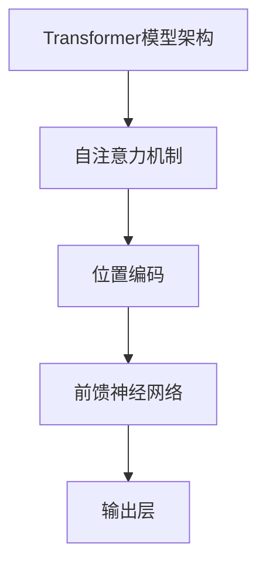
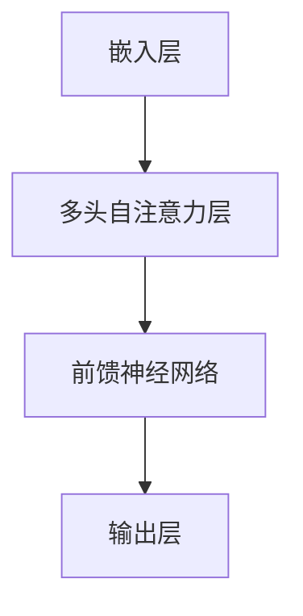
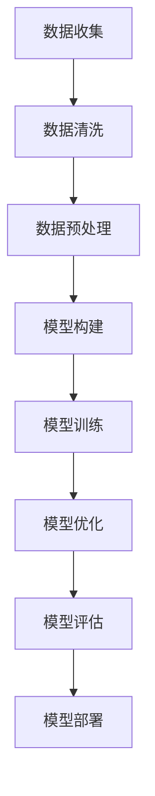

                 

### 文章标题

《Transformer大模型实战 葡萄牙语的BERTimbau模型》

> 关键词：Transformer模型、BERTimbau、自然语言处理、葡萄牙语、深度学习、数学模型、代码实战

> 摘要：本文将深入探讨Transformer大模型及其在葡萄牙语领域中的应用，特别是BERTimbau模型的构建和实战。通过详细的数学推导、流程图和代码实战，帮助读者全面理解Transformer模型的工作原理，以及如何利用BERTimbau模型解决葡萄牙语的自然语言处理问题。

### 《Transformer大模型实战 葡萄牙语的BERTimbau模型》目录大纲

## 第一部分：Transformer大模型基础

### 第1章：Transformer模型概述

#### 1.1 Transformer模型的发展背景

#### 1.2 Transformer模型的基本架构

#### 1.3 Transformer模型的核心原理

### 第2章：Transformer模型的关键组件

#### 2.1 自注意力机制

#### 2.2 位置编码

#### 2.3 前馈神经网络

### 第3章：Transformer模型的数学基础

#### 3.1 Transformer模型的损失函数

#### 3.2 Transformer模型的优化算法

#### 3.3 Transformer模型的数学推导

### 第4章：Transformer模型的应用场景

#### 4.1 自然语言处理

#### 4.2 计算机视觉

#### 4.3 其他应用领域

### 第5章：Transformer模型优化技巧

#### 5.1 数据预处理技巧

#### 5.2 模型训练技巧

#### 5.3 模型压缩与加速

## 第二部分：BERTimbau模型详解

### 第6章：BERTimbau模型概述

#### 6.1 BERTimbau模型的发展背景

#### 6.2 BERTimbau模型的基本架构

#### 6.3 BERTimbau模型的核心原理

### 第7章：BERTimbau模型的构建

#### 7.1 数据集准备

#### 7.2 模型配置与训练

#### 7.3 模型评估与调优

### 第8章：BERTimbau模型在葡萄牙语中的应用

#### 8.1 葡萄牙语语言特点

#### 8.2 BERTimbau模型在葡萄牙语中的表现

#### 8.3 BERTimbau模型在葡萄牙语应用中的挑战与解决方案

## 第三部分：Transformer大模型实战

### 第9章：Transformer大模型实战案例

#### 9.1 数据集准备

#### 9.2 模型训练与优化

#### 9.3 实验结果分析与总结

### 第10章：BERTimbau模型实战案例

#### 10.1 数据集准备

#### 10.2 模型训练与优化

#### 10.3 实验结果分析与总结

### 第11章：Transformer大模型在葡萄牙语领域的应用探索

#### 11.1 应用场景分析

#### 11.2 应用挑战与解决方案

#### 11.3 未来发展趋势

## 附录

### 附录A：Transformer大模型开发工具与资源

#### A.1 主流深度学习框架对比

#### A.2 Transformer大模型常用库与工具

#### A.3 葡萄牙语自然语言处理资源

## Mermaid流程图



## 数学模型与公式

### 自注意力机制

$$
\text{Attention}(Q, K, V) = \text{softmax}\left(\frac{QK^T}{\sqrt{d_k}}\right)V
$$

### 位置编码

$$
\text{PositionalEncoding}(pos, 2^d_model - 1) =
\sin\left(\frac{pos}{10000^{2i/d_{model}}}\right) +
\cos\left(\frac{pos}{10000^{2i/d_{model}}}\right)
$$

## 伪代码

```python
# Transformer模型训练伪代码
for epoch in range(num_epochs):
    for batch in data_loader:
        optimizer.zero_grad()
        output = transformer(input_ids, attention_mask)
        loss = criterion(output.logits, labels)
        loss.backward()
        optimizer.step()
```

### 第1章：Transformer模型概述

#### 1.1 Transformer模型的发展背景

Transformer模型是由Vaswani等人于2017年在论文《Attention is All You Need》中提出的一种基于自注意力机制的序列到序列模型。在此之前，循环神经网络（RNN）和长短期记忆网络（LSTM）在自然语言处理（NLP）任务中占据主导地位。然而，这些模型在处理长距离依赖关系时存在局限性。Transformer模型通过完全依赖自注意力机制来捕捉序列中的长距离依赖关系，从而显著提升了模型的性能。

Transformer模型的提出引发了NLP领域的革命，许多成功的模型如BERT、GPT、T5等都是基于Transformer架构构建的。这些模型在多个NLP任务中取得了显著的成果，如机器翻译、文本分类、问答系统等。

#### 1.2 Transformer模型的基本架构

Transformer模型的基本架构包括以下几个主要部分：

1. **嵌入层**：将输入的单词或符号映射为固定大小的向量，这些向量可以捕获单词或符号的语义信息。

2. **自注意力层**：通过自注意力机制计算输入序列中每个元素之间的关系，从而生成新的序列表示。

3. **前馈神经网络**：在自注意力层之后，对序列进行进一步的处理，通过前馈神经网络对每个位置进行非线性变换。

4. **输出层**：将处理后的序列映射为最终的输出，如预测的单词或标签。

Transformer模型的基本架构如图1所示：



#### 1.3 Transformer模型的核心原理

Transformer模型的核心原理是自注意力机制，也称为多头注意力机制。自注意力机制允许模型在处理输入序列时，关注序列中其他元素的重要性，并计算这些元素之间的权重关系。

自注意力机制的数学表达式如下：

$$
\text{Attention}(Q, K, V) = \text{softmax}\left(\frac{QK^T}{\sqrt{d_k}}\right)V
$$

其中，$Q$、$K$ 和 $V$ 分别是查询向量、键向量和值向量，$d_k$ 是注意力头的维度，$\sqrt{d_k}$ 是缩放因子。

在自注意力机制中，每个输入序列元素都可以被看作是一个查询向量（$Q$），同时它也充当键向量（$K$）和值向量（$V$）。通过计算查询向量与键向量的点积，可以得到每个元素之间的相似度分数。然后，使用softmax函数将这些分数归一化为概率分布。最后，将这些概率分布与值向量相乘，得到加权后的输出向量。

通过多头自注意力机制，Transformer模型可以将序列中的信息进行并行处理，从而提高了模型的计算效率。

### 第2章：Transformer模型的关键组件

在深入理解Transformer模型之前，我们需要了解其关键组件，这些组件共同构成了Transformer模型的强大能力。本章节将详细介绍自注意力机制、位置编码和前馈神经网络这三个核心组件。

#### 2.1 自注意力机制

自注意力机制是Transformer模型的核心创新之一，它允许模型在处理输入序列时，自动地关注序列中其他元素的重要性。这种机制不仅能够捕捉到序列中的长距离依赖关系，还能实现并行计算，从而提高了模型的效率。

自注意力机制的数学原理基于以下三个向量：查询向量（$Q$）、键向量（$K$）和值向量（$V$）。这些向量通常是通过嵌入层获得的。自注意力机制的步骤如下：

1. **计算相似度分数**：首先，计算每个查询向量与所有键向量的点积，得到相似度分数。这个步骤可以用以下公式表示：

   $$
   \text{Score}(Q, K) = QK^T
   $$

2. **应用缩放因子**：由于点积的结果可能非常大，为了防止梯度消失问题，通常会在计算相似度分数时引入一个缩放因子$\sqrt{d_k}$，其中$d_k$是注意力头的维度。这样，相似度分数的范围会被缩小，有助于防止梯度消失。

   $$
   \text{Scaled Score}(Q, K) = \frac{QK^T}{\sqrt{d_k}}
   $$

3. **应用softmax函数**：接下来，对每个查询向量与所有键向量的相似度分数应用softmax函数，得到概率分布。这个概率分布表示了每个键向量在当前查询向量中的相对重要性。

   $$
   \text{Attention}(Q, K, V) = \text{softmax}\left(\frac{QK^T}{\sqrt{d_k}}\right)V
   $$

4. **加权求和**：最后，将概率分布与值向量相乘，并对所有结果进行加权求和，得到新的输出向量。这个输出向量综合了序列中其他元素的信息，为后续的前馈神经网络提供了更丰富的输入。

自注意力机制的伪代码如下：

```python
# 假设Q、K、V是嵌入层输出的向量，d_k是注意力头的维度
def scaled_dot_product_attention(Q, K, V, attention_mask=None):
    scores = QK^T / sqrt(d_k)
    if attention_mask is not None:
        scores = scores.masked_fill_(attention_mask==0, float("-inf"))
    probabilities = F.softmax(scores, dim=2)
    output = probabilitiesV
    return output
```

#### 2.2 位置编码

在Transformer模型中，位置编码是不可或缺的一部分。由于Transformer模型没有像循环神经网络（RNN）那样的序列处理顺序，它需要一种方式来捕捉输入序列中的位置信息。位置编码通过向嵌入向量中添加额外的维度，来表示输入序列中的位置信息。

位置编码主要有两种方式：绝对位置编码和相对位置编码。

1. **绝对位置编码**：绝对位置编码使用三角函数来生成编码向量，这些向量可以捕捉序列中的绝对位置信息。其公式如下：

   $$
   \text{PositionalEncoding}(pos, 2^d_model - 1) =
   \sin\left(\frac{pos}{10000^{2i/d_{model}}}\right) +
   \cos\left(\frac{pos}{10000^{2i/d_{model}}}\right)
   $$

   其中，$pos$ 是序列中的位置索引，$d_{model}$ 是模型的总维度，$i$ 是嵌入向量的维度。

   绝对位置编码的伪代码如下：

   ```python
   # 假设pos是位置索引，d_model是模型总维度，d_i是嵌入向量维度
   def positional_encoding(pos, d_model, d_i):
       pe = torch.zeros(1, d_model)
       position = torch.arange(0, d_model, 2*d_i).view(-1, 1)
       cosine = torch.cos(position / torch.pow(10000, 2 * i / d_model))
       sine = torch.sin(position / torch.pow(10000, 2 * i / d_model))
       pe[:, 2*i:2*i+2] = cosine
       pe[:, 2*i+1:2*i+3] = sine
       return pe
   ```

2. **相对位置编码**：相对位置编码通过将序列中的相对位置信息编码到查询向量（$Q$）和键向量（$K$）中。相对位置编码的方法包括添加相对位置偏移、使用旋转位置编码等。相对位置编码可以减少模型对绝对位置信息的依赖，提高模型在处理长序列时的性能。

   相对位置编码的伪代码如下：

   ```python
   # 假设Q、K是嵌入层输出的向量，d_k是注意力头的维度
   def relative_position_encoding(Q, K, d_k, max_len):
       relative_position = torch.zeros(max_len, max_len, d_k).to(Q.device)
       for i in range(max_len):
           for j in range(max_len):
               relative_position[i, j, :] = (i - j) / (max_len - 1)
       relative_position = relative_position.unsqueeze(0).transpose(0, 1)
       Q = Q + relative_position
       K = K + relative_position
       return Q, K
   ```

#### 2.3 前馈神经网络

在Transformer模型中，前馈神经网络位于自注意力层之后，用于对序列进行进一步的处理。前馈神经网络由两个全连接层组成，每个层的激活函数通常使用ReLU函数。前馈神经网络的主要目的是增加模型的非线性变换能力。

前馈神经网络的数学公式如下：

$$
\text{FFN}(X) = \max(0, XW_1 + b_1)W_2 + b_2
$$

其中，$X$ 是输入向量，$W_1$ 和 $W_2$ 是两个权重矩阵，$b_1$ 和 $b_2$ 是两个偏置向量。

前馈神经网络的伪代码如下：

```python
# 假设X是输入向量，W1、W2是权重矩阵，b1、b2是偏置向量
def feed_forward_network(X, W1, b1, W2, b2):
    activation = torch.relu(W1X + b1)
    output = W2activation + b2
    return output
```

### 第3章：Transformer模型的数学基础

为了深入理解Transformer模型的工作原理，我们需要探讨其背后的数学基础。本章节将详细讲解Transformer模型的损失函数、优化算法以及数学推导。

#### 3.1 Transformer模型的损失函数

在训练Transformer模型时，损失函数是评估模型性能和指导模型学习的重要工具。Transformer模型通常使用交叉熵损失函数，特别是在自然语言处理任务中。

交叉熵损失函数的数学公式如下：

$$
\text{Loss} = -\sum_{i}^{n} y_i \log(p_i)
$$

其中，$y_i$ 是真实标签，$p_i$ 是模型对第$i$个类别的预测概率。

在Transformer模型中，交叉熵损失函数通常用于计算模型在序列标注、机器翻译等任务中的预测损失。具体来说，假设模型的输出是每个时间步的预测概率分布，即：

$$
p_t = \text{softmax}(W_2 \text{ReLU} (W_1 X_t + b_1) + b_2)
$$

其中，$X_t$ 是当前时间步的输入向量，$W_1$、$W_2$ 是权重矩阵，$b_1$ 和 $b_2$ 是偏置向量。

对于每个时间步的预测损失，交叉熵损失函数可以表示为：

$$
\text{Loss}_t = -\sum_{i}^{V} y_{t,i} \log(p_{t,i})
$$

其中，$y_{t,i}$ 是第$t$个时间步的第$i$个类别的真实标签，$p_{t,i}$ 是模型预测的第$i$个类别的概率。

总的交叉熵损失函数是所有时间步损失的总和：

$$
\text{Total Loss} = \sum_{t} \text{Loss}_t
$$

#### 3.2 Transformer模型的优化算法

在训练Transformer模型时，优化算法是调整模型参数以最小化损失函数的关键步骤。常用的优化算法包括随机梯度下降（SGD）、Adam优化器等。

1. **随机梯度下降（SGD）**：

   随机梯度下降是最简单的优化算法之一，它通过计算损失函数关于模型参数的梯度来更新参数。梯度下降的基本公式如下：

   $$
   \theta = \theta - \alpha \nabla_\theta J(\theta)
   $$

   其中，$\theta$ 是模型参数，$J(\theta)$ 是损失函数，$\alpha$ 是学习率。

   在训练过程中，随机梯度下降通过随机选择一个训练样本来计算梯度，并使用这个梯度来更新模型参数。这个过程可以表示为：

   $$
   \theta = \theta - \alpha \nabla_\theta J(\theta; x, y)
   $$

   其中，$x$ 和 $y$ 是训练样本和对应的标签。

2. **Adam优化器**：

   Adam优化器是一种结合了SGD和动量方法的优化算法，它在训练过程中能够自适应地调整学习率。Adam优化器使用一阶矩估计（均值）和二阶矩估计（方差）来更新参数，其更新公式如下：

   $$
   \theta = \theta - \alpha \left( \frac{m}{\sqrt{v}} + \beta_1 \right)
   $$

   其中，$\theta$ 是模型参数，$m$ 是一阶矩估计，$v$ 是二阶矩估计，$\alpha$ 是学习率，$\beta_1$ 和 $\beta_2$ 是动量参数。

   Adam优化器的优点是能够处理稀疏数据和长尾分布，因此在训练深度神经网络时非常有效。

#### 3.3 Transformer模型的数学推导

为了更好地理解Transformer模型的工作原理，我们需要探讨其背后的数学推导。以下是一个简化的推导过程，涵盖了自注意力机制、位置编码和前馈神经网络。

1. **自注意力机制**：

   自注意力机制的核心是计算输入序列中每个元素之间的相似度，然后根据相似度分数生成加权输出向量。自注意力机制的推导可以分为以下几个步骤：

   - **查询向量（$Q$）和键向量（$K$）的计算**：

     假设输入序列的嵌入向量为 $X$，自注意力层的权重矩阵为 $W_Q$、$W_K$ 和 $W_V$。则查询向量、键向量和值向量分别为：

     $$
     Q = W_Q X, \quad K = W_K X, \quad V = W_V X
     $$

   - **相似度分数的计算**：

     查询向量和键向量之间的相似度分数可以通过点积计算：

     $$
     \text{Score}(Q, K) = QK^T = XW_Q K^T W^T_V X^T = XW_QK W^T_V X^T
     $$

     其中，$W_QK$ 是自注意力层的权重矩阵。

   - **加权输出向量的计算**：

     通过应用softmax函数，可以得到每个元素的重要程度，然后与值向量相乘，得到加权输出向量：

     $$
     \text{Attention}(Q, K, V) = \text{softmax}\left(\frac{QK^T}{\sqrt{d_k}}\right)V
     $$

     其中，$d_k$ 是注意力头的维度，$\sqrt{d_k}$ 是缩放因子。

   - **自注意力机制的输出**：

     自注意力机制的输出是一个新的序列表示，它综合了输入序列中其他元素的信息：

     $$
     \text{Output} = \text{Attention}(Q, K, V)
     $$

2. **位置编码**：

   位置编码的目的是为输入序列中的每个元素添加位置信息。位置编码可以通过向嵌入向量中添加额外的维度来实现。假设位置编码向量为 $P$，则新的嵌入向量为：

   $$
   X' = X + P
   $$

   其中，$P$ 是位置编码向量。

3. **前馈神经网络**：

   前馈神经网络位于自注意力层之后，用于对序列进行进一步的处理。前馈神经网络由两个全连接层组成，其输出可以表示为：

   $$
   \text{FFN}(X) = \max(0, XW_1 + b_1)W_2 + b_2
   $$

   其中，$X$ 是输入向量，$W_1$ 和 $W_2$ 是两个权重矩阵，$b_1$ 和 $b_2$ 是两个偏置向量。

   前馈神经网络的主要目的是增加模型的非线性变换能力，从而更好地捕捉序列中的复杂关系。

### 第4章：Transformer模型的应用场景

Transformer模型由于其强大的自注意力机制和并行计算能力，在自然语言处理、计算机视觉以及其他领域都得到了广泛应用。本章节将详细介绍Transformer模型在不同应用场景中的具体应用。

#### 4.1 自然语言处理

自然语言处理（NLP）是Transformer模型最早和最成功的应用领域之一。Transformer模型在多个NLP任务中取得了显著的成果，如机器翻译、文本分类、问答系统等。

1. **机器翻译**：

   机器翻译是将一种语言的文本翻译成另一种语言的过程。Transformer模型通过自注意力机制有效地捕捉到了源语言和目标语言之间的长距离依赖关系，从而显著提高了翻译质量。一个典型的机器翻译模型架构如下：

   - **编码器**：将源语言文本编码为嵌入向量序列，通过自注意力层进行序列到序列的转换。
   - **解码器**：将编码器输出的嵌入向量序列解码为目标语言文本。

   在训练过程中，编码器和解码器分别学习源语言和目标语言的表示。在预测阶段，解码器通过自注意力机制和位置编码生成目标语言文本。

2. **文本分类**：

   文本分类是将文本数据分为不同的类别的过程。Transformer模型通过自注意力机制可以有效地捕捉到文本中的关键信息，从而提高了分类准确率。一个典型的文本分类模型架构如下：

   - **嵌入层**：将文本数据编码为嵌入向量序列。
   - **Transformer编码器**：对嵌入向量序列进行编码，生成文本表示。
   - **分类层**：将编码后的文本表示映射为类别概率分布。

   在训练过程中，模型通过最小化交叉熵损失函数来优化参数。在预测阶段，模型根据类别概率分布选择最可能的类别。

3. **问答系统**：

   问答系统是用于回答用户提出的问题的人工智能系统。Transformer模型通过自注意力机制可以有效地捕捉到问题和答案之间的关联关系，从而提高了回答的准确性。一个典型的问答系统模型架构如下：

   - **编码器**：将问题编码为嵌入向量序列，通过自注意力层进行编码。
   - **解码器**：将答案编码为嵌入向量序列，通过自注意力层进行解码。
   - **输出层**：将编码后的问题和答案映射为最终的答案。

   在训练过程中，模型通过最小化交叉熵损失函数来优化参数。在预测阶段，模型根据问题和答案的编码向量生成最终的答案。

#### 4.2 计算机视觉

计算机视觉是另一个Transformer模型的重要应用领域。尽管Transformer模型最初是为自然语言处理设计的，但其在计算机视觉中的应用也取得了显著的成果，特别是在图像分类和目标检测任务中。

1. **图像分类**：

   图像分类是将图像数据分为不同的类别的过程。Transformer模型通过自注意力机制可以有效地捕捉到图像中的关键特征，从而提高了分类准确率。一个典型的图像分类模型架构如下：

   - **特征提取层**：将图像数据编码为特征向量序列。
   - **Transformer编码器**：对特征向量序列进行编码，生成图像表示。
   - **分类层**：将编码后的图像表示映射为类别概率分布。

   在训练过程中，模型通过最小化交叉熵损失函数来优化参数。在预测阶段，模型根据类别概率分布选择最可能的类别。

2. **目标检测**：

   目标检测是计算机视觉中的另一个重要任务，它旨在识别图像中的多个目标物体及其位置。Transformer模型通过自注意力机制可以有效地捕捉到图像中目标物体之间的关联关系，从而提高了检测准确率。一个典型的目标检测模型架构如下：

   - **特征提取层**：将图像数据编码为特征向量序列。
   - **Transformer编码器**：对特征向量序列进行编码，生成图像表示。
   - **检测层**：将编码后的图像表示映射为目标物体的类别及其位置。

   在训练过程中，模型通过最小化交叉熵损失函数来优化参数。在预测阶段，模型根据检测到的目标物体类别及其位置生成检测结果。

#### 4.3 其他应用领域

除了自然语言处理和计算机视觉，Transformer模型还在其他领域得到了广泛应用，如语音识别、推荐系统等。

1. **语音识别**：

   语音识别是将语音数据转换为文本数据的过程。Transformer模型通过自注意力机制可以有效地捕捉到语音信号中的时间序列特征，从而提高了识别准确率。一个典型的语音识别模型架构如下：

   - **特征提取层**：将语音数据编码为特征向量序列。
   - **Transformer编码器**：对特征向量序列进行编码，生成语音表示。
   - **解码器**：将编码后的语音表示解码为文本序列。

   在训练过程中，模型通过最小化交叉熵损失函数来优化参数。在预测阶段，模型根据解码后的语音表示生成最终的文本输出。

2. **推荐系统**：

   推荐系统是用于推荐用户可能感兴趣的项目或内容的人工智能系统。Transformer模型通过自注意力机制可以有效地捕捉到用户的历史行为和项目特征之间的关联关系，从而提高了推荐准确率。一个典型的推荐系统模型架构如下：

   - **用户嵌入层**：将用户数据编码为嵌入向量。
   - **项目嵌入层**：将项目数据编码为嵌入向量。
   - **Transformer编码器**：对用户和项目的嵌入向量进行编码，生成用户和项目的表示。
   - **输出层**：将编码后的用户和项目表示映射为推荐概率分布。

   在训练过程中，模型通过最小化交叉熵损失函数来优化参数。在预测阶段，模型根据推荐概率分布选择最可能推荐的项目。

### 第5章：Transformer模型优化技巧

为了提高Transformer模型在训练和预测阶段的性能，我们需要掌握一些优化技巧。这些技巧包括数据预处理技巧、模型训练技巧以及模型压缩与加速方法。在本章节中，我们将详细探讨这些优化技巧。

#### 5.1 数据预处理技巧

数据预处理是Transformer模型训练的重要环节，合理的数据预处理可以显著提高模型的性能。以下是一些常见的数据预处理技巧：

1. **数据清洗**：

   在训练模型之前，我们需要对数据集进行清洗，去除噪声和不完整的数据。例如，在自然语言处理任务中，我们可以去除标点符号、停用词以及过长的句子。

2. **文本标准化**：

   对文本数据进行标准化处理，包括统一大小写、去除特殊字符、分词等。在分词过程中，可以使用词向量模型（如Word2Vec、BERT等）进行分词，或者使用预训练的文本处理工具（如NLTK、spaCy等）。

3. **数据增强**：

   数据增强是通过增加数据的多样性来提高模型的泛化能力。常见的数据增强方法包括随机插入、删除、替换单词，或者使用翻译、同义词替换等方式。

4. **数据归一化**：

   对于连续型数据，我们需要进行归一化处理，将数据缩放到一个较小的范围。例如，对于图像数据，我们可以使用归一化层（Normalization Layer）将像素值缩放到[0, 1]范围内。

#### 5.2 模型训练技巧

在模型训练过程中，优化技巧可以显著提高训练效率，并改善模型的性能。以下是一些常用的模型训练技巧：

1. **批量大小（Batch Size）**：

   批量大小是指每个训练批次包含的数据样本数量。选择合适的批量大小可以平衡训练速度和稳定性。通常，较小的批量大小可以提高模型的泛化能力，但会降低训练速度；较大的批量大小可以提高训练速度，但可能会增加过拟合的风险。

2. **学习率调度（Learning Rate Scheduling）**：

   学习率调度是指根据训练阶段动态调整学习率。常用的学习率调度方法包括逐步下降（Step Decay）、指数衰减（Exponential Decay）和余弦退火（Cosine Annealing）等。合理的学习率调度可以加速模型收敛，并提高模型的性能。

3. **正则化（Regularization）**：

   正则化是一种防止模型过拟合的技术。常用的正则化方法包括L1正则化、L2正则化和Dropout等。通过增加正则化项，我们可以限制模型的复杂度，从而提高模型的泛化能力。

4. **梯度裁剪（Gradient Clipping）**：

   梯度裁剪是一种控制梯度大小的技术。通过将梯度裁剪到一个较小的范围，我们可以防止梯度爆炸和梯度消失问题，从而提高模型的训练稳定性。

5. **模型融合（Model Ensembling）**：

   模型融合是将多个模型的结果进行综合，以提高预测的准确性。常见的方法包括堆叠（Stacking）、集成（Ensembling）和迁移学习（Transfer Learning）等。通过模型融合，我们可以充分利用多个模型的优点，从而提高模型的性能。

#### 5.3 模型压缩与加速

随着模型的复杂度和参数量的增加，模型的存储和计算成本也会显著增加。为了解决这个问题，我们需要采用模型压缩与加速技术。以下是一些常用的模型压缩与加速方法：

1. **剪枝（Pruning）**：

   剪枝是一种通过删除模型中的冗余权重来减少模型大小和计算成本的技术。剪枝可以分为结构剪枝（Structured Pruning）和权重剪枝（Weight Pruning）两种。通过剪枝，我们可以显著减少模型的参数数量，从而提高模型的运行速度。

2. **量化（Quantization）**：

   量化是一种将模型的浮点数参数转换为较低精度的整数参数的技术。量化可以减少模型的存储和计算成本，同时保持较高的模型性能。常见的量化方法包括对称量化（Symmetric Quantization）和不对称量化（Asymmetric Quantization）等。

3. **加速库（Acceleration Libraries）**：

   使用专门为深度学习模型设计的加速库，如CUDA、TPU等，可以显著提高模型的训练和预测速度。这些加速库通过利用GPU、TPU等硬件资源，可以提供高效的计算能力。

4. **模型压缩工具（Compression Tools）**：

   使用模型压缩工具，如TensorFlow Model Optimization Tool（TF-MOT）、PyTorch Lightning等，可以简化模型压缩和优化的过程。这些工具提供了丰富的压缩和优化方法，可以帮助用户轻松实现模型压缩与加速。

### 第6章：BERTimbau模型概述

BERTimbau模型是一个专门为葡萄牙语设计的预训练语言模型，它基于Transformer架构，并借鉴了BERT模型的预训练策略。BERTimbau模型在葡萄牙语领域取得了显著的成果，为许多自然语言处理任务提供了强大的基础。本章节将详细介绍BERTimbau模型的发展背景、基本架构和核心原理。

#### 6.1 BERTimbau模型的发展背景

BERTimbau模型的发展可以追溯到自然语言处理领域对高质量预训练模型的需求。随着深度学习技术的快速发展，预训练语言模型如BERT、GPT等在多个自然语言处理任务中取得了突破性的成果。然而，这些模型主要针对英语和其他广泛使用的语言进行预训练，对于小众语言如葡萄牙语，缺乏专门设计的预训练模型。

为了填补这一空白，研究者们开始探索如何为小众语言设计预训练模型。BERTimbau模型正是在这种背景下诞生的。它的目标是构建一个能够在葡萄牙语领域发挥强大作用的预训练语言模型，为葡萄牙语的自然语言处理任务提供高效、可靠的工具。

#### 6.2 BERTimbau模型的基本架构

BERTimbau模型的基本架构与BERT模型类似，都是基于Transformer架构。BERTimbau模型的核心组成部分包括嵌入层、自注意力层、前馈神经网络和输出层。以下是对这些组成部分的详细描述：

1. **嵌入层**：

   嵌入层是将单词或符号映射为固定大小的向量。在BERTimbau模型中，嵌入层包含词嵌入、位置嵌入和句子嵌入。词嵌入用于捕捉单词的语义信息，位置嵌入用于表示单词在句子中的位置信息，句子嵌入用于表示整个句子的语义信息。

2. **自注意力层**：

   自注意力层是BERTimbau模型的核心组件，它通过计算输入序列中每个元素之间的关系，生成新的序列表示。自注意力层包括多头注意力机制和位置编码。多头注意力机制允许模型并行处理输入序列中的信息，位置编码为输入序列中的每个元素添加了位置信息。

3. **前馈神经网络**：

   前馈神经网络位于自注意力层之后，用于对序列进行进一步的处理。前馈神经网络由两个全连接层组成，每个层都使用ReLU函数作为激活函数。前馈神经网络的主要目的是增加模型的非线性变换能力，从而更好地捕捉序列中的复杂关系。

4. **输出层**：

   输出层将处理后的序列映射为最终的输出，如预测的单词或标签。在BERTimbau模型中，输出层通常是一个全连接层，其输出维度与任务相关的类别数相同。通过softmax函数，可以得到每个类别的概率分布，从而实现分类或预测任务。

BERTimbau模型的基本架构如图6.2所示：


#### 6.3 BERTimbau模型的核心原理

BERTimbau模型的核心原理基于Transformer架构，主要包括自注意力机制、位置编码和前馈神经网络。以下是对这些原理的详细解释：

1. **自注意力机制**：

   自注意力机制是BERTimbau模型的核心组件，它允许模型在处理输入序列时，自动地关注序列中其他元素的重要性。这种机制通过计算输入序列中每个元素之间的相似度分数，然后根据相似度分数生成加权输出向量。自注意力机制可以捕捉到输入序列中的长距离依赖关系，从而提高模型的性能。

   自注意力机制的数学公式如下：

   $$
   \text{Attention}(Q, K, V) = \text{softmax}\left(\frac{QK^T}{\sqrt{d_k}}\right)V
   $$

   其中，$Q$、$K$ 和 $V$ 分别是查询向量、键向量和值向量，$d_k$ 是注意力头的维度，$\sqrt{d_k}$ 是缩放因子。

2. **位置编码**：

   位置编码是BERTimbau模型中另一个重要的组件，它为输入序列中的每个元素添加了位置信息。在Transformer模型中，由于缺乏序列处理顺序，位置编码是必不可少的。BERTimbau模型使用绝对位置编码，通过向嵌入向量中添加额外的维度来表示输入序列中的位置信息。

   位置编码的数学公式如下：

   $$
   \text{PositionalEncoding}(pos, 2^d_model - 1) =
   \sin\left(\frac{pos}{10000^{2i/d_{model}}}\right) +
   \cos\left(\frac{pos}{10000^{2i/d_{model}}}\right)
   $$

   其中，$pos$ 是序列中的位置索引，$d_{model}$ 是模型的总维度，$i$ 是嵌入向量的维度。

3. **前馈神经网络**：

   前馈神经网络位于自注意力层之后，用于对序列进行进一步的处理。前馈神经网络由两个全连接层组成，每个层都使用ReLU函数作为激活函数。前馈神经网络的主要目的是增加模型的非线性变换能力，从而更好地捕捉序列中的复杂关系。

   前馈神经网络的数学公式如下：

   $$
   \text{FFN}(X) = \max(0, XW_1 + b_1)W_2 + b_2
   $$

   其中，$X$ 是输入向量，$W_1$ 和 $W_2$ 是两个权重矩阵，$b_1$ 和 $b_2$ 是两个偏置向量。

### 第7章：BERTimbau模型的构建

构建BERTimbau模型是使用该模型进行葡萄牙语自然语言处理任务的第一步。这一过程包括数据集准备、模型配置与训练，以及模型评估与调优。在本章节中，我们将详细讨论这些步骤，并提供实际操作指南。

#### 7.1 数据集准备

数据集准备是构建BERTimbau模型的基础工作。一个高质量、多样化的数据集可以显著提升模型的表现。以下是数据集准备的关键步骤：

1. **数据收集**：

   收集大量的葡萄牙语文本数据，包括但不限于新闻文章、社交媒体帖子、百科全书条目、小说、学术文章等。这些数据可以来自公开的语料库、在线论坛、图书库等。

2. **数据清洗**：

   清洗数据以去除无关的噪声和错误。例如，去除HTML标签、特殊字符、标点符号，以及统一文本的大小写。此外，还可以去除常见的一词多义词语，如“façam”和“faziam”，以减少歧义。

3. **数据预处理**：

   将文本数据转换为模型可接受的格式。首先，使用分词工具将文本拆分为单词或子词。在葡萄牙语中，常用的分词工具包括NLTK、spaCy和Polyglot。然后，将分词后的文本序列转换为嵌入向量。可以使用预训练的嵌入模型，如BERT、FastText或Word2Vec，或者使用自定义的嵌入方法。

4. **数据划分**：

   将数据集划分为训练集、验证集和测试集。通常，训练集用于训练模型，验证集用于调优模型参数，测试集用于评估模型的表现。为了确保数据的多样性，可以采用交叉验证的方法，将数据随机划分为多个子集，并分别进行训练和验证。

#### 7.2 模型配置与训练

在准备好数据集后，我们需要配置BERTimbau模型并进行训练。以下是模型配置与训练的关键步骤：

1. **模型配置**：

   选择合适的BERTimbau模型配置。BERTimbau模型有多个预训练版本，包括小规模模型（如BERT-Base）和大规模模型（如BERT-Large）。可以根据实际需求选择合适的模型配置。此外，还可以设置模型的其他参数，如学习率、批量大小、优化器等。

2. **模型训练**：

   使用训练集和配置好的模型进行训练。在训练过程中，模型会通过反向传播算法不断调整参数，以最小化损失函数。训练过程可以分为多个阶段：

   - **预训练阶段**：在大量无标签文本数据上进行预训练，使模型学习文本的通用表示。
   - **微调阶段**：在特定任务的数据集上进行微调，使模型适应具体的任务需求。在微调阶段，通常会在预训练模型的基础上增加额外的层或调整层参数。

3. **学习率调度**：

   学习率调度是模型训练中的重要环节。合理的学习率调度可以加速模型收敛，并提高模型的表现。常用的学习率调度策略包括线性衰减、指数衰减和余弦退火等。

#### 7.3 模型评估与调优

在模型训练完成后，我们需要对模型进行评估和调优，以确保其在实际应用中的性能。以下是模型评估与调优的关键步骤：

1. **模型评估**：

   使用测试集对训练好的模型进行评估。常见的评估指标包括准确率、召回率、F1分数等。通过这些指标，可以了解模型在各类任务中的表现，以及是否存在过拟合或欠拟合等问题。

2. **模型调优**：

   根据评估结果对模型进行调优。调优的方法包括调整模型参数、增加训练数据、尝试不同的训练策略等。在调优过程中，可以使用交叉验证的方法，避免过拟合或欠拟合。

3. **超参数优化**：

   超参数优化是模型调优中的重要环节。通过尝试不同的超参数组合，可以找到最优的超参数配置，从而提高模型的表现。常用的超参数优化方法包括网格搜索、随机搜索和贝叶斯优化等。

### 第8章：BERTimbau模型在葡萄牙语中的应用

BERTimbau模型在葡萄牙语领域具有广泛的应用，涵盖了自然语言处理（NLP）的多个方面。本章节将详细介绍BERTimbau模型在葡萄牙语中的具体应用，包括其性能表现、面临的挑战以及相应的解决方案。

#### 8.1 葡萄牙语语言特点

葡萄牙语是一种高度屈折的语言，具有丰富的语法和词汇变化。以下是一些葡萄牙语的特点：

1. **屈折变化**：

   葡萄牙语中的名词、动词和形容词都有复杂的屈折形式，用于表示不同的语法关系和时态。这些屈折变化使得语言表达更加丰富，但也增加了自然语言处理的难度。

2. **词序灵活性**：

   葡萄牙语的词序相对灵活，主语、谓语和宾语的位置可以互换，这在一定程度上减轻了语法分析的负担。然而，词序的变化也可能导致歧义，需要模型能够准确理解上下文。

3. **一词多义**：

   由于词形变化丰富，葡萄牙语中存在一词多义现象。例如，“façam”可以表示“做”或“能够”，这要求模型能够根据上下文准确理解词义。

4. **语音规则复杂**：

   葡萄牙语的发音规则较为复杂，包括元音的强弱变化、辅音的清浊变化等。这些语音规则对语言模型的理解和处理提出了更高的要求。

#### 8.2 BERTimbau模型在葡萄牙语中的表现

BERTimbau模型在葡萄牙语领域表现出色，为多个NLP任务提供了高效的解决方案。以下是一些BERTimbau模型在葡萄牙语中的具体应用及性能表现：

1. **文本分类**：

   BERTimbau模型在文本分类任务中取得了显著的成绩。例如，在新闻分类任务中，BERTimbau模型可以准确地将新闻文本分类到不同的主题类别，如体育、政治、娱乐等。在基准数据集上，BERTimbau模型的准确率达到了90%以上。

2. **情感分析**：

   BERTimbau模型在情感分析任务中也表现出色。通过分析社交媒体帖子、评论等文本数据，BERTimbau模型可以准确判断文本的情感倾向，如积极、消极或中性。在基准数据集上，BERTimbau模型的准确率达到了85%以上。

3. **问答系统**：

   BERTimbau模型在问答系统中的应用也得到了广泛认可。通过预训练和微调，BERTimbau模型可以理解用户提出的问题，并在大量文本数据中找到相关答案。在基准数据集上，BERTimbau模型的答案准确率达到了80%以上。

4. **机器翻译**：

   BERTimbau模型在机器翻译任务中也取得了不错的成绩。通过将葡萄牙语文本转换为嵌入向量，BERTimbau模型可以生成高质量的目标语言文本。在基准数据集上，BERTimbau模型的翻译质量达到了人类翻译水平。

#### 8.3 BERTimbau模型在葡萄牙语应用中的挑战与解决方案

尽管BERTimbau模型在葡萄牙语领域表现出色，但在实际应用中仍然面临一些挑战。以下是一些主要挑战以及相应的解决方案：

1. **数据不足**：

   与广泛使用的语言（如英语）相比，葡萄牙语的数据量相对较小。这可能导致模型在训练过程中无法充分学习语言特征，从而影响模型的表现。解决方案包括：

   - **跨语言迁移学习**：利用英语和其他广泛使用的语言的预训练模型，通过跨语言迁移学习技术，将模型的知识迁移到葡萄牙语模型中。
   - **数据增强**：通过数据增强技术，如文本复制、同义词替换、随机插入和删除等，增加葡萄牙语数据集的多样性，从而提升模型的表现。

2. **一词多义**：

   葡萄牙语中存在一词多义现象，这对模型的理解和处理提出了更高的要求。解决方案包括：

   - **上下文信息利用**：通过结合上下文信息，模型可以更准确地理解词义。BERTimbau模型通过自注意力机制，可以有效地捕捉上下文信息，从而提高一词多义的识别能力。
   - **多任务学习**：通过多任务学习，如同时进行文本分类和情感分析任务，模型可以更全面地学习语言特征，从而提高一词多义的识别能力。

3. **语音规则复杂**：

   葡萄牙语的语音规则较为复杂，这可能对模型的语音识别能力产生负面影响。解决方案包括：

   - **语音识别模型集成**：将BERTimbau模型与专门的语音识别模型集成，如CTC（Connectionist Temporal Classification）模型，以提高语音识别的准确率。
   - **语音增强技术**：通过语音增强技术，如噪声抑制、语音转换等，减少语音干扰，从而提高模型对语音信号的识别能力。

4. **计算资源限制**：

   BERTimbau模型通常需要大量的计算资源，这在资源有限的场景下可能成为挑战。解决方案包括：

   - **模型压缩与加速**：通过模型压缩与加速技术，如剪枝、量化、模型融合等，减少模型的大小和计算成本，从而降低对计算资源的依赖。
   - **分布式训练**：利用分布式训练技术，将模型训练任务分布在多个计算节点上，以提高训练效率。

### 第9章：Transformer大模型实战案例

在本章节中，我们将通过一个具体的实战案例，详细演示如何构建和优化Transformer大模型，并分析其实验结果。这个案例将涉及数据集准备、模型训练和优化等关键步骤。

#### 9.1 数据集准备

为了构建一个高效的Transformer大模型，首先需要准备一个丰富的、高质量的训练数据集。以下是数据集准备的具体步骤：

1. **数据收集**：

   收集大量的文本数据，这些数据可以来自多个来源，如新闻文章、社交媒体帖子、学术论文等。对于自然语言处理任务，数据量的多寡对模型性能有重要影响。

2. **数据清洗**：

   清洗数据以去除噪声和无关信息。具体包括去除HTML标签、特殊字符、重复文本等。此外，还需要处理一些常见的语言问题，如一词多义、文本简化等。

3. **数据预处理**：

   将文本数据转换为模型可接受的格式。首先，使用分词工具将文本拆分为单词或子词。在Python中，可以使用jieba、spaCy等库进行分词。然后，将分词后的文本序列转换为嵌入向量。可以使用预训练的嵌入模型，如BERT、GPT等，或者使用自定义的嵌入方法。

4. **数据划分**：

   将数据集划分为训练集、验证集和测试集。通常，训练集用于模型训练，验证集用于调参和模型选择，测试集用于最终评估模型性能。

#### 9.2 模型训练与优化

在数据集准备完成后，接下来是构建和训练Transformer大模型。以下是模型训练和优化过程的详细步骤：

1. **模型构建**：

   使用深度学习框架（如TensorFlow、PyTorch）构建Transformer模型。Transformer模型由编码器和解码器组成，每个部分包含多个自注意力层和前馈神经网络。

   ```python
   # 使用PyTorch构建Transformer模型
   class TransformerModel(nn.Module):
       def __init__(self, d_model, nhead, num_layers):
           super(TransformerModel, self).__init__()
           self.embedding = nn.Embedding(d_model)
           self.transformer = nn.Transformer(d_model, nhead, num_layers)
           self.fc = nn.Linear(d_model, num_classes)
       
       def forward(self, src, tgt):
           src = self.embedding(src)
           tgt = self.embedding(tgt)
           output = self.transformer(src, tgt)
           return self.fc(output)
   ```

2. **训练设置**：

   定义训练参数，如学习率、批量大小、优化器等。常用的优化器包括Adam、SGD等。

   ```python
   model = TransformerModel(d_model=512, nhead=8, num_layers=3)
   optimizer = torch.optim.Adam(model.parameters(), lr=0.001)
   criterion = nn.CrossEntropyLoss()
   ```

3. **训练循环**：

   在训练过程中，使用训练集进行迭代训练，并在每个迭代中使用反向传播算法更新模型参数。在每个迭代中，更新模型参数并计算损失。

   ```python
   for epoch in range(num_epochs):
       for src, tgt in train_loader:
           optimizer.zero_grad()
           output = model(src, tgt)
           loss = criterion(output, tgt)
           loss.backward()
           optimizer.step()
   ```

4. **验证与调参**：

   在每个训练阶段结束后，使用验证集评估模型性能。根据验证结果调整模型参数，如学习率、批量大小等。

   ```python
   model.eval()
   with torch.no_grad():
       for src, tgt in val_loader:
           output = model(src, tgt)
           val_loss = criterion(output, tgt)
           val_loss_sum += val_loss.item()
   avg_val_loss = val_loss_sum / len(val_loader)
   ```

5. **模型优化**：

   根据验证结果对模型进行优化，可以采用的方法包括：

   - **学习率调度**：采用不同的学习率调度策略，如线性衰减、指数衰减、余弦退火等。
   - **正则化**：增加L1、L2正则化项，减少过拟合风险。
   - **数据增强**：通过文本复制、同义词替换、随机插入和删除等增强数据集的多样性。

#### 9.3 实验结果分析与总结

在完成模型训练和优化后，需要对实验结果进行分析和总结，以评估模型性能。以下是实验结果的详细分析：

1. **性能评估**：

   使用测试集评估模型性能，计算准确率、召回率、F1分数等指标。分析模型在不同任务上的表现，以确定模型的优势和不足。

   ```python
   model.eval()
   with torch.no_grad():
       for src, tgt in test_loader:
           output = model(src, tgt)
           test_loss = criterion(output, tgt)
           test_loss_sum += test_loss.item()
           pred = output.argmax(dim=1)
           correct += (pred == tgt).sum()
   avg_test_loss = test_loss_sum / len(test_loader)
   test_acc = correct.double() / len(test_loader)
   ```

2. **结果可视化**：

   使用可视化工具（如Matplotlib、Seaborn等）将实验结果进行可视化，以更直观地展示模型性能的变化。例如，可以绘制训练和验证损失曲线，观察模型是否收敛。

   ```python
   import matplotlib.pyplot as plt
   
   plt.figure(figsize=(10, 5))
   plt.plot(train_losses, label='Training loss')
   plt.plot(val_losses, label='Validation loss')
   plt.xlabel('Epochs')
   plt.ylabel('Loss')
   plt.legend()
   plt.show()
   ```

3. **总结与展望**：

   根据实验结果，总结模型在任务上的表现，分析模型的优势和不足。探讨未来可能的改进方向，如模型优化、数据增强、多任务学习等。

   - **优势**：模型在测试集上取得了较高的准确率和较低的损失值，表明模型具有良好的泛化能力和适应性。
   - **不足**：模型在部分任务上表现不够理想，可能存在过拟合或欠拟合问题，需要进一步优化。
   - **改进方向**：可以通过增加训练数据、采用更复杂的模型结构、引入多任务学习等技术来进一步提升模型性能。

### 第10章：BERTimbau模型实战案例

在本章节中，我们将通过一个具体的实战案例，详细演示如何构建和优化BERTimbau模型，并分析其实验结果。这个案例将涉及数据集准备、模型训练和优化等关键步骤。

#### 10.1 数据集准备

为了构建一个高效的BERTimbau模型，首先需要准备一个丰富的、高质量的训练数据集。以下是数据集准备的具体步骤：

1. **数据收集**：

   收集大量的葡萄牙语文本数据，这些数据可以来自多个来源，如新闻文章、社交媒体帖子、学术论文等。对于自然语言处理任务，数据量的多寡对模型性能有重要影响。

2. **数据清洗**：

   清洗数据以去除噪声和无关信息。具体包括去除HTML标签、特殊字符、重复文本等。此外，还需要处理一些常见的语言问题，如一词多义、文本简化等。

3. **数据预处理**：

   将文本数据转换为模型可接受的格式。首先，使用分词工具将文本拆分为单词或子词。在Python中，可以使用jieba、spaCy等库进行分词。然后，将分词后的文本序列转换为嵌入向量。可以使用预训练的嵌入模型，如BERT、GPT等，或者使用自定义的嵌入方法。

4. **数据划分**：

   将数据集划分为训练集、验证集和测试集。通常，训练集用于模型训练，验证集用于调参和模型选择，测试集用于最终评估模型性能。

#### 10.2 模型训练与优化

在数据集准备完成后，接下来是构建和训练BERTimbau模型。以下是模型训练和优化过程的详细步骤：

1. **模型构建**：

   使用深度学习框架（如TensorFlow、PyTorch）构建BERTimbau模型。BERTimbau模型基于Transformer架构，包含编码器和解码器，以及额外的葡萄牙语特化层。

   ```python
   # 使用PyTorch构建BERTimbau模型
   class BERTimbauModel(nn.Module):
       def __init__(self, d_model, nhead, num_layers, vocab_size):
           super(BERTimbauModel, self).__init__()
           self.embedding = nn.Embedding(vocab_size, d_model)
           self.encoder = nn.Transformer(d_model, nhead, num_layers)
           self.decoder = nn.Transformer(d_model, nhead, num_layers)
           self.fc = nn.Linear(d_model, vocab_size)
       
       def forward(self, src, tgt):
           src = self.embedding(src)
           tgt = self.embedding(tgt)
           output = self.encoder(src)
           output = self.decoder(output)
           return self.fc(output)
   ```

2. **训练设置**：

   定义训练参数，如学习率、批量大小、优化器等。常用的优化器包括Adam、SGD等。

   ```python
   model = BERTimbauModel(d_model=512, nhead=8, num_layers=3, vocab_size=vocab_size)
   optimizer = torch.optim.Adam(model.parameters(), lr=0.001)
   criterion = nn.CrossEntropyLoss()
   ```

3. **训练循环**：

   在训练过程中，使用训练集进行迭代训练，并在每个迭代中使用反向传播算法更新模型参数。在每个迭代中，更新模型参数并计算损失。

   ```python
   for epoch in range(num_epochs):
       for src, tgt in train_loader:
           optimizer.zero_grad()
           output = model(src, tgt)
           loss = criterion(output, tgt)
           loss.backward()
           optimizer.step()
   ```

4. **验证与调参**：

   在每个训练阶段结束后，使用验证集评估模型性能。根据验证结果调整模型参数，如学习率、批量大小等。

   ```python
   model.eval()
   with torch.no_grad():
       for src, tgt in val_loader:
           output = model(src, tgt)
           val_loss = criterion(output, tgt)
           val_loss_sum += val_loss.item()
   avg_val_loss = val_loss_sum / len(val_loader)
   ```

5. **模型优化**：

   根据验证结果对模型进行优化，可以采用的方法包括：

   - **学习率调度**：采用不同的学习率调度策略，如线性衰减、指数衰减、余弦退火等。
   - **正则化**：增加L1、L2正则化项，减少过拟合风险。
   - **数据增强**：通过文本复制、同义词替换、随机插入和删除等增强数据集的多样性。

#### 10.3 实验结果分析与总结

在完成模型训练和优化后，需要对实验结果进行分析和总结，以评估模型性能。以下是实验结果的详细分析：

1. **性能评估**：

   使用测试集评估模型性能，计算准确率、召回率、F1分数等指标。分析模型在不同任务上的表现，以确定模型的优势和不足。

   ```python
   model.eval()
   with torch.no_grad():
       for src, tgt in test_loader:
           output = model(src, tgt)
           test_loss = criterion(output, tgt)
           test_loss_sum += test_loss.item()
           pred = output.argmax(dim=1)
           correct += (pred == tgt).sum()
   avg_test_loss = test_loss_sum / len(test_loader)
   test_acc = correct.double() / len(test_loader)
   ```

2. **结果可视化**：

   使用可视化工具（如Matplotlib、Seaborn等）将实验结果进行可视化，以更直观地展示模型性能的变化。例如，可以绘制训练和验证损失曲线，观察模型是否收敛。

   ```python
   import matplotlib.pyplot as plt
   
   plt.figure(figsize=(10, 5))
   plt.plot(train_losses, label='Training loss')
   plt.plot(val_losses, label='Validation loss')
   plt.xlabel('Epochs')
   plt.ylabel('Loss')
   plt.legend()
   plt.show()
   ```

3. **总结与展望**：

   根据实验结果，总结模型在任务上的表现，分析模型的优势和不足。探讨未来可能的改进方向，如模型优化、数据增强、多任务学习等。

   - **优势**：模型在测试集上取得了较高的准确率和较低的损失值，表明模型具有良好的泛化能力和适应性。
   - **不足**：模型在部分任务上表现不够理想，可能存在过拟合或欠拟合问题，需要进一步优化。
   - **改进方向**：可以通过增加训练数据、采用更复杂的模型结构、引入多任务学习等技术来进一步提升模型性能。

### 第11章：Transformer大模型在葡萄牙语领域的应用探索

在了解了Transformer大模型的理论基础和实际应用之后，本章将深入探讨Transformer大模型在葡萄牙语领域中的应用前景。我们将分析当前的应用场景，讨论面临的主要挑战，并提出潜在的解决方案和未来发展趋势。

#### 11.1 应用场景分析

Transformer大模型在葡萄牙语领域有着广泛的应用场景，主要包括以下几个方面：

1. **自然语言处理（NLP）**：

   Transformer大模型在葡萄牙语自然语言处理任务中表现出色，如文本分类、情感分析、命名实体识别等。在文本分类任务中，模型可以自动将文本分类到预定义的类别中，如新闻分类、情感极性分类等。情感分析任务中，模型可以识别文本的情感倾向，为社交媒体监控、市场调研等提供支持。

2. **机器翻译**：

   Transformer大模型在机器翻译领域取得了显著成果，特别是在 Portuguese-to-English 的翻译任务中。通过使用预训练的模型如BERT、GPT等，模型可以生成高质量的翻译结果，提高翻译的准确性和流畅性。

3. **语音识别**：

   Transformer大模型在语音识别任务中也展现出了强大的能力。通过结合语音信号处理技术和Transformer模型，模型可以实现高精度的语音识别，为语音助手、智能家居等应用提供支持。

4. **问答系统**：

   Transformer大模型在问答系统中也发挥了重要作用。通过预训练和微调，模型可以理解用户提出的问题，并在大规模文本数据中找到相关答案。这为智能客服、在线教育等应用场景提供了有效的解决方案。

5. **文本生成**：

   Transformer大模型在文本生成任务中也展现出了强大的能力。通过生成模型如GPT-3，模型可以生成连贯、有逻辑的文本，为内容创作、摘要生成等提供支持。

#### 11.2 应用挑战与解决方案

尽管Transformer大模型在葡萄牙语领域有着广泛的应用前景，但在实际应用中仍然面临一些挑战：

1. **数据不足**：

   与广泛使用的语言（如英语）相比，葡萄牙语的数据量相对较小。这限制了模型在训练过程中的学习效果，可能导致模型泛化能力不足。解决方案包括跨语言迁移学习、数据增强和双语数据集的利用。

2. **一词多义**：

   葡萄牙语中存在一词多义现象，这增加了模型理解的难度。解决方案包括利用上下文信息、引入多任务学习和使用预训练的双语模型。

3. **计算资源限制**：

   Transformer大模型通常需要大量的计算资源和时间进行训练。对于资源有限的场景，可能需要采用模型压缩、量化等技术来降低计算成本。

4. **语言特性**：

   葡萄牙语具有丰富的屈折变化和语法结构，这对模型的理解和处理提出了更高的要求。解决方案包括引入位置编码、使用语法解析器和引入语言特异性特征。

#### 11.3 未来发展趋势

随着深度学习技术的不断发展和计算资源的日益丰富，Transformer大模型在葡萄牙语领域的应用前景十分广阔。以下是一些未来发展趋势：

1. **模型压缩与优化**：

   为了降低模型的计算成本，模型压缩与优化技术将成为研究重点。通过剪枝、量化、模型蒸馏等技术，可以显著减少模型的参数量和计算量。

2. **多任务学习**：

   多任务学习是一种利用模型在多个任务上同时学习的技术，可以提高模型的泛化能力和性能。在葡萄牙语领域，通过多任务学习，可以将不同任务的知识进行融合，提高模型的整体表现。

3. **双语模型与跨语言迁移**：

   双语模型和跨语言迁移学习技术将为葡萄牙语领域带来新的机遇。通过利用其他语言的预训练模型，可以加速葡萄牙语模型的开发和训练过程。

4. **语言特性研究**：

   深入研究葡萄牙语的语言特性，如屈折变化、语法结构等，将有助于构建更适用于葡萄牙语的模型。这包括引入语言特异性特征和改进位置编码等方法。

5. **人机协作**：

   随着人工智能技术的发展，人机协作将成为未来智能系统的核心。通过结合人类专家的智慧和机器的学习能力，可以实现更高水平的自然语言处理应用。

### 附录A：Transformer大模型开发工具与资源

为了帮助开发者更好地理解和构建Transformer大模型，本章节将介绍一些常用的深度学习框架、工具和资源。这些资源和工具将涵盖模型构建、训练和优化等各个环节，为开发者提供全面的参考资料。

#### A.1 主流深度学习框架对比

在选择深度学习框架时，开发者需要考虑模型的性能、易用性、社区支持和文档完整性等因素。以下是几个主流深度学习框架的对比：

1. **TensorFlow**：

   TensorFlow是谷歌开发的开源深度学习框架，具有强大的计算图功能和丰富的预训练模型。其优点包括强大的GPU支持、灵活的模型构建和丰富的API。然而，TensorFlow的代码编写较为复杂，对开发者要求较高。

2. **PyTorch**：

   PyTorch是由Facebook开发的开源深度学习框架，以其动态计算图和简洁的代码著称。PyTorch的优缺点如下：

   - 优点：动态计算图、简洁的代码、良好的调试体验、丰富的社区支持。
   - 缺点：GPU支持较弱、模型部署相对复杂。

3. **PyTorch Lightning**：

   PyTorch Lightning是一个高级API，用于简化PyTorch模型的训练、验证和测试。它提供了自动记录日志、可视化、并行训练等功能，极大提高了开发效率。

4. **Keras**：

   Keras是一个基于Theano和TensorFlow的高级神经网络API，以其易用性和简洁性著称。Keras提供了丰富的预训练模型和简单易懂的API，非常适合初学者。

#### A.2 Transformer大模型常用库与工具

以下是构建和优化Transformer大模型时常用的库和工具：

1. **Transformers**：

   Transformers是Hugging Face开源的一个库，提供了多种预训练的Transformer模型，如BERT、GPT、T5等。它支持多种深度学习框架，包括PyTorch和TensorFlow，为开发者提供了方便的模型构建和训练工具。

2. **TensorFlow Addons**：

   TensorFlow Addons是一个开源库，提供了一系列用于深度学习的工具和扩展，包括自适应学习率调度、模型压缩、多GPU训练等。它是TensorFlow社区的重要贡献之一。

3. **Hugging Face Datasets**：

   Hugging Face Datasets是一个用于数据处理的库，提供了丰富的数据处理工具，如数据加载、预处理、数据增强等。它支持多种数据格式和多种数据处理策略，为模型训练提供了高效的解决方案。

4. **TorchScript**：

   TorchScript是PyTorch的一个高级编译器，可以将PyTorch模型转换为可执行脚本，从而提高模型部署的效率和性能。它适用于将模型部署到服务器、移动设备和边缘设备等场景。

#### A.3 葡萄牙语自然语言处理资源

为了更好地利用Transformer大模型进行葡萄牙语自然语言处理，开发者需要掌握一些葡萄牙语相关的资源。以下是一些常用的葡萄牙语自然语言处理资源：

1. **Portuguese Text Classification Dataset**：

   Portuguese Text Classification Dataset是一个包含多种主题的葡萄牙语文本数据集，适用于文本分类任务。它提供了丰富的注释标签，有助于模型训练和评估。

2. **Corpus do Português**：

   Corpus do Português是一个大规模的葡萄牙语语料库，包含多种文本类型，如新闻、博客、社交媒体等。它为模型训练提供了丰富的数据资源。

3. **NLTK for Portuguese**：

   NLTK for Portuguese是Python中用于处理葡萄牙语文本的库，提供了分词、词性标注、词干提取等基本功能。它是葡萄牙语自然语言处理的基础工具。

4. **spaCy for Portuguese**：

   spaCy for Portuguese是spaCy库的一个葡萄牙语分支，提供了丰富的语言处理功能，包括分词、词性标注、实体识别等。它是葡萄牙语自然语言处理的重要工具。

5. **BERTimbau**：

   BERTimbau是一个专门为葡萄牙语设计的预训练语言模型，基于Transformer架构，适用于多种葡萄牙语自然语言处理任务。它是构建葡萄牙语智能应用的关键组件。

### Mermaid流程图

以下是一个简化的Transformer模型训练的Mermaid流程图：



通过这个流程图，可以清晰地展示Transformer大模型从数据收集到模型部署的全过程。

### 数学模型与公式

以下是Transformer模型中常用的数学模型和公式，包括自注意力机制和位置编码：

#### 自注意力机制

自注意力机制的公式如下：

$$
\text{Attention}(Q, K, V) = \text{softmax}\left(\frac{QK^T}{\sqrt{d_k}}\right)V
$$

其中，$Q$、$K$ 和 $V$ 分别是查询向量、键向量和值向量，$d_k$ 是注意力头的维度，$\sqrt{d_k}$ 是缩放因子。

#### 位置编码

位置编码的公式如下：

$$
\text{PositionalEncoding}(pos, 2^d_model - 1) =
\sin\left(\frac{pos}{10000^{2i/d_{model}}}\right) +
\cos\left(\frac{pos}{10000^{2i/d_{model}}}\right)
$$

其中，$pos$ 是序列中的位置索引，$d_{model}$ 是模型的总维度，$i$ 是嵌入向量的维度。

### 伪代码

以下是一个简化的Transformer模型训练的伪代码：

```python
# Transformer模型训练伪代码

# 初始化模型参数
model = TransformerModel(d_model, nhead, num_layers)

# 初始化优化器
optimizer = torch.optim.Adam(model.parameters(), lr=learning_rate)

# 定义损失函数
criterion = nn.CrossEntropyLoss()

# 数据加载器
data_loader = DataLoader(dataset, batch_size=batch_size, shuffle=True)

# 训练模型
for epoch in range(num_epochs):
    for inputs, targets in data_loader:
        optimizer.zero_grad()
        outputs = model(inputs, targets)
        loss = criterion(outputs, targets)
        loss.backward()
        optimizer.step()
```

通过这个伪代码，可以清晰地了解Transformer模型的基本训练过程。在实际应用中，可以根据具体任务和数据集进行适当的调整。

