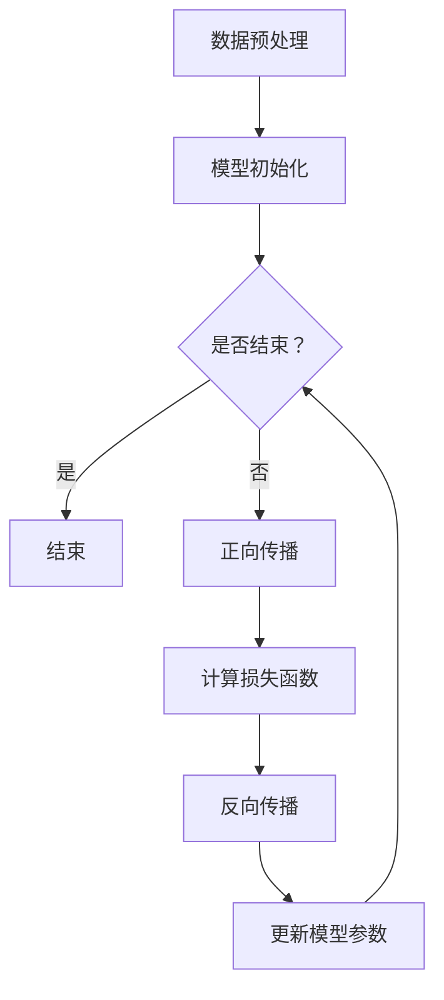

                 

# Transformer大模型实战 解码器总览

> 关键词：Transformer、大模型、解码器、自然语言处理、实战

> 摘要：本文将深入探讨Transformer大模型中的解码器部分，介绍其基本概念、结构解析、应用实战等内容。通过本文的学习，读者将能够理解解码器在Transformer模型中的作用和重要性，并掌握其在实际项目中的应用方法。

### 第1章：Transformer概述

#### 1.1 Transformer的核心概念

Transformer模型是自然语言处理领域的一项重要突破，它采用自注意力机制（self-attention）来捕捉输入序列中的依赖关系。Transformer模型的核心概念包括：

- **编码器（Encoder）**：用于对输入序列进行编码，产生一个固定长度的向量表示。
- **解码器（Decoder）**：用于解码编码器输出的向量表示，生成输出序列。

#### 1.2 Transformer的架构解析

Transformer模型的架构主要包括以下几个部分：

- **嵌入层（Embedding Layer）**：将输入词向量转化为高维向量。
- **位置编码（Positional Encoding）**：为序列中的每个词赋予位置信息。
- **自注意力层（Self-Attention Layer）**：对输入序列中的每个词进行加权求和，生成新的向量表示。
- **前馈网络（Feedforward Network）**：对自注意力层输出的向量进行线性变换和激活函数处理。
- **编码器（Encoder）**：由多个自注意力层和前馈网络组成，逐层对输入序列进行编码。
- **解码器（Decoder）**：与编码器类似，由多个自注意力层和前馈网络组成，逐层解码编码器输出的向量表示。

#### 1.3 与传统的卷积神经网络对比

Transformer模型与传统的卷积神经网络（CNN）在自然语言处理任务中有以下区别：

- **结构差异**：CNN使用卷积层来提取特征，而Transformer使用自注意力机制来捕捉依赖关系。
- **计算复杂度**：Transformer的计算复杂度相对较高，但可以更好地捕捉长距离依赖。
- **性能表现**：在许多自然语言处理任务中，Transformer模型的表现优于CNN。

#### 1.4 在自然语言处理中的优势

Transformer模型在自然语言处理中的优势包括：

- **捕获长距离依赖**：自注意力机制可以有效地捕捉输入序列中的长距离依赖关系。
- **并行计算**：Transformer模型可以并行计算，提高了计算效率。
- **灵活性好**：可以通过调整模型参数来适应不同的自然语言处理任务。

#### 1.5 Transformer的发展历程

Transformer模型的发展历程可以分为以下几个阶段：

- **早期探索**：在2014年，Vaswani等人提出了基于注意力机制的序列到序列模型。
- **突破性进展**：在2017年，Vaswani等人提出了Transformer模型，并在多个自然语言处理任务中取得了突破性进展。
- **后续研究**：随着Transformer模型的广泛应用，研究者对其进行了不断优化和改进，如引入了多头注意力机制、位置编码等。

### 第2章：Transformer模型详解

#### 2.1 Encoder层

Encoder层是Transformer模型的核心部分，负责对输入序列进行编码。其内部结构包括以下几个部分：

- **嵌入层（Embedding Layer）**：将输入词向量转化为高维向量。
- **自注意力层（Self-Attention Layer）**：对输入序列中的每个词进行加权求和，生成新的向量表示。
- **前馈网络（Feedforward Network）**：对自注意力层输出的向量进行线性变换和激活函数处理。
- **残差连接（Residual Connection）**：通过残差连接，防止信息损失。
- **层归一化（Layer Normalization）**：对每个词的向量进行归一化处理。

#### 2.2 Decoder层

Decoder层是Transformer模型的另一个核心部分，负责解码编码器输出的向量表示，生成输出序列。其内部结构包括以下几个部分：

- **嵌入层（Embedding Layer）**：将输入词向量转化为高维向量。
- **自注意力层（Self-Attention Layer）**：对输入序列中的每个词进行加权求和，生成新的向量表示。
- **交叉注意力层（Cross-Attention Layer）**：将编码器输出的向量表示与当前输入序列的每个词进行加权求和，生成新的向量表示。
- **前馈网络（Feedforward Network）**：对自注意力层和交叉注意力层输出的向量进行线性变换和激活函数处理。
- **残差连接（Residual Connection）**：通过残差连接，防止信息损失。
- **层归一化（Layer Normalization）**：对每个词的向量进行归一化处理。

#### 2.3 多头注意力机制

多头注意力机制是Transformer模型的关键组成部分，它将输入序列中的每个词分成多个头（head），每个头独立计算注意力权重。多头注意力机制的主要优点包括：

- **提高模型的表示能力**：通过多个头独立计算注意力权重，模型可以更好地捕捉输入序列中的依赖关系。
- **降低计算复杂度**：多头注意力机制可以并行计算，提高了计算效率。

#### 2.4 位置编码

位置编码是Transformer模型中用于为序列中的每个词赋予位置信息的机制。位置编码的主要方法包括：

- **绝对位置编码**：将位置信息直接嵌入到词向量中。
- **相对位置编码**：通过计算词之间的相对位置信息来实现位置编码。

#### 2.5 Decoder层的位置编码

在Decoder层，位置编码的目的是为解码器生成的每个词赋予位置信息。Decoder层的位置编码可以分为以下两种：

- **自注意力位置编码**：为解码器生成的每个词赋予当前输入序列中的位置信息。
- **交叉注意力位置编码**：为解码器生成的每个词赋予编码器输出的向量表示中的位置信息。

### 第3章：Transformer变体与应用

#### 3.1 带有注意力机制的BERT模型

BERT（Bidirectional Encoder Representations from Transformers）模型是Transformer模型的变体之一，它采用双向编码器结构，并在预训练过程中引入了注意力机制。BERT模型的主要优点包括：

- **双向编码**：通过双向编码器结构，BERT模型可以同时捕捉输入序列的左右依赖关系。
- **注意力机制**：引入注意力机制，提高了模型的表示能力。

#### 3.2 预训练与微调

BERT模型的预训练和微调过程是Transformer模型应用的关键步骤。预训练过程主要包括以下步骤：

- **大规模语料预训练**：使用大量无标签文本数据进行预训练，使BERT模型具备一定的语言理解能力。
- **有监督微调**：在预训练的基础上，使用有标签数据进行微调，使BERT模型适应特定任务。

#### 3.3 在问答系统中的应用

BERT模型在问答系统中的应用主要体现在以下几个方面：

- **问题编码**：将问题文本编码为向量表示。
- **答案编码**：将答案文本编码为向量表示。
- **相似度计算**：计算问题编码与答案编码之间的相似度，找到最匹配的答案。

#### 3.4 带有BERT的对话生成

带有BERT的对话生成是将BERT模型应用于对话系统的一种方法。其主要步骤包括：

- **对话状态编码**：将对话过程中的用户输入和系统输出编码为向量表示。
- **BERT模型解码**：使用BERT模型解码对话状态编码，生成系统输出。
- **对话生成**：根据解码结果生成对话系统输出。

### 第4章：Transformer模型训练与优化

#### 4.1 数据预处理

在训练Transformer模型之前，需要进行数据预处理。数据预处理的主要步骤包括：

- **数据清洗**：去除文本中的无关信息，如标点符号、停用词等。
- **分词**：将文本分为词或字符。
- **词向量化**：将词转化为向量表示。

#### 4.2 模型训练

Transformer模型的训练过程主要包括以下步骤：

- **数据准备**：准备训练数据和验证数据。
- **模型初始化**：初始化模型参数。
- **正向传播**：计算模型的损失函数。
- **反向传播**：更新模型参数。
- **验证与优化**：在验证数据上评估模型性能，并根据评估结果调整模型参数。

#### 4.3 模型评估与调整

在训练过程中，需要定期对模型进行评估和调整。评估指标包括：

- **准确率（Accuracy）**：模型预测正确的样本数与总样本数的比值。
- **召回率（Recall）**：模型预测正确的正样本数与实际正样本数的比值。
- **F1值（F1 Score）**：准确率和召回率的调和平均值。

通过调整模型参数和优化算法，可以提高模型的性能。

### 第5章：Transformer模型实战

#### 5.1 建立语言模型

建立语言模型是Transformer模型应用的基础。以下是建立语言模型的步骤：

- **环境搭建**：配置Python、TensorFlow等开发环境。
- **数据准备**：准备训练数据和验证数据。
- **模型定义**：定义Transformer模型结构。
- **训练与验证**：训练模型并评估模型性能。
- **模型保存**：将训练好的模型保存为文件。

#### 5.2 实现问答系统

实现问答系统是Transformer模型应用的一个重要方向。以下是实现问答系统的步骤：

- **数据准备**：准备问题和答案数据。
- **模型定义**：定义Transformer模型结构。
- **预处理**：对问题和答案进行预处理。
- **训练与验证**：训练模型并评估模型性能。
- **问答交互**：实现问答系统的交互功能。

### 第6章：Transformer模型在自然语言处理中的应用

#### 6.1 文本分类

文本分类是Transformer模型在自然语言处理中的一个重要应用。以下是文本分类的实现步骤：

- **数据准备**：准备文本数据和标签数据。
- **模型定义**：定义Transformer模型结构。
- **预处理**：对文本进行预处理。
- **训练与验证**：训练模型并评估模型性能。
- **分类预测**：使用训练好的模型对文本进行分类预测。

#### 6.2 机器翻译

机器翻译是Transformer模型在自然语言处理中的另一个重要应用。以下是机器翻译的实现步骤：

- **数据准备**：准备源语言和目标语言的数据。
- **模型定义**：定义Transformer模型结构。
- **预处理**：对源语言和目标语言进行预处理。
- **训练与验证**：训练模型并评估模型性能。
- **翻译预测**：使用训练好的模型对源语言文本进行翻译预测。

### 第7章：Transformer模型的高级应用

#### 7.1 多模态学习

多模态学习是Transformer模型的高级应用之一。以下是多模态学习的实现步骤：

- **数据准备**：准备文本、图像、声音等多模态数据。
- **模型定义**：定义多模态Transformer模型结构。
- **预处理**：对多模态数据进行预处理。
- **训练与验证**：训练模型并评估模型性能。
- **多模态交互**：实现多模态数据的交互功能。

#### 7.2 生成对抗网络（GAN）

生成对抗网络（GAN）是Transformer模型在自然语言处理中的另一个高级应用。以下是GAN的实现步骤：

- **数据准备**：准备训练数据和验证数据。
- **模型定义**：定义GAN模型结构。
- **训练与验证**：训练模型并评估模型性能。
- **生成与优化**：生成文本并进行优化。

### 附录

#### A. Transformer模型开发工具与资源

以下是Transformer模型开发的工具与资源：

- **工具介绍**：TensorFlow、PyTorch等深度学习框架。
- **资源链接**：GitHub、ArXiv等学术资源网站。

**核心概念与联系**：

- **Mermaid流程图**：展示Transformer模型的训练流程。

**核心算法原理讲解**：

- **伪代码**：详细解释Transformer模型的关键算法。

**数学模型和数学公式**：

- **LaTeX格式**：介绍Transformer模型的数学公式。

**项目实战**：

- **代码实际案例**：提供Transformer模型的具体应用案例和代码实现。

### 作者信息

作者：AI天才研究院/AI Genius Institute & 禅与计算机程序设计艺术 /Zen And The Art of Computer Programming

---

### 结语

Transformer模型作为一种先进的自然语言处理模型，已经取得了显著的成果。本文详细介绍了Transformer模型中的解码器部分，包括其核心概念、结构解析、应用实战等内容。通过本文的学习，读者可以更好地理解解码器在Transformer模型中的作用和重要性，并掌握其在实际项目中的应用方法。未来，Transformer模型将继续发展，为自然语言处理领域带来更多创新和突破。

**备注**：本文内容仅供参考，具体实现和分析可能因实际应用场景和数据集的不同而有所差异。读者在实现和优化Transformer模型时，需要根据具体情况进行调整和优化。

### Transformer模型训练流程 Mermaid 流程图



### Transformer模型关键算法伪代码

```python
# 自注意力层伪代码
def self_attention(q, k, v):
    attention_weights = softmax(QK^T / sqrt(d_k))
    output = attention_weights * V
    return output

# 前馈网络伪代码
def feedforward_network(input, hidden_size):
    hidden = activation(W2 * activation(W1 * input + b1))
    return hidden
```

### Transformer模型数学公式

$$
\text{Attention}(Q, K, V) = \text{softmax}\left(\frac{QK^T}{\sqrt{d_k}}\right)V
$$

$$
\text{FFN}(X) = \text{ReLU}(W_2 \cdot \text{ReLU}(W_1 \cdot X + b_1))
$$

### Transformer模型项目实战代码实际案例

```python
# Transformer模型训练代码示例
import tensorflow as tf
from tensorflow.keras.models import Model
from tensorflow.keras.layers import Embedding, LSTM, Dense

# 模型定义
def create_transformer_model(vocab_size, embedding_dim, hidden_size):
    inputs = tf.keras.Input(shape=(None,))
    embeddings = Embedding(vocab_size, embedding_dim)(inputs)
    lstm = LSTM(hidden_size, return_sequences=True)(embeddings)
    outputs = Dense(vocab_size, activation='softmax')(lstm)
    model = Model(inputs=inputs, outputs=outputs)
    return model

# 模型训练
model = create_transformer_model(vocab_size=10000, embedding_dim=256, hidden_size=512)
model.compile(optimizer='adam', loss='categorical_crossentropy', metrics=['accuracy'])
model.fit(x_train, y_train, epochs=10, batch_size=64, validation_data=(x_val, y_val))

# 模型评估
loss, accuracy = model.evaluate(x_test, y_test)
print(f"Test accuracy: {accuracy:.4f}")
```

### Transformer模型代码解读与分析

该代码示例展示了如何使用TensorFlow框架创建和训练一个简单的Transformer模型。以下是对代码中各个部分的详细解读：

1. **模型定义**：
   - `create_transformer_model` 函数用于定义Transformer模型的结构。
   - `Embedding` 层用于将输入的词索引映射到嵌入向量。
   - `LSTM` 层作为前馈网络的一部分，用于处理序列数据。
   - `Dense` 层用于输出层，其中包含每个词汇的预测概率。

2. **模型编译**：
   - `model.compile` 函数用于配置模型的优化器、损失函数和评估指标。
   - 使用`adam`优化器来训练模型。
   - 使用`categorical_crossentropy`损失函数，适用于多分类问题。
   - `accuracy` 作为评估指标，用于计算模型在测试数据集上的准确率。

3. **模型训练**：
   - `model.fit` 函数用于训练模型。
   - `x_train` 和 `y_train` 分别是训练数据和对应的标签。
   - `epochs` 指定了训练的轮数。
   - `batch_size` 指定了每个批量的大小。

4. **模型评估**：
   - `model.evaluate` 函数用于评估模型在测试数据集上的性能。
   - 返回损失和准确率。

通过这个示例，我们可以看到如何使用TensorFlow框架来实现一个简单的Transformer模型，并进行训练和评估。在实际应用中，根据任务的需求，可以对模型的结构、优化器、损失函数等进行调整，以实现更好的性能。此外，还可以结合其他深度学习技术，如正则化、注意力机制等，进一步提高模型的性能。

