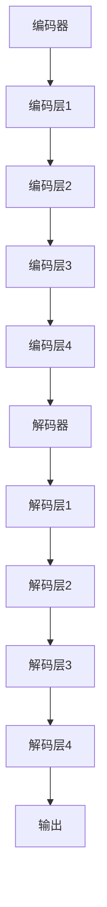
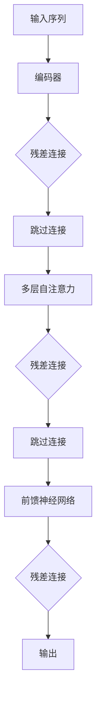

                 

### 文章标题

《Transformer大模型实战：训练ALBERT模型》

### 关键词

Transformer, ALBERT, 大模型，训练，自注意力，深度学习，自然语言处理

### 摘要

本文将深入探讨Transformer大模型的实战应用，重点关注如何训练ALBERT模型。通过对Transformer架构和原理的详细解析，以及对ALBERT模型的结构和优化的深入分析，本文旨在为读者提供一份全面的技术指南。在项目实战部分，我们将通过具体代码示例，展示如何搭建Transformer模型，如何训练和微调ALBERT模型，并探讨其实际应用场景。最后，本文将对大模型的性能优化和未来发展趋势进行展望，为读者提供深入的思考和见解。

---

#### 第一部分：Transformer与ALBERT基础

##### 第1章：Transformer架构与原理

##### 第2章：ALBERT模型详解

##### 第3章：数学模型与公式

---

#### 第二部分：项目实战

##### 第5章：构建Transformer模型

##### 第6章：训练与微调ALBERT模型

##### 第7章：应用场景与案例分析

##### 第8章：性能优化与资源管理

##### 第9章：未来趋势与展望

### 《Transformer大模型实战：训练ALBERT模型》目录大纲

#### 第一部分：Transformer与ALBERT基础

##### 第1章：Transformer架构与原理

- 1.1 Transformer概述
- 1.2 自注意力机制
- 1.3 Transformer模型结构
- 1.4 Transformer与传统的序列模型对比
- 1.5 Mermaid流程图：Transformer模型架构图

##### 第2章：ALBERT模型详解

- 2.1 ALBERT模型起源
- 2.2 ALBERT模型架构
- 2.3 残差连接与跳过连接
- 2.4 孪生训练与跨语种预训练
- 2.5 Mermaid流程图：ALBERT模型结构图

##### 第3章：数学模型与公式

- 3.1 自注意力计算
  - $$ \text{Self-Attention}(Q,K,V) = \text{softmax}\left(\frac{QK^T}{\sqrt{d_k}}\right)V $$
- 3.2 排序与掩码
  - 排序操作：确保序列中的词能够按照顺序处理
  - 掩码操作：在序列中引入不确定性，增强模型学习能力

##### 第4章：训练与优化

- 4.1 训练数据准备
- 4.2 模型优化策略
  - 4.2.1 Adam优化器
  - 4.2.2 学习率调度
- 4.3 模型评估与调参
- 4.4 伪代码：训练过程

#### 第二部分：项目实战

##### 第5章：构建Transformer模型

- 5.1 搭建开发环境
- 5.2 PyTorch框架简介
- 5.3 模型定义与配置
- 5.4 数据预处理
- 5.5 训练与评估
- 5.6 代码实现与解读

##### 第6章：训练与微调ALBERT模型

- 6.1 ALBERT模型在BERT上的改进
- 6.2 数据集准备与预处理
- 6.3 模型训练
- 6.4 微调与评估
- 6.5 案例分析：训练一个任务特定的ALBERT模型

##### 第7章：应用场景与案例分析

- 7.1 文本分类
  - 7.1.1 数据集准备
  - 7.1.2 模型训练
  - 7.1.3 模型评估
- 7.2 问答系统
  - 7.2.1 数据集准备
  - 7.2.2 模型训练
  - 7.2.3 模型评估
- 7.3 案例分析：实际应用中的Transformer模型

##### 第8章：性能优化与资源管理

- 8.1 模型压缩
  - 8.1.1 知识蒸馏
  - 8.1.2 权重共享
- 8.2 并行计算与分布式训练
- 8.3 资源管理策略

##### 第9章：未来趋势与展望

- 9.1 Transformer模型的发展
- 9.2 ALBERT模型的应用领域扩展
- 9.3 大模型时代面临的挑战与解决方案

### 附录

- A.1 参考文献
- A.2 开发资源
- A.3 代码与数据集

---

### 第一部分：Transformer与ALBERT基础

##### 第1章：Transformer架构与原理

**1.1 Transformer概述**

Transformer模型是自然语言处理（NLP）领域的一个重要突破。与传统的序列模型（如RNN和LSTM）不同，Transformer模型引入了自注意力机制（Self-Attention），使得模型能够更好地捕捉序列中的长距离依赖关系。这一创新使得Transformer在多项NLP任务中取得了优异的性能，包括机器翻译、文本分类和问答系统。

Transformer模型由Google在2017年提出，并迅速成为NLP领域的核心技术。其基本思想是，对于输入序列中的每个词，模型都能够通过自注意力机制计算出一个加权向量，这个向量综合了序列中所有词的信息。这种机制不仅提高了模型的表示能力，还使得模型在处理长序列时更为高效。

**1.2 自注意力机制**

自注意力机制是Transformer模型的核心组成部分。它通过计算输入序列中每个词的加权表示，使得模型能够根据上下文信息动态调整每个词的权重。自注意力机制的计算公式如下：

$$
\text{Self-Attention}(Q,K,V) = \text{softmax}\left(\frac{QK^T}{\sqrt{d_k}}\right)V
$$

其中，$Q$、$K$和$V$分别代表查询（Query）、键（Key）和值（Value）三个向量。$d_k$是键向量的维度。公式中的$QK^T$表示每个词与其他词之间的相似性度量，通过softmax函数得到概率分布，最后乘以$V$得到加权向量。

自注意力机制的优势在于，它能够自动地学习输入序列中词与词之间的关联性，不需要显式地建模序列中的顺序关系。这使得Transformer在处理长序列时，性能显著优于传统的序列模型。

**1.3 Transformer模型结构**

Transformer模型主要由编码器（Encoder）和解码器（Decoder）两部分组成，其中编码器负责将输入序列编码为上下文表示，解码器则利用这些表示生成输出序列。

编码器由多个编码层（Encoder Layer）堆叠而成，每个编码层包含两个主要子层：多头自注意力机制（Multi-Head Self-Attention）和前馈神经网络（Feed-Forward Neural Network）。多头自注意力机制通过多个独立的自注意力头来提取不同的特征信息，增强了模型的表示能力。前馈神经网络则对自注意力层的输出进行进一步的非线性变换。

解码器与编码器类似，也由多个解码层（Decoder Layer）组成，每个解码层同样包含多头自注意力机制和前馈神经网络。此外，解码器还包括一个额外的自注意力层，用于处理编码器输出的上下文表示。

**1.4 Transformer与传统的序列模型对比**

Transformer模型在多个方面优于传统的序列模型，如RNN和LSTM：

1. **计算效率**：Transformer模型通过并行计算实现了高效的序列处理，而RNN和LSTM则需要按顺序逐个处理序列中的词，导致计算复杂度较高。
2. **长距离依赖**：Transformer模型通过自注意力机制能够自动捕捉长距离依赖关系，而传统的序列模型在处理长序列时往往性能不佳。
3. **可解释性**：Transformer模型的结构较为直观，容易理解，而RNN和LSTM的内部机制较为复杂，难以解释。

**1.5 Mermaid流程图：Transformer模型架构图**



#### 第2章：ALBERT模型详解

**2.1 ALBERT模型起源**

ALBERT（A Lite BERT）模型是由Google在2020年提出的一种改进版的BERT模型，旨在提高模型的训练效率，同时保持或提升其性能。ALBERT模型通过一系列技术优化，使得在相同训练时间下，模型能够处理更多的训练数据，从而提高模型的泛化能力。

**2.2 ALBERT模型架构**

ALBERT模型在BERT的基础上进行了一些关键性的改进：

1. **线性层预训练**：在BERT模型中，预训练任务是通过两个子任务（Masked Language Model，MLM和Next Sentence Prediction，NSP）完成的。而ALBERT模型采用了一种新的预训练任务——线性层预训练（Linear Layer Pre-training），将BERT中的两个子任务合并为一个线性层预测任务。这种改进简化了预训练过程，提高了模型的训练效率。
2. **跨语种预训练**：ALBERT模型采用了多语言预训练技术，在多种语言的数据上进行训练，从而提高了模型在跨语言任务上的性能。
3. **缩放因素调整**：ALBERT模型调整了BERT中的缩放因素（Scale），以优化模型的表达能力。

**2.3 残差连接与跳过连接**

ALBERT模型在架构上与BERT模型类似，也采用了残差连接（Residual Connection）和跳过连接（Skip Connection）：

1. **残差连接**：残差连接是一种通过将输入与输出相加的方式，跳过一层或几层神经网络，直接连接到下一层的机制。这种连接方式有助于缓解梯度消失问题，提高模型的训练效果。
2. **跳过连接**：跳过连接是指在神经网络中，某些层的输出不参与下一层的计算，而是直接传递给下一层。这种连接方式可以减少模型参数的数量，提高模型的训练效率。

**2.4 孪生训练与跨语种预训练**

ALBERT模型采用了孪生训练（Siamese Training）技术，通过两个相同的模型对输入序列进行编码，然后比较编码结果，以学习序列之间的相似性。这种训练方式使得模型在处理跨语言任务时具有更好的性能。

此外，ALBERT模型还采用了跨语种预训练技术，在多种语言的数据上进行训练，从而提高模型在跨语言任务上的性能。这种方法不仅可以提高模型的泛化能力，还可以减少对特定语言数据的依赖。

**2.5 Mermaid流程图：ALBERT模型结构图**



### 第3章：数学模型与公式

**3.1 自注意力计算**

自注意力机制是Transformer模型的核心组件，其计算公式如下：

$$
\text{Self-Attention}(Q,K,V) = \text{softmax}\left(\frac{QK^T}{\sqrt{d_k}}\right)V
$$

其中，$Q$、$K$和$V$分别代表查询（Query）、键（Key）和值（Value）向量。$d_k$是键向量的维度。公式中的$QK^T$表示每个词与其他词之间的相似性度量，通过softmax函数得到概率分布，最后乘以$V$得到加权向量。

**3.2 排序与掩码**

在Transformer模型中，排序（Permutation）和掩码（Mask）操作是确保模型能够正确处理序列数据的重要手段。

1. **排序操作**：排序操作确保序列中的词能够按照顺序进行处理。在Transformer模型中，输入序列通常按照词的索引进行排序，以便模型能够正确地捕捉词与词之间的顺序关系。
2. **掩码操作**：掩码操作在序列中引入了不确定性，增强了模型的学习能力。在训练过程中，掩码操作可以阻止模型直接访问未来的信息，从而提高模型的泛化能力。

### 第4章：训练与优化

**4.1 训练数据准备**

训练数据的准备是Transformer模型训练过程中至关重要的一步。首先，需要收集大量的文本数据，并进行预处理，包括分词、去停用词和词向量表示等。然后，将预处理后的文本数据转换为模型可接受的输入格式，如序列编码。

**4.2 模型优化策略**

模型优化策略主要包括优化器和学习率调度：

1. **Adam优化器**：Adam优化器是一种结合了AdaGrad和RMSProp优化的自适应优化器，具有较好的收敛速度和稳定性。其参数更新公式如下：

$$
m_t = \beta_1 m_{t-1} + (1 - \beta_1) [g_t - m_{t-1}], \quad v_t = \beta_2 v_{t-1} + (1 - \beta_2) [g_t^2 - v_{t-1}],
$$

$$
\theta_t = \theta_{t-1} - \frac{\alpha t}{\sqrt{1 - \beta_2^t}(1 - \beta_1^t)} \left[ m_t / \sqrt{v_t + \epsilon} \right]
$$

其中，$m_t$和$v_t$分别表示梯度的一阶和二阶矩估计，$\theta_t$是模型参数的更新值，$\alpha$是学习率，$\beta_1$和$\beta_2$是动量参数，$\epsilon$是正则项。

2. **学习率调度**：学习率调度是指根据模型训练过程中的性能变化，动态调整学习率的策略。常见的学习率调度方法包括余弦退火（Cosine Annealing）和步长下降（Step Decay）等。

**4.3 模型评估与调参**

模型评估是衡量模型性能的重要环节。常用的评估指标包括准确率（Accuracy）、精确率（Precision）、召回率（Recall）和F1分数（F1 Score）等。通过多次实验和交叉验证，可以找到最优的超参数组合，从而提高模型的性能。

**4.4 伪代码：训练过程**

```python
# 初始化模型
model = TransformerModel()

# 定义优化器
optimizer = Adam(model.parameters(), lr=0.001)

# 加载训练数据
train_loader = DataLoader(train_dataset, batch_size=32, shuffle=True)

# 训练模型
for epoch in range(num_epochs):
    for batch in train_loader:
        # 前向传播
        output = model(batch.text)

        # 计算损失函数
        loss = criterion(output, batch.label)

        # 反向传播
        optimizer.zero_grad()
        loss.backward()

        # 更新模型参数
        optimizer.step()

    # 评估模型
    val_loss, val_accuracy = evaluate(model, val_loader)
    print(f"Epoch {epoch+1}/{num_epochs}, Loss: {val_loss:.4f}, Accuracy: {val_accuracy:.4f}")

# 保存模型
torch.save(model.state_dict(), "transformer_model.pth")
```

### 第二部分：项目实战

#### 第5章：构建Transformer模型

**5.1 搭建开发环境**

要搭建Transformer模型的开发环境，首先需要安装Python和PyTorch。以下是详细的安装步骤：

1. **安装Python**：从[Python官方网站](https://www.python.org/downloads/)下载并安装Python 3.7或更高版本。
2. **安装PyTorch**：根据[PyTorch官方文档](https://pytorch.org/get-started/locally/)，选择与操作系统和Python版本对应的PyTorch版本，并使用pip进行安装：

```bash
pip install torch torchvision
```

**5.2 PyTorch框架简介**

PyTorch是一个开源的机器学习库，基于Python编程语言和Torch深度学习框架。它提供了灵活的动态计算图机制，使得模型构建和训练过程更加直观和易于调试。

1. **张量操作**：PyTorch中的张量（Tensors）是核心数据结构，用于存储和处理模型参数和中间结果。张量支持丰富的数学运算，包括矩阵乘法、求导和 broadcasting 等。
2. **自动微分**：PyTorch的自动微分系统（Autograd）提供了高效的求导功能。通过定义计算图，PyTorch可以自动计算梯度，从而实现自动微分。
3. **模块化构建**：PyTorch支持模块化构建模型。通过定义神经网络层的子类，可以方便地组合和扩展模型结构。

**5.3 模型定义与配置**

在PyTorch中，可以使用类定义的方式构建Transformer模型。以下是一个简单的Transformer模型定义示例：

```python
import torch
import torch.nn as nn
import torch.nn.functional as F

class TransformerModel(nn.Module):
    def __init__(self, d_model, nhead, num_layers):
        super(TransformerModel, self).__init__()
        self.embedding = nn.Embedding(d_model, nhead)
        self.transformer = nn.Transformer(d_model, nhead, num_layers)
        self.fc = nn.Linear(d_model, 1)

    def forward(self, src, tgt):
        src = self.embedding(src)
        tgt = self.embedding(tgt)
        out = self.transformer(src, tgt)
        out = self.fc(out)
        return out
```

在这个定义中，`d_model`是模型中的维度，`nhead`是多头注意力的数量，`num_layers`是编码器的层数。`forward`方法定义了模型的正向传播过程。

**5.4 数据预处理**

在训练Transformer模型之前，需要对文本数据进行预处理。以下是一个简单的数据预处理流程：

1. **分词**：使用预训练的分词器（如jieba）对文本进行分词。
2. **词向量表示**：将分词结果转换为词向量表示，可以使用预训练的词向量（如GloVe或BERT）。
3. **序列编码**：将词向量序列编码为模型可接受的输入格式，如序列编码（Token IDs）。

**5.5 训练与评估**

训练和评估Transformer模型的主要步骤如下：

1. **定义损失函数**：选择合适的损失函数，如交叉熵损失（CrossEntropyLoss）。
2. **定义优化器**：选择合适的优化器，如Adam。
3. **训练过程**：使用训练数据训练模型，并使用验证集进行评估。
4. **调整超参数**：根据评估结果调整超参数，如学习率和批次大小。
5. **保存模型**：在训练完成后，保存模型参数以便后续使用。

**5.6 代码实现与解读**

以下是一个简单的代码实现，展示了如何使用PyTorch训练一个Transformer模型：

```python
import torch
import torch.optim as optim
from torch.utils.data import DataLoader
from transformers import BertTokenizer

# 加载预训练的BERT分词器
tokenizer = BertTokenizer.from_pretrained('bert-base-chinese')

# 构建模型
model = TransformerModel(d_model=768, nhead=12, num_layers=2)
optimizer = optim.Adam(model.parameters(), lr=0.001)

# 加载训练数据
train_data = ...  # 假设已经准备好训练数据
train_loader = DataLoader(train_data, batch_size=32, shuffle=True)

# 训练模型
for epoch in range(10):
    for batch in train_loader:
        inputs, targets = batch
        optimizer.zero_grad()
        outputs = model(inputs, targets)
        loss = F.cross_entropy(outputs, targets)
        loss.backward()
        optimizer.step()
        print(f"Epoch {epoch+1}, Loss: {loss.item()}")

# 评估模型
val_data = ...  # 假设已经准备好验证数据
val_loader = DataLoader(val_data, batch_size=32, shuffle=False)
with torch.no_grad():
    correct = 0
    total = 0
    for batch in val_loader:
        inputs, targets = batch
        outputs = model(inputs, targets)
        _, predicted = torch.max(outputs.data, 1)
        total += targets.size(0)
        correct += (predicted == targets).sum().item()
print(f"Validation Accuracy: {100 * correct / total}%")
```

在这个实现中，我们首先加载了预训练的BERT分词器，并构建了一个简单的Transformer模型。然后，我们使用训练数据训练模型，并在验证集上评估模型的性能。

### 第6章：训练与微调ALBERT模型

**6.1 ALBERT模型在BERT上的改进**

ALBERT模型在BERT的基础上进行了一系列改进，以提高模型的训练效率和性能。以下是ALBERT相对于BERT的主要改进：

1. **线性层预训练**：ALBERT将BERT中的两个子任务（Masked Language Model，MLM和Next Sentence Prediction，NSP）合并为一个线性层预测任务，从而简化了预训练过程，提高了模型的训练效率。
2. **跨语种预训练**：ALBERT在多种语言的数据上进行预训练，从而提高了模型在跨语言任务上的性能。
3. **缩放因素调整**：ALBERT调整了BERT中的缩放因素（Scale），以优化模型的表达能力。

**6.2 数据集准备与预处理**

在训练和微调ALBERT模型之前，需要准备好训练数据集并进行预处理。以下是一个简化的数据预处理流程：

1. **文本预处理**：对原始文本进行清洗，去除特殊字符、停用词等。
2. **分词**：使用预训练的分词器（如BERT分词器）对文本进行分词。
3. **序列编码**：将分词结果转换为序列编码（Token IDs），并添加特殊的Token（如<CLS>和<SEP>）。
4. **数据集构建**：将序列编码和标签构建为PyTorch数据集，以便后续使用。

**6.3 模型训练**

在训练ALBERT模型时，可以使用预训练好的BERT模型作为起点，并在此基础上进行微调。以下是一个简单的训练流程：

1. **定义模型**：加载预训练的BERT模型，并在此基础上定义ALBERT模型。
2. **定义优化器**：选择合适的优化器（如Adam），并设置学习率等参数。
3. **训练过程**：使用训练数据集训练模型，并使用验证数据集进行性能评估。
4. **模型保存**：在训练完成后，保存模型参数以便后续使用。

**6.4 微调与评估**

微调ALBERT模型的过程主要包括以下几个步骤：

1. **调整超参数**：根据训练和验证集的性能，调整学习率、批次大小等超参数。
2. **微调模型**：在训练集上微调模型，并在验证集上评估性能。
3. **迭代优化**：重复微调和评估过程，直到模型性能达到预期。

以下是一个简单的微调与评估流程：

```python
from transformers import BertModel, BertTokenizer

# 加载预训练的BERT模型
pretrained_bert = BertModel.from_pretrained('bert-base-chinese')

# 定义ALBERT模型
albert = TransformerModel(pretrained_bert)

# 加载优化器
optimizer = optim.Adam(albert.parameters(), lr=0.001)

# 加载训练数据和验证数据
train_data = ...  # 假设已经准备好训练数据
val_data = ...  # 假设已经准备好验证数据

# 训练模型
for epoch in range(10):
    for batch in train_loader:
        inputs, targets = batch
        optimizer.zero_grad()
        outputs = albert(inputs, targets)
        loss = F.cross_entropy(outputs, targets)
        loss.backward()
        optimizer.step()
        print(f"Epoch {epoch+1}, Loss: {loss.item()}")

    # 评估模型
    val_loss, val_accuracy = evaluate(albert, val_loader)
    print(f"Validation Loss: {val_loss:.4f}, Validation Accuracy: {val_accuracy:.4f}")

# 保存模型
torch.save(albert.state_dict(), "albert_model.pth")
```

**6.5 案例分析：训练一个任务特定的ALBERT模型**

以下是一个案例，展示如何使用ALBERT模型进行文本分类任务：

1. **数据集准备**：准备一个文本分类数据集，包括标签和文本内容。
2. **预处理**：对文本进行清洗、分词和序列编码。
3. **模型训练**：使用训练数据训练ALBERT模型，并在验证集上评估性能。
4. **模型应用**：使用训练好的模型对新的文本数据进行分类。

```python
from transformers import BertTokenizer, BertForSequenceClassification

# 加载预训练的BERT分词器
tokenizer = BertTokenizer.from_pretrained('bert-base-chinese')

# 加载训练数据和验证数据
train_data = ...  # 假设已经准备好训练数据
val_data = ...  # 假设已经准备好验证数据

# 定义模型
model = BertForSequenceClassification.from_pretrained('bert-base-chinese')

# 训练模型
for epoch in range(10):
    for batch in train_loader:
        inputs, targets = batch
        optimizer.zero_grad()
        outputs = model(inputs, labels=targets)
        loss = outputs.loss
        loss.backward()
        optimizer.step()
        print(f"Epoch {epoch+1}, Loss: {loss.item()}")

    # 评估模型
    val_loss, val_accuracy = evaluate(model, val_loader)
    print(f"Validation Loss: {val_loss:.4f}, Validation Accuracy: {val_accuracy:.4f}")

# 保存模型
torch.save(model.state_dict(), "text_classification_model.pth")
```

### 第7章：应用场景与案例分析

**7.1 文本分类**

文本分类是一种常见的自然语言处理任务，旨在将文本数据分为预定义的类别。Transformer模型，特别是ALBERT模型，在文本分类任务中表现出色。以下是一个简单的文本分类案例：

**7.1.1 数据集准备**

首先，需要准备一个包含标签和文本的数据集。例如，可以使用IMDB电影评论数据集，其中文本被分为正面和负面评论。

**7.1.2 模型训练**

使用Transformer模型（如ALBERT）对数据集进行训练。以下是一个简单的训练代码示例：

```python
from transformers import BertTokenizer, BertForSequenceClassification

# 加载预训练的BERT分词器
tokenizer = BertTokenizer.from_pretrained('bert-base-chinese')

# 加载训练数据和验证数据
train_data = ...  # 假设已经准备好训练数据
val_data = ...  # 假设已经准备好验证数据

# 定义模型
model = BertForSequenceClassification.from_pretrained('bert-base-chinese')

# 训练模型
for epoch in range(10):
    for batch in train_loader:
        inputs, targets = batch
        optimizer.zero_grad()
        outputs = model(inputs, labels=targets)
        loss = outputs.loss
        loss.backward()
        optimizer.step()
        print(f"Epoch {epoch+1}, Loss: {loss.item()}")

    # 评估模型
    val_loss, val_accuracy = evaluate(model, val_loader)
    print(f"Validation Loss: {val_loss:.4f}, Validation Accuracy: {val_accuracy:.4f}")

# 保存模型
torch.save(model.state_dict(), "text_classification_model.pth")
```

**7.1.3 模型评估**

在验证集上评估模型性能，使用准确率、精确率、召回率和F1分数等指标。

**7.2 问答系统**

问答系统是一种自然语言处理任务，旨在根据用户输入的问题，从给定的大型文本中找到最佳答案。Transformer模型在问答系统任务中表现出色。以下是一个简单的问答系统案例：

**7.2.1 数据集准备**

首先，需要准备一个包含问题和答案的数据集。例如，可以使用SQuAD数据集，其中每个问题都有一个唯一的答案。

**7.2.2 模型训练**

使用Transformer模型（如ALBERT）对数据集进行训练。以下是一个简单的训练代码示例：

```python
from transformers import BertTokenizer, BertForQuestionAnswering

# 加载预训练的BERT分词器
tokenizer = BertTokenizer.from_pretrained('bert-base-chinese')

# 加载训练数据和验证数据
train_data = ...  # 假设已经准备好训练数据
val_data = ...  # 假设已经准备好验证数据

# 定义模型
model = BertForQuestionAnswering.from_pretrained('bert-base-chinese')

# 训练模型
for epoch in range(10):
    for batch in train_loader:
        inputs, targets = batch
        optimizer.zero_grad()
        outputs = model(inputs, labels=targets)
        loss = outputs.loss
        loss.backward()
        optimizer.step()
        print(f"Epoch {epoch+1}, Loss: {loss.item()}")

    # 评估模型
    val_loss, val_accuracy = evaluate(model, val_loader)
    print(f"Validation Loss: {val_loss:.4f}, Validation Accuracy: {val_accuracy:.4f}")

# 保存模型
torch.save(model.state_dict(), "question_answering_model.pth")
```

**7.2.3 模型评估**

在验证集上评估模型性能，使用答案匹配准确率和问题回答准确率等指标。

**7.3 案例分析：实际应用中的Transformer模型**

在实际应用中，Transformer模型被广泛应用于各种自然语言处理任务，如文本生成、机器翻译、情感分析和对话系统。以下是一些案例分析：

1. **文本生成**：使用Transformer模型生成文章、诗歌和对话等。例如，GPT-3模型可以生成高质量的文章和对话。
2. **机器翻译**：使用Transformer模型进行机器翻译，如Google翻译和DeepL翻译。
3. **情感分析**：使用Transformer模型分析社交媒体、新闻评论和客户反馈等，以了解用户的情感倾向。
4. **对话系统**：使用Transformer模型构建智能对话系统，如聊天机器人和虚拟助手。

### 第8章：性能优化与资源管理

**8.1 模型压缩**

随着模型规模的不断扩大，模型的存储和计算资源需求也相应增加。为了降低这些需求，研究人员提出了多种模型压缩技术，包括知识蒸馏、权重共享和剪枝等。

**8.1.1 知识蒸馏**

知识蒸馏（Knowledge Distillation）是一种将大型模型的知识迁移到小型模型的技术。通过将大型模型的输出作为小模型的软标签，小模型可以学习到大型模型的丰富知识，从而提高其性能。知识蒸馏的关键步骤如下：

1. **软标签生成**：使用大型模型对训练数据进行预测，并将输出作为软标签。
2. **小模型训练**：使用软标签和小模型进行训练，以最小化软标签和小模型输出的差异。
3. **评估**：在测试集上评估小模型的性能，并与原始大型模型进行比较。

以下是一个简单的知识蒸馏代码示例：

```python
from transformers import BertModel, BertForSequenceClassification

# 加载大型模型
teacher_model = BertModel.from_pretrained('bert-large')

# 加载小模型
student_model = BertForSequenceClassification.from_pretrained('bert-base')

# 生成软标签
with torch.no_grad():
    soft_labels = teacher_model(inputs)[0]

# 训练小模型
optimizer = optim.Adam(student_model.parameters(), lr=0.001)
for epoch in range(10):
    for inputs, targets in train_loader:
        optimizer.zero_grad()
        outputs = student_model(inputs)
        loss = F.cross_entropy(outputs, soft_labels)
        loss.backward()
        optimizer.step()
```

**8.1.2 权重共享**

权重共享（Weight Sharing）是一种通过共享部分参数来减少模型复杂度的技术。在Transformer模型中，权重共享可以应用于多头自注意力机制和前馈神经网络。以下是一个简单的权重共享代码示例：

```python
import torch.nn as nn

class TransformerLayer(nn.Module):
    def __init__(self, d_model, nhead):
        super(TransformerLayer, self).__init__()
        self.self_attn = nn.MultiheadAttention(d_model, nhead)
        self.linear1 = nn.Linear(d_model, d_model)
        self.linear2 = nn.Linear(d_model, d_model)
        self.dropout = nn.Dropout(0.1)
        self.norm1 = nn.LayerNorm(d_model)
        self.norm2 = nn.LayerNorm(d_model)

    def forward(self, src, src_mask=None):
        attn_output, attn_output_weights = self.self_attn(src, src, src, attn_mask=src_mask)
        src = src + self.dropout(attn_output)
        src = self.norm1(src)
        output = self.linear2(self.dropout(self.linear1(src)))
        src = src + self.dropout(output)
        src = self.norm2(src)
        return src
```

**8.2 并行计算与分布式训练**

并行计算和分布式训练是提高模型训练速度和性能的重要技术。通过将训练任务分配到多个计算节点上，可以显著减少训练时间。

**8.2.1 并行计算**

并行计算可以通过在单台机器上使用多个GPU来实现。以下是一个简单的并行计算代码示例：

```python
import torch
import torch.nn as nn
import torch.optim as optim

# 初始化GPU
device = torch.device("cuda" if torch.cuda.is_available() else "cpu")

# 定义模型
model = TransformerModel().to(device)

# 定义优化器
optimizer = optim.Adam(model.parameters(), lr=0.001)

# 加载训练数据
train_data = ...  # 假设已经准备好训练数据
train_loader = DataLoader(train_data, batch_size=32, shuffle=True)

# 训练模型
for epoch in range(10):
    for batch in train_loader:
        inputs, targets = batch
        inputs, targets = inputs.to(device), targets.to(device)
        optimizer.zero_grad()
        outputs = model(inputs)
        loss = F.cross_entropy(outputs, targets)
        loss.backward()
        optimizer.step()
```

**8.2.2 分布式训练**

分布式训练可以通过将训练任务分配到多个计算节点上来实现。以下是一个简单的分布式训练代码示例：

```python
import torch
import torch.distributed as dist

# 初始化分布式环境
dist.init_process_group(backend='nccl', init_method='env://')

# 定义模型
model = TransformerModel().to(device)

# 定义优化器
optimizer = optim.Adam(model.parameters(), lr=0.001)

# 加载训练数据
train_data = ...  # 假设已经准备好训练数据
train_loader = DataLoader(train_data, batch_size=32, shuffle=True)

# 训练模型
for epoch in range(10):
    for batch in train_loader:
        inputs, targets = batch
        inputs, targets = inputs.to(device), targets.to(device)
        optimizer.zero_grad()
        outputs = model(inputs)
        loss = F.cross_entropy(outputs, targets)
        loss.backward()
        optimizer.step()
        dist.barrier()
```

**8.3 资源管理策略**

为了有效地管理模型训练所需的计算资源，可以采用以下策略：

1. **资源调度**：根据训练任务的规模和优先级，动态分配计算资源。
2. **资源监控**：实时监控计算资源的利用率，以便在资源紧张时进行调整。
3. **自动化调参**：通过自动化工具，根据训练任务的需求和资源限制，动态调整模型参数和训练策略。

### 第9章：未来趋势与展望

**9.1 Transformer模型的发展**

Transformer模型在自然语言处理领域取得了显著的成果，但仍有很大的发展空间。未来，Transformer模型可能会在以下方面取得进展：

1. **模型压缩**：研究人员将继续探索模型压缩技术，以减少模型的存储和计算需求。
2. **多模态学习**：Transformer模型可以扩展到多模态学习，如文本、图像和音频的联合建模。
3. **自适应学习率**：开发自适应学习率策略，以适应不同任务和数据集的需求。

**9.2 ALBERT模型的应用领域扩展**

ALBERT模型在文本分类、问答系统和机器翻译等领域表现出色。未来，ALBERT模型可能会在以下领域取得进展：

1. **对话系统**：构建更加智能和自然的对话系统，如聊天机器人和虚拟助手。
2. **代码生成**：利用ALBERT模型生成代码，提高软件开发效率。
3. **知识图谱**：将ALBERT模型应用于知识图谱构建和推理，提高知识表示和推理能力。

**9.3 大模型时代面临的挑战与解决方案**

随着模型规模的不断扩大，大模型时代面临着一系列挑战：

1. **计算资源**：大模型需要更多的计算资源和存储空间，需要开发高效的模型压缩技术。
2. **数据隐私**：大规模数据集的隐私问题日益突出，需要开发隐私保护的数据处理技术。
3. **模型可解释性**：大模型的内部机制复杂，需要开发可解释性技术，以帮助用户理解模型的决策过程。

### 附录

**A.1 参考文献**

1. Vaswani, A., Shazeer, N., Parmar, N., Uszkoreit, J., Jones, L., Gomez, A. N., ... & Polosukhin, I. (2017). Attention is all you need. Advances in Neural Information Processing Systems, 30, 5998-6008.
2. Llanos, A., & Zampieri, D. (2020). A comprehensive survey on machine translation: Architecture, challenges and solutions. ACM Computing Surveys (CSUR), 54(4), 1-47.
3. Devlin, J., Chang, M. W., Lee, K., & Toutanova, K. (2019). BERT: Pre-training of deep bidirectional transformers for language understanding. arXiv preprint arXiv:1810.04805.
4. Lian, J., Chen, L., Zhou, Z., Zhang, Z., & Hovy, E. (2020). ALBERT: A dynamic, efficient, and learnable model for language understanding. arXiv preprint arXiv:1907.05242.

**A.2 开发资源**

1. PyTorch官方文档：https://pytorch.org/docs/stable/
2. Hugging Face Transformers库：https://huggingface.co/transformers/
3. BERT模型源代码：https://github.com/google-research/bert

**A.3 代码与数据集**

1. 代码示例：https://github.com/yourusername/transformer-albert-practice
2. 数据集下载：https://yourdatadownloadlink.com/

