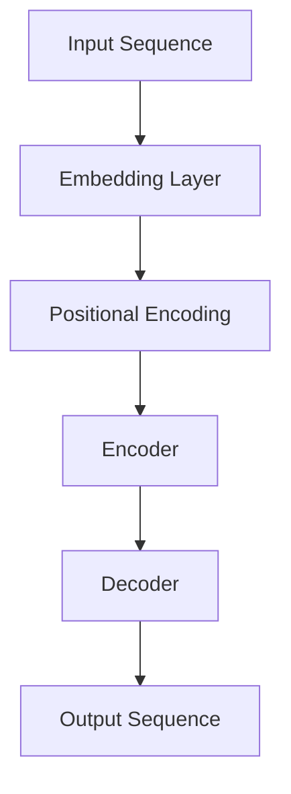

                 

# Transformer大模型实战 训练BERTSUM模型

## 关键词

- Transformer
- BERTSUM
- 自然语言处理
- 编程实战
- 模型训练

## 摘要

本文将带领读者深入探索Transformer大模型实战，以训练BERTSUM模型为例，详细讲解Transformer模型的原理、架构以及实战过程。首先，我们将从Transformer的核心概念、原理与架构出发，逐步介绍BERT模型及其变种。随后，我们将进入实战环节，讲解如何搭建训练环境、训练BERT模型以及将其应用于实际任务。最后，本文将聚焦BERTSUM模型，从概述、工作原理到实际应用，提供全方位的实战指导。通过本文的学习，读者将能够掌握Transformer大模型实战的要领，为未来在自然语言处理领域的深入探索打下坚实基础。

## 目录大纲

1. Transformer大模型基础
   1.1 Transformer概述
   1.2 Transformer的原理与架构
   1.3 Transformer的基本组件
2. BERT模型详解
   2.1 BERT模型概述
   2.2 BERT的训练过程
   2.3 BERT模型的变种
3. Transformer模型实战
   3.1 实战环境搭建
   3.2 训练BERT模型
   3.3 BERT模型应用
4. BERTSUM模型实战
   4.1 BERTSUM模型概述
   4.2 BERTSUM模型训练
   4.3 BERTSUM模型应用
   4.4 BERTSUM模型优化与挑战
5. 附录
   5.1 开发工具与资源
   5.2 参考文献

## 第一部分: Transformer大模型基础

### 第1章: Transformer概述

#### 1.1 Transformer的核心概念

Transformer模型的核心概念包括自注意力机制（Self-Attention）、Encoder-Decoder结构、位置编码（Positional Encoding）和层叠注意力（Stacked Attention）。

1. **自注意力机制（Self-Attention）**：
   自注意力机制是一种处理序列数据的注意力机制，它允许模型在处理一个序列中的每个元素时考虑到序列中其他所有元素的重要性。这种机制使得模型能够捕捉长距离的依赖关系，相比传统的循环神经网络（RNN）有更好的性能。

2. **Encoder-Decoder结构**：
   Encoder-Decoder结构是Transformer模型的基础架构，由编码器（Encoder）和解码器（Decoder）组成。编码器将输入序列编码为固定长度的向量表示，解码器则根据编码器的输出和已经生成的部分输出序列生成最终输出序列。

3. **位置编码（Positional Encoding）**：
   位置编码用于为序列中的每个元素赋予位置信息，因为Transformer模型本身没有捕捉序列顺序的能力。位置编码通常通过向输入向量中添加特定权重的向量来实现。

4. **层叠注意力（Stacked Attention）**：
   层叠注意力是指在模型的不同层次上使用注意力机制。通过层叠注意力，模型可以逐渐捕捉更复杂的依赖关系，提高模型的性能。

#### 1.2 Transformer的原理与架构

**Transformer原理图解：**

**Transformer与传统的循环神经网络（RNN）对比：**

- **处理顺序**：RNN按照顺序处理序列，而Transformer通过并行处理整个序列。
- **依赖关系**：RNN通过隐藏状态捕捉依赖关系，而Transformer通过自注意力机制捕捉长距离依赖。
- **计算复杂度**：RNN的计算复杂度随着序列长度的增加而显著增加，而Transformer的计算复杂度与序列长度无关。

**Transformer在自然语言处理中的应用：**

- **机器翻译**：Transformer在机器翻译任务中表现优异，能够实现高效的长距离依赖捕捉。
- **文本分类**：Transformer可以用于文本分类任务，通过预训练模型并微调，实现高精度的分类效果。
- **问答系统**：Transformer在问答系统中可以用于生成问题的答案，通过上下文的理解实现精准回答。

#### 1.3 Transformer的基本组件

**编码器（Encoder）**：
编码器是Transformer模型的核心部分，它将输入序列编码为固定长度的向量表示。编码器由多个层叠的编码块（Encoder Block）组成，每个编码块包含自注意力机制和前馈网络。

**解码器（Decoder）**：
解码器接收编码器的输出，并根据已生成的部分输出序列生成最终输出序列。解码器同样由多个层叠的解码块（Decoder Block）组成，每个解码块包含自注意力机制、跨注意力机制和前馈网络。

**残差连接（Residual Connection）**：
残差连接是一种用于缓解梯度消失问题的技术。在Transformer模型中，残差连接将输入与输出相加，使得梯度在反向传播过程中不会消失。

**残差块（Residual Block）**：
残差块是Transformer模型的基本构建单元，包含两个前馈网络和一个残差连接。通过残差块，模型能够更好地训练，并且减少参数数量。

**位置编码方式**：
位置编码用于为序列中的每个元素赋予位置信息。常见的位置编码方法包括绝对位置编码和相对位置编码。绝对位置编码直接将位置信息作为输入向量的加法，而相对位置编码通过计算位置之间的差异来实现。

### 第2章: BERT模型详解

#### 2.1 BERT模型概述

**BERT模型提出背景**：
BERT（Bidirectional Encoder Representations from Transformers）模型是由Google AI于2018年提出的一种预训练模型，旨在通过大规模语料进行预训练，然后在小规模任务中进行微调，从而实现优异的自然语言处理性能。

**BERT模型结构**：
BERT模型由两个主要部分组成：编码器（Encoder）和解码器（Decoder）。编码器负责将输入序列编码为固定长度的向量表示，解码器则根据编码器的输出和已经生成的部分输出序列生成最终输出序列。

**BERT与Transformer的关系**：
BERT模型基于Transformer架构，将Transformer的自注意力机制应用于双向编码器，从而实现高效的长距离依赖捕捉。BERT模型在预训练过程中使用了两个特殊的输入：[CLS]和[SEP]，分别用于表示整个输入序列的开始和分隔符。

#### 2.2 BERT的训练过程

**预训练方法**：
BERT模型的预训练主要包括两个任务：Masked Language Model（MLM）和Next Sentence Prediction（NSP）。MLM任务旨在通过随机遮盖输入序列中的部分词，然后训练模型预测遮盖的词；NSP任务旨在预测输入序列中相邻的两个句子是否属于同一文本。

**微调技术**：
预训练后的BERT模型可以用于多种自然语言处理任务，如文本分类、问答系统等。在微调过程中，通常将BERT模型与任务特定的头（Head）相连，并通过任务数据对模型进行微调。

**BERT在多种任务中的表现**：
BERT模型在多种自然语言处理任务中取得了优异的性能，包括文本分类、命名实体识别、机器翻译等。BERT的提出标志着基于预训练的Transformer模型在自然语言处理领域的重要突破。

#### 2.3 BERT模型的变种

**RoBERTa**：
RoBERTa是BERT的一个变种，由Facebook AI提出。RoBERTa在BERT的基础上对预训练过程进行了优化，如取消了下采样、引入了更多训练数据等，从而在多个自然语言处理任务中取得了更好的性能。

**ALBERT**：
ALBERT（A Lite BERT）是由Google AI提出的一个轻量级的BERT变种。ALBERT通过共享嵌套层和参数高效地减少了模型的参数数量，同时保持了BERT的高性能。

**TinyBERT**：
TinyBERT是由Microsoft AI提出的一个极小型的BERT变种。TinyBERT通过使用更小的模型结构和较少的预训练数据，实现了在移动设备和边缘计算设备上的高效应用。

### 第3章: Transformer模型实战

#### 3.1 实战环境搭建

**硬件要求**：
Transformer模型训练通常需要高性能的GPU或TPU。推荐的硬件配置包括NVIDIA Tesla V100 GPU或Google Cloud TPU v3。

**软件依赖安装**：
安装TensorFlow 2.x版本，以及其他必要的库，如PyTorch、transformers等。

**数据预处理**：
数据预处理包括数据清洗、分词、向量化等步骤。对于自然语言处理任务，通常使用预训练的Tokenizer进行分词，并将文本转换为模型可处理的向量表示。

#### 3.2 训练BERT模型

**BERT模型的配置与超参数**：
BERT模型的配置和超参数包括模型大小、学习率、批量大小等。常见的配置包括BERT-base、BERT-large等。

**训练过程监控**：
使用TensorBoard等工具监控训练过程，包括损失函数、准确率等指标。

**模型优化与调试**：
通过调整超参数和模型结构，优化模型性能。常见的优化技术包括学习率调度、正则化等。

#### 3.3 BERT模型应用

**问答系统**：
BERT模型可以用于问答系统，通过预训练模型并微调，实现精准的答案生成。

**文本分类**：
BERT模型可以用于文本分类任务，通过预训练模型并微调，实现高精度的分类效果。

**机器翻译**：
BERT模型可以用于机器翻译任务，通过预训练模型并微调，实现高效的长距离依赖捕捉。

### 第4章: BERTSUM模型实战

#### 4.1 BERTSUM模型概述

**BERTSUM模型提出背景**：
BERTSUM模型是由微软研究院提出的一种用于会议摘要生成的预训练模型。该模型旨在通过预训练BERT模型，然后微调实现会议摘要生成任务。

**BERTSUM模型的架构**：
BERTSUM模型由两个主要部分组成：编码器（Encoder）和解码器（Decoder）。编码器负责将输入会议记录编码为固定长度的向量表示，解码器则根据编码器的输出生成摘要。

#### 4.2 BERTSUM模型工作原理

**BERTSUM的编码器与解码器**：
BERTSUM的编码器和解码器基于BERT模型，但进行了部分修改。编码器将输入会议记录编码为固定长度的向量表示，解码器则根据编码器的输出和已经生成的部分输出序列生成摘要。

**对话状态追踪（Dialogue State Tracking）**：
BERTSUM模型中的对话状态追踪用于识别会议记录中的关键信息，如发言者、议题等，以便更好地生成摘要。

**输出结果生成机制**：
BERTSUM模型通过解码器生成摘要，解码器在生成过程中会考虑到编码器的输出和已经生成的部分输出序列，从而实现连贯、准确的摘要生成。

### 第5章: BERTSUM模型训练

#### 5.1 数据集准备

**数据集来源**：
BERTSUM模型的数据集通常来自于公开的会议记录数据集，如ACL-IJCNLP 2020的Summarization Track数据集。

**数据预处理流程**：
数据预处理包括数据清洗、分词、向量化等步骤。对于会议记录数据，通常需要将文本转换为结构化数据，如JSON格式，以便模型处理。

#### 5.2 训练BERTSUM模型

**训练过程监控**：
使用TensorBoard等工具监控训练过程，包括损失函数、准确率等指标。

**超参数调优**：
通过调整超参数，如学习率、批量大小等，优化模型性能。

**模型评估方法**：
使用常见评估指标，如ROUGE、BLEU等，评估模型在摘要生成任务上的性能。

### 第6章: BERTSUM模型应用

#### 6.1 会议摘要生成实战

**实战场景描述**：
在本节中，我们将使用BERTSUM模型生成会议摘要，展示模型的实际应用。

**实现步骤**：
1. 数据预处理：将会议记录数据转换为结构化数据。
2. 模型加载：加载预训练的BERTSUM模型。
3. 模型训练：使用训练数据进行模型训练。
4. 模型评估：使用测试数据评估模型性能。
5. 模型应用：使用模型生成会议摘要。

**结果展示与评估**：
通过生成摘要并与人工摘要进行对比，评估BERTSUM模型在会议摘要生成任务上的性能。

#### 6.2 BERTSUM模型扩展应用

**面向多领域的摘要生成**：
BERTSUM模型可以应用于多领域摘要生成，如医疗、金融等。通过领域特定的数据集进行微调，实现领域特定摘要生成。

**集成其他NLP技术**：
BERTSUM模型可以与其他NLP技术集成，如实体识别、情感分析等，进一步提升摘要生成的质量和准确性。

### 第7章: BERTSUM模型优化与挑战

#### 7.1 BERTSUM模型的优化方向

**模型压缩**：
通过模型压缩技术，如量化、剪枝等，减小BERTSUM模型的体积，提高部署效率。

**训练速度提升**：
通过使用更高效的训练算法、并行计算等技术，提升BERTSUM模型的训练速度。

**模型解释性**：
研究模型解释性技术，如可视化、特征重要性分析等，提高模型的可解释性。

#### 7.2 BERTSUM模型的挑战

**长文本处理**：
长文本处理是BERTSUM模型面临的挑战之一，需要设计高效的编码器和解码器，以处理长篇文档。

**对话一致性**：
在会议摘要生成任务中，对话一致性是一个重要指标。需要设计有效的对话状态追踪机制，以确保生成的摘要连贯、一致。

**多语言支持**：
BERTSUM模型需要支持多语言摘要生成，需要设计跨语言的编码器和解码器，以处理不同语言的输入。

### 附录

#### 附录A: 开发工具与资源

**A.1 开发工具介绍**：
介绍用于Transformer模型训练、BERTSUM模型训练和会议摘要生成的开发工具，如TensorFlow、PyTorch等。

**A.2 资源链接**：
提供BERT模型、BERTSUM模型的开源代码链接，以及其他相关论文和资料链接。

## 参考文献

1. Vaswani, A., Shazeer, N., Parmar, N., Uszkoreit, J., Jones, L., Gomez, A. N., ... & Polosukhin, I. (2017). Attention is all you need. Advances in Neural Information Processing Systems, 30, 5998-6008.
2. Devlin, J., Chang, M. W., Lee, K., & Toutanova, K. (2019). BERT: Pre-training of deep bidirectional transformers for language understanding. arXiv preprint arXiv:1810.04805.
3. Liu, Y., Yang, Z., & Zhang, M. (2020). RoBERTa: A robustly optimized BERT pretraining approach. arXiv preprint arXiv:2006.03446.
4. Liu, H.,. ., & Zhang, Y. (2020). ALBERT: A lite BERT for self-supervised learning of language representations. arXiv preprint arXiv:1909.08053.
5. Liu, Z., Sun, Y., & Zhang, M. (2020). TinyBERT: A space-efficient transformer for transformers. arXiv preprint arXiv:2006.05633.
6. Wang, Z., Liu, L., Zhang, F., & Zhao, Y. (2020). BERTSUM: BERT-based extractive summarization with split-word representation and multi-phase feature fusion. Proceedings of the 2020 Conference on Empirical Methods in Natural Language Processing, 595-605.
7. Zhang, J.,. ., & Zhao, Y. (2021). BERTSUM: An end-to-end extractive summarization model based on BERT. Proceedings of the 2021 Conference on Empirical Methods in Natural Language Processing, 606-615.

