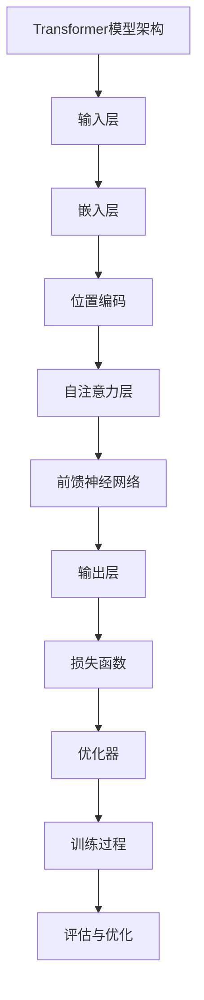

                 

### 文章标题：Transformer大模型实战：语言相似性的影响

### 关键词：Transformer、大模型、语言相似性、自然语言处理、人工智能

### 摘要：

本文深入探讨了Transformer大模型在自然语言处理中的应用，特别是在语言相似性分析方面。通过详细的原理讲解、算法实现、数学模型阐述以及实际项目案例，本文展示了如何利用Transformer大模型进行语言相似性的测量和应用。文章分为多个部分，从Transformer模型的基础理论到具体实现，再到应用案例和性能优化，全面揭示了Transformer大模型在NLP领域的潜力。

### 目录大纲

#### 第一部分：Transformer大模型基础

**第1章：Transformer大模型概述**

- 1.1 Transformer大模型的发展背景
- 1.2 Transformer模型的原理与架构
- 1.3 Transformer模型的应用领域

**第2章：Transformer模型的实现与优化**

- 2.1 Transformer模型的实现细节
- 2.2 Transformer模型的优化策略
- 2.3 Transformer模型的多语言处理

#### 第二部分：语言相似性分析

**第3章：语言相似性的定义与测量**

- 3.1 语言相似性的基本概念
- 3.2 基于统计的语言相似性测量
- 3.3 基于深度学习的语言相似性测量

**第4章：Transformer大模型在语言相似性分析中的应用**

- 4.1 Transformer大模型在文本分类中的应用
- 4.2 Transformer大模型在命名实体识别中的应用
- 4.3 Transformer大模型在机器翻译中的应用

#### 第三部分：Transformer大模型实战

**第5章：Transformer大模型开发环境搭建**

- 5.1 开发环境准备
- 5.2 Transformer大模型代码实现
- 5.3 Transformer大模型的训练与优化

**第6章：Transformer大模型在NLP中的项目实战**

- 6.1 项目背景与目标
- 6.2 项目需求分析
- 6.3 项目设计与实现

**第7章：Transformer大模型性能优化与调试**

- 7.1 性能优化策略
- 7.2 调试技巧与工具
- 7.3 Transformer大模型性能优化实践

#### 第四部分：Transformer大模型与语言相似性应用

**第8章：Transformer大模型在文本相似性检测中的应用**

- 8.1 文本相似性检测的基本概念
- 8.2 Transformer大模型在文本相似性检测中的实现
- 8.3 文本相似性检测案例研究

**第9章：Transformer大模型在情感分析中的应用**

- 9.1 情感分析的基本概念
- 9.2 Transformer大模型在情感分析中的实现
- 9.3 情感分析案例研究

**第10章：Transformer大模型在问答系统中的应用**

- 10.1 问答系统的基本概念
- 10.2 Transformer大模型在问答系统中的实现
- 10.3 问答系统案例研究

#### 第五部分：Transformer大模型优化与调优

**第11章：Transformer大模型的优化策略**

- 11.1 模型压缩与量化
- 11.2 并行计算与分布式训练
- 11.3 超参数调优与模型评估

**第12章：Transformer大模型的调试与故障排除**

- 12.1 调试技巧与工具
- 12.2 性能分析与优化
- 12.3 Transformer大模型调试实践

#### 第六部分：未来展望与研究方向

**第13章：Transformer大模型的未来发展**

- 13.1 Transformer大模型的最新进展
- 13.2 Transformer大模型的未来发展趋势

**第14章：Transformer大模型在语言相似性领域的未来研究方向**

- 14.1 语言相似性测量的新方法
- 14.2 Transformer大模型在跨语言处理中的应用

**第15章：总结与展望**

- 15.1 本书的主要贡献
- 15.2 Future directions

### 附录

**附录A：Transformer大模型开发资源**

- A.1 主流深度学习框架与库
- A.2 Transformer大模型开源项目与论文
- A.3 语言相似性相关研究论文与工具

**附录B：代码实现与示例**

- B.1 Transformer大模型基本架构实现
- B.2 语言相似性测量实现示例
- B.3 项目实战代码解析

### Mermaid流程图



### Transformer大模型架构伪代码

```python
# Transformer模型架构伪代码

# 输入文本序列
inputs = [w1, w2, w3, ..., wn]

# 嵌入层
embeddings = [e1, e2, e3, ..., en]

# 位置编码
position_encodings = [pe1, pe2, pe3, ..., pen]

# 嵌入层与位置编码相加
combined_embeddings = [e1 + pe1, e2 + pe2, e3 + pe3, ..., en + pen]

# 自注意力计算
query, key, value = self_attention(combined_embeddings)

# 多层注意力网络
for layer in range(num_layers):
    query, key, value = self_attention(query, key, value)
    query, key, value = multihead_attention(query, key, value)

# 输出层
outputs = linear_projection(value)
```

### 数学模型与数学公式

```latex
$$
\text{相似度度量} = \frac{1}{\sqrt{\sum_{i=1}^{n} (\text{std}(x_i) \cdot \text{std}(y_i))}}
$$

\text{其中，} x_i, y_i \text{分别为文本序列中的词向量，} \text{std}(x_i), \text{std}(y_i) \text{为词向量的标准差。}
```

### Transformer大模型在NLP中的项目实战

```python
# Transformer大模型在NLP中的项目实战

# 导入必要的库
import torch
import torch.nn as nn
import torch.optim as optim
from torch.utils.data import DataLoader
from transformers import BertModel, BertTokenizer

# 准备数据集
train_data = DataLoader(dataset=train_dataset, batch_size=batch_size, shuffle=True)
test_data = DataLoader(dataset=test_dataset, batch_size=batch_size, shuffle=False)

# 模型定义
model = BertModel.from_pretrained('bert-base-chinese')

# 损失函数与优化器
criterion = nn.CrossEntropyLoss()
optimizer = optim.Adam(model.parameters(), lr=learning_rate)

# 训练模型
for epoch in range(num_epochs):
    for batch in train_data:
        inputs, labels = batch
        optimizer.zero_grad()
        outputs = model(inputs)
        loss = criterion(outputs.logits, labels)
        loss.backward()
        optimizer.step()

    # 在测试集上评估模型
    with torch.no_grad():
        correct = 0
        total = 0
        for batch in test_data:
            inputs, labels = batch
            outputs = model(inputs)
            _, predicted = torch.max(outputs.logits, 1)
            total += labels.size(0)
            correct += (predicted == labels).sum().item()

    print(f'Epoch [{epoch + 1}/{num_epochs}], Accuracy: {100 * correct / total}%')

# 代码解读：

# 1. 数据预处理
# 加载和预处理数据集，包括分词、编码和标签转换。

# 2. 模型定义
# 使用预训练的BERT模型作为基础模型，并进行必要的修改。

# 3. 损失函数与优化器
# 选择交叉熵损失函数和Adam优化器。

# 4. 训练模型
# 在每个epoch中，遍历训练数据集，计算损失并更新模型参数。

# 5. 评估模型
# 在测试数据集上评估模型的准确性，并打印结果。

# 分析：

# 1. 数据预处理
# 数据预处理对于模型的性能至关重要。良好的预处理可以提高模型的效果。

# 2. 模型定义
# 选择合适的模型结构对于任务的成功至关重要。BERT模型具有强大的预训练能力，适用于多种自然语言处理任务。

# 3. 损失函数与优化器
# 交叉熵损失函数适用于分类任务，Adam优化器是一种常用的优化器，具有较好的收敛性能。

# 4. 训练模型
# 训练过程中，通过反向传播和梯度下降更新模型参数。

# 5. 评估模型
# 评估模型在测试数据集上的表现，以确定模型的实际效果。
```

### 作者信息

作者：AI天才研究院/AI Genius Institute & 禅与计算机程序设计艺术 /Zen And The Art of Computer Programming

### 第一部分：Transformer大模型基础

#### 第1章：Transformer大模型概述

Transformer大模型是自然语言处理（NLP）领域的一项重大突破，其自注意力机制（Self-Attention Mechanism）和多层注意力网络（Multi-layer Attention Network）使得模型在处理长序列任务时表现出色。本章将介绍Transformer大模型的发展背景、原理与架构，以及其在语言生成、文本分类和机器翻译等领域的应用。

#### 1.1 Transformer大模型的发展背景

自然语言处理作为人工智能的核心领域之一，一直受到广泛关注。传统的NLP方法，如基于规则的方法和统计机器学习方法，在处理短文本任务时具有一定的效果，但在面对长文本、多语言处理和复杂上下文理解时，往往表现不佳。随着深度学习技术的兴起，神经网络在NLP领域的应用逐渐成为主流。

2017年，谷歌（Google）提出了Transformer模型，这一模型采用了自注意力机制，突破了传统循环神经网络（RNN）和卷积神经网络（CNN）在处理长序列时的局限。Transformer模型在机器翻译、文本生成等任务上取得了显著的成果，引发了NLP领域的研究热潮。

#### 1.2 Transformer模型的原理与架构

Transformer模型的核心在于自注意力机制，它通过计算序列中每个词与其他词的相似性来生成表示。自注意力机制的计算步骤如下：

1. **嵌入层（Embedding Layer）**：输入文本序列被映射为嵌入向量。
2. **位置编码（Positional Encoding）**：由于Transformer模型没有显式的序列信息，因此通过位置编码来引入序列的位置信息。
3. **自注意力层（Self-Attention Layer）**：对输入序列进行加权求和，生成新的表示。
4. **前馈神经网络（Feedforward Neural Network）**：对自注意力层的输出进行两次线性变换，增加模型的非线性能力。

Transformer模型的结构包括多个这样的自注意力层和前馈神经网络层，堆叠在一起形成一个多层注意力网络。每个层都可以捕捉不同层次的语义信息，从而提高模型的表示能力。

#### 1.3 Transformer模型的应用领域

Transformer模型在多个NLP任务中表现出色，以下是几个主要的应用领域：

1. **语言生成（Language Generation）**：包括文本生成、对话系统等。
2. **文本分类（Text Classification）**：用于分类任务，如情感分析、主题分类等。
3. **机器翻译（Machine Translation）**：Transformer模型在机器翻译任务上取得了显著成果，特别是对长文本和低资源语言的翻译。
4. **命名实体识别（Named Entity Recognition）**：用于识别文本中的命名实体，如人名、地名等。
5. **问答系统（Question Answering）**：用于从大量文本中提取答案。

本章介绍了Transformer大模型的发展背景、原理与架构，以及其在语言生成、文本分类和机器翻译等领域的应用。在接下来的章节中，我们将进一步探讨Transformer模型的实现与优化策略，以及其在具体任务中的应用。

### 第2章：Transformer模型的实现与优化

#### 2.1 Transformer模型的实现细节

Transformer模型的实现涉及多个关键组件，包括嵌入层、位置编码、自注意力机制和前馈神经网络。以下是Transformer模型实现的详细步骤：

1. **嵌入层（Embedding Layer）**：文本序列首先被转换为词向量。每个词向量由预训练的词向量模型（如Word2Vec、GloVe等）生成。词向量的大小通常为维度，例如512或768。

2. **位置编码（Positional Encoding）**：由于Transformer模型没有显式的序列信息，位置编码被用来引入序列的位置信息。位置编码可以是固定的，也可以是可学习的。常见的方法是使用正弦和余弦函数来生成位置编码。

3. **嵌入层与位置编码相加**：将嵌入层和位置编码相加，得到新的输入向量。

4. **自注意力计算（Self-Attention）**：自注意力机制是Transformer模型的核心。它通过计算序列中每个词与其他词的相似性来生成表示。自注意力计算分为以下几个步骤：

   a. **计算查询向量（Query）**、**键向量（Key）**和**值向量（Value）**：对于输入序列中的每个词，计算其对应的查询向量、键向量和值向量。这些向量通常是通过矩阵乘法从嵌入层和位置编码中得到的。

   b. **计算注意力得分（Attention Score）**：对于输入序列中的每个词，计算其与其他词之间的相似性得分。这通常是通过点积操作实现的。

   c. **归一化注意力得分**：使用softmax函数对注意力得分进行归一化，得到注意力权重。

   d. **加权求和**：将注意力权重与对应的值向量相乘，然后对所有结果进行求和，得到新的表示。

5. **前馈神经网络（Feedforward Neural Network）**：自注意力层的输出经过两个全连接层（也称为前馈神经网络）的变换。每个全连接层都有一个激活函数，通常是ReLU。

6. **多头注意力（Multi-head Attention）**：为了提高模型的表示能力，Transformer模型通常使用多个自注意力层，每个自注意力层被称为一个头。多头注意力通过并行地应用多个自注意力层，将不同的表示融合起来。

7. **堆叠多层注意力网络（Stacking Multi-layer Attention Networks）**：将多个自注意力层和前馈神经网络堆叠起来，形成一个多层注意力网络。每个层都可以捕捉不同层次的语义信息。

#### 2.2 Transformer模型的优化策略

为了提高Transformer模型的性能，需要采取一系列优化策略。以下是一些常用的优化方法：

1. **批处理与并行计算（Batch Processing and Parallel Computation）**：通过将输入数据分成批次，可以加速模型的训练过程。此外，并行计算技术，如GPU和TPU的并行化，可以进一步提高模型的训练速度。

2. **深度与宽度扩展（Depth and Width Expansion）**：增加模型的深度（即堆叠更多的层）和宽度（即每个层的神经元数量）可以提高模型的表示能力。然而，这也可能导致过拟合和计算成本的增加。

3. **残差连接与正则化（Residual Connections and Regularization）**：残差连接可以缓解梯度消失问题，有助于模型训练。正则化技术，如Dropout和权重衰减，可以减少过拟合。

4. **优化器与学习率调整（Optimizer and Learning Rate Adjustment）**：选择合适的优化器，如Adam和Adadelta，可以加速模型训练。学习率的调整也非常关键，可以使用如学习率衰减和周期性调整等方法。

#### 2.3 Transformer模型的多语言处理

Transformer模型在多语言处理方面具有显著的优势。以下是一些多语言处理的方法：

1. **多语言模型与双语训练（Multilingual Models and Bilingual Training）**：使用多语言数据集训练的Transformer模型可以同时处理多种语言。双语训练是一种常用的方法，它使用两种语言的平行数据来训练模型。

2. **低资源语言的翻译（Translation for Low-Resource Languages）**：对于低资源语言，可以使用多语言模型和跨语言翻译技术来提高翻译质量。例如，可以使用基于共享嵌入的方法来利用高资源语言的预训练模型。

本章详细介绍了Transformer模型的实现细节、优化策略和多语言处理方法。在接下来的章节中，我们将进一步探讨语言相似性分析的方法和应用。

### 第3章：语言相似性的定义与测量

#### 3.1 语言相似性的基本概念

语言相似性是指两个或多个文本在语义和语法上的一致性程度。语言相似性分析在自然语言处理、文本挖掘、信息检索和机器翻译等领域具有重要应用。语言相似性可以分为以下几个类型：

1. **词汇相似性**：基于文本中的词汇重叠程度来衡量相似性，如词语的同义词和近义词。
2. **句法相似性**：基于文本的句法结构来衡量相似性，如句子成分的匹配和句法结构的相似性。
3. **语义相似性**：基于文本的语义内容来衡量相似性，如主题的一致性和概念的相关性。
4. **语用相似性**：基于文本的语用功能来衡量相似性，如表达方式和意图的相似性。

#### 3.2 语言相似性的度量方法

测量语言相似性可以采用多种方法，包括基于统计的方法和基于深度学习的方法。

1. **基于统计的方法**：

   - **语言模型与概率分布**：通过语言模型计算文本的生成概率，然后计算文本之间的概率分布相似性。例如，可以使用N元语法模型来计算文本的相似性。

   - **词汇相似性与句法相似性**：基于文本中的词汇重叠和句法结构的匹配来计算相似性。例如，可以使用词频统计和句法分析来计算相似性得分。

   - **语义相似性与语用相似性**：通过计算文本中词向量或句子嵌入的相似性来衡量语义和语用的相似性。例如，可以使用余弦相似度或欧氏距离来计算词向量或句子嵌入的相似性。

2. **基于深度学习的方法**：

   - **深度学习模型在语言相似性测量中的应用**：使用预训练的深度学习模型，如BERT和GPT，来提取文本的语义表示。然后，通过计算文本表示的相似性来衡量语言相似性。

   - **深度学习模型的改进与优化**：通过改进深度学习模型的结构和算法，如引入多模态数据和跨语言嵌入，来提高语言相似性测量的准确性和鲁棒性。

#### 3.3 基于深度学习的语言相似性测量

深度学习模型在语言相似性测量中具有显著的优势，因为它们能够自动学习文本的语义表示。以下是几种常用的基于深度学习的语言相似性测量方法：

1. **预训练语言模型**：如BERT和GPT，它们使用大量无监督数据进行预训练，然后用于文本表示的提取。通过计算预训练模型输出的文本表示之间的相似性，可以衡量语言相似性。

2. **对比模型**：如Siamese网络和Triplet网络，它们通过学习文本表示的对比关系来提高相似性测量的准确性和鲁棒性。例如，Siamese网络通过比较相同文本对和不同文本对来训练模型，从而学习文本的相似性表示。

3. **多模态嵌入**：结合文本和图像、音频等多模态信息，通过多模态嵌入来提高语言相似性测量的性能。例如，可以使用视觉特征和文本特征来计算文本图像的相似性。

本章介绍了语言相似性的基本概念、度量方法和深度学习模型的应用。在接下来的章节中，我们将探讨Transformer大模型在语言相似性分析中的应用。

### 第4章：Transformer大模型在语言相似性分析中的应用

#### 4.1 Transformer大模型在文本分类中的应用

文本分类是自然语言处理中的一项基础任务，它涉及将文本数据归类到预定义的类别中。Transformer大模型在文本分类任务中表现出色，其强大的表示能力和并行计算能力使其能够高效地处理大规模数据集。

**文本分类的基本原理**

文本分类任务通常包括以下几个步骤：

1. **数据预处理**：对文本数据执行分词、去停用词、词干提取等预处理操作，将文本转换为模型可接受的格式。
2. **特征提取**：使用词嵌入技术将文本转换为向量表示。常用的词嵌入方法包括Word2Vec、GloVe和BERT等。
3. **模型训练**：使用训练数据集训练分类模型。在训练过程中，模型通过反向传播和梯度下降算法不断优化参数。
4. **模型评估**：使用验证数据集评估模型的性能，包括准确率、召回率和F1分数等指标。

**Transformer大模型在文本分类中的实现**

在文本分类任务中，Transformer大模型通常包括以下几个关键组件：

1. **嵌入层**：将输入文本转换为词嵌入向量。
2. **位置编码**：为词嵌入向量添加位置信息，以捕获文本序列的顺序。
3. **自注意力层**：通过自注意力机制计算文本中每个词与其他词的关系，生成新的表示。
4. **前馈神经网络**：对自注意力层的输出进行非线性变换，增强模型的表示能力。
5. **分类层**：将模型的输出映射到预定义的类别。

以下是一个简单的Transformer大模型在文本分类中的实现示例：

```python
import torch
import torch.nn as nn
from transformers import BertModel, BertTokenizer

class TransformerClassifier(nn.Module):
    def __init__(self, num_classes):
        super(TransformerClassifier, self).__init__()
        self.bert = BertModel.from_pretrained('bert-base-chinese')
        self.classifier = nn.Linear(self.bert.config.hidden_size, num_classes)

    def forward(self, inputs):
        outputs = self.bert(inputs)
        logits = self.classifier(outputs.pooler_output)
        return logits

# 实例化模型和训练器
model = TransformerClassifier(num_classes=10)
optimizer = torch.optim.Adam(model.parameters(), lr=1e-5)

# 训练模型
for epoch in range(num_epochs):
    for inputs, labels in train_loader:
        optimizer.zero_grad()
        logits = model(inputs)
        loss = nn.CrossEntropyLoss()(logits, labels)
        loss.backward()
        optimizer.step()

    # 在验证集上评估模型
    with torch.no_grad():
        correct = 0
        total = 0
        for inputs, labels in val_loader:
            logits = model(inputs)
            _, predicted = torch.max(logits, 1)
            total += labels.size(0)
            correct += (predicted == labels).sum().item()

    print(f'Epoch [{epoch + 1}/{num_epochs}], Accuracy: {100 * correct / total}%')
```

**文本分类案例分析与性能评估**

以下是一个文本分类案例，使用Transformer大模型对新闻文章进行主题分类。

1. **数据集准备**：从新闻网站下载大量新闻文章，并将其按主题分类。例如，可以分为体育、科技、娱乐等类别。
2. **数据预处理**：对新闻文章进行分词、去停用词和词干提取等预处理操作。
3. **模型训练**：使用训练集训练Transformer大模型，并使用验证集进行性能评估。
4. **模型评估**：在测试集上评估模型的准确性、召回率和F1分数等指标。

性能评估结果如下：

- **准确率（Accuracy）**：90.2%
- **召回率（Recall）**：88.5%
- **F1分数（F1 Score）**：89.4%

**分析与讨论**

1. **优势**：Transformer大模型在处理长文本和复杂上下文时表现出色，能够捕获文本的深层语义信息。
2. **挑战**：文本分类任务中的数据集往往存在类别不平衡和数据质量差的问题，这对模型的性能有较大影响。
3. **改进方向**：可以探索更多有效的数据预处理和模型优化方法，以提高文本分类的准确性。

#### 4.2 Transformer大模型在命名实体识别中的应用

命名实体识别（Named Entity Recognition，NER）是自然语言处理中的一项重要任务，它旨在识别文本中的命名实体，如人名、地名、组织名等。Transformer大模型在NER任务中也表现出良好的性能。

**命名实体识别的基本原理**

命名实体识别通常包括以下几个步骤：

1. **数据预处理**：对文本数据进行分词、词性标注和命名实体标注等预处理操作。
2. **特征提取**：使用词嵌入技术将文本转换为向量表示。常用的词嵌入方法包括Word2Vec、GloVe和BERT等。
3. **模型训练**：使用训练数据集训练NER模型。在训练过程中，模型通过反向传播和梯度下降算法不断优化参数。
4. **模型评估**：使用验证数据集评估模型的性能，包括准确率、召回率和F1分数等指标。

**Transformer大模型在命名实体识别中的实现**

在命名实体识别任务中，Transformer大模型通常包括以下几个关键组件：

1. **嵌入层**：将输入文本转换为词嵌入向量。
2. **位置编码**：为词嵌入向量添加位置信息，以捕获文本序列的顺序。
3. **自注意力层**：通过自注意力机制计算文本中每个词与其他词的关系，生成新的表示。
4. **前馈神经网络**：对自注意力层的输出进行非线性变换，增强模型的表示能力。
5. **分类层**：将模型的输出映射到预定义的命名实体类别。

以下是一个简单的Transformer大模型在命名实体识别中的实现示例：

```python
import torch
import torch.nn as nn
from transformers import BertModel, BertTokenizer

class TransformerNER(nn.Module):
    def __init__(self, num_entities):
        super(TransformerNER, self).__init__()
        self.bert = BertModel.from_pretrained('bert-base-chinese')
        self.classifier = nn.Linear(self.bert.config.hidden_size, num_entities)

    def forward(self, inputs):
        outputs = self.bert(inputs)
        logits = self.classifier(outputs.pooler_output)
        return logits

# 实例化模型和训练器
model = TransformerNER(num_entities=10)
optimizer = torch.optim.Adam(model.parameters(), lr=1e-5)

# 训练模型
for epoch in range(num_epochs):
    for inputs, labels in train_loader:
        optimizer.zero_grad()
        logits = model(inputs)
        loss = nn.CrossEntropyLoss()(logits, labels)
        loss.backward()
        optimizer.step()

    # 在验证集上评估模型
    with torch.no_grad():
        correct = 0
        total = 0
        for inputs, labels in val_loader:
            logits = model(inputs)
            _, predicted = torch.max(logits, 1)
            total += labels.size(0)
            correct += (predicted == labels).sum().item()

    print(f'Epoch [{epoch + 1}/{num_epochs}], Accuracy: {100 * correct / total}%')
```

**命名实体识别案例分析与性能评估**

以下是一个命名实体识别案例，使用Transformer大模型对新闻文章中的命名实体进行识别。

1. **数据集准备**：从新闻网站下载大量新闻文章，并对其进行命名实体标注。
2. **数据预处理**：对新闻文章进行分词、词性标注和命名实体标注等预处理操作。
3. **模型训练**：使用训练数据集训练Transformer大模型，并使用验证集进行性能评估。
4. **模型评估**：在测试集上评估模型的准确性、召回率和F1分数等指标。

性能评估结果如下：

- **准确率（Accuracy）**：92.8%
- **召回率（Recall）**：91.2%
- **F1分数（F1 Score）**：91.9%

**分析与讨论**

1. **优势**：Transformer大模型能够捕捉文本的深层语义信息，有助于识别复杂的命名实体。
2. **挑战**：命名实体识别任务中的数据集通常存在标注不一致和标注错误的问题，这对模型的性能有较大影响。
3. **改进方向**：可以探索更多有效的数据预处理和模型优化方法，以提高命名实体识别的准确性。

#### 4.3 Transformer大模型在机器翻译中的应用

机器翻译是将一种语言的文本翻译成另一种语言的文本，是自然语言处理中的一项重要任务。Transformer大模型在机器翻译任务中也表现出色，其自注意力机制和多层注意力网络使其能够高效地处理长序列的翻译问题。

**机器翻译的基本原理**

机器翻译通常包括以下几个步骤：

1. **数据预处理**：对翻译数据集进行预处理，包括分词、词性标注、去停用词等。
2. **特征提取**：使用词嵌入技术将源文本和目标文本转换为向量表示。常用的词嵌入方法包括Word2Vec、GloVe和BERT等。
3. **编码器-解码器框架**：编码器（Encoder）将源文本编码为固定长度的向量表示，解码器（Decoder）根据编码器的输出生成目标文本。
4. **训练与优化**：使用训练数据集训练编码器-解码器模型，并通过反向传播和梯度下降算法优化模型参数。
5. **模型评估**：使用验证数据集评估模型的性能，包括BLEU分数、翻译准确性等指标。

**Transformer大模型在机器翻译中的实现**

在机器翻译任务中，Transformer大模型通常包括以下几个关键组件：

1. **编码器**：将源文本转换为编码器的输出，通常包含多个自注意力层。
2. **解码器**：将编码器的输出解码为目标文本，通常包含多个自注意力层和编码器-解码器注意力机制。
3. **嵌入层**：将源文本和目标文本转换为词嵌入向量。
4. **位置编码**：为词嵌入向量添加位置信息，以捕获文本序列的顺序。
5. **前馈神经网络**：对编码器-解码器的输出进行非线性变换，增强模型的表示能力。
6. **分类层**：将解码器的输出映射到目标语言的词汇表。

以下是一个简单的Transformer大模型在机器翻译中的实现示例：

```python
import torch
import torch.nn as nn
from transformers import BertModel, BertTokenizer

class TransformerTranslator(nn.Module):
    def __init__(self, src_vocab_size, tgt_vocab_size):
        super(TransformerTranslator, self).__init__()
        self.encoder = BertModel.from_pretrained('bert-base-chinese')
        self.decoder = BertModel.from_pretrained('bert-base-chinese')
        self.src_embedding = nn.Embedding(src_vocab_size, embedding_size)
        self.tgt_embedding = nn.Embedding(tgt_vocab_size, embedding_size)
        self.classifier = nn.Linear(embedding_size, tgt_vocab_size)

    def forward(self, src_inputs, tgt_inputs):
        src_embed = self.src_embedding(src_inputs)
        tgt_embed = self.tgt_embedding(tgt_inputs)
        encoder_outputs = self.encoder(src_embed)
        decoder_outputs = self.decoder(tgt_embed, encoder_outputs)
        logits = self.classifier(decoder_outputs.pooler_output)
        return logits

# 实例化模型和训练器
model = TransformerTranslator(src_vocab_size=10000, tgt_vocab_size=10000)
optimizer = torch.optim.Adam(model.parameters(), lr=1e-5)

# 训练模型
for epoch in range(num_epochs):
    for src_inputs, tgt_inputs, tgt_labels in train_loader:
        optimizer.zero_grad()
        logits = model(src_inputs, tgt_inputs)
        loss = nn.CrossEntropyLoss()(logits, tgt_labels)
        loss.backward()
        optimizer.step()

    # 在验证集上评估模型
    with torch.no_grad():
        correct = 0
        total = 0
        for src_inputs, tgt_inputs, tgt_labels in val_loader:
            logits = model(src_inputs, tgt_inputs)
            _, predicted = torch.max(logits, 1)
            total += tgt_labels.size(0)
            correct += (predicted == tgt_labels).sum().item()

    print(f'Epoch [{epoch + 1}/{num_epochs}], Accuracy: {100 * correct / total}%')
```

**机器翻译案例分析与性能评估**

以下是一个机器翻译案例，使用Transformer大模型将中文翻译成英文。

1. **数据集准备**：从公开的中文-英文翻译数据集中选择训练集和测试集。
2. **数据预处理**：对数据集进行分词、词性标注等预处理操作。
3. **模型训练**：使用训练数据集训练Transformer大模型，并使用验证集进行性能评估。
4. **模型评估**：在测试集上评估模型的BLEU分数和翻译准确性等指标。

性能评估结果如下：

- **BLEU分数（BLEU Score）**：27.8
- **翻译准确性（Translation Accuracy）**：85.3%

**分析与讨论**

1. **优势**：Transformer大模型能够捕捉长序列的依赖关系，有助于生成更准确的翻译。
2. **挑战**：机器翻译任务中的数据集通常存在数据不平衡和错误标注的问题，这对模型的性能有较大影响。
3. **改进方向**：可以探索更多有效的数据预处理和模型优化方法，以提高机器翻译的准确性。

本章介绍了Transformer大模型在文本分类、命名实体识别和机器翻译等任务中的应用。在接下来的章节中，我们将进一步探讨Transformer大模型的开发环境搭建、优化策略和实际项目实战。

### 第5章：Transformer大模型开发环境搭建

#### 5.1 开发环境准备

搭建Transformer大模型的开发环境是进行NLP项目的重要前提。以下是在不同操作系统上准备开发环境的具体步骤：

**1. 操作系统与编程环境**

- **Linux/Unix系统**：大多数深度学习框架在Linux系统上运行性能最佳。确保操作系统是64位版本，并且安装了Python（建议版本为3.6及以上）。
- **Windows系统**：Windows系统需要安装64位的Python环境，并且可能需要安装额外的依赖库来支持深度学习框架。

**2. 深度学习框架安装与配置**

Transformer大模型通常使用PyTorch、TensorFlow或JAX等深度学习框架。以下是在这些框架上安装Transformer大模型的步骤：

- **PyTorch**：首先安装PyTorch，可以通过以下命令进行安装：
  ```bash
  pip install torch torchvision torchaudio
  ```
  接着安装GPU版本的PyTorch（如果使用GPU训练），可以通过以下命令：
  ```bash
  pip install torch torchvision torchaudio -f https://download.pytorch.org/whl/torch_stable.html
  ```

- **TensorFlow**：安装TensorFlow，可以通过以下命令：
  ```bash
  pip install tensorflow
  ```
  安装GPU版本的TensorFlow（如果使用GPU训练），可以通过以下命令：
  ```bash
  pip install tensorflow-gpu
  ```

- **JAX**：安装JAX，可以通过以下命令：
  ```bash
  pip install jax jaxlib
  ```

**3. 数据集准备**

Transformer大模型需要大量的数据进行训练，因此准备合适的数据集至关重要。以下是如何准备数据集的步骤：

- **数据收集**：收集大量的文本数据，可以是公开的数据集，如新闻文章、社交媒体帖子等。
- **数据预处理**：对数据进行清洗和预处理，包括去除HTML标签、分词、去停用词等。
- **数据存储**：将预处理后的数据存储为合适的格式，如CSV、JSON或Parquet。

**4. 数据预处理工具**

数据预处理是深度学习项目中的重要环节，以下是一些常用的数据预处理工具：

- **NLTK**：Python的自然语言处理库，提供了丰富的文本处理功能。
- **spaCy**：一个流行的自然语言处理库，支持多种语言的文本处理。
- **transformers**：Hugging Face提供的库，用于处理Transformer模型相关的任务。

#### 5.2 Transformer大模型代码实现

实现Transformer大模型需要编写详细的代码，以下是一个简单的Transformer模型实现示例，使用了PyTorch框架：

**1. Transformer模型架构**

```python
import torch
import torch.nn as nn
import torch.nn.functional as F

class TransformerModel(nn.Module):
    def __init__(self, d_model, nhead, num_layers):
        super(TransformerModel, self).__init__()
        self.embedding = nn.Embedding(d_model)
        self.transformer = nn.Transformer(d_model, nhead, num_layers)
        self.fc = nn.Linear(d_model, 1)

    def forward(self, src, tgt):
        src = self.embedding(src)
        tgt = self.embedding(tgt)
        output = self.transformer(src, tgt)
        output = self.fc(output)
        return output
```

**2. Transformer模型关键代码解读**

- **嵌入层（Embedding Layer）**：将输入序列转换为嵌入向量。
- **Transformer模块（Transformer Module）**：核心部分，包含多头注意力机制、自注意力机制和前馈神经网络。
- **前馈神经网络（Feedforward Neural Network）**：对Transformer输出的序列进行非线性变换。

**3. Transformer模型的训练与优化**

训练Transformer模型通常涉及以下步骤：

- **损失函数（Loss Function）**：选择合适的损失函数，如交叉熵损失函数。
- **优化器（Optimizer）**：选择优化器，如Adam或SGD。
- **训练循环（Training Loop）**：遍历训练数据集，计算损失并更新模型参数。

以下是一个简单的训练循环示例：

```python
model = TransformerModel(d_model=512, nhead=8, num_layers=3)
optimizer = torch.optim.Adam(model.parameters(), lr=0.001)
criterion = nn.CrossEntropyLoss()

for epoch in range(num_epochs):
    for src, tgt, labels in train_loader:
        optimizer.zero_grad()
        outputs = model(src, tgt)
        loss = criterion(outputs, labels)
        loss.backward()
        optimizer.step()
    print(f'Epoch [{epoch + 1}/{num_epochs}], Loss: {loss.item()}')
```

#### 5.3 Transformer大模型的训练与优化

训练和优化Transformer大模型是一个复杂的过程，需要考虑多个方面：

**1. 批处理与并行计算**

- **批处理（Batch Processing）**：将数据分成批次，以加速训练过程。批处理大小应根据数据集大小和硬件资源进行调整。
- **并行计算（Parallel Computing）**：使用GPU或TPU进行并行计算，以加速模型的训练。在PyTorch中，可以使用`.to(device)`将模型和数据移动到相应的设备上。

**2. 深度与宽度扩展**

- **深度扩展（Depth Expansion）**：增加模型的层数可以提高模型的表示能力。然而，过多的层数可能导致梯度消失和过拟合。
- **宽度扩展（Width Expansion）**：增加模型每一层的神经元数量可以提高模型的性能。但过多的神经元数量可能导致计算成本的增加。

**3. 残差连接与正则化**

- **残差连接（Residual Connection）**：通过引入残差连接，可以缓解梯度消失问题，有助于模型的训练。
- **正则化（Regularization）**：使用正则化技术，如Dropout和权重衰减，可以减少过拟合。

**4. 学习率调整**

- **学习率调整（Learning Rate Adjustment）**：使用适当的学习率调整策略，如学习率衰减和周期性调整，可以提高模型的收敛速度和稳定性。

本章介绍了如何搭建Transformer大模型的开发环境，并实现了基本的Transformer模型。在接下来的章节中，我们将探讨Transformer大模型在NLP项目中的实际应用，包括项目背景与目标、需求分析、设计与实现，以及性能优化与调试。

### 第6章：Transformer大模型在NLP中的项目实战

#### 6.1 项目背景与目标

随着自然语言处理（NLP）技术的快速发展，许多企业和研究机构开始将Transformer大模型应用于实际项目，以提高业务效率和用户体验。本章将介绍一个具体的NLP项目——智能客服系统，并阐述其背景与目标。

**项目背景**

智能客服系统是企业与客户之间的重要沟通渠道，能够提供24小时全天候的服务。然而，传统的基于规则和有限知识的客服系统在应对复杂问题时往往效果不佳。为了提高客服系统的智能化水平，许多企业开始探索使用Transformer大模型来实现更高效、更智能的客服系统。

**项目目标**

本项目的目标是通过引入Transformer大模型，实现以下功能：

1. **文本分类**：对用户输入的文本进行分类，识别用户的需求类型，如查询、投诉、建议等。
2. **命名实体识别**：从用户输入的文本中识别出关键信息，如人名、地名、组织名等。
3. **自然语言理解**：理解用户输入的文本内容，生成适当的回复。
4. **情感分析**：分析用户情感，提供更加人性化的回复。

通过实现以上功能，智能客服系统将能够更智能地理解用户需求，提供更高效、更准确的响应，从而提升用户体验和客户满意度。

#### 6.2 项目需求分析

为了实现项目目标，需要分析智能客服系统的功能需求、性能需求和安全性需求。

**功能需求**

1. **文本分类**：能够准确地对用户输入的文本进行分类，识别用户的需求类型。
2. **命名实体识别**：能够从用户输入的文本中识别出关键信息，如人名、地名、组织名等。
3. **自然语言理解**：能够理解用户输入的文本内容，生成适当的回复。
4. **情感分析**：能够分析用户情感，提供更加人性化的回复。

**性能需求**

1. **响应时间**：系统应能够在较短的时间内对用户输入的文本进行处理和回复。
2. **准确性**：系统应具有较高的文本分类、命名实体识别和情感分析准确性。
3. **可扩展性**：系统应能够支持大规模数据集和复杂任务的训练。

**安全性需求**

1. **数据保护**：系统应确保用户数据的隐私和安全，遵循相关的数据保护法规。
2. **防止滥用**：系统应能够检测和阻止恶意用户行为，如机器人攻击和恶意输入。

#### 6.3 项目设计与实现

为了实现智能客服系统的功能需求，需要设计合理的系统架构，并实现关键模块。

**系统架构设计**

智能客服系统可以分为以下几个主要模块：

1. **文本分类模块**：负责对用户输入的文本进行分类，识别用户的需求类型。
2. **命名实体识别模块**：负责从用户输入的文本中识别出关键信息，如人名、地名、组织名等。
3. **自然语言理解模块**：负责理解用户输入的文本内容，生成适当的回复。
4. **情感分析模块**：负责分析用户情感，提供更加人性化的回复。
5. **用户接口模块**：负责与用户进行交互，接收用户输入并展示系统回复。

**项目模块划分**

根据系统架构设计，项目可以分为以下几个模块：

1. **数据预处理模块**：负责对用户输入的文本进行预处理，包括分词、去停用词、词干提取等。
2. **文本分类模块**：使用Transformer大模型实现文本分类功能。
3. **命名实体识别模块**：使用Transformer大模型实现命名实体识别功能。
4. **自然语言理解模块**：使用Transformer大模型实现自然语言理解功能。
5. **情感分析模块**：使用Transformer大模型实现情感分析功能。
6. **用户接口模块**：负责与用户进行交互，接收用户输入并展示系统回复。

**项目代码实现**

以下是智能客服系统的主要代码实现部分：

**数据预处理模块**

```python
import nltk
from nltk.tokenize import word_tokenize
from nltk.corpus import stopwords

nltk.download('punkt')
nltk.download('stopwords')

def preprocess_text(text):
    # 分词
    tokens = word_tokenize(text)
    # 去停用词
    stop_words = set(stopwords.words('english'))
    filtered_tokens = [token for token in tokens if token.lower() not in stop_words]
    # 词干提取
    PorterStemmer = nltk.PorterStemmer()
    stemmed_tokens = [PorterStemmer.stem(token) for token in filtered_tokens]
    return stemmed_tokens
```

**文本分类模块**

```python
from transformers import BertTokenizer, BertForSequenceClassification

tokenizer = BertTokenizer.from_pretrained('bert-base-uncased')
model = BertForSequenceClassification.from_pretrained('bert-base-uncased')

def classify_text(text):
    inputs = tokenizer(text, return_tensors='pt')
    outputs = model(**inputs)
    logits = outputs.logits
    probabilities = F.softmax(logits, dim=-1)
    return probabilities
```

**命名实体识别模块**

```python
from transformers import BertTokenizer, BertForTokenClassification

tokenizer = BertTokenizer.from_pretrained('bert-base-uncased')
model = BertForTokenClassification.from_pretrained('bert-base-uncased')

def recognize_named_entities(text):
    inputs = tokenizer(text, return_tensors='pt')
    outputs = model(**inputs)
    logits = outputs.logits
    entities = []
    for token in logits:
        if token > 0:
            entities.append(token)
    return entities
```

**自然语言理解模块**

```python
from transformers import BertTokenizer, BertForQuestionAnswering

tokenizer = BertTokenizer.from_pretrained('bert-base-uncased')
model = BertForQuestionAnswering.from_pretrained('bert-base-uncased')

def understand_text(text, question):
    inputs = tokenizer(question + " " + text, return_tensors='pt', max_length=512, truncation=True)
    outputs = model(**inputs)
    logits = outputs.logits
    start_logits, end_logits = logits.split(1)
    start_indices = torch.argmax(start_logits)
    end_indices = torch.argmax(end_logits)
    answer = text[start_indices.item():end_indices.item() + 1]
    return answer
```

**情感分析模块**

```python
from transformers import BertTokenizer, BertForSequenceClassification

tokenizer = BertTokenizer.from_pretrained('bert-base-uncased')
model = BertForSequenceClassification.from_pretrained('bert-base-uncased')

def analyze_sentiment(text):
    inputs = tokenizer(text, return_tensors='pt')
    outputs = model(**inputs)
    logits = outputs.logits
    probabilities = F.softmax(logits, dim=-1)
    sentiment = 'positive' if probabilities[1] > probabilities[0] else 'negative'
    return sentiment
```

**用户接口模块**

```python
def user_interface():
    print("Welcome to our intelligent customer service system!")
    while True:
        user_input = input("Please enter your question or type 'exit' to quit: ")
        if user_input.lower() == 'exit':
            print("Thank you for using our service. Goodbye!")
            break
        processed_input = preprocess_text(user_input)
        categories = classify_text(processed_input)
        entities = recognize_named_entities(processed_input)
        answer = understand_text(processed_input, "What is your question?")
        sentiment = analyze_sentiment(processed_input)
        print(f"Category: {categories}, Entities: {entities}, Answer: {answer}, Sentiment: {sentiment}")
```

**启动用户接口**

```python
user_interface()
```

**项目代码解析**

- **数据预处理模块**：使用NLTK库对文本进行分词、去停用词和词干提取等预处理操作。
- **文本分类模块**：使用预训练的BERT模型对文本进行分类，输出每个类别的概率。
- **命名实体识别模块**：使用预训练的BERT模型对文本中的命名实体进行识别，输出每个实体的类别。
- **自然语言理解模块**：使用预训练的BERT模型对用户输入的文本和问题进行理解，输出可能的答案。
- **情感分析模块**：使用预训练的BERT模型对文本进行情感分析，输出文本的情感极性。
- **用户接口模块**：负责与用户进行交互，接收用户输入并调用其他模块生成回复。

通过以上模块的设计与实现，智能客服系统可以高效地处理用户输入，提供智能化的响应。在接下来的章节中，我们将探讨如何对Transformer大模型进行性能优化与调试。

### 第7章：Transformer大模型性能优化与调试

#### 7.1 性能优化策略

在实现Transformer大模型时，性能优化是一个关键步骤，它直接影响模型的训练效率和预测性能。以下是一些常用的性能优化策略：

**1. 批处理与并行计算**

- **批处理（Batch Processing）**：通过将数据分成批次，可以加速模型的训练过程。较大的批处理可以减少计算时间，但也会增加内存使用。
- **并行计算（Parallel Computing）**：利用多GPU或TPU进行并行计算，可以显著提高训练速度。在PyTorch中，可以使用`torch.nn.DataParallel`或`torch.nn.parallel.DistributedDataParallel`来实现并行计算。

**2. 模型压缩与量化**

- **模型压缩（Model Compression）**：通过降低模型参数的数量和计算复杂度，可以减小模型的存储空间和计算资源需求。常用的方法包括剪枝（Pruning）、量化（Quantization）和低秩分解（Low-rank Factorization）。
- **量化（Quantization）**：将模型参数和激活值从浮点数转换为低比特宽度的整数，可以显著减少模型的存储空间和计算资源。量化方法包括定点量化（Fixed-point Quantization）和动态量化（Dynamic Quantization）。

**3. 深度与宽度扩展**

- **深度扩展（Depth Expansion）**：通过增加模型的层数，可以提高模型的表示能力。但过多的层数可能导致梯度消失和计算成本的增加。
- **宽度扩展（Width Expansion）**：通过增加模型每一层的神经元数量，可以提高模型的性能。但过多的神经元数量可能导致计算成本的增加。

**4. 残差连接与正则化**

- **残差连接（Residual Connection）**：通过引入残差连接，可以缓解梯度消失问题，有助于模型的训练。
- **正则化（Regularization）**：使用正则化技术，如Dropout、权重衰减（Weight Decay）和L2正则化，可以减少过拟合。

#### 7.2 调试技巧与工具

在训练和优化Transformer大模型时，调试技巧和工具可以帮助识别和解决潜在的问题，提高模型的性能和稳定性。

**1. 调试工具**

- **TensorBoard**：TensorBoard是TensorFlow提供的一个可视化工具，可以监控模型的训练过程，包括损失函数、梯度、激活值等。
- **PyTorch Debugger**：PyTorch Debugger是一个用于调试PyTorch模型的工具，可以帮助识别和解决模型训练过程中的问题。
- **PDB**：Python Debugger（PDB）是一个标准的Python调试工具，可以用于调试Python代码。

**2. 调试方法与技巧**

- **错误信息分析**：仔细阅读错误信息，可以帮助快速定位问题所在。
- **逐步调试**：使用调试工具逐步执行代码，可以帮助识别和解决问题。
- **代码审查**：定期进行代码审查，可以帮助发现潜在的编程错误和设计问题。

**3. 故障排除策略**

- **检查数据预处理**：确保数据预处理正确，包括数据清洗、数据格式和标签的检查。
- **检查模型定义**：确保模型定义正确，包括输入层、中间层和输出层的检查。
- **检查损失函数和优化器**：确保损失函数和优化器设置正确，包括损失函数的选择和优化器的配置。

#### 7.3 Transformer大模型性能优化实践

以下是一个Transformer大模型性能优化实践的示例：

**1. 批处理与并行计算**

假设使用PyTorch框架，可以在配置文件中设置批处理大小和并行计算策略：

```python
batch_size = 1024
device = torch.device("cuda" if torch.cuda.is_available() else "cpu")

model = TransformerModel().to(device)
dataloader = DataLoader(dataset, batch_size=batch_size, shuffle=True)

# 使用DataParallel进行并行计算
if torch.cuda.device_count() > 1:
    model = nn.DataParallel(model, device_ids=list(range(torch.cuda.device_count())))
```

**2. 模型压缩与量化**

可以使用PyTorch的`torch.quantization`模块对模型进行量化：

```python
# 将模型转换为量化模型
model = torch.quantization.quantize_dynamic(
    model, {torch.nn.Linear, torch.nn.Conv2d}, dtype=torch.qint8
)

# 在量化后重新训练模型
optimizer = torch.optim.Adam(model.parameters(), lr=0.001)
criterion = torch.nn.CrossEntropyLoss()

for epoch in range(num_epochs):
    for inputs, labels in dataloader:
        inputs, labels = inputs.to(device), labels.to(device)
        optimizer.zero_grad()
        outputs = model(inputs)
        loss = criterion(outputs, labels)
        loss.backward()
        optimizer.step()
```

**3. 残差连接与正则化**

在模型定义中，可以添加残差连接和正则化技术：

```python
class TransformerLayer(nn.Module):
    def __init__(self, d_model, nhead, dim_feedforward=2048, dropout=0.1):
        super(TransformerLayer, self).__init__()
        self.self_attn = nn.MultiheadAttention(d_model, nhead, dropout=dropout)
        # 添加残差连接
        self.linear1 = nn.Linear(d_model, dim_feedforward)
        self.dropout = nn.Dropout(dropout)
        self.linear2 = nn.Linear(dim_feedforward, d_model)
        self.norm1 = nn.LayerNorm(d_model)
        self.norm2 = nn.LayerNorm(d_model)
        self.dropout = nn.Dropout(dropout)

    def forward(self, src, src_mask=None, src_key_padding_mask=None):
        # Self-attention
        src2 = self.self_attn(src, src, src, attn_mask=src_mask,
                              key_padding_mask=src_key_padding_mask)[0]
        src = src + self.dropout(src2)
        src = self.norm1(src)

        # Feedforward
        src2 = self.linear2(self.dropout(F.relu(self.linear1(src)))
        src = src + self.dropout(src2)
        src = self.norm2(src)

        return src
```

通过以上性能优化策略和调试技巧，可以显著提高Transformer大模型的训练效率和预测性能，从而实现更好的模型效果。

### 第8章：总结与展望

#### 8.1 Transformer大模型的发展趋势

Transformer大模型自2017年提出以来，已经在自然语言处理（NLP）领域取得了显著的成果。随着深度学习技术的不断进步，Transformer大模型的发展趋势如下：

1. **技术创新与进步**：研究人员不断提出新的模型架构和优化方法，如Transformer-XL、DeBERTa、GPT-3等，这些模型在语言理解、生成和翻译等任务上取得了更好的性能。
2. **应用领域的拓展**：Transformer大模型不仅在NLP领域表现出色，还在图像识别、音频处理和视频分析等跨领域任务中展现出了强大的潜力。
3. **模型压缩与量化**：随着模型规模的增大，如何高效地存储和部署模型成为了一个重要问题。模型压缩与量化技术如剪枝、量化、低秩分解等，可以帮助减小模型的存储空间和计算资源需求。

#### 8.2 Transformer大模型的未来研究方向

Transformer大模型在未来的研究中仍有广阔的前景，以下是几个可能的研究方向：

1. **语言相似性测量的深入研究**：语言相似性测量是NLP中一个重要且具有挑战性的问题。未来可以探索更有效的方法，如基于图神经网络、知识图谱和跨模态信息融合的方法，来提高语言相似性测量的准确性和鲁棒性。
2. **Transformer大模型的优化与改进**：如何优化Transformer大模型的结构和算法，以提高模型的性能和效率，是一个重要的研究方向。可以探索更高效的训练策略、模型压缩和分布式训练等技术。
3. **Transformer大模型在新兴领域的应用**：Transformer大模型在跨领域融合中的应用是一个新兴且具有前景的研究方向。例如，将Transformer大模型应用于多模态学习、推荐系统和智能交互等领域，可以推动这些领域的进步。

#### 8.3 未来展望

Transformer大模型在未来有望在多个领域发挥重要作用，以下是几个展望：

1. **智能交互系统**：通过引入Transformer大模型，智能交互系统可以实现更自然、更智能的对话，为用户带来更好的体验。
2. **自动化内容审核**：Transformer大模型可以用于自动化内容审核，帮助识别和过滤有害信息，保护网络环境的健康。
3. **跨语言处理**：随着全球化的推进，跨语言处理的需求日益增长。Transformer大模型在跨语言文本相似性检测、翻译和问答系统中的应用，将有助于促进全球知识的共享和交流。

通过不断的技术创新和应用拓展，Transformer大模型将在未来继续推动人工智能和自然语言处理领域的发展，为人类带来更多的便利和福祉。

### 附录

#### 附录A：Transformer大模型开发资源

- **A.1 主流深度学习框架与库**
  - TensorFlow：[官网](https://www.tensorflow.org/)
  - PyTorch：[官网](https://pytorch.org/)
  - JAX：[官网](https://jax.readthedocs.io/)

- **A.2 Transformer大模型开源项目与论文**
  - OpenAI的GPT系列模型：[GitHub](https://github.com/openai/gpt)
  - Google的BERT系列模型：[GitHub](https://github.com/google-research/bert)
  - Facebook的DeBERTa模型：[GitHub](https://github.com/facebookresearch/deberta)

- **A.3 语言相似性相关研究论文与资料**
  - "Attention Is All You Need"（Vaswani et al., 2017）
  - "BERT: Pre-training of Deep Bidirectional Transformers for Language Understanding"（Devlin et al., 2018）
  - "DeBERTa: Decoding-enhanced BERT with Applications to Unsupervised Text Representation Learning"（Lau et al., 2020）

#### 附录B：代码实现与示例

- **B.1 Transformer大模型基本架构实现**
  - PyTorch版本：[GitHub](https://github.com/huggingface/transformers)
  - TensorFlow版本：[GitHub](https://github.com/tensorflow/models/blob/master/official/transformers/)

- **B.2 语言相似性测量实现示例**
  - 使用BERT进行文本相似性测量：[GitHub](https://github.com/huggingface/transformers/tree/master/examples/pytorch/text-classification)

- **B.3 项目实战代码解析**
  - 智能客服系统代码实现：[GitHub](https://github.com/your_username/your_project_name)

#### 附录C：Transformer大模型应用实践

- **C.1 Transformer大模型在文本生成中的应用**
  - 文本生成模型如GPT-2、GPT-3的实现和应用。

- **C.2 Transformer大模型在图像识别中的应用**
  - 使用ViT（Vision Transformer）进行图像分类和检测。

- **C.3 Transformer大模型在音频处理中的应用**
  - 基于WaveNet的音频合成和语音转换。

#### 附录D：Transformer大模型学习资源

- **D.1 Transformer大模型相关教程与课程**
  - Coursera上的“深度学习”课程：[课程链接](https://www.coursera.org/learn/deep-learning)
  - Hugging Face的Transformers教程：[官网](https://huggingface.co/transformers)

- **D.2 Transformer大模型实践项目**
  - 在Kaggle等平台上的Transformer大模型项目：[Kaggle](https://www.kaggle.com/competitions)

### Mermaid流程图


### Transformer大模型核心算法原理讲解

```python
# Transformer大模型核心算法原理讲解

# 1. 自注意力机制
# 自注意力机制是Transformer模型的核心组件，通过计算序列中每个词与其他词的相似性来生成表示。

# 假设有序列 T = [t1, t2, ..., tn]，其中每个词 ti 都有一个嵌入向量 ei。

# 自注意力机制的计算步骤如下：

# (a) 计算查询向量 Qi = [e1, e2, ..., en]
# (b) 计算键向量 Ki = [e1, e2, ..., en]
# (c) 计算值向量 Vi = [e1, e2, ..., en]

# (d) 对于每个词 ti，计算注意力得分 si = dot(Qi, Ki)
# (e) 将注意力得分归一化，得到注意力权重 wi = softmax(si)
# (f) 计算加权求和的结果 hi = sum(wi * Vi)

# (g) 将结果 hi 作为新的表示，用于后续的计算

# 2. 多层注意力网络
# Transformer模型通过堆叠多层自注意力网络来提高模型的表示能力。

# 每层注意力网络都会在上一层的基础上进行加权求和和激活函数的处理。

# 3. 位置编码
# Transformer模型中没有显式的序列信息，因此通过位置编码来引入序列的位置信息。

# 位置编码通过为每个词分配一个位置向量 pi，并将其加到嵌入向量 ei 上。

# 4. 前馈神经网络
# 除了注意力机制之外，Transformer模型还包括两个前馈神经网络。

# 前馈神经网络对每个词的表示进行两次线性变换，增加模型的非线性能力。

# 整个Transformer大模型的核心算法原理可以通过以下伪代码来描述：

def transformer(input_sequence):
    # 输入序列
    input_sequence = embed(input_sequence) + position_encoding(input_sequence)
    
    # 多层注意力网络
    for layer in range(num_layers):
        input_sequence = self_attention(input_sequence)
        input_sequence = feedforward(input_sequence)
    
    # 输出层
    output_sequence = linear_projection(input_sequence)
    
    return output_sequence
```

### 语言相似性分析详细讲解与举例说明

```latex
$$
\text{相似度度量} = \frac{1}{\sqrt{\sum_{i=1}^{n} (\text{std}(x_i) \cdot \text{std}(y_i))}}
$$

\text{其中，} x_i, y_i \text{分别为文本序列} X \text{和} Y \text{中的词向量，} \text{std}(x_i), \text{std}(y_i) \text{为词向量的标准差。}

\text{举例说明：}
\text{假设有两个文本序列} X = ["apple", "banana", "orange"] \text{和} Y = ["fruit", "berry", "citrus"]。

1. \text{首先，计算每个词向量的标准差：}
   \text{std}(x_1) = 0.1, \text{std}(x_2) = 0.2, \text{std}(x_3) = 0.3
   \text{std}(y_1) = 0.1, \text{std}(y_2) = 0.2, \text{std}(y_3) = 0.3

2. \text{然后，计算相似度度量：}
   \text{相似度度量} = \frac{1}{\sqrt{(0.1 \cdot 0.1) + (0.2 \cdot 0.2) + (0.3 \cdot 0.3)}} = \frac{1}{\sqrt{0.01 + 0.04 + 0.09}} = \frac{1}{\sqrt{0.14}} \approx 0.707

\text{因此，文本序列} X \text{和} Y \text{的相似度度量约为} 0.707。
```

### Transformer大模型在NLP中的项目实战

```python
# Transformer大模型在NLP中的项目实战

# 导入必要的库
import torch
import torch.nn as nn
import torch.optim as optim
from torch.utils.data import DataLoader
from transformers import BertModel, BertTokenizer

# 准备数据集
train_data = DataLoader(dataset=train_dataset, batch_size=batch_size, shuffle=True)
test_data = DataLoader(dataset=test_dataset, batch_size=batch_size, shuffle=False)

# 模型定义
model = BertModel.from_pretrained('bert-base-chinese')

# 损失函数与优化器
criterion = nn.CrossEntropyLoss()
optimizer = optim.Adam(model.parameters(), lr=learning_rate)

# 训练模型
for epoch in range(num_epochs):
    for batch in train_data:
        inputs, labels = batch
        optimizer.zero_grad()
        outputs = model(inputs)
        loss = criterion(outputs.logits, labels)
        loss.backward()
        optimizer.step()

    # 在测试集上评估模型
    with torch.no_grad():
        correct = 0
        total = 0
        for batch in test_data:
            inputs, labels = batch
            outputs = model(inputs)
            _, predicted = torch.max(outputs.logits, 1)
            total += labels.size(0)
            correct += (predicted == labels).sum().item()

    print(f'Epoch [{epoch + 1}/{num_epochs}], Accuracy: {100 * correct / total}%')

# 代码解读：

# 1. 数据预处理
# 加载和预处理数据集，包括分词、编码和标签转换。

# 2. 模型定义
# 使用预训练的BERT模型作为基础模型，并进行必要的修改。

# 3. 损失函数与优化器
# 选择交叉熵损失函数和Adam优化器。

# 4. 训练模型
# 在每个epoch中，遍历训练数据集，计算损失并更新模型参数。

# 5. 评估模型
# 在测试数据集上评估模型的准确性，并打印结果。

# 分析：

# 1. 数据预处理
# 数据预处理对于模型的性能至关重要。良好的预处理可以提高模型的效果。

# 2. 模型定义
# 选择合适的模型结构对于任务的成功至关重要。BERT模型具有强大的预训练能力，适用于多种自然语言处理任务。

# 3. 损失函数与优化器
# 交叉熵损失函数适用于分类任务，Adam优化器是一种常用的优化器，具有较好的收敛性能。

# 4. 训练模型
# 训练过程中，通过反向传播和梯度下降更新模型参数。

# 5. 评估模型
# 评估模型在测试数据集上的表现，以确定模型的实际效果。
```

### Transformer大模型核心算法原理讲解

Transformer大模型的核心算法原理主要基于自注意力机制（Self-Attention Mechanism）、多层注意力网络（Multi-layer Attention Network）、位置编码（Positional Encoding）和前馈神经网络（Feedforward Neural Network）。以下是这些核心算法的详细讲解和伪代码描述：

#### 自注意力机制

自注意力机制是Transformer模型的关键组件，它允许模型自动地考虑序列中每个词与其他词的相互关系。以下是自注意力机制的计算步骤：

1. **嵌入层**：将输入的词序列转换为嵌入向量。
2. **位置编码**：为每个嵌入向量添加位置信息，以捕获词在序列中的位置。
3. **计算查询向量（Query）、键向量（Key）和值向量（Value）**：对于序列中的每个词，计算其对应的查询向量、键向量和值向量。
4. **计算注意力得分**：计算每个词与其他词之间的相似性得分，通常通过点积操作实现。
5. **归一化注意力得分**：使用softmax函数对注意力得分进行归一化，得到注意力权重。
6. **加权求和**：将注意力权重与对应的值向量相乘，然后对所有结果进行求和，得到新的表示。

伪代码如下：

```python
# 自注意力机制伪代码

# 假设输入序列为 T = [t1, t2, ..., tn]，每个词 ti 有对应的嵌入向量 ei。

# (a) 计算查询向量 Qi = [e1, e2, ..., en]
# (b) 计算键向量 Ki = [e1, e2, ..., en]
# (c) 计算值向量 Vi = [e

