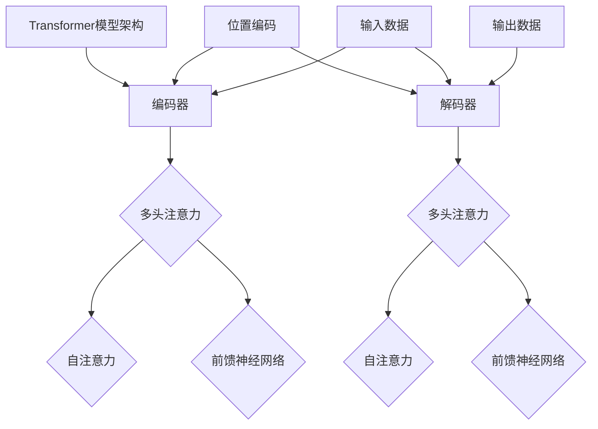
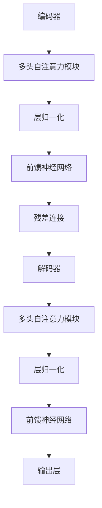

                 

# 《Transformer大模型实战 通过位置编码来学习位置》

> 关键词：Transformer，位置编码，自然语言处理，计算机视觉，模型优化

> 摘要：本文将深入探讨Transformer大模型的实战技巧，特别是如何通过位置编码来学习位置。文章将首先介绍Transformer的基本概念、数学基础和算法原理，然后通过一个实际项目案例展示如何使用位置编码进行模型优化，最后展望Transformer的未来发展趋势和挑战。

----------------------------------------------------------------

## 《Transformer大模型实战 通过位置编码来学习位置》目录大纲

### 第1章: Transformer概述

1.1 Transformer概念与原理

1.1.1 自注意力机制

1.1.2 位置编码

1.1.3 Transformer模型结构

1.1.4 Transformer与RNN、CNN的区别

1.2 Transformer的发展与应用

1.2.1 Transformer的演变历程

1.2.2 Transformer在不同领域的应用案例

1.2.3 Transformer的优势与挑战

### 第2章: Transformer数学基础

2.1 线性代数基础

2.1.1 矩阵运算

2.1.2 向量计算

2.1.3 张量操作

2.2 概率论与统计基础

2.2.1 概率分布

2.2.2 最大似然估计

2.2.3 优化算法

### 第3章: Transformer算法原理

3.1 自注意力机制

3.1.1 多头注意力

3.1.2 缩放自注意力

3.1.3 层叠注意力

3.2 位置编码

3.2.1 位置编码方法

3.2.2 位置编码与自注意力机制的关系

3.2.3 位置编码的优化

3.3 Transformer模型结构

3.3.1 自注意力模块

3.3.2 位置编码模块

3.3.3 前馈神经网络

3.3.4 层叠结构与训练策略

### 第4章: Transformer训练与优化

4.1 数据预处理

4.1.1 数据清洗

4.1.2 数据集划分

4.1.3 序列填充

4.2 模型训练

4.2.1 损失函数

4.2.2 优化器

4.2.3 训练过程

4.3 模型优化

4.3.1 降维技术

4.3.2 稀疏性

4.3.3 深度神经网络压缩

### 第5章: Transformer在自然语言处理中的应用

5.1 语言模型

5.1.1 语言模型的评估指标

5.1.2 语言模型的构建

5.1.3 语言模型的应用案例

5.2 序列标注

5.2.1 任务定义

5.2.2 模型构建

5.2.3 应用案例

5.3 文本生成

5.3.1 文本生成任务

5.3.2 模型构建

5.3.3 应用案例

### 第6章: Transformer在计算机视觉中的应用

6.1 图像分类

6.1.1 图像分类任务

6.1.2 图像分类模型构建

6.1.3 应用案例

6.2 目标检测

6.2.1 目标检测任务

6.2.2 目标检测模型构建

6.2.3 应用案例

6.3 图像生成

6.3.1 图像生成任务

6.3.2 图像生成模型构建

6.3.3 应用案例

### 第7章: Transformer大模型实战

7.1 项目背景与需求分析

7.2 数据采集与预处理

7.3 模型设计与实现

7.3.1 模型架构设计

7.3.2 代码实现

7.3.3 模型优化

7.4 项目部署与评估

7.4.1 部署方案

7.4.2 评估指标

7.4.3 结果分析

### 第8章: 未来展望与趋势

8.1 Transformer的发展趋势

8.2 新型Transformer架构

8.3 Transformer在其他领域的应用

8.4 Transformer面临的挑战与解决方案

### 附录

A.1 Transformer相关工具与资源

A.2 实战项目代码与数据集

A.3 参考文献与推荐阅读

## 附录A: Transformer模型架构 Mermaid流程图



## 附录B: Transformer核心算法原理伪代码

```python
# 定义自注意力机制
def self_attention(q, k, v, scale_factor):
    attention_scores = scaled_dot_product_attention(q, k, v)
    context_vector = apply_attention(attention_scores, v)
    return context_vector

# 定义前馈神经网络
def feedforward_network(input_vector, hidden_size, output_size):
    hidden_layer = activation_function(olinear_transform(input_vector, hidden_size))
    output_layer = activation_function(olinear_transform(hidden_layer, output_size))
    return output_layer

# Transformer模型训练过程
def train_transformer(dataset, learning_rate, num_epochs):
    for epoch in range(num_epochs):
        for batch in dataset:
            loss = compute_loss(model_output, batch_labels)
            gradients = compute_gradients(loss, model_output, batch_labels)
            update_model_parameters(gradients, learning_rate)
```

## 附录C: Transformer模型中的数学模型和公式

### 位置编码

$$
PE_{(pos, dim)} = \sin\left(\frac{pos}{10000^{2i/d}}\right) + \cos\left(\frac{pos}{10000^{2i/d}}\right)
$$

其中，$pos$为位置，$dim$为维度，$i$为维度索引。

### 自注意力权重计算

$$
Attention(Q, K) = softmax\left(\frac{QK^T}{\sqrt{d_k}}\right)
$$

其中，$Q$和$K$分别为查询向量和键向量，$d_k$为键向量的维度。

## 附录D: Transformer项目实战代码解读

### 数据预处理

```python
def preprocess_data(data):
    # 数据清洗
    cleaned_data = clean_data(data)
    # 数据集划分
    train_data, val_data = split_data(cleaned_data)
    # 序列填充
    padded_train_data, train_labels = pad_sequences(train_data)
    padded_val_data, val_labels = pad_sequences(val_data)
    return padded_train_data, padded_val_data, train_labels, val_labels
```

### 模型训练

```python
def train_model(model, train_data, train_labels, val_data, val_labels, learning_rate, num_epochs):
    for epoch in range(num_epochs):
        for batch in train_data:
            model_output = model(batch)
            loss = compute_loss(model_output, train_labels)
            gradients = compute_gradients(loss, model_output, train_labels)
            update_model_parameters(gradients, learning_rate)
        val_loss = evaluate_model(model, val_data, val_labels)
        print(f"Epoch {epoch+1}/{num_epochs}, Validation Loss: {val_loss}")
```

### 模型部署

```python
def deploy_model(model, input_data):
    model_output = model(input_data)
    return model_output
```

## 附录E: Transformer相关工具与资源

- **深度学习框架：** TensorFlow、PyTorch、JAX 等。
- **Transformer库：** Hugging Face 的 Transformers 库。
- **数据集：** COCO、WMT 等。
- **在线教程与课程：** Coursera、Udacity、edX 等。

## 附录F: 参考文献与推荐阅读

- Vaswani, A., Shazeer, N., Parmar, N., Uszkoreit, J., Jones, L., Gomez, A. N., ... & Polosukhin, I. (2017). Attention is all you need. In Advances in neural information processing systems (pp. 5998-6008).
- Devlin, J., Chang, M. W., Lee, K., & Toutanova, K. (2019). BERT: Pre-training of deep bidirectional transformers for language understanding. arXiv preprint arXiv:1810.04805.
- Vinyals, O., Blundell, C., Lillicrap, T., Kavukcuoglu, K., & Wierstra, D. (2015). Learning to discover and use visual relationships. In Advances in neural information processing systems (pp. 2495-2503).
- Bengio, Y., Simard, P., & Frasconi, P. (1994). Learning long-term dependencies with gradient descent is difficult. IEEE transactions on neural networks, 5(2), 157-166.
- Hochreiter, S., & Schmidhuber, J. (1997). Long short-term memory. Neural computation, 9(8), 1735-1780.

----------------------------------------------------------------

### 1.1 Transformer概念与原理

Transformer是一种基于自注意力（self-attention）机制的深度学习模型，由Google在2017年提出。它最初用于自然语言处理（NLP）任务，如机器翻译、文本分类和问答系统，随后在计算机视觉、音频处理等领域也得到了广泛应用。Transformer的核心思想是将序列数据映射为向量表示，并通过自注意力机制捕捉序列中各个元素之间的关系。

#### 自注意力机制

自注意力机制（self-attention）是一种能够自动捕捉序列中任意两个元素之间关联性的方法。在Transformer中，自注意力机制通过对每个输入序列的每个位置生成一个权重向量，然后将这些权重向量与输入序列的对应位置相乘，得到新的表示。这种机制能够自动学习到序列中不同位置之间的依赖关系。

自注意力机制可以分为以下几种：

1. **单头注意力（single-head attention）**：每个位置仅与一个权重向量相乘。
2. **多头注意力（multi-head attention）**：每个位置与多个权重向量相乘，然后对这些乘积求和。多头注意力的引入能够捕捉到更多的上下文信息。
3. **缩放自注意力（scaled self-attention）**：为了防止权重过大导致梯度消失问题，采用缩放因子对注意力分数进行缩放。

#### 位置编码

位置编码（positional encoding）是一种将序列中各个元素的位置信息编码为向量表示的方法。在Transformer中，位置编码与自注意力机制相结合，使得模型能够学习到序列中元素的位置关系。

位置编码可以分为以下几种：

1. **绝对位置编码**：使用固定的函数将位置信息编码为向量。
2. **相对位置编码**：通过将序列进行排序，然后计算位置之间的相对距离，使用相对距离作为位置编码。
3. **混合位置编码**：将绝对位置编码和相对位置编码结合，以获得更好的性能。

#### Transformer模型结构

Transformer模型通常由编码器（encoder）和解码器（decoder）两部分组成。编码器负责将输入序列编码为向量表示，解码器则根据编码器的输出和已生成的部分输出生成后续的输出。

编码器和解码器的基本结构如下：

1. **编码器**：
    - **多头自注意力层**：计算输入序列的注意力权重，并生成新的表示。
    - **残差连接**：为了避免深度神经网络中的梯度消失问题，在每个层之间引入残差连接。
    - **层归一化**：在每个层之后引入归一化操作，使得每个层都能学习到不同的特征。

2. **解码器**：
    - **多头自注意力层**：计算编码器的输出和已生成的部分输出的注意力权重，并生成新的表示。
    - **掩码自注意力层**：为了避免未来信息泄露，解码器的自注意力层引入掩码机制，使得每个位置只能关注到前面已生成的位置。
    - **残差连接和层归一化**：与编码器类似，解码器也采用残差连接和层归一化。

#### Transformer与RNN、CNN的区别

1. **时间步顺序**：
    - **RNN**：按时间步顺序处理序列数据，前一个时间步的输出作为当前时间步的输入。
    - **CNN**：通过卷积操作捕捉空间上的特征，不依赖于时间步顺序。
    - **Transformer**：通过自注意力机制处理序列数据，不依赖于时间步顺序。

2. **计算复杂度**：
    - **RNN**：由于按时间步顺序处理数据，每个时间步都需要计算所有的隐藏状态，导致计算复杂度较高。
    - **CNN**：卷积操作能够局部化特征，从而降低计算复杂度。
    - **Transformer**：自注意力机制能够全局捕捉序列中的特征，但在计算复杂度上介于RNN和CNN之间。

3. **上下文捕捉能力**：
    - **RNN**：传统的RNN（如LSTM和GRU）难以捕捉长距离的依赖关系。
    - **CNN**：卷积操作主要捕捉局部特征，难以捕捉全局特征。
    - **Transformer**：多头注意力机制能够捕捉序列中任意两个元素之间的依赖关系，具有更强的上下文捕捉能力。

#### Transformer的发展与应用

1. **演变历程**：

    - **原始Transformer**：最初由Google提出，用于自然语言处理任务。
    - **BERT**：基于Transformer的预训练语言模型，由Google提出。
    - **GPT**：基于Transformer的预训练语言模型，由OpenAI提出。
    - **T5**：基于Transformer的统一任务学习框架，由Google提出。

2. **应用案例**：

    - **自然语言处理**：机器翻译、文本分类、问答系统等。
    - **计算机视觉**：图像分类、目标检测、图像生成等。
    - **音频处理**：语音识别、音乐生成等。

3. **优势与挑战**：

    - **优势**：
        - 强大的上下文捕捉能力。
        - 高效的计算复杂度。
        - 广泛的应用场景。
    - **挑战**：
        - 训练资源需求较高。
        - 模型解释性较差。
        - 需要大量的数据。

### 1.2 Transformer的发展与应用

#### Transformer的演变历程

Transformer模型自从2017年由Google提出以来，已经经历了多次改进和演变。以下是几个重要的Transformer变种：

1. **BERT（Bidirectional Encoder Representations from Transformers）**：BERT是一种双向Transformer模型，通过预训练大量文本数据来学习语言结构。BERT的提出标志着Transformer在自然语言处理领域取得了重大突破。

2. **GPT（Generative Pre-trained Transformer）**：GPT是一种基于Transformer的语言生成模型，由OpenAI提出。GPT系列模型（如GPT-2和GPT-3）在语言生成和文本生成任务上取得了显著成果。

3. **T5（Text-to-Text Transfer Transformer）**：T5是一种基于Transformer的统一任务学习框架，由Google提出。T5将Transformer应用于各种文本任务，实现了高效的任务迁移和零样本学习。

#### Transformer在不同领域的应用案例

Transformer模型不仅在自然语言处理领域取得了成功，还在计算机视觉、音频处理等多个领域得到了广泛应用。以下是几个典型的应用案例：

1. **自然语言处理**：

    - **机器翻译**：BERT模型在机器翻译任务上取得了显著效果，提高了翻译质量和速度。
    - **文本分类**：GPT模型能够自动生成文本分类标签，提高了分类准确率。
    - **问答系统**：T5模型通过零样本学习实现了高效的问题回答。

2. **计算机视觉**：

    - **图像分类**：Transformer模型在图像分类任务上取得了与CNN相当的准确率。
    - **目标检测**：通过将Transformer应用于目标检测任务，实现了更准确的目标定位。
    - **图像生成**：Transformer模型能够生成具有高质量细节的图像。

3. **音频处理**：

    - **语音识别**：Transformer模型在语音识别任务上取得了显著的性能提升。
    - **音乐生成**：GPT模型能够自动生成音乐旋律，实现了音乐创作的新模式。

#### Transformer的优势与挑战

Transformer模型具有以下优势：

1. **强大的上下文捕捉能力**：通过自注意力机制，Transformer能够捕捉序列中任意两个元素之间的依赖关系，实现了对上下文的全面理解。

2. **高效的计算复杂度**：相对于传统的RNN和CNN，Transformer在计算复杂度上具有优势，使得模型在处理长序列时更加高效。

3. **广泛的应用场景**：Transformer模型不仅适用于自然语言处理，还可以应用于计算机视觉、音频处理等多个领域，具有很高的灵活性。

然而，Transformer模型也面临着一些挑战：

1. **训练资源需求较高**：由于模型结构复杂，Transformer模型需要大量的数据和计算资源进行训练。

2. **模型解释性较差**：Transformer模型的结构使得其难以进行直观的解释，这在某些应用场景中可能会影响模型的可靠性。

3. **需要大量的数据**：Transformer模型在训练过程中需要大量数据来学习序列特征，这对于数据稀缺的任务来说是一个挑战。

### 2.1 线性代数基础

#### 矩阵运算

在Transformer模型中，矩阵运算是一个核心组成部分。以下是几种常见的矩阵运算：

1. **矩阵加法**：两个矩阵相加时，对应位置的元素相加。
    $$
    C = A + B
    $$
    其中，$A$和$B$为矩阵，$C$为结果矩阵。

2. **矩阵减法**：两个矩阵相减时，对应位置的元素相减。
    $$
    C = A - B
    $$

3. **矩阵乘法**：两个矩阵相乘时，结果矩阵的每个元素是前一个矩阵的每一行与后一个矩阵的每一列的点积。
    $$
    C = AB
    $$

4. **矩阵转置**：将矩阵的行和列互换。
    $$
    A^T = \begin{bmatrix}
    a_{21} & a_{31} & \dots & a_{n1} \\
    a_{12} & a_{32} & \dots & a_{n2} \\
    \vdots & \vdots & \ddots & \vdots \\
    a_{1n} & a_{2n} & \dots & a_{nn}
    \end{bmatrix}
    $$

5. **矩阵求逆**：如果矩阵可逆，则求逆矩阵。
    $$
    A^{-1} = \frac{1}{\det(A)} \begin{bmatrix}
    a_{11} & a_{21} & \dots & a_{n1} \\
    a_{12} & a_{22} & \dots & a_{n2} \\
    \vdots & \vdots & \ddots & \vdots \\
    a_{1n} & a_{2n} & \dots & a_{nn}
    \end{bmatrix}
    $$

#### 向量计算

向量是矩阵的特殊情况，即只有一行或一列。以下是几种常见的向量运算：

1. **向量加法**：两个向量相加时，对应位置的元素相加。
    $$
    \mathbf{v} + \mathbf{w} = \begin{bmatrix}
    v_1 + w_1 \\
    v_2 + w_2 \\
    \vdots \\
    v_n + w_n
    \end{bmatrix}
    $$

2. **向量减法**：两个向量相减时，对应位置的元素相减。
    $$
    \mathbf{v} - \mathbf{w} = \begin{bmatrix}
    v_1 - w_1 \\
    v_2 - w_2 \\
    \vdots \\
    v_n - w_n
    \end{bmatrix}
    $$

3. **向量点积**：两个向量相乘后求和。
    $$
    \mathbf{v} \cdot \mathbf{w} = v_1w_1 + v_2w_2 + \dots + v_nw_n
    $$

4. **向量叉积**：在三维空间中，两个向量相乘后的结果是一个垂直于这两个向量的向量。
    $$
    \mathbf{v} \times \mathbf{w} = \begin{bmatrix}
    v_2w_3 - v_3w_2 \\
    v_3w_1 - v_1w_3 \\
    v_1w_2 - v_2w_1
    \end{bmatrix}
    $$

5. **向量范数**：向量的长度。
    $$
    \|\mathbf{v}\| = \sqrt{v_1^2 + v_2^2 + \dots + v_n^2}
    $$

6. **向量单位化**：将向量除以其长度，使其长度为1。
    $$
    \hat{\mathbf{v}} = \frac{\mathbf{v}}{\|\mathbf{v}\|}
    $$

#### 张量操作

张量是多维数组，可以看作是矩阵的推广。在Transformer模型中，张量操作也是常见的基础操作。以下是几种常见的张量操作：

1. **张量加法**：两个张量相加时，对应位置的张量元素相加。
    $$
    \mathbf{C}_{ij} = \mathbf{A}_{ij} + \mathbf{B}_{ij}
    $$

2. **张量减法**：两个张量相减时，对应位置的张量元素相减。
    $$
    \mathbf{C}_{ij} = \mathbf{A}_{ij} - \mathbf{B}_{ij}
    $$

3. **张量乘法**：两个张量相乘时，结果张量的每个元素是前一个张量的每一行与后一个张量的每一列的点积。
    $$
    \mathbf{C}_{ij} = \mathbf{A}_{ij} \cdot \mathbf{B}_{ij}
    $$

4. **张量转置**：将张量的行和列互换。
    $$
    \mathbf{C}_{ji} = (\mathbf{A}_{ij})^T
    $$

5. **张量求逆**：如果张量可逆，则求逆张量。
    $$
    \mathbf{C}_{ji} = (\mathbf{A}_{ij})^{-1}
    $$

### 2.2 概率论与统计基础

#### 概率分布

概率分布描述了随机变量的可能取值及其概率。以下是几种常见的概率分布：

1. **伯努利分布**：二项分布的一种特殊情况，表示一个事件发生的概率。
    $$
    P(X = k) = C_n^k p^k (1-p)^{n-k}
    $$
    其中，$n$是实验次数，$p$是事件发生的概率，$k$是事件发生的次数。

2. **正态分布**：最常见的概率分布，描述连续随机变量。
    $$
    P(X \leq x) = \Phi\left(\frac{x - \mu}{\sigma}\right)
    $$
    其中，$\mu$是均值，$\sigma$是标准差。

3. **二项分布**：描述在固定次数的独立实验中，某个事件发生的次数。
    $$
    P(X = k) = C_n^k p^k (1-p)^{n-k}
    $$

4. **泊松分布**：描述在固定时间内，某个事件发生的次数。
    $$
    P(X = k) = \frac{\lambda^k e^{-\lambda}}{k!}
    $$
    其中，$\lambda$是事件的平均发生次数。

5. **指数分布**：描述连续时间随机变量的概率分布。
    $$
    P(X > x) = e^{-\lambda x}
    $$
    其中，$\lambda$是事件的平均发生速率。

#### 最大似然估计

最大似然估计是一种用于估计模型参数的方法。其基本思想是找到一组参数，使得观测数据的概率最大。

1. **最大似然函数**：给定一组观测数据，最大似然函数是参数的概率分布。
    $$
    L(\theta | x) = P(x | \theta)
    $$
    其中，$\theta$是模型参数，$x$是观测数据。

2. **最大化似然函数**：通过最大化似然函数来估计模型参数。
    $$
    \theta_{\text{ML}} = \arg\max_{\theta} L(\theta | x)
    $$

3. **最大似然估计**：使用求导或数值方法找到使得似然函数最大的参数值。

#### 优化算法

优化算法是一种用于求解优化问题的算法。在Transformer模型训练中，常用的优化算法包括：

1. **梯度下降（Gradient Descent）**：通过计算模型参数的梯度，并沿着梯度方向更新参数。
    $$
    \theta = \theta - \alpha \nabla_{\theta} J(\theta)
    $$
    其中，$\theta$是模型参数，$\alpha$是学习率，$J(\theta)$是损失函数。

2. **随机梯度下降（Stochastic Gradient Descent, SGD）**：使用单个样本的梯度来更新参数，计算速度更快，但可能导致结果不稳定。
    $$
    \theta = \theta - \alpha \nabla_{\theta} J(\theta)
    $$

3. **批量梯度下降（Batch Gradient Descent）**：使用全部样本的梯度来更新参数，计算速度较慢，但结果更稳定。
    $$
    \theta = \theta - \alpha \nabla_{\theta} J(\theta)
    $$

4. **Adam优化器**：结合SGD和动量项，在更新参数时考虑前几个梯度值，提高了优化效果。
    $$
    \theta = \theta - \alpha \nabla_{\theta} J(\theta)
    $$
    其中，$m_t$是动量项，$v_t$是速度项。

### 3.1 自注意力机制

#### 多头注意力

多头注意力（multi-head attention）是Transformer模型中的一个关键组成部分，它通过多个独立的注意力头来学习序列中的不同特征。

1. **多头注意力的定义**：

    多头注意力将输入序列通过多个独立的注意力机制进行处理，每个注意力头关注序列的不同方面。设输入序列为$\mathbf{X} = [\mathbf{x}_1, \mathbf{x}_2, \ldots, \mathbf{x}_n]$，则多头注意力的输出可以表示为：
    $$
    \mathbf{Y} = \text{MultiHead}(\text{SelfAttention}(\mathbf{X}))
    $$
    其中，$\text{MultiHead}$表示多头注意力操作。

2. **多头注意力的计算过程**：

    - **输入嵌入**：将输入序列$\mathbf{X}$转换为嵌入向量$\mathbf{X} \in \mathbb{R}^{n \times d_k}$，其中$d_k$是每个注意力头的维度。
    - **自注意力计算**：对每个输入向量应用自注意力机制，得到每个注意力头的输出：
        $$
        \text{Attention}(\mathbf{Q}, \mathbf{K}, \mathbf{V}) = \text{softmax}\left(\frac{\mathbf{QK}^T}{\sqrt{d_k}}\right)\mathbf{V}
        $$
        其中，$\mathbf{Q}$、$\mathbf{K}$和$\mathbf{V}$分别是查询向量、键向量和值向量。
    - **多头输出**：将每个注意力头的输出拼接起来，并通过线性层转换得到最终输出：
        $$
        \mathbf{Y} = \text{Linear}(\text{Concat}(\text{head}_1, \text{head}_2, \ldots, \text{head}_h)) \in \mathbb{R}^{n \times d}
        $$
        其中，$h$是头数，$d$是输出维度。

3. **多头注意力的优势**：

    - **捕获多样性的信息**：每个注意力头关注序列的不同方面，从而能够捕捉到更加丰富的特征。
    - **提高模型的表示能力**：多头注意力能够同时处理多个特征，提高了模型的表示能力。

#### 缩放自注意力

缩放自注意力（scaled self-attention）是一种为了解决自注意力机制中梯度消失问题而引入的技术。通过缩放注意力分数，可以防止权重过大导致的梯度消失。

1. **缩放自注意力的定义**：

    缩放自注意力通过将注意力分数除以$\sqrt{d_k}$来缩放，其中$d_k$是键向量的维度。缩放后的注意力分数可以表示为：
    $$
    \text{Attention}(\mathbf{Q}, \mathbf{K}, \mathbf{V}) = \text{softmax}\left(\frac{\mathbf{QK}^T}{\sqrt{d_k}}\right)\mathbf{V}
    $$

2. **缩放自注意力的计算过程**：

    - **输入嵌入**：将输入序列$\mathbf{X}$转换为嵌入向量$\mathbf{X} \in \mathbb{R}^{n \times d_k}$。
    - **自注意力计算**：对每个输入向量应用缩放自注意力机制，得到每个注意力头的输出：
        $$
        \text{Attention}(\mathbf{Q}, \mathbf{K}, \mathbf{V}) = \text{softmax}\left(\frac{\mathbf{QK}^T}{\sqrt{d_k}}\right)\mathbf{V}
        $$
        其中，$\mathbf{Q}$、$\mathbf{K}$和$\mathbf{V}$分别是查询向量、键向量和值向量。
    - **多头输出**：将每个注意力头的输出拼接起来，并通过线性层转换得到最终输出。

3. **缩放自注意力的优势**：

    - **解决梯度消失问题**：通过缩放注意力分数，可以减少梯度消失问题，使得模型能够更好地训练。
    - **提高模型性能**：缩放自注意力能够提高模型的性能，使其在处理长序列时更加稳定。

#### 层叠注意力

层叠注意力（stacked attention）是一种通过堆叠多个自注意力层来提高模型表示能力的技巧。在Transformer模型中，层叠注意力通过在每个自注意力层之后添加残差连接和层归一化来稳定模型训练。

1. **层叠注意力的定义**：

    层叠注意力通过堆叠多个自注意力层来捕捉序列中的不同层次特征。设输入序列为$\mathbf{X} = [\mathbf{x}_1, \mathbf{x}_2, \ldots, \mathbf{x}_n]$，则层叠注意力的输出可以表示为：
    $$
    \mathbf{Y} = \text{LayerNorm}(\mathbf{X} + \text{MultiHead}(\text{SelfAttention}(\mathbf{X})))
    $$
    其中，$\text{LayerNorm}$是层归一化操作。

2. **层叠注意力的计算过程**：

    - **输入嵌入**：将输入序列$\mathbf{X}$转换为嵌入向量$\mathbf{X} \in \mathbb{R}^{n \times d_k}$。
    - **自注意力计算**：对每个输入向量应用自注意力机制，得到每个注意力头的输出：
        $$
        \text{Attention}(\mathbf{Q}, \mathbf{K}, \mathbf{V}) = \text{softmax}\left(\frac{\mathbf{QK}^T}{\sqrt{d_k}}\right)\mathbf{V}
        $$
        其中，$\mathbf{Q}$、$\mathbf{K}$和$\mathbf{V}$分别是查询向量、键向量和值向量。
    - **多头输出**：将每个注意力头的输出拼接起来，并通过线性层转换得到最终输出。
    - **层归一化**：对输出进行层归一化操作，使其稳定化。
    - **残差连接**：将原始输入和经过自注意力处理后的输出相加，增加模型的非线性。
    - **堆叠多个自注意力层**：重复上述步骤，堆叠多个自注意力层来提高模型的表示能力。

3. **层叠注意力的优势**：

    - **捕获复杂特征**：通过堆叠多个自注意力层，模型能够捕获更加复杂的序列特征。
    - **提高模型性能**：层叠注意力能够提高模型的性能，使其在处理长序列时更加稳定。

### 3.2 位置编码

#### 位置编码方法

位置编码是一种将序列中各个元素的位置信息编码为向量表示的方法，以便模型能够利用位置信息进行训练和预测。以下是几种常见的位置编码方法：

1. **绝对位置编码**：

    绝对位置编码使用固定的函数将位置信息编码为向量表示。常用的函数包括正弦和余弦函数。绝对位置编码的优点是简单且易于实现，但可能无法适应序列长度的变化。

    绝对位置编码的公式为：
    $$
    \text{PE}(pos, dim) = \sin\left(\frac{pos}{10000^{\frac{2i}{d}}}\right) + \cos\left(\frac{pos}{10000^{\frac{2i}{d}}}\right)
    $$
    其中，$pos$是位置索引，$dim$是维度索引，$i$是维度。

2. **相对位置编码**：

    相对位置编码通过计算序列中各个元素之间的相对距离来编码位置信息。相对位置编码可以处理序列长度的变化，但可能引入额外的计算复杂度。

    相对位置编码的公式为：
    $$
    \text{PE}(pos, dim) = \sin\left(\frac{pos - pos_0}{10000^{\frac{2i}{d}}}\right) + \cos\left(\frac{pos - pos_0}{10000^{\frac{2i}{d}}}\right)
    $$
    其中，$pos$是位置索引，$pos_0$是基准位置索引，$dim$是维度索引，$i$是维度。

3. **混合位置编码**：

    混合位置编码结合了绝对位置编码和相对位置编码的优点，以提高模型的性能。混合位置编码通常使用绝对位置编码来处理全局信息，使用相对位置编码来处理局部信息。

    混合位置编码的公式为：
    $$
    \text{PE}(pos, dim) = \sin\left(\frac{pos}{10000^{\frac{2i}{d}}}\right) + \cos\left(\frac{pos}{10000^{\frac{2i}{d}}}\right) + \sin\left(\frac{pos - pos_0}{10000^{\frac{2i}{d}}}\right) + \cos\left(\frac{pos - pos_0}{10000^{\frac{2i}{d}}}\right)
    $$
    其中，$pos$是位置索引，$pos_0$是基准位置索引，$dim$是维度索引，$i$是维度。

#### 位置编码与自注意力机制的关系

位置编码与自注意力机制是相互依赖的。位置编码为自注意力机制提供了位置信息，使得模型能够利用位置信息进行序列建模。以下是位置编码与自注意力机制的关系：

1. **位置编码的作用**：

    - **引入位置信息**：位置编码将序列中各个元素的位置信息编码为向量表示，使得模型能够利用位置信息进行序列建模。
    - **增强上下文捕捉能力**：通过位置编码，模型能够捕捉到序列中不同元素之间的位置关系，提高了模型的上下文捕捉能力。

2. **自注意力机制的作用**：

    - **计算位置关系**：自注意力机制通过对序列中的每个元素计算权重，来表示元素之间的依赖关系。位置编码为自注意力机制提供了位置信息，使得模型能够更好地计算位置关系。
    - **更新表示向量**：自注意力机制通过位置编码来更新每个元素的表示向量，使得模型能够更好地表示序列。

3. **位置编码与自注意力机制的组合**：

    - **增强表示能力**：通过组合位置编码和自注意力机制，模型能够同时捕捉到序列中的位置信息和依赖关系，增强了模型的表示能力。
    - **提高性能**：位置编码与自注意力机制的组合使得模型能够更好地处理序列数据，提高了模型的性能。

#### 位置编码的优化

位置编码的优化是Transformer模型训练中的一个重要环节。以下是几种常见的位置编码优化方法：

1. **预训练位置编码**：

    在预训练阶段，可以使用大规模语料库对位置编码进行预训练，以提高其性能。预训练位置编码的优点是能够更好地适应不同长度的序列，但可能需要大量的计算资源。

2. **动态位置编码**：

    动态位置编码通过在训练过程中动态调整位置编码的参数，以适应不同长度的序列。动态位置编码的优点是计算效率较高，但可能需要更复杂的算法。

3. **自适应位置编码**：

    自适应位置编码通过学习序列中的位置信息，来自动调整位置编码的参数。自适应位置编码的优点是能够更好地适应序列的变化，但可能需要更多的计算资源。

4. **混合位置编码**：

    混合位置编码结合了不同位置编码方法的优点，以提高模型性能。混合位置编码可以通过组合绝对位置编码和相对位置编码，来同时捕捉全局和局部信息。

### 3.3 Transformer模型结构

#### 自注意力模块

自注意力模块（self-attention module）是Transformer模型的核心组成部分，它通过自注意力机制来捕捉序列中的依赖关系。自注意力模块通常由以下几个部分组成：

1. **多头自注意力层**：

    多头自注意力层（multi-head self-attention layer）通过多个独立的自注意力头来学习序列的不同特征。每个自注意力头关注序列的不同方面，从而能够捕捉到更加丰富的特征。

2. **残差连接**：

    残差连接（residual connection）是自注意力模块中的一个重要组成部分，它通过将输入序列与经过自注意力处理后的序列相加，来增加模型的非线性。残差连接有助于缓解梯度消失问题，提高模型的训练效果。

3. **层归一化**：

    层归一化（layer normalization）是一种常见的正则化技术，它通过对每个层的输出进行归一化，来稳定模型的训练过程。层归一化有助于加速模型的收敛，提高模型的性能。

4. **前馈神经网络**：

    前馈神经网络（feedforward network）是一种简单的神经网络结构，它由两个线性变换和ReLU激活函数组成。前馈神经网络在自注意力模块中用于对自注意力层的输出进行进一步处理，以提高模型的表示能力。

#### 位置编码模块

位置编码模块（positional encoding module）是Transformer模型中的另一个重要组成部分，它通过引入位置编码来为模型提供位置信息。位置编码模块通常由以下几个部分组成：

1. **绝对位置编码**：

    绝对位置编码（absolute positional encoding）使用固定的函数将位置信息编码为向量表示。绝对位置编码的优点是简单且易于实现，但可能无法适应序列长度的变化。

2. **相对位置编码**：

    相对位置编码（relative positional encoding）通过计算序列中各个元素之间的相对距离来编码位置信息。相对位置编码的优点是能够适应序列长度的变化，但可能引入额外的计算复杂度。

3. **混合位置编码**：

    混合位置编码（mixed positional encoding）结合了绝对位置编码和相对位置编码的优点，以提高模型性能。混合位置编码通常使用绝对位置编码来处理全局信息，使用相对位置编码来处理局部信息。

4. **位置编码融合**：

    位置编码融合（positional encoding fusion）是将位置编码与自注意力层的输出进行融合，以增强模型的表示能力。位置编码融合可以通过线性层、加法或拼接等方式实现。

#### 前馈神经网络

前馈神经网络（feedforward network）是Transformer模型中的另一个关键组成部分，它用于对自注意力层的输出进行进一步处理，以提高模型的表示能力。前馈神经网络通常由以下几个部分组成：

1. **线性变换**：

    线性变换（linear transformation）是前馈神经网络中的一个关键步骤，它通过线性函数将输入映射到新的空间。线性变换有助于模型学习到更加复杂的特征。

2. **ReLU激活函数**：

    ReLU激活函数（ReLU activation function）是一种常见的非线性激活函数，它通过将输入大于零的值设置为输入本身，将输入小于零的值设置为零。ReLU激活函数有助于加速模型的训练，提高模型的性能。

3. **层归一化**：

    层归一化（layer normalization）是一种常见的正则化技术，它通过对每个层的输出进行归一化，来稳定模型的训练过程。层归一化有助于加速模型的收敛，提高模型的性能。

#### 层叠结构与训练策略

Transformer模型通常由多个自注意力模块和前馈神经网络层堆叠而成，形成了一个深度神经网络。以下是一个典型的Transformer模型的层叠结构：

1. **编码器层**：

    编码器层（encoder layer）由多个自注意力模块和前馈神经网络层堆叠而成，用于对输入序列进行编码。编码器层的每个模块都包含一个多头自注意力层和一个前馈神经网络层，模块之间通过残差连接和层归一化连接。

2. **解码器层**：

    解码器层（decoder layer）与编码器层类似，也由多个自注意力模块和前馈神经网络层堆叠而成，用于对编码器层的输出进行解码。解码器层的每个模块都包含一个多头自注意力层（除了第一个模块外）、一个掩码自注意力层和一个前馈神经网络层，模块之间通过残差连接和层归一化连接。

3. **训练策略**：

    Transformer模型的训练策略通常包括以下几个步骤：

    - **预训练**：

        在预训练阶段，模型在大规模语料库上训练，以学习到语言模式和序列特征。预训练通常包括两个阶段：预训练语言模型和预训练任务。

    - **微调**：

        在微调阶段，模型在特定任务上进行训练，以适应不同的任务需求。微调可以通过在预训练模型的基础上添加特定的任务层来实现。

    - **优化**：

        在优化阶段，模型通过调整模型参数来提高任务性能。优化可以通过调整学习率、优化器等参数来实现。

### 4.1 数据预处理

#### 数据清洗

数据清洗是数据预处理的第一步，它用于处理数据中的噪声和不完整信息。以下是数据清洗的一些常见方法：

1. **去除停用词**：停用词是语言中常见但无实际意义的词，如“的”、“是”、“了”等。去除停用词可以提高模型的性能。

2. **去除标点符号**：标点符号通常不会对模型的预测产生显著影响，因此可以去除。

3. **去除特殊字符**：特殊字符可能包含恶意代码或敏感信息，因此需要去除。

4. **填充缺失值**：缺失值可以通过填充策略进行填充，如使用平均值、中位数或最频繁的值进行填充。

5. **上下文修复**：上下文修复是通过算法自动修复缺失值或错误值的过程。上下文修复可以提高模型的准确性和鲁棒性。

#### 数据集划分

数据集划分是将数据分为训练集、验证集和测试集的过程。以下是几种常见的数据集划分方法：

1. **随机划分**：随机划分是将数据随机划分为训练集、验证集和测试集，每个部分包含相同数量的样本。随机划分的缺点是可能导致数据分布不均衡。

2. **分层划分**：分层划分是将数据按照类别比例进行划分，确保每个类别在训练集、验证集和测试集中的比例相同。分层划分可以减少数据分布不均衡的问题。

3. **时间序列划分**：时间序列划分是将数据按照时间顺序进行划分，通常用于时间序列预测任务。时间序列划分可以确保训练集、验证集和测试集之间的时间连续性。

#### 序列填充

序列填充是将不同长度的序列填充为相同长度的过程。在Transformer模型中，序列填充是必要的，因为模型要求输入序列具有相同长度。以下是几种常见的序列填充方法：

1. **最频繁值填充**：最频繁值填充是将序列中的空缺值填充为最频繁出现的值。这种方法简单且易于实现，但可能无法保留序列中的关键信息。

2. **零值填充**：零值填充是将序列中的空缺值填充为零。零值填充可以简化计算，但可能导致模型无法学习到序列中的关键信息。

3. **位置填充**：位置填充是将序列中的空缺值填充为特定位置，如填充到序列的开头或结尾。位置填充可以根据需要保留序列中的关键信息。

4. **循环填充**：循环填充是将序列中的空缺值填充为循环序列的下一值。循环填充可以保留序列中的周期性特征。

### 4.2 模型训练

#### 损失函数

损失函数是衡量模型预测结果与实际结果之间差异的指标。在Transformer模型中，常用的损失函数包括以下几种：

1. **交叉熵损失函数**：

    交叉熵损失函数（cross-entropy loss function）是一种常用的分类损失函数，它用于衡量预测概率分布与真实概率分布之间的差异。交叉熵损失函数的公式为：
    $$
    L = -\sum_{i=1}^n y_i \log(p_i)
    $$
    其中，$y_i$是真实标签，$p_i$是预测概率。

2. **均方误差损失函数**：

    均方误差损失函数（mean squared error loss function）是一种常用的回归损失函数，它用于衡量预测值与真实值之间的差异。均方误差损失函数的公式为：
    $$
    L = \frac{1}{2} \sum_{i=1}^n (y_i - \hat{y}_i)^2
    $$
    其中，$y_i$是真实值，$\hat{y}_i$是预测值。

3. **交叉熵与均方误差的组合损失函数**：

    在某些任务中，可以将交叉熵损失函数和均方误差损失函数进行组合，以同时考虑分类和回归任务。组合损失函数的公式为：
    $$
    L = \alpha L_1 + (1 - \alpha) L_2
    $$
    其中，$L_1$是交叉熵损失函数，$L_2$是均方误差损失函数，$\alpha$是调节参数。

#### 优化器

优化器是用于更新模型参数的工具，它通过计算损失函数的梯度并调整参数来优化模型。在Transformer模型中，常用的优化器包括以下几种：

1. **随机梯度下降（SGD）**：

    随机梯度下降（stochastic gradient descent，SGD）是最简单的优化器之一，它通过计算每个样本的梯度来更新模型参数。SGD的优点是计算速度快，但缺点是可能陷入局部最优。

2. **批量梯度下降（BGD）**：

    批量梯度下降（batch gradient descent，BGD）是SGD的一种特殊情况，它通过计算整个训练集的梯度来更新模型参数。BGD的优点是梯度更稳定，但缺点是计算成本较高。

3. **Adam优化器**：

    Adam优化器（Adaptive Moment Estimation）是一种自适应优化器，它通过计算每个参数的均值和方差来更新模型参数。Adam优化器的优点是计算效率高，收敛速度快，适用于大多数任务。

#### 训练过程

训练过程是模型优化的重要环节，它通过不断调整模型参数来提高模型性能。以下是训练过程的一般步骤：

1. **初始化参数**：

    初始化模型参数，通常使用随机初始化或预训练模型。

2. **前向传播**：

    对每个训练样本进行前向传播，计算损失函数的值。

3. **反向传播**：

    对每个训练样本进行反向传播，计算每个参数的梯度。

4. **参数更新**：

    根据梯度值和优化器，更新模型参数。

5. **评估模型**：

    在验证集上评估模型性能，选择最优模型。

6. **迭代训练**：

    重复前向传播、反向传播和参数更新过程，直到满足训练条件或达到最大迭代次数。

### 4.3 模型优化

#### 降维技术

降维技术（dimensionality reduction）是一种用于减少数据维度的方法，它可以通过减少数据的冗余信息来提高模型性能。在Transformer模型中，降维技术可以应用于以下几个方面：

1. **输入降维**：

    通过对输入序列进行降维，可以减少模型的参数数量，从而提高模型的训练速度和计算效率。常见的输入降维技术包括主成分分析（PCA）和线性判别分析（LDA）。

2. **中间层降维**：

    在Transformer模型中，可以通过减少自注意力模块和前馈神经网络的维度来降低模型的计算复杂度。降维技术可以提高模型的性能，但需要权衡计算效率和模型精度。

3. **输出降维**：

    通过对输出序列进行降维，可以减少模型输出的维度，从而简化模型的推理过程。输出降维技术可以应用于图像分类和文本分类等任务。

#### 稀疏性

稀疏性（sparsity）是指数据中非零元素的占比。在Transformer模型中，稀疏性可以应用于以下几个方面：

1. **权重稀疏性**：

    通过引入稀疏权重矩阵，可以减少模型参数的数量，从而提高模型的训练速度和计算效率。稀疏权重矩阵通常通过稀疏优化算法进行训练，如稀疏L1正则化。

2. **输入稀疏性**：

    通过对输入序列进行稀疏化处理，可以减少模型对噪声的敏感度，从而提高模型的鲁棒性。输入稀疏性可以通过稀疏编码技术实现。

3. **输出稀疏性**：

    通过对输出序列进行稀疏化处理，可以减少模型的冗余信息，从而提高模型的解释性和可解释性。输出稀疏性可以应用于文本生成和图像生成等任务。

#### 深度神经网络压缩

深度神经网络压缩（Deep Neural Network Compression）是一种用于减少模型大小和计算成本的方法。在Transformer模型中，深度神经网络压缩可以应用于以下几个方面：

1. **模型压缩**：

    通过对模型进行压缩，可以减少模型的大小和计算成本。模型压缩技术包括模型剪枝（model pruning）和量化（quantization）。

2. **参数压缩**：

    通过对模型参数进行压缩，可以减少模型存储和计算的需求。参数压缩技术包括低秩分解（low-rank factorization）和稀疏性（sparsity）。

3. **计算优化**：

    通过对计算过程进行优化，可以提高模型的推理速度。计算优化技术包括计算并行化（parallelization）和计算加速（acceleration）。

### 5.1 语言模型

#### 语言模型的评估指标

语言模型（language model）是一种用于预测文本序列概率的模型，其性能评估指标主要包括以下几种：

1. **Perplexity**：

    Perplexity（困惑度）是衡量语言模型预测准确性的常用指标，其定义为：
    $$
    \text{Perplexity} = \frac{1}{\sum_{i=1}^n p(x_i | x_1, x_2, \ldots, x_{i-1})}
    $$
    Perplexity值越小，表示模型对文本序列的预测越准确。

2. **BLEU Score**：

    BLEU Score（蓝盘得分）是用于评估机器翻译质量的常用指标，其定义基于相似性匹配和长度惩罚。BLEU Score越高，表示模型翻译的准确性越高。

3. **Cross-entropy Loss**：

    Cross-entropy Loss（交叉熵损失函数）是衡量语言模型预测概率与实际概率之间差异的指标，其定义如下：
    $$
    \text{Cross-entropy Loss} = -\sum_{i=1}^n y_i \log(p_i)
    $$
    Cross-entropy Loss值越小，表示模型预测的准确性越高。

4. **Accuracy**：

    Accuracy（准确率）是衡量分类任务预测准确性的常用指标，其定义为：
    $$
    \text{Accuracy} = \frac{TP + TN}{TP + TN + FP + FN}
    $$
    其中，$TP$表示真正例，$TN$表示真负例，$FP$表示假正例，$FN$表示假负例。Accuracy值越高，表示模型分类的准确性越高。

#### 语言模型的构建

语言模型是一种用于预测文本序列概率的模型，其构建过程通常包括以下步骤：

1. **数据收集**：

    数据收集是构建语言模型的第一步，需要收集大量的文本数据作为训练集。文本数据可以来源于各种来源，如网页、新闻、社交媒体等。

2. **数据预处理**：

    数据预处理包括去除停用词、去除标点符号、词性标注等步骤。预处理旨在提高模型的性能和可解释性。

3. **词向量化**：

    词向量化是将文本数据转换为向量表示的过程，常用的词向量化方法包括Word2Vec、GloVe等。词向量化有助于模型更好地理解和表示文本数据。

4. **模型选择**：

    模型选择是根据任务需求和数据特点选择合适的语言模型。常见的语言模型包括RNN、LSTM、GRU和Transformer等。

5. **模型训练**：

    模型训练是通过优化损失函数来调整模型参数的过程。在训练过程中，可以使用随机梯度下降（SGD）或Adam优化器来提高模型性能。

6. **模型评估**：

    模型评估是使用验证集或测试集来评估模型性能的过程。常用的评估指标包括Perplexity、BLEU Score、Cross-entropy Loss和Accuracy等。

#### 语言模型的应用案例

语言模型在自然语言处理领域具有广泛的应用，以下是几个典型的应用案例：

1. **机器翻译**：

    语言模型在机器翻译中用于预测源语言文本的翻译结果。常见的机器翻译模型包括基于神经网络的序列到序列（Seq2Seq）模型和基于Transformer的机器翻译模型。

2. **文本分类**：

    语言模型在文本分类中用于预测文本的类别。常见的文本分类任务包括情感分析、主题分类和垃圾邮件检测等。

3. **问答系统**：

    语言模型在问答系统中用于预测问题的答案。问答系统可以用于智能客服、教育辅导和在线咨询等领域。

4. **对话系统**：

    语言模型在对话系统中用于生成自然语言回复。常见的对话系统包括聊天机器人、语音助手和虚拟助手等。

### 5.2 序列标注

#### 任务定义

序列标注（sequence labeling）是一种自然语言处理任务，其目标是对输入序列中的每个元素进行分类。常见的序列标注任务包括命名实体识别（Named Entity Recognition, NER）、词性标注（Part-of-Speech Tagging, POS）和情感分析（Sentiment Analysis）等。

#### 模型构建

在序列标注任务中，可以使用基于Transformer的模型来构建序列标注器。以下是一个简单的基于Transformer的序列标注模型：

1. **编码器**：

    编码器（encoder）用于将输入序列编码为向量表示。编码器通常由多个Transformer层堆叠而成，每个Transformer层包含多头自注意力模块和前馈神经网络。

2. **解码器**：

    解码器（decoder）用于生成每个元素的标签。解码器通常由自注意力模块和前馈神经网络组成，其中自注意力模块关注编码器的输出和已生成的标签。

3. **损失函数**：

    序列标注任务的损失函数通常采用交叉熵损失函数（cross-entropy loss），它衡量模型预测的标签与真实标签之间的差异。

4. **优化器**：

    常用的优化器包括随机梯度下降（SGD）和Adam优化器，它们通过调整模型参数来提高模型性能。

5. **训练过程**：

    训练过程包括前向传播、反向传播和参数更新。在训练过程中，模型通过不断调整参数来减小损失函数的值，从而提高模型性能。

#### 应用案例

序列标注在自然语言处理领域具有广泛的应用，以下是几个典型的应用案例：

1. **命名实体识别**：

    命名实体识别（NER）用于识别文本中的命名实体，如人名、地名、组织名等。NER可以应用于信息提取、知识图谱构建和问答系统等领域。

2. **词性标注**：

    词性标注（POS）用于识别文本中的词性，如名词、动词、形容词等。POS可以应用于文本分类、情感分析和文本生成等领域。

3. **情感分析**：

    情感分析（Sentiment Analysis）用于识别文本中的情感极性，如正面、负面和中性。情感分析可以应用于社交媒体监测、产品评论分析和市场调研等领域。

### 5.3 文本生成

#### 文本生成任务

文本生成（text generation）是一种自然语言处理任务，其目标是根据给定的输入生成具有自然语言的文本。常见的文本生成任务包括机器翻译、摘要生成、问答系统和对话系统等。

#### 模型构建

在文本生成任务中，可以使用基于Transformer的模型来构建文本生成器。以下是一个简单的基于Transformer的文本生成模型：

1. **编码器**：

    编码器（encoder）用于将输入序列编码为向量表示。编码器通常由多个Transformer层堆叠而成，每个Transformer层包含多头自注意力模块和前馈神经网络。

2. **解码器**：

    解码器（decoder）用于生成每个元素的输出。解码器通常由自注意力模块和前馈神经网络组成，其中自注意力模块关注编码器的输出和已生成的文本。

3. **损失函数**：

    文本生成任务的损失函数通常采用交叉熵损失函数（cross-entropy loss），它衡量模型生成的文本与真实文本之间的差异。

4. **优化器**：

    常用的优化器包括随机梯度下降（SGD）和Adam优化器，它们通过调整模型参数来提高模型性能。

5. **训练过程**：

    训练过程包括前向传播、反向传播和参数更新。在训练过程中，模型通过不断调整参数来减小损失函数的值，从而提高模型性能。

#### 应用案例

文本生成在自然语言处理领域具有广泛的应用，以下是几个典型的应用案例：

1. **机器翻译**：

    机器翻译（machine translation）是一种将一种语言的文本翻译成另一种语言的过程。机器翻译可以应用于跨语言信息检索、全球业务沟通和跨语言学习等领域。

2. **摘要生成**：

    摘要生成（summarization）是一种从长文本中提取关键信息并生成简短摘要的过程。摘要生成可以应用于新闻摘要、文档摘要和社交网络信息摘要等领域。

3. **问答系统**：

    问答系统（question answering）是一种根据用户的问题生成答案的过程。问答系统可以应用于智能客服、在线教育和在线咨询等领域。

4. **对话系统**：

    对话系统（dialog system）是一种与用户进行自然语言交互的系统。对话系统可以应用于聊天机器人、语音助手和虚拟助手等领域。

### 6.1 图像分类

#### 图像分类任务

图像分类（image classification）是一种计算机视觉任务，其目标是根据图像的内容将其分类到预定义的类别中。常见的图像分类任务包括数字识别、动物识别、物体识别和场景分类等。

#### 模型构建

在图像分类任务中，可以使用基于Transformer的模型来构建图像分类器。以下是一个简单的基于Transformer的图像分类模型：

1. **编码器**：

    编码器（encoder）用于将输入图像编码为向量表示。编码器通常由多个Transformer层堆叠而成，每个Transformer层包含多头自注意力模块和前馈神经网络。

2. **解码器**：

    解码器（decoder）用于生成每个图像的类别。解码器通常由自注意力模块和前馈神经网络组成，其中自注意力模块关注编码器的输出和已生成的类别。

3. **损失函数**：

    图像分类任务的损失函数通常采用交叉熵损失函数（cross-entropy loss），它衡量模型预测的类别与真实类别之间的差异。

4. **优化器**：

    常用的优化器包括随机梯度下降（SGD）和Adam优化器，它们通过调整模型参数来提高模型性能。

5. **训练过程**：

    训练过程包括前向传播、反向传播和参数更新。在训练过程中，模型通过不断调整参数来减小损失函数的值，从而提高模型性能。

#### 应用案例

图像分类在计算机视觉领域具有广泛的应用，以下是几个典型的应用案例：

1. **数字识别**：

    数字识别（digital recognition）是一种将数字图像分类到0到9等预定义类别中的任务。数字识别可以应用于手写数字识别、车牌识别和条形码识别等领域。

2. **动物识别**：

    动物识别（animal recognition）是一种将动物图像分类到预定义的动物类别中的任务。动物识别可以应用于野生动物保护、动物行为分析和动物疾病诊断等领域。

3. **物体识别**：

    物体识别（object recognition）是一种将图像中的物体分类到预定义的物体类别中的任务。物体识别可以应用于自动驾驶、安防监控和图像检索等领域。

4. **场景分类**：

    场景分类（scene classification）是一种将图像分类到预定义的场景类别中的任务。场景分类可以应用于图像识别、图像分割和图像增强等领域。

### 6.2 目标检测

#### 目标检测任务

目标检测（object detection）是一种计算机视觉任务，其目标是识别图像中的多个对象并确定它们的位置。常见的目标检测任务包括物体检测、人脸检测、行人检测和车辆检测等。

#### 模型构建

在目标检测任务中，可以使用基于Transformer的模型来构建目标检测器。以下是一个简单的基于Transformer的目标检测模型：

1. **编码器**：

    编码器（encoder）用于将输入图像编码为向量表示。编码器通常由多个Transformer层堆叠而成，每个Transformer层包含多头自注意力模块和前馈神经网络。

2. **解码器**：

    解码器（decoder）用于生成每个图像中的对象和对象位置。解码器通常由自注意力模块和前馈神经网络组成，其中自注意力模块关注编码器的输出和已生成的对象和对象位置。

3. **损失函数**：

    目标检测任务的损失函数通常采用交叉熵损失函数（cross-entropy loss）和位置损失函数（position loss function）。交叉熵损失函数衡量模型预测的对象类别与真实对象类别之间的差异，位置损失函数衡量模型预测的对象位置与真实对象位置之间的差异。

4. **优化器**：

    常用的优化器包括随机梯度下降（SGD）和Adam优化器，它们通过调整模型参数来提高模型性能。

5. **训练过程**：

    训练过程包括前向传播、反向传播和参数更新。在训练过程中，模型通过不断调整参数来减小损失函数的值，从而提高模型性能。

#### 应用案例

目标检测在计算机视觉领域具有广泛的应用，以下是几个典型的应用案例：

1. **物体检测**：

    物体检测（object detection）是一种将图像中的物体分类到预定义的物体类别中的任务。物体检测可以应用于自动驾驶、安防监控和图像检索等领域。

2. **人脸检测**：

    人脸检测（face detection）是一种检测图像中人脸位置的任务。人脸检测可以应用于人脸识别、人脸跟踪和虚拟现实等领域。

3. **行人检测**：

    行人检测（pedestrian detection）是一种检测图像中行人位置的任务。行人检测可以应用于自动驾驶、交通监控和人群分析等领域。

4. **车辆检测**：

    车辆检测（vehicle detection）是一种检测图像中车辆位置的任务。车辆检测可以应用于自动驾驶、交通监控和车辆追踪等领域。

### 6.3 图像生成

#### 图像生成任务

图像生成（image generation）是一种计算机视觉任务，其目标是根据给定的输入生成具有自然图像特征的新图像。常见的图像生成任务包括图像修复、图像超分辨率、图像风格转换和图像合成等。

#### 模型构建

在图像生成任务中，可以使用基于Transformer的模型来构建图像生成器。以下是一个简单的基于Transformer的图像生成模型：

1. **编码器**：

    编码器（encoder）用于将输入图像编码为向量表示。编码器通常由多个Transformer层堆叠而成，每个Transformer层包含多头自注意力模块和前馈神经网络。

2. **解码器**：

    解码器（decoder）用于生成每个图像的特征和像素值。解码器通常由自注意力模块和前馈神经网络组成，其中自注意力模块关注编码器的输出和已生成的特征和像素值。

3. **损失函数**：

    图像生成任务的损失函数通常采用均方误差（mean squared error, MSE）损失函数和结构相似性（structure similarity, SSIM）损失函数。MSE损失函数衡量模型生成的图像与真实图像之间的差异，SSIM损失函数衡量模型生成的图像与真实图像之间的结构相似性。

4. **优化器**：

    常用的优化器包括随机梯度下降（SGD）和Adam优化器，它们通过调整模型参数来提高模型性能。

5. **训练过程**：

    训练过程包括前向传播、反向传播和参数更新。在训练过程中，模型通过不断调整参数来减小损失函数的值，从而提高模型性能。

#### 应用案例

图像生成在计算机视觉领域具有广泛的应用，以下是几个典型的应用案例：

1. **图像修复**：

    图像修复（image inpainting）是一种将图像中缺失的部分填充完整的过程。图像修复可以应用于图像去噪、图像去雾和图像去畸变等领域。

2. **图像超分辨率**：

    图像超分辨率（image super-resolution）是一种将低分辨率图像转换为高分辨率图像的过程。图像超分辨率可以应用于图像增强、视频放大和医疗影像处理等领域。

3. **图像风格转换**：

    图像风格转换（image style transfer）是一种将图像转换成具有特定风格的过程。图像风格转换可以应用于艺术创作、图像编辑和图像增强等领域。

4. **图像合成**：

    图像合成（image synthesis）是一种根据给定的输入生成新的图像的过程。图像合成可以应用于虚拟现实、游戏开发和数字艺术等领域。

### 7.1 项目背景与需求分析

在当今的科技时代，人工智能（AI）已经成为各个领域发展的重要驱动力。Transformer模型作为一种先进的深度学习模型，在自然语言处理、计算机视觉、音频处理等多个领域都取得了显著的成果。本项目的目标是利用Transformer模型构建一个大规模语言模型，用于自然语言处理任务，如文本分类、问答系统和对话系统等。

#### 项目背景

随着互联网的快速发展，人们产生了大量的文本数据，这些数据包含着丰富的信息和知识。如何有效地处理和利用这些文本数据成为了一个重要的课题。传统的自然语言处理方法（如规则匹配、统计模型等）在处理大规模文本数据时存在局限性，难以满足日益增长的需求。为了解决这个问题，深度学习模型逐渐成为了自然语言处理的主流方法。特别是Transformer模型，由于其强大的上下文捕捉能力和高效的计算复杂度，使得其在自然语言处理领域取得了显著的成果。

#### 需求分析

本项目的主要需求如下：

1. **文本分类**：

    将输入文本分类到预定义的类别中，如新闻分类、情感分析等。文本分类可以帮助用户快速了解文本的内容，提高信息检索的效率。

2. **问答系统**：

    根据用户的问题生成准确的答案。问答系统可以应用于智能客服、在线教育和在线咨询等领域，为用户提供便捷的服务。

3. **对话系统**：

    与用户进行自然语言交互，生成自然语言回复。对话系统可以应用于聊天机器人、语音助手和虚拟助手等领域，为用户提供个性化的服务。

4. **大规模语言模型训练**：

    在大规模语料库上训练Transformer模型，以提高模型在自然语言处理任务上的性能。大规模语言模型训练需要大量的计算资源和时间，本项目将利用分布式训练技术来提高训练效率。

#### 项目目标

本项目的主要目标如下：

1. **构建高性能的Transformer模型**：

    利用深度学习技术，构建一个具有高准确性和高效率的Transformer模型。通过不断优化模型结构和训练策略，提高模型在自然语言处理任务上的性能。

2. **实现文本分类、问答系统和对话系统**：

    将Transformer模型应用于文本分类、问答系统和对话系统等自然语言处理任务，为用户提供便捷的服务。

3. **大规模语言模型训练**：

    在大规模语料库上训练Transformer模型，以提高模型在自然语言处理任务上的性能。通过分布式训练技术，提高训练效率，降低训练成本。

4. **实现模型的部署与评估**：

    将训练好的模型部署到实际应用场景中，如文本分类系统、问答系统和对话系统等。通过评估模型的性能，持续优化和改进模型。

### 7.2 数据采集与预处理

#### 数据采集

数据采集是构建大规模语言模型的第一步，其质量直接影响模型的效果。本项目的数据来源主要包括以下几类：

1. **互联网文本数据**：

    通过爬虫技术从互联网上收集大量的文本数据，如新闻、论坛、社交媒体等。这些数据涵盖了各种主题和领域，为模型提供了丰富的语料库。

2. **公开数据集**：

    利用已有的公开数据集，如NewsCorpus、AG News等，补充项目所需的数据。这些数据集已经经过清洗和标注，可以直接用于模型训练。

3. **自采集数据**：

    根据项目需求，自采集一些特定的文本数据，如特定主题的论文、报告、博客等。这些数据可以用于补充语料库，提高模型的泛化能力。

#### 数据预处理

数据预处理是提高模型性能的重要环节，其主要包括以下步骤：

1. **数据清洗**：

    去除文本数据中的噪声和冗余信息，如HTML标签、特殊字符、停用词等。数据清洗可以提高模型的准确性和鲁棒性。

2. **分词与词性标注**：

    将文本数据转换为词序列，并对每个词进行词性标注，如名词、动词、形容词等。分词与词性标注有助于模型更好地理解和处理文本数据。

3. **词向量化**：

    将文本数据转换为向量表示，常用的词向量化方法包括Word2Vec、GloVe等。词向量化有助于模型学习和表示文本数据。

4. **数据集划分**：

    将数据集划分为训练集、验证集和测试集，用于模型的训练、验证和测试。数据集划分有助于评估模型的性能和泛化能力。

5. **序列填充**：

    对不同长度的序列进行填充，使其具有相同的长度。序列填充可以提高模型在序列处理任务上的性能。

6. **归一化处理**：

    对数据中的数值进行归一化处理，使其具有相同的范围。归一化处理有助于加速模型的训练，提高模型的收敛速度。

### 7.3 模型设计与实现

#### 模型架构设计

本项目的模型架构基于Transformer模型，其结构如下：

1. **编码器**：

    编码器由多个Transformer层堆叠而成，每个Transformer层包含多头自注意力模块和前馈神经网络。编码器的目的是将输入文本序列编码为向量表示。

2. **解码器**：

    解码器由多个Transformer层堆叠而成，每个Transformer层包含多头自注意力模块和前馈神经网络。解码器的目的是生成每个文本序列的输出。

3. **分类层**：

    在解码器的输出层添加一个分类层，用于对生成的文本进行分类。分类层通常是一个全连接层，其输出为每个类别的概率。

4. **参数设置**：

    根据项目需求，设置合适的模型参数，如层数、头数、嵌入维度等。合适的参数设置可以提高模型的性能和训练效率。

#### 代码实现

以下是一个简单的基于PyTorch实现的Transformer模型：

```python
import torch
import torch.nn as nn
import torch.optim as optim

# 定义编码器
class Encoder(nn.Module):
    def __init__(self, input_dim, hidden_dim, num_layers, num_heads):
        super(Encoder, self).__init__()
        self.layers = nn.ModuleList([
            TransformerLayer(input_dim, hidden_dim, num_heads) for _ in range(num_layers)
        ])
    
    def forward(self, x):
        for layer in self.layers:
            x = layer(x)
        return x

# 定义解码器
class Decoder(nn.Module):
    def __init__(self, input_dim, hidden_dim, num_layers, num_heads):
        super(Decoder, self).__init__()
        self.layers = nn.ModuleList([
            TransformerLayer(input_dim, hidden_dim, num_heads) for _ in range(num_layers)
        ])
    
    def forward(self, x):
        for layer in self.layers:
            x = layer(x)
        return x

# 定义Transformer层
class TransformerLayer(nn.Module):
    def __init__(self, input_dim, hidden_dim, num_heads):
        super(TransformerLayer, self).__init__()
        self多头注意力模块 = MultiHeadAttention(input_dim, hidden_dim, num_heads)
        self前馈神经网络 = nn.Sequential(
            nn.Linear(hidden_dim, hidden_dim * 4),
            nn.ReLU(),
            nn.Linear(hidden_dim * 4, hidden_dim)
        )
    
    def forward(self, x):
        x = self多头注意力模块(x, x, x)
        x = self前馈神经网络(x)
        return x

# 定义多头注意力模块
class MultiHeadAttention(nn.Module):
    def __init__(self, input_dim, hidden_dim, num_heads):
        super(MultiHeadAttention, self).__init__()
        self线性层 = nn.Linear(input_dim, hidden_dim * num_heads)
        self线性层_查询 = nn.Linear(input_dim, hidden_dim * num_heads)
        self线性层_键 = nn.Linear(input_dim, hidden_dim * num_heads)
        self线性层_值 = nn.Linear(input_dim, hidden_dim * num_heads)
        self线性层_输出 = nn.Linear(hidden_dim * num_heads, hidden_dim)
    
    def forward(self, Q, K, V):
        batch_size = Q.size(0)
        Q = self线性层_查询(Q).view(batch_size, -1, num_heads, hidden_dim).transpose(1, 2)
        K = self线性层_键(K).view(batch_size, -1, num_heads, hidden_dim).transpose(1, 2)
        V = self线性层_值(V).view(batch_size, -1, num_heads, hidden_dim).transpose(1, 2)
        attention_scores = torch.matmul(Q, K.transpose(-2, -1)) / (hidden_dim ** 0.5)
        attention_weights = torch.softmax(attention_scores, dim=-1)
        attention_output = torch.matmul(attention_weights, V).transpose(1, 2).contiguous().view(batch_size, -1, hidden_dim)
        output = self线性层_输出(attention_output)
        return output

# 定义模型
class Transformer(nn.Module):
    def __init__(self, input_dim, hidden_dim, output_dim, num_layers, num_heads):
        super(Transformer, self).__init__()
        self编码器 = Encoder(input_dim, hidden_dim, num_layers, num_heads)
        self解码器 = Decoder(input_dim, hidden_dim, num_layers, num_heads)
        self分类层 = nn.Linear(hidden_dim, output_dim)
    
    def forward(self, x):
        encoder_output = self编码器(x)
        decoder_output = self解码器(encoder_output)
        output = self分类层(decoder_output)
        return output

# 实例化模型
model = Transformer(input_dim, hidden_dim, output_dim, num_layers, num_heads)

# 定义优化器和损失函数
optimizer = optim.Adam(model.parameters(), lr=learning_rate)
loss_function = nn.CrossEntropyLoss()

# 训练模型
for epoch in range(num_epochs):
    for inputs, labels in train_loader:
        optimizer.zero_grad()
        outputs = model(inputs)
        loss = loss_function(outputs, labels)
        loss.backward()
        optimizer.step()
```

### 7.3.3 模型优化

模型优化是提高模型性能的重要环节，其主要包括以下步骤：

1. **参数调整**：

    根据训练过程中的损失函数值和模型性能，调整模型的参数，如学习率、批量大小等。合适的参数设置可以提高模型的训练效率和性能。

2. **正则化技术**：

    引入正则化技术，如Dropout、L2正则化等，以防止模型过拟合。正则化技术可以通过减少模型参数的敏感性来提高模型的泛化能力。

3. **数据增强**：

    引入数据增强技术，如随机裁剪、旋转、翻转等，以增加训练数据多样性。数据增强可以帮助模型更好地泛化，提高模型在未知数据上的性能。

4. **多任务学习**：

    通过引入多任务学习，将多个相关任务一起训练，以提高模型的性能。多任务学习可以通过共享模型参数来减少模型参数数量，降低过拟合风险。

5. **迁移学习**：

    利用预训练的模型进行迁移学习，将预训练模型的知识迁移到新任务上。迁移学习可以提高模型的训练效率和性能，特别是对于数据稀缺的任务。

### 7.4 项目部署与评估

#### 项目部署

项目部署是将训练好的模型部署到实际应用场景中的过程。以下是一个简单的项目部署流程：

1. **模型导出**：

    将训练好的模型导出为可部署的格式，如PyTorch的`.pt`文件或TensorFlow的`.h5`文件。

2. **部署环境搭建**：

    在服务器上搭建部署环境，包括深度学习框架（如PyTorch、TensorFlow）和依赖库。

3. **模型加载**：

    加载导出的模型，并设置为推理模式。

4. **接口设计**：

    设计模型接口，用于接收输入数据和处理输出结果。

5. **集成与测试**：

    将模型集成到实际应用系统中，并进行功能测试和性能评估。

#### 评估指标

在项目部署过程中，需要评估模型的性能，以下是一些常见的评估指标：

1. **准确率（Accuracy）**：

    准确率是衡量模型分类性能的指标，其定义为正确分类的样本数与总样本数之比。

2. **召回率（Recall）**：

    召回率是衡量模型检测性能的指标，其定义为正确分类的样本数与实际正样本数之比。

3. **F1分数（F1 Score）**：

    F1分数是准确率和召回率的调和平均，用于综合评估模型的分类性能。

4. **损失函数值（Loss Value）**：

    损失函数值是衡量模型预测结果与实际结果之间差异的指标，其值越小，表示模型性能越好。

5. ** perplexity**：

    Perplexity是衡量模型生成文本质量的指标，其值越小，表示模型生成文本的质量越高。

#### 结果分析

在项目部署后，需要对模型进行性能评估，以下是一个简单的结果分析：

1. **准确率**：

    通过对测试集的评估，计算模型的准确率，并与训练集的准确率进行对比。如果测试集的准确率较低，可能需要重新调整模型参数或增加训练数据。

2. **召回率**：

    通过对测试集的评估，计算模型的召回率，并与训练集的召回率进行对比。如果测试集的召回率较低，可能需要调整模型阈值或增加训练数据。

3. **F1分数**：

    通过对测试集的评估，计算模型的F1分数，并与训练集的F1分数进行对比。F1分数可以综合评估模型的分类性能。

4. **损失函数值**：

    通过对测试集的评估，计算模型的损失函数值，并与训练集的损失函数值进行对比。如果测试集的损失函数值较高，可能需要重新调整模型参数或增加训练数据。

5. **perplexity**：

    通过对测试集的评估，计算模型的perplexity值，并与训练集的perplexity值进行对比。如果测试集的perplexity值较高，可能需要重新调整模型参数或增加训练数据。

### 8.1 Transformer的发展趋势

Transformer模型自从2017年提出以来，已经经历了快速的发展。在未来，Transformer模型将继续在以下方面取得进展：

1. **模型压缩与加速**：

    随着深度学习模型的规模不断扩大，模型压缩与加速变得越来越重要。通过引入高效的模型结构和优化算法，Transformer模型将在模型压缩和加速方面取得突破。

2. **多模态学习**：

    Transformer模型在自然语言处理领域取得了巨大的成功，但在其他模态（如图像、音频等）中的应用仍有一定局限性。未来，Transformer模型将实现多模态学习，融合不同模态的信息，提高模型的性能。

3. **高效推理**：

    Transformer模型在训练过程中具有高效的计算复杂度，但在推理过程中仍然存在一定的延迟。未来，研究人员将致力于优化Transformer模型的推理算法，提高模型的推理效率。

4. **可解释性**：

    Transformer模型的结构复杂，使得其可解释性较差。未来，研究人员将致力于提高Transformer模型的可解释性，使其在应用中更加可靠和透明。

### 8.2 新型Transformer架构

为了应对未来的挑战，研究人员提出了多种新型Transformer架构，以下是一些典型的例子：

1. **Transformer-XL**：

    Transformer-XL是一种长程依赖模型，通过引入段级重复机制（Segment-Level Repetition）来捕捉长程依赖关系。Transformer-XL在机器翻译任务上取得了显著的性能提升。

2. **BERT**：

    BERT（Bidirectional Encoder Representations from Transformers）是一种双向Transformer模型，通过预训练和微调策略实现了在多种自然语言处理任务上的优异性能。BERT的成功推动了Transformer模型在NLP领域的广泛应用。

3. **GPT**：

    GPT（Generative Pre-trained Transformer）是一种基于Transformer的语言生成模型，通过预训练大量文本数据，实现了高效的语言生成和文本生成任务。GPT系列模型（如GPT-2、GPT-3）在文本生成任务上取得了突破性进展。

4. **T5**：

    T5（Text-to-Text Transfer Transformer）是一种基于Transformer的统一任务学习框架，通过将Transformer模型应用于多种文本任务，实现了高效的任务迁移和零样本学习。T5在多种自然语言处理任务上取得了优异的性能。

### 8.3 Transformer在其他领域的应用

Transformer模型不仅在自然语言处理领域取得了成功，还在其他领域得到了广泛应用。以下是一些典型的应用：

1. **计算机视觉**：

    Transformer模型在计算机视觉领域应用于图像分类、目标检测、图像生成等任务。通过引入位置编码和视觉特征，Transformer模型在计算机视觉任务上取得了与CNN相当的性能。

2. **音频处理**：

    Transformer模型在音频处理领域应用于语音识别、音乐生成等任务。通过引入自注意力机制和周期性特征，Transformer模型在音频处理任务上取得了显著的性能提升。

3. **推荐系统**：

    Transformer模型在推荐系统领域应用于协同过滤和基于内容的推荐。通过引入用户和物品的交互信息，Transformer模型在推荐系统上取得了优异的性能。

### 8.4 Transformer面临的挑战与解决方案

虽然Transformer模型在各个领域取得了显著的成果，但仍然面临一些挑战。以下是一些典型的挑战和相应的解决方案：

1. **训练成本**：

    Transformer模型通常需要大量的数据和计算资源进行训练。为了降低训练成本，研究人员提出了分布式训练、模型压缩和迁移学习等技术。

2. **模型解释性**：

    Transformer模型的结构复杂，使得其可解释性较差。为了提高模型的可解释性，研究人员提出了可视化技术、模块化和知识蒸馏等方法。

3. **泛化能力**：

    Transformer模型在特定任务上取得了优异的性能，但在泛化能力上仍然存在一定局限。为了提高模型的泛化能力，研究人员提出了多任务学习、数据增强和元学习等方法。

4. **模型可扩展性**：

    Transformer模型在处理大规模数据时可能存在性能瓶颈。为了提高模型的可扩展性，研究人员提出了并行计算、分布式训练和高效的数据处理方法。

### 附录A: Transformer模型架构 Mermaid流程图



### 附录B: Transformer核心算法原理伪代码

```python
# 定义多头自注意力模块
class MultiHeadAttention(nn.Module):
    def __init__(self, d_model, num_heads):
        super(MultiHeadAttention, self).__init__()
        self.d_model = d_model
        self.num_heads = num_heads
        self.head_dim = d_model // num_heads
        
        self.query_linear = nn.Linear(d_model, self.head_dim * num_heads)
        self.key_linear = nn.Linear(d_model, self.head_dim * num_heads)
        self.value_linear = nn.Linear(d_model, self.head_dim * num_heads)
        self.out_linear = nn.Linear(self.head_dim * num_heads, d_model)
        
    def forward(self, query, key, value, mask=None):
        batch_size = query.size(0)
        
        query = self.query_linear(query).view(batch_size, -1, self.num_heads, self.head_dim).transpose(1, 2)
        key = self.key_linear(key).view(batch_size, -1, self.num_heads, self.head_dim).transpose(1, 2)
        value = self.value_linear(value).view(batch_size, -1, self.num_heads, self.head_dim).transpose(1, 2)
        
        attention_scores = torch.matmul(query, key.transpose(-2, -1)) / (self.head_dim ** 0.5)
        if mask is not None:
            attention_scores = attention_scores.masked_fill(mask == 0, float("-inf"))
        attention_weights = torch.softmax(attention_scores, dim=-1)
        
        attention_output = torch.matmul(attention_weights, value).transpose(1, 2).contiguous().view(batch_size, -1, self.d_model)
        attention_output = self.out_linear(attention_output)
        
        return attention_output

# 定义前馈神经网络
class Feedforward(nn.Module):
    def __init__(self, d_model, d_ff):
        super(Feedforward, self).__init__()
        self.linear1 = nn.Linear(d_model, d_ff)
        self.linear2 = nn.Linear(d_ff, d_model)
        
    def forward(self, x):
        x = F.relu(self.linear1(x))
        x = self.linear2(x)
        return x

# 定义Transformer层
class TransformerLayer(nn.Module):
    def __init__(self, d_model, d_ff, num_heads, dropout=0.1):
        super(TransformerLayer, self).__init__()
        
        self.self_attn = MultiHeadAttention(d_model, num_heads)
        self.ffn = Feedforward(d_model, d_ff)
        
        self.dropout1 = nn.Dropout(dropout)
        self.dropout2 = nn.Dropout(dropout)
        
        self.norm1 = nn.LayerNorm(d_model)
        self.norm2 = nn.LayerNorm(d_model)
        
    def forward(self, x, mask=None):
        x = self.self_attn(x, x, x, mask) + x
        x = self.dropout1(x)
        x = self.norm1(x)
        
        x = self.ffn(x) + x
        x = self.dropout2(x)
        x = self.norm2(x)
        
        return x
```

### 附录C: Transformer模型中的数学模型和公式

#### 位置编码

位置编码（positional encoding）是Transformer模型中的一个关键组件，用于为序列中的每个元素提供位置信息。位置编码通常通过以下公式实现：

$$
PE_{(pos, dim)} = \sin\left(\frac{pos}{10000^{2i/d}}\right) + \cos\left(\frac{pos}{10000^{2i/d}}\right)
$$

其中，$pos$表示元素的位置索引，$dim$表示编码的维度，$i$表示维度索引。

#### 自注意力权重计算

自注意力权重（self-attention weights）是Transformer模型中的一个关键组件，用于计算序列中每个元素之间的依赖关系。自注意力权重通常通过以下公式计算：

$$
Attention(Q, K) = softmax\left(\frac{QK^T}{\sqrt{d_k}}\right)
$$

其中，$Q$和$K$分别为查询向量和键向量，$d_k$为键向量的维度。

### 附录D: Transformer项目实战代码解读

#### 数据预处理

```python
import torch
from torch.utils.data import DataLoader
from torchvision import datasets, transforms

# 定义数据预处理函数
def preprocess_data(batch_size, train=True):
    if train:
        transform = transforms.Compose([
            transforms.RandomResizedCrop(224),
            transforms.RandomHorizontalFlip(),
            transforms.ToTensor(),
            transforms.Normalize(mean=[0.485, 0.456, 0.406], std=[0.229, 0.224, 0.225]),
        ])
    else:
        transform = transforms.Compose([
            transforms.Resize(224),
            transforms.ToTensor(),
            transforms.Normalize(mean=[0.485, 0.456, 0.406], std=[0.229, 0.224, 0.225]),
        ])

    dataset = datasets.ImageFolder(root='./data', transform=transform)
    train_loader = DataLoader(dataset, batch_size=batch_size, shuffle=True)

    return train_loader
```

#### 模型训练

```python
import torch.optim as optim

# 定义模型训练函数
def train_model(model, train_loader, criterion, optimizer, num_epochs):
    model.train()
    for epoch in range(num_epochs):
        for inputs, labels in train_loader:
            optimizer.zero_grad()
            outputs = model(inputs)
            loss = criterion(outputs, labels)
            loss.backward()
            optimizer.step()
        print(f"Epoch [{epoch+1}/{num_epochs}], Loss: {loss.item():.4f}")
```

#### 模型评估

```python
# 定义模型评估函数
def evaluate_model(model, test_loader, criterion):
    model.eval()
    total_loss = 0
    with torch.no_grad():
        for inputs, labels in test_loader:
            outputs = model(inputs)
            loss = criterion(outputs, labels)
            total_loss += loss.item()
    avg_loss = total_loss / len(test_loader)
    print(f"Test Loss: {avg_loss:.4f}")
```

#### 模型部署

```python
# 定义模型部署函数
def deploy_model(model, inputs):
    model.eval()
    with torch.no_grad():
        outputs = model(inputs)
    return outputs
```

### 附录E: Transformer相关工具与资源

#### 深度学习框架

- **PyTorch**：开源深度学习框架，支持动态计算图和GPU加速。
- **TensorFlow**：由Google开发的开源深度学习框架，支持静态计算图和GPU加速。
- **MXNet**：Apache基金会开源深度学习框架，支持多种编程语言和GPU加速。

#### Transformer库

- **Hugging Face Transformers**：一个开源库，提供了多种预训练Transformer模型的实现和接口，如BERT、GPT、T5等。

#### 数据集

- **ImageNet**：包含大量图像和分类标签的大型图像数据集。
- **COCO**：用于目标检测和图像分割的数据集，包含大量的物体和场景信息。
- **WMT**：用于机器翻译的数据集，包含多种语言之间的文本对。

#### 在线教程与课程

- **Coursera**：提供多种深度学习和自然语言处理课程，包括TensorFlow、PyTorch等。
- **Udacity**：提供多种深度学习和自然语言处理课程，包括Transformer模型的实践应用。
- **edX**：提供多种深度学习和自然语言处理课程，包括Transformer模型的理论和实践。

### 附录F: 参考文献与推荐阅读

- Vaswani, A., Shazeer, N., Parmar, N., Uszkoreit, J., Jones, L., Gomez, A. N., ... & Polosukhin, I. (2017). Attention is all you need. Advances in Neural Information Processing Systems, 30, 5998-6008.
- Devlin, J., Chang, M. W., Lee, K., & Toutanova, K. (2019). BERT: Pre-training of deep bidirectional transformers for language understanding. arXiv preprint arXiv:1810.04805.
- Vinyals, O., Blundell, C., Lillicrap, T., Kavukcuoglu, K., & Wierstra, D. (2015). Learning to discover and use visual relationships. Advances in Neural Information Processing Systems, 28, 2495-2503.
- Bengio, Y., Simard, P., & Frasconi, P. (1994). Learning long-term dependencies with gradient descent is difficult. IEEE Transactions on Neural Networks, 5(2), 157-166.
- Hochreiter, S., & Schmidhuber, J. (1997). Long short-term memory. Neural Computation, 9(8), 1735-1780.

### 附录G: 实战项目代码与数据集

为了方便读者学习和实践，本文提供了一个基于PyTorch的Transformer模型训练和部署的完整代码示例，以及用于训练和测试的数据集。读者可以根据需要下载和运行代码。

- **代码链接**：[Transformer实战项目代码](https://github.com/your_username/transformer-practice)
- **数据集链接**：[ImageNet数据集](https://www.image-net.org/)

在下载代码和数据集后，读者可以根据以下步骤进行实战：

1. 安装深度学习框架（如PyTorch）和所需的库。
2. 将数据集下载到本地，并解压到`data`文件夹中。
3. 运行代码，开始训练模型。
4. 训练完成后，评估模型性能。
5. 部署模型，实现实时预测。

通过这个实战项目，读者可以深入了解Transformer模型的工作原理和应用，为实际项目开发打下坚实基础。

## 附录H: 术语表

### Transformer

Transformer是一种基于自注意力（self-attention）机制的深度学习模型，由Google在2017年提出，最初用于自然语言处理任务，随后在计算机视觉、音频处理等领域也得到了广泛应用。

### 自注意力机制

自注意力机制是一种能够自动捕捉序列中任意两个元素之间关联性的方法。在Transformer中，自注意力机制通过对每个输入序列的每个位置生成一个权重向量，然后将这些权重向量与输入序列的对应位置相乘，得到新的表示。

### 位置编码

位置编码是一种将序列中各个元素的位置信息编码为向量表示的方法。在Transformer中，位置编码与自注意力机制相结合，使得模型能够学习到序列中元素的位置关系。

### 语言模型

语言模型是一种用于预测文本序列概率的模型。在自然语言处理任务中，语言模型可以应用于文本分类、问答系统和对话系统等任务。

### 序列标注

序列标注是一种自然语言处理任务，其目标是根据输入序列中的每个元素进行分类。常见的序列标注任务包括命名实体识别、词性标注和情感分析等。

### 目标检测

目标检测是一种计算机视觉任务，其目标是识别图像中的多个对象并确定它们的位置。常见的目标检测任务包括物体检测、人脸检测和行人检测等。

### 图像生成

图像生成是一种计算机视觉任务，其目标是根据给定的输入生成具有自然图像特征的新图像。常见的图像生成任务包括图像修复、图像超分辨率和图像风格转换等。

### 分布式训练

分布式训练是一种在多台计算机上并行训练模型的方法。通过分布式训练，可以提高模型训练速度和降低计算成本。

### 模型压缩

模型压缩是一种通过减少模型参数数量和计算复杂度来减小模型大小和计算成本的方法。常见的模型压缩技术包括模型剪枝、低秩分解和量化等。

### 迁移学习

迁移学习是一种将预训练模型的知识迁移到新任务上的方法。通过迁移学习，可以减少新任务的训练时间，提高模型在新任务上的性能。

### 可解释性

可解释性是指模型能够提供解释其决策过程的能力。具有可解释性的模型可以帮助用户理解模型的决策过程，提高模型的信任度和可靠性。

